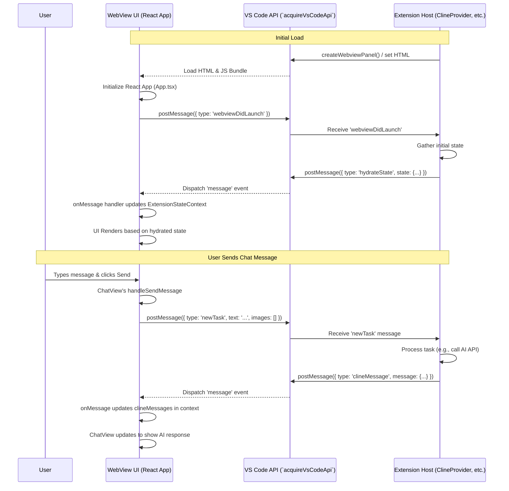

# Chapter 1: WebView UI

Welcome to the Roo-Code tutorial! This first chapter delves into the **WebView UI**, the core visual interface you interact with when using the Roo-Code extension within Visual Studio Code.

## Motivation: A Rich Interface for AI Interaction

Visual Studio Code provides powerful APIs for extending its functionality, but its built-in UI elements (like status bar items, quick picks, or tree views) can be limiting for complex interactions. For an AI coding assistant like Roo-Code, we need a more sophisticated and interactive surface. Imagine trying to manage a chat conversation, configure detailed settings, browse past interactions, or manage external servers using only basic VS Code widgets – it would quickly become cumbersome.

The **WebView UI** solves this by embedding a full web application directly within a VS Code panel (either in the sidebar or as an editor tab). This allows us to leverage modern web development technologies like React and Vite to build a rich, dynamic, and responsive user interface that feels seamlessly integrated into the VS Code environment.

**Central Use Case:** The most prominent example is the **Chat View**. Users need a familiar chat interface to type messages, potentially attach images, send them to the AI, view the streaming response, interact with AI-suggested actions (like running commands or applying code changes), and see the history of the current conversation. The WebView UI provides the necessary flexibility to build this complex interactive experience.

## Key Concepts

Before diving deeper, let's understand the fundamental building blocks:

1.  **WebView Panel:** This is the container provided by the VS Code API. Think of it as an embedded browser window within the editor where we can load and display standard HTML, CSS, and JavaScript. Roo-Code uses a panel typically shown in the sidebar.
2.  **React & Vite:** The UI is built as a single-page application (SPA) using React, a popular JavaScript library for building user interfaces. Vite serves as the build tool and development server, providing fast Hot Module Replacement (HMR) for a smooth development experience.
3.  **Message Protocol:** The WebView runs in an isolated context and cannot directly call VS Code APIs or access the extension's backend code. Communication happens exclusively through a message-passing system. The UI sends messages *to* the extension host using `vscode.postMessage`, and the extension host sends messages *back* to the UI, which are caught by an event listener. This crucial mechanism is detailed in [Chapter 3: Webview/Extension Message Protocol](03_webview_extension_message_protocol.md).
4.  **VS Code Webview UI Toolkit:** To maintain visual consistency with the rest of VS Code, Roo-Code utilizes `@vscode/webview-ui-toolkit/react`. This library provides React components (buttons, text fields, dropdowns, etc.) styled to match the editor's theme. See [Chapter 32: VSCode Webview UI Toolkit Wrappers](32_vscode_webview_ui_toolkit_wrappers.md). Roo-Code also incorporates components from `shadcn/ui` adapted for the WebView context ([Chapter 33: Shadcn/UI Primitives (WebView)](33_shadcn_ui_primitives__webview_.md)).
5.  **UI Areas:** The WebView UI isn't just one screen. It's organized into distinct areas, managed typically through tab-like navigation within the React app:
    *   **Chat View:** The primary interaction area for conversing with the AI ([Chapter 34: Chat UI Components (WebView)](34_chat_ui_components__webview_.md)).
    *   **Settings View:** For configuring API keys, behavior, experimental features, etc. ([Chapter 35: Settings UI Components (WebView)](35_settings_ui_components__webview_.md)).
    *   **History View:** Browsing past tasks/conversations ([Chapter 36: History UI Components (WebView)](36_history_ui_components__webview_.md)).
    *   **Prompts View:** Managing and customizing system prompts and modes ([Chapter 37: Prompts UI Components (WebView)](37_prompts_ui_components__webview_.md)).
    *   **MCP Server Management View:** Interacting with Model Context Protocol servers ([Chapter 38: MCP UI Components (WebView)](38_mcp_ui_components__webview_.md)).

## Using the WebView UI: An Overview

From a user's perspective, the WebView UI appears as a panel within VS Code. But how does it get there and function?

1.  **Creation:** The extension host, specifically the [Chapter 2: ClineProvider](02_clineprovider.md), is responsible for telling VS Code to create and show the WebView panel when needed (e.g., when the Roo-Code sidebar icon is clicked).
2.  **Loading:** The `ClineProvider` provides the initial HTML content for the WebView. This HTML primarily includes script tags to load the JavaScript bundle built by Vite.
3.  **Initialization:** Once the JavaScript loads, `webview-ui/src/index.tsx` runs, bootstrapping the React application defined in `webview-ui/src/App.tsx`.
4.  **State Hydration:** The `App` component immediately sends a `webviewDidLaunch` message to the extension host. The host responds by sending necessary initial state data (like current settings, chat history, etc.) back to the WebView via messages.
5.  **State Management:** The `App` component receives this state and populates the [Chapter 12: ExtensionStateContext](12_extensionstatecontext.md). This React context makes the shared state available to all child components within the UI.
6.  **Rendering:** React components subscribe to the `ExtensionStateContext` and render the UI based on the current state. `App.tsx` handles the logic for switching between the main views (Chat, Settings, History, etc.).
7.  **Interaction:** When a user interacts with the UI (e.g., types in the chat input and clicks "Send"), the corresponding React component (e.g., `ChatTextArea`) captures the event and uses the `vscode.postMessage` function (wrapped in `webview-ui/src/utils/vscode.ts`) to send a message detailing the action (e.g., `{ type: 'newTask', text: '...' }`) to the extension host.
8.  **Updates:** The extension host processes the message, performs actions (like calling an AI API via [Chapter 5: ApiHandler](05_apihandler.md)), and sends update messages back to the WebView (e.g., new chat messages via `{ type: 'clineMessage', ... }`). The `App` component's message listener receives these updates, updates the `ExtensionStateContext`, causing the relevant UI parts to re-render.

## Code Walkthrough

Let's examine some key files that make up the WebView UI.

### Build Configuration (`vite.config.ts`)

```typescript
// --- File: webview-ui/vite.config.ts ---
import { resolve } from "path"
import fs from "fs"

import { defineConfig } from "vite"
import react from "@vitejs/plugin-react"
import tailwindcss from "@tailwindcss/vite"

// Custom plugin to write the server port to a file
const writePortToFile = () => {
	// ... (implementation details) ...
}

// https://vitejs.dev/config/
export default defineConfig({
	plugins: [react(), tailwindcss(), writePortToFile()],
	resolve: {
		alias: { // Aliases for easier imports
			"@": resolve(__dirname, "./src"),
			"@src": resolve(__dirname, "./src"),
			"@roo": resolve(__dirname, "../src"), // Alias to extension source
		},
	},
	build: {
		outDir: "build", // Output directory for production build
		reportCompressedSize: false,
		rollupOptions: { // Control output file naming
			output: {
				entryFileNames: `assets/[name].js`,
				chunkFileNames: `assets/[name].js`,
				assetFileNames: `assets/[name].[ext]`,
			},
		},
	},
	server: { // Development server configuration
		hmr: { // Hot Module Replacement settings
			host: "localhost",
			protocol: "ws",
		},
		cors: { // Allow Cross-Origin requests (needed for communication)
			origin: "*",
			methods: "*",
			allowedHeaders: "*",
		},
	},
	define: { // Define global constants available in the code
		"process.platform": JSON.stringify(process.platform),
		"process.env.VSCODE_TEXTMATE_DEBUG": JSON.stringify(process.env.VSCODE_TEXTMATE_DEBUG),
	},
})
```

**Explanation:**

*   **Plugins:** Uses the official React plugin, Tailwind CSS integration, and a custom plugin (`writePortToFile`) to communicate the dev server port to the extension host for HMR during development.
*   **Aliases:** Sets up convenient path aliases (`@`, `@src`, `@roo`) to simplify imports within the WebView code and allow importing shared types/utilities from the main extension source (`../src`).
*   **Build:** Configures the output directory (`build`) and specifies the naming convention for generated JavaScript and asset files. Disabling `reportCompressedSize` can speed up builds slightly.
*   **Server:** Configures the Vite development server, enabling HMR via WebSockets and setting up CORS rules to allow communication between the WebView (running on `localhost:port`) and the extension host.
*   **Define:** Makes certain environment variables or platform details available within the WebView code at build time.

### Entry Point (`index.tsx`)

```typescript
// --- File: webview-ui/src/index.tsx ---
import { StrictMode } from "react"
import { createRoot } from "react-dom/client"

import "./index.css" // Main CSS file (includes Tailwind)
import App from "./App" // The root React component
import "../../node_modules/@vscode/codicons/dist/codicon.css" // VS Code icons

// Create a React root and render the App component
createRoot(document.getElementById("root")!).render(
	<StrictMode>
		<App />
	</StrictMode>,
)
```

**Explanation:**

*   This is the standard entry point for the React application.
*   It imports necessary styles: the main `index.css` (which imports Tailwind base, components, and utilities) and the VS Code Codicons font.
*   It uses `createRoot` (React 18+) to render the main `App` component into the `div` with the ID `root` in the `index.html` file (used by Vite).
*   `StrictMode` is used to highlight potential problems in the application during development.

### Root Component (`App.tsx`)

```typescript
// --- File: webview-ui/src/App.tsx ---
import { useCallback, useEffect, useRef, useState /* ... */ } from "react"
import { useEvent } from "react-use" // Hook for declarative event listeners
import { QueryClient, QueryClientProvider } from "@tanstack/react-query"

// Internal imports
import { ExtensionMessage } from "@roo/shared/ExtensionMessage" // Shared message types
import TranslationProvider from "./i18n/TranslationContext" // Localization
import { vscode } from "./utils/vscode" // Wrapper for VS Code API
import { telemetryClient } from "./utils/TelemetryClient"
import { ExtensionStateContextProvider, useExtensionState } from "./context/ExtensionStateContext"
// View components
import ChatView, { ChatViewRef } from "./components/chat/ChatView"
import HistoryView from "./components/history/HistoryView"
import SettingsView, { SettingsViewRef } from "./components/settings/SettingsView"
import WelcomeView from "./components/welcome/WelcomeView"
// ... other view imports

type Tab = "settings" | "history" | "mcp" | "prompts" | "chat"

// Map specific extension actions to tabs for navigation
const tabsByMessageAction: Partial<Record<NonNullable<ExtensionMessage["action"]>, Tab>> = {
    // ... mapping ...
}

const App = () => {
	// Get shared state from context
	const { didHydrateState, showWelcome, /* ... other state */ } = useExtensionState()

	// Local state for UI control
	const [tab, setTab] = useState<Tab>("chat") // Current active tab/view
	const [showAnnouncement, setShowAnnouncement] = useState(false)
    // ... other local state

	// Refs to child components (for imperative calls if needed)
	const settingsRef = useRef<SettingsViewRef>(null)
	const chatViewRef = useRef<ChatViewRef>(null)

	// Function to switch tabs, handling unsaved changes in settings
	const switchTab = useCallback((newTab: Tab) => {
        // ... logic to check for unsaved changes before switching ...
		setTab(newTab)
	}, [])

	// Message handler: Receives messages from the extension host
	const onMessage = useCallback((e: MessageEvent) => {
		const message: ExtensionMessage = e.data
		console.log("WebView received message:", message); // Debugging

		// Handle navigation actions
		if (message.type === "action" && message.action) {
			const newTab = tabsByMessageAction[message.action]
			// ... logic to switch tab and potentially scroll to a section ...
			if (newTab) {
                switchTab(newTab);
                // ... handle section scrolling ...
            }
		}

        // Handle specific commands like showing dialogs or accepting input
        if (message.type === "showHumanRelayDialog") {
            // ... update state to show dialog ...
        }
        if (message.type === "acceptInput") {
            chatViewRef.current?.acceptInput(); // Call method on ChatView
        }

        // --- IMPORTANT ---
        // This is where other message types (like 'clineMessage', 'hydrateState')
        // are handled, usually by updating the ExtensionStateContext.
        // The actual update logic resides within the ExtensionStateContextProvider.
	}, [switchTab])

	// Register the message listener using the 'react-use' hook
	useEvent("message", onMessage)

	// Effect to send 'webviewDidLaunch' message once on mount
	useEffect(() => {
        console.log("WebView sending: webviewDidLaunch"); // Debugging
        vscode.postMessage({ type: "webviewDidLaunch" })
    }, [])

    // Effect to initialize telemetry once state is hydrated
    // ... telemetry effect ...

    // Effect to handle showing announcements
    // ... announcement effect ...

	// Don't render anything until the initial state is received
	if (!didHydrateState) {
		return null
	}

	// Render Welcome view or the main tabbed interface
	return showWelcome ? (
		<WelcomeView />
	) : (
		<>
			{/* Conditionally render view components based on the active 'tab' */}
			{tab === "prompts" && <PromptsView onDone={() => switchTab("chat")} />}
			{tab === "mcp" && <McpView onDone={() => switchTab("chat")} />}
			{tab === "history" && <HistoryView onDone={() => switchTab("chat")} />}
			{tab === "settings" && (
				<SettingsView ref={settingsRef} onDone={() => setTab("chat")} /* ... */ />
			)}
			{/* ChatView is always mounted but conditionally hidden to preserve its internal state */}
			<ChatView
				ref={chatViewRef}
				isHidden={tab !== "chat"}
                /* ... other props */
			/>
            {/* Render dialogs like HumanRelayDialog */}
            {/* ... */}
		</>
	)
}

const queryClient = new QueryClient()

// Wrap the main App with necessary context providers
const AppWithProviders = () => (
	<ExtensionStateContextProvider> {/* Provides shared state */}
		<TranslationProvider> {/* Provides localization functions */}
			<QueryClientProvider client={queryClient}> {/* For potential data fetching */}
				<App />
			</QueryClientProvider>
		</TranslationProvider>
	</ExtensionStateContextProvider>
)

export default AppWithProviders
```

**Explanation:**

*   **State Management:** Uses `useState` for local UI state (like the active `tab`) and `useExtensionState` to access the shared state managed by `ExtensionStateContextProvider`.
*   **Message Handling:** The `onMessage` callback is the central point for receiving messages from the extension host. It uses `useEvent` for clean event listener management. This function triggers state updates (via context) or navigation changes based on received messages.
*   **Initialization:** Sends the `webviewDidLaunch` message in a `useEffect` hook to signal readiness to the extension host.
*   **Conditional Rendering:** Renders the `WelcomeView` initially or the main tabbed interface based on the `showWelcome` state. It conditionally renders the different view components (`ChatView`, `SettingsView`, etc.) based on the `tab` state. `ChatView` is kept mounted but hidden to preserve its complex internal state (like user input, ongoing requests).
*   **Context Providers:** Wraps the entire application in providers (`ExtensionStateContextProvider`, `TranslationProvider`, `QueryClientProvider`) to make shared state, localization, and data-fetching capabilities available throughout the component tree.
*   **Refs:** Uses `useRef` to potentially call methods directly on child components (like `chatViewRef.current?.acceptInput()`), although communication primarily relies on state and props.

### UI Component Structure (`components/ui/index.ts` & View Components)

The `webview-ui/src/components/ui/index.ts` file simply re-exports various primitive UI components built using the VS Code Toolkit and Shadcn/UI primitives.

```typescript
// --- File: webview-ui/src/components/ui/index.ts ---
export * from "./alert-dialog"
export * from "./autosize-textarea"
// ... many other components
export * from "./tooltip"
```

The actual view components (`ChatView.tsx`, `SettingsView.tsx`, etc.) are complex React components responsible for their specific area. They follow standard React patterns:

*   Receive necessary data and callbacks as props (e.g., `onDone` in `SettingsView`).
*   Access shared application state via `useExtensionState()`.
*   Manage their own internal state using `useState` and `useRef`.
*   Render UI elements using the primitive components from `@/components/ui` and the VS Code Toolkit components (`<VSCodeButton>`, `<VSCodeCheckbox>`, etc.).
*   Communicate user actions or requests back to the extension host using `vscode.postMessage(...)`.

For instance, in `ChatView.tsx`, sending a message involves:

1.  Reading the input from `ChatTextArea`.
2.  Calling `vscode.postMessage({ type: 'newTask', text: inputValue, images: selectedImages })`.

In `SettingsView.tsx`, saving changes involves:

1.  Reading the current state of all settings fields managed within the component's state (`cachedState`).
2.  Sending multiple `vscode.postMessage` calls, one for each setting being updated (e.g., `{ type: 'alwaysAllowReadOnly', bool: cachedState.alwaysAllowReadOnly }`, `{ type: 'upsertApiConfiguration', ... }`).

## Internal Implementation

Let's trace the flow of information when the WebView UI starts and the user sends a chat message.

**Step-by-Step Flow:**

1.  **Request Panel:** The user clicks the Roo-Code icon. The extension's `activate` function runs, and the [Chapter 2: ClineProvider](02_clineprovider.md) is initialized. It calls `vscode.window.createWebviewPanel(...)`.
2.  **Load Content:** VS Code creates the panel. `ClineProvider` generates the basic HTML (`getHtmlForWebview`) containing `<script>` tags pointing to the Vite-built JS/CSS assets and injects necessary URIs and nonces for resource loading and security.
3.  **Bootstrap React:** The WebView loads the HTML, which in turn loads the `assets/index.js`. This script executes `webview-ui/src/index.tsx`, rendering `AppWithProviders`.
4.  **Signal Readiness:** The `App` component mounts and its `useEffect` hook runs, sending `{ type: 'webviewDidLaunch' }` to the extension host via `vscode.postMessage`.
5.  **Hydrate State:** The extension host's message handler (likely within `ClineProvider`) receives `webviewDidLaunch`. It gathers the initial required state (settings, mode, history snippets, etc.) and sends it back, often via a `{ type: 'hydrateState', state: { ... } }` message.
6.  **Update Context:** The `App` component's `onMessage` listener receives the `hydrateState` message. The logic within `ExtensionStateContextProvider` processes this message and updates the shared React context. The `didHydrateState` flag is set to true.
7.  **Render UI:** Components subscribed to the context (like `App`, `ChatView`, `SettingsView`) re-render now that `didHydrateState` is true and they have the initial data. The main UI (e.g., `ChatView`) becomes visible.
8.  **User Input:** The user types "What is Roo-Code?" into the `ChatTextArea` and clicks "Send".
9.  **Send Message:** The `ChatTextArea`'s `onSend` handler calls `handleSendMessage` in `ChatView`. This function executes `vscode.postMessage({ type: 'newTask', text: 'What is Roo-Code?', images: [] })`.
10. **Process Task:** The extension host receives the `newTask` message. It likely uses [Chapter 4: Cline](04_cline.md) to process the task, potentially involving [Chapter 5: ApiHandler](05_apihandler.md) to call an LLM.
11. **Send Updates:** As the AI responds or actions occur, the extension host sends messages back to the WebView, such as `{ type: 'clineMessage', message: { type: 'say', say: 'text', text: 'Roo-Code is...', ts: ..., partial: true } }` for streaming responses.
12. **Update UI:** `App`'s `onMessage` receives these `clineMessage` updates. The `ExtensionStateContextProvider` updates the `clineMessages` array in the context. `ChatView` re-renders, displaying the new message from the AI.

**Sequence Diagram:**



**Code Dive:**

*   **VS Code API Wrapper (`webview-ui/src/utils/vscode.ts`):** This utility likely acquires the VS Code API instance once and provides a typed wrapper around `postMessage`.

    ```typescript
    // Simplified example
    declare const acquireVsCodeApi: any; // Provided by VS Code environment
    const vsCodeApi = acquireVsCodeApi();

    export const vscode = {
        postMessage: (message: any) => {
            vsCodeApi.postMessage(message);
        },
        // Potentially add getState/setState wrappers if used
    };
    ```

*   **Message Listener (`App.tsx`):** The `useEvent('message', onMessage)` hook efficiently registers the listener. The `onMessage` function acts as a router, delegating actions based on `message.type`. State updates are typically handled within the reducer/logic of `ExtensionStateContextProvider`.

*   **State Hydration (`ExtensionStateContext.tsx` - Conceptual):**

    ```typescript
    // Conceptual reducer logic within ExtensionStateContextProvider
    function reducer(state, action) {
        switch (action.type) {
            case 'message': // Message from extension host
                const message = action.payload;
                if (message.type === 'hydrateState') {
                    return {
                        ...state,
                        ...message.state, // Merge initial state
                        didHydrateState: true,
                    };
                }
                if (message.type === 'clineMessage') {
                    return {
                        ...state,
                        clineMessages: [...state.clineMessages, message.message],
                    };
                }
                // ... other message handlers
                return state;
            // ... other actions
            default:
                return state;
        }
    }
    ```

*   **Sending Messages (`ChatTextArea.tsx` / `ChatView.tsx`):**

    ```typescript
    // Simplified from ChatView.tsx's handleSendMessage
    const handleSendMessage = useCallback((text: string, images: string[]) => {
        if (/* ... */) { // If it's the first message
             vscode.postMessage({ type: "newTask", text, images });
        } else if (clineAsk) { // Responding to a specific prompt from AI
             vscode.postMessage({ type: "askResponse", askResponse: "messageResponse", text, images });
        }
        // ... reset input state ...
    }, [/* dependencies */]);
    ```

## Modification Guidance

The WebView UI is a frequent target for modifications, whether adding features, tweaking layouts, or integrating new data.

**Common Modifications:**

1.  **Adding a New View/Tab:**
    *   **Components:** Create a new folder under `webview-ui/src/components/` (e.g., `diagnostics/`) containing your main view component (`DiagnosticsView.tsx`) and any sub-components.
    *   **State:** Add a new tab identifier (e.g., `'diagnostics'`) to the `Tab` type in `App.tsx`. Update `useState<Tab>` if needed.
    *   **Navigation:** Add a button/link somewhere (perhaps in a shared header or sidebar component if the UI evolves) that calls `switchTab('diagnostics')`. Add a corresponding entry to `tabsByMessageAction` in `App.tsx` if you want the extension host to be able to trigger navigation to this tab.
    *   **Rendering:** Add the new component to the conditional rendering block in `App.tsx`: `{tab === 'diagnostics' && <DiagnosticsView onDone={() => switchTab('chat')} />}`.
    *   **Communication:** Define new message types in `ExtensionMessage` (in `@roo/shared`) for any data the Diagnostics view needs from the extension or actions it needs to trigger. Update the `onMessage` handler in `App.tsx` to receive data for the view (likely updating `ExtensionStateContext`) and implement handlers in the extension host for actions sent *from* the view.
    *   **Context:** If the new view needs shared state, add fields to `ExtensionStateContextType` and update the `ExtensionStateContextProvider` to handle messages related to this new state.

2.  **Modifying an Existing View (e.g., Adding Sorting to History):**
    *   **Component State:** In `HistoryView.tsx` (or its custom hook `useTaskSearch`), add state for the current sort order: `const [sortOption, setSortOption] = useState<SortOption>('newest');`.
    *   **UI:** Add UI elements (like `<VSCodeRadioGroup>`) to allow the user to select the sort option, calling `setSortOption` onChange.
    *   **Logic:** Modify the logic that prepares the `tasks` array for display (in `useTaskSearch`) to sort based on the `sortOption` state *before* passing it to the `Virtuoso` component.
    *   **Communication (Optional):** If sorting requires data not already present (e.g., sorting by relevance might need the extension host to re-fetch/re-score), you would need to send a message (`vscode.postMessage({ type: 'sortHistory', sortBy: sortOption })`) and update the extension host and message protocol accordingly.

**Best Practices:**

*   **Componentization:** Break down views into smaller, reusable components.
*   **Context for Global State:** Use `ExtensionStateContext` for state shared across multiple views. Use local component state (`useState`) for UI state specific to a single component.
*   **Type Safety:** Rely heavily on the shared TypeScript types in `@roo/shared/ExtensionMessage` for `postMessage` calls and the `onMessage` handler.
*   **Use UI Toolkit/Primitives:** Leverage the existing components in `webview-ui/src/components/ui` and `@vscode/webview-ui-toolkit/react` for consistency.
*   **Debounce/Throttle:** For frequent UI events that trigger messages (like typing in a search box), use debouncing or throttling to avoid overwhelming the extension host.

**Potential Pitfalls:**

*   **Over-reliance on `postMessage`:** Sending too many messages frequently can impact performance. Batch updates where possible.
*   **Complex State Logic:** If `App.tsx` or `ExtensionStateContextProvider` becomes too complex, consider refactoring state management (e.g., using dedicated state management libraries like Zustand or Redux Toolkit if justified, though context is often sufficient).
*   **Ignoring Security:** WebViews have security implications. Always use the `webview.asWebviewUri` method in the extension host to correctly format URIs for local resources, and set a strict Content Security Policy (`Content-Security-Policy` meta tag in the generated HTML) to restrict what the WebView can load or execute. Vite and the VS Code WebView template help with this.
*   **Blocking UI:** Long-running computations should happen in the extension host, not in the WebView's JavaScript, to keep the UI responsive.

## Conclusion

The WebView UI provides Roo-Code with a powerful and flexible frontend, built using familiar web technologies (React, Vite, Tailwind). It enables rich interactions for chat, settings, history, and more, seamlessly integrated within the VS Code environment.

Understanding its structure, reliance on the crucial [Webview/Extension Message Protocol](03_webview_extension_message_protocol.md), and use of the [ExtensionStateContext](12_extensionstatecontext.md) is key to comprehending how the user interacts with Roo-Code.

In the next chapter, we will look at the [Chapter 2: ClineProvider](02_clineprovider.md), the component in the extension host responsible for creating, managing, and providing the content for this WebView panel.

