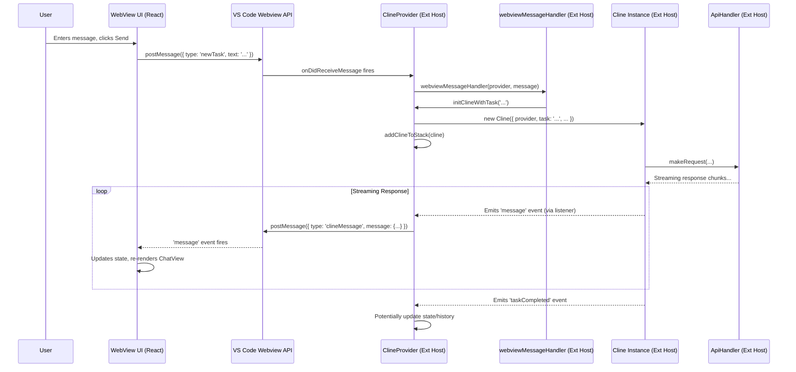

# Chapter 2: ClineProvider

In [Chapter 1: WebView UI](01_webview_ui.md), we explored the React-based frontend that provides the user interface for Roo-Code within VS Code. Now, we turn our attention to the backend component running in the extension host that powers this UI: the **ClineProvider**. It acts as the bridge between the isolated WebView environment and the full capabilities of the VS Code extension API and the user's workspace.

## Motivation: The Brain Behind the UI

The WebView UI, while powerful, runs in a restricted sandbox. It cannot directly access the file system, execute terminal commands, interact with VS Code's editor APIs, or even make arbitrary network requests without mediation. We need a component running in the main extension process (the "extension host") to handle these tasks.

The `ClineProvider` is this central orchestrator. It's responsible for:

1.  **Creating and Managing the WebView:** Telling VS Code when and how to display the Roo-Code panel (sidebar or editor tab).
2.  **Facilitating Communication:** Acting as the intermediary for messages sent between the WebView UI and the extension host, using the protocol detailed in [Chapter 3: Webview/Extension Message Protocol](03_webview_extension_message_protocol.md).
3.  **Managing State:** Holding and distributing the extension's core state, including settings, history, and UI status, often using helpers like [Chapter 11: ContextProxy](11_contextproxy.md).
4.  **Orchestrating Tasks:** Receiving user requests (like chat messages) from the UI and creating/managing instances of [Chapter 4: Cline](04_cline.md) to handle the actual AI interaction and task execution.
5.  **Integrating with VS Code:** Using VS Code APIs for things like showing notifications, accessing the workspace, managing configuration, and interacting with the editor.
6.  **Connecting Services:** Initializing and providing access to various background services like the [Chapter 19: McpHub / McpServerManager](19_mcphub___mcpservermanager.md), [Chapter 9: ProviderSettingsManager](09_providersettingsmanager.md), and [Chapter 10: CustomModesManager](10_custommodesmanager.md).

**Central Use Case:** When a user sends a chat message from the [Chapter 1: WebView UI](01_webview_ui.md), the UI sends a `newTask` message. The `ClineProvider` receives this message, determines the current context (settings, mode, etc.), creates a new [Chapter 4: Cline](04_cline.md) instance to handle this specific task, and then relays the AI's responses (received from the `Cline` instance) back to the WebView UI for display.

## Key Concepts

1.  **`WebviewViewProvider` / `WebviewPanelProvider`:** `ClineProvider` implements the `vscode.WebviewViewProvider` interface (for the sidebar view) or potentially `vscode.WebviewPanelProvider` (if used in an editor tab). This interface requires methods like `resolveWebviewView` which VS Code calls when the view needs to be created or shown.
2.  **Webview Lifecycle Management:** The provider tells VS Code *how* to create the view, provides the initial HTML content (`getHtmlContent`), handles communication setup (`setWebviewMessageListener`), and cleans up resources when the view is closed (`dispose`).
3.  **Communication Hub:** It listens for messages from the WebView via `webview.onDidReceiveMessage` and sends messages back using `webview.postMessage`. The `webviewMessageHandler.ts` file contains much of the logic for handling incoming messages.
4.  **State Management & Synchronization:** `ClineProvider` uses `ContextProxy` to manage persistent global state and secrets. The `getStateToPostToWebview` method gathers all necessary state, and `postStateToWebview` sends it to the UI, ensuring consistency. This state includes API configurations, user preferences, task history snippets, available commands, etc.
5.  **Task Orchestration (`Cline` Instances):** For each distinct user task (e.g., a new chat conversation or a request triggered by a code action), `ClineProvider` creates a dedicated [Chapter 4: Cline](04_cline.md) instance. This isolates the context and state of each task. It manages a stack (`clineStack`) of these instances to handle sub-tasks initiated by the AI.
6.  **VS Code Integration:** It receives the `vscode.ExtensionContext` and `vscode.OutputChannel` in its constructor, allowing it to register disposables, log messages, access global/workspace storage, read configuration, execute commands, and interact with other VS Code APIs.
7.  **Service Integration:** It often serves as the central point for initializing and accessing singleton services required by the extension, such as `McpServerManager` (for external tool integration) and `ProviderSettingsManager` (for managing API key profiles).

## Using ClineProvider: Activation and Interaction Flow

The `ClineProvider` doesn't operate in isolation. It's a key part of the extension's activation and runtime.

1.  **Activation (`extension.ts`):**
    *   When the Roo-Code extension is activated, the `activate` function in `src/extension.ts` creates an instance of `ClineProvider`.
    *   It registers this instance as a `WebviewViewProvider` using `vscode.window.registerWebviewViewProvider`, associating it with the view ID defined in `package.json` (e.g., `roo-cline.SidebarProvider`).
    *   Crucially, it passes the `vscode.ExtensionContext` and an `OutputChannel` to the `ClineProvider` constructor.

2.  **View Resolution (`resolveWebviewView`):**
    *   When the user clicks the Roo-Code icon in the sidebar (or opens the view via command), VS Code calls the `resolveWebviewView` method on the registered `ClineProvider` instance.
    *   Inside `resolveWebviewView`:
        *   The `WebviewView` object is stored (`this.view`).
        *   Webview options are configured (e.g., `enableScripts: true`, `localResourceRoots`).
        *   The initial HTML content is generated (`getHtmlContent` or `getHMRHtmlContent` for development) and set on `webview.html`.
        *   The message listener is set up (`setWebviewMessageListener`) to handle communication from the WebView.
        *   Event listeners for visibility changes and disposal are registered.

3.  **Initial State Sync:**
    *   Once the WebView loads the HTML and its JavaScript bundle runs, the [Chapter 1: WebView UI](01_webview_ui.md) sends a `webviewDidLaunch` message.
    *   The `webviewMessageHandler` (invoked by `setWebviewMessageListener`) receives this message.
    *   It triggers `provider.postStateToWebview()`.
    *   `postStateToWebview` calls `getStateToPostToWebview` to gather all necessary configuration, history, status, etc.
    *   The collected state is sent back to the WebView using `postMessageToWebview({ type: 'state', state: { ... } })`.
    *   The WebView UI receives this state and hydrates its own context, rendering the appropriate view (Welcome, Chat, Settings, etc.).

4.  **Handling User Actions (e.g., New Chat Message):**
    *   User types a message in the WebView and clicks "Send".
    *   The WebView UI sends a message like `{ type: 'newTask', text: '...', images: [...] }`.
    *   `webviewMessageHandler` receives this message.
    *   It calls `provider.initClineWithTask(message.text, message.images)`.
    *   `initClineWithTask` creates a new [Chapter 4: Cline](04_cline.md) instance, passing necessary context (API config, custom instructions, etc.) and the user's input. It adds this new `Cline` instance to the `clineStack`.
    *   The `Cline` instance starts processing the task (e.g., formatting prompts, calling the AI via [Chapter 5: ApiHandler](05_apihandler.md)).

5.  **Relaying AI Responses:**
    *   As the `Cline` instance receives responses from the AI or performs actions, it emits events (e.g., the `message` event containing a `ClineMessage`).
    *   Event listeners within `ClineProvider` (or often directly within the `Cline` instance's setup) capture these events.
    *   The provider formats these updates into `ExtensionMessage` objects (e.g., `{ type: 'clineMessage', message: { ... } }`).
    *   It sends these messages back to the WebView using `postMessageToWebview`.
    *   The WebView UI receives these messages and updates the display (e.g., showing the AI's streaming response).

6.  **Disposal (`dispose`):**
    *   When the view is closed (user closes the sidebar/tab, VS Code shuts down), the `onDidDispose` listener registered in `resolveWebviewView` calls the `ClineProvider`'s `dispose` method.
    *   The `dispose` method cleans up resources: aborts any active `Cline` tasks, disposes of the `WebviewView`, removes event listeners, unregisters from services (like `McpHub`), and clears references.

## Code Walkthrough

Let's look at key parts of the `ClineProvider` implementation.

### Activation (`src/extension.ts`)

```typescript
// --- File: src/extension.ts ---
import * as vscode from "vscode"
// ... other imports
import { ClineProvider } from "./core/webview/ClineProvider"
import { telemetryService } from "./services/telemetry/TelemetryService"
// ... other imports

export async function activate(context: vscode.ExtensionContext) {
	// ... initialization code (output channel, telemetry, i18n) ...

	// Create the core provider instance
	const provider = new ClineProvider(context, outputChannel, "sidebar"); // Pass context and output channel
	telemetryService.setProvider(provider); // Register for telemetry context

	// Register the provider for the sidebar view
	context.subscriptions.push(
		vscode.window.registerWebviewViewProvider(ClineProvider.sideBarId, provider, {
			webviewOptions: { retainContextWhenHidden: true }, // Keep webview alive when hidden
		}),
	);

	// ... register commands, other providers, etc. ...

	return new API(outputChannel, provider, /* ... */); // Export API
}
```

**Explanation:**

*   A single `ClineProvider` instance is created for the sidebar.
*   It's registered with VS Code using `registerWebviewViewProvider`, linking the `ClineProvider.sideBarId` (a static string like `"roo-cline.SidebarProvider"`) to our provider instance.
*   The `retainContextWhenHidden: true` option is crucial for keeping the WebView's state (React app) alive even when the user switches to a different sidebar view.
*   The `provider` instance is often passed to other components (like command handlers or the exported `API`) so they can interact with the WebView and task management.

### Core Logic (`src/core/webview/ClineProvider.ts`)

```typescript
// --- File: src/core/webview/ClineProvider.ts ---
import * as vscode from "vscode";
// ... many imports for services, schemas, utils ...
import { ContextProxy } from "../config/ContextProxy";
import { ProviderSettingsManager } from "../config/ProviderSettingsManager";
import { CustomModesManager } from "../config/CustomModesManager";
import { McpHub } from "../../services/mcp/McpHub";
import { McpServerManager } from "../../services/mcp/McpServerManager";
import WorkspaceTracker from "../../integrations/workspace/WorkspaceTracker";
import { Cline, ClineOptions } from "../Cline";
import { webviewMessageHandler } from "./webviewMessageHandler";
import { ExtensionMessage } from "../../shared/ExtensionMessage";
import { HistoryItem } from "../../shared/HistoryItem";
// ... other imports

export class ClineProvider extends EventEmitter<ClineProviderEvents> implements vscode.WebviewViewProvider {
	// ... static properties (sideBarId, activeInstances) ...
	private disposables: vscode.Disposable[] = [];
	private view?: vscode.WebviewView | vscode.WebviewPanel;
	private clineStack: Cline[] = []; // Stack to manage tasks and subtasks
	private _workspaceTracker?: WorkspaceTracker;
	protected mcpHub?: McpHub;
	// ... public flags (isViewLaunched, settingsImportedAt, latestAnnouncementId) ...
	public readonly contextProxy: ContextProxy;
	public readonly providerSettingsManager: ProviderSettingsManager;
	public readonly customModesManager: CustomModesManager;

	constructor(
		readonly context: vscode.ExtensionContext,
		private readonly outputChannel: vscode.OutputChannel,
		private readonly renderContext: "sidebar" | "editor" = "sidebar",
	) {
		super();
		this.log("ClineProvider instantiated");
		this.contextProxy = new ContextProxy(context); // Handles state persistence
		ClineProvider.activeInstances.add(this);
		telemetryService.setProvider(this); // For contextual telemetry

		this._workspaceTracker = new WorkspaceTracker(this); // Tracks workspace files/context
		this.providerSettingsManager = new ProviderSettingsManager(this.context); // Manages API profiles
		this.customModesManager = new CustomModesManager(this.context, async () => {
			await this.postStateToWebview(); // Update webview if modes change
		});

		// Initialize MCP Hub for external tools
		McpServerManager.getInstance(this.context, this)
			.then((hub) => { this.mcpHub = hub; this.mcpHub.registerClient(); })
			.catch(/* ... error handling ... */);
	}

	async resolveWebviewView(webviewView: vscode.WebviewView | vscode.WebviewPanel) {
		this.log("Resolving webview view");
		if (!this.contextProxy.isInitialized) await this.contextProxy.initialize();

		this.view = webviewView;
		// ... set panel type for commands ...

		// Configure webview options
		webviewView.webview.options = {
			enableScripts: true,
			localResourceRoots: [this.contextProxy.extensionUri],
		};

		// Load appropriate HTML (dev HMR or production build)
		webviewView.webview.html = this.contextProxy.extensionMode === vscode.ExtensionMode.Development
			? await this.getHMRHtmlContent(webviewView.webview)
			: this.getHtmlContent(webviewView.webview);

		// Set up the message listener
		this.setWebviewMessageListener(webviewView.webview);

		// Register disposal and visibility listeners
		// ... (listeners for onDidChangeViewState, onDidDispose, onDidChangeConfiguration) ...

		await this.removeClineFromStack(); // Clear any previous task state on view resolve
		this.log("Webview view resolved");
	}

	// --- HTML Generation ---
	private getHtmlContent(webview: vscode.Webview): string { /* ... generates production HTML ... */ }
	private async getHMRHtmlContent(webview: vscode.Webview): Promise<string> { /* ... generates dev HTML with HMR setup ... */ }

	// --- Communication ---
	private setWebviewMessageListener(webview: vscode.Webview) {
		const onReceiveMessage = async (message: WebviewMessage) => webviewMessageHandler(this, message);
		webview.onDidReceiveMessage(onReceiveMessage, null, this.disposables);
	}

	public async postMessageToWebview(message: ExtensionMessage) {
		await this.view?.webview.postMessage(message);
	}

	// --- State Management ---
	async getState() { /* ... retrieves combined state from ContextProxy and secrets ... */ }

	async getStateToPostToWebview() { /* ... gathers specific state needed by the webview UI ... */ }

	async postStateToWebview() {
		const state = await this.getStateToPostToWebview();
		this.postMessageToWebview({ type: "state", state });
	}

	// --- Task Management (`Cline` Instances) ---
	async addClineToStack(cline: Cline) { /* ... pushes Cline instance onto the stack ... */ }
	async removeClineFromStack() { /* ... pops Cline instance, aborts task, cleans up ... */ }
	getCurrentCline(): Cline | undefined { /* ... returns top of the stack ... */ }
	getClineStackSize(): number { /* ... returns stack size ... */ }
	async finishSubTask(lastMessage: string) { /* ... removes current Cline, resumes parent ... */ }

	public async initClineWithTask(
		task?: string,
		images?: string[],
		parentTask?: Cline,
		options: /* ... */ = {},
	): Promise<Cline> {
		const { /* ... get necessary state (apiConfig, instructions, mode, etc.) ... */ } = await this.getState();
		// ... determine effective instructions ...

		const cline = new Cline({
			provider: this,
			apiConfiguration,
			customInstructions: effectiveInstructions,
			// ... pass other relevant state/options from getState() and method args ...
			task,
			images,
			parentTask,
			rootTask: this.clineStack.length > 0 ? this.clineStack[0] : undefined,
			taskNumber: this.clineStack.length + 1,
			onCreated: (cline) => this.emit("clineCreated", cline), // Emit event when Cline is fully created
			...options,
		});

		await this.addClineToStack(cline); // Add the new task runner to the stack
		this.log(`[subtasks] ${cline.parentTask ? "child" : "parent"} task ${cline.taskId}.${cline.instanceId} instantiated`);
		return cline;
	}

	public async initClineWithHistoryItem(historyItem: HistoryItem & { rootTask?: Cline; parentTask?: Cline }) {
		await this.removeClineFromStack(); // Clear the current task before loading history
		const { /* ... get necessary state ... */ } = await this.getState();
		// ... determine effective instructions ...

		const cline = new Cline({
			provider: this,
			apiConfiguration,
			customInstructions: effectiveInstructions,
			// ... pass other state ...
			historyItem, // Pass the history item to restore state
			rootTask: historyItem.rootTask,
			parentTask: historyItem.parentTask,
			taskNumber: historyItem.number,
			onCreated: (cline) => this.emit("clineCreated", cline),
		});

		await this.addClineToStack(cline);
		this.log(`[subtasks] ${cline.parentTask ? "child" : "parent"} task ${cline.taskId}.${cline.instanceId} instantiated from history`);
		return cline;
	}

	async cancelTask() { /* ... finds current Cline, aborts it, handles state rollback/re-init ... */ }

	// --- Other Methods ---
	async updateApiConfiguration(providerSettings: ProviderSettings) { /* ... updates ContextProxy, updates current Cline's API handler ... */ }
	async updateCustomInstructions(instructions?: string) { /* ... updates global state, updates current Cline's instructions, posts state ... */ }
	async handleModeSwitch(newMode: Mode) { /* ... updates state, potentially loads mode-specific API config, posts state ... */ }
	// ... methods for history management (getTaskWithId, showTaskWithId, deleteTaskWithId) ...
	// ... methods for interacting with services (MCP, Settings Manager) ...
	// ... methods for state persistence helpers (updateGlobalState, getGlobalState) ...
	// ... cleanup logic ...
	async dispose() { /* ... aborts tasks, disposes webview, cleans up listeners & services ... */ }
	// ... logging, telemetry properties ...
}
```

**Explanation:**

*   **Constructor:** Initializes core dependencies like `ContextProxy`, `ProviderSettingsManager`, `CustomModesManager`, `WorkspaceTracker`, and `McpHub`. It registers itself with `TelemetryService`.
*   **`resolveWebviewView`:** Configures the webview, sets its HTML content (using helper methods for dev/prod), and crucially sets up the message listener (`setWebviewMessageListener`).
*   **`setWebviewMessageListener`:** Attaches the core `webviewMessageHandler` function (from `webviewMessageHandler.ts`) to the webview's `onDidReceiveMessage` event. This is the entry point for all messages coming *from* the WebView UI.
*   **`postMessageToWebview`:** A simple utility to send structured `ExtensionMessage` objects *to* the WebView UI.
*   **`getState`, `getStateToPostToWebview`, `postStateToWebview`:** These methods manage the flow of state information *to* the WebView UI, ensuring it has the latest settings, history, etc.
*   **`initClineWithTask`, `initClineWithHistoryItem`:** These are factory methods for creating `Cline` instances. They gather the necessary context (API config, mode, instructions, history) and instantiate `Cline`, which then takes over the specific task execution.
*   **`addClineToStack`, `removeClineFromStack`, `getCurrentCline`:** These manage the stack of active `Cline` instances, enabling sub-task functionality.
*   **`dispose`:** Essential cleanup logic to prevent memory leaks and ensure graceful shutdown.

### Message Handling (`src/core/webview/webviewMessageHandler.ts`)

```typescript
// --- File: src/core/webview/webviewMessageHandler.ts ---
import * as vscode from "vscode";
import { ClineProvider } from "./ClineProvider";
import { WebviewMessage } from "../../shared/WebviewMessage";
// ... many imports for handling specific message types ...

export const webviewMessageHandler = async (provider: ClineProvider, message: WebviewMessage) => {
	// Utility functions for state access
	const getGlobalState = <K extends keyof GlobalState>(key: K) => provider.contextProxy.getValue(key);
	const updateGlobalState = async <K extends keyof GlobalState>(key: K, value: GlobalState[K]) =>
		await provider.contextProxy.setValue(key, value);

	// Main message router
	switch (message.type) {
		case "webviewDidLaunch":
			// Load custom modes first
			await provider.customModesManager.getCustomModes().then(async (customModes) => {
				await updateGlobalState("customModes", customModes);
			});
			// Send initial state, fetch models, etc.
			provider.postStateToWebview();
			provider.workspaceTracker?.initializeFilePaths(); // Don't await
			// ... fetch model lists (OpenRouter, Glama, etc.) and post to webview ...
			provider.isViewLaunched = true; // Mark view as ready
			break;

		case "newTask":
			// Create a new Cline instance to handle the task
			await provider.initClineWithTask(message.text, message.images);
			break;

		case "askResponse":
			// Forward response to the current Cline instance
			provider.getCurrentCline()?.handleWebviewAskResponse(message.askResponse!, message.text, message.images);
			break;

		case "apiConfiguration":
			// Update the API configuration state
			if (message.apiConfiguration) {
				await provider.updateApiConfiguration(message.apiConfiguration);
			}
			await provider.postStateToWebview();
			break;

		case "mode":
			// Handle switching the interaction mode
			await provider.handleModeSwitch(message.text as Mode);
			break;

		case "clearTask":
			// User cancelled/cleared the task from the UI
			await provider.finishSubTask(t("common:tasks.canceled"));
			await provider.postStateToWebview();
			break;

		case "cancelTask":
			// User explicitly clicked a cancel button during task execution
			await provider.cancelTask();
			break;

		case "showTaskWithId":
			// User clicked on a task in the history view
			provider.showTaskWithId(message.text!);
			break;

		case "deleteTaskWithId":
			provider.deleteTaskWithId(message.text!);
			break;

		// ... many other cases for settings changes, file operations, service interactions (MCP, Browser), etc. ...
		// Each case typically involves:
		// 1. Reading data from the message payload.
		// 2. Calling a method on the provider itself (e.g., `provider.updateCustomInstructions`).
		// 3. Updating global state via `updateGlobalState`.
		// 4. Interacting with other services (McpHub, file system utilities).
		// 5. Sending updated state back to the webview via `provider.postStateToWebview()`.
		// 6. Sometimes sending specific messages back via `provider.postMessageToWebview()`.

		default:
			// Optional: Log unhandled messages
			// provider.log(`Unhandled webview message type: ${message.type}`);
			break;
	}
};
```

**Explanation:**

*   This function acts as a large switch statement, routing incoming `WebviewMessage` objects based on their `type`.
*   It uses the `provider` instance passed to it to access state (`getGlobalState`), update state (`updateGlobalState`), interact with `Cline` instances (`provider.getCurrentCline()`), trigger state synchronization (`provider.postStateToWebview()`), and call other provider methods (`provider.initClineWithTask`, `provider.handleModeSwitch`, etc.).
*   Each case handles a specific action originating from the WebView UI, bridging the gap between the UI event and the corresponding extension host logic.

## Internal Implementation

Let's trace the flow when a user sends a chat message.

**Step-by-Step Flow:**

1.  **User Input (WebView):** User types "Explain this code" in the chat input and clicks "Send".
2.  **Message Sent (WebView):** The `ChatView` component calls `vscode.postMessage({ type: 'newTask', text: 'Explain this code', images: [] })`.
3.  **Message Received (Extension Host):** The `ClineProvider`'s webview message listener (`onDidReceiveMessage`) fires.
4.  **Handler Invoked (Extension Host):** The listener calls `webviewMessageHandler(provider, message)`.
5.  **Routing (Extension Host):** Inside `webviewMessageHandler`, the `switch` statement hits the `case 'newTask':` block.
6.  **Task Initialization (Extension Host):** The handler calls `await provider.initClineWithTask('Explain this code', [])`.
7.  **`Cline` Creation (Extension Host):**
    *   `initClineWithTask` gathers the current `apiConfiguration`, `customInstructions`, `mode`, etc., from `provider.getState()`.
    *   It creates `new Cline(...)`, passing the provider reference, state, and the user's `task` text.
    *   It calls `provider.addClineToStack(cline)` to make this the active task.
    *   The `Cline` constructor initializes its own state, including setting up its [Chapter 5: ApiHandler](05_apihandler.md), [Chapter 7: SystemPrompt](07_systemprompt.md), context management ([Chapter 23: Sliding Window Context Management](23_sliding_window_context_management.md)), etc.
8.  **Task Execution (`Cline`):** The newly created `Cline` instance begins its execution flow (e.g., preparing the prompt, calling the AI via `ApiHandler.makeRequest`).
9.  **Response Emission (`Cline`):** As the `Cline` receives data (e.g., streaming text from the AI, tool calls), it emits events like `message` containing `ClineMessage` objects.
10. **Message Relay (Extension Host):** Event listeners (often set up within `Cline` or `ClineProvider`) catch these events. The listener calls `provider.postMessageToWebview({ type: 'clineMessage', message: <ClineMessage> })`.
11. **UI Update (WebView):** The WebView UI's `onMessage` listener receives the `clineMessage`. It updates its state (via `ExtensionStateContext`), causing the `ChatView` component to re-render and display the incoming AI response.

**Sequence Diagram:**



## Modification Guidance

As the central hub, `ClineProvider` and its associated `webviewMessageHandler` are frequent targets for modification.

**Common Modifications:**

1.  **Adding a New Setting:**
    *   **State:** Add the setting to `GlobalState` schema (`src/schemas/globalState.ts`).
    *   **UI:** Add a control in the `SettingsView` component ([Chapter 35: Settings UI Components (WebView)](35_settings_ui_components__webview_.md)) to modify the setting. Add a new `WebviewMessage` type (e.g., `updateMyNewSetting`) in `shared/WebviewMessage.ts`. Have the UI component send this message on change.
    *   **Handler:** Add a `case 'updateMyNewSetting':` to `webviewMessageHandler.ts`. Inside, use `updateGlobalState` to save the new value. Call `provider.postStateToWebview()` to sync.
    *   **Usage:** Access the setting using `provider.getState()` or `getGlobalState` where needed (e.g., passing it to `Cline` during initialization if the task needs it). Update `getStateToPostToWebview` to include the new setting.

2.  **Adding a New Action/Command from the WebView:**
    *   **UI:** Add a button or interaction in the WebView UI.
    *   **Message:** Define a new `WebviewMessage` type (e.g., `performCustomAction`). Have the UI send this message.
    *   **Handler:** Add a `case 'performCustomAction':` to `webviewMessageHandler.ts`. Implement the required logic here, potentially calling VS Code APIs (`vscode.commands.executeCommand`, `vscode.window.showInformationMessage`), interacting with the file system, or calling methods on the current `Cline` instance (`provider.getCurrentCline()?.doSomething(...)`).

3.  **Modifying Task Initialization:**
    *   If a new piece of state needs to be consistently available to *all* tasks, modify `ClineProvider.initClineWithTask` and `ClineProvider.initClineWithHistoryItem`.
    *   Fetch the required state using `await this.getState()`.
    *   Pass the state value into the `Cline` constructor options (`new Cline({ ..., myNewStateValue: value })`).
    *   Update the `ClineOptions` interface and the `Cline` constructor to accept and store this new value.

**Best Practices:**

*   **Keep `webviewMessageHandler` as a Router:** Avoid putting complex logic directly in the `switch` cases. Delegate to methods on `ClineProvider` or dedicated utility functions.
*   **Clear State Ownership:** Use `ContextProxy` for persistent state. `ClineProvider` holds runtime state like the `clineStack` and references to services. `Cline` instances hold task-specific state.
*   **Type Safety:** Leverage the shared `WebviewMessage` and `ExtensionMessage` types for robust communication.
*   **Asynchronous Operations:** Remember that message handling and state updates are often asynchronous. Use `async/await` correctly.
*   **Disposal:** Ensure any resources created or listeners registered are properly disposed of in the `dispose` method or added to the `disposables` array.

**Potential Pitfalls:**

*   **Bloated Handler:** `webviewMessageHandler` can become very large. Consider splitting it logically if it becomes unmanageable.
*   **Race Conditions:** Be mindful of potential race conditions if multiple asynchronous operations modify the same state concurrently (though less common here than in multi-threaded environments).
*   **Error Handling:** Ensure robust error handling within message handlers to prevent the extension host from crashing. Log errors appropriately using the `outputChannel`.
*   **Blocking the Host:** Avoid long-running synchronous operations within message handlers, as this will block the entire extension host, making VS Code unresponsive. Use asynchronous operations or potentially VS Code's progress API for long tasks.

## Conclusion

The `ClineProvider` is the indispensable orchestrator within the Roo-Code extension host. It manages the WebView UI's lifecycle, acts as the crucial communication bridge, maintains the extension's state, and initiates and manages task execution via `Cline` instances. Understanding its role is fundamental to grasping how user interactions in the UI translate into actions within the VS Code environment and interactions with AI models.

With the UI ([Chapter 1: WebView UI](01_webview_ui.md)) and its backend provider (`ClineProvider`) established, we now need to examine the specific language they use to communicate. The next chapter details this vital link: [Chapter 3: Webview/Extension Message Protocol](03_webview_extension_message_protocol.md).

