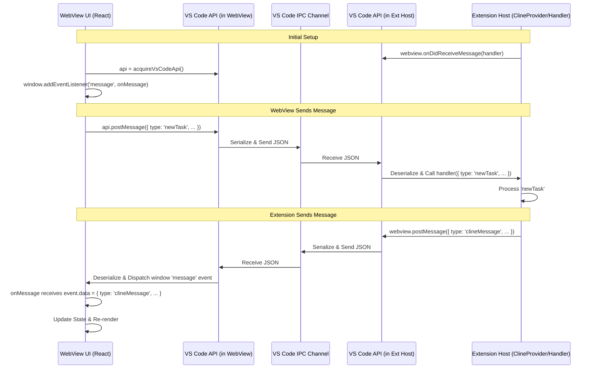

# Chapter 3: Webview/Extension Message Protocol

In the previous chapters, we explored the [Chapter 1: WebView UI](01_webview_ui.md), the React-based frontend, and the [Chapter 2: ClineProvider](02_clineprovider.md), the extension host component that manages it. We mentioned that these two parts communicate via message passing because the WebView runs in an isolated sandbox. This chapter dives deep into the heart of that communication: the **Webview/Extension Message Protocol**.

## Motivation: Bridging the Gap

The fundamental challenge is that the WebView UI (running essentially in a browser frame inside VS Code) cannot directly call functions or access variables within the main extension host process, and vice versa. The extension host has access to VS Code APIs, the file system, network resources, and other backend services, while the WebView UI is primarily concerned with rendering the interface and capturing user input.

To enable interaction, VS Code provides a message-passing mechanism. However, simply sending arbitrary data back and forth can quickly lead to chaos, bugs, and difficulty in maintenance. We need a *protocol* – a defined structure and set of types for the messages exchanged – to ensure reliable, type-safe, and understandable communication.

**Central Use Case:** Consider the core chat interaction.
1.  A user types a message (e.g., "Refactor this function") into the [Chapter 1: WebView UI](01_webview_ui.md) and hits Send.
2.  The UI needs to tell the extension host about this new task.
3.  The extension host (via [Chapter 2: ClineProvider](02_clineprovider.md) and [Chapter 4: Cline](04_cline.md)) processes the request, potentially calling an AI API.
4.  As the AI generates a response (often streaming), the extension host needs to send updates back to the UI for display.
5.  The UI needs to receive these updates and render them appropriately (e.g., show streaming text, display code blocks, enable action buttons).

The Webview/Extension Message Protocol defines exactly *how* these messages are structured for each step, ensuring both sides understand what the other is saying.

## Key Concepts

1.  **Two Directions:** The protocol defines two main message types based on the direction of communication:
    *   **`WebviewMessage`:** Sent *from* the WebView UI *to* the Extension Host. These typically represent user actions, UI events, or requests for data/action from the backend.
    *   **`ExtensionMessage`:** Sent *from* the Extension Host *to* the WebView UI. These typically convey state updates, data requested by the UI, responses from backend processes (like AI output), or commands for the UI (like triggering navigation).

2.  **Message Structure:** Both `WebviewMessage` and `ExtensionMessage` follow a common pattern: an object with a `type` property (a string literal indicating the message's purpose) and an optional payload containing relevant data.
    ```typescript
    // General Structure
    interface BaseMessage {
      type: string; // Discriminator
      // Optional payload fields specific to the type
      text?: string;
      bool?: boolean;
      value?: number;
      payload?: any;
      // ... and many others
    }
    ```

3.  **Payloads:** The specific fields included alongside the `type` depend entirely on the message's purpose. For example, a `newTask` message needs the user's input text, while a `state` message contains a large object representing the entire UI state.

4.  **Serialization:** Because messages pass between different execution contexts (the WebView's sandboxed renderer process and the extension host's Node.js process), they *must* be serializable to JSON. This means you can only send primitive types, plain objects, and arrays. Complex objects like class instances, functions, or Maps/Sets cannot be sent directly and must be converted to a serializable format first.

5.  **TypeScript Definitions:** The cornerstone of the protocol's reliability is the use of shared TypeScript definitions. The types `WebviewMessage` and `ExtensionMessage` (and associated sub-types and interfaces) are defined in shared files (`src/shared/WebviewMessage.ts` and `src/shared/ExtensionMessage.ts`). Both the WebView UI code (React) and the extension host code (TypeScript/Node.js) import these definitions. This provides:
    *   **Type Safety:** TypeScript can check at compile time that messages being sent have the correct structure and that message handlers correctly interpret the payload based on the `type`.
    *   **IntelliSense:** Developers get autocompletion and type hints when constructing or handling messages.
    *   **Single Source of Truth:** The shared files act as the definitive specification for the protocol.

6.  **Example Message Types:**
    *   **`WebviewMessage` (UI -> Extension):**
        *   `{ type: 'webviewDidLaunch' }`: Sent by the UI when it first loads, signaling readiness to receive state.
        *   `{ type: 'newTask', text: string, images?: string[] }`: User submitted a new chat message or task.
        *   `{ type: 'apiConfiguration', apiConfiguration: ApiConfiguration }`: User updated API settings in the UI.
        *   `{ type: 'askResponse', askResponse: ClineAskResponse, text?: string, images?: string[] }`: User responded to a question asked by the AI (e.g., clicked Yes/No, provided text input).
        *   `{ type: 'mode', text: Mode }`: User selected a different interaction mode.
        *   `{ type: 'clearTask' }`: User clicked a button to clear the current chat/task.
        *   `{ type: 'showTaskWithId', text: string }`: User clicked an item in the history view.
        *   `{ type: 'openFile', text: string, values?: { create?: boolean, content?: string } }`: User clicked a link/button to open a file mentioned in the chat.
        *   `{ type: 'updateExperimental', values: { [key in ExperimentId]?: boolean } }`: User toggled an experimental feature flag.
    *   **`ExtensionMessage` (Extension -> UI):**
        *   `{ type: 'state', state: ExtensionState }`: Sends the complete UI state, used for initial hydration and major updates. `ExtensionState` is a large object containing settings, history snippets, current messages, mode, etc.
        *   `{ type: 'clineMessage', message: ClineMessage }`: Sends a single message part of the ongoing conversation (e.g., AI text, status update, tool execution result). `ClineMessage` is itself a discriminated union type (e.g., `say`, `ask`, `tool_progress`).
        *   `{ type: 'action', action: 'focusInput' | 'didBecomeVisible' | ... }`: Instructs the UI to perform a specific action, like focusing the chat input box or navigating to a specific tab.
        *   `{ type: 'theme', text: string }`: Sends the current VS Code theme information (as JSON string).
        *   `{ type: 'mcpServers', mcpServers: McpServer[] }`: Sends the list of available Model Context Protocol servers.
        *   `{ type: 'enhancedPrompt', text?: string }`: Sends the result of enhancing a user's prompt.
        *   `{ type: 'commitSearchResults', commits: GitCommit[] }`: Sends results from a Git commit search.
        *   `{ type: 'browserConnectionResult', success: boolean, text?: string, values?: { endpoint?: string } }`: Sends the result of testing the connection to the browser debugging port.

## Using the Protocol: The Chat Example Revisited

Let's trace the central use case ("User sends a chat message") focusing specifically on the messages exchanged according to the protocol:

1.  **User Sends Message (WebView UI):**
    *   The user types "Refactor this function" into `ChatTextArea`.
    *   The `ChatView` component's `handleSendMessage` function is called.
    *   It calls the `vscode.postMessage` wrapper utility.
    *   **Message Sent:** `vscode.postMessage({ type: 'newTask', text: 'Refactor this function', images: [] })`
    *   This is a `WebviewMessage`. The VS Code API serializes this object to JSON.

2.  **Extension Receives Message (Extension Host):**
    *   The `ClineProvider` has previously set up a listener using `webview.onDidReceiveMessage(webviewMessageHandler)`.
    *   The VS Code API deserializes the JSON back into a JavaScript object.
    *   The `webviewMessageHandler` function is invoked with the `message` object: `{ type: 'newTask', text: 'Refactor this function', images: [] }`.
    *   The `switch (message.type)` statement routes to the `case 'newTask':` block.
    *   This block calls `provider.initClineWithTask(message.text, message.images)`, starting the backend processing via a [Chapter 4: Cline](04_cline.md) instance.

3.  **Extension Sends Updates (Extension Host):**
    *   The `Cline` instance starts processing. It might first want to indicate activity.
    *   The `Cline` instance (or `ClineProvider` listening to it) calls `provider.postMessageToWebview(...)`.
    *   **Message Sent:** `provider.postMessageToWebview({ type: 'clineMessage', message: { type: 'say', say: 'status', text: 'Thinking...', ts: Date.now() } })`
    *   This is an `ExtensionMessage`. The `message` payload is a `ClineMessage` of type `say` with subtype `status`. VS Code serializes it.
    *   Later, as the AI streams a response chunk:
    *   **Message Sent:** `provider.postMessageToWebview({ type: 'clineMessage', message: { type: 'say', say: 'text', text: 'Okay, here is the refactored code:', partial: true, ts: Date.now() } })`
    *   Another `ExtensionMessage` with a `clineMessage` payload, this time `say` subtype `text`, marked as `partial`. VS Code serializes it.
    *   Final part of the text stream:
    *   **Message Sent:** `provider.postMessageToWebview({ type: 'clineMessage', message: { type: 'say', say: 'text', text: '\n```typescript\n// refactored code...\n```', ts: Date.now() } })`
    *   Another `ExtensionMessage`, `clineMessage` payload, `say` subtype `text`, *not* partial. VS Code serializes it.

4.  **UI Receives Updates (WebView UI):**
    *   The `App` component's message listener (`useEvent('message', onMessage)`) receives the 'message' events dispatched by the VS Code API.
    *   The `onMessage` handler receives the deserialized `ExtensionMessage` objects.
    *   For each `{ type: 'clineMessage', ... }` message:
        *   The handler (likely via the `ExtensionStateContextProvider` logic) processes the `message.message` payload.
        *   It updates the `clineMessages` array within the React context state.
    *   React detects the state change in `ExtensionStateContext`.
    *   Components subscribed to the context (like `ChatView` and its children) re-render, displaying the new status message and the streaming AI response text.

This structured exchange, defined by the `WebviewMessage` and `ExtensionMessage` types, ensures both sides know what to expect and how to interpret the data.

## Code Blocks & Walkthrough

Let's look at the code definitions and usage patterns.

### Shared Type Definitions

These files are the single source of truth for the protocol.

```typescript
// --- File: src/shared/WebviewMessage.ts ---
import { z } from "zod" // Often used for payload validation schemas
import { ApiConfiguration, ApiProvider } from "./api"
import { Mode, PromptComponent, ModeConfig } from "./modes"

export type ClineAskResponse = "yesButtonClicked" | "noButtonClicked" | "messageResponse"
export type PromptMode = Mode | "enhance" // Used for specific prompt contexts
export type AudioType = "notification" | "celebration" | "progress_loop"

// The main discriminated union for messages FROM Webview TO Extension
export interface WebviewMessage {
	type:
		// Lifecycle & Core Actions
		| "webviewDidLaunch"
		| "newTask"          // Send a new chat message/task
		| "askResponse"      // Respond to an AI question
		| "clearTask"        // Clear the current chat UI
		| "cancelTask"       // Request cancellation of the running backend task
		// Settings & Configuration
		| "apiConfiguration" // Update the main API config
		| "customInstructions"
		| "allowedCommands"
		| "alwaysAllowReadOnly"
		| "alwaysAllowWrite"
		| "alwaysAllowExecute"
		| "alwaysAllowBrowser"
		| "alwaysAllowMcp"
		| "alwaysAllowModeSwitch"
		| "alwaysAllowSubtasks"
		| "mode"             // Change the interaction mode
		| "updateExperimental"
		| "telemetrySetting"
		| "language"
		// History & Task Management
		| "showTaskWithId"
		| "deleteTaskWithId"
		| "deleteMultipleTasksWithIds"
		| "exportCurrentTask"
		| "exportTaskWithId"
		| "deleteMessage"    // Delete a specific message from the chat history
		| "checkpointDiff"   // User interacted with a diff checkpoint
		| "checkpointRestore"
		// UI Actions & Data Requests
		| "selectImages"     // User wants to attach images
		| "openImage"        // Clicked on an image in chat
		| "openFile"         // Clicked on a file link in chat
		| "openMention"      // Clicked on a mention (@file, @symbol)
		| "playSound"
		| "playTts"
		| "stopTts"
		| "refreshOpenRouterModels" // Request model list refresh
		| "requestOllamaModels"
		| "searchCommits"
		| "searchFiles"
		// Settings Management
		| "importSettings"
		| "exportSettings"
		| "resetState"
		| "saveApiConfiguration" // Save a named API config profile
		| "upsertApiConfiguration"
		| "renameApiConfiguration"
		| "loadApiConfiguration" // Load a named API config profile
		| "deleteApiConfiguration"
		| "getListApiConfiguration"
		| "toggleApiConfigPin"
		// MCP (Model Context Protocol)
		| "openMcpSettings"
		| "openProjectMcpSettings"
		| "restartMcpServer"
		| "toggleToolAlwaysAllow"
		| "toggleMcpServer"
		| "updateMcpTimeout"
		| "deleteMcpServer"
		// Prompt Management
		| "updatePrompt"
		| "updateSupportPrompt"
		| "resetSupportPrompt"
		| "getSystemPrompt"     // Request preview of system prompt
		| "copySystemPrompt"
		| "enhancePrompt"       // Request AI enhancement of user input
		// Human Relay
		| "humanRelayResponse"
		| "humanRelayCancel"
		// Browser Tool
		| "testBrowserConnection"
		// ... other specific types for various features
		; // Semicolon marks the end of the union members

	// Optional payload fields - presence depends on 'type'
	text?: string // Generic text payload (e.g., user input, file path, mode name)
	images?: string[] // Base64 encoded image data URIs
	apiConfiguration?: ApiConfiguration // Full API config object
	askResponse?: ClineAskResponse // Which button was clicked / message provided
	bool?: boolean // Generic boolean flag
	value?: number // Generic number value
	commands?: string[] // List of allowed commands
	ids?: string[] // List of task IDs for batch operations
	audioType?: AudioType // Type of sound to play
	serverName?: string // MCP server name
	toolName?: string // MCP tool name
	alwaysAllow?: boolean // Flag for MCP tool approval
	mode?: Mode // Selected mode slug
	promptMode?: PromptMode // Specific mode context for prompts
	customPrompt?: PromptComponent // Custom prompt definition
	query?: string // Search query
	slug?: string // Custom mode slug
	modeConfig?: ModeConfig // Full custom mode configuration
	timeout?: number // MCP server timeout
	payload?: WebViewMessagePayload // Specific structured payload (e.g., for checkpoints)
	source?: "global" | "project" // Source of MCP server config
	requestId?: string // ID for correlating requests/responses (e.g., file search)
	hasSystemPromptOverride?: boolean // Flag for system prompt preview
	values?: Record<string, any> // Generic object for multiple values (e.g., experimental flags)
	// ... other specific payload fields
}

// Example of a specific payload schema using Zod
export const checkoutDiffPayloadSchema = z.object({ /* ... */ });
export type CheckpointDiffPayload = z.infer<typeof checkoutDiffPayloadSchema>;
// ... other specific payload types

export type WebViewMessagePayload = CheckpointDiffPayload | CheckpointRestorePayload;
```

```typescript
// --- File: src/shared/ExtensionMessage.ts ---
import {
	// Import many base types used within the state and messages
	ModelInfo, GlobalSettings, ApiConfigMeta, ProviderSettings as ApiConfiguration,
	HistoryItem, ModeConfig, TelemetrySetting, ExperimentId,
	ClineAsk, ClineSay, ToolProgressStatus, ClineMessage, // ClineMessage is crucial
} from "../schemas" // Assuming schemas define these base types
import { McpServer } from "./mcp"
import { GitCommit } from "../utils/git"
import { Mode } from "./modes"

// The main discriminated union for messages FROM Extension TO Webview
export interface ExtensionMessage {
	type:
		// Core State & Lifecycle
		| "state"              // Sends the entire UI state snapshot
		| "action"             // Instructs UI to perform an action (navigate, focus)
		| "theme"              // Sends current theme info
		| "workspaceUpdated"   // Signals changes in workspace files/tabs
		| "acceptInput"        // Signals that the chat input should be accepted (after AI 'ask')
		// Chat & Task Messages
		| "clineMessage"       // A message part of the current conversation (AI text, status, tool use)
		| "partialMessage"     // (Potentially deprecated in favor of partial flag in clineMessage)
		| "currentCheckpointUpdated" // Signals update related to diff checkpoints
		// Data Updates
		| "selectedImages"     // Sends base64 images selected via VS Code dialog
		| "ollamaModels"
		| "lmStudioModels"
		| "vsCodeLmModels"
		| "openRouterModels"
		| "glamaModels"
		| "unboundModels"
		| "requestyModels"
		| "openAiModels"
		| "mcpServers"         // Updated list of MCP servers
		| "commitSearchResults"
		| "fileSearchResults"
		| "listApiConfig"      // Updated list of saved API config profiles
		| "vsCodeLmApiAvailable"
		// Prompt Related
		| "enhancedPrompt"     // Result of prompt enhancement request
		| "systemPrompt"       // Result of system prompt preview request
		// UI Control & Feedback
		| "invoke"             // (Potentially less used, maybe for direct UI manipulation)
		| "showHumanRelayDialog"// Instruct UI to show the Human Relay input dialog
		| "browserConnectionResult" // Feedback from testing browser connection
		| "ttsStart"           // Text-to-speech playback started
		| "ttsStop"            // Text-to-speech playback stopped
		; // Semicolon marks the end of the union members

	// Optional payload fields - presence depends on 'type'
	text?: string             // Generic text payload (theme JSON, prompt text)
	action?:                  // Specific UI action to perform
		| "chatButtonClicked" // (Likely sent TO extension, maybe used for echo?)
		| "mcpButtonClicked"
		| "settingsButtonClicked"
		| "historyButtonClicked"
		| "promptsButtonClicked"
		| "didBecomeVisible"   // Panel became visible
		| "focusInput"         // Focus the chat input
		;
	invoke?: "newChat" | "sendMessage" | "primaryButtonClick" | "secondaryButtonClick" | "setChatBoxMessage";
	state?: ExtensionState    // The full state payload for 'state' type
	images?: string[]         // Base64 image URIs for 'selectedImages'
	// Model lists
	ollamaModels?: string[]
	lmStudioModels?: string[]
	vsCodeLmModels?: { /* ... */ }[]
	openRouterModels?: Record<string, ModelInfo>
	// ... other model lists
	filePaths?: string[]      // List of workspace file paths
	openedTabs?: Array<{ /* ... */ }> // List of currently open editor tabs
	clineMessage?: ClineMessage // The core chat message payload for 'clineMessage'
	mcpServers?: McpServer[]
	commits?: GitCommit[]
	listApiConfig?: ApiConfigMeta[]
	mode?: Mode               // Current mode (often part of 'state', but maybe sent separately)
	customMode?: ModeConfig
	slug?: string
	success?: boolean         // Generic success/failure flag
	values?: Record<string, any> // Generic data object
	requestId?: string        // ID for correlating responses (e.g., file search, human relay)
	promptText?: string       // Text for human relay dialog
	results?: Array<{ /* ... */ }> // File search results
	error?: string            // Error message text
}

// Defines the structure of the main state object sent via the 'state' message
export type ExtensionState = Pick<GlobalSettings, /* ... many properties ... */> & {
	version: string
	clineMessages: ClineMessage[] // The current list of messages in the chat
	currentTaskItem?: HistoryItem // Details of the task loaded from history (if any)
	apiConfiguration?: ApiConfiguration // The currently active API configuration
	// ... many other runtime state properties needed by the UI ...
	shouldShowAnnouncement: boolean
	taskHistory: HistoryItem[] // Snippets of recent tasks for the history view
	experiments: Record<ExperimentId, boolean>
	mode: Mode
	customModes: ModeConfig[]
	cwd?: string // Current working directory
	telemetrySetting: TelemetrySetting
	// ... and more
};

// Re-exporting ClineMessage types for clarity, as they are key payloads
export type { ClineMessage, ClineAsk, ClineSay };
```

**Explanation:**

*   **Discriminated Unions:** Both `WebviewMessage` and `ExtensionMessage` are defined as TypeScript discriminated unions using the `type` property. This allows TypeScript to narrow down the possible shape of the message object based on the value of `type`.
*   **Payload Fields:** Notice the numerous optional fields (`text?`, `images?`, `apiConfiguration?`, etc.). Which fields are actually present and required depends on the specific `type`. For example, if `type` is `'newTask'`, the `text` field is expected. If `type` is `'state'`, the `state` field containing an `ExtensionState` object is expected.
*   **Shared Location:** These files reside in `src/shared/`, making them accessible for import by both the extension host code (`src/`) and the WebView UI code (`webview-ui/`).
*   **`ExtensionState`:** This large interface defines the snapshot of data the UI needs to render itself. It's sent initially via the `state` message and potentially resent when major configuration changes occur.

### Sending Messages

**From WebView UI (React):**

```typescript
// --- File: webview-ui/src/utils/vscode.ts ---
import { WebviewMessage } from "@roo/shared/WebviewMessage" // Import the shared type
import type { WebviewApi } from "vscode-webview"

class VSCodeAPIWrapper {
	private readonly vsCodeApi: WebviewApi<unknown> | undefined;

	constructor() {
		if (typeof acquireVsCodeApi === "function") {
			// Get the special API object provided by VS Code to the webview
			this.vsCodeApi = acquireVsCodeApi();
		}
	}

	// Method to send messages TO the extension host
	public postMessage(message: WebviewMessage) { // Takes the shared type
		if (this.vsCodeApi) {
			// Use the official API method
			this.vsCodeApi.postMessage(message);
		} else {
			// Fallback for development outside VS Code (logs to console)
			console.log("WebView Message:", message);
		}
	}
	// ... getState/setState methods ...
}

// Export a singleton instance
export const vscode = new VSCodeAPIWrapper();

// --- Usage in a React component (e.g., ChatView.tsx) ---
import { vscode } from "../utils/vscode";

// ... inside component logic ...
const handleSend = (inputText: string, attachedImages: string[]) => {
    // Construct the message object according to the WebviewMessage type
    const message: WebviewMessage = {
        type: 'newTask',
        text: inputText,
        images: attachedImages,
    };
    // Send the message
    vscode.postMessage(message);
};
```

**Explanation:**

*   The `vscode.ts` utility wraps the `acquireVsCodeApi()` function provided by the VS Code environment within the webview.
*   The `postMessage` method is strongly typed to accept only valid `WebviewMessage` objects.
*   Components import the `vscode` utility and call `vscode.postMessage()` with a correctly structured message object.

**From Extension Host (Node.js):**

```typescript
// --- File: src/core/webview/ClineProvider.ts ---
import * as vscode from "vscode";
import { ExtensionMessage, ExtensionState } from "../../shared/ExtensionMessage"; // Import shared types
import { ClineMessage } from "../../schemas";

export class ClineProvider implements vscode.WebviewViewProvider {
	private view?: vscode.WebviewView | vscode.WebviewPanel;
	// ... other properties ...

	// Method to send messages TO the webview UI
	public async postMessageToWebview(message: ExtensionMessage) { // Takes the shared type
		// Use the webview object provided by VS Code in resolveWebviewView
		await this.view?.webview.postMessage(message);
	}

	// Example: Sending state
	async postStateToWebview() {
		const state: ExtensionState = await this.getStateToPostToWebview(); // Gather state
		// Construct the message object
		const message: ExtensionMessage = { type: "state", state: state };
		this.postMessageToWebview(message);
	}

	// Example: Sending a chat message chunk
	sendChatMessage(chatMsg: ClineMessage) {
		// Construct the message object
		const message: ExtensionMessage = { type: "clineMessage", clineMessage: chatMsg };
		this.postMessageToWebview(message);
	}

	// ... rest of the class ...
}
```

**Explanation:**

*   The `ClineProvider` holds a reference to the `WebviewView` or `WebviewPanel` object (`this.view`).
*   The `postMessageToWebview` method uses `this.view.webview.postMessage()` to send messages.
*   This method is strongly typed to accept only valid `ExtensionMessage` objects.
*   Other methods within the provider construct the appropriate `ExtensionMessage` object based on the shared types before calling `postMessageToWebview`.

### Receiving Messages

**In Extension Host (Node.js):**

```typescript
// --- File: src/core/webview/ClineProvider.ts ---
import * as vscode from "vscode";
import { WebviewMessage } from "../../shared/WebviewMessage"; // Import shared type
import { webviewMessageHandler } from "./webviewMessageHandler"; // Import the handler function

export class ClineProvider implements vscode.WebviewViewProvider {
	// ... other properties and methods ...
	private disposables: vscode.Disposable[] = [];

	async resolveWebviewView(webviewView: vscode.WebviewView | vscode.WebviewPanel) {
		this.view = webviewView;
		// ... other setup ...

		// Set up the listener for messages FROM the webview
		this.setWebviewMessageListener(webviewView.webview);
	}

	private setWebviewMessageListener(webview: vscode.Webview) {
		// Define the callback function, ensuring it receives the correct type
		const onReceiveMessage = async (message: WebviewMessage) => {
            console.log("Extension received message:", message); // Debugging
            // Delegate handling to a dedicated function/module
            await webviewMessageHandler(this, message);
        };
        // Register the listener
		webview.onDidReceiveMessage(
            onReceiveMessage,
            null, // `thisArg` (usually null or undefined if handler is bound or uses `this` passed in)
            this.disposables // Array to collect disposables for cleanup
        );
	}
	// ... rest of the class ...
}

// --- File: src/core/webview/webviewMessageHandler.ts ---
import { ClineProvider } from "./ClineProvider";
import { WebviewMessage } from "../../shared/WebviewMessage"; // Import shared type

// The main handler function, using a switch statement for routing
export const webviewMessageHandler = async (provider: ClineProvider, message: WebviewMessage) => {
	switch (message.type) {
		case "webviewDidLaunch":
			provider.log("Webview launched, sending initial state.");
			await provider.postStateToWebview();
			// ... other init actions ...
			break;

		case "newTask":
            provider.log(`Received new task: ${message.text?.substring(0, 50)}...`);
			// Ensure text exists before using it (though type implies it should)
            if (message.text !== undefined) {
			    await provider.initClineWithTask(message.text, message.images);
            }
			break;

        case "apiConfiguration":
             provider.log("Received API configuration update.");
             if (message.apiConfiguration) {
                 await provider.updateApiConfiguration(message.apiConfiguration);
                 await provider.postStateToWebview(); // Send updated state back
             }
             break;

		// ... cases for all other WebviewMessage types ...

		default:
			// Optional: Log unhandled message types for debugging
			// const exhaustiveCheck: never = message; // Ensures all types are handled
            provider.log(`Unhandled webview message type: ${(message as any).type}`);
			break;
	}
};
```

**Explanation:**

*   In `resolveWebviewView`, the `webview.onDidReceiveMessage` method is used to register a listener.
*   The listener callback (`onReceiveMessage`) is typed to receive `WebviewMessage` objects.
*   It's best practice to delegate the handling logic to a separate function (`webviewMessageHandler`) to keep `ClineProvider` cleaner.
*   `webviewMessageHandler` uses a `switch` statement on `message.type` to route the message to the appropriate handling logic. TypeScript's type narrowing works effectively here.

**In WebView UI (React):**

```typescript
// --- File: webview-ui/src/App.tsx ---
import { useCallback, useEffect /* ... */ } from "react";
import { useEvent } from "react-use"; // Utility hook for event listeners
import { ExtensionMessage } from "@roo/shared/ExtensionMessage"; // Import shared type
import { useExtensionStateActions } from "./context/ExtensionStateContext"; // Actions to update state

const App = () => {
    // Get action dispatcher from context to update state
	const { handleExtensionMessage } = useExtensionStateActions();

	// Define the message handling callback
	const onMessage = useCallback(
		(event: MessageEvent) => {
			// Ensure the data conforms to the expected type
			const message = event.data as ExtensionMessage;
            console.log("WebView received message:", message); // Debugging

            // Delegate processing to the state context logic
            handleExtensionMessage(message);

            // Handle specific UI actions directly if needed
            if (message.type === 'action') {
                if (message.action === 'focusInput') {
                    // Find the input element and focus it
                    document.getElementById('chat-input')?.focus();
                }
                // ... handle other actions like navigation ...
            }
            if (message.type === 'acceptInput') {
                // Maybe call a method on a child component via ref
                chatViewRef.current?.acceptInput();
            }
		},
		[handleExtensionMessage] // Dependency array for useCallback
	);

	// Register the listener when the component mounts
	useEvent("message", onMessage, window); // Listen on the window object

	// Effect to send 'webviewDidLaunch' on initial mount
	useEffect(() => {
        console.log("WebView sending: webviewDidLaunch");
        vscode.postMessage({ type: "webviewDidLaunch" });
    }, []); // Empty dependency array ensures this runs only once

	// ... rest of the component ...
}

// --- File: webview-ui/src/context/ExtensionStateContext.tsx ---
// Conceptual example of handling within the context provider/reducer

const useExtensionStateActions = () => {
    const dispatch = useSharedDispatch(); // Assuming a useReducer setup

    const handleExtensionMessage = useCallback((message: ExtensionMessage) => {
        // Send message to reducer or handle directly
        dispatch({ type: 'HANDLE_EXTENSION_MESSAGE', payload: message });
    }, [dispatch]);

    return { handleExtensionMessage };
};

function stateReducer(state: ExtensionState, action: any): ExtensionState {
    if (action.type === 'HANDLE_EXTENSION_MESSAGE') {
        const message = action.payload as ExtensionMessage;
        switch (message.type) {
            case 'state':
                // Replace state entirely or merge carefully
                return { ...state, ...message.state, didHydrateState: true };
            case 'clineMessage':
                // Append the new message to the existing list
                return {
                    ...state,
                    clineMessages: [...state.clineMessages, message.clineMessage!],
                };
            case 'theme':
                // Update theme information
                // return { ...state, themeInfo: JSON.parse(message.text!) };
                // Actual theme handling might be different
                return state;
             case 'mcpServers':
                return { ...state, mcpServers: message.mcpServers };
            // ... cases for all other relevant ExtensionMessage types ...
            default:
                return state;
        }
    }
    // ... handle other action types specific to UI state changes ...
    return state;
}
```

**Explanation:**

*   The `App` component uses the `useEvent` hook (from `react-use`) or a standard `useEffect` with `window.addEventListener` to listen for `'message'` events on the `window` object.
*   The event handler callback (`onMessage`) receives the `MessageEvent`, and its `data` property contains the deserialized `ExtensionMessage` object.
*   It's crucial to cast `event.data` to the expected `ExtensionMessage` type.
*   The handler delegates most state updates to the logic within the `ExtensionStateContextProvider` (shown conceptually via `handleExtensionMessage` and a reducer). This keeps the `App` component focused on rendering and top-level event handling.
*   Specific UI-only actions (like focusing an input) might be handled directly in the `onMessage` callback or delegated via refs.

## Internal Implementation

The magic behind this communication lies in the APIs provided by VS Code specifically for WebViews.

**Walkthrough:**

1.  **Setup (Extension Host):** When `ClineProvider.resolveWebviewView` runs, it gets a `Webview` object. It sets `webview.options = { enableScripts: true, ... }` and provides HTML content. Crucially, it calls `webview.onDidReceiveMessage(handler)`. This tells the VS Code framework to call the provided `handler` function whenever a message arrives *from* this specific WebView instance.
2.  **Setup (WebView UI):** Inside the WebView's JavaScript context, the special function `acquireVsCodeApi()` is available globally. The `webview-ui/src/utils/vscode.ts` wrapper calls this function *once* to get a persistent API object. This object has a `postMessage(message)` method.
3.  **Sending (WebView -> Extension):** When `vscode.postMessage(message)` is called in the UI:
    *   The `message` object (which must be a valid `WebviewMessage`) is serialized into a JSON string by the VS Code framework.
    *   This JSON string is sent via an internal IPC (Inter-Process Communication) channel from the WebView's renderer process to the main extension host process.
    *   The VS Code framework, running in the extension host, receives the JSON string associated with the specific WebView instance.
    *   It deserializes the JSON string back into a JavaScript object.
    *   It invokes the handler function that was registered earlier via `webview.onDidReceiveMessage`, passing the deserialized object to it (i.e., `webviewMessageHandler` gets called).
4.  **Sending (Extension -> WebView):** When `provider.postMessageToWebview(message)` (which calls `view.webview.postMessage(message)`) is called in the extension host:
    *   The `message` object (which must be a valid `ExtensionMessage`) is serialized into a JSON string by the VS Code framework.
    *   This JSON string is sent via the IPC channel back to the specific WebView's renderer process.
    *   The VS Code framework, running in the WebView's context, receives the JSON string.
    *   It deserializes the JSON string back into a JavaScript object.
    *   It dispatches a standard `MessageEvent` on the WebView's `window` object. The `event.data` property holds the deserialized message object.
    *   The event listener set up in `App.tsx` (`useEvent('message', onMessage)`) catches this event, and the `onMessage` function executes with `event.data` containing the `ExtensionMessage`.

**Sequence Diagram:**



This mechanism ensures complete isolation while providing a standardized, asynchronous way to communicate using serializable data structures defined by our protocol.

## Modification Guidance

The message protocol is central to adding or changing features that span the UI and the backend.

**Common Modifications:**

1.  **Adding a New User Action/Setting:**
    *   **Define Message (UI -> Ext):** Add a new `type` to the `WebviewMessage` union in `src/shared/WebviewMessage.ts`. Define any necessary payload fields.
    *   **Send Message (UI):** In the relevant React component (e.g., `SettingsView`, a new button component), import `vscode` and call `vscode.postMessage({ type: 'newActionType', value: someData })` in response to the user interaction.
    *   **Handle Message (Ext):** Add a `case 'newActionType':` to `src/core/webview/webviewMessageHandler.ts`. Implement the logic to handle this action, potentially calling methods on `ClineProvider`, updating state via `ContextProxy`, or interacting with VS Code APIs.
    *   **Feedback (Optional, Ext -> UI):** If the UI needs confirmation or updated data after the action:
        *   Define a corresponding `type` in `ExtensionMessage` (`src/shared/ExtensionMessage.ts`).
        *   Have the extension host handler send this message back using `provider.postMessageToWebview()`.
        *   Update the `onMessage` handler (or the state reducer logic) in the WebView UI (`App.tsx`, `ExtensionStateContext.tsx`) to process this feedback message and update the UI accordingly.

2.  **Adding New State for the UI:**
    *   **Define State Field:** Add the new field to the `ExtensionState` interface in `src/shared/ExtensionMessage.ts`. Also add it to the underlying `GlobalSettings` or relevant state source if it needs persistence.
    *   **Populate State (Ext):** Modify `ClineProvider.getStateToPostToWebview()` to include the new data when assembling the `ExtensionState` object.
    *   **Send State (Ext):** Ensure `postStateToWebview()` is called when this new state changes significantly (or rely on the full state sync).
    *   **Receive State (UI):** Update the state reducer/handling logic in `ExtensionStateContext.tsx` to correctly process the new field when a `{ type: 'state', ... }` message is received.
    *   **Use State (UI):** Access the new state field from the context (`useExtensionState()`) in the relevant React components and use it for rendering.

**Best Practices:**

*   **Keep Types Centralized:** Always define message types and payloads in the `src/shared/` directory.
*   **Descriptive Types:** Use clear, descriptive names for message `type` properties (e.g., `requestFileContent` instead of `getData`).
*   **Minimize Payload Size:** Only include necessary data in message payloads. Avoid sending redundant information. For large data, consider if it can be requested on demand rather than pushed proactively.
*   **Batch Updates:** If multiple small state changes occur in the extension host close together, consider batching them into a single `state` update message to the UI if appropriate, rather than sending many small, specific messages.
*   **Idempotency (where applicable):** Design handlers so that receiving the same message multiple times (if possible due to retries or bugs) doesn't cause unintended side effects.
*   **Validation:** Consider using libraries like Zod (as seen in `WebviewMessage.ts` examples) within message handlers (especially in the extension host) to validate the structure of incoming message payloads, adding robustness against unexpected data.

**Potential Pitfalls:**

*   **Type Mismatches:** Forgetting to update the shared types on both sides after a change. TypeScript should catch most of these, but runtime errors can still occur if types aren't used consistently.
*   **Serialization Errors:** Trying to send non-serializable data (functions, complex objects) will fail silently or cause errors. Ensure all payload data is plain JSON.
*   **Performance Bottlenecks:** Sending very large messages or an extremely high frequency of messages can impact performance. Profile if necessary.
*   **Missing Handlers:** Adding a new message type but forgetting to add a corresponding `case` in the receiving handler. Use `never` type checking in `default` cases of `switch` statements to help catch this at compile time.
*   **Race Conditions:** Be mindful of asynchronous operations triggered by messages. If messages can arrive out of order or faster than handlers complete, ensure state updates are handled correctly.

## Conclusion

The Webview/Extension Message Protocol is the vital communication layer enabling the rich, interactive [Chapter 1: WebView UI](01_webview_ui.md) to work seamlessly with the powerful backend logic running in the [Chapter 2: ClineProvider](02_clineprovider.md) and the rest of the extension host. By defining clear, type-safe message structures (`WebviewMessage`, `ExtensionMessage`) in shared TypeScript files, Roo-Code ensures reliable and maintainable communication between these isolated environments. Understanding this protocol is key to tracing data flow and modifying or extending Roo-Code's functionality.

Now that we understand how the UI and the provider communicate, we can delve into how the extension host actually processes the user's requests. The next chapter focuses on the abstraction responsible for managing a single user task or conversation: [Chapter 4: Cline](04_cline.md).

