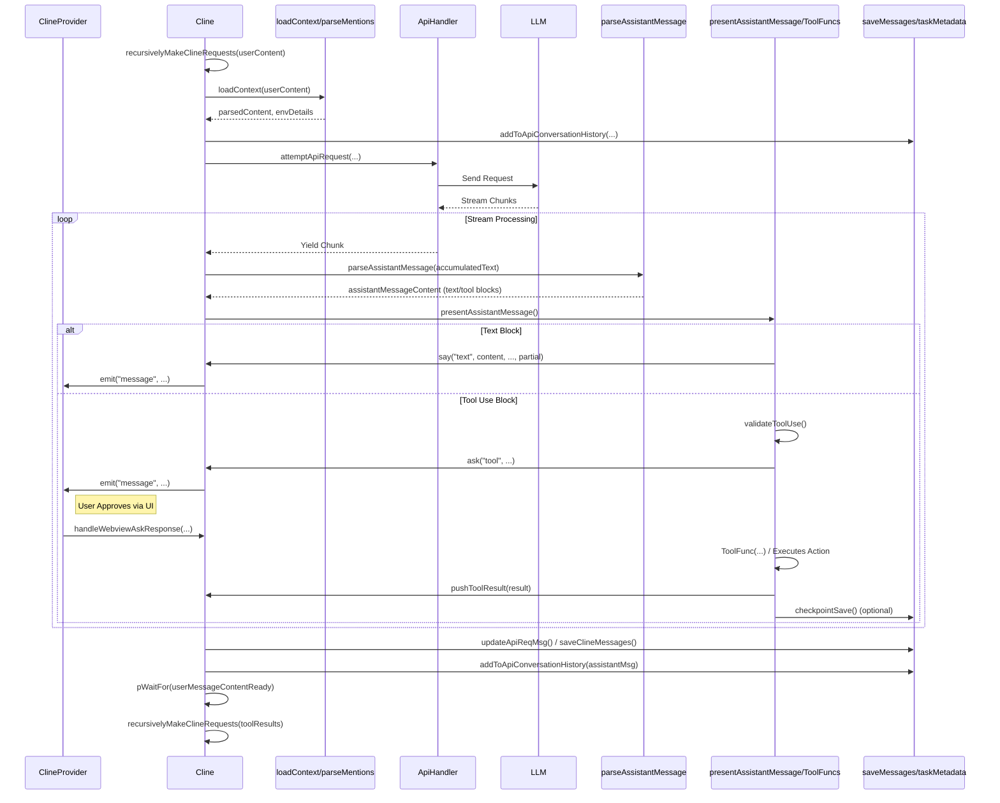

# Chapter 4: Cline

In [Chapter 3: Webview/Extension Message Protocol](03_webview_extension_message_protocol.md), we established the communication channel between the user interface and the extension backend. Now, we dive into the core component responsible for actually *doing* the work requested by the user: the `Cline`.

## Motivation: Managing the Conversation and Task Execution

When a user interacts with Roo-Code, they aren't just sending isolated commands; they're engaging in a potentially long-running conversation or task. This might involve multiple exchanges with the AI, accessing files, running commands, applying code changes, or even spawning sub-tasks. How does Roo-Code manage the state, history, and execution flow of such a complex interaction?

The `Cline` class is the answer. It represents a single, cohesive conversational task instance. Each time you start a new chat or trigger an action that requires AI interaction, a `Cline` instance is created (or potentially reused/restored). It acts as the orchestrator for that specific task, isolating its state and context from other tasks.

**Central Use Case:** Imagine a user asks: "Refactor the `calculateTotal` function in `src/utils/math.ts` to use `reduce` and improve readability."

The `Cline` instance created for this task will:
1.  Store the user's initial request ("Refactor...") and potentially attached context (like the content of `src/utils/math.ts`).
2.  Manage the history of messages exchanged with the AI (`apiConversationHistory`) specifically for *this* refactoring task.
3.  Manage the messages displayed in the UI chat view (`clineMessages`) for *this* task.
4.  Execute the **agentic loop**:
    *   Format the request and context into a prompt for the AI ([Chapter 7: SystemPrompt](07_systemprompt.md)).
    *   Send the prompt to the AI model via the [Chapter 5: ApiHandler](05_apihandler.md).
    *   Receive and parse the AI's response ([Chapter 25: Assistant Message Parsing](25_assistant_message_parsing.md)), potentially streaming it to the UI.
    *   If the AI requests to use a tool (e.g., `read_file` to confirm the current code, `apply_diff` to suggest changes), validate and execute that tool ([Chapter 8: Tools](08_tools.md)).
    *   Format the tool's result and send it back to the AI.
    *   Repeat until the AI indicates the task is complete (e.g., using the `attempt_completion` tool) or the task is aborted.
5.  Manage the task's state (running, paused for user input, paused for a sub-task, aborted).
6.  Persist its conversation history and state to disk ([Chapter 14: Task Persistence](14_task_persistence.md)) so it can be potentially resumed later.
7.  Potentially create checkpoints of the workspace state ([Chapter 13: CheckpointService](13_checkpointservice.md)).

## Key Concepts

1.  **Task Instance:** A `Cline` object encapsulates *one* specific job or conversation. Multiple `Cline` instances can exist, managed in a stack by the [Chapter 2: ClineProvider](02_clineprovider.md) to support sub-tasks (e.g., the AI initiating a `new_task` tool call). Each `Cline` has a unique `taskId` and `instanceId`.
2.  **Agentic Loop (`recursivelyMakeClineRequests`):** The heart of `Cline`'s operation. This asynchronous loop manages the cyclical process of preparing prompts, calling the AI, parsing responses, executing tools, and deciding the next step based on the AI's output or user interaction.
3.  **Conversation History Management:**
    *   `apiConversationHistory`: An array of `Anthropic.MessageParam` objects, representing the exact sequence of messages (user, assistant, tool results) sent to and received from the LLM API for *this task*. This is crucial for maintaining conversational context for the AI.
    *   `clineMessages`: An array of `ClineMessage` objects, representing the messages displayed in the UI for *this task*. This includes user messages, AI responses (`say`), AI questions (`ask`), status updates, tool progress, errors, etc.
4.  **State Management:** Internal flags like `isPaused` (waiting for user input or sub-task), `abort` (task cancellation requested), `isStreaming`, `didRejectTool`, etc., control the flow of the agentic loop.
5.  **Tool Orchestration (`presentAssistantMessage`):** When the AI response contains a tool use request (e.g., `<read_file><path>...</path></read_file>`), the `presentAssistantMessage` method parses it, validates if the tool is allowed in the current mode, asks the user for approval if necessary (via the `ask` method), executes the corresponding tool function (e.g., `readFileTool`), and formats the result to be sent back to the AI in the next turn of the loop. It interacts with various services like the filesystem ([Chapter 42: File System Utilities](42_file_system_utilities.md)), terminal ([Chapter 15: Terminal Integration](15_terminal_integration.md)), browser ([Chapter 18: Browser Interaction](18_browser_interaction.md)), and MCP ([Chapter 19: McpHub / McpServerManager](19_mcphub___mcpservermanager_.md)).
6.  **Context Building (`loadContext`, `getEnvironmentDetails`):** Before calling the AI, `Cline` gathers relevant context. This includes processing user mentions ([Chapter 24: Mention Handling](24_mention_handling.md)), tracking file context ([Chapter 22: File Context Tracker](22_file_context_tracker.md)), respecting ignored files ([Chapter 21: RooIgnoreController](21_rooignorecontroller.md)), and including details about the VS Code environment (open files, terminals, errors). It might employ strategies like [Chapter 23: Sliding Window Context Management](23_sliding_window_context_management.md) to fit context within the model's limits.
7.  **Persistence & Checkpoints:** `Cline` uses helper functions ([Chapter 14: Task Persistence](14_task_persistence.md)) (`saveApiConversationHistory`, `saveClineMessages`) to write its state to disk within the task's dedicated directory. It can also interact with the [Chapter 13: CheckpointService](13_checkpointservice.md) to save snapshots of the workspace.
8.  **Sub-Task Support:** Properties like `parentTask` and `rootTask` link `Cline` instances together when one task spawns another (using the `new_task` tool). The `isPaused` flag and `waitForResume` method allow a parent task to wait for its child task to complete.
9.  **UI Communication (`say`, `ask`, Events):** `Cline` doesn't directly interact with the WebView. It uses `say()` to send informational messages (AI text, status, errors) and `ask()` to pose questions requiring user interaction (tool approval, clarification). These methods trigger the `message` event, which the managing [Chapter 2: ClineProvider](02_clineprovider.md) listens for. The provider then formats an `ExtensionMessage` ([Chapter 3: Webview/Extension Message Protocol](03_webview_extension_message_protocol.md)) and sends it to the [Chapter 1: WebView UI](01_webview_ui.md). User responses to `ask()` calls are received by the provider and forwarded back to the `Cline` instance via `handleWebviewAskResponse`. `Cline` also emits other events like `taskStarted`, `taskCompleted`, `taskAborted` for the provider to react to.

## Using Cline: Solving the Refactoring Use Case

Let's trace the "Refactor `calculateTotal`" example:

1.  **Instantiation:**
    *   User sends "Refactor..." message via the [Chapter 1: WebView UI](01_webview_ui.md).
    *   The UI sends a `{ type: 'newTask', text: 'Refactor...', ... }` [Chapter 3: Webview/Extension Message Protocol](03_webview_extension_message_protocol.md) message.
    *   The [Chapter 2: ClineProvider](02_clineprovider.md) receives this message.
    *   `ClineProvider.initClineWithTask()` is called. It gathers the current API config ([Chapter 9: ProviderSettingsManager](09_providersettingsmanager.md)), custom instructions ([Chapter 10: CustomModesManager](10_custommodesmanager.md)), etc.
    *   **Input:** `task: 'Refactor...'`, `apiConfiguration`, `customInstructions`.
    *   **Action:** `new Cline({ provider, apiConfiguration, task, ... })` is created.
    *   **Output:** A new `Cline` instance is added to the `clineStack` in `ClineProvider`. The `Cline` constructor initializes its state (e.g., `taskId`, `apiConversationHistory = []`, `clineMessages = []`).

2.  **Task Start (`startTask`):**
    *   The `Cline` constructor calls `startTask('Refactor...', [])` (or it's called shortly after).
    *   **Action:** Adds the initial user message to `clineMessages` using `say("text", task, images)`.
    *   **Effect:** Emits a `message` event. `ClineProvider` catches it and sends `{ type: 'clineMessage', message: { type: 'say', say: 'text', text: 'Refactor...', ...} }` to the UI. The user's message appears in the chat.
    *   **Action:** Calls `initiateTaskLoop()` with the formatted user content.

3.  **Agentic Loop - Turn 1 (User Request -> AI Response):**
    *   `initiateTaskLoop()` calls `recursivelyMakeClineRequests(userContent)`.
    *   `loadContext()`: Parses the user's text for mentions (e.g., `@src/utils/math.ts`). If found, it reads the file content via `FileContextTracker` and potentially adds it to `userContent`. Gets environment details (open files, etc.).
    *   `addToApiConversationHistory()`: Adds the formatted user message (including file content and environment details) to `apiConversationHistory`.
    *   `attemptApiRequest()`:
        *   Builds the system prompt ([Chapter 7: SystemPrompt](07_systemprompt.md)) including tool definitions.
        *   Calls `this.api.createMessage(systemPrompt, apiConversationHistory)` where `this.api` is an instance of [Chapter 5: ApiHandler](05_apihandler.md).
        *   Starts receiving the streaming response ([Chapter 6: ApiStream](06_apistream.md)).
    *   Streaming & Parsing (`presentAssistantMessage`):
        *   As text chunks arrive (`chunk.type === 'text'`), `assistantMessage` is built.
        *   `parseAssistantMessage()` ([Chapter 25: Assistant Message Parsing](25_assistant_message_parsing.md)) identifies text blocks.
        *   `say("text", content, undefined, true)` is called for partial text.
        *   **Effect:** `message` events emitted -> `ClineProvider` sends `clineMessage` updates -> UI displays streaming AI response (e.g., "Okay, I can help with that. To ensure I have the latest code, I need to read the file first... <read_file><path>src/utils/math.ts</path></read_file>").
        *   `parseAssistantMessage()` identifies the `<read_file>` tool use.
    *   Tool Handling (`presentAssistantMessage`):
        *   The `tool_use` case is hit for `read_file`.
        *   `validateToolUse()` checks if `read_file` is allowed in the current mode.
        *   `askApproval()`: Calls `ask('tool', 'read_file ...')`.
        *   **Effect:** `message` event -> `ClineProvider` -> UI shows an approval request ("Roo wants to read `src/utils/math.ts`. Allow? [Yes] [No]").
        *   User clicks "Yes". UI sends `{ type: 'askResponse', askResponse: 'yesButtonClicked' }`.
        *   `ClineProvider` calls `cline.handleWebviewAskResponse('yesButtonClicked')`. The `pWaitFor` in `ask()` resolves.
        *   `readFileTool()` is executed: Reads `src/utils/math.ts` from the workspace using filesystem utilities.
        *   `pushToolResult()`: Formats the file content as a tool result (e.g., `<text>[read_file Result]\n\n// file content...\n</text>`). Adds this to `userMessageContent` for the *next* AI call. Sets `didAlreadyUseTool = true`.
    *   Loop Continuation: The stream processing might continue briefly after the tool use, but `presentAssistantMessage` ignores further content because `didAlreadyUseTool` is true. `pWaitFor(() => this.userMessageContentReady)` resolves. The `recursivelyMakeClineRequests` call finishes its current iteration.

4.  **Agentic Loop - Turn 2 (Tool Result -> AI Response):**
    *   The loop calls `recursivelyMakeClineRequests(userMessageContent)` again, where `userMessageContent` now contains the result of the `read_file` tool.
    *   `loadContext()`: Gets environment details (likely less context needed now).
    *   `addToApiConversationHistory()`: Adds the tool result message.
    *   `attemptApiRequest()`: Calls the AI again with the updated history (User Request -> AI Request to Read -> Tool Result).
    *   Streaming & Parsing: AI responds with the refactored code, possibly using `apply_diff`. E.g., "Here's the refactored function:\n```typescript\n// new code...\n```\nI will now apply this change.\n<apply_diff><path>src/utils/math.ts</path><diff>...</diff></apply_diff>".
    *   `say("text", ...)` streams the explanation and code block to the UI.
    *   Tool Handling (`presentAssistantMessage`):
        *   `apply_diff` tool use is parsed.
        *   `validateToolUse()`, `askApproval()` (user approves).
        *   `applyDiffTool()`: Uses the [Chapter 20: DiffViewProvider](20_diffviewprovider.md) to show a diff view in VS Code, allowing the user to review and confirm the changes.
        *   User confirms the diff.
        *   `pushToolResult()`: Adds the success message to `userMessageContent`.
    *   Loop Continuation...

5.  **Agentic Loop - Turn 3 (Apply Diff Result -> AI Completion):**
    *   `recursivelyMakeClineRequests()` called with the `apply_diff` success result.
    *   AI responds, confirming the change and possibly suggesting next steps or concluding. E.g., "The refactoring is complete. <attempt_completion><status>success</status><message>Refactored function using reduce.</message></attempt_completion>".
    *   Tool Handling (`presentAssistantMessage`):
        *   `attempt_completion` tool use is parsed.
        *   `attemptCompletionTool()` is called.
        *   Calls `ask('completion_result', ...)` to show the final message and potentially ask for feedback.
        *   **Effect:** `message` event -> `ClineProvider` -> UI shows the completion message.
        *   The tool might resolve the main loop promise or set flags indicating completion.

6.  **Completion/Cleanup:**
    *   The `recursivelyMakeClineRequests` loop finishes.
    *   The `initiateTaskLoop` promise resolves.
    *   `Cline` might emit `taskCompleted` event.
    *   Final state (`clineMessages`, `apiConversationHistory`) is saved via `saveClineMessages()`.
    *   `ClineProvider` updates the task history list in the UI.

## Code Walkthrough

Let's examine key parts of the `Cline` class (`src/core/Cline.ts`).

### Constructor & Initialization

```typescript
// --- File: src/core/Cline.ts ---
export class Cline extends EventEmitter<ClineEvents> {
	readonly taskId: string;
	readonly instanceId: string; // Unique ID for this specific run of the task
	// ... other properties ...
	api: ApiHandler; // Instance of the API handler
	rooIgnoreController?: RooIgnoreController;
	private fileContextTracker: FileContextTracker;
	// ... history arrays ...
	apiConversationHistory: (Anthropic.MessageParam & { ts?: number })[] = [];
	clineMessages: ClineMessage[] = [];
	// ... state flags ...
	isPaused: boolean = false;
	private abort: boolean = false;
	// ... sub-task links ...
	readonly rootTask: Cline | undefined = undefined;
	readonly parentTask: Cline | undefined = undefined;
	// ... dependencies ...
	providerRef: WeakRef<ClineProvider>; // Weak reference to the parent provider
	private readonly globalStoragePath: string;
	diffViewProvider: DiffViewProvider;
	private checkpointService?: RepoPerTaskCheckpointService;

	constructor({
		provider,
		apiConfiguration,
		customInstructions,
		// ... other options ...
		task, // Initial user text
		images, // Initial user images
		historyItem, // For resuming tasks
		startTask = true, // Whether to start immediately
		// ... sub-task options ...
		onCreated, // Callback after creation
	}: ClineOptions) {
		super();

		// Assign IDs
		this.taskId = historyItem ? historyItem.id : crypto.randomUUID();
		this.instanceId = crypto.randomUUID().slice(0, 8);

		// Initialize core components
		this.rooIgnoreController = new RooIgnoreController(this.cwd);
		this.fileContextTracker = new FileContextTracker(provider, this.taskId);
		this.apiConfiguration = apiConfiguration;
		this.api = buildApiHandler(apiConfiguration); // Creates the appropriate API handler instance
		this.browserSession = new BrowserSession(provider.context);
		this.customInstructions = customInstructions;
		this.providerRef = new WeakRef(provider);
		this.globalStoragePath = provider.context.globalStorageUri.fsPath;
		this.diffViewProvider = new DiffViewProvider(this.cwd);
		// ... other initializations ...

		// Start the task if requested
		if (startTask) {
			if (task || images) {
				this.startTask(task, images); // Kick off a new task
			} else if (historyItem) {
				this.resumeTaskFromHistory(); // Restore from saved state
			} // else error
		}
	}

    // Static factory method allowing async initialization steps if needed
	static create(options: ClineOptions): [Cline, Promise<void>] {
		const instance = new Cline({ ...options, startTask: false });
		// ... determine start method ...
		let promise = historyItem ? instance.resumeTaskFromHistory() : instance.startTask(task, images);
		return [instance, promise];
	}

    // ... get cwd ...
}
```

**Explanation:**

*   The constructor receives options including the parent `ClineProvider`, API configuration, initial task text/images, or a `historyItem` to resume from.
*   It initializes essential components like the `ApiHandler` ([Chapter 5: ApiHandler](05_apihandler.md)), `RooIgnoreController` ([Chapter 21: RooIgnoreController](21_rooignorecontroller.md)), `FileContextTracker`, and `DiffViewProvider` ([Chapter 20: DiffViewProvider](20_diffviewprovider.md)).
*   It sets up task IDs (`taskId`, `instanceId`) and links to parent/root tasks if applicable.
*   Crucially, it either calls `startTask` or `resumeTaskFromHistory` to begin processing, usually asynchronously via the `create` factory method.

### Task Lifecycle (`startTask`, `resumeTaskFromHistory`, `initiateTaskLoop`)

```typescript
// --- File: src/core/Cline.ts ---
private async startTask(task?: string, images?: string[]): Promise<void> {
    // Clear previous state for a new task
    this.clineMessages = [];
    this.apiConversationHistory = [];
    await this.providerRef.deref()?.postStateToWebview(); // Update UI

    // Add initial user message
    await this.say("text", task, images);
    this.isInitialized = true;

    // Format initial user content for the API
    let imageBlocks: Anthropic.ImageBlockParam[] = formatResponse.imageBlocks(images);
    const initialUserContent = [
        { type: "text", text: `<task>\n${task}\n</task>` },
        ...imageBlocks,
    ];

    console.log(`[subtasks] task ${this.taskId}.${this.instanceId} starting`);
    // Start the main agentic loop
    await this.initiateTaskLoop(initialUserContent);
}

private async resumeTaskFromHistory() {
    // Load saved messages from disk
    const modifiedClineMessages = await this.getSavedClineMessages();
    // ... logic to clean up previous resume messages ...
    await this.overwriteClineMessages(modifiedClineMessages); // Update internal state & save

    // Load API history
    this.apiConversationHistory = await this.getSavedApiConversationHistory();

    // Ask user if they want to resume
    const { response, text, images } = await this.ask("resume_task"); // or "resume_completed_task"

    // ... handle user response (add feedback if provided) ...

    // Prepare API history for resumption (handle interrupted tool calls, etc.)
    let modifiedApiConversationHistory = /* ... logic to find last valid state ... */;
    let modifiedOldUserContent = /* ... logic to reconstruct last user turn ... */;

    // Add resumption prompt and user feedback to the user content
    let newUserContent: UserContent = [...modifiedOldUserContent];
    newUserContent.push({ type: "text", text: `[TASK RESUMPTION] ...` });
    if (responseText) { /* add feedback */ }

    // Overwrite API history and start the loop
    await this.overwriteApiConversationHistory(modifiedApiConversationHistory);
    await this.initiateTaskLoop(newUserContent);
}

private async initiateTaskLoop(userContent: UserContent): Promise<void> {
    // Initialize checkpoints in the background
    this.getCheckpointService();

    let nextUserContent = userContent;
    let includeFileDetails = true; // Include full file tree only on the first turn

    this.emit("taskStarted");

    // The main loop
    while (!this.abort) {
        // Execute one turn of the conversation (User -> AI -> Tool? -> Result?)
        const didEndLoop = await this.recursivelyMakeClineRequests(nextUserContent, includeFileDetails);
        includeFileDetails = false;

        if (didEndLoop) {
            break; // Task completed or hit limit
        } else {
            // AI didn't use a tool or attempt completion, prompt it again
            nextUserContent = [{ type: "text", text: formatResponse.noToolsUsed() }];
            this.consecutiveMistakeCount++;
        }
    }
    // Loop finished (completed or aborted)
    // ... potential cleanup or final events ...
    const { tokenUsage } = this.getTokenUsage();
    const toolUsage = this.getToolUsage();
    this.emit("taskCompleted", this.taskId, tokenUsage, toolUsage); // Emit completion event
}
```

**Explanation:**

*   `startTask`: Clears state, adds the first user message, formats the input, and calls `initiateTaskLoop`.
*   `resumeTaskFromHistory`: Loads saved state, asks the user to confirm resumption, carefully reconstructs the `apiConversationHistory` and the next `userContent` to handle potential interruptions (especially around tool calls), then calls `initiateTaskLoop`.
*   `initiateTaskLoop`: The entry point to the continuous conversation loop. It calls `recursivelyMakeClineRequests` repeatedly until the task ends or is aborted. It handles prompting the AI again if it doesn't produce a tool call or completion attempt.

### The Agentic Core (`recursivelyMakeClineRequests`)

```typescript
// --- File: src/core/Cline.ts ---
async recursivelyMakeClineRequests(
    userContent: UserContent,
    includeFileDetails: boolean = false,
): Promise<boolean> { // Returns true if the loop should end
    if (this.abort) { /* handle abort */ }
    if (this.consecutiveMistakeCount >= this.consecutiveMistakeLimit) { /* handle mistake limit */ }

    // Handle pausing for sub-tasks
    if (this.isPaused) { await this.waitForResume(); /* handle mode switch if needed */ }

    // Show loading state in UI
    await this.say("api_req_started", JSON.stringify({ request: "Loading..." }));

    // Load context (mentions, environment details, file tree if first turn)
    const [parsedUserContent, environmentDetails] = await this.loadContext(userContent, includeFileDetails);
    const finalUserContent = [...parsedUserContent, { type: "text", text: environmentDetails }] as UserContent;

    // Add user message to API history
    await this.addToApiConversationHistory({ role: "user", content: finalUserContent });
    // ... update UI loading state with actual request ...

    try {
        // --- Reset state for this turn ---
        this.currentStreamingContentIndex = 0;
        this.assistantMessageContent = [];
        // ... other flags reset ...

        // --- Make API Call ---
        const stream = this.attemptApiRequest(/* ... */); // Handles retries, yields chunks
        let assistantMessage = ""; // Accumulates raw text response

        this.isStreaming = true;
        for await (const chunk of stream) {
            // Process chunks (usage, text, reasoning)
            if (chunk.type === "text") {
                assistantMessage += chunk.text;
                // Parse the accumulated message into structured content (text/tool)
                this.assistantMessageContent = parseAssistantMessage(assistantMessage);
                // Trigger processing/display of the new/updated content block
                this.presentAssistantMessage();
            }
            // ... handle usage, reasoning chunks ...

            if (this.abort || this.didRejectTool || this.didAlreadyUseTool) {
                // Stop processing stream if aborted or tool interaction dictates
                // ... potentially add interruption message to assistantMessage ...
                break;
            }
        } // End stream processing loop
    } catch (error) {
        // Handle API call errors (e.g., network, authentication)
        // ... may involve asking user to retry or aborting ...
        return true; // End the loop on critical API errors
    } finally {
        this.isStreaming = false;
    }

    if (this.abort) { /* handle abort */ }

    this.didCompleteReadingStream = true;
    // Ensure last partial messages are marked complete
    this.assistantMessageContent.forEach(block => block.partial = false);
    this.presentAssistantMessage(); // Present final state of last block

    // --- Save state and metrics for this turn ---
    updateApiReqMsg(); // Update the 'api_req_started' message with token counts/cost
    await this.saveClineMessages();
    await this.providerRef.deref()?.postStateToWebview();

    // --- Add Assistant Response to API History ---
    if (assistantMessage.length > 0) {
        await this.addToApiConversationHistory({ role: "assistant", content: [{ type: "text", text: assistantMessage }] });

        // --- Wait for Tool Execution / User Interaction ---
        // `presentAssistantMessage` handles tool calls asynchronously.
        // We wait until `userMessageContentReady` is true, indicating tools
        // have finished or no tools were called.
        await pWaitFor(() => this.userMessageContentReady);

        // --- Decide Next Step ---
        const didToolUse = this.assistantMessageContent.some(block => block.type === "tool_use");
        if (!didToolUse) {
            // AI didn't use a tool, prepare to prompt it again
            this.userMessageContent.push({ type: "text", text: formatResponse.noToolsUsed() });
            this.consecutiveMistakeCount++;
        }

        // If an attempt_completion tool was used, its handler in presentAssistantMessage
        // might set flags or resolve promises to end the loop.
        // For now, assume we continue unless explicitly stopped.
        if (/* check completion flag set by attempt_completion tool */ false) {
             return true; // End loop
        }

        // --- Recurse for the next turn ---
        // Pass the collected tool results (in this.userMessageContent) back to the AI
        const recDidEndLoop = await this.recursivelyMakeClineRequests(this.userMessageContent);
        return recDidEndLoop; // Propagate loop end signal
    } else {
        // Handle empty assistant response (error case)
        // ... add error messages ...
        return true; // End loop on error
    }
}
```

**Explanation:**

*   This is the core recursive function driving the agentic behavior.
*   It handles state checks (abort, mistakes, pause).
*   It loads context (`loadContext`), adds the user turn to history, and makes the API call via `attemptApiRequest`.
*   It iterates through the response stream (`for await...`), accumulating the raw `assistantMessage`, parsing it into `assistantMessageContent` using `parseAssistantMessage`, and triggering `presentAssistantMessage` to handle display and tool execution.
*   It includes crucial `break` conditions within the stream loop (abort, tool rejection, tool already used) to interrupt the AI's response processing when necessary.
*   After the stream finishes (or is broken), it saves the state and metrics (`updateApiReqMsg`, `saveClineMessages`).
*   It adds the assistant's full response to the `apiConversationHistory`.
*   It `pWaitFor(() => this.userMessageContentReady)`, pausing execution until any tool calls triggered by `presentAssistantMessage` have completed and added their results to `userMessageContent`.
*   It checks if a tool was used. If not, it adds a prompt (`noToolsUsed`) to `userMessageContent` to encourage the AI to proceed or finish.
*   It then calls *itself* (`recursivelyMakeClineRequests`) with the `userMessageContent` (which now contains tool results or the `noToolsUsed` prompt), continuing the cycle.
*   The recursion depth is managed by the AI eventually using `attempt_completion`, hitting limits, or the user aborting.

### UI Interaction (`say`, `ask`, `handleWebviewAskResponse`)

```typescript
// --- File: src/core/Cline.ts ---

// Send informational message to the UI
async say(
    type: ClineSay, // e.g., 'text', 'error', 'status', 'api_req_started'
    text?: string,
    images?: string[],
    partial?: boolean, // Is this a partial update to a streaming message?
    checkpoint?: Record<string, unknown>,
    progressStatus?: ToolProgressStatus,
): Promise<undefined> {
    if (this.abort) { /* handle abort */ }

    const messageData = { ts: Date.now(), type: "say", say: type, text, images, checkpoint, progressStatus };

    if (partial !== undefined) {
        const lastMessage = this.clineMessages.at(-1);
        const isUpdatingPreviousPartial = /* check if last message is partial of same type */;

        if (partial) { // Start or update a partial message
            if (isUpdatingPreviousPartial) {
                // Update existing partial message in clineMessages
                Object.assign(lastMessage, { text, images, partial, progressStatus });
                // Send only the update to the webview for efficiency
                this.updateClineMessage(lastMessage);
            } else {
                // Add new partial message
                this.lastMessageTs = messageData.ts;
                await this.addToClineMessages({ ...messageData, partial: true });
            }
        } else { // Complete a partial message or send a whole new one
             if (isUpdatingPreviousPartial) {
                // Finalize the existing partial message
                 Object.assign(lastMessage, { text, images, partial: false, progressStatus });
                 this.lastMessageTs = lastMessage.ts; // Keep original timestamp
                 await this.saveClineMessages(); // Persist the completed message
                 this.updateClineMessage(lastMessage); // Send final update
             } else {
                 // Send a new, complete message
                 this.lastMessageTs = messageData.ts;
                 await this.addToClineMessages(messageData);
             }
        }
    } else {
        // Send a new, non-partial message
        this.lastMessageTs = messageData.ts;
        await this.addToClineMessages(messageData);
    }
}

// Ask a question requiring user interaction
async ask(
    type: ClineAsk, // e.g., 'tool', 'clarification', 'resume_task'
    text?: string, // Question text or context (e.g., tool details)
    partial?: boolean, // For streaming asks (less common)
    progressStatus?: ToolProgressStatus,
): Promise<{ response: ClineAskResponse; text?: string; images?: string[] }> {
    if (this.abort) { /* handle abort */ }

    // Similar logic to say() for handling partial/complete messages
    // ... adds message to clineMessages using addToClineMessages() ...
    const askTs = /* get timestamp */;
    await this.addToClineMessages({ ts: askTs, type: "ask", ask: type, text, partial, progressStatus });

    // Clear previous response state
    this.askResponse = undefined;
    this.askResponseText = undefined;
    this.askResponseImages = undefined;

    // Wait until handleWebviewAskResponse sets the response or message changes
    await pWaitFor(() => this.askResponse !== undefined || this.lastMessageTs !== askTs, { interval: 100 });

    if (this.lastMessageTs !== askTs) {
        throw new Error("Current ask promise was ignored"); // Another ask occurred
    }

    // Capture and clear the response
    const result = { response: this.askResponse!, text: this.askResponseText, images: this.askResponseImages };
    this.askResponse = undefined;
    // ... clear text/images ...
    this.emit("taskAskResponded");
    return result;
}

// Called by ClineProvider when a response arrives from the webview
async handleWebviewAskResponse(askResponse: ClineAskResponse, text?: string, images?: string[]) {
    this.askResponse = askResponse; // e.g., 'yesButtonClicked', 'messageResponse'
    this.askResponseText = text;
    this.askResponseImages = images;
    // The pWaitFor in ask() will now resolve
}

// --- Helper methods for updating UI/history ---
private async addToClineMessages(message: ClineMessage) {
    this.clineMessages.push(message);
    // Notify provider to update UI state immediately
    await this.providerRef.deref()?.postStateToWebview();
    // Emit event for provider to send specific message update
    this.emit("message", { action: "created", message });
    // Save messages to disk asynchronously
    await this.saveClineMessages();
}

private async updateClineMessage(partialMessage: ClineMessage) {
    // Notify provider to send a partial update (more efficient)
    await this.providerRef.deref()?.postMessageToWebview({ type: "partialMessage", partialMessage });
    // Emit event for other listeners if needed
    this.emit("message", { action: "updated", message: partialMessage });
    // Don't save partial messages directly, wait for completion
}

private async saveClineMessages() {
    try {
        await saveTaskMessages(/* ... */); // Persist clineMessages
        // Update history item metadata (cost, last update time)
        const { historyItem, tokenUsage } = await taskMetadata(/* ... */);
        this.emit("taskTokenUsageUpdated", this.taskId, tokenUsage);
        await this.providerRef.deref()?.updateTaskHistory(historyItem);
    } catch (error) { /* handle error */ }
}

private async saveApiConversationHistory() {
     try {
        await saveApiMessages(/* ... */); // Persist apiConversationHistory
     } catch (error) { /* handle error */ }
}
```

**Explanation:**

*   `say` and `ask` are the primary methods `Cline` uses to communicate *outwards*. They don't directly call `postMessage`.
*   They construct a `ClineMessage` object representing the UI update.
*   They handle partial updates for streaming efficiently by sending `partialMessage` events via the provider, avoiding full state updates on every chunk.
*   They add the message to the internal `clineMessages` array.
*   `addToClineMessages` triggers a full UI state update (`postStateToWebview`) and emits a `message` event for the provider to send the specific new message. It then saves the history.
*   `ask` additionally uses `pWaitFor` to pause its own execution until `handleWebviewAskResponse` (called by the provider) provides the user's response.
*   `saveClineMessages` and `saveApiConversationHistory` handle the persistence logic using functions from [Chapter 14: Task Persistence](14_task_persistence.md).

## Internal Implementation

Let's revisit the core agentic loop (`recursivelyMakeClineRequests`) with a focus on the sequence of actions.

**Step-by-Step Flow (Single Turn):**

1.  **Entry:** `recursivelyMakeClineRequests` is called with `userContent` (either the initial task or tool results from the previous turn).
2.  **State Check:** Checks `abort`, `consecutiveMistakeCount`, `isPaused`.
3.  **Context Loading:** Calls `loadContext` to parse mentions in `userContent` and fetch `environmentDetails`.
4.  **API History Update:** Adds the combined `finalUserContent` as a 'user' role message to `apiConversationHistory` and saves it.
5.  **API Call:** Calls `attemptApiRequest`, which wraps `api.createMessage`. This initiates the request to the LLM.
6.  **Stream Processing:** Enters the `for await (const chunk of stream)` loop.
7.  **Chunk Handling:**
    *   If `chunk.type === 'text'`, append `chunk.text` to `assistantMessage`.
    *   Call `parseAssistantMessage(assistantMessage)` to get structured `assistantMessageContent` (text blocks, tool use blocks).
    *   Call `presentAssistantMessage()`.
8.  **Content Presentation (`presentAssistantMessage`):**
    *   Iterates through `assistantMessageContent` blocks that haven't been processed yet (`currentStreamingContentIndex`).
    *   **Text Block:** Calls `say("text", content, ..., block.partial)` -> Emits `message` event -> UI updates.
    *   **Tool Use Block:**
        *   Checks `didRejectTool`, `didAlreadyUseTool`.
        *   Validates tool allowance (`validateToolUse`).
        *   Calls `askApproval()` (which calls `ask('tool', ...)` -> Emits `message` -> Waits for `handleWebviewAskResponse`).
        *   If approved, executes the specific tool function (e.g., `readFileTool(...)`).
        *   Tool function performs its action (e.g., reads file).
        *   Tool function calls `pushToolResult(result)` -> Adds formatted result to `this.userMessageContent`. Sets `didAlreadyUseTool = true`.
        *   Potentially saves a checkpoint (`checkpointSave`).
    *   Advances `currentStreamingContentIndex`. If more blocks exist, calls itself recursively (or relies on stream loop). If it's the last block and done, sets `userMessageContentReady = true`.
9.  **Stream Loop Continues:** Processes next chunk, potentially updating a partial text block or parsing a new tool call. The loop might `break` if `abort`, `didRejectTool`, or `didAlreadyUseTool` becomes true.
10. **Stream End:** Loop finishes. `isStreaming = false`. `didCompleteReadingStream = true`. Final partial messages marked complete.
11. **State Save:** `updateApiReqMsg` (saves final token counts), `saveClineMessages`.
12. **Assistant History Save:** Adds the complete `assistantMessage` to `apiConversationHistory`.
13. **Wait for Tools:** `pWaitFor(() => this.userMessageContentReady)` ensures all asynchronous tool executions initiated by `presentAssistantMessage` are finished.
14. **Next Turn Prep:** Checks if any tool was used. If not, adds `noToolsUsed()` prompt to `userMessageContent`.
15. **Recursion:** Calls `recursivelyMakeClineRequests(this.userMessageContent)` to start the next turn, sending the tool results (or `noToolsUsed` prompt) back to the AI.

**Sequence Diagram:**



## Modification Guidance

`Cline` is the engine; modifying it often involves changing the agent's behavior or capabilities.

**Common Modifications:**

1.  **Adding a New Tool:**
    *   **Tool Function:** Create a new async function (e.g., `myNewTool(cline: Cline, block: ToolUseBlock, ...)`). Place it in `src/core/tools/`. This function should perform the tool's action, potentially use `askApproval`, and call `pushToolResult` or `handleError`.
    *   **System Prompt:** Add the XML definition of your new tool to the tools section in `src/core/prompts/system.ts` ([Chapter 7: SystemPrompt](07_systemprompt.md)).
    *   **Parsing:** Ensure `parseAssistantMessage` ([Chapter 25: Assistant Message Parsing](25_assistant_message_parsing.md)) can correctly parse your tool's XML structure into a `ToolUseBlock`. You might need to update schemas ([Chapter 40: Schemas (Zod)](40_schemas__zod_.md)).
    *   **Execution:** Add a `case 'my_new_tool':` to the `switch (block.name)` statement within `presentAssistantMessage` in `Cline.ts`. Call your `myNewTool` function here.
    *   **Validation:** Update `src/core/mode-validator.ts` to define which modes allow your new tool.
    *   **Types:** Add the tool name to `ToolName` type in `src/schemas/toolUsage.ts` and relevant parameter types in `src/shared/tools.ts`.

2.  **Changing Tool Approval Logic:**
    *   Modify the logic within individual tool functions (`src/core/tools/*.ts`) where `askApproval` is called. You might add conditions based on parameters, always approve certain actions, or change the text presented to the user.
    *   Modify the global `alwaysAllow...` settings handling in `ClineProvider` and `webviewMessageHandler` if adding new global approval flags.

3.  **Modifying Error Handling:**
    *   Adjust the `handleError` function passed to tools in `presentAssistantMessage` to change how errors are reported to the user and the AI.
    *   Modify the `catch` blocks in `recursivelyMakeClineRequests` or `attemptApiRequest` to change how API or streaming errors are handled (e.g., different retry logic, different user messages).
    *   Change the `consecutiveMistakeLimit` handling.

4.  **Adjusting Context Inclusion:**
    *   Modify `getEnvironmentDetails` to include more/less information about the workspace (e.g., Git status, specific config files).
    *   Change the logic in `loadContext` or `FileContextTracker` for how mentioned files are read or summarized.
    *   Implement or adjust sliding window logic in `truncateConversationIfNeeded` ([Chapter 23: Sliding Window Context Management](23_sliding_window_context_management.md)).

**Best Practices:**

*   **Isolate Tool Logic:** Keep the core logic for each tool within its dedicated function in `src/core/tools/`.
*   **Clear State Transitions:** Be mindful of how state flags (`isPaused`, `abort`, `didRejectTool`, `didAlreadyUseTool`, `userMessageContentReady`) affect the loop's flow. Ensure transitions are logical and handle edge cases.
*   **Error Handling:** Provide informative error messages to both the user (via `say('error', ...)` or `ask(...)`) and the AI (via `formatResponse.toolError(...)` in tool results). Handle unexpected errors gracefully to avoid crashing the extension host.
*   **Asynchronicity:** `Cline` relies heavily on `async/await` and promises (especially `pWaitFor`). Ensure asynchronous operations are handled correctly, particularly around UI interaction (`ask`) and tool execution.
*   **Persistence:** Call `saveClineMessages` and `saveApiConversationHistory` at appropriate points (usually after a turn completes or state significantly changes) to ensure tasks can be resumed.

**Potential Pitfalls:**

*   **Infinite Loops:** Incorrect logic in `recursivelyMakeClineRequests` or tool handling could lead to the AI and tools calling each other indefinitely without making progress or hitting a completion state. The `consecutiveMistakeLimit` helps mitigate this.
*   **Race Conditions:** While less common in Node.js's single-threaded event loop, complex asynchronous operations (like multiple simultaneous tool calls if allowed, or interactions with external services) could lead to unexpected state if not carefully managed.
*   **State Management Complexity:** The number of flags and the intricate flow of `recursivelyMakeClineRequests` and `presentAssistantMessage` can be complex. Changes require careful testing.
*   **Unhandled Tool Errors:** If a tool function throws an unhandled exception, it could break the agentic loop. Ensure robust `try...catch` blocks and use the `handleError` callback.
*   **Context Window Limits:** Failing to manage `apiConversationHistory` size (e.g., via [Chapter 23: Sliding Window Context Management](23_sliding_window_context_management.md)) can lead to API errors when the context exceeds the model's limit.

## Conclusion

The `Cline` class is the workhorse of Roo-Code's conversational AI capabilities. It encapsulates a single task, manages the complex agentic loop of interacting with the AI and tools, handles state transitions, orchestrates context gathering, and ensures persistence. By isolating each task within a `Cline` instance, Roo-Code can handle multiple concurrent or sequential interactions robustly.

Understanding the flow through `recursivelyMakeClineRequests`, the role of `presentAssistantMessage` in handling AI output and tools, and the communication patterns via `say`, `ask`, and events is crucial for comprehending how Roo-Code executes user requests.

With the task execution engine (`Cline`) explained, we next need to look at how it specifically communicates with the underlying AI models. The following chapter details this interaction layer: [Chapter 5: ApiHandler](05_apihandler.md).

