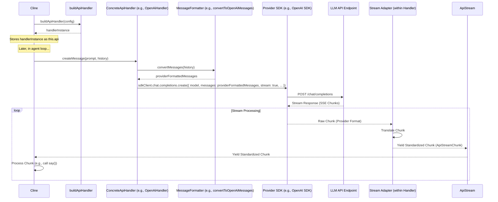

# Chapter 5: ApiHandler

In [Chapter 4: Cline](04_cline.md), we saw how the `Cline` class manages the lifecycle and logic of a specific conversational task, including the agentic loop that involves interacting with a Large Language Model (LLM). But how does `Cline` actually talk to the AI, especially when Roo-Code supports various LLM providers like Anthropic, OpenAI, AWS Bedrock, Ollama, and others? This is where the `ApiHandler` abstraction comes into play.

## Motivation: A Universal Translator for LLMs

Different LLM providers have distinct APIs, Software Development Kits (SDKs), authentication methods, message formats, and capabilities (like streaming, tool use, prompt caching, or reasoning steps). If `Cline` had to contain specific logic for each provider, it would quickly become incredibly complex, difficult to maintain, and hard to extend with new providers.

The `ApiHandler` solves this by defining a standardized interface for interacting with any supported LLM provider. It acts as a universal translator, hiding the provider-specific details behind a common set of methods.

**Central Use Case:** When the `Cline` instance needs to send the current conversation history and system prompt to the configured LLM, it doesn't need to know if it's talking to Claude, GPT-4, Llama 3, or a Bedrock model. It simply asks the `ApiHandler` to `createMessage` with the standard inputs (system prompt, message history). The `ApiHandler` implementation specific to the selected provider then takes care of formatting the messages correctly, making the API call using the appropriate SDK, and returning the response in a standardized streaming format ([Chapter 6: ApiStream](06_apistream.md)). Similarly, when `Cline` needs to estimate prompt size, it calls `countTokens` on the `ApiHandler`, which delegates to the provider-specific (or a default) token counting mechanism.

## Key Concepts

1.  **`ApiHandler` Interface:** Defined in `src/api/index.ts`, this TypeScript interface specifies the core methods that every provider implementation must offer:
    *   `createMessage(systemPrompt: string, messages: Anthropic.Messages.MessageParam[], cacheKey?: string): ApiStream`: Takes a system prompt and an array of messages (using Anthropic's format as a common internal representation) and returns an `ApiStream` ([Chapter 6: ApiStream](06_apistream.md)) which asynchronously yields standardized chunks of the LLM's response (text, usage metrics, reasoning steps, etc.). The optional `cacheKey` supports provider-specific caching mechanisms.
    *   `getModel(): { id: string; info: ModelInfo }`: Returns information about the specific model being used by this handler instance (e.g., ID, context window size, pricing).
    *   `countTokens(content: Array<Anthropic.Messages.ContentBlockParam>): Promise<number>`: Calculates the approximate number of tokens for the given content blocks, crucial for context window management ([Chapter 23: Sliding Window Context Management](23_sliding_window_context_management.md)).

2.  **Concrete Implementations (`src/api/providers/`):** For each supported LLM provider (Anthropic, OpenAI, Bedrock, Ollama, OpenRouter, Gemini, LM Studio, etc.), there's a corresponding class (e.g., `AnthropicHandler`, `OpenAiHandler`, `AwsBedrockHandler`) that implements the `ApiHandler` interface. These classes contain the provider-specific logic:
    *   Initializing the provider's SDK client with the correct API keys, base URLs, and other settings from the configuration.
    *   Implementing `createMessage` by:
        *   Translating the standard `messages` array into the provider's expected format (e.g., using helper functions like `convertToOpenAiMessages`).
        *   Calling the provider's SDK method for creating chat completions (often a streaming variant).
        *   Wrapping the provider's streaming response into an `ApiStream` instance, which transforms the provider-specific chunks into the standardized `ApiStreamChunk` format.
    *   Implementing `getModel` to return details about the specific model variant being used.
    *   Optionally overriding `countTokens` to use a provider's native token counting API if available and more accurate than the default.

3.  **`BaseProvider` (`src/api/providers/base-provider.ts`):** An abstract class that many concrete handlers extend. It provides a default implementation for `countTokens` using the `js-tiktoken` library (a common tokenizer used by OpenAI and others), simplifying the implementation of new handlers that don't have a dedicated token counting API.

4.  **`buildApiHandler` Factory Function (`src/api/index.ts`):** This function acts as a factory. It takes the current `ApiConfiguration` (which includes the selected `apiProvider` type and provider-specific settings) and returns the appropriate concrete `ApiHandler` instance. This is how `Cline` obtains the correct handler without needing to know the specific provider type itself.

5.  **Standardized Streaming (`ApiStream`):** The `createMessage` method returns an `ApiStream` ([Chapter 6: ApiStream](06_apistream.md)), not the raw provider stream. This ensures that the calling code (`Cline`) receives response chunks in a consistent format (`ApiStreamChunk`), regardless of the underlying provider.

## Using the ApiHandler

Let's see how `Cline` utilizes the `ApiHandler` to execute the core AI interaction part of the agentic loop described in [Chapter 4: Cline](04_cline.md).

**Step-by-Step Flow within `Cline`:**

1.  **Initialization:** When a `Cline` instance is created, its constructor receives the active `ApiConfiguration`.
    *   **Input:** `apiConfiguration: { apiProvider: 'anthropic', apiKey: '...', apiModelId: 'claude-3-opus-20240229', ... }`
    *   **Action (within `Cline` constructor):** `this.api = buildApiHandler(apiConfiguration);`
    *   **Output:** The `buildApiHandler` function looks at `apiConfiguration.apiProvider` ('anthropic') and returns `new AnthropicHandler(apiConfiguration)`. This instance is stored in `cline.api`.

2.  **Token Counting (Before API Call):** Before sending a request, `Cline` might need to check if the conversation history fits within the context window.
    *   **Input:** `contentBlocks: [...]` (extracted from messages to be sent).
    *   **Action (e.g., in `truncateConversationIfNeeded`):** `const tokenCount = await this.api.countTokens(contentBlocks);`
    *   **Output:** The `AnthropicHandler`'s `countTokens` method is called. It might use the base implementation (Tiktoken) or potentially call Anthropic's specific token counting API. It returns a `Promise<number>`.

3.  **Making the API Call:** Inside the `recursivelyMakeClineRequests` loop, when it's time to call the LLM:
    *   **Input:** `systemPrompt: "You are Roo..."`, `apiConversationHistory: [...]` (messages formatted for API).
    *   **Action (within `attemptApiRequest`):** `const stream = this.api.createMessage(systemPrompt, apiConversationHistory);`
    *   **Output:** The `AnthropicHandler`'s `createMessage` method is called. It formats the inputs, calls the Anthropic SDK's `messages.create({ ..., stream: true })` method, and wraps the resulting stream in an `ApiStream` instance. This `ApiStream` is returned.

4.  **Processing the Stream:** The calling code in `Cline` then iterates over the returned `ApiStream`:
    *   **Action:**
        ```typescript
        for await (const chunk of stream) {
            // Process standardized chunks (text, usage, reasoning)
            if (chunk.type === 'text') { /* ... call say() ... */ }
            if (chunk.type === 'usage') { /* ... update token counts ... */ }
            if (chunk.type === 'reasoning') { /* ... optionally display thinking ... */ }
        }
        ```
    *   **Effect:** `Cline` receives standardized `ApiStreamChunk` objects and updates its state or the UI accordingly, without needing to know the specifics of Anthropic's stream format.

This demonstrates how `ApiHandler` decouples `Cline` from the specifics of LLM provider interactions.

## Code Walkthrough

Let's look at the key code definitions.

### Interface and Factory (`src/api/index.ts`)

```typescript
// --- File: src/api/index.ts ---
import { Anthropic } from "@anthropic-ai/sdk"
// Import types and provider classes
import { ApiConfiguration, ModelInfo, ApiHandlerOptions } from "../shared/api"
import { ApiStream } from "./transform/stream"
// Import concrete handlers
import { AnthropicHandler } from "./providers/anthropic"
import { OpenAiHandler } from "./providers/openai"
import { AwsBedrockHandler } from "./providers/bedrock"
import { OllamaHandler } from "./providers/ollama"
// ... other provider imports (OpenRouter, Vertex, Gemini, LMStudio, etc.)

// Interface defining the contract for all API handlers
export interface ApiHandler {
	/**
	 * Creates a streaming response from the LLM.
	 * @param systemPrompt The system prompt string.
	 * @param messages The conversation history in Anthropic message format.
	 * @param cacheKey Optional key for provider-specific caching.
	 * @returns An ApiStream that yields standardized response chunks.
	 */
	createMessage(systemPrompt: string, messages: Anthropic.Messages.MessageParam[], cacheKey?: string): ApiStream

	/**
	 * Gets information about the specific model being used.
	 * @returns An object containing the model ID and ModelInfo.
	 */
	getModel(): { id: string; info: ModelInfo }

	/**
	 * Counts tokens for the given content blocks.
	 * Uses Tiktoken by default via BaseProvider, but can be overridden.
	 * @param content An array of content blocks (text, image).
	 * @returns A promise resolving to the token count.
	 */
	countTokens(content: Array<Anthropic.Messages.ContentBlockParam>): Promise<number>
}

// Optional interface for providers supporting single, non-streaming completions
export interface SingleCompletionHandler {
	completePrompt(prompt: string): Promise<string>
}

/**
 * Factory function to create the appropriate ApiHandler based on configuration.
 * @param configuration The API configuration specifying the provider and options.
 * @returns An instance of a concrete class implementing ApiHandler.
 */
export function buildApiHandler(configuration: ApiConfiguration): ApiHandler {
	const { apiProvider, ...options } = configuration // Extract provider type and options
	switch (apiProvider) {
		case "anthropic":
			return new AnthropicHandler(options)
		case "openai":
		case "azure": // Potentially handle Azure OpenAI via OpenAiHandler
			return new OpenAiHandler(options)
		case "bedrock":
			return new AwsBedrockHandler(options)
		case "ollama":
			return new OllamaHandler(options)
		case "openrouter":
			return new OpenRouterHandler(options)
		case "vertex":
			return new VertexHandler(options)
		case "gemini":
			return new GeminiHandler(options)
		case "lmstudio":
			return new LmStudioHandler(options)
		case "openai-native":
			return new OpenAiNativeHandler(options)
		case "deepseek":
			return new DeepSeekHandler(options)
		case "vscode-lm":
			return new VsCodeLmHandler(options)
		case "mistral":
			return new MistralHandler(options)
		case "unbound":
			return new UnboundHandler(options)
		case "requesty":
			return new RequestyHandler(options)
		case "human-relay":
			return new HumanRelayHandler(options)
		case "fake-ai": // For testing/mocking
			return new FakeAIHandler(options)
		case "xai":
			return new XAIHandler(options)
		// ... other cases ...
		default:
			// Fallback or throw error for unknown provider
			console.warn(`Unknown API provider: ${apiProvider}. Falling back to Anthropic.`);
			return new AnthropicHandler(options) // Or throw new Error(...)
	}
}

// Helper function used by some providers to determine common parameters
export function getModelParams({ /* ... */ }) {
    // ... logic to determine maxTokens, temperature, thinking based on model info and options ...
    return { maxTokens, thinking, temperature, reasoningEffort };
}
```

**Explanation:**

*   **`ApiHandler` Interface:** Clearly defines the `createMessage`, `getModel`, and `countTokens` methods that all concrete handlers must implement.
*   **`buildApiHandler` Function:** A simple `switch` statement that reads the `apiProvider` field from the `ApiConfiguration` object and instantiates the corresponding handler class, passing the rest of the configuration options (`options`) to its constructor. This is the central point for selecting the correct provider logic.

### Base Provider (`src/api/providers/base-provider.ts`)

```typescript
// --- File: src/api/providers/base-provider.ts ---
import { Anthropic } from "@anthropic-ai/sdk"
import { Tiktoken } from "js-tiktoken/lite"
import o200kBase from "js-tiktoken/ranks/o200k_base" // Tokenizer data

import { ApiHandler } from ".." // Import the main interface
import { ModelInfo } from "../../shared/api"
import { ApiStream } from "../transform/stream"

// A fudge factor can sometimes help align tiktoken counts with actual API counts
const TOKEN_FUDGE_FACTOR = 1.5

/**
 * Base class for API providers that implements common functionality.
 */
export abstract class BaseProvider implements ApiHandler {
	// Encoder instance cached for performance
	private encoder: Tiktoken | null = null

	// Concrete classes MUST implement these
	abstract createMessage(systemPrompt: string, messages: Anthropic.Messages.MessageParam[], cacheKey?: string): ApiStream
	abstract getModel(): { id: string; info: ModelInfo }

	/**
	 * Default token counting implementation using tiktoken (o200k_base).
	 * Providers can override this if they have a more accurate native method.
	 * Lazily initializes and caches the Tiktoken encoder.
	 * @param content The content blocks (text, image) to count.
	 * @returns A promise resolving to the estimated token count.
	 */
	async countTokens(content: Array<Anthropic.Messages.ContentBlockParam>): Promise<number> {
		if (!content || content.length === 0) return 0

		let totalTokens = 0

		// Lazily initialize the encoder on first use
		if (!this.encoder) {
			this.encoder = new Tiktoken(o200kBase)
		}

		for (const block of content) {
			if (block.type === "text") {
				const text = block.text || ""
				if (text.length > 0) {
					// Encode the text and add the number of tokens
					const tokens = this.encoder.encode(text)
					totalTokens += tokens.length
				}
			} else if (block.type === "image") {
				// Simple estimation for images based on base64 data length
				// (This is a very rough approximation)
				const imageSource = block.source
				if (imageSource && typeof imageSource === "object" && "data" in imageSource) {
					const base64Data = imageSource.data as string
					// Formula based on Anthropic's documentation (may vary for others)
					// Rough approximation: tokens ≈ width * height / 750
					// Using base64 length as a proxy for size. This is highly inaccurate.
					totalTokens += Math.ceil(Math.sqrt(base64Data.length)) // Very rough estimate
				} else {
					totalTokens += 300 // Fallback estimate
				}
			}
		}

		// Apply a fudge factor if needed (empirical adjustment)
		return Math.ceil(totalTokens * TOKEN_FUDGE_FACTOR)
	}
}
```

**Explanation:**

*   **Abstract Class:** `BaseProvider` implements `ApiHandler` but leaves `createMessage` and `getModel` abstract, forcing subclasses to provide them.
*   **Default `countTokens`:** Implements `countTokens` using `js-tiktoken` with the `o200k_base` encoding (suitable for many modern models). It lazily initializes the encoder for efficiency. It includes a very basic, often inaccurate, estimation for image tokens. Providers with better methods should override this.
*   **Fudge Factor:** Includes a `TOKEN_FUDGE_FACTOR` which can be adjusted based on empirical observation if Tiktoken consistently under/overestimates compared to a specific provider's actual charging.

### Example Concrete Implementation (`src/api/providers/anthropic.ts`)

```typescript
// --- File: src/api/providers/anthropic.ts ---
import { Anthropic } from "@anthropic-ai/sdk"
import { Stream as AnthropicStream } from "@anthropic-ai/sdk/streaming"
// ... other imports ...
import { ApiHandlerOptions, ModelInfo, anthropicModels, anthropicDefaultModelId } from "../../shared/api"
import { ApiStream } from "../transform/stream"
import { BaseProvider } from "./base-provider"
import { getModelParams } from "../index" // Import helper

const ANTHROPIC_DEFAULT_MAX_TOKENS = 4096

export class AnthropicHandler extends BaseProvider {
	private options: ApiHandlerOptions
	private client: Anthropic

	constructor(options: ApiHandlerOptions) {
		super()
		this.options = options
		// Initialize Anthropic SDK client with API key and potential base URL override
		this.client = new Anthropic({
			baseURL: this.options.anthropicBaseUrl || undefined,
			apiKey: this.options.apiKey, // Assumes apiKey is directly in options
		})
	}

	/**
	 * Creates a streaming message using the Anthropic API.
	 * Handles prompt caching headers for supported models.
	 */
	async *createMessage(systemPrompt: string, messages: Anthropic.Messages.MessageParam[], cacheKey?: string): ApiStream {
		let stream: AnthropicStream<Anthropic.Messages.RawMessageStreamEvent>
		const cacheControl = { type: "ephemeral" as const } // For prompt caching
		let { id: modelId, maxTokens, thinking, temperature } = this.getModel() // Get model details

		const params: Anthropic.Messages.MessageCreateParamsStreaming = {
			model: modelId,
			max_tokens: maxTokens ?? ANTHROPIC_DEFAULT_MAX_TOKENS,
			temperature,
			thinking, // Pass thinking budget if applicable
			messages: messages, // Use messages directly (Anthropic format)
			system: systemPrompt, // System prompt handling varies
			stream: true,
		}

		// --- Prompt Caching Logic ---
		// Determine if prompt caching is supported and enabled
		const useCache = this.getModel().info.supportsPromptCache && this.options.promptCachingEnabled;
		if (useCache) {
			// Apply cache control to system prompt
			params.system = [{ text: systemPrompt, type: "text", cache_control: cacheControl }]

			// Find indices of last two user messages
			const userMsgIndices = messages.reduce(/* ... */);
			const lastUserMsgIndex = /* ... */;
			const secondLastMsgUserIndex = /* ... */;

			// Apply cache control to the content of the last two user messages
			params.messages = messages.map((message, index) => {
				if (index === lastUserMsgIndex || index === secondLastMsgUserIndex) {
					return { /* ... add cache_control to last text block ... */ }
				}
				return message;
			});
		} else {
            // If not using cache, system prompt is just a string
            params.system = systemPrompt;
        }

		// --- API Call with Beta Headers ---
		let requestOptions: Anthropic.RequestOptions | undefined = undefined;
		if (useCache /* || thinking enabled */) {
			const betas = [];
			if (useCache) betas.push("prompt-caching-2024-07-31");
			// if (thinking) betas.push("output-128k-...")
			if (betas.length > 0) {
				requestOptions = { headers: { "anthropic-beta": betas.join(",") } };
			}
		}

		// Make the streaming API call
		stream = await this.client.messages.create(params, requestOptions)

		// --- Adapt Stream to ApiStream ---
		// Iterate over the raw Anthropic stream chunks
		for await (const chunk of stream) {
			// Translate Anthropic chunk types to standardized ApiStreamChunk types
			switch (chunk.type) {
				case "message_start":
					const usage = chunk.message.usage
					yield { // Yield standardized 'usage' chunk
						type: "usage",
						inputTokens: usage.input_tokens || 0,
						outputTokens: usage.output_tokens || 0,
						cacheWriteTokens: usage.cache_creation_input_tokens,
						cacheReadTokens: usage.cache_read_input_tokens,
					}
					break;
				case "content_block_delta":
					if (chunk.delta.type === "text_delta") {
						yield { type: "text", text: chunk.delta.text } // Yield 'text' chunk
					} else if (chunk.delta.type === "thinking_delta") {
						yield { type: "reasoning", text: chunk.delta.thinking } // Yield 'reasoning' chunk
					}
					break;
				case "message_delta":
					// Yield partial 'usage' updates if needed
					yield { type: "usage", outputTokens: chunk.usage.output_tokens || 0 }
					break;
				// ... handle other chunk types (content_block_start, stop etc.) ...
			}
		}
	}

	/**
	 * Gets model information, applying parameters from options.
	 */
	getModel(): { id: string; info: ModelInfo; maxTokens?: number; temperature?: number; thinking?: any } {
		const modelId = this.options.apiModelId
		let id = modelId && modelId in anthropicModels ? (modelId as AnthropicModelId) : anthropicDefaultModelId
		const info: ModelInfo = anthropicModels[id]
		// Apply maxTokens, temperature, thinking params based on options and model defaults
		const params = getModelParams({ options: this.options, model: info, defaultMaxTokens: ANTHROPIC_DEFAULT_MAX_TOKENS })
		return { id, info, ...params }
	}

	// Implementation for SingleCompletionHandler (optional)
	async completePrompt(prompt: string): Promise<string> {
		// ... implementation using client.messages.create with stream: false ...
		return ""; // Placeholder
	}

	/**
	 * Overrides base token counting to use Anthropic's API if available.
	 */
	override async countTokens(content: Array<Anthropic.Messages.ContentBlockParam>): Promise<number> {
		try {
			// Use the current model ID
			const { id: model } = this.getModel()
			// Call the Anthropic SDK's countTokens method
			const response = await this.client.messages.countTokens({
				model,
				messages: [{ role: "user", content: content }],
			})
			return response.input_tokens
		} catch (error) {
			console.warn("Anthropic token counting failed, using fallback Tiktoken estimation", error)
			// Fallback to the BaseProvider's Tiktoken implementation on error
			return super.countTokens(content)
		}
	}
}
```

**Explanation:**

*   **Implements `BaseProvider`:** Extends the base class.
*   **Constructor:** Initializes the official Anthropic SDK client (`this.client`) using configuration options.
*   **`createMessage`:**
    *   Gets model parameters using `this.getModel()`.
    *   Constructs the API parameters (`params`) in the format expected by the Anthropic SDK, including handling prompt caching headers (`anthropic-beta`) and `cache_control` properties on messages/system prompt if applicable.
    *   Calls `this.client.messages.create(params, requestOptions)` to get the raw Anthropic stream.
    *   Iterates through the raw stream (`for await`).
    *   **Crucially,** it translates the provider-specific chunk types (`message_start`, `content_block_delta`, etc.) into the standardized `ApiStreamChunk` types (`usage`, `text`, `reasoning`) before `yield`ing them. This is the core abstraction step.
*   **`getModel`:** Determines the correct Anthropic model ID and its `ModelInfo`, then uses the shared `getModelParams` helper to apply user-configured or default `maxTokens`, `temperature`, and `thinking` parameters.
*   **`countTokens` (Override):** Implements token counting using Anthropic's specific `client.messages.countTokens` API call for better accuracy, falling back to the `super.countTokens()` (Tiktoken) method if the API call fails.

## Internal Implementation

Let's trace the typical flow when `Cline` calls `createMessage` on an `ApiHandler`.

**Walkthrough:**

1.  **`Cline` needs an `ApiHandler`:** In its constructor, `Cline` calls `buildApiHandler(config)`.
2.  **Factory Selects Handler:** `buildApiHandler` reads `config.apiProvider` (e.g., "openai") and returns `new OpenAiHandler(config)`.
3.  **`Cline` Calls `createMessage`:** `Cline` prepares the `systemPrompt` and `apiConversationHistory` (already in Anthropic format internally). It calls `openaiHandler.createMessage(systemPrompt, history)`.
4.  **Handler Prepares Request:** Inside `OpenAiHandler.createMessage`:
    *   It calls `convertToOpenAiMessages(history)` to translate the message array into the format OpenAI expects (e.g., handling roles, image URLs).
    *   It constructs the `params` object for the OpenAI SDK, including the translated messages, system prompt, model ID (`options.openAiModelId`), temperature, `stream: true`, etc.
5.  **Handler Calls SDK:** It calls `this.client.chat.completions.create(params)`. The OpenAI SDK handles authentication and makes the HTTP request to the OpenAI API endpoint.
6.  **SDK Returns Stream:** The OpenAI API starts sending back Server-Sent Events (SSEs). The OpenAI SDK provides an `AsyncIterable` (the `stream` variable) that yields raw JSON chunks received from the API.
7.  **Handler Adapts Stream:** The `OpenAiHandler` enters its `for await (const chunk of stream)` loop.
8.  **Chunk Translation:** For each `chunk` received from the OpenAI SDK:
    *   It checks the structure of the chunk (e.g., `chunk.choices[0]?.delta?.content` for text, `chunk.usage` for final usage).
    *   It creates a standardized `ApiStreamChunk` object (e.g., `{ type: 'text', text: delta.content }` or `{ type: 'usage', inputTokens: ..., outputTokens: ... }`).
9.  **Handler Yields Standard Chunk:** The `OpenAiHandler` `yield`s the standardized `ApiStreamChunk`.
10. **`Cline` Receives Standard Chunk:** The `for await` loop back in `Cline` receives the yielded chunk (e.g., `{ type: 'text', ... }`).
11. **`Cline` Processes Chunk:** `Cline` processes the chunk based on its `type` (e.g., calls `say()` for 'text', updates counters for 'usage').
12. **Loop Continues:** Steps 7-11 repeat until the OpenAI API stream ends.

**Sequence Diagram:**



This clearly shows the `ApiHandler` (and its internal adapter) acting as the intermediary, translating both the request format and the response stream format.

## Modification Guidance

The `ApiHandler` layer is the natural place to add support for new LLM providers or modify interactions with existing ones.

**Common Modifications:**

1.  **Adding a New LLM Provider (e.g., "MyLlm"):**
    *   **Create Handler Class:** Create `src/api/providers/myllm.ts`. Define `MyLlmHandler extends BaseProvider`.
    *   **Implement `getModel`:** Return the model ID and `ModelInfo` based on configuration options (e.g., `options.myLlmModelId`). Define `MyLlmModelId` and add `myLlmModels` to `src/shared/api.ts`.
    *   **Implement `createMessage`:**
        *   Initialize the `MyLlm` SDK client in the constructor using `options.myLlmApiKey`, `options.myLlmBaseUrl`, etc.
        *   Inside `createMessage`, convert the input `messages` (Anthropic format) to the format `MyLlm` expects. Create a `convertToMyLlmMessages` helper if needed.
        *   Call the `MyLlm` SDK's streaming chat completion method.
        *   Iterate over the raw stream returned by the SDK.
        *   In the loop, translate each `MyLlm`-specific chunk into a standard `ApiStreamChunk` (`{ type: 'text', ... }`, `{ type: 'usage', ... }`) and `yield` it.
    *   **Implement `countTokens` (Optional):** If `MyLlm` has a specific token counting API, override `countTokens` to call it. Otherwise, rely on the `BaseProvider`'s Tiktoken implementation (test if it's accurate enough).
    *   **Update Factory:** Add `case "myllm": return new MyLlmHandler(options);` to `buildApiHandler` in `src/api/index.ts`.
    *   **Update Configuration:**
        *   Add `"myllm"` to the `ApiProvider` union type in `src/shared/api.ts`.
        *   Add `myLlmApiKey`, `myLlmModelId`, etc., to the `ApiConfiguration` and `ProviderSettings` schemas ([Chapter 40: Schemas (Zod)](40_schemas__zod_.md)).
        *   Update the Settings UI ([Chapter 35: Settings UI Components (WebView)](35_settings_ui_components__webview_.md)) to allow users to select "MyLlm" as a provider and configure its specific options.
        *   Update `ProviderSettingsManager` ([Chapter 9: ProviderSettingsManager](09_providersettingsmanager.md)) if necessary.

2.  **Modifying an Existing Provider (e.g., Adding a new parameter to OpenAI):**
    *   **Update `createMessage`:** In `OpenAiHandler.createMessage`, add the new parameter (e.g., `response_format`) to the `params` object passed to `this.client.chat.completions.create`, potentially based on a new value in `this.options`.
    *   **Update Configuration:** Add the corresponding option (e.g., `openAiResponseFormat`) to `ApiConfiguration` / `ProviderSettings` schemas and the Settings UI.
    *   **Test:** Ensure the new parameter works as expected and doesn't break existing functionality.

**Best Practices:**

*   **Leverage `BaseProvider`:** Extend `BaseProvider` to get default `countTokens` unless a more accurate native method is available.
*   **Isolate Provider Logic:** Keep all SDK interactions and provider-specific formatting within the respective handler class.
*   **Use Formatters:** Create dedicated functions (e.g., `convertToOpenAiMessages`, `convertToBedrockConverseMessages`) in `src/api/transform/` to handle message format conversions cleanly.
*   **Standardize Output:** Ensure `createMessage` always yields standard `ApiStreamChunk` types (`text`, `usage`, `reasoning`, etc.) defined in `src/api/transform/stream.ts`.
*   **Error Handling:** Wrap SDK calls in `try...catch` blocks within `createMessage`. Handle provider-specific errors (e.g., authentication, rate limits, invalid requests) gracefully. Consider yielding an error chunk or throwing a specific error type that `Cline` can handle.
*   **Configuration:** Define necessary configuration options clearly in `src/shared/api.ts` and ensure they are passed correctly through `buildApiHandler` to the constructor.

**Potential Pitfalls:**

*   **Incorrect Message Formatting:** Different providers have strict requirements for message roles (user/assistant), content structure (text vs. image blocks), and handling of consecutive messages from the same role. Errors here often lead to API request failures.
*   **Stream Adaptation Errors:** Incorrectly translating provider-specific stream chunks to the standard `ApiStreamChunk` format can lead to missing data or errors in `Cline`.
*   **API Key/Authentication:** Ensure the handler correctly retrieves and uses the API key and other authentication details from the configuration options.
*   **Rate Limits & Quotas:** Providers enforce rate limits. Handlers should ideally handle rate limit errors gracefully (e.g., exponential backoff, though often handled by SDKs) or at least report them clearly.
*   **Context Window Differences:** While `Cline` manages the history size, the handler's `getModel` implementation must correctly report the `contextWindow` size for the specific model being used.
*   **Dependency Management:** Adding a new provider might require adding its SDK as a project dependency.

## Conclusion

The `ApiHandler` interface and its concrete implementations provide a crucial abstraction layer in Roo-Code, decoupling the core task execution logic (`Cline`) from the diverse and ever-changing landscape of LLM provider APIs. By defining a standard contract (`createMessage`, `countTokens`, `getModel`) and using a factory (`buildApiHandler`), Roo-Code achieves flexibility and maintainability, making it easier to support various AI models and providers. The translation of provider-specific streaming responses into a standardized format is key to this abstraction.

Now that we understand how Roo-Code communicates with LLMs via `ApiHandler`, we need to examine the standardized streaming format itself. The next chapter dives into the details of the `ApiStream` and the `ApiStreamChunk` types it yields: [Chapter 6: ApiStream](06_apistream.md).

