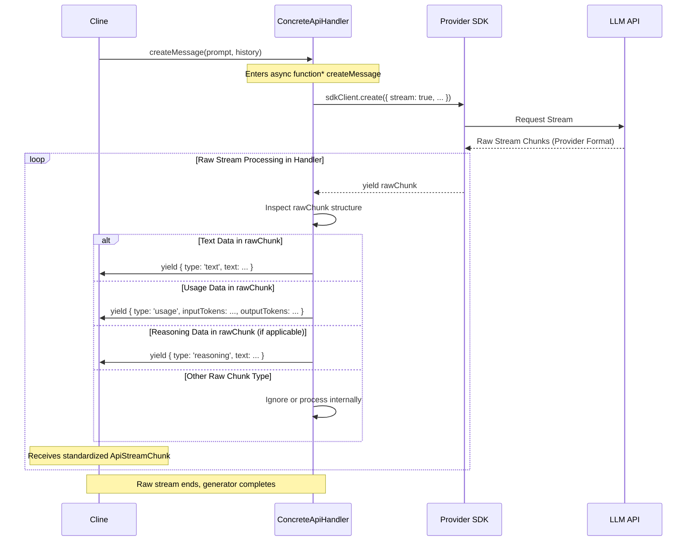

# Chapter 6: ApiStream

In [Chapter 5: ApiHandler](05_apihandler.md), we saw how Roo-Code uses the `ApiHandler` interface to abstract away the differences between various Large Language Model (LLM) provider APIs. We learned that the `createMessage` method, central to this interface, returns a standardized streaming response. This chapter delves into that standardized stream format itself: the `ApiStream`.

## Motivation: Taming the Chaos of Streaming Responses

Modern LLMs often provide responses via streaming APIs. This allows applications like Roo-Code to display results incrementally, improving perceived performance and user experience. However, the raw streaming formats differ significantly between providers (e.g., Anthropic's event structure vs. OpenAI's Server-Sent Events vs. Bedrock's chunk format).

If the [Chapter 4: Cline](04_cline.md) class, which consumes these responses, had to understand the unique structure of each provider's stream, its logic would become incredibly convoluted and tightly coupled to specific provider implementations. Adding support for a new provider would require modifying the core `Cline` logic every time.

`ApiStream` solves this by defining a standard, asynchronous generator interface (`AsyncGenerator<ApiStreamChunk>`) that all `ApiHandler` implementations must adhere to when returning streaming responses. It acts as a common language for streaming data, ensuring `Cline` can process responses consistently, no matter which underlying LLM provider is being used.

**Central Use Case:** Imagine `Cline` has just called `apiHandler.createMessage()` to get a response from the selected LLM. It receives back an `ApiStream`. `Cline` needs to iterate over this stream using a `for await...of` loop. As chunks arrive, it needs to:
1.  Identify if a chunk contains generated text (`type: 'text'`) and append it to the message being displayed in the [Chapter 1: WebView UI](01_webview_ui.md).
2.  Identify if a chunk contains token usage information (`type: 'usage'`) and update internal counters for cost calculation ([Chapter 29: Cost Calculation Utilities](29_cost_calculation_utilities.md)) and context management ([Chapter 23: Sliding Window Context Management](23_sliding_window_context_management.md)).
3.  Identify if a chunk contains reasoning or "thinking" steps (`type: 'reasoning'`) and potentially display this meta-information to the user.

`ApiStream` ensures that `Cline` can perform these actions using a single, unified logic, regardless of whether the underlying provider is Anthropic, OpenAI, Ollama, or any other supported service.

## Key Concepts

1.  **Async Generator Interface (`AsyncGenerator<ApiStreamChunk>`):** `ApiStream` is not a class but a TypeScript *type alias* for `AsyncGenerator<ApiStreamChunk>`. This leverages JavaScript's built-in asynchronous iteration protocol. An `async function*` in the `ApiHandler` implementation naturally produces an object conforming to this interface. It allows the consumer (`Cline`) to pull chunks from the stream asynchronously using the `for await...of` syntax.

2.  **`ApiStreamChunk` (Discriminated Union):** This is the core data structure yielded by the `ApiStream`. It's a TypeScript discriminated union, meaning each object yielded has a `type` property that determines its specific structure and purpose. The defined types are:
    *   **`ApiStreamTextChunk` (`{ type: 'text', text: string }`):** Represents a piece of the main generated text content from the LLM. The `text` property contains the string chunk. Multiple `text` chunks are typically yielded sequentially to form the complete response.
    *   **`ApiStreamUsageChunk` (`{ type: 'usage', inputTokens: number, outputTokens: number, ... }`):** Provides information about token usage. It includes `inputTokens` (often sent once at the start or end) and cumulative `outputTokens` (often sent incrementally during the stream and finalized at the end). It can also include provider-specific details like `cacheReadTokens`, `cacheWriteTokens` (for prompt caching), or `reasoningTokens`. An optional `totalCost` field might be included for real-time cost estimation.
    *   **`ApiStreamReasoningChunk` (`{ type: 'reasoning', text: string }`):** Represents meta-information about the model's internal process, sometimes referred to as "thinking" steps (supported by some models like Anthropic's Claude with the thinking feature enabled). The `text` property contains the reasoning content.

3.  **Producer Responsibility (`ApiHandler`):** It is the responsibility of each concrete `ApiHandler` implementation (e.g., `AnthropicHandler`, `OpenAiHandler`) within its `createMessage` method to:
    *   Receive the raw, provider-specific stream chunks from the underlying SDK.
    *   Translate each raw chunk into one or more standard `ApiStreamChunk` objects.
    *   `yield` these standard chunks. The `async function*` syntax handles the generator creation automatically.

4.  **Consumer Simplicity (`Cline`):** The `Cline` class interacts *only* with the `ApiStream` interface and the standard `ApiStreamChunk` types. It doesn't need any knowledge of the provider-specific raw stream formats. Its consumption logic is a single `for await...of` loop with a `switch` statement (or `if/else if`) handling the different `chunk.type` values.

## Using ApiStream

Let's see how `Cline` consumes the `ApiStream` provided by an `ApiHandler`.

**Example within `Cline.recursivelyMakeClineRequests`:**

```typescript
// --- Simplified conceptual code within Cline.ts ---

// Assume 'this.api' is an instance of a concrete ApiHandler
const stream: ApiStream = this.api.createMessage(systemPrompt, apiConversationHistory);

let assistantMessage = ""; // Accumulate the full text response
let finalUsage: ApiStreamUsageChunk | undefined;

this.isStreaming = true;
try {
    // Consume the standardized stream using for await...of
    for await (const chunk of stream) {
        // Process chunk based on its standardized type
        switch (chunk.type) {
            case "text":
                assistantMessage += chunk.text;
                // Call 'say' to update the UI with the partial text
                // (parseAssistantMessage and presentAssistantMessage handle more complex logic)
                await this.say("text", chunk.text, undefined, true); // 'true' indicates partial
                break;

            case "usage":
                // Update token counters (could be incremental or final)
                this.currentTaskTokenUsage.inputTokens = Math.max(this.currentTaskTokenUsage.inputTokens, chunk.inputTokens);
                this.currentTaskTokenUsage.outputTokens = Math.max(this.currentTaskTokenUsage.outputTokens, chunk.outputTokens);
                // Store potential cache/reasoning tokens
                this.currentTaskTokenUsage.cacheReadTokens = Math.max(this.currentTaskTokenUsage.cacheReadTokens ?? 0, chunk.cacheReadTokens ?? 0);
                // ... update other usage fields ...
                finalUsage = chunk; // Keep track of the latest usage info
                // Potentially update UI with cost estimate based on chunk.totalCost
                break;

            case "reasoning":
                // Optionally display reasoning steps (e.g., via a dedicated 'say' type)
                await this.say("reasoning", chunk.text, undefined, true);
                break;

            default:
                // Optional: Log unexpected chunk types
                console.warn("Received unexpected ApiStreamChunk type:", (chunk as any).type);
                break;
        }

        // Check for abort signals or other conditions to break the loop early
        if (this.abort || this.didRejectTool || this.didAlreadyUseTool) {
            // May need to handle stream cancellation with the provider SDK if possible
            break;
        }
    } // End for await loop

    // Mark the last partial 'text' message as complete
    await this.say("text", "", undefined, false); // 'false' indicates completion

} catch (error) {
    // Handle errors that might occur during stream consumption or generation
    console.error("Error processing API stream:", error);
    await this.say("error", `Error during AI response: ${error.message}`);
} finally {
    this.isStreaming = false;
}

// Update the final message in the UI with accumulated costs/tokens from finalUsage
if (finalUsage) {
    await this.updateApiReqMsg(finalUsage); // Updates the 'api_req_started' message
}

// Add the complete assistant message to the API history
await this.addToApiConversationHistory({ role: "assistant", content: [{ type: "text", text: assistantMessage }] });

// Continue the Cline agentic loop...
```

**Explanation:**

*   `Cline` receives the `ApiStream` from `this.api.createMessage()`.
*   It uses a standard `for await...of` loop to iterate over the chunks yielded by the stream.
*   Inside the loop, a `switch` statement handles each `chunk` based solely on its `type` property (`text`, `usage`, `reasoning`).
*   The logic for handling text updates (`say`), updating token counts, and displaying reasoning is completely independent of the underlying LLM provider.
*   Error handling (`try...catch`) wraps the loop to manage potential issues during stream processing.
*   A `finally` block ensures streaming status is correctly updated.

This clearly demonstrates how the `ApiStream` abstraction simplifies the consumer's code significantly.

## Code Walkthrough

Let's examine the type definitions that constitute the `ApiStream` protocol.

### Type Definitions (`src/api/transform/stream.ts`)

```typescript
// --- File: src/api/transform/stream.ts ---

/**
 * Defines the ApiStream as an AsyncGenerator yielding ApiStreamChunk objects.
 * This is the standard interface for consuming streaming LLM responses.
 */
export type ApiStream = AsyncGenerator<ApiStreamChunk>

/**
 * A discriminated union representing the different types of data chunks
 * that can be yielded by an ApiStream.
 */
export type ApiStreamChunk = ApiStreamTextChunk | ApiStreamUsageChunk | ApiStreamReasoningChunk

/**
 * Represents a chunk of generated text content.
 */
export interface ApiStreamTextChunk {
	type: "text"
	/** The text content of this chunk. */
	text: string
}

/**
 * Represents a chunk containing reasoning or "thinking" steps from the model.
 */
export interface ApiStreamReasoningChunk {
	type: "reasoning"
	/** The reasoning content of this chunk. */
	text: string
}

/**
 * Represents a chunk containing token usage information.
 * Token counts are often cumulative, especially outputTokens.
 */
export interface ApiStreamUsageChunk {
	type: "usage"
	/** Number of input tokens processed (often sent once). */
	inputTokens: number
	/** Cumulative number of output tokens generated so far. */
	outputTokens: number
	/** Tokens read from the prompt cache (provider-specific). */
	cacheWriteTokens?: number
	/** Tokens written to the prompt cache (provider-specific). */
	cacheReadTokens?: number
	/** Tokens used specifically for reasoning/thinking (provider-specific). */
	reasoningTokens?: number
	/** Estimated total cost for the request so far (optional). */
	totalCost?: number
}
```

**Explanation:**

*   **`ApiStream` Type Alias:** Simply defines `ApiStream` as `AsyncGenerator<ApiStreamChunk>`.
*   **`ApiStreamChunk` Union:** Defines the possible shapes of objects yielded by the stream using the `type` property as the discriminant.
*   **Chunk Interfaces (`ApiStreamTextChunk`, etc.):** Clearly define the payload fields expected for each `type` of chunk. Comments explain the purpose of each field.

### Usage in ApiHandler Interface (`src/api/index.ts`)

```typescript
// --- File: src/api/index.ts ---
import { Anthropic } from "@anthropic-ai/sdk"
import { ApiStream } from "./transform/stream" // Import the ApiStream type
// ... other imports ...

export interface ApiHandler {
	/**
	 * Creates a streaming response from the LLM.
	 * @param systemPrompt The system prompt string.
	 * @param messages The conversation history in Anthropic message format.
	 * @param cacheKey Optional key for provider-specific caching.
	 * @returns An ApiStream that yields standardized response chunks. // <--- Return type is ApiStream
	 */
	createMessage(systemPrompt: string, messages: Anthropic.Messages.MessageParam[], cacheKey?: string): ApiStream

	// ... other methods (getModel, countTokens) ...
}

// ... buildApiHandler implementation ...
```

**Explanation:**

*   The `createMessage` method within the `ApiHandler` interface is explicitly typed to return `ApiStream`. This enforces that all concrete implementations must provide a stream conforming to this standard.

## Internal Implementation: Stream Adaptation

The core work of creating an `ApiStream` happens inside the `createMessage` method of each concrete `ApiHandler` implementation (e.g., `AnthropicHandler`, `OpenAiHandler`). These methods are typically implemented as `async function*` (async generator functions).

**Walkthrough (Conceptual Example using OpenAI):**

1.  **Call SDK:** The `OpenAiHandler.createMessage` function calls the OpenAI SDK's `client.chat.completions.create({ ..., stream: true })` method.
2.  **Receive Raw Stream:** The SDK returns an `AsyncIterable` (let's call it `rawOpenAiStream`) that yields raw chunks from the OpenAI API (typically JSON objects within Server-Sent Events).
3.  **Iterate Raw Stream:** The `async function* createMessage` enters a `for await (const rawChunk of rawOpenAiStream)` loop.
4.  **Inspect Raw Chunk:** Inside the loop, the handler inspects the structure of `rawChunk`.
    *   Does `rawChunk.choices[0]?.delta?.content` exist? If yes, it's a text delta.
    *   Does `rawChunk.choices[0]?.finish_reason` exist? If yes, the stream is ending.
    *   Does `rawChunk.usage` exist (usually only in the *final* chunk from OpenAI)? If yes, it contains token usage.
5.  **Translate and Yield:** Based on the inspection, the handler constructs and `yield`s the corresponding *standardized* `ApiStreamChunk`:
    *   If it's a text delta: `yield { type: 'text', text: rawChunk.choices[0].delta.content };`
    *   If it's the final chunk with usage: `yield { type: 'usage', inputTokens: rawChunk.usage.prompt_tokens, outputTokens: rawChunk.usage.completion_tokens };`
    *   (Note: OpenAI doesn't typically provide reasoning chunks or incremental usage in the same way as Anthropic).
6.  **Loop Continues:** The `for await` loop continues processing raw chunks and yielding standard chunks until the `rawOpenAiStream` is exhausted.
7.  **Generator Completes:** The `async function*` completes, signaling the end of the `ApiStream` to the consumer (`Cline`).

**Sequence Diagram:**



**Code Dive (Illustrative Snippet from `AnthropicHandler`):**

```typescript
// --- File: src/api/providers/anthropic.ts ---
// (Simplified excerpt focusing on the stream adaptation loop)

export class AnthropicHandler extends BaseProvider {
	// ... constructor, getModel, etc. ...

	async *createMessage(systemPrompt: string, messages: Anthropic.Messages.MessageParam[]): ApiStream {
		// ... setup client, params, make SDK call ...
		const rawAnthropicStream: AnthropicStream<Anthropic.Messages.RawMessageStreamEvent> =
            await this.client.messages.create(params);

		// --- Adapt Stream to ApiStream ---
		// Iterate over the raw Anthropic stream chunks
		for await (const chunk of rawAnthropicStream) {
			// Translate Anthropic chunk types to standardized ApiStreamChunk types
			switch (chunk.type) {
				case "message_start":
					const usage = chunk.message.usage;
					// Yield standardized 'usage' chunk (initial input tokens)
					yield {
						type: "usage",
						inputTokens: usage.input_tokens || 0,
						outputTokens: usage.output_tokens || 0,
						cacheWriteTokens: usage.cache_creation_input_tokens || undefined,
						cacheReadTokens: usage.cache_read_input_tokens || undefined,
					};
					break;

				case "content_block_delta":
					// Handle text delta
					if (chunk.delta.type === "text_delta") {
						// Yield standardized 'text' chunk
						yield { type: "text", text: chunk.delta.text };
					}
					// Handle thinking delta (if enabled)
					else if (chunk.delta.type === "thinking_delta") {
                         // Yield standardized 'reasoning' chunk
						yield { type: "reasoning", text: chunk.delta.thinking };
					}
					break;

				case "message_delta":
					// Yield partial/incremental 'usage' updates (output tokens)
					yield {
                        type: "usage",
                        inputTokens: 0, // Input tokens don't change mid-stream
                        outputTokens: chunk.usage.output_tokens || 0
                    };
					break;

                case "content_block_start":
                    // Potentially yield text/reasoning from non-delta start events
                    if (chunk.content_block.type === "text") {
                        yield { type: "text", text: chunk.content_block.text };
                    } else if (chunk.content_block.type === "thinking") {
                        yield { type: "reasoning", text: chunk.content_block.thinking };
                    }
                    break;

				case "message_stop":
                    // Stream ended, no specific data in this chunk type usually.
                    // The generator completing signals the end.
					break;

                case "content_block_stop":
                     // Indicates end of a specific block (text/thinking)
                     break;
			}
		} // End for await loop over raw stream
	} // End async function* createMessage
}
```

This snippet clearly shows the `async function*` signature, the loop over the `rawAnthropicStream`, the `switch` statement inspecting `chunk.type` (the *raw* type), and the `yield` statements producing *standardized* `ApiStreamChunk` objects.

## Modification Guidance

Modifying the `ApiStream` itself or how it's produced/consumed usually involves changes across multiple layers.

**Common Modifications:**

1.  **Adding a New Standard Chunk Type (e.g., `tool_call_start`):**
    *   **Define Type:** Add `ApiStreamToolCallStartChunk` interface and include it in the `ApiStreamChunk` union in `src/api/transform/stream.ts`.
    *   **Update Handlers:** Modify *every* concrete `ApiHandler` implementation (`src/api/providers/*.ts`). In their `createMessage` methods, identify the corresponding event in the *raw* provider stream (if it exists) that signifies the start of a tool call. Translate this raw event and `yield { type: 'tool_call_start', toolName: '...', input: ... };`. Providers that don't have this concept might never yield this type.
    *   **Update Consumer:** Modify the `for await...of` loop in `Cline` (`src/core/Cline.ts`) to add a `case 'tool_call_start':` to handle this new chunk type appropriately (e.g., display "Using tool X..." in the UI).
    *   **Consideration:** Adding new standard types increases the complexity that *all* handlers potentially need to support and that the consumer needs to handle. Only add types that represent genuinely common concepts across multiple providers or are essential for the core logic.

2.  **Adding Data to an Existing Chunk Type (e.g., adding `costPerToken` to `usage`):**
    *   **Update Interface:** Add the `costPerToken?: { input: number, output: number }` field to the `ApiStreamUsageChunk` interface in `src/api/transform/stream.ts`.
    *   **Update Handlers:** Modify relevant `ApiHandler` implementations. In their `createMessage` loop, when yielding a `usage` chunk, retrieve the cost information (likely from the `ModelInfo` associated with the handler) and include it in the yielded object: `yield { type: 'usage', ..., costPerToken: { input: modelInfo.pricing.prompt, output: modelInfo.pricing.completion } };`.
    *   **Update Consumer:** Modify the `case 'usage':` block in `Cline`'s loop to access and utilize the new `chunk.costPerToken` field if needed (e.g., for more accurate real-time cost calculation).

3.  **Improving Translation Logic in a Handler:**
    *   If a provider updates its streaming API or if the existing translation is inaccurate (e.g., missing certain events, miscalculating usage), modify the `createMessage` loop within that specific `ApiHandler` (e.g., `BedrockHandler.ts`). Improve how raw chunks are inspected and translated into standard `ApiStreamChunk`s before being `yield`ed. This type of change is isolated to a single handler and doesn't affect the standard interface or the consumer (`Cline`).

**Best Practices:**

*   **Keep `ApiStreamChunk` Focused:** Define standard chunks for core concepts common across providers (text, usage, essential metadata). Avoid adding provider-specific details directly into the standard chunks.
*   **Completeness in Translation:** Ensure handlers attempt to translate all relevant information from the raw stream into the appropriate standard chunks. Don't discard useful data like token counts if the provider offers it.
*   **Handle Edge Cases:** Consider how handlers should behave if a provider's stream ends abruptly, sends unexpected chunk types, or includes errors within the stream.
*   **Stateless Chunks (Mostly):** Each yielded `ApiStreamChunk` should ideally contain all necessary information for its type. While usage chunks might be cumulative, avoid overly complex state management *between* chunks within the consumer if possible.
*   **Performance:** While translation is necessary, avoid excessively complex computations within the stream adaptation loop in the handler, as it runs for every raw chunk received.

**Potential Pitfalls:**

*   **Inconsistent Implementation:** Different handlers might interpret or translate raw provider events slightly differently, leading to subtle inconsistencies in the data `Cline` receives (e.g., when exactly `usage` tokens are reported).
*   **"Leaky" Abstraction:** If a handler fails to translate a crucial piece of provider-specific information, or if `Cline` develops logic that implicitly relies on the behavior of a specific handler's stream adaptation, the abstraction becomes less effective.
*   **Forgetting Handler Updates:** When the standard `ApiStreamChunk` types are modified, it's easy to forget to update *all* relevant `ApiHandler` implementations, leading to type errors or inconsistent behavior.
*   **Error Propagation:** Decide how errors occurring *during* the stream generation/adaptation within the handler should be propagated. Should the generator throw an error (terminating the `for await` in `Cline`), or should it yield a specific error chunk type? (Currently, throwing seems more common).

## Conclusion

The `ApiStream` abstraction, defined by the `AsyncGenerator<ApiStreamChunk>` interface and the standard `ApiStreamChunk` types, is a cornerstone of Roo-Code's ability to interact consistently with diverse LLM streaming APIs. It allows the core task execution logic in [Chapter 4: Cline](04_cline.md) to remain simple and provider-agnostic while consuming streaming responses. The responsibility for adapting raw provider streams to this standard format lies within the concrete [Chapter 5: ApiHandler](05_apihandler.md) implementations.

Understanding this standardized streaming protocol is crucial for tracing how generated text, usage data, and reasoning steps flow from the LLM provider, through the `ApiHandler`, and into the `Cline` for processing and display.

Now that we've covered how Roo-Code gets responses *from* the LLM, the next chapter will focus on how it constructs the instructions *for* the LLM in the first place: [Chapter 7: SystemPrompt](07_systemprompt.md).

