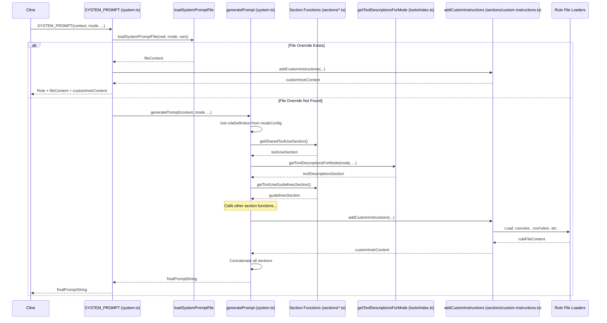

# Chapter 7: SystemPrompt

In [Chapter 6: ApiStream](06_apistream.md), we explored the standardized format Roo-Code uses to receive streaming responses from various LLM providers. Now, we shift our focus to the input side: how does Roo-Code instruct the LLM on what role to play, what capabilities it has, and what rules it must follow? This is the crucial function of the **SystemPrompt**.

## Motivation: Guiding the AI's Behavior

Large Language Models, while powerful, require clear instructions to perform specific tasks effectively and safely within a given context. Simply sending a user's message isn't enough, especially for a complex coding assistant like Roo-Code that needs to interact with files, run commands, and follow specific procedures. The LLM needs a comprehensive "operating manual" for its current session.

The `SystemPrompt` provides this manual. It's the foundational text sent to the LLM *before* the user's first message in a task, establishing the ground rules, defining the AI's persona and capabilities, listing the available tools, and providing essential context about the user's environment. Without a well-structured and dynamically generated SystemPrompt, the LLM's behavior would be unpredictable, less helpful, and potentially unsafe.

**Central Use Case:** When a [Chapter 4: Cline](04_cline.md) instance prepares to make its first call to the LLM via the [Chapter 5: ApiHandler](05_apihandler.md) for a user task (e.g., "Refactor this function using `apply_diff`"), it first constructs the SystemPrompt. This prompt will tell the LLM:
*   Its **role** (e.g., "You are Roo, an expert AI software developer...").
*   The **tools** it can use in the current mode (e.g., `<read_file>`, `<apply_diff>`, `<execute_command>`) and how to format their usage.
*   The general **rules** it must follow (e.g., file path conventions, waiting for tool results, how to handle errors).
*   The specific **guidelines** for using tools effectively.
*   Context about the **user's system** (OS, workspace path, shell).
*   Information about available **integrations** (like [Chapter 19: McpHub / McpServerManager](19_mcphub___mcpservermanager_.md) servers).
*   Any **custom instructions** provided by the user globally or for the current mode.

This comprehensive setup ensures the LLM understands its operational context and constraints *before* attempting the user's refactoring task.

## Key Concepts

1.  **Dynamic Generation:** The SystemPrompt is not static. It's dynamically assembled just before an AI request, primarily by the `SYSTEM_PROMPT` function in `src/core/prompts/system.ts`. This allows it to incorporate information relevant to the current situation:
    *   **Mode:** The selected interaction mode ([Chapter 10: CustomModesManager](10_custommodesmanager.md)) heavily influences the role definition, allowed tools, and custom instructions.
    *   **Configuration:** Settings like the diff strategy ([Chapter 20: DiffViewProvider](20_diffviewprovider.md)), enabled experimental features, or browser integration status affect tool availability and rules.
    *   **Integrations:** The presence and status of MCP servers ([Chapter 19: McpHub / McpServerManager](19_mcphub___mcpservermanager_.md)) determine which MCP-related tools and resources are described.
    *   **Custom Instructions:** User-defined instructions (global or mode-specific) are appended.
    *   **Workspace Context:** Information like the current working directory (`cwd`), OS type, and default shell is included.

2.  **Modular Structure (Sections):** The generation process combines several distinct sections, often defined in separate files under `src/core/prompts/sections/`. This makes the prompt structure easier to manage and modify. Common sections include:
    *   **Role Definition:** Defines the AI's persona (based on the current mode).
    *   **Shared Tool Use:** Basic instructions on tool usage format (XML tags).
    *   **Tool Descriptions:** Detailed descriptions of tools available *in the current mode*, generated by `getToolDescriptionsForMode` which calls specific functions for each tool (e.g., `getReadFileDescription`).
    *   **Tool Use Guidelines:** General rules for iterating with tools (step-by-step, waiting for results).
    *   **MCP Servers:** Lists connected MCP servers and their available tools/resources (if MCP is enabled and relevant).
    *   **Capabilities:** Describes general abilities (file access, command execution, browser interaction).
    *   **Modes:** Lists available modes the AI can potentially switch to.
    *   **Rules:** Core operational constraints (file paths, handling errors, asking questions).
    *   **System Information:** OS, shell, workspace path.
    *   **Objective:** The overall goal of the iterative task process.
    *   **Custom Instructions:** Appends user-provided global, mode-specific, and file-based rules (`.roorules`).

3.  **Tool Descriptions (`getToolDescriptionsForMode`):** This crucial function (in `src/core/prompts/tools/index.ts`) dynamically generates the descriptions for tools that are actually allowed in the *current* mode. It checks the mode configuration ([Chapter 10: CustomModesManager](10_custommodesmanager.md)) and calls specific description-generating functions for each permitted tool (e.g., `getReadFileDescription`, `getApplyDiffDescription`). This ensures the LLM only sees tools it's allowed to use.

4.  **Role Definition:** Each mode defines a specific role (e.g., "Expert software developer," "Technical writer," "Code reviewer"). This definition, sourced from the mode configuration (`src/shared/modes.ts` or custom modes), forms the very beginning of the SystemPrompt, setting the AI's persona.

5.  **Rules and Guidelines:** These sections provide critical instructions on *how* the LLM should operate. They cover aspects like file path handling, iterative tool use, error management, asking follow-up questions (`ask_followup_question` tool), and how to conclude a task (`attempt_completion` tool).

6.  **Contextual Information:** Including details like the OS (`osName()`), shell (`getShell()`), and `cwd` helps the LLM generate commands or understand file paths more accurately.

7.  **Customization:**
    *   **Custom Instructions:** Users can provide global instructions or instructions specific to built-in or custom modes via settings. These are appended in a dedicated section.
    *   **Rule Files (`.roorules`, `.roo/rules/`, `.roo/rules-<mode>/`):** Roo-Code looks for rule files in the workspace (`.roorules`, `.clinerules`) or within the `.roo/` directory (generic rules in `.roo/rules/` or mode-specific rules in `.roo/rules-<mode>/`). Their content is appended to the Custom Instructions section.
    *   **File-based System Prompt Override (`.roo/system-prompt-<mode>`):** For ultimate control, a user can create a file named `.roo/system-prompt-<mode>` (e.g., `.roo/system-prompt-code`). If this file exists, its content *replaces* the entire dynamically generated prompt (except for the role definition and custom instructions/rules, which are still added). This allows power users to define completely custom behavior for specific modes, potentially using template variables like `{{workspace}}`, `{{mode}}`, etc.

## Using the SystemPrompt

The SystemPrompt is primarily generated and used within the [Chapter 4: Cline](04_cline.md) instance during the `attemptApiRequest` phase, just before calling the [Chapter 5: ApiHandler](05_apihandler.md)'s `createMessage` method.

**Simplified Flow within `Cline.attemptApiRequest`:**

1.  **Gather Parameters:** `Cline` determines the current `mode`, checks `diffStrategy`, gets the `mcpHub` reference, browser status, `cwd`, custom instructions from the provider, etc.
2.  **Generate System Prompt:** It calls the main `SYSTEM_PROMPT` async function:
    ```typescript
    const systemPromptText = await SYSTEM_PROMPT(
        this.provider.context, // VS Code ExtensionContext
        this.cwd,              // Current working directory
        this.supportsComputerUse, // Browser/command capabilities
        this.mcpHub,           // MCP Hub instance
        this.diffStrategy,     // Diff strategy instance
        this.browserViewportSize, // Browser viewport
        this.mode,             // Current mode slug
        this.customModePrompts,// Custom prompt components (if any)
        this.customModes,      // All custom mode configs
        this.globalCustomInstructions, // Global user instructions
        this.diffEnabled,      // Is diff tool group enabled?
        this.experiments,      // Enabled experimental features
        this.enableMcpServerCreation, // Flag for MCP creation tool
        this.language,         // User's language setting
        this.rooIgnoreInstructions, // Instructions from RooIgnoreController
    );
    ```
3.  **API Call:** `Cline` then calls the `ApiHandler`:
    ```typescript
    const stream = this.api.createMessage(
        systemPromptText,       // The generated system prompt
        apiConversationHistory // The current message history
    );
    ```
4.  **LLM Processing:** The `ApiHandler` sends both the `systemPromptText` and the `apiConversationHistory` to the configured LLM. The LLM uses the system prompt to understand its role, available tools, rules, and context before processing the user/assistant messages in the history to generate the next response.

The system prompt is typically generated only once per task instance or when significant context (like the mode) changes, as it can be quite large and adds to the token count.

## Code Walkthrough

Let's examine the key files involved in generating the SystemPrompt.

### Main Generation Function (`src/core/prompts/system.ts`)

```typescript
// --- File: src/core/prompts/system.ts ---
import { /* ... many imports for modes, tools, sections, os, vscode ... */ } from /* ... */ ;
import { loadSystemPromptFile, PromptVariables } from "./sections/custom-system-prompt";
import { getToolDescriptionsForMode } from "./tools";
import {
	getRulesSection, getSystemInfoSection, getObjectiveSection, /* ... other section imports ... */
} from "./sections";

// Internal helper to generate the standard prompt structure
async function generatePrompt(
	context: vscode.ExtensionContext, cwd: string, supportsComputerUse: boolean, mode: Mode,
	mcpHub?: McpHub, diffStrategy?: DiffStrategy, browserViewportSize?: string,
	promptComponent?: PromptComponent, customModeConfigs?: ModeConfig[], globalCustomInstructions?: string,
	diffEnabled?: boolean, experiments?: Record<string, boolean>, enableMcpServerCreation?: boolean,
	language?: string, rooIgnoreInstructions?: string,
): Promise<string> {
    // Ensure context is provided
	if (!context) throw new Error("Extension context required");

    // Determine effective diff strategy based on whether diff is enabled
	const effectiveDiffStrategy = diffEnabled ? diffStrategy : undefined;

    // Get the full configuration for the current mode (built-in or custom)
	const modeConfig = getModeBySlug(mode, customModeConfigs) || /* fallback */;
    // Determine the role definition (from custom prompt component or mode config)
	const roleDefinition = promptComponent?.roleDefinition || modeConfig.roleDefinition;

    // Generate MCP server section conditionally based on mode group
	const [modesSection, mcpServersSection] = await Promise.all([
		getModesSection(context),
		modeConfig.groups.some(/* check if 'mcp' group active */)
			? getMcpServersSection(mcpHub, effectiveDiffStrategy, enableMcpServerCreation)
			: Promise.resolve(""),
	]);

    // Assemble the prompt by concatenating sections
	const basePrompt = `${roleDefinition}

${getSharedToolUseSection()}

${getToolDescriptionsForMode( // Crucial: Gets tools allowed FOR THIS MODE
	mode, cwd, supportsComputerUse, effectiveDiffStrategy, browserViewportSize,
	mcpHub, customModeConfigs, experiments,
)}

${getToolUseGuidelinesSection()}

${mcpServersSection}

${getCapabilitiesSection(cwd, supportsComputerUse, mcpHub, effectiveDiffStrategy)}

${modesSection}

${getRulesSection(cwd, supportsComputerUse, effectiveDiffStrategy, experiments)}

${getSystemInfoSection(cwd, mode, customModeConfigs)}

${getObjectiveSection()}

${await addCustomInstructions( // Appends all custom instructions/rules
    promptComponent?.customInstructions || modeConfig.customInstructions || "",
    globalCustomInstructions || "", cwd, mode,
    { language, rooIgnoreInstructions }
)}`

	return basePrompt;
}

// The main exported function called by Cline
export const SYSTEM_PROMPT = async (
	context: vscode.ExtensionContext, cwd: string, supportsComputerUse: boolean,
	mcpHub?: McpHub, diffStrategy?: DiffStrategy, browserViewportSize?: string,
	mode: Mode = defaultModeSlug, customModePrompts?: CustomModePrompts,
	customModes?: ModeConfig[], globalCustomInstructions?: string, diffEnabled?: boolean,
	experiments?: Record<string, boolean>, enableMcpServerCreation?: boolean,
	language?: string, rooIgnoreInstructions?: string,
): Promise<string> => {
	if (!context) throw new Error("Extension context required");

	// Helper to safely cast custom prompt data
	const getPromptComponent = (value: unknown): PromptComponent | undefined => { /* ... */ };

	// --- Custom File-based Override Check ---
	const variablesForPrompt: PromptVariables = { /* populate variables */ };
    // Attempt to load a custom prompt file specific to this mode
	const fileCustomSystemPrompt = await loadSystemPromptFile(cwd, mode, variablesForPrompt);

	const promptComponent = getPromptComponent(customModePrompts?.[mode]);
	const currentMode = getModeBySlug(mode, customModes) || /* fallback */;

	// If a file-based override exists, use it (with role and custom instructions added)
	if (fileCustomSystemPrompt) {
		const roleDefinition = promptComponent?.roleDefinition || currentMode.roleDefinition;
		const customInstructions = await addCustomInstructions(/* ... */);
		// Note: Tool descriptions, rules etc. are NOT included when using file override
		return `${roleDefinition}\n\n${fileCustomSystemPrompt}\n\n${customInstructions}`;
	}

	// --- Default Dynamic Generation ---
    // If no file override, use the standard section-based generation
	const effectiveDiffStrategy = diffEnabled ? diffStrategy : undefined;
	return generatePrompt(
		context, cwd, supportsComputerUse, currentMode.slug, mcpHub,
		effectiveDiffStrategy, browserViewportSize, promptComponent, customModes,
		globalCustomInstructions, diffEnabled, experiments, enableMcpServerCreation,
		language, rooIgnoreInstructions,
	);
};
```

**Explanation:**

*   **`SYSTEM_PROMPT` (Exported Function):** This is the main entry point. It receives all necessary context (provider context, cwd, mode, integrations, config flags, custom instructions).
*   **File Override Logic:** It first checks if a custom system prompt file (`.roo/system-prompt-<mode>`) exists using `loadSystemPromptFile`. If found, it interpolates variables (`{{workspace}}`, etc.), combines it only with the role definition and custom instructions/rules, and returns immediately. This bypasses the standard section-based generation.
*   **`generatePrompt` (Internal Helper):** If no file override is found, this function is called.
    *   It determines the `roleDefinition` based on the mode.
    *   It calls various imported functions (`getSharedToolUseSection`, `getToolDescriptionsForMode`, `getRulesSection`, etc.) to generate each section's content.
    *   Crucially, `getToolDescriptionsForMode` ensures only tools relevant to the current `mode` are included.
    *   `addCustomInstructions` handles appending global, mode-specific, and file-based (`.roorules`, `.roo/rules/`) custom instructions.
    *   It concatenates all generated sections into the final `basePrompt` string.

### Section Generation Example (`src/core/prompts/sections/rules.ts`)

```typescript
// --- File: src/core/prompts/sections/rules.ts ---
import { DiffStrategy } from "../../../shared/tools"

// Helper to generate editing tool instructions based on enabled features
function getEditingInstructions(diffStrategy?: DiffStrategy, experiments?: Record<string, boolean>): string {
    const instructions: string[] = [];
    const availableTools: string[] = [];
    // Conditionally add tools based on diffStrategy and experimental flags
    if (diffStrategy) availableTools.push("apply_diff (...)");
    availableTools.push("write_to_file (...)");
    availableTools.push("insert_content (...)");
    availableTools.push("search_and_replace (...)");
    // Add instructions about preferring specific tools, handling write_to_file, etc.
    // ... instruction text ...
    return instructions.join("\n");
}

// Main function to generate the rules section
export function getRulesSection(
	cwd: string, supportsComputerUse: boolean, diffStrategy?: DiffStrategy,
	experiments?: Record<string, boolean> | undefined,
): string {
    // Use template literals to build the rules string
	return `====

RULES

- The project base directory is: ${cwd.toPosix()}
- All file paths must be relative to this directory...
// ... many other hardcoded and dynamically generated rules ...
${getEditingInstructions(diffStrategy, experiments)} // Include specific editing rules
// ... more rules about tool usage, asking questions, concluding tasks ...
- You are STRICTLY FORBIDDEN from starting your messages with "Great", "Certainly", "Okay", "Sure"...
// ... etc. ...
`;
}
```

**Explanation:**

*   **Modularity:** This file focuses solely on generating the "RULES" section.
*   **Dynamic Content:** It incorporates parameters like `cwd`, `supportsComputerUse`, and `diffStrategy` to tailor the rules. For instance, the `getEditingInstructions` helper changes based on whether `apply_diff` is available.
*   **Clarity:** Uses clear headings and bullet points to structure the rules for the LLM.
*   **Hardcoded Rules:** Many rules are fundamental and hardcoded directly into the template string.

### Tool Description Generation (`src/core/prompts/tools/index.ts`)

```typescript
// --- File: src/core/prompts/tools/index.ts ---
import { ToolName } from "../../../schemas"
import { TOOL_GROUPS, ALWAYS_AVAILABLE_TOOLS, DiffStrategy } from "../../../shared/tools"
import { McpHub } from "../../../services/mcp/McpHub"
import { Mode, ModeConfig, getModeConfig, isToolAllowedForMode, /* ... */ } from "../../../shared/modes"
import { ToolArgs } from "./types"
// Import description functions for each individual tool
import { getExecuteCommandDescription } from "./execute-command"
import { getReadFileDescription } from "./read-file"
// ... other tool description imports ...
import { getApplyDiffDescription } from "./apply-diff" // Example for diff tool

// Map tool names to their specific description-generating functions
const toolDescriptionMap: Record<string, (args: ToolArgs) => string | undefined> = {
	execute_command: (args) => getExecuteCommandDescription(args),
	read_file: (args) => getReadFileDescription(args),
	// ... mappings for all tools ...
	apply_diff: (args) =>
		args.diffStrategy ? getApplyDiffDescription(args) : undefined, // Conditionally include diff
};

// Function called by system.ts to get descriptions for the *current* mode
export function getToolDescriptionsForMode(
	mode: Mode, cwd: string, supportsComputerUse: boolean, diffStrategy?: DiffStrategy,
	browserViewportSize?: string, mcpHub?: McpHub, customModes?: ModeConfig[],
	experiments?: Record<string, boolean>,
): string {
    // Get the configuration for the specified mode
	const config = getModeConfig(mode, customModes);
    // Prepare arguments needed by individual description functions
	const args: ToolArgs = { cwd, supportsComputerUse, diffStrategy, browserViewportSize, mcpHub };

	const tools = new Set<string>(); // Use a Set to avoid duplicates

	// Add tools based on the mode's configured groups
	config.groups.forEach((groupEntry) => {
		const groupName = getGroupName(groupEntry);
		const toolGroup = TOOL_GROUPS[groupName];
		if (toolGroup) {
			toolGroup.tools.forEach((tool) => {
                // Check if the tool is actually allowed for this mode (considers overrides)
				if (isToolAllowedForMode(tool as ToolName, mode, customModes ?? [], undefined, undefined, experiments ?? {})) {
					tools.add(tool);
				}
			});
		}
	});

	// Add tools that are always available regardless of mode
	ALWAYS_AVAILABLE_TOOLS.forEach((tool) => tools.add(tool));

	// Generate descriptions only for the collected set of allowed tools
	const descriptions = Array.from(tools).map((toolName) => {
		const descriptionFn = toolDescriptionMap[toolName];
		if (!descriptionFn) return undefined;
		// Call the specific description function (e.g., getReadFileDescription)
		return descriptionFn(args);
	});

	// Format the descriptions under the # Tools heading
	return `# Tools\n\n${descriptions.filter(Boolean).join("\n\n")}`;
}

// Example individual tool description function
// --- File: src/core/prompts/tools/read-file.ts ---
import { ToolArgs } from "./types";

export function getReadFileDescription(args: ToolArgs): string {
    return `<read_file>
<summary>Reads the content of a file relative to the workspace root: ${args.cwd.toPosix()}</summary>
<parameters>
<path>The relative path to the file.</path>
</parameters>
</read_file>`;
}
```

**Explanation:**

*   **`toolDescriptionMap`:** Maps tool names (like `"read_file"`) to the functions that generate their specific XML description (like `getReadFileDescription`).
*   **`getToolDescriptionsForMode`:**
    *   Takes the current `mode` and other context.
    *   Gets the mode's configuration (`getModeConfig`).
    *   Determines the set of allowed tools for this mode by checking its `groups` and using the `isToolAllowedForMode` helper function (which handles mode overrides and experimental flags).
    *   Adds `ALWAYS_AVAILABLE_TOOLS` (like `attempt_completion`).
    *   Iterates through the *allowed* tools, looks up the corresponding description function in `toolDescriptionMap`, and calls it.
    *   Joins the generated descriptions into a single string.
*   **Individual Description Functions (e.g., `getReadFileDescription`):** These functions return the specific XML structure defining the tool's name, summary, and parameters, incorporating context like `args.cwd` where needed.

### Custom Instruction/Rule Loading (`src/core/prompts/sections/custom-instructions.ts`)

```typescript
// --- File: src/core/prompts/sections/custom-instructions.ts ---
import fs from "fs/promises"
import path from "path"
// ... other imports ...

// Helper to read files safely
async function safeReadFile(filePath: string): Promise<string> { /* ... */ }
// Helper to check if directory exists
async function directoryExists(dirPath: string): Promise<boolean> { /* ... */ }
// Helper to read all text files recursively from a directory (handles symlinks)
async function readTextFilesFromDirectory(dirPath: string): Promise<Array<{ filename: string; content: string }>> { /* ... */ }
// Helper to format content from multiple rule files
function formatDirectoryContent(dirPath: string, files: Array<{ filename: string; content: string }>): string { /* ... */ }

// Loads generic rules from .roorules, .clinerules, or .roo/rules/
export async function loadRuleFiles(cwd: string): Promise<string> {
    // Check .roo/rules/ directory first
	const rooRulesDir = path.join(cwd, ".roo", "rules");
	if (await directoryExists(rooRulesDir)) {
		const files = await readTextFilesFromDirectory(rooRulesDir);
		if (files.length > 0) return formatDirectoryContent(rooRulesDir, files);
	}
    // Fallback to legacy files
	const ruleFiles = [".roorules", ".clinerules"];
	for (const file of ruleFiles) { /* check and return content */ }
	return "";
}

// Main function to assemble all custom instructions and rules
export async function addCustomInstructions(
	modeCustomInstructions: string, // From mode config
	globalCustomInstructions: string, // From global settings
	cwd: string,
	mode: string, // Current mode slug
	options: { language?: string; rooIgnoreInstructions?: string } = {},
): Promise<string> {
	const sections = [];

	// --- Load Mode-Specific Rule Files ---
	let modeRuleContent = ""; let usedRuleFile = "";
	const modeRulesDir = path.join(cwd, ".roo", `rules-${mode}`);
	if (await directoryExists(modeRulesDir)) { // Check .roo/rules-<mode>/ first
		const files = await readTextFilesFromDirectory(modeRulesDir);
		if (files.length > 0) modeRuleContent = formatDirectoryContent(modeRulesDir, files);
        usedRuleFile = modeRulesDir;
	} else { // Fallback to legacy .roorules-<mode> / .clinerules-<mode>
		const rooModeRuleFile = `.roorules-${mode}`;
		modeRuleContent = await safeReadFile(path.join(cwd, rooModeRuleFile));
        if (modeRuleContent) usedRuleFile = rooModeRuleFile;
		// ... check .clinerules-<mode> ...
	}

	// --- Assemble Sections ---
	if (options.language) sections.push(`Language Preference:\n...`);
	if (globalCustomInstructions.trim()) sections.push(`Global Instructions:\n${globalCustomInstructions.trim()}`);
	if (modeCustomInstructions.trim()) sections.push(`Mode-specific Instructions:\n${modeCustomInstructions.trim()}`);

	const rules = [];
	if (modeRuleContent.trim()) { // Add mode-specific file rules
        if (usedRuleFile.includes(".roo")) rules.push(modeRuleContent.trim());
		else rules.push(`# Rules from ${usedRuleFile}:\n${modeRuleContent}`);
	}
    if (options.rooIgnoreInstructions) rules.push(options.rooIgnoreInstructions); // Add .rooignore rules
	const genericRuleContent = await loadRuleFiles(cwd); // Load generic file rules
	if (genericRuleContent.trim()) rules.push(genericRuleContent.trim());
    if (rules.length > 0) sections.push(`Rules:\n\n${rules.join("\n\n")}`);

	const joinedSections = sections.join("\n\n");
    // Wrap everything in a clear header for the LLM
	return joinedSections ? `\n====\n\nUSER'S CUSTOM INSTRUCTIONS\n...\n${joinedSections}` : "";
}
```

**Explanation:**

*   **File Loading:** This module contains logic (`safeReadFile`, `directoryExists`, `readTextFilesFromDirectory`, `loadRuleFiles`) to find and read custom instruction/rule files from various locations (`.roorules`, `.roo/rules/`, `.roo/rules-<mode>/`). It prioritizes the `.roo/` directory structure.
*   **`addCustomInstructions`:** This function orchestrates the assembly:
    *   It receives global and mode-specific instructions passed as arguments (originating from settings/mode config).
    *   It loads mode-specific rules from files (`.roo/rules-<mode>/` or legacy files).
    *   It loads generic rules from files (`.roo/rules/` or legacy files).
    *   It includes instructions derived from `.rooignore` files passed via `options.rooIgnoreInstructions` ([Chapter 21: RooIgnoreController](21_rooignorecontroller.md)).
    *   It combines all these sources into a single string under the "USER'S CUSTOM INSTRUCTIONS" heading, ensuring a consistent structure for the LLM.

## Internal Implementation

The generation is primarily a process of string concatenation orchestrated by `system.ts`.

**Step-by-Step:**

1.  `Cline` calls `SYSTEM_PROMPT(...)`.
2.  `SYSTEM_PROMPT` checks for a file override (`.roo/system-prompt-<mode>`).
    *   **If Found:** `loadSystemPromptFile` reads the file, `interpolatePromptContent` replaces placeholders (like `{{workspace}}`), `addCustomInstructions` is called to get user rules/instructions, and the final string (Role + File Content + Custom Instructions) is returned.
    *   **If Not Found:** `SYSTEM_PROMPT` calls `generatePrompt(...)`.
3.  `generatePrompt` determines the `roleDefinition` from the mode config.
4.  `generatePrompt` calls various `get...Section` functions from `src/core/prompts/sections/` and `getToolDescriptionsForMode` from `src/core/prompts/tools/`.
5.  Each section function generates its specific part of the prompt, potentially using helper functions or accessing context passed down (like `cwd`, `mcpHub`).
6.  `getToolDescriptionsForMode` determines the allowed tools for the current mode and calls individual description functions (e.g., `getReadFileDescription`) for each allowed tool.
7.  `addCustomInstructions` loads instructions/rules from settings and workspace files (`.roorules`, `.roo/rules/`, etc.).
8.  `generatePrompt` concatenates all the returned section strings in a predefined order, separated by `====\n\n`.
9.  The final concatenated string is returned to `Cline`.

**Sequence Diagram:**



## Modification Guidance

Modifying the SystemPrompt involves changing the instructions given to the LLM, which directly impacts its behavior.

**Common Modifications:**

1.  **Changing a Core Rule:**
    *   **Locate:** Find the relevant rule text within the appropriate section file (e.g., `src/core/prompts/sections/rules.ts` for general rules, `tool-use-guidelines.ts` for tool iteration rules).
    *   **Edit:** Modify the text directly within the template string or the logic that generates it.
    *   **Test:** Thoroughly test the impact of the rule change on LLM behavior across different modes and tasks.

2.  **Adding a New Section:**
    *   **Create File:** Create a new file in `src/core/prompts/sections/` (e.g., `my-new-section.ts`).
    *   **Implement Function:** Define and export an `async` function (e.g., `getMyNewSection(...)`) that takes necessary context and returns the string content for your section.
    *   **Import & Integrate:**
        *   Import your function in `src/core/prompts/system.ts`.
        *   Call your function within `generatePrompt` at the desired location in the prompt structure.
        *   Add its result to the final concatenation.
        *   Update the `index.ts` in the sections folder.
    *   **Test:** Verify the new section appears correctly and influences the LLM as expected.

3.  **Modifying a Tool's Description:**
    *   **Locate:** Find the specific tool description file (e.g., `src/core/prompts/tools/read-file.ts`).
    *   **Edit:** Modify the XML structure or the summary/parameter descriptions within the returned string. Ensure it accurately reflects the tool's functionality and parameters.
    *   **Test:** Check if the LLM correctly understands and uses the tool with the updated description.

4.  **Adding/Removing a Tool from a Mode:**
    *   **Mode Config:** Modify the `groups` array in the `ModeConfig` definition for the relevant mode (either in `src/shared/modes.ts` for built-in modes or via custom mode configuration managed by [Chapter 10: CustomModesManager](10_custommodesmanager.md)). Add or remove the tool's group name (e.g., `"filesystem"`, `"terminal"`).
    *   **Overrides (Optional):** If using specific tool overrides for the mode, adjust the `tools` property in the `ModeConfig`.
    *   **Verification:** `getToolDescriptionsForMode` will automatically pick up these changes and include/exclude the tool description accordingly.

5.  **Implementing a Custom System Prompt File:**
    *   **Create File:** In your workspace, create a directory named `.roo`. Inside it, create a file named `system-prompt-<mode_slug>` (e.g., `.roo/system-prompt-code`).
    *   **Write Content:** Add your complete custom system prompt text to this file. You can use placeholders like `{{workspace}}`, `{{mode}}`, `{{language}}`, `{{shell}}`, `{{operatingSystem}}`.
    *   **Activate:** Roo-Code will automatically detect and use this file for the specified mode, replacing the default dynamic generation (except for role definition and custom instructions/rules).

**Best Practices:**

*   **Clarity and Conciseness:** Write instructions clearly and avoid ambiguity. LLMs work best with direct, unambiguous language.
*   **Structure:** Use headings (`====`, `#`), bullet points, and XML tags consistently to structure the prompt, making it easier for the LLM to parse.
*   **Consistency:** Ensure tool descriptions, rules, and capabilities are consistent with each other.
*   **Testing:** System prompt changes can have subtle but significant effects. Test thoroughly with various user inputs and scenarios. Use tools like prompt playgrounds if available.
*   **Modularity:** Keep section generation logic contained within the `src/core/prompts/sections/` and `tools/` directories.

**Potential Pitfalls:**

*   **Conflicting Instructions:** Adding custom instructions or rules that contradict the base prompt's rules can confuse the LLM.
*   **Overly Long Prompts:** Extremely long system prompts consume more tokens and can sometimes dilute the importance of specific instructions. Keep sections relevant and reasonably concise.
*   **Incorrect Tool Descriptions:** If a tool's description doesn't accurately reflect its parameters or behavior, the LLM will likely misuse it.
*   **Formatting Errors:** Incorrect XML formatting for tool descriptions can prevent the LLM from correctly identifying or using tools.
*   **Ignoring Context:** Failing to properly incorporate dynamic context (like `cwd` or available MCP tools) can lead to inaccurate or ineffective instructions.
*   **File Override Issues:** When using a file override, remember that it replaces *most* of the default prompt. Ensure your custom file includes all necessary instructions (tool usage format, core rules) if you deviate significantly from the default structure.

## Conclusion

The SystemPrompt is the bedrock of guiding the LLM's behavior within Roo-Code. Its dynamic, modular generation ensures that the AI receives tailored instructions based on the current mode, configuration, and integrations. By clearly defining the role, capabilities, available tools, rules, and context, the SystemPrompt enables more reliable, effective, and safe interactions. Understanding its structure and how it's assembled from various sections and custom sources is key to customizing or extending Roo-Code's core AI capabilities.

Having established how Roo-Code instructs the LLM, we now turn our attention to the specific actions the LLM can request: the Tools. The next chapter delves into the definition, validation, and execution of these tools: [Chapter 8: Tools](08_tools.md).

