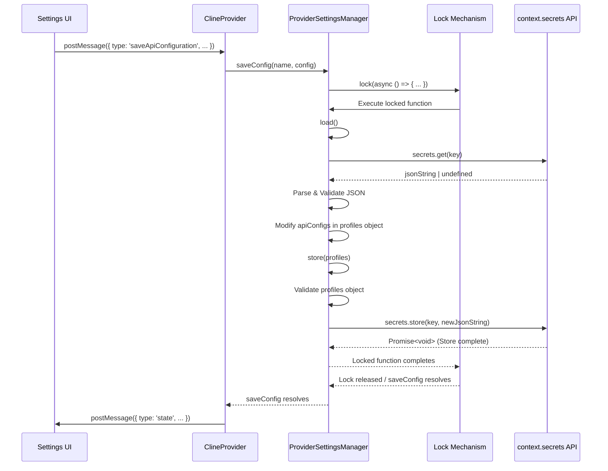

# Chapter 9: ProviderSettingsManager

In [Chapter 8: Tools](08_tools.md), we explored the actions the Roo-Code AI agent can request. These actions, especially those involving API calls to LLMs, often require configuration like API keys, model IDs, and provider-specific settings. Users might have multiple keys (e.g., personal vs. work), prefer different models for different tasks, or use various LLM providers. How does Roo-Code manage these diverse and sensitive configurations securely and flexibly? This chapter focuses on the `ProviderSettingsManager`.

## Motivation: Secure and Flexible API Configuration

Hardcoding API keys or storing them in plain text configuration files is insecure and inflexible. Users need a way to manage multiple sets of API credentials and settings for different LLM providers (like Anthropic, OpenAI, Bedrock, Ollama) without exposing sensitive keys directly in VS Code settings or workspace files. Furthermore, users might want to associate specific configurations with particular tasks or modes (e.g., use a powerful but expensive model for code generation but a faster, cheaper model for general chat).

The `ProviderSettingsManager` addresses these needs by:

1.  Storing API configurations **securely** using VS Code's `vscode.ExtensionContext.secrets` API, which leverages the operating system's credential store.
2.  Allowing users to create, save, load, rename, and delete multiple **named profiles** (configurations).
3.  Handling the **mapping** between specific interaction modes ([Chapter 10: CustomModesManager](10_custommodesmanager.md)) and preferred configuration profiles.
4.  Managing necessary **data migrations** as the structure of the configuration settings evolves over time.

**Central Use Case:** A user wants to configure Roo-Code for both their work OpenAI account (using GPT-4 Turbo for a "Code" mode) and their personal Anthropic account (using Claude 3 Sonnet for a "Chat" mode).

Using the Settings UI ([Chapter 35: Settings UI Components (WebView)](35_settings_ui_components__webview_.md)), the user:
1.  Creates a profile named "Work OpenAI".
2.  Enters their OpenAI API key and selects the GPT-4 Turbo model.
3.  Saves the "Work OpenAI" profile.
4.  Creates another profile named "Personal Anthropic".
5.  Enters their Anthropic API key and selects Claude 3 Sonnet.
6.  Saves the "Personal Anthropic" profile.
7.  Pins the "Work OpenAI" profile to the "Code" mode.
8.  Pins the "Personal Anthropic" profile to the "Chat" mode.

The `ProviderSettingsManager` handles saving these profiles securely (storing API keys in `vscode.ExtensionContext.secrets`), associates the profile IDs with the respective modes, and allows the user to easily switch between modes, automatically loading the correct API configuration behind the scenes.

## Key Concepts

1.  **Secure Storage (`vscode.ExtensionContext.secrets`):** The core principle is leveraging VS Code's built-in secret storage. This API provides a platform-specific secure way to store sensitive data like API keys, preventing them from being exposed in regular settings files or source control. `ProviderSettingsManager` reads and writes a single JSON string representing *all* profiles under a specific key (e.g., `roo_cline_config_api_config`) within this secret storage.

2.  **Profiles (`ProviderProfiles`):** The manager handles a data structure (defined by `providerProfilesSchema` using Zod, typically in `src/core/config/ProviderSettingsManager.ts` or `src/schemas/index.ts`) that contains:
    *   `apiConfigs`: A record (object map) where keys are user-defined profile *names* (e.g., "default", "work-gpt4") and values are the corresponding `ProviderSettings` objects (containing API keys, model IDs, base URLs, etc.), augmented with a unique internal `id`.
    *   `currentApiConfigName`: The name of the currently active profile.
    *   `modeApiConfigs`: An optional record mapping mode slugs (e.g., "code", "chat") to the unique `id` of the preferred configuration profile for that mode.
    *   `migrations`: An object tracking which data migrations have been applied to this user's configuration.

3.  **Configuration Object (`ProviderSettings`):** This object (defined by `providerSettingsSchema` in `src/schemas/index.ts`) holds all the specific settings for a single profile, including provider type (`apiProvider`), API keys (`apiKey`, `openAiApiKey`, etc.), model IDs, base URLs, and other provider-specific options. Note that sensitive key fields are stored *only* within `vscode.ExtensionContext.secrets`.

4.  **CRUD Operations:** The manager provides methods for managing profiles:
    *   `saveConfig(name, config)`: Creates or updates a profile with the given name. Assigns a unique internal `id` if creating.
    *   `loadConfig(name)`: Loads the configuration for the named profile and sets it as the `currentApiConfigName`.
    *   `loadConfigById(id)`: Loads a configuration by its unique `id` and sets it as current.
    *   `deleteConfig(name)`: Removes a profile by name.
    *   `listConfig()`: Returns metadata (`ApiConfigMeta`: name, id, provider) for all saved profiles, used by the Settings UI.

5.  **Mode Mapping:**
    *   `setModeConfig(mode, configId)`: Associates a specific mode slug with a configuration profile's unique `id`.
    *   `getModeConfigId(mode)`: Retrieves the configuration ID associated with a mode. This allows [Chapter 2: ClineProvider](02_clineprovider.md) to automatically load the correct profile when the user switches modes.

6.  **Data Migration (`initialize`, `migrate...` methods):** As Roo-Code evolves, the structure of `ProviderSettings` might change (e.g., adding new options, renaming fields). The `initialize` method checks the `migrations` record stored in the secrets and runs specific migration functions (like `migrateRateLimitSeconds`, `migrateDiffSettings`) to update older configuration structures to the latest format automatically, ensuring backward compatibility.

7.  **Synchronization (`_lock`):** Reading from and writing to `vscode.ExtensionContext.secrets` are asynchronous operations. To prevent race conditions where multiple operations might try to read/write simultaneously (potentially leading to data loss), the manager uses a simple promise-based locking mechanism (`_lock`, `lock()`) to serialize these operations.

8.  **Interaction with UI:** The Settings UI ([Chapter 35: Settings UI Components (WebView)](35_settings_ui_components__webview_.md)) communicates with the `ProviderSettingsManager` via the [Chapter 3: Webview/Extension Message Protocol](03_webview_extension_message_protocol.md). UI actions trigger messages like `saveApiConfiguration`, `loadApiConfiguration`, `deleteApiConfiguration`, `setModeConfig`, which are handled by the `webviewMessageHandler` in [Chapter 2: ClineProvider](02_clineprovider.md), which in turn calls the corresponding methods on the `ProviderSettingsManager` instance.

## Using the ProviderSettingsManager

The `ProviderSettingsManager` is primarily used by the [Chapter 2: ClineProvider](02_clineprovider.md) and the Settings UI ([Chapter 35: Settings UI Components (WebView)](35_settings_ui_components__webview_.md)) (via messages).

**Flow 1: Loading the Active Configuration (`ClineProvider.getState`)**

1.  `ClineProvider` needs the current API configuration to instantiate a [Chapter 4: Cline](04_cline.md) or build the state for the WebView.
2.  Its `getState()` method calls `this.contextProxy.getProviderSettings()`.
3.  `ContextProxy` internally holds the *currently loaded* `ProviderSettings`. This current config might have been loaded previously by `ProviderSettingsManager.loadConfig()` or `loadConfigById()`.
4.  `getState()` retrieves this cached configuration.

**Flow 2: Saving a New Profile (Settings UI -> Provider)**

1.  **User Action:** User fills out API details in the Settings UI ([Chapter 35: Settings UI Components (WebView)](35_settings_ui_components__webview_.md)) and clicks "Save Profile" with the name "Work OpenAI".
2.  **UI Message:** The UI sends a `WebviewMessage`: `{ type: 'saveApiConfiguration', name: 'Work OpenAI', config: { apiProvider: 'openai', openAiApiKey: 'sk-...', openAiModelId: 'gpt-4-turbo', ... } }`.
3.  **Handler:** `webviewMessageHandler` receives the message and calls `provider.upsertApiConfiguration('Work OpenAI', message.config)`.
4.  **Provider Calls Manager:** `ClineProvider.upsertApiConfiguration` calls `this.providerSettingsManager.saveConfig('Work OpenAI', message.config)`.
5.  **Manager Saves:** `ProviderSettingsManager.saveConfig`:
    *   Acquires the lock.
    *   Calls `load()` to read the current `ProviderProfiles` JSON from `vscode.ExtensionContext.secrets`.
    *   Adds or updates the "Work OpenAI" entry in the `apiConfigs` record, ensuring it has a unique `id`.
    *   Calls `store()` to write the updated `ProviderProfiles` JSON back to `vscode.ExtensionContext.secrets`.
    *   Releases the lock.
6.  **State Update:** `ClineProvider` then updates its state (e.g., `listApiConfigMeta`) and potentially reloads the current config if needed, finally calling `postStateToWebview` to update the UI.

**Flow 3: Switching Mode (`ClineProvider.handleModeSwitch`)**

1.  **User Action:** User switches from "Chat" mode to "Code" mode in the UI.
2.  **UI Message:** UI sends `{ type: 'mode', text: 'code' }`.
3.  **Handler:** `webviewMessageHandler` calls `provider.handleModeSwitch('code')`.
4.  **Provider Logic:** `ClineProvider.handleModeSwitch`:
    *   Calls `this.providerSettingsManager.getModeConfigId('code')`.
    *   **Input:** Mode slug `"code"`.
    *   **Manager Action:** `getModeConfigId` acquires lock, calls `load()`, reads `modeApiConfigs['code']`, returns the associated config `id` (e.g., `"xyz123"` which corresponds to "Work OpenAI"). Releases lock.
    *   **Output:** Config ID `"xyz123"`.
    *   If an ID is found, calls `this.providerSettingsManager.loadConfigById('xyz123')`.
    *   **Input:** Config ID `"xyz123"`.
    *   **Manager Action:** `loadConfigById` acquires lock, calls `load()`, finds the profile name associated with ID `"xyz123"` ("Work OpenAI"), updates `currentApiConfigName` to "Work OpenAI", calls `store()`, returns the loaded `ProviderSettings` object. Releases lock.
    *   **Output:** The `ProviderSettings` object for "Work OpenAI".
    *   `ClineProvider` updates its internal state with the loaded config using `this.updateApiConfiguration(...)`.
    *   `ClineProvider` calls `this.postStateToWebview()` to update the UI with the new mode and potentially updated config details.

## Code Walkthrough

### Class Definition & Initialization (`src/core/config/ProviderSettingsManager.ts`)

```typescript
// --- File: src/core/config/ProviderSettingsManager.ts ---
import { ExtensionContext } from "vscode";
import { z, ZodError } from "zod";

import { providerSettingsSchema, ApiConfigMeta, ProviderSettings } from "../../schemas";
import { Mode, modes } from "../../shared/modes";
import { telemetryService } from "../../services/telemetry/TelemetryService";

// Internal schema including the generated ID
const providerSettingsWithIdSchema = providerSettingsSchema.extend({ id: z.string().optional() });
type ProviderSettingsWithId = z.infer<typeof providerSettingsWithIdSchema>;

// Schema for the entire structure stored in secrets
export const providerProfilesSchema = z.object({
	currentApiConfigName: z.string(),
	apiConfigs: z.record(z.string(), providerSettingsWithIdSchema), // name -> config + id
	modeApiConfigs: z.record(z.string(), z.string()).optional(), // mode slug -> config id
	migrations: z // Tracks applied migrations
		.object({
			rateLimitSecondsMigrated: z.boolean().optional(),
			diffSettingsMigrated: z.boolean().optional(),
		})
		.optional(),
});
export type ProviderProfiles = z.infer<typeof providerProfilesSchema>;

export class ProviderSettingsManager {
	private static readonly SCOPE_PREFIX = "roo_cline_config_"; // Prefix for secrets key
	private readonly defaultConfigId = this.generateId(); // Unique ID for the initial default config

	private readonly defaultModeApiConfigs: Record<string, string> = Object.fromEntries(
		modes.map((mode) => [mode.slug, this.defaultConfigId]), // Default mapping for built-in modes
	);

	// Structure for a fresh installation
	private readonly defaultProviderProfiles: ProviderProfiles = {
		currentApiConfigName: "default",
		apiConfigs: { default: { id: this.defaultConfigId } }, // Initial "default" profile
		modeApiConfigs: this.defaultModeApiConfigs,
		migrations: { // Mark migrations as done for fresh installs
			rateLimitSecondsMigrated: true,
			diffSettingsMigrated: true,
		},
	};

	private readonly context: ExtensionContext;

	constructor(context: ExtensionContext) {
		this.context = context;
		// Kick off initialization (including migrations) asynchronously
		this.initialize().catch(console.error);
	}

	public generateId() {
		// Simple random ID generator
		return Math.random().toString(36).substring(2, 15);
	}

	// --- Locking Mechanism ---
	private _lock = Promise.resolve();
	private lock<T>(cb: () => Promise<T>) {
		// Chain the next operation onto the resolution of the previous one
		const next = this._lock.then(cb);
		// Update the lock to the promise of the next operation (even if it fails)
		this._lock = next.catch(() => {}) as Promise<void>;
		return next;
	}

	/**
	 * Initialize config if it doesn't exist and run migrations.
	 */
	public async initialize() {
		try {
			return await this.lock(async () => { // Ensure exclusive access during init
				let providerProfiles = await this.load(); // Load current profiles

				if (!providerProfiles) { // First time run / corrupted data
					await this.store(this.defaultProviderProfiles); // Store defaults
					return;
				}

				let isDirty = false; // Flag to track if changes were made

				// Ensure all configs have unique IDs (migration for older versions)
				for (const [_name, apiConfig] of Object.entries(providerProfiles.apiConfigs)) {
					if (!apiConfig.id) {
						apiConfig.id = this.generateId();
						isDirty = true;
					}
				}

				// Initialize migrations field if missing
				if (!providerProfiles.migrations) {
					providerProfiles.migrations = { rateLimitSecondsMigrated: false, diffSettingsMigrated: false };
					isDirty = true;
				}

				// Run specific migrations if not already applied
				if (!providerProfiles.migrations.rateLimitSecondsMigrated) {
					await this.migrateRateLimitSeconds(providerProfiles); // Example migration
					providerProfiles.migrations.rateLimitSecondsMigrated = true;
					isDirty = true;
				}
				if (!providerProfiles.migrations.diffSettingsMigrated) {
					await this.migrateDiffSettings(providerProfiles); // Another example
					providerProfiles.migrations.diffSettingsMigrated = true;
					isDirty = true;
				}

				// If any migrations ran or IDs were added, save the updated profiles
				if (isDirty) {
					await this.store(providerProfiles);
				}
			});
		} catch (error) {
			// Log or throw a more specific error
			console.error(`Failed to initialize provider settings: ${error}`);
			// Potentially show error to user or fallback gracefully
		}
	}

    // --- Migration Methods (Examples) ---
    private async migrateRateLimitSeconds(providerProfiles: ProviderProfiles) { /* ... logic ... */ }
    private async migrateDiffSettings(providerProfiles: ProviderProfiles) { /* ... logic ... */ }

    // ... other methods (saveConfig, loadConfig, etc.) ...
}
```

**Explanation:**

*   **Schemas:** Defines Zod schemas (`providerSettingsWithIdSchema`, `providerProfilesSchema`) for validating the structure of data stored in secrets.
*   **Defaults:** Defines `defaultProviderProfiles` used for new installations.
*   **Constructor:** Stores the `ExtensionContext` and calls `initialize` asynchronously.
*   **`generateId`:** Creates simple unique IDs for internal profile identification.
*   **`_lock`, `lock()`:** Implements the promise-based locking mechanism to serialize read/write operations to `secrets`.
*   **`initialize`:** The core initialization logic. It runs within the lock, loads existing profiles, assigns missing IDs, runs necessary migration functions based on the `migrations` flags, and saves changes if any were made (`isDirty`).
*   **Migration Methods:** Placeholder examples (`migrateRateLimitSeconds`, `migrateDiffSettings`) show where logic would go to update old data structures by reading old values (potentially from `context.globalState` if migrating from older non-profile storage) and setting new fields on the `providerProfiles` object.

### Core Load/Store Methods (`src/core/config/ProviderSettingsManager.ts`)

```typescript
// --- File: src/core/config/ProviderSettingsManager.ts ---
// (Inside ProviderSettingsManager class)

	private get secretsKey() {
		// The key used to store the profiles JSON in vscode.ExtensionContext.secrets
		return `${ProviderSettingsManager.SCOPE_PREFIX}api_config`;
	}

	// Loads the raw JSON from secrets and parses it, handling potential errors/defaults
	private async load(): Promise<ProviderProfiles> {
		try {
			// Read the JSON string from VS Code's secret storage
			const content = await this.context.secrets.get(this.secretsKey);

			if (!content) {
				// If no content, return the default structure (first run)
				return this.defaultProviderProfiles;
			}

			// Parse the JSON string
			const parsedContent = JSON.parse(content);

            // Partially parse to handle potentially invalid individual configs safely
			const providerProfilesResult = providerProfilesSchema
                .extend({
                    // Temporarily allow 'any' for individual configs during parsing
                    apiConfigs: z.record(z.string(), z.any()),
                })
                .safeParse(parsedContent);

            if (!providerProfilesResult.success) {
                console.error("Provider profiles schema validation failed (partial):", providerProfilesResult.error);
                telemetryService.captureSchemaValidationError({ schemaName: "ProviderProfilesPartial", error: providerProfilesResult.error });
                // On major structure error, maybe return defaults or attempt recovery
                return this.defaultProviderProfiles;
            }

            const providerProfiles = providerProfilesResult.data;

			// Validate each individual API config entry more strictly
			const validatedApiConfigs = Object.entries(providerProfiles.apiConfigs).reduce(
				(acc, [key, apiConfig]) => {
                    // Use safeParse for each config to isolate errors
					const result = providerSettingsWithIdSchema.safeParse(apiConfig);
					if (result.success) {
                        acc[key] = result.data; // Add valid config
                    } else {
                        console.warn(`Invalid API config "${key}" removed during load:`, result.error);
                        telemetryService.captureSchemaValidationError({ schemaName: `ProviderSettings-${key}`, error: result.error });
                        // Invalid config is skipped (effectively deleted on next save)
                    }
					return acc;
				},
				{} as Record<string, ProviderSettingsWithId>, // Initialize accumulator
			);

			// Return the validated structure
			return {
				...providerProfiles,
				apiConfigs: validatedApiConfigs,
			};

		} catch (error) {
			// Handle JSON parsing errors or other unexpected issues
			if (error instanceof ZodError) {
				// Already logged/captured specific validation errors above
			} else {
                console.error(`Failed to read provider profiles from secrets: ${error}`);
            }
            // Fallback to default profiles on error to prevent crashing
			return this.defaultProviderProfiles;
		}
	}

	// Stores the given profiles object as JSON string into secrets
	private async store(providerProfiles: ProviderProfiles) {
		try {
            // Validate the entire structure before saving
            const validatedProfiles = providerProfilesSchema.parse(providerProfiles);
			// Stringify the object with formatting and store it
			await this.context.secrets.store(this.secretsKey, JSON.stringify(validatedProfiles, null, 2));
		} catch (error) {
            // Log validation or storage errors
            if (error instanceof ZodError) {
				telemetryService.captureSchemaValidationError({ schemaName: "ProviderProfilesStore", error });
            }
			console.error(`Failed to write provider profiles to secrets: ${error}`);
			// Rethrow or handle error appropriately
			throw new Error(`Failed to write provider profiles to secrets: ${error instanceof Error ? error.message : String(error)}`);
		}
	}
```

**Explanation:**

*   **`secretsKey`:** Defines the unique key used within `vscode.ExtensionContext.secrets`.
*   **`load()`:**
    *   Reads the JSON string using `context.secrets.get()`.
    *   Handles the case where no data exists (returns defaults).
    *   Parses the JSON string.
    *   Uses `safeParse` first on the main structure and then on each individual `apiConfig` entry. This makes loading more robust – if one profile is corrupted, it's skipped, but other valid profiles are still loaded, preventing complete data loss due to a single bad entry. Zod errors are captured for telemetry.
    *   Returns the parsed and validated `ProviderProfiles` object or defaults on error.
*   **`store()`:**
    *   Performs a final validation of the entire `providerProfiles` object using `providerProfilesSchema.parse()` before saving.
    *   Stringifies the object using `JSON.stringify()` (with formatting `null, 2` for readability if inspected manually, though it's encrypted).
    *   Writes the string to secret storage using `context.secrets.store()`.
    *   Catches and logs/throws errors during validation or storage.

### Profile Management Methods (`src/core/config/ProviderSettingsManager.ts`)

```typescript
// --- File: src/core/config/ProviderSettingsManager.ts ---
// (Inside ProviderSettingsManager class)

	/**
	 * List all available configs with metadata.
	 */
	public async listConfig(): Promise<ApiConfigMeta[]> {
		try {
			return await this.lock(async () => { // Use lock
				const providerProfiles = await this.load();
				// Map over apiConfigs to extract metadata
				return Object.entries(providerProfiles.apiConfigs).map(([name, apiConfig]) => ({
					name,
					id: apiConfig.id || "", // Ensure ID is present
					apiProvider: apiConfig.apiProvider,
				}));
			});
		} catch (error) { /* ... error handling ... */ }
	}

	/**
	 * Save a config with the given name.
	 * Preserves the ID from the input 'config' object if it exists,
	 * otherwise generates a new one (for creation scenarios).
	 */
	public async saveConfig(name: string, config: ProviderSettingsWithId) {
		try {
			return await this.lock(async () => { // Use lock
				const providerProfiles = await this.load();
				// Preserve existing ID on update, generate new one on create
				const existingId = providerProfiles.apiConfigs[name]?.id;
				providerProfiles.apiConfigs[name] = {
                    ...config,
                    id: config.id || existingId || this.generateId() // Assign or generate ID
                };
				await this.store(providerProfiles); // Save updated profiles
			});
		} catch (error) { /* ... error handling ... */ }
	}

	/**
	 * Load a config by name and set it as the current config.
	 */
	public async loadConfig(name: string): Promise<ProviderSettings> {
		try {
			return await this.lock(async () => { // Use lock
				const providerProfiles = await this.load();
				const providerSettings = providerProfiles.apiConfigs[name];

				if (!providerSettings) throw new Error(`Config '${name}' not found`);

				providerProfiles.currentApiConfigName = name; // Update current active profile name
				await this.store(providerProfiles); // Save the change

				return providerSettings; // Return the loaded settings
			});
		} catch (error) { /* ... error handling ... */ }
	}

	/**
	 * Load a config by ID and set it as the current config.
	 */
	public async loadConfigById(id: string): Promise<{ config: ProviderSettings; name: string }> {
		try {
			return await this.lock(async () => { // Use lock
				const providerProfiles = await this.load();
				const entry = Object.entries(providerProfiles.apiConfigs).find(
					([_name, apiConfig]) => apiConfig.id === id, // Find entry by ID
				);

				if (!entry) throw new Error(`Config with ID '${id}' not found`);

				const [name, apiConfig] = entry;
				providerProfiles.currentApiConfigName = name; // Update current name
				await this.store(providerProfiles); // Save the change

				return { config: apiConfig, name }; // Return loaded config and its name
			});
		} catch (error) { /* ... error handling ... */ }
	}

	/**
	 * Delete a config by name.
	 */
	public async deleteConfig(name: string) {
		try {
			return await this.lock(async () => { // Use lock
				const providerProfiles = await this.load();

				if (!providerProfiles.apiConfigs[name]) throw new Error(`Config '${name}' not found`);
				if (Object.keys(providerProfiles.apiConfigs).length === 1) { // Prevent deleting the last profile
					throw new Error(`Cannot delete the last remaining configuration`);
				}

				delete providerProfiles.apiConfigs[name]; // Remove from the record
                // Also remove any mode mappings pointing to this profile's ID (important!)
                const deletedId = providerProfiles.apiConfigs[name]?.id; // Get ID before deleting
                if (deletedId && providerProfiles.modeApiConfigs) {
                    for (const mode in providerProfiles.modeApiConfigs) {
                        if (providerProfiles.modeApiConfigs[mode] === deletedId) {
                             delete providerProfiles.modeApiConfigs[mode]; // Remove mapping
                        }
                    }
                }

                // If the deleted config was the current one, switch to another one (e.g., 'default' or the first available)
                if (providerProfiles.currentApiConfigName === name) {
                    providerProfiles.currentApiConfigName = Object.keys(providerProfiles.apiConfigs)[0] ?? 'default';
                }

				await this.store(providerProfiles); // Save changes
			});
		} catch (error) { /* ... error handling ... */ }
	}

	/**
	 * Set the API config ID for a specific mode.
	 */
	public async setModeConfig(mode: Mode, configId: string) {
		try {
			return await this.lock(async () => { // Use lock
				const providerProfiles = await this.load();
				if (!providerProfiles.modeApiConfigs) { // Ensure map exists
					providerProfiles.modeApiConfigs = {};
				}
				providerProfiles.modeApiConfigs[mode] = configId; // Set or update the mapping
				await this.store(providerProfiles); // Save changes
			});
		} catch (error) { /* ... error handling ... */ }
	}

	/**
	 * Get the API config ID for a specific mode.
	 */
	public async getModeConfigId(mode: Mode): Promise<string | undefined> {
		try {
			return await this.lock(async () => { // Use lock
				const { modeApiConfigs } = await this.load();
				return modeApiConfigs?.[mode]; // Return the mapped ID or undefined
			});
		} catch (error) { /* ... error handling ... */ }
	}

    // Export/Import/Reset methods...
    public async export(): Promise<ProviderProfiles> { /* uses lock, load, parse */ }
	public async import(providerProfiles: ProviderProfiles) { /* uses lock, store */ }
	public async resetAllConfigs() { /* uses lock, context.secrets.delete */ }
```

**Explanation:**

*   **Locking:** All public methods that modify or read the stored profiles (`listConfig`, `saveConfig`, `loadConfig`, `deleteConfig`, `setModeConfig`, `getModeConfigId`, etc.) wrap their core logic in `this.lock(async () => { ... })` to ensure serialized access to the underlying `load` and `store` operations.
*   **`saveConfig`:** Handles both creating new profiles and updating existing ones. It intelligently preserves or generates the internal `id`.
*   **`loadConfig`/`loadConfigById`:** Retrieve the specified profile and update `currentApiConfigName` before saving the state.
*   **`deleteConfig`:** Includes checks to prevent deleting the last profile and handles updating `currentApiConfigName` if the active profile is deleted. It also removes associated mode mappings.
*   **`setModeConfig`/`getModeConfigId`:** Manage the mapping between mode slugs and configuration profile IDs stored in `modeApiConfigs`.

## Internal Implementation

The internal implementation relies heavily on the asynchronous `secrets` API provided by `vscode.ExtensionContext` and the promise-based locking mechanism.

**Walkthrough (Saving a Config):**

1.  **Call `saveConfig`:** `ClineProvider` calls `providerSettingsManager.saveConfig("ProfileName", newConfigData)`.
2.  **Acquire Lock:** `saveConfig` calls `this.lock(async () => { ... })`. The async function passed to `lock` is queued and will only execute after any previously queued operations on `_lock` have completed.
3.  **Load Current State:** Inside the locked function, `await this.load()` is called.
    *   `load` calls `await this.context.secrets.get(this.secretsKey)`.
    *   VS Code retrieves the encrypted JSON string from the OS credential store.
    *   `load` parses the JSON and validates it using Zod schemas, returning the `ProviderProfiles` object.
4.  **Modify State:** `saveConfig` updates the `apiConfigs` record within the loaded `ProviderProfiles` object, adding or replacing the entry for "ProfileName" and ensuring it has an `id`.
5.  **Store Modified State:** `await this.store(providerProfiles)` is called.
    *   `store` validates the entire modified `providerProfiles` object.
    *   `store` calls `JSON.stringify()` on the object.
    *   `store` calls `await this.context.secrets.store(this.secretsKey, jsonString)`.
    *   VS Code encrypts the JSON string and saves it to the OS credential store, overwriting the previous value.
6.  **Release Lock:** The async function passed to `lock` completes. The promise associated with this operation resolves, allowing the next queued operation (if any) to acquire the lock and proceed.
7.  **Return:** The `saveConfig` promise resolves.

**Sequence Diagram (Saving a Config):**



This diagram illustrates the serialized access enforced by the lock mechanism when interacting with the asynchronous `secrets` API.

## Modification Guidance

Modifications typically involve adding new settings to profiles or changing migration logic.

**Common Modifications:**

1.  **Adding a New Setting to `ProviderSettings`:**
    *   **Schema:** Add the new field (e.g., `myNewProviderOption?: boolean`) to the `providerSettingsSchema` in `src/schemas/index.ts`. Remember to update `PROVIDER_SETTINGS_KEYS` and the corresponding record if you structure it that way.
    *   **UI:** Update the Settings UI ([Chapter 35: Settings UI Components (WebView)](35_settings_ui_components__webview_.md)) to include a control for this new setting. Ensure the UI sends the updated value when saving a profile (`saveApiConfiguration` message).
    *   **Manager:** No changes usually needed in the manager itself, as it stores the entire `ProviderSettings` object generically based on the schema. Zod validation will handle the new field during `load` and `store`.
    *   **Consumption:** Modify the relevant [Chapter 5: ApiHandler](05_apihandler.md) implementation (e.g., `MyNewProviderHandler.ts`) to read `options.myNewProviderOption` in its constructor or `createMessage` method and use it appropriately when interacting with the provider's SDK.
    *   **Migration (Optional):** If you need to provide a default value for existing profiles, add a new migration step in `ProviderSettingsManager.initialize`. Add a flag like `myNewOptionMigrated` to the `migrations` object in `providerProfilesSchema`. Implement a `migrateMyNewOption` function that iterates through `providerProfiles.apiConfigs` and sets a default value for the new field if it's undefined. Update `initialize` to call this function if the flag isn't set.

2.  **Adding a New Migration:**
    *   **Schema:** Add a boolean flag (e.g., `someOldSettingRemovedMigrated`) to the `migrations` object within `providerProfilesSchema`. Update the `defaultProviderProfiles` to include this flag set to `true` (for new installs).
    *   **Implement Function:** Create a new `private async migrateSomeOldSetting(...)` method within `ProviderSettingsManager`. This function takes `providerProfiles: ProviderProfiles` as an argument. Implement the logic to transform the data (e.g., remove an old field, rename a field, calculate a new field based on old ones) directly on the `providerProfiles.apiConfigs` entries.
    *   **Call in `initialize`:** In the `initialize` method, add a check:
        ```typescript
        if (!providerProfiles.migrations.someOldSettingRemovedMigrated) {
            await this.migrateSomeOldSetting(providerProfiles);
            providerProfiles.migrations.someOldSettingRemovedMigrated = true;
            isDirty = true;
        }
        ```
    *   **Test:** Ensure the migration runs correctly on profiles created *before* the change and doesn't affect new profiles. Test edge cases (e.g., missing old fields).

**Best Practices:**

*   **Schema Validation:** Rely heavily on Zod schemas (`providerSettingsSchema`, `providerProfilesSchema`) for defining the structure and validating data during load and store. Use `safeParse` during loading to handle potentially corrupted individual profiles gracefully.
*   **Use the Lock:** Always wrap `load` and `store` calls (or methods that use them) within `this.lock()` to prevent race conditions.
*   **Secure Storage:** Store sensitive data (API keys) only within the `ProviderSettings` objects managed by this class, ensuring they reside in `vscode.ExtensionContext.secrets`. Avoid storing keys in regular `globalState` or workspace settings.
*   **Clear Migration Logic:** Keep migration functions focused and test them thoroughly. Add comments explaining the purpose of each migration.
*   **Unique IDs:** Ensure the internal `id` for each profile is maintained correctly during saves and used reliably for mode mapping.

**Potential Pitfalls:**

*   **Migration Errors:** Bugs in migration logic can corrupt user configuration data. Test migrations carefully, especially when renaming or removing fields. Consider backing up the secrets data before major schema changes if possible (though accessing/modifying secrets data directly is difficult).
*   **Locking Issues:** Incorrectly implementing or bypassing the locking mechanism could lead to race conditions and data loss, especially under heavy concurrent access (less likely in typical VS Code extension usage but possible).
*   **Schema Desynchronization:** If the Zod schemas (`providerSettingsSchema`, `providerProfilesSchema`) become out of sync with the actual data structure being saved or loaded (e.g., due to manual modification or incomplete migrations), validation errors will occur during `load` or `store`.
*   **Secrets API Limits/Errors:** The underlying `secrets` API might have limitations or could fail (though rare). The `load`/`store` methods should handle potential errors from the API.
*   **Large JSON:** Storing a very large number of complex profiles might eventually hit limits of the secrets storage or impact load/store performance, although this is unlikely in typical scenarios.

## Conclusion

The `ProviderSettingsManager` is a critical component for managing sensitive API configurations in Roo-Code. By leveraging `vscode.ExtensionContext.secrets`, providing profile management features (CRUD, mode mapping), and handling data migrations, it offers users a secure and flexible way to interact with various LLM providers and models. Its robust implementation using Zod schemas and a locking mechanism ensures data integrity and reliable operation. Understanding how it stores, loads, and migrates configuration profiles is essential for working with Roo-Code's integration points and settings.

Next, we will explore how Roo-Code manages different modes of interaction, which often dictate the allowed tools and system prompt variations, building upon the configuration managed here: [Chapter 10: CustomModesManager](10_custommodesmanager.md).

