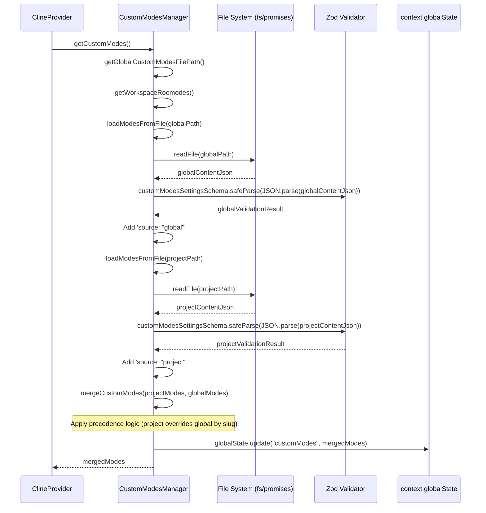
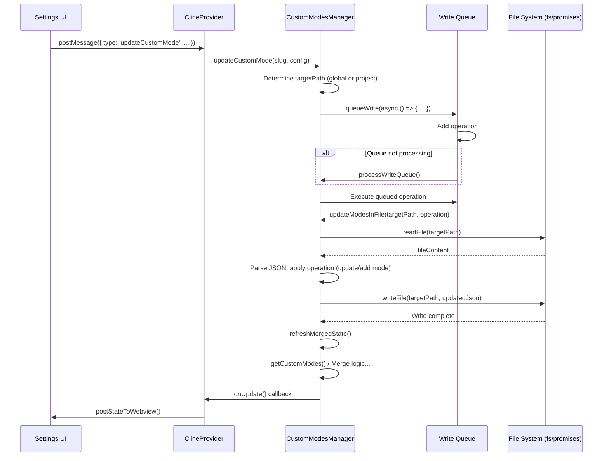

# Chapter 10: CustomModesManager

In [Chapter 9: ProviderSettingsManager](09_providersettingsmanager.md), we examined how Roo-Code securely manages different API configurations and profiles. Now, we'll explore how Roo-Code allows for customization of the AI's behavior itself through different interaction "modes", managed by the `CustomModesManager`.

## Motivation: Tailoring AI Behavior with Modes

While having different API configurations is useful, users often want to tailor the AI's persona, available tools, and specific instructions based on the task at hand. For instance, debugging code requires a different approach and toolset than writing documentation or brainstorming architectural ideas. A single, static system prompt ([Chapter 7: SystemPrompt](07_systemprompt.md)) might not be optimal for all scenarios.

"Modes" provide this flexibility. Roo-Code comes with built-in modes (like "Code", "Architect", "Ask"), but users might want to define their own specialized modes with custom role definitions, tool restrictions, and specific instructions. The `CustomModesManager` is responsible for discovering, validating, merging, and managing these custom mode definitions, allowing users to extend and personalize Roo-Code's capabilities.

**Central Use Case:** A user wants to create a "Code Review" mode specifically for their current project. This mode should instruct the AI to act as a critical reviewer, focus on specific coding standards defined in a project `.roorules` file, and restrict it from using file-writing tools (`write_to_file`, `apply_diff`) but allow reading files (`read_file`) and suggesting changes in text/diff format.

The user creates a `.roomodes` file in their workspace root and defines the "Code Review" mode within it. The `CustomModesManager` detects this file, loads the definition, validates it, and merges it with any globally defined custom modes (from `settings/custom_modes.json`). When the user selects "Code Review" mode in the UI, the [Chapter 2: ClineProvider](02_clineprovider.md) uses the configuration provided by `CustomModesManager` to generate the appropriate [Chapter 7: SystemPrompt](07_systemprompt.md) and restrict tool usage for the [Chapter 4: Cline](04_cline.md) instance.

## Key Concepts

1.  **JSON Storage:** Custom mode definitions are stored in JSON files:
    *   **Global:** `settings/custom_modes.json` located within the extension's global storage directory (`context.globalStorageUri`). These modes are available across all workspaces.
    *   **Workspace:** `.roomodes` file located in the root of the current VS Code workspace. These modes are specific to that workspace.

2.  **Scope and Precedence:** Modes defined in the workspace (`.roomodes`) take precedence over global modes (`settings/custom_modes.json`) with the same `slug` (unique identifier). This allows projects to override or define specific mode behaviors locally.

3.  **Merging Logic:** The manager loads modes from both locations. When merging, if a mode `slug` exists in both `.roomodes` and `custom_modes.json`, the definition from `.roomodes` is used, and the global one is ignored. Modes unique to either file are included in the final combined list.

4.  **Schema Validation:** All loaded mode definitions (from both files) are validated against the `customModesSettingsSchema` and `modeConfigSchema` defined using Zod in `src/schemas/index.ts`. This ensures modes have the required fields (`slug`, `name`, `roleDefinition`, `groups`) and correct data types. Invalid definitions are typically ignored or reported with an error.

5.  **`ModeConfig` Structure:** Each mode definition conforms to the `ModeConfig` interface:
    *   `slug`: A unique machine-readable identifier (e.g., `"code-review"`).
    *   `name`: A human-readable display name (e.g., `"Code Review"`).
    *   `roleDefinition`: Text describing the AI's persona for this mode.
    *   `customInstructions` (Optional): Specific instructions appended to the system prompt for this mode.
    *   `groups`: An array defining which groups of tools ([Chapter 8: Tools](08_tools.md)) are enabled (e.g., `["read", "browser"]`). Can include options to further restrict tools within a group (e.g., `["edit", { "fileRegex": "\\.md$" }]` to allow editing only Markdown files). See `src/shared/modes.ts`.
    *   `source` (Internal): Added by the manager during loading to indicate origin (`"global"` or `"project"`).

6.  **File Watching:** The manager uses `vscode.workspace.onDidSaveTextDocument` to monitor both `settings/custom_modes.json` and `.roomodes` (if it exists). When either file is saved, it automatically re-loads, re-validates, re-merges the modes, updates the internal state, and notifies the `ClineProvider` (via the `onUpdate` callback) to refresh the application state.

7.  **CRUD Operations:** Provides methods to:
    *   `getCustomModes()`: Load, merge, validate, and return the combined list of `ModeConfig` objects.
    *   `updateCustomMode(slug, config)`: Adds or updates a mode definition. It intelligently writes to the correct file (`.roomodes` if `config.source` is `"project"`, otherwise `settings/custom_modes.json`).
    *   `deleteCustomMode(slug)`: Removes a mode definition from the appropriate file(s).
    *   `resetCustomModes()`: Clears all modes from the global file.

8.  **`onUpdate` Callback:** The constructor takes an `async` callback function (`onUpdate`). This function (provided by `ClineProvider`) is called whenever the merged list of custom modes changes (due to file watching or explicit updates/deletions). This triggers `ClineProvider` to call `postStateToWebview`, ensuring the UI reflects the latest available modes.

9.  **Write Queue:** To handle potential rapid sequential saves (especially during programmatic updates), a simple queue (`writeQueue`) and lock (`isWriting`) mechanism serializes write operations (`updateCustomMode`, `deleteCustomMode`) to the JSON files, preventing race conditions.

## Using the CustomModesManager

The `CustomModesManager` is instantiated within the [Chapter 2: ClineProvider](02_clineprovider.md)'s constructor, passing the `ExtensionContext` and the `onUpdate` callback (which typically triggers `provider.postStateToWebview`).

**Flow 1: Initial Load and UI Population**

1.  **Provider Init:** `ClineProvider` constructor creates `new CustomModesManager(this.context, async () => { await this.postStateToWebview(); })`.
2.  **Manager Init:** `CustomModesManager` constructor starts watching files.
3.  **Webview Launch:** WebView UI sends `webviewDidLaunch`.
4.  **State Population (`webviewMessageHandler`):**
    *   The handler calls `provider.customModesManager.getCustomModes()`.
    *   **Input:** None.
    *   **Manager Action (`getCustomModes`):**
        *   Calls `getCustomModesFilePath()` to find/create global file path.
        *   Calls `getWorkspaceRoomodes()` to find workspace file path (if exists).
        *   Calls `loadModesFromFile()` for both paths.
        *   `loadModesFromFile`: Reads file, parses JSON, validates against `customModesSettingsSchema`, adds `source` property. Returns `ModeConfig[]`.
        *   Calls `mergeCustomModes()` with the global and project modes.
        *   `mergeCustomModes`: Implements precedence logic (project overrides global by slug).
        *   Updates the merged list in `context.globalState`.
    *   **Output:** Returns the validated, merged `ModeConfig[]`.
    *   The handler updates the global state: `updateGlobalState("customModes", mergedModes)`.
    *   The handler proceeds to call `provider.postStateToWebview()`.
5.  **UI Update:** `ClineProvider.postStateToWebview` includes the `customModes` list in the `ExtensionState` sent to the UI. The UI ([Chapter 37: Prompts UI Components (WebView)](37_prompts_ui_components__webview_.md)) populates the mode selection dropdown and the custom modes management section.

**Flow 2: User Saves `.roomodes` File**

1.  **User Action:** User saves changes to the `.roomodes` file in their workspace.
2.  **VS Code Event:** VS Code emits the `onDidSaveTextDocument` event.
3.  **Watcher Triggered:** The file watcher registered in `CustomModesManager.watchCustomModesFiles` detects the save event matches the `.roomodes` path.
4.  **Handler Logic:** The watcher's callback function executes:
    *   Calls `loadModesFromFile()` for both `.roomodes` and the global `settings/custom_modes.json`.
    *   Calls `mergeCustomModes()` with the newly loaded modes.
    *   Calls `context.globalState.update("customModes", mergedModes)` to store the latest combined list.
    *   Calls `this.onUpdate()` (the callback provided by `ClineProvider`).
5.  **Provider Callback:** The `onUpdate` callback in `ClineProvider` executes `this.postStateToWebview()`.
6.  **UI Refresh:** The WebView UI receives the updated state, including the potentially changed list of `customModes`, and re-renders the mode selection/management UI.

**Flow 3: User Updates a Mode via UI**

1.  **User Action:** User edits a custom mode in the Settings UI ([Chapter 35: Settings UI Components (WebView)](35_settings_ui_components__webview_.md)) and clicks "Save".
2.  **UI Message:** UI sends `{ type: 'updateCustomMode', slug: 'code-review', config: { /* updated ModeConfig */ } }`.
3.  **Handler:** `webviewMessageHandler` calls `provider.customModesManager.updateCustomMode(message.slug, message.config)`.
4.  **Manager Action (`updateCustomMode`):**
    *   Determines the target file based on `config.source` (`.roomodes` or `settings/custom_modes.json`).
    *   Calls `queueWrite` with an async function.
    *   `queueWrite` adds the function to the queue and starts `processWriteQueue` if not already running.
    *   `processWriteQueue` eventually executes the function:
        *   Calls `updateModesInFile(targetPath, operation)`.
        *   `updateModesInFile`: Reads the target file, parses JSON, calls the `operation` function (which updates/adds the mode), stringifies the result, writes back to the file.
        *   Calls `refreshMergedState()`.
        *   `refreshMergedState`: Re-loads both files, merges, updates `globalState`, calls `this.onUpdate()`.
5.  **Provider Callback & UI Refresh:** `onUpdate` triggers `postStateToWebview`, updating the UI.

## Code Walkthrough

### Class Definition and Core Logic (`src/core/config/CustomModesManager.ts`)

```typescript
// --- File: src/core/config/CustomModesManager.ts ---
import * as vscode from "vscode";
import * as path from "path";
import * as fs from "fs/promises";
// Import schemas and types
import { customModesSettingsSchema, ModeConfig } from "../../schemas"; // Assuming schemas are here
// Import utilities
import { fileExistsAtPath } from "../../utils/fs";
import { arePathsEqual, getWorkspacePath } from "../../utils/path";
import { logger } from "../../utils/logging";
import { GlobalFileNames } from "../../shared/globalFileNames";

const ROOMODES_FILENAME = ".roomodes"; // Workspace-specific filename

export class CustomModesManager {
	private disposables: vscode.Disposable[] = [];
	// Write queue state
	private isWriting = false;
	private writeQueue: Array<() => Promise<void>> = [];

	constructor(
		private readonly context: vscode.ExtensionContext,
		// Callback triggered after modes are updated (e.g., to refresh UI state)
		private readonly onUpdate: () => Promise<void>,
	) {
		// Start watching relevant files asynchronously
		this.watchCustomModesFiles().catch((error) => {
			logger.error("Failed to initialize custom modes file watcher", { error });
		});
	}

	// --- Write Queue Logic ---
	private async queueWrite(operation: () => Promise<void>): Promise<void> {
		this.writeQueue.push(operation);
		if (!this.isWriting) {
			await this.processWriteQueue();
		}
	}

	private async processWriteQueue(): Promise<void> {
		// Simple lock to prevent concurrent writes
		if (this.isWriting || this.writeQueue.length === 0) {
			return;
		}
		this.isWriting = true;
		try {
			while (this.writeQueue.length > 0) {
				const operation = this.writeQueue.shift();
				if (operation) {
					await operation(); // Execute the queued file write operation
				}
			}
		} finally {
			this.isWriting = false; // Release the lock
		}
	}

	// --- File Path Helpers ---
	private async getWorkspaceRoomodes(): Promise<string | undefined> {
		const workspaceRoot = getWorkspacePath(); // Utility to get workspace root reliably
		if (!workspaceRoot) return undefined;
		const roomodesPath = path.join(workspaceRoot, ROOMODES_FILENAME);
		return (await fileExistsAtPath(roomodesPath)) ? roomodesPath : undefined;
	}

	private async getGlobalCustomModesFilePath(): Promise<string> {
		const settingsDir = await this.ensureSettingsDirectoryExists();
		const filePath = path.join(settingsDir, GlobalFileNames.customModes);
		// Create file with empty array if it doesn't exist
		if (!(await fileExistsAtPath(filePath))) {
			await this.queueWrite(async () => {
				await fs.writeFile(filePath, JSON.stringify({ customModes: [] }, null, 2));
			});
		}
		return filePath;
	}

	private async ensureSettingsDirectoryExists(): Promise<string> {
		// Ensure 'settings' subdirectory exists in global storage
		const settingsDir = path.join(this.context.globalStorageUri.fsPath, "settings");
		await fs.mkdir(settingsDir, { recursive: true });
		return settingsDir;
	}

	// --- Loading and Merging ---
	private async loadModesFromFile(filePath: string): Promise<ModeConfig[]> {
		try {
			const content = await fs.readFile(filePath, "utf-8");
			const settings = JSON.parse(content);
			// Validate the structure against the Zod schema
			const result = customModesSettingsSchema.safeParse(settings);
			if (!result.success) {
				logger.warn(`Invalid format in ${filePath}. Skipping.`, { error: result.error });
				// Optionally show error to user: vscode.window.showErrorMessage(...)
				return [];
			}

			// Determine source ('project' or 'global') based on filename
			const isProjectFile = filePath.endsWith(ROOMODES_FILENAME);
			const source = isProjectFile ? ("project" as const) : ("global" as const);

			// Add the source property to each loaded mode
			return result.data.customModes.map((mode) => ({
				...mode,
				source,
			}));
		} catch (error) {
			// Handle file read or JSON parse errors
			if (error.code !== 'ENOENT') { // Ignore "file not found" errors
				logger.error(`Failed to load modes from ${filePath}`, { error });
			}
			return [];
		}
	}

	private async mergeCustomModes(projectModes: ModeConfig[], globalModes: ModeConfig[]): Promise<ModeConfig[]> {
		const slugs = new Set<string>();
		const merged: ModeConfig[] = [];

		// Add project modes first (they take precedence)
		for (const mode of projectModes) {
			if (!slugs.has(mode.slug)) {
				slugs.add(mode.slug);
				// Ensure source is 'project'
				merged.push({ ...mode, source: "project" });
			} else {
				logger.warn(`Duplicate slug '${mode.slug}' found in project modes. Skipping.`);
			}
		}

		// Add global modes only if the slug hasn't been added already
		for (const mode of globalModes) {
			if (!slugs.has(mode.slug)) {
				slugs.add(mode.slug);
				// Ensure source is 'global'
				merged.push({ ...mode, source: "global" });
			}
		}
		return merged;
	}

	// Public method to get the current merged list
	async getCustomModes(): Promise<ModeConfig[]> {
		const globalPath = await this.getGlobalCustomModesFilePath();
		const projectPath = await this.getWorkspaceRoomodes();

		const globalModes = await this.loadModesFromFile(globalPath);
		const projectModes = projectPath ? await this.loadModesFromFile(projectPath) : [];

		const mergedModes = await this.mergeCustomModes(projectModes, globalModes);

		// Store the latest merged list in globalState for quick access elsewhere
		await this.context.globalState.update("customModes", mergedModes);
		return mergedModes;
	}

	// --- File Watching ---
	private async watchCustomModesFiles(): Promise<void> {
		const globalPath = await this.getGlobalCustomModesFilePath();
		const projectPath = await this.getWorkspaceRoomodes();

		// Function to handle re-load and update on save
		const handleSave = async (savedFilePath: string) => {
			// Check if the saved file is one we care about
			if (arePathsEqual(savedFilePath, globalPath) || (projectPath && arePathsEqual(savedFilePath, projectPath))) {
				logger.info(`Detected save in ${path.basename(savedFilePath)}, refreshing custom modes...`);
				await this.refreshMergedState(); // Re-load, merge, update state, trigger callback
			}
		};

		// Create a file system watcher (more reliable for workspace files)
		if (projectPath) {
			const watcher = vscode.workspace.createFileSystemWatcher(new vscode.RelativePattern(vscode.Uri.file(path.dirname(projectPath)), path.basename(projectPath)));
			watcher.onDidChange(uri => handleSave(uri.fsPath));
			watcher.onDidCreate(uri => handleSave(uri.fsPath)); // Handle file creation
			// watcher.onDidDelete(...) // Could potentially handle deletion too
			this.disposables.push(watcher);
		}

		// Also use onDidSaveTextDocument as a fallback/alternative for global file
		this.disposables.push(
			vscode.workspace.onDidSaveTextDocument(async (document) => {
				await handleSave(document.uri.fsPath);
			}),
		);
	}

	// Helper to trigger re-load, merge, state update, and callback
	private async refreshMergedState(): Promise<void> {
		await this.getCustomModes(); // Re-runs load, merge, and updates globalState
		await this.onUpdate(); // Notify the provider
	}

	// --- CRUD Operations ---
	async updateCustomMode(slug: string, config: ModeConfig): Promise<void> {
		// Determine target file based on explicit source or existence
		let targetPath: string;
		let isProjectMode = config.source === "project";

		// If source is 'project', target is .roomodes
		if (isProjectMode) {
			const workspaceRoot = getWorkspacePath();
			if (!workspaceRoot) {
				throw new Error("Cannot save project mode: No workspace open.");
			}
			targetPath = path.join(workspaceRoot, ROOMODES_FILENAME);
			logger.info(`Updating/Creating project mode '${slug}' in ${ROOMODES_FILENAME}`);
		} else {
			// Otherwise, target is global file
			targetPath = await this.getGlobalCustomModesFilePath();
			// Check if this slug currently exists as a project mode - if so, warn user?
			const projectPath = await this.getWorkspaceRoomodes();
			if (projectPath) {
				const projectModes = await this.loadModesFromFile(projectPath);
				if (projectModes.some(m => m.slug === slug)) {
					logger.warn(`Updating global mode '${slug}', but a project-specific version exists which will take precedence.`);
					// vscode.window.showWarningMessage(...)
				}
			}
			logger.info(`Updating/Creating global mode '${slug}'`);
		}

		// Queue the write operation
		await this.queueWrite(async () => {
			// Ensure source is correctly set before saving
			const modeToSave = { ...config, source: isProjectMode ? "project" : "global" };
			// Use helper to read, modify, and write back to the target file
			await this.updateModesInFile(targetPath, (modes) => {
				const existingIndex = modes.findIndex((m) => m.slug === slug);
				if (existingIndex > -1) {
					modes[existingIndex] = modeToSave; // Update existing
				} else {
					modes.push(modeToSave); // Add new
				}
				return modes;
			});
			await this.refreshMergedState(); // Refresh combined state and notify provider
		});
	}

	async deleteCustomMode(slug: string): Promise<void> {
		const globalPath = await this.getGlobalCustomModesFilePath();
		const projectPath = await this.getWorkspaceRoomodes();
		let deleted = false;

		await this.queueWrite(async () => {
			// Try deleting from project file first
			if (projectPath) {
				await this.updateModesInFile(projectPath, (modes) => {
					const initialLength = modes.length;
					const filtered = modes.filter((m) => m.slug !== slug);
					if (filtered.length < initialLength) {
						logger.info(`Deleting mode '${slug}' from project file ${ROOMODES_FILENAME}`);
						deleted = true;
					}
					return filtered;
				});
			}
			// Then try deleting from global file
			await this.updateModesInFile(globalPath, (modes) => {
				const initialLength = modes.length;
				const filtered = modes.filter((m) => m.slug !== slug);
				if (filtered.length < initialLength) {
					logger.info(`Deleting mode '${slug}' from global file`);
					deleted = true;
				}
				return filtered;
			});

			if (deleted) {
				await this.refreshMergedState(); // Refresh if anything was deleted
			} else {
				logger.warn(`Attempted to delete mode '${slug}', but it was not found.`);
			}
		});
	}

	// Helper to read a file, apply an operation to the modes array, and write back
	private async updateModesInFile(filePath: string, operation: (modes: ModeConfig[]) => ModeConfig[]): Promise<void> {
		let settings: { customModes: ModeConfig[] };
		try {
			const content = await fs.readFile(filePath, "utf-8");
			settings = JSON.parse(content);
			// Basic validation
			if (!settings || !Array.isArray(settings.customModes)) {
				settings = { customModes: [] };
			}
		} catch (error) {
			// If file doesn't exist or is invalid, start with empty array
			settings = { customModes: [] };
		}

		// Apply the operation (update/delete) to the modes array
		const updatedModes = operation(settings.customModes);

		// Validate before writing back? (Could use customModesSettingsSchema.parse)

		// Write the updated structure back to the file
		await fs.writeFile(filePath, JSON.stringify({ customModes: updatedModes }, null, 2), "utf-8");
	}

	// Other methods like resetCustomModes, dispose...
	async resetCustomModes(): Promise<void> { /* ... clear global file, update state, call onUpdate ... */ }
	dispose(): void { /* ... dispose watchers etc. ... */ }
}
```

**Explanation:**

*   **Constructor:** Initializes file watchers and stores the `onUpdate` callback.
*   **File Paths:** `getGlobalCustomModesFilePath` and `getWorkspaceRoomodes` locate the relevant JSON files, creating the global file if needed.
*   **`loadModesFromFile`:** Reads a JSON file, parses it, validates the content using `customModesSettingsSchema.safeParse`, logs warnings on failure, and adds the `source` property (`"global"` or `"project"`).
*   **`mergeCustomModes`:** Implements the core merging logic: iterates through project modes first, adding them to the result, then adds global modes only if their `slug` isn't already present.
*   **`getCustomModes`:** The main public method for retrieving the current list. It orchestrates loading from both files, merging, and updating the `globalState` cache before returning the result.
*   **`watchCustomModesFiles` & `refreshMergedState`:** Sets up listeners for file saves (`onDidSaveTextDocument`, `createFileSystemWatcher`). On save, `refreshMergedState` is called, which triggers `getCustomModes` again and then calls the `onUpdate` callback passed by `ClineProvider`.
*   **`updateCustomMode` / `deleteCustomMode`:** Public methods for modifying modes. They determine the target file, use the `queueWrite` mechanism to serialize file system operations, call `updateModesInFile` to perform the change, and then call `refreshMergedState`.
*   **`updateModesInFile`:** A utility to abstract the read-modify-write cycle for a JSON file containing the `{ "customModes": [...] }` structure.

### Schema Definition (`src/schemas/index.ts`)

```typescript
// --- File: src/schemas/index.ts ---
// (Assuming previous definitions like providerNamesSchema, etc. exist)
import { z } from "zod";
import { toolGroupsSchema } from "./index"; // Assuming toolGroupsSchema is defined

// Schema for options within a group entry (e.g., for 'edit' group)
export const groupOptionsSchema = z.object({
	fileRegex: z.string().optional().refine(/* regex validation */),
	description: z.string().optional(),
});
export type GroupOptions = z.infer<typeof groupOptionsSchema>;

// Schema for a single group entry (either string or tuple)
export const groupEntrySchema = z.union([
    toolGroupsSchema, // e.g., "read"
    z.tuple([toolGroupsSchema, groupOptionsSchema]) // e.g., ["edit", { fileRegex: "\\.md$" }]
]);
export type GroupEntry = z.infer<typeof groupEntrySchema>;

// Helper schema to validate unique group names within the array
const groupEntryArraySchema = z.array(groupEntrySchema).refine(/* unique group name validation */);

// Schema for a single mode configuration
export const modeConfigSchema = z.object({
	slug: z.string().regex(/^[a-zA-Z0-9-]+$/, "Slug must contain only letters numbers and dashes"),
	name: z.string().min(1, "Name is required"),
	roleDefinition: z.string().min(1, "Role definition is required"),
	customInstructions: z.string().optional(),
	groups: groupEntryArraySchema, // Array of enabled tool groups/options
	source: z.enum(["global", "project"]).optional(), // Added internally, optional here
    // Potential future fields: tools: z.array(z.string()).optional() // For specific tool overrides
});
export type ModeConfig = z.infer<typeof modeConfigSchema>;

// Schema for the structure within the JSON files
export const customModesSettingsSchema = z.object({
	customModes: z.array(modeConfigSchema).refine(/* unique slug validation */),
});
export type CustomModesSettings = z.infer<typeof customModesSettingsSchema>;

// ... other schemas ...
```

**Explanation:**

*   Uses Zod to define the expected structure of the JSON files (`customModesSettingsSchema`) and individual mode objects (`modeConfigSchema`).
*   Includes validation rules (e.g., regex for `slug`, unique slugs within the array, unique group names).
*   Defines the complex `groups` field, allowing either simple group names or tuples with options.

## Internal Implementation

The manager acts as a stateful service coordinating file access, validation, merging, and updates.

**Step-by-Step (Loading/Merging):**

1.  `getCustomModes()` is called.
2.  Paths for global (`settings/custom_modes.json`) and workspace (`.roomodes`) files are determined.
3.  `loadModesFromFile()` is called for each path.
4.  `loadModesFromFile()` reads the file content (`fs.readFile`).
5.  It parses the content (`JSON.parse`).
6.  It validates the parsed object against `customModesSettingsSchema` using `safeParse`. If invalid, returns `[]`.
7.  It maps over the valid `customModes` array, adding the `source` property (`"global"` or `"project"`) to each `ModeConfig`.
8.  `getCustomModes()` receives the two arrays (`globalModes`, `projectModes`).
9.  `mergeCustomModes()` is called. It iterates through `projectModes`, adding them to a `merged` array and tracking slugs in a `Set`. It then iterates through `globalModes`, adding only those whose slugs are not already in the `Set`.
10. The final `mergedModes` array is stored in `context.globalState` and returned.

**Step-by-Step (Watching & Updating):**

1.  `watchCustomModesFiles()` registers listeners (`onDidSaveTextDocument`, `createFileSystemWatcher`).
2.  User saves `.roomodes`.
3.  The watcher/listener callback `handleSave` is invoked.
4.  `handleSave` calls `refreshMergedState()`.
5.  `refreshMergedState` calls `getCustomModes()` (which performs steps 1-10 of Loading/Merging above).
6.  `refreshMergedState` calls `this.onUpdate()` (the callback provided by `ClineProvider`).
7.  `ClineProvider`'s callback calls `provider.postStateToWebview()`.
8.  UI receives new state and updates.

**Sequence Diagram (Loading Custom Modes):**



**Sequence Diagram (Saving via UI):**



## Modification Guidance

Modifications usually involve extending the `ModeConfig` or adjusting how modes influence behavior.

**Common Modifications:**

1.  **Adding a New Field to `ModeConfig` (e.g., `suggestionPrompt`):**
    *   **Schema:** Add `suggestionPrompt: z.string().optional()` to `modeConfigSchema` in `src/schemas/index.ts`.
    *   **JSON Files:** Users can now add `"suggestionPrompt": "..."` to their custom mode definitions in `settings/custom_modes.json` or `.roomodes`.
    *   **Manager:** No change needed in `CustomModesManager` itself, as it handles the `ModeConfig` object generically based on the schema. Validation will automatically check the new field.
    *   **Consumption:** Modify the code that uses the `ModeConfig` (likely within `ClineProvider` or `Cline` when generating prompts or deciding behavior) to access `modeConfig.suggestionPrompt` and use its value. For example, append it to the [Chapter 7: SystemPrompt](07_systemprompt.md) if present.
    *   **UI (Optional):** Update the custom modes editor UI ([Chapter 37: Prompts UI Components (WebView)](37_prompts_ui_components__webview_.md)) to include a field for editing `suggestionPrompt`.

2.  **Changing Default Mode Behavior based on a Mode Field:**
    *   Assume you added a field like `strictToolValidation: boolean` to `ModeConfig`.
    *   **Schema:** Add the field to `modeConfigSchema`.
    *   **Mode Definition:** Add the field to built-in mode definitions in `src/shared/modes.ts` or allow users to set it in custom modes.
    *   **Consumption:** Modify the `validateToolUse` function (in `src/core/mode-validator.ts`) or the tool validation logic within `Cline.presentAssistantMessage`. Before validating a tool, retrieve the current `ModeConfig` (likely cached in `Cline` or retrieved via `providerRef`). Check the value of `modeConfig.strictToolValidation` and apply stricter or looser validation rules accordingly.

3.  **Adding a New Built-in Mode:**
    *   **Define Mode:** Add a new `ModeConfig` object to the `modes` array in `src/shared/modes.ts`. Define its `slug`, `name`, `roleDefinition`, `groups`, and optional `customInstructions`.
    *   **Default Prompts:** Add an entry for the new mode slug in `defaultPrompts` in `src/shared/modes.ts`.
    *   **Default Mapping:** Consider adding a default API profile mapping in `ProviderSettingsManager.defaultModeApiConfigs` if applicable.
    *   **Verification:** The new mode should automatically appear in the UI and be usable, as `getAllModes` reads from the `modes` array.

**Best Practices:**

*   **Schema-Driven:** Define the `ModeConfig` structure clearly in the Zod schema (`src/schemas/index.ts`) as the single source of truth.
*   **Validation:** Rely on Zod validation (`safeParse`) during loading to gracefully handle malformed JSON or incorrect mode definitions. Log errors clearly.
*   **Immutability (where possible):** When modifying modes in `updateModesInFile`, create new arrays/objects rather than mutating the existing ones directly, though direct modification might be simpler for this specific case.
*   **Clear Precedence:** The workspace-over-global precedence rule should be maintained consistently.
*   **Asynchronous Operations:** Handle file I/O using `async/await` and manage potential concurrency issues with the write queue.
*   **User Feedback:** Provide clear error messages to the user via `vscode.window.showErrorMessage` if JSON parsing or validation fails in files they manage (`settings/custom_modes.json`, `.roomodes`).

**Potential Pitfalls:**

*   **JSON Errors:** Malformed JSON in `settings/custom_modes.json` or `.roomodes` can prevent modes from loading. Robust parsing and validation with `safeParse` mitigate this but don't entirely prevent user frustration.
*   **Schema Mismatches:** If the Zod schema (`modeConfigSchema`) changes but the JSON files aren't updated, validation will fail. Migrations aren't typically implemented for user-managed JSON files like these, so clear documentation or manual updates are needed.
*   **Watcher Reliability:** File watchers can sometimes be unreliable or have delays, especially across different platforms or with network drives. Using both `onDidSaveTextDocument` and `createFileSystemWatcher` provides some redundancy.
*   **Merge Conflicts (Conceptual):** While not git conflicts, if the user edits both the global and workspace files simultaneously in ways that affect the same slug, the outcome depends purely on which file save event is processed last by the watcher. The precedence rule is applied during the merge regardless.
*   **Write Queue Deadlock (Unlikely):** If an error occurs within `processWriteQueue` that isn't caught properly in the `finally` block, `isWriting` might remain `true`, blocking further writes. The current simple implementation seems robust against this.

## Conclusion

The `CustomModesManager` provides a powerful mechanism for users to customize Roo-Code's behavior by defining their own interaction modes. By managing mode definitions in global and workspace JSON files, implementing clear precedence rules, validating against schemas, and automatically refreshing on file changes, it offers a flexible and robust system. This allows the core components like [Chapter 4: Cline](04_cline.md) and [Chapter 7: SystemPrompt](07_systemprompt.md) to adapt dynamically based on user-defined configurations, enhancing the versatility of the AI assistant.

Having explored how API configurations ([Chapter 9: ProviderSettingsManager](09_providersettingsmanager.md)) and custom modes are managed, we now turn to how Roo-Code manages the persistence and retrieval of general extension state. The next chapter introduces the [Chapter 11: ContextProxy](11_contextproxy.md), a utility for simplifying access to VS Code's state storage APIs.

