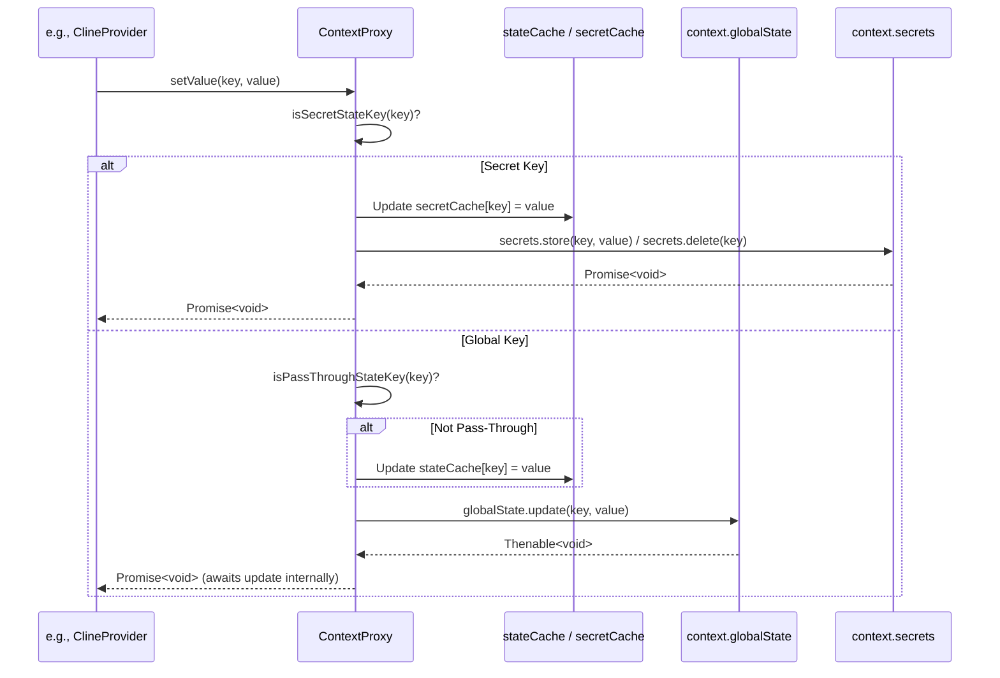

# Chapter 11: ContextProxy

In [Chapter 10: CustomModesManager](10_custommodesmanager.md), we explored how Roo-Code manages different interaction modes, allowing for customized AI behavior. Both modes and the core functionality rely on various settings and persistent data – some sensitive (like API keys) and some non-sensitive (like user preferences or history snippets). Managing direct access to VS Code's `globalState` and `secrets` APIs throughout the codebase can become repetitive and prone to errors. This chapter introduces the `ContextProxy`, an abstraction designed to simplify and unify state management.

## Motivation: Simplifying State Access and Security

VS Code provides two primary mechanisms for extensions to store data persistently:
1.  `ExtensionContext.globalState`: An `Memento` object for storing key-value pairs accessible across VS Code sessions. Suitable for non-sensitive user preferences, UI state, etc.
2.  `ExtensionContext.secrets`: An API for storing sensitive data like API keys or tokens securely, leveraging the operating system's credential store.

While powerful, directly using these APIs everywhere has drawbacks:
*   **Boilerplate:** Code needs to constantly differentiate between calling `globalState.get/update` and `secrets.get/store`.
*   **Consistency:** Ensuring keys are correctly typed and used consistently across the codebase.
*   **Performance:** Repeatedly accessing `secrets` (which might involve OS-level calls) or even `globalState` (which involves disk I/O) can have performance implications, especially if done frequently.
*   **Validation:** Ensuring that data being stored or retrieved conforms to expected schemas.

The `ContextProxy` acts as a unified wrapper around the `vscode.ExtensionContext`, providing a single, consistent API to get and set *any* configuration value, regardless of whether it should be stored in `globalState` or `secrets`. It intelligently routes the request to the appropriate underlying VS Code API, incorporates an in-memory cache for performance, and integrates schema validation using Zod.

**Central Use Case:** Imagine needing to retrieve the user's preferred UI language (non-sensitive) and their currently active OpenAI API key (sensitive).

Without `ContextProxy`:
```typescript
// Somewhere in the code...
const language = context.globalState.get<string>('language', 'en'); // Default to 'en'
const apiKey = await context.secrets.get('openAiApiKey');
// ... logic requires checking if apiKey is undefined ...
```

With `ContextProxy`:
```typescript
// Assuming contextProxy is initialized...
const language = contextProxy.getValue('language'); // Gets from cache or globalState
const apiKey = contextProxy.getValue('openAiApiKey'); // Gets from cache or secrets
// contextProxy handles defaults or returns undefined consistently
```
The `ContextProxy` simplifies the call sites, manages the underlying storage mechanism, and improves performance through caching.

## Key Concepts

1.  **Wrapper:** `ContextProxy` is instantiated with the original `vscode.ExtensionContext` and essentially delegates calls to it, adding extra layers of functionality. It also exposes some direct properties of the context like `extensionUri`, `globalStorageUri`, etc., for convenience.

2.  **Unified API (`getValue`, `setValue`, `getValues`, `setValues`):** The core methods provide a single interface for interacting with *all* managed state keys, defined collectively in the `RooCodeSettings` type (which combines `GlobalState` and `SecretState` from `src/schemas/index.ts`).
    *   `getValue(key)`: Retrieves the value for the given key.
    *   `setValue(key, value)`: Stores the value for the given key.
    *   These methods internally determine if the `key` belongs to `SecretState` or `GlobalState` (using `isSecretStateKey`) and call the appropriate underlying API (`secrets.get/store` or `globalState.get/update`).

3.  **In-Memory Cache (`stateCache`, `secretCache`):** On initialization (`initialize`), `ContextProxy` pre-loads all known global state values and secrets into private cache objects (`stateCache`, `secretCache`).
    *   `getValue` primarily reads from these caches for speed.
    *   `setValue` updates both the cache and the underlying persistent storage (`globalState` or `secrets`).
    *   **Note:** A special handling exists for keys like `taskHistory` which might be large or frequently updated; these might bypass the cache (`isPassThroughStateKey`) and read directly from `globalState`.

4.  **Schema Validation:** Methods like `getGlobalSettings()` and `getProviderSettings()` retrieve *all* relevant keys from the proxy (cache/storage), combine them, and then parse the resulting object against pre-defined Zod schemas (`globalSettingsSchema`, `providerSettingsSchema`). This ensures the overall configuration structure is valid and provides typed objects for use elsewhere. If validation fails, errors are logged and reported via telemetry ([Chapter 52: TelemetryService](52_telemetryservice.md)), and a best-effort object is returned.

5.  **Initialization (`initialize`):** This asynchronous method must be called after constructing `ContextProxy`. It performs the initial population of the `stateCache` and `secretCache` by reading all values from `globalState` and `secrets`. Subsequent calls to `getValue` will be fast until `setValue` is used.

6.  **Key Definitions (`src/schemas/index.ts`):** The separation between sensitive and non-sensitive data relies on the explicit definitions in `src/schemas/index.ts`:
    *   `SECRET_STATE_KEYS`: An array listing keys considered sensitive (e.g., `apiKey`, `openAiApiKey`).
    *   `GLOBAL_STATE_KEYS`: An array listing keys considered non-sensitive.
    *   `isSecretStateKey(key)`: A type guard function used internally by `ContextProxy` to determine the correct storage mechanism for a given key.

## Using the ContextProxy

`ContextProxy` is typically instantiated once within the main `activate` function or early in the `ClineProvider`'s lifecycle, passing the `vscode.ExtensionContext`.

**Example Usage within `ClineProvider`:**

```typescript
// --- File: src/core/webview/ClineProvider.ts ---
import * as vscode from "vscode";
import { ContextProxy } from "../config/ContextProxy";
import { ProviderSettings } from "../../schemas";
// ... other imports

export class ClineProvider /* ... */ {
    public readonly contextProxy: ContextProxy;

    constructor(
        readonly context: vscode.ExtensionContext,
        // ... other params
    ) {
        // ... other initializations ...
        this.contextProxy = new ContextProxy(context);
        // IMPORTANT: Initialize must be called before relying on cached values
        // Usually done early, e.g., in resolveWebviewView or a dedicated init method
        // await this.contextProxy.initialize(); // Assuming initialization happens elsewhere
    }

    // Example: Getting state for the webview
    async getStateToPostToWebview() {
        // Ensure initialized if not done elsewhere
        if (!this.contextProxy.isInitialized) {
            await this.contextProxy.initialize();
        }

        // Use unified getValue method
        const language = this.contextProxy.getValue("language");
        const mode = this.contextProxy.getValue("mode");
        const soundEnabled = this.contextProxy.getValue("soundEnabled");
        const telemetrySetting = this.contextProxy.getValue("telemetrySetting");

        // Or get validated, grouped settings
        const providerSettings: ProviderSettings = this.contextProxy.getProviderSettings();
        const globalSettings = this.contextProxy.getGlobalSettings(); // Less common

        // ... use retrieved values to build the state object ...
        return {
            /* ... many properties using contextProxy.getValue() ... */
            apiConfiguration: providerSettings, // Pass validated provider settings
            mode: mode ?? 'default',
            language: language ?? 'en',
            soundEnabled: soundEnabled ?? false,
            telemetrySetting: telemetrySetting ?? 'unset',
            // ...
        };
    }

    // Example: Updating a setting received from the webview
    async handleLanguageChange(newLanguage: string) {
         // Use unified setValue method
        await this.contextProxy.setValue("language", newLanguage);
        // No need to check if it's globalState or secrets

        // Refresh the webview state
        await this.postStateToWebview();
    }

    // Example: Updating API configuration (including secrets)
    async updateApiConfiguration(providerSettings: ProviderSettings) {
        // Use setProviderSettings which internally calls setValue for multiple keys
        await this.contextProxy.setProviderSettings(providerSettings);

        // Update related components like ApiHandler
        if (this.getCurrentCline()) {
            this.getCurrentCline()!.api = buildApiHandler(providerSettings);
        }
        // Refresh webview
        await this.postStateToWebview();
    }

    // Example: Resetting all state
    async resetState() {
        // ... confirmation logic ...
        await this.contextProxy.resetAllState();
        // Also reset other managers like ProviderSettingsManager
        await this.providerSettingsManager.resetAllConfigs();
        // ... refresh UI ...
    }

    // ... rest of ClineProvider ...
}
```

**Explanation:**

*   `ContextProxy` is instantiated in the constructor.
*   `initialize()` is crucial and must be called before `getValue` is expected to return cached values reliably (shown conceptually, often called in `resolveWebviewView`).
*   `getStateToPostToWebview` demonstrates using `getValue` for individual settings and `getProviderSettings` for a validated group of settings.
*   `handleLanguageChange` uses the simple `setValue` for a non-sensitive setting.
*   `updateApiConfiguration` uses `setProviderSettings` which handles updating multiple keys, including secrets, by calling `setValue` internally.
*   `resetAllState` provides a way to clear all managed state.

## Code Walkthrough

### Class Definition and Initialization (`src/core/config/ContextProxy.ts`)

```typescript
// --- File: src/core/config/ContextProxy.ts ---
import * as vscode from "vscode";
import { ZodError } from "zod";

// Import schemas and key lists
import {
	PROVIDER_SETTINGS_KEYS, GLOBAL_SETTINGS_KEYS, SECRET_STATE_KEYS, GLOBAL_STATE_KEYS,
	ProviderSettings, GlobalSettings, SecretState, GlobalState, RooCodeSettings,
	providerSettingsSchema, globalSettingsSchema, isSecretStateKey,
} from "../../schemas"; // Assumes schemas define these types and key lists
import { logger } from "../../utils/logging";
import { telemetryService } from "../../services/telemetry/TelemetryService";

// Define keys that should bypass the cache (read directly from globalState)
type GlobalStateKey = keyof GlobalState;
type SecretStateKey = keyof SecretState;
type RooCodeSettingsKey = keyof RooCodeSettings;
const PASS_THROUGH_STATE_KEYS = ["taskHistory"]; // Example: taskHistory might be large/dynamic
export const isPassThroughStateKey = (key: string) => PASS_THROUGH_STATE_KEYS.includes(key);

// Schema for exported settings (omitting potentially large/dynamic fields)
const globalSettingsExportSchema = globalSettingsSchema.omit({
	taskHistory: true, listApiConfigMeta: true, currentApiConfigName: true,
});

export class ContextProxy {
	private readonly originalContext: vscode.ExtensionContext;

	// In-memory caches
	private stateCache: Partial<GlobalState>; // Use Partial<> as not all keys might exist
	private secretCache: Partial<SecretState>;
	private _isInitialized = false;

	constructor(context: vscode.ExtensionContext) {
		this.originalContext = context;
		this.stateCache = {};
		this.secretCache = {};
		this._isInitialized = false;
	}

	public get isInitialized() {
		return this._isInitialized;
	}

	/**
	 * Loads initial values from globalState and secrets into the cache.
	 * Must be called before using getValue reliably with cache.
	 */
	public async initialize() {
		// Load global state keys into stateCache
		for (const key of GLOBAL_STATE_KEYS) {
			if (isPassThroughStateKey(key)) continue; // Skip pass-through keys
			try {
				// Explicitly type the get call if needed, or rely on inference
				const value = this.originalContext.globalState.get(key);
				if (value !== undefined) { // Only cache existing values
					this.stateCache[key] = value;
				}
			} catch (error) {
				logger.error(`Error loading global ${key}: ${error instanceof Error ? error.message : String(error)}`);
			}
		}

		// Load secret state keys into secretCache
		const promises = SECRET_STATE_KEYS.map(async (key) => {
			try {
				const value = await this.originalContext.secrets.get(key);
				if (value !== undefined && value !== null) { // Secrets API might return null? Check docs.
					this.secretCache[key] = value;
				}
			} catch (error) {
				logger.error(`Error loading secret ${key}: ${error instanceof Error ? error.message : String(error)}`);
			}
		});
		await Promise.all(promises); // Load secrets in parallel

		this._isInitialized = true;
		logger.info("ContextProxy initialized.");
	}

	// Expose common context properties directly
	public get extensionUri() { return this.originalContext.extensionUri; }
	public get extensionPath() { return this.originalContext.extensionPath; }
	public get globalStorageUri() { return this.originalContext.globalStorageUri; }
	// ... other context properties ...
	public get extensionMode() { return this.originalContext.extensionMode; }
```

**Explanation:**

*   **Imports:** Imports VS Code API, Zod, schema definitions, key lists, `isSecretStateKey`, logging, and telemetry.
*   **Caching:** Defines `stateCache` and `secretCache` (using `Partial<>` as initial state might be empty). `_isInitialized` tracks if `initialize` has run.
*   **`PASS_THROUGH_STATE_KEYS`:** Defines keys that should *not* be cached (e.g., `taskHistory`).
*   **Constructor:** Stores the original context and initializes empty caches.
*   **`initialize()`:**
    *   Iterates through `GLOBAL_STATE_KEYS`, skipping pass-through keys. Reads each value using `globalState.get()` and stores it in `stateCache` if defined.
    *   Iterates through `SECRET_STATE_KEYS`, reading each value using `secrets.get()` asynchronously. Stores values in `secretCache` if defined. Uses `Promise.all` for parallel loading.
    *   Sets `_isInitialized` to true. Includes logging and error handling for robustness.
*   **Context Properties:** Exposes commonly used properties from the original `vscode.ExtensionContext` directly.

### Unified Get/Set Methods (`src/core/config/ContextProxy.ts`)

```typescript
// --- File: src/core/config/ContextProxy.ts ---
// (Inside ContextProxy class)

	// --- Direct GlobalState Access (Internal/Pass-through) ---
	getGlobalState<K extends GlobalStateKey>(key: K): GlobalState[K]
	getGlobalState<K extends GlobalStateKey>(key: K, defaultValue: GlobalState[K]): GlobalState[K]
	getGlobalState<K extends GlobalStateKey>(key: K, defaultValue?: GlobalState[K]): GlobalState[K] | undefined {
		const value = this.originalContext.globalState.get<GlobalState[K]>(key);
		// Return defaultValue only if value is explicitly undefined or null
		return (value === undefined || value === null) ? defaultValue : value;
	}

	updateGlobalState<K extends GlobalStateKey>(key: K, value: GlobalState[K] | undefined) {
		// Use undefined to remove a key from globalState
		return this.originalContext.globalState.update(key, value);
	}

	private getAllGlobalState(): Partial<GlobalState> {
		// Note: This reads directly, bypassing cache. Use with caution if performance matters.
		return Object.fromEntries(
			GLOBAL_STATE_KEYS
				.map((key) => [key, this.originalContext.globalState.get(key)])
				.filter(([_, value]) => value !== undefined) // Filter out undefined values
		) as Partial<GlobalState>;
	}

	// --- Direct Secret Access (Internal) ---
	getSecret(key: SecretStateKey): Promise<string | undefined> {
		return this.originalContext.secrets.get(key);
	}

	storeSecret(key: SecretStateKey, value?: string): Promise<void> {
		// Use undefined to delete a secret
		return value === undefined
			? this.originalContext.secrets.delete(key)
			: this.originalContext.secrets.store(key, value);
	}

	private async getAllSecretState(): Promise<Partial<SecretState>> {
		// Note: This reads directly, bypassing cache.
		const entries = await Promise.all(
			SECRET_STATE_KEYS.map(async (key): Promise<[SecretStateKey, string | undefined]> => {
				const value = await this.originalContext.secrets.get(key);
				return [key, value];
			})
		);
		return Object.fromEntries(
			entries.filter(([_, value]) => value !== undefined && value !== null)
		) as Partial<SecretState>;
	}

	// --- Unified API ---

	/**
	 * Gets a value by key, checking cache first, then appropriate storage.
	 */
	public getValue<K extends RooCodeSettingsKey>(key: K): RooCodeSettings[K] | undefined {
		// Handle pass-through keys directly
		if (isPassThroughStateKey(key)) {
			// Need to assert the key type for getGlobalState
			return this.getGlobalState(key as GlobalStateKey) as RooCodeSettings[K] | undefined;
		}

		// Check cache first
		if (isSecretStateKey(key)) {
			// Check secretCache
			if (key in this.secretCache) {
				return this.secretCache[key] as RooCodeSettings[K] | undefined;
			}
			// Note: We don't fall back to reading secrets here for performance.
			// Initialize() should pre-load secrets. If not initialized, returns undefined.
			return undefined;
		} else {
			// Check stateCache
			if (key in this.stateCache) {
				return this.stateCache[key as GlobalStateKey] as RooCodeSettings[K] | undefined;
			}
			// If not initialized or key wasn't present during init, return undefined.
			return undefined;
		}
	}

	/**
	 * Sets a value by key, updating cache and appropriate storage.
	 */
	public async setValue<K extends RooCodeSettingsKey>(key: K, value: RooCodeSettings[K] | undefined): Promise<void> {
		if (isSecretStateKey(key)) {
			// Update secret cache
			if (value === undefined) {
				delete this.secretCache[key];
			} else {
				this.secretCache[key] = value as string | undefined; // Ensure correct type for cache
			}
			// Update underlying secret storage
			await this.storeSecret(key, value as string | undefined);
		} else {
			// Update global state cache (handle pass-through keys)
			if (!isPassThroughStateKey(key)) {
				if (value === undefined) {
					delete this.stateCache[key as GlobalStateKey];
				} else {
					this.stateCache[key as GlobalStateKey] = value;
				}
			}
			// Update underlying global state storage
			await this.updateGlobalState(key as GlobalStateKey, value);
		}
	}

	/**
	 * Gets all cached values. Does NOT read directly from storage here for performance.
	 * Relies on initialize() having been called.
	 */
	public getValues(): Partial<RooCodeSettings> {
		// Combine cached values
		// Note: Pass-through keys are NOT included here unless explicitly read
		const passThroughValues = Object.fromEntries(
			PASS_THROUGH_STATE_KEYS.map(key => [key, this.getGlobalState(key as GlobalStateKey)])
		) as Partial<RooCodeSettings>;

		return {
			...this.stateCache,
			...this.secretCache,
			...passThroughValues, // Add pass-through values read directly
		};
	}

	/**
	 * Sets multiple values, updating caches and storage.
	 */
	public async setValues(values: Partial<RooCodeSettings>): Promise<void> {
		// Use Object.entries and Promise.all for parallel updates
		const entries = Object.entries(values) as [RooCodeSettingsKey, unknown][];
		await Promise.all(
			entries.map(([key, value]) => this.setValue(key, value))
		);
	}
```

**Explanation:**

*   **Direct Accessors (Internal/Pass-through):** Includes `getGlobalState`, `updateGlobalState`, `getSecret`, `storeSecret` which interact directly with the original context. These are used internally or for pass-through keys. `getAllGlobalState`/`getAllSecretState` also read directly and bypass the cache.
*   **`getValue(key)`:**
    *   Checks if `key` is a pass-through key; if so, calls `getGlobalState` directly.
    *   Otherwise, checks if `key` is a secret key using `isSecretStateKey`.
    *   Reads from `secretCache` or `stateCache` respectively.
    *   Returns the cached value or `undefined` if not found (relies on `initialize` having populated the cache).
*   **`setValue(key, value)`:**
    *   Checks if `key` is a secret key.
    *   Updates the appropriate cache (`secretCache` or `stateCache`, handling `undefined` for deletion). Skips cache update for pass-through keys.
    *   Calls the corresponding underlying storage method (`storeSecret` or `updateGlobalState`) asynchronously.
*   **`getValues()`:** Returns a combined object from `stateCache` and `secretCache`, plus any pass-through values read directly. It does *not* read all keys from storage again, relying on the cache populated by `initialize`.
*   **`setValues(values)`:** Efficiently sets multiple values by calling `setValue` for each entry in parallel using `Promise.all`.

### Schema Validation and Grouped Accessors (`src/core/config/ContextProxy.ts`)

```typescript
// --- File: src/core/config/ContextProxy.ts ---
// (Inside ContextProxy class)

	// --- Grouped Accessors with Validation ---

	/**
	 * Gets all settings relevant to GlobalSettings schema and validates them.
	 */
	public getGlobalSettings(): GlobalSettings {
		const values = this.getValues(); // Get all cached values

		try {
			// Parse against the Zod schema
			return globalSettingsSchema.parse(values);
		} catch (error) {
			// Handle validation errors
			if (error instanceof ZodError) {
				telemetryService.captureSchemaValidationError({ schemaName: "GlobalSettings", error });
				logger.warn("GlobalSettings validation failed:", error.errors);
			}
			// Return best-effort object even on validation failure
			return GLOBAL_SETTINGS_KEYS.reduce(
				(acc, key) => ({ ...acc, [key]: values[key as GlobalStateKey] }),
				{} as GlobalSettings
			);
		}
	}

	/**
	 * Gets all settings relevant to ProviderSettings schema and validates them.
	 */
	public getProviderSettings(): ProviderSettings {
		const values = this.getValues(); // Get all cached values

		try {
			// Parse against the Zod schema
			return providerSettingsSchema.parse(values);
		} catch (error) {
			// Handle validation errors
			if (error instanceof ZodError) {
				telemetryService.captureSchemaValidationError({ schemaName: "ProviderSettings", error });
				logger.warn("ProviderSettings validation failed:", error.errors);
			}
			// Return best-effort object
			return PROVIDER_SETTINGS_KEYS.reduce(
				(acc, key) => ({ ...acc, [key]: values[key] }),
				{} as ProviderSettings
			);
		}
	}

	/**
	 * Sets multiple values relevant to ProviderSettings.
	 * Clears unspecified provider settings keys before applying new values.
	 */
	public async setProviderSettings(values: ProviderSettings): Promise<void> {
		// Create an object with undefined for all non-secret provider keys
		const keysToClear = PROVIDER_SETTINGS_KEYS
			.filter((key) => !isSecretStateKey(key)) // Exclude secrets from explicit clearing
			.filter((key) => key in this.stateCache); // Only clear keys currently in cache

		const clearValues = keysToClear.reduce(
			(acc, key) => ({ ...acc, [key]: undefined }),
			{} as Partial<RooCodeSettings>
		);

		// Combine the clearing values with the new values and set them
		await this.setValues({
			...clearValues,
			...values, // New values overwrite undefined where specified
		});
	}

	// --- Import / Export / Reset ---

	public async export(): Promise<Partial<GlobalSettings> | undefined> {
		try {
			const allValues = this.getValues(); // Get cached values
			// Parse against the specific export schema (omits some fields)
			const globalSettings = globalSettingsExportSchema.parse(allValues);
			// Filter out any undefined values before returning
			return Object.fromEntries(
				Object.entries(globalSettings).filter(([_, value]) => value !== undefined)
			) as Partial<GlobalSettings>;
		} catch (error) { /* ... error handling ... */ }
	}

	public async resetAllState(): Promise<void> {
		logger.warn("Resetting all Roo-Code state and secrets...");
		// Clear in-memory caches
		this.stateCache = {};
		this.secretCache = {};

		// Clear persistent storage
		await Promise.all([
			...GLOBAL_STATE_KEYS.map((key) => this.originalContext.globalState.update(key, undefined)),
			...SECRET_STATE_KEYS.map((key) => this.originalContext.secrets.delete(key)),
		]);

		// Re-initialize (will likely load defaults if persistent storage is now empty)
		await this.initialize();
		logger.info("Roo-Code state reset complete.");
	}
```

**Explanation:**

*   **`getGlobalSettings`/`getProviderSettings`:**
    *   Call `getValues()` to retrieve all currently cached values.
    *   Use `schema.parse()` to validate the combined object against the respective Zod schema.
    *   If validation fails, log the error, report via telemetry, and return a "best-effort" object containing the relevant keys from the (potentially invalid) cache.
*   **`setProviderSettings`:**
    *   This is designed to ensure that when a new provider configuration is set, any old settings *not* included in the new `values` object are cleared from `globalState` (secrets are handled individually by `setValue`).
    *   It constructs `clearValues` containing `undefined` for all non-secret provider keys currently in the cache.
    *   It calls `setValues` with `{ ...clearValues, ...values }`, effectively setting the new values and unsetting any old ones.
*   **`export`:** Retrieves cached values, parses against the specific `globalSettingsExportSchema` (which omits fields like `taskHistory`), filters out undefined values, and returns the result.
*   **`resetAllState`:** Clears both the in-memory caches (`stateCache`, `secretCache`) and iterates through all known keys to explicitly remove them from `globalState` and `secrets`. It then calls `initialize` again.

## Internal Implementation

The `ContextProxy` acts as a caching and routing layer on top of the native `ExtensionContext` APIs.

**Step-by-Step (`getValue`):**

1.  `getValue(key)` is called.
2.  Check if `key` is in `PASS_THROUGH_STATE_KEYS`. If yes, call `context.globalState.get(key)` and return.
3.  Check if `isSecretStateKey(key)` is true.
    *   If true, check if `key` exists in `secretCache`. Return `secretCache[key]` if found, otherwise return `undefined`.
    *   If false, check if `key` exists in `stateCache`. Return `stateCache[key]` if found, otherwise return `undefined`.
    *(Assumption: `initialize` has been called, so caches reflect persistent state)*

**Step-by-Step (`setValue`):**

1.  `setValue(key, value)` is called.
2.  Check if `isSecretStateKey(key)` is true.
    *   If true: Update `secretCache[key]` (or delete if `value` is undefined). Call `context.secrets.store(key, value)` or `context.secrets.delete(key)`. `await` the promise.
    *   If false: Check if `!isPassThroughStateKey(key)`. If true, update `stateCache[key]` (or delete). Call `context.globalState.update(key, value)`. `await` the promise (though `update` returns `Thenable<void>`, often treated synchronously).
3.  Return.

**Sequence Diagram (`setValue`):**



## Modification Guidance

Modifications usually involve adding new state variables or adjusting caching behavior.

**Common Modifications:**

1.  **Adding a New State Variable (e.g., `lastUsedFeature: string` - non-secret):**
    *   **Schema:** Add `lastUsedFeature: z.string().optional()` to `globalSettingsSchema` in `src/schemas/index.ts`.
    *   **Key List:** Add `"lastUsedFeature"` to the `GLOBAL_SETTINGS_KEYS` array (or the derived `GLOBAL_STATE_KEYS`).
    *   **ContextProxy:** No direct changes needed in `ContextProxy.ts` itself. The new key will be automatically handled by the existing `getValue`/`setValue` logic based on the updated key lists and `isSecretStateKey`. `initialize` will load it into the cache if it exists.
    *   **Usage:** Call `contextProxy.getValue("lastUsedFeature")` and `contextProxy.setValue("lastUsedFeature", "some-feature")` where needed.

2.  **Adding a New Secret Variable (e.g., `someOtherApiKey: string`):**
    *   **Schema:** Add `someOtherApiKey: z.string().optional()` to `providerSettingsSchema` (or potentially `globalSettingsSchema` if it's not provider-specific, though less common for secrets).
    *   **Key List:** Add `"someOtherApiKey"` to the `PROVIDER_SETTINGS_KEYS` (if applicable) and critically, to the `SECRET_STATE_KEYS` array in `src/schemas/index.ts`.
    *   **ContextProxy:** No direct changes needed. `isSecretStateKey("someOtherApiKey")` will return true, routing `getValue`/`setValue` to the secret cache and `context.secrets` API.
    *   **Usage:** Call `contextProxy.getValue("someOtherApiKey")` and `contextProxy.setValue("someOtherApiKey", "key-value")` where needed. Update relevant `ApiHandler` or configuration UI.

3.  **Changing a Pass-Through Key:**
    *   Modify the `PASS_THROUGH_STATE_KEYS` array in `ContextProxy.ts`. Add or remove keys as needed. Remember that pass-through keys bypass the cache and are read directly from `globalState` on every `getValue` call.

**Best Practices:**

*   **Centralize Definitions:** Keep all state key definitions (`GLOBAL_STATE_KEYS`, `SECRET_STATE_KEYS`) and schema definitions (`globalSettingsSchema`, etc.) centralized in `src/schemas/index.ts`.
*   **Schema Consistency:** Ensure the Zod schemas accurately reflect the structure defined by the key lists and how the data is used.
*   **Use `isSecretStateKey`:** Rely on the `isSecretStateKey` check (driven by `SECRET_STATE_KEYS`) to correctly route storage. Don't hardcode checks for specific secret key names within `ContextProxy`.
*   **Initialize Early:** Ensure `contextProxy.initialize()` is called once, early in the extension's activation or view resolution, before `getValue` is expected to hit the cache.
*   **Cache Awareness:** Understand which keys are cached (`getValue` is fast after init) and which bypass the cache (`getValue` always hits `globalState`). Use pass-through sparingly for frequently changing or very large data where caching isn't beneficial or feasible.

**Potential Pitfalls:**

*   **Forgetting `initialize()`:** Calling `getValue` before `initialize()` completes will likely return `undefined` even if data exists in persistent storage, as the cache won't be populated.
*   **Stale Cache (Conceptual):** If another part of the extension (or a different extension interacting with the same keys, though unlikely/discouraged) modifies `globalState` or `secrets` directly, the `ContextProxy` cache will become stale. The current design assumes `ContextProxy` is the sole manager of these specific keys within Roo-Code.
*   **Incorrect Key Lists:** If a key is missing from `GLOBAL_STATE_KEYS` or `SECRET_STATE_KEYS`, `initialize` won't load it, and `getValues`/`getGlobalSettings`/`getProviderSettings` might not include it. If a secret key is missing from `SECRET_STATE_KEYS`, `setValue` will incorrectly save it to `globalState`.
*   **Schema Validation Failures:** Invalid data in `globalState` or `secrets` (e.g., due to manual modification or older extension versions before validation was added) can cause `getGlobalSettings`/`getProviderSettings` to fail parsing. The fallback mechanism helps prevent crashes but might return incomplete data.
*   **Performance of Pass-Through:** Overusing pass-through keys for frequently accessed data could negate the performance benefits of the cache.

## Conclusion

The `ContextProxy` provides a valuable abstraction layer for managing Roo-Code's persistent state. By offering a unified API for both sensitive (`secrets`) and non-sensitive (`globalState`) data, incorporating an in-memory cache, and integrating schema validation, it simplifies development, enhances performance, and improves the robustness of state management throughout the extension. It centralizes the logic for interacting with VS Code's storage mechanisms, making the rest of the codebase cleaner and easier to maintain.

With state management addressed, we now consider how state is shared specifically within the reactive [Chapter 1: WebView UI](01_webview_ui.md). The next chapter explores the React Context provider used for this purpose: [Chapter 12: ExtensionStateContext](12_extensionstatecontext.md).

