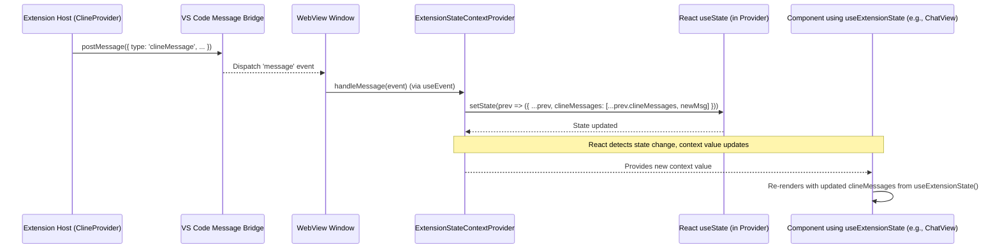

# Chapter 12: ExtensionStateContext

In the previous chapter, [Chapter 11: ContextProxy](11_contextproxy.md), we examined how Roo-Code uses `ContextProxy` to provide a unified and cached interface for managing persistent state (both sensitive and non-sensitive) within the extension host. Now, we shift our focus to the frontend: how is this state, along with transient UI state, managed and made available to components within the React-based [Chapter 1: WebView UI](01_webview_ui.md)? This is the role of the `ExtensionStateContext`.

## Motivation: Centralized State Management for React UI

The Roo-Code WebView UI is a complex React application displaying various pieces of information – the current chat conversation, API settings, task history, system prompts, available commands, and more. Many different components across the UI need access to this shared data. Passing this data down through multiple levels of components via props ("prop drilling") would be cumbersome, inefficient, and difficult to maintain.

Furthermore, the UI state needs to stay synchronized with the state held by the [Chapter 2: ClineProvider](02_clineprovider.md) in the extension host. When the extension host sends updates (like a new chat message, updated settings, or a change in available MCP servers), the UI needs a central place to receive these updates and trigger re-renders in the appropriate components.

The `ExtensionStateContext` solves these problems by leveraging React's Context API. It provides a centralized store for the entire WebView UI's state and a mechanism for components to subscribe to changes in that state. It also handles receiving state updates from the extension host via the [Chapter 3: Webview/Extension Message Protocol](03_webview_extension_message_protocol.md) and updating the context accordingly.

**Central Use Case:** Displaying the chat conversation. The `ChatView` component needs access to the list of `clineMessages`. When the extension host sends a new `clineMessage` (e.g., a text chunk from the AI), the `ExtensionStateContext` needs to receive this message, update the `clineMessages` array in its state, and ensure that `ChatView` automatically re-renders to display the new message without needing complex prop passing or manual event handling within the component itself.

## Key Concepts

1.  **React Context API:** A mechanism built into React for sharing data that can be considered "global" for a tree of React components, such as the current authenticated user, theme, or preferred language, without passing props down manually at every level. It consists of a `Provider` component and a consumer mechanism (often a custom hook like `useContext`).

2.  **`ExtensionStateContextProvider`:** This is the React component (defined in `webview-ui/src/context/ExtensionStateContext.tsx`) that wraps the main application (`App` component). It holds the actual state using React's `useState` hook and provides this state, along with update functions, to all descendant components via the `ExtensionStateContext.Provider`.

3.  **`useExtensionState` Hook:** A custom React hook provided by `ExtensionStateContext.tsx`. Components use this hook (`const state = useExtensionState();`) to easily access the current values stored within the context. When the context value changes, components using this hook will automatically re-render.

4.  **State Structure (`ExtensionState` & `ExtensionStateContextType`):** The shape of the state managed by the context is defined primarily by the `ExtensionState` interface (from `src/shared/ExtensionMessage.ts`), which includes fields like `apiConfiguration`, `clineMessages`, `taskHistory`, `mode`, `customModes`, user settings (`soundEnabled`, `language`, etc.). The context also adds UI-specific state like `didHydrateState`, `showWelcome`, `theme`, `mcpServers`, etc., and exposes setter functions (like `setMode`, `setSoundEnabled`) which are primarily intended for *internal* use by the context provider itself when handling messages, though some might be exposed for direct UI updates if carefully designed. The full context type is `ExtensionStateContextType`.

5.  **State Hydration:** When the WebView UI first launches, it sends a `webviewDidLaunch` message. The extension host ([Chapter 2: ClineProvider](02_clineprovider.md)) responds with a `{ type: 'state', state: { ... } }` message containing the initial snapshot of all necessary state. The `ExtensionStateContextProvider`'s message handler (`handleMessage`) receives this message, updates its internal `useState` with the received data, and sets `didHydrateState` to `true`. This initial population is crucial for rendering the UI correctly.

6.  **State Updates:** The `ExtensionStateContextProvider` listens for incoming messages from the extension host (using `useEvent("message", handleMessage)`). When messages like `clineMessage`, `mcpServers`, `listApiConfig`, or subsequent `state` messages arrive, the `handleMessage` function updates the internal React state using `setState`.

7.  **Synchronization:** The context acts as the WebView-side endpoint for the [Chapter 3: Webview/Extension Message Protocol](03_webview_extension_message_protocol.md). It receives state updates initiated by the extension host and translates them into React state changes. Actions triggered *by* the UI (e.g., changing a setting, sending a message) typically use `vscode.postMessage` directly from the component, sending a message *to* the extension host, which then processes the change and potentially sends an updated state back to the context.

## Using the ExtensionStateContext

Accessing and reacting to the shared state within UI components is straightforward thanks to the `useExtensionState` hook.

**Example: Displaying Messages in `ChatView`**

```typescript
// --- File: webview-ui/src/components/chat/ChatView.tsx ---
import React from 'react';
import { useExtensionState } from '../../context/ExtensionStateContext'; // Import the hook
import { MessageList } from './MessageList'; // Assume this component renders messages

// ... other imports and component definition ...

const ChatView = React.forwardRef<ChatViewRef, ChatViewProps>(
  ({ isHidden, /* ... other props */ }, ref) => {
    // 1. Access the shared state using the hook
    const { clineMessages, apiConfiguration } = useExtensionState();

    // ... other component logic (refs, handlers, etc.) ...

    // 2. Use the state values in the component's render logic
    return (
      <div style={{ display: isHidden ? 'none' : 'flex', /* ... */ }}>
        {/* ... other UI elements ... */}

        {/* Pass the clineMessages array to the component responsible for rendering them */}
        <MessageList messages={clineMessages} apiProvider={apiConfiguration?.apiProvider} />

        {/* ... Chat Input Area ... */}
      </div>
    );
  }
);

export default ChatView;
```

**Explanation:**

1.  **Import Hook:** The component imports `useExtensionState` from the context file.
2.  **Access State:** Inside the component, `useExtensionState()` is called. This hook returns the current value of the context, which is an object containing all shared state fields (`clineMessages`, `apiConfiguration`, `mode`, etc.). Destructuring is used to extract the needed fields.
3.  **Use State:** The `clineMessages` array (retrieved from the context) is passed as a prop to the `MessageList` component, which can then map over it and render each message.
4.  **Automatic Re-renders:** When a new `clineMessage` arrives from the extension host, the `ExtensionStateContextProvider` updates its internal state. This change propagates through the context. Because `ChatView` called `useExtensionState()`, React knows it depends on this context. React automatically re-renders `ChatView` with the new `clineMessages` array, ensuring the UI updates without any manual intervention needed within `ChatView` itself.

**Example: Triggering an Action (Sending a Message)**

While `useExtensionState` is for *reading* state, actions that *modify* state typically involve sending a message back to the extension host.

```typescript
// --- File: webview-ui/src/components/chat/ChatTextArea.tsx ---
import React, { useCallback, useState } from 'react';
import { vscode } from '../../utils/vscode'; // Utility for postMessage
// ... other imports

const ChatTextArea = ({ onSend, /* ... */ }) => {
    const [inputValue, setInputValue] = useState('');
    // ... other state ...

    const handleSendClick = useCallback(() => {
        if (inputValue.trim() || /* has images */) {
            // Send message TO the extension host
            vscode.postMessage({
                type: 'newTask', // WebviewMessage type
                text: inputValue,
                images: [], // Assume image handling logic exists
            });
            // Clear input (local state change)
            setInputValue('');
            // Parent component might handle other UI updates
            onSend?.();
        }
    }, [inputValue, onSend]);

    // ... render textarea and send button ...
    // <button onClick={handleSendClick}>Send</button>
};
```

Here, clicking "Send" uses `vscode.postMessage` to notify the extension host. The host processes the `newTask` message, likely creating a [Chapter 4: Cline](04_cline.md) instance. When the AI responds, the host sends `clineMessage` updates back, which are then received and processed by the `ExtensionStateContextProvider`, ultimately causing components like `ChatView` to re-render via the `useExtensionState` hook.

## Code Walkthrough

### Provider Definition (`webview-ui/src/context/ExtensionStateContext.tsx`)

```typescript
// --- File: webview-ui/src/context/ExtensionStateContext.tsx ---
import React, { createContext, useCallback, useContext, useEffect, useState } from "react";
import { useEvent } from "react-use";
// Import shared types defining the state structure and message payloads
import { ApiConfigMeta, ExtensionMessage, ExtensionState, ClineMessage } from "@roo/shared/ExtensionMessage";
import { ApiConfiguration } from "@roo/shared/api";
import { vscode } from "@src/utils/vscode"; // Wrapper for postMessage
import { convertTextMateToHljs } from "@src/utils/textMateToHljs";
import { findLastIndex } from "@roo/shared/array";
import { McpServer } from "@roo/shared/mcp";
import { checkExistKey } from "@roo/shared/checkExistApiConfig";
import { Mode, CustomModePrompts, defaultModeSlug, defaultPrompts, ModeConfig } from "@roo/shared/modes";
import { CustomSupportPrompts } from "@roo/shared/support-prompt";
import { experimentDefault, ExperimentId } from "@roo/shared/experiments";
import { TelemetrySetting } from "@roo/shared/TelemetrySetting";

// Define the full shape of the context value, including state and setters
export interface ExtensionStateContextType extends ExtensionState {
	// Flags and UI-specific state
	didHydrateState: boolean;
	showWelcome: boolean;
	theme: any; // Parsed theme info
	mcpServers: McpServer[];
	hasSystemPromptOverride?: boolean;
	currentCheckpoint?: string;
	filePaths: string[]; // Workspace file paths
	openedTabs: Array<{ label: string; isActive: boolean; path?: string }>; // Open editor tabs

	// Setters (primarily for internal context updates, mirroring ExtensionState fields)
	setApiConfiguration: (config: ApiConfiguration) => void;
	setCustomInstructions: (value?: string) => void;
	setAlwaysAllowReadOnly: (value: boolean) => void;
	// ... many other setter functions for boolean/string/number settings ...
	setMode: (value: Mode) => void;
	setCustomModePrompts: (value: CustomModePrompts) => void;
	setExperimentEnabled: (id: ExperimentId, enabled: boolean) => void;
	// ... etc. ...
	togglePinnedApiConfig: (configName: string) => void;
}

// Create the React Context object
export const ExtensionStateContext = createContext<ExtensionStateContextType | undefined>(undefined);

// Helper function to merge incoming state updates with previous state
export const mergeExtensionState = (prevState: ExtensionState, newState: Partial<ExtensionState>): ExtensionState => {
	// Custom merging logic for nested objects like experiments, prompts
	const customModePrompts = { ...prevState.customModePrompts, ...newState.customModePrompts };
	const customSupportPrompts = { ...prevState.customSupportPrompts, ...newState.customSupportPrompts };
	const experiments = { ...prevState.experiments, ...newState.experiments };
	// Simple spread for the rest, newState overwrites matching keys in prevState
	return {
        ...prevState,
        ...newState,
        customModePrompts,
        customSupportPrompts,
        experiments
    };
};

// The Provider component implementation
export const ExtensionStateContextProvider: React.FC<{ children: React.ReactNode }> = ({ children }) => {
	// --- State Management using useState ---
	// Holds the main shared state, initialized with defaults
	const [state, setState] = useState<ExtensionState>({
		version: "",
		clineMessages: [],
		taskHistory: [],
		// Initialize ALL fields from ExtensionState with sensible defaults
		// ... (many default values omitted for brevity) ...
		mode: defaultModeSlug,
		customModePrompts: defaultPrompts,
		customSupportPrompts: {},
		experiments: experimentDefault,
		telemetrySetting: "unset",
		pinnedApiConfigs: {},
	});

	// Separate state for UI-specific flags/data not part of ExtensionState sync
	const [didHydrateState, setDidHydrateState] = useState(false);
	const [showWelcome, setShowWelcome] = useState(false);
	const [theme, setTheme] = useState<any>(undefined);
	const [filePaths, setFilePaths] = useState<string[]>([]);
	const [openedTabs, setOpenedTabs] = useState<Array<{ label: string; isActive: boolean; path?: string }>>([]);
	const [mcpServers, setMcpServers] = useState<McpServer[]>([]);
	const [currentCheckpoint, setCurrentCheckpoint] = useState<string>();

	// Memoized setter function (example) - avoids recreating functions on every render
	const setListApiConfigMeta = useCallback(
		(value: ApiConfigMeta[]) => setState((prevState) => ({ ...prevState, listApiConfigMeta: value })),
		[],
	);

	// --- Message Handling ---
	// Callback function to process messages FROM the extension host
	const handleMessage = useCallback(
		(event: MessageEvent) => {
			const message: ExtensionMessage = event.data;
			switch (message.type) {
				case "state": { // Initial state hydration or full refresh
					const newState = message.state!;
					// Use the merge helper
					setState((prevState) => mergeExtensionState(prevState, newState));
					// Determine if welcome screen should show (e.g., based on API key presence)
					setShowWelcome(!checkExistKey(newState.apiConfiguration));
					setDidHydrateState(true); // Mark hydration complete
					break;
				}
				case "theme": { // Theme update
					if (message.text) {
						setTheme(convertTextMateToHljs(JSON.parse(message.text)));
					}
					break;
				}
				case "workspaceUpdated": { // Workspace file/tab changes
					setFilePaths(message.filePaths ?? []);
					setOpenedTabs(message.openedTabs ?? []);
					break;
				}
                case "clineMessage": { // New chat message arrived
                    const newMessage = message.clineMessage!;
                    setState(prevState => ({
                        ...prevState,
                        // Append the new message
                        clineMessages: [...prevState.clineMessages, newMessage]
                    }));
                    break;
                }
				case "partialMessage": { // Update to a partially streamed message
					const partialMessage = message.partialMessage!;
					setState((prevState) => {
						// Find the message by timestamp and update it
						const lastIndex = findLastIndex(prevState.clineMessages, (msg) => msg.ts === partialMessage.ts);
						if (lastIndex !== -1) {
							const newClineMessages = [...prevState.clineMessages];
							newClineMessages[lastIndex] = partialMessage; // Replace with updated partial
							return { ...prevState, clineMessages: newClineMessages };
						}
						return prevState; // No matching message found
					});
					break;
				}
				case "mcpServers": { // MCP server list update
					setMcpServers(message.mcpServers ?? []);
					break;
				}
				case "currentCheckpointUpdated": { // Checkpoint status change
					setCurrentCheckpoint(message.text);
					break;
				}
				case "listApiConfig": { // API profile list update
					setListApiConfigMeta(message.listApiConfig ?? []);
					break;
				}
				// ... handle other relevant ExtensionMessage types ...
			}
		},
		[setListApiConfigMeta], // Include memoized setters in dependency array
	);

	// Register the message listener using react-use hook
	useEvent("message", handleMessage);

	// Send initial message to extension host when component mounts
	useEffect(() => {
		vscode.postMessage({ type: "webviewDidLaunch" });
	}, []);

	// --- Context Value Construction ---
	// Define all the setter functions needed by the context type
	// These typically call setState internally
	const setApiConfiguration = useCallback((value: ApiConfiguration) => setState(prev => ({ ...prev, apiConfiguration: { ...prev.apiConfiguration, ...value }})), []);
	const setMode = useCallback((value: Mode) => setState(prev => ({ ...prev, mode: value })), []);
	// ... define ALL other setters similarly using useCallback and setState ...
    const togglePinnedApiConfig = useCallback((configName: string) =>
        setState((prevState) => {
            // ... logic to toggle pin status ...
            return { ...prevState, pinnedApiConfigs: /* new object */ };
        }),
    []);

	// Assemble the final value object provided by the context
	const contextValue: ExtensionStateContextType = {
		...state, // Spread the main state object
		// Add UI-specific state
		didHydrateState,
		showWelcome,
		theme,
		mcpServers,
		currentCheckpoint,
		filePaths,
		openedTabs,
		// Include all the memoized setter functions
		setApiConfiguration,
		setMode,
		// ... include all other setters ...
        togglePinnedApiConfig,
	};

	// Provide the context value to children
	return <ExtensionStateContext.Provider value={contextValue}>{children}</ExtensionStateContext.Provider>;
};

// --- Custom Hook for Consumers ---
export const useExtensionState = () => {
	const context = useContext(ExtensionStateContext);
	if (context === undefined) {
		// Error if hook used outside the provider
		throw new Error("useExtensionState must be used within an ExtensionStateContextProvider");
	}
	return context;
};

```

**Explanation:**

*   **Interfaces:** Defines `ExtensionStateContextType` which extends the shared `ExtensionState` and adds UI-specific fields and setter function signatures.
*   **`createContext`:** Creates the actual React context object.
*   **`mergeExtensionState`:** A helper function defining how incoming `state` messages (which might be partial) should be merged with the existing state, handling nested objects appropriately.
*   **`ExtensionStateContextProvider`:**
    *   Uses `useState` to hold the main `ExtensionState` object and separate `useState` calls for UI-specific data like `didHydrateState`, `theme`, `filePaths` etc.
    *   Initializes state with default values.
    *   **`handleMessage`:** A `useCallback`-memoized function that acts as the primary message listener. It uses a `switch` statement to process different `ExtensionMessage` types received from the host (`state`, `theme`, `clineMessage`, `partialMessage`, etc.). For each message type, it calls the appropriate `setState` (or specific setter like `setTheme`, `setFilePaths`) to update the component's internal state.
    *   **`useEvent("message", handleMessage)`:** Registers the `handleMessage` function to listen for messages from the extension host.
    *   **`useEffect`:** Sends the initial `webviewDidLaunch` message on mount.
    *   **Setters:** Defines memoized setter functions (e.g., `setApiConfiguration`, `setMode`, `togglePinnedApiConfig`) using `useCallback`. These functions typically wrap a `setState` call to update a specific part of the main `state` object.
    *   **`contextValue`:** Constructs the object that will be provided by the context, including the spread `state`, the UI-specific state variables, and all the setter functions.
    *   **`ExtensionStateContext.Provider`:** Renders the actual provider component, passing the `contextValue`. All child components within this provider can now access this value.
*   **`useExtensionState` Hook:** A simple custom hook that calls `useContext(ExtensionStateContext)` and includes an error check to ensure it's used within the provider tree. This is the standard way components consume the context.

## Internal Implementation

The `ExtensionStateContext` leverages standard React state management patterns (`useState`, `useContext`) combined with an event listener for messages from the extension host.

**Step-by-Step Flow (Receiving a `clineMessage`):**

1.  **Host Sends Message:** [Chapter 2: ClineProvider](02_clineprovider.md) receives an AI response chunk from a [Chapter 4: Cline](04_cline.md) instance and calls `provider.postMessageToWebview({ type: 'clineMessage', clineMessage: { type: 'say', say: 'text', text: 'Hello', partial: true, ... } })`.
2.  **VS Code Delivers:** VS Code serializes the message, sends it via IPC, deserializes it in the WebView process, and dispatches a `message` event on the WebView's `window` object.
3.  **Listener Triggered:** The `useEvent("message", handleMessage)` hook in `ExtensionStateContextProvider` catches the event and calls the `handleMessage` function with the event data.
4.  **Message Routing:** Inside `handleMessage`, the `switch (message.type)` hits the `case 'clineMessage':` block.
5.  **State Update:** The logic within the `case` extracts `message.clineMessage` and calls `setState(prevState => ({ ...prevState, clineMessages: [...prevState.clineMessages, newMessage] }))`.
6.  **React Re-render:** React detects that the state managed by `ExtensionStateContextProvider` has changed.
7.  **Context Update:** The `contextValue` object provided by the context provider is recreated with the new `clineMessages` array.
8.  **Consumer Re-render:** Components that called `useExtensionState()` (like `ChatView`) are subscribed to the context. React detects the context value change and triggers a re-render of these components.
9.  **UI Updates:** `ChatView` receives the updated `clineMessages` array from `useExtensionState()` and renders the new "Hello" message.

**Sequence Diagram (Receiving `clineMessage`):**



This shows the flow from the extension host message, through the context provider's state update, to the automatic re-rendering of consuming components.

## Modification Guidance

Modifications typically involve adding new state or handling new message types from the extension host.

**Common Modifications:**

1.  **Adding a New Shared State Field (e.g., `isAnalysisRunning: boolean`):**
    *   **Schema/Types:** Add `isAnalysisRunning: boolean` to the `ExtensionState` interface in `src/shared/ExtensionMessage.ts`. Add a default value (e.g., `false`) to the initial `useState` call in `ExtensionStateContextProvider`.
    *   **Context Type:** Add `isAnalysisRunning: boolean` to `ExtensionStateContextType`. Optionally add a setter signature `setIsAnalysisRunning: (value: boolean) => void` if needed (though updates usually come via messages).
    *   **Extension Host:** Modify [Chapter 2: ClineProvider](02_clineprovider.md)'s `getStateToPostToWebview` to include this new field when sending the `state` message. The host should also send specific messages (e.g., `{ type: 'analysisStatus', isRunning: true }`) when the status changes.
    *   **Provider (`handleMessage`):** Add a `case 'analysisStatus':` to `handleMessage` in `ExtensionStateContextProvider` that calls `setState(prev => ({ ...prev, isAnalysisRunning: message.isRunning }))`.
    *   **Setter (if needed):** Define the `setIsAnalysisRunning` function using `useCallback` and `setState`. Add it to the `contextValue`.
    *   **Consumption:** Components can now access `isAnalysisRunning` via `const { isAnalysisRunning } = useExtensionState();`.

2.  **Handling a New Message Type from Extension (e.g., `searchResults`):**
    *   **Message Type:** Define the new message structure (e.g., `{ type: 'searchResults', results: SearchResult[] }`) in `ExtensionMessage`.
    *   **State:** Decide where to store this data. Add a field (e.g., `searchResults: SearchResult[]`) to `ExtensionState` and `ExtensionStateContextType`, and initialize it in the provider's `useState`.
    *   **Provider (`handleMessage`):** Add a `case 'searchResults':` to `handleMessage` that calls `setState(prev => ({ ...prev, searchResults: message.results ?? [] }))`.
    *   **Consumption:** Components can access `searchResults` via `useExtensionState()`.
    *   **Extension Host:** Ensure the host sends the `searchResults` message when appropriate.

**Best Practices:**

*   **Keep State Flat (if possible):** Avoid deeply nested state objects within the context, as updates to nested properties might not always trigger re-renders efficiently unless handled carefully.
*   **Memoization:** Use `useCallback` for setter functions defined within the provider to prevent unnecessary re-creation on renders.
*   **Use Selectors (for complex state):** If the state becomes very large and components only need small parts of it, consider using selectors (functions that extract specific pieces of state) either manually or with libraries like `use-context-selector` to optimize re-renders, preventing components from re-rendering if only unrelated parts of the state changed. This isn't implemented by default in the provided snippets but is a common pattern.
*   **Clear Separation:** Keep the context focused on *shared* state. Component-local UI state should remain within the component using `useState` or `useReducer`.
*   **Single Source of Truth:** The context should be the single source of truth for the shared WebView state. Avoid duplicating state management logic elsewhere in the UI.

**Potential Pitfalls:**

*   **Large State Object:** Putting too much unrelated state into a single context can lead to components re-rendering unnecessarily when parts of the state they don't care about change. Splitting into multiple contexts might be necessary for very large applications, but often selectors are sufficient.
*   **Frequent Updates:** Very frequent state updates (e.g., updating on every character typed in an input that syncs elsewhere) can impact performance. Consider debouncing or throttling updates if necessary.
*   **Forgetting `useCallback`:** Not wrapping setter functions passed in the context value with `useCallback` can cause consumers to re-render more often than needed if the provider itself re-renders.
*   **Context Hell:** Overusing context for state that isn't truly shared globally can lead to complexity similar to prop drilling. Ensure context is used for genuinely shared state.
*   **Updating State Directly:** Components should generally not call the setter functions provided by the context directly to modify state that is owned/synchronized by the extension host. They should send messages *to* the host, and let the host send back the authoritative state update. Setters are primarily for the `handleMessage` function within the provider.

## Conclusion

`ExtensionStateContext` provides the essential state management solution for the Roo-Code WebView UI. By leveraging React's Context API, it offers a centralized store for shared application state, simplifies access for consuming components via the `useExtensionState` hook, and handles the crucial task of receiving and processing state updates from the extension host. This ensures the UI remains synchronized and reactive to changes originating from the backend, enabling a seamless user experience.

Having explored how state is managed on both the extension host side ([Chapter 11: ContextProxy](11_contextproxy.md)) and the WebView UI side (`ExtensionStateContext`), we now look at a specific mechanism used by the AI agent to manage its workspace interactions: Checkpoints. The next chapter delves into the [Chapter 13: CheckpointService](13_checkpointservice.md).

