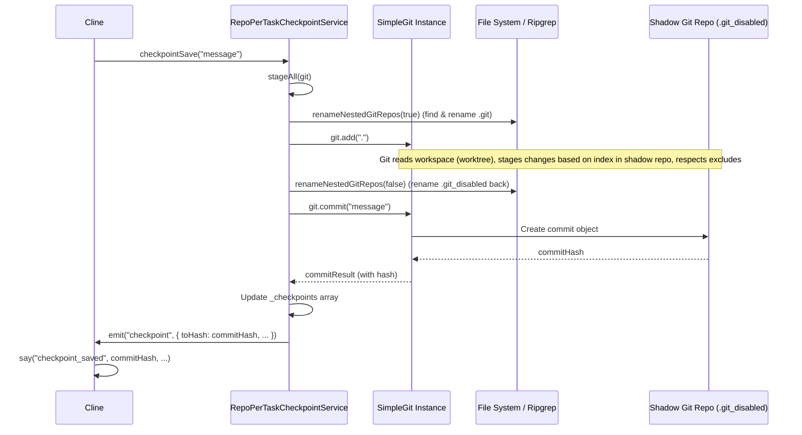

# Chapter 13: CheckpointService

In [Chapter 12: ExtensionStateContext](12_extensionstatecontext.md), we saw how Roo-Code manages the shared state within the WebView UI using React Context. This ensures the UI components are synchronized with data like chat messages and settings. However, Roo-Code often interacts with the user's workspace, potentially modifying files through tools like `apply_diff` or `write_to_file`. How can users track these changes over time, compare different states, or easily revert if an AI-suggested modification causes issues? This chapter introduces the `CheckpointService`, the mechanism Roo-Code uses to manage snapshots of the workspace state during a task.

## Motivation: Tracking and Reverting Workspace Changes

Working iteratively with an AI assistant can involve numerous file modifications. If the AI makes several changes across multiple files as part of a refactoring task, understanding the cumulative impact or reverting to a specific point before a problematic change can be difficult using standard `git commit` workflows, which might feel too heavy or disruptive during the flow of interaction. Users need a lightweight, task-specific way to snapshot the workspace state.

The `CheckpointService` provides this functionality. It allows Roo-Code (specifically the [Chapter 4: Cline](04_cline.md) instance managing a task) to save checkpoints of the workspace at key moments, typically before or after potentially destructive tool operations. Users can then view differences between these checkpoints or restore the entire workspace to a previous checkpoint state, all without interfering with their primary version control system (like the user's actual Git repository).

**Central Use Case:** A user asks Roo-Code to refactor a complex module involving multiple files. The AI proposes and applies changes using the `apply_diff` tool several times.
1.  Before the AI starts, `Cline` automatically requests a checkpoint save via `CheckpointService`.
2.  After each successful `apply_diff`, `Cline` requests another checkpoint save.
3.  The user reviews the final result and realizes the second change introduced a bug.
4.  In the Roo-Code chat UI ([Chapter 1: WebView UI](01_webview_ui.md)), the user sees messages indicating when checkpoints were saved. They click a "Restore" button associated with the checkpoint saved *before* the problematic second change.
5.  This triggers a call to `CheckpointService.restoreCheckpoint()`, which reverts the files in the user's workspace back to the state captured in that specific checkpoint. The user can then continue the task or try a different approach.
6.  Alternatively, the user could click "Diff" between two checkpoints to see exactly what changes the AI made during that step, displayed potentially using the [Chapter 20: DiffViewProvider](20_diffviewprovider.md).

## Key Concepts

1.  **Workspace State Tracking:** The primary goal is to capture snapshots of the file contents within the user's current VS Code workspace at specific points in time during a task.

2.  **Shadow Git Repository (`.git_disabled`):** The core implementation, `ShadowCheckpointService`, cleverly uses a standard Git repository hidden within a dedicated shadow directory (usually under `context.globalStorageUri/tasks/<taskId>/checkpoints/`). This shadow repo is configured to treat the user's actual workspace directory as its `core.worktree`. This means `git add` and `git commit` commands run within the shadow repo's context operate on the files in the user's workspace. The `.git` directory itself is often named `.git_disabled` within the shadow directory structure to prevent accidental discovery or conflict.

3.  **Task Isolation (`RepoPerTaskCheckpointService`):** `RepoPerTaskCheckpointService` extends `ShadowCheckpointService` and is designed to create a *separate* shadow Git repository for each unique task (`taskId`). This ensures that the checkpoint history (commits in the shadow repo) is completely isolated per task, preventing checkpoints from different tasks from interfering with each other.

4.  **Checkpoint Operations:**
    *   **Saving (`saveCheckpoint`):** This operation stages *all* current changes in the workspace (relative to the last commit in the shadow repo) and creates a new commit in the shadow Git repository. Each commit represents a checkpoint, identified by its Git commit hash.
    *   **Restoring (`restoreCheckpoint`):** This operation checks out a specific commit hash within the shadow Git repository using `git reset --hard` and potentially `git clean -fd`. Because the shadow repo's worktree is the user's workspace, this effectively overwrites the files in the workspace to match the state captured in that checkpoint commit.
    *   **Diffing (`getDiff`):** This operation uses `git diff` (or `git diffSummary` followed by `git show`) between two specified commit hashes (checkpoints) within the shadow repo to determine the changes made between those two points in time.

5.  **Non-Interference:** A crucial design goal is that the shadow Git repository used for checkpoints *does not* interfere with the user's primary Git repository (if one exists in the workspace). This is achieved by:
    *   Placing the shadow `.git` directory outside the workspace (in global storage).
    *   Using `.git/info/exclude` within the shadow repo to ignore common unwanted files (build artifacts, dependencies, large media files, defined in `src/services/checkpoints/excludes.ts`). This keeps the checkpoint commits focused on source code and configuration.
    *   Respecting the user's `.gitignore` file (handled automatically by Git).

6.  **Nested Repository Handling (`renameNestedGitRepos`):** Git doesn't easily track the contents of nested Git repositories unless they are treated as submodules. To ensure changes within nested repos (e.g., dependencies managed via Git) are included in checkpoints, the service temporarily renames any `.git` directories found within the workspace (except the root one, if any) to `.git_disabled` before staging files (`git add .`) and then renames them back afterward.

7.  **Asynchronous Initialization (`initShadowGit`):** Creating the shadow repository, staging initial files, and making the first commit can take time, especially on large workspaces. This initialization happens asynchronously, often kicked off when a `Cline` instance starts. Checkpoint operations wait for initialization to complete.

8.  **UI Integration:** Checkpoint saves are typically signaled to the user via messages in the chat UI (e.g., `await this.say("checkpoint_saved", commitHash, ...)`). The UI ([Chapter 36: History UI Components (WebView)](36_history_ui_components__webview_.md)) can then display these messages with associated commit hashes and provide buttons ("Diff", "Restore") that trigger corresponding `WebviewMessage`s ([Chapter 3: Webview/Extension Message Protocol](03_webview_extension_message_protocol.md)) handled by `webviewMessageHandler` and delegated to the active `Cline` instance's `checkpointDiff` or `checkpointRestore` methods. Diffs might be displayed using the [Chapter 20: DiffViewProvider](20_diffviewprovider.md).

## Using the CheckpointService

The service is primarily used internally by the [Chapter 4: Cline](04_cline.md) class, often automatically triggered around tool executions or potentially via specific user actions.

**Typical Lifecycle within `Cline`:**

1.  **Initialization (Conditional):**
    *   In the `Cline` constructor or `initiateTaskLoop`, if the `enableCheckpoints` option is true, `getCheckpointService()` is called.
    *   `getCheckpointService()` instantiates `RepoPerTaskCheckpointService` using `RepoPerTaskCheckpointService.create({ taskId, workspaceDir, shadowDir, log })`.
    *   It calls `service.initShadowGit()` asynchronously. This starts the process of creating the `.git_disabled` repo, staging, and making the initial commit in the background. Event listeners (`on("initialize")`, `on("checkpoint")`, `on("restore")`) are attached to handle completion and updates.

2.  **Automatic Saving (Example: Before `apply_diff`):**
    *   Inside `Cline.presentAssistantMessage`, just before calling `applyDiffTool`, `Cline` might call `await this.checkpointSave()`.
    *   **Input:** A commit message (e.g., "Before applying diff to file.ts").
    *   **Manager Action (`checkpointSave`):**
        *   Waits for initialization if needed.
        *   Calls `stageAll()` (which handles nested repo renaming, runs `git add .`, renames back).
        *   Calls `git.commit()` with the message.
        *   If a commit was created (changes existed), it stores the `commitHash`, emits a `checkpoint` event.
    *   **Cline Action:** Receives the `checkpoint` event (or waits for the promise). Calls `this.say("checkpoint_saved", commitHash, ...)` to notify the UI.
    *   **Output:** Checkpoint saved, commit hash sent to UI.

3.  **Diffing (User Initiated):**
    *   **User Action:** Clicks "Diff" between checkpoint A (hash `abc`) and checkpoint B (hash `def`) in the UI.
    *   **UI Message:** Sends `{ type: 'checkpointDiff', payload: { commitHash: 'def', previousCommitHash: 'abc', ts: ... } }`.
    *   **Handler:** `webviewMessageHandler` calls `provider.getCurrentCline()?.checkpointDiff(message.payload)`.
    *   **Cline Action (`checkpointDiff`):**
        *   Calls `service = await this.getInitializedCheckpointService()`.
        *   Calls `changes = await service.getDiff({ from: 'abc', to: 'def' })`.
        *   **Manager Action (`getDiff`):** Runs `git diffSummary ['abc..def']`, then iterates through changed files, using `git show ['abc:path']` and `git show ['def:path']` to get content.
        *   **Output:** Returns array of `CheckpointDiff` objects.
        *   `Cline` likely calls `vscode.commands.executeCommand("vscode.changes", title, changesFormattedForApi)` to display the diff using VS Code's built-in diff view or potentially the [Chapter 20: DiffViewProvider](20_diffviewprovider.md).

4.  **Restoring (User Initiated):**
    *   **User Action:** Clicks "Restore" on checkpoint A (hash `abc`) in the UI.
    *   **UI Message:** Sends `{ type: 'checkpointRestore', payload: { commitHash: 'abc', ts: ... } }`.
    *   **Handler:** `webviewMessageHandler` calls `provider.getCurrentCline()?.checkpointRestore(message.payload)`.
    *   **Cline Action (`checkpointRestore`):**
        *   Calls `service = await this.getInitializedCheckpointService()`.
        *   Calls `await service.restoreCheckpoint('abc')`.
        *   **Manager Action (`restoreCheckpoint`):** Runs `git.clean(...)`, `git.reset(['--hard', 'abc'])`. Emits `restore` event.
        *   **Output:** Workspace files are reset to state `abc`.
        *   `Cline` likely resets its *own* state (e.g., `apiConversationHistory`, `clineMessages`) to match the state at the time checkpoint `abc` was created (using timestamps stored with messages), effectively rolling back the conversation.
        *   `Cline` might then re-initialize or prompt the user on how to proceed.

## Code Walkthrough

### Service Creation and Extension (`src/services/checkpoints/RepoPerTaskCheckpointService.ts`)

```typescript
// --- File: src/services/checkpoints/RepoPerTaskCheckpointService.ts ---
import * as path from "path";

import { CheckpointServiceOptions } from "./types";
import { ShadowCheckpointService } from "./ShadowCheckpointService";

// Extends the base service to create a unique repo path per task
export class RepoPerTaskCheckpointService extends ShadowCheckpointService {
	public static create({ taskId, workspaceDir, shadowDir, log = console.log }: CheckpointServiceOptions) {
		// Construct the path for this specific task's shadow repo
		const taskCheckpointsDir = path.join(shadowDir, "tasks", taskId, "checkpoints");
		return new RepoPerTaskCheckpointService(
			taskId,
			taskCheckpointsDir, // Use task-specific path
			workspaceDir,
			log,
		);
	}
}

// --- File: src/services/checkpoints/index.ts ---
// Re-export for easier import elsewhere
export type { CheckpointServiceOptions } from "./types";
export { RepoPerTaskCheckpointService } from "./RepoPerTaskCheckpointService";
```

**Explanation:**

*   `RepoPerTaskCheckpointService` simply extends `ShadowCheckpointService`.
*   Its static `create` factory method constructs a task-specific path within the global storage (`shadowDir/tasks/<taskId>/checkpoints/`) and passes this path, along with the `taskId` and `workspaceDir`, to the `ShadowCheckpointService` constructor. This ensures each task gets its isolated shadow Git repository.

### Core Shadow Git Logic (`src/services/checkpoints/ShadowCheckpointService.ts`)

```typescript
// --- File: src/services/checkpoints/ShadowCheckpointService.ts ---
import fs from "fs/promises";
import os from "os";
import * as path from "path";
import crypto from "crypto";
import EventEmitter from "events";
import simpleGit, { SimpleGit, CommitResult } from "simple-git"; // Git library
import pWaitFor from "p-wait-for"; // Utility for waiting on conditions

import { fileExistsAtPath } from "../../utils/fs";
import { executeRipgrep } from "../../services/search/file-search"; // Used for finding nested .git

import { GIT_DISABLED_SUFFIX } from "./constants";
import { CheckpointDiff, CheckpointResult, CheckpointEventMap } from "./types";
import { getExcludePatterns } from "./excludes"; // Import exclude patterns

// Abstract base class implementing the core shadow Git logic
export abstract class ShadowCheckpointService extends EventEmitter {
	public readonly taskId: string;
	public readonly checkpointsDir: string; // Path to the shadow repo (e.g., .../tasks/<taskId>/checkpoints/)
	public readonly workspaceDir: string; // Path to the user's workspace

	protected _checkpoints: string[] = []; // Stores commit hashes of saved checkpoints
	protected _baseHash?: string; // Hash of the initial commit

	protected readonly dotGitDir: string; // Path to the shadow .git dir (e.g., .../checkpoints/.git)
	protected git?: SimpleGit; // SimpleGit instance, undefined until initialized
	protected readonly log: (message: string) => void;
	protected shadowGitConfigWorktree?: string; // Cached worktree path

	// ... getter for baseHash, isInitialized ...

	constructor(taskId: string, checkpointsDir: string, workspaceDir: string, log: (message: string) => void) {
		super();
		// Prevent usage in sensitive directories like home, Desktop, etc.
		// ... safety checks ...
		if (/* protected path check */ false) {
			throw new Error(`Cannot use checkpoints in ${workspaceDir}`);
		}

		this.taskId = taskId;
		this.checkpointsDir = checkpointsDir;
		this.workspaceDir = workspaceDir;
		this.dotGitDir = path.join(this.checkpointsDir, ".git"); // Standard .git path within shadow dir
		this.log = log;
	}

	/**
	 * Initializes the shadow Git repository asynchronously.
	 * Creates repo, sets config, writes excludes, makes initial commit if needed.
	 */
	public async initShadowGit(onInit?: () => Promise<void>) {
		if (this.git) { /* Already initialized */ }

		await fs.mkdir(this.checkpointsDir, { recursive: true });
		const git = simpleGit(this.checkpointsDir); // Initialize simple-git in the shadow dir
		// ... log git version ...

		let created = false;
		const startTime = Date.now();

		if (await fileExistsAtPath(this.dotGitDir)) {
			// Shadow repo already exists, verify worktree and load HEAD
			this.log(`[...] shadow git repo already exists at ${this.dotGitDir}`);
			const worktree = await this.getShadowGitConfigWorktree(git);
			if (worktree !== this.workspaceDir) { /* Throw error: worktree mismatch */ }
			await this.writeExcludeFile(); // Ensure excludes are up-to-date
			this.baseHash = await git.revparse(["HEAD"]); // Get current HEAD as base
		} else {
			// Create new shadow repo
			this.log(`[...] creating shadow git repo at ${this.checkpointsDir}`);
			await git.init();
			// CRITICAL: Tell Git the worktree is the user's workspace
			await git.addConfig("core.worktree", this.workspaceDir);
			// Standard setup for automated commits
			await git.addConfig("commit.gpgSign", "false");
			await git.addConfig("user.name", "Roo Code");
			await git.addConfig("user.email", "noreply@example.com");
			await this.writeExcludeFile(); // Write exclude patterns
			await this.stageAll(git); // Stage initial content
			// Create initial commit (allow empty if workspace is empty)
			const { commit } = await git.commit("initial commit", { "--allow-empty": null });
			this.baseHash = commit;
			created = true;
		}

		const duration = Date.now() - startTime;
		this.log(`[...] initialized shadow repo with base commit ${this.baseHash} in ${duration}ms`);
		this.git = git; // Store the initialized SimpleGit instance

		await onInit?.(); // Optional callback after initialization
		// Emit event signaling completion
		this.emit("initialize", { /* ... event data ... */ });
		return { created, duration };
	}

	/**
	 * Writes exclude patterns to .git/info/exclude in the shadow repo.
	 */
	protected async writeExcludeFile() {
		await fs.mkdir(path.join(this.dotGitDir, "info"), { recursive: true });
		const patterns = await getExcludePatterns(this.workspaceDir); // Get patterns from excludes.ts
		await fs.writeFile(path.join(this.dotGitDir, "info", "exclude"), patterns.join("\n"));
	}

	/**
	 * Stages all changes from the workspace, handling nested git repos.
	 */
	private async stageAll(git: SimpleGit) {
		await this.renameNestedGitRepos(true); // Temporarily disable nested .git dirs
		try {
			await git.add("."); // Stage everything from the worktree (workspace)
		} catch (error) {
			this.log(`[...] failed to add files to git: ${error}`);
		} finally {
			await this.renameNestedGitRepos(false); // Re-enable nested .git dirs
		}
	}

	/**
	 * Finds and renames/restores nested .git directories within the workspace.
	 */
	private async renameNestedGitRepos(disable: boolean) {
		try {
			const suffix = GIT_DISABLED_SUFFIX;
			const gitDir = ".git" + (disable ? "" : suffix);
			const targetSuffix = disable ? suffix : "";
			const sourceSuffix = disable ? "" : suffix;

			// Use ripgrep to efficiently find nested '.git' or '.git_disabled' dirs
			const args = ["--files", "--hidden", "--follow", "-g", `**/${gitDir}/HEAD`, this.workspaceDir];
			const gitPaths = (await executeRipgrep({ args, workspacePath: this.workspaceDir }))
				.filter(({ path: p }) => p.includes(gitDir) && !p.startsWith(".git")); // Filter results

			for (const gitPath of gitPaths) {
				const currentPath = path.join(this.workspaceDir, gitPath.path.replace(/\/HEAD$/, '')); // Get dir path
				// Skip root .git dir and already correctly named dirs
				if (path.relative(this.workspaceDir, currentPath) === gitDir.replace('/HEAD', '')) continue;
				if ((disable && currentPath.endsWith(suffix)) || (!disable && !currentPath.endsWith(suffix))) continue;

				// Calculate new path
				const newPath = disable ? currentPath + suffix : currentPath.slice(0, -suffix.length);

				try {
					await fs.rename(currentPath, newPath); // Perform rename
					this.log(`[...] ${disable ? "disabled" : "enabled"} nested git repo ${currentPath}`);
				} catch (error) { /* Log rename error */ }
			}
		} catch (error) { /* Log ripgrep error */ }
	}

	// ... getShadowGitConfigWorktree (helper to read/cache worktree path) ...

	/**
	 * Saves the current workspace state as a new checkpoint (commit).
	 */
	public async saveCheckpoint(message: string): Promise<CheckpointResult | undefined> {
		try {
			if (!this.git) { /* Throw error or wait */ }
			const startTime = Date.now();
			await this.stageAll(this.git); // Stage current changes
			const result: CommitResult = await this.git.commit(message, { "--allow-empty": null }); // Commit
			const isFirst = this._checkpoints.length === 0;
			const fromHash = this._checkpoints[this._checkpoints.length - 1] ?? this.baseHash!;
			const toHash = result.commit || fromHash; // Use previous hash if commit was empty

			if (result.commit) { // Only add hash if a commit was actually made
				this._checkpoints.push(toHash);
			}
			const duration = Date.now() - startTime;

			if (isFirst || result.commit) {
				// Emit event with commit details
				this.emit("checkpoint", { type: "checkpoint", isFirst, fromHash, toHash, duration });
			}

			// ... log success or no changes ...
			return result.commit ? result : undefined;
		} catch (e) { /* Handle/log/emit error */ }
	}

	/**
	 * Restores the workspace to a previous checkpoint state.
	 */
	public async restoreCheckpoint(commitHash: string) {
		try {
			if (!this.git) { /* Throw error or wait */ }
			const start = Date.now();
			// Reset workspace to the target commit state
			await this.git.clean("f", ["-d", "-f"]); // Remove untracked files/dirs forcefully
			await this.git.reset(["--hard", commitHash]); // Reset index and worktree to commit
			// Update internal checkpoint list
			const checkpointIndex = this._checkpoints.indexOf(commitHash);
			if (checkpointIndex !== -1) {
				this._checkpoints = this._checkpoints.slice(0, checkpointIndex + 1);
			}
			const duration = Date.now() - start;
			this.emit("restore", { type: "restore", commitHash, duration });
			// ... log success ...
		} catch (e) { /* Handle/log/emit error */ }
	}

	/**
	 * Gets the differences between two checkpoints (or a checkpoint and HEAD).
	 */
	public async getDiff({ from, to }: { from?: string; to?: string }): Promise<CheckpointDiff[]> {
		if (!this.git) { /* Throw error or wait */ }
		const result: CheckpointDiff[] = [];
		if (!from) { from = this.baseHash; /* Or find oldest commit */ }

		// Stage changes to include untracked files in diff summary against HEAD if 'to' is not specified
		if (!to) await this.stageAll(this.git);

		const diffTarget = to ? `${from}..${to}` : from;
		const { files } = await this.git.diffSummary([diffTarget]); // Get summary of changed files

		const cwdPath = await this.getShadowGitConfigWorktree(this.git) || this.workspaceDir;

		// For each changed file, get content before and after
		for (const file of files) {
			const relPath = file.file;
			const absPath = path.join(cwdPath, relPath);
			// Get content from the 'from' commit
			const before = await this.git.show([`${from}:${relPath}`]).catch(() => "");
			// Get content from the 'to' commit, or current workspace file if 'to' is HEAD
			const after = to
				? await this.git.show([`${to}:${relPath}`]).catch(() => "")
				: await fs.readFile(absPath, "utf8").catch(() => "");

			result.push({ paths: { relative: relPath, absolute: absPath }, content: { before, after } });
		}
		return result;
	}

	// ... EventEmitter type overrides (on, emit, etc.) ...
	// ... Static helpers (hashWorkspaceDir, path generators, deleteTask) ...
}
```

**Explanation:**

*   **Core Dependencies:** Uses `simple-git` for Git operations and `fs/promises` for file system access.
*   **`initShadowGit`:** Orchestrates repository creation or loading. Sets `core.worktree` to the user's workspace, adds basic config, writes exclude patterns using `writeExcludeFile`, and creates an initial commit if needed.
*   **`writeExcludeFile`:** Reads patterns from `getExcludePatterns` (which comes from `excludes.ts`) and writes them to the shadow repo's local exclude file (`.git/info/exclude`), keeping it separate from the user's `.gitignore`.
*   **`stageAll` / `renameNestedGitRepos`:** Handles the critical step of temporarily disabling nested `.git` directories before staging (`git add .`) and re-enabling them afterward to ensure their contents are tracked. `renameNestedGitRepos` likely uses a tool like `ripgrep` for efficient discovery.
*   **`saveCheckpoint`:** Stages all changes using `stageAll` and then attempts a `git commit`. It handles the case where there are no changes (empty commit). It emits a `checkpoint` event upon successful commit.
*   **`restoreCheckpoint`:** Uses `git clean` and `git reset --hard` to forcefully overwrite the workspace with the state from the specified `commitHash`. It updates the internal list of known checkpoints (`_checkpoints`).
*   **`getDiff`:** Gets a summary of changed files between `from` and `to` commits (or `from` and current `HEAD` if `to` is omitted). It then retrieves the content of each file at both the `from` and `to` revisions using `git show`.

### Cline Integration (Conceptual)

```typescript
// --- File: src/core/Cline.ts ---
// (Inside Cline class)

	// Checkpoint Service initialization (called from constructor or init method)
	private getCheckpointService() {
		if (!this.enableCheckpoints) return undefined;
		if (this.checkpointService) return this.checkpointService;
		if (this.checkpointServiceInitializing) return undefined; // Avoid race conditions

		const provider = this.providerRef.deref();
		if (!provider) return undefined; // Should not happen

		try {
			const workspaceDir = getWorkspacePath();
			const globalStorageDir = provider.context.globalStorageUri.fsPath;
			if (!workspaceDir || !globalStorageDir) { /* Log and disable */ }

			const options: CheckpointServiceOptions = { /* taskId, workspaceDir, shadowDir, log */ };
			const service = RepoPerTaskCheckpointService.create(options);
			this.checkpointServiceInitializing = true;

			// Attach event listeners
			service.on("initialize", ({ baseHash }) => {
				this.checkpointService = service;
				this.checkpointServiceInitializing = false;
				// Save initial checkpoint if needed
			});
			service.on("checkpoint", ({ toHash }) => {
				// Send update to UI
				provider.postMessageToWebview({ type: "currentCheckpointUpdated", text: toHash });
				// Save message to chat
				this.say("checkpoint_saved", toHash, undefined, undefined, { /* metadata */ });
			});
			// ... other listeners ...

			// Start initialization
			service.initShadowGit().catch(err => { /* Log and disable */ });
			return service; // Return service instance (might still be initializing)
		} catch (err) { /* Log and disable */ }
	}

	// Helper to ensure service is initialized before use
	private async getInitializedCheckpointService(/* ... options ... */) {
		const service = this.getCheckpointService();
		if (!service || service.isInitialized) return service;
		// Use pWaitFor to wait for initialization completion
		try {
			await pWaitFor(() => service.isInitialized, { /* interval, timeout */ });
			return service;
		} catch (err) { /* Handle timeout */ }
	}

	// Called before/after tool execution, etc.
	public async checkpointSave(message?: string) {
		const service = await this.getInitializedCheckpointService();
		if (!service) return;
		const commitMessage = message || `Checkpoint at ${new Date().toISOString()}`;
		try {
			await service.saveCheckpoint(commitMessage);
		} catch (error) { /* Log error */ }
	}

	// Called from webviewMessageHandler via provider
	public async checkpointDiff({ ts, previousCommitHash, commitHash, mode }: { /* ... */ }) {
		const service = await this.getInitializedCheckpointService();
		if (!service) return;
		try {
			// Adjust 'from' hash if needed based on 'mode' and 'ts'
			if (!previousCommitHash && mode === "checkpoint") { /* find previous hash from clineMessages */ }
			const changes = await service.getDiff({ from: previousCommitHash, to: commitHash });
			if (!changes?.length) { /* Inform user */ return; }
			// Trigger VS Code diff view command
			await vscode.commands.executeCommand("vscode.changes", /* title, formatted changes */);
		} catch (error) { /* Log error, inform user */ }
	}

	// Called from webviewMessageHandler via provider
	public async checkpointRestore({ ts, commitHash, mode }: { /* ... */ }) {
		const service = await this.getInitializedCheckpointService();
		if (!service) return;
		try {
			await service.restoreCheckpoint(commitHash);
			// Reset Cline's internal state to match the restored point
			if (mode === "restore") {
				const index = this.clineMessages.findIndex((m) => m.ts === ts); // Find msg related to commitHash
				if (index !== -1) {
					// Roll back API and Cline message history
					await this.overwriteApiConversationHistory(
						this.apiConversationHistory.filter(m => !m.ts || m.ts < ts) // Simplistic rollback
					);
					await this.overwriteClineMessages(this.clineMessages.slice(0, index + 1));
					// Add message indicating rollback occurred
					await this.say("api_req_deleted", /* details about rolled back cost */);
				}
			}
			// Re-initialize or prompt user (may involve cancelling current task instance)
			this.providerRef.deref()?.cancelTask(); // Signal provider to potentially re-init from history
		} catch (error) { /* Log error, inform user */ }
	}

```

**Explanation:**

*   **`getCheckpointService`/`getInitializedCheckpointService`:** Handles lazy initialization and ensures the service is ready before use, using `pWaitFor`.
*   **`checkpointSave`:** Wraps `service.saveCheckpoint`. Called at appropriate times (e.g., before file edits).
*   **`checkpointDiff`/`checkpointRestore`:** These methods are called in response to user actions from the WebView. They interact with the service (`getDiff`, `restoreCheckpoint`) and then handle the results (showing diff view, resetting `Cline` state). Note the state rollback logic in `checkpointRestore` is crucial for consistency.

## Internal Implementation

The service leverages the `simple-git` library to interact with the hidden Git repository.

**Step-by-Step (Saving a Checkpoint):**

1.  `Cline` calls `checkpointSave("message")`.
2.  `checkpointSave` calls `service.saveCheckpoint("message")`.
3.  `saveCheckpoint` ensures the service is initialized (`this.git` exists).
4.  It calls `this.stageAll(this.git)`.
    *   `stageAll` calls `renameNestedGitRepos(true)` -> Finds and renames nested `.git` to `.git_disabled`.
    *   `stageAll` calls `this.git.add(".")` -> Git stages changes from the `core.worktree` (user's workspace), respecting `.git/info/exclude` and `.gitignore`.
    *   `stageAll` calls `renameNestedGitRepos(false)` -> Renames `.git_disabled` back to `.git`.
5.  `saveCheckpoint` calls `this.git.commit("message", { "--allow-empty": null })`.
6.  Git creates a commit object in the shadow repo (`.git_disabled`) reflecting the staged changes.
7.  `saveCheckpoint` gets the new `commitHash`.
8.  It updates `this._checkpoints` and emits a `checkpoint` event.
9.  `Cline` receives the event (or promise resolution) and calls `this.say("checkpoint_saved", commitHash, ...)` to inform the UI.

**Sequence Diagram (Saving a Checkpoint):**



## Modification Guidance

Modifying the checkpoint system often involves tuning performance or changing triggering logic.

**Common Modifications:**

1.  **Changing Excluded Files:**
    *   **Edit `excludes.ts`:** Add or remove glob patterns from the arrays returned by functions like `getBuildArtifactPatterns`, `getMediaFilePatterns`, etc.
    *   **Considerations:** Excluding too much might miss important state changes. Including too much (like large binaries or node_modules) will bloat the shadow repo and slow down staging/committing. Test the impact on typical projects.

2.  **Adjusting Checkpoint Frequency:**
    *   **Modify `Cline.ts`:** Locate the calls to `this.checkpointSave()`. Add or remove calls based on desired granularity. For example, save only before potentially destructive tools, or save after every successful tool execution.
    *   **Considerations:** More frequent checkpoints provide finer-grained rollback but increase storage use and potential overhead. Less frequent checkpoints save resources but offer coarser rollback points.

3.  **Improving Nested Repo Handling:**
    *   **Modify `renameNestedGitRepos`:** If the `ripgrep` approach is too slow or fails in certain edge cases, replace it with an alternative directory traversal method (e.g., recursive `fs.readdir` with checks for `.git` directories). Ensure the renaming logic remains robust.
    *   **Considerations:** Performance is key here, especially in large workspaces with many nested repositories.

4.  **Implementing a Different Storage Strategy (Advanced):**
    *   **Create New Service:** Define a new class implementing a similar interface (`save`, `restore`, `diff`). Instead of Git, it might use file copying, hashing, or a specialized library.
    *   **Integrate:** Update `Cline.getCheckpointService` to instantiate the new service.
    *   **Considerations:** Git provides efficient storage (delta compression) and powerful diffing capabilities "for free." Alternative strategies might be simpler but less efficient or lack robust diffing.

**Best Practices:**

*   **Exclude Wisely:** Carefully curate the exclude list to balance tracking necessary files with performance and storage efficiency.
*   **Error Handling:** Ensure Git command errors within the service are caught and handled gracefully (e.g., log the error, potentially disable checkpoints for the session, inform the user).
*   **Asynchronicity:** Keep operations asynchronous (`async/await`) to avoid blocking the extension host, especially `initShadowGit` and potentially `saveCheckpoint` on large workspaces.
*   **Cleanup:** Implement logic to eventually clean up old task checkpoint repositories from global storage (perhaps via a command or age-based cleanup). The current structure doesn't explicitly show this, but it's important for long-term use. (Maybe `RepoPerTaskCheckpointService.deleteTask` is used?)
*   **User Control:** Ensure the `enableCheckpoints` setting provides a clear way for users to disable the feature if it causes issues or performance problems in their environment.

**Potential Pitfalls:**

*   **Performance:** On very large workspaces or workspaces with extremely high numbers of files/changes, staging (`git add .`) and committing can become slow, impacting the perceived responsiveness during AI interactions.
*   **Git Errors:** Unexpected states in the shadow repository or issues with Git execution could cause checkpoint operations to fail.
*   **Nested Repo Conflicts:** Errors during the renaming of nested `.git` directories could leave them in a disabled state or cause staging failures.
*   **Storage Consumption:** Each task creates a separate shadow repository. While Git is efficient, over a long time with many tasks, this could consume significant disk space in global storage if not cleaned up.
*   **Worktree Conflicts:** If the user manually modifies files *while* a checkpoint operation (especially `restoreCheckpoint` or `stageAll`) is in progress, it could lead to unpredictable states or errors.

## Conclusion

The `CheckpointService`, particularly `RepoPerTaskCheckpointService`, provides Roo-Code with a powerful, task-isolated mechanism for tracking workspace changes using hidden Git repositories. It enables users to easily view diffs between states and restore the workspace to previous points, significantly enhancing safety and usability when working with AI-driven code modifications. By abstracting the underlying Git operations and handling complexities like excludes and nested repositories, it offers a robust foundation for workspace versioning within the context of an AI task.

Having explored how workspace state is checkpointed, we now turn to how the conversation and task state itself is persisted across sessions. The next chapter discusses [Chapter 14: Task Persistence](14_task_persistence.md).

