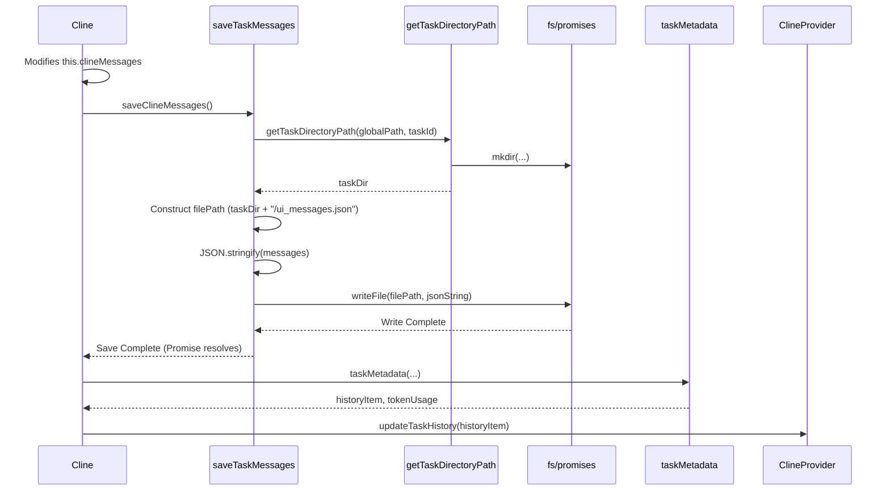

# Chapter 14: Task Persistence

In [Chapter 13: CheckpointService](13_checkpointservice.md), we explored how Roo-Code manages snapshots of the workspace state using hidden Git repositories, allowing users to track and revert file changes made during a task. However, beyond workspace state, the task's conversational context itself – the messages exchanged with the AI, the messages shown in the UI, and metadata like cost – also needs to be preserved. This chapter delves into how Roo-Code handles **Task Persistence**, ensuring that task history is saved and can be reloaded across VS Code sessions.

## Motivation: Remembering Conversations and History

Imagine engaging in a complex coding task with Roo-Code, involving multiple exchanges, tool uses, and code modifications. If you close VS Code or switch projects, you wouldn't want that entire conversation to be lost. Users expect to be able to:

1.  View a **history** of past tasks, including summaries, timestamps, and costs.
2.  **Re-open** a previous task to review the full conversation exactly as it appeared in the chat UI.
3.  Potentially **resume** an interrupted task, allowing the AI to pick up where it left off with the correct conversational context.

Task Persistence enables these features by systematically saving task-related data to disk within dedicated directories. Without it, each Roo-Code session would start with a blank slate, severely limiting its usefulness for anything beyond trivial, single-shot interactions.

**Central Use Case:** A user starts a debugging task ("Task A"), interacts with the AI, and Roo-Code saves several messages. The user then closes VS Code. Later, they reopen VS Code and want to see Task A in the History view.

1.  **During Interaction:** As messages are exchanged in Task A, the [Chapter 4: Cline](04_cline.md) instance calls persistence functions (`saveApiMessages`, `saveTaskMessages`) after each significant update.
2.  **Saving:** These functions write the raw API conversation history (`api_conversation_history.json`) and the UI chat messages (`ui_messages.json`) to a specific directory for Task A (e.g., `.../tasks/<taskId_A>/`).
3.  **Closing VS Code:** The files remain on disk.
4.  **Reopening VS Code:** The user opens the Roo-Code History view.
5.  **Loading History:** The history loading mechanism (likely triggered by [Chapter 2: ClineProvider](02_clineprovider.md)) needs to find Task A's directory. It calls `taskMetadata` which reads the saved messages, calculates summary info (like token counts, cost, last updated time) using utilities like [Chapter 29: Cost Calculation Utilities](29_cost_calculation_utilities.md), and generates a `HistoryItem` object.
6.  **Display:** The History view displays the summary information for Task A based on the `HistoryItem`. If the user clicks on Task A, Roo-Code can then load the full `ui_messages.json` to reconstruct the chat view, or potentially use `api_conversation_history.json` to resume the task.

## Key Concepts

1.  **Task-Specific Storage:** Each Roo-Code task, identified by a unique `taskId` (a UUID generated by `Cline`), gets its own dedicated directory for storing its data. This isolation prevents data from different tasks from mixing. The path is typically determined using `getTaskDirectoryPath` from `src/shared/storagePathManager.ts`, resulting in a structure like: `[globalStorageUri]/tasks/[taskId]/`.

2.  **Data Files:** Within each task directory, several key JSON files are stored:
    *   **`api_conversation_history.json`:** Contains an array of messages in the format sent to and received from the LLM API (using `Anthropic.MessageParam` as the internal standard, defined in `src/core/task-persistence/apiMessages.ts`). This includes user messages, assistant responses (often including the raw text with tool XML), and tool results.
        *   **Purpose:** Essential for resuming tasks, as it provides the exact context the LLM needs. Also useful for debugging API interactions.
        *   **Managed by:** `readApiMessages`, `saveApiMessages` in `src/core/task-persistence/apiMessages.ts`.
    *   **`ui_messages.json`:** Contains an array of messages structured for display in the WebView UI (`ClineMessage` format, defined in `src/shared/ExtensionMessage.ts`). This includes user inputs, formatted AI responses (`say`), AI questions (`ask`), status updates, error messages, checkpoint notifications, etc.
        *   **Purpose:** Reconstructing the chat history exactly as it appeared to the user in the [Chapter 1: WebView UI](01_webview_ui.md).
        *   **Managed by:** `readTaskMessages`, `saveTaskMessages` in `src/core/task-persistence/taskMessages.ts`.
    *   **`task_metadata.json` (Generated, not usually stored as a separate file):** While not typically stored as a static file, the concept of task metadata is crucial. The `taskMetadata` function (`src/core/task-persistence/taskMetadata.ts`) dynamically generates metadata by reading the saved message files. This metadata includes:
        *   Task summary (often derived from the first user message).
        *   Timestamps (start, last update).
        *   Token counts and calculated cost (using `getApiMetrics` from `src/shared/getApiMetrics.ts`).
        *   Task directory size on disk.
        *   Workspace path associated with the task.
        *   **Purpose:** Populating the History view UI ([Chapter 36: History UI Components (WebView)](36_history_ui_components__webview_.md)) with summarized information without loading the full message content. It generates a `HistoryItem` object.

3.  **Persistence Points:** Data isn't just saved at the very end. `Cline` calls the `save...` functions frequently during its lifecycle to ensure data isn't lost if VS Code is closed unexpectedly:
    *   `saveApiMessages` is called by `addToApiConversationHistory` and `overwriteApiConversationHistory`.
    *   `saveTaskMessages` is called by `addToClineMessages` and `overwriteClineMessages`. These are triggered after user messages, AI responses (`say`), AI questions (`ask`), and potentially after tool results or state changes.

4.  **Loading:** Data is loaded on demand:
    *   **History View:** The history mechanism iterates through task directories, calling `taskMetadata` for each to get summaries.
    *   **Viewing Full Task:** When a user clicks a task in the history, `readTaskMessages` is used to load `ui_messages.json` to populate the chat view.
    *   **Resuming Task:** When a user chooses to resume, `Cline.resumeTaskFromHistory` calls `readApiMessages` and `readTaskMessages` to load the respective histories into the new `Cline` instance's state (`apiConversationHistory` and `clineMessages`).

5.  **Standard File Names:** Consistent filenames (`api_conversation_history.json`, `ui_messages.json`) are used across all tasks, defined in `src/shared/globalFileNames.ts`.

## Using Task Persistence (Central Use Case Revisited)

Let's trace the saving and loading steps for the user resuming Task A after restarting VS Code.

**Saving During Task A:**

1.  **User Sends Message:** User types "Debug this error" and sends.
2.  **`Cline.say`:** `Cline` calls `this.say("text", "Debug this error", ...)` which calls `addToClineMessages`.
3.  **`addToClineMessages`:** Appends the `ClineMessage` to `this.clineMessages`, calls `provider.postStateToWebview()`, emits `message` event, and crucially calls `await this.saveClineMessages()`.
4.  **`saveClineMessages`:** Calls `saveTaskMessages({ messages: this.clineMessages, taskId: this.taskId, ... })`.
5.  **`saveTaskMessages` (persistence function):**
    *   Calls `getTaskDirectoryPath(..., this.taskId)` to get `.../tasks/taskId_A/`.
    *   Constructs the full file path `.../tasks/taskId_A/ui_messages.json`.
    *   Calls `fs.writeFile(filePath, JSON.stringify(this.clineMessages))` to save the UI messages.
    *   Also triggers `taskMetadata` calculation and updates history via `provider.updateTaskHistory`.
6.  **AI Responds:** AI sends back text and a request to read a file (`read_file`).
7.  **`Cline.addToApiConversationHistory`:** `Cline` adds the user message and the assistant message (including the `<read_file>` tag) to `this.apiConversationHistory` and calls `await this.saveApiConversationHistory()`.
8.  **`saveApiConversationHistory`:** Calls `saveApiMessages({ messages: this.apiConversationHistory, taskId: this.taskId, ... })`.
9.  **`saveApiMessages` (persistence function):**
    *   Gets task directory path `.../tasks/taskId_A/`.
    *   Constructs file path `.../tasks/taskId_A/api_conversation_history.json`.
    *   Calls `fs.writeFile(filePath, JSON.stringify(this.apiConversationHistory))` to save the API messages.
10. **`Cline.say`:** `Cline` calls `say` to display the AI response, triggering `saveClineMessages` again for `ui_messages.json`.
11. **User Closes VS Code:** The two JSON files exist in the task directory.

**Loading for History View:**

1.  **User Reopens VS Code:** Opens Roo-Code panel, navigates to History tab.
2.  **Provider Loads History:** `ClineProvider` (or a dedicated history service) needs to populate the history list. It might scan the `.../tasks/` directory.
3.  **Metadata Fetch:** For each subdirectory (like `taskId_A`), it calls a function that internally uses `taskMetadata({ taskId: 'taskId_A', ... })`.
4.  **`taskMetadata` (persistence function):**
    *   Calls `readTaskMessages({ taskId: 'taskId_A', ... })` to get the `clineMessages`.
    *   Uses `clineMessages` (specifically `messages[0].text` for the task summary, and others for calculating metrics via `getApiMetrics`).
    *   Calculates folder size using `getFolderSize`.
    *   Constructs and returns a `HistoryItem` object containing `{ id: 'taskId_A', task: 'Debug this error', ts: ..., totalCost: ..., size: ... }`.
5.  **UI Population:** `ClineProvider` sends the list of `HistoryItem` objects to the [Chapter 1: WebView UI](01_webview_ui.md) via the `state` message. The [Chapter 36: History UI Components (WebView)](36_history_ui_components__webview_.md) display the list.

**Loading for Task Resumption:**

1.  **User Clicks Resume:** User clicks "Resume" on Task A in the History view.
2.  **UI Message:** Sends `{ type: 'showTaskWithId', text: 'taskId_A' }` (or similar resume message).
3.  **Provider Handles:** `webviewMessageHandler` calls `provider.showTaskWithId('taskId_A')`.
4.  **`Cline` Instantiation:** `provider.showTaskWithId` likely creates a new `Cline` instance *specifically for resuming*, passing the `HistoryItem` for Task A: `new Cline({ ..., historyItem: taskAHistoryItem, startTask: true })`.
5.  **`Cline.resumeTaskFromHistory`:**
    *   Calls `await this.getSavedClineMessages()`, which internally calls `readTaskMessages({ taskId: this.taskId, ... })`. This loads `.../tasks/taskId_A/ui_messages.json` into `this.clineMessages`.
    *   Calls `await this.getSavedApiConversationHistory()`, which internally calls `readApiMessages({ taskId: this.taskId, ... })`. This loads `.../tasks/taskId_A/api_conversation_history.json` into `this.apiConversationHistory`.
    *   Cleans up any previous "resume" messages from `this.clineMessages`.
    *   Asks the user to confirm resumption via `this.ask("resume_task")`.
    *   Prepares the API history and the next user message (potentially including user feedback and handling interrupted tool calls).
    *   Calls `initiateTaskLoop()` to continue the agentic loop with the loaded context.

## Code Walkthrough

### Persistence Functions (`src/core/task-persistence/*.ts`)

These files contain the core logic for reading and writing the task-specific JSON files.

```typescript
// --- File: src/shared/storagePathManager.ts ---
import * as vscode from "vscode";
import * as path from "path";
import * as fs from "fs/promises";
// ... getStorageBasePath, promptForCustomStoragePath ...

/**
 * Gets the storage directory path for a task, creating it if necessary.
 */
export async function getTaskDirectoryPath(globalStoragePath: string, taskId: string): Promise<string> {
	// Use base path logic (handles custom path or default global storage)
	const basePath = await getStorageBasePath(globalStoragePath);
	// Define the task-specific directory path
	const taskDir = path.join(basePath, "tasks", taskId);
	// Ensure the directory exists
	await fs.mkdir(taskDir, { recursive: true });
	return taskDir;
}

// --- File: src/shared/globalFileNames.ts ---
export const GlobalFileNames = {
	// Defines standard filenames used across persistence modules
	apiConversationHistory: "api_conversation_history.json",
	uiMessages: "ui_messages.json",
	// ... other potential filenames ...
	taskMetadata: "task_metadata.json", // Note: metadata is usually generated dynamically
};

// --- File: src/core/task-persistence/apiMessages.ts ---
import * as path from "path";
import * as fs from "fs/promises";
import { Anthropic } from "@anthropic-ai/sdk";
import { fileExistsAtPath } from "../../utils/fs"; // Utility to check file existence
import { GlobalFileNames } from "../../shared/globalFileNames";
import { getTaskDirectoryPath } from "../../shared/storagePathManager"; // Use shared path manager

// Type alias for clarity
export type ApiMessage = Anthropic.MessageParam & { ts?: number };

export type ReadApiMessagesOptions = {
	taskId: string;
	globalStoragePath: string;
};

// Reads the API conversation history file for a task
export async function readApiMessages({
	taskId,
	globalStoragePath,
}: ReadApiMessagesOptions): Promise<ApiMessage[]> {
	try {
        // Get the dedicated directory for this task
		const taskDir = await getTaskDirectoryPath(globalStoragePath, taskId);
        // Construct the full file path
		const filePath = path.join(taskDir, GlobalFileNames.apiConversationHistory);

		if (await fileExistsAtPath(filePath)) {
			// If file exists, read and parse it
			const content = await fs.readFile(filePath, "utf8");
			return JSON.parse(content) as ApiMessage[];
		}
        // Handle legacy filename for backward compatibility (optional)
        // ... legacy check ...
	} catch (error) {
		console.error(`Failed to read API messages for task ${taskId}:`, error);
	}
	// Return empty array if file doesn't exist or read fails
	return [];
}

export type SaveApiMessagesOptions = {
	messages: ApiMessage[];
	taskId: string;
	globalStoragePath: string;
};

// Saves the API conversation history file for a task
export async function saveApiMessages({ messages, taskId, globalStoragePath }: SaveApiMessagesOptions) {
	try {
		const taskDir = await getTaskDirectoryPath(globalStoragePath, taskId);
		const filePath = path.join(taskDir, GlobalFileNames.apiConversationHistory);
		// Write the messages array as a JSON string
		await fs.writeFile(filePath, JSON.stringify(messages, null, 2)); // Use formatting for readability
	} catch (error) {
		console.error(`Failed to save API messages for task ${taskId}:`, error);
		// Consider re-throwing or notifying user if saving is critical
	}
}

// --- File: src/core/task-persistence/taskMessages.ts ---
// Structure is very similar to apiMessages.ts, but uses ClineMessage type
import * as path from "path";
import * as fs from "fs/promises";
import { fileExistsAtPath } from "../../utils/fs";
import { GlobalFileNames } from "../../shared/globalFileNames";
import { getTaskDirectoryPath } from "../../shared/storagePathManager";
import { ClineMessage } from "../../shared/ExtensionMessage"; // Import UI message type

export type ReadTaskMessagesOptions = {
	taskId: string;
	globalStoragePath: string;
};

export async function readTaskMessages({
	taskId,
	globalStoragePath,
}: ReadTaskMessagesOptions): Promise<ClineMessage[]> {
	try {
		const taskDir = await getTaskDirectoryPath(globalStoragePath, taskId);
		const filePath = path.join(taskDir, GlobalFileNames.uiMessages);
		if (await fileExistsAtPath(filePath)) {
			const content = await fs.readFile(filePath, "utf8");
			return JSON.parse(content) as ClineMessage[];
		}
	} catch (error) {
		console.error(`Failed to read UI messages for task ${taskId}:`, error);
	}
	return [];
}

export type SaveTaskMessagesOptions = {
	messages: ClineMessage[];
	taskId: string;
	globalStoragePath: string;
};

export async function saveTaskMessages({ messages, taskId, globalStoragePath }: SaveTaskMessagesOptions) {
	try {
		const taskDir = await getTaskDirectoryPath(globalStoragePath, taskId);
		const filePath = path.join(taskDir, GlobalFileNames.uiMessages);
		await fs.writeFile(filePath, JSON.stringify(messages, null, 2));
	} catch (error) {
		console.error(`Failed to save UI messages for task ${taskId}:`, error);
	}
}

// --- File: src/core/task-persistence/taskMetadata.ts ---
import NodeCache from "node-cache"; // For caching folder size calculation
import getFolderSize from "get-folder-size"; // Library to calculate directory size
import { ClineMessage } from "../../shared/ExtensionMessage";
import { combineApiRequests } from "../../shared/combineApiRequests"; // Utility helper
import { combineCommandSequences } from "../../shared/combineCommandSequences"; // Utility helper
import { getApiMetrics } from "../../shared/getApiMetrics"; // Cost/token calculation
import { findLastIndex } from "../../shared/array"; // Utility helper
import { HistoryItem } from "../../shared/HistoryItem"; // Output type
import { getTaskDirectoryPath } from "../../shared/storagePathManager";
import { readTaskMessages } from "./taskMessages"; // Import read function

// Cache for task directory sizes to avoid repeated slow calculations
const taskSizeCache = new NodeCache({ stdTTL: 30, checkperiod: 5 * 60 }); // 30s TTL, check every 5min

export type TaskMetadataOptions = {
	// messages: ClineMessage[]; // Removed: Now reads messages internally
	taskId: string;
	taskNumber: number; // Sequence number for display
	globalStoragePath: string;
	workspace: string; // Workspace path associated with the task
};

// Generates metadata summary for a task, used by the History view
export async function taskMetadata({
	taskId,
	taskNumber,
	globalStoragePath,
	workspace,
}: TaskMetadataOptions): Promise<{ historyItem: HistoryItem, tokenUsage: ReturnType<typeof getApiMetrics> }> {
    // Read the UI messages for this task
    const messages = await readTaskMessages({ taskId, globalStoragePath });

    if (messages.length === 0) {
        // Handle case where task has no messages (maybe failed early)
        // Return a default/empty HistoryItem
        const defaultTokenUsage = { totalTokensIn: 0, totalTokensOut: 0, totalCacheReads: 0, totalCacheWrites: 0, totalCost: 0, contextTokens: 0 };
        return {
            historyItem: { id: taskId, number: taskNumber, ts: Date.now(), task: "(Empty Task)", tokensIn: 0, tokensOut: 0, cacheWrites: 0, cacheReads: 0, totalCost: 0, size: 0, workspace },
            tokenUsage: defaultTokenUsage
        };
    }

	const taskDir = await getTaskDirectoryPath(globalStoragePath, taskId);
	const taskMessage = messages[0]; // First message is assumed to be the initial user task/prompt

	// Find the last message relevant for timestamp (ignore resume prompts)
	const lastRelevantMessage =
		messages[findLastIndex(messages, (m) => !(m.ask === "resume_task" || m.ask === "resume_completed_task"))] ?? taskMessage;

    // Calculate folder size, using cache
	let taskDirSize = taskSizeCache.get<number>(taskDir);
	if (taskDirSize === undefined) {
		try {
			// getFolderSize can be slow, hence the caching
			taskDirSize = await getFolderSize.loose(taskDir);
			taskSizeCache.set<number>(taskDir, taskDirSize);
		} catch (error) {
			console.warn(`Failed to get folder size for task ${taskId}:`, error);
			taskDirSize = 0; // Default to 0 on error
		}
	}

    // Calculate token usage and cost using shared utility
    // Combine requests/commands first for accurate calculation if needed by getApiMetrics
	const tokenUsage = getApiMetrics(combineApiRequests(combineCommandSequences(messages.slice(1)))); // Exclude first user message maybe?

    // Construct the HistoryItem object
	const historyItem: HistoryItem = {
		id: taskId,
		number: taskNumber, // Sequence number
		ts: lastRelevantMessage.ts, // Timestamp of last relevant message
		task: taskMessage.text?.substring(0, 200) ?? "(No task description)", // Summary from first message
		tokensIn: tokenUsage.totalTokensIn,
		tokensOut: tokenUsage.totalTokensOut,
		cacheWrites: tokenUsage.totalCacheWrites,
		cacheReads: tokenUsage.totalCacheReads,
		totalCost: tokenUsage.totalCost,
		size: taskDirSize, // Size on disk
		workspace, // Associated workspace path
	};

	return { historyItem, tokenUsage }; // Return both metadata and calculated usage
}

// --- File: src/core/task-persistence/index.ts ---
// Barrel file re-exporting the persistence functions
export { readApiMessages, saveApiMessages } from "./apiMessages";
export { readTaskMessages, saveTaskMessages } from "./taskMessages";
export { taskMetadata } from "./taskMetadata";
```

**Explanation:**

*   **`getTaskDirectoryPath`:** Uses the base path (from settings or default global storage) and combines it with `/tasks/[taskId]` to create a unique, isolated directory for each task, ensuring it exists.
*   **`GlobalFileNames`:** Defines constants for the JSON filenames, promoting consistency.
*   **`readApiMessages`/`saveApiMessages`:** Implement reading (`fs.readFile`, `JSON.parse`) and writing (`JSON.stringify`, `fs.writeFile`) for the `api_conversation_history.json` file within the correct task directory. Includes basic error handling.
*   **`readTaskMessages`/`saveTaskMessages`:** Identical structure to the API message functions but operate on `ui_messages.json` and use the `ClineMessage` type.
*   **`taskMetadata`:**
    *   Reads the UI messages using `readTaskMessages`.
    *   Handles the case of empty tasks.
    *   Determines the task directory path.
    *   Calculates the directory size using `getFolderSize`, employing a `NodeCache` to avoid redundant calculations.
    *   Uses shared utilities (`combineApiRequests`, `combineCommandSequences`, `getApiMetrics`) to calculate token usage and cost based on the messages.
    *   Constructs and returns a `HistoryItem` object suitable for display in the history UI, along with the detailed `tokenUsage`.

### Usage within `Cline.ts`

```typescript
// --- File: src/core/Cline.ts ---
// (Excerpts showing calls to persistence functions)
import { readApiMessages, saveApiMessages, readTaskMessages, saveTaskMessages, taskMetadata } from "./task-persistence";
// ... other imports ...

export class Cline extends EventEmitter<ClineEvents> {
    // ... properties ...

	// Storing task to disk for history

	private async getSavedApiConversationHistory(): Promise<ApiMessage[]> {
        // Calls the imported read function
		return readApiMessages({ taskId: this.taskId, globalStoragePath: this.globalStoragePath });
	}

	private async addToApiConversationHistory(message: Anthropic.MessageParam) {
		const messageWithTs = { ...message, ts: Date.now() };
		this.apiConversationHistory.push(messageWithTs);
		// Calls save after modifying the history array
		await this.saveApiConversationHistory();
	}

	async overwriteApiConversationHistory(newHistory: ApiMessage[]) {
		this.apiConversationHistory = newHistory;
		// Calls save after overwriting the history array
		await this.saveApiConversationHistory();
	}

	private async saveApiConversationHistory() {
		try {
            // Calls the imported save function
			await saveApiMessages({
				messages: this.apiConversationHistory,
				taskId: this.taskId,
				globalStoragePath: this.globalStoragePath,
			});
		} catch (error) { /* ... error handling ... */ }
	}

	private async getSavedClineMessages(): Promise<ClineMessage[]> {
        // Calls the imported read function
		return readTaskMessages({ taskId: this.taskId, globalStoragePath: this.globalStoragePath });
	}

	private async addToClineMessages(message: ClineMessage) {
		this.clineMessages.push(message);
		await this.providerRef.deref()?.postStateToWebview(); // Update UI immediately
		this.emit("message", { action: "created", message });
		// Calls save after modifying the messages array
		await this.saveClineMessages();
	}

	public async overwriteClineMessages(newMessages: ClineMessage[]) {
		// ... reset prompt cache key ...
		this.clineMessages = newMessages;
		// Calls save after overwriting the messages array
		await this.saveClineMessages();
	}

    // (updateClineMessage sends partial updates, doesn't save directly)

	private async saveClineMessages() {
		try {
            // Calls the imported save function
			await saveTaskMessages({
				messages: this.clineMessages,
				taskId: this.taskId,
				globalStoragePath: this.globalStoragePath,
			});

            // After saving messages, update the metadata for history view
			const { historyItem, tokenUsage } = await taskMetadata({
				// messages: this.clineMessages, // taskMetadata now reads internally
				taskId: this.taskId,
				taskNumber: this.taskNumber,
				globalStoragePath: this.globalStoragePath,
				workspace: this.cwd,
			});

			this.emit("taskTokenUsageUpdated", this.taskId, tokenUsage); // Emit usage update event

			// Notify the provider to update the history list in the UI
			await this.providerRef.deref()?.updateTaskHistory(historyItem);
		} catch (error) { /* ... error handling ... */ }
	}

    // --- In resumeTaskFromHistory ---
	private async resumeTaskFromHistory() {
		// Load saved UI messages from disk
		const modifiedClineMessages = await this.getSavedClineMessages();
        // ... clean up resume messages ...
        await this.overwriteClineMessages(modifiedClineMessages); // Update internal state & save
        this.clineMessages = await this.getSavedClineMessages(); // Re-read cleaned messages

		// Load API history from disk
		this.apiConversationHistory = await this.getSavedApiConversationHistory();
        // ... rest of resume logic ...
    }

    // ... rest of Cline class ...
}
```

**Explanation:**

*   `Cline` imports the persistence functions (`readApiMessages`, `saveApiMessages`, etc.).
*   Methods that modify the internal history arrays (`apiConversationHistory`, `clineMessages`) like `addTo...`, `overwrite...` are responsible for calling the corresponding `save...` function immediately afterward to persist the change.
*   `saveClineMessages` also triggers `taskMetadata` to regenerate the summary and notifies the `ClineProvider` to update the history UI.
*   `resumeTaskFromHistory` uses the `getSaved...` methods (which call the `read...` functions) to populate its state when resuming.

## Internal Implementation

The persistence mechanism relies on standard Node.js file system operations (`fs.promises`) within the VS Code extension context.

**Save Flow (`saveTaskMessages`):**

1.  **Trigger:** `Cline.addToClineMessages` calls `saveClineMessages`.
2.  **Delegate:** `Cline.saveClineMessages` calls `saveTaskMessages({ messages: ..., taskId: ..., globalStoragePath: ... })`.
3.  **Get Path:** `saveTaskMessages` calls `getTaskDirectoryPath(globalStoragePath, taskId)`.
    *   `getTaskDirectoryPath` calls `getStorageBasePath` (checks custom path setting or uses default `context.globalStorageUri.fsPath`).
    *   Constructs the path: `basePath/tasks/taskId`.
    *   Calls `fs.mkdir(taskDir, { recursive: true })` to ensure the directory exists. Returns `taskDir`.
4.  **Construct File Path:** `saveTaskMessages` constructs the full path: `taskDir/ui_messages.json`.
5.  **Stringify:** `JSON.stringify(messages, null, 2)` converts the `ClineMessage[]` array to a formatted JSON string.
6.  **Write File:** `fs.writeFile(filePath, jsonString)` writes the string to the file, overwriting it if it exists. This is an atomic operation at the OS level for typical file sizes.
7.  **(Update Metadata):** `Cline.saveClineMessages` then calls `taskMetadata` and `provider.updateTaskHistory`.

**Load Flow (`readTaskMessages`):**

1.  **Trigger:** `Cline.resumeTaskFromHistory` calls `getSavedClineMessages`.
2.  **Delegate:** `getSavedClineMessages` calls `readTaskMessages({ taskId: ..., globalStoragePath: ... })`.
3.  **Get Path:** `readTaskMessages` calls `getTaskDirectoryPath` (same logic as save).
4.  **Construct File Path:** `readTaskMessages` constructs the full path: `taskDir/ui_messages.json`.
5.  **Check Existence:** `fileExistsAtPath(filePath)` checks if the file exists. If not, return `[]`.
6.  **Read File:** `fs.readFile(filePath, "utf8")` reads the file content as a string.
7.  **Parse:** `JSON.parse(content)` parses the JSON string into a `ClineMessage[]` array.
8.  **Return:** The array is returned to `Cline`.

**Sequence Diagram (Saving UI Messages):**



## Modification Guidance

Modifications might involve changing what data is stored, how it's stored, or how metadata is calculated.

**Common Modifications:**

1.  **Adding a New Field to `ClineMessage` to Persist:**
    *   **Schema:** Add the new field (e.g., `userRating?: number`) to the `ClineMessage` type definition in `src/shared/ExtensionMessage.ts`.
    *   **`Cline`:** Update the logic in `Cline` where messages are created or updated to include the `userRating` field when appropriate.
    *   **Persistence:** No changes needed in `saveTaskMessages` or `readTaskMessages`. Since they serialize/deserialize the entire `ClineMessage` object, the new field will be automatically included as long as it's JSON-serializable.
    *   **Consumption:** Update the UI or other consumers to read and use the new `userRating` field from the loaded messages.

2.  **Storing Additional Task-Specific Data (e.g., Tool Usage Summary):**
    *   **Define Structure:** Decide on the structure (e.g., `interface TaskToolSummary { [toolName: string]: number }`) and filename (e.g., `tool_summary.json`, add to `GlobalFileNames`).
    *   **Create Functions:** Create new persistence functions (e.g., `readToolSummary`, `saveToolSummary`) in `src/core/task-persistence/`, mirroring the structure of `read/saveTaskMessages` but using the new structure and filename.
    *   **`Cline` Integration:**
        *   In `Cline`, add logic to maintain the tool usage summary (perhaps updating it within `recordToolUsage`).
        *   Call `saveToolSummary` whenever the summary changes (e.g., after `recordToolUsage`).
        *   If needed for resuming, call `readToolSummary` in `resumeTaskFromHistory`.
    *   **Metadata (Optional):** Modify `taskMetadata` to read the new summary file (`readToolSummary`) and potentially include parts of it in the `HistoryItem`.

3.  **Changing Metadata Calculation:**
    *   **Modify `taskMetadata.ts`:**
        *   To change the summary (`HistoryItem.task`), adjust how `taskMessage.text` is processed (e.g., different substring length, custom summary logic).
        *   To change cost/token calculation, modify the inputs passed to `getApiMetrics` or the logic within `getApiMetrics` itself ([Chapter 29: Cost Calculation Utilities](29_cost_calculation_utilities.md)).
        *   To include new data, read it from the saved files (if necessary) and add it to the `HistoryItem` object (also update the `HistoryItem` type definition).

**Best Practices:**

*   **Atomic Writes:** Standard `fs.writeFile` is generally atomic for replacing file content on most modern OSes, reducing the risk of corruption if the process crashes mid-write. However, for complex multi-file updates, true atomicity isn't guaranteed without more complex mechanisms (like writing to temp files and renaming).
*   **Error Handling:** Wrap file system operations (`readFile`, `writeFile`, `mkdir`) in `try...catch` blocks. Log errors appropriately. Decide if errors should be re-thrown to halt the operation or if returning default/empty data is acceptable (as currently done in `read...` functions).
*   **Data Size:** Be mindful of the size of the JSON files, especially `api_conversation_history.json`. Very long conversations with large tool results could lead to large files, potentially impacting read/write performance and disk usage. Consider if truncation or summarization is ever needed (though usually preserving full history is desired).
*   **Schema Evolution:** If the structure of `ClineMessage` or `ApiMessage` changes significantly over time, loading older JSON files might fail `JSON.parse` or subsequent processing. While migrations aren't typically built for these task files (unlike `ProviderSettingsManager`), backward compatibility might require careful handling (e.g., using `safeParse` with Zod if schemas are defined, providing default values for missing fields).
*   **Use Shared Path Manager:** Always use `getTaskDirectoryPath` to ensure consistency in locating task directories, respecting the custom storage path setting.

**Potential Pitfalls:**

*   **Corrupted JSON:** If `writeFile` is interrupted non-atomically (very rare) or if invalid data is somehow passed to `JSON.stringify`, the JSON file could become corrupted, causing `JSON.parse` to fail on the next load. Returning `[]` on error mitigates this but means data loss for that task.
*   **File System Errors:** Permissions issues, disk full errors, or network storage problems (if using a custom path) can cause `readFile` or `writeFile` to fail.
*   **Large File Performance:** Reading/writing multi-megabyte JSON files repeatedly could introduce noticeable delays, although modern SSDs and async I/O mitigate this somewhat. Caching in `taskMetadata` helps for folder size.
*   **Race Conditions:** While `async/await` handles sequencing, if multiple asynchronous operations *within the same task* tried to write to the *same file* concurrently without coordination (not the current pattern in `Cline`), it could lead to data loss. The current model of saving after each state array modification avoids this within a single `Cline` instance.

## Conclusion

Task Persistence is fundamental to Roo-Code's usability, enabling history tracking and task resumption. By saving conversation history (`api_conversation_history.json`) and UI messages (`ui_messages.json`) to task-specific directories using simple file system operations, Roo-Code ensures that valuable context is preserved across sessions. The `taskMetadata` function provides an efficient way to generate summaries for the history view without loading entire conversations. This straightforward file-based approach provides a robust and isolated persistence mechanism for each user task.

Now that we understand how task state is saved, let's explore how Roo-Code integrates with another core developer tool: the terminal. The next chapter examines [Chapter 15: Terminal Integration](15_terminal_integration.md).

