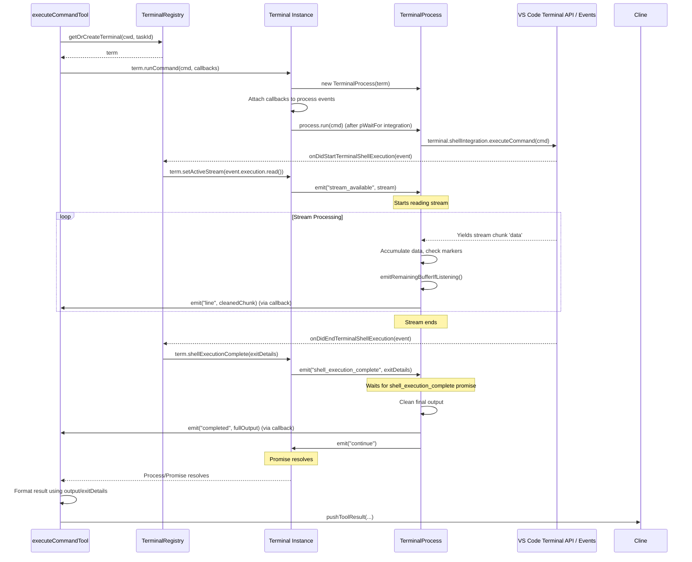

# Chapter 15: Terminal Integration

In [Chapter 14: Task Persistence](14_task_persistence.md), we explored how Roo-Code saves task conversations and metadata to disk. Now, we shift focus to another crucial interaction point: executing commands and capturing their output using VS Code's integrated terminal. This chapter details how Roo-Code manages terminal interactions.

## Motivation: Executing Commands and Getting Results

Many development tasks require running commands in a terminal – installing dependencies (`npm install`), running tests (`pytest`), compiling code (`tsc`), or executing scripts. For Roo-Code to be truly helpful, the AI agent needs the ability to request the execution of these commands within the user's workspace environment and, crucially, receive the output (stdout/stderr) and exit status of those commands.

Simply sending text to a terminal isn't enough; we need a reliable way to know when a specific command starts, when it finishes, what its exit code was, and capture its complete output, even if it's long or involves complex UI updates like progress bars. This requires careful integration with VS Code's terminal features, particularly shell integration.

**Central Use Case:** A user asks Roo-Code: "Install the `axios` library using npm."
1.  The AI, guided by its [Chapter 7: SystemPrompt](07_systemprompt.md), determines it needs to run the command `npm install axios`.
2.  It generates a response including `<execute_command><command>npm install axios</command></execute_command>`.
3.  Roo-Code parses this and invokes the `execute_command` tool ([Chapter 8: Tools](08_tools.md)).
4.  The `executeCommandTool` needs to find or create a suitable terminal for the current workspace directory.
5.  It needs to send the `npm install axios` command to that terminal.
6.  It needs to capture the output (installation progress, success/error messages) streamed from the command.
7.  It needs to detect when the command finishes and determine its success or failure (exit code).
8.  Finally, it needs to format this output and status into a result to send back to the AI, so the AI knows the installation succeeded (or failed) and can inform the user.

The Terminal Integration components (`TerminalRegistry`, `Terminal`, `TerminalProcess`) work together to orchestrate this interaction reliably.

## Key Concepts

1.  **`TerminalRegistry` (`src/integrations/terminal/TerminalRegistry.ts`):**
    *   **Central Management:** Acts as a singleton manager for all terminals created and used by Roo-Code.
    *   **Tracking:** Maintains a list (`terminals`) of active `Terminal` instances.
    *   **Creation/Selection (`getOrCreateTerminal`):** Provides logic to find an existing, suitable terminal (based on working directory, busy status, and associated task ID) or create a new `vscode.Terminal` instance if necessary. This prevents proliferating terminals unnecessarily.
    *   **Task Association:** Allows terminals to be associated with a specific `taskId` ([Chapter 4: Cline](04_cline.md)). Background terminals have `taskId: undefined`. The registry can release terminals from a task association when the task ends (`releaseTerminalsForTask`).
    *   **Event Handling (`initialize`):** Listens for global VS Code terminal events (`onDidStart/EndTerminalShellExecution`, `onDidCloseTerminal`) to update the status of tracked terminals (running state, exit codes) and manage cleanup (like temporary ZDOTDIR directories).

2.  **`Terminal` (`src/integrations/terminal/Terminal.ts`):**
    *   **Wrapper:** Wraps a native `vscode.Terminal` instance.
    *   **Metadata:** Adds Roo-Code specific metadata:
        *   `id`: A unique numeric ID assigned by the `TerminalRegistry`.
        *   `busy`: A boolean flag indicating if a command managed by `TerminalProcess` is currently running in this terminal.
        *   `running`: A boolean flag indicating if a shell execution (detected by VS Code events) is active.
        *   `taskId?`: The optional ID of the task currently using this terminal.
        *   `process?`: The currently active `TerminalProcess` instance managing a command, if any.
        *   `completedProcesses`: A queue storing recently completed `TerminalProcess` instances that might still have unretrieved output.
    *   **Command Execution (`runCommand`):** Provides the primary method to execute a command within the wrapped `vscode.Terminal`. It creates a `TerminalProcess` to manage the execution and returns a promise-like object representing the process.
    *   **Output Retrieval (`getUnretrievedOutput`):** Allows retrieving output that has been captured by completed processes but not yet consumed.

3.  **`TerminalProcess` (`src/integrations/terminal/TerminalProcess.ts`):**
    *   **Single Command Management:** Manages the execution lifecycle and output capturing for *one* specific command run within a `Terminal`.
    *   **Shell Integration Reliance:** Heavily relies on VS Code's shell integration features. It waits for specific escape sequences (like `OSC 633 ; C ST` for command start and `OSC 633 ; D ST` for command end) emitted by the shell to reliably delimit the command's output.
    *   **Stream Processing (`run`):** When started, it uses `terminal.shellIntegration.executeCommand()` (if available) or `terminal.sendText()`. It listens to the stream provided by the `vscode.TerminalShellExecutionStartEvent` (`e.execution.read()`). It accumulates output (`fullOutput`) and parses it to identify command start/end markers and extract the actual command output.
    *   **Event Emitter:** Emits events:
        *   `line`: Fired periodically with chunks of new output.
        *   `completed`: Fired when the command finishes (detected `OSC 633 ; D ST` or stream closes), providing the full captured output.
        *   `shell_execution_complete`: Fired when the VS Code `onDidEndTerminalShellExecution` event occurs for this execution, providing exit code details.
        *   `no_shell_integration`: Fired if shell integration markers are not detected, indicating output capture might be unreliable.
    *   **Output Buffering:** Stores the full command output internally (`fullOutput`) and tracks how much has been retrieved (`lastRetrievedIndex`) to support `getUnretrievedOutput`.
    *   **Output Cleaning:** Uses `strip-ansi` and custom logic (`removeEscapeSequences`) to clean the output before emitting it. It also includes logic (`compressTerminalOutput`, `processCarriageReturns`, `processBackspaces`) to handle common terminal UI patterns like progress bars or overwriting lines, providing cleaner output to the AI.

4.  **Configuration:** Various settings (accessible via `Terminal.get...` static methods, populated from settings during activation) control behavior like shell integration timeouts (`terminalShellIntegrationTimeout`), delays after commands (`terminalCommandDelay`), output line limits (`terminalOutputLineLimit`), and workarounds for specific shells (e.g., `terminalPowershellCounter`, `terminalZshClearEolMark`). These are visible in the `TerminalSettings` component ([Code Snippet](#code-snippets)).

## Using the Terminal Integration (Use Case)

Let's trace the "npm install axios" example through the system:

1.  **AI Request:** LLM generates `<execute_command><command>npm install axios</command></execute_command>`.
2.  **Tool Invocation (`executeCommandTool`):**
    *   The tool function is called with the parsed command `npm install axios`.
    *   It determines the correct working directory (`cline.cwd`).
    *   It calls `TerminalRegistry.getOrCreateTerminal(cline.cwd, false, cline.taskId)`.
3.  **Terminal Selection (`TerminalRegistry.getOrCreateTerminal`):**
    *   The registry scans its list of known `Terminal` instances.
    *   It prioritizes finding a non-busy terminal associated with `cline.taskId` and matching `cline.cwd`.
    *   If not found, it looks for any non-busy terminal matching `cline.cwd`.
    *   If still not found, it calls `vscode.window.createTerminal({ cwd: cline.cwd, ... })` to create a new one and wraps it in a `Terminal` object, adding it to the registry.
    *   It assigns `cline.taskId` to the selected/created `Terminal` instance.
    *   It returns the `Terminal` instance (let's call it `term`).
4.  **Command Execution (`executeCommandTool` -> `Terminal.runCommand`):**
    *   `executeCommandTool` calls `term.runCommand("npm install axios", { onLine, onCompleted, onShellExecutionComplete, onNoShellIntegration })`, passing callbacks to handle events.
    *   `Terminal.runCommand`:
        *   Sets `term.busy = true`.
        *   Creates `process = new TerminalProcess(term)`.
        *   Sets `term.process = process`.
        *   Attaches the provided callbacks (`onLine`, etc.) as listeners to the `process` events.
        *   Creates a promise that resolves when the `process` emits `"continue"`.
        *   Waits for `term.terminal.shellIntegration` to become available (using `pWaitFor` with timeout).
        *   If shell integration is ready, calls `process.run("npm install axios")`.
        *   If shell integration times out, emits `"no_shell_integration"` and resolves the promise.
        *   Returns the `process` object mixed with the promise (`TerminalProcessResultPromise`).
5.  **Process Execution (`TerminalProcess.run`):**
    *   Waits for the `stream_available` event (fired by `TerminalRegistry` when `onDidStartTerminalShellExecution` occurs).
    *   Starts reading the stream (`for await (let data of stream)`).
    *   Looks for the command start marker (`OSC 633 ; C ST` or `OSC 133 ; C ST`) using `matchAfterVsceStartMarkers`.
    *   Once the marker is found, it starts accumulating subsequent data into `this.fullOutput`.
    *   Periodically (`lastEmitTime_ms > 100`), it calls `emitRemainingBufferIfListening()`.
        *   `emitRemainingBufferIfListening` calls `getUnretrievedOutput`.
        *   `getUnretrievedOutput` slices `fullOutput` from `lastRetrievedIndex`, processes it (`removeEscapeSequences`, `compressTerminalOutput`), updates `lastRetrievedIndex`, and returns the chunk.
        *   The process emits the `line` event with the cleaned output chunk.
    *   This continues until the stream ends.
6.  **Callbacks Triggered (`executeCommandTool`):**
    *   The `onLine` callback receives output chunks and likely calls `cline.say("command_output", chunk)` to send them to the UI. It might also call `cline.ask("command_output", ...)` for user feedback on long-running commands.
    *   When the stream ends and the `onDidEndTerminalShellExecution` event fires, `TerminalRegistry` calls `term.shellExecutionComplete(exitDetails)`.
    *   `term.shellExecutionComplete` sets `term.busy = false`, moves the `process` to `completedProcesses` if it has output, and emits `shell_execution_complete` on the `process`.
    *   The `onShellExecutionComplete` callback receives the `exitDetails`.
    *   The `TerminalProcess` finds the end marker (`OSC 633 ; D ST`), cleans the final output, and emits `completed` with the full output.
    *   The `onCompleted` callback receives the full, cleaned output.
7.  **Result Formatting (`executeCommandTool`):**
    *   Using the final output from `onCompleted` and the status from `onShellExecutionComplete`, the tool function formats a result string (e.g., "Command executed... Exit code: 0\nOutput:\n...")
    *   It calls `pushToolResult(formattedResult)`.
8.  **Feedback to AI:** The formatted result is sent back to the LLM in the next turn.

## Code Walkthrough

### Terminal Registry (`src/integrations/terminal/TerminalRegistry.ts`)

```typescript
// --- File: src/integrations/terminal/TerminalRegistry.ts ---
import * as vscode from "vscode";
import * as path from "path";
import { arePathsEqual } from "../../utils/path";
import { Terminal } from "./Terminal";
import { ExitCodeDetails, TerminalProcess } from "./TerminalProcess";

export class TerminalRegistry {
	private static terminals: Terminal[] = [];
	private static nextTerminalId = 1;
	private static disposables: vscode.Disposable[] = [];
	// ... other properties (tmpDirs, isInitialized) ...

	// Called once during extension activation
	static initialize() {
		if (this.isInitialized) { /* return */ }
		this.isInitialized = true;

		// Listen for VS Code terminal lifecycle events
		this.disposables.push(
			vscode.window.onDidCloseTerminal((terminal) => {
                // Find and remove closed terminal from our list
				const terminalInfo = this.getTerminalByVSCETerminal(terminal);
				if (terminalInfo) {
					this.removeTerminal(terminalInfo.id);
                    // ... cleanup tmpDirs ...
				}
			}),
            // When a shell execution starts (command runs via shell integration)
			vscode.window.onDidStartTerminalShellExecution?.(
				async (e: vscode.TerminalShellExecutionStartEvent) => {
					const stream = e?.execution.read(); // Get the output stream
					const terminalInfo = this.getTerminalByVSCETerminal(e.terminal);
					if (terminalInfo) {
						terminalInfo.running = true; // Mark the underlying shell as running
						terminalInfo.setActiveStream(stream); // Pass stream to Terminal instance
					}
				},
			),
            // When a shell execution ends
			vscode.window.onDidEndTerminalShellExecution?.(
				async (e: vscode.TerminalShellExecutionEndEvent) => {
					const terminalInfo = this.getTerminalByVSCETerminal(e.terminal);
                    if (!terminalInfo) return;

                    // Interpret exit code / signal
					const exitDetails = TerminalProcess.interpretExitCode(e?.exitCode);

					// Notify the Terminal instance
                    if (terminalInfo.running) { // Ensure we only process end for running commands
					    terminalInfo.running = false;
					    terminalInfo.shellExecutionComplete(exitDetails);
                    }
				},
			)
		);
		// ... other initializations ...
	}

    // Creates a new vscode.Terminal and wraps it in our Terminal class
	static createTerminal(cwd: string | vscode.Uri): Terminal {
        // ... setup environment variables (PROMPT_COMMAND, ZDOTDIR etc.) based on settings ...
		const vscodeTerminal = vscode.window.createTerminal({
			cwd, name: "Roo Code", /* ... env ... */
		});
		const newTerminal = new Terminal(this.nextTerminalId++, vscodeTerminal, cwd.toString());
		this.terminals.push(newTerminal);
		// ... handle tmpDirs ...
		return newTerminal;
	}

	// Finds an existing terminal by ID, removing it if closed
	static getTerminal(id: number): Terminal | undefined {
		const terminalInfo = this.terminals.find((t) => t.id === id);
		if (terminalInfo && this.isTerminalClosed(terminalInfo.terminal)) {
			this.removeTerminal(id);
			return undefined;
		}
		return terminalInfo;
	}

    // Finds a terminal by the underlying vscode.Terminal instance
    static getTerminalByVSCETerminal(terminal: vscode.Terminal): Terminal | undefined {
        // ... similar logic to getTerminal ...
    }

    // Removes a terminal from the registry
    static removeTerminal(id: number) {
        // ... cleanup tmpDirs ...
		this.terminals = this.terminals.filter((t) => t.id !== id);
	}

    // Checks if a vscode.Terminal is closed
    private static isTerminalClosed(terminal: vscode.Terminal): boolean {
		return terminal.exitStatus !== undefined;
	}

    // Releases terminals associated with a task (sets taskId to undefined)
    static releaseTerminalsForTask(taskId?: string): void { /* ... logic ... */ }

	/**
	 * Gets an existing terminal or creates a new one based on criteria.
	 * Logic:
	 * 1. Find non-busy terminal for this task & CWD.
	 * 2. Find any non-busy terminal for this CWD.
	 * 3. Find any non-busy terminal (if requiredCwd=false).
	 * 4. Create new terminal.
	 */
	static async getOrCreateTerminal(cwd: string, requiredCwd: boolean = false, taskId?: string): Promise<Terminal> {
		// Clean up closed terminals first
        this.terminals = this.terminals.filter((t) => !this.isTerminalClosed(t.terminal));
		let terminal: Terminal | undefined;
        const cwdUriPath = vscode.Uri.file(cwd).fsPath;

        // Priority 1: Task-specific, CWD match, not busy
        if (taskId) {
            terminal = this.terminals.find(t =>
                !t.busy && t.taskId === taskId && arePathsEqual(t.getCurrentWorkingDirectory(), cwdUriPath)
            );
        }
		// Priority 2: Any CWD match, not busy
        if (!terminal) {
            terminal = this.terminals.find(t =>
                !t.busy && arePathsEqual(t.getCurrentWorkingDirectory(), cwdUriPath)
            );
        }
		// Priority 3: Any non-busy (if CWD not strictly required)
        if (!terminal && !requiredCwd) {
			terminal = this.terminals.find((t) => !t.busy);
		}
		// Priority 4: Create new
        if (!terminal) {
			terminal = this.createTerminal(cwd);
		}

		terminal.taskId = taskId; // Assign task ID
		return terminal;
	}

    // ... cleanup method ...
}
```

**Explanation:**

*   **`initialize`:** Sets up listeners for VS Code's global terminal events (`onDidCloseTerminal`, `onDidStart/EndTerminalShellExecution`). These listeners update the state (`running`, `exitDetails`) of the corresponding `Terminal` instances managed by the registry.
*   **`createTerminal`:** Creates a `vscode.Terminal` with specific environment variables (to aid shell integration, apply delays, handle ZDOTDIR) and wraps it in a `Terminal` object.
*   **`getOrCreateTerminal`:** Implements the logic to reuse existing terminals where possible based on `cwd`, `busy` status, and `taskId`, falling back to creating a new one. This is the primary entry point for tools needing a terminal.
*   **Lifecycle Management:** Tracks terminals and removes them from the internal list when VS Code reports they are closed.

### Terminal Wrapper (`src/integrations/terminal/Terminal.ts`)

```typescript
// --- File: src/integrations/terminal/Terminal.ts ---
import * as vscode from "vscode";
import pWaitFor from "p-wait-for";
import { ExitCodeDetails, mergePromise, TerminalProcess, TerminalProcessResultPromise } from "./TerminalProcess";
// ... imports for output processing utilities ...
// Import TerminalRegistry using require to avoid circular dependency issues at module load time
const { TerminalRegistry } = require("./TerminalRegistry");

// ... Static methods for configuration (set/getCommandDelay, etc.) ...

export class Terminal {
	public terminal: vscode.Terminal; // The wrapped VS Code terminal
	public busy: boolean; // Is a TerminalProcess currently running?
	public id: number; // Roo-Code specific ID
	public running: boolean; // Is underlying shell execution active? (from VS Code event)
	private streamClosed: boolean;
	public process?: TerminalProcess; // The currently executing command process
	public taskId?: string; // Task association
	public completedProcesses: TerminalProcess[] = []; // History of completed processes with output
	private initialCwd: string;
    // ... other properties (cmdCounter) ...

	constructor(id: number, terminal: vscode.Terminal, cwd: string) {
		this.id = id; this.terminal = terminal; this.initialCwd = cwd;
		this.busy = false; this.running = false; this.streamClosed = false;
	}

    // Gets CWD from shell integration, falls back to initial CWD
    public getCurrentWorkingDirectory(): string { /* ... logic ... */ }

    // Is the stream from VS Code currently closed?
    public isStreamClosed(): boolean { return this.streamClosed; }

	/**
	 * Sets the active stream and notifies the current TerminalProcess.
     * Called by TerminalRegistry when onDidStartTerminalShellExecution fires.
	 */
	public setActiveStream(stream: AsyncIterable<string> | undefined): void {
		if (stream) {
			if (!this.process) { /* Log warning */ return; }
			this.streamClosed = false;
			this.process.emit("stream_available", stream); // Notify process
		} else {
			this.streamClosed = true; // Mark stream as closed
		}
	}

	/**
	 * Handles shell execution completion.
     * Called by TerminalRegistry when onDidEndTerminalShellExecution fires.
	 */
	public shellExecutionComplete(exitDetails: ExitCodeDetails): void {
		this.busy = false; // Mark terminal as no longer busy with a process
		if (this.process) {
			// Move process to completed queue if it has output
			if (this.process.hasUnretrievedOutput()) {
				this.completedProcesses.unshift(this.process);
			}
			// Notify the process itself about the completion details
			this.process.emit("shell_execution_complete", exitDetails);
			this.process = undefined; // Clear the active process
		}
	}

    // Gets output buffered in completed processes
    public getUnretrievedOutput(): string { /* ... logic ... */ }

    // Executes a command by creating and managing a TerminalProcess
	public runCommand(command: string, callbacks?: CommandCallbacks): TerminalProcessResultPromise {
		this.busy = true; // Mark terminal as busy
		const process = new TerminalProcess(this); // Create a process manager
		process.command = command;
		this.process = process; // Assign as the active process

        // Attach event listeners from callbacks
		if (callbacks) { /* ... attach listeners ... */ }

        // Create a promise that resolves when the process signals it's ready to continue
		const promise = new Promise<void>((resolve, reject) => {
			process.once("continue", () => resolve());
			process.once("error", (error) => reject(error));

			// Wait for shell integration to be ready before running
			pWaitFor(() => this.terminal.shellIntegration !== undefined, { timeout: Terminal.getShellIntegrationTimeout() })
				.then(() => {
					// Shell integration ready, run the command
					process.run(command);
				})
				.catch(() => {
                    // Timeout waiting for shell integration
					process.emit("no_shell_integration", /* message */);
				});
		});

        // Mix the process object with the promise interface
		return mergePromise(process, promise);
	}

    // ... static methods for config (get/setCommandDelay, etc.) ...
    // ... static compressTerminalOutput utility ...
}
```

**Explanation:**

*   **Wrapper:** Holds `vscode.Terminal` and associated state (`busy`, `running`, `process`, `taskId`).
*   **`setActiveStream` / `shellExecutionComplete`:** Methods called by `TerminalRegistry` in response to VS Code events to update state and notify the active `TerminalProcess`.
*   **`runCommand`:**
    *   Sets `busy = true`.
    *   Creates a `TerminalProcess`.
    *   Attaches callbacks passed by the caller (e.g., `executeCommandTool`) to the process's events.
    *   Uses `pWaitFor` to wait for `this.terminal.shellIntegration` to become available (with a configurable timeout). Shell integration is necessary for reliable command start/end detection.
    *   If integration is ready, calls `process.run(command)`.
    *   If it times out, emits `no_shell_integration`.
    *   Returns a `TerminalProcessResultPromise` (the process object enhanced with `then`/`catch`/`finally`).

### Terminal Process (`src/integrations/terminal/TerminalProcess.ts`)

```typescript
// --- File: src/integrations/terminal/TerminalProcess.ts ---
import { EventEmitter } from "events";
import stripAnsi from "strip-ansi";
import * as vscode from "vscode";
// ... other imports (inspect, Terminal) ...

// ... interfaces (ExitCodeDetails, TerminalProcessEvents) ...
// ... constants (PROCESS_HOT_TIMEOUT_NORMAL, etc.) ...

export class TerminalProcess extends EventEmitter<TerminalProcessEvents> {
	private isListening: boolean = true;
	private terminalInfo: Terminal;
	private lastEmitTime_ms: number = 0;
	private fullOutput: string = ""; // Stores ALL raw output received
	private lastRetrievedIndex: number = 0; // Tracks how much output has been retrieved
	isHot: boolean = false;
	command: string = "";
    // ... hotTimer ...

	constructor(terminal: Terminal) {
        super();
        this.terminalInfo = terminal;
        // ... setup event listeners for completion/error ...
    }

    // Interprets exit code to distinguish between normal exit and signal termination
    static interpretExitCode(exitCode: number | undefined): ExitCodeDetails { /* ... logic ... */ }

    // The main execution logic
	async run(command: string) {
		this.command = command;
		const terminal = this.terminalInfo.terminal;

        // Check if shell integration is usable
		if (terminal.shellIntegration?.executeCommand) {
            // Wait for the stream to become available (via 'stream_available' event)
			const streamAvailable = new Promise<AsyncIterable<string>>((resolve, reject) => {
                // Timeout logic
                const timeoutId = setTimeout(() => { /* ... emit no_shell_integration, reject */ }, Terminal.getShellIntegrationTimeout());
                this.once("stream_available", (stream: AsyncIterable<string>) => {
                    clearTimeout(timeoutId); resolve(stream);
                });
            });
            // Wait for the shell execution end event (via 'shell_execution_complete' event)
			const shellExecutionComplete = new Promise<ExitCodeDetails>((resolve) => {
				this.once("shell_execution_complete", (exitDetails: ExitCodeDetails) => resolve(exitDetails));
			});

            // Execute command using shell integration API
            terminal.shellIntegration.executeCommand(command /* + workarounds for PS/Zsh */);
			this.isHot = true;

            let stream: AsyncIterable<string>;
            try { stream = await streamAvailable; } // Wait for stream
            catch (error) { /* Handle timeout/error, emit completed/continue */ return; }

			let preOutput = ""; // Buffer for data before command start marker
			let commandOutputStarted = false;

			// Process the stream data chunk by chunk
			for await (let data of stream) {
                // Look for command start marker (OSC 633 C / 133 C)
				if (!commandOutputStarted) {
					preOutput += data;
					const match = this.matchAfterVsceStartMarkers(data); // Check for marker
					if (match !== undefined) {
						commandOutputStarted = true;
						data = match; // Use only data *after* the marker
						this.fullOutput = ""; // Reset buffer for actual command output
						this.emit("line", ""); // Signal UI command has started
					} else {
						continue; // Keep buffering pre-output
					}
				}

                // Append data to full output buffer
				this.fullOutput += data;

                // Throttle 'line' event emission (e.g., every 100ms)
				const now = Date.now();
				if (this.isListening && (now - this.lastEmitTime_ms > 100 || this.lastEmitTime_ms === 0)) {
					this.emitRemainingBufferIfListening(); // Emit unprocessed buffer chunk
					this.lastEmitTime_ms = now;
				}

				// Update isHot status based on output content (e.g., "compiling")
                // ... logic using compilingMarkers/markerNullifiers ...
                this.hotTimer = setTimeout(/* ... */); // Reset hot timer
			} // End stream loop

            // Mark stream as closed internally
            if (this.terminalInfo) { this.terminalInfo.setActiveStream(undefined); }

			// Wait for the shell execution end event to get exit code
			const exitDetails = await shellExecutionComplete;
			this.isHot = false; // Command finished

            if (commandOutputStarted) {
                // Emit any remaining buffered output
                this.emitRemainingBufferIfListening();

                // Trim command end marker (OSC 633 D / 133 D) from the end
                const match = this.matchBeforeVsceEndMarkers(this.fullOutput);
                if (match !== undefined) { this.fullOutput = match; }

                // Emit final 'completed' event with cleaned full output
                this.emit("completed", this.removeEscapeSequences(this.fullOutput));
            } else {
                 // Handle case where start marker was never found (shell integration issue)
                 this.emit("no_shell_integration", /* message */);
                 this.emit("completed", /* error message */);
            }

		} else {
            // Fallback if shell integration is not available
			terminal.sendText(command, true); // Just send text, no reliable output capture
            this.emit("no_shell_integration", /* message */);
			this.emit("completed", /* unknown status message */);
		}
        // Always emit 'continue' to resolve the promise returned by runCommand
		this.emit("continue");
	}

    // Emits a chunk of unretrieved output via the 'line' event
	private emitRemainingBufferIfListening() {
		if (this.isListening) {
			const remainingBuffer = this.getUnretrievedOutput(); // Gets cleaned chunk
			if (remainingBuffer !== "") {
				this.emit("line", remainingBuffer);
			}
		}
	}

    // Signals that the consumer is done listening for 'line' events
	continue() {
		this.emitRemainingBufferIfListening(); // Emit final chunk
		this.isListening = false;
		this.removeAllListeners("line");
		this.emit("continue"); // Resolve the runCommand promise
	}

    // Checks if there's output not yet retrieved by getUnretrievedOutput
    hasUnretrievedOutput(): boolean { /* ... logic ... */ }

	/**
     * Gets the next chunk of unretrieved output, processing markers/cleaning.
     * Updates lastRetrievedIndex.
     */
	getUnretrievedOutput(): string {
        let outputToProcess = this.fullOutput.slice(this.lastRetrievedIndex);
        // ... logic to find end marker (OSC D) or last newline (\n) ...
        const endIndex = /* calculated end index */;
        this.lastRetrievedIndex += endIndex;
        outputToProcess = outputToProcess.slice(0, endIndex);
        // Clean ANSI/VSCE escape sequences
        return this.removeEscapeSequences(outputToProcess);
    }

    // Removes ANSI codes and OSC 633/133 markers
    private removeEscapeSequences(str: string): string { /* ... logic ... */ }
    // Helper to find content *after* OSC C markers
    private matchAfterVsceStartMarkers(data: string): string | undefined { /* ... logic ... */ }
    // Helper to find content *before* OSC D markers
    private matchBeforeVsceEndMarkers(data: string): string | undefined { /* ... logic ... */ }
    // ... stringIndexMatch helper ...
}

// ... mergePromise helper ...
```

**Explanation:**

*   **`run` Method:** The core logic. It waits for the stream (`stream_available` event), reads it chunk by chunk, looks for shell integration markers (`matchAfterVsceStartMarkers`, `matchBeforeVsceEndMarkers`) to delimit the actual command output, accumulates the output in `fullOutput`, periodically emits cleaned chunks via the `line` event (`emitRemainingBufferIfListening`), and finally emits the `completed` event with the full cleaned output after the stream ends and the `shell_execution_complete` event provides the exit status. Includes complex handling for timeouts and missing markers.
*   **`getUnretrievedOutput`:** Slices the `fullOutput` buffer based on `lastRetrievedIndex`, applies cleaning (`removeEscapeSequences`, `compressTerminalOutput`), and updates the index. This allows consumers to pull output incrementally.
*   **Event Emission:** Uses standard `EventEmitter` pattern to notify consumers about `line`, `completed`, `shell_execution_complete`, etc.
*   **`isHot`:** Includes logic to track if the terminal is "hot" (recently active or potentially compiling) to allow `Cline` to potentially delay subsequent API calls.

## Internal Implementation

The integration relies on coordinating the `TerminalRegistry`, `Terminal`, and `TerminalProcess` classes with VS Code's terminal events.

**Step-by-Step (Command Execution Flow):**

1.  **Request:** `executeCommandTool` calls `TerminalRegistry.getOrCreateTerminal`.
2.  **Selection/Creation:** `TerminalRegistry` finds or creates a `vscode.Terminal` and wraps it in a `Terminal` instance (`term`).
3.  **Run Command:** `executeCommandTool` calls `term.runCommand(command, callbacks)`.
4.  **Process Creation:** `term.runCommand` creates `process = new TerminalProcess(term)` and sets `term.busy = true`. Callbacks are attached.
5.  **Wait for Integration:** `term.runCommand` waits (`pWaitFor`) for `term.terminal.shellIntegration` to be defined.
6.  **Execute:** `term.runCommand` calls `process.run(command)`.
7.  **Wait for Stream:** `process.run` waits (`Promise` + `stream_available` event) for the output stream.
8.  **VS Code Event (Start):** VS Code detects the command execution (via shell integration) and fires `onDidStartTerminalShellExecution`.
9.  **Registry Handler:** `TerminalRegistry`'s listener receives the event.
10. **Stream Activation:** The listener finds the `Terminal` instance (`term`), gets the stream (`e.execution.read()`), calls `term.setActiveStream(stream)`, which in turn emits `stream_available` on the `process`.
11. **Process Reads Stream:** The wait in `process.run` resolves. The `for await...of stream` loop begins.
12. **Output Processing:** `process.run` reads chunks, looks for start marker, accumulates output, cleans it, and emits `line` events periodically.
13. **Callback (`onLine`):** `executeCommandTool`'s `onLine` callback receives chunks and sends them to the UI.
14. **VS Code Event (End):** VS Code detects command completion and fires `onDidEndTerminalShellExecution`.
15. **Registry Handler:** `TerminalRegistry`'s listener receives the event, gets `exitDetails`.
16. **Terminal Completion:** The listener finds `term`, calls `term.shellExecutionComplete(exitDetails)`.
17. **Process Notification:** `term.shellExecutionComplete` sets `term.busy = false`, queues the completed `process` (if it has output), and emits `shell_execution_complete` on the `process`.
18. **Process Finishes:** The stream loop in `process.run` ends. It waits for the `shell_execution_complete` promise. It cleans the final output, emits `completed`, and emits `continue`.
19. **Callbacks (`onCompleted`, etc.):** `executeCommandTool`'s callbacks receive final output and exit status.
20. **Promise Resolution:** The `continue` event resolves the promise returned by `term.runCommand`.
21. **Tool Result:** `executeCommandTool` formats and pushes the result.

**Sequence Diagram (Running a Command):**



## Modification Guidance

Modifying terminal integration requires care due to its complexity and reliance on potentially fragile shell integration mechanisms.

**Common Modifications:**

1.  **Adding Support for a New Shell Feature/Workaround:**
    *   **Identify Need:** Determine the specific behavior or marker needed (e.g., a custom prompt sequence for a specific shell theme).
    *   **Configuration:** Add a new boolean setting (e.g., `terminalMyShellThemeFix`) in `src/schemas/index.ts` and the Settings UI ([Chapter 35: Settings UI Components (WebView)](35_settings_ui_components__webview_.md)). Update `Terminal.ts` static setters/getters.
    *   **Apply Fix:**
        *   If it involves environment variables, modify `TerminalRegistry.createTerminal` to set the variable based on the new setting.
        *   If it involves parsing output differently, modify the marker detection logic (`match...` functions) or cleaning logic (`removeEscapeSequences`, `compressTerminalOutput`) in `TerminalProcess.ts`, potentially conditional on the new setting.
    *   **Test:** Test thoroughly with the specific shell/theme configuration.

2.  **Changing Output Compression/Truncation:**
    *   **Modify Utilities:** Adjust the logic within `truncateOutput`, `applyRunLengthEncoding`, `processCarriageReturns`, or `processBackspaces` in `src/integrations/misc/extract-text.ts`.
    *   **Configuration:** Ensure settings like `terminalOutputLineLimit` and `terminalCompressProgressBar` correctly control these functions (likely via checks within `Terminal.compressTerminalOutput`).
    *   **Test:** Run commands that produce long output or use progress bars to verify the changes.

3.  **Adjusting Timeouts or Delays:**
    *   **Configuration:** Modify the default values or ranges for `terminalShellIntegrationTimeout` or `terminalCommandDelay` in the settings UI component (`TerminalSettings.tsx`) or potentially where they are read/applied (`TerminalProcess.run`, `TerminalRegistry.createTerminal`).
    *   **Considerations:** Increasing timeouts might help on slow systems but can delay error detection. Adding command delays might be necessary for some shell setups but slows down execution.

**Best Practices:**

*   **Stability:** As noted in the `TerminalProcess.ts` comments, these classes are sensitive. Modify with caution and thorough testing. Prioritize stability over adding complex new features unless necessary.
*   **Shell Integration Focus:** Design primarily around VS Code's shell integration markers (OSC 633/133) for reliable command delimitation. Fallbacks (`sendText`) have limited utility for capturing output.
*   **Minimize Direct `sendText`:** Avoid using `vscode.Terminal.sendText` for running commands where output capture is needed, as it bypasses shell integration and reliable output tracking.
*   **Configuration:** Expose relevant behaviors (timeouts, workarounds) as user settings ([Relevant Code Snippet](#code-snippets)) rather than hardcoding them.
*   **Error Handling:** Ensure `TerminalProcess` and `Terminal` handle errors gracefully (e.g., stream errors, shell integration timeouts) and report them via events (`error`, `no_shell_integration`) or promise rejections.
*   **Resource Management:** Ensure `TerminalRegistry` cleans up listeners and potentially temporary directories (`zshCleanupTmpDir`) when terminals are closed or the extension deactivates (`cleanup`).

**Potential Pitfalls:**

*   **Shell Integration Flakiness:** VS Code's shell integration relies on specific shell configurations (`PROMPT_COMMAND`, `PS1`, rc files) correctly emitting escape sequences. User customizations, unusual shells, or bugs in VS Code/shells can break this, leading to `no_shell_integration` events or incorrect output capture. The ZDOTDIR workaround attempts to mitigate some zsh issues.
*   **Race Conditions:** While `TerminalRegistry` manages terminal selection, complex interactions involving multiple concurrent commands (if allowed) or rapid terminal creation/destruction could potentially lead to unexpected states if not carefully managed.
*   **Output Parsing Errors:** Incorrectly parsing the output stream or mishandling escape sequences in `TerminalProcess` could lead to corrupted or incomplete output being reported.
*   **Security:** The `execute_command` tool inherently carries risks. While user approval is required, ensure no part of the terminal integration logic itself introduces vulnerabilities (e.g., command injection, though less likely here as the command comes from the AI/user).

## Conclusion

Roo-Code's terminal integration provides the essential capability for the AI agent to execute commands within the user's workspace and reliably capture the results. By wrapping `vscode.Terminal`, managing instances via `TerminalRegistry`, and carefully handling shell integration events and output streams within `TerminalProcess`, Roo-Code creates a robust abstraction over the complexities of terminal interaction. This allows tools like `execute_command` to function effectively, empowering the AI to perform a wider range of development tasks.

Having explored interaction with the terminal, we next examine how Roo-Code leverages another powerful command-line tool for efficient code searching: Ripgrep. The following chapter details [Chapter 16: Ripgrep Integration](16_ripgrep_integration.md).

---
<a name="code-snippets"></a>
*Relevant Code Snippets (from chapter context):*

*   `src/core/tools/executeCommandTool.ts`
*   `src/integrations/terminal/TerminalRegistry.ts`
*   `src/integrations/terminal/Terminal.ts`
*   `src/integrations/terminal/TerminalProcess.ts`
*   `src/activate/registerTerminalActions.ts`
*   `webview-ui/src/components/settings/TerminalSettings.tsx`

