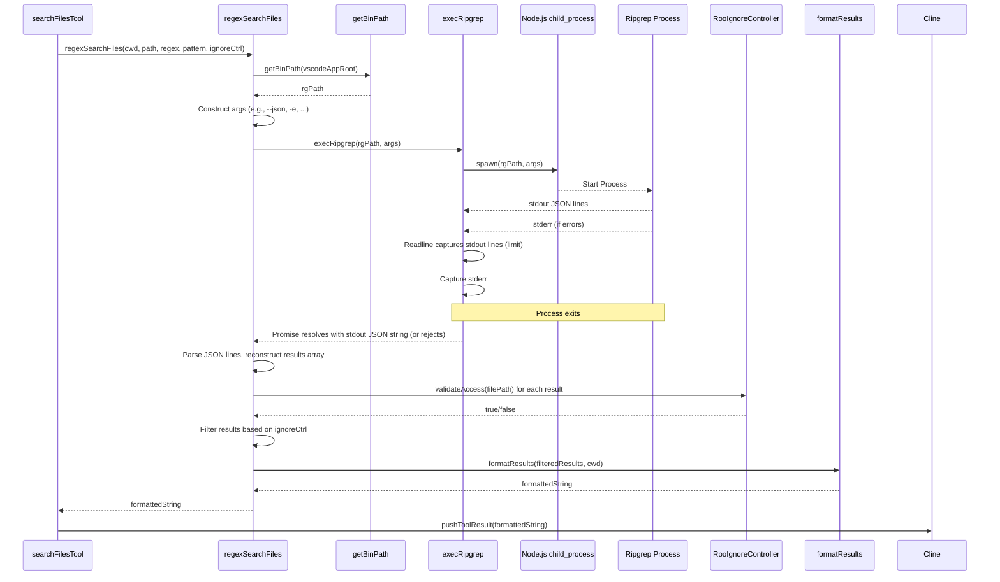

# Chapter 16: Ripgrep Integration

Continuing from [Chapter 15: Terminal Integration](15_terminal_integration.md) where we explored executing commands, this chapter focuses on another powerful command-line interaction: fast, efficient file searching using Ripgrep.

## Motivation: Blazing Fast Code Searching

Searching through codebases, especially large ones, is a fundamental developer task. Whether it's finding all occurrences of a function name, locating TODO comments, or searching for specific patterns within certain file types, speed and accuracy are crucial. While standard tools like `grep` exist, and Node.js's `fs` module could be used to read files and search manually, these approaches can be slow, inconsistent across platforms, or fail to respect common ignore rules (`.gitignore`, `.ignore`).

Roo-Code needs a fast, reliable, cross-platform way to perform text searches within the user's workspace. This capability is essential for tools like `search_files` that allow the AI agent to locate relevant code snippets or information based on regular expressions.

**Ripgrep Integration** provides this capability by leveraging the `ripgrep` (`rg`) command-line tool. Ripgrep is renowned for its exceptional speed, cross-platform compatibility, and native support for ignore files. Roo-Code bundles `ripgrep` within its VS Code extension package and provides helper functions to locate the binary and execute searches efficiently.

**Central Use Case:** A user asks Roo-Code: "Find all TODO comments in the project."
1.  The AI, understanding the request and knowing the available tools from the [Chapter 7: SystemPrompt](07_systemprompt.md), decides to use the `search_files` tool.
2.  It generates a response containing `<search_files><regex>TODO:</regex></search_files>`.
3.  Roo-Code parses this and invokes the `search_files` tool ([Chapter 8: Tools](08_tools.md)).
4.  The `searchFilesTool` function needs to perform the actual search. It calls the `regexSearchFiles` function provided by the Ripgrep Integration module.
5.  `regexSearchFiles` uses `getBinPath` to find the bundled `rg` executable within the VS Code installation.
6.  It constructs the appropriate arguments for `rg` (e.g., `--json -e "TODO:" --context 1 .`) to search the current workspace directory (`cwd`) for the regex "TODO:", requesting JSON output with one line of context.
7.  It calls `execRipgrep` to spawn the `rg` process with these arguments.
8.  `execRipgrep` captures the JSON output stream from `rg`, handling potential errors.
9.  `regexSearchFiles` parses the JSON output, potentially filters results based on `.rooignore` rules ([Chapter 21: RooIgnoreController](21_rooignorecontroller.md)), truncates long lines, and formats the results into a human-readable string suitable for the AI.
10. The formatted string containing file paths, line numbers, and matching lines (with context) is returned to the `searchFilesTool`.
11. The tool calls `pushToolResult`, sending the search results back to the AI.
12. The AI can now present the found TODO comments to the user.

## Key Concepts

1.  **Ripgrep (`rg`):** A line-oriented search tool that recursively searches the current directory for a regex pattern. It's written in Rust, making it extremely fast. It respects `.gitignore` and other ignore files by default and offers many useful flags (like `--json` for structured output, `--context` for showing surrounding lines, `--glob` for file filtering).

2.  **Bundled Binary:** VS Code itself bundles `ripgrep` for its internal search functionality. Roo-Code leverages this existing binary instead of requiring users to install `rg` separately.

3.  **`getBinPath` (`src/services/ripgrep/index.ts`):** A utility function that attempts to locate the `rg` executable within the VS Code installation directory (`vscode.env.appRoot`). It checks several known relative paths where `ripgrep` might reside across different VS Code versions and platforms (`node_modules/@vscode/ripgrep/bin/`, `node_modules.asar.unpacked/...`, etc.). This ensures Roo-Code can find and use `rg` reliably.

4.  **`execRipgrep` (`src/services/ripgrep/index.ts`):** A low-level function that takes the path to the `rg` binary and an array of command-line arguments. It uses Node.js's `child_process.spawn` to execute `rg`. It captures `stdout` and `stderr` streams, handling potential process errors and limiting the output size (`MAX_RESULTS`) to prevent excessive memory usage or performance issues. It returns the captured `stdout` as a string.

5.  **`regexSearchFiles` (`src/services/ripgrep/index.ts`):** The primary high-level function used by tools. It orchestrates the search process:
    *   Takes `cwd`, `directoryPath`, `regex`, `filePattern`, and an optional `rooIgnoreController` as input.
    *   Calls `getBinPath` to find `rg`.
    *   Constructs the argument array for `rg`, typically including `--json`, `-e regex`, `--glob filePattern`, `--context 1`, and the `directoryPath`.
    *   Calls `execRipgrep` to run the command.
    *   Parses the JSON output stream line by line. Each line represents an event (`begin`, `match`, `context`, `end`). It reconstructs the results, grouping matches and context lines by file.
    *   Filters the results using the provided `rooIgnoreController` ([Chapter 21: RooIgnoreController](21_rooignorecontroller.md)) if available.
    *   Formats the filtered results into a standardized, readable string using `formatResults`, including file paths relative to `cwd`, line numbers, and context indicators.
    *   Truncates excessively long lines using `truncateLine`.

6.  **`executeRipgrep` (`src/services/search/file-search.ts`):** Note that there's *another* function with a similar name in `file-search.ts`. This one is a more general-purpose wrapper around spawning `rg` used by features like the file search mention (`@`). It handles different argument patterns (like `--files` for listing files) and might have slightly different output processing (e.g., returning `FileResult[]` objects instead of a formatted string). While related, `regexSearchFiles` in `src/services/ripgrep/index.ts` is the one primarily used by the `search_files` tool.

7.  **Integration with `search_files` Tool:** The `searchFilesTool` function (`src/core/tools/searchFilesTool.ts`) directly calls `regexSearchFiles` after validating parameters and obtaining user approval, passing the results back to the AI.

## Using Ripgrep Integration (Use Case Revisited)

Let's trace the "Find TODO comments" example focusing on the integration functions:

1.  **AI Request:** `<search_files><regex>TODO:</regex></search_files>`.
2.  **Tool Invocation:** `searchFilesTool` is called with `block.params = { regex: "TODO:" }`.
3.  **Parameter Check:** The tool function checks that `regex` is present. It assumes `path` defaults to `.` (current directory) and `filePattern` defaults to `*` if not provided.
4.  **Call `regexSearchFiles`:** `searchFilesTool` calls `await regexSearchFiles(cline.cwd, cline.cwd, "TODO:", "*", cline.rooIgnoreController);`.
5.  **Inside `regexSearchFiles`:**
    *   Calls `rgPath = await getBinPath(vscode.env.appRoot);`. Assume it returns `"/path/to/vscode/resources/app/node_modules.asar.unpacked/@vscode/ripgrep/bin/rg"`.
    *   Constructs `args = ["--json", "-e", "TODO:", "--glob", "*", "--context", "1", cline.cwd]`.
    *   Calls `output = await execRipgrep(rgPath, args);`.
6.  **Inside `execRipgrep`:**
    *   Calls `childProcess.spawn(rgPath, args)`.
    *   Creates a `readline` interface attached to `rgProcess.stdout`.
    *   Reads lines from stdout, appending them to an `output` string, until `MAX_RESULTS * 5` lines are read (to limit output).
    *   Listens for `stderr` and process errors.
    *   When the `rg` process closes, it resolves the promise with the accumulated `output` string (or rejects on error).
7.  **Back in `regexSearchFiles`:**
    *   Receives the `output` string (containing multiple JSON objects, one per line).
    *   Splits the `output` by newline (`\n`).
    *   Iterates through each line, parsing it as JSON (`JSON.parse`).
    *   Processes each parsed object (`begin`, `match`, `context`, `end`) to build an internal `results: SearchFileResult[]` array.
    *   Calls `rooIgnoreController.validateAccess(result.file)` for each result file, filtering out ignored ones.
    *   Calls `formattedString = formatResults(filteredResults, cline.cwd);`.
8.  **Inside `formatResults`:**
    *   Groups results by relative file path.
    *   Adds headers (`# rel/path/to/file.ts`).
    *   Formats each match with line numbers and context lines (`NNN | text...`).
    *   Adds separators (`----`).
    *   Adds a summary header (`Found X results.`).
    *   Returns the final formatted string.
9.  **Return to Tool:** `regexSearchFiles` returns the `formattedString`.
10. **Tool Pushes Result:** `searchFilesTool` calls `pushToolResult(formattedString)`.
11. **AI Receives:** The LLM gets the formatted search results.

## Code Walkthrough

### Ripgrep Service (`src/services/ripgrep/index.ts`)

```typescript
// --- File: src/services/ripgrep/index.ts ---
import * as vscode from "vscode";
import * as childProcess from "child_process";
import * as path from "path";
// import * as fs from "fs"; // Not directly used here, but fileExistsAtPath is
import * as readline from "readline";
import { RooIgnoreController } from "../../core/ignore/RooIgnoreController";
import { fileExistsAtPath } from "../../utils/fs"; // Utility imported

// Platform-specific binary name
const isWindows = /^win/.test(process.platform);
const binName = isWindows ? "rg.exe" : "rg";

// Interfaces for parsed JSON output
interface SearchFileResult { file: string; searchResults: SearchResult[] }
interface SearchResult { lines: SearchLineResult[] }
interface SearchLineResult { line: number; text: string; isMatch: boolean; column?: number }

// Constants for limiting output
const MAX_RESULTS = 300; // Max distinct match groups (separated by context)
const MAX_LINE_LENGTH = 500; // Max length for a single line in the output

/** Truncate long lines */
export function truncateLine(line: string, maxLength: number = MAX_LINE_LENGTH): string {
	return line.length > maxLength ? line.substring(0, maxLength) + " [truncated...]" : line;
}

/** Find the ripgrep binary bundled with VS Code */
export async function getBinPath(vscodeAppRoot: string): Promise<string | undefined> {
	// Define potential relative paths
	const possiblePaths = [
		"node_modules/@vscode/ripgrep/bin/",
		"node_modules/vscode-ripgrep/bin", // Older VS Code?
		"node_modules.asar.unpacked/vscode-ripgrep/bin/", // Packaged apps
		"node_modules.asar.unpacked/@vscode/ripgrep/bin/",
	];

	// Check each path until the binary is found
	for (const pkgFolder of possiblePaths) {
		const fullPath = path.join(vscodeAppRoot, pkgFolder, binName);
		if (await fileExistsAtPath(fullPath)) {
			return fullPath; // Found it
		}
	}
	return undefined; // Not found
}

/** Execute ripgrep process and capture stdout */
async function execRipgrep(bin: string, args: string[]): Promise<string> {
	return new Promise((resolve, reject) => {
		const rgProcess = childProcess.spawn(bin, args, {
			stdio: ["ignore", "pipe", "pipe"], // stdin=ignore, stdout/stderr=pipe
			// detached: true // Maybe useful? Check implications.
		});

		const rl = readline.createInterface({ input: rgProcess.stdout, crlfDelay: Infinity });
		let output = "";
		let lineCount = 0;
		// Limit output lines to prevent excessive memory usage
		const maxLines = MAX_RESULTS * 5; // Assume ~5 lines per result group (match + context)

		rl.on("line", (line) => {
			if (lineCount < maxLines) {
				output += line + "\n";
				lineCount++;
			} else {
				// Exceeded line limit, stop reading and kill process
				rl.close();
				if (!rgProcess.killed) {
					rgProcess.kill();
				}
			}
		});

		let errorOutput = "";
		rgProcess.stderr.on("data", (data) => { errorOutput += data.toString(); });

		rl.on("close", () => {
			// Resolve with output if no error, otherwise reject
			if (errorOutput) {
				reject(new Error(`ripgrep process error: ${errorOutput}`));
			} else {
				resolve(output);
			}
		});

		rgProcess.on("error", (error) => { reject(new Error(`ripgrep process error: ${error.message}`)); });
		rgProcess.on("exit", (code, signal) => {
			if (code !== 0 && signal === null && !output) { // Check for non-zero exit code only if output is empty
				reject(new Error(`ripgrep exited with code ${code}. Stderr: ${errorOutput}`));
			}
			// Otherwise, assume 'close' event on readline handled resolution/rejection
		});
	});
}

/** High-level function to search files using regex */
export async function regexSearchFiles(
	cwd: string,
	directoryPath: string,
	regex: string,
	filePattern?: string, // Glob pattern
	rooIgnoreController?: RooIgnoreController, // For filtering
): Promise<string> {
	const vscodeAppRoot = vscode.env.appRoot;
	const rgPath = await getBinPath(vscodeAppRoot);

	if (!rgPath) { throw new Error("Could not find ripgrep binary"); }

	// Construct arguments for JSON output, regex, glob, context
	const args = [
        "--json",
        "-e", regex,
        "--glob", filePattern || "*",
        "--context", "1", // 1 line of context before/after
        directoryPath
    ];

	let output: string;
	try {
		output = await execRipgrep(rgPath, args);
	} catch (error) {
		console.error("Error executing ripgrep:", error);
		return "Ripgrep execution failed. No results found."; // Return friendly message
	}

	const results: SearchFileResult[] = [];
	let currentFile: SearchFileResult | null = null;

	// Parse the line-by-line JSON output
	output.split("\n").forEach((line) => {
		if (!line) return; // Skip empty lines
		try {
			const parsed = JSON.parse(line);
			switch (parsed.type) {
				case "begin":
                    // Start of results for a new file
					currentFile = { file: parsed.data.path.text.toString(), searchResults: [] };
					break;
				case "end":
                    // End of results for the current file
					if (currentFile) { results.push(currentFile); }
					currentFile = null;
					break;
				case "match":
				case "context":
					if (currentFile) {
						const lineData = {
							line: parsed.data.line_number,
							text: truncateLine(parsed.data.lines.text?.trimEnd()), // Trim trailing whitespace
							isMatch: parsed.type === "match",
							column: parsed.data.absolute_offset, // Only for 'match' type
						};

						// Group contiguous lines (match + context) into a single SearchResult
						const lastResult = currentFile.searchResults.at(-1);
						if (lastResult && lineData.line <= lastResult.lines.at(-1)!.line + 1) {
							lastResult.lines.push(lineData);
						} else {
							// Start a new result group
							currentFile.searchResults.push({ lines: [lineData] });
						}
					}
					break;
			}
		} catch (error) {
			console.error("Error parsing ripgrep JSON output line:", line, error);
		}
	});

	// Filter results based on RooIgnoreController
	const filteredResults = rooIgnoreController
		? results.filter((result) => rooIgnoreController.validateAccess(result.file))
		: results;

	// Format the filtered results into a readable string
	return formatResults(filteredResults, cwd);
}

/** Format parsed results into a string for the AI */
function formatResults(fileResults: SearchFileResult[], cwd: string): string {
	let totalResults = fileResults.reduce((sum, file) => sum + file.searchResults.length, 0);
	// Limit displayed results in the formatted output
	const displayedResults = fileResults.flatMap(f => f.searchResults).slice(0, MAX_RESULTS);
	const resultsShownCount = displayedResults.length;

	let output = "";
	if (totalResults > resultsShownCount) {
		output += `Showing first ${resultsShownCount} of ${totalResults.toLocaleString()} results. Use a more specific search if necessary.\n\n`;
	} else {
		output += `Found ${totalResults === 1 ? "1 result" : `${totalResults.toLocaleString()} results`}.\n\n`;
	}

    const resultsByFile: { [path: string]: SearchResult[] } = {};
    // Group results by file
    fileResults.forEach(file => {
        const relPath = path.relative(cwd, file.file);
        if (!resultsByFile[relPath]) resultsByFile[relPath] = [];
        resultsByFile[relPath].push(...file.searchResults);
    });

    let currentDisplayedCount = 0;
	for (const [filePath, resultsInFile] of Object.entries(resultsByFile)) {
        if (currentDisplayedCount >= resultsShownCount) break; // Stop if we've shown enough

		output += `# ${filePath.replace(/\\/g, "/")}\n`; // Use POSIX separators

		for (const result of resultsInFile) {
            if (currentDisplayedCount >= resultsShownCount) break;
			if (result.lines.length > 0) {
				result.lines.forEach((line) => {
					const lineNumber = String(line.line).padStart(3, " "); // Pad line numbers
					output += `${lineNumber} | ${line.text}\n`; // Line number, separator, text
				});
				output += "----\n"; // Separator between match groups
                currentDisplayedCount++;
			}
		}
		output += "\n"; // Blank line between files
	}

	return output.trim(); // Remove trailing newline
}
```

**Explanation:**

*   **`getBinPath`:** Locates the `rg` binary by checking known paths relative to `vscode.env.appRoot`.
*   **`execRipgrep`:** Spawns the `rg` process using `child_process.spawn`. It pipes `stdout` and `stderr`. It uses `readline` to read `stdout` line by line, enforcing a maximum line count (`maxLines`) to prevent memory issues with huge outputs. It rejects the promise if `stderr` receives data or the process exits with an error code (and no output was produced).
*   **`regexSearchFiles`:**
    *   Gets the `rg` path via `getBinPath`.
    *   Constructs arguments, notably `--json` (for structured output) and `--context 1` (for surrounding lines).
    *   Calls `execRipgrep` to get the raw JSON output string.
    *   Parses the JSON output line by line, reconstructing `SearchFileResult` objects. It groups contiguous `match` and `context` lines together.
    *   Filters the results using the optional `rooIgnoreController`.
    *   Calls `formatResults` to create the final string.
*   **`formatResults`:** Takes the parsed and filtered results, groups them by file path (relative to `cwd`), formats each match group with line numbers and context separators, adds file headers, limits the total number of displayed result groups (`MAX_RESULTS`), and adds a summary header.

### Tool Usage (`src/core/tools/searchFilesTool.ts`)

```typescript
// --- File: src/core/tools/searchFilesTool.ts ---
import path from "path";

import { Cline } from "../Cline";
import { ToolUse, AskApproval, HandleError, PushToolResult, RemoveClosingTag } from "../../shared/tools";
import { ClineSayTool } from "../../shared/ExtensionMessage";
import { getReadablePath } from "../../utils/path";
// Import the high-level search function
import { regexSearchFiles } from "../../services/ripgrep";

export async function searchFilesTool(
	cline: Cline,
	block: ToolUse,
	askApproval: AskApproval,
	handleError: HandleError,
	pushToolResult: PushToolResult,
	removeClosingTag: RemoveClosingTag,
) {
	// Extract parameters provided by the AI
	const relDirPath: string | undefined = block.params.path; // Optional: Directory to search within
	const regex: string | undefined = block.params.regex; // Required: Regex pattern
	const filePattern: string | undefined = block.params.file_pattern; // Optional: Glob pattern for files

	// Prepare data for the approval message
	const sharedMessageProps: ClineSayTool = {
		tool: "searchFiles",
		path: getReadablePath(cline.cwd, removeClosingTag("path", relDirPath)),
		regex: removeClosingTag("regex", regex),
		filePattern: removeClosingTag("file_pattern", filePattern),
	};

	try {
		// Handle partial stream case (update UI only)
		if (block.partial) {
			const partialMessage = JSON.stringify({ ...sharedMessageProps, content: "" } satisfies ClineSayTool);
			await cline.ask("tool", partialMessage, block.partial).catch(() => {});
			return;
		}

		// --- Full Execution Logic ---

		// Validate required parameters
		if (!regex) {
			cline.consecutiveMistakeCount++;
			cline.recordToolError("search_files");
			pushToolResult(await cline.sayAndCreateMissingParamError("search_files", "regex"));
			return;
		}
		// Use current working directory if path is not specified
		const searchDirectory = relDirPath ? path.resolve(cline.cwd, relDirPath) : cline.cwd;

		cline.consecutiveMistakeCount = 0; // Reset counter on valid request

		// Prepare dummy content for approval prompt (actual search runs after approval)
		const dummyContent = `Searching for regex "${regex}" ${relDirPath ? `in ${relDirPath}` : ""}...`;
		const completeMessage = JSON.stringify({ ...sharedMessageProps, content: dummyContent } satisfies ClineSayTool);

		// Ask for user approval (pauses here)
		const didApprove = await askApproval("tool", completeMessage);

		if (!didApprove) {
			pushToolResult("User rejected the request to search files.");
			return; // Exit if user rejects
		}

		// --- Perform the search (User approved) ---
		const results = await regexSearchFiles(
			cline.cwd, // Base directory for relative paths in output
			searchDirectory, // Directory to start search from
			regex, // The regex pattern
			filePattern, // Optional glob pattern
			cline.rooIgnoreController, // Pass ignore controller for filtering
		);

		// Push the formatted results back to the AI
		pushToolResult(results);

	} catch (error) {
		// Handle any unexpected errors during search or execution
		await handleError("searching files", error);
	}
}
```

**Explanation:**

*   The tool extracts `regex`, `path` (optional), and `filePattern` (optional) from `block.params`.
*   It validates that `regex` is present.
*   It determines the `searchDirectory` (defaulting to `cline.cwd`).
*   It calls `askApproval` to get user consent.
*   If approved, it calls the imported `regexSearchFiles` function, passing the necessary parameters, including the `cline.rooIgnoreController`.
*   It pushes the formatted string returned by `regexSearchFiles` using `pushToolResult`.

## Internal Implementation

The core implementation involves process management and stream parsing.

**Step-by-Step (`regexSearchFiles` Execution):**

1.  **Get `rg` Path:** `getBinPath` searches known locations in the VS Code installation directory.
2.  **Build Arguments:** `regexSearchFiles` creates the command-line arguments array (e.g., `["--json", "-e", "PATTERN", "--context", "1", "./src"]`).
3.  **Call `execRipgrep`:** Passes the binary path and arguments.
4.  **Spawn Process:** `execRipgrep` uses `child_process.spawn(rgPath, args, ...)` to start `rg`.
5.  **Attach Listeners:** `execRipgrep` attaches listeners to the process's `stdout`, `stderr`, `error`, and `exit` events. A `readline` interface is used for `stdout`.
6.  **Capture Stdout:** The `readline` 'line' listener appends each line of output (which should be a JSON object) to a string buffer, respecting the `maxLines` limit.
7.  **Capture Stderr:** The `stderr` listener captures any error messages.
8.  **Process Exit:** When the `rg` process finishes, the `readline` 'close' event fires.
    *   If `stderr` captured data, the promise rejects with an error.
    *   Otherwise, the promise resolves with the accumulated `stdout` string.
    *(The `exit` listener provides an additional check for non-zero exit codes if no output was produced).*
9.  **Parse JSON:** Back in `regexSearchFiles`, the resolved `output` string is split into lines. Each line is parsed using `JSON.parse`.
10. **Reconstruct Results:** The parsed objects (`begin`, `match`, `context`, `end`) are processed sequentially to build the `SearchFileResult[]` array, grouping context lines with their matches.
11. **Filter:** Results are filtered using `rooIgnoreController.validateAccess`.
12. **Format:** `formatResults` converts the array into the final display string.
13. **Return:** The formatted string is returned.

**Sequence Diagram (`search_files` Tool Execution):**



## Modification Guidance

Modifications might involve changing search parameters, output formatting, or the underlying execution.

**Common Modifications:**

1.  **Changing Default Ripgrep Arguments:**
    *   **Locate:** Find the `args` array construction within `regexSearchFiles` in `src/services/ripgrep/index.ts`.
    *   **Modify:** Add, remove, or change arguments. For example:
        *   Change context lines: Replace `"--context", "1"` with `"--context", "3"`.
        *   Add file type filtering: Add `"--type", "typescript"` (requires passing this option down or hardcoding).
        *   Add case-insensitivity: Add `"--ignore-case"`.
    *   **Considerations:** Ensure added arguments are compatible with the JSON output format if parsing relies on it. Test the impact on search results and performance.

2.  **Adjusting Output Formatting:**
    *   **Locate:** Modify the `formatResults` function in `src/services/ripgrep/index.ts`.
    *   **Modify:** Change how file headers (`# file`), line numbers (`NNN |`), context separators (`----`), or the summary header are generated. You could add highlighting hints (though actual highlighting happens in the UI) or change the overall structure.
    *   **Test:** Verify the output is still clear and easily parsable by the LLM (if it needs to understand the structure) and readable for the user.

3.  **Changing Output Limits:**
    *   **Locate:** Modify the `MAX_RESULTS` constant in `src/services/ripgrep/index.ts`. This controls the approximate number of match *groups* (match + context) returned by `regexSearchFiles`'s formatting. The `maxLines` calculation in `execRipgrep` is derived from this.
    *   **Considerations:** Increasing limits allows more results but uses more memory, takes longer to process/display, and might exceed LLM context limits when sent back. Decreasing limits makes searches faster but might hide relevant results.

4.  **Adding a New Search Function (e.g., Literal String Search):**
    *   **Define Function:** Create a new function `literalSearchFiles` in `src/services/ripgrep/index.ts`.
    *   **Arguments:** Instead of `-e regex`, use the `-F` (fixed string) and potentially `-w` (word boundary) flags for `rg`. Construct the `args` array accordingly.
    *   **Reuse Logic:** Reuse `getBinPath`, `execRipgrep`, JSON parsing (if applicable, though `-F` might not use `--json` the same way), filtering, and `formatResults`.
    *   **New Tool (Optional):** Create a corresponding new tool (e.g., `literal_search_files`) that calls this new function.

**Best Practices:**

*   **Leverage Ripgrep Features:** Use appropriate `rg` flags (`--json`, `--context`, `--glob`, `--type`, `-F`, `-w`, etc.) rather than implementing complex filtering or formatting manually in Node.js where possible.
*   **JSON Output:** Prefer the `--json` output format from `rg` as it provides structured data (file paths, line numbers, match/context distinction) which is easier and more reliable to parse than plain text output.
*   **Error Handling:** Robustly handle errors from `getBinPath` (binary not found) and `execRipgrep` (process errors, non-zero exit codes, stderr output). Provide informative messages back to the tool/user.
*   **Output Limiting:** Implement sensible limits (`MAX_RESULTS`, `maxLines`) to prevent performance degradation or crashes when searching large codebases or matching very common patterns.
*   **Security:** Be mindful that the `regex` and `filePattern` parameters come ultimately from the AI. While `rg` itself is generally safe regarding execution, ensure no part of the argument construction could inadvertently allow command injection if not handled carefully (though `child_process.spawn` with an argument array largely prevents this compared to shell execution).

**Potential Pitfalls:**

*   **`ripgrep` Not Found:** `getBinPath` might fail if the VS Code installation is unusual or corrupted, or if the expected paths change in future VS Code versions.
*   **JSON Parsing Errors:** If `rg` output is truncated due to limits or if `rg` produces unexpected non-JSON output on error, `JSON.parse` can fail. The line-by-line parsing helps isolate errors.
*   **Large Output Handling:** Even with line limits, the accumulated `output` string in `execRipgrep` could become large. Consider streaming parsing if memory becomes an issue (though more complex).
*   **Argument Escaping:** While `spawn` handles basic argument separation, complex regex patterns or file patterns might still require careful escaping depending on the shell environment `rg` runs in, although this is less of an issue when not using `shell: true`.
*   **Ignoring `.rooignore`:** Forgetting to pass the `rooIgnoreController` to `regexSearchFiles` means user-defined ignores won't be applied to the results.

## Conclusion

The Ripgrep Integration provides Roo-Code with a critical capability: fast, efficient, and reliable workspace searching. By leveraging the bundled `ripgrep` binary and providing well-defined functions (`getBinPath`, `execRipgrep`, `regexSearchFiles`) to manage its execution and parse its output, Roo-Code ensures that tools like `search_files` can quickly find the information the AI agent needs. This integration respects user ignore files and handles cross-platform differences, offering a significantly better search experience than manual file reading or basic `grep` commands.

Having explored how Roo-Code searches file *content*, we now turn to understanding file *structure*. The next chapter examines how Roo-Code uses Tree-sitter for code parsing and analysis: [Chapter 17: Tree-sitter Integration](17_tree_sitter_integration.md).

