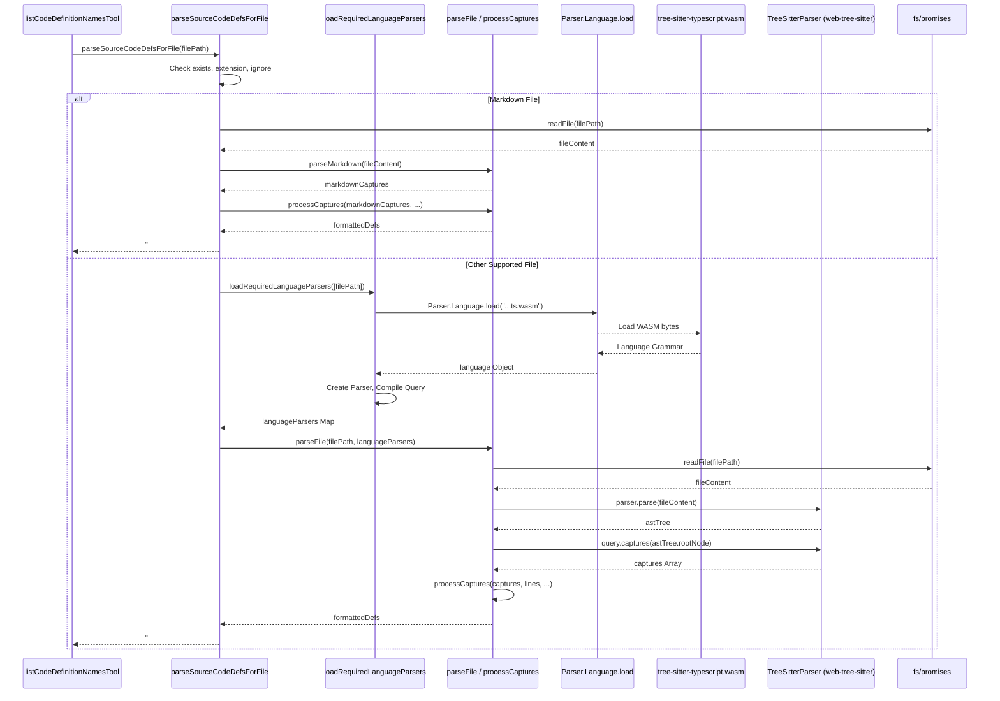

# Chapter 17: Tree-sitter Integration

In [Chapter 16: Ripgrep Integration](16_ripgrep_integration.md), we explored how Roo-Code utilizes the fast search capabilities of Ripgrep to find text patterns within the workspace. While text searching is powerful, understanding the *structure* and *semantics* of code often requires a deeper level of analysis. This chapter delves into Roo-Code's **Tree-sitter Integration**, which enables parsing source code into Abstract Syntax Trees (ASTs) for more sophisticated code understanding and feature extraction.

## Motivation: Beyond Text Search - Understanding Code Structure

Simple text searches using tools like Ripgrep are effective for finding specific strings or patterns, but they lack awareness of the code's underlying structure. For example, Ripgrep can find all occurrences of the word "calculateTotal", but it doesn't inherently know which ones are function definitions, which are function calls, and which are just comments or variable names.

For features like listing all function/class definitions in a file (`list_code_definition_names` tool), providing contextually relevant code snippets to the AI, or potentially enabling more advanced code analysis and transformations, Roo-Code needs to parse the source code into a structured representation that captures its grammatical rules and relationships. This is precisely what Tree-sitter enables.

**Central Use Case:** The `list_code_definition_names` tool needs to identify all functions, classes, methods, and other significant definitions within a specified file or directory, along with the line numbers they span.
1.  The AI agent, needing to understand the structure of `src/utils/math.ts`, requests `<list_code_definition_names><path>src/utils/math.ts</path></list_code_definition_names>`.
2.  Roo-Code invokes the corresponding tool function.
3.  This function utilizes the Tree-sitter integration service (`parseSourceCodeDefinitionsForFile`).
4.  The service determines the file language (TypeScript).
5.  It loads the Tree-sitter parser for TypeScript (as a WASM module).
6.  It parses the content of `src/utils/math.ts` into an AST.
7.  It runs a pre-defined Tree-sitter query specific to TypeScript (`src/services/tree-sitter/queries/typescript.ts`) against the AST to find nodes representing function definitions, class declarations, etc.
8.  It extracts the names and start/end line numbers associated with these definition nodes.
9.  It formats this information into a string (e.g., `15-30 | function calculateTotal\n35-50 | class MathHelper`) and returns it.
10. The tool sends this structured list back to the AI, giving it a concise overview of the file's key components.

## Key Concepts

1.  **Tree-sitter:** An open-source parser generator tool and incremental parsing library. It can build a concrete syntax tree for a source file and efficiently update the syntax tree as the source file is edited. It's designed to be robust (handling syntax errors gracefully) and fast.

2.  **WASM Bindings (`web-tree-sitter`):** To ensure cross-platform compatibility and avoid native module issues within VS Code's runtime, Roo-Code uses the `web-tree-sitter` library. This library allows Tree-sitter parsers, compiled to WebAssembly (WASM), to run directly within Node.js or browser environments.

3.  **Language Parsers (`tree-sitter-wasms`):** Roo-Code bundles pre-compiled WASM files for various programming languages (TypeScript, Python, Java, C++, etc.), often sourced from projects like `tree-sitter-wasms`. These WASM files contain the parsing logic (grammar) for each specific language. The build process (`esbuild.js`) ensures these WASM files are copied into the extension's `dist` directory.

4.  **Abstract Syntax Tree (AST):** When Tree-sitter parses a file, it generates an AST – a tree representation of the code's syntactic structure. Each node in the tree corresponds to a construct in the code (e.g., a function declaration, an expression, an identifier).

5.  **Language-Specific Queries (`.scm` files):** Tree-sitter allows querying the AST using a Lisp-like syntax defined in `.scm` files (located in `src/services/tree-sitter/queries/`). These queries specify patterns to match within the AST. Roo-Code uses custom queries designed to capture code *definitions*.
    *   **Capture Names:** Queries use capture names (e.g., `@name.definition.function`, `@definition.class`) to tag specific nodes matching the pattern. The convention `definition.<type>` tags the entire node representing the definition (used for line ranges), while `name.definition.<type>` tags the specific node containing the identifier/name of the definition.

6.  **Definition Extraction (`processCaptures`):** After running a query, the service gets a list of "captures" (nodes matching the query patterns). The `processCaptures` function (`src/services/tree-sitter/index.ts`) filters and processes these captures:
    *   It focuses on captures related to definitions (`name.includes("definition")`).
    *   It extracts the start and end line numbers from the captured definition nodes.
    *   It filters out definitions that are too small (less than `MIN_COMPONENT_LINES`).
    *   It extracts the definition name (from `name.definition.*` captures).
    *   It formats the output string.

7.  **Dynamic Parser Loading (`languageParser.ts`):** The `loadRequiredLanguageParsers` function analyzes the extensions of the files to be parsed. It dynamically loads only the necessary language WASM parsers using `Parser.Language.load()` from `web-tree-sitter`, initializing them and creating corresponding query objects. This avoids loading all language parsers unnecessarily.

8.  **Special Markdown Parser (`markdownParser.ts`):** Markdown parsing is handled differently. Since a full Tree-sitter grammar for Markdown wasn't readily available or deemed necessary for the primary goal (extracting headers), a custom regular-expression-based parser (`parseMarkdown`) is used. It mimics the output structure (captures with start/end positions) expected by `processCaptures` to maintain consistency in the processing pipeline. It extracts headers (ATX and Setext) and calculates their corresponding section line ranges.

## Using Tree-sitter Integration

The primary interface for using this feature is through the functions exported by `src/services/tree-sitter/index.ts`, mainly used by tools like `list_code_definition_names`.

**Example Flow (`list_code_definition_names` Tool):**

1.  **AI Request:** `<list_code_definition_names><path>src/components/Button.tsx</path></list_code_definition_names>`
2.  **Tool Execution (`listCodeDefinitionNamesTool`):**
    *   Receives the `path` parameter.
    *   Determines if the path is a file or directory.
    *   Calls the appropriate service function: `parseSourceCodeDefinitionsForFile("src/components/Button.tsx", cline.rooIgnoreController)`.
3.  **Service Execution (`parseSourceCodeDefinitionsForFile`):**
    *   **Input:** `filePath: "src/components/Button.tsx"`, `rooIgnoreController`.
    *   Checks file existence.
    *   Extracts extension `.tsx`.
    *   Checks if `.tsx` is supported.
    *   Checks ignore status using `rooIgnoreController`.
    *   Calls `languageParsers = await loadRequiredLanguageParsers(["src/components/Button.tsx"])`.
        *   `loadRequiredLanguageParsers` sees `.tsx`, loads `tree-sitter-tsx.wasm` via `Parser.Language.load()`, initializes a `Parser`, and compiles the `tsxQuery` from `src/services/tree-sitter/queries/tsx.ts`. Returns `{ "tsx": { parser, query } }`.
    *   Calls `definitions = await parseFile("src/components/Button.tsx", languageParsers, ...)`.
4.  **Parsing (`parseFile`):**
    *   Reads file content using `fs.readFile`.
    *   Gets the correct parser and query from `languageParsers` based on extension (`tsx`).
    *   Calls `tree = parser.parse(fileContent)` to generate the AST.
    *   Calls `captures = query.captures(tree.rootNode)` to get matching nodes based on `tsxQuery`.
    *   Calls `processCaptures(captures, lines, MIN_COMPONENT_LINES)`.
5.  **Processing (`processCaptures`):**
    *   Filters `captures` for definition-related names.
    *   Sorts captures by start position.
    *   Iterates through captures, extracting start/end lines and definition names.
    *   Filters out definitions shorter than `MIN_COMPONENT_LINES`.
    *   Formats the output string: `startLine--endLine | lineContentAtStart`.
    *   **Output (from `processCaptures`):** e.g., `5--25 | const Button: React.FC<ButtonProps> = ({ ...\n28--40 | function helperFunction() { ...`
6.  **Formatting (`parseSourceCodeDefinitionsForFile`):**
    *   Prepends the filename header: `# Button.tsx\n`.
    *   **Output (from service):** `# Button.tsx\n5--25 | const Button: React.FC<ButtonProps> = ({ ...\n28--40 | function helperFunction() { ...`
7.  **Tool Result:** The tool receives this formatted string and pushes it back to the AI using `pushToolResult`.

## Code Walkthrough

### Main Service File (`src/services/tree-sitter/index.ts`)

```typescript
// --- File: src/services/tree-sitter/index.ts ---
import * as fs from "fs/promises";
import * as path from "path";
import Parser from "web-tree-sitter"; // Import web-tree-sitter
import { listFiles } from "../glob/list-files";
import { LanguageParser, loadRequiredLanguageParsers } from "./languageParser";
import { fileExistsAtPath } from "../../utils/fs";
import { parseMarkdown } from "./markdownParser"; // Import custom Markdown parser
import { RooIgnoreController } from "../../core/ignore/RooIgnoreController";

// List of supported extensions
const extensions = [ /* ... .js, .ts, .py, .rs, .md, .json etc ... */ ].map((e) => `.${e}`);
const MIN_COMPONENT_LINES = 4; // Minimum lines for a definition to be included

// Parses definitions for a single file
export async function parseSourceCodeDefinitionsForFile(
	filePath: string,
	rooIgnoreController?: RooIgnoreController,
): Promise<string | undefined> {
	const absolutePath = path.resolve(filePath); // Ensure absolute path
	const fileExists = await fileExistsAtPath(absolutePath);
	if (!fileExists) { return "File does not exist or permission denied."; }

	const ext = path.extname(absolutePath).toLowerCase();
	if (!extensions.includes(ext)) { return undefined; /* Unsupported extension */ }

	// Use custom Markdown parser
	if (ext === ".md" || ext === ".markdown") {
		if (rooIgnoreController && !rooIgnoreController.validateAccess(absolutePath)) { return undefined; }
		const fileContent = await fs.readFile(absolutePath, "utf8");
		const lines = fileContent.split("\n");
		const markdownCaptures = parseMarkdown(fileContent);
		const markdownDefinitions = processCaptures(markdownCaptures, lines, MIN_COMPONENT_LINES);
		return markdownDefinitions ? `# ${path.basename(absolutePath)}\n${markdownDefinitions}` : undefined;
	}

	// Use Tree-sitter for other supported languages
	try {
		const languageParsers = await loadRequiredLanguageParsers([absolutePath]);
		const definitions = await parseFile(absolutePath, languageParsers, rooIgnoreController);
		return definitions ? `# ${path.basename(absolutePath)}\n${definitions}` : undefined;
	} catch (error) {
		console.error(`Tree-sitter parsing failed for ${filePath}:`, error);
		return `Error parsing file ${path.basename(absolutePath)}.`; // Inform about parsing error
	}
}

// Parses definitions for all supported files at the top level of a directory
export async function parseSourceCodeForDefinitionsTopLevel(
	dirPath: string,
	rooIgnoreController?: RooIgnoreController,
): Promise<string> {
    const absoluteDirPath = path.resolve(dirPath);
	if (!(await fileExistsAtPath(absoluteDirPath))) { return "Directory does not exist or permission denied."; }

	const [allFiles, _] = await listFiles(absoluteDirPath, false, 200); // Get top-level files
	let result = "";

	// Separate supported files, apply ignore rules
	const filesToProcess = allFiles
		.filter(file => extensions.includes(path.extname(file).toLowerCase()))
		.filter(file => !rooIgnoreController || rooIgnoreController.validateAccess(file))
		.slice(0, 50); // Limit number of files

	const markdownFiles = filesToProcess.filter(f => f.endsWith(".md") || f.endsWith(".markdown"));
	const otherFiles = filesToProcess.filter(f => !markdownFiles.includes(f));

	try {
		// Load parsers needed for non-markdown files
		const languageParsers = await loadRequiredLanguageParsers(otherFiles);

		// Process Markdown files
		for (const file of markdownFiles) {
			try {
				const fileContent = await fs.readFile(file, "utf8");
				const lines = fileContent.split("\n");
				const markdownCaptures = parseMarkdown(fileContent);
				const markdownDefinitions = processCaptures(markdownCaptures, lines, MIN_COMPONENT_LINES);
				if (markdownDefinitions) {
					result += `# ${path.relative(absoluteDirPath, file).replace(/\\/g, "/")}\n${markdownDefinitions}\n`;
				}
			} catch (e) { /* Log individual file error */ }
		}

		// Process other files with Tree-sitter
		for (const file of otherFiles) {
			try {
				const definitions = await parseFile(file, languageParsers); // Ignore controller already applied
				if (definitions) {
					result += `# ${path.relative(absoluteDirPath, file).replace(/\\/g, "/")}\n${definitions}\n`;
				}
			} catch (e) { /* Log individual file error */ }
		}
	} catch (error) {
		console.error(`Tree-sitter processing failed for directory ${dirPath}:`, error);
		return result || "Error during definition processing."; // Return partial results if available
	}

	return result ? result.trim() : "No source code definitions found.";
}


/** Parse a single file using the loaded Tree-sitter parsers */
async function parseFile(
	filePath: string,
	languageParsers: LanguageParser,
	rooIgnoreController?: RooIgnoreController, // Check added for single file case consistency
): Promise<string | null> {
	if (rooIgnoreController && !rooIgnoreController.validateAccess(filePath)) {
		return null; // Skip ignored file
	}

	const fileContent = await fs.readFile(filePath, "utf8");
	const ext = path.extname(filePath).toLowerCase().slice(1);
	const langParser = languageParsers[ext]; // Get pre-loaded parser and query

	if (!langParser || !langParser.parser || !langParser.query) {
		// Should not happen if loadRequiredLanguageParsers worked correctly
		return `Unsupported or failed to load parser for file type: ${ext}`;
	}

	try {
		const tree = langParser.parser.parse(fileContent);
		const captures = langParser.query.captures(tree.rootNode);
		const lines = fileContent.split("\n");
		return processCaptures(captures, lines, MIN_COMPONENT_LINES);
	} catch (error) {
		console.error(`Tree-sitter parsing error in ${filePath}:`, error);
		return null; // Return null on error to avoid polluting results
	}
}

/** Process captures from Tree-sitter or Markdown parser */
function processCaptures(captures: Parser.QueryCapture[], lines: string[], minComponentLines: number): string | null {
	// Helper to check if a line looks like an HTML element start
	const isHtmlElement = (line: string): boolean => /^[^A-Z]*<\/?(?:div|span|button|input|h[1-6]|p|a|img|ul|li|form)\b/.test(line.trim());

	if (!captures || captures.length === 0) { return null; }

	let formattedOutput = "";
	// Sort captures by start position to process in order
	captures.sort((a, b) => a.node.startPosition.row - b.node.startPosition.row);

	const processedRanges = new Set<string>(); // Track processed line ranges (start-end)

	for (const capture of captures) {
		const { node, name } = capture;

		// Focus on captures representing the definition name or the definition block itself
		if (!name.includes("definition")) continue;

		// Find the node representing the full definition block
		let definitionNode = node;
		// If capture is just the name, traverse up to find the encompassing block
		// Heuristic: Go up until we find a node type that typically represents a block
		// (This might need refinement based on query structure)
		if (name.includes("name.definition") && node.parent) {
            definitionNode = node.parent; // Often the parent is the definition block
            // Example refinement: traverse up further if parent is small/intermediate node
            // while (definitionNode.parent && ['identifier', 'property_identifier', 'type_identifier'].includes(definitionNode.type)) {
            //     definitionNode = definitionNode.parent;
            // }
		}

		if (!definitionNode) continue;

		const startLine = definitionNode.startPosition.row;
		const endLine = definitionNode.endPosition.row;
		const lineCount = endLine - startLine + 1;

		if (lineCount < minComponentLines) continue; // Skip small definitions

		const rangeKey = `${startLine}-${endLine}`;
		if (processedRanges.has(rangeKey)) continue; // Avoid duplicate entries for same block

        // Get the first line content for context and filtering
        const firstLineContent = lines[startLine]?.trim() ?? "";

        // Filter out simple HTML elements if capture is not specifically a name
        if (!name.includes("name.definition") && isHtmlElement(firstLineContent)) {
            continue;
        }

        // Format: "start--end | first line content" (1-based indexing for output)
		formattedOutput += `${startLine + 1}--${endLine + 1} | ${firstLineContent}\n`;
		processedRanges.add(rangeKey);
	}

	return formattedOutput.length > 0 ? formattedOutput.trim() : null;
}
```

**Explanation:**

*   **`parseSourceCodeDefinitionsForFile`:** Handles a single file. Checks existence, extension, ignore rules. Dispatches to `parseMarkdown` or loads the necessary Tree-sitter parser via `loadRequiredLanguageParsers` and calls `parseFile`. Formats the result with a filename header.
*   **`parseSourceCodeForDefinitionsTopLevel`:** Handles a directory. Gets top-level files using `listFiles`, filters by extension and ignore rules, limits file count. Separates Markdown and other files. Loads parsers *once* for all non-Markdown files. Iterates through files, calling `parseMarkdown` or `parseFile`, and concatenates results with relative path headers.
*   **`parseFile`:** The core Tree-sitter parsing logic for a single file. Reads content, gets the pre-loaded parser/query, runs `parser.parse()`, executes `query.captures()`, and calls `processCaptures`. Includes error handling.
*   **`processCaptures`:** Takes the raw captures (from Tree-sitter or `parseMarkdown`), filters/sorts them, determines the relevant line range for each definition, filters by `minComponentLines`, avoids duplicates using `processedRanges`, applies simple HTML filtering, and formats the output string `startLine+1--endLine+1 | firstLineContent`.

### Dynamic Parser Loading (`src/services/tree-sitter/languageParser.ts`)

```typescript
// --- File: src/services/tree-sitter/languageParser.ts ---
import * as path from "path";
import Parser from "web-tree-sitter";
// Import query strings from the queries directory
import { typescriptQuery, tsxQuery, /* ... other query imports ... */ } from "./queries";

export interface LanguageParser {
	[key: string]: { // Key is the file extension (e.g., "ts", "py")
		parser: Parser; // Initialized Tree-sitter parser instance
		query: Parser.Query; // Compiled query object for the language
	}
}

// Helper to load WASM file for a language
async function loadLanguage(langName: string) {
	// Assumes WASM files are copied to 'dist' directory during build
	const wasmPath = path.join(__dirname, `tree-sitter-${langName}.wasm`);
	return await Parser.Language.load(wasmPath);
}

let isParserInitialized = false;
// Initialize the core Parser library once
async function initializeParser() {
	if (!isParserInitialized) {
		await Parser.init(); // Required by web-tree-sitter
		isParserInitialized = true;
	}
}

/** Loads WASM parsers and compiles queries only for required languages */
export async function loadRequiredLanguageParsers(filesToParse: string[]): Promise<LanguageParser> {
	await initializeParser(); // Ensure core library is ready

	// Get unique lowercase extensions from the file list
	const extensionsToLoad = new Set(
        filesToParse.map((file) => path.extname(file).toLowerCase().slice(1)).filter(Boolean)
    );

	const parsers: LanguageParser = {};

	for (const ext of extensionsToLoad) {
        if (parsers[ext]) continue; // Skip if already loaded

		let language: Parser.Language;
		let queryString: string; // Store the query string for the language

		// Map extension to language name and query string
		switch (ext) {
			case "js": case "jsx": case "json":
				language = await loadLanguage("javascript");
				queryString = javascriptQuery; break;
			case "ts":
				language = await loadLanguage("typescript");
				queryString = typescriptQuery; break;
			case "tsx":
				language = await loadLanguage("tsx");
				queryString = tsxQuery; break;
			// ... cases for all other supported extensions ...
			case "py":
				language = await loadLanguage("python");
				queryString = pythonQuery; break;
			default:
                console.warn(`Unsupported extension for Tree-sitter parsing: ${ext}`);
				continue; // Skip unsupported extensions
		}

        if (language && queryString) {
		    const parser = new Parser();
		    parser.setLanguage(language);
		    const query = language.query(queryString); // Compile the query string
		    parsers[ext] = { parser, query }; // Store parser and compiled query
        }
	}
	return parsers;
}
```

**Explanation:**

*   **`initializeParser`:** Ensures `Parser.init()` (required by `web-tree-sitter`) is called only once.
*   **`loadLanguage`:** Helper to construct the path to the language-specific `.wasm` file (expected in `dist`) and load it using `Parser.Language.load()`.
*   **`loadRequiredLanguageParsers`:**
    *   Extracts unique file extensions from the input file list.
    *   Iterates through the unique extensions.
    *   Uses a `switch` statement to:
        *   Load the appropriate language WASM using `loadLanguage`.
        *   Select the corresponding query string (imported from `./queries`).
    *   Creates a new `Parser` instance and sets its language.
    *   Compiles the query string using `language.query()`.
    *   Stores the initialized `parser` and compiled `query` object in the `parsers` map, keyed by the extension.
    *   Returns the map of loaded parsers/queries.

### Example Query (`src/services/tree-sitter/queries/typescript.ts`)

```typescript
// --- File: src/services/tree-sitter/queries/typescript.ts ---
/*
Query Goals: Capture various definition types in TypeScript/JavaScript.
- function signatures and declarations
- method signatures and definitions (including abstract)
- class declarations (including abstract)
- module/namespace declarations
- arrow functions (assigned to variables often indicate components/functions)
- enum declarations
- interfaces and type aliases
- properties, constructors, accessors
*/
export default `
;; Function Definitions
(function_declaration
  name: (identifier) @name.definition.function) @definition.function

(function_signature ;; Interface/ambient functions
  name: (identifier) @name.definition.function) @definition.function

(generator_function_declaration ;; Generator functions
  name: (identifier) @name.definition.function) @definition.function

;; Method Definitions (within classes)
(method_definition
  name: (property_identifier) @name.definition.method) @definition.method

(method_signature ;; Interface/abstract methods
  name: (property_identifier) @name.definition.method) @definition.method

(abstract_method_signature
  name: (property_identifier) @name.definition.method) @definition.method

;; Class Definitions
(class_declaration
  name: (type_identifier) @name.definition.class) @definition.class

(abstract_class_declaration
  name: (type_identifier) @name.definition.class) @definition.class

;; Arrow Functions (often used for const components/functions)
(variable_declarator
  name: (identifier) @name.definition.arrow
  value: (arrow_function)) @definition.arrow

;; Interfaces
(interface_declaration
  name: (type_identifier) @name.definition.interface) @definition.interface

;; Type Aliases
(type_alias_declaration
  name: (type_identifier) @name.definition.type) @definition.type

;; Enums
(enum_declaration
  name: (identifier) @name.definition.enum) @definition.enum

;; Namespaces / Internal Modules
(internal_module
  name: [(identifier) (string)] @name.definition.namespace) @definition.namespace

;; Exported Definitions (capture the underlying definition)
(export_statement
  declaration: [
    (function_declaration) @definition.function
    (generator_function_declaration) @definition.function
    (class_declaration) @definition.class
    (abstract_class_declaration) @definition.class
    (interface_declaration) @definition.interface
    (type_alias_declaration) @definition.type
    (enum_declaration) @definition.enum
    (internal_module) @definition.namespace
    (lexical_declaration
        (variable_declarator
          value: [(arrow_function)] @definition.arrow))
  ])

;; Captures for exported names might be needed if not captured above
;; (export_statement declaration: (class_declaration name: (type_identifier) @name.definition.class))
;; etc.
`;

```

**Explanation:**

*   **Scheme Syntax:** Uses S-expressions (Lisp-like syntax) to define patterns in the AST.
*   **Node Types:** Matches specific Tree-sitter node types (e.g., `function_declaration`, `class_declaration`, `method_definition`).
*   **Field Names:** Uses field names (e.g., `name:`) to target specific children of a node.
*   **Captures (`@name`):** Uses `@capture.name` syntax to tag matching nodes.
    *   `@definition.<type>`: Captures the entire node representing the definition block (used for start/end lines).
    *   `@name.definition.<type>`: Captures the specific child node containing the identifier/name of the definition (used to extract the name, though `processCaptures` currently gets name from the first line).
*   **Structure:** Organizes queries by the type of definition being captured. Includes patterns for functions, classes, methods, interfaces, types, enums, namespaces, and common export patterns.

### Build Process (`esbuild.js`)

```javascript
// --- File: esbuild.js ---
// (Relevant excerpt)
const copyWasmFiles = {
	name: "copy-wasm-files",
	setup(build) {
		build.onEnd(() => {
			// Copy base tree-sitter.wasm
			const sourceDir = path.join(__dirname, "node_modules", "web-tree-sitter");
			const targetDir = path.join(__dirname, "dist");
			fs.copyFileSync(path.join(sourceDir, "tree-sitter.wasm"), path.join(targetDir, "tree-sitter.wasm"));

			// Copy language-specific WASM files from tree-sitter-wasms
			const languageWasmDir = path.join(__dirname, "node_modules", "tree-sitter-wasms", "out");
			const languages = [ /* typescript, tsx, python, etc... */ ];

			languages.forEach((lang) => {
				const filename = `tree-sitter-${lang}.wasm`;
				// Ensure source file exists before copying
				const sourcePath = path.join(languageWasmDir, filename);
                if (fs.existsSync(sourcePath)) {
				    fs.copyFileSync(sourcePath, path.join(targetDir, filename));
                } else {
                    console.warn(`WASM file not found, skipping copy: ${sourcePath}`);
                }
			});
            console.log("Copied Tree-sitter WASM files to dist/");
		});
	},
};

const extensionConfig = {
    // ... other config ...
	plugins: [
		copyWasmFiles, // Add the plugin to the list
		// ... other plugins ...
	],
    // ... rest of config ...
};

// ... main build function ...
```

**Explanation:**

*   **Esbuild Plugin:** Defines a custom plugin (`copyWasmFiles`) for the Esbuild build process.
*   **`onEnd` Hook:** The plugin's logic runs after the main JavaScript bundle is built.
*   **Copy `tree-sitter.wasm`:** Copies the core `web-tree-sitter` WASM file.
*   **Copy Language WASM:** Iterates through a list of supported `languages`. For each language, it constructs the expected filename (`tree-sitter-${lang}.wasm`), checks if it exists in the `node_modules/tree-sitter-wasms/out` directory, and copies it to the `dist` output directory. This ensures the runtime code (`languageParser.ts`) can find the necessary WASM files at `path.join(__dirname, ...)`.

## Internal Implementation

The process involves coordinating file system access, WASM loading, parsing, querying, and text processing.

**Step-by-Step (Single File Parse):**

1.  **Entry:** `parseSourceCodeDefinitionsForFile(filePath)` is called.
2.  **Validation:** Checks file existence, extension support, ignore rules.
3.  **Markdown Check:** If Markdown, calls `parseMarkdown`, then `processCaptures`, formats, returns.
4.  **Load Parsers:** Calls `loadRequiredLanguageParsers([filePath])`.
    *   `initializeParser()` ensures `Parser.init()` runs once.
    *   Gets extension (e.g., "ts").
    *   Loads language WASM: `Parser.Language.load(".../dist/tree-sitter-typescript.wasm")`.
    *   Creates `Parser` instance, sets language.
    *   Compiles query: `language.query(typescriptQuery)`.
    *   Returns map: `{ "ts": { parser, query } }`.
5.  **Call `parseFile`:** Passes `filePath` and the loaded `languageParsers` map.
6.  **Read Content:** `parseFile` reads the file content using `fs.readFile`.
7.  **Get Parser/Query:** Retrieves the correct `parser` and `query` from the map using the file extension.
8.  **Parse AST:** Calls `parser.parse(fileContent)`, generating the Abstract Syntax Tree in memory.
9.  **Execute Query:** Calls `query.captures(tree.rootNode)`, matching the query patterns against the AST and returning an array of `QueryCapture` objects.
10. **Process Captures:** Calls `processCaptures(captures, lines, minLines)`.
11. **Format Output:** `processCaptures` filters, sorts, extracts line ranges/names, formats the string `Start--End | First Line`.
12. **Return:** `parseFile` returns the formatted string (or null).
13. **Final Format:** `parseSourceCodeDefinitionsForFile` prepends the filename header (`# filename`) and returns the final result string.

**Sequence Diagram (Single File Parse):**



## Modification Guidance

Modifications typically involve supporting new languages, refining captured definitions, or adjusting the output format.

**Common Modifications:**

1.  **Adding Support for a New Language (e.g., "Lua"):**
    *   **Get WASM:** Find or compile a Tree-sitter grammar for Lua to WASM (`tree-sitter-lua.wasm`). Add it to the project (e.g., via `tree-sitter-wasms` dependency or manually).
    *   **Update Build:** Add `"lua"` to the `languages` array in the `copyWasmFiles` plugin within `esbuild.js` so the WASM file is copied to `dist`.
    *   **Create Query:** Create `src/services/tree-sitter/queries/lua.ts` containing a Tree-sitter query (`export default \`...\`;`) designed to capture Lua function definitions, tables acting as modules/classes, etc.
    *   **Register Query:** Import `luaQuery` in `src/services/tree-sitter/queries/index.ts` and export it.
    *   **Update Loader:** Add a `case "lua":` block to the `switch` statement in `loadRequiredLanguageParsers` (`src/services/tree-sitter/languageParser.ts`) that calls `await loadLanguage("lua")` and sets `queryString = luaQuery`.
    *   **Add Extension:** Add `.lua` to the `extensions` array in `src/services/tree-sitter/index.ts`.
    *   **Test:** Test the `list_code_definition_names` tool with Lua files.

2.  **Refining Definitions Captured for an Existing Language (e.g., Capture Decorators in Python):**
    *   **Edit Query:** Open the relevant query file (e.g., `src/services/tree-sitter/queries/python.ts`).
    *   **Add Pattern:** Add a new S-expression pattern to match decorated functions or classes. For example:
        ```scheme
        (decorated_definition
          definition: [(function_definition) @definition.function (class_definition) @definition.class]
          decorator: (decorator (identifier) @decorator_name)) ;; Optionally capture decorator name
        ```
    *   **Refine Captures:** Ensure the `@definition.<type>` capture correctly points to the node whose line range should be used. Adjust `@name.definition.<type>` if needed.
    *   **Test:** Verify that decorated functions/classes are now included in the output and that existing captures still work correctly.

3.  **Changing the Output Format:**
    *   **Locate:** Modify the `processCaptures` function in `src/services/tree-sitter/index.ts`.
    *   **Edit:** Change the template string used to format the output line (e.g., add indentation, include the definition name, change the separator).
        ```typescript
        // Example: Change format
        // formattedOutput += `${startLine + 1}--${endLine + 1} :: ${definitionName}\n`; // Assuming definitionName is extracted
        ```
    *   **Considerations:** Ensure the new format is still useful for the AI and human users. Changes here affect the output for *all* languages (except Markdown if `formatMarkdownCaptures` isn't also changed).

**Best Practices:**

*   **Query Specificity:** Write queries that are specific enough to capture the desired definitions accurately without capturing unintended nodes. Refer to Tree-sitter documentation and grammar definitions for the target language.
*   **Capture Consistency:** Use the `@definition.<type>` and `@name.definition.<type>` conventions consistently across language queries to simplify `processCaptures`.
*   **Error Handling:** Include `try...catch` blocks around parsing and querying operations (`parseFile`) to prevent errors in one file from crashing the entire process, especially when handling multiple files.
*   **Performance:**
    *   `loadRequiredLanguageParsers` helps by loading WASM files only when needed.
    *   Parsing large files can still be CPU-intensive. Avoid running on excessively large files if possible, or consider optimizations if performance becomes an issue.
    *   The `processCaptures` logic (sorting, filtering) is generally fast.
*   **WASM Management:** Ensure the build process reliably copies all necessary WASM files to the expected location (`dist`).

**Potential Pitfalls:**

*   **WASM Loading Failures:** If WASM files are missing from `dist` (build issue) or if `Parser.init()` fails, parsing will not work.
*   **Incorrect Queries:** Queries that don't match the language grammar correctly or capture the wrong nodes will produce incorrect or empty results. Testing queries in a Tree-sitter playground is recommended.
*   **Grammar Mismatches:** Using a query designed for one version of a language grammar with a different version (if WASM files aren't kept in sync with query development) can lead to errors or incorrect captures.
*   **Large File Performance:** Parsing very large source files can consume significant time and memory. The current implementation doesn't have explicit limits on file size for parsing.
*   **AST Complexity:** Handling deeply nested structures or complex language features accurately within queries and `processCaptures` can be challenging. The current approach focuses on relatively common definition patterns.

## Conclusion

Tree-sitter Integration provides Roo-Code with a powerful capability to understand the structural content of source code, going beyond simple text matching. By leveraging `web-tree-sitter` with WASM language modules, Roo-Code can efficiently parse various languages, run targeted queries to identify code definitions, and extract valuable structural information. This enables features like the `list_code_definition_names` tool and provides a foundation for potentially more advanced code analysis features in the future. The inclusion of a custom Markdown parser ensures basic structural understanding even for documentation files.

With the ability to understand code structure via Tree-sitter, we now turn to how Roo-Code interacts with external web resources. The next chapter explores [Chapter 18: Browser Interaction](18_browser_interaction.md).

