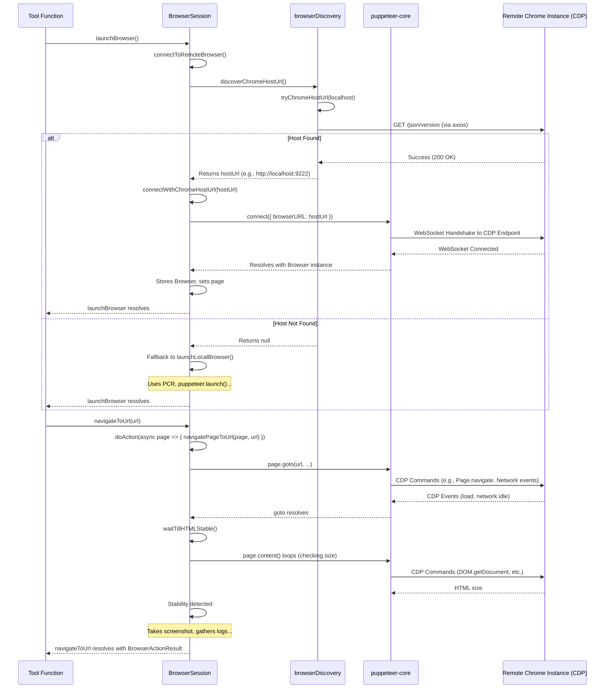

# Chapter 18: Browser Interaction

In the previous chapter, [Chapter 17: Tree-sitter Integration](17_tree_sitter_integration.md), we saw how Roo-Code parses and understands the structure of code using Tree-sitter. Now, we shift our attention to how Roo-Code interacts with the wider web, enabling it to fetch content from URLs or even perform actions within a browser environment.

## Motivation: Accessing and Interacting with the Web

Modern software development often involves interacting with web resources – fetching documentation, checking API statuses, analyzing web page content, or even performing browser-based testing or automation. An AI coding assistant limited only to the local workspace would miss out on this vast source of information and potential action space.

Roo-Code needs a way to programmatically control a web browser to:
1.  Fetch the content of a given URL, potentially rendering JavaScript-heavy pages accurately.
2.  Extract meaningful information from web pages (e.g., converting HTML to Markdown for the AI to process).
3.  Perform actions within a page, like clicking buttons, filling forms, or scrolling (useful for agentic tasks or testing scenarios).

This chapter explores Roo-Code's **Browser Interaction** capabilities, primarily implemented through the `BrowserSession` class, which leverages `puppeteer-core` to automate browser actions.

**Central Use Case:** A user asks Roo-Code: "Summarize the main points from the article at https://example.com/some-article".
1.  The AI agent determines it needs to access the content of the URL. It might use a specific tool like `browse_url` or simply include the URL in its request for the `read_url` capability.
2.  The corresponding tool function (e.g., `readUrlTool`) is invoked with the URL.
3.  This tool function likely uses the `UrlContentFetcher` utility.
4.  `UrlContentFetcher.urlToMarkdown(url)` needs a browser instance. It calls `BrowserSession.launchBrowser()` if needed.
5.  `BrowserSession` checks user settings ([Code Snippet](#code-snippets)): Is remote browser connection enabled?
    *   If **No (Local Mode)**: It uses `puppeteer-chromium-resolver` to find a locally downloaded, compatible Chromium binary (downloading it if necessary) and launches it using `puppeteer.launch()`.
    *   If **Yes (Remote Mode)**: It uses functions from `browserDiscovery` to try and find a running Chrome/Chromium instance listening on the remote debugging port (e.g., 9222). This might involve checking `localhost`, known Docker IPs, or user-configured host URLs. If found, it connects using `puppeteer.connect()`. If remote connection fails, it might fall back to local mode.
6.  Once connected/launched, `UrlContentFetcher` uses the `BrowserSession` (specifically its underlying `Page` object) to navigate to `https://example.com/some-article`.
7.  It waits for the page to load (including potential JavaScript execution).
8.  It extracts the HTML content.
9.  It uses libraries like `cheerio` to clean the HTML (removing scripts, navigation, footers) and `turndown` to convert the cleaned HTML into Markdown.
10. The Markdown content is returned by `UrlContentFetcher`.
11. The tool function (`readUrlTool`) receives the Markdown and provides it to the AI using `pushToolResult`.
12. The AI can now process the Markdown content and generate a summary for the user.

## Key Concepts

1.  **`puppeteer-core`:** A lightweight version of the Puppeteer library. Unlike the full `puppeteer` package, `puppeteer-core` does not download Chromium by default. This allows Roo-Code to either use a separately managed Chromium instance (downloaded via `puppeteer-chromium-resolver`) or connect to an existing Chrome/Chromium installation running in debugging mode.

2.  **`puppeteer-chromium-resolver` (PCR):** A utility library used by `BrowserSession` in local mode. It automatically finds a compatible version of Chromium, downloads it to a specific directory within the extension's global storage (`.chromium-browser-snapshots`), and provides the path to the executable and the correct `puppeteer-core` launch function. This simplifies managing the browser dependency locally.

3.  **`BrowserSession` (`src/services/browser/BrowserSession.ts`):** The central class orchestrating browser interaction. It manages:
    *   **Lifecycle:** Launching a local Chromium instance (`launchLocalBrowser`) using PCR, connecting to a remote debugging session (`connectToRemoteBrowser`), and closing/disconnecting the browser (`closeBrowser`).
    *   **Page Management:** Handles the primary `Page` object representing a browser tab. It can create new tabs (`createNewTab`) or switch between existing tabs based on domain (`navigateToUrl` logic).
    *   **Navigation:** Navigating the page to a specific URL (`navigateToUrl`, `navigatePageToUrl`), including waiting for appropriate load events (`domcontentloaded`, `networkidle2`) and HTML stability (`waitTillHTMLStable`).
    *   **Actions:** Performing user-like actions on the page (`click`, `type`, `hover`, `scrollDown`, `scrollUp`, `resize`) via Puppeteer's APIs. It includes logic (`handleMouseInteraction`) to wait for potential network activity triggered by interactions.
    *   **State Capture (`doAction`):** A core method that wraps page actions. After an action, it captures console logs (`page.on('console')`, `page.on('pageerror')`), takes a screenshot (`page.screenshot`), and returns this information along with the current URL and mouse position as a `BrowserActionResult`. Screenshots are taken as `webp` (falling back to `png`) with configurable quality.

4.  **Local vs. Remote Mode:** `BrowserSession` supports two primary modes, configured via user settings ([Code Snippet](#code-snippets)):
    *   **Local (Default):** (`remoteBrowserEnabled: false`) Uses `puppeteer-chromium-resolver` to manage and launch a dedicated Chromium instance locally. Simpler setup, isolated environment.
    *   **Remote (`remoteBrowserEnabled: true`):** Connects to an existing Chrome/Chromium browser instance started with the `--remote-debugging-port=PORT` flag (e.g., `9222`). This allows interaction with the user's main browser or a browser running in a container. Requires the user to manage the target browser instance.

5.  **`browserDiscovery` (`src/services/browser/browserDiscovery.ts`):** A set of utility functions used in Remote Mode to find the WebSocket endpoint URL needed for `puppeteer.connect()`:
    *   `discoverChromeHostUrl`: Tries connecting directly to common hosts (`localhost:9222`, `127.0.0.1:9222`). If those fail, it calls `discoverChromeHosts`.
    *   `discoverChromeHosts`: Tries to find potential host IPs (e.g., `host.docker.internal` via DNS lookup).
    *   `tryChromeHostUrl`: Makes an HTTP request to `http://HOST:PORT/json/version` to verify if a Chrome DevTools Protocol endpoint is available.
    *   `isPortOpen`: Uses Node.js `net` module to check if a specific port is listening on a host.
    *   **Caching:** `BrowserSession` caches the last known successful connection URL (`cachedChromeHostUrl`) in `globalState` to speed up reconnections.

6.  **`UrlContentFetcher` (`src/services/browser/UrlContentFetcher.ts`):** A simpler utility class focused solely on fetching web page content and converting it to Markdown. It uses a `BrowserSession` internally (launching/closing it as needed) to navigate to a URL, get the HTML content, use `cheerio` for DOM manipulation (removing unwanted elements like scripts, navs, footers), and `turndown` to convert the cleaned HTML to Markdown.

7.  **UI Integration:**
    *   **Settings ([Code Snippet](#code-snippets)):** `BrowserSettings.tsx` provides UI controls for enabling/disabling the browser tool, setting the viewport size, screenshot quality, enabling remote mode, and specifying/testing the remote browser host URL.
    *   **Tool (`browserActionTool.ts`):** The `browser_action` tool uses `BrowserSession` methods directly to perform granular actions (`launch`, `click`, `type`, `scroll_down`, `scroll_up`, `close`) requested by the AI. Results, including screenshots and logs, are sent back to the AI.

## Using Browser Interaction (Use Case)

Let's re-trace the "Summarize Article" use case with a focus on the classes involved.

1.  **AI Request:** Use `browse_url` tool for `https://example.com/some-article`.
2.  **Tool Invocation:** `browseUrlTool` (or similar) is called. It decides to use `UrlContentFetcher`.
3.  **Fetcher Call:** `await urlContentFetcher.urlToMarkdown("https://example.com/some-article")`.
4.  **Fetcher Needs Browser:** `urlContentFetcher` sees `this.browser` is undefined. It calls `await this.launchBrowser()`.
5.  **`UrlContentFetcher.launchBrowser`:**
    *   Calls `this.browserSession.launchBrowser()`.
6.  **`BrowserSession.launchBrowser`:**
    *   Checks `remoteBrowserEnabled` setting (read from `context.globalState`). Assume it's `false` (Local Mode).
    *   Calls `await this.launchLocalBrowser()`.
7.  **`BrowserSession.launchLocalBrowser`:**
    *   Calls `stats = await this.ensureChromiumExists()`.
    *   `ensureChromiumExists`: Uses `PCR` (puppeteer-chromium-resolver) to find/download Chromium, returns `{ puppeteer, executablePath }`.
    *   Calls `this.browser = await stats.puppeteer.launch({ executablePath: stats.executablePath, ... })`. Launches Chromium.
8.  **Page Creation (Fetcher):** `urlContentFetcher` might call `this.page = await this.browser?.newPage()` after `launchBrowser`.
9.  **Navigation (Fetcher):** `urlContentFetcher` calls `await this.page.goto(url, { ... })`. Puppeteer drives the browser to the URL.
10. **Content Extraction (Fetcher):**
    *   `content = await this.page.content()`. Gets full HTML.
    *   `$ = cheerio.load(content)`. Parses HTML.
    *   `$("script, style, nav, ...").remove()`. Cleans HTML.
    *   `markdown = turndownService.turndown($.html())`. Converts to Markdown.
11. **Browser Close (Fetcher):** `urlContentFetcher` calls `await this.closeBrowser()`, which calls `this.browserSession.closeBrowser()`.
12. **`BrowserSession.closeBrowser`:** Calls `await this.browser?.close()`. Resets `this.browser`, `this.page`.
13. **Return Value:** `urlContentFetcher` returns the `markdown` string.
14. **Tool Result:** The tool pushes the markdown result to the AI.

*(If Remote Mode was enabled, steps 6-7 would involve `connectToRemoteBrowser`, `browserDiscovery`, and `puppeteer.connect()` instead of `launchLocalBrowser` and `PCR`.)*

## Code Walkthrough

### BrowserSession (`src/services/browser/BrowserSession.ts`)

```typescript
// --- File: src/services/browser/BrowserSession.ts ---
import * as vscode from "vscode";
import * as fs from "fs/promises";
import * as path from "path";
// Import puppeteer-core and specific types
import { Browser, Page, ScreenshotOptions, TimeoutError, launch, connect } from "puppeteer-core";
// @ts-ignore - PCR types might be missing or incomplete
import PCR from "puppeteer-chromium-resolver"; // Resolver for local Chromium
import pWaitFor from "p-wait-for"; // Utility for waiting
import delay from "delay"; // Utility for pausing
import axios from "axios"; // Used by discovery
import { fileExistsAtPath } from "../../utils/fs";
import { BrowserActionResult } from "../../shared/ExtensionMessage";
// Import discovery functions
import { discoverChromeHostUrl, tryChromeHostUrl } from "./browserDiscovery";

// Interface for PCR results
interface PCRStats {
	puppeteer: { launch: typeof launch };
	executablePath: string;
}

export class BrowserSession {
	private context: vscode.ExtensionContext;
	private browser?: Browser; // Puppeteer Browser instance
	private page?: Page; // Active Puppeteer Page instance
	private currentMousePosition?: string; // Tracks last hover/click position
	private lastConnectionAttempt?: number; // Timestamp for remote connection caching

	constructor(context: vscode.ExtensionContext) {
		this.context = context;
	}

	// --- Local Browser Management ---
	private async ensureChromiumExists(): Promise<PCRStats> {
        // ... uses PCR to find/download Chromium to globalStorage/puppeteer ...
        // (See code snippet in concept details)
		const globalStoragePath = this.context?.globalStorageUri?.fsPath; /* ... */
		const puppeteerDir = path.join(globalStoragePath, "puppeteer"); /* ... */
		const stats: PCRStats = await PCR({ downloadPath: puppeteerDir });
		return stats;
	}

	private async launchLocalBrowser(): Promise<void> {
		console.log("[Browser] Launching local browser");
		const stats = await this.ensureChromiumExists();
		this.browser = await stats.puppeteer.launch({
			args: [ /* ... User-Agent, potentially other flags ... */ ],
			executablePath: stats.executablePath,
			defaultViewport: this.getViewport(), // Get size from settings
			// headless: false, // For debugging: show the browser UI
		});
		console.log(`[Browser] Launched local browser: ${stats.executablePath}`);
	}

	// --- Remote Browser Management ---
	private async connectWithChromeHostUrl(chromeHostUrl: string): Promise<boolean> {
		try {
			this.browser = await connect({
				browserURL: chromeHostUrl, // WebSocket URL (e.g., "http://localhost:9222")
				defaultViewport: this.getViewport(),
			});
			console.log(`[Browser] Connected to remote browser at ${chromeHostUrl}`);
			// Cache successful connection URL and timestamp
			this.context.globalState.update("cachedChromeHostUrl", chromeHostUrl);
			this.lastConnectionAttempt = Date.now();
			return true;
		} catch (error) {
			console.log(`[Browser] Failed to connect using WebSocket endpoint: ${error}`);
			return false;
		}
	}

	private async connectToRemoteBrowser(): Promise<boolean> {
		let remoteBrowserHost = this.context.globalState.get("remoteBrowserHost") as string | undefined;
		// ... logic using cachedChromeHostUrl, tryChromeHostUrl, discoverChromeHostUrl ...
        // (See code snippet in concept details for full logic)
        // Tries cached URL -> user-provided URL -> auto-discovery
        const cachedUrl = this.context.globalState.get("cachedChromeHostUrl") as string | undefined;
        if (cachedUrl && /* check timestamp */ false) { /* try cached */ }
        if (remoteBrowserHost) { /* try user-provided */ }
        const discoveredUrl = await discoverChromeHostUrl();
        if (discoveredUrl) { /* try discovered */ }
		return false; // Return true if any connection succeeded
	}

	// --- Public Lifecycle Methods ---
	async launchBrowser(): Promise<void> {
		console.log("[Browser] Launch browser requested");
		const remoteBrowserEnabled = this.context.globalState.get("remoteBrowserEnabled") as boolean | undefined;

        // Close existing browser if any (handles relaunch scenario)
        if (this.browser) { await this.closeBrowser(); }
        else { this.resetBrowserState(); }

		if (!remoteBrowserEnabled) {
			await this.launchLocalBrowser();
		} else {
			console.log("[Browser] Connecting to remote browser");
			const remoteConnected = await this.connectToRemoteBrowser();
			if (!remoteConnected) {
				console.log("[Browser] Remote connection failed, falling back to local browser");
				await this.launchLocalBrowser();
			}
		}
        // Ensure at least one page is open after launch/connect
        if (!this.page && this.browser) {
            const pages = await this.browser.pages();
            this.page = pages[0] || await this.browser.newPage();
        }
	}

	async closeBrowser(): Promise<BrowserActionResult> {
		if (this.browser || this.page) {
			console.log("[Browser] Closing browser...");
			const remoteBrowserEnabled = this.context.globalState.get("remoteBrowserEnabled") as boolean | undefined;
			try {
                if (remoteBrowserEnabled && this.browser) {
                    // Disconnect keeps remote browser running
                    await this.browser.disconnect();
                } else {
                    // Close kills the local browser process
                    await this.browser?.close();
                }
            } catch (error) { console.warn("[Browser] Error during close/disconnect:", error); }
			this.resetBrowserState(); // Clear internal references
		}
		return {}; // Return empty result for close action
	}

	private resetBrowserState(): void { /* Sets browser, page, mouse pos to undefined */ }

	// --- Core Action Execution ---
	async doAction(action: (page: Page) => Promise<void>): Promise<BrowserActionResult> {
		if (!this.page) { throw new Error("Browser page not available."); }

		const logs: string[] = []; let lastLogTs = Date.now();
		const consoleListener = /* ... collects logs ... */ ;
		const errorListener = /* ... collects page errors ... */ ;
		this.page.on("console", consoleListener); this.page.on("pageerror", errorListener);

		try { await action(this.page); }
        catch (err) { /* Collect errors, handle TimeoutError specifically */ }

		// Wait for console/network inactivity briefly after action
		await pWaitFor(() => Date.now() - lastLogTs >= 500, { timeout: 3_000, interval: 100 }).catch(() => {});

        // Take screenshot (webp with png fallback)
		const quality = ((await this.context.globalState.get("screenshotQuality")) as number | undefined) ?? 75;
		let screenshotBase64 = await this.page.screenshot({ type: "webp", quality, encoding: "base64" }).catch(()=>null);
		let screenshot = screenshotBase64 ? `data:image/webp;base64,${screenshotBase64}` : undefined;
		if (!screenshot) {
			screenshotBase64 = await this.page.screenshot({ type: "png", encoding: "base64" }).catch(()=>null);
			screenshot = screenshotBase64 ? `data:image/png;base64,${screenshotBase64}` : undefined;
		}
        if (!screenshot) { console.warn("[Browser] Failed to take screenshot."); }

		// Remove listeners
		this.page.off("console", consoleListener); this.page.off("pageerror", errorListener);

		return { // Return structured result
			screenshot,
			logs: logs.join("\n"),
			currentUrl: this.page.url(),
			currentMousePosition: this.currentMousePosition,
		};
	}

	// --- Navigation ---
	async navigateToUrl(url: string): Promise<BrowserActionResult> {
        // ... Logic to find existing tab with same root domain or create new tab ...
        // ... Calls navigatePageToUrl or createNewTab ...
		// (See code snippet in concept details for full logic)
		return await this.doAction(async (page) => {
			await this.navigatePageToUrl(page, url);
		});
	}

	private async navigatePageToUrl(page: Page, url: string): Promise<void> {
		await page.goto(url, { timeout: 7_000, waitUntil: ["domcontentloaded", "networkidle2"] });
		await this.waitTillHTMLStable(page); // Wait for dynamic content
	}

	private async waitTillHTMLStable(page: Page, timeout = 5_000) { /* ... checks HTML size stability ... */ }

	// --- Interaction Actions ---
	async click(coordinate: string): Promise<BrowserActionResult> {
		return this.doAction(async (page) => {
			await this.handleMouseInteraction(page, coordinate, async (x, y) => {
				await page.mouse.click(x, y);
			});
		});
	}

	async type(text: string): Promise<BrowserActionResult> { /* Uses doAction -> page.keyboard.type */ }
	async scrollDown(): Promise<BrowserActionResult> { /* Uses doAction -> scrollPage */ }
	async scrollUp(): Promise<BrowserActionResult> { /* Uses doAction -> scrollPage */ }
	async hover(coordinate: string): Promise<BrowserActionResult> { /* Uses doAction -> handleMouseInteraction -> page.mouse.move */ }
	async resize(size: string): Promise<BrowserActionResult> { /* Uses doAction -> page.setViewport, session.send("Browser.setWindowBounds") */ }

	// Helper for click/hover that waits for potential network activity
	private async handleMouseInteraction(...) { /* ... */ }
	// Helper to scroll page
	private async scrollPage(...) { /* ... Uses page.evaluate(() => window.scrollBy(...)) ... */ }

	// Helper to get viewport size from settings
	private getViewport() { /* ... reads context.globalState.get("browserViewportSize") ... */ }
	// ... other helpers (getRootDomain, createNewTab) ...
}
```

**Explanation:**

*   **Lifecycle (`launchBrowser`, `closeBrowser`):** Orchestrates connecting (remote) or launching (local) via helper methods. Handles cleanup and state reset.
*   **Local Mode (`launchLocalBrowser`, `ensureChromiumExists`):** Uses `puppeteer-chromium-resolver` (PCR) to manage the local Chromium binary and `puppeteer.launch`.
*   **Remote Mode (`connectToRemoteBrowser`, `connectWithChromeHostUrl`):** Uses discovery helpers and `puppeteer.connect`. Caches successful connections.
*   **`doAction`:** Wraps core Puppeteer page actions (`page.mouse.click`, `page.keyboard.type`, etc.). It sets up console/error listeners before the action, executes the action, waits briefly for stability/network idle, takes a screenshot (with quality setting), cleans up listeners, and returns a structured `BrowserActionResult`.
*   **Interaction Methods (`click`, `type`, etc.):** Simple wrappers around `doAction`, passing the specific Puppeteer action to execute. `handleMouseInteraction` adds logic to wait for navigation if clicks/hovers trigger network requests.
*   **Navigation (`navigateToUrl`):** Implements logic to reuse existing tabs matching the root domain or create new ones, then navigates using `page.goto` and waits for stability.

### Browser Discovery (`src/services/browser/browserDiscovery.ts`)

```typescript
// --- File: src/services/browser/browserDiscovery.ts ---
import * as net from "net"; // For port checking
import axios from "axios"; // For HTTP requests
import * as dns from "dns"; // For DNS lookups (host.docker.internal)

/** Check if a port is open on a given host */
export async function isPortOpen(host: string, port: number, timeout = 1000): Promise<boolean> {
    // ... uses net.Socket().connect() with timeout ...
	// (See code snippet in concept details)
}

/** Try to connect to Chrome's version endpoint at a specific URL */
export async function tryChromeHostUrl(chromeHostUrl: string): Promise<boolean> {
	try {
		console.log(`[Discovery] Trying Chrome endpoint: ${chromeHostUrl}/json/version`);
		// Makes request to standard DevTools protocol endpoint
		const response = await axios.get(`${chromeHostUrl}/json/version`, { timeout: 1000 });
		// Success if request doesn't throw and gets data
		return response?.data !== undefined;
	} catch (error) {
		console.log(`[Discovery] Failed connection to ${chromeHostUrl}: ${error.message}`);
		return false; // Connection failed
	}
}

/** Get Docker host IP (tries host.docker.internal) */
export async function getDockerHostIP(): Promise<string | null> {
    // ... uses dns.lookup("host.docker.internal") ...
	// (See code snippet in concept details)
}

// (scanNetworkForChrome is less used, discovery focuses on known hosts/Docker)

/** Main discovery function called by BrowserSession */
export async function discoverChromeHostUrl(port: number = 9222): Promise<string | null> {
	// 1. Try common local hosts directly
	const hostsToTry = [`http://localhost:${port}`, `http://127.0.0.1:${port}`];
	for (const hostUrl of hostsToTry) {
		if (await tryChromeHostUrl(hostUrl)) return hostUrl;
	}

	// 2. Try Docker host IP if available
	console.log("[Discovery] Direct localhost failed. Trying Docker host IP...");
	const dockerHostIp = await getDockerHostIP();
	if (dockerHostIp) {
		const dockerHostUrl = `http://${dockerHostIp}:${port}`;
		if (await tryChromeHostUrl(dockerHostUrl)) return dockerHostUrl;
	} else {
        console.log("[Discovery] Docker host IP not found.");
    }

	// 3. (Optional: Add network scanning here if needed, e.g., using scanNetworkForChrome)

	console.log("[Discovery] No running Chrome instance found on common hosts or Docker host.");
	return null; // Discovery failed
}
```

**Explanation:**

*   **`isPortOpen`:** Basic utility to check TCP port connectivity.
*   **`tryChromeHostUrl`:** Verifies if a valid Chrome DevTools Protocol endpoint exists at the given base URL by attempting to fetch the `/json/version` endpoint.
*   **`getDockerHostIP`:** Attempts to resolve `host.docker.internal` via DNS to find the host machine's IP from within a Docker container (useful if VS Code or the browser runs in Docker).
*   **`discoverChromeHostUrl`:** The main entry point for discovery. It systematically tries connecting to `localhost`, `127.0.0.1`, and the resolved Docker host IP on the specified `port`, returning the first successful URL found.

### UrlContentFetcher (`src/services/browser/UrlContentFetcher.ts`)

```typescript
// --- File: src/services/browser/UrlContentFetcher.ts ---
import * as vscode from "vscode";
import * as cheerio from "cheerio"; // HTML parsing/manipulation
import TurndownService from "turndown"; // HTML to Markdown conversion
// Import BrowserSession indirectly to avoid circular dependency if BrowserSession imports this
import type { BrowserSession as BrowserSessionType } from "./BrowserSession";
const { BrowserSession } = require("./BrowserSession"); // Use require

export class UrlContentFetcher {
	private context: vscode.ExtensionContext;
	private browserSession?: BrowserSessionType; // Use type alias

	constructor(context: vscode.ExtensionContext) {
		this.context = context;
	}

	// Ensures browser is running (creates session if needed)
	private async ensureBrowserIsRunning(): Promise<void> {
		if (!this.browserSession) {
			this.browserSession = new BrowserSession(this.context);
		}
		// Check if browser is connected/launched, launch if not
		// Note: Accessing internal browser/page might be better handled via methods on BrowserSession
		if (!this.browserSession['browser'] || !this.browserSession['page']) {
			await this.browserSession.launchBrowser();
		}
	}

	// Fetches URL content and converts to Markdown
	async urlToMarkdown(url: string): Promise<string> {
		let markdown = "";
		try {
			await this.ensureBrowserIsRunning(); // Ensure browser session is active

            // Delegate navigation and content retrieval to BrowserSession's page
            // This assumes BrowserSession manages the page lifecycle internally
            // A dedicated method on BrowserSession might be cleaner, e.g., getPageContent(url)
            if (!this.browserSession || !this.browserSession['page']) {
                throw new Error("Browser session or page not available after launch.");
            }
            const page = this.browserSession['page'];

            // Navigate using BrowserSession's helper (includes waiting logic)
            await this.browserSession['navigatePageToUrl'](page, url);

			const content = await page.content(); // Get HTML content

			// Use cheerio to parse and clean up the HTML
			const $ = cheerio.load(content);
			$("script, style, nav, footer, header, aside, form, noscript").remove(); // Remove common non-content elements
            // Further cleanup: remove elements with likely irrelevant roles or empty elements
            $('[role="navigation"], [role="banner"], [role="contentinfo"], [role="complementary"], [role="search"]').remove();
            $('div:empty, span:empty, p:empty').remove();

			// Convert cleaned HTML to markdown
			const turndownService = new TurndownService({ headingStyle: "atx", codeBlockStyle: "fenced" });
			markdown = turndownService.turndown($.html());

            // Further Markdown cleanup (e.g., excessive newlines)
            markdown = markdown.replace(/\n{3,}/g, '\n\n').trim();

		} catch (error) {
			console.error(`[UrlFetcher] Error fetching or converting URL ${url}:`, error);
			markdown = `Error fetching URL: ${error.message}`; // Return error message in Markdown
		} finally {
			// Close browser if this fetcher instance launched it (simple strategy)
			// A more robust strategy might involve reference counting or explicit lifecycle management
			await this.browserSession?.closeBrowser();
            this.browserSession = undefined; // Reset session
		}
		return markdown;
	}
}
```

**Explanation:**

*   **Uses `BrowserSession`:** It creates and manages its own `BrowserSession` instance.
*   **`ensureBrowserIsRunning`:** A private helper to lazily create and launch the `BrowserSession` if needed.
*   **`urlToMarkdown`:**
    *   Ensures the browser is running.
    *   Uses the `BrowserSession`'s underlying `Page` object to navigate to the URL (leveraging `navigatePageToUrl` for proper waiting).
    *   Gets the raw HTML content using `page.content()`.
    *   Uses `cheerio` to load the HTML and remove common non-content elements (`script`, `style`, `nav`, `footer`, etc.) using CSS selectors.
    *   Uses `turndown` library to convert the cleaned HTML string into Markdown.
    *   Performs some basic Markdown cleanup (collapsing excessive newlines).
    *   Includes a `finally` block to close the browser session after fetching, ensuring resources are released. Returns an error message as Markdown if fetching fails.

## Internal Implementation

The integration relies on the Chrome DevTools Protocol (CDP), which Puppeteer uses to communicate with the browser.

**Step-by-Step (Connecting to Remote Browser):**

1.  `BrowserSession.launchBrowser` is called, `remoteBrowserEnabled` is true.
2.  It calls `connectToRemoteBrowser`.
3.  `connectToRemoteBrowser` checks for a recent cached URL (`cachedChromeHostUrl`). If found, calls `connectWithChromeHostUrl`.
    *   `connectWithChromeHostUrl` calls `puppeteer.connect({ browserURL: cachedUrl })`.
    *   Puppeteer attempts to establish a WebSocket connection to the CDP endpoint.
    *   If successful, `connect` resolves with a `Browser` instance. Returns `true`.
    *   If fails, returns `false`. Cache is cleared.
4.  If cache fails or doesn't exist, check `remoteBrowserHost` setting. If set, call `tryChromeHostUrl` on it.
    *   `tryChromeHostUrl` makes an HTTP GET to `/json/version`. If successful, call `connectWithChromeHostUrl`. Returns `true` if `connect` succeeds.
5.  If user host fails or not set, call `discoverChromeHostUrl()`.
    *   `discoverChromeHostUrl` tries `localhost`, `127.0.0.1`, then `getDockerHostIP`.
    *   For each potential host, it calls `tryChromeHostUrl`. If `tryChromeHostUrl` returns `true`, `discoverChromeHostUrl` returns the working URL.
6.  If discovery finds a URL, `connectToRemoteBrowser` calls `connectWithChromeHostUrl` with it. Returns `true` if `connect` succeeds.
7.  If all attempts fail, `connectToRemoteBrowser` returns `false`.
8.  `launchBrowser` sees `false`, logs a warning, and calls `launchLocalBrowser` as a fallback.

**Step-by-Step (Executing `click`):**

1.  `browserActionTool` calls `browserSession.click("100,150")`.
2.  `click` calls `doAction(async (page) => { await handleMouseInteraction(...) })`.
3.  `doAction`:
    *   Gets `page` instance.
    *   Attaches `console` and `pageerror` listeners.
    *   Calls the `action` function passed to it: `handleMouseInteraction(page, "100,150", page.mouse.click)`.
4.  `handleMouseInteraction`:
    *   Attaches a temporary `request` listener to `page`.
    *   Calls `page.mouse.click(100, 150)`. Puppeteer sends the corresponding CDP command (e.g., `Input.dispatchMouseEvent`) to the browser via WebSocket.
    *   Updates `currentMousePosition`.
    *   Waits (`delay(100)`) briefly.
    *   Checks if the `request` listener fired (`hasNetworkActivity`).
    *   If yes, calls `page.waitForNavigation({ waitUntil: ["domcontentloaded", "networkidle2"], ... })` and `waitTillHTMLStable()`. Puppeteer listens for CDP events related to page loading state.
    *   Removes the `request` listener.
5.  `doAction` continues:
    *   Waits for console inactivity (`pWaitFor`).
    *   Calls `page.screenshot({...})`. Puppeteer sends CDP command (`Page.captureScreenshot`). Receives base64 data back.
    *   Removes `console`/`pageerror` listeners.
    *   Constructs and returns `BrowserActionResult` with logs, screenshot data, URL.
6.  `click` promise resolves with the `BrowserActionResult`.

**Sequence Diagram (Remote Connect + Navigate):**



## Modification Guidance

Modifications might involve adding new actions, improving content extraction, or supporting different remote connection methods.

**Common Modifications:**

1.  **Adding a New Browser Action (e.g., `selectOption(selector, value)`):**
    *   **`BrowserSession`:** Add a new async method `selectOption(selector: string, value: string): Promise<BrowserActionResult>`. Inside, call `this.doAction(async (page) => { await page.select(selector, value); });`.
    *   **Tool:** Define a new tool name (e.g., `select_option`). Create `selectOptionTool.ts`. Implement the tool function to extract `selector` and `value` params, call `cline.browserSession.selectOption(selector, value)`, and push the result.
    *   **System Prompt:** Add the XML description for `select_option` to the browser tool descriptions.
    *   **Types:** Add `"select_option"` to `BrowserAction` type if using a generic tool, or keep it separate.

2.  **Improving Markdown Conversion (`UrlContentFetcher`):**
    *   **Cheerio Cleanup:** Modify the selectors used in `urlToMarkdown`'s `$("...").remove()` calls to preserve or remove different types of HTML elements before conversion.
    *   **Turndown Options:** Configure the `TurndownService` with different options (e.g., `bulletListMarker`, custom rules for specific tags) to change the generated Markdown style. See Turndown documentation.
    *   **Markdown Post-processing:** Add more sophisticated regex replacements or parsing logic after `turndownService.turndown()` to further clean the Markdown output (e.g., handling code blocks better, removing redundant links).

3.  **Supporting Different Discovery Methods:**
    *   **Modify `browserDiscovery.ts`:** Add new logic to `discoverChromeHosts` or `discoverChromeHostUrl` to check other potential locations or use different protocols (e.g., mDNS/Bonjour if feasible in Node.js).
    *   **Settings:** Add new settings if the discovery method requires user configuration.

**Best Practices:**

*   **Resource Management:** Always ensure `browserSession.closeBrowser()` is called when browser interaction is complete (e.g., in a `finally` block in `UrlContentFetcher` or when the `close` action is used by the `browser_action` tool) to release resources, especially for local launches.
*   **Error Handling:** Wrap Puppeteer calls (`page.goto`, `page.click`, etc.) in `try...catch` blocks within `BrowserSession` or `doAction`. Handle common errors like `TimeoutError` gracefully. Return informative error messages to the AI/user.
*   **Waiting Strategies:** Use appropriate Puppeteer `waitUntil` options (`load`, `domcontentloaded`, `networkidle0`, `networkidle2`) and potentially custom waits (`waitTillHTMLStable`, `page.waitForSelector`) to handle dynamically loaded content reliably. Finding the right strategy can be site-specific and require experimentation.
*   **Security (Remote Debugging):** Connecting to a remote debugging port exposes significant control over that browser instance. Ensure the port is properly secured (e.g., not exposed publicly) if used in production environments. Warn users about the implications of enabling remote connection.
*   **User Experience:** Provide feedback to the user during long operations (e.g., browser launch, page navigation) using `cline.say("status", ...)` messages. Clearly indicate when user approval is needed for actions.

**Potential Pitfalls:**

*   **Chromium Download/Compatibility:** `puppeteer-chromium-resolver` might fail to download Chromium due to network issues, or the downloaded version might have compatibility issues with `puppeteer-core` or the OS.
*   **Remote Connection Failures:** Firewalls, incorrect host/port configurations, or the target browser not running with debugging enabled can prevent remote connections. Discovery logic might not find instances in complex network setups (VPNs, containers without proper port mapping/DNS).
*   **Complex Web Pages:** Pages with heavy JavaScript, complex frameworks (React, Vue, Angular), shadow DOM, or anti-bot measures can be challenging for Puppeteer to interact with reliably. Selectors might break, elements might not be interactable when expected, or navigation might not complete cleanly.
*   **Timeouts:** `page.goto`, `waitForNavigation`, and action commands can time out if pages load slowly or elements don't appear within the specified limits.
*   **Resource Leak:** Forgetting to call `closeBrowser` can leave browser processes running in the background, consuming resources.

## Conclusion

Browser Interaction significantly expands Roo-Code's capabilities, allowing it to fetch rich web content and perform actions within a browser context. By abstracting Puppeteer's complexities within `BrowserSession`, supporting both local (via `puppeteer-chromium-resolver`) and remote browser connections (via `browserDiscovery`), and providing utilities like `UrlContentFetcher`, Roo-Code offers a flexible and powerful way for the AI agent to engage with the web. Managing the browser lifecycle, handling asynchronous operations, and waiting for page stability are key challenges addressed by this integration.

With local and web interactions covered, we now look at how Roo-Code coordinates actions across potentially multiple, distributed "model context providers". The next chapter introduces the **Model Context Protocol** concepts: [Chapter 19: McpHub / McpServerManager](19_mcphub___mcpservermanager.md).

---
<a name="code-snippets"></a>
*Relevant Code Snippets:*

*   `src/services/browser/BrowserSession.ts`
*   `src/services/browser/browserDiscovery.ts`
*   `src/services/browser/UrlContentFetcher.ts`
*   `src/core/tools/browserActionTool.ts`
*   `webview-ui/src/components/settings/BrowserSettings.tsx`
---

