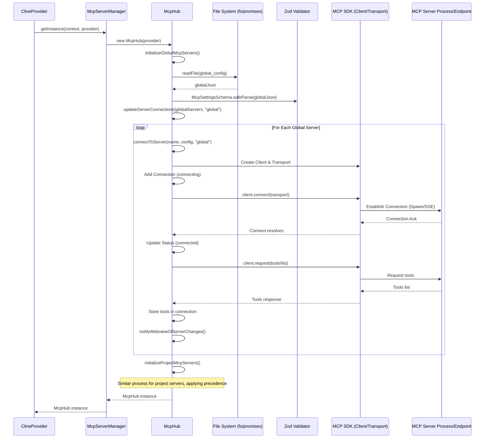

# Chapter 19: McpHub / McpServerManager

In [Chapter 18: Browser Interaction](18_browser_interaction.md), we saw how Roo-Code can interact with web pages using Puppeteer. While powerful, this is just one way to extend the AI's capabilities. Roo-Code also supports a more structured approach for integrating external tools and context sources through the **Model Context Protocol (MCP)**. This chapter dives into the core components responsible for managing connections to these MCP servers: the `McpHub` and the `McpServerManager`.

## Motivation: Managing External Tools and Context

The AI agent's built-in tools ([Chapter 8: Tools](08_tools.md)) cover common development tasks, but users might want to integrate specialized tools (e.g., interacting with a specific internal API, querying a vector database, controlling IoT devices) or provide custom, dynamic context (e.g., real-time project status, database schemas). MCP provides a standardized way for external processes (MCP servers) to expose these tools and resources.

However, managing these external servers presents challenges:
*   **Discovery:** How does Roo-Code find out which servers are available? They might be defined globally or per-project.
*   **Connection:** How does Roo-Code connect to different server types (local processes via stdio, remote services via SSE)?
*   **Lifecycle:** How are local servers started, stopped, or restarted if their configuration or implementation changes?
*   **Capability Exchange:** How does Roo-Code learn which tools and resources each server provides?
*   **Singleton Management:** If multiple Roo-Code UI instances (e.g., sidebar and editor tab) are open, how do we ensure connections aren't duplicated and state is consistent?

The `McpHub` and `McpServerManager` work together to address these challenges, providing a central point for discovering, connecting to, managing, and interacting with MCP servers.

**Central Use Case:** A user has a globally defined MCP server for checking weather (`weather-global`, defined in `settings/mcp_settings.json`) and another server defined only in their current project's `.roo/mcp.json` for analyzing code complexity (`project-analyzer`). Roo-Code needs to:
1.  Discover both `weather-global` and `project-analyzer`.
2.  Connect to both servers (perhaps `weather-global` is remote SSE, `project-analyzer` is local stdio).
3.  Learn that `weather-global` offers a `get_weather` tool and `project-analyzer` offers `analyze_complexity`.
4.  Expose these tools to the AI agent via the [Chapter 7: SystemPrompt](07_systemprompt.md).
5.  Allow the AI to use the `use_mcp_tool` to invoke `get_weather` or `analyze_complexity`, routing the call to the correct server.
6.  Ensure that even if the user opens Roo-Code in both the sidebar and an editor tab, only one set of connections to these servers is established and managed, coordinated by `McpServerManager`.

## Key Concepts

1.  **Model Context Protocol (MCP):** A specification defining how clients (like Roo-Code) and servers can communicate to exchange capabilities (tools, resources) and execute actions. Communication typically involves JSON-RPC-like messages over a transport layer (Stdio or SSE). Roo-Code uses the `@modelcontextprotocol/sdk` library.

2.  **MCP Servers:** External processes implementing the MCP specification. They can be:
    *   **Local (Stdio):** Started as a child process by Roo-Code (e.g., `node /path/to/server.js`), communicating via standard input/output. Defined by `command`, `args`, `env`, `cwd` in config.
    *   **Remote (SSE):** An existing HTTP service exposing an endpoint that uses Server-Sent Events for communication. Defined by `url`, `headers` in config.

3.  **Configuration Files:** Server definitions are stored in JSON files:
    *   **Global:** `[globalStorageUri]/settings/mcp_settings.json`. Managed via the global settings UI or direct editing.
    *   **Project:** `.roo/mcp.json` within the workspace root. Managed via project settings UI or direct editing. Defines project-specific servers.
    *   **Schema:** Both files adhere to `McpSettingsSchema` (defined in `McpHub.ts`), containing an `mcpServers` object mapping server names to their configurations (`ServerConfigSchema`).
    *   **Precedence:** Project configuration overrides global configuration for servers with the same name within that workspace.

4.  **`McpServerManager` (`src/services/mcp/McpServerManager.ts`):**
    *   **Singleton Pattern:** Ensures only one `McpHub` instance exists per VS Code window (across potentially multiple `ClineProvider` instances). It uses a static `instance` variable and an `initializationPromise` to manage this.
    *   **Provider Registry:** Keeps track of active `ClineProvider` instances (`providers: Set<ClineProvider>`) to notify them of changes.
    *   **Lifecycle:** Provides `getInstance` (called by `ClineProvider` constructor) and potentially `cleanup`.

5.  **`McpHub` (`src/services/mcp/McpHub.ts`):**
    *   **Core Service:** Managed by `McpServerManager`. Performs the main work.
    *   **Discovery (`initializeGlobal/ProjectMcpServers`):** Reads global and project config files using path helpers (`getMcpSettingsFilePath`, `getProjectMcpPath`).
    *   **Connection Management (`updateServerConnections`, `connectToServer`, `deleteConnection`):**
        *   Compares current connections with loaded configurations to add, remove, or update server connections.
        *   `connectToServer` instantiates the appropriate transport (`StdioClientTransport` or `SSEClientTransport`) and MCP `Client` from the SDK. It handles connection logic, error handling (`stderr`, `onerror`), and initial capability fetching (`fetchToolsList`, etc.).
    *   **Capability Storage:** Stores fetched tools (`McpTool`), resources (`McpResource`), and templates (`McpResourceTemplate`) within the `McpServer` object, which is part of the `McpConnection` array.
    *   **Interaction API:** Provides methods for use by `ClineProvider`/tools:
        *   `callTool(serverName, toolName, args)`: Sends a `tools/call` request to the specified server's client.
        *   `readResource(serverName, uri)`: Sends a `resources/read` request.
        *   `toggleToolAlwaysAllow(serverName, source, toolName, shouldAllow)`: Modifies the `alwaysAllow` list for a tool in the appropriate config file and updates the server state.
    *   **Lifecycle & Restart (`watch...`, `restartConnection`):** Uses `vscode.workspace.onDidSaveTextDocument` (and potentially `chokidar` for `watchPaths`) to monitor config files and specified server paths. On change, triggers `restartConnection` which disconnects and reconnects the affected server.
    *   **State Synchronization (`notifyWebviewOfServerChanges`):** After any change (connect, disconnect, capability fetch, restart), it calls `providerRef.deref()?.postMessageToWebview` to send the updated list of `McpServer` objects (including status, tools, etc.) to all registered `ClineProvider` instances, which then update the [Chapter 1: WebView UI](01_webview_ui.md) ([Chapter 38: MCP UI Components (WebView)](38_mcp_ui_components__webview_.md)).

6.  **Transport (`@modelcontextprotocol/sdk`):** The SDK provides `StdioClientTransport` (manages spawning and communicating with a local process) and `SSEClientTransport` (manages connecting to a remote SSE endpoint, using `ReconnectingEventSource`).

7.  **Tool Integration:** The built-in `use_mcp_tool` and `access_mcp_resource` tools ([Chapter 8: Tools](08_tools.md)) directly interact with `McpHub.callTool` and `McpHub.readResource` respectively, passing the server name, tool/resource name, and arguments provided by the AI.

## Using McpHub / McpServerManager (Use Case Walkthrough)

Let's trace the central use case involving `weather-global` (SSE) and `project-analyzer` (stdio).

1.  **Extension Activation:** Roo-Code activates.
2.  **`ClineProvider` Instantiation:** `new ClineProvider(context, ...)` is called (e.g., when sidebar view is resolved).
3.  **Manager Initialization:** `ClineProvider` constructor calls `await McpServerManager.getInstance(this.context, this)`.
4.  **`McpServerManager.getInstance`:**
    *   Adds the `provider` to the `providers` set.
    *   Sees `instance` is `null` and `initializationPromise` is `null`.
    *   Creates `initializationPromise`.
    *   Inside the promise: Creates `new McpHub(provider)` and assigns it to `McpServerManager.instance`.
    *   Returns the `instance`.
5.  **`McpHub` Constructor:**
    *   Stores `providerRef`.
    *   Calls `watchMcpSettingsFile`, `watchProjectMcpFile`. These setup listeners via `vscode.workspace.onDidSaveTextDocument`.
    *   Calls `initializeGlobalMcpServers()` and `initializeProjectMcpServers()`.
6.  **`initializeGlobalMcpServers`:**
    *   Calls `getMcpSettingsFilePath()` to get `.../settings/mcp_settings.json`.
    *   Reads and parses the file (assume it contains `weather-global`).
    *   Validates using `McpSettingsSchema`.
    *   Calls `await this.updateServerConnections({ "weather-global": { type: "sse", url: "...", ... } }, "global")`.
7.  **`initializeProjectMcpServers`:**
    *   Calls `getProjectMcpPath()` to get `.roo/mcp.json`.
    *   Reads and parses the file (assume it contains `project-analyzer`).
    *   Validates using `McpSettingsSchema`.
    *   Calls `await this.updateServerConnections({ "project-analyzer": { type: "stdio", command: "node", args: ["..."], ... } }, "project")`.
8.  **`updateServerConnections` (First call - Global):**
    *   Receives `{"weather-global": ...}`, `source: "global"`.
    *   Sees no existing connections.
    *   Validates `weather-global` config using `validateServerConfig`.
    *   Calls `await this.connectToServer("weather-global", validatedConfig, "global")`.
9.  **`updateServerConnections` (Second call - Project):**
    *   Receives `{"project-analyzer": ...}`, `source: "project"`.
    *   Sees existing `weather-global` connection (source="global").
    *   Validates `project-analyzer` config.
    *   Calls `await this.connectToServer("project-analyzer", validatedConfig, "project")`.
10. **`connectToServer("weather-global", ...)`:**
    *   Creates `Client` instance.
    *   Creates `transport = new SSEClientTransport(...)`. Sets up `onerror`.
    *   Creates `connection` object with `status: "connecting"`, `source: "global"`. Adds to `this.connections`.
    *   Calls `await client.connect(transport)`. Waits for SSE connection.
    *   Sets `status: "connected"`.
    *   Calls `fetchToolsList`, `fetchResourcesList`, etc. Populates `connection.server.tools`, etc.
    *   Calls `setupFileWatcher` (no-op for SSE).
    *   Calls `notifyWebviewOfServerChanges()`.
11. **`connectToServer("project-analyzer", ...)`:**
    *   Creates `Client` instance.
    *   Creates `transport = new StdioClientTransport(...)`. Sets up `onerror`, `onclose`, pipes `stderr`.
    *   Calls `await transport.start()` to spawn the `node` process.
    *   Creates `connection` object with `status: "connecting"`, `source: "project"`. Adds to `this.connections`.
    *   Calls `await client.connect(transport)`. Waits for handshake over stdio.
    *   Sets `status: "connected"`.
    *   Calls `fetchToolsList`, `fetchResourcesList`, etc.
    *   Calls `setupFileWatcher` (sets up watchers based on `watchPaths` or `build/index.js`).
    *   Calls `notifyWebviewOfServerChanges()`.
12. **`notifyWebviewOfServerChanges`:**
    *   Gets the sorted list of servers (project first, then global).
    *   Calls `provider.postMessageToWebview({ type: 'mcpServers', mcpServers: sortedList })`.
13. **UI Update:** The WebView receives the message via `ExtensionStateContext` and the [Chapter 38: MCP UI Components (WebView)](38_mcp_ui_components__webview_.md) display the two connected servers and their tools.
14. **AI Tool Call:** AI uses `<use_mcp_tool><server_name>project-analyzer</server_name><tool_name>analyze_complexity</tool_name>...</use_mcp_tool>`.
15. **Tool Execution (`useMcpToolTool`):**
    *   Calls `provider.getMcpHub()?.callTool('project-analyzer', 'analyze_complexity', args)`.
16. **`McpHub.callTool`:**
    *   Finds the `connection` for `project-analyzer` (prioritizing project source).
    *   Calls `connection.client.request({ method: 'tools/call', params: { name: 'analyze_complexity', arguments: args } }, CallToolResultSchema)`.
    *   The request is sent over stdio to the `project-analyzer` node process.
    *   The process executes the analysis and sends the result back over stdio.
    *   The SDK receives the response, validates it, and `request` promise resolves.
17. **Return Result:** `callTool` returns the result to `useMcpToolTool`, which formats it and pushes it back to the AI.

## Code Walkthrough

*(Code snippets provided in the prompt show key parts of `McpHub.ts`, `McpServerManager.ts`, `useMcpToolTool.ts`, `ClineProvider.ts` integration, and `mcp.ts` types. We will refer to these)*

### McpServerManager (`src/services/mcp/McpServerManager.ts`)

*   **`getInstance`:** The core static method. It uses a static `instance` variable and an `initializationPromise` to ensure only one `McpHub` is created and returned, even if called concurrently by multiple `ClineProvider` instances. It registers the calling `provider` in the `providers` set.
*   **`unregisterProvider`:** Removes a provider when its associated view is disposed.
*   **`notifyProviders`:** (Not explicitly shown but implied) Would iterate over the `providers` set and call `provider.postMessageToWebview` to broadcast updates. `McpHub` currently calls its single `providerRef` directly.
*   **`cleanup`:** Calls `dispose` on the singleton `McpHub` instance.

### McpHub (`src/services/mcp/McpHub.ts`)

*   **Constructor:** Takes the `ClineProvider` (for context and callbacks), sets up watchers (`watchMcpSettingsFile`, `watchProjectMcpFile`), and triggers initial server loading (`initializeGlobalMcpServers`, `initializeProjectMcpServers`).
*   **`initializeMcpServers` (private):** Reads the specified config file (global or project), parses/validates using `McpSettingsSchema.safeParse`, and calls `updateServerConnections`. Handles JSON/validation errors.
*   **`updateServerConnections` (private):** The core logic for synchronizing connections with a loaded configuration set. It compares existing connections (filtered by `source`) with the new server definitions (`newServers`) to identify servers to add, remove, or update based on config changes. Calls `deleteConnection` and `connectToServer`.
*   **`connectToServer` (private):**
    *   Creates the MCP `Client`.
    *   Instantiates the correct transport (`StdioClientTransport` or `SSEClientTransport`) based on `config.type`.
    *   Sets up transport-specific error/close handling (`onerror`, `onclose`, piping `stderr` for stdio). Critically pipes `stderr` to allow capturing startup or runtime errors from local servers.
    *   Adds the connection object (with `status: "connecting"`) to the `connections` array.
    *   Calls `client.connect(transport)`.
    *   On success, updates `status: "connected"` and fetches initial capabilities using `fetchToolsList`, `fetchResourcesList`, etc.
    *   Calls `setupFileWatcher` for stdio servers.
    *   Handles errors by setting status to `"disconnected"` and storing the error message.
*   **`deleteConnection`:** Closes the transport and client for a given server name/source and removes it from the `connections` array.
*   **`findConnection` (private):** Helper to retrieve a connection, prioritizing project-scoped servers over global ones if names collide and no specific `source` is given.
*   **`fetch...List` methods:** Use `connection.client.request` with the appropriate MCP method (`tools/list`, etc.) and result schema to get capabilities from a connected server. Includes error handling.
*   **`callTool` / `readResource`:** Public API methods used by tools. Find the correct connection, check if disabled, and call `connection.client.request` with appropriate parameters and timeout (read from config).
*   **`toggleToolAlwaysAllow`:** Reads the correct config file (global/project), modifies the `alwaysAllow` array for the specific server/tool, writes the file back, refetches the tools list for that server, and notifies the webview. Uses `updateServerConfig` helper.
*   **`updateServerConfig` (private):** Utility to read, modify, and write back a specific server's configuration within the larger settings JSON file.
*   **`watch...`/`handleConfigFileChange`/`restartConnection`:** Implement the file watching and automatic restart logic. `restartConnection` orchestrates `deleteConnection` followed by `connectToServer` based on the stored config.
*   **`notifyWebviewOfServerChanges`:** Sorts the current `connections` (project first) and sends the `McpServer[]` array to the provider(s) via `postMessageToWebview`.
*   **`dispose`:** Cleans up watchers and disconnects all servers.

### Tool Integration (`src/core/tools/useMcpToolTool.ts`)

*   **Parameter Parsing:** Extracts `server_name`, `tool_name`, `arguments` (as JSON string).
*   **Validation:** Checks for required parameters. Parses `arguments` JSON, handling errors.
*   **Approval:** Uses `askApproval` with type `use_mcp_server` and payload containing server/tool/args.
*   **Execution:** If approved, calls `cline.providerRef.deref()?.getMcpHub()?.callTool(server_name, tool_name, parsedArguments)`.
*   **Result Handling:** Formats the (potentially complex `McpToolCallResponse`) result into a string and pushes it using `pushToolResult`. Includes basic error indication.

## Internal Implementation

The system ensures a single point of management (`McpServerManager`) for a central hub (`McpHub`) that handles discovery, connection, lifecycle, and interaction for all defined MCP servers.

**Step-by-Step (Initialization and Discovery):**

1.  `ClineProvider` is created.
2.  It calls `McpServerManager.getInstance`.
3.  `McpServerManager` finds no instance, creates `new McpHub(provider)`. Assigns to static `instance`.
4.  `McpHub` constructor runs.
5.  `initializeGlobalMcpServers` is called.
    *   `getMcpSettingsFilePath` finds/creates `settings/mcp_settings.json`.
    *   `fs.readFile` reads the global config.
    *   `JSON.parse`, `McpSettingsSchema.safeParse` validate the content.
    *   `updateServerConnections(globalServers, "global")` is called.
6.  `updateServerConnections` iterates through global server definitions. For each:
    *   `validateServerConfig` checks the definition.
    *   `connectToServer(serverName, config, "global")` is called.
7.  `initializeProjectMcpServers` is called.
    *   `getProjectMcpPath` finds `.roo/mcp.json` (if exists).
    *   If found, `fs.readFile`, `JSON.parse`, `McpSettingsSchema.safeParse`.
    *   `updateServerConnections(projectServers, "project")` is called.
8.  `updateServerConnections` iterates through project server definitions. For each:
    *   Checks if a server with the same name already exists *from the project source*. If so, compares config.
    *   Checks if a server with the same name exists *from the global source*. If so, the project definition *overrides* it (the global one might be disconnected later if not present in the global file anymore, or simply ignored by `findConnection`'s precedence logic).
    *   `validateServerConfig` checks the definition.
    *   `connectToServer(serverName, config, "project")` is called.
9.  `connectToServer` (for each server):
    *   Creates SDK `Client` and `Transport` (Stdio or SSE).
    *   Handles transport-specific setup (spawning process, piping stderr for stdio; configuring EventSource for SSE).
    *   Adds connection to `this.connections` with `status: "connecting"`.
    *   Calls `client.connect(transport)`.
    *   On success: Sets `status: "connected"`, calls `fetchToolsList` etc.
    *   On error: Sets `status: "disconnected"`, stores error.
    *   Calls `setupFileWatcher` (for stdio).
    *   Calls `notifyWebviewOfServerChanges`.
10. **Completion:** `McpHub` is initialized with connections established (or in error state) for all valid servers found in global and project configs, respecting precedence. The UI is updated with the initial server list.

**Sequence Diagram (Initialization):**

## Modification Guidance

Modifications could involve changing configuration handling, adding transport types, or refining the restart logic.

**Common Modifications:**

1.  **Supporting a New Configuration Location (e.g., `.vscode/mcp.json`):**
    *   **Add Path Logic:** Create a `getVscodeMcpPath()` function similar to `getProjectMcpPath()`.
    *   **Update Discovery:** Modify `McpHub`'s initialization logic (e.g., create `initializeVscodeMcpServers`) to load from this new path.
    *   **Update Merging/Precedence:** Modify `updateServerConnections` or add logic to handle the new source ("vscode") and define its precedence relative to "global" and "project".
    *   **Update Watchers:** Add file watchers for the new location.
    *   **Update Save Logic:** Modify `updateServerConfig` and potentially UI-triggered saves to write to the correct file based on the server's `source`.

2.  **Changing the Restart Logic (e.g., Debounce Restarts):**
    *   **Modify Watcher Handlers:** Instead of directly calling `restartConnection` in the `onDidSaveTextDocument` or `chokidar` 'change' handlers, implement a debouncing mechanism. Store the server name/source to be restarted and use `setTimeout/clearTimeout` to delay the actual `restartConnection` call until a short period after the last save event. This prevents multiple rapid restarts if a file is saved quickly several times.
    *   **Update `restartConnection`:** Ensure it handles being called multiple times for the same server gracefully if debouncing isn't perfect.

3.  **Adding a Custom Transport Type (Advanced):**
    *   **SDK Level:** Implement a new class conforming to the MCP SDK's `Transport` interface, handling communication over the desired protocol (e.g., WebSockets).
    *   **`McpHub`:**
        *   Add a new `type` (e.g., `"websocket"`) to `ServerConfigSchema`.
        *   Modify `connectToServer` to check for the new type and instantiate your custom transport class.
        *   Update `validateServerConfig` and error messages.
    *   **Configuration:** Allow users to specify the new type and its required parameters (e.g., `websocketUrl`) in the JSON config.

**Best Practices:**

*   **Validation:** Strictly validate configuration files using Zod schemas (`McpSettingsSchema`, `ServerConfigSchema`) during loading (`loadModesFromFile`, `updateServerConnections`) and before saving (`updateServerConfig`). Provide clear error messages to the user via `vscode.window.showErrorMessage`.
*   **Error Handling:** Implement robust error handling for file I/O, JSON parsing, SDK connection (`client.connect`), and SDK requests (`client.request`). Update server status (`connecting`, `connected`, `disconnected`) and provide error details (`server.error`) for display in the UI.
*   **Resource Cleanup (`dispose`):** Ensure the `McpHub.dispose` method properly closes all transports, clients, and file watchers to prevent resource leaks. Use the `disposables` array for VS Code watchers.
*   **Asynchronicity:** Use `async/await` correctly for all file system and SDK operations. Use the write queue pattern (`queueWrite`, `processWriteQueue`) if directly modifying config files frequently from different asynchronous contexts.
*   **Singleton Management:** Ensure the `McpServerManager` correctly enforces the singleton pattern for `McpHub`.
*   **Precedence:** Clearly define and consistently implement the configuration precedence rules (e.g., project overrides global).

**Potential Pitfalls:**

*   **Configuration Errors:** Malformed JSON or invalid server configurations can prevent servers from loading or connecting. Good validation and error reporting are key.
*   **Connection Issues:** Network problems, incorrect URLs/headers (SSE), command/path errors, permission issues (Stdio), or server-side errors can cause connections to fail or drop. The hub needs to report these states clearly.
*   **Zombie Processes:** If `StdioClientTransport` doesn't properly terminate the child process when `close()` is called (or if `close` isn't called on disposal), local server processes might be left running.
*   **Watcher Reliability/Performance:** File watchers (`chokidar`, VS Code API) might miss events or trigger excessively, especially on certain platforms or with network drives. Frequent restarts triggered by watchers can be disruptive. Debouncing can help.
*   **Race Conditions:** Modifying config files or connection state concurrently without proper locking/serialization (like the simple write queue used) could lead to inconsistent states.
*   **SDK Errors:** Bugs or unexpected behavior in the underlying `@modelcontextprotocol/sdk` could cause issues.

## Conclusion

`McpHub` and `McpServerManager` provide the essential infrastructure for integrating Roo-Code with external tools and context providers via the Model Context Protocol. By handling server discovery from multiple configuration sources, managing connection lifecycles for different transport types (Stdio, SSE), fetching capabilities, providing an API for interaction, and ensuring singleton management across UI instances, they offer a robust and extensible framework. This allows Roo-Code's AI agent, through tools like `use_mcp_tool`, to leverage a potentially vast ecosystem of external capabilities defined by the user or the community.

Having explored how Roo-Code connects to external services, we return to a core UI feature related to code modification: displaying differences between code versions. The next chapter focuses on the [Chapter 20: DiffViewProvider](20_diffviewprovider.md).

