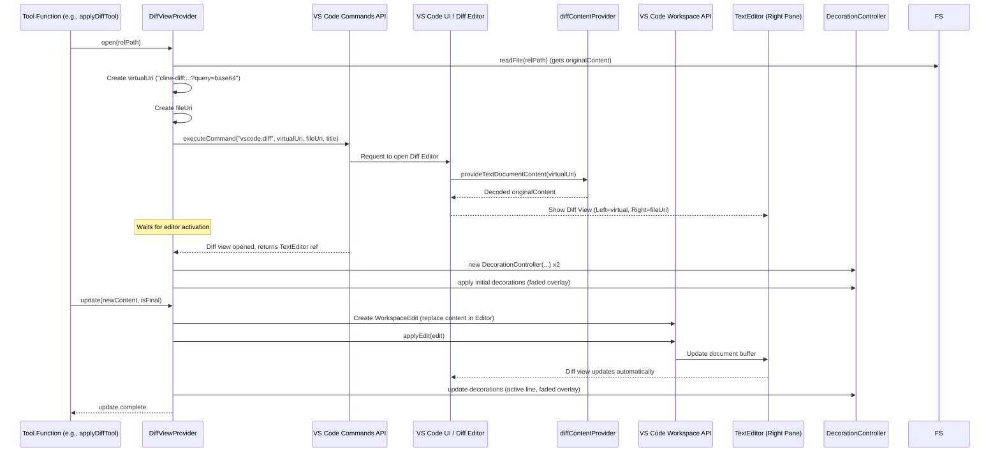

# Chapter 20: DiffViewProvider

Continuing from [Chapter 19: McpHub / McpServerManager](19_mcphub___mcpservermanager.md), where we explored how Roo-Code connects to external MCP servers, we now focus on a core interaction within the VS Code editor itself: presenting and managing code modifications suggested by the AI using the built-in diff editor. This chapter introduces the `DiffViewProvider`.

## Motivation: Safe and Interactive Code Modification

When the AI agent ([Chapter 4: Cline](04_cline.md)) suggests code changes, especially significant ones via tools like `apply_diff` or `write_to_file`, simply overwriting the user's file can be risky and lacks transparency. Users need a way to:

1.  **Review** the proposed changes clearly before they are permanently applied.
2.  **Compare** the suggested changes against the original file content.
3.  **Potentially edit** the suggested changes directly within the review interface.
4.  **Approve** the changes to save them to the file, or **reject** them to discard the suggestions.
5.  See the changes **stream in** as the AI generates them for large modifications.

VS Code's built-in diff editor provides an excellent foundation for this. The `DiffViewProvider` leverages this editor to create a controlled environment for reviewing and applying AI-generated code changes. It manages the lifecycle of the diff view, handles streaming updates, detects user edits made during the review, and orchestrates saving or reverting the changes based on user approval.

**Central Use Case:** The AI agent uses the `apply_diff` tool ([Chapter 8: Tools](08_tools.md)) to suggest refactoring a function in `utils.ts`.

1.  The `applyDiffTool` function calculates the proposed new content based on the original file content and the diff patch provided by the AI.
2.  It calls `diffViewProvider.open("utils.ts")`.
3.  `DiffViewProvider`:
    *   Reads the current content of `utils.ts` and stores it as `originalContent`.
    *   Creates a special virtual document URI (e.g., `cline-diff:utils.ts?BASE64_ENCODED_ORIGINAL_CONTENT`).
    *   Calls `vscode.commands.executeCommand("vscode.diff", virtualUri, fileUri, "utils.ts: Original ↔ Roo's Changes (Editable)")`.
    *   VS Code opens a diff editor tab. The left side shows the read-only content provided by the virtual document (served by the `TextDocumentContentProvider` registered for the `cline-diff` scheme). The right side shows the actual `utils.ts` file, which is editable.
4.  `applyDiffTool` then calls `diffViewProvider.update(proposedNewContent, true)` (assuming the content is generated fully).
5.  `DiffViewProvider`:
    *   Applies the `proposedNewContent` to the editable document on the right side of the diff editor.
    *   Uses `DecorationController` to visually indicate the changed lines and potentially highlight the streaming progress (if applicable).
    *   Scrolls to the first detected difference.
6.  The `applyDiffTool` calls `askApproval`. The user reviews the diff view. They might make small edits directly in the right-hand pane.
7.  User clicks "Approve".
8.  `askApproval` resolves successfully. `applyDiffTool` calls `diffViewProvider.saveChanges()`.
9.  `DiffViewProvider`:
    *   Saves the content of the right-hand document (which might include user edits) to `utils.ts`.
    *   Closes the diff editor tab.
    *   Compares the final saved content (`finalContent`) with the AI's originally proposed content (`newContent`). If different, it generates a patch representing the user's edits (`userEdits`).
    *   Returns `{ userEdits, finalContent }` to `applyDiffTool`.
10. `applyDiffTool` uses this information to provide appropriate feedback to the AI (e.g., "Changes applied, user made the following edits: ...").

## Key Concepts

1.  **VS Code Diff Editor (`vscode.diff`):** The core component used for display. The `DiffViewProvider` launches this editor by executing the `"vscode.diff"` command, providing URIs for the left (original) and right (modified) sides, and a title.

2.  **Virtual Document (`cline-diff` scheme):** To show the *original* content in a read-only manner on the left side of the diff view, `DiffViewProvider` creates a virtual document URI with a custom scheme (e.g., `cline-diff`). The original file content is base64 encoded and embedded in the URI's query parameter.

3.  **`TextDocumentContentProvider`:** A VS Code API implementation (registered in `src/extension.ts` for the `cline-diff` scheme) that provides the content for virtual documents. When VS Code needs the content for a `cline-diff:` URI, it calls this provider's `provideTextDocumentContent` method. The provider simply decodes the base64 content from the URI query and returns it. This makes the left side effectively read-only.

4.  **Editable Document (Right Side):** The right side of the diff view uses the URI of the *actual* workspace file (`vscode.Uri.file(...)`). This allows the user to directly edit the proposed changes in this pane.

5.  **Streaming Updates (`update` method):** When the AI generates content incrementally (especially for `write_to_file`), the tool function calls `diffViewProvider.update(chunk, isFinal)` repeatedly. This method applies the `accumulatedContent` to the editable document on the right side, providing a live preview as the AI writes.

6.  **Decorations (`DecorationController`):** To enhance the user experience during streaming updates, `DiffViewProvider` uses a `DecorationController` instance (defined in `src/integrations/editor/DecorationController.ts`). This controller applies visual decorations to the editor:
    *   `fadedOverlay`: Applied to lines *below* the currently streamed content, visually indicating they haven't been processed yet.
    *   `activeLine`: Highlights the line *currently being written to* or the last line written.
    *   These decorations are dynamically updated by the `update` method.

7.  **Save/Confirm (`saveChanges` method):** When the user approves the changes (via `askApproval`), this method is called. It saves the potentially edited content from the right-hand document to the actual file, closes the diff view, compares the final content with the AI's proposal to detect user edits, and returns the results. It also checks for new diagnostic errors introduced by the changes.

8.  **Revert/Cancel (`revertChanges` method):** If the user rejects the changes, this method is called. It discards the changes made in the right-hand editor pane. If the file was newly created (`editType: "create"`), it deletes the file and any parent directories created for it. If the file existed (`editType: "modify"`), it reverts the editor content back to the stored `originalContent` and saves it. It then closes the diff view.

9.  **State Management:** `DiffViewProvider` maintains internal state about the current operation: `isEditing`, `editType` (`create` or `modify`), `originalContent`, `relPath`, `activeDiffEditor`, etc. The `reset` method clears this state after an operation completes or is reverted.

## Using the DiffViewProvider

The `DiffViewProvider` is typically instantiated within `Cline` and used by tools like `applyDiffTool` and `writeToFileTool`.

**Simplified Flow in `applyDiffTool`:**

```typescript
// --- Conceptual code within applyDiffTool.ts ---
async function applyDiffTool(cline: Cline, block: ToolUse, askApproval: AskApproval, ...) {
    // ... extract relPath, diffContent ...
    // ... calculate proposedNewContent using cline.diffStrategy ...

    try {
        // 1. Open the Diff View
        cline.diffViewProvider.editType = fileExists ? "modify" : "create"; // Set based on file existence
        await cline.diffViewProvider.open(relPath);

        // 2. Apply the proposed content (potentially streaming)
        await cline.diffViewProvider.update(proposedNewContent, true); // true for final update
        await cline.diffViewProvider.scrollToFirstDiff();

        // 3. Ask for User Approval (pauses execution)
        const didApprove = await askApproval(/* ... details for UI ... */);

        if (!didApprove) {
            // 4a. User Rejected: Revert changes
            await cline.diffViewProvider.revertChanges();
            pushToolResult("User rejected the changes.");
            return;
        }

        // 4b. User Approved: Save changes
        const { newProblemsMessage, userEdits, finalContent } = await cline.diffViewProvider.saveChanges();

        // 5. Handle potential user edits and new problems
        if (userEdits) {
            // Inform AI about user edits
            pushToolResult(`Changes applied with user edits: ${userEdits}...`);
        } else {
            pushToolResult(`Changes applied successfully.${newProblemsMessage ?? ""}`);
        }

    } catch (error) {
        await handleError("applying diff", error);
        await cline.diffViewProvider.reset(); // Ensure reset on error
    } finally {
        // Optional: cline.diffViewProvider.reset(); // Might be redundant if save/revert handle it
    }
}
```

**Explanation:**

1.  The tool determines the `editType` and calls `open(relPath)`.
2.  It applies the AI's proposed content using `update()`. `scrollToFirstDiff` improves UX.
3.  It pauses execution using `askApproval`, allowing the user time to review the diff view.
4.  Based on user response (`didApprove`):
    *   If rejected, it calls `revertChanges()`.
    *   If approved, it calls `saveChanges()`.
5.  It uses the result from `saveChanges` (user edits, final content, new problems) to formulate the response pushed back to the AI.
6.  Error handling ensures `reset()` is called if something goes wrong.

## Code Walkthrough

### DiffViewProvider Class (`src/integrations/editor/DiffViewProvider.ts`)

```typescript
// --- File: src/integrations/editor/DiffViewProvider.ts ---
import * as vscode from "vscode";
import * as path from "path";
import * as fs from "fs/promises";
import { createDirectoriesForFile } from "../../utils/fs"; // Utility
import { arePathsEqual } from "../../utils/path"; // Utility
import { formatResponse } from "../../core/prompts/responses"; // For diff formatting
import { DecorationController } from "./DecorationController"; // Visual feedback
import * as diff from "diff"; // Library for calculating diffs
import { diagnosticsToProblemsString, getNewDiagnostics } from "../diagnostics"; // Check new errors
import stripBom from "strip-bom"; // Utility to remove Byte Order Marks

// Define the custom URI scheme used for the read-only left side
export const DIFF_VIEW_URI_SCHEME = "cline-diff";

export class DiffViewProvider {
	// State properties
	editType?: "create" | "modify"; // Is this a new file or editing existing?
	isEditing = false; // Is a diff view currently active?
	originalContent: string | undefined; // Content of the file before changes
	private createdDirs: string[] = []; // Dirs created for a new file (for cleanup on revert)
	private documentWasOpen = false; // Was the file already open in an editor tab?
	private originalViewColumn?: vscode.ViewColumn; // Original tab's view column
	private relPath?: string; // Relative path of the file being edited
	private newContent?: string; // The content proposed by the AI
	private activeDiffEditor?: vscode.TextEditor; // Reference to the active right-hand editor pane
	private fadedOverlayController?: DecorationController; // Manages "faded" decoration
	private activeLineController?: DecorationController; // Manages "active line" decoration
	private streamedLines: string[] = []; // Lines streamed so far (used by update)
	private preDiagnostics: [vscode.Uri, vscode.Diagnostic[]][] = []; // Diagnostics before edit

	constructor(private cwd: string) {} // Store workspace root

	/**
	 * Opens the VS Code diff editor for the specified file path.
	 * Reads original content, prepares URIs, executes vscode.diff command.
	 */
	async open(relPath: string): Promise<void> {
		this.relPath = relPath;
		const fileExists = this.editType === "modify";
		const absolutePath = path.resolve(this.cwd, relPath);
		this.isEditing = true;

		// Save if dirty (ensure we have clean original state)
		if (fileExists) { /* ... save logic ... */ }

		// Capture diagnostics before editing
		this.preDiagnostics = vscode.languages.getDiagnostics();

		// Read original content (or empty for new file)
		this.originalContent = fileExists ? await fs.readFile(absolutePath, "utf-8") : "";

		// Handle directory/file creation for new files
		if (!fileExists) {
			this.createdDirs = await createDirectoriesForFile(absolutePath);
			await fs.writeFile(absolutePath, ""); // Ensure file exists for diff editor
		}

		// Store state if the document was already open (to restore focus later)
		this.documentWasOpen = false;
		// ... logic to find existing tab and store originalViewColumn ...

		// Open the diff editor and store references
		this.activeDiffEditor = await this.openDiffEditor();
		this.fadedOverlayController = new DecorationController("fadedOverlay", this.activeDiffEditor);
		this.activeLineController = new DecorationController("activeLine", this.activeDiffEditor);

		// Apply initial decorations
		this.fadedOverlayController.addLines(0, this.activeDiffEditor.document.lineCount);
		this.scrollEditorToLine(0);
		this.streamedLines = [];
	}

	/**
	 * Updates the content of the editable (right-hand) pane of the diff editor.
	 * Handles streaming updates and manages decorations.
	 */
	async update(accumulatedContent: string, isFinal: boolean): Promise<void> {
		if (!this.relPath || !this.activeLineController || !this.fadedOverlayController) { /* error */ }
		this.newContent = accumulatedContent; // Store the AI's proposed content
		const diffEditor = this.activeDiffEditor;
		const document = diffEditor?.document;
		if (!diffEditor || !document) { /* error */ }

		// ... Move cursor to start ...

		const accumulatedLines = accumulatedContent.split("\n");
		if (!isFinal) accumulatedLines.pop(); // Remove partial last line if streaming

		const endLine = accumulatedLines.length;
		// Create a workspace edit to replace content up to the current stream position
		const edit = new vscode.WorkspaceEdit();
		const rangeToReplace = new vscode.Range(0, 0, endLine + 1, 0); // Range includes next line start
		const contentToReplace = accumulatedLines.slice(0, endLine + 1).join("\n") + "\n";
		edit.replace(document.uri, rangeToReplace, this.stripAllBOMs(contentToReplace));
		await vscode.workspace.applyEdit(edit);

		// Update decorations and scroll
		this.activeLineController.setActiveLine(endLine);
		this.fadedOverlayController.updateOverlayAfterLine(endLine, document.lineCount);
		this.scrollEditorToLine(endLine);

		this.streamedLines = accumulatedLines; // Track streamed lines

		if (isFinal) {
			// Handle final content application, including removing extra lines
			// and preserving trailing newline if original had one.
			// ... logic using WorkspaceEdit to set final content ...
			// Clear decorations
			this.fadedOverlayController.clear();
			this.activeLineController.clear();
		}
	}

	/**
	 * Saves the potentially user-edited content, closes the diff view,
	 * checks for new diagnostics, and detects user edits.
	 */
	async saveChanges(): Promise<{ newProblemsMessage: string | undefined; userEdits: string | undefined; finalContent: string | undefined }> {
		if (!this.relPath || !this.newContent || !this.activeDiffEditor) { /* return empty */ }

		const absolutePath = path.resolve(this.cwd, this.relPath);
		const updatedDocument = this.activeDiffEditor.document;
		const editedContent = updatedDocument.getText();
		if (updatedDocument.isDirty) { await updatedDocument.save(); } // Save the file

		await this.closeAllDiffViews(); // Close the diff editor

		// Restore focus if document was originally open
		if (this.documentWasOpen && this.originalViewColumn) { /* ... logic to focus editor ... */ }

		// Check for new diagnostic errors introduced by the edit
		const postDiagnostics = vscode.languages.getDiagnostics();
		const newProblems = await diagnosticsToProblemsString(
			getNewDiagnostics(this.preDiagnostics, postDiagnostics),
			[vscode.DiagnosticSeverity.Error], // Only report errors
			this.cwd,
		);
		const newProblemsMessage = newProblems.length > 0 ? `\n\nNew problems detected:\n${newProblems}` : "";

		// Compare final content with AI's proposal to detect user edits
		// Handle EOL normalization carefully before comparison
		const newContentEOL = /* detect EOL */;
		const normalizedEditedContent = /* normalize editedContent */;
		const normalizedNewContent = /* normalize this.newContent */;
		let userEdits: string | undefined;
		if (normalizedEditedContent !== normalizedNewContent) {
			// Generate diff patch representing user edits
			userEdits = formatResponse.createPrettyPatch(
				this.relPath.toPosix(),
				normalizedNewContent, // AI's proposal
				normalizedEditedContent, // Final saved content
			);
		}

		await this.reset(); // Clean up internal state
		return { newProblemsMessage, userEdits, finalContent: normalizedEditedContent };
	}

	/**
	 * Reverts changes made in the diff editor and closes it.
	 * Deletes newly created files/directories if applicable.
	 */
	async revertChanges(): Promise<void> {
		if (!this.relPath || !this.activeDiffEditor) { return; }

		const fileExists = this.editType === "modify";
		const absolutePath = path.resolve(this.cwd, this.relPath);

		if (!fileExists) {
			// New file: Close diff, delete file, remove created dirs
			if (this.activeDiffEditor.document.isDirty) { await this.activeDiffEditor.document.save(); }
			await this.closeAllDiffViews();
			try { await fs.unlink(absolutePath); } catch (e) { /* ignore */ }
			for (let i = this.createdDirs.length - 1; i >= 0; i--) {
				try { await fs.rmdir(this.createdDirs[i]); } catch (e) { /* ignore */ }
			}
		} else {
			// Existing file: Apply original content back to the editor and save
			const document = this.activeDiffEditor.document;
			const edit = new vscode.WorkspaceEdit();
			const fullRange = new vscode.Range(0, 0, document.lineCount, 0);
			edit.replace(document.uri, fullRange, this.originalContent ?? "");
			await vscode.workspace.applyEdit(edit);
			await document.save(); // Save the reverted content
			await this.closeAllDiffViews();
			// Restore focus if needed
			if (this.documentWasOpen && this.originalViewColumn) { /* ... logic ... */ }
		}
		await this.reset(); // Clean up internal state
	}

	/** Internal helper to launch the diff editor command */
	private async openDiffEditor(): Promise<vscode.TextEditor> {
		if (!this.relPath) { throw new Error("No file path set"); }

		// URI for the actual file (right side, editable)
		const fileUri = vscode.Uri.file(path.resolve(this.cwd, this.relPath));
		const fileName = path.basename(fileUri.fsPath);
		const fileExists = this.editType === "modify";

		// URI for the virtual document (left side, read-only)
		// Encode original content in the query parameter
		const virtualUri = vscode.Uri.parse(`${DIFF_VIEW_URI_SCHEME}:${fileName}`).with({
			query: Buffer.from(this.originalContent ?? "").toString("base64"),
		});

		// Title for the diff editor tab
		const title = `${fileName}: ${fileExists ? "Original ↔ Roo's Changes" : "New File"} (Editable)`;

		// Check if a relevant diff editor is already open (e.g., from interrupted session)
		// ... logic using vscode.window.tabGroups.all to find existing diff tab ...
		// If found, focus and return its editor; otherwise, open new one below.

		// Open the diff editor and wait for it to become active
		return new Promise<vscode.TextEditor>((resolve, reject) => {
			const disposable = vscode.window.onDidChangeActiveTextEditor((editor) => {
				// Resolve when the editor for the *modified* file becomes active
				if (editor && arePathsEqual(editor.document.uri.fsPath, fileUri.fsPath)) {
					disposable.dispose();
					resolve(editor);
				}
			});
			vscode.commands.executeCommand("vscode.diff", virtualUri, fileUri, title);
			// Timeout for safety
			setTimeout(() => { /* reject if timeout */ }, 10_000);
		});
	}

	/** Closes all currently open VS Code tabs showing Diff Views created by this provider */
	private async closeAllDiffViews() { /* ... iterates through tabs, closes ones with DIFF_VIEW_URI_SCHEME ... */ }
	/** Scrolls the active editor to reveal a specific line */
	private scrollEditorToLine(line: number) { /* ... uses activeDiffEditor.revealRange ... */ }
	/** Scrolls the editor to the first difference found */
	scrollToFirstDiff() { /* ... uses diff library and revealRange ... */ }
	/** Utility to remove Byte Order Marks (BOM) */
	private stripAllBOMs(input: string): string { /* ... uses strip-bom ... */ }
	/** Resets the internal state of the provider */
	async reset() { /* ... clears all state variables ... */ }
}
```

**Explanation:**

*   **State:** Manages state like `editType`, `originalContent`, `relPath`, `activeDiffEditor`.
*   **`open`:** The main entry point. Reads original content, prepares URIs (including the virtual `cline-diff:` URI with encoded content), calls `openDiffEditor` to launch the view, and initializes decoration controllers.
*   **`openDiffEditor`:** Constructs the virtual and file URIs, checks for existing relevant diff tabs, and uses `vscode.commands.executeCommand("vscode.diff", ...)` to show the editor. It includes logic to wait for the editor to become active.
*   **`update`:** Handles applying new content (full or partial) to the editable document using `vscode.WorkspaceEdit`. It updates decorations (`activeLine`, `fadedOverlay`) and scrolls the view. Crucially handles the final application of content, including removing extra lines and preserving trailing newlines.
*   **`saveChanges`:** Saves the modified document, closes the diff view, focuses the original tab if needed, checks for new diagnostic errors using `getNewDiagnostics`, compares final content with `this.newContent` to detect `userEdits`, resets state, and returns results.
*   **`revertChanges`:** Discards changes. For new files, it deletes the file and created directories. For existing files, it replaces the editor content with `originalContent` and saves. It closes the diff view, focuses the original tab if needed, and resets state.
*   **Helpers:** Includes methods for closing views, scrolling, and removing BOMs.

### DecorationController (`src/integrations/editor/DecorationController.ts`)

*   **Purpose:** Provides visual feedback during streaming `update` calls.
*   **`fadedOverlayDecorationType`/`activeLineDecorationType`:** Defines the styles for the decorations using `vscode.window.createTextEditorDecorationType`.
*   **`constructor`:** Takes the decoration type (`fadedOverlay` or `activeLine`) and the target `vscode.TextEditor`.
*   **`addLines`/`setActiveLine`/`updateOverlayAfterLine`:** Methods to calculate `vscode.Range` objects and apply them to the editor using `editor.setDecorations`.
*   **`clear`:** Removes all decorations of its type.

### Extension Activation (`src/extension.ts`)

```typescript
// --- File: src/extension.ts ---
// (Relevant excerpt)
import { DIFF_VIEW_URI_SCHEME } from "./integrations/editor/DiffViewProvider";

export async function activate(context: vscode.ExtensionContext) {
	// ... other activation code ...

	// Register the content provider for the 'cline-diff' scheme
	const diffContentProvider = new (class implements vscode.TextDocumentContentProvider {
		// This method provides the content for the virtual document (left side)
		provideTextDocumentContent(uri: vscode.Uri): string {
			// Decode the original content stored in the URI query
			return Buffer.from(uri.query, "base64").toString("utf-8");
		}
	})();

	context.subscriptions.push(
		vscode.workspace.registerTextDocumentContentProvider(DIFF_VIEW_URI_SCHEME, diffContentProvider),
	);

	// ... rest of activation ...
}
```

**Explanation:**

*   A simple anonymous class implementing `vscode.TextDocumentContentProvider` is created.
*   Its `provideTextDocumentContent` method extracts the base64 encoded original content from the `uri.query` and decodes it.
*   `vscode.workspace.registerTextDocumentContentProvider` links the `DIFF_VIEW_URI_SCHEME` ("cline-diff") to this provider instance. Now, whenever VS Code tries to open a URI starting with `cline-diff:`, it will ask this provider for the document content.

## Internal Implementation

The `DiffViewProvider` orchestrates VS Code's built-in features: the diff command, virtual documents, text editors, and workspace edits.

**Step-by-Step (`open` and `update`):**

1.  **Tool calls `open(relPath)`:** `DiffViewProvider` stores `relPath`, reads `originalContent` from disk.
2.  **Virtual URI Creation:** It creates `virtualUri = vscode.Uri.parse("cline-diff:filename?BASE64_CONTENT")`.
3.  **File URI Creation:** It creates `fileUri = vscode.Uri.file("/path/to/workspace/file")`.
4.  **Diff Command:** It calls `vscode.commands.executeCommand("vscode.diff", virtualUri, fileUri, title)`.
5.  **VS Code Action:**
    *   VS Code receives the command.
    *   It needs content for `virtualUri`. It looks up the registered provider for the `cline-diff` scheme (our `diffContentProvider`).
    *   It calls `diffContentProvider.provideTextDocumentContent(virtualUri)`.
    *   The provider decodes the content from `virtualUri.query` and returns it.
    *   VS Code opens a diff editor tab, displaying the decoded content (read-only) on the left and the actual workspace file (`fileUri`) on the right (editable).
6.  **Editor Activation:** The `onDidChangeActiveTextEditor` listener resolves, and `openDiffEditor` returns the `TextEditor` instance for the right-hand pane (`activeDiffEditor`).
7.  **Decorations:** `DecorationController` instances are created and initial decorations (faded overlay) are applied using `activeDiffEditor.setDecorations`.
8.  **Tool calls `update(content, isFinal)`:**
9.  **Apply Edit:** `DiffViewProvider.update` creates a `vscode.WorkspaceEdit`, uses `edit.replace` to set the new content in the `activeDiffEditor.document`, and calls `vscode.workspace.applyEdit(edit)`.
10. **VS Code Action:** VS Code updates the content of the document buffer associated with the right-hand pane. The diff view automatically updates to show the differences.
11. **Update Decorations:** `update` calls `activeLineController.setActiveLine` and `fadedOverlayController.updateOverlayAfterLine` to adjust visual feedback.

**Sequence Diagram (`open` and `update`):**



## Modification Guidance

Modifications might involve changing the diff presentation, the streaming feedback, or how user edits are handled.

**Common Modifications:**

1.  **Changing Decoration Styles:**
    *   **Locate:** Edit the `fadedOverlayDecorationType` and `activeLineDecorationType` definitions in `src/integrations/editor/DecorationController.ts`.
    *   **Modify:** Change `backgroundColor`, `opacity`, `border`, or other `DecorationRenderOptions` properties according to VS Code API documentation.
    *   **Test:** Observe the visual changes in the diff view during streaming updates.

2.  **Adjusting Streaming Feedback (e.g., Different Scroll Behavior):**
    *   **Locate:** Modify the `scrollEditorToLine` method or where it's called within `DiffViewProvider.update`.
    *   **Modify:** Change the `TextEditorRevealType` (e.g., `AtTop`, `Default`) or adjust the line number calculation (e.g., scroll less frequently).
    *   **Test:** Observe how the editor scrolls during streaming edits.

3.  **Modifying User Edit Detection/Handling:**
    *   **Locate:** Edit the logic within `DiffViewProvider.saveChanges` where `editedContent` is compared to `this.newContent`.
    *   **Modify:**
        *   Change the EOL normalization logic.
        *   Change how the `userEdits` diff patch is generated using the `diff` library (e.g., different diff options).
        *   Adjust the conditions under which `userEdits` are considered significant.
    *   **Tool Update:** Modify the tool function (`applyDiffTool`, `writeToFileTool`) to interpret or use the `userEdits` information differently when constructing the response to the AI.

**Best Practices:**

*   **Use `WorkspaceEdit`:** Prefer `vscode.WorkspaceEdit` for applying changes to the document buffer during `update`, as it's generally more efficient and robust than manual text insertion/deletion.
*   **Handle `isDirty`:** Before reading `originalContent` or saving final changes, check if the document is dirty and save it if necessary to avoid conflicts or data loss.
*   **EOL Normalization:** Be explicit about handling End-Of-Line character differences (CRLF vs. LF) when comparing content, especially for user edit detection.
*   **Error Handling:** Wrap file system operations (`readFile`, `writeFile`, `unlink`, `rmdir`) and VS Code API calls (`applyEdit`, `save`) in `try...catch` blocks within the provider. Ensure `reset()` is called in `finally` blocks or catch blocks where appropriate to clean up state.
*   **Resource Cleanup:** Ensure `closeAllDiffViews` is called reliably in `saveChanges` and `revertChanges` to avoid leaving unwanted diff tabs open. Ensure `reset()` clears all relevant state.

**Potential Pitfalls:**

*   **Virtual Document Errors:** If the `TextDocumentContentProvider` fails (e.g., error during base64 decoding), the left side of the diff view won't load correctly.
*   **`vscode.diff` Failures:** The command might fail if URIs are invalid or if VS Code encounters internal errors.
*   **Concurrency Issues:** If the user manually edits and saves the file *outside* the diff view while the provider is active, the `originalContent` might become stale, leading to incorrect diffs or revert actions. The initial save helps, but concurrent external edits are hard to prevent completely.
*   **Decoration Performance:** Applying many complex decorations very frequently during rapid streaming *might* impact editor performance, although the current approach (whole line background) is generally efficient.
*   **Large Files/Diffs:** Opening diffs for very large files or applying huge diffs might be slow or consume significant memory. VS Code's diff algorithm is optimized, but limits exist.

## Conclusion

The `DiffViewProvider` is a crucial component for facilitating safe and interactive code modifications suggested by Roo-Code's AI agent. By integrating tightly with VS Code's built-in diff editor, virtual document system, and workspace APIs, it provides a familiar and effective user experience for reviewing, editing, approving, or rejecting changes. The use of decorations enhances feedback during streaming edits, and careful state management ensures reliable operation through the open, update, save/revert lifecycle.

Having seen how code changes are presented, we next need to understand how Roo-Code decides *which* files should not be touched or considered by the AI in the first place. The next chapter introduces the [Chapter 21: RooIgnoreController](21_rooignorecontroller.md).

