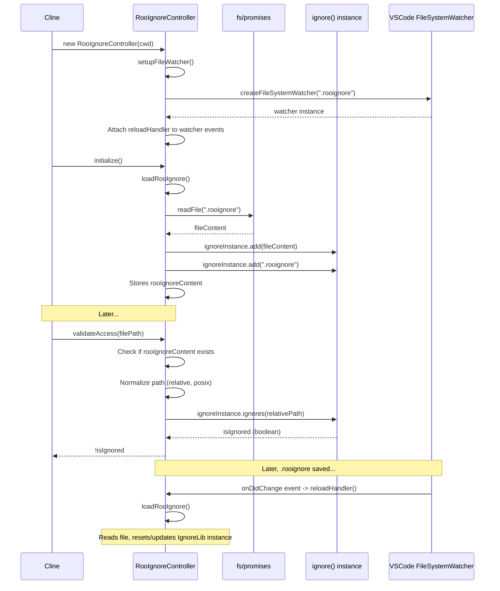

# Chapter 21: RooIgnoreController

In [Chapter 20: DiffViewProvider](20_diffviewprovider.md), we saw how Roo-Code presents file changes suggested by the AI in a safe, reviewable manner using VS Code's diff editor. However, before the AI even suggests reading or modifying files, Roo-Code needs a mechanism to prevent it from accessing files that the user explicitly wants to keep private or hidden. This chapter introduces the `RooIgnoreController`, which manages file access restrictions based on patterns similar to `.gitignore`.

## Motivation: Protecting Sensitive Files and Reducing Noise

Workspaces often contain files that should not be accessed or modified by an AI assistant. These might include:
*   Sensitive files: `.env` files with API keys, configuration files with secrets.
*   Build artifacts: `node_modules`, `dist`, `build` directories, compiled binaries.
*   Version control directories: `.git`, `.svn`.
*   Temporary or cache files.
*   Large binary or media files irrelevant to coding tasks.

Allowing the AI unrestricted access could lead to exposing sensitive information in prompts, generating incorrect code based on build artifacts, or simply overwhelming the AI (and the user) with irrelevant file context. We need a familiar and flexible way for users to define which files Roo-Code should ignore.

The `RooIgnoreController` implements this by respecting patterns defined in a `.rooignore` file located in the workspace root. This file uses the standard `.gitignore` syntax, making it intuitive for developers. The controller provides methods to check if a specific file path should be ignored, filter lists of file paths, validate commands that might access files, and inform the AI about these restrictions.

**Central Use Case:** A user has a `.rooignore` file containing `node_modules/` and `.env`. The user asks Roo-Code: "Read the contents of the `.env` file and the `src/config.ts` file."
1.  The AI generates a response requesting two tool calls: `<read_file><path>.env</path></read_file>` and `<read_file><path>src/config.ts</path></read_file>`.
2.  When Roo-Code processes the first tool request (`read_file` for `.env`), the `readFileTool` ([Chapter 8: Tools](08_tools.md)) calls `cline.rooIgnoreController.validateAccess(".env")`.
3.  `RooIgnoreController.validateAccess` checks the relative path `.env` against the patterns loaded from `.rooignore` using the `ignore` library. It finds a match.
4.  `validateAccess` returns `false`.
5.  `readFileTool` detects the access denial, skips reading the file, and pushes an error result back to the AI (e.g., `<error>Access to file .env is restricted by .rooignore</error>`).
6.  When Roo-Code processes the second tool request (`read_file` for `src/config.ts`), `validateAccess("src/config.ts")` is called.
7.  This path doesn't match any patterns in `.rooignore`, so `validateAccess` returns `true`.
8.  `readFileTool` proceeds with asking for user approval and reading the file content.
9.  The AI receives the error for `.env` and the content for `src/config.ts`, understanding why it couldn't access the first file.

## Key Concepts

1.  **`.rooignore` File:** A file named `.rooignore` placed in the root directory of the VS Code workspace. It contains patterns specifying files and directories that Roo-Code should ignore. Its syntax is identical to `.gitignore`.
2.  **`ignore` Library:** An npm library used internally by `RooIgnoreController` to parse the `.rooignore` file content and efficiently match file paths against the specified patterns.
3.  **Initialization (`initialize`, `loadRooIgnore`):** When `RooIgnoreController` is instantiated (typically within `Cline`), its `initialize` method asynchronously calls `loadRooIgnore`. This reads the `.rooignore` file content, parses it using `ignore()`, and stores the compiled ignore rules internally (`ignoreInstance`). If the file doesn't exist, no rules are applied. It also automatically adds `.rooignore` itself to the ignore list.
4.  **File Watching:** The controller uses `vscode.workspace.createFileSystemWatcher` to monitor the `.rooignore` file. If the file is created, deleted, or changed, `loadRooIgnore` is called again automatically to update the ruleset in memory.
5.  **`validateAccess(filePath)`:** The primary method for checking access. It takes a file path (relative to the workspace root), normalizes it (using `path.relative` and converting to POSIX separators `/`), and uses `ignoreInstance.ignores(relativePath)` to check if it matches any ignore pattern. Returns `true` if accessible, `false` if ignored. Paths outside the workspace (`cwd`) are currently considered accessible by this validation step itself, though other security checks might apply elsewhere.
6.  **`filterPaths(paths)`:** Takes an array of file paths (relative to `cwd`) and returns a new array containing only the paths for which `validateAccess` returns `true`. Useful for filtering lists generated by `listFilesTool` or other file discovery mechanisms before presenting them to the AI or user.
7.  **`validateCommand(command)`:** Attempts to parse a shell command string. If it recognizes a command known to read files (like `cat`, `grep`, `Get-Content`, `Select-String`), it checks the command's arguments. If any argument looks like a file path and `validateAccess` returns `false` for that path, `validateCommand` returns the denied path string. Otherwise, it returns `undefined` (command allowed). This provides a layer of protection for the `execute_command` tool.
8.  **`getInstructions()`:** Generates a formatted string containing the content of the `.rooignore` file, intended to be included in the [Chapter 7: SystemPrompt](07_systemprompt.md). This informs the AI *why* certain files might be inaccessible and discourages it from repeatedly trying to access them. Includes a lock symbol (`LOCK_TEXT_SYMBOL`) hint used by `listFilesTool` formatting.

## Using the RooIgnoreController

The `RooIgnoreController` is instantiated once per [Chapter 4: Cline](04_cline.md) instance and passed to relevant services or used directly within tool functions.

**Usage Scenario 1: File Reading (`readFileTool`)**

```typescript
// --- Conceptual code within readFileTool.ts ---
async function readFileTool(cline: Cline, block: ToolUse, askApproval: AskApproval, ..., pushToolResult: PushToolResult, ...) {
    const relPath: string | undefined = block.params.path;
    // ... (handle partial, missing path) ...

    // *** Check access using RooIgnoreController ***
    const accessAllowed = cline.rooIgnoreController?.validateAccess(relPath);

    if (!accessAllowed) {
        // Inform user and AI about the restriction
        await cline.say("rooignore_error", relPath);
        const errorMsg = formatResponse.rooIgnoreError(relPath); // Standard error format
        pushToolResult(`<file><path>${relPath}</path><error>${errorMsg}</error></file>`);
        return; // Stop execution
    }

    // ... (Proceed with askApproval, reading file, etc.) ...
    const absolutePath = path.resolve(cline.cwd, relPath);
    const didApprove = await askApproval(/* ... */);
    if (!didApprove) { /* return */ }
    const content = await extractTextFromFile(absolutePath);
    // ... (format and push result) ...
}
```
**Explanation:** Before attempting to read the file or even ask for approval, the tool calls `cline.rooIgnoreController.validateAccess()`. If it returns `false`, the tool immediately stops, informs the user via `say`, and sends a standardized error message back to the AI via `pushToolResult`.

**Usage Scenario 2: File Listing (`listFilesTool`)**

```typescript
// --- Conceptual code within listFilesTool.ts ---
async function listFilesTool(cline: Cline, block: ToolUse, askApproval: AskApproval, ..., pushToolResult: PushToolResult, ...) {
    // ... (extract path, recursive flag) ...
    // ... (ask approval) ...
    if (!didApprove) { /* return */ }

    // Call service to get file list (e.g., using glob)
    const [allFiles, didHitLimit] = await listFiles(absolutePath, recursive, limit);

    // *** Filter results using RooIgnoreController (implicitly via formatFilesList) ***
    // formatFilesList takes the controller and uses it to mark ignored files
    const result = formatResponse.formatFilesList(
        absolutePath,
        allFiles,
        didHitLimit,
        cline.rooIgnoreController, // Pass controller here
        showRooIgnoredFiles // Setting whether to show ignored files (with lock icon)
    );

    pushToolResult(result);
}

// --- Conceptual code within formatFilesList (in formatResponse) ---
function formatFilesList(basePath, files, limitReached, rooIgnoreController, showIgnored) {
    let output = "";
    files.forEach(file => {
        const relPath = path.relative(basePath, file);
        const isIgnored = rooIgnoreController && !rooIgnoreController.validateAccess(relPath);
        if (isIgnored && !showIgnored) {
             return; // Skip ignored file entirely
        }
        const prefix = isIgnored ? `${LOCK_TEXT_SYMBOL} ` : ""; // Add lock icon if ignored
        output += `${prefix}${relPath.toPosix()}\n`;
    });
    // ... add limit message ...
    return output;
}
```
**Explanation:** After getting the initial list of files, the `listFilesTool` calls `formatResponse.formatFilesList`, passing the `rooIgnoreController`. The formatting function then uses `validateAccess` for each file to decide whether to skip it or prepend the lock symbol (`🔒`), depending on the `showRooIgnoredFiles` setting.

**Usage Scenario 3: Command Execution (`executeCommandTool`)**

```typescript
// --- Conceptual code within executeCommandTool.ts ---
async function executeCommandTool(cline: Cline, block: ToolUse, askApproval: AskApproval, ..., pushToolResult: PushToolResult, ...) {
    const command: string | undefined = block.params.command;
    // ... (handle partial, missing command) ...

    // *** Validate command using RooIgnoreController ***
    const deniedPath = cline.rooIgnoreController?.validateCommand(command);
    if (deniedPath) {
        // Command attempts to access an ignored file
        const errorMsg = formatResponse.rooIgnoreCommandError(deniedPath);
        await cline.say("rooignore_error", deniedPath);
        pushToolResult(formatResponse.toolError(errorMsg));
        return; // Stop execution
    }

    // ... (Proceed with askApproval, running command via TerminalRegistry, etc.) ...
}
```
**Explanation:** Before running the command, the tool calls `cline.rooIgnoreController.validateCommand()`. If this returns a file path (meaning the command likely accesses an ignored file), the tool stops and reports the error.

**Usage Scenario 4: System Prompt (`SYSTEM_PROMPT`)**

```typescript
// --- Conceptual code within system.ts ---
export const SYSTEM_PROMPT = async (
    // ... other params ...
    rooIgnoreInstructions?: string,
) => {
    // ... generate other sections ...

    const customInstructionsSection = await addCustomInstructions(
        // ... other instructions ...
        { rooIgnoreInstructions } // Pass instructions here
    );

    const basePrompt = `
        ${roleDefinition}
        ${toolDescriptionsSection}
        ${rulesSection}
        ${customInstructionsSection} // Includes .rooignore content
    `;
    return basePrompt;
}

// --- Conceptual code within addCustomInstructions ---
async function addCustomInstructions(
    // ... other instructions ...
    options: { rooIgnoreInstructions?: string } = {},
) {
    // ... load other rules ...
    if (options.rooIgnoreInstructions) {
        rules.push(options.rooIgnoreInstructions); // Append the formatted ignore rules
    }
    // ... format and return combined instructions ...
}
```
**Explanation:** The main `SYSTEM_PROMPT` function receives the formatted `.rooignore` instructions (generated by `RooIgnoreController.getInstructions()`) and passes them to `addCustomInstructions`. This function appends the ignore instructions under a specific header, making the AI aware of the restrictions.

## Code Walkthrough

### RooIgnoreController Class (`src/core/ignore/RooIgnoreController.ts`)

```typescript
// --- File: src/core/ignore/RooIgnoreController.ts ---
import path from "path";
import { fileExistsAtPath } from "../../utils/fs";
import fs from "fs/promises";
import ignore, { Ignore } from "ignore"; // Import the 'ignore' library
import * as vscode from "vscode";

// Unicode character for the lock symbol
export const LOCK_TEXT_SYMBOL = "\u{1F512}";

/**
 * Controls LLM access to files by enforcing ignore patterns from .rooignore.
 */
export class RooIgnoreController {
	private cwd: string; // Workspace root directory
	private ignoreInstance: Ignore; // Instance of the 'ignore' library matcher
	private disposables: vscode.Disposable[] = []; // For managing VS Code watchers
	rooIgnoreContent: string | undefined; // Raw content of .rooignore (for instructions)

	constructor(cwd: string) {
		this.cwd = cwd;
		this.ignoreInstance = ignore(); // Initialize with an empty ignore instance
		this.rooIgnoreContent = undefined;
		// Setup file watcher in the constructor (async initialize called separately)
		this.setupFileWatcher();
	}

	/** Initialize by loading patterns. Call after construction. */
	async initialize(): Promise<void> {
		await this.loadRooIgnore();
	}

	/** Set up VS Code file watcher for .rooignore changes */
	private setupFileWatcher(): void {
		// Define pattern relative to the workspace root
		const rooignorePattern = new vscode.RelativePattern(this.cwd, ".rooignore");
		const fileWatcher = vscode.workspace.createFileSystemWatcher(rooignorePattern);

		// Handler function to reload ignore rules on change/create/delete
		const reloadHandler = () => {
			console.log(".rooignore file changed, reloading rules.");
			this.loadRooIgnore().catch(err => console.error("Error reloading .rooignore:", err));
		};

		// Register listeners and store disposables
		this.disposables.push(fileWatcher.onDidChange(reloadHandler));
		this.disposables.push(fileWatcher.onDidCreate(reloadHandler));
		this.disposables.push(fileWatcher.onDidDelete(reloadHandler));
		this.disposables.push(fileWatcher); // Also dispose the watcher itself
	}

	/** Load patterns from .rooignore if it exists */
	private async loadRooIgnore(): Promise<void> {
		try {
			this.ignoreInstance = ignore(); // Reset instance on each load
			const ignorePath = path.join(this.cwd, ".rooignore");

			if (await fileExistsAtPath(ignorePath)) {
				const content = await fs.readFile(ignorePath, "utf8");
				this.rooIgnoreContent = content; // Store raw content
				if (content.trim()) { // Only add if content is not empty
					this.ignoreInstance.add(content); // Add patterns to ignore instance
				}
				this.ignoreInstance.add(".rooignore"); // Always ignore the ignore file itself
				console.log("Loaded .rooignore patterns.");
			} else {
				this.rooIgnoreContent = undefined; // File doesn't exist
				console.log(".rooignore file not found.");
			}
		} catch (error) {
			console.error("Error loading .rooignore:", error);
			this.rooIgnoreContent = undefined; // Ensure content is undefined on error
		}
	}

	/** Check if a file path should be accessible (not ignored) */
	validateAccess(filePath: string): boolean {
		// If no .rooignore content loaded, allow everything
		if (!this.rooIgnoreContent) {
			return true;
		}
		try {
			// Normalize path: make relative to cwd, use forward slashes
			const absolutePath = path.resolve(this.cwd, filePath);
			// Check if path is outside cwd - allow if so (ignore only applies within cwd)
			if (!absolutePath.startsWith(this.cwd + path.sep) && absolutePath !== this.cwd) {
				return true;
			}
			const relativePath = path.relative(this.cwd, absolutePath).replace(/\\/g, "/"); // POSIX separators

            // Handle empty string relative path (means cwd itself, usually allowed)
            if (relativePath === "") return true;

			// Use the 'ignore' library to check against loaded patterns
			const isIgnored = this.ignoreInstance.ignores(relativePath);
			// console.log(`Validate Access: ${relativePath} -> Ignored: ${isIgnored}`); // Debug logging
			return !isIgnored; // Return true if NOT ignored
		} catch (error) {
			// Errors might occur if path.relative fails (e.g., path outside cwd structure)
			// console.error(`Error validating access for ${filePath}:`, error);
			// Default to allowing access if validation fails unexpectedly, could reconsider for stricter security
			return true;
		}
	}

	/** Check if a command attempts to access ignored files */
	validateCommand(command: string): string | undefined {
		if (!this.rooIgnoreContent) { return undefined; } // No rules, allow all

		const parts = command.trim().split(/\s+/);
		if (parts.length < 2) return undefined; // Need command + potential path

		const baseCommand = path.basename(parts[0]).toLowerCase().replace(/\.exe$/, ""); // Normalize command name

		// List of commands known to typically read file content as arguments
		const fileReadingCommands = [
			"cat", "less", "more", "head", "tail", "grep", "rg", "awk", "sed",
			"get-content", "gc", "type", "select-string", "sls",
			// Add other relevant commands if needed (e.g., specific build tools, linters)
		];

		if (fileReadingCommands.includes(baseCommand)) {
			// Iterate through arguments, skipping flags/options
			for (let i = 1; i < parts.length; i++) {
				const arg = parts[i];
				// Basic check to skip flags (might need refinement for complex cases)
				if (arg.startsWith("-") || arg.startsWith("/")) continue;
				// Skip PowerShell parameter syntax (e.g., -Path:, /Path:)
				if (i > 0 && parts[i-1].match(/^[-/]\w+:?$/)) continue;
				// Check if the argument is potentially a file path and if it's ignored
				// This is a heuristic - complex commands might obscure file paths
				try {
					// Attempt to validate access - assumes arg is a path relative to cwd
					if (!this.validateAccess(arg)) {
						return arg; // Return the ignored path if found
					}
				} catch (e) { /* Ignore errors from validateAccess (e.g., invalid path chars) */ }
			}
		}
		// If no ignored path found in arguments of known commands
		return undefined; // Command seems okay
	}

	/** Filter an array of paths, returning only accessible ones */
	filterPaths(paths: string[]): string[] {
		try {
			// Map, validate, filter, then extract path
			return paths
				.map((p) => ({ path: p, allowed: this.validateAccess(p) }))
				.filter((result) => result.allowed)
				.map((result) => result.path);
		} catch (error) {
			console.error("Error filtering paths:", error);
			return []; // Return empty list on error
		}
	}

	/** Clean up watchers when the controller is no longer needed */
	dispose(): void {
		console.log("Disposing RooIgnoreController watchers.");
		this.disposables.forEach((d) => d.dispose());
		this.disposables = [];
	}

	/** Get formatted instructions about .rooignore for the System Prompt */
	getInstructions(): string | undefined {
		if (!this.rooIgnoreContent) { return undefined; } // No file, no instructions

		// Format the raw content within a specific structure for the AI
		return `# .rooignore\n\n(The following is provided by a root-level .rooignore file where the user has specified files and directories that should not be accessed. When using list_files, you'll notice a ${LOCK_TEXT_SYMBOL} next to files that are blocked. Attempting to access the file's contents e.g. through read_file will result in an error.)\n\n${this.rooIgnoreContent.trim()}\n.rooignore`;
	}
}
```

**Explanation:**

*   **Constructor/Initialize:** Stores `cwd`, initializes `ignore()`, and sets up the file watcher via `setupFileWatcher`. `initialize()` triggers the first `loadRooIgnore`.
*   **`setupFileWatcher`:** Creates a `vscode.workspace.createFileSystemWatcher` specifically for the `.rooignore` file in the `cwd`. It registers handlers for change, create, and delete events, all of which call `loadRooIgnore`. Disposables are stored for cleanup.
*   **`loadRooIgnore`:** Resets the `ignoreInstance`. Reads the `.rooignore` file content asynchronously. If the file exists and has content, it adds the content to the `ignoreInstance` and stores the raw content in `rooIgnoreContent`. It always adds `.rooignore` itself to prevent modification. Handles file-not-found and read errors gracefully.
*   **`validateAccess`:** The core checking logic. It returns `true` immediately if no `.rooignore` was loaded. Otherwise, it normalizes the input `filePath` to be relative to `cwd` with forward slashes, handles the edge case of the `cwd` itself (empty relative path), allows paths outside the `cwd`, and then uses `!this.ignoreInstance.ignores(relativePath)` to determine accessibility.
*   **`validateCommand`:** Implements a heuristic check. It identifies known file-reading commands and iterates through their arguments, attempting to apply `validateAccess` to arguments that don't look like flags. Returns the first ignored path found, or `undefined`.
*   **`filterPaths`:** A straightforward application of `validateAccess` to an array using `map`, `filter`, and `map`.
*   **`dispose`:** Cleans up the VS Code file watchers stored in `disposables`.
*   **`getInstructions`:** Returns the formatted string containing the raw `.rooignore` content, wrapped with explanatory comments for the System Prompt, or `undefined` if no `.rooignore` was loaded.

## Internal Implementation

The controller relies on the `ignore` library for pattern matching and VS Code's API for file watching.

**Step-by-Step (`validateAccess`):**

1.  `validateAccess(filePath)` is called.
2.  Check if `this.rooIgnoreContent` is defined. If not, return `true`.
3.  Resolve `filePath` relative to `this.cwd` to get `absolutePath` (e.g., using `path.resolve`).
4.  Check if `absolutePath` starts with `this.cwd`. If not, return `true` (outside workspace).
5.  Calculate `relativePath` from `this.cwd` to `absolutePath` using `path.relative`.
6.  Convert `relativePath` separators to forward slashes (`/`) using `replace(/\\/g, "/")`.
7.  If `relativePath` is `""`, return `true`.
8.  Call `this.ignoreInstance.ignores(relativePath)`.
    *   The `ignore` library takes the relative path.
    *   It iterates through the patterns added during `loadRooIgnore` (which were parsed from `.rooignore`).
    *   It checks if the `relativePath` matches any positive pattern AND does not match any subsequent negative pattern (`!pattern`). It handles directory patterns (`/`), wildcards (`*`, `?`, `**`), character sets (`[]`), etc., according to gitignore rules.
9.  `validateAccess` returns the opposite (`!`) of the result from `ignoreInstance.ignores`.

**Step-by-Step (Initialization & Watching):**

1.  `new RooIgnoreController(cwd)` is called. `setupFileWatcher` runs.
2.  `setupFileWatcher` creates a `FileSystemWatcher` for `.rooignore` in `cwd`. Callbacks (`reloadHandler`) are attached to `onDidChange`, `onDidCreate`, `onDidDelete`.
3.  `controller.initialize()` is called (usually asynchronously).
4.  `initialize` calls `loadRooIgnore()`.
5.  `loadRooIgnore` reads `.rooignore`, calls `ignoreInstance.add(content)`, stores `rooIgnoreContent`.
6.  Later, user saves `.rooignore`.
7.  VS Code triggers the `onDidChange` event for the `FileSystemWatcher`.
8.  The registered `reloadHandler` is called.
9.  `reloadHandler` calls `loadRooIgnore()`.
10. `loadRooIgnore` resets `ignoreInstance`, reads the updated `.rooignore`, calls `ignoreInstance.add(newContent)`, updates `rooIgnoreContent`. The controller now uses the new rules.

**Sequence Diagram (Initialization & Validation):**



## Modification Guidance

Modifications might involve changing the ignore file name, adding more sophisticated command validation, or altering the instructions provided to the AI.

**Common Modifications:**

1.  **Changing the Ignore Filename (e.g., to `.mytool_ignore`):**
    *   **Constants:** Change the filename constant (e.g., `ROOIGNORE_FILENAME`) used in `RooIgnoreController.ts`.
    *   **Watcher:** Update the `vscode.RelativePattern` in `setupFileWatcher` to use the new filename.
    *   **Loading:** Update the path construction in `loadRooIgnore`.
    *   **Instructions:** Update the header/comments in `getInstructions` to refer to the new filename.
    *   **Documentation:** Update user documentation to reflect the change.

2.  **Improving `validateCommand` Heuristics:**
    *   **Command List:** Add more commands to `fileReadingCommands` if relevant tools used in the target environment are missing.
    *   **Argument Parsing:** Implement more robust argument parsing logic, perhaps using a library like `yargs-parser` or `minimist`, to better distinguish file paths from flags, options, and other arguments, especially for complex commands. Be cautious about adding heavy dependencies.
    *   **Path Detection:** Improve the heuristic for detecting if an argument *is* a file path before calling `validateAccess`. It might involve checking if the argument resolves to an existing file/directory or using regex patterns.

3.  **Altering `getInstructions` Format:**
    *   Modify the template string returned by `getInstructions`. Change the header, the explanatory text, or how the raw `.rooignore` content is embedded. Ensure the instructions remain clear and useful for the LLM.

**Best Practices:**

*   **Standard Syntax:** Encourage users to stick to standard `.gitignore` syntax in `.rooignore` files, as this is what the `ignore` library supports well.
*   **Performance:** The `ignore` library is generally very fast. File watching is handled efficiently by VS Code. The primary performance consideration is `validateCommand`, where complex parsing could add overhead if called very frequently.
*   **Clarity:** Ensure `getInstructions` provides clear guidance to the AI on *why* files might be blocked.
*   **Security Considerations:** While `.rooignore` restricts AI access, remember it doesn't provide OS-level security. Treat it as a guideline for the AI agent. `validateCommand` is a heuristic and might not catch all attempts to access ignored files via complex shell commands. User approval for `execute_command` remains important.
*   **Path Normalization:** Consistently normalize paths (relative to `cwd`, POSIX separators) before passing them to the `ignore` library, as it expects this format. Handle edge cases like the `cwd` itself or paths outside the `cwd`.

**Potential Pitfalls:**

*   **Incorrect Patterns:** Users might write incorrect `.gitignore` patterns, leading to files being ignored or allowed unexpectedly.
*   **Case Sensitivity:** Gitignore rules can be case-sensitive depending on the filesystem. The `ignore` library typically mimics this behavior, which might surprise users on case-insensitive systems (like Windows by default).
*   **Watcher Failures:** File watchers might fail or have delays, causing the controller to temporarily use outdated rules after a `.rooignore` change.
*   **`validateCommand` Bypasses:** Complex commands using pipes, variables, or indirection might bypass the simple argument checking in `validateCommand`. It's not a foolproof security mechanism against malicious commands, merely a helper to prevent accidental reads by the AI.
*   **Paths Outside Workspace:** The current `validateAccess` explicitly allows paths outside the `cwd`. While this might be necessary for some use cases, ensure it aligns with the overall security model.

## Conclusion

The `RooIgnoreController` provides an essential layer of control and safety for Roo-Code's interactions with the user's workspace. By leveraging the familiar `.gitignore` syntax via the `.rooignore` file and the efficient `ignore` library, it allows users to easily restrict access to sensitive or irrelevant files. Its integration into file access tools (`readFileTool`), listing tools (`listFilesTool`), command execution (`executeCommandTool`), and the System Prompt ensures that these restrictions are consistently applied and communicated to the AI agent, leading to safer and more focused interactions.

Having established how file access is controlled, we now consider how Roo-Code keeps track of which files *have been* accessed or included in the context during a task. The next chapter introduces the [Chapter 22: File Context Tracker](22_file_context_tracker.md).

