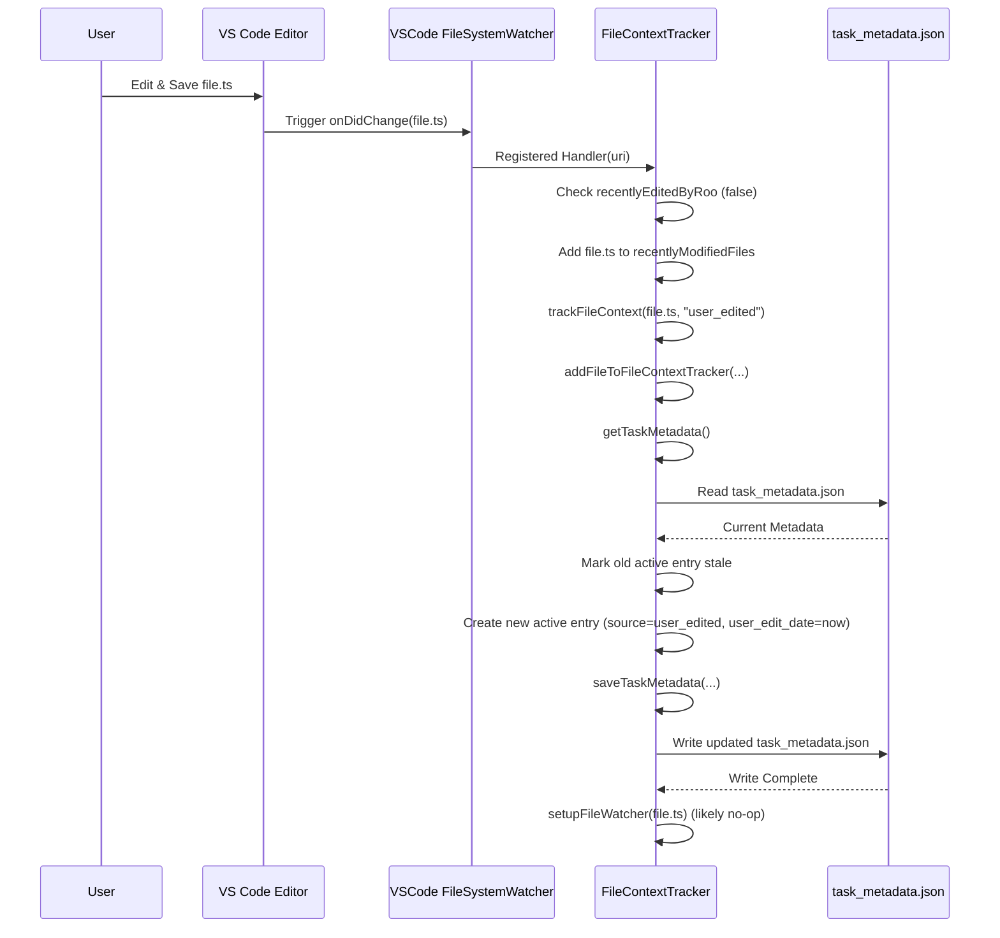

# Chapter 22: File Context Tracker

Continuing from [Chapter 21: RooIgnoreController](21_rooignorecontroller.md), where we learned how Roo-Code respects user-defined rules to avoid accessing specific files, this chapter explores how Roo-Code keeps track of the files that *have* been relevant during a task. We introduce the **File Context Tracker**.

## Motivation: Understanding Context Relevance and Staleness

During a conversation or task, the AI agent interacts with various files – reading their content, applying changes, or simply having them mentioned by the user. It's crucial for the agent's effectiveness and safety to know:

1.  **Which files are currently "in context"?** This helps prioritize information and potentially prune less relevant context when nearing token limits ([Chapter 23: Sliding Window Context Management](23_sliding_window_context_management.md)).
2.  **How did a file enter the context?** Was it read by a tool, mentioned by the user, or edited by Roo? This provides meta-information about the nature of the context.
3.  **When was a file last relevant?** Timestamps help understand the freshness of the context.
4.  **Has a file in context been modified externally since Roo last accessed it?** This is critical for detecting *stale context*. If a user edits a file outside of Roo-Code after Roo has read it, the AI might operate based on outdated information, leading to incorrect assumptions or failed operations (like applying a diff patch).
5.  **Which files has Roo modified?** This information is valuable for deciding when to save checkpoints using the [Chapter 13: CheckpointService](13_checkpointservice.md), ensuring that snapshots are taken after potentially significant changes.

The `FileContextTracker` addresses these needs by maintaining a record (`files_in_context`) for each task, logging file interactions with sources and timestamps, and integrating with VS Code's file system watchers to detect external modifications.

**Central Use Case:**
1.  Roo reads `src/config.ts` using the `read_file` tool. The `FileContextTracker` records this read operation with a timestamp. A file watcher is potentially started for `src/config.ts`.
2.  Later, the user manually edits and saves `src/config.ts` in the VS Code editor.
3.  The file watcher associated with `src/config.ts` detects the change.
4.  The `FileContextTracker` updates its internal state, marking the context for `src/config.ts` as potentially "stale" or simply recording the user edit timestamp.
5.  Before the AI attempts to use the content of `src/config.ts` again (e.g., to suggest a change based on its previously read content), Roo-Code (likely the [Chapter 4: Cline](04_cline.md)) can consult the `FileContextTracker`. It sees that a user edit occurred *after* the last read.
6.  `Cline` might then decide to automatically re-read the file to refresh the context before proceeding, or it might inform the AI: "Warning: src/config.ts has been modified externally since it was last read. Please re-read it if you need the latest version." This prevents the AI from operating on stale data.
7.  Separately, if Roo uses `apply_diff` on `src/utils.ts`, the tracker records this "roo_edited" event, potentially triggering an automatic checkpoint save.

## Key Concepts

1.  **Task-Scoped Tracking:** Like task persistence and checkpoints, file context tracking is specific to each task (`taskId`). A separate metadata record is maintained for each task.

2.  **Metadata Storage (`task_metadata.json`):** The tracking information is stored persistently within the task's directory ([Chapter 14: Task Persistence](14_task_persistence.md)), typically in a file named `task_metadata.json` (defined in `src/shared/globalFileNames.ts`). This file contains the `files_in_context` array.

3.  **`files_in_context` Array:** An array of `FileMetadataEntry` objects. Each entry represents a specific interaction with a file and contains:
    *   `path`: The relative path of the file within the workspace.
    *   `record_source`: The reason this entry was created (enum: `"read_tool"`, `"user_edited"`, `"roo_edited"`, `"file_mentioned"`). See `FileContextTrackerTypes.ts`.
    *   `roo_read_date`: Timestamp (milliseconds) of the last time Roo read this file's content.
    *   `roo_edit_date`: Timestamp of the last time Roo edited this file.
    *   `user_edit_date`: Timestamp of the last time an external user edit was detected for this file *while it was being tracked*.
    *   `record_state`: Indicates if this *specific record* is considered the current active context (`"active"`) or if it has been superseded by a later operation (`"stale"`). Note: This differs from the concept of the file *content* being stale due to external edits.

4.  **Tracking Sources:**
    *   `read_tool`: File content was read via `readFileTool`.
    *   `file_mentioned`: File content was included in the context because the user mentioned it (e.g., `@./path/to/file.ts`) and `parseMentions` ([Chapter core/mentions/index.ts](TODO: Link not in list)) included its content.
    *   `roo_edited`: File was modified by Roo using tools like `applyDiffTool` or `writeToFileTool`.
    *   `user_edited`: An external modification was detected by the file watcher *after* the file was added to the context.

5.  **File Watchers (`vscode.FileSystemWatcher`):** For each file actively tracked (`record_state: "active"`), the `FileContextTracker` creates a VS Code `FileSystemWatcher`. When the watcher fires an `onDidChange` event, the tracker:
    *   Checks if the edit was likely caused by Roo itself (using the `recentlyEditedByRoo` set, marked by tools like `applyDiffTool`).
    *   If it wasn't a Roo edit, it calls `trackFileContext(filePath, "user_edited")` to record the external modification and potentially marks previous "active" entries for this file as "stale". It also adds the file to the `recentlyModifiedFiles` set.

6.  **Detecting Staleness:** `Cline` or other components can determine if a file's context might be stale by:
    *   Getting the latest "active" record for the file from the tracker's metadata.
    *   Comparing the `roo_read_date` with the `user_edit_date`. If `user_edit_date` is later than `roo_read_date`, the context read by Roo is potentially outdated.
    *   Alternatively, `Cline` can check the `recentlyModifiedFiles` set managed by the tracker (retrieved via `getAndClearRecentlyModifiedFiles`).

7.  **Checkpoint Triggering:** Tools that modify files (`applyDiffTool`, `writeToFileTool`) call `trackFileContext(filePath, "roo_edited")`. This method adds the file path to the `checkpointPossibleFiles` set. `Cline` can then check this set (`getAndClearCheckpointPossibleFile`) after a tool execution cycle and decide whether to trigger `checkpointSave()` from the [Chapter 13: CheckpointService](13_checkpointservice.md).

## Using the File Context Tracker

The `FileContextTracker` is instantiated within `Cline` and used implicitly or explicitly by various parts of the system.

**Instantiation (`Cline` Constructor):**

```typescript
// --- File: src/core/Cline.ts ---
// (Inside Cline constructor)
this.fileContextTracker = new FileContextTracker(provider, this.taskId);
```

**Tracking Reads (`readFileTool`, `parseMentions`):**

```typescript
// --- Conceptual code within readFileTool.ts ---
async function readFileTool(...) {
    // ... (validate path, ask approval, read content) ...

    // *** Track the file read operation ***
    if (relPath) {
        await cline.getFileContextTracker().trackFileContext(relPath, "read_tool");
    }

    // ... (push result) ...
}

// --- Conceptual code within parseMentions (src/core/mentions/index.ts) ---
async function parseMentions(text, cwd, urlFetcher, fileContextTracker) {
    // ... (regex matching) ...
    for (const mention of mentions) {
        if (mention.startsWith("/")) {
            const mentionPath = mention.slice(1);
            // ... (get file content) ...
            if (isFile) {
                // *** Track the file mention (content included) ***
                if (fileContextTracker) {
                    await fileContextTracker.trackFileContext(mentionPath, "file_mentioned");
                }
            }
            // ... (append content to parsedText) ...
        }
    }
    // ...
}
```
*Explanation:* After successfully reading a file or including its content via a mention, the relevant function calls `trackFileContext` with the file path and the appropriate source (`"read_tool"` or `"file_mentioned"`).

**Tracking Writes (`applyDiffTool`, `writeToFileTool`):**

```typescript
// --- Conceptual code within applyDiffTool.ts / writeToFileTool.ts ---
async function toolThatWrites(...) {
    // ... (validate path, ask approval, apply changes, save file) ...

    const { /* ..., userEdits, ... */ } = await cline.diffViewProvider.saveChanges();

    // *** Track the file edit operation ***
    if (relPath) {
        await cline.getFileContextTracker().trackFileContext(relPath, "roo_edited");
        // Also mark it for the watcher to ignore this specific change
        cline.getFileContextTracker().markFileAsEditedByRoo(relPath);
    }

    cline.didEditFile = true; // Legacy flag, might be redundant
    // ... (push result) ...
}
```
*Explanation:* After successfully saving changes applied by Roo, the tool calls `trackFileContext` with the source `"roo_edited"`. It *also* calls `markFileAsEditedByRoo` to prevent the file watcher (if active) from immediately flagging this change as an external user edit.

**Detecting Staleness (Conceptual within `Cline`):**

```typescript
// --- Conceptual code within Cline before potentially using file content ---
async function ensureContextFreshness(filePath: string) {
    const metadata = await this.fileContextTracker.getTaskMetadata(this.taskId);
    const activeEntries = metadata.files_in_context
        .filter(e => e.path === filePath && e.record_state === 'active')
        .sort((a, b) => (b.roo_read_date ?? 0) - (a.roo_read_date ?? 0)); // Find latest read

    if (activeEntries.length > 0) {
        const latestRead = activeEntries[0].roo_read_date;
        const latestUserEdit = activeEntries.find(e => e.user_edit_date)?.user_edit_date;

        if (latestRead && latestUserEdit && latestUserEdit > latestRead) {
            console.warn(`Context for ${filePath} might be stale. Last read: ${latestRead}, User edit: ${latestUserEdit}`);
            await this.say("stale_context_warning", filePath);
            // Option 1: Automatically re-read
            // await this.fileContextTracker.trackFileContext(filePath, "read_tool"); // Update read time
            // content = await readFile(filePath); // Re-fetch content
            // Option 2: Inform AI
            // Add note to next user message: "[System Note: File ${filePath} was modified externally...]"
        }
    }
     // Alternative using the set:
     // const modifiedFiles = this.fileContextTracker.getAndClearRecentlyModifiedFiles();
     // if (modifiedFiles.includes(filePath)) { ... handle staleness ... }
}
```
*Explanation:* Before relying on previously read content, `Cline` could check the metadata stored by the tracker. It compares the last read timestamp (`roo_read_date`) with the last detected external edit timestamp (`user_edit_date`). If the edit is more recent, it warns the user and/or AI, or potentially triggers a re-read.

**Triggering Checkpoints (Conceptual within `Cline`):**

```typescript
// --- Conceptual code within Cline.presentAssistantMessage (after tool execution) ---
async presentAssistantMessage() {
    // ... (tool execution logic) ...

    // Check if any files edited by Roo need checkpointing
    const filesToPotentiallyCheckpoint = this.fileContextTracker.getAndClearCheckpointPossibleFile();

    if (filesToPotentiallyCheckpoint.length > 0) {
        // Trigger a checkpoint save
        await this.checkpointSave(`After edits to: ${filesToPotentiallyCheckpoint.join(', ')}`);
    }

    // ... (rest of method) ...
}
```
*Explanation:* After a tool interaction cycle, `Cline` retrieves the set of files marked by `trackFileContext("roo_edited")`. If the set is not empty, it calls `checkpointSave` from the [Chapter 13: CheckpointService](13_checkpointservice.md).

## Code Walkthrough

### FileContextTracker Class (`src/core/context-tracking/FileContextTracker.ts`)

```typescript
// --- File: src/core/context-tracking/FileContextTracker.ts ---
import * as path from "path";
import * as vscode from "vscode";
// Use shared path manager and filenames
import { getTaskDirectoryPath } from "../../shared/storagePathManager";
import { GlobalFileNames } from "../../shared/globalFileNames";
import { fileExistsAtPath } from "../../utils/fs";
import fs from "fs/promises";
// Import types and schemas
import type { FileMetadataEntry, RecordSource, TaskMetadata } from "./FileContextTrackerTypes";
import { taskMetadataSchema } from "./FileContextTrackerTypes"; // Import Zod schema
// Import provider for context access
import { ClineProvider } from "../webview/ClineProvider";
import { logger } from "../../utils/logging"; // Use logger

export class FileContextTracker {
	readonly taskId: string;
	private providerRef: WeakRef<ClineProvider>; // Use WeakRef to avoid cycles

	// File tracking and watching state
	private fileWatchers = new Map<string, vscode.FileSystemWatcher>();
	private recentlyModifiedFiles = new Set<string>(); // Files modified OUTSIDE Roo
	private recentlyEditedByRoo = new Set<string>(); // Files modified BY Roo (ignore watcher)
	private checkpointPossibleFiles = new Set<string>(); // Files modified by Roo, suggesting checkpoint

	constructor(provider: ClineProvider, taskId: string) {
		this.providerRef = new WeakRef(provider);
		this.taskId = taskId;
		// Load initial metadata and setup watchers asynchronously
		this.initializeMetadataAndWatchers().catch(error => {
			logger.error(`Failed to initialize FileContextTracker for task ${taskId}`, { error });
		});
	}

	/** Load existing metadata and set up watchers for active files */
	private async initializeMetadataAndWatchers(): Promise<void> {
		const metadata = await this.getTaskMetadata(this.taskId);
		const activeFiles = new Set(
			metadata.files_in_context
				.filter(entry => entry.record_state === 'active')
				.map(entry => entry.path)
		);
		// Setup watchers only for files currently marked active
		for (const filePath of activeFiles) {
			await this.setupFileWatcher(filePath);
		}
		logger.info(`FileContextTracker initialized for task ${taskId}, watching ${activeFiles.size} active files.`);
	}

	/** Gets the current working directory */
	private getCwd(): string | undefined {
		// Use provider's context proxy if available, fallback to workspaceFolders
		const provider = this.providerRef.deref();
		const cwd = provider?.contextProxy?.cwd ?? vscode.workspace.workspaceFolders?.[0]?.uri.fsPath;
		if (!cwd) { logger.warn("FileContextTracker: Cannot determine CWD."); }
		return cwd;
	}

	/** Gets the global storage path */
	private getGlobalStoragePath(): string | undefined {
		const provider = this.providerRef.deref();
		const storagePath = provider?.context.globalStorageUri.fsPath;
		if (!storagePath) { logger.warn("FileContextTracker: Cannot determine globalStoragePath."); }
		return storagePath;
	}

	/** Sets up a VS Code FileSystemWatcher for a specific relative path */
	async setupFileWatcher(relativeFilePath: string): Promise<void> {
		// Prevent duplicate watchers
		if (this.fileWatchers.has(relativeFilePath)) { return; }

		const cwd = this.getCwd();
		if (!cwd) { return; } // Cannot set up watcher without CWD

		try {
			const absolutePath = path.resolve(cwd, relativeFilePath);
			// Watcher pattern needs to be precise for single file
			const watcher = vscode.workspace.createFileSystemWatcher(
                // Use glob pattern that matches the exact file
                new vscode.RelativePattern(path.dirname(absolutePath), path.basename(absolutePath))
            );

			logger.debug(`Setting up watcher for: ${relativeFilePath}`);

			// Handler for file changes
			watcher.onDidChange(async (uri) => {
				logger.debug(`Watcher onChange triggered for: ${uri.fsPath}`);
				const changedRelPath = path.relative(cwd, uri.fsPath).replace(/\\/g, "/");

				// Check if this change was initiated by Roo
				if (this.recentlyEditedByRoo.has(changedRelPath)) {
					logger.debug(`Ignoring Roo-initiated change for: ${changedRelPath}`);
					this.recentlyEditedByRoo.delete(changedRelPath); // Consume the flag
				} else {
					logger.info(`External modification detected for: ${changedRelPath}`);
					this.recentlyModifiedFiles.add(changedRelPath); // Mark for staleness check
					// Record the user edit event in persistent metadata
					await this.trackFileContext(changedRelPath, "user_edited");
				}
			});
            // Optionally handle onDidDelete if needed

			// Store watcher and add to disposables managed by the provider/extension
			this.fileWatchers.set(relativeFilePath, watcher);
            this.providerRef.deref()?.context.subscriptions.push(watcher); // Use extension context disposables

		} catch (error) {
			logger.error(`Failed to set up watcher for ${relativeFilePath}`, { error });
		}
	}

	/**
     * Main method to track a file interaction. Updates metadata and sets up watcher.
     */
	async trackFileContext(relativeFilePath: string, source: RecordSource): Promise<void> {
		try {
			await this.addFileToFileContextTracker(this.taskId, relativeFilePath, source);
			// Ensure watcher is active for this file after tracking
			await this.setupFileWatcher(relativeFilePath);
		} catch (error) {
			logger.error(`Failed to track file context for ${relativeFilePath}`, { error });
		}
	}

	/** Gets task metadata from storage, validates with Zod */
	async getTaskMetadata(taskId: string): Promise<TaskMetadata> {
		const globalStoragePath = this.getGlobalStoragePath();
		if (!globalStoragePath) return { files_in_context: [] }; // Return empty if path unavailable

		const taskDir = await getTaskDirectoryPath(globalStoragePath, taskId);
		const filePath = path.join(taskDir, GlobalFileNames.taskMetadata);
		try {
			if (await fileExistsAtPath(filePath)) {
				const content = await fs.readFile(filePath, "utf8");
				const parsed = JSON.parse(content);
                // Validate using Zod schema
                const validationResult = taskMetadataSchema.safeParse(parsed);
                if (validationResult.success) {
                    return validationResult.data;
                } else {
                    logger.warn(`Invalid task metadata format for task ${taskId}. Discarding.`, { error: validationResult.error });
                    // Return default on validation failure
                    return { files_in_context: [] };
                }
			}
		} catch (error) {
			logger.error(`Failed to read task metadata for task ${taskId}`, { error });
		}
		return { files_in_context: [] }; // Default empty metadata
	}

	/** Saves task metadata to storage */
	async saveTaskMetadata(taskId: string, metadata: TaskMetadata): Promise<void> {
		const globalStoragePath = this.getGlobalStoragePath();
		if (!globalStoragePath) return; // Cannot save without path

		try {
            // Validate before saving (optional but good practice)
            taskMetadataSchema.parse(metadata);

			const taskDir = await getTaskDirectoryPath(globalStoragePath, taskId);
			const filePath = path.join(taskDir, GlobalFileNames.taskMetadata);
			await fs.writeFile(filePath, JSON.stringify(metadata, null, 2)); // Use formatting
		} catch (error) {
			logger.error(`Failed to save task metadata for task ${taskId}`, { error });
		}
	}

	/** Adds or updates a file entry in the metadata */
	private async addFileToFileContextTracker(taskId: string, relativeFilePath: string, source: RecordSource): Promise<void> {
		try {
			const metadata = await this.getTaskMetadata(taskId);
			const now = Date.now();

			// Mark previous "active" entries for this file as "stale"
			let previousActiveEntry: FileMetadataEntry | undefined;
			metadata.files_in_context.forEach((entry) => {
				if (entry.path === relativeFilePath && entry.record_state === "active") {
					entry.record_state = "stale";
					previousActiveEntry = entry; // Keep track of the most recent previous state
				}
			});

            // Create the new "active" entry, inheriting relevant dates from previous entry
			const newEntry: FileMetadataEntry = {
				path: relativeFilePath,
				record_state: "active",
				record_source: source,
				// Inherit previous timestamps unless updated by the current operation
				roo_read_date: previousActiveEntry?.roo_read_date ?? null,
				roo_edit_date: previousActiveEntry?.roo_edit_date ?? null,
				user_edit_date: previousActiveEntry?.user_edit_date ?? null,
			};

			// Update timestamps based on the current operation source
			switch (source) {
				case "user_edited":
					newEntry.user_edit_date = now;
					// Do NOT add to recentlyModifiedFiles here; the watcher handler does that.
					break;
				case "roo_edited":
					// If Roo edits, it implicitly read it too.
					newEntry.roo_read_date = now;
					newEntry.roo_edit_date = now;
					this.checkpointPossibleFiles.add(relativeFilePath); // Flag for potential checkpoint
					break;
				case "read_tool":
				case "file_mentioned":
					newEntry.roo_read_date = now;
					// If Roo reads a file previously modified by the user, clear the user_edit flag
                    // as Roo now has the latest content (up to this read).
                    if (previousActiveEntry?.user_edit_date && previousActiveEntry.user_edit_date > (previousActiveEntry.roo_read_date ?? 0)) {
                       newEntry.user_edit_date = null; // Clear user edit flag after Roo reads
                    }
					break;
			}

			// Add the new active entry
			metadata.files_in_context.push(newEntry);
			// Save the updated metadata
			await this.saveTaskMetadata(taskId, metadata);

		} catch (error) {
			logger.error(`Failed to add file ${relativeFilePath} to metadata`, { error });
		}
	}

	/** Returns the set of files modified externally and clears it */
	getAndClearRecentlyModifiedFiles(): string[] {
		const files = Array.from(this.recentlyModifiedFiles);
		this.recentlyModifiedFiles.clear();
		return files;
	}

	/** Returns the set of files edited by Roo (suggesting checkpoint) and clears it */
	getAndClearCheckpointPossibleFile(): string[] {
		const files = Array.from(this.checkpointPossibleFiles);
		this.checkpointPossibleFiles.clear();
		return files;
	}

	/** Flags a file path as having been just edited by Roo */
	markFileAsEditedByRoo(relativeFilePath: string): void {
		this.recentlyEditedByRoo.add(relativeFilePath);
	}

	/** Disposes file watchers (called when Cline task ends) */
	dispose(): void {
        logger.info(`Disposing FileContextTracker watchers for task ${this.taskId}.`);
		// Note: Watchers are now added to extension context disposables,
        // so explicit disposal here might be redundant if Cline ensures its
        // own cleanup or if provider manages lifecycles tied to context.
        // However, keeping explicit cleanup can be safer.
        for (const watcher of this.fileWatchers.values()) {
			watcher.dispose();
		}
		this.fileWatchers.clear();
        this.recentlyModifiedFiles.clear();
        this.recentlyEditedByRoo.clear();
        this.checkpointPossibleFiles.clear();
	}
}

// --- File: src/core/context-tracking/FileContextTrackerTypes.ts ---
import { z } from "zod";

// Zod schema for RecordSource
export const recordSourceSchema = z.enum(["read_tool", "user_edited", "roo_edited", "file_mentioned"]);
// TypeScript type derived from the Zod schema
export type RecordSource = z.infer<typeof recordSourceSchema>;

// Zod schema for FileMetadataEntry
export const fileMetadataEntrySchema = z.object({
	path: z.string(), // Relative path
	record_state: z.enum(["active", "stale"]), // State of this specific metadata entry
	record_source: recordSourceSchema, // How the file entered context
	roo_read_date: z.number().nullable(), // Timestamp of last Roo read
	roo_edit_date: z.number().nullable(), // Timestamp of last Roo edit
	user_edit_date: z.number().nullable().optional(), // Timestamp of last detected external edit
});
// TypeScript type derived from the Zod schema
export type FileMetadataEntry = z.infer<typeof fileMetadataEntrySchema>;

// Zod schema for TaskMetadata (main structure in task_metadata.json)
export const taskMetadataSchema = z.object({
	files_in_context: z.array(fileMetadataEntrySchema), // Array of file interaction records
});
// TypeScript type derived from the Zod schema
export type TaskMetadata = z.infer<typeof taskMetadataSchema>;

```

**Explanation:**

*   **Constructor & Initialization:** Stores `taskId` and `providerRef`. Calls `initializeMetadataAndWatchers` asynchronously to load existing state and set up watchers for files already marked as "active" in the persistent metadata.
*   **`getCwd`/`getGlobalStoragePath`:** Helpers to retrieve necessary paths, logging warnings if unavailable.
*   **`setupFileWatcher`:** Creates a `vscode.FileSystemWatcher` for a specific file path. The `onDidChange` handler is crucial: it checks the `recentlyEditedByRoo` set. If the flag isn't set for the changed file, it assumes an external edit, adds the file to `recentlyModifiedFiles`, and calls `trackFileContext` with source `"user_edited"`. If the flag *is* set, it simply consumes the flag (clears it from the set). Watchers are added to the extension context's disposables for automatic cleanup.
*   **`trackFileContext`:** The main public method. Calls `addFileToFileContextTracker` to update the persistent metadata and then ensures a file watcher is active via `setupFileWatcher`.
*   **`getTaskMetadata`/`saveTaskMetadata`:** Handles reading and writing the `task_metadata.json` file using `fs.promises` and the shared path manager. Includes Zod validation (`taskMetadataSchema.safeParse`) during load to gracefully handle corrupted or outdated formats.
*   **`addFileToFileContextTracker`:** The core state update logic. It loads current metadata, marks previous "active" entries for the same file as "stale", creates a new "active" entry inheriting relevant timestamps, updates timestamps based on the `source`, pushes the new entry, and saves the metadata. Includes logic to clear the `user_edit_date` if Roo reads a file after an external edit. It also adds files to `checkpointPossibleFiles` when `source` is `"roo_edited"`.
*   **`getAndClear...` Methods:** Provide a way for `Cline` to consume the sets of recently modified or Roo-edited files, clearing the sets after retrieval.
*   **`markFileAsEditedByRoo`:** Allows tools to temporarily flag a file change as originating from Roo, preventing the watcher from immediately marking it as an external edit.
*   **`dispose`:** Cleans up any active file watchers associated with this tracker instance when the corresponding `Cline` task ends. (Note: Relying on adding watchers to extension context disposables might be the primary cleanup mechanism).
*   **Types (`FileContextTrackerTypes.ts`):** Defines the structure of the metadata (`TaskMetadata`, `FileMetadataEntry`) and the possible sources (`RecordSource`) using Zod schemas and derived TypeScript types.

## Internal Implementation

The tracker coordinates file system watching with persistent state management.

**Step-by-Step (Tracking a File Read):**

1.  `readFileTool` successfully reads `src/utils.ts`.
2.  It calls `tracker.trackFileContext("src/utils.ts", "read_tool")`.
3.  `trackFileContext` calls `addFileToFileContextTracker`.
4.  `addFileToFileContextTracker` calls `getTaskMetadata` -> Reads `task_metadata.json`.
5.  It iterates `files_in_context`, marking any existing "active" entries for `"src/utils.ts"` as "stale".
6.  It creates a `newEntry` object: `{ path: "src/utils.ts", record_state: "active", record_source: "read_tool", roo_read_date: Date.now(), ... (inheriting other dates) }`. It clears `user_edit_date` if applicable.
7.  It pushes `newEntry` to `metadata.files_in_context`.
8.  It calls `saveTaskMetadata` -> Writes the updated `metadata` object back to `task_metadata.json`.
9.  `trackFileContext` then calls `setupFileWatcher("src/utils.ts")`.
10. `setupFileWatcher` checks if a watcher already exists. If not, it creates a `vscode.FileSystemWatcher` for the file and registers its `onDidChange` handler.

**Step-by-Step (Handling External File Change):**

1.  User edits and saves `src/utils.ts`.
2.  VS Code triggers the `onDidChange` event for the watcher associated with `src/utils.ts`.
3.  The watcher handler in `setupFileWatcher` executes.
4.  It checks `recentlyEditedByRoo`. The path `"src/utils.ts"` is NOT in the set.
5.  It adds `"src/utils.ts"` to the `recentlyModifiedFiles` set.
6.  It calls `trackFileContext("src/utils.ts", "user_edited")`.
7.  `trackFileContext` calls `addFileToFileContextTracker`.
8.  `addFileToFileContextTracker` loads metadata, marks previous active entries for `"src/utils.ts"` as "stale".
9.  It creates `newEntry`: `{ path: "src/utils.ts", record_state: "active", record_source: "user_edited", user_edit_date: Date.now(), ... (inheriting other dates) }`.
10. It pushes `newEntry` and saves the metadata.
11. `trackFileContext` calls `setupFileWatcher` (which likely finds the watcher already exists and does nothing).
12. **Later:** `Cline` calls `tracker.getAndClearRecentlyModifiedFiles()`, retrieves `["src/utils.ts"]`, and can now act on the potential staleness.

**Sequence Diagram (External File Change):**



## Modification Guidance

Modifications might involve changing the tracking granularity, adding new sources, or altering staleness detection logic.

**Common Modifications:**

1.  **Adding a New Tracking Source (e.g., `"tool_previewed"`):**
    *   **Schema:** Add `"tool_previewed"` to the `recordSourceSchema` enum in `FileContextTrackerTypes.ts`.
    *   **Tracker:** Add a `case "tool_previewed":` to the `switch` statement in `addFileToFileContextTracker` to define how timestamps should be updated for this source (e.g., update `roo_read_date`).
    *   **Usage:** Have the relevant tool or mechanism (e.g., a code lens preview) call `tracker.trackFileContext(filePath, "tool_previewed")`.

2.  **Changing Staleness Logic:**
    *   **Modify Check:** Adjust the logic where staleness is checked (e.g., the conceptual `ensureContextFreshness` in `Cline`). Instead of just `user_edit_date > roo_read_date`, you might add a time threshold (e.g., only consider it stale if the edit was more than 5 seconds after the read) or check the `source` of the last active read.
    *   **Modify Reporting:** Change how staleness is handled – always re-read, always prompt AI, prompt user, etc.

3.  **Adjusting Checkpoint Triggering:**
    *   **Modify `addFileToFileContextTracker`:** Change the condition for adding files to `checkpointPossibleFiles`. Maybe only add if the edit source is `"roo_edited"` AND the file extension is `.ts` or `.py`.
    *   **Modify `Cline`:** Change the logic where `getAndClearCheckpointPossibleFile` is called. Maybe only trigger a checkpoint if more than N files were edited, or combine it with other conditions.

**Best Practices:**

*   **Path Normalization:** Always use relative paths (to `cwd`) with POSIX separators (`/`) when storing paths in metadata and interacting with the `ignore` library (if used indirectly) or file watchers.
*   **Timestamp Accuracy:** Rely on `Date.now()` for consistent timestamps.
*   **Watcher Scope:** Use precise patterns (`RelativePattern` with base and file name) for file watchers to avoid unnecessary triggers. Watchers on directories can be noisy.
*   **Resource Management:** Ensure `FileSystemWatcher` instances are properly disposed of when the task ends (e.g., via `dispose` method or adding to extension context disposables).
*   **Error Handling:** Include `try...catch` around file system operations (`readFile`, `writeFile`) and watcher setup. Log errors but avoid crashing the core functionality if possible.
*   **Metadata Atomicity:** Saving the entire `metadata` object on each update is simple but not truly atomic if the process crashes mid-write. For extreme robustness, temporary file + rename patterns could be used, but the current approach is likely sufficient.

**Potential Pitfalls:**

*   **Watcher Latency/Reliability:** File system events might have slight delays or, in rare cases (especially with network drives or complex setups), might be missed by VS Code's watchers.
*   **Roo Edit Flag Race Condition:** There's a small window between Roo saving a file and the watcher event firing. If `markFileAsEditedByRoo` isn't called quickly enough or if the watcher fires exceptionally fast, a Roo edit could be incorrectly flagged as an external user edit.
*   **Metadata Corruption:** If `task_metadata.json` becomes corrupted (e.g., invalid JSON due to crash), the `getTaskMetadata` function should gracefully handle the parsing error and likely return default empty metadata, potentially losing tracking state for that task. Zod validation helps detect this.
*   **Performance with Many Watched Files:** Creating hundreds or thousands of individual file watchers *might* impact VS Code performance, although VS Code's implementation is generally efficient. Monitoring resource usage might be needed for extremely large contexts.
*   **Staleness Check Complexity:** Implementing sophisticated staleness checks (e.g., checking if the edit *actually* conflicts with AI assumptions) is much harder than simply comparing timestamps. The current timestamp approach provides a basic safety net.

## Conclusion

The `FileContextTracker` plays a vital role in maintaining the integrity and relevance of the information used by Roo-Code's AI agent. By persistently tracking file interactions (reads, mentions, edits) with sources and timestamps, and leveraging VS Code's file watchers to detect external modifications, it provides the necessary mechanisms to identify potentially stale context and inform checkpointing decisions. This awareness helps prevent errors caused by outdated information and contributes to a safer and more reliable AI-assisted development workflow.

Now that we understand how Roo-Code tracks which files are in context and whether they might be stale, we need to consider how it manages the *amount* of context sent to the LLM, especially when dealing with long conversations or large files. The next chapter introduces [Chapter 23: Sliding Window Context Management](23_sliding_window_context_management.md).

