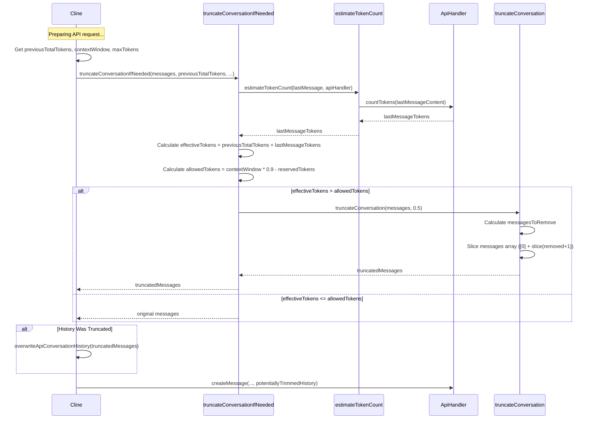

# Chapter 23: Sliding Window Context Management

In the previous chapter, [Chapter 22: File Context Tracker](22_file_context_tracker.md), we discussed how Roo-Code tracks which files are part of the current task's context and detects potential staleness. However, managing context isn't just about *what* files are included, but also about *how much* information can be processed at once. LLMs have finite context windows, and long conversations or large included files can easily exceed these limits. This chapter introduces Roo-Code's strategy for managing conversation history size: **Sliding Window Context Management**.

## Motivation: Staying Within LLM Context Limits

Large Language Models (LLMs) can only process a limited amount of input text (the "context window") in a single request. This limit varies between models (e.g., 8k, 32k, 128k, or even millions of tokens), but it's always finite. As a conversation between the user and Roo-Code progresses, the history of messages (user inputs, AI responses, tool results) grows. If this history, combined with the system prompt and the next user message, exceeds the model's context window limit, the API call will fail.

We need a mechanism to automatically shorten the conversation history when necessary, ensuring that the most recent exchanges (which are usually the most relevant) are preserved while staying within the token limits. Simply truncating from the very beginning isn't always ideal, as the initial user request or important early context might be lost.

The Sliding Window strategy implemented in Roo-Code addresses this by selectively removing older messages (while always preserving the very first message) when the estimated size of the next API request approaches the context window limit. This keeps the conversation flowing without hitting hard limits or losing the original task definition.

**Central Use Case:** A user is having a long debugging session with Roo-Code using a model with a 32k token context window. The conversation history (`apiConversationHistory` in `Cline`) has grown significantly. Before sending the next user message and the current history to the AI:
1.  The [Chapter 4: Cline](04_cline.md) instance estimates the total token count if the new message were added to the existing history.
2.  It compares this estimated count against a threshold slightly below the model's 32k limit (e.g., 32k minus a buffer for the response and a safety margin).
3.  If the estimated count exceeds the threshold, the sliding window mechanism is invoked.
4.  It removes a portion (e.g., 50%) of the older messages from the middle of the conversation history, ensuring the *first* message (likely the initial task request) and the *most recent* messages are kept.
5.  The API call proceeds with the shortened, compliant conversation history.

## Key Concepts

1.  **Context Window Limit:** The maximum number of tokens an LLM can process in a single input prompt (including system prompt, history, and current message). This information is part of the `ModelInfo` associated with the selected model via the [Chapter 5: ApiHandler](05_apihandler.md).

2.  **Token Counting (`estimateTokenCount`, `ApiHandler.countTokens`):** Accurately estimating the token count of the conversation history and the upcoming message is crucial. The `estimateTokenCount` helper function (in `src/core/sliding-window/index.ts`) uses the `countTokens` method provided by the current `ApiHandler` ([Chapter 5: ApiHandler](05_apihandler.md)). `countTokens` typically uses libraries like `js-tiktoken` or provider-specific APIs for estimation.

3.  **Buffer (`TOKEN_BUFFER_PERCENTAGE`):** A safety margin subtracted from the total context window size when calculating the allowed token limit. This accounts for potential inaccuracies in token estimation and ensures there's ample room for the system prompt and other overhead. Defined in `src/core/sliding-window/index.ts`.

4.  **Reserved Output Tokens (`maxTokens`):** The maximum number of tokens the user expects the AI to generate in its response. This value (configured by the user or derived from model defaults) is also subtracted from the context window to calculate the allowed input tokens, ensuring the model has enough "space" to generate its full response.

5.  **Threshold Calculation (`allowedTokens`):** The effective maximum number of tokens allowed for the conversation history *plus* the next user message. Calculated roughly as: `contextWindow * (1 - TOKEN_BUFFER_PERCENTAGE) - reservedTokens`.

6.  **`truncateConversationIfNeeded` Function:** (Located in `src/core/sliding-window/index.ts`) This is the main orchestrator. It takes the current message history, token counts, model limits, and the API handler. It performs the threshold comparison (`effectiveTokens > allowedTokens`). If truncation is needed, it calls `truncateConversation`. Otherwise, it returns the original message history.

7.  **`truncateConversation` Function:** (Located in `src/core/sliding-window/index.ts`) Implements the actual truncation logic. It takes the message array and a fraction (e.g., `0.5`) representing how much of the "middle" history to remove. It preserves the first message (`messages[0]`) and removes a calculated number of messages following it, keeping the most recent messages intact.

## Using the Sliding Window

The sliding window mechanism is invoked automatically within the [Chapter 4: Cline](04_cline.md) class, specifically inside the `attemptApiRequest` method, just before the conversation history is sent to the `ApiHandler`.

**Flow within `Cline.attemptApiRequest`:**

1.  **Gather Info:** Before the main API call loop, `Cline` has access to `this.apiConversationHistory`, `this.api` (the `ApiHandler`), and configuration details like `maxTokens` (reserved output). It might also have the token count from the *previous* API request (`previousApiReqIndex`).
2.  **Check Needed:** Inside `attemptApiRequest`, right before calling `this.api.createMessage`, the truncation logic is called:
    ```typescript
    // Conceptual placement within Cline.attemptApiRequest
    const { contextWindow } = this.api.getModel().info;
    const maxTokens = /* get reserved output tokens from config/model */;
    const previousTotalTokens = /* get from previous 'api_req_started' message */;

    // Call the main sliding window function
    const potentiallyTrimmedHistory = await truncateConversationIfNeeded({
        messages: this.apiConversationHistory, // Current full history
        totalTokens: previousTotalTokens,       // Tokens used BEFORE adding the last user message
        contextWindow: contextWindow,
        maxTokens: maxTokens,
        apiHandler: this.api,
    });

    // Check if history was actually trimmed
    if (potentiallyTrimmedHistory !== this.apiConversationHistory) {
        await this.overwriteApiConversationHistory(potentiallyTrimmedHistory);
        // Optionally inform the user? await this.say("context_trimmed", ...);
    }

    // Proceed with API call using the potentially trimmed history
    const stream = this.api.createMessage(systemPrompt, this.apiConversationHistory, this.promptCacheKey);
    // ... process stream ...
    ```
3.  **`truncateConversationIfNeeded` Logic:**
    *   **Input:** `messages` (current history), `totalTokens` (count *before* last user message), `contextWindow`, `maxTokens`, `apiHandler`.
    *   Calculates `reservedTokens = maxTokens ?? contextWindow * 0.2`.
    *   Estimates `lastMessageTokens` for the last message in the `messages` array using `estimateTokenCount(..., apiHandler)`.
    *   Calculates `effectiveTokens = totalTokens + lastMessageTokens`.
    *   Calculates `allowedTokens = contextWindow * (1 - TOKEN_BUFFER_PERCENTAGE) - reservedTokens`.
    *   **Comparison:** If `effectiveTokens > allowedTokens`:
        *   Calls `return truncateConversation(messages, 0.5);` (to remove 50% of the middle).
    *   **Else:**
        *   Returns the original `messages` array.
4.  **`truncateConversation` Logic:**
    *   **Input:** `messages`, `fracToRemove` (e.g., 0.5).
    *   Calculates `messagesToRemove` based on `(messages.length - 1) * fracToRemove`, ensuring it's an even number (to remove pairs of user/assistant messages ideally, though not guaranteed).
    *   Constructs the new array: `[messages[0], ...messages.slice(messagesToRemove + 1)]`.
    *   **Output:** Returns the truncated array.
5.  **`Cline` Updates:** If `truncateConversationIfNeeded` returned a *different* array instance, `Cline` updates its `this.apiConversationHistory` with the trimmed version using `overwriteApiConversationHistory` (which also saves the trimmed history to disk via [Chapter 14: Task Persistence](14_task_persistence.md)).
6.  **API Call:** `Cline` proceeds to call `this.api.createMessage` using the potentially shortened `apiConversationHistory`.

## Code Walkthrough

### Sliding Window Functions (`src/core/sliding-window/index.ts`)

```typescript
// --- File: src/core/sliding-window/index.ts ---
import { Anthropic } from "@anthropic-ai/sdk";
import { ApiHandler } from "../../api"; // Import ApiHandler interface

/**
 * Default percentage of the context window to use as a buffer when deciding when to truncate
 */
export const TOKEN_BUFFER_PERCENTAGE = 0.1;

/**
 * Counts tokens for user content using the provider's token counting implementation.
 *
 * @param {Array<Anthropic.Messages.ContentBlockParam>} content - The content to count tokens for
 * @param {ApiHandler} apiHandler - The API handler to use for token counting
 * @returns {Promise<number>} A promise resolving to the token count
 */
export async function estimateTokenCount(
	content: Array<Anthropic.Messages.ContentBlockParam>,
	apiHandler: ApiHandler,
): Promise<number> {
	if (!content || content.length === 0) return 0;
	// Delegate token counting to the specific ApiHandler implementation
	return apiHandler.countTokens(content);
}

/**
 * Truncates a conversation by removing a fraction of the messages from the middle.
 *
 * The first message is always retained. A specified fraction (rounded down to an even number)
 * of messages *after* the first one is removed.
 *
 * @param {Anthropic.Messages.MessageParam[]} messages - The conversation messages.
 * @param {number} fracToRemove - The fraction (between 0 and 1) of messages (excluding the first) to remove.
 * @returns {Anthropic.Messages.MessageParam[]} The truncated conversation messages.
 */
export function truncateConversation(
	messages: Anthropic.Messages.MessageParam[],
	fracToRemove: number,
): Anthropic.Messages.MessageParam[] {
    // Ensure fracToRemove is within valid range
    fracToRemove = Math.max(0, Math.min(1, fracToRemove));

    // Always keep the first message
	const truncatedMessages = [messages[0]];

    // Calculate the number of messages available for removal (all except the first)
    const availableToRemoveCount = messages.length - 1;
    if (availableToRemoveCount <= 0) {
        return messages; // Cannot truncate if only one message exists
    }

    // Calculate the raw number to remove based on the fraction
	const rawMessagesToRemove = Math.floor(availableToRemoveCount * fracToRemove);
    // Ensure we remove an even number to ideally keep user/assistant pairs balanced
    // (though if history ends on 'user', this isn't guaranteed)
	const messagesToRemove = rawMessagesToRemove - (rawMessagesToRemove % 2);

    // If we need to remove messages, slice the array appropriately
	if (messagesToRemove > 0) {
        // Keep the first message, skip 'messagesToRemove' messages after it, keep the rest
        const remainingMessages = messages.slice(messagesToRemove + 1);
        truncatedMessages.push(...remainingMessages);
        console.log(`[SlidingWindow] Truncated conversation: Removed ${messagesToRemove} messages.`);
    } else {
        // No messages need to be removed (or fracToRemove was 0)
        truncatedMessages.push(...messages.slice(1));
    }

	return truncatedMessages;
}

// Options structure for truncateConversationIfNeeded
type TruncateOptions = {
	messages: Anthropic.Messages.MessageParam[];
	totalTokens: number; // Tokens BEFORE the last user message in 'messages' array
	contextWindow: number;
	maxTokens?: number | null; // Max tokens reserved for output (user setting)
	apiHandler: ApiHandler;
};

/**
 * Conditionally truncates the conversation messages if the estimated total token count
 * (including the last user message) exceeds the model's adjusted limit.
 *
 * @param {TruncateOptions} options - The options for truncation
 * @returns {Promise<Anthropic.Messages.MessageParam[]>} The original or truncated conversation messages.
 */
export async function truncateConversationIfNeeded({
	messages,
	totalTokens,
	contextWindow,
	maxTokens,
	apiHandler,
}: TruncateOptions): Promise<Anthropic.Messages.MessageParam[]> {
	// Calculate the tokens reserved for the model's output response
    // Default to 20% of context window if not specified
	const reservedTokens = maxTokens || Math.floor(contextWindow * 0.2);

	// Estimate tokens for the *last* message in the current history array
    // This message is the user input we're about to send
	const lastMessage = messages[messages.length - 1];
	if (!lastMessage) return messages; // Should not happen with valid history

	const lastMessageContent = lastMessage.content;
	const lastMessageTokens = Array.isArray(lastMessageContent)
		? await estimateTokenCount(lastMessageContent, apiHandler)
		: await estimateTokenCount([{ type: "text", text: lastMessageContent as string }], apiHandler);

	// Calculate total effective tokens (tokens of history *before* last message + last message tokens)
	const effectiveTokens = totalTokens + lastMessageTokens;

	// Calculate available tokens for the entire input, applying buffer and reserving output space
	const allowedTokens = Math.floor(contextWindow * (1 - TOKEN_BUFFER_PERCENTAGE) - reservedTokens);

	console.log(`[SlidingWindow] Check: EffectiveTokens=${effectiveTokens}, AllowedTokens=${allowedTokens}, ContextWindow=${contextWindow}, Reserved=${reservedTokens}, Buffer=${TOKEN_BUFFER_PERCENTAGE}`);

	// Determine if truncation is needed and apply if necessary
	if (effectiveTokens > allowedTokens) {
        console.log(`[SlidingWindow] Truncation needed. EffectiveTokens (${effectiveTokens}) > AllowedTokens (${allowedTokens})`);
        // Apply truncation, removing 50% of the middle history
		return truncateConversation(messages, 0.5);
	} else {
        // No truncation needed
		return messages;
	}
}
```

**Explanation:**

*   **`TOKEN_BUFFER_PERCENTAGE`:** Defines the safety margin (10%).
*   **`estimateTokenCount`:** A simple wrapper that delegates to the `apiHandler.countTokens` method, handling empty content.
*   **`truncateConversation`:**
    *   Takes the `messages` array and `fracToRemove`.
    *   Always keeps `messages[0]`.
    *   Calculates how many messages to remove from the section *after* the first one, based on `fracToRemove` (rounding down to an even number).
    *   Uses `slice` to reconstruct the array, effectively removing the calculated number of messages from the "middle" (immediately following the first message).
*   **`truncateConversationIfNeeded`:**
    *   Takes the current `messages`, the `totalTokens` count *excluding* the last message, model/config limits, and the `apiHandler`.
    *   Calculates `reservedTokens` for the output.
    *   Calls `estimateTokenCount` for the *last* message (the one about to be sent).
    *   Calculates `effectiveTokens` (sum of previous history tokens and the last message tokens).
    *   Calculates `allowedTokens` based on context window, buffer, and reserved tokens.
    *   Compares `effectiveTokens` and `allowedTokens`. If the limit is exceeded, it calls `truncateConversation` (with a hardcoded fraction of 0.5); otherwise, it returns the original `messages` array.

### Usage within Cline (`src/core/Cline.ts`)

```typescript
// --- File: src/core/Cline.ts ---
// (Excerpt within attemptApiRequest, showing where truncation occurs)

// ... inside attemptApiRequest loop ...
async *attemptApiRequest(previousApiReqIndex: number, retryAttempt: number = 0): ApiStream {
    // ... [Gather system prompt, mcpHub etc.] ...

    // --- Sliding Window Check ---
    // If the previous API request's total token usage is close to the context window,
    // truncate the conversation history to free up space for the new request.
    if (previousApiReqIndex >= 0) {
        const previousRequestMessage = this.clineMessages[previousApiReqIndex];
        if (previousRequestMessage?.text) {
            const { tokensIn = 0, tokensOut = 0, cacheWrites = 0, cacheReads = 0 }: ClineApiReqInfo =
                JSON.parse(previousRequestMessage.text);

            // Calculate total tokens USED by the previous API call
            const previousTotalTokens = tokensIn + tokensOut + cacheWrites + cacheReads;

            const modelInfo = this.api.getModel().info;
            const { modelMaxTokens: userMaxTokens } = this.apiConfiguration; // Max tokens for response from settings
            // Use model's maxTokens if thinking, otherwise contextWindow * 0.2 (fallback for reserved)
            const defaultReserved = Math.floor((modelInfo.contextWindow || 8192) * 0.2);
            const maxTokensForResponse = modelInfo.thinking ? (userMaxTokens ?? modelInfo.maxTokens) : defaultReserved;

            // Call the truncation logic
            const potentiallyTrimmedHistory = await truncateConversationIfNeeded({
                messages: this.apiConversationHistory, // Current full history
                totalTokens: previousTotalTokens, // Tokens used by prev request (proxy for current history size before last user msg)
                contextWindow: modelInfo.contextWindow,
                maxTokens: maxTokensForResponse, // Max tokens reserved for output
                apiHandler: this.api,
            });

            // If truncation occurred, update the history
            if (potentiallyTrimmedHistory !== this.apiConversationHistory) {
                await this.overwriteApiConversationHistory(potentiallyTrimmedHistory);
                // Optionally notify user in chat
                // await this.say("context_trimmed", "Conversation history trimmed to fit context window.");
            }
        }
    }
    // --- End Sliding Window Check ---

    // Clean conversation history (remove images if needed, etc.)
    const cleanConversationHistory = this.apiConversationHistory.map(/* ... */);

    // Make the API call using the potentially trimmed history
    const stream = this.api.createMessage(systemPrompt, cleanConversationHistory, this.promptCacheKey);

    // ... [Process the stream] ...
}

```

**Explanation:**

*   The code retrieves the token usage (`previousTotalTokens`) from the metadata stored in the *previous* `api_req_started` message. This serves as an estimate of the current history size *before* the latest user message was added (since the latest user message is already the last item in `apiConversationHistory` at this point).
*   It calculates the `maxTokensForResponse` (reserved output tokens) based on model info and user settings.
*   It calls `truncateConversationIfNeeded`, passing the current history, the estimated previous token count, model limits, and the API handler.
*   If the returned history is different, it calls `overwriteApiConversationHistory` to update the internal state and save the trimmed version to disk.
*   The subsequent call to `api.createMessage` uses the potentially updated `this.apiConversationHistory`.

## Internal Implementation

The core logic resides within the calculation in `truncateConversationIfNeeded` and the array slicing in `truncateConversation`.

**Step-by-Step (`truncateConversationIfNeeded`):**

1.  Receive `messages`, `totalTokens` (previous history size), `contextWindow`, `maxTokens` (output reservation), `apiHandler`.
2.  Calculate `reservedTokens` (output reservation, defaults to 20% if `maxTokens` is null).
3.  Get `lastMessage` from `messages`.
4.  Call `apiHandler.countTokens` via `estimateTokenCount` to get `lastMessageTokens`.
5.  Calculate `effectiveTokens = totalTokens + lastMessageTokens`.
6.  Calculate `allowedTokens = floor(contextWindow * (1 - 0.1) - reservedTokens)`.
7.  Compare `if (effectiveTokens > allowedTokens)`.
8.  If true, call `truncateConversation(messages, 0.5)` and return its result.
9.  If false, return the original `messages`.

**Step-by-Step (`truncateConversation`):**

1.  Receive `messages` and `fracToRemove` (e.g., 0.5).
2.  Create `truncatedMessages = [messages[0]]`.
3.  Calculate `availableToRemoveCount = messages.length - 1`.
4.  Calculate `rawMessagesToRemove = floor(availableToRemoveCount * fracToRemove)`.
5.  Calculate `messagesToRemove = rawMessagesToRemove - (rawMessagesToRemove % 2)`.
6.  If `messagesToRemove > 0`, calculate `remainingMessages = messages.slice(messagesToRemove + 1)`.
7.  Append `remainingMessages` to `truncatedMessages`.
8.  Return `truncatedMessages`.

**Sequence Diagram (`Cline` calling `truncateIfNeeded`):**



## Modification Guidance

Modifications typically involve adjusting the thresholds, the amount of truncation, or the truncation strategy itself.

**Common Modifications:**

1.  **Adjusting the Buffer:**
    *   **Locate:** Change the `TOKEN_BUFFER_PERCENTAGE` constant in `src/core/sliding-window/index.ts`.
    *   **Effect:** A higher percentage reserves more buffer space, triggering truncation earlier but making API calls safer from limit errors. A lower percentage allows more context but increases the risk of exceeding the limit.
    *   **Considerations:** The optimal buffer depends on the accuracy of the `apiHandler.countTokens` implementation and the variability in system prompt/overhead size.

2.  **Changing the Truncation Amount:**
    *   **Locate:** Modify the hardcoded `0.5` (representing `fracToRemove`) passed to `truncateConversation` within the `if (effectiveTokens > allowedTokens)` block in `truncateConversationIfNeeded`.
    *   **Effect:** Changing it to `0.3` would remove 30% of the middle history, while `0.7` would remove 70%.
    *   **Considerations:** Removing less might require more frequent truncations later. Removing more risks losing potentially relevant older context.

3.  **Implementing a Different Truncation Strategy (e.g., Summarization - Advanced):**
    *   **New Function:** Create a new function, e.g., `summarizeAndTruncateConversation(messages, fracToSummarize, summaryModelHandler)`.
    *   **Logic:**
        *   Identify the messages to be removed (similar calculation to `truncateConversation`).
        *   Extract the content of these messages.
        *   Use a separate (potentially faster/cheaper) LLM via `summaryModelHandler` to generate a concise summary of the extracted content.
        *   Construct the new message history: `[messages[0], { role: 'user', content: '[Summarized previous conversation: ' + summary + ']' }, ...messages.slice(removedCount + 1)]`.
    *   **Update `truncateConversationIfNeeded`:** Replace the call to `truncateConversation` with a call to the new summarization function.
    *   **Considerations:** This is significantly more complex, involves extra API calls (cost, latency), and the quality of the summary impacts context retention. It avoids complete information loss but introduces potential summarization errors.

4.  **Refining Reserved Output Calculation:**
    *   **Locate:** Modify the calculation of `reservedTokens` in `truncateConversationIfNeeded`.
    *   **Modify:** Instead of a fixed percentage (20%), perhaps use the actual `maxTokens` value set by the user in the current `ApiConfiguration` more consistently, or use a model-specific default if the user hasn't set one.
    *   **Considerations:** Ensure the reserved amount is sufficient for the expected output length to avoid API errors where the model stops generating due to hitting `max_tokens`.

**Best Practices:**

*   **Prioritize Recent Context:** The current strategy of removing from the middle (after the first message) prioritizes keeping the initial request and the most recent exchanges, which is generally effective for conversational tasks.
*   **Accurate Token Counting:** The effectiveness relies heavily on the `apiHandler.countTokens` implementation. Ensure this is reasonably accurate for the models being used. Use provider-specific counting APIs where available (as seen in `AnthropicHandler` override).
*   **Balance Buffer/Truncation:** Tune `TOKEN_BUFFER_PERCENTAGE` and the truncation fraction (`0.5`) based on observed behavior and model characteristics. Too aggressive truncation harms context; too little risks API errors.
*   **User Notification (Optional):** Consider adding a `cline.say("context_trimmed", ...)` message when truncation occurs, so the user is aware that older parts of the conversation might have been removed from the AI's context.

**Potential Pitfalls:**

*   **Token Count Inaccuracy:** If `apiHandler.countTokens` significantly underestimates the actual tokens used by the API, truncation might happen too late, leading to API errors. If it overestimates, truncation might happen unnecessarily early. Image token counting is particularly prone to inaccuracy.
*   **Removing Critical Context:** The simple slicing approach might occasionally remove an important piece of information from the middle of the conversation that was still relevant. Summarization strategies attempt to mitigate this but have their own drawbacks.
*   **Truncating Pairs:** Rounding `messagesToRemove` down to an even number attempts to remove user/assistant pairs, but if the history length (minus the first message) is odd, the last removed message might break a pair. This is usually not critical.
*   **Performance:** Repeatedly calling `apiHandler.countTokens` (especially if it involves an API call itself) within `truncateConversationIfNeeded` could add latency. The current implementation relies on the token count from the *previous* request and only estimates the *last* message, which is more efficient.

## Conclusion

Sliding Window Context Management is a crucial mechanism in Roo-Code for handling the finite context limits of LLMs during long or complex conversations. By estimating the size of upcoming API requests and proactively truncating the middle portion of the conversation history (using `truncateConversationIfNeeded` and `truncateConversation`) while preserving the initial context and recent exchanges, Roo-Code ensures that interactions can continue without hitting hard token limits. This strategy balances context retention with the practical constraints of current LLM technology.

Now that we understand how the overall conversation context is managed, the next chapter will examine how specific references within the user's input, like `@file` or `@symbol`, are resolved and incorporated into the context: [Chapter 24: Mention Handling](24_mention_handling.md).

