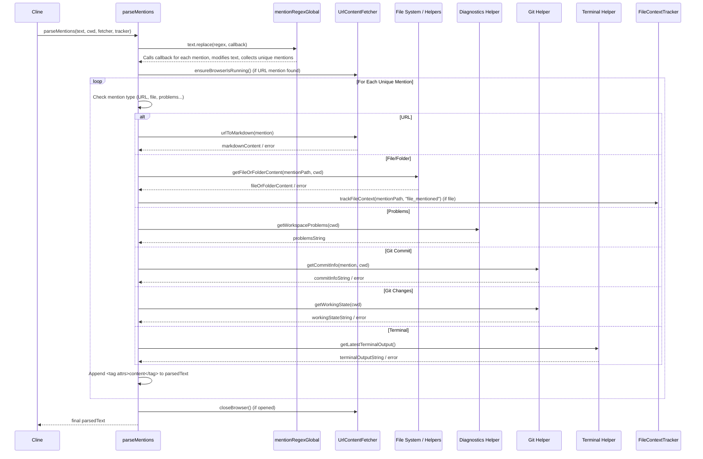

# Chapter 24: Mention Handling

Continuing from [Chapter 23: Sliding Window Context Management](23_sliding_window_context_management.md), where we discussed managing the size of the conversation history sent to the LLM, we now focus on how Roo-Code enriches that context by resolving `@mention` references within user input.

## Motivation: Seamlessly Injecting Context

Users frequently need to refer to specific files, folders, URLs, Git commits, diagnostics, or terminal output when interacting with an AI assistant. Manually copying and pasting file contents or command output into the chat is tedious and disrupts the workflow. Furthermore, the AI needs this context presented in a structured way to understand it effectively.

`@mentions` provide a concise and intuitive syntax for users to reference these resources directly within their chat messages (e.g., `@/src/utils/helper.ts`, `@problems`, `@git-changes`, `@https://example.com`). The Mention Handling system is responsible for:

1.  **Identifying** these mentions in the user's input.
2.  **Parsing** the mention to determine the resource type and identifier.
3.  **Fetching** the relevant content (e.g., file content, URL markdown summary, terminal output, list of problems).
4.  **Embedding** the fetched content, often wrapped in descriptive XML-like tags, into the prompt sent to the LLM, providing crucial context.
5.  **Facilitating Interaction:** Enabling users to easily insert mentions via a suggestion dropdown and allowing them to click on rendered mentions to open the corresponding resource in VS Code.

**Central Use Case:** A user asks: "Can you explain the `calculate` function in `@/src/math.ts` and check if it's affected by any current `@problems`?"

1.  **Input:** User types the message into the [Chapter 34: Chat UI Components (WebView)](34_chat_ui_components__webview_.md). As they type `@/src...` or `@prob...`, the UI suggestion logic (`context-mentions.ts`) provides autocompletion options.
2.  **Identification:** When the message is sent, the `mentionRegex` (defined in `shared/context-mentions.ts`) identifies `@/src/math.ts` and `@problems`.
3.  **Parsing & Fetching (`parseMentions`):** The `parseMentions` function (`core/mentions/index.ts`) processes the input text before it's sent to the LLM.
    *   For `@/src/math.ts`, it calls helpers (`getFileOrFolderContent`) to read the file's content, potentially respecting `.rooignore` rules via [Chapter 21: RooIgnoreController](21_rooignorecontroller.md). It tracks the file using [Chapter 22: File Context Tracker](22_file_context_tracker.md).
    *   For `@problems`, it calls helpers (`getWorkspaceProblems`) to retrieve current diagnostics (errors/warnings) from VS Code.
4.  **Embedding:** `parseMentions` modifies the original text slightly (e.g., adding "(see below...)") and appends the fetched content wrapped in tags:
    ```
    Can you explain the `calculate` function in '/src/math.ts' (see below for file content) and check if it's affected by any current Workspace Problems (see below for diagnostics)?

    <file_content path="src/math.ts">
    // content of math.ts...
    </file_content>

    <workspace_diagnostics>
    Error: Something is wrong in other_file.ts:10:5
    Warning: Deprecated function used in math.ts:15:12
    </workspace_diagnostics>
    ```
5.  **AI Processing:** The LLM receives the modified prompt containing both the user's question and the embedded context from the mentioned resources. It can now answer the question effectively using the provided file content and diagnostic information.
6.  **Rendering (`Mention.tsx`):** In the WebView UI, the chat messages containing mentions are rendered using the `Mention` component, which makes `@/src/math.ts` and `@problems` clickable.
7.  **Opening (`openMention`):** If the user clicks on `@/src/math.ts`, the `openMention` function (`core/mentions/index.ts`) is triggered (via a `WebviewMessage`), which uses VS Code APIs (`openFile`, `vscode.commands.executeCommand`) to open the `src/math.ts` file in the editor or focus the "Problems" panel for `@problems`.

## Key Concepts

1.  **`@mention` Syntax:** A convention using the `@` symbol followed immediately by an identifier representing a resource. Common types include:
    *   **Files/Folders:** `@/path/to/file.ts`, `@/path/to/folder/` (Paths are relative to workspace root, use `/`).
    *   **URLs:** `@https://example.com/...` (Requires full URL).
    *   **Special Keywords:** `@problems`, `@terminal`, `@git-changes`.
    *   **Git Commits:** `@<commit_hash>` (e.g., `@a1b2c3d`).

2.  **`mentionRegex` / `mentionRegexGlobal` (`shared/context-mentions.ts`):** Regular expressions designed to identify valid mentions while excluding trailing punctuation. The global version is used to find all mentions in a string.

3.  **`parseMentions` (`core/mentions/index.ts`):** The core function responsible for processing user input containing mentions *before* it's added to the API history. It orchestrates:
    *   Finding all mentions using `mentionRegexGlobal`.
    *   Iterating through unique mentions.
    *   Calling specific helper functions based on the mention type (e.g., `getFileOrFolderContent`, `urlToMarkdown`, `getWorkspaceProblems`, `getCommitInfo`, `getLatestTerminalOutput`).
    *   Appending the fetched content, wrapped in descriptive XML-like tags (e.g., `<file_content path="...">`, `<url_content url="...">`), to the original user message.
    *   Interacting with the [Chapter 18: Browser Interaction](18_browser_interaction.md) (`UrlContentFetcher`) for URLs.
    *   Interacting with Git utilities ([Chapter utils/git.ts](TODO: Link missing)) for Git mentions.
    *   Interacting with the [Chapter 22: File Context Tracker](22_file_context_tracker.md) to record file reads/mentions.

4.  **`openMention` (`core/mentions/index.ts`):** A function triggered by a `WebviewMessage` when a user clicks a rendered mention in the UI. It parses the mention text and uses appropriate VS Code APIs to perform the corresponding action:
    *   Files/Folders: `openFile` utility or `vscode.commands.executeCommand("revealInExplorer")`.
    *   `@problems`: `vscode.commands.executeCommand("workbench.actions.view.problems")`.
    *   `@terminal`: `vscode.commands.executeCommand("workbench.action.terminal.focus")`.
    *   URLs: `vscode.env.openExternal`.
    *   Git commits/changes are not explicitly handled here, suggesting they might trigger other actions or be purely informational.

5.  **UI Suggestion Logic (`webview-ui/src/utils/context-mentions.ts`):**
    *   **`shouldShowContextMenu`:** Determines if the suggestion dropdown should appear based on the cursor position relative to an `@` symbol or `/` for slash commands.
    *   **`getContextMenuOptions`:** Generates the list of suggestions based on the current query (text after `@` or `/`), available context items (`queryItems` containing open files, workspace files/folders, Git commits fetched via messages), dynamic search results (`dynamicSearchResults`), and available modes. Uses the `fzf` library for fuzzy searching. Prioritizes certain matches (e.g., top-level keywords, open files).
    *   **Integration (`ChatTextArea.tsx`):** The main chat input component uses these utilities to detect when to show the context menu (`ContextMenu.tsx`), passes the current query, and calls `getContextMenuOptions` to get the suggestions. It handles keyboard navigation (ArrowUp/Down, Enter, Tab, Escape) and selection logic (`handleMentionSelect`), inserting the chosen mention value into the text area. It also triggers backend searches for files (`searchFiles` message) or Git commits (`searchCommits` message) as the user types the query.

6.  **UI Rendering (`webview-ui/src/components/chat/Mention.tsx`):** A simple React component that takes text, uses `mentionRegexGlobal` to find mentions, and wraps them in `<span className="mention-context-highlight">` with an `onClick` handler that calls `vscode.postMessage({ type: 'openMention', text: mentionText })`.

7.  **Path Conversion (`webview-ui/src/utils/path-mentions.ts`):** The `convertToMentionPath` utility helps convert absolute file paths (e.g., from drag-and-drop or VS Code APIs) into the `@/relative/path` format expected in mentions, handling different OS path separators and URI schemes.

## Using Mention Handling (Use Case Walkthrough)

Let's revisit the example: "Explain `@/src/math.ts`, check `@problems`."

**User Typing & Suggestions:**

1.  **User types:** "Explain `@/src/m`" in `ChatTextArea`.
2.  **`handleInputChange`:** Calls `shouldShowContextMenu` which returns `true`.
3.  **Search Query:** `searchQuery` becomes `"/src/m"`.
4.  **Debounced Search:** A `searchFiles` message with query `"/src/m"` is sent to the extension host.
5.  **Suggestion Generation:** `getContextMenuOptions` is called with `searchQuery = "/src/m"`.
    *   It combines initial `queryItems` (open files, workspace files, keywords).
    *   The extension host responds with `fileSearchResults` (containing `/src/math.ts`).
    *   `fzf` filters and ranks items. `/src/math.ts` appears high in the list.
6.  **UI Display:** `ContextMenu.tsx` displays `/src/math.ts` (and maybe other matches like `/src/`) based on the results from `getContextMenuOptions`.
7.  **User Selection:** User hits Enter or clicks `/src/math.ts`.
8.  **`handleMentionSelect`:** Calls `insertMention` to replace `@/src/m` with `@/src/math.ts ` and updates `inputValue`. Cursor moves after the inserted mention. Context menu closes.
9.  **User continues typing:** "... check `@prob`". Suggestion menu reappears, showing `@problems`. User selects it. Input becomes "Explain `@/src/math.ts`, check `@problems`?".

**Processing on Send:**

1.  **User clicks Send:** `ChatTextArea` calls `vscode.postMessage({ type: 'newTask', text: message })`.
2.  **`ClineProvider` receives `newTask`:** Calls `provider.initClineWithTask(message.text)`.
3.  **`Cline` starts:** `startTask` calls `initiateTaskLoop`.
4.  **`initiateTaskLoop` calls `recursivelyMakeClineRequests`:** This prepares the user message content.
5.  **`loadContext` (within `Cline`) calls `parseMentions`:**
    *   **Input:** `text = "Explain \`@/src/math.ts\`, check \`@problems\`?"`, `cwd`, `urlFetcher`, `fileContextTracker`.
    *   `mentionRegexGlobal` finds `@/src/math.ts` and `@problems`.
    *   `parsedText` becomes "Explain '/src/math.ts' (see below...), check Workspace Problems (see below...)?".
    *   **Loop 1 (`@/src/math.ts`):**
        *   Calls `getFileOrFolderContent("src/math.ts", cwd)`.
        *   `getFileOrFolderContent` reads the file using `extractTextFromFile`.
        *   Calls `fileContextTracker.trackFileContext("src/math.ts", "file_mentioned")`.
        *   Appends `<file_content path="src/math.ts">...</file_content>` to `parsedText`.
    *   **Loop 2 (`@problems`):**
        *   Calls `getWorkspaceProblems(cwd)`.
        *   `getWorkspaceProblems` uses `vscode.languages.getDiagnostics` and `diagnosticsToProblemsString`.
        *   Appends `<workspace_diagnostics>...</workspace_diagnostics>` to `parsedText`.
    *   **Output:** Returns the full `parsedText` with embedded content.
6.  **`Cline` continues:** Uses the `parsedText` as the user content for the API call.
7.  **API Call:** `ApiHandler` sends the prompt including the embedded file content and problems to the LLM.

**Rendering and Clicking:**

1.  **AI Response Received:** `Cline` receives the response and sends `clineMessage` updates to the UI.
2.  **UI Renders:** `ChatView` displays the original user message and the AI response.
3.  **`Mention` Component:** The user message text "Explain `@/src/math.ts`, check `@problems`?" is passed to the `Mention` component.
4.  **Highlighting:** `Mention` component finds `@/src/math.ts` and `@problems`, wraps them in clickable spans (`<span className="mention-context-highlight">`).
5.  **User Clicks:** User clicks on the highlighted `@/src/math.ts`.
6.  **`onClick` Handler:** Calls `vscode.postMessage({ type: 'openMention', text: '/src/math.ts' })`.
7.  **`ClineProvider` receives `openMention`:** Calls `openMention('/src/math.ts')`.
8.  **`openMention` Logic:**
    *   Detects it's a file path (`startsWith("/")`).
    *   Calls `openFile(absolutePath)`.
9.  **VS Code Action:** The `src/math.ts` file is opened or focused in the editor.

## Code Walkthrough

### Core Logic (`src/core/mentions/index.ts`)

```typescript
// --- File: src/core/mentions/index.ts ---
import * as vscode from "vscode";
import * as path from "path";
// Import helpers/services
import { openFile } from "../../integrations/misc/open-file";
import { UrlContentFetcher } from "../../services/browser/UrlContentFetcher";
import { mentionRegexGlobal } from "../../shared/context-mentions";
import fs from "fs/promises";
import { extractTextFromFile } from "../../integrations/misc/extract-text";
import { isBinaryFile } from "isbinaryfile";
import { diagnosticsToProblemsString } from "../../integrations/diagnostics";
import { getCommitInfo, getWorkingState } from "../../utils/git";
import { getLatestTerminalOutput } from "../../integrations/terminal/get-latest-output";
import { getWorkspacePath } from "../../utils/path";
import { FileContextTracker } from "../context-tracking/FileContextTracker"; // Import tracker

// --- openMention Function ---
/** Opens the resource corresponding to a clicked mention */
export async function openMention(mention?: string): Promise<void> {
	if (!mention) { return; }
	const cwd = getWorkspacePath();
	if (!cwd && !mention.startsWith("http")) { return; } // Need CWD for non-URLs

	try {
		if (mention.startsWith("/")) { // File or Folder
			const relPath = mention.slice(1);
			const absPath = path.resolve(cwd!, relPath); // cwd is guaranteed if startsWith('/') checked
			if (mention.endsWith("/")) { // Folder
				await vscode.commands.executeCommand("revealInExplorer", vscode.Uri.file(absPath));
			} else { // File
				await openFile(absPath);
			}
		} else if (mention === "problems") {
			await vscode.commands.executeCommand("workbench.actions.view.problems");
		} else if (mention === "terminal") {
			await vscode.commands.executeCommand("workbench.action.terminal.focus");
		} else if (mention.startsWith("http")) { // URL
			await vscode.env.openExternal(vscode.Uri.parse(mention));
		}
		// Git changes/commits might be handled elsewhere or just informational
	} catch (error) {
		vscode.window.showErrorMessage(`Failed to open mention "${mention}": ${error.message}`);
	}
}

// --- parseMentions Function ---
/**
 * Parses mentions in text, fetches content, and embeds it.
 * Modifies text slightly and appends fetched content with XML-like tags.
 */
export async function parseMentions(
	text: string,
	cwd: string,
	urlContentFetcher: UrlContentFetcher,
	fileContextTracker?: FileContextTracker, // Pass tracker instance
): Promise<string> {
	const mentions: Set<string> = new Set();
	let parsedText = text.replace(mentionRegexGlobal, (match, mention) => {
		mentions.add(mention);
		// Replace mention in text with a placeholder indicating content is below
		if (mention.startsWith("http")) return `'${mention}' (see below for site content)`;
		if (mention.startsWith("/")) return `'${mention.slice(1)}' (see below for ${mention.endsWith("/") ? "folder" : "file"} content)`;
		if (mention === "problems") return `Workspace Problems (see below for diagnostics)`;
		if (mention === "git-changes") return `Working directory changes (see below for details)`;
		if (/^[a-f0-9]{7,40}$/.test(mention)) return `Git commit '${mention}' (see below for commit info)`;
		if (mention === "terminal") return `Terminal Output (see below for output)`;
		return match; // Should not happen with current regex
	});

	// Handle URL fetching (only one URL mention processed for now)
	const urlMention = Array.from(mentions).find((mention) => mention.startsWith("http"));
	let browserSessionError: Error | undefined;
	if (urlMention) {
        try { await urlContentFetcher.ensureBrowserIsRunning(); } // Use helper from UrlContentFetcher
        catch (error) { browserSessionError = error; /* Log/show error */ }
	}

	// Process each unique mention
	for (const mention of mentions) {
		let content = "";
		let tagName = "unknown_mention";
		let attrs = ` value="${mention}"`;
		try {
			if (mention.startsWith("http")) {
				tagName = "url_content"; attrs = ` url="${mention}"`;
				content = browserSessionError ? `Error fetching content: ${browserSessionError.message}`
                      : await urlContentFetcher.urlToMarkdown(mention); // Fetch URL content as Markdown
			} else if (mention.startsWith("/")) {
				const mentionPath = mention.slice(1);
				attrs = ` path="${mentionPath}"`;
				tagName = mention.endsWith("/") ? "folder_content" : "file_content";
				content = await getFileOrFolderContent(mentionPath, cwd); // Fetch file/folder content
				// Track file mentions (only files, not folders) if tracker provided
				if (!mention.endsWith("/") && fileContextTracker) {
					await fileContextTracker.trackFileContext(mentionPath, "file_mentioned");
				}
			} else if (mention === "problems") {
				tagName = "workspace_diagnostics"; attrs = "";
				content = await getWorkspaceProblems(cwd); // Fetch diagnostics
			} else if (mention === "git-changes") {
				tagName = "git_working_state"; attrs = "";
				content = await getWorkingState(cwd); // Fetch git status/diff
			} else if (/^[a-f0-9]{7,40}$/.test(mention)) {
				tagName = "git_commit"; attrs = ` hash="${mention}"`;
				content = await getCommitInfo(mention, cwd); // Fetch git commit info
			} else if (mention === "terminal") {
				tagName = "terminal_output"; attrs = "";
				content = await getLatestTerminalOutput(); // Fetch terminal output
			}
		} catch (error) {
			content = `Error fetching content: ${error.message}`; // Include error in content
		}
		// Append fetched content wrapped in tags
		parsedText += `\n\n<${tagName}${attrs}>\n${content}\n</${tagName}>`;
	}

    // Close browser session if it was opened for URL fetching
	if (urlMention) {
        try { await urlContentFetcher.closeBrowser(); }
        catch (error) { console.error(`Error closing browser: ${error.message}`); }
	}

	return parsedText;
}

// --- Helper Functions ---
/** Fetches content for a file or lists content for a folder */
async function getFileOrFolderContent(mentionPath: string, cwd: string): Promise<string> {
	const absPath = path.resolve(cwd, mentionPath);
	try {
		const stats = await fs.stat(absPath);
		if (stats.isFile()) {
			try {
                // Check if binary first to avoid reading huge/unreadable files
                const binary = await isBinaryFile(absPath).catch(() => false);
                if (binary) return `(Binary file '${mentionPath}' not displayed)`;
				const content = await extractTextFromFile(absPath); // Use text extraction util
				return content;
			} catch (error) {
				return `(Failed to read contents of ${mentionPath}): ${error.message}`;
			}
		} else if (stats.isDirectory()) {
            // List directory contents (similar logic to listFilesTool/formatFilesList)
			const entries = await fs.readdir(absPath); // Simpler listing for now
            return entries.join("\n"); // Basic list
            // Could enhance with icons/types later if needed
		} else {
			return `(Path '${mentionPath}' is not a file or directory)`;
		}
	} catch (error) {
		// Handle file/dir not found, permission errors etc.
		throw new Error(`Failed to access path "${mentionPath}": ${error.message}`);
	}
}

/** Fetches workspace diagnostics */
async function getWorkspaceProblems(cwd: string): Promise<string> {
	const diagnostics = vscode.languages.getDiagnostics(); // Get all diagnostics
	// Format using helper, limiting severity
	const result = await diagnosticsToProblemsString(
		diagnostics,
		[vscode.DiagnosticSeverity.Error, vscode.DiagnosticSeverity.Warning],
		cwd,
	);
	return result || "No errors or warnings detected.";
}

// ... getWorkingState, getCommitInfo, getLatestTerminalOutput remain conceptually the same ...
// They would call the respective utility functions from utils/git.ts or integrations/terminal/*.ts
```

**Explanation:**

*   **`openMention`:** Handles the `openMention` message from the UI. It checks the mention format (`startsWith("/")`, `=== "problems"`, etc.) and executes the appropriate VS Code command (`openFile`, `revealInExplorer`, `workbench.action...`, `env.openExternal`).
*   **`parseMentions`:**
    *   Finds all unique mentions using `mentionRegexGlobal`.
    *   Replaces mentions in the original text with placeholders like `'(see below...)'`.
    *   Initializes browser session if a URL mention exists (handling potential launch errors).
    *   Iterates through unique mentions:
        *   Determines type (URL, file/folder, problems, git, terminal).
        *   Calls the corresponding helper function (`urlToMarkdown`, `getFileOrFolderContent`, `getWorkspaceProblems`, etc.) to fetch content. Includes error handling for fetching.
        *   Calls `fileContextTracker.trackFileContext` for successful file mentions.
        *   Appends the fetched content (or error message) to `parsedText`, wrapped in appropriate XML-like tags (e.g., `<file_content path="...">`).
    *   Closes the browser session if it was opened.
    *   Returns the modified `parsedText` with embedded content.
*   **`getFileOrFolderContent`:** Reads file content using `extractTextFromFile` (which handles different encodings, etc.) after checking if it's binary. For directories, it lists entries (simple `readdir` shown, could be enhanced). Handles errors.
*   **`getWorkspaceProblems`:** Uses `vscode.languages.getDiagnostics()` and the `diagnosticsToProblemsString` helper to format errors and warnings.

### UI Logic (`webview-ui/src/utils/context-mentions.ts`, `ChatTextArea.tsx`)

*(Referencing provided snippets)*

*   **`shouldShowContextMenu`:** Checks if the character before the cursor is `@` (and not preceded by whitespace, potentially) or if the input starts with `/` (for slash commands). Returns `boolean`.
*   **`getContextMenuOptions`:**
    *   Handles slash command (`/`) separately, filtering `modes`.
    *   Handles `@` mentions. Filters `queryItems` (problems, terminal, git, files, folders) and `dynamicSearchResults` (from backend file search) based on the `searchQuery`. Uses `Fzf` for fuzzy matching. Special handling for Git commit suggestions. Returns formatted `ContextMenuQueryItem[]`.
*   **`insertMention`:** Helper to insert the selected mention value at the correct position, replacing the query typed after `@`.
*   **`removeMention`:** Helper to handle backspacing at the end of a mention.
*   **`ChatTextArea.tsx`:**
    *   Uses `shouldShowContextMenu` to toggle the `ContextMenu` component.
    *   Calculates `searchQuery` based on text before cursor relative to the last `@` or start `/`.
    *   Calls `getContextMenuOptions` to get suggestions for the `ContextMenu`.
    *   Handles keyboard navigation (`ArrowUp`/`Down`) and selection (`Enter`/`Tab`) within the `ContextMenu`, calling `handleMentionSelect`.
    *   `handleMentionSelect` calls `insertMention` to update the input value.
    *   Debounces calls to send `searchFiles` messages to the backend as the user types the query after `@`.
    *   Handles drag-and-drop of files, converting dropped paths to mentions using `convertToMentionPath`.

### UI Rendering (`webview-ui/src/components/chat/Mention.tsx`)

*   A simple component that splits the input `text` using `mentionRegexGlobal`.
*   It iterates through the parts, rendering plain text normally and wrapping detected mentions in a `<span className="mention-context-highlight">` with an `onClick` handler.
*   The `onClick` handler sends the `openMention` message to the extension host with the specific mention text.

## Internal Implementation

**Parsing (`parseMentions`):**

1.  **Regex Match:** `text.replace(mentionRegexGlobal, ...)` iterates through all matches. The callback function adds the captured mention group (e.g., `/src/file.ts`, `problems`) to a `Set<string>`. The callback also modifies the original text in place (e.g., adding `(see below...)`).
2.  **URL Handling:** Check if any URL mention exists. If yes, try to launch the browser via `UrlContentFetcher`.
3.  **Iteration:** Loop through the unique mentions collected in the `Set`.
4.  **Type Check & Fetch:** Inside the loop, use `startsWith`, `===`, or regex checks to determine the mention type. Call the appropriate async helper function (`urlToMarkdown`, `getFileOrFolderContent`, etc.).
5.  **Error Handling:** Wrap fetching logic in `try...catch`. Store error messages as the `content`.
6.  **Tracking:** Call `fileContextTracker.trackFileContext` for successful file mentions.
7.  **Append Content:** Concatenate the XML-like tag (e.g., `<file_content path="...">`), the fetched `content` (or error message), and the closing tag to the `parsedText` string.
8.  **Browser Close:** Close the browser if it was launched.
9.  **Return:** Return the final `parsedText`.

**Sequence Diagram (`parseMentions`):**



## Modification Guidance

Modifications typically involve adding new mention types, changing the fetched content, or adjusting the UI suggestions.

**Common Modifications:**

1.  **Adding a New Mention Type (e.g., `@issue:<id>`):**
    *   **Regex:** Update `mentionRegex` in `shared/context-mentions.ts` to include the new pattern (e.g., `issue:\d+`). Update `mentionRegexGlobal`.
    *   **`parseMentions`:** Add an `else if (mention.startsWith("issue:"))` block. Inside, parse the ID, call a new helper function (e.g., `getIssueDetails(id)`) to fetch data from a hypothetical issue tracker API, choose an appropriate XML tag (e.g., `<issue_details id="${id}">`), and append the content.
    *   **`openMention`:** Add an `else if (mention.startsWith("issue:"))` block. Parse the ID and use `vscode.env.openExternal` to open the issue tracker URL.
    *   **UI Suggestions:**
        *   Modify `getContextMenuOptions` to potentially query the issue tracker API (via messages to the extension host) when the query starts with `issue:`.
        *   Add `ContextMenuOptionType.Issue` (if needed).
        *   Update `getIconForOption` and `renderOptionContent`.
    *   **`Mention.tsx`:** Ensure the regex changes don't break rendering; usually no change needed here.

2.  **Changing Fetched Content for Existing Type (e.g., File Content):**
    *   **Locate:** Modify the `getFileOrFolderContent` function in `src/core/mentions/index.ts`.
    *   **Modify:** Change how `extractTextFromFile` is used (e.g., different max lines), add line numbers, or apply different formatting before returning the string. For folders, change how `fs.readdir` results are formatted.
    *   **Considerations:** Ensure the changed format is still useful for the AI.

3.  **Adjusting UI Suggestion Ranking/Filtering:**
    *   **Locate:** Modify `getContextMenuOptions` in `webview-ui/src/utils/context-mentions.ts`.
    *   **Modify:** Change the `Fzf` options (e.g., sorting, scoring), alter the order in which different types of matches are added to the `allItems` array, or add custom filtering logic before returning `deduped`.

**Best Practices:**

*   **Clear Tagging:** Use distinct and descriptive XML-like tags (e.g., `<file_content>`, `<url_content>`) when embedding fetched content. This helps the AI differentiate the source and nature of the context.
*   **Conciseness:** While providing context is key, avoid embedding excessively large amounts of data (e.g., huge files, very long terminal outputs) directly into the prompt, as this consumes tokens rapidly. Use truncation or summarization where appropriate (handled partially by `extractTextFromFile`, `getLatestTerminalOutput`).
*   **Error Handling:** Gracefully handle errors during content fetching (file not found, URL unreachable, API errors). Embed informative error messages within the tags (e.g., `<file_content path="bad.ts">\nError: File not found.\n</file_content>`) so the AI knows why the context is missing.
*   **Security:** Be cautious when fetching external URLs or interpreting file paths. Sanitize inputs and handle potential errors. For files, rely on the `RooIgnoreController` check before fetching content in `parseMentions`.
*   **UI Responsiveness:** Debounce backend searches (`searchFiles`, `searchCommits`) triggered by the UI suggestion input to avoid overwhelming the extension host. Keep `getContextMenuOptions` logic reasonably fast.

**Potential Pitfalls:**

*   **Regex Complexity:** The `mentionRegex` can become complex. Ensure it correctly captures desired mentions without accidentally matching unintended text or failing on edge cases (e.g., paths with unusual characters, different URL schemes). Incorrectly excluding trailing punctuation is a common issue.
*   **Fetching Delays:** Fetching file content (especially large files) or URL content can take time, delaying the AI response. Perform fetching asynchronously. `parseMentions` uses `Promise.all` implicitly via the loop structure.
*   **Context Length:** Embedding large amounts of context via mentions can quickly fill the LLM's context window, potentially requiring truncation ([Chapter 23: Sliding Window Context Management](23_sliding_window_context_management.md)).
*   **Suggestion Noise:** The suggestion dropdown (`getContextMenuOptions`) might become cluttered if too many files or irrelevant items match the query. Tuning the `fzf` parameters and result ranking is important.
*   **Stale Context (Mentions):** If a mentioned file is modified *after* its content is fetched by `parseMentions` but *before* the AI uses it, the embedded context will be stale. The [Chapter 22: File Context Tracker](22_file_context_tracker.md) helps detect this, but `parseMentions` itself fetches a snapshot at a specific time.

## Conclusion

Mention Handling is a powerful feature in Roo-Code that bridges the gap between user conversation and workspace/web resources. By providing an intuitive `@mention` syntax, automatically fetching and embedding relevant context using `parseMentions`, and facilitating interaction through UI suggestions and clickable links, it significantly enhances the AI's understanding and the user's workflow. Careful implementation of regex parsing, content fetching, error handling, and UI logic makes this a seamless and effective way to manage context references.

Now that we understand how user input (including mentions) is prepared for the AI, we need to examine how the AI's response, which might contain text, code blocks, or tool requests, is parsed and interpreted. The next chapter focuses on [Chapter 25: Assistant Message Parsing](25_assistant_message_parsing.md).

