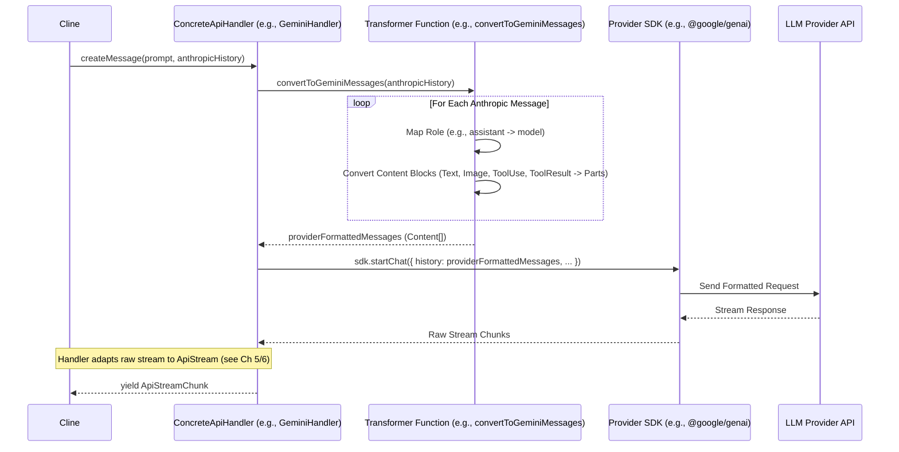

# Chapter 26: Message Transformation

Continuing from [Chapter 25: Assistant Message Parsing](25_assistant_message_parsing.md), where we focused on interpreting the structured responses coming *from* the AI assistant, this chapter addresses the inverse challenge: preparing the conversation history *for* the AI assistant, especially when dealing with diverse LLM provider APIs. We delve into **Message Transformation**.

## Motivation: Bridging the API Format Gap

Roo-Code aims to support a variety of LLM backends (OpenAI, Gemini, Mistral, AWS Bedrock, local models via Ollama, VS Code's built-in LM API, etc.). While this provides flexibility, it introduces complexity because each provider often expects conversation history and prompts in its own unique format. For example, roles might be named differently ("user" vs. "human"), content might be structured differently (simple strings vs. arrays of parts), image data requires specific encoding or structures, and tool usage often has entirely distinct representations (OpenAI's `tool_calls`/`tool` vs. Gemini's `functionCall`/`functionResponse`).

If the core agent logic within [Chapter 4: Cline](04_cline.md) had to handle these format variations directly, it would become incredibly brittle and difficult to extend. Roo-Code solves this by:

1.  Using a **standard internal format** for conversation history, based on Anthropic's `MessageParam` structure (`{ role: 'user' | 'assistant', content: string | ContentBlock[] }`).
2.  Implementing **transformer modules** responsible for converting this internal format into the specific structure required by each target LLM provider API just before the request is sent.

This ensures that `Cline` operates on a consistent internal representation, while the provider-specific details are neatly encapsulated within dedicated transformation functions.

**Central Use Case:** `Cline` needs to send a conversation history containing a user message with text and an image, followed by an assistant message requesting a tool call, and finally a user message containing the tool result, to Google's Gemini API.

*   **Internal Format (`apiConversationHistory`):**
    ```typescript
    [
      { role: 'user', content: [ { type: 'text', text: 'What is this?' }, { type: 'image', source: { type: 'base64', media_type: 'image/jpeg', data: '...' } } ] },
      { role: 'assistant', content: [ { type: 'tool_use', id: 'tool_123', name: 'image_analyzer', input: { query: 'describe' } } ] },
      { role: 'user', content: [ { type: 'tool_result', tool_use_id: 'tool_123', content: 'A picture of a cat.' } ] }
    ]
    ```
*   **Gemini API Requirement:** Gemini expects a different structure (`Content[]` with `role: 'user' | 'model'` and `parts: Part[]`, where parts can be `{text: ...}`, `{inlineData: ...}`, `{functionCall: ...}`, `{functionResponse: ...}`).
*   **Transformation:** Before calling the Gemini SDK, the `GeminiHandler` ([Chapter 5: ApiHandler](05_apihandler.md)) uses the `convertToGeminiMessages` function. This function iterates through the internal history, mapping roles, converting text blocks to `{text: ...}`, image blocks to `{inlineData: ...}`, tool use blocks to `{functionCall: ...}`, and tool result blocks to `{functionResponse: ...}` parts, producing the required `Content[]` array.

## Key Concepts

1.  **Internal Standard (`Anthropic.MessageParam`):** Roo-Code uses Anthropic's message structure (`{ role: 'user' | 'assistant', content: string | Array<TextBlock | ImageBlock | ToolUseBlock | ToolResultBlock> }`) as the canonical format for storing conversation history (`apiConversationHistory`) within `Cline`. This provides a rich structure capable of representing text, images, tool calls, and tool results.

2.  **Provider-Specific Formats:** Each LLM API has its own way of representing messages:
    *   **OpenAI:** `{ role: 'user' | 'assistant' | 'tool' | 'system', content: string | Array<{ type: 'text' | 'image_url', ... }>, tool_calls?: ..., tool_call_id?: ... }`
    *   **Gemini/Vertex AI:** `{ role: 'user' | 'model', parts: Array<{ text: ... } | { inlineData: ... } | { functionCall: ... } | { functionResponse: ... }> }`
    *   **Bedrock Converse:** `{ role: 'user' | 'assistant', content: Array<{ text: ... } | { image: ... } | { toolUse: ... } | { toolResult: ... }> }`
    *   **Mistral:** `{ role: 'user' | 'assistant' | 'tool' | 'system', content: string | Array<{ type: 'text' | 'image_url', ... }> }` (Similar to OpenAI but slightly different tool structure in some SDKs).
    *   **VS Code LM API:** `vscode.LanguageModelChatMessage` with roles and content parts (`TextPart`, `ToolCallPart`, `ToolResultPart`).
    *   **Simple Text:** Some providers or local models might only accept plain text strings, requiring all rich content to be flattened.

3.  **Transformation Functions (`src/api/transform/`):** Roo-Code isolates the conversion logic into dedicated files within `src/api/transform/`. Each file typically exports a function named like `convertTo<Provider>Messages` (e.g., `convertToOpenAiMessages`, `convertToGeminiMessages`, `convertToBedrockConverseMessages`, `convertToVsCodeLmMessages`, `convertToSimpleMessages`).
    *   **Input:** Takes an array of `Anthropic.MessageParam`.
    *   **Output:** Returns an array formatted according to the target provider's specification.

4.  **Content Type Handling:** These functions contain the logic to map the different `content` block types from the Anthropic format to the target format:
    *   `text` -> usually straightforward text properties.
    *   `image` (base64 source) -> `image_url` (OpenAI/Mistral), `inlineData` (Gemini), `image` (Bedrock), potentially ignored or represented as text placeholders for others.
    *   `tool_use` -> `tool_calls` (OpenAI), `functionCall` (Gemini), `toolUse` (Bedrock), specific `ToolCallPart` (VS Code LM). Parameter structures (`input`) might need serialization (e.g., JSON stringify for OpenAI function args).
    *   `tool_result` -> `tool` role messages with `tool_call_id` (OpenAI/Mistral), `functionResponse` (Gemini), `toolResult` (Bedrock), `ToolResultPart` (VS Code LM). Content might need flattening to string or specific structuring.

5.  **API Constraint Handling:** Transformers also implement logic required by specific APIs:
    *   **Merging Consecutive Messages:** Some models (like DeepSeek-R1 via `r1-format.ts`) don't allow consecutive messages with the same role. The transformer merges the content of such messages.
    *   **Role Mapping:** Translating roles (e.g., `assistant` -> `model`).
    *   **Tool Result Placement:** Ensuring tool results directly follow the corresponding assistant tool call message (crucial for OpenAI).
    *   **Content Simplification:** Flattening rich content (images, tools) into simple strings for providers that don't support complex inputs (`simple-format.ts`).

6.  **Integration with `ApiHandler`:** The concrete implementations of `ApiHandler` ([Chapter 5: ApiHandler](05_apihandler.md)) are responsible for calling the appropriate transformation function within their `createMessage` method *before* interacting with the provider's SDK.

## Using Message Transformation (Gemini Use Case)

Let's trace the transformation for the Gemini use case described earlier.

1.  **`Cline` prepares API call:** It has the `apiConversationHistory` in the standard Anthropic format (user w/ image -> assistant tool use -> user tool result).
2.  **`Cline` calls `createMessage`:** `cline.api.createMessage(systemPrompt, history)`, where `cline.api` is an instance of `GeminiHandler`.
3.  **`GeminiHandler.createMessage`:**
    *   Receives `systemPrompt` and `anthropicMessages`.
    *   Calls `geminiMessages = convertToGeminiMessages(anthropicMessages)`.
4.  **`convertToGeminiMessages` (`gemini-format.ts`):**
    *   Initializes `geminiContents: Content[] = []`.
    *   Iterates through `anthropicMessages`:
        *   **Message 1 (User):**
            *   `role = 'user'`.
            *   Calls `parts = convertAnthropicContentToGemini(message.content)`.
            *   `convertAnthropicContentToGemini` processes `[{ type: 'text', ... }, { type: 'image', ... }]`:
                *   Yields `{ text: 'What is this?' }`.
                *   Yields `{ inlineData: { data: '...', mimeType: 'image/jpeg' } }`.
            *   Adds `{ role: 'user', parts: [{ text: ... }, { inlineData: ... }] }` to `geminiContents`.
        *   **Message 2 (Assistant):**
            *   `role = 'model'`.
            *   Calls `parts = convertAnthropicContentToGemini(message.content)`.
            *   `convertAnthropicContentToGemini` processes `[{ type: 'tool_use', ... }]`:
                *   Yields `{ functionCall: { name: 'image_analyzer', args: { query: 'describe' } } }`.
            *   Adds `{ role: 'model', parts: [{ functionCall: ... }] }` to `geminiContents`.
        *   **Message 3 (User):**
            *   `role = 'user'`.
            *   Calls `parts = convertAnthropicContentToGemini(message.content)`.
            *   `convertAnthropicContentToGemini` processes `[{ type: 'tool_result', ... }]`:
                *   Extracts `toolName = 'image_analyzer'`.
                *   Yields `{ functionResponse: { name: 'image_analyzer', response: { name: 'image_analyzer', content: 'A picture of a cat.' } } }`.
            *   Adds `{ role: 'user', parts: [{ functionResponse: ... }] }` to `geminiContents`.
    *   Returns the `geminiContents` array.
5.  **`GeminiHandler` sends request:** Uses the Gemini SDK (`genai.getGenerativeModel(...).startChat({ history: geminiContents })`) with the transformed message history.

## Code Walkthrough

Let's examine snippets from the provided transformation files.

### Gemini Format (`src/api/transform/gemini-format.ts`)

```typescript
// --- File: src/api/transform/gemini-format.ts ---
import { Anthropic } from "@anthropic-ai/sdk";
import { Content, Part } from "@google/genai"; // Import Gemini types

// Converts a single Anthropic content array (or string) to Gemini Parts
export function convertAnthropicContentToGemini(content: string | Anthropic.ContentBlockParam[]): Part[] {
	if (typeof content === "string") { return [{ text: content }]; }

	// Use flatMap to handle cases where one block might produce multiple parts (tool result with image)
	return content.flatMap((block): Part | Part[] => {
		switch (block.type) {
			case "text":
				return { text: block.text }; // Simple mapping
			case "image":
				if (block.source.type !== "base64") { throw new Error("Unsupported image source type"); }
				// Map base64 image to inlineData part
				return { inlineData: { data: block.source.data, mimeType: block.source.media_type } };
			case "tool_use":
				// Map tool_use to functionCall part
				return { functionCall: { name: block.name, args: block.input as Record<string, unknown> } };
			case "tool_result": {
				if (!block.content) { return []; } // Skip empty results
				const toolName = block.tool_use_id.split("-")[0]; // Extract tool name
				// Handle string content directly
				if (typeof block.content === "string") {
					return { functionResponse: { name: toolName, response: { name: toolName, content: block.content } } };
				}
				// Handle array content (text + potential image) - less common for Gemini results?
				if (!Array.isArray(block.content)) { return []; }
				// ... [Logic to separate text and image parts, returning multiple Part objects if needed] ...
				// Simplified: Assume only text in tool results for Gemini for now
                const textContent = block.content.filter(p => p.type === 'text').map(p => p.text).join('\n');
                return { functionResponse: { name: toolName, response: { name: toolName, content: textContent } } };
			}
			default: throw new Error(`Unsupported content block type: ${block.type}`);
		}
	});
}

// Converts a single Anthropic message to a Gemini Content object
export function convertAnthropicMessageToGemini(message: Anthropic.Messages.MessageParam): Content {
	return {
		role: message.role === "assistant" ? "model" : "user", // Map roles
		parts: convertAnthropicContentToGemini(message.content), // Convert content blocks
	};
}

// Main function called by GeminiHandler
export function convertToGeminiMessages(anthropicMessages: Anthropic.Messages.MessageParam[]): Content[] {
    return anthropicMessages.map(convertAnthropicMessageToGemini);
}

// ... [Helper functions: getContentLength, getMessagesLength] ...
```

**Explanation:**

*   **Type Imports:** Imports types from both Anthropic SDK and `@google/genai`.
*   **`convertAnthropicContentToGemini`:** Handles the `content` array. It uses `flatMap` and a `switch` statement to map each Anthropic block type (`text`, `image`, `tool_use`, `tool_result`) to the corresponding Gemini `Part` structure (`{text: ...}`, `{inlineData: ...}`, `{functionCall: ...}`, `{functionResponse: ...}`). It includes error handling for unsupported types and specific logic for extracting data (like `toolName` from `tool_use_id`).
*   **`convertAnthropicMessageToGemini`:** Handles a single message. It maps the role (`assistant` -> `model`) and calls `convertAnthropicContentToGemini` for the content.
*   **`convertToGeminiMessages`:** The main export. Simply maps over the input array using `convertAnthropicMessageToGemini`.

### OpenAI Format (`src/api/transform/openai-format.ts`)

```typescript
// --- File: src/api/transform/openai-format.ts ---
import { Anthropic } from "@anthropic-ai/sdk";
import OpenAI from "openai"; // Import OpenAI types

// Main function called by OpenAiHandler
export function convertToOpenAiMessages(
	anthropicMessages: Anthropic.Messages.MessageParam[],
): OpenAI.Chat.ChatCompletionMessageParam[] {
	const openAiMessages: OpenAI.Chat.ChatCompletionMessageParam[] = [];

	for (const anthropicMessage of anthropicMessages) {
		// Handle simple string content
		if (typeof anthropicMessage.content === "string") {
			openAiMessages.push({ role: anthropicMessage.role, content: anthropicMessage.content });
		} else { // Handle complex content (array of blocks)
			if (anthropicMessage.role === "user") {
				// Separate tool results from other content (text/image)
				const { nonToolMessages, toolMessages } = anthropicMessage.content.reduce<{...}> (/* ... */);

				// *** Process Tool Results FIRST ***
				toolMessages.forEach((toolMessage) => {
					let content: string;
					if (typeof toolMessage.content === "string") { content = toolMessage.content; }
                    else { // Flatten array content to string
                        content = toolMessage.content?.map(part => part.type === 'text' ? part.text : '').join("\n") ?? "";
                    }
					openAiMessages.push({
						role: "tool", // Use 'tool' role for results
						tool_call_id: toolMessage.tool_use_id,
						content: content,
					});
				});

				// Process non-tool messages (text/image)
				if (nonToolMessages.length > 0) {
					openAiMessages.push({
						role: "user",
						content: nonToolMessages.map((part) => {
							if (part.type === "image") { // Map image block
								return {
									type: "image_url",
									image_url: { url: `data:${part.source.media_type};base64,${part.source.data}` },
								};
							}
							return { type: "text", text: part.text }; // Map text block
						}),
					});
				}
			} else if (anthropicMessage.role === "assistant") {
				// Separate tool calls from text content
				const { nonToolMessages, toolMessages } = anthropicMessage.content.reduce<{...}> (/* ... */);

				// Flatten text content
				let content: string | undefined = nonToolMessages.length > 0
					? nonToolMessages.map(part => part.type === 'text' ? part.text : '').join("\n")
					: undefined;

				// Map tool_use blocks to OpenAI's tool_calls structure
				let tool_calls: OpenAI.Chat.ChatCompletionMessageToolCall[] = toolMessages.map((toolMessage) => ({
					id: toolMessage.id,
					type: "function", // OpenAI uses 'function' type for tools
					function: {
						name: toolMessage.name,
						arguments: JSON.stringify(toolMessage.input), // Arguments must be a JSON string
					},
				}));

				// Construct the assistant message
				openAiMessages.push({
					role: "assistant",
					content: content, // Can be null/undefined if only tool_calls are present
					tool_calls: tool_calls.length > 0 ? tool_calls : undefined, // Omit if empty
				});
			}
		}
	}
	return openAiMessages;
}
```

**Explanation:**

*   Iterates through Anthropic messages.
*   Handles user messages by first outputting any `tool_result` blocks as separate `role: "tool"` messages (required by OpenAI), then outputs remaining `text` and `image` blocks as a single `role: "user"` message with array content.
*   Handles assistant messages by extracting `text` content and mapping `tool_use` blocks to `tool_calls` array, ensuring arguments are JSON stringified.
*   Correctly handles `image` blocks within user messages, converting them to `image_url` parts with data URIs.

### DeepSeek R1 Format (`src/api/transform/r1-format.ts`)

```typescript
// --- File: src/api/transform/r1-format.ts ---
// ... (Imports similar to openai-format.ts) ...
type Message = OpenAI.Chat.ChatCompletionMessageParam;
type AnthropicMessage = Anthropic.Messages.MessageParam;

/**
 * Converts Anthropic messages to OpenAI format while merging consecutive messages with the same role.
 * Required for DeepSeek Reasoner (R1) models.
 */
export function convertToR1Format(messages: AnthropicMessage[]): Message[] {
	// Use reduce to build the merged list
	return messages.reduce<Message[]>((merged, message) => {
		const lastMessage = merged.at(-1); // Get the previously added message
		let messageContent: string | (ContentPartText | ContentPartImage)[] = "";
		let hasImages = false;

		// Convert Anthropic content to OpenAI format (similar logic to convertToOpenAiMessages)
		if (Array.isArray(message.content)) {
			// ... [Logic to convert content array to string or array with image_url parts] ...
            // Simplified for brevity
            const textParts = message.content.filter(p => p.type === 'text').map(p => p.text);
            messageContent = textParts.join("\n");
            // NOTE: Image handling for merging needs careful consideration.
            // If merging text and image messages, the result MUST be an array.
		} else { messageContent = message.content; }

		// *** Merging Logic ***
		if (lastMessage?.role === message.role) {
			// Roles match: Append content to the last message
			if (typeof lastMessage.content === "string" && typeof messageContent === "string") {
				lastMessage.content += `\n${messageContent}`; // Append strings
			}
			// If either content is already an array (due to images), merge arrays
			else {
				// Convert both to arrays if needed
                const lastContentArray = Array.isArray(lastMessage.content) ? lastMessage.content : [{ type: "text" as const, text: lastMessage.content || "" }];
                const newContentArray = Array.isArray(messageContent) ? messageContent : [{ type: "text" as const, text: messageContent }];
                // Concatenate content parts
                lastMessage.content = [...lastContentArray, ...newContentArray];
			}
		} else {
			// Roles differ: Add a new message to the merged list
			// (Ensure correct type based on role - UserMessageParam or AssistantMessageParam)
            const newMessage = { role: message.role, content: messageContent } as Message;
			merged.push(newMessage);
		}

		return merged; // Return the updated merged array for the next iteration
	}, []); // Start with an empty array
}
```

**Explanation:**

*   Uses `reduce` to iterate and build the merged list.
*   In each iteration, it compares the `role` of the current `message` with the `role` of the `lastMessage` added to the `merged` array.
*   **If roles match:** It appends the `messageContent` to the `lastMessage.content`. It handles merging both string content and array content (for images).
*   **If roles differ:** It pushes a new message object (correctly typed for OpenAI) onto the `merged` array.
*   This ensures the final array has no consecutive messages with the same role.

### Other Formats (Conceptual Overview)

*   **`bedrock-converse-format.ts`:** Maps Anthropic roles/content to Bedrock Converse API's `Message` structure. Needs to handle base64 image data conversion to `Uint8Array` for the `image` block source and format `toolUse`/`toolResult` blocks according to Converse spec (potentially using XML strings for input/output within the JSON structure).
*   **`vscode-lm-format.ts`:** Maps to `vscode.LanguageModelChatMessage` objects. Requires converting content blocks into `vscode.LanguageModelTextPart`, `vscode.LanguageModelToolCallPart`, or `vscode.LanguageModelToolResultPart`. Special care is needed as the VS Code LM API might have limitations (e.g., image support). The `asObjectSafe` helper is used for tool inputs.
*   **`mistral-format.ts`:** Similar to OpenAI, mapping roles and content. The exact structure for `tool_calls` might differ slightly depending on the specific Mistral SDK/API version being targeted compared to OpenAI. Image handling uses `image_url`.
*   **`simple-format.ts`:** Flattens all content blocks (images, tools) into simple text placeholders (e.g., `[Image: image/jpeg]`, `[Tool Use: tool_name]`) and returns an array of simple `{ role: ..., content: string }` objects, suitable for models that only accept basic text input.

## Internal Implementation

The transformers are primarily functional mappers.

1.  **Input:** Receive `Anthropic.Messages.MessageParam[]`.
2.  **Iteration:** Use `map` (for 1:1 message conversion like Gemini) or `reduce` (for merging like R1) or a `for...of` loop (for complex ordering like OpenAI tool results) to process each message.
3.  **Role Mapping:** Convert `message.role` ('user'/'assistant') to the target provider's equivalent ('user'/'model', 'user'/'assistant', etc.).
4.  **Content Conversion:**
    *   Check if `message.content` is a string or an array.
    *   If array, iterate through the `ContentBlockParam` items.
    *   Use a `switch` statement on `block.type` (`text`, `image`, `tool_use`, `tool_result`).
    *   Inside each case, construct the corresponding part/block object required by the target API, extracting data from the Anthropic block (e.g., `block.text`, `block.source.data`, `block.name`, `block.input`, `block.tool_use_id`, `block.content`).
    *   Handle data type conversions (e.g., base64 string to `Uint8Array` for Bedrock, object to JSON string for OpenAI tool args).
    *   Handle structural differences (e.g., mapping `tool_result` to a separate `role: "tool"` message for OpenAI).
5.  **Constraint Handling (if needed):** Apply logic like merging consecutive messages or reordering based on provider rules.
6.  **Output:** Return the newly constructed array of messages in the target provider's format.

**Sequence Diagram (`ApiHandler` using Transformer):**



## Modification Guidance

Modifications typically involve updating transformations for existing providers or adding support for new ones.

**Common Modifications:**

1.  **Adding a New Provider Transformation (e.g., "YetAnotherLLM"):**
    *   **Create File:** Create `src/api/transform/yetanotherllm-format.ts`.
    *   **Define Types:** If the provider has specific SDK types, import them. Otherwise, define the expected message structure based on their API documentation.
    *   **Implement `convertToYetAnotherLLMMessages`:** Write the function following the pattern: take `Anthropic.Messages.MessageParam[]`, iterate, map roles, use a `switch` on content block types to convert `text`, `image`, `tool_use`, `tool_result` to the YetAnotherLLM format. Address any specific constraints (e.g., consecutive messages, supported content types).
    *   **Integrate:**
        *   Import and use this function within the new `YetAnotherLLMApiHandler`'s `createMessage` method.
        *   Update `buildApiHandler` factory ([Chapter 5: ApiHandler](05_apihandler.md)) to instantiate `YetAnotherLLMApiHandler`.

2.  **Updating an Existing Transformer (e.g., OpenAI adds a new content part type):**
    *   **Locate:** Open `src/api/transform/openai-format.ts`.
    *   **Update Types:** Import new types from the OpenAI SDK if necessary.
    *   **Modify Conversion:** Add handling for the new part type in the `content` array mapping logic within `convertToOpenAiMessages`. Decide which Anthropic block type (if any) corresponds to it, or how to represent it if it originates from a new Roo-Code feature.
    *   **Test:** Ensure the transformation correctly produces the new structure and doesn't break existing conversions.

3.  **Improving Image Handling for a Provider:**
    *   **Locate:** Find the `case "image":` block within the relevant `convertAnthropicContentTo<Provider>` function.
    *   **Modify:** Change how the `block.source.data` (base64) and `block.source.media_type` are mapped. Maybe the provider requires a different format (e.g., URL instead of inline data), requires specific MIME types, or has size limitations that need checking.
    *   **Test:** Test with various image types and sizes supported by the provider.

**Best Practices:**

*   **Isolate Logic:** Keep each provider's transformation logic within its dedicated file in `src/api/transform/`.
*   **Pure Functions:** Aim for transformation functions to be pure (output depends only on input, no side effects) for easier testing and predictability.
*   **Handle All Types:** Ensure transformers explicitly handle all defined Anthropic `ContentBlockParam` types (`text`, `image`, `tool_use`, `tool_result`). Throw errors or provide meaningful placeholders/warnings for unsupported types.
*   **Type Safety:** Use TypeScript types imported from provider SDKs where available to ensure the output matches the SDK's expectations.
*   **Consult API Docs:** Refer closely to the target LLM provider's API documentation for the exact required message structure, role names, content part formats, and constraints.
*   **Test Cases:** Create unit tests for transformation functions with various inputs (simple text, images, tool calls, tool results, mixed content, consecutive messages) to verify correct output and handling of constraints.

**Potential Pitfalls:**

*   **Format Mismatch:** Incorrectly mapping roles, content types, or tool structures will lead to API errors from the provider. Careful checking against API docs is crucial.
*   **Unhandled Content Types:** Forgetting to handle a specific `ContentBlockParam` type (like `tool_result`) will likely cause runtime errors or incorrect API requests.
*   **Constraint Violations:** Failing to merge consecutive messages for providers like DeepSeek R1, or incorrectly ordering tool results for OpenAI, will result in API errors.
*   **Data Conversion Errors:** Errors during data conversion (e.g., invalid base64 for images, non-JSON stringifiable tool arguments, unsupported image MIME types) can break the transformation or cause downstream API failures.
*   **SDK Type Changes:** Updates to provider SDKs might change the required message types, necessitating updates to the corresponding transformation functions.

## Conclusion

Message Transformation is a vital layer in Roo-Code's architecture, enabling seamless communication with diverse LLM providers despite their varying API formats. By maintaining a standard internal message representation based on Anthropic's structure and implementing dedicated transformer functions (`src/api/transform/*`) for each provider, Roo-Code isolates format-specific logic and keeps the core agent (`Cline`) clean and adaptable. These transformers handle the crucial mapping of roles, content types (text, images, tools), and API-specific constraints, ensuring that conversation history is correctly prepared before being sent to the chosen LLM.

Next, we'll look at specific challenges and strategies related to interacting with one particular provider: AWS Bedrock. The following chapter discusses [Chapter 27: Bedrock Model Identification](27_bedrock_model_identification.md).

Relevant Code Snippets (provided in chapter context):
--- File: src/api/transform/gemini-format.ts ---
--- File: src/api/transform/simple-format.ts ---
--- File: src/api/transform/vscode-lm-format.ts ---
--- File: src/api/transform/bedrock-converse-format.ts ---
--- File: src/api/transform/openai-format.ts ---
--- File: src/api/transform/r1-format.ts ---
--- File: src/api/transform/mistral-format.ts ---
--- File: src/api/transform/vertex-gemini-format.ts ---

