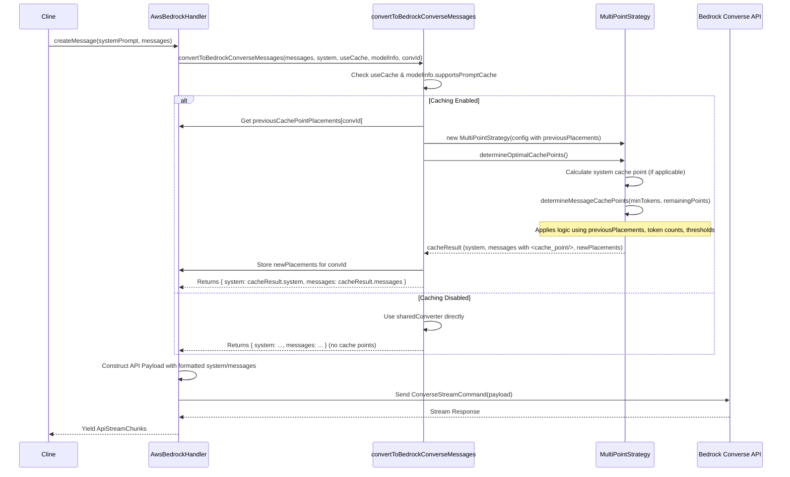

# Chapter 28: Bedrock Cache Strategy

Continuing from [Chapter 27: Bedrock Model Identification](27_bedrock_model_identification.md), where we addressed the complexities of identifying target models within AWS Bedrock, this chapter focuses on optimizing interactions with specific Bedrock models by implementing a **Bedrock Cache Strategy**.

## Motivation: Reducing Latency and Cost with Bedrock Prompt Caching

AWS Bedrock offers a Prompt Caching feature for certain models (like the Anthropic Claude 3 series). This feature allows the Bedrock service to store and reuse the processed state of parts of your prompt (system prompt or message history segments). When a subsequent request reuses cached content, Bedrock can skip reprocessing that part, leading to significantly reduced latency and lower input token costs.

However, effectively using this feature requires strategically placing "cache points" (`<cache_point/>`) within the conversation history sent to the Bedrock API. Simply caching everything isn't always optimal, and different models have different capabilities regarding the *number* of cache points supported (`maxCachePoints`) and the *minimum size* of a cacheable segment (`minTokensPerCachePoint`). We need a strategy to determine the best locations for these cache points to maximize cache hits while adhering to model constraints.

The `Bedrock Cache Strategy` abstraction provides this logic. It defines a common interface (`BaseStrategy`) and a concrete implementation (`MultiPointStrategy`) to analyze the conversation history, system prompt, and model capabilities, and then determine the optimal placement of cache points before the request is sent to Bedrock.

**Central Use Case:** Roo-Code is interacting with `anthropic.claude-3-sonnet-...` on Bedrock, which supports multiple cache points. The conversation grows over several turns.

1.  **Initial Request:** The strategy might place a cache point after the system prompt (if large enough) and potentially after the first user message.
2.  **Second Request (User adds message):** The strategy receives the updated message list *and* the locations of the cache points placed in the *previous* request. It aims to preserve the previous cache points (N-1 rule) to maximize hits. It analyzes the token count of the new messages and decides if/where to place an additional cache point or if combining existing cache points is more beneficial based on token distribution.
3.  **Bedrock API Call:** The [Chapter 5: ApiHandler](05_apihandler.md) (specifically `AwsBedrockHandler`) uses the strategy's output to format the message list with the calculated `<cache_point/>` placements before sending the request to the Bedrock Converse API.
4.  **Result:** By reusing cached segments, Bedrock processes the request faster and charges fewer input tokens.

This dynamic placement, considering previous state and token counts, is crucial for efficiently leveraging Bedrock's multi-point caching.

## Key Concepts

1.  **AWS Bedrock Prompt Caching:** A feature where Bedrock stores the computed state associated with parts of a prompt, identified by cache points. If a subsequent request uses the same cache points with identical preceding content, Bedrock reuses the stored state.
2.  **Cache Points (`<cache_point type="default"/>`):** Special XML-like tags inserted into the Bedrock Converse API message structure (`system` or `messages` content arrays) to mark boundaries for caching. Content *before* a cache point can be cached and potentially reused.
3.  **Model Capabilities (in `ModelInfo`):** Stored in `src/shared/api.ts` and accessed via `AwsBedrockHandler.getModel()`. Relevant fields include:
    *   `supportsPromptCache: boolean`: Whether the model supports the feature at all.
    *   `maxCachePoints: number`: The maximum number of cache points allowed (e.g., 1 for single-point, >1 for multi-point).
    *   `minTokensPerCachePoint: number`: The minimum number of tokens required in a segment preceding a cache point for it to be effective.
    *   `cachableFields: Array<"system" | "messages">`: Specifies if the system prompt and/or messages can be cached.
4.  **`BaseStrategy` (`src/api/transform/cache-strategy/base-strategy.ts`):** An abstract class defining the interface for any cache strategy.
    *   **`constructor(config: CacheStrategyConfig)`:** Takes configuration including model info, messages, system prompt, and potentially previous placements.
    *   **`determineOptimalCachePoints(): CacheResult` (Abstract):** The core method subclasses must implement to return the structured messages with cache points.
    *   **Protected Helpers:** Includes methods for token counting (`estimateTokenCount`), checking thresholds (`meetsMinTokenThreshold`), creating cache point blocks (`createCachePoint`), applying placements (`applyCachePoints`), etc.
5.  **`MultiPointStrategy` (`src/api/transform/cache-strategy/multi-point-strategy.ts`):** The primary concrete implementation. It handles both single and multiple cache points. Its logic includes:
    *   **System Prompt Caching:** Places a cache point after the system prompt if supported, enabled, and the prompt meets the minimum token threshold.
    *   **Message Caching (`determineMessageCachePoints`):**
        *   **Initial Placement:** For new conversations, it iterates through potential user message boundaries, placing cache points greedily after the last possible user message within a range, ensuring `minTokensPerCachePoint` is met, until `maxCachePoints` are used.
        *   **Growing Conversation Placement (Handling `previousCachePointPlacements`):** Aims to preserve N-1 previous cache points. It compares the token count of new messages (since the last previous cache point) against the token count of the smallest segment between existing cache points. It only reallocates (combines previous points to make room for a new point) if the new message segment is significantly larger (e.g., > 20% larger) than the smallest existing segment, otherwise it preserves all previous points.
6.  **`CacheStrategyConfig` (`src/api/transform/cache-strategy/types.ts`):** Defines the input required by the strategy constructor, including `modelInfo`, `systemPrompt`, `messages`, `usePromptCache` flag, and crucially, `previousCachePointPlacements`.
7.  **`CacheResult` (`src/api/transform/cache-strategy/types.ts`):** Defines the output of `determineOptimalCachePoints`. Contains the formatted `system` blocks and `messages` array (in Bedrock Converse format, including `<cache_point/>` blocks) and optionally the `messageCachePointPlacements` array for the handler to store.
8.  **`CachePointPlacement` (`src/api/transform/cache-strategy/types.ts`):** A structure `{ index: number; type: "system" | "message"; tokensCovered: number }` used to represent where a cache point was placed and how many tokens precede it (since the last cache point or start). This is stored by `AwsBedrockHandler` per conversation and passed back into the strategy on subsequent calls.
9.  **`AwsBedrockHandler` Integration:**
    *   Stores `previousCachePointPlacements` in a map keyed by a conversation identifier.
    *   In `convertToBedrockConverseMessages` (a private helper called by `createMessage`), it checks if caching is supported and enabled.
    *   If yes, it creates `CacheStrategyConfig` (including previous placements for the conversation).
    *   Instantiates `MultiPointStrategy`.
    *   Calls `determineOptimalCachePoints()` to get the `CacheResult`.
    *   Stores the `messageCachePointPlacements` from the result for the next call in this conversation.
    *   Uses the formatted `system` and `messages` from the `CacheResult` when constructing the payload for the Bedrock API call.

## Using the Bedrock Cache Strategy

The strategy is applied automatically within `AwsBedrockHandler` if the conditions (model support, user setting enabled) are met.

**Trace (Growing Conversation - Example 2 from Docs):**

1.  **Previous Request (Example 1 State):** User sent message 1, AI responded (message 2), User sent message 3. The handler called the strategy, which determined one cache point was optimal after message 2 (index 2). The handler stored `[{ index: 2, type: "message", tokensCovered: 240 }]` for this conversation ID.
2.  **New User Message:** User sends message 5 ("How do neural networks work?"). `Cline` adds this to the history.
3.  **`Cline` calls `createMessage`:** Passes the full history (now 5 messages) to `AwsBedrockHandler`.
4.  **`AwsBedrockHandler` calls `convertToBedrockConverseMessages`:**
    *   Gets model info (supports cache, `maxCachePoints: 3`, `minTokensPerPoint: 100`).
    *   Retrieves `previousPlacements = [{ index: 2, ... }]` for this conversation ID.
    *   Creates `config = { modelInfo, systemPrompt: ..., messages: [msg1, msg2, msg3, msg4, msg5], usePromptCache: true, previousCachePointPlacements }`.
    *   Creates `strategy = new MultiPointStrategy(config)`.
    *   Calls `cacheResult = strategy.determineOptimalCachePoints()`.
5.  **`MultiPointStrategy.determineOptimalCachePoints`:**
    *   Calls `determineMessageCachePoints(minTokensPerPoint: 100, remainingCachePoints: 3)` (assuming no system cache).
6.  **`determineMessageCachePoints` (Handling Previous Placements):**
    *   Detects `previousPlacements` is not empty.
    *   Calculates `newMessagesTokens` (tokens in messages 4 & 5) ≈ 230.
    *   Checks `newMessagesTokens >= minTokensPerPoint` (230 >= 100 -> true).
    *   Checks `remainingCachePoints (3) > previousPlacements.length (1)` -> true.
    *   **Action:** Keep all previous placements. Adds `{ index: 2, ... }` to the new `placements` array.
    *   **Action:** Find placement for new messages (index 3 to 4). Calls `findOptimalPlacementForRange(3, 4, 100)`.
    *   `findOptimalPlacementForRange` finds the last user message (index 4). Calculates tokens from index 3 to 4 (approx 230). Since 230 >= 100, returns `{ index: 4, type: "message", tokensCovered: 230 }`.
    *   **Action:** Adds the new placement `{ index: 4, ... }` to `placements`.
    *   Returns `placements = [{ index: 2, ... }, { index: 4, ... }]`.
7.  **`determineOptimalCachePoints`:**
    *   Calls `applyCachePoints(bedrockMessages, placements)` to insert `<cache_point/>` blocks after message indices 2 and 4 in the formatted Bedrock message array.
    *   Returns `cacheResult = { system: ..., messages: <formatted_with_cache_points>, messageCachePointPlacements: placements }`.
8.  **`AwsBedrockHandler`:**
    *   Stores `cacheResult.messageCachePointPlacements` for the conversation ID, replacing the old placement list.
    *   Uses `cacheResult.system` and `cacheResult.messages` in the `ConverseStreamCommand` payload.
9.  **API Call:** Bedrock receives the request with two cache points. It likely reuses the state computed up to the first cache point (from the previous request) and computes the rest.

## Code Walkthrough

*(Referencing code snippets provided in the prompt for Chapters 27/28)*

### Strategy Types (`src/api/transform/cache-strategy/types.ts`)

*   **`ModelInfo`:** Defines the specific fields relevant to caching (`supportsPromptCache`, `maxCachePoints`, `minTokensPerCachePoint`, `cachableFields`). These are expected to be present in the `ModelInfo` objects defined in `src/shared/api.ts` for cache-enabled Bedrock models.
*   **`CacheResult`:** Specifies the output containing Bedrock-formatted `system` and `messages` arrays (potentially with `<cache_point/>` blocks) and the `messageCachePointPlacements` for tracking.
*   **`CachePointPlacement`:** Structure for tracking placement index, type, and token count.
*   **`CacheStrategyConfig`:** Input structure holding all necessary configuration for the strategy.

### Base Strategy (`src/api/transform/cache-strategy/base-strategy.ts`)

*   **Abstract Class:** Defines the `determineOptimalCachePoints` abstract method.
*   **Constructor:** Stores config, calls helpers to calculate `systemTokenCount`.
*   **`estimateTokenCount`:** Provides a basic token estimation heuristic (word count based with overhead). *Note: This might differ from the potentially more accurate `apiHandler.countTokens` used elsewhere. Consistency could be improved here.*
*   **`meetsMinTokenThreshold`:** Simple check against `config.modelInfo.minTokensPerCachePoint`.
*   **`createCachePoint`:** Returns the Bedrock structure for a cache point block.
*   **`messagesToContentBlocks`:** Basic conversion from Anthropic messages to Bedrock `Message[]` structure (without cache points initially). *Note: This duplicates some logic from the main `convertToBedrockConverseMessages`; refactoring might be possible.*
*   **`applyCachePoints`:** Takes the Bedrock `messages` array and `placements`, inserting the cache point block at the specified indices.
*   **`formatResult`:** Bundles `system` and `messages` into the `CacheResult` structure.

### Multi-Point Strategy (`src/api/transform/cache-strategy/multi-point-strategy.ts`)

*   **`determineOptimalCachePoints`:** The main public method.
    *   Checks `usePromptCache` and message count.
    *   Handles optional system prompt caching based on support, threshold, and remaining points.
    *   If message caching is supported, calls `determineMessageCachePoints`.
    *   Calls `applyCachePoints` to insert points into Bedrock messages.
    *   Stores `placements` in the `CacheResult`.
*   **`determineMessageCachePoints`:** Implements the core logic for placing points in messages.
    *   Handles the **initial placement** case (`previousPlacements.length === 0`) using `findOptimalPlacementForRange` iteratively.
    *   Handles the **growing conversation** case:
        *   Calculates `newMessagesTokens`.
        *   If enough new tokens and enough `remainingCachePoints` > `previousPlacements.length`, it keeps all previous points and adds a new one for the new messages.
        *   If not enough `remainingCachePoints` or need to re-evaluate, it compares `newMessagesTokens` against the smallest gap between existing points (with a 20% buffer `requiredPercentageIncrease`).
        *   If new tokens significantly exceed the smallest gap threshold, it combines the two previous points spanning the smallest gap by finding a new optimal placement within their combined range and keeps other previous points. If a slot was freed, it adds a new point for the new messages.
        *   If new tokens *don't* exceed the threshold, it preserves all existing valid `previousPlacements`.
*   **`findOptimalPlacementForRange`:** Simple strategy: finds the last user message index within the given range. Calculates tokens covered since the *actual* previous cache point (or start) up to this user message index. Returns placement only if `minTokensPerPoint` is met.
*   **`formatWithoutCachePoints`:** Helper to return the result when caching is disabled or not applicable.

### Handler Integration (`src/api/providers/bedrock.ts`)

*   **`previousCachePointPlacements`:** A private map `{[conversationId: string]: CachePointPlacement[]}` added to the handler to store placements between calls for the same conversation.
*   **`supportsAwsPromptCache`:** Helper method checking the flags in the resolved `modelConfig.info`.
*   **`convertToBedrockConverseMessages` (Modified):**
    *   This method now acts as the integration point.
    *   It performs the initial conversion using the *shared* `sharedConverter` (from `bedrock-converse-format.ts`).
    *   If `usePromptCache` is true (checked via `supportsAwsPromptCache` and user setting `awsUsePromptCache`):
        *   It retrieves `previousPlacements` for the `conversationId`.
        *   It creates the `CacheStrategyConfig`.
        *   It instantiates `MultiPointStrategy`.
        *   It calls `determineOptimalCachePoints()` to get `cacheResult`.
        *   It stores `cacheResult.messageCachePointPlacements` in `this.previousCachePointPlacements[conversationId]`.
        *   It returns `{ system: cacheResult.system, messages: cacheResult.messages }`.
    *   If `usePromptCache` is false, it returns the result from the `sharedConverter` directly (with system prompt added).
*   **`createMessage`:** Calls `convertToBedrockConverseMessages` to get the potentially cache-optimized `system` and `messages` before building the final API payload. Passes a `conversationId` (e.g., derived from `taskId` or initial message content).

## Internal Implementation

The strategy execution involves token estimation, analyzing previous state, and applying placement rules.

**Step-by-Step (`determineMessageCachePoints` - Growing Conversation):**

1.  Get `config.messages` and `config.previousCachePointPlacements`.
2.  Calculate `totalTokens` for all current messages using `estimateTokenCount`.
3.  Find `lastPreviousIndex` from `previousPlacements`.
4.  Calculate `newMessagesTokens` by summing `estimateTokenCount` for messages from `lastPreviousIndex + 1` onwards.
5.  Check if `newMessagesTokens >= minTokensPerPoint`. If not, preserve valid previous points and return.
6.  Check if `remainingCachePoints > previousPlacements.length`.
    *   If yes: Copy valid `previousPlacements`. Call `findOptimalPlacementForRange` for the new message range (`lastPreviousIndex + 1` to end). Add the new placement if valid. Return combined placements.
7.  If no (all cache points potentially used):
    *   Calculate `tokensBetweenPlacements` for each segment defined by `previousPlacements`.
    *   Find `smallestGapIndex` and `smallestGap` (sum of tokens for two adjacent segments).
    *   Calculate `requiredTokenThreshold = smallestGap * 1.2`.
    *   Compare `newMessagesTokens >= requiredTokenThreshold`.
    *   If yes (Combine): Build new `placements` list, skipping `smallestGapIndex` and `smallestGapIndex + 1`. Call `findOptimalPlacementForRange` for the *combined* range of the skipped points and add the result. If `placements.length < remainingCachePoints`, also call `findOptimalPlacementForRange` for the new messages and add the result. Return combined/reallocated placements.
    *   If no (Preserve): Build new `placements` list by copying all valid `previousPlacements`. Return preserved placements.

**Sequence Diagram (`AwsBedrockHandler` using Strategy):**

## Modification Guidance

Modifications could involve refining the strategy logic, changing thresholds, or adding entirely new strategies.

**Common Modifications:**

1.  **Adjusting Thresholds/Parameters:**
    *   **`minTokensPerCachePoint`:** Modify this value in the `bedrockModels` definition (`src/shared/api.ts`) for specific models. A lower value allows caching smaller segments but might increase the number of cache points used (potentially hitting `maxCachePoints` sooner). A higher value requires larger segments.
    *   **`requiredPercentageIncrease` (in `MultiPointStrategy`):** Change the `1.2` multiplier used when deciding whether to combine cache points. A higher value makes combining less likely (preserving history more), while a lower value makes it more likely (prioritizing caching newer, larger segments).
    *   **Hardcoded Fraction (in `truncateConversationIfNeeded`):** Change the `0.5` used by `truncateConversation` if that function is called by the strategy (though the current strategy focuses on placement, not truncation directly like the sliding window chapter).

2.  **Refining Placement Logic (`MultiPointStrategy`):**
    *   **`findOptimalPlacementForRange`:** Change the simple "last user message" logic. Maybe find a user message closer to the middle of the range, or consider token density within the range.
    *   **`determineMessageCachePoints` (Growing Conversation):** Modify the logic for comparing `newMessagesTokens` and `smallestGap`. Implement a different heuristic for deciding when to preserve vs. combine/reallocate points based on `maxCachePoints` and token distribution.

3.  **Adding a New `CacheStrategy` Implementation:**
    *   **Create Class:** Define `MyNewStrategy extends BaseStrategy`.
    *   **Implement `determineOptimalCachePoints`:** Write custom logic to analyze `this.config` and return a `CacheResult`.
    *   **Update Handler:** Modify `AwsBedrockHandler.convertToBedrockConverseMessages` to conditionally instantiate `MyNewStrategy` based on model info or configuration if desired (though currently, only `MultiPointStrategy` is used).

**Best Practices:**

*   **Model-Specific Tuning:** Cache parameters (`maxCachePoints`, `minTokensPerCachePoint`) should ideally be based on recommendations or characteristics of specific Bedrock models, defined accurately in `bedrockModels`.
*   **Consistency:** The strategy for handling `previousCachePointPlacements` is key to maximizing cache hits across consecutive requests in a conversation. The N-1 preservation rule is a reasonable starting point.
*   **Token Estimation Accuracy:** The effectiveness of placement relies on `estimateTokenCount`. Ensure this provides a reasonable approximation. Consider if the more accurate `ApiHandler.countTokens` could be passed into or used by the strategy for better results, weighing performance implications.
*   **Testing:** Test caching behavior with different conversation lengths, message sizes, and model configurations to verify effectiveness and avoid regressions. Monitor actual token usage reported by Bedrock.
*   **Simplicity vs. Optimality:** The current `MultiPointStrategy` logic balances complexity with effectiveness. Overly complex placement algorithms might offer marginal gains at the cost of harder maintenance and potential bugs.

**Potential Pitfalls:**

*   **Incorrect `ModelInfo`:** If `maxCachePoints` or `minTokensPerCachePoint` are wrong for a model, the strategy might place too many, too few, or ineffective cache points, leading to API errors or poor caching performance.
*   **Token Estimation Errors:** Significant errors in `estimateTokenCount` could lead to suboptimal placement decisions (placing points before `minTokensPerCachePoint` is actually met, or failing to place points where they would be valid).
*   **State Management:** Errors in storing or retrieving `previousCachePointPlacements` by `AwsBedrockHandler` would break the consistency logic for growing conversations, likely reducing cache hits.
*   **Off-by-One Errors:** Incorrect indexing when calculating ranges, slicing messages, or applying placements can lead to errors or misplaced cache points.
*   **API Changes:** Changes in how Bedrock implements or interprets cache points could require updates to the strategy or the `<cache_point/>` block structure.

## Conclusion

The Bedrock Cache Strategy, primarily implemented via `MultiPointStrategy`, provides an intelligent approach to leveraging AWS Bedrock's prompt caching feature. By analyzing model capabilities, conversation history, token counts, and previous placements, it aims to strategically insert cache points to minimize latency and cost. The integration within `AwsBedrockHandler` ensures this optimization is applied automatically when interacting with compatible models, enhancing the efficiency of Roo-Code's Bedrock usage.

With caching strategies covered, we now turn to another crucial aspect of LLM interaction: calculating the financial cost. The next chapter details the [Chapter 29: Cost Calculation Utilities](29_cost_calculation_utilities.md).

