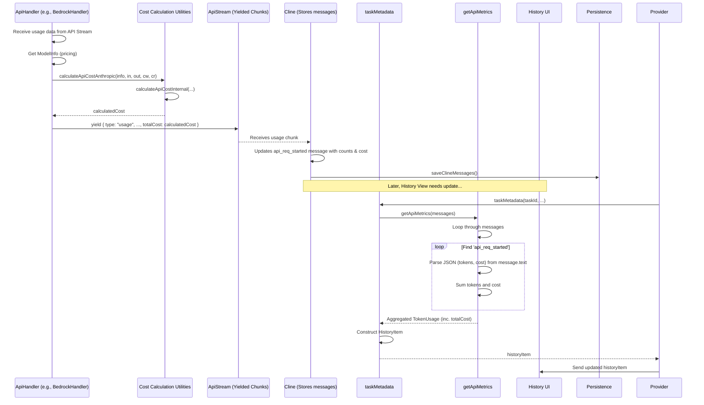

# Chapter 29: Cost Calculation Utilities

Continuing from [Chapter 28: Bedrock Cache Strategy](28_bedrock_cache_strategy.md), where we discussed optimizing Bedrock interactions using prompt caching, this chapter focuses on a related practical concern: understanding and estimating the financial cost associated with using various LLM providers. We introduce the **Cost Calculation Utilities**.

## Motivation: Tracking and Estimating API Usage Costs

Interacting with powerful Large Language Models often incurs costs based on the number of tokens processed (both input and output). Different models and providers have varying pricing tiers. For users leveraging cloud-based models (like those from OpenAI, Anthropic, Google, or AWS Bedrock), keeping track of estimated costs is essential for:

1.  **Budgeting:** Understanding how much usage is costing.
2.  **Model Comparison:** Evaluating the cost-effectiveness of different models for specific tasks.
3.  **Optimization:** Identifying high-cost interactions that might benefit from prompt engineering or caching strategies.

Roo-Code needs a standardized way to calculate the estimated cost of API calls based on the specific model's pricing information and the number of tokens involved, including handling nuances like prompt caching tokens which might be priced differently or affect input token counts depending on the provider.

**Central Use Case:** Roo-Code completes an API request using AWS Bedrock with Anthropic Claude 3 Sonnet, utilizing prompt caching. The API response metadata indicates: `inputTokens: 500` (non-cached), `outputTokens: 1500`, `cacheReadInputTokens: 1000`. Roo-Code needs to calculate the estimated cost.

1.  Roo-Code retrieves Sonnet's pricing information (input, output, cache read prices per million tokens) stored in its `ModelInfo`.
2.  It needs to use the correct calculation logic, recognizing that for Anthropic/Bedrock, `inputTokens` usually represents *only* the non-cached input.
3.  It calls `calculateApiCostAnthropic(sonnetModelInfo, 500, 1500, 0, 1000)`.
4.  The utility calculates the cost based on the respective token counts and prices: `(500 * inputPrice) + (1500 * outputPrice) + (1000 * cacheReadPrice)`.
5.  This calculated cost is stored (often within the `api_req_started` message metadata) and aggregated by `getApiMetrics` to provide cumulative cost information for the task in the History view. If the provider were OpenAI-like, `calculateApiCostOpenAI` would be used instead, adjusting the input token count internally.

## Key Concepts

1.  **Provider Pricing Models (`ModelInfo`):** The foundation for cost calculation is the pricing information associated with each specific LLM. This is stored within the `ModelInfo` objects (defined in `src/shared/api.ts`). Key fields include:
    *   `inputPrice`: Cost per million input tokens.
    *   `outputPrice`: Cost per million output tokens.
    *   `cacheWritesPrice` (Bedrock/Anthropic specific): Cost per million tokens *written* to the prompt cache.
    *   `cacheReadsPrice` (Bedrock/Anthropic specific): Cost per million tokens *read* from the prompt cache.
    *   These prices are typically stored as numbers representing the cost in USD per 1,000,000 tokens.

2.  **Token Types & Provider Differences:** The cost depends on different types of tokens reported by the API:
    *   **Input Tokens:** Tokens sent *to* the model. Crucially, how cached tokens are counted differs:
        *   **Anthropic/Bedrock Style:** The primary `inputTokens` reported usually *excludes* tokens served from the cache. Cache usage is reported separately (`cacheReadInputTokens`).
        *   **OpenAI Style:** The `prompt_tokens` reported *includes* tokens that might have been served from an internal cache (though OpenAI's caching is less explicit/controllable than Bedrock's).
    *   **Output Tokens:** Tokens generated *by* the model.
    *   **Cache Write Tokens:** Tokens processed and written *into* the cache during a request (Bedrock specific).
    *   **Cache Read Tokens:** Tokens served *from* the cache instead of being fully processed (Bedrock specific).

3.  **Core Calculation Logic (`calculateApiCostInternal`):** A private helper function that performs the fundamental cost calculation based on token counts and prices per million tokens for each category (input, output, cache writes, cache reads).
    `Cost = (inputTokens * inputPrice/1M) + (outputTokens * outputPrice/1M) + (cacheWriteTokens * cacheWritePrice/1M) + (cacheReadTokens * cacheReadPrice/1M)`

4.  **Provider-Specific Wrappers:**
    *   **`calculateApiCostAnthropic(modelInfo, input, output, cacheWrites?, cacheReads?)`:** Public function intended for providers like Anthropic and Bedrock Converse API where the reported `inputTokens` *excludes* cache reads. It directly passes the provided token counts to `calculateApiCostInternal`.
    *   **`calculateApiCostOpenAI(modelInfo, input, output, cacheWrites?, cacheReads?)`:** Public function for providers like OpenAI where the reported `inputTokens` (*prompt_tokens*) *includes* any internally cached tokens. It calculates `nonCachedInputTokens = max(0, inputTokens - cacheWriteTokens - cacheReadTokens)` before calling `calculateApiCostInternal`. This ensures only the non-cached input tokens are charged at the standard input rate, while cached tokens are accounted for separately (though OpenAI doesn't explicitly report/price cache reads/writes like Bedrock).

5.  **Price Parsing (`parseApiPrice`):** A utility function used when loading model configurations. It converts string prices (often provided per 1k or 1M tokens in external sources) into the standardized numeric format (cost per 1M tokens) used internally.

6.  **Aggregation (`getApiMetrics`):** The `getApiMetrics` function (in `src/shared/getApiMetrics.ts`) is responsible for calculating the *total* cost and token usage for a task. It processes the array of `ClineMessage` objects for the task, finds all `api_req_started` messages (which store the cost and token counts for individual API calls, calculated using the cost utilities), parses the JSON data within them, and sums the `cost`, `tokensIn`, `tokensOut`, etc., fields.

## Using the Cost Calculation Utilities

These utilities are primarily used internally when processing API responses or calculating aggregate task metrics.

**Scenario 1: Calculating Cost within `AwsBedrockHandler`**

```typescript
// --- Conceptual code within AwsBedrockHandler.createMessage ---
// (Inside the stream processing loop)

if (streamEvent.metadata?.usage || streamEvent?.trace?.promptRouter?.usage) {
    const usage = (streamEvent.metadata?.usage || streamEvent.trace?.promptRouter?.usage) as UsageType;
    const inputTokens = usage.inputTokens || 0;
    const outputTokens = usage.outputTokens || 0;
    // Bedrock reports cache usage separately
    const cacheReadTokens = usage.cacheReadInputTokens || usage.cacheReadInputTokenCount || 0;
    const cacheWriteTokens = usage.cacheWriteInputTokens || usage.cacheWriteInputTokenCount || 0;

    // Get the correct ModelInfo (potentially updated by router trace)
    const currentModelInfo = this.costModelConfig.info;

    // Calculate cost using the Anthropic/Bedrock style
    const cost = calculateApiCostAnthropic(
        currentModelInfo,
        inputTokens, // Represents non-cached input for Bedrock
        outputTokens,
        cacheWriteTokens,
        cacheReadTokens
    );

    // Yield the usage chunk including the calculated cost
    yield {
        type: "usage",
        inputTokens: inputTokens,
        outputTokens: outputTokens,
        cacheReadTokens: cacheReadTokens,
        cacheWriteTokens: cacheWriteTokens,
        totalCost: cost // Include calculated cost
    };
}
```
*Explanation:* The Bedrock handler receives usage information (including separate cache tokens) from the stream. It uses `calculateApiCostAnthropic` because Bedrock/Anthropic report non-cached input separately. The calculated `cost` is then included in the `usage` chunk yielded by the `ApiStream`.

**Scenario 2: Calculating Cost within `OpenAiHandler`**

```typescript
// --- Conceptual code within OpenAiHandler.processUsageMetrics ---

protected processUsageMetrics(usage: any, modelInfo?: ModelInfo): ApiStreamUsageChunk {
    const inputTokens = usage?.prompt_tokens || 0;
    const outputTokens = usage?.completion_tokens || 0;
    // OpenAI doesn't explicitly report cache reads/writes in standard usage object
    const cacheReadTokens = usage?.cache_read_input_tokens || undefined;
    const cacheWriteTokens = usage?.cache_creation_input_tokens || undefined;

    // Get relevant ModelInfo
    const currentModelInfo = modelInfo || this.getModel().info;

    // Calculate cost using the OpenAI style
    const cost = calculateApiCostOpenAI(
        currentModelInfo,
        inputTokens, // Represents TOTAL prompt tokens (including internal cache)
        outputTokens,
        cacheWriteTokens, // Pass if available (e.g., from Anthropic via OpenRouter)
        cacheReadTokens  // Pass if available
    );

    return {
        type: "usage",
        inputTokens: inputTokens,
        outputTokens: outputTokens,
        cacheReadTokens: cacheReadTokens,
        cacheWriteTokens: cacheWriteTokens,
        totalCost: cost // Include calculated cost
    };
}
```
*Explanation:* The OpenAI handler receives usage (`prompt_tokens`, `completion_tokens`). It uses `calculateApiCostOpenAI`. This function internally adjusts the `inputTokens` based on any provided `cacheRead/WriteTokens` before applying the standard input price, correctly reflecting that `prompt_tokens` includes cached tokens for OpenAI.

**Scenario 3: Aggregating Costs in `getApiMetrics`**

```typescript
// --- Conceptual code within getApiMetrics.ts ---
export function getApiMetrics(messages: ClineMessage[]) {
	const result: TokenUsage = { /* ... initial zeros ... */ };
	// ... (Find lastApiReq logic) ...

	messages.forEach((message) => {
		// Look for messages storing individual API call results
		if (message.type === "say" && message.say === "api_req_started" && message.text) {
			try {
				// Parse the stored metadata, which includes the pre-calculated cost
				const { tokensIn, tokensOut, cacheWrites, cacheReads, cost } = JSON.parse(message.text);

				// Sum up the values
				if (typeof tokensIn === "number") { result.totalTokensIn += tokensIn; }
				if (typeof tokensOut === "number") { result.totalTokensOut += tokensOut; }
				if (typeof cacheWrites === "number") { result.totalCacheWrites = (result.totalCacheWrites ?? 0) + cacheWrites; }
				if (typeof cacheReads === "number") { result.totalCacheReads = (result.totalCacheReads ?? 0) + cacheReads; }
				// *** Add the pre-calculated cost for this API call ***
				if (typeof cost === "number") { result.totalCost += cost; }

				// ... (Update contextTokens based on lastApiReq) ...
			} catch (error) { /* handle parse error */ }
		}
	});
	return result;
}
```
*Explanation:* `getApiMetrics` processes the `clineMessages` array. It finds `api_req_started` messages, parses the JSON string containing the token counts and the `cost` calculated by the utilities for that specific API call, and adds them to the running totals.

## Code Walkthrough

### Cost Utilities (`src/utils/cost.ts`)

```typescript
// --- File: src/utils/cost.ts ---
import { ModelInfo } from "../shared/api"; // Import ModelInfo type

/**
 * Internal helper to calculate API cost based on token counts and pricing.
 * Prices are expected per million tokens.
 */
function calculateApiCostInternal(
	modelInfo: ModelInfo,
	// Tokens charged at standard input rate
	inputTokensCharged: number,
	outputTokens: number,
	cacheCreationInputTokens: number, // Tokens written to cache
	cacheReadInputTokens: number, // Tokens read from cache
): number {
	// Calculate cost for each component, handling potentially undefined prices
	const cacheWritesCost = ((modelInfo.cacheWritesPrice || 0) / 1_000_000) * cacheCreationInputTokens;
	const cacheReadsCost = ((modelInfo.cacheReadsPrice || 0) / 1_000_000) * cacheReadInputTokens;
	const inputCost = ((modelInfo.inputPrice || 0) / 1_000_000) * inputTokensCharged;
	const outputCost = ((modelInfo.outputPrice || 0) / 1_000_000) * outputTokens;
	// Sum up the costs
	const totalCost = cacheWritesCost + cacheReadsCost + inputCost + outputCost;
	return totalCost;
}

/**
 * Calculates API cost for Anthropic/Bedrock style usage.
 * Assumes inputTokens parameter EXCLUDES cached tokens.
 */
export function calculateApiCostAnthropic(
	modelInfo: ModelInfo,
	inputTokens: number, // Non-cached input tokens
	outputTokens: number,
	cacheCreationInputTokens?: number,
	cacheReadInputTokens?: number,
): number {
	const cacheCreationInputTokensNum = cacheCreationInputTokens || 0;
	const cacheReadInputTokensNum = cacheReadInputTokens || 0;
	// Directly use inputTokens as inputTokensCharged
	return calculateApiCostInternal(
		modelInfo,
		inputTokens, // Passed directly as charged input
		outputTokens,
		cacheCreationInputTokensNum,
		cacheReadInputTokensNum,
	);
}

/**
 * Calculates API cost for OpenAI style usage.
 * Assumes inputTokens parameter INCLUDES cached tokens.
 */
export function calculateApiCostOpenAI(
	modelInfo: ModelInfo,
	inputTokens: number, // Total prompt tokens (including cached)
	outputTokens: number,
	cacheCreationInputTokens?: number, // Used to adjust inputTokensCharged
	cacheReadInputTokens?: number, // Used to adjust inputTokensCharged
): number {
	const cacheCreationInputTokensNum = cacheCreationInputTokens || 0;
	const cacheReadInputTokensNum = cacheReadInputTokens || 0;
	// Calculate the portion of inputTokens NOT served from cache
	const nonCachedInputTokens = Math.max(0, inputTokens - cacheCreationInputTokensNum - cacheReadInputTokensNum);
	// Use only non-cached tokens for standard input pricing
	return calculateApiCostInternal(
		modelInfo,
		nonCachedInputTokens, // Only non-cached input is charged standard rate
		outputTokens,
		cacheCreationInputTokensNum,
		cacheReadInputTokensNum,
	);
}

/**
 * Parses an API price string/number (potentially per 1k or 1M tokens)
 * and converts it to the internal representation (cost per 1M tokens).
 * Returns undefined if input is invalid.
 *
 * NOTE: This assumes external price sources might be inconsistent.
 * If prices in ModelInfo are already numbers per 1M, this is less critical.
 */
export const parseApiPrice = (price: any): number | undefined => {
    if (price === null || price === undefined) return undefined;
    // Simple implementation: Assume input 'price' is already per 1M tokens if number.
    // A more robust version might check if it's string, parse, and scale.
    const numPrice = typeof price === 'string' ? parseFloat(price) : price;
    if (typeof numPrice === 'number' && !isNaN(numPrice) && numPrice >= 0) {
        return numPrice; // Assume it's already per 1M
        // Example scaling: return parseFloat(price) * 1_000; // If input was per 1k
    }
    return undefined;
};

```

**Explanation:**

*   **`calculateApiCostInternal`:** Performs the core calculation. It takes the token counts for each category (standard input, output, cache write, cache read) and multiplies them by the corresponding price per million tokens found in `modelInfo`, summing the results. It handles potentially missing prices by defaulting them to 0.
*   **`calculateApiCostAnthropic`:** Calls `calculateApiCostInternal`, passing the `inputTokens` argument directly as `inputTokensCharged`. This reflects the assumption that the input value already represents only the non-cached tokens.
*   **`calculateApiCostOpenAI`:** Calculates `nonCachedInputTokens` by subtracting cache writes and reads from the total `inputTokens` provided. It then passes this `nonCachedInputTokens` value to `calculateApiCostInternal` as `inputTokensCharged`. This correctly accounts for the different counting method.
*   **`parseApiPrice`:** Provides a basic conversion utility, primarily ensuring the price is a valid non-negative number. *Note: The provided implementation assumes the input `price` is likely already the desired numeric format (per 1M tokens). A production version might need more robust parsing and scaling logic depending on the source of external pricing data.*

### Metrics Aggregation (`src/shared/getApiMetrics.ts`)

```typescript
// --- File: src/shared/getApiMetrics.ts ---
import { TokenUsage } from "../schemas"; // Import the return type definition
import { ClineMessage } from "./ExtensionMessage"; // Import ClineMessage type

/**
 * Calculates cumulative API metrics (tokens, cost) from an array of ClineMessages.
 * Relies on structured JSON data stored within 'api_req_started' messages.
 */
export function getApiMetrics(messages: ClineMessage[]): TokenUsage {
	const result: TokenUsage = {
		totalTokensIn: 0,
		totalTokensOut: 0,
		totalCacheWrites: 0, // Use 0 as initial sum value
		totalCacheReads: 0, // Use 0 as initial sum value
		totalCost: 0,
		contextTokens: 0, // Represents tokens in the *last* processed request
	};

	// Helper to get total tokens (input + output + cache) from a single message for context calculation
	const getTotalTokensFromMessage = (message: ClineMessage): number => {
		if (!message.text) return 0;
		try {
			const { tokensIn = 0, tokensOut = 0, cacheWrites = 0, cacheReads = 0 } = JSON.parse(message.text);
			return tokensIn + tokensOut + cacheWrites + cacheReads;
		} catch { return 0; }
	};

	// Find the last 'api_req_started' message that actually has associated tokens
	// to determine the size of the context sent in the most recent call.
	const lastApiReq = [...messages].reverse().find((message) =>
		message.type === "say" && message.say === "api_req_started" && getTotalTokensFromMessage(message) > 0
	);

	// Iterate through all messages to sum up usage
	messages.forEach((message) => {
		// Process only 'api_req_started' messages containing usage data
		if (message.type === "say" && message.say === "api_req_started" && message.text) {
			try {
				// Parse the JSON payload containing metrics for a single API call
				const { tokensIn = 0, tokensOut = 0, cacheWrites = 0, cacheReads = 0, cost = 0 } = JSON.parse(message.text);

				// Add to cumulative totals
				result.totalTokensIn += tokensIn;
				result.totalTokensOut += tokensOut;
				result.totalCacheWrites += cacheWrites;
				result.totalCacheReads += cacheReads;
				result.totalCost += cost;

				// If this message corresponds to the last significant API request,
				// store its total token count as the final context size.
				if (message === lastApiReq) {
					result.contextTokens = getTotalTokensFromMessage(message);
				}
			} catch (error) {
				console.error(`Error parsing API metrics JSON in message ${message.ts}:`, error);
			}
		}
	});

    // Ensure cache counts are undefined if they remained zero (meaning they weren't reported)
    if (result.totalCacheReads === 0) result.totalCacheReads = undefined;
    if (result.totalCacheWrites === 0) result.totalCacheWrites = undefined;

	return result;
}
```

**Explanation:**

*   Initializes a `TokenUsage` result object with zeros.
*   Defines a helper `getTotalTokensFromMessage` to calculate the sum of all token types for context size calculation.
*   Finds the `lastApiReq` message (the last `api_req_started` with non-zero tokens) to determine the final context size sent.
*   Iterates through all messages. If a message is of type `api_req_started` and contains text:
    *   It parses the JSON string stored in `message.text`. This JSON is expected to contain `tokensIn`, `tokensOut`, `cacheWrites`, `cacheReads`, and `cost` for that specific API call (calculated by the `ApiHandler` using the cost utilities).
    *   It adds these parsed values to the cumulative `result` totals.
    *   If the current message matches `lastApiReq`, it updates `result.contextTokens`.
*   Handles potential JSON parsing errors.
*   Sets cache totals to `undefined` if they remained zero, indicating cache tokens weren't reported/used.
*   Returns the final aggregated `TokenUsage` object.

## Internal Implementation

The implementation is primarily mathematical, based on pricing data and token counts.

1.  **Data Source:** `ModelInfo` provides pricing per million tokens (`inputPrice`, `outputPrice`, etc.).
2.  **API Response:** The `ApiHandler` extracts token counts (`inputTokens`, `outputTokens`, etc.) from the API response stream (`usage` chunk).
3.  **Provider Logic Selection:** The `ApiHandler` calls the appropriate wrapper (`calculateApiCostAnthropic` or `calculateApiCostOpenAI`) based on its provider type.
4.  **Adjustment (`calculateApiCostOpenAI`):** If using the OpenAI logic, it adjusts `inputTokens` to exclude cache reads/writes, calculating `nonCachedInputTokens`.
5.  **Core Calculation (`calculateApiCostInternal`):** Multiplies each relevant token count (charged input, output, cache write, cache read) by its corresponding price (scaled down from per-million) and sums the results.
6.  **Storage:** The calculated cost and token counts are stored (typically as JSON) in the `api_req_started` `ClineMessage`.
7.  **Aggregation (`getApiMetrics`):** Iterates through stored messages, parses the JSON, and sums the individual costs and token counts.

**Sequence Diagram (Calculating Cost during API Call & Aggregation):**



## Modification Guidance

Modifications usually involve updating pricing data or handling new cost factors.

**Common Modifications:**

1.  **Updating Model Prices:**
    *   **Locate:** Find the `ModelInfo` definition for the specific model within the `bedrockModels`, `openaiModels`, `anthropicModels`, etc., maps in `src/shared/api.ts`.
    *   **Edit:** Update the numeric values for `inputPrice`, `outputPrice`, `cacheWritesPrice`, `cacheReadsPrice` to reflect the latest provider pricing (remembering the internal standard is USD per 1,000,000 tokens).
    *   **Verification:** Ensure the new prices are reflected in subsequent cost calculations displayed in the UI.

2.  **Adding a New Provider with a Different Cost Model:**
    *   **Define Prices:** Add the appropriate pricing fields to the `ModelInfo` for the new provider's models in `src/shared/api.ts`.
    *   **Create Calculator (if needed):** If the new provider uses a calculation logic different from both Anthropic/Bedrock and OpenAI styles (e.g., charges based on time, different units), create a new function like `calculateApiCostMyProvider` in `src/utils/cost.ts`. Implement the specific calculation logic inside.
    *   **Integrate:** In the new provider's `ApiHandler` implementation, call the appropriate calculation function (`calculateApiCostAnthropic`, `calculateApiCostOpenAI`, or the new custom function) when processing usage data. Ensure the correct token counts are passed based on how the new provider reports usage.

3.  **Changing How Aggregate Costs are Displayed:**
    *   **Modify `getApiMetrics`:** Change how `totalCost` is calculated (e.g., apply a discount, add a fixed fee – though unlikely).
    *   **Modify UI:** Change how the `totalCost` value received in the `HistoryItem` is formatted or displayed in the History UI component ([Chapter 36: History UI Components (WebView)](36_history_ui_components__webview_.md)). For example, use different currency formatting or add visual warnings if costs exceed a threshold.

**Best Practices:**

*   **Keep Prices Updated:** Regularly review and update the pricing information in `src/shared/api.ts` to ensure cost estimations remain accurate.
*   **Consistent Units:** Strictly adhere to the internal standard of storing prices as cost per 1,000,000 tokens to avoid scaling errors in calculations. Use `parseApiPrice` (or a more robust version) if loading prices from external sources with different units.
*   **Handle Missing Prices:** The utilities default missing prices to 0. Ensure this fallback behavior is acceptable, or add explicit error handling/logging if prices are expected but missing for a configured model.
*   **Clear Provider Logic:** Use the distinct `calculateApiCostAnthropic` and `calculateApiCostOpenAI` functions appropriately based on the provider's token counting convention to ensure correctness, especially when caching is involved.
*   **Floating Point Precision:** Be aware of potential minor inaccuracies due to floating-point arithmetic when dealing with very small costs per token and large token counts. Use appropriate formatting for display.

**Potential Pitfalls:**

*   **Outdated Pricing Data:** Using old prices will lead to inaccurate cost estimations.
*   **Incorrect Provider Logic:** Calling `calculateApiCostAnthropic` for an OpenAI-style provider (or vice-versa) will result in incorrect cost calculations when caching is used.
*   **Missing `ModelInfo`:** If `getApiMetrics` or an `ApiHandler` cannot retrieve valid `ModelInfo` for a model, cost calculation will likely default to zero.
*   **JSON Parsing Errors:** If the JSON stored in `api_req_started` messages becomes corrupted, `getApiMetrics` might fail to parse it, leading to inaccurate totals.
*   **Ignoring Cache Tokens:** Failing to account for `cacheReadTokens` and `cacheWriteTokens` (where applicable) will lead to inaccurate cost calculations for providers that price them separately (like Bedrock).

## Conclusion

The Cost Calculation Utilities provide essential functions for estimating the financial cost of LLM API usage within Roo-Code. By encapsulating provider-specific pricing models (`ModelInfo`) and handling differences in token counting conventions (especially around caching via `calculateApiCostAnthropic` and `calculateApiCostOpenAI`), these utilities allow `ApiHandler` implementations to accurately calculate costs for individual API calls. The aggregated results, calculated by `getApiMetrics`, offer users valuable insights into their usage patterns and expenditures via the History view, promoting informed model selection and budget management.

Having covered cost calculation, we now shift back to features that directly assist the user within the code editor. The next chapter introduces the [Chapter 30: CodeActionProvider](30_codeactionprovider.md).

