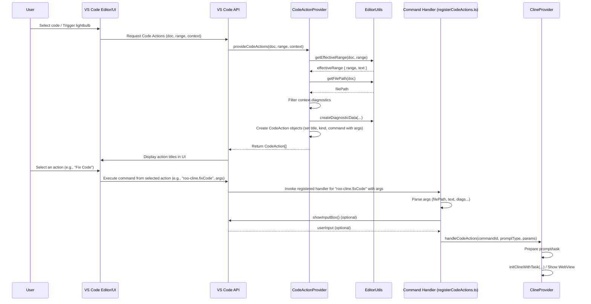
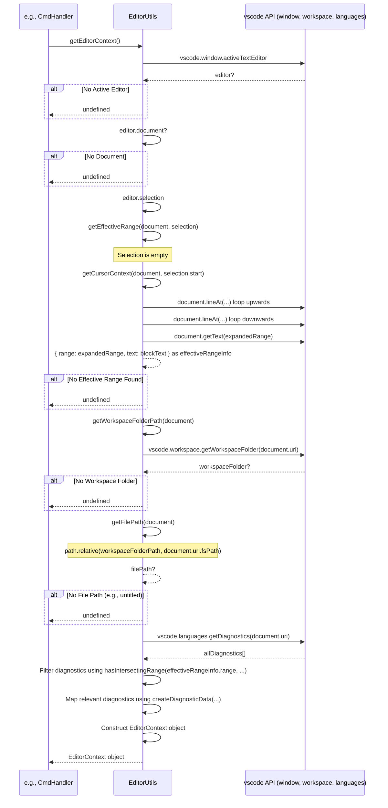

# Chapter 30: CodeActionProvider

Continuing from [Chapter 29: Cost Calculation Utilities](29_cost_calculation_utilities.md), where we explored how Roo-Code estimates the costs of LLM interactions, we now shift our focus back to direct user interaction within the VS Code editor. How does Roo-Code offer relevant actions like "Explain Code" or "Fix Code" right where the user needs them, based on their selection or diagnostic errors? This chapter introduces the `CodeActionProvider`.

## Motivation: Contextual Actions in the Editor

While the Roo-Code chat view ([Chapter 1: WebView UI](01_webview_ui.md)) is powerful, sometimes users want quick access to AI assistance directly within their code editor. Imagine selecting a complex function or seeing an error underlined; instead of manually copying the code or error message to the chat, it would be much more efficient to right-click or use the "lightbulb" icon to invoke relevant AI actions immediately.

The `CodeActionProvider` enables this seamless integration. It implements the standard `vscode.CodeActionProvider` interface, allowing Roo-Code to contribute context-aware actions to VS Code's "Quick Fix" and "Refactor" menus (often accessed via the lightbulb icon or the right-click context menu). It analyzes the user's selection, the surrounding code context, and any relevant diagnostics (errors/warnings) to offer appropriate actions like "Explain Code", "Fix Code", "Improve Code", or "Add to Context". When the user selects one of these actions, the provider triggers a specific Roo-Code command, passing along the necessary code context (file path, selected text, line numbers, diagnostics) to initiate the corresponding task.

**Central Use Case:** A user selects a piece of code in `main.py` that has a diagnostic error associated with it.
1.  The user clicks the lightbulb icon that appears near the selection or the error, or right-clicks the selection.
2.  VS Code calls the `provideCodeActions` method of Roo-Code's registered `CodeActionProvider`.
3.  The `CodeActionProvider` analyzes the request:
    *   It uses `EditorUtils` ([Chapter 31: EditorUtils](31_editorutils.md)) to determine the precise code range and text selected by the user.
    *   It identifies the relevant diagnostic errors intersecting with the selection from the `context.diagnostics` provided by VS Code.
4.  Based on this context, it creates several `vscode.CodeAction` objects:
    *   An action titled "Roo Code: Explain Code" (Kind: `QuickFix`), linked to the `roo-cline.explainCode` command with arguments like file path, selected text, and line range.
    *   An action titled "Roo Code: Fix Code" (Kind: `QuickFix`), linked to the `roo-cline.fixCode` command with arguments including file path, selected text, line range, and the *diagnostic error messages*.
    *   An action titled "Roo Code: Improve Code" (Kind: `RefactorRewrite`), linked to `roo-cline.improveCode`.
    *   An action titled "Roo Code: Add to Context" (Kind: `QuickFix`), linked to `roo-cline.addToContext`.
5.  VS Code displays these actions in the lightbulb menu.
6.  The user selects "Roo Code: Fix Code".
7.  VS Code executes the `roo-cline.fixCode` command, passing the file path, selected code, range, and diagnostic messages as arguments.
8.  The command handler for `roo-cline.fixCode` (registered in `registerCodeActions.ts`) receives these arguments and triggers the appropriate logic in `ClineProvider` to start a new task focused on fixing the specific code and errors.

## Key Concepts

1.  **`vscode.CodeActionProvider` Interface:** The standard VS Code API that extensions implement to contribute actions to the editor's context menus and lightbulb suggestions. Requires implementing the `provideCodeActions` method.

2.  **`provideCodeActions` Method:** The heart of the provider. VS Code calls this method whenever it needs to determine available actions for a given location or selection in a document. It receives:
    *   `document`: The `TextDocument` where the action is requested.
    *   `range` or `selection`: The specific range or selection made by the user.
    *   `context`: Provides additional information, most importantly `context.diagnostics` (an array of errors/warnings in the file) and `triggerKind` (how the actions were requested).

3.  **Context Detection:**
    *   **Code Range/Text:** The provider uses helper functions, primarily from `EditorUtils` ([Chapter 31: EditorUtils](31_editorutils.md)), like `getEffectiveRange`, to determine the precise range, retrieve the corresponding text, and get the file path. `getEffectiveRange` might expand a cursor position to encompass the surrounding logical block (e.g., function, class) if no text is selected.
    *   **Diagnostics:** It filters the `context.diagnostics` array to find diagnostics whose ranges intersect with the user's selection or the effective range. Diagnostic messages are extracted for use in "Fix Code" actions.

4.  **`vscode.CodeAction` Objects:** Each available action ("Explain", "Fix", etc.) is represented by an instance of `vscode.CodeAction`. Key properties set by the provider include:
    *   `title`: The user-visible text for the action (e.g., `"Roo Code: Explain Code"`). Constants are defined in `ACTION_NAMES`.
    *   `kind`: Categorizes the action using `vscode.CodeActionKind` (e.g., `QuickFix` for fixes/explanations, `RefactorRewrite` for improvements). This influences where the action appears in VS Code's UI.
    *   `command`: An object linking the action to a command registered by the extension. It includes:
        *   `command`: The command ID string (e.g., `"roo-cline.explainCode"`). Constants defined in `COMMAND_IDS`.
        *   `title`: Often the same as the action title.
        *   `arguments`: An array containing the context data to pass to the command handler (e.g., `[filePath, selectedText, startLine, endLine, diagnostics]`).

5.  **Command Registration and Handling:**
    *   **Registration:** The commands linked by the `CodeAction` objects (e.g., `roo-cline.explainCode`) must be registered separately using `vscode.commands.registerCommand` (typically done in `src/activate/registerCodeActions.ts`).
    *   **Handlers:** The command handlers receive the `arguments` array passed from the `CodeAction`. They parse these arguments (file path, text, range, diagnostics), potentially prompt the user for additional input using `vscode.window.showInputBox`, and then typically call a method on the `ClineProvider` (like `handleCodeAction`) to initiate the corresponding AI task, passing the extracted context.

6.  **New Task vs. Current Task:** For actions like "Explain", "Fix", and "Improve", the provider often creates *two* `CodeAction` variants: one to start a "New Task" and one to add the request to the "Current Task" in the chat view. This is achieved by registering two similar commands (e.g., `roo-cline.explainCode` and `roo-cline.explainCodeInCurrentTask`) and creating action pairs using the `createActionPair` helper.

## Using the CodeActionProvider (Use Case Revisited)

Let's trace the "Fix Code" use case again, focusing on the flow:

1.  **User selects code with an error:** Triggers VS Code's action discovery.
2.  **VS Code calls `provideCodeActions`:** Passes the document, selection, and context (including the diagnostic error).
3.  **`CodeActionProvider.provideCodeActions` Executes:**
    *   Calls `EditorUtils.getEffectiveRange` -> gets `effectiveRange { range, text }`.
    *   Calls `EditorUtils.getFilePath` -> gets `filePath`.
    *   Filters `context.diagnostics` -> finds `relevantDiagnostics`.
    *   Maps `relevantDiagnostics` using `EditorUtils.createDiagnosticData` -> gets `diagnosticMessages`.
    *   Calls internal helper `createActionPair("Roo Code: Fix Code", vscode.CodeActionKind.QuickFix, "roo-cline.fixCode", [filePath, effectiveRange.text, startLine, endLine, diagnosticMessages])`.
4.  **`createActionPair` Executes:**
    *   Calls `createAction("Roo Code: Fix Code in New Task", ..., "roo-cline.fixCode", args)`.
    *   Calls `createAction("Roo Code: Fix Code in Current Task", ..., "roo-cline.fixCodeInCurrentTask", args)`.
    *   Returns an array containing these two `vscode.CodeAction` objects (along with others like "Explain", "Add to Context").
5.  **VS Code Displays Actions:** The "Fix Code in New Task" and "Fix Code in Current Task" options appear in the lightbulb menu.
6.  **User Selects "Fix Code in New Task":**
7.  **VS Code Executes Command:** Runs `vscode.commands.executeCommand("roo-cline.fixCode", [filePath, text, startLine, endLine, diagnosticMessages])`.
8.  **Command Handler (`registerCodeActions.ts`) Executes:**
    *   The handler registered for `"roo-cline.fixCode"` runs.
    *   It receives the `args` array.
    *   It parses `filePath`, `selectedText`, `startLine`, `endLine`, `diagnostics` from `args`.
    *   It calls `ClineProvider.handleCodeAction("roo-cline.fixCode", "FIX", params)`.
9.  **`ClineProvider.handleCodeAction` Executes:**
    *   Prepares a prompt based on the `promptType` ("FIX"), `selectedText`, `diagnostics`, etc.
    *   Calls `provider.initClineWithTask(preparedPrompt)` to start a new task focused on fixing the code.
    *   Switches the WebView focus if necessary.

## Code Walkthrough

### CodeActionProvider Class (`src/core/CodeActionProvider.ts`)

```typescript
// --- File: src/core/CodeActionProvider.ts ---
import * as vscode from "vscode";
import { EditorUtils } from "./EditorUtils"; // Utility for editor context

// Constants for action titles displayed in the UI
export const ACTION_NAMES = {
	EXPLAIN: "Roo Code: Explain Code",
	FIX: "Roo Code: Fix Code",
	FIX_LOGIC: "Roo Code: Fix Logic", // "Fix" when no diagnostics are present
	IMPROVE: "Roo Code: Improve Code",
	ADD_TO_CONTEXT: "Roo Code: Add to Context",
	NEW_TASK: "Roo Code: New Task", // Potentially used elsewhere
} as const;

// Constants for command IDs linked to actions
export const COMMAND_IDS = {
	EXPLAIN: "roo-cline.explainCode",
	FIX: "roo-cline.fixCode",
	IMPROVE: "roo-cline.improveCode",
	ADD_TO_CONTEXT: "roo-cline.addToContext",
	NEW_TASK: "roo-cline.newTask",
} as const;

// Suffix for commands targeting the current task
const CURRENT_TASK_SUFFIX = "InCurrentTask";

export class CodeActionProvider implements vscode.CodeActionProvider {
	// Declare the kinds of actions this provider contributes
	public static readonly providedCodeActionKinds = [
		vscode.CodeActionKind.QuickFix, // For fixes, explanations, adding context
		vscode.CodeActionKind.RefactorRewrite, // For improvements
	];

	/** Helper to create a single CodeAction linked to a command */
	private createAction(title: string, kind: vscode.CodeActionKind, command: string, args: any[]): vscode.CodeAction {
		const action = new vscode.CodeAction(title, kind);
		// Associate the action with a command and its arguments
		action.command = { command, title, arguments: args };
		return action;
	}

	/** Helper to create a pair of actions (New Task vs. Current Task) */
	private createActionPair(
		baseTitle: string,
		kind: vscode.CodeActionKind,
		baseCommand: string, // e.g., "roo-cline.explainCode"
		args: any[],
	): vscode.CodeAction[] {
		return [
			// Action for "New Task"
			this.createAction(`${baseTitle} in New Task`, kind, baseCommand, args),
			// Action for "Current Task" (appends suffix to command ID)
			this.createAction(`${baseTitle} in Current Task`, kind, `${baseCommand}${CURRENT_TASK_SUFFIX}`, args),
		];
	}

	/**
	 * VS Code calls this method to get available code actions.
	 */
	public provideCodeActions(
		document: vscode.TextDocument,
		range: vscode.Range | vscode.Selection, // User selection or cursor position
		context: vscode.CodeActionContext, // Contains diagnostics
	): vscode.ProviderResult<(vscode.CodeAction | vscode.Command)[]> {
		try {
			// Use EditorUtils to get the relevant code range, text, and path
			const effectiveRange = EditorUtils.getEffectiveRange(document, range);
			// If no meaningful range (e.g., empty selection in empty space), return nothing
			if (!effectiveRange) {
				return [];
			}

			const filePath = EditorUtils.getFilePath(document);
			const actions: vscode.CodeAction[] = [];
			const startLine = effectiveRange.range.start.line + 1; // Use 1-based indexing for display/prompts
			const endLine = effectiveRange.range.end.line + 1;

			// --- 1. Add to Context Action ---
			// Always offer to add the selected code to the current chat context
			actions.push(
				this.createAction(
					ACTION_NAMES.ADD_TO_CONTEXT,
					vscode.CodeActionKind.QuickFix,
					COMMAND_IDS.ADD_TO_CONTEXT,
					[filePath, effectiveRange.text, startLine, endLine], // Args: path, text, range
				),
			);

			// --- 2. Explain Action ---
			// Always offer explanation actions
			actions.push(
				...this.createActionPair(
					ACTION_NAMES.EXPLAIN,
					vscode.CodeActionKind.QuickFix,
					COMMAND_IDS.EXPLAIN,
					[filePath, effectiveRange.text, startLine, endLine], // Args: path, text, range
				),
			);

			// --- 3. Fix Action (Conditional) ---
			// Check if there are diagnostics provided by VS Code
			if (context.diagnostics.length > 0) {
				// Filter diagnostics to find those overlapping with the selection
				const relevantDiagnostics = context.diagnostics.filter((d) =>
					EditorUtils.hasIntersectingRange(effectiveRange.range, d.range),
				);

				// If there are relevant diagnostics, offer "Fix Code"
				if (relevantDiagnostics.length > 0) {
					// Format diagnostic data for the command/prompt
					const diagnosticMessages = relevantDiagnostics.map(EditorUtils.createDiagnosticData);
					actions.push(
						...this.createActionPair(
							ACTION_NAMES.FIX, // Title: "Fix Code"
							vscode.CodeActionKind.QuickFix,
							COMMAND_IDS.FIX,
							[filePath, effectiveRange.text, startLine, endLine, diagnosticMessages], // Args: path, text, range, diagnostics
						),
					);
				} else {
                    // No relevant diagnostics, offer "Fix Logic" instead
                    actions.push(
						...this.createActionPair(
							ACTION_NAMES.FIX_LOGIC, // Title: "Fix Logic"
							vscode.CodeActionKind.QuickFix,
							COMMAND_IDS.FIX, // Use the same base command
							[filePath, effectiveRange.text, startLine, endLine], // Args: path, text, range (no diagnostics)
						),
					);
                }
			} else {
				// No diagnostics at all, offer "Fix Logic"
				actions.push(
					...this.createActionPair(
						ACTION_NAMES.FIX_LOGIC, // Title: "Fix Logic"
						vscode.CodeActionKind.QuickFix,
						COMMAND_IDS.FIX, // Use the same base command
						[filePath, effectiveRange.text, startLine, endLine], // Args: path, text, range (no diagnostics)
					),
				);
			}

			// --- 4. Improve Action ---
			// Always offer improvement actions
			actions.push(
				...this.createActionPair(
					ACTION_NAMES.IMPROVE,
					vscode.CodeActionKind.RefactorRewrite, // Use Refactor kind
					COMMAND_IDS.IMPROVE,
					[filePath, effectiveRange.text, startLine, endLine], // Args: path, text, range
				),
			);

			return actions; // Return the array of created actions
		} catch (error) {
			console.error("Error providing code actions:", error);
			// Log error and return empty array to avoid breaking VS Code UI
			return [];
		}
	}
}
```

**Explanation:**

*   **Constants:** Defines standard titles (`ACTION_NAMES`) and command IDs (`COMMAND_IDS`) for consistency.
*   **`providedCodeActionKinds`:** Tells VS Code which categories of actions this provider contributes (influences when/where they appear).
*   **`createAction`/`createActionPair`:** Helper methods to reduce boilerplate when creating `vscode.CodeAction` objects and linking them to commands (with `New Task`/`Current Task` variants).
*   **`provideCodeActions`:**
    *   Gets the effective code selection and file path using `EditorUtils`.
    *   Creates the "Add to Context" action unconditionally.
    *   Creates the "Explain Code" action pair unconditionally.
    *   Checks `context.diagnostics`. If diagnostics exist and overlap with the selection, it creates the "Fix Code" action pair, passing formatted diagnostic messages as arguments. If diagnostics exist but don't overlap, or if no diagnostics exist at all, it creates the "Fix Logic" action pair (using the same base `FIX` command but indicating a different intent).
    *   Creates the "Improve Code" action pair unconditionally.
    *   Returns the array of all generated actions. Includes basic error handling.

### Command Registration (`src/activate/registerCodeActions.ts`)

```typescript
// --- File: src/activate/registerCodeActions.ts ---
import * as vscode from "vscode";

import { ACTION_NAMES, COMMAND_IDS } from "../core/CodeActionProvider";
import { EditorUtils } from "../core/EditorUtils";
import { ClineProvider } from "../core/webview/ClineProvider";
import { telemetryService } from "../services/telemetry/TelemetryService"; // For tracking usage

// Suffix for commands targeting the current task
const CURRENT_TASK_SUFFIX = "InCurrentTask";

// Main function called during extension activation
export const registerCodeActions = (context: vscode.ExtensionContext) => {
	// Register pairs for actions that have New/Current Task variants
	registerCodeActionPair(
		context,
		COMMAND_IDS.EXPLAIN, // Base command ID: "roo-cline.explainCode"
		"EXPLAIN", // Prompt type key: "EXPLAIN"
		"What would you like Roo to explain?", // Optional prompt for user input
		"E.g. How does the error handling work?", // Placeholder for input box
	);

	registerCodeActionPair(
		context,
		COMMAND_IDS.FIX, // "roo-cline.fixCode"
		"FIX", // Handles both FIX and FIX_LOGIC internally
		"What specifically should Roo focus on fixing?",
		"E.g. Maintain backward compatibility",
	);

	registerCodeActionPair(
		context,
		COMMAND_IDS.IMPROVE, // "roo-cline.improveCode"
		"IMPROVE",
		"What would you like Roo to improve?",
		"E.g. Focus on performance optimization",
	);

	// Register single action for Add to Context
	registerCodeAction(context, COMMAND_IDS.ADD_TO_CONTEXT, "ADD_TO_CONTEXT");
};

/** Helper to register a single command handler */
const registerCodeAction = (
	context: vscode.ExtensionContext,
	command: string, // The command ID (e.g., "roo-cline.explainCode")
	promptType: keyof typeof ACTION_NAMES, // Key to identify action type for ClineProvider
	inputPrompt?: string, // Optional prompt for showInputBox
	inputPlaceholder?: string,
) => {
	let userInput: string | undefined; // To store user input if prompted

	// Register the actual command handler with VS Code
	context.subscriptions.push(
		vscode.commands.registerCommand(command, async (...args: any[]) => {
			// Telemetry: Record that the action was invoked
			telemetryService.captureEvent("codeaction.invoked", { command });

			// 1. Prompt for optional user input if configured
			userInput = undefined; // Reset previous input
			if (inputPrompt) {
				userInput = await vscode.window.showInputBox({
					prompt: inputPrompt,
					placeHolder: inputPlaceholder,
				});
				// Optionally handle cancellation (if user hits Esc)
				// if (userInput === undefined) { return; } // Abort if user cancels input
			}

			// 2. Determine context (from CodeAction arguments or current editor)
			let filePath: string | undefined;
			let selectedText: string | undefined;
			let startLine: number | undefined;
			let endLine: number | undefined;
			let diagnostics: any[] | undefined; // Assuming diagnostic data is passed

			if (args.length > 1 && typeof args[0] === 'string') {
				// Assume called from CodeAction Provider (args are [filePath, text, start, end, ?diagnostics])
				[filePath, selectedText, startLine, endLine, diagnostics] = args;
			} else {
				// Assume called directly (e.g., from Command Palette)
				// Use EditorUtils to get context from the active editor
				const editorContext = EditorUtils.getEditorContext();
				if (!editorContext) {
                    vscode.window.showWarningMessage("Roo Code: No active editor or selection found.");
                    return; // Cannot proceed without editor context
                }
				({ filePath, selectedText, startLine, endLine, diagnostics } = editorContext);
                // Note: Diagnostics might be less accurate when called directly vs from CodeActionContext
			}

            // Basic validation
            if (!filePath || selectedText === undefined) {
                 vscode.window.showWarningMessage("Roo Code: Could not determine file path or selection.");
                 return;
            }

			// 3. Prepare parameters for ClineProvider
			const params: { [key: string]: any } = {
				filePath,
				selectedText,
				...(startLine !== undefined ? { startLine: startLine } : {}), // Use 1-based line numbers
				...(endLine !== undefined ? { endLine: endLine } : {}),
				...(diagnostics ? { diagnostics } : {}), // Pass diagnostic info if available
				...(userInput ? { userInput } : {}), // Pass user's refinement input
			};

			// 4. Delegate to ClineProvider to handle the action
			// ClineProvider determines if it's a New Task or Current Task based on command ID
			await ClineProvider.handleCodeAction(command, promptType, params);
		}),
	);
};

/** Helper to register both 'New Task' and 'Current Task' command variants */
const registerCodeActionPair = (
	context: vscode.ExtensionContext,
	baseCommand: string,
	promptType: keyof typeof ACTION_NAMES,
	inputPrompt?: string,
	inputPlaceholder?: string,
) => {
	// Register the base command (implicitly for New Task)
	registerCodeAction(context, baseCommand, promptType, inputPrompt, inputPlaceholder);

	// Register the command with the suffix (for Current Task)
	registerCodeAction(context, `${baseCommand}${CURRENT_TASK_SUFFIX}`, promptType, inputPrompt, inputPlaceholder);
};
```

**Explanation:**

*   **`registerCodeActions`:** The main setup function called during activation. It calls `registerCodeActionPair` for Explain, Fix, Improve, and `registerCodeAction` for Add to Context.
*   **`registerCodeAction`:**
    *   Registers a command handler using `vscode.commands.registerCommand`.
    *   The handler function (`async (...args) => ...`) is executed when the command is invoked.
    *   It first prompts the user for optional input using `showInputBox` if `inputPrompt` is provided.
    *   It determines the context: If `args` contains multiple items (starting with a string path), it assumes it was called from the `CodeActionProvider` and extracts context from `args`. Otherwise, it assumes a direct call (e.g., command palette) and uses `EditorUtils.getEditorContext` to get context from the active editor. Includes basic validation.
    *   It bundles the context (file path, text, range, diagnostics, user input) into a `params` object.
    *   It calls the static `ClineProvider.handleCodeAction` method, passing the `command` ID (so the provider knows if it's a "Current Task" variant), the general `promptType` (e.g., "FIX"), and the `params` object.
*   **`registerCodeActionPair`:** A convenience function that calls `registerCodeAction` twice – once for the base command ID and once for the ID with the `CURRENT_TASK_SUFFIX`.

### Extension Registration (`src/extension.ts`)

```typescript
// --- File: src/extension.ts ---
// (Relevant excerpt)
import { CodeActionProvider } from "./core/CodeActionProvider";
import { registerCodeActions } from "./activate"; // Import registration function

export async function activate(context: vscode.ExtensionContext) {
	// ... other activation code ...

	// Register code actions provider.
    // The selector { pattern: "**/*" } applies it to all files.
	context.subscriptions.push(
		vscode.languages.registerCodeActionsProvider(
            { pattern: "**/*" }, // Apply to all files
            new CodeActionProvider(), // Instantiate the provider
            {
			    providedCodeActionKinds: CodeActionProvider.providedCodeActionKinds, // Declare kinds
		    }
        ),
	);

    // Register the commands that the code actions will trigger
	registerCodeActions(context);

	// ... rest of activation ...
}
```

**Explanation:**

*   Imports the `CodeActionProvider` class and the `registerCodeActions` function.
*   Uses `vscode.languages.registerCodeActionsProvider` to register an instance of `CodeActionProvider` with VS Code.
    *   The first argument is a `DocumentSelector` (here, `{ pattern: "**/*" }` makes it active for all files).
    *   The second argument is the provider instance.
    *   The third argument (metadata) specifies the `providedCodeActionKinds`, helping VS Code optimize when to call the provider.
*   Calls `registerCodeActions(context)` to ensure the commands linked by the provider are actually registered and have handlers.

## Internal Implementation

The implementation relies on VS Code's eventing and command execution mechanisms.

**Step-by-Step Flow:**

1.  **Registration:** During extension activation (`activate`), `registerCodeActionsProvider` tells VS Code that `CodeActionProvider` can provide actions for all files (`**/*`). `registerCodeActions` registers the specific command handlers (e.g., `roo-cline.explainCode`).
2.  **User Interaction:** User selects text or places the cursor near a diagnostic in an open editor. They trigger the code action UI (lightbulb, right-click).
3.  **VS Code Request:** VS Code identifies that `CodeActionProvider` is registered for this file type and matches the requested action kinds (`QuickFix`, `RefactorRewrite`). It calls `CodeActionProvider.provideCodeActions(document, range, context)`.
4.  **Provider Logic:** `provideCodeActions` executes:
    *   Determines effective range, text, path using `EditorUtils`.
    *   Checks `context.diagnostics`.
    *   Creates `vscode.CodeAction` objects for "Explain", "Fix"/"Fix Logic", "Improve", "Add to Context", setting `title`, `kind`, and `command` (with `arguments` containing the extracted context).
    *   Returns the array of `CodeAction`s.
5.  **UI Display:** VS Code renders the `title` of each returned `CodeAction` in the appropriate menu (lightbulb or context menu), filtered/grouped by `kind`.
6.  **User Selection:** User clicks on an action (e.g., "Roo Code: Fix Code in New Task").
7.  **Command Execution:** VS Code finds the `command` object associated with the selected `CodeAction` (`{ command: "roo-cline.fixCode", arguments: [...] }`). It executes this command, passing the arguments.
8.  **Handler Invocation:** VS Code finds the handler registered for `"roo-cline.fixCode"` (in `registerCodeActions.ts`) and calls it with the arguments array.
9.  **Handler Logic:** The command handler executes:
    *   Parses the arguments (`filePath`, `selectedText`, etc.).
    *   Optionally prompts for `userInput`.
    *   Bundles parameters.
    *   Calls `ClineProvider.handleCodeAction(commandId, promptType, params)`.
10. **Task Initiation:** `ClineProvider` uses the `promptType` and `params` to formulate an initial prompt/task description for the AI and likely calls `initClineWithTask` to start the process, potentially showing the WebView UI.

**Sequence Diagram:**



## Modification Guidance

Modifications usually involve adding new actions or changing the context passed to existing ones.

**Common Modifications:**

1.  **Adding a New Code Action (e.g., "Generate Unit Test"):**
    *   **Constants:** Add `GENERATE_TEST: "Roo Code: Generate Unit Test"` to `ACTION_NAMES` and `GENERATE_TEST: "roo-cline.generateTest"` to `COMMAND_IDS`.
    *   **Provider (`provideCodeActions`):** Add logic to create the action, likely using `createActionPair`. Decide on the appropriate `kind` (e.g., `RefactorRewrite`). Pass necessary context (path, text, range).
        ```typescript
        actions.push(
            ...this.createActionPair(
                ACTION_NAMES.GENERATE_TEST,
                vscode.CodeActionKind.RefactorRewrite, // Or QuickFix?
                COMMAND_IDS.GENERATE_TEST,
                [filePath, effectiveRange.text, startLine, endLine],
            ),
        );
        ```
    *   **Command Registration (`registerCodeActions`):** Call `registerCodeActionPair` (or `registerCodeAction`) for the new `COMMAND_IDS.GENERATE_TEST` and a corresponding `promptType` key (e.g., `"GENERATE_TEST"`). Decide if user input is needed via `inputPrompt`.
    *   **Provider Handling (`ClineProvider.handleCodeAction`):** Add a `case` or logic to handle the new `promptType` ("GENERATE_TEST"). Formulate a prompt specifically instructing the AI to generate unit tests based on the provided code context (`params.selectedText`, etc.).

2.  **Making an Action Conditional (e.g., Only Show "Improve" on Functions):**
    *   **Provider (`provideCodeActions`):** Before creating the "Improve" action pair, use `EditorUtils` or potentially Tree-sitter integration ([Chapter 17: Tree-sitter Integration](17_tree_sitter_integration.md)) to analyze the `effectiveRange.text` or the AST around `range.start` to determine if the selection primarily encompasses a function definition. Only call `createActionPair` for "Improve" if the condition is met.
        ```typescript
        // Conceptual check
        const isFunction = EditorUtils.isRangeLikelyFunction(document, effectiveRange.range);
        if (isFunction) {
             actions.push(
                 ...this.createActionPair(ACTION_NAMES.IMPROVE, ...)
             );
        }
        ```
    *   **Complexity:** This adds complexity and potentially performance overhead to `provideCodeActions`, which should ideally be fast. Use lightweight checks where possible.

3.  **Changing Arguments Passed to Command:**
    *   **Provider (`provideCodeActions`):** Modify the `args` array passed to `createAction` or `createActionPair` for the relevant action. For example, pass the entire `document.uri.toString()` instead of just the `filePath`.
    *   **Command Handler (`registerCodeActions`):** Update the argument parsing logic within the command handler to expect the new argument structure. Ensure indices match or use more robust argument handling. Update the `params` object passed to `ClineProvider.handleCodeAction`.

**Best Practices:**

*   **Speed:** `provideCodeActions` can be called frequently by VS Code (e.g., on cursor move, selection change). Keep its logic relatively fast. Avoid heavy computation like full AST parsing if possible, unless results can be cached or are essential. `EditorUtils` should provide fast text-based analysis.
*   **Relevance:** Only provide actions that are genuinely relevant to the current context (selection, diagnostics). Avoid cluttering the menus.
*   **Clear Titles:** Use clear, concise, and consistent action titles prefixed with "Roo Code:" for easy identification.
*   **Correct Kinds:** Use appropriate `vscode.CodeActionKind` values to ensure actions appear in the expected UI locations (e.g., `QuickFix` for errors, `RefactorRewrite` for code improvements).
*   **Stateless Provider:** Keep the `CodeActionProvider` class itself stateless. All necessary context should come from the `provideCodeActions` arguments or be retrieved via utilities like `EditorUtils`.
*   **Defer Logic:** Perform the actual AI interaction logic within the command handler and `ClineProvider`, not within `provideCodeActions`. The provider's job is just to *declare* the available actions and the context they need.

**Potential Pitfalls:**

*   **Slow Provider:** Complex logic or slow operations within `provideCodeActions` can make the lightbulb/context menu feel sluggish.
*   **Incorrect Arguments:** Mismatches between the arguments specified in the `CodeAction`'s `command` object and the arguments expected by the registered command handler will lead to errors.
*   **Command Not Registered:** If a `CodeAction` references a command ID that wasn't registered using `vscode.commands.registerCommand`, selecting the action will result in a "command not found" error.
*   **Context Mismatch:** If `EditorUtils.getEffectiveRange` selects a different range than the user visually expects, the action might operate on unintended code.
*   **Overlapping Diagnostics:** If multiple diagnostics overlap the selection, the current logic passes all relevant ones. The AI prompt needs to handle potentially multiple error messages.

## Conclusion

The `CodeActionProvider` seamlessly integrates Roo-Code's AI capabilities into the native VS Code editor experience. By analyzing the user's selection and relevant diagnostics, it dynamically offers contextual actions like explaining, fixing, or improving code directly via the lightbulb and context menus. It acts as a bridge, packaging the necessary code context and triggering specific registered commands that ultimately initiate tasks within the `ClineProvider`. This direct integration provides users with efficient, in-place access to AI assistance, complementing the main chat interface.

Understanding how code actions are provided and handled often involves utilities that inspect the editor state. The next chapter dives into these helpers: [Chapter 31: EditorUtils](31_editorutils.md).
---
# Chapter 31: EditorUtils

Continuing from [Chapter 30: CodeActionProvider](30_codeactionprovider.md), where we saw how Roo-Code offers contextual actions within the editor, we observed that the provider relies on helper functions to get information about the current editor state, selections, and diagnostics. This chapter introduces the collection of static helper functions grouped under **`EditorUtils`**.

## Motivation: Centralizing Editor Interaction Logic

Many parts of the Roo-Code extension need to interact with the VS Code editor environment to retrieve information or perform actions. Examples include:
*   Getting the currently active text editor.
*   Determining the file path of the active document.
*   Getting the text selected by the user or the text of a specific range.
*   Expanding a selection or cursor position to encompass a meaningful code block (like a function or class).
*   Formatting diagnostic information.
*   Inserting text or applying edits to the document.

Implementing this logic repeatedly across different modules ([Chapter 30: CodeActionProvider](30_codeactionprovider.md), command handlers, potentially tool functions) would lead to code duplication and inconsistency. Furthermore, interacting with the VS Code editor API often involves handling edge cases (e.g., no active editor, different selection types, untitled documents).

`EditorUtils` (defined in `src/core/EditorUtils.ts`) provides a centralized, static utility class containing methods that abstract these common editor interactions. It offers a consistent and robust way to query the editor state and perform basic manipulations, simplifying the code in other parts of the extension.

**Central Use Case:** The `CodeActionProvider` needs to get the file path, the selected text (or the surrounding block if nothing is selected), and the start/end lines for the code relevant to the user's current cursor position or selection.

Instead of implementing this logic directly within `provideCodeActions`:
```typescript
// --- Conceptual code WITHOUT EditorUtils ---
provideCodeActions(document, range, context) {
    let selectedText: string;
    let effectiveRange: vscode.Range;
    const selection = vscode.window.activeTextEditor?.selection;

    if (selection && !selection.isEmpty) {
        effectiveRange = selection;
        selectedText = document.getText(selection);
    } else {
        // Complex logic to find surrounding block (e.g., using regex or basic parsing)
        effectiveRange = /* ... complex calculation ... */;
        selectedText = document.getText(effectiveRange);
    }
    const filePath = document.uri.fsPath; // Basic path
    const startLine = effectiveRange.start.line + 1;
    const endLine = effectiveRange.end.line + 1;
    // ... use filePath, selectedText, startLine, endLine ...
}
```

The provider uses `EditorUtils`:
```typescript
// --- Conceptual code WITH EditorUtils ---
provideCodeActions(document, range, context) {
    // Single call to get combined context
    const editorContext = EditorUtils.getEditorContext(document, range);
    // Or individual calls:
    // const effectiveRangeInfo = EditorUtils.getEffectiveRange(document, range);
    // const filePath = EditorUtils.getFilePath(document);

    if (!editorContext) return []; // Handle case where no context found

    const { filePath, selectedText, startLine, endLine } = editorContext;
    // ... use filePath, selectedText, startLine, endLine ...
}
```
`EditorUtils` encapsulates the logic for handling different selection states, finding surrounding blocks, and retrieving file paths reliably.

## Key Concepts

1.  **Static Utility Class:** `EditorUtils` is implemented as a class with only static methods. It doesn't need to be instantiated; its methods are called directly (e.g., `EditorUtils.getActiveEditor()`).

2.  **Editor State Retrieval:** Provides methods to get fundamental information:
    *   `getActiveEditor()`: Returns the currently active `vscode.TextEditor` or `undefined`.
    *   `getFilePath(document)`: Gets the file system path for a `vscode.TextDocument`, handling untitled documents gracefully (might return `undefined` or a placeholder).
    *   `getSelectedText(editor)`: Returns the text currently selected in the given editor, or `undefined` if no editor or no selection.

3.  **Effective Range Calculation (`getEffectiveRange`, `getCursorContext`):** Handles the common need to determine the relevant code block when the user hasn't explicitly selected one.
    *   `getEffectiveRange(document, range)`: If the input `range` is not empty (user selected text), it returns that range and text. If the range *is* empty (cursor position), it calls `getCursorContext` to find the surrounding block.
    *   `getCursorContext(document, position)`: Implements heuristics to find the enclosing code block (e.g., function, class, method) around a cursor position. It might use simple indentation checks, brace matching, or potentially lightweight parsing/regex to identify block boundaries. Returns the range and text of the block. *(Note: The exact implementation details determine its robustness).*

4.  **Combined Context (`getEditorContext`):** A convenience method that combines calls to get the active editor, document, effective range, file path, start/end lines, and potentially relevant diagnostics into a single structured object (`EditorContext`). This simplifies call sites that need multiple pieces of context.

5.  **Diagnostic Formatting (`createDiagnosticData`):** Takes a `vscode.Diagnostic` object and formats it into a simpler structure (e.g., `{ severity: string, message: string, range: SimpleRange }`) suitable for inclusion in prompts sent to the AI or for display in the UI.

6.  **Range Intersection (`hasIntersectingRange`):** A utility to check if two `vscode.Range` objects overlap, used by `CodeActionProvider` to filter diagnostics relevant to the user's selection.

7.  **Document Manipulation (Less Common Usage Shown):** While the primary focus shown is retrieval, utility classes like this *could* also include methods for inserting text, replacing ranges, or applying edits (though Roo-Code often uses `DiffViewProvider` ([Chapter 20: DiffViewProvider](20_diffviewprovider.md)) for more complex modifications). The provided code focuses on context gathering.

## Using EditorUtils

Methods from `EditorUtils` are called statically from various parts of the extension that need editor context.

**Example 1: `CodeActionProvider`**

```typescript
// --- File: src/core/CodeActionProvider.ts ---
import { EditorUtils } from "./EditorUtils";

// ... inside provideCodeActions ...
const effectiveRangeInfo = EditorUtils.getEffectiveRange(document, range);
if (!effectiveRangeInfo) { return []; }

const filePath = EditorUtils.getFilePath(document);
const startLine = effectiveRangeInfo.range.start.line + 1;
const endLine = effectiveRangeInfo.range.end.line + 1;
const selectedText = effectiveRangeInfo.text;

const relevantDiagnostics = context.diagnostics.filter((d) =>
    EditorUtils.hasIntersectingRange(effectiveRangeInfo.range, d.range), // Use intersection check
);
const diagnosticMessages = relevantDiagnostics.map(EditorUtils.createDiagnosticData); // Use diagnostic formatting

// ... create CodeAction objects using filePath, selectedText, startLine, endLine, diagnosticMessages ...
```
*Explanation:* Directly uses `getEffectiveRange`, `getFilePath`, `hasIntersectingRange`, and `createDiagnosticData` to gather the necessary context for creating code actions.

**Example 2: Command Handler (`registerCodeActions.ts`)**

```typescript
// --- File: src/activate/registerCodeActions.ts ---
import { EditorUtils } from "../core/EditorUtils";

// ... inside command handler registered with vscode.commands.registerCommand ...
async (...args: any[]) => {
    // ... determine if called from CodeAction or directly ...
    if (calledDirectly) {
        // Use EditorUtils to get context from the active editor
        const editorContext = EditorUtils.getEditorContext(); // Gets combined context
        if (!editorContext) {
            vscode.window.showWarningMessage("Roo Code: No active editor or selection found.");
            return;
        }
        ({ filePath, selectedText, startLine, endLine, diagnostics } = editorContext);
    } else {
        // Extract from args provided by CodeAction
        [filePath, selectedText, startLine, endLine, diagnostics] = args;
    }
    // ... prepare params and call ClineProvider.handleCodeAction ...
}
```
*Explanation:* When a command might be invoked directly (e.g., from the command palette), the handler uses `EditorUtils.getEditorContext()` to retrieve the current selection, range, file path, etc., from the active editor.

**Example 3: Adding Context Manually (`ClineProvider`)**

```typescript
// --- Conceptual code within ClineProvider.ts ---
async function handleAddSelectionToChat() {
    const editorContext = EditorUtils.getEditorContext(); // Get current context
    if (editorContext && editorContext.selectedText) {
        // Format the context as a mention or tagged block
        const contextString = `<file_content path="${editorContext.filePath}" start_line="${editorContext.startLine}" end_line="${editorContext.endLine}">\n${editorContext.selectedText}\n</file_content>`;
        // Send message to webview to add contextString to input box or send as message
        await this.postMessageToWebview({ type: 'invoke', invoke: 'setChatBoxMessage', text: contextString });
        // OR: Directly add to current task if appropriate
        // this.getCurrentCline()?.addMessageToContext(...);
    } else {
        vscode.window.showInformationMessage("Roo Code: No text selected in the editor.");
    }
}
```
*Explanation:* A hypothetical command handler uses `EditorUtils.getEditorContext` to grab the currently selected code and its location, formats it, and sends it to the WebView UI.

## Code Walkthrough

### EditorUtils Class (`src/core/EditorUtils.ts`)

```typescript
// --- File: src/core/EditorUtils.ts ---
import * as vscode from "vscode";
import * as path from "path";

// Structure for combined editor context
export interface EditorContext {
	editor: vscode.TextEditor;
	document: vscode.TextDocument;
	filePath: string; // Relative path
	selectedText: string; // Text of the effective range
	range: vscode.Range; // The effective range
	startLine: number; // 1-based start line
	endLine: number; // 1-based end line
	diagnostics?: DiagnosticData[]; // Relevant diagnostics (optional)
	workspaceFolderPath?: string; // Workspace root path
}

// Structure for diagnostic data passed to commands
export interface DiagnosticData {
	severity: "Error" | "Warning" | "Information" | "Hint";
	message: string;
	range: { startLine: number; startChar: number; endLine: number; endChar: number };
}

// Structure for effective range result
interface EffectiveRangeResult {
	range: vscode.Range;
	text: string;
}

export class EditorUtils {
	/** Gets the currently active text editor */
	static getActiveEditor(): vscode.TextEditor | undefined {
		return vscode.window.activeTextEditor;
	}

	/** Gets the workspace folder path containing the given document or the first workspace folder */
	static getWorkspaceFolderPath(document?: vscode.TextDocument): string | undefined {
		let workspaceFolder: vscode.WorkspaceFolder | undefined;
		if (document) {
			workspaceFolder = vscode.workspace.getWorkspaceFolder(document.uri);
		}
		if (!workspaceFolder && vscode.workspace.workspaceFolders && vscode.workspace.workspaceFolders.length > 0) {
			workspaceFolder = vscode.workspace.workspaceFolders[0];
		}
		return workspaceFolder?.uri.fsPath;
	}

	/** Gets the file path relative to the workspace root */
	static getFilePath(document: vscode.TextDocument): string | undefined {
		if (document.isUntitled) {
			return undefined; // Cannot get path for untitled documents reliably
		}
		const workspacePath = EditorUtils.getWorkspaceFolderPath(document);
		if (!workspacePath) {
			// If not in a workspace, return the full path? Or undefined?
			// Returning relative path seems most consistent with mentions.
			// Let's return undefined if not in workspace.
			return undefined;
		}
		// Return path relative to workspace, using POSIX separators
		return path.relative(workspacePath, document.uri.fsPath).replace(/\\/g, "/");
	}

	/** Gets the currently selected text */
	static getSelectedText(editor?: vscode.TextEditor): string | undefined {
		const currentEditor = editor ?? EditorUtils.getActiveEditor();
		if (!currentEditor || currentEditor.selection.isEmpty) {
			return undefined;
		}
		return currentEditor.document.getText(currentEditor.selection);
	}

	/**
	 * Determines the effective code range: the user's selection,
	 * or expands the cursor position to the surrounding block.
	 */
	static getEffectiveRange(
		document: vscode.TextDocument,
		rangeOrSelection: vscode.Range | vscode.Selection,
	): EffectiveRangeResult | undefined {
		// If there's a non-empty selection, use it directly
		if (rangeOrSelection instanceof vscode.Selection && !rangeOrSelection.isEmpty) {
			return {
				range: rangeOrSelection,
				text: document.getText(rangeOrSelection),
			};
		}
		// If it's just a cursor position (empty range), find surrounding context
		const position = rangeOrSelection.start;
		return EditorUtils.getCursorContext(document, position);
	}

	/**
	 * Finds the code block surrounding a cursor position.
	 * (Implementation uses indentation heuristics)
	 */
	static getCursorContext(
		document: vscode.TextDocument,
		position: vscode.Position,
	): EffectiveRangeResult | undefined {
		const currentLine = document.lineAt(position.line);
		// If current line is empty or just whitespace, maybe select paragraph? For now, return just the line.
		if (currentLine.isEmptyOrWhitespace) {
			// Optionally expand outwards to find nearest non-empty lines?
			// For simplicity, let's just return the current line if empty.
			return { range: currentLine.range, text: currentLine.text };
		}

		// Simple Indentation-Based Heuristic:
		// Find the first line above with less or equal indentation.
		// Find the first line below with less indentation.
		const currentIndent = currentLine.firstNonWhitespaceCharacterIndex;
		let startLine = position.line;
		while (startLine > 0) {
			const prevLine = document.lineAt(startLine - 1);
			if (prevLine.isEmptyOrWhitespace || prevLine.firstNonWhitespaceCharacterIndex < currentIndent) {
				break; // Found boundary or empty line
			}
            if (prevLine.firstNonWhitespaceCharacterIndex === currentIndent) {
                // Include lines with same indentation if they seem part of the block
                // (e.g. function signature on line above body) - simple check:
                if (!prevLine.text.match(/^[ \t]*\s*(?:class|def|function|if|for|while|try|except|{|})[:{\s]*$/)) {
                   // If previous line at same indent isn't a typical block starter, maybe break?
                   // break; // This might cut off function signatures. Let's include for now.
                }
            }
			startLine--;
		}

		let endLine = position.line;
		while (endLine < document.lineCount - 1) {
			const nextLine = document.lineAt(endLine + 1);
			if (nextLine.isEmptyOrWhitespace || nextLine.firstNonWhitespaceCharacterIndex < currentIndent) {
				break; // Found boundary or empty line
			}
			endLine++;
		}

        // Ensure startLine isn't negative
        startLine = Math.max(0, startLine);

		const range = new vscode.Range(startLine, 0, endLine, document.lineAt(endLine).range.end.character);
		const text = document.getText(range);

        // Return undefined if expanded range is trivially small or empty after trim
		if (!text.trim()) return undefined;

		return { range, text };
	}

	/** Checks if two ranges intersect */
	static hasIntersectingRange(range1: vscode.Range, range2: vscode.Range): boolean {
		return range1.intersection(range2) !== undefined;
	}

	/** Formats diagnostic data */
	static createDiagnosticData(diagnostic: vscode.Diagnostic): DiagnosticData {
		return {
			severity: vscode.DiagnosticSeverity[diagnostic.severity] as DiagnosticData["severity"],
			message: diagnostic.message,
			range: {
				startLine: diagnostic.range.start.line + 1, // 1-based
				startChar: diagnostic.range.start.character + 1, // 1-based
				endLine: diagnostic.range.end.line + 1, // 1-based
				endChar: diagnostic.range.end.character + 1, // 1-based
			},
		};
	}

	/**
	 * Gets combined context from the active editor.
	 * Includes optional filtering of diagnostics.
	 */
	static getEditorContext(
        inputDocument?: vscode.TextDocument, // Optional document/range if not using active editor
        inputRange?: vscode.Range | vscode.Selection
    ): EditorContext | undefined {
		const editor = EditorUtils.getActiveEditor();
		const document = inputDocument ?? editor?.document;
		if (!editor || !document) { return undefined; } // Need editor and document

		const rangeOrSelection = inputRange ?? editor.selection;
		const effectiveRangeInfo = EditorUtils.getEffectiveRange(document, rangeOrSelection);
		if (!effectiveRangeInfo) { return undefined; } // No effective range found

		const workspaceFolderPath = EditorUtils.getWorkspaceFolderPath(document);
		const filePath = EditorUtils.getFilePath(document);
		if (!filePath || !workspaceFolderPath) {
			// Cannot proceed without a file path within a workspace context
            // (necessary for relative paths and potentially other features)
			return undefined;
		}

		const startLine = effectiveRangeInfo.range.start.line + 1;
		const endLine = effectiveRangeInfo.range.end.line + 1;

		// Get diagnostics relevant to this specific file and range
		const allDiagnostics = vscode.languages.getDiagnostics(document.uri);
		const relevantDiagnostics = allDiagnostics.filter(d =>
			EditorUtils.hasIntersectingRange(effectiveRangeInfo.range, d.range)
		);
		const diagnosticData = relevantDiagnostics.map(EditorUtils.createDiagnosticData);

		return {
			editor,
			document,
			filePath,
			selectedText: effectiveRangeInfo.text,
			range: effectiveRangeInfo.range,
			startLine,
			endLine,
			diagnostics: diagnosticData.length > 0 ? diagnosticData : undefined,
			workspaceFolderPath,
		};
	}
}
```

**Explanation:**

*   **Interfaces:** Defines `EditorContext`, `DiagnosticData`, `EffectiveRangeResult` for structured return types.
*   **`getActiveEditor`:** Simple wrapper around `vscode.window.activeTextEditor`.
*   **`getWorkspaceFolderPath`:** Finds the relevant `vscode.WorkspaceFolder` for a document or defaults to the first one. Returns the `.uri.fsPath`.
*   **`getFilePath`:** Gets the document's path, calculates it relative to the workspace folder, handles untitled documents, and normalizes separators to `/`. Returns `undefined` if not in a workspace or untitled.
*   **`getSelectedText`:** Gets text within the current selection, returning `undefined` if no editor or empty selection.
*   **`getEffectiveRange`:** Checks if the input range/selection is empty. If not, returns it. If empty (cursor), calls `getCursorContext`.
*   **`getCursorContext`:** Implements a basic heuristic using indentation to expand the cursor position outwards (up and down) until lines with less indentation or empty lines are found. Returns the range and text of this expanded block. *Note: This heuristic is simple and might not perfectly capture blocks in all languages or coding styles. More advanced logic using Tree-sitter could be more robust but adds complexity/performance cost.*
*   **`hasIntersectingRange`:** Uses the built-in `range1.intersection(range2)` method.
*   **`createDiagnosticData`:** Maps `vscode.Diagnostic` severity enum to string and extracts message/range (using 1-based indexing for lines/chars).
*   **`getEditorContext`:** The main convenience method. It retrieves the active editor/document, calls `getEffectiveRange`, `getFilePath`, `getWorkspaceFolderPath`, gets relevant diagnostics for the file, filters them using `hasIntersectingRange`, formats them using `createDiagnosticData`, and bundles everything into an `EditorContext` object. Returns `undefined` if essential components (editor, document, workspace path, effective range) are missing.

## Internal Implementation

The methods primarily wrap and orchestrate calls to the `vscode` API.

**Step-by-Step (`getEditorContext`):**

1.  Call `vscode.window.activeTextEditor` to get `editor`. If none, return `undefined`.
2.  Get `document` from `editor`. If none, return `undefined`.
3.  Get `selection` from `editor`.
4.  Call `EditorUtils.getEffectiveRange(document, selection)`.
    *   If `selection` is not empty, return `{ range: selection, text: document.getText(selection) }`.
    *   If `selection` is empty, call `EditorUtils.getCursorContext(document, selection.start)`.
        *   `getCursorContext` scans lines upwards and downwards based on indentation.
        *   Returns `{ range: expandedRange, text: document.getText(expandedRange) }` or `undefined`.
    *   If `getEffectiveRange` returns `undefined`, return `undefined`. Store result as `effectiveRangeInfo`.
5.  Call `EditorUtils.getWorkspaceFolderPath(document)`. If none, return `undefined`. Store as `workspaceFolderPath`.
6.  Call `EditorUtils.getFilePath(document)` (using `workspaceFolderPath`). If none, return `undefined`. Store as `filePath`.
7.  Calculate `startLine`, `endLine` (1-based) from `effectiveRangeInfo.range`.
8.  Call `vscode.languages.getDiagnostics(document.uri)` to get `allDiagnostics`.
9.  Filter `allDiagnostics` using `EditorUtils.hasIntersectingRange(effectiveRangeInfo.range, d.range)` -> `relevantDiagnostics`.
10. Map `relevantDiagnostics` using `EditorUtils.createDiagnosticData` -> `diagnosticData`.
11. Construct and return the `EditorContext` object containing all gathered pieces.

**Sequence Diagram (`getEditorContext` when called with no selection):**



## Modification Guidance

Modifications usually involve enhancing the context retrieval logic or adding new editor utility functions.

**Common Modifications:**

1.  **Improving `getCursorContext`:**
    *   **Replace Heuristic:** Replace the simple indentation-based logic with a more robust approach using Tree-sitter ([Chapter 17: Tree-sitter Integration](17_tree_sitter_integration.md)).
        *   Load the appropriate Tree-sitter parser for `document.languageId`.
        *   Parse the document content.
        *   Find the smallest AST node that fully contains the `position`.
        *   Optionally traverse upwards to find a specific node type (e.g., `function_definition`, `class_definition`).
        *   Use the start/end points of the selected AST node to create the `vscode.Range`.
    *   **Considerations:** Adds dependency on Tree-sitter, increases complexity, and adds parsing overhead. May require caching parsed trees for performance if called frequently.

2.  **Adding a New Utility (e.g., `insertTextAtSelection`):**
    *   **Define Method:** Add `static async insertTextAtSelection(textToInsert: string): Promise<boolean>` to `EditorUtils`.
    *   **Implementation:**
        ```typescript
        static async insertTextAtSelection(textToInsert: string): Promise<boolean> {
            const editor = EditorUtils.getActiveEditor();
            if (!editor) { return false; }
            // Use editor.edit() for reliable undo/redo integration
            return editor.edit(editBuilder => {
                editBuilder.replace(editor.selection, textToInsert);
            });
        }
        ```
    *   **Usage:** Call `await EditorUtils.insertTextAtSelection("...")` from command handlers or other logic.

3.  **Changing Relative Path Logic:**
    *   Modify `getFilePath` if a different base path or format (e.g., absolute paths) is desired. Be aware that other parts of the system (like mentions) might expect relative paths with POSIX separators.

**Best Practices:**

*   **Statelessness:** Keep `EditorUtils` purely static and stateless. Methods should operate solely on the arguments provided (like `document`, `range`) or the current state retrieved via `vscode.window` or `vscode.workspace`.
*   **Error Handling:** Methods should gracefully handle cases where expected objects (editor, document, selection, workspace) are undefined. Return `undefined` or throw specific errors as appropriate for the caller.
*   **Performance:** Be mindful of performance for methods likely to be called frequently (like `getEffectiveRange` if used directly by `CodeActionProvider` on hover/move). Avoid slow operations like full document parsing unless necessary and potentially cached.
*   **Clarity:** Provide clear JSDoc comments explaining what each utility method does, its parameters, and its return value (especially `undefined` cases).
*   **Focus:** Keep the utilities focused on common, reusable editor interactions. Avoid putting highly specific application logic into this generic utility class.

**Potential Pitfalls:**

*   **`getCursorContext` Inaccuracy:** The indentation-based heuristic can easily select too much or too little code depending on formatting and language structure. Relying heavily on its precise boundaries might be fragile.
*   **Active Editor Assumptions:** Code calling `EditorUtils` methods that rely on `getActiveEditor` might fail if no editor is active or focused when the code runs. Ensure callers handle `undefined` returns appropriately.
*   **Workspace Assumptions:** Methods like `getFilePath` currently assume a workspace context. They might need adjustment if Roo-Code needs to operate meaningfully on loose files.
*   **API Changes:** Future changes to the `vscode` API could break these utility methods. Keeping dependencies updated and testing is important.

## Conclusion

`EditorUtils` provides a valuable layer of abstraction over the `vscode` editor API, centralizing common logic for retrieving context like the active file, user selections, effective code ranges, and diagnostics. By offering static, reusable methods, it simplifies the implementation of features like the [Chapter 30: CodeActionProvider](30_codeactionprovider.md) and command handlers, making the codebase cleaner and more robust against editor state edge cases. While simple heuristics like the indentation-based `getCursorContext` are used for performance, the utility class provides a clear place to enhance this logic (e.g., with Tree-sitter) if needed in the future.

We now transition from the core extension logic and backend services to focus specifically on the UI implementation details. The next series of chapters will break down the components used to build the [Chapter 1: WebView UI](01_webview_ui.md). We begin with the foundational wrappers around the standard VS Code UI toolkit: [Chapter 32: VSCode Webview UI Toolkit Wrappers](32_vscode_webview_ui_toolkit_wrappers.md).

