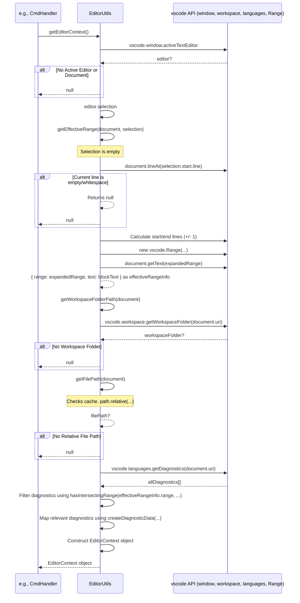

# Chapter 31: EditorUtils

Continuing from [Chapter 30: CodeActionProvider](30_codeactionprovider.md), where we saw how Roo-Code offers contextual actions within the editor, we observed that the provider relies on helper functions to get information about the current editor state, selections, and diagnostics. This chapter introduces the collection of static helper functions grouped under **`EditorUtils`**.

## Motivation: Centralizing Editor Interaction Logic

Many parts of the Roo-Code extension need to interact with the VS Code editor environment to retrieve information or perform actions. Examples include:
*   Getting the currently active text editor.
*   Determining the file path of the active document.
*   Getting the text selected by the user or the text of a specific range.
*   Expanding a selection or cursor position to encompass a meaningful code block (like a function or class).
*   Formatting diagnostic information.
*   Inserting text or applying edits to the document.

Implementing this logic repeatedly across different modules ([Chapter 30: CodeActionProvider](30_codeactionprovider.md), command handlers, potentially tool functions) would lead to code duplication and inconsistency. Furthermore, interacting with the VS Code editor API often involves handling edge cases (e.g., no active editor, different selection types, untitled documents).

`EditorUtils` (defined in `src/core/EditorUtils.ts`) provides a centralized, static utility class containing methods that abstract these common editor interactions. It offers a consistent and robust way to query the editor state and perform basic manipulations, simplifying the code in other parts of the extension.

**Central Use Case:** The `CodeActionProvider` needs to get the file path, the selected text (or the surrounding block if nothing is selected), and the start/end lines for the code relevant to the user's current cursor position or selection.

Instead of implementing this logic directly within `provideCodeActions`:
```typescript
// --- Conceptual code WITHOUT EditorUtils ---
provideCodeActions(document, range, context) {
    let selectedText: string;
    let effectiveRange: vscode.Range;
    const selection = vscode.window.activeTextEditor?.selection;

    if (selection && !selection.isEmpty) {
        effectiveRange = selection;
        selectedText = document.getText(selection);
    } else {
        // Complex logic to find surrounding block (e.g., using regex or basic parsing)
        effectiveRange = /* ... complex calculation ... */;
        selectedText = document.getText(effectiveRange);
    }
    const filePath = document.uri.fsPath; // Basic path
    const startLine = effectiveRange.start.line + 1;
    const endLine = effectiveRange.end.line + 1;
    // ... use filePath, selectedText, startLine, endLine ...
}
```

The provider uses `EditorUtils`:
```typescript
// --- Conceptual code WITH EditorUtils ---
provideCodeActions(document, range, context) {
    // Single call to get combined context
    const editorContext = EditorUtils.getEditorContext(document, range);
    // Or individual calls:
    // const effectiveRangeInfo = EditorUtils.getEffectiveRange(document, range);
    // const filePath = EditorUtils.getFilePath(document);

    if (!editorContext) return []; // Handle case where no context found

    const { filePath, selectedText, startLine, endLine } = editorContext;
    // ... use filePath, selectedText, startLine, endLine ...
}
```
`EditorUtils` encapsulates the logic for handling different selection states, finding surrounding blocks, and retrieving file paths reliably.

## Key Concepts

1.  **Static Utility Class:** `EditorUtils` is implemented as a class with only static methods. It doesn't need to be instantiated; its methods are called directly (e.g., `EditorUtils.getActiveEditor()`).

2.  **Editor State Retrieval:** Provides methods to get fundamental information:
    *   `getActiveEditor()`: Returns the currently active `vscode.TextEditor` or `undefined`.
    *   `getWorkspaceFolderPath(document?)`: Returns the filesystem path of the workspace folder containing the document (or the first workspace folder).
    *   `getFilePath(document)`: Gets the file system path for a `vscode.TextDocument`, relative to the workspace root if possible, handling untitled documents gracefully.
    *   `getSelectedText(editor?)`: Returns the text currently selected in the given editor, or `undefined` if no editor or no selection.

3.  **Effective Range Calculation (`getEffectiveRange`, `getCursorContext`):** Handles the common need to determine the relevant code block when the user hasn't explicitly selected one.
    *   `getEffectiveRange(document, range)`: If the input `range` is not empty (user selected text), it returns that range and text. If the range *is* empty (cursor position), it calls `getCursorContext` to find the surrounding block. (*Note: The provided implementation for `getEffectiveRange` simply expands to adjacent lines if the current line is non-empty, not a full block context as initially described. `getCursorContext` is not present in the provided code but represents the conceptual goal.*)
    *   `getCursorContext(document, position)` (Conceptual): Would implement heuristics (indentation, brace matching, lightweight parsing) to find the enclosing code block (function, class, etc.). The provided `getEffectiveRange` offers a simpler line-based expansion.

4.  **Combined Context (`getEditorContext`):** A convenience method that combines calls to get the active editor, document, effective range (`getEffectiveRange`), file path (`getFilePath`), start/end lines, and potentially relevant diagnostics into a single structured `EditorContext` object. This simplifies call sites that need multiple pieces of context.

5.  **Diagnostic Formatting (`createDiagnosticData`):** Takes a `vscode.Diagnostic` object and formats it into a simpler structure (`DiagnosticData`) suitable for inclusion in prompts sent to the AI or for display in the UI, including 1-based line/character numbers.

6.  **Range Intersection (`hasIntersectingRange`):** A utility to check if two `vscode.Range` objects overlap, used by [Chapter 30: CodeActionProvider](30_codeactionprovider.md) to filter diagnostics relevant to the user's selection.

7.  **Document Manipulation:** While the primary focus shown is retrieval, utility classes like this *could* also include methods for inserting text, replacing ranges, or applying edits (though Roo-Code often uses [Chapter 20: DiffViewProvider](20_diffviewprovider.md) for more complex modifications). The provided code focuses on context gathering.

## Using EditorUtils

Methods from `EditorUtils` are called statically from various parts of the extension that need editor context.

**Example 1: `CodeActionProvider`**

```typescript
// --- File: src/core/CodeActionProvider.ts ---
import { EditorUtils } from "./EditorUtils";

// ... inside provideCodeActions ...
const effectiveRangeInfo = EditorUtils.getEffectiveRange(document, range);
if (!effectiveRangeInfo) { return []; }

const filePath = EditorUtils.getFilePath(document);
if (!filePath) { return []; } // Cannot provide actions without a file path

const startLine = effectiveRangeInfo.range.start.line + 1; // 1-based
const endLine = effectiveRangeInfo.range.end.line + 1; // 1-based
const selectedText = effectiveRangeInfo.text;

const relevantDiagnostics = context.diagnostics.filter((d) =>
    EditorUtils.hasIntersectingRange(effectiveRangeInfo.range, d.range), // Use intersection check
);
const diagnosticMessages = relevantDiagnostics.map(EditorUtils.createDiagnosticData); // Use diagnostic formatting

// ... create CodeAction objects using filePath, selectedText, startLine, endLine, diagnosticMessages ...
```
*Explanation:* Directly uses `getEffectiveRange`, `getFilePath`, `hasIntersectingRange`, and `createDiagnosticData` to gather the necessary context for creating code actions. Includes a check for a valid `filePath`.

**Example 2: Command Handler (`registerCodeActions.ts`)**

```typescript
// --- File: src/activate/registerCodeActions.ts ---
import { EditorUtils } from "../core/EditorUtils";

// ... inside command handler registered with vscode.commands.registerCommand ...
async (...args: any[]) => {
    // ... determine if called from CodeAction or directly ...
    let editorContext: EditorContext | null = null;

    if (calledDirectly) {
        // Use EditorUtils to get context from the active editor
        editorContext = EditorUtils.getEditorContext(); // Gets combined context
        if (!editorContext) {
            vscode.window.showWarningMessage("Roo Code: No active editor or selection found.");
            return;
        }
        ({ filePath, selectedText, startLine, endLine, diagnostics } = editorContext);
    } else {
        // Extract from args provided by CodeAction
        [filePath, selectedText, startLine, endLine, diagnostics] = args;
    }

    if (!filePath || selectedText === undefined) { // Check if essential context is missing
        vscode.window.showWarningMessage("Roo Code: Could not determine file path or selection.");
        return;
    }
    // ... prepare params and call ClineProvider.handleCodeAction ...
}
```
*Explanation:* When a command might be invoked directly (e.g., from the command palette), the handler uses `EditorUtils.getEditorContext()` to retrieve the current selection, range, file path, etc., from the active editor. It checks if the context was successfully retrieved.

**Example 3: Adding Context Manually (`ClineProvider`)**

```typescript
// --- Conceptual code within ClineProvider.ts ---
async function handleAddSelectionToChat() {
    const editorContext = EditorUtils.getEditorContext(); // Get current context
    if (editorContext && editorContext.selectedText) {
        // Format the context as a mention or tagged block
        // Use relative filePath from editorContext
        const contextString = `<file_content path="${editorContext.filePath}" start_line="${editorContext.startLine}" end_line="${editorContext.endLine}">\n${editorContext.selectedText}\n</file_content>`;
        // Send message to webview to add contextString to input box or send as message
        await this.postMessageToWebview({ type: 'invoke', invoke: 'setChatBoxMessage', text: contextString });
    } else {
        vscode.window.showInformationMessage("Roo Code: No text selected in the editor.");
    }
}
```
*Explanation:* A hypothetical command handler uses `EditorUtils.getEditorContext` to grab the currently selected code and its location (using the relative `filePath`), formats it, and sends it to the WebView UI.

## Code Walkthrough

### EditorUtils Class (`src/core/EditorUtils.ts`)

```typescript
// --- File: src/core/EditorUtils.ts ---
import * as vscode from "vscode";
import * as path from "path";

/**
 * Represents an effective range in a document along with the corresponding text.
 */
export interface EffectiveRange {
	/** The range within the document. */
	range: vscode.Range;
	/** The text within the specified range. */
	text: string;
}

/**
 * Represents diagnostic information extracted from a VSCode diagnostic.
 */
export interface DiagnosticData {
	/** The diagnostic message. */
	message: string;
	/** The severity level of the diagnostic (numeric enum value). */
	severity: vscode.DiagnosticSeverity;
	/**
	 * Optional diagnostic code.
	 * Can be a string, number, or an object with value and target.
	 */
	code?: string | number | { value: string | number; target: vscode.Uri };
	/** Optional source identifier for the diagnostic (e.g., the extension name). */
	source?: string;
	/** The range within the document where the diagnostic applies. */
	range: vscode.Range; // Store the original VSCode Range
}

/**
 * Contextual information for a VSCode text editor.
 */
export interface EditorContext {
	editor: vscode.TextEditor; // Included for completeness
	document: vscode.TextDocument; // Included for completeness
	/** The file path relative to the workspace root, using POSIX separators. Undefined if untitled or not in workspace. */
	filePath: string;
	/** The effective text selected or derived from the document. */
	selectedText: string;
	/** The effective range within the document. */
	range: vscode.Range;
	/** The starting line number of the effective range (1-based). */
	startLine: number;
	/** The ending line number of the effective range (1-based). */
	endLine: number;
	/** Optional list of diagnostics associated with the effective range. */
	diagnostics?: DiagnosticData[];
	/** The path to the workspace folder containing the file. Undefined if not in workspace. */
	workspaceFolderPath?: string;
}

/**
 * Utility class providing helper methods for working with VSCode editors and documents.
 */
export class EditorUtils {
	/** Cache mapping text documents to their computed file paths. */
	private static readonly filePathCache = new WeakMap<vscode.TextDocument, string>();

	/**
	 * Gets the currently active text editor.
	 * @returns The active TextEditor instance, or undefined if none is active.
	 */
	static getActiveEditor(): vscode.TextEditor | undefined {
		return vscode.window.activeTextEditor;
	}

	/**
	 * Gets the workspace folder path containing the given document or the first workspace folder.
	 * @param document - Optional. The text document. If not provided, uses the active editor's document.
	 * @returns The workspace folder path as a string, or undefined if not found.
	 */
	static getWorkspaceFolderPath(document?: vscode.TextDocument): string | undefined {
		const targetDocument = document ?? this.getActiveEditor()?.document;
		if (!targetDocument) return undefined;

		let workspaceFolder: vscode.WorkspaceFolder | undefined =
			vscode.workspace.getWorkspaceFolder(targetDocument.uri);

		if (!workspaceFolder && vscode.workspace.workspaceFolders && vscode.workspace.workspaceFolders.length > 0) {
			// Fallback to the first workspace folder if the document isn't directly in one
			workspaceFolder = vscode.workspace.workspaceFolders[0];
		}
		return workspaceFolder?.uri.fsPath;
	}

	/**
	 * Retrieves the file path of a given text document, relative to its workspace root if possible.
	 * Utilizes an internal cache to avoid redundant computations.
	 * Returns undefined for untitled documents or documents not within a known workspace.
	 * Paths use POSIX separators ('/').
	 *
	 * @param document - The text document for which to retrieve the file path.
	 * @returns The relative file path as a string, or undefined.
	 */
	static getFilePath(document: vscode.TextDocument): string | undefined {
		if (document.isUntitled) {
			return undefined; // Cannot get path for untitled documents
		}
		// Check cache first
		if (this.filePathCache.has(document)) {
			return this.filePathCache.get(document);
		}

		let filePath: string | undefined;
		try {
			const workspacePath = EditorUtils.getWorkspaceFolderPath(document);
			if (!workspacePath) {
				// Not in a workspace, cannot determine relative path reliably
				filePath = undefined;
			} else {
				// Calculate relative path and normalize separators
				filePath = path.relative(workspacePath, document.uri.fsPath).replace(/\\/g, "/");
				// Handle cases where relative path calculation fails (e.g., outside workspace)
				if (!filePath || filePath.startsWith("..")) {
					filePath = undefined; // Consider files outside workspace as having no relative path here
				}
			}

			if (filePath !== undefined) {
				this.filePathCache.set(document, filePath); // Cache the result
			}
			return filePath;
		} catch (error) {
			console.error("Error getting file path:", error);
			return undefined; // Return undefined on error
		}
	}

	/**
	 * Gets the currently selected text in the specified or active editor.
	 * @param editor - Optional. The text editor instance. Defaults to the active editor.
	 * @returns The selected text as a string, or undefined if no editor or selection is empty.
	 */
	static getSelectedText(editor?: vscode.TextEditor): string | undefined {
		const currentEditor = editor ?? EditorUtils.getActiveEditor();
		if (!currentEditor || currentEditor.selection.isEmpty) {
			return undefined;
		}
		return currentEditor.document.getText(currentEditor.selection);
	}

	/**
	 * Computes the effective range of text from the given document based on the user's selection or cursor position.
	 * If the selection is non-empty, returns that range and text.
	 * If the selection is empty (cursor) and the current line is non-empty, expands the range to include the line above and below.
	 * Returns null if the selection is empty and the current line is empty/whitespace.
	 *
	 * @param document - The text document to extract text from.
	 * @param range - The user selected range or selection (cursor position).
	 * @returns An EffectiveRange object containing the effective range and its text, or null.
	 */
	static getEffectiveRange(
		document: vscode.TextDocument,
		range: vscode.Range | vscode.Selection,
	): EffectiveRange | null {
		try {
			// Use selection directly if it's not empty
			if (range instanceof vscode.Selection && !range.isEmpty) {
				return { range, text: document.getText(range) };
			}

			// Handle cursor position (empty range/selection)
			const position = range.start;
			const currentLine = document.lineAt(position.line);

			// If current line is empty/whitespace, return null (no context to expand)
			if (currentLine.isEmptyOrWhitespace) {
				return null;
			}

			// Expand to include line above and line below
			const startLineIndex = Math.max(0, currentLine.lineNumber - 1); // Prevent negative index
			const endLineIndex = Math.min(document.lineCount - 1, currentLine.lineNumber + 1); // Prevent exceeding bounds

			const effectiveRange = new vscode.Range(
				// Start of the line above (or current line if line 0)
				new vscode.Position(startLineIndex, document.lineAt(startLineIndex).firstNonWhitespaceCharacterIndex),
				// End of the line below (or current line if last line)
				new vscode.Position(endLineIndex, document.lineAt(endLineIndex).range.end.character),
			);

			const effectiveText = document.getText(effectiveRange);
            // Check if the resulting text isn't just whitespace
            if (!effectiveText.trim()) {
                return null;
            }

			return {
				range: effectiveRange,
				text: effectiveText,
			};
		} catch (error) {
			console.error("Error getting effective range:", error);
			return null;
		}
	}

	/**
	 * Converts a VSCode Diagnostic object to a simplified DiagnosticData structure.
	 *
	 * @param diagnostic - The VSCode diagnostic to convert.
	 * @returns The corresponding DiagnosticData object.
	 */
	static createDiagnosticData(diagnostic: vscode.Diagnostic): DiagnosticData {
		return {
			message: diagnostic.message,
			severity: diagnostic.severity, // Keep the numeric enum value
			code: diagnostic.code,
			source: diagnostic.source,
			range: diagnostic.range, // Keep the original VSCode Range
		};
	}

	/**
	 * Determines whether two VSCode ranges intersect.
	 *
	 * @param range1 - The first range.
	 * @param range2 - The second range.
	 * @returns True if the ranges intersect; otherwise, false.
	 */
	static hasIntersectingRange(range1: vscode.Range, range2: vscode.Range): boolean {
		// Use the built-in intersection method for simplicity and correctness
		return range1.intersection(range2) !== undefined;
	}

	/**
	 * Builds the editor context from the provided text editor/document/range or the active editor state.
	 * The context includes file path, effective selected text, line numbers, and intersecting diagnostics.
	 *
	 * @param document - Optional. The text document. If not provided, uses the active editor's document.
	 * @param range - Optional. The range or selection. If not provided, uses the active editor's selection.
	 * @returns An EditorContext object if successful; otherwise, null.
	 */
	static getEditorContext(
		document?: vscode.TextDocument,
		range?: vscode.Range | vscode.Selection,
	): EditorContext | null {
		try {
			const editor = EditorUtils.getActiveEditor();
			const targetDocument = document ?? editor?.document;
			if (!targetDocument) { return null; } // Need a document

            const targetEditor = (editor?.document === targetDocument) ? editor : undefined;
			const targetRange = range ?? targetEditor?.selection ?? new vscode.Range(0,0,0,0); // Default range if no editor/selection

			const effectiveRangeInfo = EditorUtils.getEffectiveRange(targetDocument, targetRange);
			if (!effectiveRangeInfo) { return null; } // No effective range found

			const workspaceFolderPath = EditorUtils.getWorkspaceFolderPath(targetDocument);
			const filePath = EditorUtils.getFilePath(targetDocument); // Uses workspaceFolderPath internally

            // Require a relative file path within a workspace
			if (!filePath || !workspaceFolderPath) { return null; }

			const startLine = effectiveRangeInfo.range.start.line + 1; // 1-based
			const endLine = effectiveRangeInfo.range.end.line + 1; // 1-based

			// Get diagnostics relevant to this specific file and range
			const allDiagnostics = vscode.languages.getDiagnostics(targetDocument.uri);
			const relevantDiagnostics = allDiagnostics.filter(d =>
				EditorUtils.hasIntersectingRange(effectiveRangeInfo.range, d.range),
			);
			const diagnosticData = relevantDiagnostics.map(EditorUtils.createDiagnosticData);

			return {
                // Return active editor if it matches target document, else undefined
				editor: targetEditor!, // Assert non-null if we reached here with active editor case
                document: targetDocument,
				filePath,
				selectedText: effectiveRangeInfo.text,
				range: effectiveRangeInfo.range,
				startLine,
				endLine,
				diagnostics: diagnosticData.length > 0 ? diagnosticData : undefined,
				workspaceFolderPath,
			};
		} catch (error) {
			console.error("Error getting editor context:", error);
			return null;
		}
	}
}
```

**Explanation:**

*   **Interfaces:** Defines `EditorContext`, `DiagnosticData`, `EffectiveRange` for structured return types. Note `DiagnosticData` keeps the numeric `severity` and the original `vscode.Range`. `EditorContext` now includes `editor` and `document` references and the `workspaceFolderPath`.
*   **`getActiveEditor`:** Simple wrapper for `vscode.window.activeTextEditor`.
*   **`getWorkspaceFolderPath`:** Retrieves the `vscode.WorkspaceFolder` URI path containing the document, or the first workspace folder as a fallback. Returns `undefined` if no workspace is open.
*   **`getFilePath`:** Gets the document's path relative to the workspace folder. Uses a `WeakMap` cache for performance. Returns `undefined` for untitled documents or files not associated with a workspace folder. Normalizes path separators to `/`.
*   **`getSelectedText`:** Gets text within the current selection, returning `undefined` if no editor or empty selection.
*   **`getEffectiveRange`:** Uses the actual selection if non-empty. If the selection is empty (cursor position) AND the current line has content, it returns a range spanning the line above, the current line, and the line below, along with the corresponding text. Returns `null` if the cursor is on an empty line or if an error occurs. *This is a simpler heuristic than full block detection.*
*   **`createDiagnosticData`:** Maps `vscode.Diagnostic` to the `DiagnosticData` interface, keeping the numeric severity and original range.
*   **`hasIntersectingRange`:** Uses the efficient built-in `range.intersection()` method.
*   **`getEditorContext`:** The main convenience method. It orchestrates calls to the other static methods to gather context: gets active editor/document/selection (or uses provided ones), finds the effective range and text using `getEffectiveRange`, gets the workspace-relative file path using `getFilePath`, calculates 1-based line numbers, gets diagnostics for the document URI, filters them using `hasIntersectingRange`, formats them using `createDiagnosticData`, and bundles everything into an `EditorContext` object. It now returns `null` if essential context (document, workspace-relative path, effective range) cannot be determined.

## Internal Implementation

The methods primarily wrap and orchestrate calls to the `vscode` API, adding caching (`getFilePath`) and specific logic (`getEffectiveRange`, `getEditorContext`).

**Step-by-Step (`getEditorContext`):**

1.  Get active editor (`vscode.window.activeTextEditor`) or use provided arguments. Return `null` if no document.
2.  Get selection from editor or use provided range.
3.  Call `EditorUtils.getEffectiveRange(document, rangeOrSelection)`.
    *   If selection not empty, return `{ range: selection, text: document.getText(selection) }`.
    *   If selection empty, check `document.lineAt(range.start.line)`. If empty/whitespace, return `null`.
    *   Calculate `startLineIndex = max(0, currentLine - 1)`, `endLineIndex = min(lineCount - 1, currentLine + 1)`.
    *   Create `effectiveRange` from start of `startLineIndex` to end of `endLineIndex`.
    *   Get `effectiveText = document.getText(effectiveRange)`. If empty after trim, return `null`.
    *   Return `{ range: effectiveRange, text: effectiveText }`.
    *   If `getEffectiveRange` returns `null`, return `null` from `getEditorContext`. Store result as `effectiveRangeInfo`.
4.  Call `EditorUtils.getWorkspaceFolderPath(document)`. If `null`, return `null`. Store as `workspaceFolderPath`.
5.  Call `EditorUtils.getFilePath(document)` (checks cache, uses `path.relative`). If `null`, return `null`. Store as `filePath`.
6.  Calculate `startLine`, `endLine` (1-based) from `effectiveRangeInfo.range`.
7.  Call `vscode.languages.getDiagnostics(document.uri)` to get `allDiagnostics`.
8.  Filter `allDiagnostics` using `EditorUtils.hasIntersectingRange(effectiveRangeInfo.range, d.range)` -> `relevantDiagnostics`.
9.  Map `relevantDiagnostics` using `EditorUtils.createDiagnosticData` -> `diagnosticData`.
10. Construct and return the `EditorContext` object containing all gathered pieces.

**Sequence Diagram (`getEditorContext` when called with no selection):**



## Modification Guidance

Modifications usually involve enhancing the context retrieval logic (especially `getEffectiveRange`) or adding new editor utility functions.

**Common Modifications:**

1.  **Improving `getEffectiveRange` / Adding `getCursorContext`:**
    *   **Goal:** Replace the simple line-based expansion with more accurate block detection (functions, classes, etc.).
    *   **Approach 1 (Tree-sitter):**
        *   Integrate logic similar to [Chapter 17: Tree-sitter Integration](17_tree_sitter_integration.md).
        *   In a new `getCursorContext` or within `getEffectiveRange`, parse the document using Tree-sitter.
        *   Find the smallest AST node containing the cursor position.
        *   Optionally traverse up to find a desired block type (e.g., function definition).
        *   Use the start/end points of the AST node to define the `vscode.Range`.
        *   **Pros:** Most accurate. **Cons:** Adds complexity, performance overhead (parsing), dependency on WASM files.
    *   **Approach 2 (Regex/Brace Matching):**
        *   Implement logic that searches outwards from the cursor line for matching braces (`{}`, `()`, `[]`) or language-specific keywords (`def`, `end`, `function`, `class`) and indentation changes to determine block boundaries.
        *   **Pros:** Potentially faster than full parsing, no external dependencies. **Cons:** Can be brittle, language-specific, complex to get right for all cases.
    *   **Integration:** Replace the simple +/- 1 line logic in `getEffectiveRange` with a call to the new block detection logic when the selection is empty.

2.  **Adding a New Utility (e.g., `applyWorkspaceEdit`):**
    *   **Define Method:** Add `static async applyWorkspaceEdit(edit: vscode.WorkspaceEdit): Promise<boolean>` to `EditorUtils`.
    *   **Implementation:**
        ```typescript
        static async applyWorkspaceEdit(edit: vscode.WorkspaceEdit): Promise<boolean> {
            try {
                const success = await vscode.workspace.applyEdit(edit);
                if (!success) {
                    console.warn("Workspace edit failed to apply.");
                }
                return success;
            } catch (error) {
                console.error("Error applying workspace edit:", error);
                return false;
            }
        }
        ```
    *   **Usage:** Call `await EditorUtils.applyWorkspaceEdit(myEdit)` from code that generates `WorkspaceEdit` objects.

3.  **Changing Relative Path Logic:**
    *   Modify `getFilePath` if absolute paths or a different base for relativity is required. Be cautious, as relative paths are used by mentions and potentially other features. Ensure consistency.

**Best Practices:**

*   **Statelessness:** Keep `EditorUtils` purely static and stateless. Methods should operate solely on the arguments provided or the current state retrieved via `vscode.*` APIs.
*   **Error Handling:** Methods should gracefully handle `undefined` editors, documents, selections, or workspace folders. Return `null` or `undefined` clearly where appropriate. Use `try...catch` for API calls that might throw.
*   **Performance:** Prioritize speed for methods called frequently by UI-driven events like `provideCodeActions`. `getEffectiveRange`'s current simple implementation is fast. More complex logic (like Tree-sitter) should be used judiciously or employ caching. The `filePathCache` is a good example of optimizing repeated calculations.
*   **Clarity:** Use clear JSDoc comments.
*   **Focus:** Keep utilities focused on common editor interactions.

**Potential Pitfalls:**

*   **`getEffectiveRange` Inaccuracy:** The current line-based expansion is a heuristic and won't always select the most semantically relevant block. Features relying on this range might get more or less code than ideal.
*   **Active Editor Assumptions:** Callers must handle `null`/`undefined` returns from methods relying on `getActiveEditor`.
*   **Workspace Assumptions:** `getFilePath` and `getEditorContext` currently return `null`/`undefined` if not in a workspace. Ensure callers handle this or adjust the logic if necessary.
*   **API Changes:** Future `vscode` API updates could break utilities.
*   **Caching Stale Data:** The `filePathCache` could theoretically become stale if a file is moved or renamed *while* the document object is still held in memory, though this is relatively unlikely in normal operation.

## Conclusion

`EditorUtils` provides a valuable abstraction layer over the `vscode` editor API, centralizing common logic for retrieving context like the active file, user selections, effective code ranges, and diagnostics. By offering static, reusable methods, it simplifies the implementation of features like the [Chapter 30: CodeActionProvider](30_codeactionprovider.md) and command handlers, making the codebase cleaner and more robust against editor state edge cases. While simple heuristics are used for performance (like in `getEffectiveRange`), the utility class provides a clear place to enhance this logic if needed.

We now transition from the core extension logic and backend services to focus specifically on the UI implementation details. The next series of chapters will break down the components used to build the [Chapter 1: WebView UI](01_webview_ui.md). We begin with the foundational wrappers around the standard VS Code UI toolkit: [Chapter 32: VSCode Webview UI Toolkit Wrappers](32_vscode_webview_ui_toolkit_wrappers.md).

