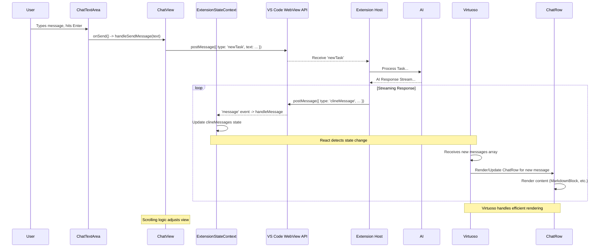

# Chapter 34: Chat UI Components (WebView)

Continuing from [Chapter 33: Shadcn/UI Primitives (WebView)](33_shadcn_ui_primitives__webview_.md), where we explored the foundational UI primitives adapted from shadcn/ui, we now dive into the specific components that utilize these primitives and the VS Code toolkit to construct the primary user interaction area within Roo-Code: the **Chat Interface**.

## Motivation: Building an Interactive Conversational Experience

The core of Roo-Code's interaction model is the conversation between the user and the AI agent. This requires a sophisticated user interface within the WebView that goes beyond simple text display. Users need to:

*   See a scrollable history of the current task's conversation, including their inputs, AI responses, status updates, tool usage, and potential errors.
*   Have a dedicated area to type new messages, potentially with support for mentioning files, symbols, or commands using `@` suggestions.
*   View complex content generated by the AI, such as formatted code blocks, Markdown text, Mermaid diagrams, or reasoning steps.
*   Interact with specific AI messages, like approving tool usage, responding to questions, copying code, or providing feedback.
*   Monitor the state of the interaction (e.g., token usage, AI thinking status).
*   Manage task-level actions like starting a new chat or exporting the current one.

The Chat UI Components, located primarily under `webview-ui/src/components/chat/`, are a collection of specialized React components designed to build this rich, interactive chat experience, ensuring it feels both functional and visually integrated with VS Code.

**Central Use Case:** Displaying and interacting with the AI conversation.
1.  The main `ChatView` component renders the overall structure.
2.  A `TaskHeader` displays the initial user prompt and aggregated task metrics (tokens, cost).
3.  A list component (using `Virtuoso` for performance) renders individual messages (`clineMessages` from the shared state) using the `ChatRow` component.
4.  Each `ChatRow` analyzes the `ClineMessage` type (`say`, `ask`) and subtype (`text`, `tool`, `command_output`, `reasoning`) to render the content appropriately using components like `MarkdownBlock`, `CodeBlock`, `ReasoningBlock`, `BrowserSessionRow`, etc. It also handles interactive elements like approval buttons for `ask` messages.
5.  A `ChatTextArea` component provides the input field, handling text entry, `@mention` suggestions via `ContextMenu`, image attachments, and sending messages back to the extension host.
6.  An `AutoApproveMenu` allows users to configure automatic approvals for certain tool actions.
7.  State related to input, loading status, and chat actions (`append`, `stop`) is managed locally within the chat context via `ChatProvider` and `useChatUI`, while the actual message list comes from the global `ExtensionStateContext`.

## Key Concepts

1.  **Component Hierarchy:** The chat interface is composed of several nested components:
    *   **`ChatView.tsx`:** The main container component, orchestrating the layout and rendering of header, messages, and input area. It manages the overall chat state using `ChatProvider`.
    *   **`TaskHeader.tsx`:** Displays summary information about the current task, including the initial prompt, token/cost metrics (using `ContextWindowProgress`), and task-level actions. Consumes state from `ExtensionStateContext`.
    *   **`ChatMessages.tsx` (Conceptual, often integrated with `Virtuoso`):** Responsible for rendering the list of messages. Uses `Virtuoso` for efficient virtualization of potentially long message lists.
    *   **`ChatRow.tsx`:** Renders a single `ClineMessage`. This is a key component containing logic to display different message types and subtypes using various rendering blocks.
    *   **Rendering Blocks:**
        *   `MarkdownBlock.tsx`: Renders Markdown content using `react-remark` and `rehype-highlight`, styled with VS Code themes. Includes logic for handling Mermaid diagrams via `MermaidBlock`.
        *   `CodeBlock.tsx`: Renders code snippets within `<pre><code>`, using `rehype-highlight` for syntax highlighting consistent with the editor theme. Includes handling for diff highlighting (`language-diff`).
        *   `CodeAccordian.tsx`: A wrapper around `CodeBlock` or diff display, often used for tool outputs (file contents, diffs), allowing content to be collapsed/expanded.
        *   `ReasoningBlock.tsx`: Displays the AI's "thinking" steps, often collapsible.
        *   `MermaidBlock.tsx`: Uses the `mermaid` library to render Mermaid diagram code into SVGs within `MarkdownBlock`.
        *   `CommandOutputViewer.tsx`: Specifically renders terminal command output, potentially handling ANSI escape codes.
        *   `BrowserSessionRow.tsx`: Renders messages related to browser interactions, often including screenshots and navigation controls.
        *   `CheckpointSaved.tsx`: Renders messages indicating a workspace checkpoint was saved, including interaction menus (`CheckpointMenu`).
        *   `FollowUpSuggest.tsx`: Renders suggested follow-up prompts from the AI.
    *   **`ChatInput.tsx` / `ChatTextArea.tsx`:** Handles the user input area. Uses `AutosizeTextarea` (a shadcn/ui primitive wrapper), manages input state, handles sending messages, integrates with `ContextMenu` for `@mentions`, and displays image thumbnails (`Thumbnails.tsx`).
    *   **`ContextMenu.tsx`:** The dropdown menu for `@mention` and slash command suggestions, using logic from `context-mentions.ts`.
    *   **`AutoApproveMenu.tsx`:** A collapsible section below the message list allowing users to toggle auto-approval settings. Reads/writes state via `ExtensionStateContext` and `vscode.postMessage`.
    *   **`Mention.tsx`:** Renders `@mention` text within messages as clickable links.

2.  **Chat-Specific State (`ChatProvider`, `useChatUI`):** While the core message list (`clineMessages`), API config, settings, etc., come from the global `ExtensionStateContext` ([Chapter 12: ExtensionStateContext](12_extensionstatecontext.md)), state and actions directly related to the *current chat input interaction* are managed via a dedicated `ChatProvider` (`webview-ui/src/components/ui/chat/ChatProvider.ts`).
    *   **`ChatProvider`:** Wraps the `ChatView` (or relevant parts) and provides values like `input` (current text area value), `setInput`, `isLoading`, `append` (function to send a user message), `stop` (function to request task cancellation).
    *   **`useChatUI`:** A custom hook used by components within the chat context (like `ChatInput`, `ChatMessages`) to access this input state and action functions. This separation keeps the global context cleaner and focuses the chat context on interaction logic.

3.  **Message Rendering (`ChatRow.tsx`):** This component receives a single `ClineMessage` object and uses `if/else` or `switch` statements based on `message.type` (`say` or `ask`) and `message.say` or `message.ask` subtypes to determine how to render the content.
    *   Handles standard text (`say: "text"`), errors (`say: "error"`), status updates (`say: "status"`), API request summaries (`say: "api_req_started"`), reasoning steps (`say: "reasoning"`).
    *   Handles interactive prompts (`ask: "tool"`, `ask: "command"`, `ask: "followup"`) potentially displaying specific UI elements like approval buttons or suggestions.
    *   Renders complex content using the dedicated block components (`MarkdownBlock`, `CodeBlock`, etc.). Tool-related messages (`say: "tool"`, `ask: "tool"`) often involve parsing JSON from `message.text` and rendering components like `CodeAccordian` or `McpToolRow`.

4.  **Efficient List Rendering (`Virtuoso`):** Long chat histories can impact performance. `ChatMessages` uses the `react-virtuoso` library to render only the messages currently visible in the viewport (plus a small buffer), significantly improving performance for conversations with hundreds or thousands of messages. It handles dynamic height changes and scrolling to the bottom.

5.  **Integration with Primitives:** Chat components heavily utilize the adapted shadcn/ui primitives ([Chapter 33: Shadcn/UI Primitives (WebView)](33_shadcn_ui_primitives__webview_.md)) (e.g., `Button`, `Popover`, `Tooltip`, `AutosizeTextarea`) and VS Code toolkit components ([Chapter 32: VSCode Webview UI Toolkit Wrappers](32_vscode_webview_ui_toolkit_wrappers.md)) (e.g., `VSCodeBadge`, `VSCodeProgressRing`, `VSCodeCheckbox` in `AutoApproveMenu`) for consistent styling and base functionality.

## Using the Chat Components

The primary usage involves assembling these components within the main `App.tsx` (which handles overall view routing) and within `ChatView.tsx` itself.

**Conceptual Assembly:**

```typescript
// --- File: webview-ui/src/App.tsx ---
// ... imports ...
import ChatView from './components/chat/ChatView';
import { ExtensionStateContextProvider } from './context/ExtensionStateContext'; // Global State

function App() {
    const { didHydrateState, /* ... other global state ... */ } = useExtensionState();
    const [tab, setTab] = useState('chat');
    // ... other App logic (message handling, navigation) ...

    if (!didHydrateState) return null;

    return (
        <>
            {/* ... other views (Settings, History) rendered based on 'tab' ... */}
            <ChatView isHidden={tab !== 'chat'} /* ... other props ... */ />
        </>
    );
}

// Wrap with global provider
const AppWithProviders = () => (
    <ExtensionStateContextProvider>
        <App />
    </ExtensionStateContextProvider>
);
export default AppWithProviders;

// --- File: webview-ui/src/components/chat/ChatView.tsx ---
// ... imports ...
import { ChatProvider } from "../ui/chat/ChatProvider"; // Chat-specific provider
import TaskHeader from './TaskHeader';
import ChatInput from './ChatInput'; // Likely wraps ChatTextArea internally
import { ChatMessages } from '../ui/chat/ChatMessages'; // Uses Virtuoso + ChatRow
import AutoApproveMenu from './AutoApproveMenu';
import { useExtensionState } from '@/context/ExtensionStateContext'; // Access global state

const ChatViewComponent = /* ... forwardRef ... */ => {
    // Access global state for messages, settings, etc.
    const { clineMessages, /* ... other global state needed by header/auto-approve ... */ } = useExtensionState();

    // Local state for chat interaction (managed by ChatProvider internally)
    const [input, setInput] = useState('');
    const [isLoading, setIsLoading] = useState(false);
    // ... other chat-specific state ...

    // Memoized actions provided by ChatProvider
    const append = useCallback(async (message: { role: string; content: string }) => {
        setIsLoading(true);
        // Logic to send message via vscode.postMessage
        // Note: In Roo, handleSendMessage does this, might be passed down
        // Example: vscode.postMessage({ type: 'newTask', text: message.content });
        // setIsLoading(false) // Handled by receiving messages back
    }, []);
    const stop = useCallback(() => {
        vscode.postMessage({ type: 'cancelTask' });
    }, []);

    // Value for the ChatProvider
    const chatContextValue = useMemo(() => ({
        input, setInput, isLoading, append, stop, assistantName: "Roo"
    }), [input, setInput, isLoading, append, stop]);

    const task = useMemo(() => clineMessages.at(0), [clineMessages]); // Get first message as task

    return (
        // Provide chat-specific context
        <ChatProvider value={chatContextValue}>
            <div style={{ display: isHidden ? 'none' : 'flex', flexDirection: 'column', height: '100%' }}>
                {task ? (
                    <TaskHeader task={task} /* ... pass metrics ... */ />
                ) : (
                    /* Welcome/History preview area */
                )}

                {/* Message list area */}
                <div style={{ flexGrow: 1, minHeight: 0 }}>
                    {/* ChatMessages uses Virtuoso internally */}
                    <ChatMessages />
                </div>

                {/* Auto-approve and Input area */}
                <AutoApproveMenu />
                <ChatInput />
            </div>
        </ChatProvider>
    );
};
const ChatView = forwardRef(ChatViewComponent);
export default ChatView;

// --- File: webview-ui/src/components/ui/chat/ChatMessages.tsx ---
// (Simplified concept using useChatUI and useExtensionState)
import { useChatUI } from "./useChatUI";
import { useExtensionState } from "@/context/ExtensionStateContext";
import { Virtuoso } from "react-virtuoso";
import ChatRow from "../../chat/ChatRow"; // Import ChatRow

export function ChatMessages() {
    // Get chat interaction state (like isLoading)
	const { isLoading } = useChatUI();
    // Get global state for the actual messages
    const { clineMessages: messages } = useExtensionState();
    // ... Virtuoso setup ...

    return (
        <Virtuoso
            // ... ref, data={messages}, totalCount ...
            itemContent={(index, message) => (
				<ChatRow
					key={message.ts} // Use timestamp as key
					message={message}
					isLast={index === messages.length - 1}
					isStreaming={isLoading && index === messages.length - 1}
					// ... handlers for expand, height change ...
				/>
			)}
        />
    );
}
```

**Explanation:**

*   `App.tsx` conditionally renders `ChatView` and wraps the application in the global `ExtensionStateContextProvider`.
*   `ChatView.tsx` uses `useExtensionState` to get the `clineMessages` array and other global data. It sets up local state (`input`, `isLoading`) and actions (`append`, `stop`) which it provides via `ChatProvider`. It arranges `TaskHeader`, `ChatMessages`, `AutoApproveMenu`, and `ChatInput`.
*   `ChatMessages.tsx` consumes both `useChatUI` (for `isLoading`) and `useExtensionState` (for `clineMessages`). It passes each message to `ChatRow` within the `Virtuoso` list.
*   `ChatRow.tsx` receives a single `message` prop and renders it using appropriate sub-components (`MarkdownBlock`, etc.).
*   `ChatInput.tsx` consumes `useChatUI` to get/set the `input` value and call `append` or `stop`. It also uses `useExtensionState` to get items needed for `@mention` context (`filePaths`, `modes`, etc.).

## Code Walkthrough

We will examine key components provided in the context snippets.

### `ChatView.tsx`

*(See full code in chapter context)*
*   **Structure:** Uses `forwardRef` for potential parent interaction. Sets up the main flex column layout: optional `TaskHeader` or welcome/history area, the main message list (`ChatMessages` using `Virtuoso`), `AutoApproveMenu`, and `ChatInput`.
*   **State Management:**
    *   Uses `useExtensionState` to access global state (`clineMessages`, `apiConfiguration`, settings for `AutoApproveMenu`, etc.).
    *   Defines local state for `input` and potentially `isLoading` (though `isLoading` might also be derived from message state).
    *   Creates `append` and `stop` functions (using `useCallback`) that send messages (`newTask`, `cancelTask`) via `vscode.postMessage`.
    *   Bundles the local state and actions into `chatContextValue` and provides it via `<ChatProvider>`.
*   **Derived Data:** Uses `useMemo` to derive `task` (first message), `modifiedMessages` (applying combining logic), and `apiMetrics` (calculating totals from messages).
*   **Message Handling:** An effect uses `useEvent("message", ...)` to listen for specific messages from the host that trigger *actions* within the chat view (like `focusInput`, `setChatBoxMessage`, `selectedImages`). *Note: Core state updates like new `clineMessages` are handled directly by `ExtensionStateContext` itself.*
*   **Scrolling:** Integrates `Virtuoso` for message rendering. Implements logic (`useCallback`, `useEffect`, `useEvent("wheel", ...)`) to handle scrolling to the bottom automatically, disabling auto-scroll when the user scrolls up, and showing a "Scroll to Bottom" button. Uses `debounce` for smooth scrolling.
*   **Event Handling:** Implements handlers (`handleSendMessage`, `handlePrimaryButtonClick`, `handleSecondaryButtonClick`, `handleTaskCloseButtonClick`, `selectImages`) which primarily trigger `vscode.postMessage` calls to the extension host. Includes logic for auto-approval checks based on `useExtensionState` settings before automatically clicking the primary button.
*   **Keyboard Shortcuts:** Adds a listener for `Cmd/Ctrl + .` to cycle through modes.
*   **`useImperativeHandle`:** Exposes an `acceptInput` method, likely used by the extension host via an `acceptInput` message to simulate pressing Enter or the primary button when the AI asks a question (`ask`) and expects input confirmation.

### `ChatMessages.tsx` / `ChatMessage.tsx` / `ChatRow.tsx`

*(ChatMessages, ChatMessage, ChatRow are provided in chapter context)*
*   **`ChatMessages`:** Simple component using `useChatUI` and `useExtensionState`. Sets up `Virtuoso`, passing `messages` data and rendering each item using `ChatMessage` (as described conceptually above, though the snippet actually shows `ChatRow`). Manages scrolling to the end via `useEffect`.
*   **`ChatMessage` (Snippet):** A wrapper around the content for a single message. It uses `useChatUI` and `useChatMessage` (a context specific to this row). It renders a header (`ChatMessageHeader` with avatar/badges) and content (`ChatMessageContent`), plus copy actions (`ChatMessageActions`). It uses `ChatMessageProvider` to pass message data down.
*   **`ChatRow` (Snippet):** A complex component responsible for rendering different `ClineMessage` types.
    *   Uses `useSize` to detect height changes for scrolling adjustments (`onHeightChange`).
    *   Uses `useMemo` extensively to derive state based on `message.type` and `message.say`/`message.ask` (e.g., `cost`, `apiRequestFailedMessage`, `isCommandExecuting`).
    *   Conditionally renders different UI structures based on the message type/subtype:
        *   **Tools (`tool`):** Parses JSON from `message.text`, identifies the specific tool (`readFile`, `appliedDiff`, `newTask`, etc.), and renders specialized UI, often using `CodeAccordian` to display file content or diffs.
        *   **Errors (`error`, `mistake_limit_reached`):** Displays error icon and message.
        *   **Commands (`command`):** Renders the command in a `CodeBlock` and potentially the output in `CommandOutputViewer` (within an accordian).
        *   **API Requests (`api_req_started`):** Displays status (loading indicator or check/error icon), cost (if available), and potentially the request details in an expandable `CodeAccordian`. Handles cancelled/failed states.
        *   **Follow-up (`followup`):** Renders the AI's question using `MarkdownBlock` and potential suggested replies using `FollowUpSuggest`.
        *   **Plain Text (`text`):** Renders using `MarkdownBlock`.
        *   **Reasoning (`reasoning`):** Renders using `ReasoningBlock`.
        *   **Checkpoints (`checkpoint_saved`):** Renders using `CheckpointSaved`.
        *   **MCP (`use_mcp_server`):** Renders using `McpToolRow` or `McpResourceRow`.
    *   Uses VS Code toolkit components (`VSCodeBadge`, `VSCodeButton`, `VSCodeProgressRing`) and shadcn/ui primitives (`Button`) for consistent styling.

### `ChatInput.tsx` / `ChatTextArea.tsx`

*(ChatInput, ChatTextArea provided in context)*
*   **`ChatInput`:** Provides `ChatInputProvider` (a simple context for passing `isDisabled` and submit handlers down) and renders the `ChatInputForm`.
*   **`ChatInputForm`:** Basic form structure wrapping the input field and submit button.
*   **`ChatInputField`:** Uses `AutosizeTextarea` (from `@/components/ui`), connecting its `value` and `onChange` to the `input` state from `useChatUI`. Attaches `onKeyDown` handler.
*   **`ChatInputSubmit`:** Renders the "Send" (`PaperPlaneIcon`) or "Stop" (`StopIcon`) button based on `isLoading` state from `useChatUI`. Calls `stop()` or triggers form submission.
*   **`ChatTextArea` (Full):** The more complex component handling mentions, drag-and-drop, etc.
    *   **State:** Manages numerous states for context menu (`showContextMenu`, `searchQuery`, `selectedMenuIndex`), cursor position, highlights, dragging, TTS status.
    *   **Context Hooks:** Uses `useExtensionState` (for file paths, modes, API configs for menus) and `useAppTranslation`.
    *   **Refs:** Uses `useRef` for the textarea, highlight layer, and context menu container.
    *   **Event Handling:** Extensive `useCallback` and `useEffect`/`useLayoutEffect`/`useEvent` hooks for:
        *   Input changes (`handleInputChange`): Updates state, determines if context menu should show, calculates `searchQuery`, debounces backend search requests (`searchFiles`, `searchCommits`).
        *   Keyboard events (`handleKeyDown`): Handles Enter (send), Shift+Enter (newline), Arrow keys/Tab/Enter/Escape (menu navigation/selection), Backspace (smart deletion of mentions via `removeMention`).
        *   Focus/Blur (`handleBlur`, `onFocus`): Manages menu visibility and focus state.
        *   Paste (`handlePaste`): Handles pasting text (detecting URLs) and images (reading files, converting to data URLs, updating `selectedImages`).
        *   Drag/Drop (`handleDrop`, `onDragOver`, `onDragLeave`): Handles dropping files/text, converting paths using `convertToMentionPath`, reading image files.
        *   Mention selection (`handleMentionSelect`): Calls `insertMention` to update input value and cursor position.
        *   Message listening (`useEffect` for backend responses): Handles `enhancedPrompt`, `commitSearchResults`, `fileSearchResults`, `ttsStart`/`ttsStop`.
    *   **Mention Highlighting:** Uses a hidden `div` (`highlightLayerRef`) positioned behind the textarea. `updateHighlights` mirrors the textarea content into this div, replacing mentions with `<mark>` tags, creating the visual highlighting effect while keeping the actual textarea input clean.
    *   **Component Usage:** Renders `DynamicTextArea` (react-textarea-autosize), `ContextMenu`, `Thumbnails`, `SelectDropdown` (for mode and API config selection), and `IconButton` components.

### Other Components

*   **`TaskHeader.tsx`:** Displays task title (first message), uses `ContextWindowProgress` to show token usage relative to the model's context window, shows calculated cost/token counts, includes `TaskActions` (Export/Delete). Uses `useExtensionState` for data.
*   **`ContextWindowProgress.tsx`:** Calculates percentages for used/reserved/available tokens using `calculateTokenDistribution` utility and renders a segmented progress bar with tooltips.
*   **`AutoApproveMenu.tsx`:** Collapsible section using `VSCodeCheckbox` and `AutoApproveToggle` (likely a component mapping settings keys to checkboxes) to manage auto-approval flags from `useExtensionState`. Sends messages (`alwaysAllowReadOnly`, etc.) on change.
*   **`MarkdownBlock.tsx`:** Uses `react-remark` with `rehype-highlight`. Includes custom remark plugin (`remarkUrlToLink`) to auto-link URLs. Includes logic to detect `language-mermaid` code blocks and render them using `MermaidBlock`. Uses `StyledPre` component to apply syntax highlighting theme variables obtained from `ExtensionStateContext`.
*   **`CodeBlock.tsx`:** Similar to `MarkdownBlock`'s code rendering, focused solely on rendering a single code block with highlighting and background.
*   **`MermaidBlock.tsx`:** Uses `mermaid.initialize` with VS Code theme variables. Uses `useEffect` and `useDebounceEffect` to parse and render the Mermaid code string into SVG asynchronously. Adds `onClick` to convert SVG to PNG data URL and send `openImage` message.
*   **`ReasoningBlock.tsx`:** A collapsible block to display AI reasoning steps (`content`). Includes logic (`useEffect`) to show scrolling text effect for new thoughts.

## Internal Implementation

1.  **Initialization:** `App` renders `ChatView`. `ChatView` provides `ChatProvider`. `ChatView` and its children use `useExtensionState` to get initial global state (empty `clineMessages`, settings, etc.). `ChatTextArea` might focus automatically.
2.  **User Input:** User types in `ChatTextArea`. `handleInputChange` updates `inputValue` (via `ChatProvider`/`useChatUI`), potentially triggers context menu (`ContextMenu`) via `shouldShowContextMenu` and `getContextMenuOptions`. Debounced backend searches might occur.
3.  **Send Message:** User clicks Send or hits Enter. `handleKeyDown` or button `onClick` calls `onSend`. `ChatTextArea`'s `onSend` prop calls `ChatView`'s `handleSendMessage`. `handleSendMessage` calls `vscode.postMessage({ type: 'newTask', ... })`. The input area is cleared, state reset (via `handleChatReset`).
4.  **Backend Processing:** Extension host receives `newTask`, starts `Cline`, calls AI.
5.  **Receiving Messages:** Host sends `clineMessage` updates back.
    *   `ExtensionStateContext`'s message handler receives the message.
    *   It updates the `clineMessages` array in its state (`setState`).
6.  **UI Re-render (Virtuoso):**
    *   React detects the state change in `ExtensionStateContext`.
    *   `ChatMessages` (using `useExtensionState`) receives the new `messages` array.
    *   `Virtuoso` efficiently determines which `ChatRow` components need to be rendered or updated based on the changed data and viewport position.
7.  **`ChatRow` Rendering:**
    *   `ChatRow` receives the new/updated `ClineMessage`.
    *   It determines the message type/subtype.
    *   It renders the appropriate content using `MarkdownBlock`, `CodeBlock`, etc., passing the relevant text or data from the message.
    *   If it's an `ask` message requiring user interaction, it renders buttons (conditionally enabled based on `lastMessage` state in `ChatView`).
8.  **Scrolling:** `useEffect` hooks in `ChatView` and `ChatMessages` detect changes in message count or height and call `virtuosoRef.current?.scrollToIndex` or `scrollTo` to keep the view scrolled to the bottom (unless `disableAutoScrollRef` is true).
9.  **User Interaction (Buttons):** User clicks an approval button. `ChatView`'s `handlePrimary/SecondaryButtonClick` sends an `askResponse` message back to the host. The buttons become disabled.

**Sequence Diagram (Sending/Receiving Message):**



## Modification Guidance

Modifications typically involve adding new message display types, customizing rendering blocks, or changing input area behavior.

1.  **Adding Display for a New `ClineMessage` Subtype (e.g., `say: "progress_bar"`):**
    *   **Define Message:** Add the subtype and potential payload structure to `ClineMessage` (`ExtensionMessage.ts`).
    *   **Modify `ChatRow.tsx`:**
        *   Add a `case "progress_bar":` to the `switch (message.say)` block.
        *   Create or reuse a component (e.g., `<ProgressBar value={parsedPayload.percent} />`) using VS Code toolkit or shadcn primitives.
        *   Render this component based on the message payload.
    *   **Extension Host:** Ensure the host sends messages with `say: "progress_bar"` when needed.

2.  **Customizing `MarkdownBlock` Rendering (e.g., Custom Link Handling):**
    *   **Locate:** Edit `webview-ui/src/components/common/MarkdownBlock.tsx`.
    *   **Modify `react-remark` Options:**
        *   Add a custom Rehype plugin to the `rehypePlugins` array. This plugin could intercept `<a>` tags and modify their `href` or add `onClick` handlers (e.g., to send `openExternal` messages for specific link types).
        *   Modify the `components` mapping to provide a completely custom implementation for rendering `<a>` tags (`a: MyCustomLinkComponent`).
    *   **Test:** Ensure links render and behave as expected.

3.  **Adding a New `@mention` Suggestion Type:**
    *   Follow the steps outlined in [Chapter 24: Mention Handling](24_mention_handling.md) modification guidance (update regex, `parseMentions`, `openMention`, UI suggestion logic in `context-mentions.ts`, potentially add new `ContextMenuOptionType`).

4.  **Changing Text Area Behavior (e.g., Different Max Height):**
    *   **Locate:** Edit `webview-ui/src/components/chat/ChatTextArea.tsx`.
    *   **Modify Props:** Change the `maxRows` prop passed to the `DynamicTextArea` component.
    *   **Modify Hooks:** Adjust logic in `handleKeyDown` or `handleInputChange` for different behavior.

**Best Practices:**

*   **Componentization:** Keep `ChatRow` logic focused on dispatching to specific rendering components (`MarkdownBlock`, `CodeBlock`, etc.) based on message type, rather than containing all rendering logic itself.
*   **State Separation:** Respect the separation between global state (`ExtensionStateContext`) for persistent/shared data and chat-local state (`ChatProvider`/`useChatUI`) for interaction-specific state like input value and loading status.
*   **Performance:** Leverage `Virtuoso` for long lists. Use `React.memo` and `useMemo`/`useCallback` appropriately to prevent unnecessary re-renders, especially in `ChatRow` and its sub-components. Be mindful of complex calculations within render paths.
*   **Accessibility:** Ensure interactive elements (buttons, links) are accessible, have proper labels (`aria-label`, `title`), and support keyboard navigation (handled partly by toolkit/Radix primitives).
*   **Consistency:** Use the VS Code toolkit and adapted shadcn/ui primitives consistently for styling.

**Potential Pitfalls:**

*   **Performance with Long Lists:** Even with `Virtuoso`, extremely complex `ChatRow` components or very frequent updates could impact scrolling performance. Profile if necessary.
*   **State Synchronization:** Logic errors in how `ChatProvider` state interacts with `ExtensionStateContext` updates could lead to inconsistent UI (e.g., input enabled when it shouldn't be).
*   **Complex `ChatRow` Logic:** The `ChatRow` component can become very large due to handling many message subtypes. Refactoring common patterns or using a more structured dispatch mechanism might be beneficial.
*   **Scrolling Issues:** Getting automatic "scroll to bottom" behavior perfect, especially with dynamic content heights and user interaction, can be tricky. The current implementation using `Virtuoso`, `useSize`, and `debounce` aims to handle this.
*   **Mention UI Complexity:** The logic in `ChatTextArea` for handling the context menu, highlighting, cursor positioning, and event interactions is intricate and sensitive to changes.

## Conclusion

The Chat UI components form the interactive heart of the Roo-Code WebView. By combining specialized components like `ChatView`, `TaskHeader`, `ChatRow`, `ChatTextArea`, and various content rendering blocks (`MarkdownBlock`, `CodeBlock`, `MermaidBlock`, etc.), Roo-Code presents a rich, functional, and visually consistent interface for user-AI conversation. Effective state management using both the global `ExtensionStateContext` (for messages, settings) and the local `ChatProvider` (for input interactions), along with performance optimizations like `Virtuoso`, enables a smooth user experience even for complex tasks and long conversations.

While the chat interface is central, Roo-Code's WebView also contains sections for managing settings, history, prompts, and MCP connections. The next chapters will explore the UI components dedicated to these specific areas, starting with [Chapter 35: Settings UI Components (WebView)](35_settings_ui_components__webview_.md).

