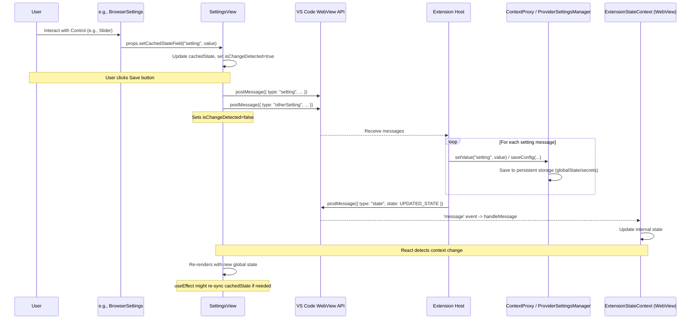

# Chapter 35: Settings UI Components (WebView)

Continuing from [Chapter 34: Chat UI Components (WebView)](34_chat_ui_components__webview_.md), which detailed the components forming the core conversational interface, we now explore the user interface elements responsible for configuring Roo-Code's behavior: the **Settings UI Components**.

## Motivation: A User-Friendly Configuration Experience

Roo-Code offers a wide range of configurable options, from selecting LLM providers and entering API keys to tuning tool behavior (like terminal output limits or browser viewport size) and managing experimental features. Relying solely on editing JSON configuration files or complex VS Code settings objects would be cumbersome and error-prone for many users.

The Settings UI Components provide a dedicated, graphical interface within the Roo-Code WebView panel, allowing users to easily view and modify settings in an intuitive manner. This UI needs to:

*   Organize settings into logical sections.
*   Provide appropriate controls (text fields, checkboxes, sliders, dropdowns) for different setting types.
*   Handle sensitive information like API keys securely.
*   Allow management of multiple API configuration profiles.
*   Provide visual feedback and validation.
*   Ensure changes are saved persistently and communicated back to the extension host.
*   Maintain visual consistency with the VS Code environment.

**Central Use Case:** A user wants to configure Roo-Code to use a specific AWS Bedrock model with provisioned throughput and also adjust the behavior of the browser tool.

1.  The user clicks the "Settings" icon/tab in the Roo-Code WebView UI.
2.  The `SettingsView` component renders, displaying different configuration sections.
3.  The user navigates to the "Providers" section.
4.  Using `ApiConfigManager`, they might create a new profile named "Bedrock-Provisioned".
5.  Within `ApiOptions`, they select "AWS Bedrock" as the provider.
6.  They enter their AWS credentials or select a profile.
7.  They select "Use Custom ARN" and paste their provisioned throughput ARN into the `VSCodeTextField`.
8.  They navigate to the "Browser" section (`BrowserSettings`).
9.  They select a different viewport size using the `Select` component and adjust the screenshot quality using the `Slider`.
10. They click the "Save" button in the `SettingsView` header.
11. The `SettingsView` sends multiple `postMessage` calls to the extension host to update the API configuration (using `upsertApiConfiguration`), browser viewport (`browserViewportSize`), and screenshot quality (`screenshotQuality`).
12. The extension host saves these settings securely ([Chapter 9: ProviderSettingsManager](09_providersettingsmanager.md), [Chapter 11: ContextProxy](11_contextproxy.md)) and confirms the update by potentially sending back a new global state.

## Key Concepts

1.  **Modular Structure:** The settings interface (`SettingsView.tsx`) is divided into distinct, collapsible or scrollable sections, each managed by a dedicated React component (e.g., `ApiOptions`, `BrowserSettings`, `TerminalSettings`). This promotes organization and maintainability.

2.  **`SettingsView.tsx`:** The main container component for the entire settings UI.
    *   **Layout & Navigation:** Provides the overall structure, including a header with Save/Done buttons and potentially a navigation mechanism (like the dropdown shown in the code) to jump between sections using `useRef` and `scrollToSection`.
    *   **State Management:** Holds a local copy (`cachedState`) of the relevant parts of the global `ExtensionStateContext` using `useState`. This acts as a buffer for user edits.
    *   **Change Detection:** Tracks whether any changes have been made to `cachedState` using an `isChangeDetected` flag.
    *   **Saving (`handleSubmit`):** When the "Save" button is clicked (and changes are detected and valid), this function sends numerous `vscode.postMessage` calls, one for each potentially modified setting, to the extension host.
    *   **Unsaved Changes Prompt:** Uses `checkUnsaveChanges` (exposed via `useImperativeHandle`) and an `AlertDialog` primitive to warn the user if they try to navigate away (`onDone`) with unsaved changes.

3.  **Section Components (`ApiOptions`, `BrowserSettings`, etc.):**
    *   Each component focuses on a specific category of settings.
    *   They receive relevant slices of the `cachedState` and setter functions (`setCachedStateField`, `setApiConfigurationField`, `setExperimentEnabled`) as props from `SettingsView`.
    *   They use VS Code Toolkit wrappers ([Chapter 32: VSCode Webview UI Toolkit Wrappers](32_vscode_webview_ui_toolkit_wrappers.md)) (e.g., `<VSCodeTextField>`, `<VSCodeCheckbox>`) and adapted shadcn/ui primitives ([Chapter 33: Shadcn/UI Primitives (WebView)](33_shadcn_ui_primitives__webview_.md)) (e.g., `<Button>`, `<Slider>`, `<Select>`, `<Dialog>`, `<Popover>`) to render the appropriate controls.
    *   Input events (`onChange`, `onInput`, `onValueChange`) within these components call the received setter functions, which update the `cachedState` in the parent `SettingsView`.

4.  **`SetCachedStateField<K>` Type:** A utility type defining the signature for setter functions passed down to section components. It ensures type safety when updating specific fields in `cachedState`.

5.  **API Configuration (`ApiOptions`, `ModelPicker`, `ApiConfigManager`):**
    *   `ApiConfigManager`: Handles the management (create, rename, delete, select) of named API configuration profiles using UI primitives like `Popover`, `Command`, `Dialog`. It interacts with the host via messages (`loadApiConfiguration`, `deleteApiConfiguration`, etc.).
    *   `ApiOptions`: Displays the detailed fields for the *currently selected* API profile (`apiConfiguration` from `cachedState`). It conditionally renders different input fields based on the chosen `apiProvider`. Includes validation (`validateApiConfiguration`) and displays errors (`ApiErrorMessage`). Uses `ModelPicker` for model selection.
    *   `ModelPicker`: A reusable component (likely using `Popover` and `Command`) for selecting a specific model ID from a list fetched for the current provider (e.g., `ollamaModels`, `openRouterModels`).

6.  **State Flow (UI -> Host -> UI):**
    *   User interacts with a control (e.g., changes a slider in `BrowserSettings`).
    *   The control's event handler calls `setCachedStateField("screenshotQuality", newValue)`.
    *   `SettingsView`'s `cachedState` is updated, `isChangeDetected` becomes true.
    *   User clicks "Save". `handleSubmit` runs.
    *   `vscode.postMessage({ type: "screenshotQuality", value: newValue })` is sent.
    *   Extension host (`webviewMessageHandler`) receives the message.
    *   Host calls `contextProxy.setValue("screenshotQuality", newValue)`.
    *   Host sends back a full state update: `vscode.postMessage({ type: "state", state: updatedGlobalState })`.
    *   `ExtensionStateContext`'s handler receives the `state` message and updates its internal state.
    *   `SettingsView` (using `useExtensionState`) receives the updated global state. Its `useEffect` hook synchronizes the `cachedState` if needed (especially when the `currentApiConfigName` changes or settings are imported), and `isChangeDetected` is reset.

7.  **Styling:** Relies heavily on Tailwind CSS utilities mapped to VS Code CSS variables, ensuring components like `SectionHeader`, `Section`, `Button`, `Input`, `Slider`, `Select` match the current VS Code theme. Uses `cn` utility for merging classes.

## Using the Settings Components (Use Case Revisited)

Let's trace the user configuring Bedrock and browser settings:

1.  **Navigation:** User clicks Settings tab. `App.tsx` renders `<SettingsView onDone={() => setTab('chat')} />`.
2.  **Initial Render:** `SettingsView` mounts. It gets initial state from `useExtensionState()` (e.g., `currentApiConfigName = "default"`). It sets `cachedState = initialState`. `isChangeDetected` is false. `ApiConfigManager`, `ApiOptions`, `BrowserSettings` etc. render based on `cachedState`.
3.  **Create Profile:** User interacts with `ApiConfigManager`.
    *   Clicks Add button (`<Button>`). `handleAdd` calls `setIsCreating(true)`.
    *   `Dialog` opens. User types "Bedrock-Provisioned" into `<Input>` (`newProfileName` state updates). Clicks "Create" (`<Button>`).
    *   `handleNewProfileSave` calls `validateName`, then `onUpsertConfig("Bedrock-Provisioned")`.
    *   `onUpsertConfig` (prop passed to `ApiConfigManager`) calls `vscode.postMessage({ type: "upsertApiConfiguration", text: "Bedrock-Provisioned", ... })`.
4.  **Host Processes:** Host saves the new profile via [Chapter 9: ProviderSettingsManager](09_providersettingsmanager.md). It sends back an updated `state` message including the new `listApiConfigMeta` and sets `currentApiConfigName` to "Bedrock-Provisioned".
5.  **State Update & Sync:** `ExtensionStateContext` updates. `SettingsView` re-renders. `useEffect` detects `currentApiConfigName` changed, updates `cachedState` from the new global state, and resets `isChangeDetected = false`. `ApiConfigManager` now shows "Bedrock-Provisioned" selected.
6.  **Configure Bedrock:** User interacts with `ApiOptions` (which now receives the empty Bedrock config from `cachedState`).
    *   Selects "AWS Bedrock" provider using `<Select>`. `onValueChange` calls `setApiConfigurationField("apiProvider", "bedrock")`. `isChangeDetected` becomes true.
    *   Inputs AWS details using `<VSCodeTextField>`. `onInput` calls `setApiConfigurationField("awsAccessKey", ...)`.
    *   Inputs ARN using `<VSCodeTextField>`. `onInput` calls `setApiConfigurationField("awsCustomArn", ...)`. Validation logic runs, `errorMessage` might update.
7.  **Configure Browser:** User scrolls/navigates to `BrowserSettings`.
    *   Selects viewport using `<Select>`. `onValueChange` calls `setCachedStateField("browserViewportSize", "900x600")`.
    *   Adjusts slider using `<Slider>`. `onValueChange` calls `setCachedStateField("screenshotQuality", 80)`.
8.  **Save:** User clicks "Save". `isChangeDetected` is true, `isSettingValid` is true. `handleSubmit` runs.
    *   Sends `postMessage({ type: "browserViewportSize", text: "900x600" })`.
    *   Sends `postMessage({ type: "screenshotQuality", value: 80 })`.
    *   Sends `postMessage({ type: "upsertApiConfiguration", text: "Bedrock-Provisioned", apiConfiguration: { apiProvider: "bedrock", awsCustomArn: ..., ... } })`.
    *   Sets `isChangeDetected = false`.
9.  **Host Processes:** Host saves all settings via `ContextProxy` and `ProviderSettingsManager`. Sends back updated `state`.
10. **UI Sync:** `ExtensionStateContext` updates. `SettingsView`'s `cachedState` remains in sync as no profile change occurred.

## Code Walkthrough

*(We will focus on `SettingsView`, `ApiOptions`, `ApiConfigManager`, and `BrowserSettings` based on the provided snippets)*

### `SettingsView.tsx`

*   **Structure:** Uses `Tab`, `TabHeader`, `TabContent` for basic layout. The header contains a dropdown (`DropdownMenu`) for navigation and Save/Done buttons. The content area renders all the section components sequentially, passing refs for scrolling.
*   **State:**
    *   `extensionState`: From global `useExtensionState()`.
    *   `cachedState`: Local copy initialized from `extensionState`, updated via setters.
    *   `isChangeDetected`, `isDiscardDialogShow`, `errorMessage`: Local UI state.
*   **Setters (`setCachedStateField`, etc.):** Use `useCallback` and `setState` to update `cachedState` and set `isChangeDetected = true`. `setApiConfigurationField` handles the nested structure.
*   **Sync Effect:** `useEffect` watches `currentApiConfigName` and `settingsImportedAt` from the global state. If they change, it resets `cachedState` based on the new global state and clears `isChangeDetected`, ensuring the local cache reflects the currently loaded profile or imported settings.
*   **`handleSubmit`:** Sends a series of `vscode.postMessage` calls for *all* relevant settings stored in `cachedState`. Resets `isChangeDetected`.
*   **`checkUnsaveChanges`:** Checks `isChangeDetected`. If true, stores the `then` callback (e.g., the `onDone` function) and shows the `AlertDialog`. If false, calls `then` immediately. Exposed via `useImperativeHandle`.
*   **Navigation:** Creates refs for each section div. The `DropdownMenu` items call `scrollToSection(ref)` on click. An effect handles scrolling to `targetSection` on initial load.
*   **Rendering Sections:** Passes relevant slices of `cachedState` and the setter functions as props to each section component (e.g., `<ApiOptions apiConfiguration={apiConfiguration} ... />`, `<BrowserSettings browserToolEnabled={browserToolEnabled} ... />`).

### `ApiOptions.tsx`

*   **Props:** Receives `apiConfiguration` and `setApiConfigurationField` from `SettingsView`. Also `errorMessage`/`setErrorMessage`.
*   **State:** Manages local state for fetched models (`ollamaModels`, `openRouterModels`, etc.) and UI toggles (`anthropicBaseUrlSelected`, etc.).
*   **Data Fetching:** Uses `useEffect` and `useDebounce` to trigger `postMessage` calls (`refreshOpenRouterModels`, `requestOllamaModels`, etc.) to the host when relevant fields (like base URLs or API keys) change, requesting updated model lists.
*   **Message Handling (`useEvent`):** Listens for messages from the host (`openRouterModels`, `ollamaModels`, etc.) and updates local state using `setOllamaModels`, `setOpenRouterModels`, etc.
*   **Validation:** `useEffect` calls `validateApiConfiguration` and `validateModelId` (utils) based on the current `apiConfiguration` and fetched model lists, updating the `errorMessage` state passed up to `SettingsView`.
*   **Conditional Rendering:** Uses `selectedProvider` (derived via `normalizeApiConfiguration`) to conditionally render input fields specific to each provider (e.g., API keys, base URLs, region selection for Bedrock, custom model capability fields for OpenAI).
*   **Component Usage:** Uses `Select` (shadcn) for provider selection, `VSCodeTextField` (toolkit) for inputs, `Checkbox` (vscrui/shadcn), `VSCodeRadioGroup`/`VSCodeRadio` (toolkit), `ModelPicker` (custom), `ModelInfoView` (custom), `ThinkingBudget` (custom), etc.
*   **Event Handlers (`handleInputChange`):** Uses `useCallback` to create generic handlers that call `setApiConfigurationField` with the correct field name and transformed value.

### `ApiConfigManager.tsx`

*   **Props:** Receives `currentApiConfigName`, `listApiConfigMeta`, and callback functions (`onSelectConfig`, `onDeleteConfig`, etc.) from `SettingsView`.
*   **State:** Manages UI state for renaming (`isRenaming`, `inputValue`), creating (`isCreating`, `newProfileName`), popover visibility (`open`), search (`searchValue`), and errors (`error`).
*   **UI Primitives:**
    *   Uses `Popover` + `Command` (shadcn/cmdk) for the profile selection dropdown with search. `CommandInput`, `CommandList`, `CommandItem` build the searchable list.
    *   Uses `Button` (shadcn) for Add/Rename/Delete icons and for Save/Cancel in dialogs.
    *   Uses `Dialog` (shadcn) for the "New Profile" modal.
    *   Uses `VSCodeTextField` (toolkit) or `Input` (shadcn) for rename/new profile name entry.
*   **Logic:**
    *   `useEffect` hooks manage focus when entering rename/create modes.
    *   State resets happen when the `currentApiConfigName` changes or dialogs/popovers close.
    *   Handlers (`handleSelectConfig`, `handleAdd`, `handleStartRename`, `handleSave`, `handleNewProfileSave`, `handleDelete`) validate input (`validateName`) and call the appropriate `on...` prop function, which triggers `postMessage` in `SettingsView`.
    *   Disables delete button if only one profile exists.

### `BrowserSettings.tsx` (Example Section)

*   **Props:** Receives boolean flags (`browserToolEnabled`, `remoteBrowserEnabled`), string/number values (`browserViewportSize`, `screenshotQuality`, `remoteBrowserHost`), and the `setCachedStateField` setter from `SettingsView`.
*   **State:** Manages local UI state for connection testing (`testingConnection`, `testResult`, `discovering`).
*   **Message Handling:** `useEffect` sets up a listener for `browserConnectionResult` messages from the host to update `testResult` and reset loading flags.
*   **UI Controls:**
    *   Uses `VSCodeCheckbox` (toolkit) for enabling browser tool and remote mode. `onChange` calls `setCachedStateField`. Logic ensures `remoteBrowserHost` is cleared if remote mode is disabled.
    *   Uses `Select` (shadcn) for viewport size selection. `onValueChange` calls `setCachedStateField`.
    *   Uses `Slider` (shadcn) for screenshot quality. `onValueChange` calls `setCachedStateField`.
    *   Uses `VSCodeTextField` (toolkit) for `remoteBrowserHost` input. `onChange` calls `setCachedStateField`.
    *   Uses `VSCodeButton` (toolkit) to trigger the connection test (`testConnection`).
*   **Interaction:** `testConnection` sends a `testBrowserConnection` message to the host. The result is received asynchronously via the message listener.

## Internal Implementation

1.  **Initialization:** `App` renders `SettingsView`. `SettingsView` gets initial global state via `useExtensionState`, copies it to `cachedState`. Section components render based on `cachedState`.
2.  **User Edit:** User changes a value in a section component (e.g., `BrowserSettings` slider).
3.  **Setter Call:** The component's `onChange`/`onValueChange` handler calls `props.setCachedStateField("settingName", newValue)`.
4.  **Cache Update:** `SettingsView.setCachedStateField` updates `cachedState` using `setState`. Sets `isChangeDetected = true`. UI re-renders locally to reflect the change in the control.
5.  **Save Trigger:** User clicks "Save".
6.  **`handleSubmit`:** `SettingsView.handleSubmit` iterates through all relevant settings in `cachedState` and sends individual `vscode.postMessage({ type: "settingName", ... })` calls for each. Sets `isChangeDetected = false`.
7.  **Host Processing:** `webviewMessageHandler` receives each message. For each message, it likely calls `contextProxy.setValue("settingName", value)`. For API config changes (`upsertApiConfiguration`), it calls `providerSettingsManager.saveConfig(...)`.
8.  **Persistent Save:** `ContextProxy` / `ProviderSettingsManager` save the value to `globalState` or `secrets`.
9.  **State Broadcast:** The host calls `provider.postStateToWebview()` sending the complete, updated state.
10. **Context Update:** `ExtensionStateContext` receives the `state` message and updates its internal state.
11. **UI Sync:** `SettingsView` (and potentially other components) re-renders based on the updated global state. `SettingsView`'s `useEffect` hook might run if `currentApiConfigName` changed, ensuring `cachedState` is consistent with the newly loaded profile.

**Sequence Diagram (Saving a Setting):**

## Modification Guidance

Modifications usually involve adding new settings or creating new sections.

1.  **Adding a New Simple Setting (e.g., `enableFancyFeature: boolean`):**
    *   **Schema:** Add `enableFancyFeature: z.boolean().optional()` to `globalSettingsSchema` and `GLOBAL_STATE_KEYS` in `src/schemas/index.ts`.
    *   **Types:** Add `enableFancyFeature?: boolean` to `ExtensionState` and `ExtensionStateContextType`.
    *   **Section Component:** Choose the most relevant section (e.g., `ExperimentalSettings`). Add a `VSCodeCheckbox` control. Add `enableFancyFeature?: boolean` to its Props type and receive it. In `onChange`, call `props.setCachedStateField("enableFancyFeature", e.target.checked)`.
    *   **`SettingsView`:**
        *   Add `enableFancyFeature` to the destructuring from `cachedState`.
        *   Pass `enableFancyFeature={enableFancyFeature}` and `setCachedStateField` down to the section component.
        *   Add `vscode.postMessage({ type: "enableFancyFeature", bool: enableFancyFeature })` to `handleSubmit`.
    *   **Extension Host:**
        *   Add `enableFancyFeature` to the `ExtensionState` type used by the host.
        *   Add `case "enableFancyFeature":` to `webviewMessageHandler` to call `contextProxy.setValue("enableFancyFeature", message.bool)`.
        *   Ensure `getStateToPostToWebview` includes the value.
    *   **Consumption:** Use `contextProxy.getValue("enableFancyFeature")` in the host where needed.

2.  **Adding a New Settings Section (e.g., "Code Formatting"):**
    *   **Create Component:** Create `webview-ui/src/components/settings/FormattingSettings.tsx`. Implement it similarly to `BrowserSettings`, using primitives, receiving relevant props (`cachedState` slices, `setCachedStateField`), and using `Section`/`SectionHeader`. Define necessary props type.
    *   **Add Settings:** Define any new settings needed for this section in the schemas/types as per step 1.
    *   **`SettingsView.tsx`:**
        *   Add a `formattingRef = useRef<HTMLDivElement>(null)`.
        *   Add `{ id: "formatting", icon: SomeIcon, ref: formattingRef }` to the `sections` array.
        *   Import and render `<FormattingSettings ref={formattingRef} ... />` within `TabContent`, passing necessary state/setters.
        *   Add `postMessage` calls for the new settings within `handleSubmit`.
    *   **Host:** Add handlers for the new setting messages in `webviewMessageHandler`.
    *   **i18n:** Add translations for the section header/description and any new setting labels.

**Best Practices:**

*   **Modular Sections:** Keep settings grouped logically in separate section components.
*   **Centralized State Cache:** Use the `cachedState` pattern in `SettingsView` to manage edits before saving. Pass slices of state and setters down to sections.
*   **Consistent Styling:** Use the provided VS Code toolkit wrappers and themed shadcn/ui primitives. Use `SectionHeader` and `Section` components for layout consistency.
*   **Validation:** Implement input validation where necessary (e.g., for URLs, numbers). Use `setErrorMessage` in `ApiOptions` or similar patterns to provide feedback. Disable the Save button if `isSettingValid` is false.
*   **Debouncing/Throttling:** For settings that trigger background actions on change (like model list refreshes in `ApiOptions`), use `useDebounce` to avoid excessive calls.
*   **Accessibility:** Ensure labels are correctly associated with inputs. Use appropriate roles and ARIA attributes (often handled by the underlying primitives).

**Potential Pitfalls:**

*   **State Sync Issues:** Bugs in the `useEffect` hook that syncs `cachedState` or in the save/load message flow could lead to the UI showing stale or incorrect data after profile switching or saving.
*   **Validation Gaps:** Missing validation for critical inputs (like API keys or base URLs) might allow invalid data to be saved, causing errors later during API calls.
*   **Component Complexity:** `ApiOptions` is inherently complex due to the number of providers. Keeping it maintainable requires careful conditional rendering and potentially further component extraction.
*   **Error Handling:** Ensure errors during saving (communicated back from the host, although not explicitly shown in snippets) or validation are clearly displayed to the user.
*   **Performance:** Rendering many sections with numerous controls might have a small performance impact, but React's reconciliation and the modular structure generally keep it manageable.

## Conclusion

The Settings UI Components provide a crucial, user-friendly interface for configuring Roo-Code's extensive options within the WebView. By organizing settings into logical sections (`ApiOptions`, `BrowserSettings`, etc.), utilizing themed UI primitives (`Button`, `Slider`, `Select`, `VSCodeCheckbox`, etc.), and implementing a robust state management pattern (`cachedState`, `setCachedStateField`, `handleSubmit`), this part of the UI allows users to easily customize API providers, tool behavior, and other features. The interaction relies on the established message protocol to communicate changes back to the extension host for persistent storage and application.

Having explored the chat and settings interfaces, we next examine the components responsible for viewing and managing past conversations: [Chapter 36: History UI Components (WebView)](36_history_ui_components__webview_.md).

Relevant Code Snippets (Code itself remains unchanged):
--- File: webview-ui/src/components/settings/RequestyBalanceDisplay.tsx ---
--- File: webview-ui/src/components/settings/ApiErrorMessage.tsx ---
--- File: webview-ui/src/components/settings/TerminalSettings.tsx ---
--- File: webview-ui/src/components/settings/NotificationSettings.tsx ---
--- File: webview-ui/src/components/settings/ApiConfigManager.tsx ---
--- File: webview-ui/src/components/settings/BrowserSettings.tsx ---
--- File: webview-ui/src/components/settings/ReasoningEffort.tsx ---
--- File: webview-ui/src/components/settings/SettingsView.tsx ---
--- File: webview-ui/src/components/settings/Section.tsx ---
--- File: webview-ui/src/components/settings/ModelPicker.tsx ---
--- File: webview-ui/src/components/settings/R1FormatSetting.tsx ---
--- File: webview-ui/src/components/settings/RateLimitSecondsControl.tsx ---
--- File: webview-ui/src/components/settings/ThinkingBudget.tsx ---
--- File: webview-ui/src/components/settings/ApiOptions.tsx ---
--- File: webview-ui/src/components/settings/SectionHeader.tsx ---
--- File: webview-ui/src/components/settings/OpenRouterBalanceDisplay.tsx ---
--- File: webview-ui/src/components/settings/DiffSettingsControl.tsx ---
--- File: webview-ui/src/components/settings/ContextManagementSettings.tsx ---
--- File: webview-ui/src/components/settings/ModelInfoView.tsx ---
--- File: webview-ui/src/components/settings/LanguageSettings.tsx ---
--- File: webview-ui/src/components/settings/AutoApproveToggle.tsx ---
--- File: webview-ui/src/components/settings/ExperimentalSettings.tsx ---
--- File: webview-ui/src/components/settings/AutoApproveSettings.tsx ---
--- File: webview-ui/src/components/settings/TemperatureControl.tsx ---
--- File: webview-ui/src/components/settings/PromptCachingControl.tsx ---
--- File: webview-ui/src/components/settings/About.tsx ---
--- File: webview-ui/src/components/settings/CheckpointSettings.tsx ---

