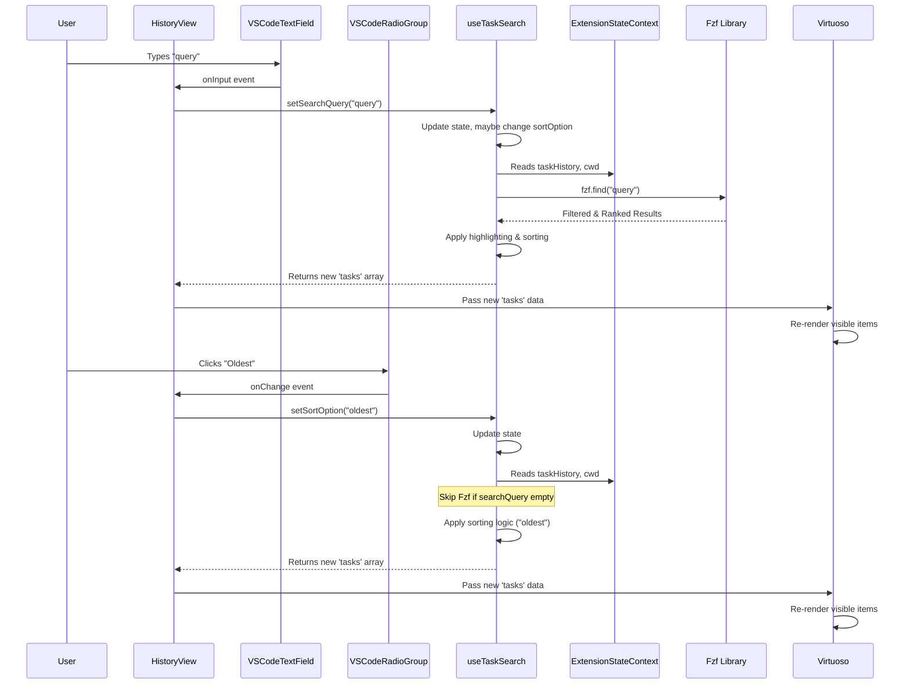
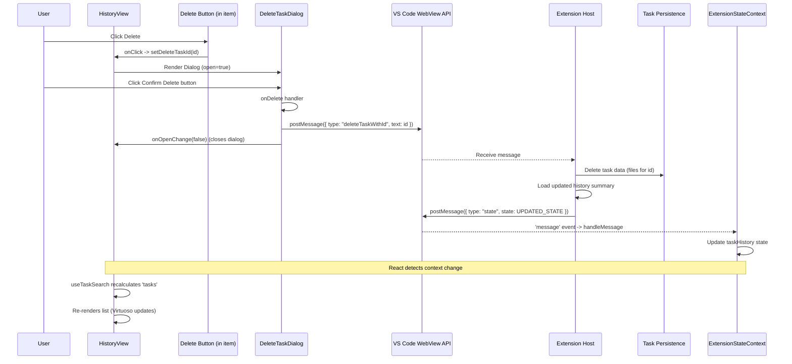

# Chapter 36: History UI Components (WebView)

Continuing from [Chapter 35: Settings UI Components (WebView)](35_settings_ui_components__webview_.md), where we explored the components for configuring Roo-Code, we now turn to the user interface elements dedicated to viewing and managing the records of past interactions: the **History UI Components**.

## Motivation: Reviewing and Managing Past AI Interactions

As users interact with Roo-Code over time, completing various tasks and conversations, a history of these interactions accumulates. Simply storing this history ([Chapter 14: Task Persistence](14_task_persistence.md)) isn't enough; users need an intuitive way to browse, search, understand, and manage these past tasks. They might want to:

*   Find a specific previous conversation based on keywords.
*   Review the details of a past task, including cost and token usage.
*   Sort tasks by date, cost, or relevance to a search query.
*   Delete obsolete or unwanted tasks, individually or in batches.
*   Export the content of a specific task for documentation or sharing.
*   Get a quick glimpse of recent activity without leaving the main chat view.

The History UI Components, located in `webview-ui/src/components/history/`, provide the user interface within the WebView panel to meet these needs. They offer a full view for detailed browsing and management (`HistoryView`) and a concise preview (`HistoryPreview`) integrated into the main welcome/chat screen.

**Central Use Case:** A user wants to find a task from last week related to "database schema refactoring", check its cost, and then delete a few old, irrelevant tasks from the list.

1.  The user clicks the "History" icon/tab in the Roo-Code WebView UI.
2.  The `HistoryView` component renders, fetching the list of `HistoryItem` summaries from the global state via the `useTaskSearch` hook.
3.  The user types "database schema" into the search input (`VSCodeTextField`).
4.  The `useTaskSearch` hook filters the list using `Fzf`, highlighting matches, and automatically switches the sort order to "Most Relevant". `HistoryView` re-renders the list.
5.  The user finds the relevant task and examines its displayed metadata (date, cost, tokens). They click on the task item.
6.  `HistoryView` sends a `showTaskWithId` message to the extension host, which loads the full conversation into the main chat view.
7.  After reviewing, the user navigates back to the `HistoryView`. They click the "Selection Mode" button.
8.  Checkboxes appear next to each task. The user selects three old tasks.
9.  The user clicks the "Delete Selected" button in the fixed action bar that appears.
10. The `BatchDeleteTaskDialog` component renders, asking for confirmation.
11. The user confirms deletion. The dialog sends a `deleteMultipleTasksWithIds` message to the extension host with the selected task IDs.
12. The extension host deletes the tasks and sends back an updated state. `HistoryView` re-renders, showing the updated list without the deleted tasks.

## Key Concepts

1.  **Component Suite:** The history feature comprises several components:
    *   `HistoryView.tsx`: The main view displaying the searchable, sortable list of all tasks.
    *   `HistoryPreview.tsx`: A smaller component showing the 3 most recent tasks, typically displayed on the welcome screen or below the main chat.
    *   `useTaskSearch.ts`: A custom React hook managing the logic for filtering (using `Fzf`), sorting, highlighting search results, and toggling workspace visibility based on `taskHistory` from `ExtensionStateContext`.
    *   `DeleteTaskDialog.tsx`: An `AlertDialog` primitive confirming the deletion of a single task.
    *   `BatchDeleteTaskDialog.tsx`: An `AlertDialog` primitive confirming the deletion of multiple selected tasks.
    *   `ExportButton.tsx`: A button component within each list item to trigger task export.
    *   `CopyButton.tsx`: A button component within each list item to copy the initial task prompt.

2.  **Data Source (`taskHistory`, `HistoryItem`):** The components primarily display data from the `taskHistory` array stored in the global `ExtensionStateContext` ([Chapter 12: ExtensionStateContext](12_extensionstatecontext.md)). Each element in this array is a `HistoryItem` object, containing summary metadata generated by `taskMetadata` ([Chapter 14: Task Persistence](14_task_persistence.md)) – ID, timestamp, initial prompt text, token counts, cost, disk size, workspace path.

3.  **Search and Sort (`useTaskSearch`):** This hook encapsulates the core client-side logic for manipulating the history list.
    *   **State:** Manages `searchQuery`, `sortOption`, `lastNonRelevantSort`, `showAllWorkspaces`.
    *   **Filtering:** Uses `Fzf` (a fuzzy search library) to filter `taskHistory` based on `searchQuery`.
    *   **Sorting:** Applies sorting logic based on the selected `sortOption` ("newest", "oldest", "mostExpensive", "mostTokens", "mostRelevant"). Relevance sort uses the order returned by `Fzf`.
    *   **Highlighting:** Uses a helper (`highlightFzfMatch`) to wrap matched characters in the task text with `<mark>` tags for visual feedback.
    *   **Workspace Filtering:** Filters tasks based on the `item.workspace` property matching the current `cwd` from `ExtensionStateContext`, unless `showAllWorkspaces` is true.

4.  **Efficient Rendering (`Virtuoso`):** `HistoryView` uses `react-virtuoso` to render the potentially long list of history items efficiently. Virtuoso only renders the items currently visible in the viewport, preventing performance degradation even with thousands of tasks.

5.  **Selection Mode:** `HistoryView` implements a selection mode allowing users to check multiple tasks for batch operations (currently, only deletion). This involves managing `isSelectionMode` and `selectedTaskIds` state and conditionally rendering checkboxes and an action bar.

6.  **Interaction:**
    *   Clicking a task item triggers a `showTaskWithId` message to load the full conversation in the chat view.
    *   Clicking delete icons triggers `deleteTaskWithId` (via `DeleteTaskDialog`) or `deleteMultipleTasksWithIds` (via `BatchDeleteTaskDialog`) messages.
    *   Clicking export icons triggers `exportTaskWithId`.
    *   Changing search/sort options updates the list client-side via `useTaskSearch`.

7.  **Styling:** Uses VS Code toolkit components (`VSCodeTextField`, `VSCodeRadioGroup`, `VSCodeRadio`) and themed shadcn/ui primitives (`Button`, `Checkbox`, `AlertDialog`, etc.) with Tailwind classes mapped to VS Code variables for a consistent look and feel.

## Using the History Components (Use Case Revisited)

Let's trace the "find and delete" use case:

1.  **Render `HistoryView`:** The component mounts. `useTaskSearch` gets the initial `taskHistory` (filtered by `cwd`). It applies the default sort ("newest"). `Virtuoso` renders the initial list.
2.  **Search:** User types "database schema" into the `VSCodeTextField`.
    *   `onInput` calls `setSearchQuery("database schema")`.
    *   `useTaskSearch`'s `useEffect` detects `searchQuery` changed, sets `sortOption` to "mostRelevant" (saving "newest" in `lastNonRelevantSort`).
    *   The `useMemo` for `tasks` re-runs. It calls `fzf.find("database schema")`.
    *   `searchResults` are mapped, applying highlighting via `highlightFzfMatch`.
    *   The sorted `tasks` array updates (now ordered by relevance).
    *   `HistoryView` re-renders, passing the new `tasks` array to `Virtuoso`.
3.  **View Task:** User clicks the relevant task item.
    *   `onClick` handler calls `vscode.postMessage({ type: "showTaskWithId", text: item.id })`.
    *   The main `App.tsx` likely handles switching the view back to Chat (`setTab('chat')`) and the extension host loads the task messages.
4.  **Enter Selection Mode:** User navigates back, clicks "Selection Mode" button.
    *   `toggleSelectionMode` sets `isSelectionMode` to `true`.
    *   `HistoryView` re-renders, showing checkboxes and the bottom action bar (initially disabled).
5.  **Select Tasks:** User clicks checkboxes for three tasks.
    *   `toggleTaskSelection` updates the `selectedTaskIds` state array.
    *   `HistoryView` re-renders, highlighting selected rows and enabling the "Delete Selected" button.
6.  **Initiate Batch Delete:** User clicks "Delete Selected".
    *   `handleBatchDelete` sets `setShowBatchDeleteDialog(true)`.
7.  **Confirm Delete:** `BatchDeleteTaskDialog` renders. User clicks the "Delete Items" button.
    *   `onDelete` calls `vscode.postMessage({ type: "deleteMultipleTasksWithIds", ids: selectedTaskIds })`.
    *   `onOpenChange(false)` is called, closing the dialog and resetting selection state in `HistoryView`.
8.  **Host Deletes & Updates:** Extension host deletes task data, sends back updated `state` with the modified `taskHistory`.
9.  **List Refresh:** `ExtensionStateContext` updates. `useTaskSearch` receives the new `taskHistory`, recalculates the `tasks` list. `HistoryView` re-renders with the deleted items removed.

## Code Walkthrough

*(Referencing code snippets provided in the prompt)*

### `HistoryView.tsx`

*   **State:** Manages local UI state: `deleteTaskId` (for single delete dialog), `isSelectionMode`, `selectedTaskIds`, `showBatchDeleteDialog`.
*   **`useTaskSearch` Hook:** Consumes this hook to get the processed `tasks` list and setters for `searchQuery`, `sortOption`, etc.
*   **Layout:** Uses `Tab`, `TabHeader`, `TabContent`. Header contains the title, mode toggle button, Done button, search input, sort radio group, and workspace filter checkbox. Conditionally renders "Select All" controls in selection mode.
*   **Search/Sort Controls:** Uses `<VSCodeTextField>` for search, updating `searchQuery` via `setSearchQuery`. Uses `<VSCodeRadioGroup>` and `<VSCodeRadio>` for sorting, updating `sortOption` via `setSortOption`. Uses `<Checkbox>` (shadcn) for `showAllWorkspaces`.
*   **List Rendering (`Virtuoso`):** Renders the `tasks` array.
    *   `itemContent`: Renders each `item` (a `HistoryItem`).
    *   Conditionally renders a `<Checkbox>` at the start of the row in selection mode.
    *   Displays formatted date, task summary (`dangerouslySetInnerHTML` assumes `highlightFzfMatch` produces safe HTML), token counts, cache info, cost, and optional workspace path.
    *   Includes `CopyButton` and `ExportButton` (when not in selection mode).
    *   Includes a single "Delete" button (when not in selection mode) that triggers the `DeleteTaskDialog`.
    *   Adds `onClick` to the main item div to trigger `showTaskWithId`.
*   **Action Bar:** A `div` fixed to the bottom, conditionally rendered only when `isSelectionMode` is true and `selectedTaskIds.length > 0`. Contains "Clear Selection" and "Delete Selected" buttons.
*   **Dialogs:** Conditionally renders `DeleteTaskDialog` (when `deleteTaskId` is set) and `BatchDeleteTaskDialog` (when `showBatchDeleteDialog` is true), passing necessary IDs and `onOpenChange` handlers.

### `useTaskSearch.ts`

*   **Context:** Uses `useExtensionState` to get the raw `taskHistory` and current `cwd`.
*   **State:** Manages `searchQuery`, `sortOption`, `lastNonRelevantSort` (to restore previous sort after clearing search), `showAllWorkspaces`.
*   **`presentableTasks` (`useMemo`):** Filters `taskHistory` based on `showAllWorkspaces` and `cwd`. Memoized to avoid re-filtering unless dependencies change.
*   **`Fzf` Instance (`useMemo`):** Creates an `Fzf` instance with the `presentableTasks`, memoized based on the task list.
*   **`tasks` (`useMemo`):** The core logic.
    *   Starts with `presentableTasks`.
    *   If `searchQuery` exists, calls `fzf.find` to get filtered/ranked results. Maps over results to apply highlighting using `highlightFzfMatch`.
    *   Sorts the results (either original list or Fzf results) based on `sortOption`. Handles newest, oldest, cost, tokens, and relevance (using Fzf order if searching, otherwise newest).
    *   Returns the final filtered, highlighted, and sorted array.
*   **Effect:** Manages automatically switching to/from "mostRelevant" sort when `searchQuery` changes.

### `HistoryPreview.tsx`

*   **Props:** Takes `showHistoryView` function to navigate to the full view.
*   **Hook:** Uses `useTaskSearch` to get the filtered/sorted `tasks`.
*   **Rendering:**
    *   Shows a header with "Recent Tasks" and a "View All" button (calls `showHistoryView`).
    *   If `tasks` is empty, shows an onboarding message with a link.
    *   Maps over the first 3 `tasks` (`tasks.slice(0, 3)`).
    *   For each item, renders a simplified view similar to `HistoryView`'s item content (date, summary, tokens/cache/cost, optional workspace), making the entire item clickable to trigger `showTaskWithId`. Includes `CopyButton`.

### Dialogs (`DeleteTaskDialog.tsx`, `BatchDeleteTaskDialog.tsx`)

*   **Structure:** Use the `AlertDialog` primitive from shadcn/ui (`AlertDialog`, `AlertDialogContent`, `AlertDialogHeader`, `AlertDialogTitle`, `AlertDialogDescription`, `AlertDialogFooter`, `AlertDialogCancel`, `AlertDialogAction`).
*   **Props:** Receive `taskId` or `taskIds` and standard `AlertDialogProps` (like `open`, `onOpenChange`).
*   **Action:** The `AlertDialogAction` button (`Delete` / `Delete Items`) has an `onClick` handler (`onDelete`).
*   **`onDelete`:** Uses `useCallback`. Calls `vscode.postMessage` with the appropriate type (`deleteTaskWithId` or `deleteMultipleTasksWithIds`) and payload (`text: taskId` or `ids: taskIds`). Calls `onOpenChange(false)` to close the dialog.
*   **Keyboard Shortcut (`DeleteTaskDialog`):** Includes `useKeyPress("Enter")` to allow confirming deletion with the Enter key.

### Action Buttons (`ExportButton.tsx`, `CopyButton.tsx`)

*   **`ExportButton`:** Renders a `Button` primitive. `onClick` calls `vscode.postMessage({ type: "exportTaskWithId", text: itemId })`. Uses `codicon-desktop-download`.
*   **`CopyButton`:** Renders a `Button` primitive. Uses the `useClipboard` hook. `onClick` extracts text content from the `itemTask` HTML (using a temporary div) and calls `copy(text)`. Uses `codicon-copy` or `codicon-check` based on `isCopied` state.

## Internal Implementation

1.  **Data Flow:** `ExtensionStateContext` holds `taskHistory`. `useTaskSearch` consumes this, applies filtering/sorting/highlighting based on its local state (`searchQuery`, `sortOption`), and produces the `tasks` array. `HistoryView`/`HistoryPreview` consume `tasks` and render the list using `Virtuoso` and item components.
2.  **Search/Sort Interaction:**
    *   User types in `VSCodeTextField` -> `onInput` -> `setSearchQuery`.
    *   `useTaskSearch` `useEffect` might change `sortOption` to "mostRelevant".
    *   `useTaskSearch` `useMemo` for `tasks` re-calculates using `Fzf` and sorting logic.
    *   `HistoryView` receives new `tasks` prop and re-renders `Virtuoso`.
3.  **Action Interaction (e.g., Delete):**
    *   User clicks Delete button -> `setDeleteTaskId`.
    *   `DeleteTaskDialog` renders.
    *   User clicks Confirm -> `onDelete` handler runs.
    *   `onDelete` calls `vscode.postMessage({ type: "deleteTaskWithId", ... })`.
    *   Extension Host receives message, deletes data, sends updated `state`.
    *   `ExtensionStateContext` updates `taskHistory`.
    *   `useTaskSearch` receives new `taskHistory`, recalculates `tasks`.
    *   `HistoryView` re-renders, removing the deleted item.

**Sequence Diagram (Search & Sort):**

**Sequence Diagram (Delete Task):**

## Modification Guidance

Modifications might involve adding search facets, new actions, or changing the displayed information.

1.  **Adding a New Sort Option (e.g., "By Workspace"):**
    *   **`useTaskSearch.ts`:**
        *   Add `"byWorkspace"` to the `SortOption` type.
        *   Add a new `<VSCodeRadio value="byWorkspace">` in `HistoryView.tsx`.
        *   Add a `case "byWorkspace":` to the `sort` logic. Implement the comparison based on `a.workspace` and `b.workspace` (and maybe a secondary sort key like `ts`).
    *   **Considerations:** Ensure the `workspace` property is reliably populated in `HistoryItem`.

2.  **Changing Displayed Item Info (e.g., Show Provider Name):**
    *   **`HistoryItem`:** Ensure the `providerId` or `apiProvider` used for the task is included in the `HistoryItem` type and generated by `taskMetadata`.
    *   **`HistoryView.tsx`:** In the `itemContent` rendering logic, access `item.apiProvider` and display it (e.g., using a `<VSCodeBadge>`).
    *   **`HistoryPreview.tsx`:** Make the corresponding change if needed there too.

3.  **Adding a "Pin Task" Action:**
    *   **State:** Add `pinnedTaskIds: string[]` to `ExtensionState` and `ExtensionStateContextType`. Add logic in `ExtensionStateContext` to handle updates. Add persistence in `ContextProxy`.
    *   **UI (`HistoryView.tsx`):** Add a "Pin" button component (similar to `ExportButton`). `onClick` sends a `togglePinTask(taskId)` message. Conditionally render a "pinned" indicator on pinned items.
    *   **`useTaskSearch.ts`:** Add a "pinned" sort option that puts pinned tasks first, then applies another sort (like "newest").
    *   **Host:** Add `togglePinTask` message handler in `webviewMessageHandler` to update the pinned IDs list via `ContextProxy`. Send back updated state.

**Best Practices:**

*   **Client-Side Operations:** Perform search, sort, and filtering client-side within `useTaskSearch` for responsiveness, as the entire `taskHistory` summary is usually small enough to keep in memory.
*   **Efficient Rendering:** Continue using `Virtuoso` for the main list to handle potentially very large histories smoothly.
*   **Clear Actions:** Use clear labels and icons for buttons. Use confirmation dialogs (`AlertDialog`) for destructive actions like deletion.
*   **Debounce Search (if needed):** If `Fzf` becomes slow with extremely large histories (unlikely with just summaries), consider debouncing the `setSearchQuery` update.
*   **State Management:** Keep UI state (like selection) local to `HistoryView`, while relying on `ExtensionStateContext` for the core `taskHistory` data.

**Potential Pitfalls:**

*   **Large History Performance:** While `Virtuoso` handles rendering, the initial loading and client-side filtering/sorting in `useTaskSearch` might become slightly sluggish if `taskHistory` grows to tens or hundreds of thousands of items. Consider backend pagination/search if this becomes a real issue.
*   **Highlighting Complexity:** Injecting HTML via `dangerouslySetInnerHTML` for highlighting requires trust that `highlightFzfMatch` produces safe output (which it should if only adding `<mark>` tags). Alternatives like mapping characters to styled spans are safer but more complex.
*   **State Synchronization:** Ensuring the selection state (`selectedTaskIds`) is correctly cleared or managed when the underlying `tasks` list changes due to filtering, sorting, or updates from the host requires careful effect management.
*   **Consistency with Chat View:** Actions like `showTaskWithId` rely on the Chat view being able to correctly load and display the corresponding task based on its ID.

## Conclusion

The History UI Components provide an essential interface for users to manage and review their past interactions with Roo-Code. `HistoryView`, powered by the `useTaskSearch` hook and `Virtuoso`, offers efficient searching, sorting, and browsing, while `HistoryPreview` provides quick access to recent activity. Components like `DeleteTaskDialog`, `ExportButton`, and `CopyButton` integrate actions seamlessly. By utilizing themed UI primitives and clear interaction patterns, these components deliver a functional and visually consistent experience for managing task history within the WebView.

Next, we will explore the components related to managing and customizing the prompts used by the AI: [Chapter 37: Prompts UI Components (WebView)](37_prompts_ui_components__webview_.md).

