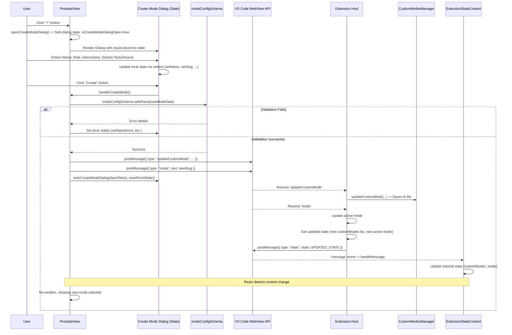
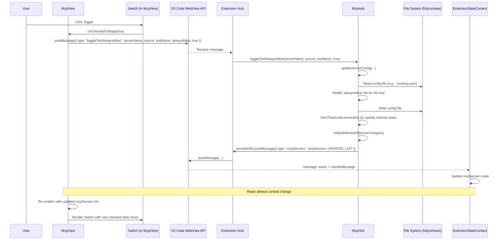
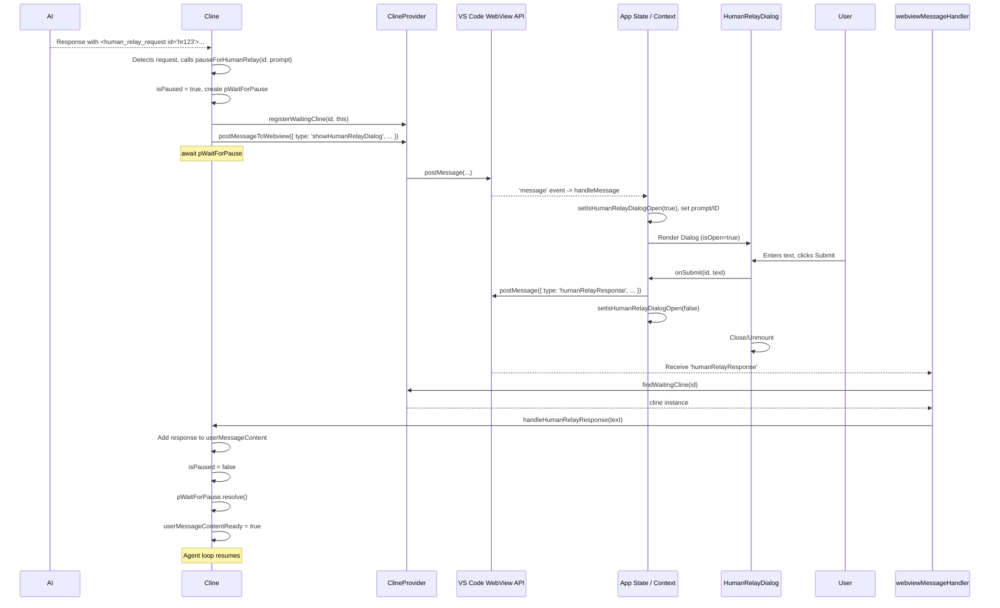
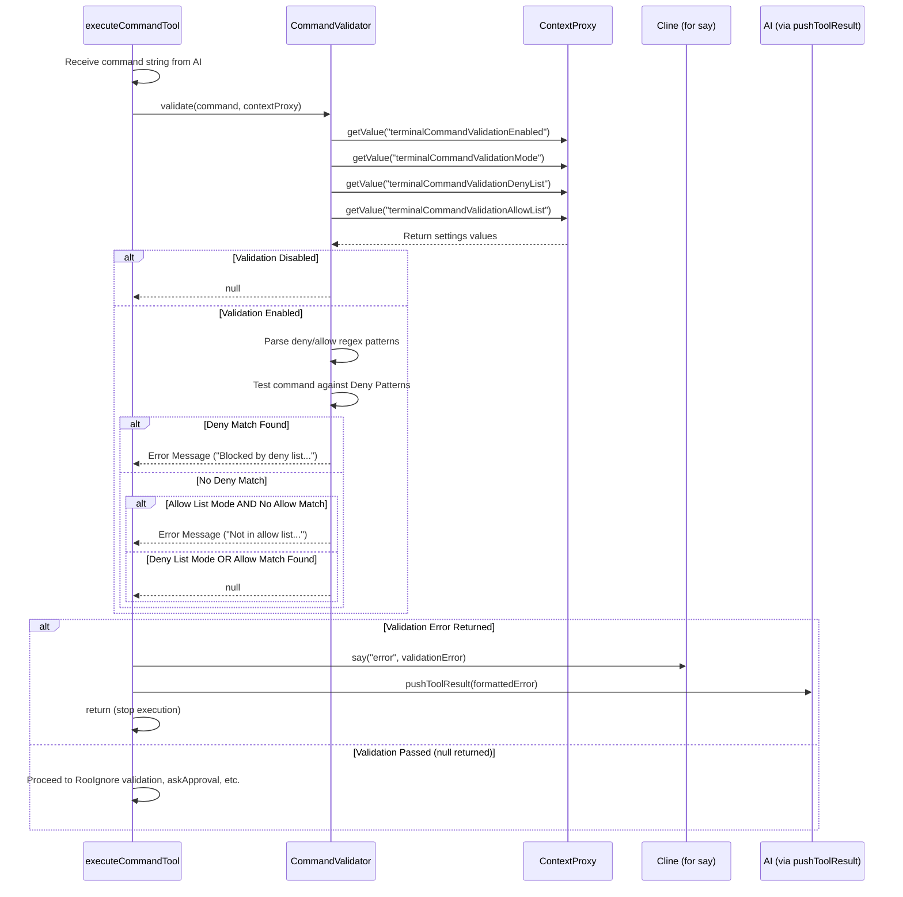
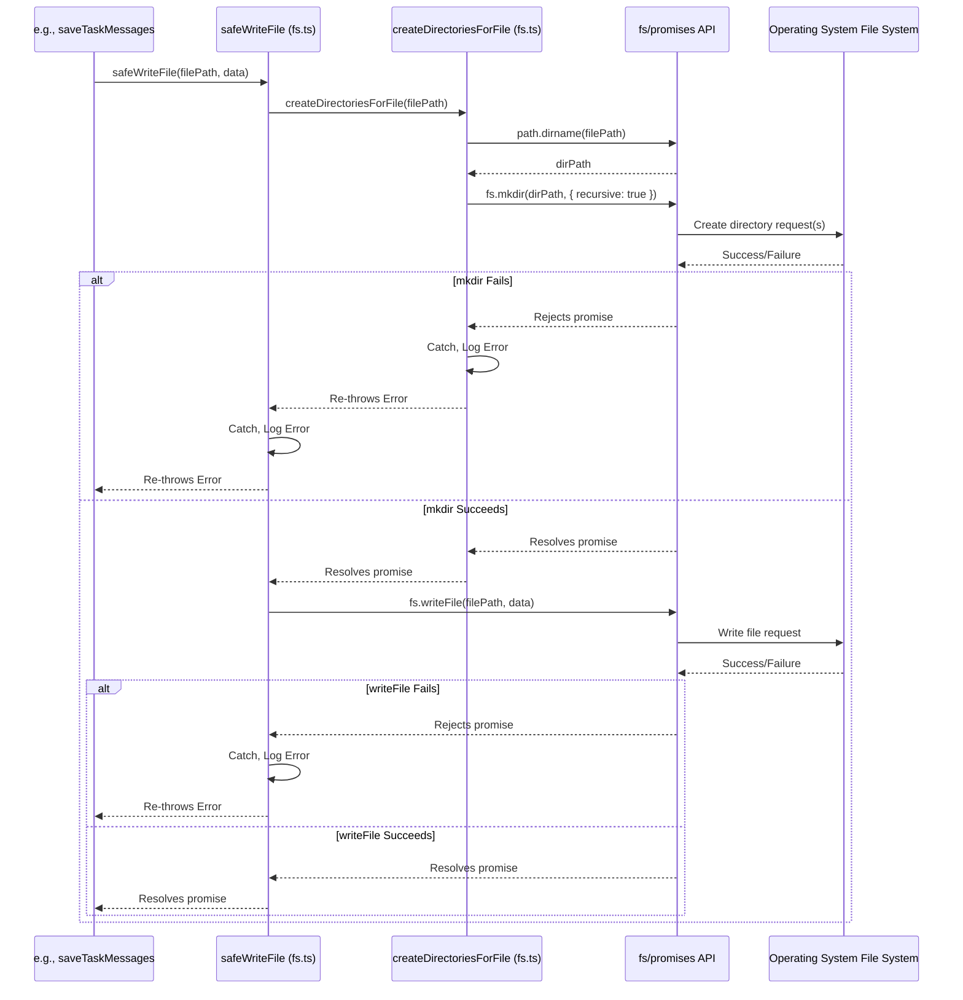
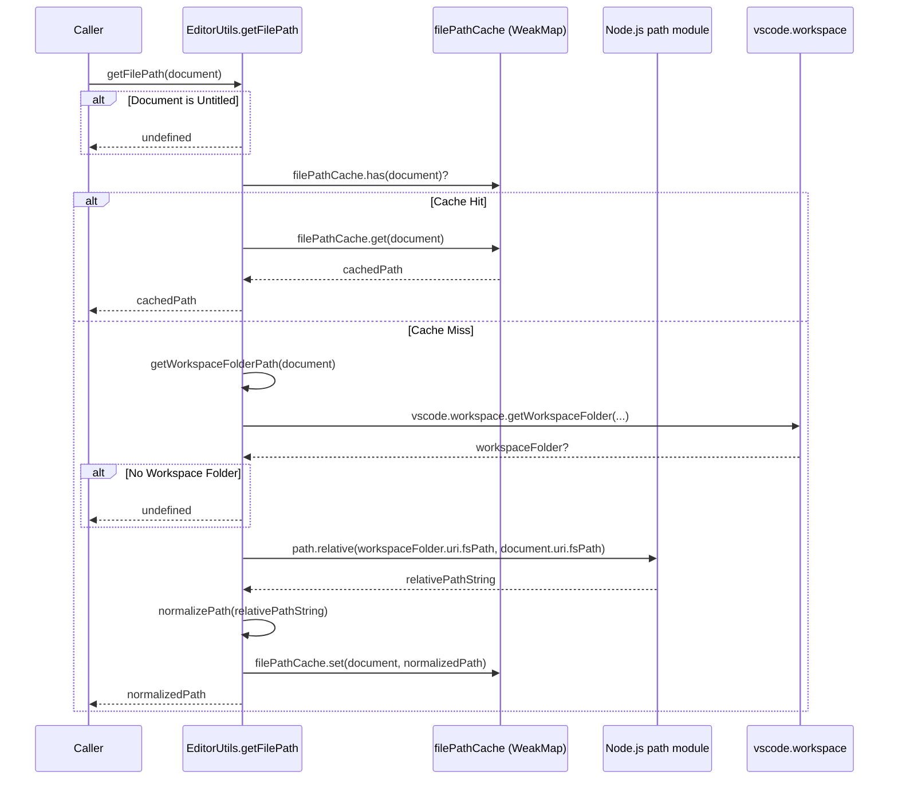
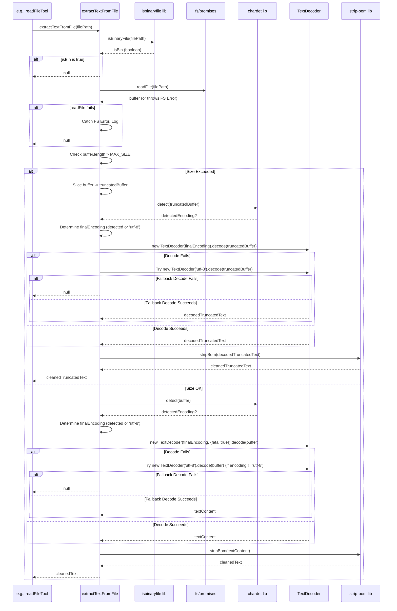
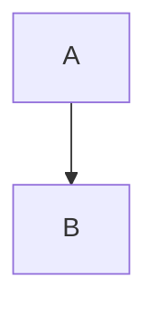
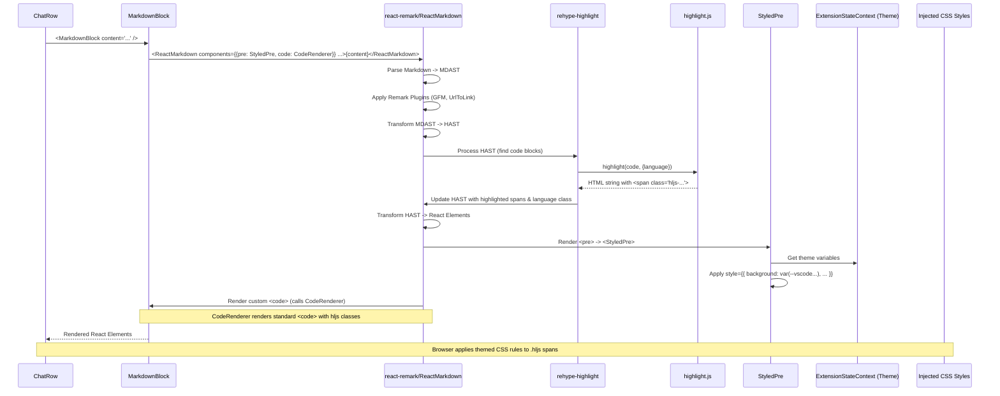

# Chapter 37: Prompts UI Components (WebView)

Continuing from [Chapter 36: History UI Components (WebView)](36_history_ui_components__webview_.md), which detailed how users can review past interactions, we now focus on the user interface components dedicated to customizing and managing the AI's core behavior through prompts and modes: the **Prompts UI Components**.

## Motivation: Granular Control Over AI Behavior

Roo-Code's effectiveness relies heavily on the instructions provided to the LLM, primarily through the [Chapter 7: SystemPrompt](07_systemprompt.md) and user-provided custom instructions. Different tasks benefit from different AI personas, toolsets, and guidelines. Managing these configurations directly in JSON files or complex settings can be challenging.

The Prompts UI Components, primarily encapsulated within the `PromptsView` component, provide a dedicated, interactive interface within the Roo-Code WebView panel for users to:

*   **Select and Switch Modes:** Easily choose between built-in modes (like "Code", "Architect", "Ask") and custom modes.
*   **View and Edit Mode Definitions:** Inspect and modify the "Role Definition" (AI persona) and "Custom Instructions" for any mode. Users can override defaults for built-in modes or define behavior for custom modes.
*   **Manage Custom Modes:** Create new custom modes, define their names, slugs, personas, instructions, and crucially, select which groups of tools ([Chapter 8: Tools](08_tools.md)) they are allowed to use. Users can also edit or delete existing custom modes.
*   **Edit Global Instructions:** Modify the global custom instructions that apply across all modes.
*   **Manage Support Prompts:** Configure specific prompts used internally by Roo-Code for tasks like prompt enhancement.
*   **Preview System Prompt:** See the final, fully assembled system prompt that will be sent to the LLM for the currently selected mode, incorporating all base instructions, tool descriptions, and custom overrides.
*   **Access Configuration Files:** Provide quick links to open the underlying JSON configuration files (`settings/custom_modes.json`, `.roomodes`) for advanced editing.

**Central Use Case:** A user wants to fine-tune the AI's behavior for writing documentation. They decide to create a custom "DocWriter" mode.

1.  User navigates to the "Prompts" tab in the Roo-Code WebView. `PromptsView` renders.
2.  User clicks the "+" button to create a new mode. The "Create Custom Mode" dialog appears.
3.  User enters Name: "Doc Writer", Slug: "doc-writer".
4.  User enters Role Definition: "You are Roo, an expert technical writer specializing in clear and concise software documentation...".
5.  User enters Custom Instructions: "Focus on clarity for end-users. Avoid overly technical jargon unless necessary. Use Markdown formatting. Include code examples where appropriate.".
6.  User reviews the "Tools" section within the dialog and decides to *uncheck* the "Command" and "Edit" groups, as the doc writer shouldn't need to run arbitrary commands or apply diffs directly. They keep "Read" and "Browser" enabled.
7.  User selects "Save Location" as "Global".
8.  User clicks "Create". `handleCreateMode` validates the input using `modeConfigSchema`, sends an `updateCustomMode` message to the host.
9.  The host updates `settings/custom_modes.json` via [Chapter 10: CustomModesManager](10_custommodesmanager.md) and sends back the updated state.
10. `PromptsView` updates, showing "Doc Writer" selected. The Role Definition and Custom Instructions text areas are populated. The Tools section shows only the enabled groups.
11. User clicks "Preview System Prompt". A dialog opens showing the assembled prompt, confirming the restricted toolset and custom instructions.

## Key Concepts

1.  **`PromptsView.tsx`:** The main React component for this entire UI section. It manages the display and interaction logic for modes, role definitions, instructions, tools, support prompts, and previewing.
2.  **Mode Management:**
    *   **Mode Selection:** Displays available modes (from `getAllModes`, combining built-in and custom) as clickable buttons/tabs. Clicking switches the active `mode` state via a `postMessage`.
    *   **Custom Mode Creation (`isCreateModeDialogOpen`, `handleCreateMode`):** Uses a dialog (`div` styled as modal or potentially shadcn `Dialog`) with input fields (`VSCodeTextField`, `VSCodeTextArea`, `VSCodeCheckbox`, `VSCodeRadioGroup`) for name, slug (auto-generated from name), role, instructions, tool groups, and save location (global/project). Performs validation against `modeConfigSchema` before sending `updateCustomMode` message.
    *   **Custom Mode Editing:** When a custom mode is selected, its name, role, instructions, and tool groups become editable directly in the main view. Changes trigger `updateCustomMode` messages. Tool group selection uses `<VSCodeCheckbox>`.
    *   **Custom Mode Deletion:** A delete button (visible for custom modes) triggers a `deleteCustomMode` message.
    *   **Configuration File Access:** Buttons use `postMessage` (`openCustomModesSettings`, `openFile`) to ask the host to open the underlying JSON files (`settings/custom_modes.json`, `.roomodes`).
3.  **Prompt Editing:**
    *   **Role Definition & Custom Instructions:** Uses `<VSCodeTextArea>` components. The `value` is determined by checking `customModes` (for custom modes), then `customModePrompts` (for overrides of built-in modes), then defaults (`getRoleDefinition`, `getCustomInstructions`). `onChange` handlers determine if it's a custom mode (calling `updateCustomMode`) or a built-in mode override (calling `updatePrompt`). Reset buttons (`codicon-discard`) call `handleAgentReset` to clear overrides.
    *   **Global Custom Instructions:** A separate `<VSCodeTextArea>` tied to the `customInstructions` field in the global state, sending `customInstructions` messages on change. Also includes link to edit `.roo/rules/` files.
4.  **Tool Group Selection (for Custom Modes):** When editing a custom mode, a grid of `<VSCodeCheckbox>` controls allows toggling `ToolGroup` availability. `handleGroupChange` updates the `groups` array in the `ModeConfig` and calls `updateCustomMode`.
5.  **Support Prompts:** Uses tabs (`button` elements) to switch `activeSupportTab`. Renders description and a `<VSCodeTextArea>` for the active support prompt type (`ENHANCE`, `SUMMARIZE`, etc.). `onChange` calls `updateSupportPrompt`. Reset button calls `handleSupportReset`. Includes controls for the Enhancement API config (`VSCodeDropdown`).
6.  **System Prompt Preview:**
    *   A "Preview" button triggers a `getSystemPrompt` message to the host, specifying the current `mode`.
    *   An effect listens for the `systemPrompt` response message from the host.
    *   When received, it updates `selectedPromptContent`, `selectedPromptTitle`, and sets `isDialogOpen = true`.
    *   A dialog component (modal `div` or shadcn `Dialog`) renders conditionally based on `isDialogOpen`, displaying the `selectedPromptContent` within a `<pre>` tag styled like the editor.
    *   A "Copy" button triggers `copySystemPrompt`.
7.  **State Management:**
    *   Reads global state (`customModePrompts`, `customSupportPrompts`, `mode`, `customInstructions`, `customModes`, API config list) from `useExtensionState()`.
    *   Uses local `useState` for UI state like dialog visibility (`isDialogOpen`, `isCreateModeDialogOpen`), edit modes (`isToolsEditMode`), active tabs (`activeSupportTab`), and form inputs within the create dialog (`newModeName`, etc.).
    *   Sends updates back to the host via `vscode.postMessage` for persistence.

## Using the Prompts UI (Use Case Revisited)

Let's trace the "Doc Writer" custom mode creation:

1.  **Render `PromptsView`:** Gets `modes`, `customModes`, etc., from `useExtensionState`. Renders mode selection buttons, defaults to the current `mode`. Renders Role/Instructions/Tools for the current mode.
2.  **Click "+":** `openCreateModeDialog` sets `newModeName`, `newModeSlug`, and `isCreateModeDialogOpen = true`.
3.  **Dialog Renders:** The modal `div` (or `Dialog` component) renders with input fields bound to local state (`newModeName`, `newModeSlug`, `newModeRoleDefinition`, `newModeCustomInstructions`, `newModeGroups`, `newModeSource`).
4.  **User Fills Form:**
    *   Types "Doc Writer" -> `handleNameChange` updates `newModeName` and `newModeSlug` state.
    *   Types Role -> `setNewModeRoleDefinition` updates state.
    *   Types Instructions -> `setNewModeCustomInstructions` updates state.
    *   Unchecks "Command", "Edit" -> `handleGroupChange` (in dialog scope) updates `newModeGroups` state.
    *   Selects "Global" -> `setNewModeSource` updates state.
5.  **Click "Create":** `handleCreateMode` executes.
    *   Constructs `newMode: ModeConfig` from local state.
    *   Calls `modeConfigSchema.safeParse(newMode)`. Assume validation passes.
    *   Calls `updateCustomMode(newModeSlug, newMode)` prop -> Sends `postMessage({ type: 'updateCustomMode', ... })`.
    *   Calls `switchMode(newModeSlug)` prop -> Sends `postMessage({ type: 'mode', text: 'doc-writer' })`.
    *   Calls `setIsCreateModeDialogOpen(false)`. `resetFormState` clears local dialog state.
6.  **Host Processes:** Updates `settings/custom_modes.json`, updates active `mode`. Sends back new `state`.
7.  **`PromptsView` Updates:** `useExtensionState` receives new `customModes` and `mode`. The view re-renders.
    *   "Doc Writer" button is highlighted in the mode list.
    *   Text areas now show the role/instructions for "Doc Writer".
    *   Tools section shows the restricted list.
8.  **Click "Preview":** Sends `postMessage({ type: 'getSystemPrompt', mode: 'doc-writer' })`.
9.  **Host Responds:** Host generates prompt, sends `postMessage({ type: 'systemPrompt', text: '...', mode: 'doc-writer' })`.
10. **Dialog Shows:** Message listener updates `selectedPromptContent` and `isDialogOpen=true`. Preview dialog renders with the generated prompt.

## Code Walkthrough

*(Referencing `PromptsView.tsx` provided in Chapter 36 context)*

*   **Imports:** Imports React hooks, VS Code toolkit components, shadcn/ui `Button`, context (`useExtensionState`), shared types (`Mode`, `ModeConfig`, `PromptComponent`, `SupportPromptType`, `TOOL_GROUPS`), schemas (`modeConfigSchema`), helper functions (`getAllModes`, `getRoleDefinition`, `supportPrompt`), `vscode` utility, i18n utilities.
*   **State:** Uses `useExtensionState` for shared data. Uses multiple `useState` hooks for UI control (dialogs, tabs, edit states) and form inputs within the "Create Mode" dialog.
*   **Memoization:** `useMemo` for `modes`. `useCallback` for handlers passed down or used in effects (`updateAgentPrompt`, `updateCustomMode`, `handleModeSwitch`, `handleCreateMode`, `handleGroupChange`, `resetFormState`).
*   **Mode Switching/Display:** Maps `modes` array to render buttons. `onClick` calls `handleModeSwitch` which sends `postMessage`. Active state (`isActive`) styles the current mode button.
*   **Editing Logic:**
    *   **Text Areas (Role/Instructions):** `value` prop dynamically selects content based on whether the current `mode` is custom (`findModeBySlug(mode, customModes)`), has an override (`customModePrompts[mode]`), or uses default (`getRoleDefinition(mode)`). `onChange` calls either `updateCustomMode` (for custom) or `updateAgentPrompt` (for built-in override). Reset buttons call `handleAgentReset`.
    *   **Tools Checkboxes:** Rendered conditionally if `isToolsEditMode` is true for a custom mode. Maps `availableGroups`. `checked` state determined by checking the `groups` array of the current custom mode. `onChange` calls `handleGroupChange` which modifies the `groups` array and calls `updateCustomMode`.
    *   **Global Instructions:** Simple text area bound to `customInstructions` from global state, sending `customInstructions` message on change.
*   **Create Mode Dialog:**
    *   Uses `useState` for `isCreateModeDialogOpen` and all form fields (`newModeName`, etc.).
    *   `openCreateModeDialog` pre-calculates a unique name/slug.
    *   `handleNameChange` updates name and auto-generates slug.
    *   `handleCreateMode` performs Zod validation (`modeConfigSchema.safeParse`), sets error states if invalid, or sends `updateCustomMode` and `switchMode` messages if valid, then closes dialog and resets form.
    *   Rendered conditionally as a fixed-position `div` styled as a modal panel. Contains standard controls (`VSCodeTextField`, `VSCodeTextArea`, `VSCodeCheckbox`, `VSCodeRadioGroup`) bound to dialog state.
*   **Support Prompts Section:** Uses `activeSupportTab` state. Renders buttons to switch tabs. Renders description and text area for the active tab, reading value via `getSupportPromptValue` (which uses `supportPrompt.get`) and saving via `updateSupportPrompt`. Includes reset button (`handleSupportReset`). Special UI for "ENHANCE" tab (API config dropdown, test text area, preview button).
*   **System Prompt Preview:** Buttons trigger `getSystemPrompt`/`copySystemPrompt` messages. `useEffect` listens for `systemPrompt` response, updates `selectedPromptContent`, and sets `isDialogOpen=true`. A conditional dialog displays the content.
*   **Configuration File Links:** Buttons in a dropdown menu (`showConfigMenu`) send `openCustomModesSettings` or `openFile` messages to edit global/project JSON files.

## Internal Implementation

1.  **Data Source:** Reads `mode`, `customModes`, `customModePrompts`, `customSupportPrompts` from `ExtensionStateContext`.
2.  **Rendering:** Renders UI based on the current `mode` and local UI state (`isToolsEditMode`, `isCreateModeDialogOpen`, etc.). Dynamically determines content for text areas based on custom mode status and overrides. Uses toolkit/shadcn components.
3.  **Editing:** `onChange` handlers for text areas, checkboxes, etc., call `useState` setters for dialog forms or directly prepare data and call `vscode.postMessage` for main view edits (`updatePrompt`, `updateCustomMode`, `updateSupportPrompt`).
4.  **Creating:** Dialog collects data in local state. "Create" button triggers validation and `postMessage`.
5.  **Previewing:** "Preview" button sends `getSystemPrompt`. `useEffect` listens for `systemPrompt` response and updates state to show dialog.
6.  **Host Interaction:** Relies entirely on `postMessage` to send updates/requests to the extension host and `useEffect`/`useEvent` (implicitly via `useExtensionState`) to receive state updates and responses.

**Sequence Diagram (Creating a Custom Mode):**



## Modification Guidance

Modifications usually involve adding new options to modes, changing validation, or adjusting the UI layout.

1.  **Adding a New Field to `ModeConfig` (e.g., `temperature: number` specific to mode):**
    *   **Schema:** Add `temperature: z.number().optional()` to `modeConfigSchema` in `src/schemas/index.ts`.
    *   **Types:** Add `temperature?: number` to `ModeConfig` type in `src/shared/modes.ts`.
    *   **`PromptsView.tsx`:**
        *   Add a control (e.g., `<Slider>` or `<VSCodeTextField type="number">`) to the main view or the "Create Mode" dialog to edit this field.
        *   Bind its value to `customMode?.temperature ?? defaultTemp` (for display) or `newModeTemperature` (for create dialog state).
        *   In `onChange`/`onValueChange`, call `updateCustomMode` or `setNewModeTemperature`.
        *   Update `handleCreateMode` to include `temperature` in the `newMode` object.
    *   **Host Consumption:** Modify `ClineProvider` or `Cline` to retrieve the `temperature` from the current `ModeConfig` and potentially override the setting coming from the `ApiConfiguration` when making API calls.
    *   **`CustomModesManager.ts`:** No changes needed; it handles `ModeConfig` generically.

2.  **Modifying Tool Group Editing (e.g., Allow Regex for `edit` group in UI):**
    *   **Schema:** Ensure `GroupEntry` and `GroupOptions` in the schema support the desired options (already supports `fileRegex`).
    *   **`PromptsView.tsx`:**
        *   Locate the rendering loop for `availableGroups` within the `isToolsEditMode` block.
        *   When rendering the checkbox for the "edit" group, *conditionally* render an additional `<VSCodeTextField>` next to it if `isGroupEnabled` is true for "edit".
        *   Bind the text field's value to `customMode?.groups.find(...)` logic to get the current `fileRegex`.
        *   Implement an `onChange` handler for the text field that finds the "edit" entry in `customMode.groups`, updates its options (`{ fileRegex: newValue }`), and calls `updateCustomMode`. Handle cases where the group entry is just a string vs. a tuple.

3.  **Changing Validation in "Create Mode" Dialog:**
    *   **Locate:** Edit `modeConfigSchema` in `src/schemas/index.ts` (for Zod-based rules like length, format) or add custom validation logic within `handleCreateMode` in `PromptsView.tsx` before the `safeParse` call.
    *   **Update Errors:** Ensure any new validation failures correctly set the corresponding error state (`setNameError`, `setSlugError`, etc.) to display feedback to the user.

**Best Practices:**

*   **Use Shared Types/Schemas:** Rely on `ModeConfig`, `ToolGroup`, etc., defined in shared locations and validated by Zod schemas for consistency between the UI and the host.
*   **Centralized Mode Logic:** Keep core mode logic (defaults, merging, validation helpers like `isToolAllowedForMode`) in `src/shared/modes.ts` and `src/core/config/CustomModesManager.ts`. The UI should primarily read state and send update messages.
*   **Component Breakdown:** Keep `PromptsView` focused on layout and state integration. Complex parts like the Create Mode dialog or the Support Prompts section could potentially be extracted into sub-components if `PromptsView` becomes too large.
*   **Clear Feedback:** Provide clear validation error messages in the Create Mode dialog. Use tooltips or descriptive text to explain settings.
*   **Responsive UI:** Ensure the layout adapts reasonably well to different panel widths.

**Potential Pitfalls:**

*   **State Complexity:** Managing local UI state (dialogs, form inputs) alongside updates from the global `ExtensionStateContext` can be complex. Ensure effects correctly sync local state when global state changes (like the `useEffect` for `currentApiConfigName`).
*   **Validation Mismatch:** Discrepancies between validation logic in the UI (`handleCreateMode`) and the Zod schema could lead to confusion or allow invalid data to be sent. Rely primarily on the Zod schema.
*   **Saving Partial Updates:** The `updatePrompt` mechanism for built-in modes updates only specific fields (`roleDefinition`, `customInstructions`). Ensure this doesn't unintentionally clear other parts of the override stored in `customModePrompts`.
*   **Slug Generation Conflicts:** The simple `generateSlug` might still produce collisions if names are very similar or if editing happens rapidly. More robust unique slug generation might be needed for complex scenarios.
*   **UI Performance:** Rendering many modes or complex controls could potentially impact UI responsiveness, although the current structure seems reasonable.

## Conclusion

The Prompts UI Components, centered around `PromptsView`, provide a vital interface for users to inspect, manage, and customize Roo-Code's operational modes and the underlying prompts that guide the AI. By allowing users to edit role definitions, custom instructions, tool access (for custom modes), and support prompts, and offering features like system prompt previews and custom mode creation, this UI empowers users to tailor the AI's behavior effectively. It leverages the shared state context, UI primitives, and message passing to provide a functional and theme-consistent configuration experience within the WebView.

Next, we examine the UI components specifically related to managing connections and interacting with Model Context Protocol servers: [Chapter 38: MCP UI Components (WebView)](38_mcp_ui_components__webview_.md).
---
# Chapter 38: MCP UI Components (WebView)

Continuing from [Chapter 37: Prompts UI Components (WebView)](37_prompts_ui_components__webview_.md), where we explored the UI for managing AI prompts and modes, this chapter focuses on the user interface elements dedicated to discovering, managing, and interacting with external tools and context sources via the Model Context Protocol (MCP): the **MCP UI Components**.

## Motivation: Visualizing and Managing External MCP Servers

The Model Context Protocol ([Chapter 19: McpHub / McpServerManager](19_mcphub___mcpservermanager.md)) allows Roo-Code to connect to external processes (MCP servers) that provide custom tools and context resources. While the `McpHub` handles the connection and communication logic in the background, users need a visual interface within the Roo-Code WebView to:

*   **View Connected Servers:** See which MCP servers (both global and project-specific) are currently connected or attempting to connect.
*   **Inspect Server Capabilities:** Understand which tools and resources each connected server offers.
*   **Monitor Server Status:** Check if a server is connected, disconnected, or has encountered an error. See error messages if connection failed.
*   **Manage Server Lifecycle:** Manually restart a specific server connection (e.g., after updating its implementation or configuration). Enable/disable specific servers. Delete server configurations.
*   **Manage Tool Permissions:** View and toggle the "Always Allow" setting for specific tools provided by MCP servers, controlling whether user approval is required each time the AI wants to use that tool.
*   **Access Configuration:** Easily open the global (`settings/mcp_settings.json`) or project (`.roo/mcp.json`) configuration files.

The MCP UI Components, primarily `McpView.tsx`, provide this management interface, allowing users to oversee and control their MCP integrations directly within the WebView panel.

**Central Use Case:** A user has configured a local project-specific MCP server (`my-local-analyzer`) and a global remote server (`shared-docs-lookup`). They want to check their status, see the tools offered by the local server, always allow a specific tool on that server, and restart the local server after making code changes to it.

1.  User clicks the "MCP" icon/tab in the Roo-Code WebView UI.
2.  `McpView.tsx` renders. It gets the list of `mcpServers` (including status, tools, source) from the global `ExtensionStateContext`.
3.  The view displays two sections: "Project Servers" and "Global Servers". `my-local-analyzer` appears under Project, and `shared-docs-lookup` under Global. Connection status icons (e.g., green check, red cross) are shown.
4.  User expands the `my-local-analyzer` entry. The list of tools (`analyze_function`, `check_style`) provided by the server is displayed.
5.  User finds the `check_style` tool and clicks its associated "Always Allow" toggle (`Switch` component).
6.  The `onChange` handler sends a `toggleToolAlwaysAllow` message to the extension host with the server name, source, tool name, and the new `true` value.
7.  The extension host updates the `.roo/mcp.json` file via `McpHub` and sends back an updated state. The toggle reflects the saved state.
8.  User makes changes to the `my-local-analyzer` server's code in the editor and wants to restart it.
9.  User clicks the "Restart" button (`codicon-refresh`) next to the `my-local-analyzer` entry in `McpView`.
10. The `onClick` handler sends a `restartMcpServer` message with the server name and source.
11. The extension host tells `McpHub` to restart the connection. `McpHub` disconnects, potentially terminates the old process (for stdio), starts the new process, reconnects, fetches capabilities, and sends back an updated state reflecting the new connection status and potentially updated tools.

## Key Concepts

1.  **`McpView.tsx`:** The main container component for the MCP management UI.
    *   **Data Source:** Primarily displays data from the `mcpServers` array fetched from `useExtensionState()` ([Chapter 12: ExtensionStateContext](12_extensionstatecontext.md)). Each element is an `McpServer` object containing configuration, status (`connected`, `disconnected`, `connecting`, `error`), source (`global`, `project`), fetched `tools`, `resources`, and potential `error` messages.
    *   **Layout:** Uses `Tab`, `TabHeader`, `TabContent`. Header includes title and Done button. Content often uses `Section` and `SectionHeader` primitives.
    *   **Server Grouping:** Separates servers into "Project Servers" and "Global Servers" based on the `server.source` property.
    *   **Server Display:** Renders each server as a collapsible item (`Accordian` primitive or similar). Displays server name, status icon (using `ConnectionStatus` helper), source badge, and error message if present. Includes action buttons (Restart, Enable/Disable, Delete).
    *   **Capability Display:** When a server item is expanded, it displays lists of `Tools` and `Resources` provided by that server.
    *   **Tool Permissions:** Renders a `Switch` (shadcn primitive) next to each tool to control the `alwaysAllow` setting.
    *   **Interaction:** Button clicks (`Restart`, `Delete`, `Enable/Disable`) and switch toggles trigger `vscode.postMessage` calls (`restartMcpServer`, `deleteMcpServer`, `toggleMcpServer`, `toggleToolAlwaysAllow`) to the extension host.

2.  **`McpServer` Data Structure (`src/shared/mcp.ts`):** The object format representing a server in the UI state, sent from the host. Includes configuration details, connection `status`, `source`, fetched `tools` and `resources` (with their descriptions and `alwaysAllow` flags), and any `error`.

3.  **`ConnectionStatus` (`src/components/ui/ConnectionStatus.tsx`):** A simple component that renders different status icons (e.g., `codicon-check`, `codicon-sync~spin`, `codicon-error`) based on the `server.status` string, often with tooltips showing status text or error messages.

4.  **Interaction Flow:** User actions in `McpView` trigger `postMessage` calls. `webviewMessageHandler` receives these, calls corresponding methods on `McpHub` (e.g., `restartConnection`, `deleteServerConfig`, `toggleServerEnabled`, `toggleToolAlwaysAllow`). `McpHub` performs the action (interacting with SDK, file system) and then calls `notifyWebviewOfServerChanges` to send the updated `mcpServers` list back to all WebView instances. `ExtensionStateContext` updates, causing `McpView` to re-render.

5.  **UI Primitives:** Leverages themed shadcn/ui primitives (`Button`, `Switch`, `Accordion`, `Badge`, `Tooltip`) and VS Code toolkit components (`VSCodeBadge`) for layout, interaction, and styling consistent with the VS Code theme.

## Using the MCP UI Components (Use Case Revisited)

Let's trace the user managing their MCP servers:

1.  **Render `McpView`:** Gets `mcpServers` array from `useExtensionState`. `mcpServers` contains objects for `my-local-analyzer` (`source: "project"`, `status: "connected"`, `tools: [...]`) and `shared-docs-lookup` (`source: "global"`, `status: "connected"`, `tools: [...]`).
2.  **Display Servers:** The view iterates through `mcpServers`. It renders "Project Servers" section with `my-local-analyzer` and "Global Servers" with `shared-docs-lookup`. `ConnectionStatus` shows green checks for both.
3.  **Expand Server:** User clicks to expand `my-local-analyzer`. The `AccordionItem` expands.
4.  **Display Tools:** The component iterates through `myLocalAnalyzerServer.tools` and renders each tool name (`check_style`) along with its description and a `Switch` component reflecting the current `tool.alwaysAllow` value (false initially).
5.  **Toggle "Always Allow":** User clicks the `Switch` for `check_style`.
    *   The `onCheckedChange` handler is called with `true`.
    *   It calls `vscode.postMessage({ type: "toggleToolAlwaysAllow", serverName: "my-local-analyzer", source: "project", toolName: "check_style", alwaysAllow: true })`.
6.  **Host Processes & Update:** Host calls `McpHub.toggleToolAlwaysAllow`, which updates `.roo/mcp.json`, re-fetches capabilities (which now include `alwaysAllow: true` for `check_style`), and sends back the updated `mcpServers` list via a `state` or `mcpServers` message.
7.  **UI Re-renders:** `McpView` receives the new state. The `Switch` for `check_style` now shows as "on".
8.  **Click Restart:** User clicks the "Restart" button (`codicon-refresh`) for `my-local-analyzer`.
    *   `onClick` calls `vscode.postMessage({ type: "restartMcpServer", serverName: "my-local-analyzer", source: "project" })`.
9.  **Host Processes & Update:**
    *   Host calls `McpHub.restartConnection("my-local-analyzer", "project")`.
    *   `McpHub` updates status to `"connecting"`, calls `notifyWebviewOfServerChanges`.
    *   `McpHub` calls `deleteConnection`, then `connectToServer`. Spawns new process, connects, fetches capabilities.
    *   If successful, updates status to `"connected"`, calls `notifyWebviewOfServerChanges`.
    *   If fails, updates status to `"disconnected"` or `"error"`, calls `notifyWebviewOfServerChanges`.
10. **UI Re-renders:** `McpView` receives status updates. `ConnectionStatus` shows spinning icon (`connecting`), then green check (`connected`) or red cross (`error`). Tool list might update if capabilities changed.

## Code Walkthrough

*(Referencing `McpView.tsx` provided in chapter context)*

### `McpView.tsx`

*   **Imports:** Imports React hooks, `useExtensionState`, UI primitives (`Accordion`, `Button`, `Switch`, `Badge`, `Tooltip`), helper components (`ConnectionStatus`), VS Code toolkit components (`VSCodeBadge`), `vscode` utility, shared types (`McpServer`, `McpTool`), and i18n.
*   **State:** Primarily driven by `mcpServers` from `useExtensionState()`. Uses local `useState` for filtering/search if implemented (`searchQuery`).
*   **Data Grouping (`useMemo`):** Uses `useMemo` to filter and separate `mcpServers` into `projectServers` and `globalServers` based on the `server.source` property.
*   **Layout:** Uses `Tab`/`TabHeader`/`TabContent`. Renders sections for Project and Global servers. Uses `Accordion` (shadcn) to make each server entry collapsible.
*   **Server Item Rendering (`renderServer` function):**
    *   Takes an `McpServer` object.
    *   Renders the `AccordionTrigger` containing:
        *   Server name (`server.name`).
        *   `ConnectionStatus` component showing status icon and tooltip.
        *   `VSCodeBadge` indicating `Project` or `Global` source.
        *   Action buttons (`Restart`, `Enable/Disable`, `Delete`) using `Button` with icons (`codicon-refresh`, `codicon-trash`, etc.). `onClick` handlers send appropriate `postMessage` calls (`restartMcpServer`, `deleteMcpServer`, `toggleMcpServer`). Button visibility/disabled state depends on server status and source.
    *   Renders the `AccordionContent` containing:
        *   Server details (Type, URL/Command).
        *   Error message display if `server.error`.
        *   Lists of "Tools" and "Resources" provided by the server.
        *   Each tool includes its name, description (in a `Tooltip`), and a `Switch` component for `alwaysAllow`. The `Switch`'s `checked` prop reads `tool.alwaysAllow`, and `onCheckedChange` sends the `toggleToolAlwaysAllow` message.
*   **Configuration File Links:** Includes buttons at the bottom to trigger `openMcpSettings` and `openProjectMcpSettings` messages.
*   **Empty State:** Renders messages if no project or global servers are configured.

## Internal Implementation

1.  **Data Source:** `McpHub` maintains the list of `McpConnection` objects, each containing an `McpServer` representation with status, config, and fetched capabilities.
2.  **Synchronization:** Whenever `McpHub` connects, disconnects, restarts, or updates capabilities/permissions, it calls `notifyWebviewOfServerChanges`.
3.  **`notifyWebviewOfServerChanges`:** This function gets the current list of `McpServer` objects from the `connections`, sorts them (project first), and sends them via `postMessage({ type: 'mcpServers', mcpServers: ... })` to the `ClineProvider`.
4.  **State Update:** `ExtensionStateContext`'s message handler receives the `mcpServers` message and updates the `mcpServers` array in its state.
5.  **UI Re-render:** `McpView`, using `useExtensionState`, receives the updated `mcpServers` array. React re-renders the component.
6.  **Component Logic:** `useMemo` recalculates `projectServers`/`globalServers`. The component maps over these arrays, calling `renderServer`. `renderServer` renders the server item, status, buttons, tools, and switches based on the data in the updated `McpServer` objects.

**Sequence Diagram (Toggling "Always Allow"):**



## Modification Guidance

Modifications might involve adding more server details, providing advanced management actions, or changing the layout.

1.  **Displaying More Server Details (e.g., Last Connection Time):**
    *   **`McpServer` Type:** Add `lastConnected?: number` to the `McpServer` type in `src/shared/mcp.ts`.
    *   **`McpHub`:** In `connectToServer`, store `Date.now()` in the `connection` object when status becomes `"connected"`. Ensure this timestamp is included when creating the `McpServer` object sent by `notifyWebviewOfServerChanges`.
    *   **`McpView.tsx`:** Modify `renderServer` to display the `server.lastConnected` timestamp (formatted appropriately) within the `AccordionContent`.

2.  **Adding a "Send Custom Request" Feature (for Debugging):**
    *   **UI (`McpView.tsx`):** Add a new button within `AccordionContent`. When clicked, open a dialog (`Dialog` primitive) with fields for `method` and `params` (JSON input using `<VSCodeTextArea>`). Add a "Send" button.
    *   **Message:** On "Send", validate the JSON params and send a new message type, e.g., `{ type: "sendMcpRequest", serverName, source, method, params }`.
    *   **Host:** Add a handler in `webviewMessageHandler` for `sendMcpRequest`. Call a new method on `McpHub` (e.g., `sendRawRequest`).
    *   **`McpHub`:** Implement `sendRawRequest`. Find the connection, call `connection.client.request({ method, params })` without schema validation (or with generic validation), handle the promise resolution/rejection, and potentially send the raw response back to the UI via another message for display.

3.  **Changing Layout (e.g., Tabs instead of Accordion):**
    *   **`McpView.tsx`:** Replace the `Accordion` component with a tab component structure (either custom or potentially from shadcn/ui if available/adapted).
    *   Maintain the grouping logic (Project/Global). The list of server names could form the tab triggers, and the tab content would render the details previously inside `AccordionContent`.

**Best Practices:**

*   **Clear Status Indication:** Use icons and tooltips (`ConnectionStatus`) effectively to convey the connection state and any errors.
*   **Action Feedback:** Provide visual feedback when actions like Restart or Delete are in progress (e.g., disabling buttons, showing spinners), although the current implementation relies mainly on the status icon changing.
*   **Consistency:** Use the standard UI primitives (`Button`, `Switch`, `Accordion`, etc.) for a consistent look and feel.
*   **Error Display:** Clearly display error messages (`server.error`) associated with connection failures.
*   **Separation of Concerns:** `McpView` focuses on displaying data from `mcpServers` and sending action messages. `McpHub` handles the actual logic of connecting, managing, and interacting.

**Potential Pitfalls:**

*   **State Synchronization Latency:** There might be a slight delay between performing an action (e.g., Restart) and the UI reflecting the final state, as it depends on the host processing the request, reconnecting, fetching capabilities, and sending the update back. The intermediate `connecting` status helps manage this.
*   **Complex State in UI:** If `McpView` started managing connection logic or complex state locally instead of relying on the `mcpServers` array from the host, it could easily get out of sync.
*   **Error Handling Detail:** The UI might not display *all* possible details about connection errors; users might need to check the Roo-Code Output Channel for more information logged by `McpHub`.
*   **UI Performance:** If a user has a very large number of MCP servers configured (unlikely), rendering the list might have minor performance implications, although it's not typically a virtualized list like Chat or History.

## Conclusion

The MCP UI Components, primarily `McpView`, provide a necessary window into the status and capabilities of external MCP servers integrated with Roo-Code. By visualizing the server list, connection status, available tools/resources, and offering controls for management (restart, delete, permissions), this UI empowers users to effectively monitor and control their MCP integrations. It relies on the `mcpServers` state synchronized from the `McpHub` via the `ExtensionStateContext` and uses themed UI primitives to ensure a consistent user experience within the WebView.

This chapter concludes our exploration of the major UI component categories within the Roo-Code WebView. The next chapter discusses a specialized UI element used for interactions requiring direct human input within an AI task flow: [Chapter 39: Human Relay UI](39_human_relay_ui.md).
---
# Chapter 39: Human Relay UI

In the previous chapter, [Chapter 38: MCP UI Components (WebView)](38_mcp_ui_components__webview_.md), we examined the UI for managing external MCP server connections. Now, we turn to a specific interaction pattern where the AI agent needs direct input or confirmation from the user *during* its execution flow, often when standard tool approval isn't sufficient or when the AI needs subjective feedback. This chapter explores the **Human Relay UI**.

## Motivation: Enabling Human-in-the-Loop Interactions

While Roo-Code aims to automate tasks using AI and tools, there are scenarios where human intervention is necessary or desirable:

1.  **Ambiguity Resolution:** The AI might encounter ambiguity and need the user to clarify instructions or make a choice.
2.  **Subjective Feedback:** The AI might want feedback on a generated piece of code, design, or text that requires human judgment.
3.  **Sensitive Operations:** Beyond simple tool approval, the AI might want explicit confirmation before performing a complex or potentially irreversible action.
4.  **Interactive Tools:** An external MCP tool might itself require interactive input from the user during its execution.

Simply asking a question in the chat (`ask_followup_question`) might not be sufficient, especially if a specific, structured response is needed or if the request should block further AI processing until the user responds. The Human Relay pattern provides a dedicated mechanism for these human-in-the-loop scenarios. The Human Relay UI components facilitate presenting these requests to the user and collecting their input within the WebView.

**Central Use Case:** The AI agent is performing a complex refactoring. Before finalizing a significant change, it wants the user to review a specific aspect and confirm they approve of the approach, potentially providing minor adjustments.

1.  The AI generates a response containing a special instruction or tool usage indicating a human relay request (e.g., using a hypothetical `<human_relay_request request_id="hr123"><prompt>Review the proposed interface change. Is the naming convention acceptable? Provide alternative names if not.</prompt></human_relay_request>`).
2.  The [Chapter 4: Cline](04_cline.md) instance parses this request. Instead of executing a standard tool, it recognizes it as a Human Relay request.
3.  `Cline` pauses its execution loop (`this.isPaused = true`).
4.  It sends a specific `ExtensionMessage` to the WebView UI: `{ type: 'showHumanRelayDialog', requestId: 'hr123', promptText: 'Review the proposed interface change...' }`.
5.  The `ExtensionStateContext` ([Chapter 12: ExtensionStateContext](12_extensionstatecontext.md)) or the main `App.tsx` message handler receives this message.
6.  It updates state variables (`humanRelayPrompt`, `humanRelayRequestId`, `isHumanRelayDialogOpen = true`).
7.  The `HumanRelayDialog` component (likely using shadcn/ui `Dialog`) renders conditionally based on `isHumanRelayDialogOpen`. It displays the `humanRelayPrompt` and provides a text area (`VSCodeTextArea`) for the user's response and Submit/Cancel buttons.
8.  The user reads the prompt, types their feedback (e.g., "Yes, naming is fine.") into the text area.
9.  User clicks "Submit".
10. The dialog's submit handler calls `vscode.postMessage({ type: 'humanRelayResponse', requestId: 'hr123', text: 'Yes, naming is fine.' })`. It also sets `isHumanRelayDialogOpen = false`.
11. The extension host (`webviewMessageHandler`) receives the `humanRelayResponse`.
12. It finds the paused `Cline` instance associated with `requestId: 'hr123'`.
13. It calls a method on `Cline` (e.g., `cline.handleHumanRelayResponse('Yes, naming is fine.')`).
14. `Cline` stores the response, sets `this.isPaused = false`, adds the response to the context to be sent back to the AI (potentially formatted like a tool result), and resumes its execution loop (`this.pWaitForPause?.resolve()`).
15. The AI receives the user's feedback and continues processing.

## Key Concepts

1.  **Human-in-the-Loop:** The core idea is pausing the automated agent execution to solicit necessary input or confirmation from the human user.
2.  **Triggering Mechanism:** This is typically initiated by the AI generating a specific, predefined tool request (e.g., `<human_relay_request>`) or instruction that the `Cline` instance is programmed to recognize as needing human input beyond standard tool approval.
3.  **`Cline` Pausing:** When a human relay is triggered, the `Cline` instance sets its `isPaused` flag to `true` and likely uses a promise (`pWaitForPause` or similar) to suspend the `recursivelyMakeClineRequests` loop until a response is received.
4.  **`showHumanRelayDialog` Message:** The `ExtensionMessage` sent from the extension host (`ClineProvider`/`Cline`) to the WebView UI. It carries:
    *   `requestId`: A unique identifier to correlate the request with the response.
    *   `promptText`: The message/question to display to the user.
5.  **UI State Management:** The WebView's main application state (`App.tsx` or `ExtensionStateContext`) needs state variables to manage the dialog:
    *   `isHumanRelayDialogOpen: boolean`: Controls dialog visibility.
    *   `humanRelayPrompt?: string`: Stores the text to display.
    *   `humanRelayRequestId?: string`: Stores the ID of the current request.
6.  **`HumanRelayDialog` Component:** A React component, likely built using shadcn/ui `Dialog` primitives ([Chapter 33: Shadcn/UI Primitives (WebView)](33_shadcn_ui_primitives__webview_.md)), responsible for rendering the modal UI.
    *   Receives `isOpen`, `promptText`, `requestId`, `onSubmit`, `onCancel` as props.
    *   Displays the `promptText`.
    *   Provides an input mechanism (e.g., `<VSCodeTextArea>`) for the user's response.
    *   Includes "Submit" and "Cancel" buttons.
7.  **`humanRelayResponse` / `humanRelayCancel` Messages:** `WebviewMessage` types sent *from* the UI back to the extension host when the user interacts with the dialog.
    *   `humanRelayResponse`: Includes the `requestId` and the `text` entered by the user.
    *   `humanRelayCancel`: Includes the `requestId`.
8.  **Resuming `Cline`:** The extension host message handler receives the response/cancel message, identifies the waiting `Cline` instance using the `requestId`, and calls a method on it (e.g., `handleHumanRelayResponse`, `handleHumanRelayCancel`) which provides the input and resolves the internal pause promise, allowing the agent loop to continue.

## Using the Human Relay UI (Use Case Revisited)

Let's trace the user confirmation flow again:

1.  **AI Request:** `<human_relay_request request_id="hr123">...</human_relay_request>`
2.  **`Cline` Processing:** `presentAssistantMessage` parses the request. It recognizes the `human_relay_request` tool (or a similar dedicated trigger).
3.  **`Cline.pauseForHumanRelay` (Conceptual):**
    *   Sets `this.isPaused = true`.
    *   Creates `this.pWaitForPause = new Promise(...)`.
    *   Extracts `requestId` and `promptText` from the tool parameters.
    *   Calls `provider.postMessageToWebview({ type: 'showHumanRelayDialog', requestId, promptText })`.
    *   The agent loop implicitly pauses because `presentAssistantMessage` awaits a signal related to `userMessageContentReady` which won't come until the pause resolves, or `recursivelyMakeClineRequests` might explicitly `await this.pWaitForPause`.
4.  **WebView `App.tsx` Receives Message:** `onMessage` handler gets `{ type: 'showHumanRelayDialog', ... }`.
5.  **Update UI State:** Handler calls state setters: `setHumanRelayRequestId('hr123')`, `setHumanRelayPrompt('Review...')`, `setIsHumanRelayDialogOpen(true)`.
6.  **Dialog Renders:** `App.tsx` conditionally renders `<HumanRelayDialog isOpen={true} ... />`. The dialog appears, showing the prompt text and an input area.
7.  **User Responds:** User types "Yes, naming is fine." and clicks "Submit".
8.  **Dialog `onSubmit`:**
    *   Calls `vscode.postMessage({ type: 'humanRelayResponse', requestId: 'hr123', text: 'Yes, naming is fine.' })`.
    *   Calls `props.onClose()` which triggers `setIsHumanRelayDialogOpen(false)`.
9.  **Dialog Closes:** The dialog component unmounts or hides.
10. **Host `webviewMessageHandler` Receives Message:** Gets `{ type: 'humanRelayResponse', ... }`.
11. **Find and Resume `Cline`:** Handler uses `requestId` to find the correct `ClineProvider` and its paused `Cline` instance. Calls `cline.handleHumanRelayResponse('Yes, naming is fine.')`.
12. **`Cline.handleHumanRelayResponse`:**
    *   Stores the response text.
    *   Formats the response appropriately (e.g., as a tool result block `[Human Response]\nYes, naming is fine.`) and adds it to `this.userMessageContent`.
    *   Sets `this.isPaused = false`.
    *   Resolves the pause promise: `this.pWaitForPause?.resolve()`.
    *   Sets `this.userMessageContentReady = true`.
13. **`Cline` Resumes:** The paused `await` in the agent loop resolves, and execution continues, sending the user's response back to the AI.

## Code Walkthrough

### `App.tsx` (Handling Dialog State)

```typescript
// --- File: webview-ui/src/App.tsx ---
// (Simplified - Assuming state is managed directly in App for this example)
import React, { useState, useCallback /* ... */ } from 'react';
import { useEvent } from 'react-use';
import { ExtensionMessage, /* ... */ } from '@roo/shared/ExtensionMessage';
import HumanRelayDialog from './components/dialogs/HumanRelayDialog'; // Import the dialog component
import { vscode } from './utils/vscode';

function App() {
    // ... other state (tab, etc.) ...
    const [isHumanRelayDialogOpen, setIsHumanRelayDialogOpen] = useState(false);
    const [humanRelayPrompt, setHumanRelayPrompt] = useState<string | undefined>();
    const [humanRelayRequestId, setHumanRelayRequestId] = useState<string | undefined>();

    // Message handler
    const onMessage = useCallback((event: MessageEvent) => {
        const message = event.data as ExtensionMessage;
        // ... other message handling (state, clineMessage, action) ...

        // --- Human Relay Handling ---
        if (message.type === 'showHumanRelayDialog') {
            console.log("Received showHumanRelayDialog", message);
            setHumanRelayRequestId(message.requestId);
            setHumanRelayPrompt(message.promptText);
            setIsHumanRelayDialogOpen(true);
        }
    }, [/* dependencies */]);

    useEvent("message", onMessage);

    // Submit handler for the dialog
    const handleHumanRelaySubmit = useCallback((requestId: string, responseText: string) => {
        console.log("Submitting HumanRelayResponse", { requestId, responseText });
        vscode.postMessage({
            type: 'humanRelayResponse',
            requestId: requestId,
            text: responseText
        });
        setIsHumanRelayDialogOpen(false); // Close dialog on submit
    }, []);

    // Cancel handler for the dialog
    const handleHumanRelayCancel = useCallback((requestId: string) => {
        console.log("Submitting HumanRelayCancel", { requestId });
        vscode.postMessage({
            type: 'humanRelayCancel',
            requestId: requestId,
        });
        setIsHumanRelayDialogOpen(false); // Close dialog on cancel
    }, []);

    // ... rest of App component rendering ...

    return (
        <>
            {/* ... Main UI (ChatView, SettingsView, etc.) ... */}

            {/* Conditionally render the Human Relay Dialog */}
            <HumanRelayDialog
                isOpen={isHumanRelayDialogOpen}
                promptText={humanRelayPrompt}
                requestId={humanRelayRequestId}
                onSubmit={handleHumanRelaySubmit}
                onCancel={handleHumanRelayCancel}
            />
        </>
    );
}

// ... AppWithProviders ...
```

**Explanation:**

*   **State:** Uses `useState` hooks within `App.tsx` to manage the dialog's visibility (`isHumanRelayDialogOpen`) and the data it needs (`humanRelayPrompt`, `humanRelayRequestId`). Alternatively, this state could be managed within `ExtensionStateContext`.
*   **Message Listener (`onMessage`):** The existing message listener is augmented to handle the `showHumanRelayDialog` message type. When received, it updates the state variables to show the dialog and display the correct prompt/ID.
*   **Dialog Rendering:** The `HumanRelayDialog` component is rendered conditionally based on `isHumanRelayDialogOpen`. Props like `isOpen`, `promptText`, `requestId`, and the callback handlers (`handleHumanRelaySubmit`, `handleHumanRelayCancel`) are passed down.
*   **Callback Handlers:** `handleHumanRelaySubmit` and `handleHumanRelayCancel` are responsible for sending the `humanRelayResponse` or `humanRelayCancel` messages back to the extension host via `vscode.postMessage`. They also set `isHumanRelayDialogOpen` back to `false` to close the dialog.

### `HumanRelayDialog.tsx` (Conceptual)

```typescript
// --- File: webview-ui/src/components/dialogs/HumanRelayDialog.tsx ---
// (Conceptual implementation using shadcn/ui Dialog)
import React, { useState, useEffect } from 'react';
import {
    Dialog, DialogContent, DialogHeader, DialogTitle, DialogDescription, DialogFooter
} from '@/components/ui/dialog'; // Import shadcn dialog primitives
import { Button } from '@/components/ui/button';
import { VSCodeTextArea } from '@vscode/webview-ui-toolkit/react'; // Use VS Code text area

interface HumanRelayDialogProps {
    isOpen: boolean;
    promptText?: string;
    requestId?: string;
    onSubmit: (requestId: string, responseText: string) => void;
    onCancel: (requestId: string) => void;
}

const HumanRelayDialog: React.FC<HumanRelayDialogProps> = ({
    isOpen,
    promptText,
    requestId,
    onSubmit,
    onCancel,
}) => {
    const [responseText, setResponseText] = useState('');

    // Reset text area when dialog opens with a new request
    useEffect(() => {
        if (isOpen) {
            setResponseText('');
        }
    }, [isOpen, requestId]); // Depend on isOpen and requestId

    const handleSubmitClick = () => {
        if (requestId) {
            onSubmit(requestId, responseText);
        }
    };

    const handleCancelClick = () => {
        if (requestId) {
            onCancel(requestId);
        }
    };

    // Use DialogPrimitive.Root's open and onOpenChange for controlled mode
    return (
        <Dialog open={isOpen} onOpenChange={(open) => { if (!open && requestId) onCancel(requestId); }}>
            <DialogContent className="sm:max-w-[600px]">
                <DialogHeader>
                    <DialogTitle>Input Required</DialogTitle>
                    {promptText && (
                        <DialogDescription>
                            {/* Display the prompt from the AI */}
                            {promptText}
                        </DialogDescription>
                    )}
                </DialogHeader>
                <div className="grid gap-4 py-4">
                    {/* Input area for user response */}
                    <VSCodeTextArea
                        value={responseText}
                        onInput={(e: any) => setResponseText(e.target.value)} // Use onInput for toolkit textarea
                        rows={5}
                        placeholder="Enter your response here..."
                        style={{ width: '100%' }}
                        aria-label="Response input"
                    />
                </div>
                <DialogFooter>
                    <Button type="button" variant="secondary" onClick={handleCancelClick}>
                        Cancel
                    </Button>
                    <Button type="button" onClick={handleSubmitClick}>
                        Submit Response
                    </Button>
                </DialogFooter>
            </DialogContent>
        </Dialog>
    );
};

export default HumanRelayDialog;
```

**Explanation:**

*   **Primitives:** Uses shadcn/ui `Dialog`, `DialogContent`, etc., and `Button`. Uses `<VSCodeTextArea>` for the input field.
*   **Props:** Accepts `isOpen`, `promptText`, `requestId`, `onSubmit`, `onCancel`.
*   **Local State:** Manages the `responseText` using `useState`.
*   **Reset Effect:** `useEffect` clears the `responseText` whenever the dialog opens for a new request (`isOpen` becomes true or `requestId` changes while open).
*   **Handlers:** `handleSubmitClick` and `handleCancelClick` call the `onSubmit` or `onCancel` props (passed down from `App.tsx`) with the `requestId` and `responseText`.
*   **Controlled Mode:** The `Dialog` component's `open` prop is controlled by the `isOpen` state from `App.tsx`. `onOpenChange` calls the `onCancel` handler if the dialog is closed by means other than the buttons (e.g., clicking overlay, pressing Esc).

### Host-Side Handling (Conceptual)

```typescript
// --- File: src/core/webview/webviewMessageHandler.ts ---
// ... other imports ...

export const webviewMessageHandler = async (provider: ClineProvider, message: WebviewMessage) => {
    switch (message.type) {
        // ... other cases ...
        case 'humanRelayResponse': {
            if (!message.requestId) return;
            // Find the Cline instance waiting for this ID
            // (This lookup mechanism needs implementation - maybe store waiting Clines in provider?)
            const waitingCline = provider.findWaitingCline(message.requestId);
            if (waitingCline) {
                // Pass response and resume the Cline
                await waitingCline.handleHumanRelayResponse(message.text ?? "");
            } else {
                console.warn(`Received humanRelayResponse for unknown requestId: ${message.requestId}`);
            }
            break;
        }
        case 'humanRelayCancel': {
            if (!message.requestId) return;
            const waitingCline = provider.findWaitingCline(message.requestId);
            if (waitingCline) {
                // Handle cancellation (e.g., abort task, send error to AI)
                await waitingCline.handleHumanRelayCancel();
            } else {
                console.warn(`Received humanRelayCancel for unknown requestId: ${message.requestId}`);
            }
            break;
        }
        // ... other cases ...
    }
};

// --- File: src/core/Cline.ts ---
// (Conceptual methods)
export class Cline extends EventEmitter<ClineEvents> {
    // ... properties including isPaused, pWaitForPause ...
    private humanRelayRequestId?: string;

    async pauseForHumanRelay(requestId: string, promptText: string) {
        this.isPaused = true;
        this.humanRelayRequestId = requestId;
        // Create a promise to wait on
        let resumeSignal: (value: unknown) => void;
        this.pWaitForPause = new Promise(resolve => { resumeSignal = resolve; });

        // Store this instance or its ID somewhere the provider can find it via requestId
        this.providerRef.deref()?.registerWaitingCline(requestId, this);

        // Send message to UI
        await this.providerRef.deref()?.postMessageToWebview({
            type: 'showHumanRelayDialog',
            requestId: requestId,
            promptText: promptText,
        });

        // Wait for the promise to be resolved by handler methods
        await this.pWaitForPause;
        this.pWaitForPause = undefined; // Clear the promise
        this.providerRef.deref()?.unregisterWaitingCline(requestId); // Cleanup registration
        this.humanRelayRequestId = undefined;
    }

    async handleHumanRelayResponse(responseText: string) {
        if (!this.isPaused || !this.pWaitForPause) return; // Not expecting response
        // Format response and add to userMessageContent for next AI turn
        this.pushToolResult( // Assuming a conceptual 'human_relay_request' tool
            "human_relay_request",
            `[Human Response]\n${responseText}`
        );
        this.isPaused = false;
        this.pWaitForPause.resolve(true); // Resolve the pause promise
        this.userMessageContentReady = true; // Allow agent loop to continue
    }

    async handleHumanRelayCancel() {
        if (!this.isPaused || !this.pWaitForPause) return;
        // Handle cancellation - maybe push an error, maybe abort
        this.pushToolResult(
            "human_relay_request",
            "[Human Response]\nUser cancelled the request."
        );
        // Or potentially: this.abortTask();
        this.isPaused = false;
        this.pWaitForPause.resolve(false); // Resolve promise (indicating cancelled)
        this.userMessageContentReady = true;
    }

    // ... other methods ...
}

// --- File: src/core/webview/ClineProvider.ts ---
// (Conceptual methods for tracking waiting Clines)
export class ClineProvider /* ... */ {
    private waitingHumanRelayClines = new Map<string, WeakRef<Cline>>();

    registerWaitingCline(requestId: string, cline: Cline) {
        this.waitingHumanRelayClines.set(requestId, new WeakRef(cline));
    }

    unregisterWaitingCline(requestId: string) {
        this.waitingHumanRelayClines.delete(requestId);
    }

    findWaitingCline(requestId: string): Cline | undefined {
        return this.waitingHumanRelayClines.get(requestId)?.deref();
    }
    // ... other methods ...
}
```

**Explanation:**

*   **`webviewMessageHandler`:** Handles `humanRelayResponse` and `humanRelayCancel`. It finds the waiting `Cline` instance using `requestId` (via conceptual `provider.findWaitingCline`) and calls the appropriate handler (`handleHumanRelayResponse` or `handleHumanRelayCancel`).
*   **`Cline` Methods:**
    *   `pauseForHumanRelay`: Sets `isPaused`, stores `requestId`, creates a pause promise (`pWaitForPause`), registers itself with the provider using the `requestId`, sends the `showHumanRelayDialog` message, and `await`s the pause promise.
    *   `handleHumanRelayResponse`: Checks state, formats the response text (e.g., as a tool result), adds it to `userMessageContent`, sets `isPaused = false`, resolves the pause promise, and sets `userMessageContentReady = true`.
    *   `handleHumanRelayCancel`: Similar to response, but might push a different message or abort the task, then resolves the pause promise.
*   **`ClineProvider` Helpers:** Conceptual methods (`registerWaitingCline`, `unregisterWaitingCline`, `findWaitingCline`) using a `Map` to allow `webviewMessageHandler` to find the correct paused `Cline` instance based on the `requestId`. `WeakRef` prevents memory leaks if a `Cline` is destroyed before responding.

## Internal Implementation

The core mechanism involves message passing to trigger UI state changes, pausing the agent loop, and using message passing again to resume the loop with the user's input.

1.  **AI Trigger:** AI outputs special tag (e.g., `<human_relay_request>`).
2.  **`Cline` Detects & Pauses:** `presentAssistantMessage` identifies the tag. Calls `pauseForHumanRelay`. `isPaused = true`. Creates `pWaitForPause`. Registers with `ClineProvider`. Sends `showHumanRelayDialog` message. `await pWaitForPause`.
3.  **UI State Change:** `App.tsx` listener receives `showHumanRelayDialog`. Calls `setIsHumanRelayDialogOpen(true)` and sets prompt/ID state.
4.  **Dialog Renders:** React renders the `HumanRelayDialog` component based on the updated state.
5.  **User Input & Submit:** User interacts with dialog, clicks Submit.
6.  **UI Sends Response:** Dialog `onSubmit` calls `postMessage({ type: 'humanRelayResponse', ... })`. Sets `isHumanRelayDialogOpen = false`. Dialog hides.
7.  **Host Receives & Routes:** `webviewMessageHandler` gets `humanRelayResponse`. Calls `provider.findWaitingCline(requestId)`. Calls `cline.handleHumanRelayResponse(text)`.
8.  **`Cline` Resumes:** `handleHumanRelayResponse` processes text, adds to `userMessageContent`, sets `isPaused = false`, resolves `pWaitForPause`, sets `userMessageContentReady = true`.
9.  **Agent Loop Continues:** The `await pWaitForPause` in `Cline` completes. The agent loop continues its next iteration, now including the human response in the context sent back to the AI.

**Sequence Diagram:**



## Modification Guidance

Modifications might involve changing the dialog's appearance, adding different input types, or altering the trigger mechanism.

1.  **Changing Dialog Appearance:**
    *   **Modify `HumanRelayDialog.tsx`:** Change the UI primitives used (e.g., different button styles, add icons), adjust Tailwind classes for layout or styling, or alter the text in `DialogTitle`/`DialogDescription`. Ensure it remains consistent with the overall theme.

2.  **Adding Input Types (e.g., Multiple Choice):**
    *   **AI Trigger:** Define a new format for the AI request, e.g., `<human_relay_request type="choice" ...><option>A</option><option>B</option></human_relay_request>`.
    *   **`Cline` Parsing:** Update the logic in `presentAssistantMessage` (or a dedicated handler) to parse the options.
    *   **Message:** Add `options: string[]` to the `showHumanRelayDialog` message payload.
    *   **Dialog State:** Add `humanRelayOptions?: string[]` to the UI state.
    *   **`HumanRelayDialog.tsx`:** Modify the component to conditionally render radio buttons or selection dropdown based on `props.options` instead of the text area. Update `onSubmit` to send the selected option value instead of free text.
    *   **`humanRelayResponse`:** Adjust the message payload if necessary (e.g., `selectedValue: string`).
    *   **`Cline.handleHumanRelayResponse`:** Update to handle the selected option value.

3.  **Changing the Trigger Mechanism:**
    *   Instead of a specific tool like `<human_relay_request>`, perhaps trigger based on a specific pattern in the AI's `ask_followup_question` content.
    *   **Modify `Cline.presentAssistantMessage`:** When handling `ask_followup_question`, check if the question text matches a pattern indicating a blocking human relay is needed. If so, call `pauseForHumanRelay` instead of just `this.ask`. Generate a unique `requestId`.
    *   **Considerations:** This makes the trigger less explicit than a dedicated tool tag.

**Best Practices:**

*   **Clear Prompts:** The `promptText` sent to the dialog should clearly explain what input or confirmation is needed from the user.
*   **Unique Request IDs:** Use unique IDs (`requestId`, perhaps derived from `taskId` + a counter) to correctly correlate responses with paused `Cline` instances, especially if multiple relays could theoretically be active (though less likely with the current pausing model).
*   **State Management:** Keep the dialog state (`isOpen`, `promptText`, `requestId`) managed centrally (e.g., `App.tsx` or `ExtensionStateContext`) so the dialog can be rendered conditionally at the top level.
*   **Error Handling:** Handle cases where the user cancels (`humanRelayCancel`), or where the host receives a response for an unknown/timed-out `requestId`. `Cline` should unpause gracefully or abort the task.
*   **User Experience:** Ensure the dialog is modal and clearly indicates that the AI process is waiting for user input.

**Potential Pitfalls:**

*   **Deadlocks:** If the message to show the dialog is lost, or the response message is lost, the `Cline` instance could remain paused indefinitely. Timeouts or manual cancellation mechanisms might be needed for robustness.
*   **State Mismatch:** If the `requestId` association between the paused `Cline` and the dialog response gets mixed up (e.g., due to bugs in state management or ID generation), the wrong task might be resumed or responses might be ignored.
*   **UI Blocking:** While the dialog is open, the rest of the Roo-Code WebView UI might be implicitly blocked. Ensure this modal interaction is appropriate for the workflow.
*   **Complex Input:** Handling complex input types (e.g., file uploads, rich text editing) within the relay dialog would significantly increase its complexity.

## Conclusion

The Human Relay UI provides a crucial mechanism for incorporating direct human input and confirmation into Roo-Code's otherwise automated AI agent workflows. By using a dedicated dialog component (`HumanRelayDialog`) triggered by specific messages (`showHumanRelayDialog`) from a paused `Cline` instance, it allows the AI to solicit necessary information or approval when simple tool usage or chat questions are insufficient. The system relies on request IDs and message passing between the WebView and the extension host to manage the pausing and resuming of the AI's execution loop, enabling effective human-in-the-loop interaction.

This chapter marks the end of our exploration of specific UI component categories within the WebView. We now transition to foundational elements and utilities used across both the extension host and the WebView, starting with the data validation layer: [Chapter 40: Schemas (Zod)](40_schemas__zod_.md).
---
# Chapter 40: Schemas (Zod)

Continuing from [Chapter 39: Human Relay UI](39_human_relay_ui.md), which focused on a specific UI interaction pattern, we now shift our attention to a fundamental aspect of data management and reliability across the entire Roo-Code project: data validation using **Schemas (Zod)**.

## Motivation: Ensuring Data Integrity and Type Safety

Modern applications, especially complex ones like Roo-Code involving communication between different components (extension host, WebView, external services, LLMs), configuration files, and persistent storage, constantly deal with data passing across boundaries. This data might originate from:

*   User input (Settings UI, chat messages).
*   Configuration files (`settings.json`, `.roomodes`, `.roo/mcp.json`).
*   API responses (LLMs, MCP servers).
*   Persistent storage (`globalState`, `secrets`, task files).
*   Messages between WebView and extension host.

Simply assuming this data conforms to expected structures (interfaces or types defined in TypeScript) is risky. Data might be missing fields, have incorrect types, be malformed JSON, or fail to meet specific constraints (e.g., minimum length, valid URL format). Relying on invalid data can lead to runtime errors, unexpected behavior, security vulnerabilities, or data corruption.

Roo-Code uses **Zod**, a TypeScript-first schema declaration and validation library, to address this. By defining explicit schemas for critical data structures, Roo-Code can:

1.  **Validate Data:** Ensure that data received from external sources, loaded from storage, or passed between components actually matches the expected structure and types *at runtime*.
2.  **Infer TypeScript Types:** Automatically derive TypeScript types directly from the Zod schemas, eliminating the need to maintain separate `interface` or `type` definitions and ensuring perfect synchronization between validation logic and static types.
3.  **Parse and Transform:** Safely parse unknown inputs (like JSON strings or `any` types) into validated, typed objects. Zod can also handle transformations like providing default values for optional fields.
4.  **Error Reporting:** Provide detailed error messages when validation fails, indicating exactly which fields are invalid and why.

**Central Use Case:** Loading API configuration profiles managed by [Chapter 9: ProviderSettingsManager](09_providersettingsmanager.md).

1.  The `ProviderSettingsManager` reads a JSON string from `vscode.ExtensionContext.secrets`.
2.  Before using this data, it needs to ensure it matches the expected `ProviderProfiles` structure.
3.  It uses `providerProfilesSchema.safeParse(JSON.parse(content))` (where `providerProfilesSchema` is a Zod schema defined in `src/schemas/index.ts`).
4.  **Scenario A (Valid Data):** `safeParse` returns `{ success: true, data: <parsed_and_typed_profiles> }`. The manager can now confidently use the `data` object, knowing it conforms to the schema, and TypeScript recognizes its type (`ProviderProfiles`).
5.  **Scenario B (Invalid Data):** The JSON is missing a required field or has an incorrect type (e.g., `apiProvider` is a number instead of a string). `safeParse` returns `{ success: false, error: <ZodError_details> }`. The manager detects the failure, logs the detailed `error`, reports it via telemetry ([Chapter 52: TelemetryService](52_telemetryservice.md)), and falls back to default settings, preventing runtime errors caused by accessing unexpected data structures.

## Key Concepts

1.  **Zod:** A popular schema declaration and validation library for TypeScript/JavaScript. ([https://zod.dev/](https://zod.dev/))
2.  **Schema Definition (`src/schemas/*.ts`):** Roo-Code centralizes its Zod schema definitions in the `src/schemas/` directory. Files like `index.ts`, `settings.ts`, `mcp.ts`, `modes.ts`, `tools.ts`, etc., define schemas for various data structures using Zod's fluent API.
    *   **Basic Types:** `z.string()`, `z.number()`, `z.boolean()`, `z.enum([...])`, `z.literal(...)`.
    *   **Object Schemas:** `z.object({ key: schema, ... })`.
    *   **Array Schemas:** `z.array(elementSchema)`.
    *   **Optional/Nullable:** `.optional()`, `.nullable()`.
    *   **Default Values:** `.default(value)`.
    *   **Refinements:** `.min()`, `.max()`, `.email()`, `.url()`, `.regex()`, `.refine(validatorFn, message)`.
    *   **Transformations:** `.transform(transformFn)`.
    *   **Combining Schemas:** `.extend({...})`, `.merge(otherSchema)`, `z.union([...])`, `z.intersection(...)`.
3.  **Type Inference (`z.infer<typeof schema>`):** Zod allows deriving static TypeScript types directly from schemas. Roo-Code uses this extensively: `export type MyType = z.infer<typeof mySchema>;`. This ensures that the TypeScript types used in the code always match the runtime validation rules defined by the schema.
4.  **Parsing Methods:**
    *   **`schema.parse(data)`:** Validates `data` against the schema. If validation fails, it throws a `ZodError`. If successful, it returns the parsed (and potentially transformed) data with the inferred type.
    *   **`schema.safeParse(data)`:** Validates `data`. Returns a result object: `{ success: true, data: T }` on success, or `{ success: false, error: ZodError }` on failure. This avoids `try...catch` blocks for validation. Roo-Code often prefers `safeParse` for handling potentially invalid external data or stored state.
5.  **Key Schema Locations:**
    *   **`src/schemas/index.ts`:** Often re-exports schemas from other files and defines top-level combined types like `GlobalState`, `SecretState`, `RooCodeSettings`, and associated key lists (`GLOBAL_STATE_KEYS`, `SECRET_STATE_KEYS`).
    *   **`src/schemas/settings.ts`:** Defines schemas related to global settings and API provider configurations (`providerSettingsSchema`, `providerProfilesSchema`).
    *   **`src/schemas/modes.ts`:** Defines schemas for mode configuration (`modeConfigSchema`, `customModesSettingsSchema`).
    *   **`src/schemas/tools.ts`:** Defines schemas related to tool names, parameters, and potentially usage reporting (`toolNameSchema`, `toolParamNameSchema`).
    *   **`src/schemas/mcp.ts`:** Defines schemas for MCP server configuration (`serverConfigSchema`, `mcpSettingsSchema`).
    *   **`src/schemas/history.ts`:** Defines schemas for history items (`historyItemSchema`).
    *   **`src/schemas/messages.ts`:** Defines core message structures like `clineMessageSchema`.

6.  **Runtime Validation:** Zod schemas are used at runtime in key places:
    *   Loading configurations from `secrets` or `globalState` ([Chapter 11: ContextProxy](11_contextproxy.md), [Chapter 9: ProviderSettingsManager](09_providersettingsmanager.md)).
    *   Loading custom modes or MCP settings from JSON files ([Chapter 10: CustomModesManager](10_custommodesmanager.md), [Chapter 19: McpHub / McpServerManager](19_mcphub___mcpservermanager_.md)).
    *   Parsing responses from MCP servers.
    *   Potentially validating message payloads between WebView and extension host (though often relies on TypeScript types if interfaces are simple).

## Using Zod Schemas

Schemas are primarily used for defining types and validating data during load/parse operations.

**1. Defining Types:**

```typescript
// --- File: src/schemas/settings.ts ---
import { z } from "zod";
// ... other schema imports (providerNamesSchema, etc.) ...

// Define schema for a single API configuration profile
export const providerSettingsSchema = z.object({
    id: z.string().optional(), // Internal ID added by manager
    apiProvider: providerNamesSchema.default("openai"), // Default provider
    apiModelId: z.string().optional(),
    apiKey: z.string().optional(), // Sensitive
    // ... fields for OpenAI, Anthropic, Bedrock, Ollama, etc. ...
    modelMaxTokens: z.number().int().positive().optional(),
    modelTemperature: z.number().min(0).max(1).optional(),
    awsRegion: z.string().optional(), // Sensitive if used for access keys? Maybe not.
    awsAccessKey: z.string().optional(), // Sensitive
    awsSecretKey: z.string().optional(), // Sensitive
    awsSessionToken: z.string().optional(), // Sensitive
    awsUseCrossRegionInference: z.boolean().optional().default(false),
    awsCustomArn: z.string().optional(),
    promptCachingEnabled: z.boolean().optional().default(true),
    // ... other settings ...
}).passthrough(); // Allow unknown keys initially, maybe remove later

// Infer the TypeScript type from the schema
export type ProviderSettings = z.infer<typeof providerSettingsSchema>;

// --- Usage elsewhere ---
import { ProviderSettings } from "../schemas"; // Import the inferred type

function processConfig(config: ProviderSettings) {
    // TypeScript knows config has fields like apiProvider, apiKey, etc.
    console.log(config.apiProvider);
}
```
*Explanation:* `providerSettingsSchema` defines the structure and constraints using `z.object`, `z.string`, `z.boolean`, `.optional()`, `.default()`, etc. `z.infer<typeof providerSettingsSchema>` creates the `ProviderSettings` TypeScript type directly from the schema definition.

**2. Validating Data:**

```typescript
// --- File: src/core/config/ProviderSettingsManager.ts ---
import { providerProfilesSchema, ProviderProfiles } from "../../schemas";

// ... inside load() method ...
private async load(): Promise<ProviderProfiles> {
    try {
        const content = await this.context.secrets.get(this.secretsKey);
        if (!content) return this.defaultProviderProfiles;
        const parsedContent = JSON.parse(content);

        // Use safeParse to validate without throwing
        const validationResult = providerProfilesSchema.safeParse(parsedContent);

        if (!validationResult.success) {
            // Validation failed: Log error, report telemetry, return default
            console.error("Provider profiles schema validation failed:", validationResult.error);
            telemetryService.captureSchemaValidationError({ schemaName: "ProviderProfiles", error: validationResult.error });
            return this.defaultProviderProfiles;
        } else {
            // Validation succeeded: Return the typed data
            return validationResult.data;
        }
    } catch (error) {
        // Handle JSON parsing errors or other load errors
        console.error(`Failed to read/parse provider profiles: ${error}`);
        return this.defaultProviderProfiles;
    }
}
```
*Explanation:* The `load` method reads raw JSON content, parses it, and then uses `providerProfilesSchema.safeParse()` to validate the parsed object. If `success` is true, the type-safe `validationResult.data` is used. If `success` is false, the error is handled, and defaults are returned.

## Code Walkthrough

### Schema Definition Example (`src/schemas/index.ts`)

*(Combining conceptual elements from provided files)*

```typescript
// --- File: src/schemas/index.ts ---
import { z } from "zod";
// Import schemas from other files
import { modeConfigSchema, customModesSettingsSchema } from "./modes";
import { providerSettingsSchema, providerProfilesSchema, providerNamesSchema } from "./settings";
import { serverConfigSchema, mcpSettingsSchema } from "./mcp";
import { toolNameSchema, toolParamNameSchema } from "./tools";
import { historyItemSchema } from "./history";
import { clineMessageSchema } from "./messages";

// == Re-export individual schemas ==
export * from "./modes";
export * from "./settings";
export * from "./mcp";
export * from "./tools";
export * from "./history";
export * from "./messages";
// ... etc ...

// == Define Keys for State Management ==

// Keys managed by ProviderSettingsManager (mostly secrets, some non-secret)
export const PROVIDER_SETTINGS_KEYS = Object.keys(providerSettingsSchema.shape) as Array<keyof z.infer<typeof providerSettingsSchema>>;

// Keys considered sensitive, stored in context.secrets
// Must be a subset of PROVIDER_SETTINGS_KEYS or other specific keys
export const SECRET_STATE_KEYS = [
	"apiKey", "openAiApiKey", "azureApiKey", "anthropicApiKey",
	"deepSeekApiKey", "mistralApiKey", "awsAccessKey", "awsSecretKey",
	"awsSessionToken", "geminiApiKey", // ... potentially others ...
] as const;
export type SecretStateKey = typeof SECRET_STATE_KEYS[number];
export type SecretState = { [K in SecretStateKey]?: string }; // Type for secret cache

// Type guard for secret keys
export const isSecretStateKey = (key: string): key is SecretStateKey => {
	return SECRET_STATE_KEYS.includes(key as SecretStateKey);
};

// Schema for non-secret global state managed by ContextProxy
// Includes some settings also in ProviderSettings, plus UI state, etc.
export const globalSettingsSchema = z.object({
    // Fields also in ProviderSettings (non-secret ones)
    apiProvider: providerNamesSchema.optional(),
    apiModelId: z.string().optional(),
    modelMaxTokens: z.number().int().positive().optional(),
    modelTemperature: z.number().min(0).max(1).optional(),
    awsRegion: z.string().optional(),
    awsUseCrossRegionInference: z.boolean().optional(),
    awsCustomArn: z.string().optional(),
    promptCachingEnabled: z.boolean().optional(),
    // ... other non-secret provider fields ...

    // UI / General Settings
    language: z.string().optional(),
    soundEnabled: z.boolean().optional(),
    customInstructions: z.string().optional(),
    currentApiConfigName: z.string().optional(), // Name of active profile
    enhancementApiConfigId: z.string().optional(), // Profile ID for enhancement
    mode: z.string().optional(), // Active mode slug
    pinnedApiConfigs: z.record(z.string(), z.boolean()).optional(), // name -> pinned?

    // Auto-Approve Settings
    alwaysAllowReadOnly: z.boolean().optional(),
    alwaysAllowWrite: z.boolean().optional(),
    alwaysAllowExecute: z.boolean().optional(),
    alwaysAllowBrowser: z.boolean().optional(),
    alwaysAllowMcp: z.boolean().optional(),
    alwaysAllowModeSwitch: z.boolean().optional(),
    alwaysAllowSubtasks: z.boolean().optional(),

    // Checkpoint Settings
    enableCheckpoints: z.boolean().optional(),

    // Browser Settings
    browserToolEnabled: z.boolean().optional(),
    remoteBrowserEnabled: z.boolean().optional(),
    remoteBrowserHost: z.string().optional(),
    browserViewportSize: z.string().optional(),
    screenshotQuality: z.number().int().min(0).max(100).optional(),

    // Terminal Settings
    terminalShellIntegrationTimeout: z.number().int().positive().optional(),
    terminalCommandDelay: z.number().int().min(0).optional(),
    terminalOutputLineLimit: z.number().int().min(1).optional(),
    terminalCompressProgressBar: z.boolean().optional(),
    // ... other terminal settings ...

    // Experimental Features
    experiments: z.record(z.string(), z.boolean()).optional(), // ExperimentId -> boolean

    // Other State (potentially large or dynamic - might be pass-through for cache)
    taskHistory: z.array(historyItemSchema).optional(), // Summary for history view
    customModes: z.array(modeConfigSchema).optional(), // Merged custom modes list
    customModePrompts: z.record(z.string(), z.any()).optional(), // Overrides for built-in modes
    customSupportPrompts: z.record(z.string(), z.string()).optional(), // Support prompt overrides
    listApiConfigMeta: z.array(z.any()).optional(), // Metadata for API profiles

    // Telemetry
    telemetrySetting: z.enum(["enabled", "disabled", "unset"]).optional(),

    // Migration Tracking (Stored within ProviderProfiles in secrets, but conceptually related)
    // migrations: z.object({ ... }).optional(),

}).passthrough(); // Allow other keys for flexibility during development/transition

// Infer GlobalState type
export type GlobalState = z.infer<typeof globalSettingsSchema>;
// Define keys for GlobalState
export const GLOBAL_STATE_KEYS = Object.keys(globalSettingsSchema.shape) as Array<keyof GlobalState>;

// == Combined Type for ContextProxy ==
// Represents ALL keys managed by ContextProxy (combining GlobalState and SecretState)
export type RooCodeSettings = GlobalState & SecretState;
export const ROOCODE_SETTINGS_KEYS = [
    ...GLOBAL_STATE_KEYS,
    ...SECRET_STATE_KEYS,
] as const;

// Export types derived from schemas
export type { ProviderSettings, ProviderProfiles } from "./settings";
export type { ModeConfig, CustomModesSettings, PromptComponent, CustomModePrompts } from "./modes";
// ... other type exports ...

```

**Explanation:**

*   **Re-exports:** Exports schemas defined in more specific files (`modes.ts`, `settings.ts`, etc.) for easy importing elsewhere.
*   **Key Definitions:** Defines `PROVIDER_SETTINGS_KEYS`, `SECRET_STATE_KEYS`, and `GLOBAL_STATE_KEYS`. These arrays are crucial for `ContextProxy` and `ProviderSettingsManager` to know which keys exist and which are sensitive. `isSecretStateKey` provides the runtime check.
*   **`globalSettingsSchema`:** Defines the structure for non-sensitive settings stored in `globalState`. It includes UI preferences, non-secret parts of the API config (like provider name, model ID), auto-approval flags, feature flags, and potentially cached lists like `taskHistory` and `customModes`. Uses `z.object`, `.optional()`, `.default()`, etc. `.passthrough()` allows keys not explicitly defined in the schema, useful during development or if other parts of the code store temporary state.
*   **`GlobalState` Type:** Inferred from `globalSettingsSchema`.
*   **`RooCodeSettings` Type:** A combined type representing all settings managed by `ContextProxy`, merging `GlobalState` and `SecretState`.

### Validation Example (`CustomModesManager.loadModesFromFile`)

```typescript
// --- File: src/core/config/CustomModesManager.ts ---
import { customModesSettingsSchema, ModeConfig } from "../../schemas"; // Import schema

// ... inside loadModesFromFile ...
private async loadModesFromFile(filePath: string): Promise<ModeConfig[]> {
    try {
        const content = await fs.readFile(filePath, "utf-8");
        const settings = JSON.parse(content);
        // Validate the parsed JSON object against the Zod schema
        const result = customModesSettingsSchema.safeParse(settings);

        if (!result.success) {
            // Log validation errors and return empty array
            logger.warn(`Invalid format in ${filePath}. Skipping.`, { error: result.error });
            // Show error to user if it's a user-editable file
            if (filePath.endsWith(".roomodes") || filePath.includes(GlobalFileNames.customModes)) {
                 vscode.window.showErrorMessage(`Failed to load modes from ${path.basename(filePath)} due to invalid format. Please check the file structure.`);
            }
            return [];
        }

        // Validation succeeded, proceed with the typed data
        const source = filePath.endsWith(ROOMODES_FILENAME) ? "project" : "global";
        return result.data.customModes.map((mode) => ({
            ...mode,
            source, // Add source information
        }));
    } catch (error) {
        // Handle file read or JSON parse errors
        if (error.code !== 'ENOENT') {
            logger.error(`Failed to load modes from ${filePath}`, { error });
        }
        return [];
    }
}
```
*Explanation:* `safeParse` is used to validate the JSON loaded from `.roomodes` or `custom_modes.json`. If validation fails (`!result.success`), an error is logged, potentially shown to the user, and an empty array is returned, preventing the invalid configuration from being used. If successful, the strongly-typed `result.data` is used.

## Internal Implementation

1.  **Schema Definition:** Developers define schemas using Zod's API (`z.object`, `z.string`, etc.) in `src/schemas/*.ts`. TypeScript types are inferred using `z.infer`.
2.  **Data Loading:** Code responsible for loading data (e.g., reading files, getting data from `secrets`, receiving API responses) obtains the raw data (often as a JSON string or `any`).
3.  **Parsing (Optional):** If the data is JSON, `JSON.parse()` is used.
4.  **Validation:** The code calls `mySchema.safeParse(parsedData)` or `mySchema.parse(parsedData)`.
5.  **Zod Runtime:** Zod's runtime library executes the validation logic defined in the schema against the provided data. It checks types, required fields, constraints (min/max, regex), and runs custom refinements.
6.  **Result:**
    *   `safeParse`: Returns `{ success: true, data: ... }` or `{ success: false, error: ... }`.
    *   `parse`: Returns the validated data or throws a `ZodError`.
7.  **Handling:** The calling code checks the result (`if (result.success)` or uses `try...catch`). On success, it uses the validated, typed `data`. On failure, it accesses `error.errors` for details and implements fallback logic (e.g., return defaults, log error, show message to user).

## Modification Guidance

Modifications primarily involve updating existing schemas or adding new ones as data structures evolve.

1.  **Adding a Field to an Existing Schema:**
    *   **Locate:** Find the relevant Zod schema definition (e.g., `providerSettingsSchema` in `src/schemas/settings.ts`).
    *   **Add:** Add the new field using the appropriate Zod type (e.g., `newFeatureFlag: z.boolean().optional().default(false)`).
    *   **Infer Type:** The corresponding TypeScript type inferred via `z.infer` will update automatically.
    *   **Update Key Lists:** If the field should be managed by `ContextProxy`, add its key to `GLOBAL_STATE_KEYS` or `SECRET_STATE_KEYS` in `src/schemas/index.ts`.
    *   **Validation Points:** Existing validation points using this schema (`safeParse` or `parse`) will now automatically check for the new field according to its definition (e.g., enforcing type, applying default).
    *   **Migration (If Necessary):** If adding a *required* field without a default to a schema used for *persistent* data (like `ProviderSettingsManager` or `ContextProxy`), you *must* add a migration step (see Chapter 9/11) to populate this field for existing users, otherwise validation will fail on load after the update. Optional fields or fields with defaults usually don't require migration for simple additions.

2.  **Changing a Field's Type or Constraints:**
    *   **Locate:** Find the field in the Zod schema definition.
    *   **Modify:** Change the Zod type (e.g., `z.string()` to `z.number()`) or add/modify constraints (e.g., `.min(5)`).
    *   **Infer Type:** The TypeScript type updates automatically. Check for type errors in code using this type.
    *   **Validation Points:** Validation will now enforce the new type/constraint.
    *   **Migration (CRITICAL):** If changing the type or adding a stricter constraint for persistent data, a migration is almost always required to convert existing stored data to the new format/constraint or handle invalid existing data, otherwise validation will fail for existing users.

3.  **Adding a New Schema for a New Data Structure:**
    *   **Create Schema:** Define the new schema using Zod in an appropriate file within `src/schemas/`.
    *   **Infer Type:** Export the inferred TypeScript type: `export type MyNewType = z.infer<typeof myNewSchema>;`.
    *   **Use for Validation:** Import `myNewSchema` and use `myNewSchema.safeParse()` or `myNewSchema.parse()` where data matching this structure is loaded or received.
    *   **Use Type:** Import `MyNewType` and use it for static typing in function signatures, variables, etc.

**Best Practices:**

*   **Centralize Schemas:** Keep schema definitions organized within the `src/schemas/` directory.
*   **Infer Types:** ALWAYS use `z.infer` to derive TypeScript types from schemas. Avoid defining separate, potentially unsynchronized interfaces.
*   **`safeParse` for External Data:** Prefer `safeParse` over `parse` when dealing with data from external sources (files, APIs, storage) where validity isn't guaranteed. This allows for graceful error handling. Use `parse` when you expect data to be valid (e.g., internal transformations).
*   **Descriptive Errors:** Use Zod's custom error message capabilities (`.refine(..., message)`) for complex validation rules to provide clearer feedback when validation fails.
*   **`passthrough()` Cautiously:** While `.passthrough()` can be useful during development to allow extra keys, consider removing it for production schemas where strict adherence is desired to catch unexpected data.
*   **Schema Composition:** Use Zod's composition methods (`.extend`, `.merge`, `z.union`) to build complex schemas from simpler, reusable parts.

**Potential Pitfalls:**

*   **Missing Validation:** Forgetting to validate data at boundaries (loading from files/storage, receiving from APIs/WebView) can lead to runtime errors if the data doesn't match expectations.
*   **Schema/Type Drift:** Manually defining TypeScript types separately from Zod schemas inevitably leads to inconsistencies. Always use `z.infer`.
*   **Migration Neglect:** Failing to implement necessary data migrations when changing schemas for persistent data is a common source of bugs for existing users after an update, as their stored data will fail validation.
*   **Overly Complex Schemas:** While Zod is powerful, excessively complex schemas with many nested transformations or intricate refinements can become hard to understand and debug.
*   **Performance:** For very high-frequency validation of large objects, Zod's overhead might be noticeable, but it's generally very performant and the benefits usually outweigh the cost for typical application data.

## Conclusion

Schemas, implemented using Zod, form the backbone of data integrity and type safety in Roo-Code. By providing a single source of truth for defining data structures, validating runtime data against those structures, and automatically inferring corresponding TypeScript types, Zod helps prevent runtime errors, improves developer confidence, and makes the codebase more robust and maintainable. Its use is crucial at boundaries where data validity cannot be guaranteed by TypeScript alone, such as loading configuration files, interacting with external APIs, and managing persistent state.

With data validation covered, we now move on to validating user *commands* before they are executed, particularly relevant for the terminal integration. The next chapter discusses [Chapter 41: Command Validation](41_command_validation.md).
---
# Chapter 41: Command Validation

Continuing from [Chapter 40: Schemas (Zod)](40_schemas__zod_.md), where we focused on validating data structures, this chapter addresses the specific challenge of validating *shell commands* before they are executed, primarily within the context of the `execute_command` tool and terminal integration ([Chapter 15: Terminal Integration](15_terminal_integration.md)).

## Motivation: Preventing Accidental or Malicious Command Execution

The `execute_command` tool ([Chapter 8: Tools](08_tools.md)) empowers the AI agent to run shell commands in the user's integrated terminal. While powerful, this capability carries inherent risks:

1.  **Accidental Damage:** The AI might mistakenly generate a command that deletes files (`rm -rf`), modifies system settings, or performs other destructive actions.
2.  **Security Risks:** Although less likely with current LLMs, a sufficiently advanced or compromised model could potentially craft malicious commands to exfiltrate data or harm the user's system.
3.  **Resource Consumption:** The AI might generate commands that consume excessive resources (CPU, memory, network) unintentionally.
4.  **User Experience:** Running unexpected or nonsensical commands can confuse the user.

While user approval via `askApproval` provides a primary safety layer, an additional layer of automated validation before presenting the command to the user can catch common problematic patterns and enforce configurable restrictions, improving safety and reliability.

**Command Validation** in Roo-Code involves analyzing the command string generated by the AI to check against configurable rules and known dangerous patterns *before* it is sent to the terminal for execution (and before user approval is sought).

**Central Use Case:** The AI generates the command `rm -rf / --no-preserve-root` intending to clean up temporary files but makes a catastrophic error.

1.  The AI includes `<execute_command><command>rm -rf / --no-preserve-root</command></execute_command>` in its response.
2.  `Cline` parses this and invokes `executeCommandTool`.
3.  *Before* calling `askApproval` or `Terminal.runCommand`, `executeCommandTool` calls a validation function (e.g., `validateCommand(commandString, validationSettings)`).
4.  The `validateCommand` function checks the command against:
    *   A blacklist of inherently dangerous commands/patterns (e.g., `rm -rf /`, `sudo`, potentially commands modifying shell profiles like `.bashrc`).
    *   User-configurable allow/deny lists (if implemented).
5.  The validation function detects `rm -rf /` as a highly dangerous pattern.
6.  It returns an error or throws an exception indicating the command is disallowed.
7.  `executeCommandTool` catches this validation failure.
8.  It pushes an error result back to the AI (e.g., `<error>Command blocked: Execution of 'rm -rf /' is not permitted.</error>`) and potentially informs the user via `cline.say`.
9.  The dangerous command is never sent to the terminal or presented to the user for approval.

## Key Concepts

1.  **Pre-Execution Check:** Validation happens *before* the command is sent to the terminal or shown to the user for approval. This acts as an early defense mechanism.

2.  **Validation Logic (`src/core/validation/commandValidation.ts` - Conceptual Location):** The core logic would reside in dedicated utility functions. These functions typically use:
    *   **Regular Expressions:** To match specific command names, arguments, flags, or patterns known to be dangerous (e.g., `/^\s*rm\s+-rf\s+\/\s*(--no-preserve-root)?/`, `/^\s*sudo\b/`).
    *   **String Parsing:** Simple splitting of the command string by spaces or more sophisticated parsing (potentially using libraries like `shell-quote` or `yargs-parser` cautiously) to identify the command and its arguments.
    *   **Allow/Deny Lists:** Comparing the parsed command name or full command string against configurable lists of explicitly allowed or denied commands.

3.  **Configuration:** Validation rules might be configurable via VS Code settings or specific Roo-Code settings managed by `ContextProxy` ([Chapter 11: ContextProxy](11_contextproxy.md)). Examples:
    *   `roo-code.terminal.commandDenyList: string[]` (e.g., `["sudo", "rm -rf /"]`)
    *   `roo-code.terminal.commandAllowList: string[]` (If using an allow-list approach where *only* listed commands are permitted).
    *   `roo-code.terminal.enableStrictCommandValidation: boolean`.

4.  **Integration Point (`executeCommandTool.ts`):** The `executeCommandTool` function is the primary point where validation is invoked after receiving the command string from the AI but before interacting with the `TerminalRegistry` or `askApproval`.

5.  **Error Handling:** If validation fails, the validator function should return a clear error message or throw a specific exception. The calling code (`executeCommandTool`) must handle this failure by preventing execution and informing the AI/user.

6.  **Scope:** Validation primarily focuses on preventing execution of *known dangerous* commands or commands explicitly disallowed by the user. It is *not* a foolproof sandbox or security boundary against all possible malicious inputs, especially complex shell scripts or obfuscated commands. It serves as a practical safety net.

7.  **Relation to `.rooignore`:** While `RooIgnoreController.validateCommand` ([Chapter 21: RooIgnoreController](21_rooignorecontroller.md)) checks if a command *accesses* ignored files, the main Command Validation focuses on the command *itself* being potentially harmful, regardless of the files it targets. Both validations should ideally be performed.

## Using Command Validation (Use Case Revisited)

Let's trace the `rm -rf /` example:

1.  **AI Request:** `<execute_command><command>rm -rf / --no-preserve-root</command></execute_command>`.
2.  **Tool Invocation (`executeCommandTool`):** Receives `command = "rm -rf / --no-preserve-root"`.
3.  **Validation Call:** Before `askApproval`, the tool calls:
    ```typescript
    const validationError = await CommandValidator.validate( // Assuming a static class/namespace
        command,
        cline.providerRef.deref()?.contextProxy // To access settings
    );
    ```
4.  **Inside `CommandValidator.validate`:**
    *   Retrieves validation settings (e.g., `denyList = ["sudo", "rm -rf /.*"]`, `strictValidation = true`) from `contextProxy`.
    *   Trims the input `command`.
    *   Checks against the `denyList` using regex matching or string comparison.
    *   Finds a match for the `rm -rf /` pattern.
    *   Returns an error message: `"Command blocked due to deny list pattern: rm -rf /"`.
5.  **Back in `executeCommandTool`:**
    *   `validationError` is not `null`.
    *   It formats an error response using the validation message.
    *   Calls `pushToolResult(formatResponse.toolError(validationError))`.
    *   Calls `cline.say("error", validationError)`.
    *   Returns, skipping `askApproval` and terminal execution.
6.  **AI Receives Error:** The AI gets the error message indicating the command was blocked.

## Code Walkthrough

*(Note: Specific implementation files like `commandValidation.ts` might not exist exactly as named in the provided context, but we conceptualize the logic based on the motivation and use case).*

### Conceptual Validation Logic (`src/core/validation/commandValidation.ts`)

```typescript
// --- File: src/core/validation/commandValidation.ts ---
// (Conceptual - Exact location and implementation might vary)

import { ContextProxy } from "../config/ContextProxy";
import { logger } from "../../utils/logging";

// Default list of dangerous patterns (using Regex)
// NOTE: Maintaining a comprehensive blacklist is difficult. Focus on common, high-impact risks.
const DEFAULT_DENY_PATTERNS: RegExp[] = [
	/^\s*rm\s+(-[rf]{1,2}|-[rf]{1,2}\s+-[rf]{1,2})\s+\/\s*(?:--no-preserve-root)?\s*$/, // rm -rf /
	/^\s*sudo\b/, // sudo commands
	/^\s*su\b/, // su commands
	/^\s*mkfs\b/, // Filesystem formatting
	/^\s*(?:dd|shred)\b/, // Disk wiping
	// Potentially add patterns for modifying shell configs like .bashrc, .zshrc, profile etc.
	// /^\s*(?:echo|printf|cat)\s+.*>>\s*~\/\.(?:bashrc|zshrc|profile|bash_profile)\s*$/,
	// /^\s*alias\s+.*\=.*(?:rm|mv|cp|sudo)\b/, // Malicious aliases
];

// Interface for validation settings (retrieved via ContextProxy)
interface CommandValidationSettings {
	enabled: boolean;
	denyPatterns?: string[]; // User-defined regex strings
	allowPatterns?: string[]; // User-defined regex strings (for allow-list mode)
	mode: "deny" | "allow"; // Default to "deny" list mode
}

export class CommandValidator {

	/**
	 * Validates a command string against configured rules.
	 * @param command The command string to validate.
	 * @param contextProxy ContextProxy instance to fetch settings.
	 * @returns An error message string if validation fails, otherwise null.
	 */
	static async validate(command: string, contextProxy?: ContextProxy): Promise<string | null> {
		if (!command) return null; // Empty command is okay? Or should be an error?

		const settings = await this.getSettings(contextProxy);
		if (!settings.enabled) {
			return null; // Validation disabled
		}

		const trimmedCommand = command.trim();
		if (!trimmedCommand) return null;

        logger.debug(`Validating command: "${trimmedCommand}"`, { ctx: "CommandValidation" });

		// 1. Check Deny List (Default + User)
		const userDenyPatterns = (settings.denyPatterns || []).map(p => this.parseRegex(p)).filter(Boolean) as RegExp[];
		const combinedDenyPatterns = [...DEFAULT_DENY_PATTERNS, ...userDenyPatterns];

		for (const pattern of combinedDenyPatterns) {
			if (pattern.test(trimmedCommand)) {
                const message = `Command blocked by deny list pattern: ${pattern.source}`;
                logger.warn(message, { ctx: "CommandValidation", command: trimmedCommand });
				return message;
			}
		}

		// 2. Check Allow List (if mode is 'allow')
		if (settings.mode === "allow") {
			const userAllowPatterns = (settings.allowPatterns || []).map(p => this.parseRegex(p)).filter(Boolean) as RegExp[];
			if (userAllowPatterns.length === 0) {
                 const message = `Command blocked: Allow-list mode is enabled, but no patterns are defined.`;
                 logger.warn(message, { ctx: "CommandValidation", command: trimmedCommand });
                 return message; // Block if allow list is empty
            }

			let allowed = false;
			for (const pattern of userAllowPatterns) {
				if (pattern.test(trimmedCommand)) {
					allowed = true;
					break;
				}
			}
			if (!allowed) {
                const message = `Command blocked: Not present in configured allow list.`;
                logger.warn(message, { ctx: "CommandValidation", command: trimmedCommand });
				return message;
			}
		}

		// 3. Add any other specific checks? (e.g., length, character sets?)

        logger.debug(`Command validation passed: "${trimmedCommand}"`, { ctx: "CommandValidation" });
		return null; // Command passed validation
	}

	/** Safely parse regex string from settings */
	private static parseRegex(patternStr: string): RegExp | null {
		try {
			// Potentially allow flags like 'i' if specified? e.g., "/pattern/i"
			return new RegExp(patternStr);
		} catch (e) {
			logger.error(`Invalid regex pattern in command validation settings: "${patternStr}"`, { error: e });
			return null;
		}
	}

	/** Get validation settings from ContextProxy or defaults */
	private static async getSettings(contextProxy?: ContextProxy): Promise<CommandValidationSettings> {
		// Keys for settings (assuming they exist in GlobalState)
		const enabledKey = "terminalCommandValidationEnabled";
		const modeKey = "terminalCommandValidationMode";
		const denyKey = "terminalCommandValidationDenyList";
		const allowKey = "terminalCommandValidationAllowList";

        // Default settings
        const defaults: CommandValidationSettings = {
            enabled: true, // Default to enabled
            mode: "deny",
        };

		if (!contextProxy) { return defaults; }

        // Fetch settings using ContextProxy, providing defaults
		return {
			enabled: contextProxy.getValue(enabledKey as any) ?? defaults.enabled,
			mode: contextProxy.getValue(modeKey as any) ?? defaults.mode,
			denyPatterns: contextProxy.getValue(denyKey as any) ?? undefined,
			allowPatterns: contextProxy.getValue(allowKey as any) ?? undefined,
		};
	}
}

```

**Explanation:**

*   **`DEFAULT_DENY_PATTERNS`:** An array of regular expressions matching common dangerous commands. This list serves as a baseline safety net.
*   **`CommandValidationSettings`:** Interface defining the structure of settings fetched from `ContextProxy`.
*   **`validate(command, contextProxy)`:**
    *   Fetches validation settings (`enabled`, `mode`, `denyPatterns`, `allowPatterns`) using `getSettings`.
    *   Returns `null` immediately if validation is disabled.
    *   Trims the command.
    *   Combines `DEFAULT_DENY_PATTERNS` with user-defined `denyPatterns` (parsed safely using `parseRegex`).
    *   Iterates through the combined deny patterns. If any pattern matches the `trimmedCommand`, it logs a warning and returns an error message.
    *   If `settings.mode` is `"allow"`, it checks if the command matches any user-defined `allowPatterns`. If not, it logs a warning and returns an error message. (Also handles empty allow list).
    *   If all checks pass, it logs success and returns `null`.
*   **`parseRegex`:** Safely creates `RegExp` objects from strings, handling potential parsing errors.
*   **`getSettings`:** Retrieves the specific configuration keys related to command validation from `ContextProxy`, providing default values if settings are not found.

### Integration in `executeCommandTool.ts`

```typescript
// --- File: src/core/tools/executeCommandTool.ts ---
import { CommandValidator } from "../validation/commandValidation"; // Import validator
import { TerminalRegistry } from "../../integrations/terminal/TerminalRegistry";
// ... other imports (Cline, ToolUse, callbacks, formatResponse, etc.) ...

export async function executeCommandTool(
	cline: Cline,
	block: ToolUse,
	askApproval: AskApproval,
	handleError: HandleError,
	pushToolResult: PushToolResult,
	removeClosingTag: RemoveClosingTag,
) {
	const command: string | undefined = block.params.command;

	// --- Handle Partial ---
	// ... (same as before) ...

	try {
		// --- Validate Command ---
		if (!command) { /* Handle missing param */ return; }
        const contextProxy = cline.providerRef.deref()?.contextProxy; // Get ContextProxy
		const validationError = await CommandValidator.validate(command, contextProxy);
		if (validationError) {
			// Validation failed: Report error and stop
			cline.recordToolError("execute_command");
			await cline.say("error", validationError); // Inform user in chat
			pushToolResult(formatResponse.toolError(validationError));
			return;
		}
        // --- End Validate Command ---

        // --- Validate Access (RooIgnoreController) ---
        const ignoreValidationError = cline.rooIgnoreController?.validateCommand(command);
        if (ignoreValidationError) {
            const errorMsg = formatResponse.rooIgnoreCommandError(ignoreValidationError);
			await cline.say("rooignore_error", ignoreValidationError);
			pushToolResult(formatResponse.toolError(errorMsg));
			return;
        }
        // --- End Validate Access ---


		cline.consecutiveMistakeCount = 0; // Reset counter

		// --- Ask Approval ---
		const didApprove = await askApproval(/* ... */);
		if (!didApprove) { /* ... handle rejection ... */ return; }

		// --- Execute Command (User approved, validation passed) ---
		const terminal = await TerminalRegistry.getOrCreateTerminal(cline.cwd, false, cline.taskId);
		let fullOutput = "";
		let commandCompleted = false;
        let commandExitDetails: ExitCodeDetails | undefined;

		// Define callbacks for TerminalProcess events
		const onLine = (line: string) => {
			fullOutput += line;
			// Update UI incrementally
			cline.ask("command_output", JSON.stringify({ command, output: fullOutput }), true);
		};
		const onCompleted = (output: string) => {
			commandCompleted = true;
            // Use final cleaned output from this event if needed
            fullOutput = output; // Update with final cleaned version
			// ... maybe call ask one last time ...
		};
		const onShellExecutionComplete = (exitDetails: ExitCodeDetails) => {
            commandExitDetails = exitDetails;
        };
		const onNoShellIntegration = (message: string) => {
			cline.say("info", message);
			// Handle lack of shell integration (output might be unreliable)
		};

		// Run the command and wait for it to finish
        const processPromise = terminal.runCommand(command, { onLine, onCompleted, onShellExecutionComplete, onNoShellIntegration });
        await processPromise; // Wait for 'continue' or 'error'

		// --- Format and Push Result ---
		const exitCode = commandExitDetails?.code ?? (commandCompleted ? 0 : undefined); // Determine exit code
        const signal = commandExitDetails?.signal;
		const result = `Command:\n\`\`\`sh\n${command}\n\`\`\`\nExit Code: ${exitCode ?? 'Unknown'}${signal ? ` (Signal: ${signal})`:''}\nOutput:\n\`\`\`\n${fullOutput || "(No output)"}\n\`\`\`;`
		pushToolResult(result);

	} catch (error) {
		await handleError("executing command", error);
	}
}
```

**Explanation:**

*   Immediately after parsing the `command` parameter and handling the `partial` case, the tool calls `CommandValidator.validate(command, contextProxy)`.
*   It checks if `validationError` is returned. If it is, it logs the error, informs the user/AI via `say`/`pushToolResult`, and `return`s, preventing further execution.
*   It then performs the `.rooignore` validation using `cline.rooIgnoreController.validateCommand`.
*   Only if both validations pass does it proceed to `askApproval` and terminal execution.

## Internal Implementation

1.  **Trigger:** `executeCommandTool` receives a command string.
2.  **Setting Retrieval:** It calls `CommandValidator.validate`, which uses `ContextProxy` to get settings like `terminalCommandValidationEnabled`, `terminalCommandValidationMode`, `terminalCommandValidationDenyList`, `terminalCommandValidationAllowList`.
3.  **Validation Logic (`CommandValidator.validate`):**
    *   Checks if enabled.
    *   Parses regex strings from `denyPatterns` and `allowPatterns` settings.
    *   Combines default deny patterns with user deny patterns.
    *   Tests the input `command` against each deny pattern (`pattern.test(command)`). If match, return error.
    *   If mode is "allow", tests the input `command` against each allow pattern. If *no* match found, return error.
    *   If all checks pass, return `null`.
4.  **Result Handling (`executeCommandTool`):**
    *   Receives `null` or an error message string from `validate`.
    *   If error message received, call `pushToolResult` with the error and `return`.
    *   If `null` received, proceed to the next step (e.g., `rooIgnoreController.validateCommand`, then `askApproval`).

**Sequence Diagram:**



## Modification Guidance

Modifications typically involve adjusting the default rules or the configuration options.

1.  **Adding/Removing Default Deny Patterns:**
    *   **Locate:** Edit the `DEFAULT_DENY_PATTERNS` array in `src/core/validation/commandValidation.ts`.
    *   **Modify:** Add or remove `RegExp` objects. Ensure regex are specific enough to avoid blocking legitimate commands but broad enough to catch dangerous variations.
    *   **Test:** Test with various commands, including edge cases and variations of the targeted dangerous commands, to ensure the patterns work as expected without excessive false positives.

2.  **Adding New Configuration Options (e.g., Max Command Length):**
    *   **Schema:** Add `terminalCommandMaxLength: z.number().int().positive().optional()` to `globalSettingsSchema` and `GLOBAL_STATE_KEYS` in `src/schemas/index.ts`.
    *   **`CommandValidator.getSettings`:** Update the interface and the retrieval logic to get the new setting key from `ContextProxy`.
    *   **`CommandValidator.validate`:** Add a check using the fetched setting: `if (settings.maxLength && trimmedCommand.length > settings.maxLength) { return "Command blocked: Exceeds maximum length."; }`.
    *   **UI:** Add a control in `TerminalSettings.tsx` ([Chapter 35: Settings UI Components (WebView)](35_settings_ui_components__webview_.md)) for the user to configure this limit.

3.  **Changing Validation Failure Behavior:**
    *   **Locate:** Modify the `if (validationError)` block within `executeCommandTool.ts`.
    *   **Modify:** Instead of just sending an error back, you could potentially:
        *   Ask the AI to try again with a different command.
        *   Present the blocked command to the user with a warning and an option to override the block (adds risk).
        *   Log the event more verbosely.

**Best Practices:**

*   **Deny List Prudence:** Be cautious when adding to the default deny list. Overly broad patterns can block useful commands. Focus on high-risk operations (`rm -rf /`, `sudo` without specific configuration, disk formatting/wiping).
*   **Regex Specificity:** Use anchors (`^`, `$`) and word boundaries (`\b`) in regex patterns where appropriate to avoid partial matches within longer commands or arguments.
*   **User Configuration:** Allow users to customize validation via settings (deny/allow lists, enable/disable flag). The default deny list provides a safety baseline.
*   **Clear Error Messages:** Ensure validation failure messages clearly state *why* the command was blocked (e.g., "Blocked by deny list pattern: ...", "Not found in allow list.").
*   **Combine Validations:** Ensure both command validation (`CommandValidator`) and file access validation (`RooIgnoreController`) are performed within `executeCommandTool` before execution.
*   **Limitations:** Recognize that static validation cannot catch all potentially harmful commands, especially complex shell scripts or commands that download and execute external code. It's a mitigation layer, not a sandbox.

**Potential Pitfalls:**

*   **False Positives:** Deny list patterns might accidentally block legitimate commands that happen to contain a specific substring or structure.
*   **False Negatives:** The deny list might miss variations or obfuscated forms of dangerous commands. Maintaining a comprehensive blacklist is challenging.
*   **Allow List Complexity:** Using "allow" mode requires the user to explicitly define *all* permitted commands/patterns, which can be burdensome and might break functionality if a necessary command isn't listed. "Deny" mode is generally easier to manage.
*   **Regex Errors:** Invalid regex patterns provided by the user in settings could cause `parseRegex` to fail, potentially disabling part of the validation. Safe parsing is important.
*   **Complex Command Parsing:** Relying on simple string splitting or basic regex for parsing commands in `validateCommand` can fail for commands with complex quoting, pipes, or redirections. This might cause validation to miss arguments or misinterpret the command structure.

## Conclusion

Command Validation provides an important safety layer for Roo-Code's powerful `execute_command` tool. By checking commands proposed by the AI against default deny lists and user configurations *before* execution or approval, it helps mitigate the risk of accidental damage or unintended actions. While not a perfect security sandbox, this pre-execution check, combined with user approval and file access controls (`RooIgnoreController`), significantly enhances the safety and reliability of integrating terminal commands into the AI workflow.

With validation covered, we now transition to a set of utility modules that support various operations throughout the extension, starting with file system interactions: [Chapter 42: File System Utilities](42_file_system_utilities.md).
---
# Chapter 42: File System Utilities

Continuing from [Chapter 41: Command Validation](41_command_validation.md), where we discussed validating shell commands, this chapter focuses on a fundamental set of helper functions used throughout Roo-Code for interacting with the user's local file system: the **File System Utilities**.

## Motivation: Robust and Centralized File Operations

Many features within Roo-Code require interaction with the file system:
*   Reading file content to provide context to the AI ([Chapter 24: Mention Handling](24_mention_handling.md), `read_file` tool).
*   Writing files suggested by the AI ([Chapter 20: DiffViewProvider](20_diffviewprovider.md), `write_to_file` tool).
*   Checking if files or directories exist ([Chapter 10: CustomModesManager](10_custommodesmanager.md), [Chapter 21: RooIgnoreController](21_rooignorecontroller.md)).
*   Creating directories ([Chapter 14: Task Persistence](14_task_persistence.md), [Chapter 13: CheckpointService](13_checkpointservice.md)).
*   Listing directory contents ([Chapter 17: Tree-sitter Integration](17_tree_sitter_integration.md), hypothetical `list_directory` tool).
*   Deleting files or directories ([Chapter 14: Task Persistence](14_task_persistence.md)).

Directly using Node.js's built-in `fs` module (or `fs/promises`) everywhere can lead to repetitive code, especially for common tasks like ensuring a directory exists before writing, checking existence gracefully, or creating nested directories. Furthermore, consistent error handling and logging across these operations are desirable.

The File System Utilities, typically grouped in `src/utils/fs.ts`, provide a centralized collection of `async` helper functions that wrap common `fs/promises` operations, adding error handling, existence checks, directory creation logic, and consistent logging. This makes file system interactions in other parts of the codebase cleaner, more robust, and easier to manage.

**Central Use Case:** The `saveTaskMessages` function ([Chapter 14: Task Persistence](14_task_persistence.md)) needs to write the `ui_messages.json` file to the task-specific directory (`.../tasks/<taskId>/`).

Without Utilities:
```typescript
// Conceptual code without specific utils
import * as fs from "fs/promises";
import * as path from "path";

async function saveTaskMessagesRaw(messages: any[], taskDir: string) {
    const filePath = path.join(taskDir, "ui_messages.json");
    try {
        // Need to ensure directory exists *before* writing
        await fs.mkdir(path.dirname(filePath), { recursive: true });
        // Write the file
        await fs.writeFile(filePath, JSON.stringify(messages, null, 2));
    } catch (error) {
        console.error(`Failed to save UI messages to ${filePath}:`, error);
        // Need specific error handling logic here
    }
}
```

With Utilities:
```typescript
// Conceptual code using utils
import { safeWriteFile } from "../../utils/fs"; // Import utility
import * as path from "path";

async function saveTaskMessagesWithUtil(messages: any[], taskDir: string) {
    const filePath = path.join(taskDir, "ui_messages.json");
    // Single call handles directory creation and writing
    await safeWriteFile(filePath, JSON.stringify(messages, null, 2));
    // Error handling might be standardized within safeWriteFile or handled by caller
}
```
The utility `safeWriteFile` encapsulates the directory creation and write operation, simplifying the calling code.

## Key Concepts

1.  **Abstraction Layer:** Provides a higher-level API over Node.js's `fs/promises` module for common file operations.
2.  **Error Handling:** Wraps `fs` calls in `try...catch` blocks, often logging errors using a standardized logger ([`src/utils/logging.ts`](TODO: Link missing)) and potentially returning specific values (like `undefined` or `false`) on failure instead of letting exceptions propagate unexpectedly.
3.  **Convenience Functions:** Offers functions for combined operations:
    *   `safeWriteFile`: Ensures the target directory exists (`createDirectoriesForFile`) before attempting to write the file (`fs.writeFile`).
    *   `createDirectoriesForFile`: Creates all necessary parent directories for a given file path using `fs.mkdir(..., { recursive: true })`. Returns the list of created directories (useful for cleanup, e.g., in `DiffViewProvider`).
4.  **Existence Checks (`fileExistsAtPath`, `directoryExistsAtPath`):** Provides simple boolean checks using `fs.access` or `fs.stat`, handling errors gracefully (e.g., returning `false` if checking fails due to permissions or non-existence).
5.  **Asynchronous Nature:** All functions typically return `Promise`s, leveraging `async/await` and the `fs/promises` API for non-blocking I/O.
6.  **Centralization:** Consolidates file system interaction logic in one place (`src/utils/fs.ts`), making it easier to maintain, test, and apply consistent error handling or logging strategies.

## Using the File System Utilities

These utilities are imported and used throughout the extension host code wherever file system interaction is required.

**Example 1: Writing a file (`safeWriteFile`)**

```typescript
// --- File: src/core/task-persistence/taskMessages.ts ---
import * as path from "path";
import { safeWriteFile } from "../../utils/fs"; // Import the utility
import { GlobalFileNames } from "../../shared/globalFileNames";
import { getTaskDirectoryPath } from "../../shared/storagePathManager";
import { ClineMessage } from "../../shared/ExtensionMessage";
import { logger } from "../../utils/logging"; // Use logger

// ... (Read function) ...

export async function saveTaskMessages({ messages, taskId, globalStoragePath }: ...) {
	try {
		const taskDir = await getTaskDirectoryPath(globalStoragePath, taskId);
		const filePath = path.join(taskDir, GlobalFileNames.uiMessages);
        // Use safeWriteFile - handles directory creation and write
		await safeWriteFile(filePath, JSON.stringify(messages, null, 2));
	} catch (error) {
        // Catch errors potentially re-thrown by safeWriteFile or path functions
		logger.error(`Failed to save UI messages for task ${taskId}`, { error });
	}
}
```
*Explanation:* Instead of manually calling `fs.mkdir` and `fs.writeFile`, `saveTaskMessages` uses the single `safeWriteFile` utility.

**Example 2: Checking File Existence (`fileExistsAtPath`)**

```typescript
// --- File: src/core/config/CustomModesManager.ts ---
import * as path from "path";
import { fileExistsAtPath } from "../../utils/fs"; // Import the utility
// ... other imports ...

export class CustomModesManager {
    // ...

	private async getWorkspaceRoomodes(): Promise<string | undefined> {
		const workspaceRoot = getWorkspacePath();
		if (!workspaceRoot) return undefined;
		const roomodesPath = path.join(workspaceRoot, ".roomodes");
        // Use fileExistsAtPath for a simple boolean check
		return (await fileExistsAtPath(roomodesPath)) ? roomodesPath : undefined;
	}

    // ...
}
```
*Explanation:* `getWorkspaceRoomodes` uses `fileExistsAtPath` to quickly check if the `.roomodes` file exists before attempting to read it.

**Example 3: Creating Directories (`createDirectoriesForFile`)**

```typescript
// --- File: src/integrations/editor/DiffViewProvider.ts ---
import * as path from "path";
import { createDirectoriesForFile } from "../../utils/fs"; // Import the utility
import fs from "fs/promises";
// ... other imports ...

export class DiffViewProvider {
    // ... state properties (createdDirs) ...

	async open(relPath: string): Promise<void> {
        // ... setup ...
        const absolutePath = path.resolve(this.cwd, relPath);

		if (this.editType === "create") {
            // Use utility to create parent directories for the new file
			this.createdDirs = await createDirectoriesForFile(absolutePath);
            // Now safe to write the initial empty file
			await fs.writeFile(absolutePath, "");
		}
        // ... open diff editor ...
    }

    async revertChanges(): Promise<void> {
        // ... logic ...
        if (this.editType === "create") {
            // ... close view, delete file ...
            // Clean up directories created during open()
			for (let i = this.createdDirs.length - 1; i >= 0; i--) {
				try { await fs.rmdir(this.createdDirs[i]); } catch (e) { /* ignore if not empty */ }
			}
        }
        // ... rest of revert ...
    }
    // ...
}
```
*Explanation:* When opening the diff view for a *new* file, `createDirectoriesForFile` ensures the necessary parent folders exist. The list of created directories is stored so `revertChanges` can attempt to clean them up if the user cancels the creation.

## Code Walkthrough

### File System Utilities (`src/utils/fs.ts`)

```typescript
// --- File: src/utils/fs.ts ---
import * as fs from "fs/promises"; // Use promises API
import * as path from "path";
import { logger } from "./logging"; // Import logger

/**
 * Checks if a file exists at the given path.
 * Handles errors gracefully, returning false if access fails for any reason.
 * @param filePath - The absolute path to the file.
 * @returns True if the file exists and is accessible, false otherwise.
 */
export async function fileExistsAtPath(filePath: string): Promise<boolean> {
	try {
		await fs.access(filePath, fs.constants.F_OK); // Check for existence
		return true;
	} catch (error) {
        // Any error (ENOENT, EACCES, etc.) means we treat it as not existing/accessible
		return false;
	}
}

/**
 * Checks if a directory exists at the given path.
 * @param dirPath - The absolute path to the directory.
 * @returns True if the directory exists and is accessible, false otherwise.
 */
export async function directoryExistsAtPath(dirPath: string): Promise<boolean> {
	try {
		const stats = await fs.stat(dirPath);
		return stats.isDirectory(); // Check if it's specifically a directory
	} catch (error) {
		// If stat fails (e.g., path doesn't exist), it's not a directory
		return false;
	}
}

/**
 * Creates all necessary parent directories for a given file path.
 * @param filePath - The absolute path to the file whose directories should be created.
 * @returns A promise resolving to an array of the directory paths that were potentially created.
 */
export async function createDirectoriesForFile(filePath: string): Promise<string[]> {
	const dirPath = path.dirname(filePath);
    const createdDirs: string[] = []; // Keep track (though fs.mkdir makes it less critical)

	try {
		// Use recursive: true to create parent directories as needed.
		// Returns the first directory created, or undefined if already exists.
        const firstCreated = await fs.mkdir(dirPath, { recursive: true });
        // We don't easily get *all* created dirs back, but recursive handles it.
        // For cleanup purposes, we might need to track more manually if fs.mkdir's return isn't sufficient.
        // Let's assume for now the primary use is just ensuring existence.
        // To actually track created dirs for cleanup:
        // let current = dirPath;
        // while (!await directoryExistsAtPath(current)) {
        //     createdDirs.unshift(current); // Add parent path
        //     current = path.dirname(current);
        //     if (current === path.dirname(current)) break; // Reached root
        // }
        // await fs.mkdir(dirPath, { recursive: true }); // Now create

		logger.debug(`Ensured directory exists: ${dirPath}${firstCreated ? ` (created ${firstCreated})` : ''}`, { ctx: "fs" });

	} catch (error) {
        logger.error(`Failed to create directories for ${filePath}`, { error, ctx: "fs" });
		throw error; // Re-throw error if directory creation fails
	}
    return createdDirs; // Return potentially empty array if tracking wasn't implemented
}

/**
 * Safely writes data to a file, ensuring the directory exists first.
 * @param filePath - The absolute path to the file.
 * @param data - The data to write (string or Buffer).
 * @returns A promise resolving when the file is written.
 */
export async function safeWriteFile(filePath: string, data: string | Buffer): Promise<void> {
	try {
        // Ensure parent directories exist
		await createDirectoriesForFile(filePath);
        // Write the file
		await fs.writeFile(filePath, data);
        logger.debug(`Safely wrote file: ${filePath}`, { ctx: "fs" });
	} catch (error) {
        logger.error(`Failed to safely write file ${filePath}`, { error, ctx: "fs" });
		throw error; // Re-throw error for caller to handle
	}
}

// Potentially add other common utilities:
// - safeReadFile(filePath): Reads file, returns undefined on error.
// - safeDeleteFile(filePath): Deletes file, ignores errors if not found.
// - safeReadJson(filePath): Reads file, parses JSON, handles errors.
// - safeWriteJson(filePath, data): Stringifies, calls safeWriteFile.
```

**Explanation:**

*   **`fileExistsAtPath`:** Uses `fs.access` with `F_OK` (check existence only). Catches any error and returns `false`, otherwise `true`.
*   **`directoryExistsAtPath`:** Uses `fs.stat`. Catches errors (like `ENOENT`) and returns `false`. If `stat` succeeds, it checks `stats.isDirectory()`.
*   **`createDirectoriesForFile`:** Gets the directory name using `path.dirname`. Calls `fs.mkdir` with `{ recursive: true }` which handles creating nested parent directories efficiently. It logs the outcome and re-throws errors if `mkdir` fails. *(Note: The logic to return the list of created directories for cleanup needs refinement if truly required, as `fs.mkdir` doesn't easily provide this).*
*   **`safeWriteFile`:** Orchestrates the common pattern: first calls `createDirectoriesForFile` to ensure the path exists, then calls `fs.writeFile`. Includes logging and re-throws errors.

## Internal Implementation

The utilities are straightforward wrappers around `fs/promises` methods.

**Step-by-Step (`safeWriteFile`):**

1.  `safeWriteFile(filePath, data)` is called.
2.  It `await`s `createDirectoriesForFile(filePath)`.
    *   `createDirectoriesForFile` calls `path.dirname(filePath)`.
    *   It `await`s `fs.mkdir(dirPath, { recursive: true })`.
    *   Node.js interacts with the OS file system to create directories. If an error occurs (e.g., permissions), `fs.mkdir` rejects.
    *   If `mkdir` rejects, `createDirectoriesForFile` catches, logs, and re-throws.
    *   If `mkdir` resolves, `createDirectoriesForFile` resolves.
3.  If `createDirectoriesForFile` resolved successfully, `safeWriteFile` proceeds.
4.  It `await`s `fs.writeFile(filePath, data)`.
5.  Node.js interacts with the OS to write the data to the file (creating or overwriting). If an error occurs, `fs.writeFile` rejects.
6.  If `writeFile` rejects, `safeWriteFile` catches, logs, and re-throws.
7.  If `writeFile` resolves, `safeWriteFile` resolves.

**Sequence Diagram (`safeWriteFile`):**



## Modification Guidance

Modifications usually involve adding new common file operations or adjusting error handling.

1.  **Adding `safeReadFile`:**
    *   **Define:** Add `async function safeReadFile(filePath: string): Promise<string | undefined>` to `src/utils/fs.ts`.
    *   **Implement:**
        ```typescript
        export async function safeReadFile(filePath: string): Promise<string | undefined> {
            try {
                // Check existence first to avoid specific ENOENT logging if desired
                if (!await fileExistsAtPath(filePath)) {
                     logger.debug(`File not found for safe read: ${filePath}`, { ctx: "fs" });
                     return undefined;
                }
                const content = await fs.readFile(filePath, "utf8");
                logger.debug(`Safely read file: ${filePath}`, { ctx: "fs" });
                return content;
            } catch (error) {
                logger.error(`Failed to safely read file ${filePath}`, { error, ctx: "fs" });
                return undefined; // Return undefined on any error
            }
        }
        ```
    *   **Export:** Add `safeReadFile` to the exports.
    *   **Usage:** Replace direct `fs.readFile` calls (where permissive error handling is desired) with `safeReadFile`.

2.  **Changing Error Handling:**
    *   **Modify:** Locate the `catch` blocks in functions like `safeWriteFile` or `fileExistsAtPath`.
    *   **Adjust:** Instead of re-throwing (in `safeWriteFile`), maybe return a boolean `success` flag or a specific error object. Instead of returning `false` (in `fileExistsAtPath`), maybe log differently or re-throw certain error types (like permissions errors `EACCES`).
    *   **Considerations:** The choice depends on how callers should handle failures. Re-throwing forces callers to implement `try...catch`. Returning `undefined`/`false` requires callers to check the return value. Ensure consistency across the utilities.

3.  **Adding JSON Helpers (`safeReadJson`, `safeWriteJson`):**
    *   Implement `safeReadJson` by calling `safeReadFile` and then wrapping `JSON.parse` in a `try...catch`.
    *   Implement `safeWriteJson` by wrapping `JSON.stringify` in a `try...catch` and then calling `safeWriteFile`. Add options for formatting (`null, 2`).

**Best Practices:**

*   **Use `fs/promises`:** Prefer the promise-based API for cleaner `async/await` syntax compared to callback-based `fs`.
*   **Absolute Paths:** Generally, utilities should expect absolute paths for direct `fs` operations to avoid ambiguity related to the current working directory of the Node.js process. Convert relative paths to absolute using `path.resolve(cwd, relPath)` before calling utilities.
*   **Graceful Errors:** For read operations or existence checks where failure is common (file might not exist), returning `undefined` or `false` is often more convenient for callers than throwing exceptions. For write/create operations where failure might indicate a more serious problem (permissions, disk full), re-throwing the error might be more appropriate.
*   **Logging:** Include informative logging (using the standardized `logger`) within the utilities, especially in `catch` blocks, to aid debugging. Include context (`ctx: "fs"`).
*   **Focus:** Keep utilities focused on single, common FS operations or simple compositions (like `safeWriteFile`). Avoid adding complex application-specific logic here.

**Potential Pitfalls:**

*   **Incorrect Path Handling:** Passing relative paths where absolute paths are expected, or vice-versa. Inconsistent use of path separators (`\` vs `/`) if not normalized (though `path` module often handles this).
*   **Permissions Errors (`EACCES`, `EPERM`):** Utilities might fail if the VS Code extension process doesn't have the necessary permissions to read/write/create in the target location. Error handling should catch and report these.
*   **Race Conditions:** While individual `fs` operations are generally atomic at the OS level, sequences of operations (e.g., check-then-write) are not inherently atomic. If multiple processes/operations target the same file concurrently without external locking, race conditions can occur. The provided utilities don't implement file locking.
*   **Large Files:** Reading very large files entirely into memory using `fs.readFile` can cause performance issues or crashes. For large files, streaming APIs (`fs.createReadStream`) should be used (though not implemented in these basic utilities).
*   **Symbolic Links:** Behavior with symbolic links might vary depending on the specific `fs` function used (`fs.stat` vs `fs.lstat`). Ensure the chosen functions match the desired behavior (follow links or operate on the link itself).

## Conclusion

The File System Utilities in `src/utils/fs.ts` provide essential, robust wrappers around common Node.js file system operations. By centralizing logic for existence checks, directory creation, safe writing, and error handling, they simplify file interactions throughout the Roo-Code extension host, making the code cleaner, more reliable, and easier to maintain. They form a fundamental building block for features involving task persistence, configuration management, checkpointing, and tool interactions that read or write files.

Building upon file system operations, the next chapter looks at utilities specifically designed for manipulating and working with file *paths*: [Chapter 43: Path Utilities](43_path_utilities.md).
---
# Chapter 43: Path Utilities

Continuing from [Chapter 42: File System Utilities](42_file_system_utilities.md), which covered helpers for reading, writing, and checking files, this chapter focuses on a related set of essential helpers: utilities for manipulating and normalizing file **paths**.

## Motivation: Consistent and Reliable Path Handling

Working with file paths across different operating systems (Windows, macOS, Linux) and contexts (VS Code workspace, user input, internal storage) can be tricky due to variations in:

*   **Path Separators:** Windows uses backslashes (`\`), while macOS and Linux use forward slashes (`/`).
*   **Absolute vs. Relative Paths:** Code needs to reliably convert between absolute paths (full path from root) and paths relative to the workspace root.
*   **URI vs. File Path:** VS Code APIs often use `vscode.Uri` objects (e.g., `file:///c:/path/to/file`), while Node.js `fs` modules typically use standard OS file path strings (`C:\path\to\file`). Conversion is often needed.
*   **Normalization:** Ensuring paths don't contain redundant separators (`//`, `\\`), handle `.` and `..` segments correctly, and use consistent casing (where relevant).
*   **Workspace Root:** Reliably determining the root path of the currently open VS Code workspace.

Implementing path manipulation and normalization logic directly wherever needed leads to duplication and potential inconsistencies. A centralized set of Path Utilities ensures that path handling is consistent, correct, and robust across the Roo-Code extension.

**Central Use Case:** The `mentionRegex` ([Chapter 24: Mention Handling](24_mention_handling.md)) matches a file mention like `@/src\components/button.tsx`. Before using this path to read the file or pass it to other functions, Roo-Code needs to:
1.  Extract the path part: `src\components/button.tsx`.
2.  Resolve it relative to the workspace root to get an absolute path: `C:\Users\Me\Project\src\components\button.tsx`.
3.  Potentially normalize separators for internal consistency or API calls: `C:/Users/Me/Project/src/components/button.tsx`.
4.  Or, conversely, take an absolute path from a VS Code API and convert it to a workspace-relative path with POSIX separators for display or storage: `/src/components/button.tsx`.

The Path Utilities provide functions like `getWorkspacePath`, `resolvePath`, `normalizePath`, and `relativePath` to handle these conversions reliably.

## Key Concepts

1.  **Node.js `path` Module:** The foundation for most path operations. Node.js's built-in `path` module provides cross-platform functions for joining (`path.join`), resolving (`path.resolve`), normalizing (`path.normalize`), getting relative paths (`path.relative`), getting directory/base names (`path.dirname`, `path.basename`), and accessing platform-specific separators (`path.sep`, `path.posix`, `path.win32`).

2.  **VS Code Workspace Context:** Accessing the root path(s) of the currently open workspace is crucial for resolving relative paths. Utilities use `vscode.workspace.workspaceFolders` to find the appropriate root.

3.  **URI vs. Path String Conversion:** VS Code APIs often deal with `vscode.Uri` objects, especially for identifying documents. Utilities might need to convert between `Uri.fsPath` (filesystem path string) and standard path strings.

4.  **Normalization (`normalizePath`):** Ensuring paths use a consistent format, typically:
    *   **POSIX Separators:** Converting all backslashes (`\`) to forward slashes (`/`) for internal consistency and compatibility with web/Unix-style paths used in mentions or configuration.
    *   **Resolving `.` and `..`:** Using `path.normalize` or `path.resolve` to simplify paths.

5.  **Workspace Root Determination (`getWorkspacePath`):** A reliable function to get the filesystem path of the primary workspace folder. It typically checks `vscode.workspace.workspaceFolders` and returns the `uri.fsPath` of the first folder, handling cases where no folder is open.

6.  **Relative Path Calculation (`relativePath`):** Converts an absolute path into a path relative to the workspace root, usually with normalized POSIX separators. Uses `path.relative`.

7.  **Absolute Path Calculation (`resolvePath`):** Converts a potentially relative path (often assumed relative to the workspace root) into an absolute filesystem path. Uses `path.resolve`.

8.  **Path Comparison (`arePathsEqual`):** Compares two path strings for equality, taking into account potential case-insensitivity on certain platforms (like Windows) and normalizing separators before comparison.

9.  **Location (`src/utils/path.ts`):** These utility functions are typically grouped together in a dedicated file like `src/utils/path.ts`.

## Using the Path Utilities

These are static helper functions imported and used wherever path manipulation is required.

**Example 1: Getting Workspace Root (`CustomModesManager`)**

```typescript
// --- File: src/core/config/CustomModesManager.ts ---
import * as path from "path";
import { getWorkspacePath } from "../../utils/path"; // Import utility

export class CustomModesManager {
    // ...
	private async getWorkspaceRoomodes(): Promise<string | undefined> {
		// Reliably get the workspace root path
		const workspaceRoot = getWorkspacePath();
		if (!workspaceRoot) return undefined;
		const roomodesPath = path.join(workspaceRoot, ".roomodes"); // Use standard path.join
		// ... check existence ...
	}
    // ...
}
```
*Explanation:* Uses `getWorkspacePath` to robustly determine the workspace root before constructing the path to `.roomodes`.

**Example 2: Normalizing and Resolving Mention Path (`parseMentions`)**

```typescript
// --- File: src/core/mentions/index.ts ---
import * as path from "path";
import { getWorkspacePath, resolvePath, normalizePath } from "../../utils/path"; // Import utils

// ... inside parseMentions ...
    for (const mention of mentions) {
        if (mention.startsWith("/")) {
            const mentionPath = mention.slice(1); // e.g., "src/file.ts" or "src\file.ts"
            const cwd = getWorkspacePath();
            if (!cwd) continue; // Skip if no workspace

            // Resolve to absolute path
            const absolutePath = resolvePath(mentionPath, cwd);

            // Normalize for consistent internal use or display
            const normalizedRelative = normalizePath(path.relative(cwd, absolutePath));

            // Use absolutePath for file system access
            content = await getFileOrFolderContent(absolutePath, cwd); // Pass absolute path

            // Use normalizedRelative for display or storage
            attrs = ` path="${normalizedRelative}"`;
            // ...
        }
        // ...
    }
// ... inside getFileOrFolderContent(absolutePath, cwd) ...
    const relativePathForDisplay = normalizePath(path.relative(cwd, absolutePath));
    // ... use relativePathForDisplay in error messages or returned content ...
```
*Explanation:* `resolvePath` converts the mention path (relative to `cwd`) into an absolute path for reliable file system access. `normalizePath(path.relative(...))` is used to get a consistently formatted relative path (with `/` separators) for attributes or display.

**Example 3: Comparing Paths (`DiffViewProvider`)**

```typescript
// --- File: src/integrations/editor/DiffViewProvider.ts ---
import * as vscode from "vscode";
import { arePathsEqual } from "../../utils/path"; // Import utility

// ... inside openDiffEditor ...
    return new Promise<vscode.TextEditor>((resolve, reject) => {
        const disposable = vscode.window.onDidChangeActiveTextEditor((editor) => {
            // Compare the activated editor's document path with the target file URI path
            if (editor && arePathsEqual(editor.document.uri.fsPath, fileUri.fsPath)) {
                disposable.dispose();
                resolve(editor);
            }
        });
        // ... execute command ...
    });
```
*Explanation:* Uses `arePathsEqual` to reliably compare the path of the newly active editor's document (`editor.document.uri.fsPath`) with the target file URI path (`fileUri.fsPath`), correctly handling potential case differences on Windows.

## Code Walkthrough

### Path Utilities (`src/utils/path.ts`)

```typescript
// --- File: src/utils/path.ts ---
import * as path from "path";
import * as vscode from "vscode";
import { URI } from "vscode-uri"; // Use vscode-uri for robust URI handling

/**
 * Gets the file system path of the first workspace folder, if available.
 * @returns The workspace folder path or undefined if no folder is open.
 */
export function getWorkspacePath(): string | undefined {
	const workspaceFolders = vscode.workspace.workspaceFolders;
	if (workspaceFolders && workspaceFolders.length > 0) {
		// Use the URI of the first workspace folder
		return workspaceFolders[0].uri.fsPath;
	}
	return undefined;
}

/**
 * Normalizes a file path to use POSIX forward slashes ('/').
 * @param filePath The file path to normalize.
 * @returns The normalized path string.
 */
export function normalizePath(filePath: string): string {
	return filePath.replace(/\\/g, "/");
}

/**
 * Resolves a potentially relative path against a base directory (usually workspace root).
 * Returns an absolute path.
 * @param relativeOrAbsolutePath Path to resolve.
 * @param baseDir The base directory (defaults to workspace root).
 * @returns The resolved absolute path, or undefined if baseDir cannot be determined.
 */
export function resolvePath(relativeOrAbsolutePath: string, baseDir?: string): string | undefined {
	const effectiveBaseDir = baseDir ?? getWorkspacePath();
	if (!effectiveBaseDir) {
		// If path is already absolute, return it, otherwise cannot resolve
		return path.isAbsolute(relativeOrAbsolutePath) ? relativeOrAbsolutePath : undefined;
	}
	// Resolve the path against the base directory
	return path.resolve(effectiveBaseDir, relativeOrAbsolutePath);
}

/**
 * Calculates the path relative to the workspace root.
 * Normalizes the output to use POSIX separators.
 * @param absolutePath The absolute path to make relative.
 * @param baseDir The base directory (defaults to workspace root).
 * @returns The normalized relative path, or the original absolute path if baseDir is unknown.
 */
export function relativePath(absolutePath: string, baseDir?: string): string {
	const effectiveBaseDir = baseDir ?? getWorkspacePath();
	if (!effectiveBaseDir) {
		// Cannot determine relative path, return normalized original path
		return normalizePath(absolutePath);
	}
	// Calculate relative path and normalize separators
	return normalizePath(path.relative(effectiveBaseDir, absolutePath));
}

/**
 * Checks if two file paths refer to the same file, accounting for case-insensitivity
 * on platforms like Windows. Normalizes paths before comparison.
 * @param path1 First path string.
 * @param path2 Second path string.
 * @returns True if the paths are considered equal, false otherwise.
 */
export function arePathsEqual(path1: string | undefined, path2: string | undefined): boolean {
	if (!path1 || !path2) { return false; } // Handle undefined inputs

	// Normalize both paths using Node's path.normalize and convert to consistent slashes
	const normalizedPath1 = normalizePath(path.normalize(path1));
	const normalizedPath2 = normalizePath(path.normalize(path2));

	// Compare case-insensitively on Windows, case-sensitively otherwise
	if (process.platform === "win32") {
		return normalizedPath1.toLowerCase() === normalizedPath2.toLowerCase();
	} else {
		return normalizedPath1 === normalizedPath2;
	}
}

/**
 * Gets a user-friendly readable path. If inside workspace, returns relative path.
 * Otherwise, returns the absolute path. Normalizes separators.
 * @param cwd The current working directory (workspace root).
 * @param absOrRelPath The path to format (can be absolute or relative).
 * @returns A readable path string with POSIX separators.
 */
export function getReadablePath(cwd: string | undefined, absOrRelPath: string | undefined): string {
    if (!absOrRelPath) return "";
    const resolvedPath = path.resolve(cwd || "", absOrRelPath); // Resolve to absolute first
    if (cwd && resolvedPath.startsWith(cwd + path.sep)) {
        // Inside workspace, return relative path
        return relativePath(resolvedPath, cwd);
    } else {
        // Outside workspace (or no cwd), return normalized absolute path
        return normalizePath(resolvedPath);
    }
}

/**
 * Converts a file system path (string or vscode.Uri) into the @-mention format.
 * e.g., C:\path\to\file -> @/path/to/file
 * file:///c:/path/to/file -> @/path/to/file
 * @param filePath The path string or vscode.Uri.
 * @param cwd The workspace root path for calculating relativity.
 * @returns The mention string or undefined if invalid input or outside workspace.
 */
export function convertToMentionPath(
	filePath: string | vscode.Uri | undefined,
	cwd: string | undefined,
): string | undefined {
	if (!filePath || !cwd) return undefined;

	let absPath: string;
	if (typeof filePath === "string") {
		// Try resolving in case it's already relative, but ensure it's absolute
		absPath = path.resolve(cwd, filePath);
	} else if (filePath instanceof vscode.Uri) {
		absPath = filePath.fsPath;
	} else if (filePath instanceof URI) { // Handle vscode-uri type if needed
        absPath = filePath.fsPath;
    } else {
        return undefined; // Invalid input type
    }

	// Ensure it's within the workspace
	if (!absPath.startsWith(cwd + path.sep) && absPath !== cwd) {
		return undefined; // Not within workspace
	}

	// Calculate relative path and normalize
	const relPath = normalizePath(path.relative(cwd, absPath));

	// Add the @/ prefix
	return `@/${relPath}`;
}
```

**Explanation:**

*   **`getWorkspacePath`:** Uses `vscode.workspace.workspaceFolders` to find the `.uri.fsPath` of the first folder.
*   **`normalizePath`:** Simple regex replace (`\\` -> `/`) for POSIX separators.
*   **`resolvePath`:** Gets `baseDir` (or workspace root via `getWorkspacePath`). Uses `path.resolve(baseDir, relativeOrAbsolutePath)` to get the absolute path. Handles cases where `baseDir` is unknown.
*   **`relativePath`:** Gets `baseDir` (or workspace root). Uses `path.relative(baseDir, absolutePath)` and then `normalizePath` to ensure POSIX separators in the output. Returns normalized absolute path if no `baseDir`.
*   **`arePathsEqual`:** Normalizes both input paths using `path.normalize` and `normalizePath`. Compares using `toLowerCase()` on Windows, otherwise uses strict equality. Handles `undefined` inputs.
*   **`getReadablePath`:** Resolves the input path to absolute. Checks if it's within the `cwd`. Returns the normalized relative path if inside, otherwise the normalized absolute path.
*   **`convertToMentionPath`:** Takes a string or `vscode.Uri`, resolves it to an absolute path relative to `cwd`. Checks if it's within the `cwd`. If yes, calculates the normalized relative path and prepends `@/`. Returns `undefined` otherwise.

## Internal Implementation

The utilities are thin wrappers around Node.js `path` module functions and VS Code API properties.

**Step-by-Step (`relativePath`):**

1.  `relativePath(absolutePath, baseDir)` is called.
2.  Check if `baseDir` was provided. If not, call `getWorkspacePath()`.
    *   `getWorkspacePath()` checks `vscode.workspace.workspaceFolders`. If available, returns `workspaceFolders[0].uri.fsPath`. Otherwise `undefined`.
3.  Store the result as `effectiveBaseDir`.
4.  If `effectiveBaseDir` is `undefined`, call `normalizePath(absolutePath)` and return.
5.  Call `path.relative(effectiveBaseDir, absolutePath)`. Node.js performs the platform-specific calculation to find the relative path string.
6.  Call `normalizePath()` on the result from `path.relative` to convert separators to `/`.
7.  Return the normalized relative path string.

**Step-by-Step (`arePathsEqual`):**

1.  `arePathsEqual(path1, path2)` is called.
2.  Check if either `path1` or `path2` is falsy. If yes, return `false`.
3.  Call `path.normalize(path1)`. Call `normalizePath()` on the result -> `normalizedPath1`.
4.  Call `path.normalize(path2)`. Call `normalizePath()` on the result -> `normalizedPath2`.
5.  Check `process.platform === "win32"`.
6.  If true, return `normalizedPath1.toLowerCase() === normalizedPath2.toLowerCase()`.
7.  If false, return `normalizedPath1 === normalizedPath2`.

**Sequence Diagram (`getFilePath` Cache Hit/Miss):**



## Modification Guidance

Modifications usually involve adding new path-related helpers or changing normalization/comparison logic.

1.  **Adding a Function to Get Extension (`getExtension`):**
    *   **Define:** Add `static getExtension(filePath: string): string` to `EditorUtils.ts`.
    *   **Implement:** `return path.extname(filePath).toLowerCase();`
    *   **Usage:** Call `EditorUtils.getExtension(somePath)` where needed.

2.  **Changing Normalization (e.g., Always Lowercase):**
    *   **Modify:** Update `normalizePath` to also include `.toLowerCase()`: `return filePath.replace(/\\/g, "/").toLowerCase();`.
    *   **Considerations:** This would make all internal path handling case-insensitive, which might be desirable but could break logic that relies on case sensitivity on Linux/macOS if not applied carefully everywhere (including comparisons like `arePathsEqual`, which already handles OS differences).

3.  **Handling Multiple Workspace Folders:**
    *   **Modify `getWorkspacePath`:** Instead of returning just the first folder (`workspaceFolders[0]`), it might need to accept the `document` and always use `vscode.workspace.getWorkspaceFolder(document.uri)` to find the *specific* folder containing the document.
    *   **Modify `getFilePath`:** Ensure it consistently uses the correct workspace folder path obtained from the modified `getWorkspaceFolderPath(document)` when calculating the relative path.
    *   **Impact:** Callers like `getEditorContext` would need to handle cases where a file might not belong to *any* workspace folder, even if folders are open. The definition of "relative path" becomes ambiguous without a specific base.

**Best Practices:**

*   **Use `path` Module:** Leverage Node.js's `path` module (`resolve`, `relative`, `normalize`, `sep`, `join`, `basename`, `dirname`) for core operations as it handles many platform differences correctly.
*   **Consistent Normalization:** Apply `normalizePath` (converting to `/`) consistently for paths intended for internal storage, display in UI/mentions, or comparison, especially when dealing with input from different sources.
*   **Absolute vs. Relative:** Be clear about whether a function expects/returns absolute or relative paths. Use `resolvePath` and `relativePath` for explicit conversions relative to the workspace root.
*   **Case Sensitivity:** Use `arePathsEqual` for comparisons instead of direct string equality (`===`) to handle platform differences correctly.
*   **URIs:** When interacting with VS Code APIs that use `vscode.Uri`, use `.fsPath` to get the filesystem path string for use with Node.js `path` or `fs` modules. Use `vscode.Uri.file()` or `vscode.Uri.parse()` to create URIs from path strings. The `vscode-uri` library can also be helpful.

**Potential Pitfalls:**

*   **Incorrect Workspace Root:** `getWorkspacePath` returning the wrong folder (if multiple are open and the logic isn't precise) can lead to incorrect relative paths.
*   **Separator Mismatch:** Mixing `/` and `\` inconsistently, especially when constructing paths manually or comparing strings directly, can cause issues. Rely on `path.join` and normalization utilities.
*   **Case Sensitivity Bugs:** Using `===` to compare paths on Windows can fail unexpectedly. Always use `arePathsEqual`.
*   **URI Encoding Issues:** Special characters in file paths might cause problems when converting between path strings and URIs if not handled correctly by `vscode.Uri` or encoding/decoding functions.
*   **Performance:** While generally fast, performing complex path calculations or many `fs.stat` calls (if added) within frequently called loops could have minor performance implications.

## Conclusion

The Path Utilities (`src/utils/path.ts`) provide a crucial set of helper functions for managing file path strings reliably and consistently within Roo-Code. By abstracting operations like normalization (to POSIX separators), resolving absolute paths, calculating workspace-relative paths, determining the workspace root, and performing platform-aware path comparisons, these utilities simplify code and prevent common errors related to path manipulation across different operating systems and VS Code contexts. They are essential building blocks supporting features like mention handling, file access tools, configuration loading, and UI display.

Following file system and path utilities, we now look at utilities focused on extracting and processing text content itself: [Chapter 44: Text Extraction Utilities](44_text_extraction_utilities.md).
---
# Chapter 44: Text Extraction Utilities

Continuing from [Chapter 43: Path Utilities](43_path_utilities.md), where we focused on manipulating file path strings, this chapter delves into utilities designed to read and process the *content* of files, specifically focusing on extracting text while handling various encodings and potential issues: the **Text Extraction Utilities**.

## Motivation: Reliably Reading Text from Diverse Files

Roo-Code frequently needs to read the content of files to provide context to the AI ([Chapter 24: Mention Handling](24_mention_handling.md), `read_file` tool) or for internal analysis ([Chapter 17: Tree-sitter Integration](17_tree_sitter_integration.md)). Simply using `fs.readFile(filePath, 'utf8')` isn't always sufficient:

1.  **Encoding:** Files might not be UTF-8 encoded. Using the wrong encoding leads to garbled text (mojibake). We need a way to detect or assume common encodings.
2.  **Binary Files:** Attempting to read large binary files (images, executables, archives) as text can consume huge amounts of memory, produce useless output for the AI, and potentially crash the extension. We need to detect and avoid reading binary files.
3.  **Large Files:** Reading extremely large text files entirely into memory can also cause performance issues or crashes. We need limits on the amount of text extracted.
4.  **BOM (Byte Order Mark):** Some UTF-8 files start with a BOM character, which can sometimes interfere with parsing or display if not removed.
5.  **Common Abstraction:** We need a consistent function to handle these issues when reading files for AI context.

The Text Extraction Utilities, primarily the `extractTextFromFile` function (likely located in `src/integrations/misc/extract-text.ts`), address these challenges by providing a robust way to read text content from files, incorporating binary detection, basic encoding handling, size limits, and BOM removal.

**Central Use Case:** The `getFileOrFolderContent` helper (used by `parseMentions`) needs to read the content of a file mentioned by the user, say `@/src/legacy_system/data.csv`.

Without Utilities:
```typescript
// Conceptual code without specific utils
import * S fs from "fs/promises";

async function readNaive(absPath: string): Promise<string | null> {
    try {
        // Problem 1: Assumes UTF-8
        // Problem 2: No binary check
        // Problem 3: No size limit
        const buffer = await fs.readFile(absPath);
        // Problem 4: Doesn't handle BOM
        return buffer.toString('utf8');
    } catch (error) {
        console.error("Read failed:", error);
        return null;
    }
}
```

With Utilities:
```typescript
// Conceptual code using extractTextFromFile
import { extractTextFromFile } from "../../integrations/misc/extract-text";

async function readRobust(absPath: string): Promise<string | null> {
    try {
        // Handles binary check, encoding detection (basic), size limit, BOM
        const content = await extractTextFromFile(absPath);
        return content; // Returns null if binary or read error
    } catch (error) {
        // extractTextFromFile likely handles internal errors, but caller might need this
        console.error("Extraction failed:", error);
        return null;
    }
}
```
The `extractTextFromFile` utility encapsulates multiple checks and conversions, providing cleaner and more reliable text content.

## Key Concepts

1.  **`extractTextFromFile(filePath)`:** The core utility function. It orchestrates the process of safely reading text content.
2.  **Binary File Detection (`isbinaryfile`):** Uses the `isbinaryfile` npm library. This library reads the first few kilobytes of a file and uses heuristics (checking for null bytes and control characters) to determine if it's likely a binary file rather than text. `extractTextFromFile` calls this first and returns `null` (or throws/logs) if a binary file is detected, preventing attempts to read large non-textual data.
3.  **Encoding Detection/Handling (`chardet`, Fallback):**
    *   Attempts to detect the file's encoding using a library like `chardet` (or a similar heuristic). `chardet` analyzes byte patterns to guess the encoding (e.g., UTF-8, UTF-16LE, ISO-8859-1).
    *   Reads the file using the detected encoding.
    *   If detection fails or the encoding isn't supported, it often falls back to reading as UTF-8 (the most common encoding).
    *   *Note: Perfect encoding detection is impossible, but handling common cases improves reliability.*
4.  **Size Limiting:** Reads only up to a certain maximum number of bytes (e.g., `MAX_FILE_SIZE_BYTES = 500_000`) to prevent excessive memory usage for very large text files. If the file exceeds the limit, it reads only the initial portion.
5.  **BOM Removal (`strip-bom`):** After reading the content (as a buffer and converting to string), it uses the `strip-bom` npm library to remove the leading Byte Order Mark character if present.
6.  **Error Handling:** Includes `try...catch` blocks around file system operations and library calls to handle errors gracefully (e.g., file not found, permission denied, encoding errors), often returning `null` or re-throwing a more specific error.

## Using the Text Extraction Utilities

`extractTextFromFile` is the primary function used whenever file *content* needs to be read for processing or display as text, especially when providing context to the LLM.

**Example: `getFileOrFolderContent` (Used by Mentions)**

```typescript
// --- File: src/core/mentions/index.ts ---
import { extractTextFromFile } from "../../integrations/misc/extract-text"; // Import the utility
import * as path from "path";
import * as fs from "fs/promises";

// ... (other imports) ...

/** Fetches content for a file or lists content for a folder */
async function getFileOrFolderContent(mentionPath: string, cwd: string): Promise<string> {
	const absPath = path.resolve(cwd, mentionPath);
	try {
		const stats = await fs.stat(absPath);
		if (stats.isFile()) {
			// *** Use extractTextFromFile for robust text reading ***
			const content = await extractTextFromFile(absPath);
            if (content === null) {
                // Handle binary file case
                return `(Binary file '${mentionPath}' not displayed)`;
            }
            // Optional: Further truncation or formatting if needed
            // const truncatedContent = truncateContent(content, MAX_CONTEXT_LENGTH);
			return content;
		} else if (stats.isDirectory()) {
            // ... (logic for listing directory) ...
		} else {
			return `(Path '${mentionPath}' is not a file or directory)`;
		}
	} catch (error) {
		// Handle file/dir not found, permission errors etc.
		throw new Error(`Failed to access path "${mentionPath}": ${error.message}`);
	}
}
```
*Explanation:* Instead of `fs.readFile().toString()`, this helper now calls `extractTextFromFile(absPath)`. It checks the return value for `null` to handle the binary file case specifically. Other errors might still be thrown and caught by the outer `try...catch`.

**Example: `readFileTool`**

```typescript
// --- File: src/core/tools/readFileTool.ts ---
import { extractTextFromFile } from "../../integrations/misc/extract-text"; // Import the utility
import { formatResponse } from "../prompts/responses";
// ... (other imports: Cline, ToolUse, callbacks, path, fs) ...

export async function readFileTool(...) {
    const relPath: string | undefined = block.params.path;
    // ... (validate access using rooIgnoreController) ...
    // ... (askApproval) ...

    const absolutePath = path.resolve(cline.cwd, relPath);
    let contentResult: string;

    try {
        // *** Use extractTextFromFile ***
        const fileContent = await extractTextFromFile(absolutePath);

        if (fileContent === null) {
            contentResult = formatResponse.toolError(`Cannot read binary file: ${relPath}`);
        } else {
            // Successfully read text content
            // Optional: Truncate if needed based on context window strategy
            contentResult = `<file><path>${relPath}</path>\n<content lines="1-${fileContent.split('\n').length}">\n${fileContent}\n</content>\n</file>`;
        }
    } catch (error) {
        // Handle errors thrown by extractTextFromFile or preceding steps
        contentResult = formatResponse.toolError(`Failed to read file ${relPath}: ${error.message}`);
    }

    pushToolResult(contentResult); // Push formatted content or error
}
```
*Explanation:* The `readFileTool` uses `extractTextFromFile`. It checks for `null` (binary file) and formats an appropriate error message. If text content is returned, it formats it for the AI. It also includes a `try...catch` to handle potential errors during extraction.

## Code Walkthrough

### Text Extraction Function (`src/integrations/misc/extract-text.ts`)

```typescript
// --- File: src/integrations/misc/extract-text.ts ---
import * as fs from "fs/promises";
import * as path from "path";
import { isBinaryFile } from "isbinaryfile"; // Library for binary detection
import { detect } from "chardet"; // Library for encoding detection
import stripBom from "strip-bom"; // Library for removing BOM
import { logger } from "../../utils/logging"; // Standard logger

// Configuration constants
const MAX_FILE_SIZE_BYTES = 500_000; // Limit file size to prevent reading huge files (e.g., 500KB)
const ENCODING_CONFIDENCE_THRESHOLD = 0.5; // Minimum confidence for chardet result

/**
 * Extracts text content from a file, handling binary files, basic encoding detection,
 * size limits, and BOM removal.
 *
 * @param filePath Absolute path to the file.
 * @returns The text content as a string, or null if the file is binary or cannot be read/decoded.
 */
export async function extractTextFromFile(filePath: string): Promise<string | null> {
	try {
		// 1. Check if binary using isbinaryfile library
		const fileIsBinary = await isBinaryFile(filePath);
		if (fileIsBinary) {
			logger.debug(`Skipping binary file: ${filePath}`, { ctx: "extractText" });
			return null; // Indicate binary file
		}

		// 2. Read file content (up to a limit)
        // Read as buffer first for encoding detection and size check
        const buffer = await fs.readFile(filePath, { flag: 'r' }); // Read entire buffer for chardet

        // Check size limit AFTER reading (could optimize by reading only first N bytes for chardet/size)
        // TODO: Optimize to read only MAX_FILE_SIZE_BYTES + chardet needed bytes initially
        if (buffer.length > MAX_FILE_SIZE_BYTES) {
            logger.warn(`File exceeds size limit (${MAX_FILE_SIZE_BYTES} bytes), reading truncated content: ${filePath}`, { ctx: "extractText" });
            // Take only the beginning part if too large
            const truncatedBuffer = buffer.slice(0, MAX_FILE_SIZE_BYTES);
            const detectedEncoding = detect(truncatedBuffer); // Detect on truncated buffer
            const encoding = (detectedEncoding && detectedEncoding.confidence > ENCODING_CONFIDENCE_THRESHOLD) ? detectedEncoding.name : 'utf-8'; // Default to utf-8

            try {
                // Decode using detected or default encoding
                const decodedContent = new TextDecoder(encoding).decode(truncatedBuffer);
                // Remove BOM and return truncated content
                return stripBom(decodedContent);
            } catch (decodeError) {
                 logger.error(`Failed to decode (truncated) file ${filePath} with encoding ${encoding}`, { error: decodeError, ctx: "extractText" });
                 // Fallback: Try decoding as UTF-8 again just in case detection was wrong
                 try {
                    return stripBom(new TextDecoder('utf-8').decode(truncatedBuffer));
                 } catch (utf8Error) {
                    logger.error(`Failed fallback UTF-8 decoding (truncated) for ${filePath}`, { error: utf8Error, ctx: "extractText" });
                    return null; // Failed to decode
                 }
            }
        }

		// 3. Detect encoding using chardet on the full buffer
		const detectedEncodingInfo = detect(buffer);
        // Use detected encoding if confidence is high enough, otherwise default to utf-8
		const encoding = (detectedEncodingInfo && detectedEncodingInfo.confidence > ENCODING_CONFIDENCE_THRESHOLD)
			? detectedEncodingInfo.name
			: 'utf-8';
		logger.debug(`Detected encoding ${encoding} for ${filePath} (Confidence: ${detectedEncodingInfo?.confidence})`, { ctx: "extractText" });

		// 4. Decode buffer using detected/default encoding
        let textContent: string;
        try {
            // Note: TextDecoder handles BOM automatically for some encodings (like UTF-8)
            textContent = new TextDecoder(encoding, { fatal: true }).decode(buffer); // Use fatal: true to catch decoding errors
        } catch (decodeError) {
            logger.error(`Failed to decode file ${filePath} with encoding ${encoding}`, { error: decodeError, ctx: "extractText" });
            // Fallback: Try decoding as UTF-8 if detection/decode failed
            if (encoding !== 'utf-8') {
                try {
                    textContent = new TextDecoder('utf-8').decode(buffer);
                    logger.warn(`Successfully decoded ${filePath} using fallback UTF-8`, { ctx: "extractText" });
                } catch (utf8Error) {
                    logger.error(`Failed fallback UTF-8 decoding for ${filePath}`, { error: utf8Error, ctx: "extractText" });
                    return null; // Failed to decode even with fallback
                }
            } else {
                return null; // Already tried UTF-8 and it failed
            }
        }

		// 5. Remove potential leading BOM (might be redundant depending on TextDecoder)
		return stripBom(textContent);

	} catch (error) {
        // Handle file system errors (ENOENT, EACCES, etc.)
		logger.error(`Failed to extract text from file ${filePath}`, { error, ctx: "extractText" });
		return null; // Return null on any error during the process
	}
}
```

**Explanation:**

1.  **Binary Check:** Calls `isBinaryFile(filePath)`. If true, logs and returns `null`.
2.  **Read Buffer:** Reads the *entire* file content into a `Buffer` using `fs.readFile`. This is needed for accurate encoding detection by `chardet`, but has performance implications for large files (see TODO).
3.  **Size Check:** Checks if `buffer.length` exceeds `MAX_FILE_SIZE_BYTES`.
    *   **If Exceeds:** Logs a warning, slices the buffer (`truncatedBuffer`), detects encoding on the *truncated* part, decodes it using `TextDecoder` (falling back to UTF-8 on decode error), removes BOM using `stripBom`, and returns the truncated text (or `null` if decoding fails completely).
    *   **If Within Limit:** Proceeds to full content processing.
4.  **Encoding Detection:** Calls `chardet.detect(buffer)` to guess the encoding. Uses the detected encoding if confidence is above `ENCODING_CONFIDENCE_THRESHOLD`, otherwise defaults to `'utf-8'`.
5.  **Decoding:** Creates a `TextDecoder` with the determined `encoding` (and `fatal: true` to catch errors). Calls `decoder.decode(buffer)` to convert the buffer to a string.
6.  **Fallback Decoding:** If the initial decode fails (due to incorrect detection or invalid bytes), it attempts to decode again using `'utf-8'` as a fallback, unless UTF-8 was already tried.
7.  **BOM Removal:** Calls `stripBom()` on the successfully decoded string to remove any leading BOM characters. (Note: `TextDecoder` might handle BOM for UTF-8/16, so this might be slightly redundant but ensures removal).
8.  **Return Value:** Returns the cleaned text string or `null` if it was binary, exceeded size and failed decoding, or encountered file system errors.
9.  **Error Handling:** A top-level `try...catch` handles file system errors (permissions, not found) and unexpected errors from libraries, logging them and returning `null`.

## Internal Implementation

The utility orchestrates calls to external libraries (`isbinaryfile`, `chardet`, `strip-bom`) and Node.js `fs/promises`.

**Step-by-Step (`extractTextFromFile`):**

1.  Input: `filePath`.
2.  `await isBinaryFile(filePath)`. If true, return `null`.
3.  `await fs.readFile(filePath)` -> `buffer`. Catch FS errors, return `null`.
4.  Check `buffer.length > MAX_FILE_SIZE_BYTES`.
    *   If true: `truncatedBuffer = buffer.slice(...)`. Detect encoding on `truncatedBuffer`. Decode `truncatedBuffer` (try detected, fallback UTF-8). `await stripBom(...)`. Return truncated string or `null`.
5.  If false (within size limit):
    *   Detect encoding on full `buffer` using `chardet.detect`. Determine final `encoding` (detected or 'utf-8').
    *   `new TextDecoder(encoding, { fatal: true })`.
    *   `decoder.decode(buffer)`.
    *   If `decode` throws error:
        *   If `encoding !== 'utf-8'`, try `new TextDecoder('utf-8').decode(buffer)`. If *this* throws, return `null`. If succeeds, store result.
        *   If `encoding === 'utf-8'`, return `null`.
    *   If `decode` succeeds, store result.
    *   `await stripBom(textContent)`.
    *   Return the final string.
6.  If any step before return caught an error (FS error, final decode error), return `null`.

**Sequence Diagram:**



## Modification Guidance

Modifications might involve changing limits, improving encoding detection, or adding new extraction capabilities.

1.  **Adjusting Size Limit:**
    *   **Locate:** Change the `MAX_FILE_SIZE_BYTES` constant in `src/integrations/misc/extract-text.ts`.
    *   **Considerations:** Increasing the limit allows more context but increases memory usage during read/detection and consumes more LLM tokens. Decreasing it saves resources but might cut off relevant information. The current 500KB is a reasonable balance for text files.
    *   **Optimization:** Implement the TODO to read only the required number of bytes initially (e.g., `MAX_FILE_SIZE_BYTES` plus a buffer needed by `chardet`), which would improve performance for very large files that exceed the limit. This would involve using `fs.open`, `fs.read` into a buffer, and potentially a second read if the initial read was smaller than the full file and within limits.

2.  **Improving Encoding Detection:**
    *   **Replace Library:** Swap `chardet` for a potentially more accurate or faster detection library if one becomes available. Update the API calls accordingly.
    *   **Add Heuristics:** Supplement `chardet` with additional checks. For example, if the filename is `.xml` or `.html`, check for encoding declarations (`<?xml encoding="..."?>`, `<meta charset="...">`) near the beginning of the buffer before falling back to `chardet` or UTF-8.
    *   **User Setting:** Allow users to specify a default fallback encoding other than UTF-8 via settings, or even specify encodings per file extension. `extractTextFromFile` would need access to these settings (via `ContextProxy`).

3.  **Adding Extraction for Specific Formats (e.g., PDF, DOCX):**
    *   **New Function:** Create a new function (e.g., `extractTextFromPdf`) in the same file or a new utility file.
    *   **Add Library:** Add a dependency for a library capable of parsing the format (e.g., `pdf-parse` for PDF).
    *   **Implement:** Use the library to read the file and extract its text content. Handle library-specific errors. Include size limits if appropriate.
    *   **Integrate:** Modify callers (like `getFileOrFolderContent` or relevant tools) to check the file extension and call the appropriate extraction function (`extractTextFromFile`, `extractTextFromPdf`, etc.).

**Best Practices:**

*   **Binary Check First:** Always check for binary files *before* attempting to read large amounts of data or detect encoding. `isbinaryfile` is efficient for this.
*   **Buffer for Detection:** Read into a `Buffer` first to allow encoding detection libraries (like `chardet`) to analyze the raw bytes.
*   **Use `TextDecoder`:** Leverage the built-in `TextDecoder` API for converting buffers to strings with specified encodings. Use `{ fatal: true }` to catch decoding errors early.
*   **Fallback Strategy:** Always have a fallback encoding (typically UTF-8) if detection fails or decoding with the detected encoding fails.
*   **Size Limits:** Implement sensible size limits to protect against memory exhaustion. Decide whether to return truncated content or `null` when the limit is exceeded.
*   **Logging:** Log warnings or errors during the process (binary detected, size limit exceeded, encoding detection confidence, decoding errors) to aid debugging.

**Potential Pitfalls:**

*   **Incorrect Binary Detection:** `isbinaryfile` uses heuristics and might occasionally misclassify a text file with unusual byte patterns as binary, or vice-versa (though less common).
*   **Incorrect Encoding Detection:** `chardet` is also heuristic and can guess the wrong encoding, especially for short files or files using less common encodings. The fallback to UTF-8 helps but won't fix files genuinely encoded differently.
*   **Decoding Errors:** Even with the correct encoding, files can contain invalid byte sequences that cause `TextDecoder` (with `fatal: true`) to throw errors. The fallback mechanism might help, but some files may remain unreadable as text.
*   **Large File Performance:** Reading entire large files into a buffer just to check the size limit is inefficient. Optimizing to read only the required amount initially is important for performance with large files.
*   **Library Dependencies:** Relies on external libraries (`isbinaryfile`, `chardet`, `strip-bom`). Ensure these are maintained and compatible.

## Conclusion

The Text Extraction Utilities, primarily `extractTextFromFile`, provide a crucial layer of robustness when Roo-Code needs to read file content for AI context. By incorporating checks for binary files, handling common text encodings, enforcing size limits, and removing BOMs, these utilities ensure that the text provided to the AI is more likely to be valid, relevant, and safe to process, preventing errors and improving the quality of interactions involving file content.

Following text extraction, the next chapter explores utilities for normalizing text, preparing it further for processing or comparison: [Chapter 45: Text Normalization Utilities](45_text_normalization_utilities.md).
---
# Chapter 45: Text Normalization Utilities

Continuing from [Chapter 44: Text Extraction Utilities](44_text_extraction_utilities.md), where we focused on reliably reading text content from files, this chapter examines utilities designed to clean and standardize text strings for consistent processing, comparison, or display: the **Text Normalization Utilities**.

## Motivation: Ensuring Consistency and Comparability of Text

Text data within Roo-Code comes from various sources: user input, file content, AI responses, diagnostic messages, terminal output, etc. This text can have inconsistencies that hinder processing or comparison:

*   **Whitespace:** Extra spaces, tabs, leading/trailing whitespace.
*   **Line Endings:** Different operating systems use different line endings (CRLF `\r\n` on Windows, LF `\n` on Linux/macOS). Inconsistent line endings can break diffs, comparisons, and line-based processing.
*   **Case Sensitivity:** Comparisons might need to be case-insensitive.
*   **Accents/Diacritics:** Sometimes needed for display, sometimes need to be removed for simplified searching or comparison.
*   **Special Characters:** Non-printable characters or specific control codes might need removal or replacement.

Manually handling these variations everywhere text is processed is error-prone and repetitive. The Text Normalization Utilities provide a central set of functions to apply consistent cleaning and standardization rules to strings, making subsequent processing, comparison, and display more reliable.

**Central Use Case:** The [Chapter 20: DiffViewProvider](20_diffviewprovider.md) needs to compare the final content saved by the user (`editedContent`) with the content originally proposed by the AI (`newContent`) to detect if the user made any edits (`userEdits`). A simple string comparison (`editedContent === newContent`) might fail due to differences in line endings (e.g., user's editor saved with CRLF, AI generated with LF) even if the actual text content is identical.

Using Normalization:
1.  Before comparison, `DiffViewProvider.saveChanges` calls `normalizeLineEndings(editedContent)` and `normalizeLineEndings(newContent)`.
2.  The `normalizeLineEndings` utility converts all CRLF and CR line endings in both strings to LF (`\n`).
3.  The comparison `normalizedEditedContent === normalizedNewContent` now accurately reflects whether the meaningful content differs, ignoring line ending variations.
4.  If they still differ, a diff patch representing `userEdits` is generated using the *normalized* strings.

## Key Concepts

1.  **Standardization Goal:** To transform text strings into a canonical format, primarily focusing on whitespace and line endings, for reliable processing and comparison.
2.  **`normalizeLineEndings(text)`:** Converts all line endings (CRLF `\r\n`, CR `\r`) in a string to a single LF (`\n`). This is crucial for comparing text from different sources or platforms. Uses simple string replacement (`replace(/\r\n/g, '\n').replace(/\r/g, '\n')`).
3.  **`normalizeIndent(text)`:** (Conceptual - might exist or be part of other cleaning) A function that could potentially standardize indentation (e.g., convert tabs to spaces or vice-versa), although this is often language-specific and handled by formatters.
4.  **`stripNonPrintableChars(text)`:** (Conceptual) Removes or replaces non-printable ASCII characters (other than common whitespace like space, tab, LF, CR) that might cause issues with display or processing.
5.  **Whitespace Trimming:** Standard `text.trim()` removes leading/trailing whitespace. Utilities might combine this with other normalizations.
6.  **Case Normalization:** Standard `text.toLowerCase()` or `text.toUpperCase()` for case-insensitive comparisons. Often applied *after* other normalizations if needed.
7.  **Location (`src/utils/text.ts` or similar):** These utility functions are typically grouped in a common text utilities file.

## Using the Text Normalization Utilities

These are simple functions imported and used where text consistency is required.

**Example 1: Line Ending Normalization (DiffViewProvider)**

```typescript
// --- File: src/integrations/editor/DiffViewProvider.ts ---
import { normalizeLineEndings } from "../../utils/text"; // Assuming location

// ... inside saveChanges ...
    const editedContent = updatedDocument.getText();

    // Compare final content with AI's proposal to detect user edits
    // Normalize EOL before comparison!
    const normalizedEditedContent = normalizeLineEndings(editedContent);
    const normalizedNewContent = normalizeLineEndings(this.newContent ?? "");

    let userEdits: string | undefined;
    if (normalizedEditedContent !== normalizedNewContent) {
        // Generate diff patch using normalized strings
        userEdits = formatResponse.createPrettyPatch(
            this.relPath!.toPosix(),
            normalizedNewContent, // Use normalized version
            normalizedEditedContent, // Use normalized version
        );
    }
    // ... return results ...
```
*Explanation:* `normalizeLineEndings` is applied to both the user's final content and the AI's proposed content before they are compared or used to generate a diff patch.

**Example 2: Cleaning AI Output (Conceptual)**

```typescript
// --- Conceptual code within Cline.presentAssistantMessage ---

// Assume 'rawAiTextChunk' is received from ApiStream
let cleanedChunk = rawAiTextChunk;

// Optional: Remove potential non-printable chars if they cause issues
// cleanedChunk = stripNonPrintableChars(cleanedChunk);

// Optional: Trim whitespace if leading/trailing space is undesirable for display blocks
// cleanedChunk = cleanedChunk.trim(); // Use carefully, might affect formatting

// Pass cleaned chunk to UI
await this.say("text", cleanedChunk, undefined, block.partial);

```
*Explanation:* Before sending text chunks to the UI via `say`, conceptual normalization steps like removing non-printable characters or trimming might be applied if necessary for cleaner display or further processing.

**Example 3: Case-Insensitive Search/Comparison**

```typescript
// --- Conceptual code ---
import { normalizeLineEndings } from "../utils/text";

function findStringIgnoreCase(textBlock: string, searchTerm: string): boolean {
    // Normalize line endings first if relevant
    const normalizedBlock = normalizeLineEndings(textBlock).toLowerCase();
    const normalizedSearch = normalizeLineEndings(searchTerm).toLowerCase();
    return normalizedBlock.includes(normalizedSearch);
}
```
*Explanation:* For case-insensitive searching, both the text block and the search term are converted to lowercase (potentially after normalizing line endings if the search spans lines).

## Code Walkthrough

### Text Utilities (`src/utils/text.ts` - Conceptual)

```typescript
// --- File: src/utils/text.ts ---
// (Conceptual implementation based on common needs)

/**
 * Normalizes line endings in a string to use LF ('\n').
 * Replaces CRLF ('\r\n') and CR ('\r') with LF ('\n').
 *
 * @param text The input string.
 * @returns The string with normalized line endings.
 */
export function normalizeLineEndings(text: string | undefined | null): string {
	if (!text) {
		return "";
	}
	// Replace CRLF first, then any remaining CR
	return text.replace(/\r\n/g, '\n').replace(/\r/g, '\n');
}

/**
 * Removes leading and trailing whitespace and normalizes line endings.
 *
 * @param text The input string.
 * @returns The trimmed and normalized string.
 */
export function trimAndNormalize(text: string | undefined | null): string {
    if (!text) {
        return "";
    }
    return normalizeLineEndings(text.trim());
}


/**
 * (Conceptual) Removes non-printable ASCII characters except for common whitespace.
 * Keeps space, tab, LF, CR. Removes characters in range 0-31 (excluding 9, 10, 13) and 127 (DEL).
 *
 * @param text The input string.
 * @returns The string with non-printable characters removed.
 */
export function stripNonPrintableChars(text: string | undefined | null): string {
    if (!text) {
        return "";
    }
    // Regex matches characters from \x00-\x08, \x0B-\x0C, \x0E-\x1F, and \x7F
    // Keeps \x09 (Tab), \x0A (LF), \x0D (CR)
    // Replace matched characters with an empty string
    return text.replace(/[\x00-\x08\x0B\x0C\x0E-\x1F\x7F]/g, '');
}

// Could add other utilities:
// - normalizeWhitespace(text): Replaces multiple spaces/tabs with single space.
// - removeDiacritics(text): Removes accents from characters.
```

**Explanation:**

*   **`normalizeLineEndings`:** Uses two simple `replace` calls with global regex flags (`g`) to convert `\r\n` and then any remaining `\r` to `\n`. Handles null/undefined input by returning an empty string.
*   **`trimAndNormalize`:** Combines `text.trim()` with `normalizeLineEndings` for a common preprocessing step.
*   **`stripNonPrintableChars` (Conceptual):** Uses a regex character class `[\x00-\x08\x0B\x0C\x0E-\x1F\x7F]` to match most ASCII control characters (excluding Tab, LF, CR) and the DEL character, replacing them with an empty string. This can help clean up text that might contain unexpected control codes.

## Internal Implementation

These utilities are typically pure functions operating directly on strings using built-in JavaScript string methods and regular expressions.

**Step-by-Step (`normalizeLineEndings`):**

1.  Input: `text` string.
2.  Check if `text` is falsy. If yes, return `""`.
3.  Call `text.replace(/\r\n/g, '\n')`. Creates a new string where all CRLF sequences are replaced by LF.
4.  Call `.replace(/\r/g, '\n')` on the result of step 3. Creates another new string where any remaining CR characters (those not part of CRLF) are replaced by LF.
5.  Return the final string.

## Modification Guidance

Modifications usually involve adding new normalization functions or adjusting the behavior of existing ones.

1.  **Adding `normalizeWhitespace`:**
    *   **Define:** Add `function normalizeWhitespace(text: string): string` to `src/utils/text.ts`.
    *   **Implement:** Use regex to replace multiple whitespace characters (spaces, tabs) with a single space, potentially also trimming.
        ```typescript
        export function normalizeWhitespace(text: string | undefined | null): string {
            if (!text) return "";
            // Replace multiple spaces/tabs with single space, trim ends
            return text.replace(/[ \t]+/g, ' ').trim();
        }
        ```
    *   **Usage:** Call `normalizeWhitespace` where needed, e.g., before simple string comparisons where whitespace differences should be ignored.

2.  **Changing Line Ending Normalization (e.g., to CRLF):**
    *   **Modify `normalizeLineEndings`:** Change the replacement logic. This is more complex as you need to handle existing LFs correctly.
        ```typescript
        export function normalizeToCRLF(text: string | undefined | null): string {
            if (!text) return "";
            // 1. Normalize all to LF first
            const normalizedLF = text.replace(/\r\n/g, '\n').replace(/\r/g, '\n');
            // 2. Replace all LF with CRLF
            return normalizedLF.replace(/\n/g, '\r\n');
        }
        ```
    *   **Considerations:** This is generally *not* recommended unless specifically required for interacting with a system that strictly expects CRLF, as LF is more common internally and cross-platform. Ensure all related code (diffing, comparison) expects the new standard.

3.  **Adding Diacritic Removal:**
    *   **Add Library:** Include a library like `diacritics` (`npm install diacritics`).
    *   **Define:** Add `function removeDiacritics(text: string): string`.
    *   **Implement:**
        ```typescript
        import { remove } from 'diacritics';
        export function removeDiacritics(text: string | undefined | null): string {
            if (!text) return "";
            return remove(text);
        }
        ```
    *   **Usage:** Use before case-insensitive comparisons or indexing where accents should be ignored.

**Best Practices:**

*   **Targeted Use:** Apply normalization only where needed. Don't normalize text intended for literal display (like code blocks) if it would change its meaning or appearance undesirably. Use `normalizeLineEndings` primarily for comparisons or before sending text to tools/APIs that expect a specific EOL convention.
*   **Immutability:** String methods like `replace` and `trim` return new strings. Ensure functions don't attempt to modify strings in place.
*   **Performance:** For very large strings and complex regex, normalization *could* have a performance impact if done excessively in tight loops. However, for typical message/file content sizes, the overhead is usually negligible.
*   **Unicode Awareness:** Be mindful of Unicode characters when using regex (use the `u` flag if needed) or character range checks, especially if needing to handle more than basic ASCII control characters.

**Potential Pitfalls:**

*   **Over-Normalization:** Applying `trim()` or `normalizeWhitespace` to code snippets or pre-formatted text can break indentation or intended formatting.
*   **Incorrect Regex:** Errors in regex patterns used for replacement can lead to unexpected results or remove/change characters unintentionally.
*   **Line Ending Issues:** Inconsistently applying `normalizeLineEndings` before comparisons can lead to false negatives (strings appearing different only due to EOL). Ensure it's used on *both* sides of a comparison if EOL differences are possible.
*   **Encoding vs. Normalization:** These utilities assume the input string is already correctly decoded. They do *not* handle encoding conversion itself; that's the job of Text Extraction Utilities ([Chapter 44: Text Extraction Utilities](44_text_extraction_utilities.md)). Applying normalization to incorrectly decoded text will likely produce garbage.

## Conclusion

The Text Normalization Utilities provide essential functions for ensuring consistency and reliability when working with text strings from various sources within Roo-Code. By offering simple, focused helpers for tasks like normalizing line endings (`normalizeLineEndings`) and potentially cleaning whitespace or special characters, they simplify comparison logic (e.g., in `DiffViewProvider`), improve data consistency for internal processing, and help prepare text for display or transmission. They are fundamental building blocks used implicitly or explicitly in many parts of the extension that handle text manipulation.

Having covered utilities for file systems, paths, and text processing, we now look at how Roo-Code renders formatted text, particularly Markdown, within its UI. The next chapter discusses [Chapter 46: Markdown Rendering](46_markdown_rendering.md).
---
# Chapter 46: Markdown Rendering

Continuing from [Chapter 45: Text Normalization Utilities](45_text_normalization_utilities.md), where we explored cleaning and standardizing text, this chapter focuses on how Roo-Code takes structured text, specifically Markdown, and renders it as visually rich content within the WebView UI: **Markdown Rendering**.

## Motivation: Displaying Rich AI Responses

LLMs frequently generate responses using Markdown syntax to structure text, emphasize points, create lists, display code blocks, include links, and sometimes even embed diagrams (like Mermaid). Simply displaying the raw Markdown text (`# Heading\n* List item\n\`code\``) in the chat UI would be difficult to read and lose the intended formatting.

Roo-Code needs a robust mechanism within its [Chapter 1: WebView UI](01_webview_ui.md) to parse Markdown strings and render them as corresponding HTML elements, applying appropriate styling consistent with the VS Code theme. This includes handling:

*   Standard Markdown elements (headings, lists, bold, italics, links, blockquotes).
*   Syntax highlighting for code blocks within the Markdown.
*   Rendering specialized diagrams defined using Mermaid syntax within code blocks.

**Central Use Case:** The AI assistant responds with a message containing Markdown:

```markdown
Here's a summary:

*   **Point 1:** Explanation...
*   **Point 2:** Check the `config.js` file.

```typescript
function setup() {
  console.log("Setup complete!");
}
```


```

The Chat UI ([Chapter 34: Chat UI Components (WebView)](34_chat_ui_components__webview_.md)) needs to display this not as raw text, but as:

> Here's a summary:
>
> *   **Point 1:** Explanation...
> *   **Point 2:** Check the `config.js` file.
>
> ```typescript
> function setup() {
>   console.log("Setup complete!");
> }
> ```
>
> [Rendered Mermaid Diagram]

This requires parsing the Markdown, identifying code blocks (applying syntax highlighting), identifying Mermaid blocks (rendering them as SVG), and converting other Markdown elements to styled HTML.

## Key Concepts

1.  **Markdown Parsing (`react-remark`):** Roo-Code utilizes the `react-remark` library (and its underlying ecosystem: `remark`, `rehype`) to parse Markdown strings into an Abstract Syntax Tree (AST) and then transform that AST into React elements. This provides a flexible and extensible pipeline for processing Markdown.

2.  **Syntax Highlighting (`rehype-highlight`):** To apply syntax highlighting to code blocks (e.g., ` ```typescript ... ``` `), the `rehype-highlight` plugin is used within the `react-remark` pipeline. It leverages the `highlight.js` library.

3.  **Theme Integration (Highlighting):** Crucially, the syntax highlighting needs to match the current VS Code theme. This is achieved by:
    *   **Theme Fetching:** The extension host sends the current theme information (likely generated using VS Code's theme APIs or TextMate grammar information) to the WebView via the `theme` message ([Chapter 3: Webview/Extension Message Protocol](03_webview_extension_message_protocol.md)).
    *   **CSS Variable Injection:** The `convertTextMateToHljs` utility (`webview-ui/src/utils/textMateToHljs.ts`) processes this theme data and generates CSS rules that define `highlight.js` theme classes using VS Code CSS variables (`--vscode-*`). These rules are injected into the WebView's `<head>`.
    *   **`StyledPre` Component:** A custom `StyledPre` component (`webview-ui/src/components/common/StyledPre.tsx`) is used as the renderer for `<pre>` tags within the Markdown pipeline. It applies a base class (`hljs`) and potentially dynamically applies theme-specific background/foreground variables directly via its style prop, ensuring code blocks match the editor's appearance.

4.  **Mermaid Diagram Rendering (`MermaidBlock.tsx`):**
    *   **Detection:** A custom Remark plugin (passed to `react-remark`) or logic within the `MarkdownBlock` component identifies code blocks specifically marked with `language-mermaid`.
    *   **Rendering:** The `MermaidBlock` component is used to render these blocks. It receives the raw Mermaid code string.
    *   **`mermaid` Library:** It uses the `mermaid` JavaScript library. `useEffect` calls `mermaid.initialize` (configuring it with theme variables for light/dark modes fetched from `ExtensionStateContext`) and then `mermaid.parse` and `mermaid.render` to generate an SVG representation of the diagram asynchronously.
    *   **Interaction:** Includes an `onClick` handler to potentially convert the rendered SVG to a PNG data URL and send an `openImage` message to the host for viewing the diagram larger. Uses `useDebounceEffect` to handle rapid re-renders efficiently.

5.  **Custom Plugins (`remarkUrlToLink`):** The `react-remark` pipeline can be customized with Remark/Rehype plugins. Roo-Code uses `remarkUrlToLink` (`webview-ui/src/utils/remark-url-to-link.ts`) to automatically detect plain URLs within the text and convert them into clickable Markdown links.

6.  **`MarkdownBlock.tsx` Component:** The primary component responsible for orchestrating Markdown rendering.
    *   Accepts the raw Markdown string as a prop (`content`).
    *   Configures and uses `ReactMarkdown` (or `react-remark`'s underlying mechanism).
    *   Specifies plugins: `remarkGfm` (for GitHub Flavored Markdown like tables, strikethrough), `remarkUrlToLink`, `rehypeHighlight` (with subset of languages for efficiency).
    *   Provides custom component renderers via the `components` prop:
        *   `pre`: Uses the `StyledPre` component for themed code blocks.
        *   `code`: Handles inline code (` `` `) and block code (detecting `language-mermaid` and rendering `MermaidBlock` or passing other languages to `rehype-highlight` within `StyledPre`).
        *   `a`: Potentially custom rendering for links (e.g., adding specific styling or `onClick` handlers).

## Using Markdown Rendering

The primary consumer is `ChatRow` ([Chapter 34: Chat UI Components (WebView)](34_chat_ui_components__webview_.md)), which uses `MarkdownBlock` to render text-based messages from the AI or user.

**Example within `ChatRow.tsx`:**

```typescript
// --- File: webview-ui/src/components/chat/ChatRow.tsx ---
// ... other imports ...
import MarkdownBlock from "../common/MarkdownBlock"; // Import the main rendering component

// ... inside the component's render logic ...

// When message.type === 'say' and message.say === 'text'
if (message.type === 'say' && message.say === 'text' && message.text) {
    return (
        <div className="message-content text-content">
            {/* Pass the raw Markdown string to MarkdownBlock */}
            <MarkdownBlock content={message.text} />
        </div>
    );
}

// When message.type === 'ask' and message.ask === 'followup'
if (message.type === 'ask' && message.ask === 'followup' && message.text) {
    return (
        <div className="message-content ask-content">
            {/* Render the AI's question using MarkdownBlock */}
            <MarkdownBlock content={message.text} />
            {/* ... render suggested replies using FollowUpSuggest ... */}
        </div>
    );
}

// ... other message type rendering ...
```

**Explanation:**

*   `ChatRow` identifies messages containing potentially rich text (`say: "text"`, `ask: "followup"`).
*   It passes the raw `message.text` (which contains the Markdown string) to the `content` prop of the `MarkdownBlock` component.
*   `MarkdownBlock` handles the parsing, highlighting, Mermaid rendering, and conversion to themed HTML, displaying the rich content within the chat message bubble.

## Code Walkthrough

### `MarkdownBlock.tsx`

*(See full code in chapter context)*

```typescript
// --- File: webview-ui/src/components/common/MarkdownBlock.tsx ---
import React from "react"
import { ReactMarkdown } from "react-markdown/lib/react-markdown"
import rehypeHighlight from "rehype-highlight"
import remarkGfm from "remark-gfm"
import { StyledPre } from "./StyledPre" // Themed <pre> wrapper
import MermaidBlock from "./MermaidBlock" // Mermaid renderer
import remarkUrlToLink from "@src/utils/remark-url-to-link" // Custom plugin

// Supported languages for syntax highlighting (subset for performance)
const HIGHLIGHT_LANGUAGES = ["python", "javascript", "typescript", "html", "css", "json", "yaml", "sql", "java", "c", "cpp", "csharp", "go", "rust", "php", "ruby", "swift", "kotlin", "bash", "shell", "makefile", "dockerfile", "diff", "markdown", "xml"];

interface MarkdownBlockProps {
	content: string // The raw Markdown string
}

const MarkdownBlock = ({ content }: MarkdownBlockProps) => {
	return (
		<ReactMarkdown
			// Plugins: GitHub Flavored Markdown, Auto-linking URLs, Syntax Highlighting
			remarkPlugins={[remarkGfm, remarkUrlToLink]}
			rehypePlugins={[[rehypeHighlight, { detect: true, languages: HIGHLIGHT_LANGUAGES, ignoreMissing: true }]]}
			// Custom renderers for specific elements
			components={{
				// Use StyledPre for <pre> tags (enables theme integration for blocks)
				pre: StyledPre,
				// Custom logic for <code> tags (inline and block)
				code({ node, inline, className, children, ...props }) {
					const match = /language-(\w+)/.exec(className || "");
					const language = match?.[1]; // Extract language if present

					if (language === "mermaid") {
						// If language is mermaid, render using MermaidBlock
						return <MermaidBlock diagramDefinition={String(children).replace(/\n$/, "")} />;
					}

					// For inline code (`code`), render with specific styles
					if (inline) {
						return (
							<code className="bg-vscode-textBlockQuote-background border border-vscode-textBlockQuote-border rounded px-1 py-0.5 text-sm font-mono" {...props}>
								{children}
							</code>
						);
					}

					// For block code (inside <pre>), rely on rehype-highlight adding classes
					// StyledPre will handle the container styling.
					// We pass the detected language class down.
					return <code className={className} {...props}>{children}</code>;
				},
                // Optional: Custom link rendering
                // a: ({ node, ...props }) => {
                //     return <a {...props} target="_blank" rel="noopener noreferrer" />;
                // }
			}}
		>
            {/* The Markdown content to be parsed */}
			{content}
		</ReactMarkdown>
	)
}

export default React.memo(MarkdownBlock); // Memoize for performance
```

**Explanation:**

*   **Core:** Uses `ReactMarkdown` component.
*   **Plugins:**
    *   `remarkGfm`: Enables GitHub Flavored Markdown features.
    *   `remarkUrlToLink`: Custom plugin to auto-link URLs.
    *   `rehypeHighlight`: Enables syntax highlighting, configured with a subset of languages (`HIGHLIGHT_LANGUAGES`) for optimization. `detect: true` attempts auto-detection, `ignoreMissing: true` prevents errors for unsupported languages.
*   **Custom Components (`components` prop):**
    *   `pre`: Overrides the default `<pre>` renderer with `StyledPre`, which applies VS Code theme variables for background/foreground.
    *   `code`: Implements custom logic:
        *   Checks if the language is `mermaid`. If yes, renders `MermaidBlock`.
        *   If `inline` is true (it's inline code like ` `` `), applies specific background/border/font styles using themed Tailwind classes.
        *   If it's block code (not inline, not mermaid), it passes the `className` (containing `language-xyz` added by `rehype-highlight`) down to the standard `<code>` element; `rehype-highlight` adds further spans for highlighting tokens, and `StyledPre` handles the container.
    *   `a` (Optional): Could be used to force links to open in new tabs.
*   **Memoization:** `React.memo` prevents re-rendering if the `content` prop hasn't changed.

### `StyledPre.tsx`

*(See full code in chapter context)*

```typescript
// --- File: webview-ui/src/components/common/StyledPre.tsx ---
import React from "react";
import { useExtensionState } from "@src/context/ExtensionStateContext"; // To get theme

export const StyledPre = ({ children }: { children: React.ReactNode }) => {
    // Access theme data (assumes it includes editor bg/fg)
	const { theme } = useExtensionState();

    // Construct style object using theme variables if available
	const style: React.CSSProperties = theme?.themeVariables ? {
		backgroundColor: theme.themeVariables["--vscode-editor-background"],
		color: theme.themeVariables["--vscode-editor-foreground"],
        // Potentially add padding, font-family etc. here too
        padding: '0.5em',
        overflowX: 'auto',
        borderRadius: '4px',
	} : {
        // Fallback styles if theme variables aren't loaded
        backgroundColor: '#1e1e1e',
        color: '#d4d4d4',
        padding: '0.5em',
        overflowX: 'auto',
        borderRadius: '4px',
    };

	return (
        // Apply base 'hljs' class for highlight.js styling rules
        // Apply dynamic styles for background/foreground based on theme
		<pre className="hljs" style={style}>
			{children}
		</pre>
	);
};

```

**Explanation:**

*   **Purpose:** A custom renderer for `<pre>` elements generated by `ReactMarkdown`.
*   **Theme Access:** Uses `useExtensionState` to get the `theme` object (which should contain parsed theme variables).
*   **Dynamic Styling:** Constructs an inline `style` object, setting `backgroundColor` and `color` based on `--vscode-editor-background` and `--vscode-editor-foreground` variables retrieved from the `theme` object. Includes fallback styles.
*   **`hljs` Class:** Applies the `hljs` class, which is the standard base class used by `highlight.js` themes. The actual token colors are applied by CSS rules generated by `convertTextMateToHljs` targeting selectors like `.hljs .hljs-keyword`, `.hljs .hljs-string`, etc.

### `MermaidBlock.tsx`

*(See full code in chapter context)*

*   **Purpose:** Renders Mermaid diagrams defined in ` ```mermaid ... ``` ` blocks.
*   **Imports:** `mermaid` library, React hooks, `useExtensionState` (for theme), `useDebounceEffect`.
*   **State:** Manages `svgContent` (the rendered SVG string), `errorMessage`, `loading`.
*   **Theme Initialization (`useEffect`):** On mount, calls `mermaid.initialize`. Critically, it passes `startOnLoad: false` and configures the `theme` and `themeVariables` based on whether the VS Code theme (`vsCodeTheme`) is dark or light, mapping Mermaid theme variables to VS Code CSS variables.
*   **Rendering (`useDebounceEffect`):** Watches `diagramDefinition`. When it changes (debounced):
    *   Sets `loading = true`.
    *   Calls `mermaid.parse(diagramDefinition)`. If successful:
        *   Calls `mermaid.render` asynchronously to generate the SVG string (`svg`).
        *   Updates `svgContent` state with the result.
    *   Catches parsing/rendering errors and updates `errorMessage` state.
    *   Sets `loading = false`.
*   **Rendering Logic:** Displays a loading indicator, error message, or the rendered SVG using `dangerouslySetInnerHTML={{ __html: svgContent }}`. Adds an `onClick` handler to the container `div`.
*   **`handleDiagramClick`:** Converts the rendered inline SVG to a PNG data URL using `canvas` APIs and sends an `openImage` message to the host.

### Theme Integration (`webview-ui/src/utils/textMateToHljs.ts`)

*(See full code in chapter context)*

*   **Purpose:** Converts VS Code TextMate theme rules (received from the extension host) into CSS rules compatible with `highlight.js`.
*   **`convertTextMateToHljs`:** The main function. Takes the theme JSON data.
*   **Scope Mapping:** Maps TextMate scopes (like `comment`, `string`, `keyword.control`) to `highlight.js` CSS class names (`.hljs-comment`, `.hljs-string`, `.hljs-keyword`). Includes complex mappings and fallbacks.
*   **Style Generation:** Iterates through TextMate theme rules (`tokenColors`). For each rule, it finds the corresponding `highlight.js` classes based on scope mapping. It extracts `foreground`, `background`, `fontStyle` (italic, bold, underline) from the rule's `settings`.
*   **CSS Variable Usage:** **Crucially**, when generating the CSS rules (e.g., `.hljs-keyword { color: var(--vscode-keyword-foreground); font-style: italic; }`), it should ideally use VS Code CSS Variables (`--vscode-*`) if the input theme data provides them directly, or derive them if necessary. *(The provided snippet seems to use hex codes directly from `settings.foreground`, which might work if the input theme JSON is already processed, but directly mapping to VS Code variables within the generated CSS is key for live theme switching).*
*   **Default Styles:** Includes default background/foreground styles for the base `.hljs` class, using `--vscode-editor-background` and `--vscode-editor-foreground`.
*   **CSS Injection:** The caller (likely in `App.tsx` or `index.tsx`) takes the generated CSS string and injects it into a `<style>` tag in the WebView's `<head>`.

## Internal Implementation

1.  **Component Invocation:** `ChatRow` renders `<MarkdownBlock content={markdownString} />`.
2.  **`ReactMarkdown` Processing:**
    *   `react-remark`/`ReactMarkdown` parses the `markdownString` into a Markdown AST (MDAST).
    *   **Remark Plugins:** `remarkGfm` and `remarkUrlToLink` transform the MDAST.
    *   The MDAST is transformed into an HTML AST (HAST).
    *   **Rehype Plugins:** `rehypeHighlight` processes the HAST:
        *   It finds `<code>` elements within `<pre>` elements.
        *   It detects or uses the `language-xyz` class.
        *   It uses `highlight.js` logic to parse the code text and wrap tokens in `<span>` tags with appropriate `hljs-` classes (e.g., `<span class="hljs-keyword">function</span>`).
3.  **React Element Creation:** `ReactMarkdown` transforms the final HAST into React elements.
4.  **Custom Renderers:** When encountering specific tags (`pre`, `code`, `a`), it calls the custom components provided in the `components` prop:
    *   For `<pre>`, it calls `StyledPre`.
    *   For `<code>`:
        *   If `language-mermaid`, it calls `MermaidBlock` with the code content.
        *   If inline, it renders a styled `<code>`.
        *   If block code, it renders a standard `<code>` with the `hljs-` classes added by `rehypeHighlight`.
5.  **`StyledPre` Rendering:** Sets the background/foreground style based on theme variables from context and renders the `<pre className="hljs">` container, wrapping the `<code>` element (which now contains highlighted spans).
6.  **`MermaidBlock` Rendering:** Initializes `mermaid`, parses and renders the diagram definition into SVG asynchronously via `useEffect`, and updates its state to display the SVG via `dangerouslySetInnerHTML`.
7.  **CSS Application:** The browser applies the CSS rules injected during setup (generated by `convertTextMateToHljs`). These rules style the `.hljs` base class and the token-specific classes (`.hljs-keyword`, `.hljs-string`, etc.) using VS Code CSS variables, making the highlighting match the theme.

**Sequence Diagram (Rendering Markdown with Code Block):**



## Modification Guidance

Modifications typically involve changing highlighting options, adding Markdown features, or customizing rendering.

1.  **Adding More Highlighted Languages:**
    *   **`MarkdownBlock.tsx`:** Add the desired language key (lowercase, matching `highlight.js` identifiers) to the `HIGHLIGHT_LANGUAGES` array. Ensure `highlight.js` (or a subset included via `rehype-highlight`) actually supports this language.
    *   **Considerations:** Adding many languages increases the bundle size slightly if `rehype-highlight` includes them.

2.  **Changing Code Block Theme:**
    *   **`textMateToHljs.ts`:** Modify the scope-to-class mapping or the logic that generates CSS rules to use different VS Code CSS variables or apply different styles (bold, italic).
    *   **`StyledPre.tsx`:** Change the fallback styles or add more theme-based styles (e.g., border).
    *   **Considerations:** This requires understanding TextMate theme structure and `highlight.js` CSS conventions.

3.  **Adding a Custom Markdown Element/Syntax (e.g., `[[WikiLink]]`):**
    *   **Create Remark Plugin:** Write a custom Remark plugin that parses the text, identifies the `[[WikiLink]]` syntax, and transforms it into a standard Markdown link node (`[WikiLink](internal-link:WikiLink)`) or a custom node type in the MDAST.
    *   **`MarkdownBlock.tsx`:** Add the custom Remark plugin to the `remarkPlugins` array.
    *   **Custom Renderer (Optional):** If using a custom node type, provide a renderer for it in the `components` prop to render it as desired (e.g., a specific link style). If transforming to a standard link, the existing `<a>` renderer (or default) will handle it.

4.  **Changing Mermaid Theme/Options:**
    *   **`MermaidBlock.tsx`:** Modify the `mermaid.initialize` call. Change the `theme` ('dark'/'light') logic or update the `themeVariables` mapping to use different VS Code CSS variables for Mermaid elements (refer to Mermaid documentation for available theme variables).

**Best Practices:**

*   **Use Plugins:** Leverage the Remark/Rehype ecosystem for extending Markdown parsing and transformation. Avoid manual regex parsing of Markdown where possible.
*   **Theme Variables:** Consistently use VS Code CSS variables for styling components (`StyledPre`) and configuring libraries (`mermaid`, `highlight.js` theme CSS) to ensure proper theme adaptation.
*   **Performance:** Be mindful of the number and complexity of Remark/Rehype plugins, as they add processing time. Keep the `HIGHLIGHT_LANGUAGES` subset reasonably sized. Use `React.memo` on rendering components like `MarkdownBlock`.
*   **Security:** When using `dangerouslySetInnerHTML` (as in `MermaidBlock` for SVG), ensure the HTML being inserted is trusted (like the output from the `mermaid` library). Be cautious if processing arbitrary HTML within Markdown.

**Potential Pitfalls:**

*   **Plugin Conflicts:** Multiple Remark/Rehype plugins modifying the same nodes might interfere with each other depending on their order.
*   **Highlighting Failures:** `rehype-highlight` might fail to detect the language correctly, or the specified language might not be supported/included, resulting in unhighlighted code blocks.
*   **Theme CSS Issues:** Errors in `convertTextMateToHljs` or failure to inject the generated CSS properly will result in incorrect or missing syntax highlighting colors. Mismatches between `highlight.js` class names and the generated CSS selectors can also cause problems.
*   **Mermaid Errors:** Invalid Mermaid syntax will cause `mermaid.parse` to throw errors, which should be caught and displayed by `MermaidBlock`. Initialization might also fail if theme variables are incorrect.
*   **Markdown Spec Variations:** Different Markdown flavors have slightly different rules. `remark-gfm` provides good compatibility, but edge cases might exist.

## Conclusion

Markdown Rendering is essential for presenting AI responses clearly and effectively in the Roo-Code WebView UI. By leveraging the `react-remark` ecosystem with plugins like `rehype-highlight` and `remark-gfm`, and integrating custom components like `StyledPre` and `MermaidBlock`, Roo-Code achieves rich Markdown display, themed syntax highlighting, and Mermaid diagram rendering. Careful integration with VS Code theme variables ensures visual consistency, providing a seamless experience for viewing complex formatted text, code, and diagrams within chat messages.

Having covered the core UI elements for chat, settings, history, prompts, and MCP, along with foundational aspects like state management, toolkit wrappers, primitives, and rendering, we conclude the chapters focused on specific implementation details. The remaining chapters will cover broader topics like configuration management, utilities, and project infrastructure. We begin with configuration import/export: [Chapter 47: Configuration Import/Export](47_configuration_import_export.md).
---
# Chapter 47: Configuration Import/Export

Continuing from [Chapter 46: Markdown Rendering](46_markdown_rendering.md), where we explored how Roo-Code displays formatted Markdown, we now shift to a higher-level feature related to managing the user's overall setup: **Configuration Import/Export**.

## Motivation: Sharing, Backing Up, and Migrating Settings

As users customize Roo-Code, they configure various settings: API keys and profiles ([Chapter 9: ProviderSettingsManager](09_providersettingsmanager.md)), custom modes ([Chapter 10: CustomModesManager](10_custommodesmanager.md)), UI preferences, tool behavior defaults ([Chapter 35: Settings UI Components (WebView)](35_settings_ui_components__webview_.md)), experimental flags, etc. Users may want to:

1.  **Backup:** Create a backup of their entire configuration for safekeeping.
2.  **Migrate:** Transfer their settings easily to a different machine or VS Code installation (e.g., using Settings Sync or manually).
3.  **Share:** Share specific parts of their configuration (like custom modes or non-sensitive API profile settings) with colleagues or the community.
4.  **Troubleshooting:** Export their settings (potentially excluding sensitive keys) to help diagnose issues.

Implementing individual export/import mechanisms for each type of setting would be cumbersome. A unified import/export system provides a convenient way to manage the application's configuration state as a whole or in logical parts.

Roo-Code provides commands and underlying logic to export the current configuration (excluding sensitive secrets like API keys) to a JSON file and import settings from such a file, overwriting existing configurations.

**Central Use Case:** A user has spent time creating several custom modes and configuring specific API profiles (without keys). They want to use the same setup on their laptop.

1.  **Export:** On their primary machine, the user opens the VS Code Command Palette (`Ctrl+Shift+P`) and runs the command "Roo Code: Export Settings".
2.  The command handler triggers the export logic.
3.  This logic gathers all relevant non-sensitive settings:
    *   Calls `ContextProxy.export()` ([Chapter 11: ContextProxy](11_contextproxy.md)) to get settings from `globalState` (using `globalSettingsExportSchema` which omits sensitive/dynamic fields).
    *   Calls `ProviderSettingsManager.export()` ([Chapter 9: ProviderSettingsManager](09_providersettingsmanager.md)) to get the structure of API profiles *excluding* the actual API keys.
    *   Calls `CustomModesManager.getCustomModes()` ([Chapter 10: CustomModesManager](10_custommodesmanager.md)) to get global custom modes (or fetches them directly from the file).
4.  It combines this data into a single JSON object (e.g., `{ version: "...", globalSettings: {...}, apiProfiles: {...}, globalCustomModes: [...] }`).
5.  It prompts the user for a location to save the file using `vscode.window.showSaveDialog`.
6.  It writes the JSON object to the selected file (e.g., `roo-code-settings.json`) using file system utilities ([Chapter 42: File System Utilities](42_file_system_utilities.md)).
7.  **Import:** On their laptop, the user runs the "Roo Code: Import Settings" command.
8.  The command handler prompts the user to select the previously exported `roo-code-settings.json` file using `vscode.window.showOpenDialog`.
9.  It reads the JSON file content.
10. It validates the structure of the imported JSON (potentially using a Zod schema).
11. It calls functions to apply the imported settings:
    *   `ContextProxy.setValues(imported.globalSettings)`.
    *   `ProviderSettingsManager.import(imported.apiProfiles)` (replaces existing profiles, preserving secrets where possible or requiring re-entry).
    *   `CustomModesManager.import(imported.globalCustomModes)` (overwrites `settings/custom_modes.json`).
12. It triggers a state refresh (`ClineProvider.postStateToWebview`) so the UI reflects the imported settings. The user now has their custom modes and API profile structures on the laptop (they still need to enter the API keys manually via the Settings UI).

## Key Concepts

1.  **Scope:** The primary focus is on importing/exporting **non-sensitive** configuration that defines the user's customization of Roo-Code's behavior and structure (modes, profile definitions, UI preferences). **API keys and other secrets are explicitly excluded** from the export for security reasons.
2.  **JSON Format:** Configuration is exported as a single JSON file containing different sections for global settings, API profiles (structure only), and custom modes. A version number might be included for future compatibility handling.
3.  **Export Logic (`exportSettings`):**
    *   Triggered by a VS Code command.
    *   Aggregates data from relevant managers/proxies:
        *   `ContextProxy.export()`: Retrieves non-sensitive global settings based on `globalSettingsExportSchema`.
        *   `ProviderSettingsManager.export()`: Retrieves the `ProviderProfiles` structure but *omits* fields marked as sensitive (e.g., `apiKey`, `awsSecretKey`).
        *   `CustomModesManager`: Retrieves global custom modes (project modes (`.roomodes`) are typically not included in a global export).
    *   Combines the data into a root JSON object.
    *   Uses `vscode.window.showSaveDialog` to get the destination file path.
    *   Writes the JSON data using `fs.writeFile`.
4.  **Import Logic (`importSettings`):**
    *   Triggered by a VS Code command.
    *   Uses `vscode.window.showOpenDialog` to select the JSON file.
    *   Reads the file content using `fs.readFile`.
    *   Parses the JSON (`JSON.parse`).
    *   **Validation:** Uses Zod schemas to validate the structure and types of the imported JSON data. Aborts if validation fails.
    *   **Confirmation:** Shows a confirmation dialog (`vscode.window.showWarningMessage`) warning the user that importing will overwrite existing settings.
    *   **Application:** If confirmed, calls methods on the relevant managers/proxies to apply the imported data:
        *   `ContextProxy.setValues(importedGlobalSettings)`.
        *   `ProviderSettingsManager.import(importedApiProfiles)`: This method needs careful implementation. It should replace existing profiles with imported ones, potentially preserving existing *secrets* if profile names/IDs match, but requiring users to re-enter secrets for newly imported profiles.
        *   `CustomModesManager.import(importedGlobalCustomModes)`: Overwrites the global custom modes file.
    *   **State Refresh:** Triggers a UI state refresh (`ClineProvider.postStateToWebview`).
5.  **VS Code Commands:** Dedicated commands (e.g., `"roo-code.exportSettings"`, `"roo-code.importSettings"`) registered in `extension.ts` or `activate/` files, linked to the export/import logic.
6.  **Schema Definitions:** Zod schemas are used to define the structure of the exported JSON file and validate imported files. Specific export schemas (like `globalSettingsExportSchema`) might omit sensitive or transient fields from the main application state schemas.

## Using Import/Export

The feature is accessed via VS Code commands.

**Export Process:**

1.  Open Command Palette (`Ctrl+Shift+P` or `Cmd+Shift+P`).
2.  Type "Roo Code: Export Settings" and select the command.
3.  A "Save As" dialog appears. Choose a location and filename (e.g., `roo-settings-backup.json`). Click Save.
4.  A confirmation message appears ("Settings exported successfully.").
5.  The JSON file is created containing non-sensitive settings (global state, API profile structures without keys, global custom modes).

**Import Process:**

1.  Open Command Palette.
2.  Type "Roo Code: Import Settings" and select the command.
3.  An "Open File" dialog appears. Select the previously exported JSON file. Click Open.
4.  A confirmation dialog appears, warning that existing settings will be overwritten. Click "Import".
5.  The settings from the file are loaded, validated, and applied. API keys will likely need to be re-entered via the Settings UI.
6.  The Roo-Code UI refreshes to reflect the imported settings. A confirmation message appears.

## Code Walkthrough

*(Conceptual implementation based on described concepts)*

### Export Logic (`src/core/config/exportImport.ts` - Conceptual)

```typescript
// --- File: src/core/config/exportImport.ts ---
// (Conceptual - Requires access to manager instances)
import * as vscode from "vscode";
import * as fs from "fs/promises";
import { ContextProxy } from "./ContextProxy";
import { ProviderSettingsManager, ProviderProfiles } from "./ProviderSettingsManager";
import { CustomModesManager } from "./CustomModesManager";
import { logger } from "../../utils/logging";
import { VERSION } from "../../version"; // Assume version is available

// Define structure for the exported file
interface ExportedConfig {
	version: string;
	globalSettings?: Partial<import("../../schemas").GlobalSettings>; // Type from ContextProxy.export
	apiProfiles?: ProviderProfiles; // Type from ProviderSettingsManager.export (keys omitted)
	globalCustomModes?: import("../../schemas").ModeConfig[]; // Type from CustomModesManager
}

// --- Export Function ---
export async function exportRooSettings(
	contextProxy: ContextProxy,
	providerSettingsManager: ProviderSettingsManager,
	customModesManager: CustomModesManager,
): Promise<void> {
	logger.info("Starting settings export...", { ctx: "ExportImport" });
	try {
		// 1. Aggregate non-sensitive settings
		const settingsToExport: ExportedConfig = {
			version: VERSION,
		};

		settingsToExport.globalSettings = await contextProxy.export();
		// Export API profiles structure (ProviderSettingsManager needs export method)
		settingsToExport.apiProfiles = await providerSettingsManager.export();
		// Export only GLOBAL custom modes (CustomModesManager needs method to get only global)
		settingsToExport.globalCustomModes = await customModesManager.getGlobalCustomModes(); // Assuming this method exists

		// 2. Prompt user for save location
		const saveUri = await vscode.window.showSaveDialog({
			title: "Export Roo Code Settings",
			filters: { "JSON": ["json"] },
			saveLabel: "Export Settings",
		});

		if (!saveUri) {
			logger.info("Settings export cancelled by user.", { ctx: "ExportImport" });
			return; // User cancelled
		}

		// 3. Write data to file
		const jsonData = JSON.stringify(settingsToExport, null, 2); // Pretty print JSON
		await fs.writeFile(saveUri.fsPath, jsonData);

		logger.info(`Settings successfully exported to ${saveUri.fsPath}`, { ctx: "ExportImport" });
		vscode.window.showInformationMessage("Roo Code settings exported successfully.");

	} catch (error) {
		logger.error("Failed to export settings", { error, ctx: "ExportImport" });
		vscode.window.showErrorMessage(`Failed to export settings: ${error.message}`);
	}
}

```

**Explanation:**

*   Defines an `ExportedConfig` interface for the output structure.
*   `exportRooSettings` function takes instances of the core managers/proxies.
*   It calls hypothetical `.export()` methods on `ContextProxy` and `ProviderSettingsManager` (these need to be implemented to return data with sensitive fields omitted). It calls a method on `CustomModesManager` to get *only* global modes.
*   It aggregates the results into the `settingsToExport` object, including the current extension `VERSION`.
*   It uses `vscode.window.showSaveDialog` to ask the user where to save the file.
*   If a path is selected, it stringifies the aggregated settings and writes them to the file using `fs.writeFile`.
*   Includes logging and user feedback messages.

### Import Logic (`src/core/config/exportImport.ts` - Conceptual)

```typescript
// --- File: src/core/config/exportImport.ts ---
// (Conceptual)
import * as vscode from "vscode";
import * as fs from "fs/promises";
import { z, ZodError } from "zod";
// ... other imports (managers, logger, VERSION) ...
import { globalSettingsExportSchema } from "./ContextProxy"; // Assume export schema exists
import { providerProfilesSchema, ProviderSettings } from "../../schemas"; // For validation

// Define Zod schema for the *imported* file structure
const importedConfigSchema = z.object({
	version: z.string(), // Validate version?
	globalSettings: globalSettingsExportSchema.optional(), // Use the *export* schema
	apiProfiles: providerProfilesSchema.optional(), // Use the *full* schema (keys will be missing)
	globalCustomModes: z.array(modeConfigSchema).optional(),
}).passthrough(); // Allow extra fields for future compatibility

// --- Import Function ---
export async function importRooSettings(
	contextProxy: ContextProxy,
	providerSettingsManager: ProviderSettingsManager,
	customModesManager: CustomModesManager,
	postStateUpdate: () => Promise<void>, // Callback to refresh UI
): Promise<void> {
	logger.info("Starting settings import...", { ctx: "ExportImport" });
	try {
		// 1. Prompt user to select file
		const openUris = await vscode.window.showOpenDialog({
			title: "Import Roo Code Settings",
			filters: { "JSON": ["json"] },
			canSelectMany: false,
			openLabel: "Import Settings",
		});

		if (!openUris || openUris.length === 0) {
			logger.info("Settings import cancelled by user.", { ctx: "ExportImport" });
			return; // User cancelled
		}
		const importUri = openUris[0];

		// 2. Read and parse file
		const fileContent = await fs.readFile(importUri.fsPath, "utf-8");
		const rawImportedData = JSON.parse(fileContent);

		// 3. Validate imported data
		const validationResult = importedConfigSchema.safeParse(rawImportedData);
		if (!validationResult.success) {
			logger.error("Imported settings file has invalid format.", { error: validationResult.error, ctx: "ExportImport" });
			vscode.window.showErrorMessage(`Import failed: Invalid settings file format. Details: ${validationResult.error.message}`);
			return;
		}
		const importedData = validationResult.data;
        logger.info(`Importing settings from version ${importedData.version}`, { ctx: "ExportImport" });
        // TODO: Add version compatibility checks if needed

		// 4. Confirmation Dialog
		const confirmation = await vscode.window.showWarningMessage(
			"Importing settings will overwrite your current Roo Code configuration (API keys will need re-entry). Are you sure you want to continue?",
			{ modal: true }, // Make it blocking
			"Import", // Confirmation button text
		);

		if (confirmation !== "Import") {
			logger.info("Settings import cancelled by user confirmation.", { ctx: "ExportImport" });
			return; // User cancelled confirmation
		}

		// 5. Apply Imported Settings (within try/catch)
		try {
            logger.info("Applying imported settings...", { ctx: "ExportImport" });
			if (importedData.globalSettings) {
				// ContextProxy needs setValues method
				await contextProxy.setValues(importedData.globalSettings);
			}
			if (importedData.apiProfiles) {
				// ProviderSettingsManager needs import method
				await providerSettingsManager.import(importedData.apiProfiles);
			}
			if (importedData.globalCustomModes) {
				// CustomModesManager needs import method
				await customModesManager.import(importedData.globalCustomModes);
			}
            logger.info("Settings successfully imported.", { ctx: "ExportImport" });
            vscode.window.showInformationMessage("Roo Code settings imported successfully. Please verify API keys.");
		} catch (applyError) {
            logger.error("Error applying imported settings", { error: applyError, ctx: "ExportImport" });
            vscode.window.showErrorMessage(`Error applying imported settings: ${applyError.message}`);
            // Don't trigger state update on partial failure
            return;
        }

		// 6. Trigger State Refresh
		await postStateUpdate();

	} catch (error) {
		// Catch errors during file selection/read/parse
		logger.error("Failed to import settings", { error, ctx: "ExportImport" });
		vscode.window.showErrorMessage(`Failed to import settings: ${error.message}`);
	}
}

// --- Manager Implementation Details (Conceptual) ---

// ContextProxy
// async export(): Promise<Partial<GlobalSettings> | undefined> {
//     const values = this.getValues();
//     return globalSettingsExportSchema.parse(values); // Use export schema
// }
// async setValues(values: Partial<RooCodeSettings>): Promise<void> { ... } // Already exists

// ProviderSettingsManager
// async export(): Promise<ProviderProfiles> {
//     const profiles = await this.load();
//     // Create deep copy and remove sensitive keys
//     const exportedProfiles = JSON.parse(JSON.stringify(profiles));
//     for (const name in exportedProfiles.apiConfigs) {
//         SECRET_STATE_KEYS.forEach(key => {
//             delete exportedProfiles.apiConfigs[name][key];
//         });
//     }
//     return exportedProfiles;
// }
// async import(importedProfiles: ProviderProfiles): Promise<void> {
//     await this.lock(async () => {
//         const currentProfiles = await this.load();
//         // Merge secrets: Keep existing secrets if ID/Name matches
//         for (const name in importedProfiles.apiConfigs) {
//             const importedConfig = importedProfiles.apiConfigs[name];
//             const currentConfig = currentProfiles.apiConfigs[name];
//             // If IDs match or names match and IDs are missing/new
//             if (importedConfig.id && currentConfig?.id === importedConfig.id ||
//                 (!importedConfig.id && currentConfig?.name === name) ) {
//                 SECRET_STATE_KEYS.forEach(key => {
//                     if (currentConfig[key] && !importedConfig[key]) {
//                         importedConfig[key] = currentConfig[key]; // Preserve existing secret
//                     }
//                 });
//                 // Preserve ID if missing on import but matched by name
//                 importedConfig.id = importedConfig.id ?? currentConfig?.id ?? this.generateId();
//             } else {
//                 // Ensure new/unmatched profile gets an ID
//                 importedConfig.id = importedConfig.id ?? this.generateId();
//             }
//         }
//         // Overwrite entire profile structure
//         await this.store(importedProfiles);
//     });
// }

// CustomModesManager
// async getGlobalCustomModes(): Promise<ModeConfig[]> {
//     const globalPath = await this.getGlobalCustomModesFilePath();
//     return await this.loadModesFromFile(globalPath);
// }
// async import(globalCustomModes: ModeConfig[]): Promise<void> {
//     await this.queueWrite(async () => {
//         const globalPath = await this.getGlobalCustomModesFilePath();
//         const dataToWrite = { customModes: globalCustomModes };
//         // Validate before writing?
//         await fs.writeFile(globalPath, JSON.stringify(dataToWrite, null, 2));
//         await this.refreshMergedState();
//     });
// }

```

**Explanation:**

*   **Schema (`importedConfigSchema`):** Defines the expected structure of the imported JSON file using Zod. It references schemas for individual parts (`globalSettingsExportSchema`, `providerProfilesSchema`, `modeConfigSchema`). Uses `.optional()` as sections might be missing.
*   **`importRooSettings`:**
    *   Takes manager instances and a `postStateUpdate` callback (likely `provider.postStateToWebview`).
    *   Uses `vscode.window.showOpenDialog` to get the file URI.
    *   Reads the file (`fs.readFile`) and parses JSON.
    *   Validates the parsed data using `importedConfigSchema.safeParse`. Shows an error and returns if invalid.
    *   Uses `vscode.window.showWarningMessage` with `{ modal: true }` to get explicit user confirmation before overwriting.
    *   If confirmed, calls hypothetical `.setValues`/`.import` methods on the managers, passing the validated data sections. Includes `try...catch` around the application step.
    *   Calls `postStateUpdate` on success to refresh the UI.
    *   Includes overall error handling.
*   **Manager Implementation Concepts:** Shows how the `.export()` and `.import()` methods on the managers might be implemented:
    *   `ContextProxy.export`: Uses a specific export schema to omit fields.
    *   `ProviderSettingsManager.export`: Deep copies profiles and explicitly deletes secret keys before returning.
    *   `ProviderSettingsManager.import`: Overwrites the stored profiles but attempts to merge/preserve existing secrets for profiles that match by name/ID in the imported data. Assigns new IDs where necessary. Needs locking.
    *   `CustomModesManager.import`: Overwrites the global JSON file with the imported modes. Needs write queue. Requires `getGlobalCustomModes` method.

### Command Registration (`src/activate/registerConfigActions.ts` - Conceptual)

```typescript
// --- File: src/activate/registerConfigActions.ts ---
// (Conceptual)
import * as vscode from "vscode";
import { exportRooSettings, importRooSettings } from "../core/config/exportImport";
import { ClineProvider } from "../core/webview/ClineProvider"; // To access managers

export function registerConfigActions(context: vscode.ExtensionContext) {

	context.subscriptions.push(
		vscode.commands.registerCommand("roo-code.exportSettings", async () => {
            // Need access to the active provider instance to get managers
            const provider = ClineProvider.getLastActiveInstance(); // Assuming static access method exists
            if (!provider || !provider.contextProxy || !provider.providerSettingsManager || !provider.customModesManager) {
                vscode.window.showErrorMessage("Roo Code is not active or ready.");
                return;
            }
			await exportRooSettings(
                provider.contextProxy,
                provider.providerSettingsManager,
                provider.customModesManager
            );
		})
	);

	context.subscriptions.push(
		vscode.commands.registerCommand("roo-code.importSettings", async () => {
            const provider = ClineProvider.getLastActiveInstance();
             if (!provider || !provider.contextProxy || !provider.providerSettingsManager || !provider.customModesManager) {
                vscode.window.showErrorMessage("Roo Code is not active or ready.");
                return;
            }
            // Define the callback to refresh state
            const refreshState = async () => {
                await provider.postStateToWebview();
            };
			await importRooSettings(
                provider.contextProxy,
                provider.providerSettingsManager,
                provider.customModesManager,
                refreshState // Pass the refresh callback
            );
		})
	);
}

// --- File: src/extension.ts ---
// ...
// import { registerConfigActions } from "./activate";
// ...
// export async function activate(context: vscode.ExtensionContext) {
//     // ... other registrations ...
//     registerConfigActions(context);
//     // ...
// }
```

**Explanation:**

*   Registers two commands: `"roo-code.exportSettings"` and `"roo-code.importSettings"`.
*   The command handlers retrieve the active `ClineProvider` instance (assuming a static method `getLastActiveInstance` exists) to get access to the necessary manager instances (`contextProxy`, `providerSettingsManager`, `customModesManager`).
*   They call the respective `exportRooSettings` or `importRooSettings` functions, passing the manager instances.
*   The import handler also defines and passes the `refreshState` callback, which calls `provider.postStateToWebview()`.

## Internal Implementation

1.  **Export:** Command triggers `exportRooSettings`. Data is collected from managers (with secrets omitted), combined into JSON, and written to a user-selected file.
2.  **Import:** Command triggers `importRooSettings`. User selects file. File is read, parsed, validated against Zod schema. User confirms overwrite. Data is passed to manager `.import()` methods. Managers overwrite their stored configurations (merging secrets where possible). `postStateToWebview` is called. UI updates.

## Modification Guidance

Modifications might involve changing the scope of exported data or the import merge strategy.

1.  **Including/Excluding Specific Settings:**
    *   **Export:** Modify the Zod schema used by `ContextProxy.export` (e.g., `globalSettingsExportSchema`) to `.omit()` or `.pick()` different fields. Ensure sensitive data remains excluded. If exporting custom modes, modify `CustomModesManager` if you need to include project modes (though generally discouraged for global export).
    *   **Import:** Update the `importedConfigSchema` to reflect changes in the exported structure. Modify the logic within manager `.import()` methods if specific fields need special handling during import.

2.  **Changing API Profile Import Strategy (Secret Handling):**
    *   **Locate:** Modify the conceptual `ProviderSettingsManager.import` method.
    *   **Modify:** Change how existing secrets are merged. Instead of preserving by name/ID match, maybe *always* clear secrets on import, forcing re-entry. Or, add an option during import to choose whether to merge secrets.
    *   **Considerations:** Always clearing secrets is safer but less convenient. Merging adds complexity but improves user experience for simple migrations. User choice adds UI complexity.

3.  **Adding Versioning/Compatibility:**
    *   **Export:** Ensure `version: VERSION` is included.
    *   **Import:** In `importRooSettings`, after validation, compare `importedData.version` with the current `VERSION`. Implement logic to handle major version differences (e.g., warn user, attempt migration using dedicated functions, or refuse import). Minor version differences might be acceptable.
    *   **Schema:** Define different versions of the import schema if necessary for handling older formats during migration.

**Best Practices:**

*   **NEVER Export Secrets:** Absolutely critical for security. Ensure export logic explicitly omits or filters out API keys, tokens, etc.
*   **Validate on Import:** Always use Zod schemas (`safeParse`) to validate the structure and types of imported data before attempting to apply it. Handle validation errors gracefully.
*   **User Confirmation:** Always prompt the user with a clear warning before overwriting existing settings during import. Use a modal dialog (`showWarningMessage` with `{ modal: true }`).
*   **Clear Feedback:** Provide `vscode.window.showInformationMessage` or `showErrorMessage` feedback to the user upon successful completion or failure of import/export operations.
*   **Manager Responsibility:** Delegate the actual application of imported settings to the respective managers (`ContextProxy.setValues`, `ProviderSettingsManager.import`, `CustomModesManager.import`). The import command handler orchestrates the process.

**Potential Pitfalls:**

*   **Accidental Secret Export:** Bugs in the export filtering logic could inadvertently include sensitive data. Requires careful implementation and testing.
*   **Invalid Import File:** Users might try to import incorrectly formatted JSON or files not generated by the export function. Robust validation is essential.
*   **Import Overwrite:** Users might accidentally overwrite desired settings if they don't understand the import process replaces current configurations. The confirmation dialog mitigates this.
*   **Version Incompatibility:** Importing settings from a significantly older or newer version of Roo-Code could fail validation or lead to unexpected behavior if data structures have changed drastically without migration logic.
*   **Partial Import Failures:** If applying settings fails partway through (e.g., `ProviderSettingsManager.import` succeeds but `CustomModesManager.import` fails), the configuration state could be left inconsistent. Wrapping the application phase in a `try...catch` helps report errors, but rollback might be difficult.

## Conclusion

Configuration Import/Export provides essential usability features for Roo-Code, allowing users to back up, migrate, and share their non-sensitive settings like global preferences, API profile structures (without keys), and global custom modes. By implementing dedicated commands that aggregate data from core managers (`ContextProxy`, `ProviderSettingsManager`, `CustomModesManager`), validate imported data using Zod schemas, and carefully handle the application process with user confirmation, Roo-Code offers a convenient and relatively safe way to manage configuration state across different environments. The strict exclusion of secrets during export is paramount for security.

Next, we look at specific rules that can be defined within configuration, potentially influencing how settings are applied or validated: [Chapter 48: Configuration Rules](48_configuration_rules.md).
---
# Chapter 48: Configuration Rules

Continuing from [Chapter 47: Configuration Import/Export](47_configuration_import_export.md), which covered managing the entire Roo-Code configuration, this chapter delves into a more specific aspect: defining and applying **Configuration Rules**.

## Motivation: Enforcing Constraints and Dynamic Behavior

While basic settings allow users to configure values, sometimes more complex logic or constraints are needed:

1.  **Conditional Settings:** A setting might only be relevant or applicable if another setting has a specific value (e.g., "AWS Secret Key" is only needed if "AWS Authentication Method" is set to "Credentials", not "Profile").
2.  **Inter-Setting Validation:** The validity of one setting might depend on the value of another (e.g., "Max Output Tokens" should not exceed the model's context window size minus a buffer).
3.  **Dynamic Defaults:** Default values might need to be calculated dynamically based on other settings or the environment.
4.  **Enforcing Best Practices:** Discouraging or warning against specific combinations of settings that are known to perform poorly or cause issues.

Implementing this logic directly within UI components ([Chapter 35: Settings UI Components (WebView)](35_settings_ui_components__webview_.md)) or scattered throughout the codebase can lead to duplication and make the rules hard to manage or understand. **Configuration Rules** provide a conceptual framework (though not necessarily a dedicated single module in the current codebase structure) for defining and applying these dependencies and constraints consistently.

*Note: While Roo-Code might not have a single, dedicated "Configuration Rule Engine" module, the principles are applied implicitly through validation logic within Zod schemas ([Chapter 40: Schemas (Zod)](40_schemas__zod_.md)), conditional rendering/logic within settings UI components, and validation checks performed before saving or using configurations.*

**Central Use Case:** A user selects AWS Bedrock as the provider and chooses the "Credentials" authentication method.

1.  **UI Logic (`ApiOptions.tsx`):** The component conditionally renders the input fields for "AWS Access Key ID", "AWS Secret Access Key", and optionally "AWS Session Token" only when `apiConfiguration.awsAuthMode === 'credentials'`. It hides fields related to AWS profiles.
2.  **Validation (`ApiOptions.tsx`, `validateApiConfiguration`):** When saving, validation logic checks: if `awsAuthMode === 'credentials'`, then `awsAccessKey` and `awsSecretKey` must be non-empty. If `awsAuthMode === 'profile'`, then `awsProfile` must be non-empty. This is a configuration rule enforced during validation.
3.  **Zod Schema (`providerSettingsSchema`):** The schema could potentially use Zod's `.refine()` or `.superRefine()` methods to codify these cross-field dependencies, ensuring invalid combinations cannot be saved even if UI logic fails.
    ```typescript
    // Conceptual Zod refinement
    providerSettingsSchema.superRefine((data, ctx) => {
        if (data.apiProvider === 'bedrock') {
            if (data.awsAuthMode === 'credentials' && (!data.awsAccessKey || !data.awsSecretKey)) {
                ctx.addIssue({ code: z.ZodIssueCode.custom, message: "Access Key and Secret Key are required for Credentials auth mode." });
            }
            if (data.awsAuthMode === 'profile' && !data.awsProfile) {
                ctx.addIssue({ code: z.ZodIssueCode.custom, message: "Profile name is required for Profile auth mode." });
            }
        }
    });
    ```

## Key Concepts

1.  **Implicit vs. Explicit Rules:**
    *   **Implicit:** Rules enforced through conditional UI rendering, standard Zod type/constraint checks (e.g., `z.number().min(0)`), or basic validation functions.
    *   **Explicit:** Rules defined using more advanced validation logic, often involving multiple fields, typically implemented using Zod's `.refine()` / `.superRefine()` or dedicated validation functions called before saving/using settings.

2.  **Zod Refinements (`.refine`, `.superRefine`):** Zod's primary mechanism for complex, cross-field validation within a schema definition. Allows defining custom validation functions that receive the parsed data and a context object (`ctx`) to add issues if rules are violated. This keeps validation logic tied closely to the data structure definition.

3.  **Conditional UI Logic:** Settings UI components ([Chapter 35: Settings UI Components (WebView)](35_settings_ui_components__webview_.md)) use standard React conditional rendering (`if (...) return ...` or `{condition && <Component />}`) based on the values of certain settings (`cachedState`) to show/hide other related settings fields. This enforces usability rules.

4.  **Validation Functions (External):** Separate functions (e.g., `validateApiConfiguration`, `validateModelId` in `src/webview-ui/src/utils/validation.ts`) can be created to perform complex validation checks, potentially involving lookups against other data (like available model lists). These are often called within UI components before enabling save buttons or within the `handleSubmit` function.

5.  **Rule Application Points:** Rules are typically applied at these stages:
    *   **UI Rendering:** Conditional display of fields.
    *   **UI Interaction:** Disabling save buttons if validation functions fail.
    *   **Saving/Importing:** Using Zod schema validation (`parse`/`safeParse`) before persisting data ([Chapter 9: ProviderSettingsManager](09_providersettingsmanager.md), [Chapter 11: ContextProxy](11_contextproxy.md), Import/Export logic).
    *   **Usage:** Checks might occur just before using settings (e.g., ensuring required keys are present before making an API call), though validation on save is generally preferred.

## Applying Configuration Rules (Use Cases)

**Use Case 1: Conditional AWS Auth Fields (UI Logic + Zod Refinement)**

*   **Rule:** Show AWS Key/Secret fields only if Auth Mode is "Credentials". Require them if mode is "Credentials".
*   **Implementation:**
    *   `ApiOptions.tsx`: Uses `{apiConfiguration?.awsAuthMode === 'credentials' && <div>...Key/Secret Inputs...</div>}`.
    *   `providerSettingsSchema`: Uses `.superRefine` as shown in the Motivation section to add validation issues if keys are missing when mode is 'credentials'.
*   **Effect:** UI adapts dynamically, and saving invalid combinations is prevented by schema validation.

**Use Case 2: Max Tokens vs. Context Window (Validation Function + Zod Constraint)**

*   **Rule:** User-defined `modelMaxTokens` should not exceed the selected model's `contextWindow`.
*   **Implementation:**
    *   `providerSettingsSchema`: `modelMaxTokens: z.number().int().positive().optional()`.
    *   `validateApiConfiguration` (in UI utils): Takes `apiConfiguration` and `selectedModelInfo`. Checks `if (config.modelMaxTokens && modelInfo.contextWindow && config.modelMaxTokens > modelInfo.contextWindow) { return "Max Tokens cannot exceed model context window..."; }`.
    *   `ApiOptions.tsx`: Calls `validateApiConfiguration` in a `useEffect` hook and displays the error message, potentially disabling Save.
*   **Effect:** User gets immediate feedback in the UI if they enter an invalid value.

**Use Case 3: Ensure Unique Custom Mode Slugs (Zod Refinement)**

*   **Rule:** All modes within `customModesSettingsSchema.customModes` array must have unique `slug` values.
*   **Implementation:**
    ```typescript
    // --- File: src/schemas/index.ts (or modes.ts) ---
    export const customModesSettingsSchema = z.object({
        customModes: z.array(modeConfigSchema).refine((modes) => {
            const slugs = new Set();
            for (const mode of modes) {
                if (slugs.has(mode.slug)) return false; // Duplicate found
                slugs.add(mode.slug);
            }
            return true; // All slugs unique
        }, {
            message: "Mode slugs must be unique.",
            // Optionally specify path, e.g., path

