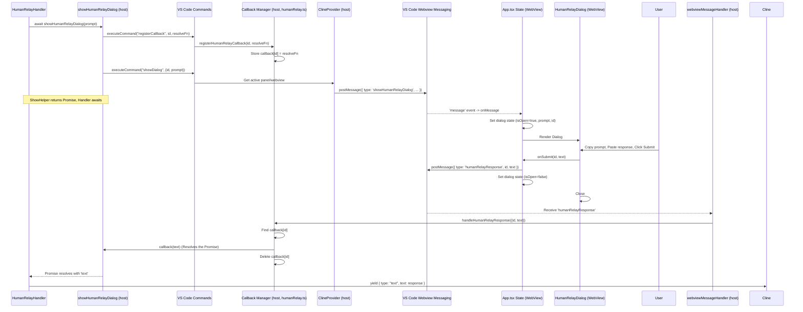

# Chapter 39: Human Relay UI

Continuing from [Chapter 38: MCP UI Components (WebView)](38_mcp_ui_components__webview_.md), where we examined the UI for managing external MCP server connections, we now turn to a specialized UI component designed for a unique interaction model: the **Human Relay UI**.

## Motivation: Bridging to External AI via Manual Interaction

While Roo-Code supports various direct API integrations with LLMs, there are scenarios where a user might want or need to act as an intermediary. This could be because:

1.  They want to use a specific web-based AI (like ChatGPT, Claude web UI, Gemini web UI) that doesn't have a direct API integration in Roo-Code.
2.  They prefer to manually review or modify the prompt before sending it to an external AI.
3.  They want to leverage features of a specific web UI (like file uploads, visual rendering) before getting the AI's final text response.
4.  They are using Roo-Code in an environment where direct outbound API calls are restricted, but they can access web UIs.

To accommodate this, Roo-Code offers a "Human Relay" provider. When this provider is selected, instead of making an API call directly, Roo-Code needs to present the generated prompt to the user, allow them to copy it, execute it in their chosen external AI interface, and then paste the AI's response back into Roo-Code to continue the task. The Human Relay UI, specifically the `HumanRelayDialog` component, facilitates this manual copy-paste workflow.

**Central Use Case:** A user selects the "Human Relay" provider in Roo-Code settings. They then ask Roo-Code: "Explain this selected code snippet."

1.  Roo-Code prepares the prompt, including the system message and the user's request with the code snippet.
2.  Because the selected provider is "Human Relay", the `HumanRelayHandler` ([Chapter 5: ApiHandler](05_apihandler.md)) is invoked instead of a direct API handler.
3.  The `HumanRelayHandler` copies the prepared prompt text to the user's clipboard.
4.  It then triggers the display of the Human Relay dialog by coordinating with the extension host (via commands and callbacks managed in `src/activate/humanRelay.ts`) which sends a `showHumanRelayDialog` message to the WebView UI.
5.  The `HumanRelayDialog` appears in the WebView UI. It displays the prompt text (which is already on the clipboard) and provides a text area for the user's input. It instructs the user to paste the prompt into their external AI, get the response, and paste that response back into the dialog's text area.
6.  The user switches to their web browser, pastes the prompt into their preferred AI chat interface, and copies the AI's response.
7.  The user returns to VS Code and pastes the AI's response into the text area within the `HumanRelayDialog`.
8.  The user clicks "Submit Response".
9.  The dialog sends a `humanRelayResponse` message (containing the pasted text and a request ID) back to the extension host.
10. The extension host uses the callback mechanism (`handleHumanRelayResponse` in `src/activate/humanRelay.ts`) to deliver the pasted response back to the waiting `HumanRelayHandler`.
11. The `HumanRelayHandler` resolves its promise, yielding the user-pasted text as if it were the direct API response.
12. Roo-Code's agent logic (`Cline`) processes this response (parsing Markdown, etc.) and displays it in the chat, continuing the task.

## Key Concepts

1.  **Human Relay Provider:** A specific provider type (`apiProvider: "human-relay"`) selected in the API configuration. When active, it uses the `HumanRelayHandler`.
2.  **`HumanRelayHandler` (`src/api/providers/human-relay.ts`):** An implementation of the `ApiHandler` interface. Instead of making network requests, its `createMessage` method:
    *   Formats the prompt text.
    *   Copies the prompt to the clipboard (`vscode.env.clipboard.writeText`).
    *   Calls the `showHumanRelayDialog` helper function.
    *   `showHumanRelayDialog` uses a command-based callback system (`roo-cline.registerHumanRelayCallback`, `roo-cline.showHumanRelayDialog`) to communicate with the WebView UI via the extension host/`ClineProvider`. It returns a `Promise` that resolves with the user's pasted response (or `undefined` if cancelled).
    *   Yields the received response text via the `ApiStream`.
3.  **Callback Mechanism (`src/activate/humanRelay.ts`):** A simple system using a `Map` (`humanRelayCallbacks`) to store `resolve` functions keyed by a unique `requestId`.
    *   `registerHumanRelayCallback`: Called by the host before showing the dialog to store the `resolve` function for a given `requestId`.
    *   `handleHumanRelayResponse`: Called by the `webviewMessageHandler` when a `humanRelayResponse` or `humanRelayCancel` message arrives. It finds the corresponding callback using the `requestId`, calls it with the response text or `undefined`, and removes the callback from the map.
4.  **`showHumanRelayDialog` Message:** `ExtensionMessage` sent from host to UI (`type: 'showHumanRelayDialog'`), carrying `requestId` and `promptText`. Triggered via the `roo-cline.showHumanRelayDialog` command called by the `HumanRelayHandler`.
5.  **UI State Management (`App.tsx`):** The main WebView component manages the dialog's visibility and content using `useState` hooks (`isHumanRelayDialogOpen`, `humanRelayPrompt`, `humanRelayRequestId`). It listens for the `showHumanRelayDialog` message to update this state.
6.  **`HumanRelayDialog` Component (`webview-ui/src/components/human-relay/HumanRelayDialog.tsx`):**
    *   A controlled React component using shadcn/ui `Dialog` primitives.
    *   Receives `isOpen`, `promptText`, `requestId`, `onSubmit`, `onCancel` props from `App.tsx`.
    *   Displays the `promptText` in a read-only `Textarea` with a "Copy" button (`useClipboard` hook).
    *   Provides another `Textarea` for the user to paste the AI's response.
    *   "Submit Response" button calls the `onSubmit` prop, triggering the `humanRelayResponse` message.
    *   "Cancel" button (or closing the dialog) calls the `onCancel` prop, triggering the `humanRelayCancel` message.
7.  **`humanRelayResponse` / `humanRelayCancel` Messages:** `WebviewMessage` types sent from the UI back to the host, carrying the `requestId` and response `text` (or indicating cancellation).

## Using the Human Relay UI (Use Case Revisited)

Let's trace the "Explain Code Snippet" with the Human Relay provider selected.

1.  **User Sends Task:** User provides the request in `ChatView`. `handleSendMessage` sends `newTask`.
2.  **`Cline` Starts:** `initClineWithTask` runs. `buildApiHandler` returns an instance of `HumanRelayHandler` based on the active configuration.
3.  **`Cline` Calls API:** `attemptApiRequest` calls `handler.createMessage(systemPrompt, messages)`.
4.  **`HumanRelayHandler.createMessage`:**
    *   Gets `latestMessage` content, combines with `systemPrompt` if needed -> `promptText`.
    *   `await vscode.env.clipboard.writeText(promptText)`.
    *   `await showHumanRelayDialog(promptText)`.
5.  **`showHumanRelayDialog` (Helper in `human-relay.ts`):**
    *   Generates unique `requestId`.
    *   Creates a `Promise<string | undefined>` and stores its `resolve` function in the `humanRelayCallbacks` map via the `"roo-cline.registerHumanRelayCallback"` command.
    *   Executes the `"roo-cline.showHumanRelayDialog"` command, passing `{ requestId, promptText }`.
    *   Returns the promise, effectively pausing the `HumanRelayHandler`.
6.  **Command Handler (`registerCommands.ts`):** The handler for `"roo-cline.showHumanRelayDialog"` gets the active `ClineProvider`'s panel and sends the `showHumanRelayDialog` message to the WebView: `panel.webview.postMessage({ type: "showHumanRelayDialog", requestId, promptText })`.
7.  **WebView `App.tsx` Receives Message:** `onMessage` handler detects `showHumanRelayDialog`.
8.  **Update UI State:** Calls `setHumanRelayRequestId`, `setHumanRelayPrompt`, `setIsHumanRelayDialogOpen(true)`.
9.  **Dialog Renders:** `App.tsx` renders `<HumanRelayDialog isOpen={true} ... />`. Dialog appears, showing `promptText`.
10. **User Copy/Paste/Submit:**
    *   User potentially clicks "Copy" button (uses `useClipboard`).
    *   User goes to external AI, pastes prompt, gets response, copies response.
    *   User returns to VS Code, pastes response into the dialog's input `Textarea`. `setResponse` updates local state.
    *   User clicks "Submit Response".
11. **Dialog `onSubmit`:** Calls `props.onSubmit(requestId, responseText)` -> `handleHumanRelaySubmit` in `App.tsx`.
12. **UI Sends Response:** `handleHumanRelaySubmit` calls `vscode.postMessage({ type: 'humanRelayResponse', requestId, text: responseText })`. Sets `isHumanRelayDialogOpen = false`. Dialog closes.
13. **Host `webviewMessageHandler` Receives Message:** Gets `humanRelayResponse`.
14. **Call Callback:** Handler calls `handleHumanRelayResponse({ requestId, text })` (from `src/activate/humanRelay.ts`).
15. **`handleHumanRelayResponse` (Callback Resolver):**
    *   Finds the `callback` (the `resolve` function) in `humanRelayCallbacks` using `requestId`.
    *   Calls `callback(text)`.
    *   Deletes the entry from the map.
16. **`HumanRelayHandler` Resumes:** The `await showHumanRelayDialog(...)` promise resolves with the `text` value.
17. **Yield Response:** `handler.createMessage` yields `{ type: "text", text: response }`.
18. **`Cline` Continues:** Receives the yielded text chunk from the `ApiStream`, processes it (`parseAssistantMessage`, `presentAssistantMessage`), and displays it in the chat.

## Code Walkthrough

### `HumanRelayHandler` (`src/api/providers/human-relay.ts`)

```typescript
// --- File: src/api/providers/human-relay.ts ---
import { Anthropic } from "@anthropic-ai/sdk";
import { ApiHandlerOptions, ModelInfo } from "../../shared/api";
import { ApiHandler, SingleCompletionHandler } from "../index";
import { ApiStream } from "../transform/stream";
import * as vscode from "vscode";
// Import the helper that bridges to the command/callback system
import { showHumanRelayDialog } from "../../activate/humanRelay"; // Import the triggering function

/**
 * Human Relay API processor. Interacts via clipboard and dialog.
 */
export class HumanRelayHandler implements ApiHandler, SingleCompletionHandler {
	private options: ApiHandlerOptions;

	constructor(options: ApiHandlerOptions) { this.options = options; }
	// Token counting is irrelevant for human relay
	countTokens(content: Array<Anthropic.Messages.ContentBlockParam>): Promise<number> { return Promise.resolve(0); }

	/**
	 * Copies prompt to clipboard and shows dialog to get response from user.
	 */
	async *createMessage(systemPrompt: string, messages: Anthropic.Messages.MessageParam[]): ApiStream {
		const latestMessage = messages[messages.length - 1];
		if (!latestMessage) { throw new Error("No message to relay"); }

		// Format the prompt text
		let promptText = "";
		if (messages.length === 1) { // Include system prompt only for the first message
			promptText = `${systemPrompt}\n\n${getMessageContent(latestMessage)}`;
		} else {
			promptText = getMessageContent(latestMessage); // Subsequent turns only send the latest content
		}

		// Copy prompt to clipboard
		await vscode.env.clipboard.writeText(promptText);

		// Show dialog and wait for user's pasted response or cancellation
		const response = await showHumanRelayDialog(promptText);

		if (response === undefined) { // Check for undefined specifically (means cancelled)
			throw new Error("Human relay operation cancelled by user.");
		}

		// Yield the response provided by the user
		yield { type: "text", text: response };
	}

	/** Model info is placeholder */
	getModel(): { id: string; info: ModelInfo } { /* Returns default human-relay info */ }

	/** Implementation for single completion (less common use) */
	async completePrompt(prompt: string): Promise<string> {
		await vscode.env.clipboard.writeText(prompt);
		const response = await showHumanRelayDialog(prompt);
		if (response === undefined) { throw new Error("Human relay operation cancelled"); }
		return response;
	}
}

/** Extracts text content from Anthropic message format */
function getMessageContent(message: Anthropic.Messages.MessageParam): string { /* ... */ }

// Note: showHumanRelayDialog is now imported from humanRelay.ts
// Its implementation uses the command/callback system.
```

**Explanation:**

*   Implements `ApiHandler`. `countTokens` returns 0.
*   `createMessage`:
    *   Formats the prompt text (including system prompt only on the first turn).
    *   Copies it to the clipboard using `vscode.env.clipboard.writeText`.
    *   Calls the imported `showHumanRelayDialog` helper, which handles triggering the UI and returns a promise that resolves with the user's response or `undefined` on cancel.
    *   If the user cancels (`response === undefined`), it throws an error.
    *   If a response is received, it `yield`s a single `ApiStreamChunk` of type `text` containing the response.

### Callback Management & Trigger (`src/activate/humanRelay.ts`)

```typescript
// --- File: src/activate/humanRelay.ts ---
import * as vscode from "vscode";

// Map to store resolve functions for pending relay requests
const humanRelayCallbacks = new Map<string, (response: string | undefined) => void>();

/**
 * Register a callback function for a specific human relay request ID.
 * Called by the extension host before triggering the dialog.
 */
export const registerHumanRelayCallback = (requestId: string, callback: (response: string | undefined) => void) => {
	humanRelayCallbacks.set(requestId, callback);
	console.log(`HumanRelay: Registered callback for ${requestId}`);
};

/**
 * Unregister a callback (e.g., on timeout or cancellation).
 */
export const unregisterHumanRelayCallback = (requestId: string) => {
	humanRelayCallbacks.delete(requestId);
	console.log(`HumanRelay: Unregistered callback for ${requestId}`);
};

/**
 * Handles the response received from the WebView UI.
 * Finds the corresponding callback and resolves the promise.
 * Called by webviewMessageHandler.
 */
export const handleHumanRelayResponse = (response: { requestId: string; text?: string; cancelled?: boolean }) => {
	const callback = humanRelayCallbacks.get(response.requestId);
	if (callback) {
		console.log(`HumanRelay: Handling response for ${response.requestId}`);
		if (response.cancelled) {
			callback(undefined); // Resolve with undefined if cancelled
		} else {
			callback(response.text); // Resolve with the text
		}
		// Clean up the callback
		humanRelayCallbacks.delete(response.requestId);
	} else {
		console.warn(`HumanRelay: No callback found for request ID ${response.requestId}`);
	}
};

/**
 * Helper function called by HumanRelayHandler to show the dialog.
 * Registers a callback and executes commands to trigger the UI.
 * Returns a promise that resolves when the user responds or cancels.
 */
export async function showHumanRelayDialog(promptText: string): Promise<string | undefined> {
	return new Promise<string | undefined>(async (resolve) => {
		const requestId = Date.now().toString() + Math.random().toString(16).slice(2); // More unique ID

		// 1. Register the resolve function using a command
		try {
            // This command should call registerHumanRelayCallback internally
			await vscode.commands.executeCommand(
				"roo-cline.registerHumanRelayCallback",
				requestId,
				// Pass the resolve function itself as the callback
				(response: string | undefined) => resolve(response),
			);
		} catch (error) {
			console.error("HumanRelay: Failed to register callback via command:", error);
			resolve(undefined); // Fail gracefully if registration command fails
			return;
		}

		// 2. Execute command to tell the active provider/panel to show the dialog
		try {
			await vscode.commands.executeCommand("roo-cline.showHumanRelayDialog", {
				requestId,
				promptText,
			});
            console.log(`HumanRelay: Sent command to show dialog for ${requestId}`);
		} catch (error) {
			console.error("HumanRelay: Failed to execute showHumanRelayDialog command:", error);
			unregisterHumanRelayCallback(requestId); // Clean up callback if show command fails
			resolve(undefined); // Fail gracefully
		}

		// Promise remains pending until the callback is called via handleHumanRelayResponse
	});
}
```

**Explanation:**

*   **`humanRelayCallbacks` Map:** Stores `resolve` functions from the `Promise` created in `showHumanRelayDialog`, keyed by `requestId`.
*   **`registerHumanRelayCallback`:** Adds a callback to the map. Exported so it can be called via a registered command.
*   **`unregisterHumanRelayCallback`:** Removes a callback (used for cleanup on error/timeout).
*   **`handleHumanRelayResponse`:** Looks up the callback using `requestId`, calls it with the response text (or `undefined` if `cancelled`), and removes the callback. This resolves the promise awaited by `HumanRelayHandler`.
*   **`showHumanRelayDialog`:**
    *   Creates a `Promise` and gets its `resolve` function.
    *   Generates a unique `requestId`.
    *   Executes `"roo-cline.registerHumanRelayCallback"` command, passing the `requestId` and the `resolve` function. This command needs to be registered elsewhere and simply call the exported `registerHumanRelayCallback`.
    *   Executes `"roo-cline.showHumanRelayDialog"` command, passing the `requestId` and `promptText`. This command needs to be registered elsewhere and trigger the `showHumanRelayDialog` message to the active WebView panel.
    *   Returns the `Promise`, which will resolve only when `handleHumanRelayResponse` calls the stored callback.

### `HumanRelayDialog.tsx`

*(See full code in chapter context)*

*   **Imports:** Uses shadcn `Dialog` primitives, `Button`, `Textarea` (likely shadcn version here, not VS Code toolkit), `lucide-react` icons, and `useClipboard` hook.
*   **Props:** Takes `isOpen`, `onClose`, `requestId`, `promptText`, `onSubmit`, `onCancel`.
*   **State:** Manages `response` (user input) and `isCopyClicked` (for copy button feedback).
*   **Effect:** Clears `response` and `isCopyClicked` when `isOpen` becomes true.
*   **`handleCopy`:** Uses `useClipboard` hook to copy `promptText`, sets `isCopyClicked` state for feedback.
*   **`handleSubmit`:** Prevents default, calls `props.onSubmit` if `response` is not empty, then calls `props.onClose`.
*   **`handleCancel`:** Calls `props.onCancel`, then `props.onClose`.
*   **Rendering:**
    *   Uses controlled `Dialog` based on `isOpen`. `onOpenChange` triggers `handleCancel` if closed externally.
    *   `DialogContent` includes Header, prompt `Textarea` (read-only) with Copy button, feedback message, response `Textarea`, and Footer.
    *   Footer has Cancel (`X` icon) and Submit (`Check` icon) buttons triggering respective handlers. Submit button is disabled if `response` is empty.

### `App.tsx` Integration

*(See full code in chapter context)*

*   **State:** Includes `humanRelayDialogState` (`isOpen`, `requestId`, `promptText`).
*   **Message Handling (`onMessage`):** Handles `showHumanRelayDialog` message by updating the `humanRelayDialogState`.
*   **Callbacks (`handleHumanRelaySubmit`, `handleHumanRelayCancel`):** Passed to the dialog. They send the `humanRelayResponse`/`humanRelayCancel` messages back to the host and update `humanRelayDialogState` to close the dialog.
*   **Rendering:** Conditionally renders `<HumanRelayDialog>` passing the state and callbacks as props.

## Internal Implementation

The interaction relies on a combination of command execution, message passing, and a callback map to bridge the asynchronous gap between the `ApiHandler` needing input and the user providing it via the UI.

1.  **Handler Initiates:** `HumanRelayHandler.createMessage` calls `showHumanRelayDialog`.
2.  **Callback Registration:** `showHumanRelayDialog` executes command `"roo-cline.registerHumanRelayCallback"(requestId, resolveFn)`. The command handler calls the exported `registerHumanRelayCallback`, storing `resolveFn` in the `humanRelayCallbacks` map.
3.  **UI Trigger:** `showHumanRelayDialog` executes command `"roo-cline.showHumanRelayDialog"({ requestId, promptText })`. The command handler finds the active panel and sends the `showHumanRelayDialog` message to the WebView.
4.  **Handler Waits:** `showHumanRelayDialog` returns its `Promise` to `HumanRelayHandler`, which `await`s it.
5.  **UI Reacts:** WebView (`App.tsx`) receives the message, updates state, causing `HumanRelayDialog` to render.
6.  **User Responds:** User interacts with the dialog and clicks Submit/Cancel.
7.  **UI Sends Result:** Dialog callbacks trigger `postMessage` (`humanRelayResponse` or `humanRelayCancel`) back to the host, including the `requestId`.
8.  **Host Handles Result:** `webviewMessageHandler` receives the message. It calls `handleHumanRelayResponse({ requestId, text?, cancelled? })`.
9.  **Callback Resolution:** `handleHumanRelayResponse` finds the `resolveFn` in the `humanRelayCallbacks` map using the `requestId`, calls it with the `text` or `undefined`, and removes the entry.
10. **Handler Resumes:** The `Promise` awaited in `HumanRelayHandler` resolves. `createMessage` proceeds, yielding the received text.

**Sequence Diagram:**



## Modification Guidance

Modifications might involve changing the dialog's appearance, instructions, or the data passed back.

1.  **Changing Dialog Layout/Text:**
    *   **Modify `HumanRelayDialog.tsx`:** Adjust the components used (e.g., different Button variants), Tailwind classes, or text content directly.
    *   **Modify i18n:** Update the translation keys used (e.g., `"humanRelay:dialogTitle"`) in the localization files ([Chapter 50: Localization System (i18n)](50_localization_system__i18n_.md)).

2.  **Adding Validation to Pasted Response:**
    *   **`HumanRelayDialog.tsx`:** Add validation logic (e.g., check for minimum length, specific keywords) within the `handleSubmitClick` function before calling `onSubmit`. Display an error message within the dialog if validation fails, instead of submitting.

3.  **Passing Structured Data Back (Instead of just text):**
    *   **Dialog UI:** Add more input fields (e.g., checkboxes, ratings) to `HumanRelayDialog.tsx`.
    *   **`onSubmit`:** Collect data from all relevant inputs into an object.
    *   **`humanRelayResponse` Message:** Modify the message payload to include the structured data object instead of just `text` (e.g., `payload: { responseText: "...", rating: 5 }`). Update `ExtensionMessage` type.
    *   **`handleHumanRelayResponse` (Host):** Update the type it expects and the value passed to the callback. The callback signature in `humanRelayCallbacks` map and `registerHumanRelayCallback` would need updating (e.g., `(response: MyStructuredData | undefined) => void`).
    *   **`HumanRelayHandler`:** Update the type it expects back from `showHumanRelayDialog`. Change how it processes the structured data before potentially yielding a text representation or using the data internally.

**Best Practices:**

*   **Clear Instructions:** The dialog description and prompt label should clearly instruct the user on the copy-paste workflow.
*   **Clipboard Integration:** Using `vscode.env.clipboard.writeText` (in handler) and `useClipboard` (in UI) improves the user experience.
*   **Error Handling:** The `HumanRelayHandler` should handle cancellation (`response === undefined`) gracefully, likely by throwing an error that `Cline` can catch and report. The command execution and callback registration should also include error handling.
*   **Unique Request IDs:** Ensure `requestId` generation is robust enough to prevent collisions if multiple relays could theoretically overlap (unlikely but possible).
*   **Security:** Since the user is manually interacting with external AIs, the primary security consideration is ensuring the prompt text copied doesn't contain unintended sensitive information from the Roo-Code context (though this is a general prompt generation concern). The response pasted back is treated as user input.

**Potential Pitfalls:**

*   **Callback Mismatch:** If the `requestId` is lost or corrupted during message passing, the response from the UI won't find the correct callback, leaving the `HumanRelayHandler` hanging.
*   **Command Failures:** If the VS Code commands (`registerHumanRelayCallback`, `showHumanRelayDialog`) fail to execute (e.g., panel not found, command not registered), the process will fail.
*   **User Error:** The user might forget to copy the prompt, paste the wrong response, cancel unintentionally, or take a very long time, potentially leading to timeouts if implemented.
*   **Clipboard Issues:** `vscode.env.clipboard.writeText` could fail due to OS permissions or other issues.

## Conclusion

The Human Relay UI, centered around the `HumanRelayDialog` component and orchestrated by the `HumanRelayHandler` via a command/callback mechanism, provides a valuable workflow for users who wish to leverage external web-based AI interfaces within Roo-Code. It facilitates the necessary manual copy-paste steps by presenting the prompt clearly and providing an input area for the AI's response. While less automated than direct API integrations, it offers flexibility and access to models or UIs not directly supported by Roo-Code's API handlers.

This chapter marks the end of our exploration of specific UI component categories within the WebView. We now transition to foundational elements and utilities used across both the extension host and the WebView, starting with the data validation layer: [Chapter 40: Schemas (Zod)](40_schemas__zod_.md).


