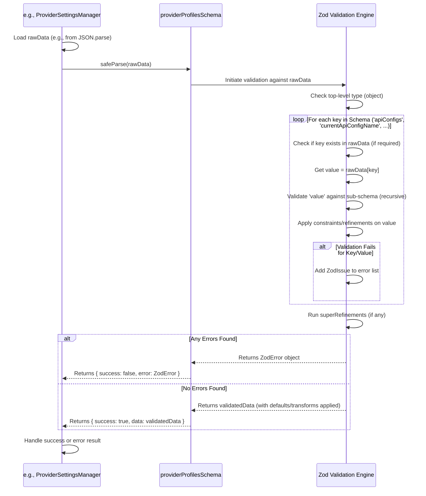

# Chapter 40: Schemas (Zod)

Continuing from [Chapter 39: Human Relay UI](39_human_relay_ui.md), which explored a specialized UI for manual AI interaction, we now shift to a foundational aspect ensuring data reliability across the entire Roo-Code system: **Schemas** defined using the **Zod** library.

## Motivation: Ensuring Data Integrity and Type Safety

Roo-Code is a complex system involving communication between multiple components (the VS Code extension host, the WebView UI), interactions with external APIs (LLMs, MCP servers), reading configuration files, and managing persistent state. Data flows across these boundaries constantly. While TypeScript provides excellent static type checking during development, it cannot guarantee the shape or type of data *at runtime*, especially when data originates from external sources like:

*   User input via settings forms.
*   JSON configuration files (`.roomodes`, `.roo/mcp.json`).
*   Responses from external APIs (LLMs, MCP servers).
*   Data loaded from persistent storage (`globalState`, `secrets`, task files).
*   Messages passed between the isolated WebView and the extension host.

If Roo-Code were to blindly trust that this runtime data matches the TypeScript interfaces, it would be vulnerable to errors caused by missing fields, incorrect data types, malformed JSON, or unexpected values. This could lead to crashes, incorrect behavior, corrupted state, or even security issues.

To prevent these problems, Roo-Code employs **Zod**, a powerful TypeScript-first schema declaration and validation library. Zod allows defining explicit schemas that describe the expected structure, types, and constraints of data. These schemas are then used at runtime to validate incoming or loaded data, ensuring its integrity before it's used by the application logic. Furthermore, Zod schemas serve as the single source of truth for generating TypeScript types, eliminating potential mismatches between compile-time types and runtime validation rules.

**Central Use Case:** Loading API configuration profiles from secure storage ([Chapter 9: ProviderSettingsManager](09_providersettingsmanager.md)).

1.  The `ProviderSettingsManager` reads a JSON string potentially representing multiple API profiles from VS Code's `secrets` API. This data might be old, partially corrupted, or manually edited incorrectly.
2.  Before using this data, the manager *must* validate it against the expected structure defined by the `providerProfilesSchema` (a Zod schema).
3.  It uses `providerProfilesSchema.safeParse(JSON.parse(content))`.
4.  **If the data is valid:** `safeParse` returns `{ success: true, data: <parsedProfiles> }`. The manager receives the `data` object, which is now guaranteed by Zod to match the schema structure and constraints. TypeScript also recognizes `data` as having the type `ProviderProfiles` (inferred from the schema), enabling type-safe access downstream.
5.  **If the data is invalid:** (e.g., a profile is missing the `apiProvider` field, or `modelMaxTokens` is a string instead of a number) `safeParse` returns `{ success: false, error: ZodError }`. The `ZodError` object contains detailed information about *which* fields failed validation and why. The manager can log this error, report it via telemetry ([Chapter 52: TelemetryService](52_telemetryservice.md)), and crucially, avoid using the corrupted data, perhaps falling back to default settings or removing the invalid profile, thus preventing runtime crashes.

## Key Concepts

1.  **Zod:** A popular schema declaration and validation library focused on TypeScript integration. It provides a fluent API for defining schemas and offers robust runtime validation and type inference capabilities. ([https://zod.dev/](https://zod.dev/))

2.  **Schema Definition (`src/schemas/*.ts`):** Roo-Code centralizes its Zod schema definitions within the `src/schemas/` directory. Separate files (`settings.ts`, `modes.ts`, `mcp.ts`, `tools.ts`, `messages.ts`, `history.ts`, etc.) define schemas for logical data groups using Zod's builders:
    *   **Primitives:** `z.string()`, `z.number()`, `z.boolean()`, `z.enum(["a", "b"])`, `z.literal("value")`, `z.null()`, `z.undefined()`, `z.any()`, `z.unknown()`.
    *   **Objects:** `z.object({ key1: schema1, key2: schema2 })`.
    *   **Arrays:** `z.array(elementSchema)`.
    *   **Records:** `z.record(keySchema, valueSchema)` (e.g., `z.record(z.string(), z.boolean())`).
    *   **Modifiers:** `.optional()` (allows `undefined`), `.nullable()` (allows `null`), `.default(value)` (provides default if input is `undefined`), `.passthrough()` (allows extra keys not defined in schema).
    *   **Constraints:** `.min(number)`, `.max(number)`, `.length(number)`, `.email()`, `.url()`, `.regex(RegExp)`, `.int()`, `.positive()`.
    *   **Complex Logic:** `.refine(validatorFn, message)` (custom validation on a single field), `.superRefine(validatorFn)` (custom validation involving multiple fields within an object), `z.union([schemaA, schemaB])`, `z.intersection(schemaA, schemaB)`, `z.discriminatedUnion("type", [...])`.

3.  **Type Inference (`z.infer<typeof schema>`):** A key feature. Zod schemas act as the single source of truth for both runtime validation and static TypeScript types. Roo-Code defines types like `export type ProviderSettings = z.infer<typeof providerSettingsSchema>;`. This guarantees the type used in the code exactly matches the validation rules.

4.  **Parsing & Validation Methods:**
    *   **`schema.parse(data)`:** Validates `data`. **Throws** a detailed `ZodError` if validation fails. Returns the validated (and potentially transformed/defaulted) data with the inferred type on success. Used when data is expected to be valid.
    *   **`schema.safeParse(data)`:** Validates `data`. **Returns** a result object: `{ success: true, data: T }` or `{ success: false, error: ZodError }`. Does not throw. Preferred for validating data from external sources or storage where failures are anticipated and need graceful handling.

5.  **Key Schema Files and Purpose:**
    *   **`src/schemas/index.ts`:** The central hub. It often re-exports schemas from other files and defines crucial top-level types (`GlobalState`, `SecretState`, `RooCodeSettings`) and associated key lists (`GLOBAL_STATE_KEYS`, `SECRET_STATE_KEYS`, `PROVIDER_SETTINGS_KEYS`, `ROO_CODE_SETTINGS_KEYS`) used for state management ([Chapter 11: ContextProxy](11_contextproxy.md)). It also defines shared enums like `providerNamesSchema`, `toolGroupsSchema`, etc.
    *   **`src/schemas/settings.ts`:** Contains `providerSettingsSchema` (for API profiles) and `providerProfilesSchema` (for the structure stored by `ProviderSettingsManager`).
    *   **`src/schemas/modes.ts`:** Contains `modeConfigSchema` (for single mode definition) and `customModesSettingsSchema` (for the JSON files).
    *   **`src/schemas/mcp.ts`:** Contains `serverConfigSchema` (for single MCP server) and `mcpSettingsSchema` (for the JSON files).
    *   **`src/schemas/tools.ts`:** Defines `toolNameSchema`, `toolParamNameSchema`, possibly schemas for tool input/output if structure is complex.
    *   **`src/schemas/messages.ts`:** Defines `clineMessageSchema` (for UI messages), `clineAskSchema`, `clineSaySchema`.
    *   **`src/schemas/history.ts`:** Defines `historyItemSchema` (for task summaries).
    *   **`src/schemas/ipc.ts`:** Defines schemas for messages used in Inter-Process Communication ([Chapter 51: IPC (Inter-Process Communication)](51_ipc__inter_process_communication_.md)).
    *   **`src/core/context-tracking/FileContextTrackerTypes.ts`:** Defines schemas (`taskMetadataSchema`, `fileMetadataEntrySchema`) for file tracking metadata.

6.  **Runtime Validation Points:** Zod validation (`parse` or `safeParse`) is strategically applied at runtime:
    *   Loading data from `vscode.ExtensionContext.secrets` (`ProviderSettingsManager.load`).
    *   Loading data from `vscode.ExtensionContext.globalState` (Potentially within `ContextProxy.initialize` or getters like `getGlobalSettings`).
    *   Reading JSON configuration files (`CustomModesManager.loadModesFromFile`, `McpHub.initializeMcpServers`).
    *   Parsing responses from MCP servers (`McpHub` when calling `client.request`).
    *   Validating settings before saving in the UI (`PromptsView`'s `handleCreateMode`).
    *   Validating configuration during import ([Chapter 47: Configuration Import/Export](47_configuration_import_export.md)).

## Using Zod Schemas

Schemas primarily serve two roles: defining types and validating data.

**1. Defining Types:**

```typescript
// --- File: src/schemas/modes.ts ---
import { z } from "zod";
import { toolGroupsSchema, groupOptionsSchema } from "./index"; // Import other schemas

// Schema for how tool groups are specified in a mode config
const groupEntrySchema = z.union([
    toolGroupsSchema, // e.g., "read"
    z.tuple([toolGroupsSchema, groupOptionsSchema]) // e.g., ["edit", { fileRegex: "\\.md$" }]
]);
// Ensure unique group names within the array
const groupEntryArraySchema = z.array(groupEntrySchema).refine(/* ... uniqueness check ... */);

// Schema for a single custom mode definition
export const modeConfigSchema = z.object({
	slug: z.string().regex(/^[a-zA-Z0-9-]+$/, "Slug must use letters, numbers, dashes"),
	name: z.string().min(1, "Name is required"),
	roleDefinition: z.string().min(1, "Role definition is required"),
	customInstructions: z.string().optional(),
	groups: groupEntryArraySchema, // Array of enabled tool groups
	source: z.enum(["global", "project"]).optional(), // Added internally during load
});

// ---> Infer the TypeScript type <---
export type ModeConfig = z.infer<typeof modeConfigSchema>;

// --- Usage elsewhere (e.g., CustomModesManager.ts) ---
import { ModeConfig } from "../schemas"; // Import the inferred type

async function processModes(modes: ModeConfig[]) {
    modes.forEach(mode => {
        // TypeScript knows 'mode' has properties like slug, name, roleDefinition, groups
        console.log(`Processing mode: ${mode.name} (${mode.slug})`);
        // Type safety when accessing groups
        mode.groups.forEach(groupEntry => {
            const groupName = Array.isArray(groupEntry) ? groupEntry[0] : groupEntry;
            console.log(`- Enabled Group: ${groupName}`);
        });
    });
}
```
*Explanation:* The `modeConfigSchema` uses Zod types (`z.string`, `z.object`, `z.array`, `z.union`, `.regex`, `.optional`, `.refine`) to define the structure. `type ModeConfig = z.infer<...>` creates the corresponding TypeScript type. The `processModes` function can then safely use `ModeConfig` typed variables.

**2. Validating Data:**

```typescript
// --- File: webview-ui/src/components/settings/PromptsView.tsx ---
// (Inside the handler for creating a new custom mode)

import { modeConfigSchema } from '@roo/schemas'; // Import the schema

// ... inside handleCreateMode ...
const handleCreateMode = useCallback(() => {
    // Construct the new mode object from UI state
    const newMode: Partial<ModeConfig> = {
        name: newModeName, slug: newModeSlug, roleDefinition: newModeRoleDefinition,
        customInstructions: newModeCustomInstructions, groups: newModeGroups,
        source: newModeSource,
    };

    // Validate the constructed object using safeParse
    const validationResult = modeConfigSchema.safeParse(newMode);

    if (!validationResult.success) {
        // Validation failed, process errors
        console.error("Custom Mode validation failed:", validationResult.error.errors);
        // Update UI state to show errors next to relevant fields
        validationResult.error.errors.forEach(err => {
            if (err.path.includes('name')) setNameError(err.message);
            if (err.path.includes('slug')) setSlugError(err.message);
            // ... set other error states ...
        });
        return; // Stop processing
    }

    // Validation succeeded, data is safe to use
    const validatedModeConfig = validationResult.data;

    // Send the validated data to the extension host
    updateCustomMode(validatedModeConfig.slug, validatedModeConfig);
    switchMode(validatedModeConfig.slug);
    // ... close dialog, reset state ...

}, [/* ... dependencies ... */]);
```
*Explanation:* Before sending the new custom mode data (constructed from UI inputs) to the extension host, `modeConfigSchema.safeParse` is used. If validation fails, detailed errors from `validationResult.error.errors` are used to update the UI state and provide feedback to the user. Only if validation succeeds is the data sent via `updateCustomMode`.

## Code Walkthrough

The most illustrative code is within the schema definitions themselves and the points where validation occurs.

### Schema Definitions (`src/schemas/index.ts`, `settings.ts`, `modes.ts`, etc.)

*(Referencing provided snippets and conceptual structure)*

These files contain numerous `export const someSchema = z.object({...});` definitions and corresponding `export type SomeType = z.infer<...>;` declarations.

*   **Organization:** Schemas are grouped logically (settings, modes, tools, messages). `index.ts` acts as the central export point and defines overarching types/keys.
*   **Primitives & Constraints:** Demonstrates use of `z.string`, `z.number`, `z.boolean`, `z.enum`, `.optional()`, `.default()`, `.min()`, `.regex()`.
*   **Nested Objects:** Schemas like `providerSettingsSchema` contain nested schemas (e.g., `modelInfoSchema`, `vsCodeLmModelSelector`).
*   **Arrays:** `z.array(modeConfigSchema)` is used in `customModesSettingsSchema`.
*   **Records:** `z.record(z.string(), z.boolean())` for `pinnedApiConfigs`.
*   **Unions:** `z.union([toolGroupsSchema, z.tuple(...)])` for `groupEntrySchema`.
*   **Refinements:** Used in `modeConfigSchema` and `customModesSettingsSchema` to enforce uniqueness of group names and mode slugs within arrays.
*   **Inferred Types:** Each schema definition is usually followed by its corresponding `z.infer` type export.
*   **Key Lists:** `PROVIDER_SETTINGS_KEYS`, `SECRET_STATE_KEYS`, `GLOBAL_STATE_KEYS` are derived from the schema shapes (`Object.keys(schema.shape)`) or defined explicitly, enabling programmatic access to keys and driving logic in `ContextProxy`.

### Validation Point (`ProviderSettingsManager.load`)

*(See code in Key Concepts section or Chapter 9)*

*   Reads raw JSON string from `secrets.get()`.
*   Parses using `JSON.parse()`.
*   Uses `providerProfilesSchema.safeParse()` to validate the overall structure.
    *   Uses a temporarily relaxed schema (`z.any()` for individual configs) during the first pass to avoid failing completely if only one profile is invalid.
*   If the overall structure is valid, it iterates through the `apiConfigs` entries and uses `providerSettingsWithIdSchema.safeParse()` on *each one* individually.
*   This isolates errors – invalid profiles are logged and skipped, while valid ones are kept.
*   Returns the fully validated (or default) structure. Catches JSON parsing and Zod validation errors.

## Internal Implementation

Zod itself provides the runtime validation engine. When `schema.parse(data)` or `schema.safeParse(data)` is called:

1.  **Type Check:** Zod checks if the top-level `data` type matches the schema's expected type (e.g., object for `z.object`, array for `z.array`).
2.  **Key/Property Check (Objects):** For objects, Zod iterates through the keys defined in the schema.
    *   Checks if required keys are present in the `data`.
    *   Recursively validates the value associated with each key against the corresponding sub-schema.
    *   Handles unknown keys based on `.passthrough()`, `.strict()`, or `.strip()`.
3.  **Element Check (Arrays):** For arrays, Zod iterates through the elements in `data` and validates each one against the element schema provided to `z.array()`.
4.  **Constraint Checks:** Applies defined constraints (`.min`, `.max`, `.regex`, etc.) to primitive values.
5.  **Refinements:** Executes custom validation functions provided via `.refine` or `.superRefine`, passing the data and context.
6.  **Error Collection:** If any check fails, Zod collects detailed error information (path to the failing field, expected type/constraint, received value, error message) into a `ZodError` object.
7.  **Return/Throw:** `safeParse` wraps the result (data or error) in `{ success: ... }`. `parse` throws the `ZodError` on failure or returns the data on success.
8.  **Defaults/Transformations:** If `.default()` or `.transform()` were used, Zod applies these during successful parsing.

**Sequence Diagram (Validation with `safeParse`):**



## Modification Guidance

Modifications primarily involve updating existing schemas or adding new ones as data structures evolve. *This is identical to the guidance in Chapter 40, as it's the core concept.*

1.  **Adding a Field to an Existing Schema:**
    *   **Locate:** Find the relevant Zod schema definition (e.g., `providerSettingsSchema` in `src/schemas/settings.ts`).
    *   **Add:** Add the new field using the appropriate Zod type (e.g., `newFeatureFlag: z.boolean().optional().default(false)`).
    *   **Infer Type:** The corresponding TypeScript type inferred via `z.infer` will update automatically. Check code using the type for errors.
    *   **Update Key Lists:** If the field should be managed by `ContextProxy`, add its key to `GLOBAL_STATE_KEYS` or `SECRET_STATE_KEYS` in `src/schemas/index.ts`.
    *   **Validation Points:** Existing validation points using this schema (`safeParse` or `parse`) will now automatically check for the new field.
    *   **Migration:** If adding a *required* field without a default to a schema for *persistent* data, add a migration step ([Chapter 9: ProviderSettingsManager](09_providersettingsmanager.md), [Chapter 11: ContextProxy](11_contextproxy.md)) to populate this field for existing users.

2.  **Changing a Field's Type or Constraints:**
    *   **Locate:** Find the field in the Zod schema definition.
    *   **Modify:** Change the Zod type or add/modify constraints.
    *   **Infer Type:** Check for type errors in code using the updated inferred type.
    *   **Validation Points:** Validation will now enforce the new rule.
    *   **Migration (CRITICAL):** Implement a data migration for persistent data to convert existing data to the new format/constraint. Failure to do so will cause validation errors for existing users.

3.  **Adding a New Schema for a New Data Structure:**
    *   **Create Schema:** Define the new schema using Zod in `src/schemas/`.
    *   **Infer Type:** Export the inferred TypeScript type.
    *   **Use for Validation:** Use `myNewSchema.safeParse()` or `myNewSchema.parse()` where data matching this structure is loaded/received.
    *   **Use Type:** Use the inferred type for static typing.

**Best Practices:**

*   **Centralize & Export:** Keep schemas in `src/schemas/` and use `index.ts` as the main export point.
*   **Infer Types:** *Always* use `z.infer` for types.
*   **`safeParse` at Boundaries:** Use `safeParse` for data from files, storage, APIs, or user input.
*   **Refinements for Clarity:** Use `.refine` / `.superRefine` for complex rules and provide clear error messages.
*   **Be Specific:** Avoid `z.any()` or `z.unknown()` unless absolutely necessary. Define the expected structure explicitly. Use `.passthrough()` judiciously.
*   **Migrations:** Plan for schema evolution for persistent data by implementing migrations.

**Potential Pitfalls:**

*   **Missing Validation:** Forgetting to validate data at boundaries.
*   **Schema/Type Drift:** Defining types manually separate from schemas.
*   **Migration Neglect:** Breaking changes for existing users due to schema updates without migrations.
*   **Complex Schemas:** Overly intricate schemas can be hard to debug.
*   **Performance:** Generally not an issue, but very complex schemas on huge datasets in tight loops *could* be.

## Conclusion

Schemas, defined and enforced using Zod, are a cornerstone of Roo-Code's reliability and maintainability. They provide a robust mechanism for runtime data validation, ensuring data integrity across various boundaries like file loading, API interactions, and state management. By serving as the single source of truth for both validation rules and TypeScript types (via `z.infer`), Zod eliminates inconsistencies and enhances developer confidence. Strategically applying schema validation using `safeParse` at critical points helps prevent runtime errors and allows the application to handle invalid data gracefully.

With data validation covered, we now move on to validating user *commands* before they are executed, particularly relevant for the terminal integration. The next chapter discusses [Chapter 41: Command Validation](41_command_validation.md).

