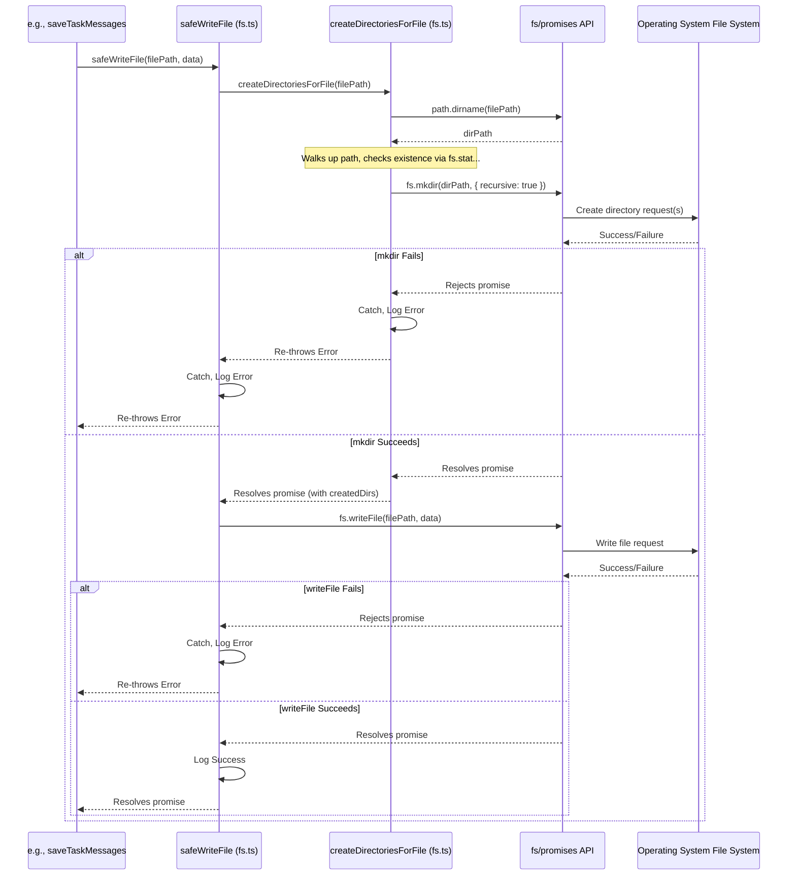

# Chapter 42: File System Utilities

Continuing from [Chapter 41: Command Validation](41_command_validation.md), where we discussed validating shell commands before execution, this chapter shifts back to fundamental operations by focusing on a set of helper functions used throughout Roo-Code for interacting with the user's local file system: the **File System Utilities**.

## Motivation: Robust and Centralized File Operations

Many features within Roo-Code require interaction with the file system:
*   Reading file content to provide context to the AI ([Chapter 24: Mention Handling](24_mention_handling.md), `read_file` tool [Chapter 8: Tools](08_tools.md)).
*   Writing files suggested by the AI ([Chapter 20: DiffViewProvider](20_diffviewprovider.md), `write_to_file` tool [Chapter 8: Tools](08_tools.md)).
*   Checking if files or directories exist ([Chapter 10: CustomModesManager](10_custommodesmanager.md), [Chapter 21: RooIgnoreController](21_rooignorecontroller.md)).
*   Creating directories ([Chapter 14: Task Persistence](14_task_persistence.md), [Chapter 13: CheckpointService](13_checkpointservice.md)).
*   Listing directory contents ([Chapter 17: Tree-sitter Integration](17_tree_sitter_integration.md), hypothetical `list_directory` tool).
*   Deleting files or directories ([Chapter 14: Task Persistence](14_task_persistence.md)).

Directly using Node.js's built-in `fs` module (or `fs/promises`) everywhere can lead to repetitive code, especially for common tasks like ensuring a directory exists before writing, checking existence gracefully, or creating nested directories. Furthermore, consistent error handling and logging across these operations are desirable.

The File System Utilities, typically grouped in `src/utils/fs.ts`, provide a centralized collection of `async` helper functions that wrap common `fs/promises` operations, adding error handling, existence checks, directory creation logic, and consistent logging. This makes file system interactions in other parts of the codebase cleaner, more robust, and easier to manage.

**Central Use Case:** The `saveTaskMessages` function ([Chapter 14: Task Persistence](14_task_persistence.md)) needs to write the `ui_messages.json` file to the task-specific directory (`.../tasks/<taskId>/`).

Without Utilities:
```typescript
// Conceptual code without specific utils
import * as fs from "fs/promises";
import * as path from "path";

async function saveTaskMessagesRaw(messages: any[], taskDir: string) {
    const filePath = path.join(taskDir, "ui_messages.json");
    try {
        // Need to ensure directory exists *before* writing
        await fs.mkdir(path.dirname(filePath), { recursive: true });
        // Write the file
        await fs.writeFile(filePath, JSON.stringify(messages, null, 2));
    } catch (error) {
        console.error(`Failed to save UI messages to ${filePath}:`, error);
        // Need specific error handling logic here
    }
}
```

With Utilities:
```typescript
// Conceptual code using utils
import { safeWriteFile } from "../../utils/fs"; // Import utility
import * as path from "path";

async function saveTaskMessagesWithUtil(messages: any[], taskDir: string) {
    const filePath = path.join(taskDir, "ui_messages.json");
    // Single call handles directory creation and writing
    await safeWriteFile(filePath, JSON.stringify(messages, null, 2));
    // Error handling might be standardized within safeWriteFile or handled by caller
}
```
The utility `safeWriteFile` encapsulates the directory creation and write operation, simplifying the calling code.

## Key Concepts

1.  **Abstraction Layer:** Provides a higher-level API over Node.js's `fs/promises` module for common file operations.
2.  **Error Handling:** Wraps `fs` calls in `try...catch` blocks, often logging errors using a standardized logger (`src/utils/logging.ts`) and potentially returning specific values (like `undefined` or `false`) on failure instead of letting exceptions propagate unexpectedly.
3.  **Convenience Functions:** Offers functions for combined operations:
    *   `safeWriteFile`: Ensures the target directory exists (`createDirectoriesForFile`) before attempting to write the file (`fs.writeFile`).
    *   `createDirectoriesForFile`: Creates all necessary parent directories for a given file path using `fs.mkdir(..., { recursive: true })`. Returns the list of directories that were potentially created (useful for cleanup, e.g., in [Chapter 20: DiffViewProvider](20_diffviewprovider.md)).
4.  **Existence Checks (`fileExistsAtPath`, `directoryExistsAtPath`):** Provides simple boolean checks using `fs.access` or `fs.stat`, handling errors gracefully (e.g., returning `false` if checking fails due to permissions or non-existence).
5.  **Asynchronous Nature:** All functions typically return `Promise`s, leveraging `async/await` and the `fs/promises` API for non-blocking I/O.
6.  **Centralization:** Consolidates file system interaction logic in one place (`src/utils/fs.ts`), making it easier to maintain, test, and apply consistent error handling or logging strategies.

## Using the File System Utilities

These utilities are imported and used throughout the extension host code wherever file system interaction is required.

**Example 1: Writing a file (`safeWriteFile`)**

```typescript
// --- File: src/core/task-persistence/taskMessages.ts ---
import * as path from "path";
import { safeWriteFile } from "../../utils/fs"; // Import the utility
import { GlobalFileNames } from "../../shared/globalFileNames";
import { getTaskDirectoryPath } from "../../shared/storagePathManager";
import { ClineMessage } from "../../shared/ExtensionMessage";
import { logger } from "../../utils/logging"; // Use logger

// ... (Read function) ...

export async function saveTaskMessages({ messages, taskId, globalStoragePath }: SaveTaskMessagesOptions) {
	try {
		const taskDir = await getTaskDirectoryPath(globalStoragePath, taskId);
		const filePath = path.join(taskDir, GlobalFileNames.uiMessages);
        // Use safeWriteFile - handles directory creation and write
		await safeWriteFile(filePath, JSON.stringify(messages, null, 2));
	} catch (error) {
        // Catch errors potentially re-thrown by safeWriteFile or path functions
		logger.error(`Failed to save UI messages for task ${taskId}`, { error, ctx: "Persistence" });
	}
}
```
*Explanation:* Instead of manually calling `fs.mkdir` and `fs.writeFile`, `saveTaskMessages` uses the single `safeWriteFile` utility, simplifying the code and centralizing the directory creation logic.

**Example 2: Checking File Existence (`fileExistsAtPath`)**

```typescript
// --- File: src/core/config/CustomModesManager.ts ---
import * as path from "path";
import { fileExistsAtPath } from "../../utils/fs"; // Import the utility
import { getWorkspacePath } from "../../utils/path";
// ... other imports ...

export class CustomModesManager {
    // ...

	private async getWorkspaceRoomodes(): Promise<string | undefined> {
		const workspaceRoot = getWorkspacePath();
		if (!workspaceRoot) return undefined;
		const roomodesPath = path.join(workspaceRoot, ".roomodes");
        // Use fileExistsAtPath for a simple boolean check
		return (await fileExistsAtPath(roomodesPath)) ? roomodesPath : undefined;
	}

    // ...
}
```
*Explanation:* `getWorkspaceRoomodes` uses `fileExistsAtPath` to quickly and safely check if the `.roomodes` file exists before attempting to read it, handling potential errors gracefully.

**Example 3: Creating Directories (`createDirectoriesForFile`)**

```typescript
// --- File: src/integrations/editor/DiffViewProvider.ts ---
import * as path from "path";
import { createDirectoriesForFile } from "../../utils/fs"; // Import the utility
import fs from "fs/promises";
// ... other imports ...

export class DiffViewProvider {
    // ... state properties ...
    private createdDirs: string[] = []; // Store created directory paths

	async open(relPath: string): Promise<void> {
        // ... setup ...
        const absolutePath = path.resolve(this.cwd, relPath);

		if (this.editType === "create") {
            // Use utility to create parent directories for the new file
            // Store the list of potentially created directories for cleanup
			this.createdDirs = await createDirectoriesForFile(absolutePath);
            // Now safe to write the initial empty file
			await fs.writeFile(absolutePath, "");
		}
        // ... open diff editor ...
    }

    async revertChanges(): Promise<void> {
        // ... logic ...
        if (this.editType === "create") {
            // ... close view, delete file ...
            // Clean up directories created during open() by walking backwards
			for (let i = this.createdDirs.length - 1; i >= 0; i--) {
				try {
                    // Attempt to remove directory; ignore error if not empty or other issues
                    await fs.rmdir(this.createdDirs[i]);
                } catch (e) {
                    logger.debug(`Could not remove created directory ${this.createdDirs[i]} during revert: ${e.message}`);
                }
			}
            this.createdDirs = []; // Clear the list
        }
        // ... rest of revert ...
    }
    // ...
}
```
*Explanation:* When opening the diff view for a *new* file, `createDirectoriesForFile` ensures the necessary parent folders exist. The list of created directories is stored so `revertChanges` can attempt to remove them (in reverse order) if the user cancels the file creation.

## Code Walkthrough

### File System Utilities (`src/utils/fs.ts`)

```typescript
// --- File: src/utils/fs.ts ---
import * as fs from "fs/promises"; // Use promises API
import * as path from "path";
import { logger } from "./logging"; // Import logger

/**
 * Checks if a file exists at the given path.
 * Handles errors gracefully, returning false if access fails for any reason.
 * @param filePath - The absolute path to the file.
 * @returns True if the file exists and is accessible, false otherwise.
 */
export async function fileExistsAtPath(filePath: string): Promise<boolean> {
	try {
		// Use fs.access with F_OK to check for existence.
		// This checks if the process has access rights, but primarily signals existence/non-existence here.
		await fs.access(filePath, fs.constants.F_OK);
		return true;
	} catch (error: any) { // Use 'any' or unknown and type check error code
        // Any error (ENOENT, EACCES, etc.) means we treat it as not existing/accessible
		if (error.code !== 'ENOENT') {
            // Log errors other than "file not found" as they might indicate other issues (e.g., permissions)
            logger.debug(`Error accessing path ${filePath}`, { error: error.message, code: error.code, ctx: "fs.exists" });
        }
		return false;
	}
}

/**
 * Checks if a directory exists at the given path.
 * @param dirPath - The absolute path to the directory.
 * @returns True if the directory exists and is accessible, false otherwise.
 */
export async function directoryExistsAtPath(dirPath: string): Promise<boolean> {
	try {
		const stats = await fs.stat(dirPath);
		return stats.isDirectory(); // Check if it's specifically a directory
	} catch (error: any) {
		// If stat fails (e.g., path doesn't exist or permissions error), it's not a directory we can use
        if (error.code !== 'ENOENT') {
            logger.debug(`Error stating directory ${dirPath}`, { error: error.message, code: error.code, ctx: "fs.dirExists" });
        }
		return false;
	}
}

/**
 * Creates all necessary parent directories for a given file path recursively.
 * Returns an array of the directories that *might* have been created leading up to the final directory.
 * This list can be used for cleanup if the file operation is reverted.
 * @param filePath - The absolute path to the file whose directories should be created.
 * @returns A promise resolving to an array of the directory paths that were potentially created.
 */
export async function createDirectoriesForFile(filePath: string): Promise<string[]> {
	const dirPath = path.dirname(filePath);
    const createdDirs: string[] = []; // Track dirs that might need cleanup

	try {
        // Check which parent directories need creation, starting from the immediate parent
        let currentPath = dirPath;
        const pathPartsToCreate: string[] = [];
        // Walk upwards until an existing directory is found or the root is reached
        while (!(await directoryExistsAtPath(currentPath))) {
            pathPartsToCreate.unshift(path.basename(currentPath)); // Store dir name to create
            const parentPath = path.dirname(currentPath);
            if (parentPath === currentPath) break; // Reached the root directory
            currentPath = parentPath; // Move up one level
        }

        // Now create the directories recursively
        // This ensures the entire path exists. fs.mkdir might return the *first* created dir path,
        // but we want the full list for potential cleanup.
		await fs.mkdir(dirPath, { recursive: true });
        logger.debug(`Ensured directory exists: ${dirPath}`, { ctx: "fs.createDir" });

        // Reconstruct the list of potentially created directories based on pathPartsToCreate
        let accumulatingPath = currentPath; // Start from the first existing parent found above
        for (const part of pathPartsToCreate) {
            accumulatingPath = path.join(accumulatingPath, part);
            createdDirs.push(accumulatingPath); // Add the path of the directory created
        }

	} catch (error: any) {
        logger.error(`Failed to create directories for ${filePath}`, { error: error.message, code: error.code, ctx: "fs.createDir" });
		throw error; // Re-throw error if directory creation fails critically
	}
    return createdDirs; // Return list of created paths for potential cleanup
}

/**
 * Safely writes data to a file, ensuring the directory exists first.
 * Re-throws errors if directory creation or file writing fails.
 * @param filePath - The absolute path to the file.
 * @param data - The data to write (string or Buffer).
 * @returns A promise resolving when the file is written.
 */
export async function safeWriteFile(filePath: string, data: string | Buffer): Promise<void> {
	try {
        // Ensure parent directories exist
		await createDirectoriesForFile(filePath);
        // Write the file using fs/promises
		await fs.writeFile(filePath, data);
        logger.debug(`Safely wrote file: ${filePath}`, { ctx: "fs.writeFile" });
	} catch (error: any) {
        logger.error(`Failed to safely write file ${filePath}`, { error: error.message, code: error.code, ctx: "fs.writeFile" });
		throw error; // Re-throw error for caller to handle
	}
}

// Example of safeReadFile utility
/**
 * Safely reads text content from a file.
 * Returns undefined if the file doesn't exist or reading fails for other reasons.
 * @param filePath - The absolute path to the file.
 * @param encoding - The encoding to use (defaults to 'utf8').
 * @returns The file content as a string, or undefined on error/non-existence.
 */
export async function safeReadFile(filePath: string, encoding: BufferEncoding = 'utf8'): Promise<string | undefined> {
    try {
        // Use fileExistsAtPath which handles ENOENT and other access errors gracefully
        if (!await fileExistsAtPath(filePath)) {
            logger.debug(`File not found for safe read: ${filePath}`, { ctx: "fs.readFile" });
            return undefined;
        }
        // If file exists, attempt to read it
        const content = await fs.readFile(filePath, encoding);
        logger.debug(`Safely read file: ${filePath}`, { ctx: "fs.readFile" });
        return content;
    } catch (error: any) {
        // Catch errors from readFile itself (e.g., rare race condition, other FS issues)
        logger.error(`Failed to safely read file ${filePath}`, { error: error.message, code: error.code, ctx: "fs.readFile" });
        return undefined; // Return undefined on any error
    }
}
```

**Explanation:**

*   **Imports:** Uses `fs/promises` for async operations, `path` for manipulation, and the shared `logger`.
*   **`fileExistsAtPath`:** Uses `fs.access` with `F_OK`. Catches any error (especially `ENOENT` for Not Found, but also `EACCES` for Permission Denied) and returns `false`, logging other errors as debug info.
*   **`directoryExistsAtPath`:** Uses `fs.stat` and checks `stats.isDirectory()`. Catches errors and returns `false`.
*   **`createDirectoriesForFile`:** Gets the target directory path using `path.dirname`. It includes refined logic to walk *up* the path using `directoryExistsAtPath`, collecting the names of directories that need to be created. It then calls `fs.mkdir(dirPath, { recursive: true })` to perform the actual creation and reconstructs the list of created directories for the return value. Re-throws errors if `mkdir` fails.
*   **`safeWriteFile`:** Orchestrates the common pattern: `await createDirectoriesForFile(filePath)` then `await fs.writeFile(filePath, data)`. Includes logging and re-throws errors for the caller to handle.
*   **`safeReadFile`:** Demonstrates a read utility. It uses `fileExistsAtPath` first for a clean check/log for non-existent files. If the file exists, it attempts `fs.readFile`. It returns `undefined` on any error during check or read.

## Internal Implementation

The utilities are thin wrappers around `fs/promises` methods, adding existence checks, directory creation, logging, and standardized error handling.

**Step-by-Step (`safeWriteFile`):**

1.  `safeWriteFile(filePath, data)` is called.
2.  It `await`s `createDirectoriesForFile(filePath)`.
    *   `createDirectoriesForFile` calls `path.dirname(filePath)`.
    *   It walks up the path, checking existence with `directoryExistsAtPath` (which calls `fs.stat`) until an existing parent is found, collecting non-existent parts.
    *   It `await`s `fs.mkdir(dirPath, { recursive: true })`.
    *   Node.js interacts with the OS file system to create any missing directories in the path. If an error occurs (e.g., permissions), `fs.mkdir` rejects.
    *   If `mkdir` rejects, `createDirectoriesForFile` catches, logs, and re-throws.
    *   If `mkdir` resolves, `createDirectoriesForFile` calculates and resolves with the `createdDirs` array.
3.  If `createDirectoriesForFile` resolved successfully, `safeWriteFile` proceeds.
4.  It `await`s `fs.writeFile(filePath, data)`.
5.  Node.js interacts with the OS to write the data to the file (creating or overwriting). If an error occurs, `fs.writeFile` rejects.
6.  If `writeFile` rejects, `safeWriteFile` catches, logs, and re-throws.
7.  If `writeFile` resolves, `safeWriteFile` logs success and resolves its own promise.

**Sequence Diagram (`safeWriteFile`):**



## Modification Guidance

Modifications usually involve adding new common file operations or adjusting error handling or logging behavior.

1.  **Adding `safeDeleteFile`:**
    *   **Define:** Add `async function safeDeleteFile(filePath: string): Promise<boolean>` to `src/utils/fs.ts`.
    *   **Implement:**
        ```typescript
        export async function safeDeleteFile(filePath: string): Promise<boolean> {
            try {
                // Use fs.rm with force: true to ignore non-existence errors
                // and recursive: true if deleting directories is also intended
                // For just files, fs.unlink is simpler but throws ENOENT.
                await fs.unlink(filePath);
                logger.debug(`Safely deleted file: ${filePath}`, { ctx: "fs.delete" });
                return true;
            } catch (error: any) {
                if (error.code === 'ENOENT') {
                    // File didn't exist, treat as success in 'safe' delete
                    logger.debug(`File not found for safe delete: ${filePath}`, { ctx: "fs.delete" });
                    return true; // Indicate success as the file is gone
                }
                logger.error(`Failed to safely delete file ${filePath}`, { error: error.message, code: error.code, ctx: "fs.delete" });
                return false; // Return false for other errors (e.g., permissions)
            }
        }
        ```
    *   **Export & Usage:** Export the function and call it where needed (e.g., task cleanup, reverting file creation).

2.  **Changing Error Handling in `safeReadFile`:**
    *   **Modify:** Instead of returning `undefined` on all errors, perhaps re-throw specific errors like `EACCES` (permission denied) while still returning `undefined` for `ENOENT` (not found).
        ```typescript
        // Inside catch block of safeReadFile
        if (error.code === 'ENOENT') {
            logger.debug(...) return undefined;
        } else {
            logger.error(...) throw error; // Re-throw other errors
        }
        ```
    *   **Impact:** Callers would need to add `try...catch` blocks if they use `safeReadFile` now. The current approach of returning `undefined` might be simpler for callers.

3.  **Adding Logging Levels/Details:**
    *   Adjust log levels (`logger.debug`, `logger.info`, `logger.warn`, `logger.error`).
    *   Add more details to log messages or metadata (e.g., file size, duration of operation).

**Best Practices:**

*   **Use `fs/promises`:** Standardize on the promise-based API.
*   **Absolute Paths:** Generally, utilities should expect absolute paths for direct `fs` operations to avoid ambiguity. Convert relative paths using helpers from [Chapter 43: Path Utilities](43_path_utilities.md).
*   **Graceful Errors vs. Exceptions:** Decide on a consistent error handling strategy. For `safe...` utilities, returning `undefined`/`false` or ignoring `ENOENT` is common. For core operations where failure is critical (like `createDirectoriesForFile`), re-throwing might be better.
*   **Logging:** Use the shared `logger` effectively.
*   **Focus:** Keep utilities focused on single FS operations or simple compositions.
*   **Security:** Be mindful when utilities operate on paths derived from external input (AI/user). Ensure paths are validated/constrained elsewhere to prevent unintended file access/modification outside expected boundaries.

**Potential Pitfalls:**

*   **Incorrect Path Handling:** Passing relative paths where absolute are expected.
*   **Permissions Errors (`EACCES`, `EPERM`):** Operations failing due to OS permissions. Utilities should catch and report/handle these.
*   **Race Conditions:** Sequences of operations (e.g., `fileExistsAtPath` then `readFile`) are not atomic. The file could be deleted between the check and the read. Using `fs.open` and operating on the file handle (as shown in the improved `extractTextFromFile`) can be more robust.
*   **Large Files:** Reading entire large files with `fs.readFile` can cause memory issues. Use streams for large data processing (beyond basic utils).
*   **Symbolic Links:** Behavior depends on the specific `fs` function (`stat` vs `lstat`, `readFile` follows links).
*   **Error Swallowing:** Returning `undefined`/`false` on errors can hide underlying problems if callers don't handle the return value properly.

## Conclusion

The File System Utilities in `src/utils/fs.ts` provide essential, robust wrappers around common Node.js file system operations. By centralizing logic for existence checks (`fileExistsAtPath`, `directoryExistsAtPath`), recursive directory creation (`createDirectoriesForFile`), safe writing (`safeWriteFile`), safe reading (`safeReadFile`), and incorporating consistent error handling and logging, they simplify file interactions throughout the Roo-Code extension host. They make the code cleaner, more reliable, and easier to maintain, forming a fundamental building block for features involving persistence, configuration, checkpointing, and file-based tools.

Building upon file system operations, the next chapter looks at utilities specifically designed for manipulating and working with file *paths*: [Chapter 43: Path Utilities](43_path_utilities.md).

