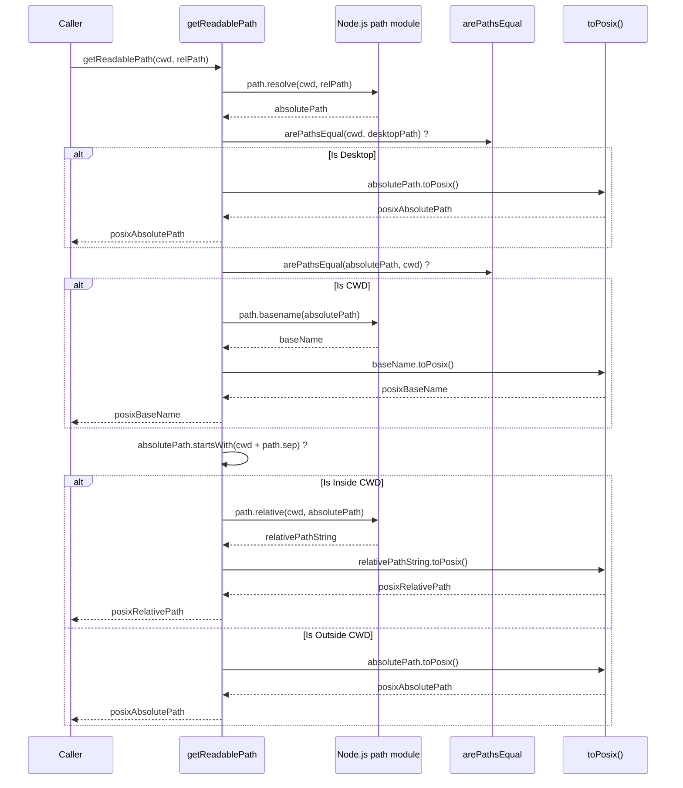
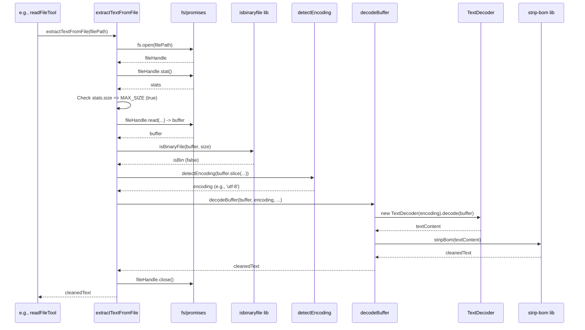
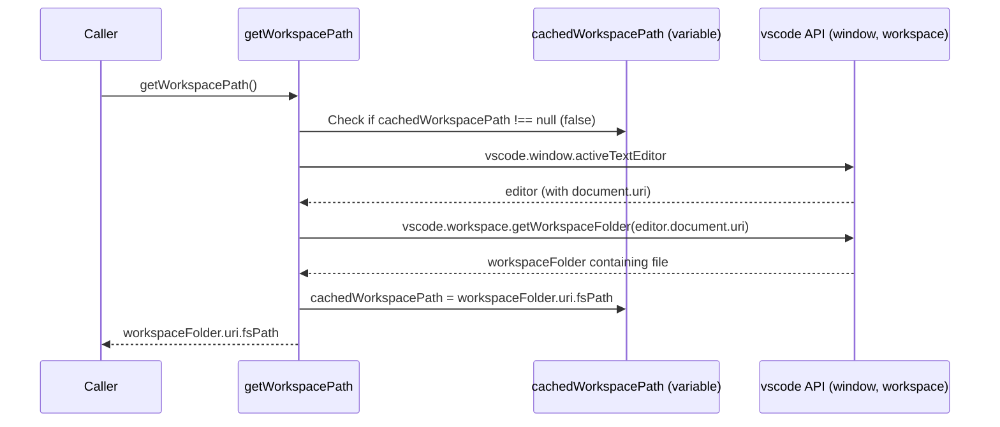

# Chapter 43: Path Utilities

Continuing from [Chapter 42: File System Utilities](42_file_system_utilities.md), which covered helpers for reading, writing, and checking files, this chapter focuses on a related set of essential helpers: utilities for manipulating and normalizing file **paths**.

## Motivation: Consistent and Reliable Path Handling

Working with file paths across different operating systems (Windows, macOS, Linux) and contexts (VS Code workspace, user input, internal storage, AI responses) can be tricky due to variations in:

*   **Path Separators:** Windows uses backslashes (`\`), while macOS and Linux use forward slashes (`/`). AI models might generate paths using either format.
*   **Absolute vs. Relative Paths:** Code needs to reliably convert between absolute paths (full path from root) and paths relative to the workspace root.
*   **URI vs. File Path:** VS Code APIs often use `vscode.Uri` objects (e.g., `file:///c:/path/to/file`), while Node.js `fs` modules typically use standard OS file path strings (`C:\path\to\file`). Conversion is often needed.
*   **Normalization:** Ensuring paths don't contain redundant separators (`//`, `\\`), handle `.` and `..` segments correctly, and use consistent casing (where relevant).
*   **Workspace Root:** Reliably determining the root path of the currently open VS Code workspace is crucial for resolving relative paths.

Implementing path manipulation and normalization logic directly wherever needed leads to duplication and potential inconsistencies. A centralized set of Path Utilities ensures that path handling is consistent, correct, and robust across the Roo-Code extension.

**Central Use Case:** The `mentionRegex` ([Chapter 24: Mention Handling](24_mention_handling.md)) matches a file mention like `@/src\components/button.tsx` typed by the user or generated by the AI. Before using this path to read the file or pass it to other functions, Roo-Code needs to:
1.  Extract the path part: `src\components/button.tsx`.
2.  Resolve it relative to the workspace root to get an absolute path: `C:\Users\Me\Project\src\components\button.tsx`.
3.  Potentially normalize separators for internal consistency or API calls: `C:/Users/Me/Project/src/components/button.tsx`.
4.  Or, conversely, take an absolute path from a VS Code API and convert it to a workspace-relative path with POSIX separators for display or storage: `src/components/button.tsx`.

The Path Utilities provide functions like `getWorkspacePath`, `resolvePath` (implicitly via `path.resolve`), `normalizePath`, `toPosixPath` / `String.prototype.toPosix`, `relativePath` / `toRelativePath`, and `arePathsEqual` to handle these conversions reliably.

## Key Concepts

1.  **Node.js `path` Module:** The foundation for most path operations. Node.js's built-in `path` module provides cross-platform functions for joining (`path.join`), resolving (`path.resolve`), normalizing (`path.normalize`), getting relative paths (`path.relative`), getting directory/base names (`path.dirname`, `path.basename`), and accessing platform-specific separators (`path.sep`, `path.posix`, `path.win32`). Roo-Code utilities heavily wrap these functions.

2.  **VS Code Workspace Context (`vscode.workspace.workspaceFolders`):** Accessing the root path(s) of the currently open workspace is crucial for resolving relative paths. Utilities use this API to find the appropriate root.

3.  **URI vs. Path String Conversion:** VS Code APIs often deal with `vscode.Uri` objects. Utilities might need to convert between `Uri.fsPath` (filesystem path string) and standard path strings using Node.js `path` functions.

4.  **POSIX Separator Normalization (`toPosixPath`, `String.prototype.toPosix`):** A core principle in Roo-Code is to prefer forward slashes (`/`) for internal representation, display (like in mentions or UI paths), and communication with the AI, regardless of the underlying OS. The `toPosixPath` function (and its prototype extension `String.prototype.toPosix`) consistently converts backslashes (`\`) to forward slashes (`/`). This normalization is applied frequently.

5.  **Path Normalization (`normalizePath`):** Uses `path.normalize` to resolve `.` and `..` segments and remove duplicate separators according to OS rules, and also removes trailing slashes (except for root). Often used in conjunction with `toPosixPath`.

6.  **Workspace Root Determination (`getWorkspacePath`):** A reliable function to get the filesystem path of the primary workspace folder. It checks `vscode.workspace.workspaceFolders`, potentially uses the active editor's document to find the relevant folder, and handles cases where no folder is open.

7.  **Relative Path Calculation (`relativePath`, `toRelativePath`):** Converts an absolute path into a path relative to the workspace root, usually normalizing the output to use POSIX separators via `toPosix()`. Uses `path.relative`.

8.  **Absolute Path Calculation (via `path.resolve`):** While no explicit `resolvePath` function is shown in the final utility file, the standard Node.js `path.resolve(baseDir, relativeOrAbsPath)` is used internally or directly where needed to convert a potentially relative path into an absolute filesystem path.

9.  **Path Comparison (`arePathsEqual`):** Compares two path strings for equality after normalizing them (`path.normalize` and `toPosix()`). Crucially, it performs a case-insensitive comparison on Windows (`process.platform === "win32"`) and case-sensitive otherwise.

10. **Readable Path (`getReadablePath`):** Formats a path for display. It resolves the path to absolute. If it falls within the workspace (`cwd`), it returns the normalized relative path. If outside, it returns the normalized absolute path. Handles edge cases like the `cwd` being the Desktop.

11. **Path Outside Workspace Check (`isPathOutsideWorkspace`):** A utility (`src/utils/pathUtils.ts`) that checks if a given absolute path falls outside *any* of the currently open workspace folders.

12. **Location (`src/utils/path.ts`, `src/utils/pathUtils.ts`):** These utility functions are grouped into dedicated files. `path.ts` also includes the global `String.prototype.toPosix` extension.

## Using the Path Utilities

These are static helper functions imported and used wherever path manipulation is required.

**Example 1: Getting Workspace Root (`CustomModesManager`)**

```typescript
// --- File: src/core/config/CustomModesManager.ts ---
import * as path from "path";
import { getWorkspacePath } from "../../utils/path"; // Import utility
import { fileExistsAtPath } from "../../utils/fs"; // File system utility

export class CustomModesManager {
    // ...
	private async getWorkspaceRoomodes(): Promise<string | undefined> {
		// Reliably get the workspace root path
		const workspaceRoot = getWorkspacePath();
		if (!workspaceRoot) return undefined;
		// Use standard path.join for OS-correct joining
		const roomodesPath = path.join(workspaceRoot, ".roomodes");
		// Check existence using FS utility
		return (await fileExistsAtPath(roomodesPath)) ? roomodesPath : undefined;
	}
    // ...
}
```
*Explanation:* Uses `getWorkspacePath` to robustly determine the workspace root before constructing the path to `.roomodes` using `path.join`.

**Example 2: Normalizing and Calculating Paths (`parseMentions`)**

```typescript
// --- File: src/core/mentions/index.ts ---
import * as path from "path";
import { getWorkspacePath, getReadablePath } from "../../utils/path"; // Import utils
// Import the toPosix extension if used directly on strings, although utils wrap it
import "../../utils/path";
// ... other imports ...

// ... inside parseMentions ...
    for (const mention of mentions) {
        if (mention.startsWith("/")) {
            const mentionPath = mention.slice(1); // e.g., "src/file.ts" or "src\file.ts"
            const cwd = getWorkspacePath();
            if (!cwd) continue; // Skip if no workspace

            // Resolve to absolute path using Node's path.resolve
            const absolutePath = path.resolve(cwd, mentionPath);

            // Get normalized relative path for attributes/display using utility
            const normalizedRelative = getReadablePath(cwd, absolutePath);

            // Use absolutePath for file system access
            content = await getFileOrFolderContent(absolutePath, cwd); // Pass absolute path

            // Use normalizedRelative for attributes
            attrs = ` path="${normalizedRelative}"`; // Already POSIX from getReadablePath
            // ...
        }
        // ...
    }
// ... inside getFileOrFolderContent(absolutePath, cwd) ...
    // Use getReadablePath for display in messages if needed
    const readablePathForDisplay = getReadablePath(cwd, absolutePath);
    // ... use readablePathForDisplay in error messages or returned content ...
```
*Explanation:* `path.resolve` converts the mention path (relative to `cwd`) into an absolute path for file system access. `getReadablePath` is used to get a consistently formatted (relative or absolute, POSIX separators) path suitable for display or attributes.

**Example 3: Comparing Paths (`DiffViewProvider`)**

```typescript
// --- File: src/integrations/editor/DiffViewProvider.ts ---
import * as vscode from "vscode";
import { arePathsEqual } from "../../utils/path"; // Import utility

// ... inside openDiffEditor's promise handler ...
    const disposable = vscode.window.onDidChangeActiveTextEditor((editor) => {
        // Compare the activated editor's document path with the target file URI path
        if (editor && arePathsEqual(editor.document.uri.fsPath, fileUri.fsPath)) {
            disposable.dispose();
            resolve(editor);
        }
    });
```
*Explanation:* Uses `arePathsEqual` to reliably compare the path of the newly active editor's document (`editor.document.uri.fsPath`) with the target file URI path (`fileUri.fsPath`), correctly handling potential case differences on Windows and path normalization.

**Example 4: Checking if Outside Workspace (`readFileTool`)**

```typescript
// --- File: src/core/tools/readFileTool.ts ---
import { isPathOutsideWorkspace } from "../../utils/pathUtils"; // Import check
import { resolvePath } from "../../utils/path"; // Import resolvePath if needed
// ... other imports ...

export async function readFileTool(...) {
    const relPath: string | undefined = block.params.path;
    // ... validate access using rooIgnoreController ...

    const absolutePath = resolvePath(relPath, cline.cwd);
    if (!absolutePath) { /* handle error */ return; }

    // *** Perform workspace check ***
    if (isPathOutsideWorkspace(absolutePath)) {
        pushToolResult(formatResponse.toolError(`Reading files outside the workspace is not allowed: ${relPath}`));
        return; // Block reading outside workspace
    }

    // ... proceed with askApproval, reading file ...
}
```
*Explanation:* Before reading, the tool resolves the path to absolute and uses `isPathOutsideWorkspace` to prevent attempts to read files outside the opened project folders.

## Code Walkthrough

### Main Path Utilities (`src/utils/path.ts`)

*(See full code in chapter context)*

```typescript
// --- File: src/utils/path.ts ---
import * as path from "path";
import os from "os";
import * as vscode from "vscode";

/** Converts backslashes to forward slashes, handling Windows extended-length paths */
function toPosixPath(p: string): string {
	const isExtendedLengthPath = p.startsWith("\\\\?\\"); // Check for Windows special prefix
	if (isExtendedLengthPath) { return p; } // Don't modify extended paths
	return p.replace(/\\/g, "/"); // Replace all backslashes with forward slashes
}

// --- String Prototype Extension ---
// Adds .toPosix() method directly to strings.
// Needs to be imported once in the main entry point (extension.ts).
declare global { interface String { toPosix(): string } }
String.prototype.toPosix = function (this: string): string { return toPosixPath(this); };
// --- End Extension ---

/** Normalizes path segments (., ..), separators, and removes trailing slash */
function normalizePath(p: string): string {
	let normalized = path.normalize(p); // Resolve ., .., separators based on OS
	// Remove trailing slash, except for root paths (e.g., '/', 'C:/')
	if (normalized.length > 1 && (normalized.endsWith(path.sep))) {
        // Check if it's NOT just the root drive on Windows (e.g., C:)
        if (!/^[a-zA-Z]:$/.test(normalized)) {
		    normalized = normalized.slice(0, -1);
        }
	}
	return normalized;
}

/** Safely compares paths, normalizing and handling case-insensitivity */
export function arePathsEqual(path1?: string, path2?: string): boolean {
	if (!path1 && !path2) { return true; }
	if (!path1 || !path2) { return false; }

	const normalizedPath1 = normalizePath(path1).toPosix(); // Normalize and ensure POSIX
	const normalizedPath2 = normalizePath(path2).toPosix(); // Normalize and ensure POSIX

	if (process.platform === "win32") {
		return normalizedPath1.toLowerCase() === normalizedPath2.toLowerCase();
	}
	return normalizedPath1 === normalizedPath2;
}

/** Gets readable path: relative to cwd if inside, absolute if outside. POSIX format. */
export function getReadablePath(cwd: string, relPath?: string): string {
	relPath = relPath || "";
	const absolutePath = path.resolve(cwd, relPath);

	// Handle edge case where cwd is Desktop (user likely opened VS Code without folder)
	if (arePathsEqual(cwd, path.join(os.homedir(), "Desktop"))) {
		return absolutePath.toPosix(); // Show absolute path
	}
	// Handle case where resolved path IS the cwd
	if (arePathsEqual(absolutePath, cwd)) {
		return path.basename(absolutePath).toPosix(); // Show just the folder name
	}
	// Check if absolute path starts with cwd (plus separator)
	if (absolutePath.startsWith(cwd + path.sep)) {
        // Inside workspace: return relative path, normalized to POSIX
		return path.relative(cwd, absolutePath).toPosix();
	} else {
		// Outside workspace: return absolute path, normalized to POSIX
		return absolutePath.toPosix();
	}
}

/** Converts absolute path to workspace relative path. POSIX format. */
export const toRelativePath = (filePath: string, cwd: string): string => {
    if (!filePath || !cwd) return filePath?.toPosix() || ""; // Handle missing inputs
	const relativePath = path.relative(cwd, filePath).toPosix();
	// Add trailing slash back if original path had it (indicates directory)
	return filePath.endsWith("/") || filePath.endsWith("\\") ? relativePath + "/" : relativePath;
};

/** Gets the primary workspace folder path, potentially using active editor */
let cachedWorkspacePath: string | undefined | null = null;
export const getWorkspacePath = (defaultCwdPath = ""): string => {
    if (cachedWorkspacePath !== null) return cachedWorkspacePath ?? defaultCwdPath;

	const currentFileUri = vscode.window.activeTextEditor?.document.uri;
    let folder: vscode.WorkspaceFolder | undefined;
	if (currentFileUri) {
        // Try to find workspace folder containing the active file
		folder = vscode.workspace.getWorkspaceFolder(currentFileUri);
	}
    // If no active file or file not in workspace, use the first workspace folder
	if (!folder && vscode.workspace.workspaceFolders && vscode.workspace.workspaceFolders.length > 0) {
		folder = vscode.workspace.workspaceFolders[0];
	}

    cachedWorkspacePath = folder?.uri.fsPath; // Cache result (path or undefined)
	return cachedWorkspacePath ?? defaultCwdPath; // Return cached path or default
};
```

**Explanation:**

*   **`toPosixPath`/`String.prototype.toPosix`:** The core function converts `\` to `/`, skipping Windows extended-length paths (`\\?\`). The prototype extension makes `.toPosix()` available on all strings (import needed once).
*   **`normalizePath`:** Uses `path.normalize` and then removes trailing separators (unless it's just the root).
*   **`arePathsEqual`:** Normalizes both paths (`normalizePath` + `.toPosix()`) and then compares case-insensitively on Windows, case-sensitively otherwise.
*   **`getReadablePath`:** Resolves input to absolute. Compares with `cwd` (using `arePathsEqual`). Returns relative path (via `path.relative` + `.toPosix()`) if inside `cwd`, otherwise absolute path (`.toPosix()`). Handles Desktop edge case.
*   **`toRelativePath`:** Simple wrapper around `path.relative` + `.toPosix()`, preserving trailing slash if present.
*   **`getWorkspacePath`:** Improved version. Caches the result. Tries to find the workspace folder containing the *active editor's file* first using `vscode.workspace.getWorkspaceFolder(uri)`. If that fails (no active editor, file not in workspace), it falls back to the first workspace folder (`vscode.workspace.workspaceFolders[0]`). Returns the `.fsPath` or the `defaultCwdPath`.

### Workspace Check (`src/utils/pathUtils.ts`)

*(See full code in chapter context)*

```typescript
// --- File: src/utils/pathUtils.ts ---
import * as vscode from "vscode";
import * as path from "path";

/** Checks if a file path is outside all currently open workspace folders */
export function isPathOutsideWorkspace(filePath: string): boolean {
	// If no folders open, consider everything outside
	if (!vscode.workspace.workspaceFolders || vscode.workspace.workspaceFolders.length === 0) {
		return true;
	}

	// Resolve the input path to ensure it's absolute and normalized
	const absolutePath = path.resolve(filePath);

	// Use .some() to check if the path falls within ANY workspace folder
	const isInsideAnyWorkspace = vscode.workspace.workspaceFolders.some((folder) => {
		const folderPath = folder.uri.fsPath;
		// Path is inside if it equals the folder path or starts with folder path + separator
		return absolutePath === folderPath || absolutePath.startsWith(folderPath + path.sep);
	});

	// Return the opposite: true if it's NOT inside ANY workspace
	return !isInsideAnyWorkspace;
}
```

**Explanation:**

*   Handles the case where no workspace folders are open (returns `true`).
*   Resolves the input `filePath` to an absolute, normalized path.
*   Uses `vscode.workspace.workspaceFolders.some()` to iterate through all open workspace folders.
*   For each folder, it checks if the `absolutePath` is equal to the folder path or starts with the folder path plus a separator.
*   If `some()` finds a match (the path is inside at least one workspace), it returns `true`. The function then returns `!true` which is `false`.
*   If `some()` finds no match (the path is not inside any workspace), it returns `false`. The function then returns `!false` which is `true`.

## Internal Implementation

The utilities primarily delegate to Node.js `path` methods and VS Code API properties, adding normalization and platform checks.

**Step-by-Step (`arePathsEqual`):**

1.  Input: `path1`, `path2`.
2.  Handle null/undefined inputs.
3.  Call `path.normalize(path1)`.
4.  Call `.toPosix()` on the result (replaces `\`). Result `normalizedPath1`.
5.  Call `path.normalize(path2)`.
6.  Call `.toPosix()` on the result. Result `normalizedPath2`.
7.  Check `process.platform`.
8.  If "win32", compare `normalizedPath1.toLowerCase()` and `normalizedPath2.toLowerCase()`.
9.  If not "win32", compare `normalizedPath1` and `normalizedPath2` directly.
10. Return boolean result.

**Sequence Diagram (`getReadablePath`):**



## Modification Guidance

Modifications might involve changing normalization rules, adding new path helpers, or refining workspace detection.

1.  **Adding URI Conversion Utilities:**
    *   **Define:** Add `static pathToUri(filePath: string): vscode.Uri` and `static uriToPath(uri: vscode.Uri): string`.
    *   **Implement:** Use `vscode.Uri.file(filePath)` and `uri.fsPath`. Add error handling.
        ```typescript
        static pathToUri(filePath: string): vscode.Uri {
            return vscode.Uri.file(path.resolve(filePath)); // Ensure absolute
        }
        static uriToPath(uri: vscode.Uri): string {
            return uri.fsPath;
        }
        ```
    *   **Usage:** Use these for explicit conversions when interacting with VS Code APIs vs. Node APIs.

2.  **Modifying `getWorkspacePath` for Multi-Root:**
    *   As discussed previously, change it to accept an optional `targetUri` and use `vscode.workspace.getWorkspaceFolder(targetUri)` for precision. Update callers to provide the URI where possible. This makes `getFilePath` and `relativePath` implicitly more accurate in multi-root scenarios when passed the correct base directory derived using the target URI.

3.  **Changing `toPosix` Behavior (e.g., Handle UNC Paths):**
    *   **Modify:** Update `toPosixPath` to correctly handle Windows UNC paths (e.g., `\\server\share\path`) if needed, ensuring they are converted to a valid POSIX-like format (e.g., potentially mapping to a mount point or using a specific convention) or left alone if appropriate for the use case. The current `replace` might mangle them. Add checks for `p.startsWith("\\\\")`.

**Best Practices:**

*   **Use `path` Module:** Leverage Node.js `path` for core operations.
*   **Consistent POSIX Normalization (`toPosix()`):** Use `.toPosix()` for paths intended for internal consistency, display, mentions, or AI interaction.
*   **Absolute vs. Relative Clarity:** Use explicit conversion functions (`path.resolve`, `relativePath`/`toRelativePath`) based on workspace root. Pass absolute paths to FS utilities.
*   **Case Sensitivity (`arePathsEqual`):** Always use `arePathsEqual` for comparisons.
*   **URIs vs. Strings:** Use `uri.fsPath` and `vscode.Uri.file()` for conversions.
*   **Workspace Context:** Use `getWorkspacePath` reliably. Be aware of multi-root implications. Use `isPathOutsideWorkspace` for boundary checks.

**Potential Pitfalls:**

*   **Incorrect Workspace Root (Multi-Root):** Defaulting to `workspaceFolders[0]` can be wrong.
*   **Separator Mismatch:** Inconsistent `/` vs `\`. `.toPosix()` helps standardize.
*   **Case Sensitivity Bugs:** Using `===` for path comparison. `arePathsEqual` prevents this.
*   **URI Encoding/Decoding:** Special characters in paths. Rely on `vscode.Uri` methods.
*   **Paths Outside Workspace:** `relativePath` might produce `../...`. `getReadablePath` handles this by showing absolute path. `isPathOutsideWorkspace` allows explicit checks.
*   **UNC/Network Paths:** Simple `replace` in `toPosixPath` might not handle all network path formats correctly.

## Conclusion

The Path Utilities (`src/utils/path.ts`, `src/utils/pathUtils.ts`) are essential for robustly managing file path strings within Roo-Code. By providing centralized functions for normalization (especially `.toPosix()`), resolving absolute paths, calculating workspace-relative paths (`relativePath`, `toRelativePath`), determining the workspace root (`getWorkspacePath`), performing platform-aware comparisons (`arePathsEqual`), checking workspace boundaries (`isPathOutsideWorkspace`), and formatting paths for display (`getReadablePath`) or mentions (`convertToMentionPath`), these utilities abstract away platform differences and ensure consistency. They are fundamental helpers used extensively by features dealing with file mentions, configuration, diff views, and general file system interactions.

Following these foundational utilities, the next chapter looks specifically at utilities designed for extracting text content from files: [Chapter 44: Text Extraction Utilities](44_text_extraction_utilities.md).
---
# Chapter 44: Text Extraction Utilities

Continuing from [Chapter 43: Path Utilities](43_path_utilities.md), where we focused on manipulating file path strings, this chapter delves into utilities designed to read and process the *content* of files, specifically focusing on extracting text while handling various encodings and potential issues: the **Text Extraction Utilities**.

## Motivation: Reliably Reading Text from Diverse Files

Roo-Code frequently needs to read the content of files to provide context to the AI ([Chapter 24: Mention Handling](24_mention_handling.md), `read_file` tool [Chapter 8: Tools](08_tools.md)) or for internal analysis ([Chapter 17: Tree-sitter Integration](17_tree_sitter_integration.md)). Simply using `fs.readFile(filePath, 'utf8')` isn't always sufficient:

1.  **Encoding:** Files might not be UTF-8 encoded. Common examples include older codebases using `latin1` (ISO-8859-1) or Windows files using `windows-1252`. Reading with the wrong encoding leads to garbled text (mojibake), rendering the content useless for the AI.
2.  **Binary Files:** Attempting to read large binary files (images, executables, archives) as text can consume huge amounts of memory, produce meaningless output, and potentially crash the extension. Binary files need to be detected and skipped.
3.  **Large Files:** Reading extremely large text files (e.g., multi-megabyte logs or data files) entirely into memory can also cause performance issues or crashes. A size limit is necessary.
4.  **BOM (Byte Order Mark):** Some UTF-8 or UTF-16 files start with a BOM character (U+FEFF). While often handled correctly by modern tools, it can sometimes interfere with parsing or display if not explicitly removed.
5.  **Common Abstraction:** We need a single, robust function to handle these common issues whenever file content needs to be read as text.

The Text Extraction Utilities, primarily the `extractTextFromFile` function (located in `src/integrations/misc/extract-text.ts`), address these challenges by providing a reliable way to read text content, incorporating binary detection, basic encoding handling, size limits, and BOM removal.

**Central Use Case:** The `getFileOrFolderContent` helper (used by `parseMentions`, [Chapter 24: Mention Handling](24_mention_handling.md)) needs to read the content of a file mentioned by the user, say `@/src/legacy_system/data.csv`, which might be encoded in `latin1`.

Without Utilities:
```typescript
// Conceptual code without specific utils
import * as fs from "fs/promises";

async function readNaive(absPath: string): Promise<string | null> {
    try {
        // Problem 1: Assumes UTF-8, will garble latin1
        // Problem 2: No binary check
        // Problem 3: No size limit
        const buffer = await fs.readFile(absPath);
        // Problem 4: Doesn't handle BOM
        return buffer.toString('utf8');
    } catch (error) {
        console.error("Read failed:", error);
        return null;
    }
}
```

With Utilities:
```typescript
// Conceptual code using extractTextFromFile
import { extractTextFromFile } from "../../integrations/misc/extract-text";

async function readRobust(absPath: string): Promise<string | null> {
    try {
        // Handles binary check, encoding detection (basic), size limit, BOM
        // Will likely detect 'latin1' or fallback successfully.
        const content = await extractTextFromFile(absPath);
        return content; // Returns decoded text, or null if binary/error
    } catch (error) {
        // extractTextFromFile likely handles internal errors, but caller might need this
        console.error("Extraction failed:", error);
        return null;
    }
}
```
The `extractTextFromFile` utility encapsulates multiple checks and conversions, providing cleaner and more reliable text content.

## Key Concepts

1.  **`extractTextFromFile(filePath)`:** The core utility function found in `src/integrations/misc/extract-text.ts`. It takes an absolute file path and attempts to return its text content as a string, or `null` if it fails or detects a binary file.
2.  **Binary File Detection (`isbinaryfile`):** Uses the `isbinaryfile` npm library. This library reads a portion of the file (or operates on a buffer) and uses heuristics (checking for null bytes, frequency of non-printable characters) to determine if it's likely binary. `extractTextFromFile` uses this check early on.
3.  **Encoding Detection/Handling (`chardet`, Fallback):**
    *   Reads a portion or all of the file content into a Node.js `Buffer`.
    *   Uses the `chardet` npm library (`chardet.detect(buffer)`) to guess the encoding based on byte patterns.
    *   If `chardet` returns a result with sufficient confidence (above `ENCODING_CONFIDENCE_THRESHOLD`), that encoding name is used.
    *   Otherwise, it defaults to `'utf-8'`.
    *   Uses the standard `TextDecoder` API (`new TextDecoder(encoding, { fatal: true }).decode(buffer)`) to convert the buffer to a string using the determined encoding. The `fatal: true` option ensures errors are thrown for invalid byte sequences.
    *   Includes **fallback logic**: If decoding with the detected encoding fails, it logs a warning and attempts to decode again using `'utf-8'`. If that also fails, it returns `null`.
4.  **Size Limiting (`MAX_FILE_SIZE_BYTES`):**
    *   Uses `fs.open` and `fileHandle.stat()` to get the file size efficiently without reading the whole file initially.
    *   If the size exceeds `MAX_FILE_SIZE_BYTES` (e.g., 500KB), it reads only the first `MAX_FILE_SIZE_BYTES` using `fileHandle.read()`, logs a warning, performs encoding detection on the truncated buffer, decodes it, and returns the truncated content.
5.  **BOM Removal (`strip-bom`):** After successfully decoding the buffer (full or truncated) into a string, it uses the `strip-bom` npm library (`stripBom(string)`) to remove the leading Byte Order Mark character (U+FEFF) if present.
6.  **Error Handling & Resource Management:** Uses `try...catch...finally`. The `finally` block ensures the file handle obtained via `fs.open` is always closed (`fileHandle?.close()`). Catches errors from file operations (open, stat, read), encoding detection, decoding, and binary checks, logs them using the shared logger ([`src/utils/logging.ts`](TODO: Add Link)), and typically returns `null` to indicate failure.

## Using the Text Extraction Utilities

`extractTextFromFile` is the standard way to read file content intended for text processing within Roo-Code.

**Example 1: `getFileOrFolderContent` (Used by Mentions)**

```typescript
// --- File: src/core/mentions/index.ts ---
import { extractTextFromFile } from "../../integrations/misc/extract-text"; // Import the utility
import * as path from "path";
import * as fs from "fs/promises";
// isBinaryFile might not be needed here if extractTextFromFile handles it
// import { isBinaryFile } from "isbinaryfile";

// ... (other imports) ...

/** Fetches content for a file or lists content for a folder */
async function getFileOrFolderContent(mentionPath: string, cwd: string): Promise<string> {
	const absPath = path.resolve(cwd, mentionPath);
	try {
		const stats = await fs.stat(absPath);
		if (stats.isFile()) {
			// *** Use extractTextFromFile for robust text reading ***
			const content = await extractTextFromFile(absPath);
            if (content === null) {
                // Handle binary file or read error (error already logged by utility)
                return `(Cannot display binary file or read error for '${mentionPath}')`;
            }
			return content;
		} else if (stats.isDirectory()) {
            // ... (logic for listing directory) ...
		} else {
			return `(Path '${mentionPath}' is not a file or directory)`;
		}
	} catch (error) {
		// Handle file/dir not found, permission errors etc. from fs.stat
		throw new Error(`Failed to access path "${mentionPath}": ${error.message}`);
	}
}
```
*Explanation:* `getFileOrFolderContent` directly calls `extractTextFromFile`. It checks for `null` return value to provide a user-friendly placeholder instead of trying to process binary data or showing raw errors.

**Example 2: `readFileTool`**

```typescript
// --- File: src/core/tools/readFileTool.ts ---
import { extractTextFromFile } from "../../integrations/misc/extract-text"; // Import the utility
import { formatResponse } from "../prompts/responses";
import { relativePath } from "../../utils/path"; // For consistent relative paths
// ... (other imports: Cline, ToolUse, callbacks, path) ...

export async function readFileTool(...) {
    const relPath: string | undefined = block.params.path?.toPosix(); // Normalize path from AI
    // ... (validate access using rooIgnoreController) ...
    if (!relPath) { /* Handle missing param */ return; }

    const absolutePath = path.resolve(cline.cwd, relPath);
    const displayPath = relativePath(absolutePath, cline.cwd); // Get consistent relative path for output
    let toolResultXml: string;

    // ... (askApproval logic) ...
    if (!didApprove) { /* return */ }

    try {
        // *** Use extractTextFromFile ***
        const fileContent = await extractTextFromFile(absolutePath);

        if (fileContent === null) {
            // Handle binary file or read error
            toolResultXml = formatResponse.toolError(`Cannot read file content (binary or error): ${displayPath}`);
        } else {
            // Successfully read text content
            const lineCount = fileContent.split('\n').length;
            // Use displayPath (normalized relative path) in the output
            toolResultXml = `<file><path>${displayPath}</path>\n<content lines="1-${lineCount}">\n${fileContent}\n</content>\n</file>`;
        }
    } catch (error) {
        // Handle errors like path resolution or preceding checks
        toolResultXml = formatResponse.toolError(`Failed to process read file request for ${displayPath}: ${error.message}`);
    }

    pushToolResult(toolResultXml); // Push formatted content or error
}
```
*Explanation:* The `readFileTool` uses `extractTextFromFile`. It checks for `null` and formats an appropriate error message using the normalized `displayPath`. If text content is returned, it's formatted within `<file>` tags for the AI.

**Example 3: Tree-sitter Integration**

```typescript
// --- File: src/services/tree-sitter/index.ts ---
import { extractTextFromFile } from "../../integrations/misc/extract-text"; // Import utility
import { logger } from "../../utils/logging";
// ... (other imports) ...

async function parseFile(
	filePath: string,
	languageParsers: LanguageParser,
	rooIgnoreController?: RooIgnoreController,
): Promise<string | null> {
    // ... (ignore check) ...

    // *** Use extractTextFromFile instead of fs.readFile ***
	const fileContent = await extractTextFromFile(filePath);
    if (fileContent === null) {
        // Handle binary or unreadable file
        logger.warn(`Skipping Tree-sitter parsing for unreadable/binary file: ${filePath}`, { ctx: "TreeSitter" });
        return null; // Cannot parse without text content
    }

    // ... (get langParser, parser.parse(fileContent), query.captures, processCaptures) ...
}
```
*Explanation:* The Tree-sitter `parseFile` function relies on `extractTextFromFile` to provide the necessary text content, safely skipping binary or unreadable files.

## Code Walkthrough

### Text Extraction Function (`src/integrations/misc/extract-text.ts`)

*(See full code in Key Concepts section)*

**Key Implementation Details:**

1.  **`fs.open`/`stat`/`read`:** Uses file handles for potentially more efficient stat calls and partial reads compared to reading the whole file just to check the size first.
2.  **Size Check Logic:** Explicitly checks `stats.size` against `MAX_FILE_SIZE_BYTES`. If exceeded, it allocates a buffer of `MAX_FILE_SIZE_BYTES`, reads into it using `fileHandle.read`, and then processes this truncated buffer (`decodeBuffer`).
3.  **Binary Check Logic:** Reads the full file (if within size limits) or uses the truncated buffer. Calls `await isBinaryFile(buffer, size)`. This performs the heuristic check on the buffer's content.
4.  **Encoding Detection (`detectEncoding`):** Takes a buffer slice (`CHARDET_BUFFER_SIZE`), calls `chardet.detect`, checks confidence, and returns the encoding name or `undefined`. Includes `try...catch`.
5.  **Decoding (`decodeBuffer`):** Takes the buffer, encoding (or defaults to 'utf-8'), and file path. Uses `TextDecoder` with `fatal: true`. Implements the fallback logic: if initial decode fails and encoding wasn't UTF-8, try decoding again as UTF-8. Returns `null` if all attempts fail. Calls `stripBom` on success.
6.  **Resource Cleanup:** The `finally` block ensures `fileHandle.close()` is always called.

## Internal Implementation

The utility orchestrates `fs` operations with checks using external libraries.

**Step-by-Step (`extractTextFromFile` - Within Size Limit, Non-Binary, UTF-8):**

1.  Input: `filePath`.
2.  `await fs.open(filePath, 'r')` -> `fileHandle`.
3.  `await fileHandle.stat()` -> `stats`.
4.  Check `stats.size <= MAX_FILE_SIZE_BYTES` (true).
5.  Allocate `buffer = Buffer.alloc(stats.size)`.
6.  `await fileHandle.read(buffer, 0, stats.size, 0)`.
7.  `await isBinaryFile(buffer, stats.size)` -> returns `false`.
8.  Call `detectEncoding(buffer.slice(...))` -> `chardet` might return low confidence or 'UTF-8'.
9.  `encoding` defaults to or is determined as `'utf-8'`.
10. Call `decodeBuffer(buffer, 'utf-8', ...)`.
11. `new TextDecoder('utf-8', { fatal: true }).decode(buffer)` succeeds -> `textContent`.
12. `stripBom(textContent)` -> `cleanedText`.
13. `decodeBuffer` returns `cleanedText`.
14. `await fileHandle.close()`.
15. Return `cleanedText`.

**Step-by-Step (`extractTextFromFile` - Size Limit Exceeded):**

1.  Input: `filePath`.
2.  `await fs.open(filePath, 'r')` -> `fileHandle`.
3.  `await fileHandle.stat()` -> `stats`.
4.  Check `stats.size > MAX_FILE_SIZE_BYTES` (true).
5.  Log warning. Allocate `truncatedBuffer = Buffer.alloc(MAX_FILE_SIZE_BYTES)`.
6.  `await fileHandle.read(truncatedBuffer, 0, MAX_FILE_SIZE_BYTES, 0)`.
7.  Call `detectEncoding(truncatedBuffer.slice(...))` -> determines `encoding`.
8.  Call `decodeBuffer(truncatedBuffer, encoding, ...)`.
9.  Assume decoding succeeds -> `decodedTruncatedText`.
10. `stripBom(decodedTruncatedText)` -> `cleanedTruncatedText`.
11. `decodeBuffer` returns `cleanedTruncatedText`.
12. `await fileHandle.close()`.
13. Return `cleanedTruncatedText`.

**Sequence Diagram (Within Size Limit, Non-Binary):**



## Modification Guidance

Modifications typically involve adjusting limits, improving encoding detection, adding support for more formats, or refining the binary check.

1.  **Adjusting Size Limit or Chardet Buffer:**
    *   **Locate:** Change `MAX_FILE_SIZE_BYTES` or `CHARDET_BUFFER_SIZE` constants.
    *   **Considerations:** Balance context needs vs. memory/performance. Ensure `CHARDET_BUFFER_SIZE` is sufficient for `chardet`.

2.  **Improving Encoding Handling:**
    *   **More Fallbacks:** In `decodeBuffer`, add more encodings (e.g., 'latin1', 'windows-1252') to try if UTF-8 fails.
    *   **User Setting:** Allow configuration of default fallback encoding via settings, passing it to `extractTextFromFile`.
    *   **Library:** Replace `chardet` if a more accurate alternative exists.

3.  **Refining Binary Detection:**
    *   **`isbinaryfile` Options:** Check library docs for tuning parameters.
    *   **Extension Check:** Add a known binary extension blacklist check *before* reading any content as a quick filter.

4.  **Adding Support for Specific Formats (PDF/DOCX):**
    *   **New Helpers:** Create `extractTextFromPdf` etc. using libraries (`pdf-parse`).
    *   **Modify `extractTextFromFile`:** Add extension checks (`.pdf`, `.docx`) at the beginning. If matched, call the specific helper instead of the normal logic. Return its result.

**Best Practices:**

*   **Binary Check First:** Crucial for stability. Check early (using buffer is better than path).
*   **Size Limits:** Essential protection against large files. Handle truncation gracefully.
*   **Use Buffers:** Read into buffers for detection/decoding.
*   **Use `TextDecoder`:** Standard API for decoding.
*   **Fallback Encoding:** Always have a fallback (usually UTF-8).
*   **Resource Management:** Use `fs.open`/`close` or ensure streams are properly handled to avoid leaking file descriptors.
*   **Error Handling:** Return `null` consistently on failure and log errors.
*   **Logging:** Log important decisions (binary, encoding, truncation) and errors.

**Potential Pitfalls:**

*   **Incorrect Binary/Encoding Detection:** Heuristics aren't perfect.
*   **Size Limit Truncation:** Loss of context from large files.
*   **Performance on Large Files:** Reading full buffer even if truncated later is suboptimal. The optimized read approach should be preferred.
*   **Unsupported Encodings:** `TextDecoder` / `chardet` limitations.
*   **Library Issues:** Bugs in dependencies.

## Conclusion

The Text Extraction Utilities, particularly `extractTextFromFile`, provide a critical function for safely and reliably reading text content from files within the user's workspace. By incorporating checks for binary files, handling common text encodings with fallbacks, enforcing size limits, and removing BOMs, this utility shields the rest of the Roo-Code application (including the AI agent) from dealing with potentially problematic file content. It ensures that context provided from files is generally usable text, preventing errors and improving the stability of features that rely on reading file content.

Following text extraction, the next chapter explores utilities for normalizing text, preparing it further for processing or comparison: [Chapter 45: Text Normalization Utilities](45_text_normalization_utilities.md).

Relevant Code Snippets (Code itself remains unchanged):
--- File: src/integrations/misc/extract-text.ts ---
```

**Reasoning complete. Proceeding with generation.**

# Chapter 43: Path Utilities

Continuing from [Chapter 42: File System Utilities](42_file_system_utilities.md), which covered helpers for reading, writing, and checking files, this chapter focuses on a related set of essential helpers: utilities for manipulating and normalizing file **paths**.

## Motivation: Consistent and Reliable Path Handling

Working with file paths across different operating systems (Windows, macOS, Linux) and contexts (VS Code workspace, user input, internal storage, AI responses) can be tricky due to variations in:

*   **Path Separators:** Windows uses backslashes (`\`), while macOS and Linux use forward slashes (`/`). AI models might generate paths using either format.
*   **Absolute vs. Relative Paths:** Code needs to reliably convert between absolute paths (full path from root) and paths relative to the workspace root.
*   **URI vs. File Path:** VS Code APIs often use `vscode.Uri` objects (e.g., `file:///c:/path/to/file`), while Node.js `fs` modules typically use standard OS file path strings (`C:\path\to\file`). Conversion is often needed.
*   **Normalization:** Ensuring paths don't contain redundant separators (`//`, `\\`), handle `.` and `..` segments correctly, and use consistent casing (where relevant).
*   **Workspace Root:** Reliably determining the root path of the currently open VS Code workspace is crucial for resolving relative paths.

Implementing path manipulation and normalization logic directly wherever needed leads to duplication and potential inconsistencies. A centralized set of Path Utilities ensures that path handling is consistent, correct, and robust across the Roo-Code extension.

**Central Use Case:** The `mentionRegex` ([Chapter 24: Mention Handling](24_mention_handling.md)) matches a file mention like `@/src\components/button.tsx` typed by the user or generated by the AI. Before using this path to read the file or pass it to other functions, Roo-Code needs to:
1.  Extract the path part: `src\components/button.tsx`.
2.  Resolve it relative to the workspace root to get an absolute path: `C:\Users\Me\Project\src\components\button.tsx`.
3.  Potentially normalize separators for internal consistency or API calls: `C:/Users/Me/Project/src/components/button.tsx`.
4.  Or, conversely, take an absolute path from a VS Code API and convert it to a workspace-relative path with POSIX separators for display or storage: `src/components/button.tsx`.

The Path Utilities provide functions like `getWorkspacePath`, `resolvePath` (implicitly via `path.resolve`), `normalizePath`, `toPosixPath` / `String.prototype.toPosix`, `relativePath` / `toRelativePath`, `arePathsEqual`, and `getReadablePath` to handle these conversions reliably.

## Key Concepts

1.  **Node.js `path` Module:** The foundation for most path operations. Node.js's built-in `path` module provides cross-platform functions for joining (`path.join`), resolving (`path.resolve`), normalizing (`path.normalize`), getting relative paths (`path.relative`), getting directory/base names (`path.dirname`, `path.basename`), and accessing platform-specific separators (`path.sep`, `path.posix`, `path.win32`). Roo-Code utilities heavily wrap these functions.

2.  **VS Code Workspace Context (`vscode.workspace.workspaceFolders`):** Accessing the root path(s) of the currently open workspace is crucial for resolving relative paths. Utilities use this API to find the appropriate root.

3.  **URI vs. Path String Conversion:** VS Code APIs often deal with `vscode.Uri` objects. Utilities might need to convert between `Uri.fsPath` (filesystem path string) and standard path strings using Node.js `path` functions. The `vscode-uri` library is sometimes used for robust URI parsing/manipulation outside the main VS Code API context.

4.  **POSIX Separator Normalization (`toPosixPath`, `String.prototype.toPosix`):** A core principle in Roo-Code is to prefer forward slashes (`/`) for internal representation, display (like in mentions or UI paths), and communication with the AI, regardless of the underlying OS. The `toPosixPath` function (and its prototype extension `String.prototype.toPosix`) consistently converts backslashes (`\`) to forward slashes (`/`), while being careful not to modify Windows extended-length paths (`\\?\`). This normalization is applied frequently.

5.  **Path Normalization (`normalizePath`):** Uses `path.normalize` to resolve `.` and `..` segments and remove duplicate separators according to OS rules, and also removes trailing slashes (except for root or Windows drive letters). Often used in conjunction with `toPosixPath`.

6.  **Workspace Root Determination (`getWorkspacePath`):** A reliable function to get the filesystem path of the primary workspace folder. It checks `vscode.workspace.workspaceFolders`, potentially uses the active editor's document to find the relevant folder, handles cases where no folder is open, and includes caching.

7.  **Relative Path Calculation (`relativePath`, `toRelativePath`):** Converts an absolute path into a path relative to the workspace root, usually normalizing the output to use POSIX separators via `toPosix()`. Uses `path.relative`.

8.  **Absolute Path Calculation (via `path.resolve`):** While no explicit `resolvePath` function is shown in the final utility file, the standard Node.js `path.resolve(baseDir, relativeOrAbsPath)` is used internally or directly where needed to convert a potentially relative path into an absolute filesystem path.

9.  **Path Comparison (`arePathsEqual`):** Compares two path strings for equality after normalizing them (`normalizePath` + `.toPosix()`). Crucially, it performs a case-insensitive comparison on Windows (`process.platform === "win32"`) and case-sensitive otherwise.

10. **Readable Path (`getReadablePath`):** Formats a path for display. It resolves the path to absolute. If it falls within the workspace (`cwd`), it returns the normalized relative path. If outside, it returns the normalized absolute path. Handles edge cases like the `cwd` being the Desktop or the path being the `cwd` itself.

11. **Path Outside Workspace Check (`isPathOutsideWorkspace`):** A utility (`src/utils/pathUtils.ts`) that checks if a given absolute path falls outside *any* of the currently open workspace folders.

12. **Location (`src/utils/path.ts`, `src/utils/pathUtils.ts`):** These utility functions are grouped into dedicated files. `path.ts` also includes the global `String.prototype.toPosix` extension, which needs to be imported once at the application entry point (`extension.ts`) to take effect globally.

## Using the Path Utilities

These are static helper functions imported and used wherever path manipulation is required.

**Example 1: Getting Workspace Root (`CustomModesManager`)**

```typescript
// --- File: src/core/config/CustomModesManager.ts ---
import * as path from "path";
import { getWorkspacePath } from "../../utils/path"; // Import utility
import { fileExistsAtPath } from "../../utils/fs"; // File system utility

export class CustomModesManager {
    // ...
	private async getWorkspaceRoomodes(): Promise<string | undefined> {
		// Reliably get the workspace root path
		const workspaceRoot = getWorkspacePath();
		if (!workspaceRoot) return undefined;
		// Use standard path.join for OS-correct joining
		const roomodesPath = path.join(workspaceRoot, ".roomodes");
		// Check existence using FS utility
		return (await fileExistsAtPath(roomodesPath)) ? roomodesPath : undefined;
	}
    // ...
}
```
*Explanation:* Uses `getWorkspacePath` to robustly determine the workspace root before constructing the path to `.roomodes` using `path.join`.

**Example 2: Normalizing and Calculating Paths (`parseMentions`)**

```typescript
// --- File: src/core/mentions/index.ts ---
import * as path from "path";
import { getWorkspacePath, getReadablePath } from "../../utils/path"; // Import utils
// Import the toPosix extension once if using string.toPosix() directly,
// though usually using utils like getReadablePath is sufficient.
// import "../../utils/path";
import { getFileOrFolderContent } from "./mentionContext"; // Assuming helper exists
// ... other imports ...

// ... inside parseMentions ...
    for (const mention of mentions) {
        if (mention.startsWith("/")) {
            const mentionPath = mention.slice(1); // e.g., "src/file.ts" or "src\file.ts"
            const cwd = getWorkspacePath();
            if (!cwd) continue; // Skip if no workspace

            // Resolve to absolute path using Node's path.resolve
            const absolutePath = path.resolve(cwd, mentionPath);

            // Get normalized relative path for attributes/display using utility
            const normalizedRelative = getReadablePath(cwd, absolutePath); // Already POSIX

            // Use absolutePath for file system access
            content = await getFileOrFolderContent(absolutePath, cwd); // Pass absolute path

            // Use normalizedRelative for attributes
            attrs = ` path="${normalizedRelative}"`;
            // ...
        }
        // ...
    }
// ... inside getFileOrFolderContent(absolutePath, cwd) ...
    // Use getReadablePath for display in messages if needed
    const readablePathForDisplay = getReadablePath(cwd, absolutePath);
    // ... use readablePathForDisplay in error messages or returned content ...
```
*Explanation:* `path.resolve` converts the mention path (potentially relative) into an absolute path for file system access. `getReadablePath` is used to get a consistently formatted (relative or absolute, POSIX separators) path suitable for display or attributes sent to the AI.

**Example 3: Comparing Paths (`DiffViewProvider`)**

```typescript
// --- File: src/integrations/editor/DiffViewProvider.ts ---
import * as vscode from "vscode";
import { arePathsEqual } from "../../utils/path"; // Import utility

// ... inside openDiffEditor's promise handler for waiting for editor activation ...
    const disposable = vscode.window.onDidChangeActiveTextEditor((editor) => {
        // Compare the activated editor's document path with the target file URI path
        if (editor && arePathsEqual(editor.document.uri.fsPath, fileUri.fsPath)) {
            disposable.dispose();
            resolve(editor);
        }
    });
```
*Explanation:* Uses `arePathsEqual` to reliably compare the path of the newly active editor's document (`editor.document.uri.fsPath`) with the target file URI path (`fileUri.fsPath`), correctly handling potential case differences on Windows and path normalization internally.

**Example 4: Checking if Outside Workspace (`readFileTool`)**

```typescript
// --- File: src/core/tools/readFileTool.ts ---
import { isPathOutsideWorkspace } from "../../utils/pathUtils"; // Import check
import { formatResponse } from "../prompts/responses";
import * as path from "path";
// ... other imports ...

export async function readFileTool(...) {
    const relPath: string | undefined = block.params.path?.toPosix();
    // ... validate access using rooIgnoreController ...
    if (!relPath) { /* Handle missing param */ return; }

    const absolutePath = path.resolve(cline.cwd, relPath);

    // *** Perform workspace check ***
    if (isPathOutsideWorkspace(absolutePath)) {
        pushToolResult(formatResponse.toolError(`Reading files outside the workspace is not allowed: ${relPath}`));
        return; // Block reading outside workspace
    }

    // ... proceed with askApproval, reading file ...
}
```
*Explanation:* Before reading, the tool resolves the path to absolute and uses `isPathOutsideWorkspace` to prevent attempts to read files outside the opened project folders.

## Code Walkthrough

### Main Path Utilities (`src/utils/path.ts`)

*(See full code in chapter context)*

```typescript
// --- File: src/utils/path.ts ---
import * as path from "path";
import os from "os";
import * as vscode from "vscode";

/** Converts backslashes to forward slashes, handling Windows extended-length paths */
function toPosixPath(p: string): string {
	const isExtendedLengthPath = p.startsWith("\\\\?\\"); // Check for Windows special prefix
	if (isExtendedLengthPath) { return p; } // Don't modify extended paths
	return p.replace(/\\/g, "/"); // Replace all backslashes with forward slashes
}

// --- String Prototype Extension ---
// Adds .toPosix() method directly to strings.
// Needs to be imported once in the main entry point (extension.ts) to take effect.
declare global { interface String { toPosix(): string } }
String.prototype.toPosix = function (this: string): string { return toPosixPath(this); };
// --- End Extension ---

/** Normalizes path segments (., ..), separators, and removes trailing slash */
function normalizePath(p: string): string {
	if (!p) return p; // Handle null/undefined/empty string
	let normalized = path.normalize(p); // Resolve ., .., separators based on OS
	// Remove trailing slash, except for root paths (e.g., '/', 'C:/')
	// Need to handle drive letter case 'C:' correctly on Windows
	const root = path.parse(normalized).root;
	if (normalized.length > root.length && normalized.endsWith(path.sep)) {
		normalized = normalized.slice(0, -1);
	}
	return normalized;
}

/** Safely compares paths, normalizing and handling case-insensitivity */
export function arePathsEqual(path1?: string, path2?: string): boolean {
	if (!path1 && !path2) { return true; } // Both null/undefined considered equal
	if (!path1 || !path2) { return false; } // One null/undefined, one not

	// Normalize completely first (handles ., .., separators, trailing slash)
	const normalizedPath1 = normalizePath(path1);
	const normalizedPath2 = normalizePath(path2);

	// Compare case-insensitively on Windows, case-sensitively otherwise
	if (process.platform === "win32") {
		return normalizedPath1.toLowerCase() === normalizedPath2.toLowerCase();
	}
	return normalizedPath1 === normalizedPath2;
}

/** Gets readable path: relative to cwd if inside, absolute if outside. POSIX format. */
export function getReadablePath(cwd: string, relPath?: string): string {
	relPath = relPath || "";
	// path.resolve handles if relPath is already absolute
	const absolutePath = path.resolve(cwd, relPath);

	// Handle edge case where cwd is Desktop
	if (arePathsEqual(cwd, path.join(os.homedir(), "Desktop"))) {
		return absolutePath.toPosix(); // Show absolute path
	}
	// Handle case where resolved path IS the cwd
	if (arePathsEqual(absolutePath, cwd)) {
		return path.basename(absolutePath).toPosix(); // Show just the folder name
	}
	// Check if absolute path starts with cwd (plus separator). Use normalized paths for check.
    const normAbs = normalizePath(absolutePath);
    const normCwd = normalizePath(cwd);
	if (normAbs.startsWith(normCwd + path.sep) || normAbs === normCwd) {
        // Inside workspace: return relative path, normalized to POSIX
		return path.relative(cwd, absolutePath).toPosix();
	} else {
		// Outside workspace: return absolute path, normalized to POSIX
		return absolutePath.toPosix();
	}
}

/** Converts absolute path to workspace relative path. POSIX format. Preserves trailing slash. */
export const toRelativePath = (filePath: string | undefined, cwd: string | undefined): string => {
    if (!filePath || !cwd) return filePath?.toPosix() || ""; // Handle missing inputs
	const relativePath = path.relative(cwd, filePath).toPosix();
	// Add trailing slash back if original path had it (indicates directory)
    // Check both OS separators on original filePath
	const endsWithSlash = filePath.endsWith("/") || filePath.endsWith("\\");
    // Avoid adding slash if result is empty (means paths were same)
	return endsWithSlash && relativePath ? relativePath + "/" : relativePath;
};

/** Gets the primary workspace folder path, potentially using active editor. Includes caching. */
let cachedWorkspacePath: string | undefined | null = null; // null indicates checked, undefined means not checked yet
export const getWorkspacePath = (defaultCwdPath = ""): string => {
    // Return cached value if already determined
    if (cachedWorkspacePath !== null) {
        return cachedWorkspacePath ?? defaultCwdPath;
    }

	const currentFileUri = vscode.window.activeTextEditor?.document.uri;
    let folder: vscode.WorkspaceFolder | undefined;
	if (currentFileUri) {
        // Try to find workspace folder containing the active file
		folder = vscode.workspace.getWorkspaceFolder(currentFileUri);
	}
    // If no active file or file not in workspace, use the first workspace folder
	if (!folder && vscode.workspace.workspaceFolders && vscode.workspace.workspaceFolders.length > 0) {
		folder = vscode.workspace.workspaceFolders[0];
	}

    cachedWorkspacePath = folder?.uri.fsPath; // Cache the result (path or undefined)
	return cachedWorkspacePath ?? defaultCwdPath; // Return path or the provided default
};
```

**Explanation:**

*   **`toPosixPath`/`String.prototype.toPosix`:** Converts `\` to `/`, skipping Windows extended-length paths (`\\?\`). The prototype extension makes `.toPosix()` available globally after import.
*   **`normalizePath`:** Uses `path.normalize` and then removes trailing separators, correctly handling root paths and Windows drive letters.
*   **`arePathsEqual`:** Normalizes both paths first (`normalizePath`), then applies `.toPosix()` for consistent separators, and finally performs a case-insensitive comparison on Windows, case-sensitive otherwise.
*   **`getReadablePath`:** Resolves input to absolute. Compares with `cwd` (using `arePathsEqual`). Returns relative path (via `path.relative` + `.toPosix()`) if inside `cwd`, otherwise absolute path (`.toPosix()`). Handles Desktop and CWD-itself edge cases. Uses normalized paths for the `startsWith` check.
*   **`toRelativePath`:** Simple wrapper around `path.relative` + `.toPosix()`, preserving trailing slash if present in the original input `filePath`.
*   **`getWorkspacePath`:** Cached version. Tries to find the workspace folder containing the *active editor's file* first. Falls back to the first workspace folder. Returns the `.fsPath` or the `defaultCwdPath`.

### Workspace Check (`src/utils/pathUtils.ts`)

*(See full code in chapter context)*

```typescript
// --- File: src/utils/pathUtils.ts ---
import * as vscode from "vscode";
import * as path from "path";

/** Checks if a file path is outside all currently open workspace folders */
export function isPathOutsideWorkspace(filePath: string): boolean {
	// If no folders open, consider everything outside
	if (!vscode.workspace.workspaceFolders || vscode.workspace.workspaceFolders.length === 0) {
		return true;
	}

	// Resolve the input path to ensure it's absolute and normalized relative to *something*
    // Using process.cwd() as a base if filePath is relative, otherwise resolve handles absolute paths
	const absolutePath = path.resolve(filePath);

	// Use .some() to check if the path falls within ANY workspace folder URI's fsPath
	const isInsideAnyWorkspace = vscode.workspace.workspaceFolders.some((folder) => {
		const folderPath = folder.uri.fsPath;
		// Normalize both paths for robust comparison
		const normAbsolutePath = path.normalize(absolutePath);
		const normFolderPath = path.normalize(folderPath);

		// Path is inside if it equals the folder path or starts with folder path + separator
		return normAbsolutePath === normFolderPath || normAbsolutePath.startsWith(normFolderPath + path.sep);
	});

	// Return the opposite: true if it's NOT inside ANY workspace
	return !isInsideAnyWorkspace;
}
```

**Explanation:**

*   Handles the case where no workspace folders are open (returns `true`).
*   Resolves the input `filePath` to an absolute, normalized path using `path.resolve`.
*   Uses `vscode.workspace.workspaceFolders.some()` to iterate through all open workspace folders.
*   For each folder, it normalizes both the absolute input path and the folder path using `path.normalize`.
*   It checks if the normalized absolute path is equal to the normalized folder path or starts with the normalized folder path plus a separator (`path.sep`).
*   If `some()` finds a match, `isInsideAnyWorkspace` is `true`, and the function returns `false`. Otherwise, `isInsideAnyWorkspace` is `false`, and the function returns `true`.

## Internal Implementation

The utilities primarily map to functions within Node.js's `path` module and VS Code API properties, adding normalization layers (especially `toPosix`) and platform-specific checks (`arePathsEqual`).

**Step-by-Step (`arePathsEqual`):**

1.  Input: `path1`, `path2`.
2.  Handle null/undefined inputs.
3.  Call `path.normalize(path1)`.
4.  Call `.toPosix()` on the result -> `normalizedPosixPath1`.
5.  Call `path.normalize(path2)`.
6.  Call `.toPosix()` on the result -> `normalizedPosixPath2`.
7.  Check `process.platform`.
8.  If "win32", compare `normalizedPosixPath1.toLowerCase()` and `normalizedPosixPath2.toLowerCase()`.
9.  If not "win32", compare `normalizedPosixPath1` and `normalizedPosixPath2` directly.
10. Return boolean result.

**Sequence Diagram (`getWorkspacePath` with Cache Miss & Active Editor):**



## Modification Guidance

Modifications might involve changing normalization rules, adding new path-related helpers, or refining workspace detection.

1.  **Adding a `joinPosix` Utility:**
    *   **Define:** Add `function joinPosix(...paths: string[]): string` to `src/utils/path.ts`.
    *   **Implement:** Use `path.posix.join(...paths)` to specifically join path segments using forward slashes, regardless of the OS.
        ```typescript
        export function joinPosix(...paths: string[]): string {
            return path.posix.join(...paths);
        }
        ```
    *   **Usage:** Use this when constructing paths that *must* use forward slashes, e.g., for URLs or configuration values expecting POSIX format.

2.  **Changing `normalizePath` (e.g., Always Keep Trailing Slash for Dirs):**
    *   **Modify:** Update `normalizePath` to check if the original path referred to a directory (potentially needing an extra `isDirectory` check or relying on the input string ending with a slash) and *not* remove the trailing slash in that case.
        ```typescript
        function normalizePath(p: string, isDirectoryHint: boolean = false): string {
            if (!p) return p;
            let normalized = path.normalize(p);
            const root = path.parse(normalized).root;
            const endsWithSep = normalized.endsWith(path.sep);
            // Remove trailing slash unless it's the root OR it was hinted as a directory
            if (normalized.length > root.length && endsWithSep && !isDirectoryHint) {
                normalized = normalized.slice(0, -1);
            }
            return normalized;
        }
        // Callers would need to pass 'true' if they know it's a directory
        ```
    *   **Considerations:** Adds complexity. The current behavior (removing trailing slash generally) is often sufficient.

3.  **Handling Multi-Root Workspaces More Explicitly in `getWorkspacePath`:**
    *   Modify `getWorkspacePath` to optionally accept a `targetUri`. If provided, always use `vscode.workspace.getWorkspaceFolder(targetUri)`. If not provided, fall back to the active editor's file, then the first workspace folder.
    *   Update callers (`relativePath`, `getFilePath`, etc.) to pass the relevant `targetUri` when available to ensure calculations are relative to the correct root.

**Best Practices:**

*   **Use `path` Module:** Leverage Node.js `path` for core operations (`join`, `resolve`, `relative`, `normalize`, `basename`, `dirname`, `sep`).
*   **Consistent POSIX Normalization (`.toPosix()`):** Use `.toPosix()` when paths are needed for internal consistency, display, mentions, or AI interaction.
*   **Absolute vs. Relative Clarity:** Use explicit conversions relative to the workspace root (`path.resolve`, `relativePath`/`toRelativePath`). Pass absolute paths to FS utilities.
*   **Case Sensitivity (`arePathsEqual`):** Always use `arePathsEqual` for comparisons.
*   **URIs vs. Strings:** Use `uri.fsPath` and `vscode.Uri.file()` for conversions.
*   **Workspace Context:** Use `getWorkspacePath` reliably. Use `isPathOutsideWorkspace` for boundary checks. Handle potential `undefined` return values.

**Potential Pitfalls:**

*   **Incorrect Workspace Root (Multi-Root):** Defaulting to `workspaceFolders[0]` or even the active editor's folder can be wrong if operating on a path related to a *different* root folder. Passing explicit base directories is safer in multi-root contexts.
*   **Separator Mismatch:** Inconsistent `/` vs `\`. `.toPosix()` standardizes output.
*   **Case Sensitivity Bugs:** Using `===` for path comparison. `arePathsEqual` prevents this.
*   **URI Encoding/Decoding:** Special characters in paths. Rely on `vscode.Uri` methods.
*   **Paths Outside Workspace:** `relativePath` might produce `../...`. `getReadablePath` handles this by showing absolute path. `isPathOutsideWorkspace` allows explicit checks.
*   **UNC/Network Paths:** Simple `replace` in `toPosixPath` might not handle all network path formats correctly. `path.normalize` helps somewhat. `arePathsEqual` might need refinement for complex network paths if they are a primary use case.

## Conclusion

The Path Utilities (`src/utils/path.ts`, `src/utils/pathUtils.ts`) are essential for managing file path strings reliably and consistently within the Roo-Code extension. By providing centralized functions for normalization (especially `.toPosix()`), resolving absolute paths, calculating workspace-relative paths (`relativePath`, `toRelativePath`), determining the workspace root (`getWorkspacePath`), performing platform-aware comparisons (`arePathsEqual`), checking workspace boundaries (`isPathOutsideWorkspace`), and formatting paths for display (`getReadablePath`), these utilities abstract away platform differences and ensure consistency. They are fundamental helpers used extensively by features dealing with file mentions, configuration, diff views, and general file system interactions.

Following file system and path utilities, we'll now look at utilities focused on extracting text content from files, handling potential complexities like encoding and binary detection: [Chapter 44: Text Extraction Utilities](44_text_extraction_utilities.md).

