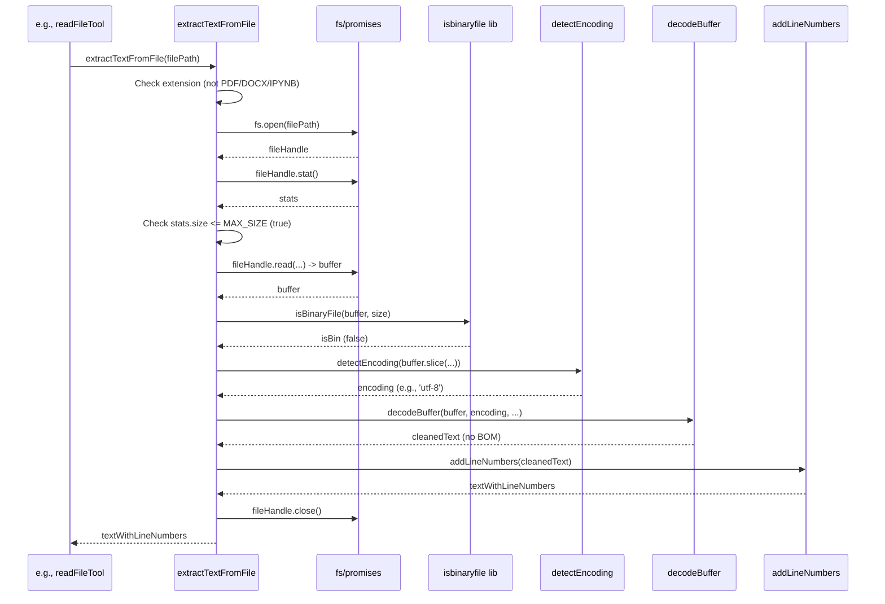

# Chapter 44: Text Extraction Utilities

Continuing from [Chapter 43: Path Utilities](43_path_utilities.md), where we focused on manipulating file path strings, this chapter delves into utilities designed to read and process the *content* of files, specifically focusing on extracting text while handling various encodings, binary data, size limits, and potential issues: the **Text Extraction Utilities**.

## Motivation: Reliably Reading Text from Diverse Files

Roo-Code frequently needs to read the content of files to provide context to the AI ([Chapter 24: Mention Handling](24_mention_handling.md), `read_file` tool [Chapter 8: Tools](08_tools.md)) or for internal analysis ([Chapter 17: Tree-sitter Integration](17_tree_sitter_integration.md)). Simply using `fs.readFile(filePath, 'utf8')` isn't always sufficient:

1.  **Encoding:** Files might not be UTF-8 encoded. Common examples include older codebases using `latin1` (ISO-8859-1) or Windows files using `windows-1252`. Reading with the wrong encoding leads to garbled text (mojibake), rendering the content useless for the AI.
2.  **Binary Files:** Attempting to read large binary files (images, executables, archives) as text can consume huge amounts of memory, produce meaningless output, and potentially crash the extension. Binary files need to be detected and skipped.
3.  **Large Files:** Reading extremely large text files (e.g., multi-megabyte logs or data files) entirely into memory can also cause performance issues or crashes. A size limit is necessary.
4.  **BOM (Byte Order Mark):** Some UTF-8 or UTF-16 files start with a BOM character (U+FEFF). While often handled correctly by modern tools, it can sometimes interfere with parsing or display if not explicitly removed.
5.  **Common Abstraction:** We need a single, robust function to handle these common issues whenever file content needs to be read as text.

The Text Extraction Utilities, primarily the `extractTextFromFile` function (located in `src/integrations/misc/extract-text.ts`), address these challenges by providing a reliable way to read text content, incorporating binary detection, basic encoding handling, size limits, and BOM removal.

**Central Use Case:** The `getFileOrFolderContent` helper (used by `parseMentions`, [Chapter 24: Mention Handling](24_mention_handling.md)) needs to read the content of a file mentioned by the user, say `@/src/legacy_system/data.csv`, which might be encoded in `latin1`.

Without Utilities:
```typescript
// Conceptual code without specific utils
import * as fs from "fs/promises";

async function readNaive(absPath: string): Promise<string | null> {
    try {
        // Problem 1: Assumes UTF-8, will garble latin1
        // Problem 2: No binary check
        // Problem 3: No size limit
        const buffer = await fs.readFile(absPath);
        // Problem 4: Doesn't handle BOM
        return buffer.toString('utf8');
    } catch (error) {
        console.error("Read failed:", error);
        return null;
    }
}
```

With Utilities:
```typescript
// Conceptual code using extractTextFromFile
import { extractTextFromFile } from "../../integrations/misc/extract-text";

async function readRobust(absPath: string): Promise<string | null> {
    try {
        // Handles binary check, encoding detection (basic), size limit, BOM
        // Will likely detect 'latin1' or fallback successfully.
        const content = await extractTextFromFile(absPath);
        return content; // Returns decoded text, or null if binary/error
    } catch (error) {
        // extractTextFromFile likely handles internal errors, but caller might need this
        console.error("Extraction failed:", error);
        return null;
    }
}
```
The `extractTextFromFile` utility encapsulates multiple checks and conversions, providing cleaner and more reliable text content.

## Key Concepts

1.  **`extractTextFromFile(filePath)`:** The core utility function found in `src/integrations/misc/extract-text.ts`. It takes an absolute file path and attempts to return its text content as a string, or `null` if it fails or detects a binary file. It also handles specific file types like PDF, DOCX, and IPYNB by dispatching to specialized extraction functions.
2.  **Binary File Detection (`isbinaryfile`):** Uses the `isbinaryfile` npm library. This library reads a portion of the file (or operates on a buffer) and uses heuristics (checking for null bytes, frequency of non-printable characters) to determine if it's likely binary. `extractTextFromFile` uses this check for generic file types.
3.  **Encoding Detection/Handling (`chardet`, Fallback):**
    *   For generic text files, it reads a portion or all of the file content into a Node.js `Buffer`.
    *   Uses the `chardet` npm library (`chardet.detect(buffer)`) to guess the encoding based on byte patterns.
    *   If `chardet` returns a result with sufficient confidence (above `ENCODING_CONFIDENCE_THRESHOLD`), that encoding name is used.
    *   Otherwise, it defaults to `'utf-8'`.
    *   Uses the standard `TextDecoder` API (`new TextDecoder(encoding, { fatal: true }).decode(buffer)`) to convert the buffer to a string using the determined encoding. The `fatal: true` option ensures errors are thrown for invalid byte sequences.
    *   Includes **fallback logic**: If decoding with the detected encoding fails, it logs a warning and attempts to decode again using `'utf-8'`. If that also fails, it returns `null`.
4.  **Size Limiting (`MAX_FILE_SIZE_BYTES`):**
    *   Uses `fs.open` and `fileHandle.stat()` to get the file size efficiently without reading the whole file initially.
    *   If the size exceeds `MAX_FILE_SIZE_BYTES` (e.g., 500KB), it reads only the first `MAX_FILE_SIZE_BYTES` using `fileHandle.read()`, logs a warning, performs encoding detection on the truncated buffer, decodes it, and returns the truncated content.
5.  **BOM Removal (`strip-bom`):** After successfully decoding the buffer (full or truncated) into a string, it uses the `strip-bom` npm library (`stripBom(string)`) to remove the leading Byte Order Mark character (U+FEFF) if present.
6.  **Specific Format Extraction (PDF, DOCX, IPYNB):**
    *   Checks the file extension.
    *   If `.pdf`, uses `pdf-parse` library to extract text.
    *   If `.docx`, uses `mammoth` library to extract raw text.
    *   If `.ipynb`, parses the JSON and concatenates content from markdown and code cells.
7.  **Line Numbering (`addLineNumbers`):** Most extraction paths (including generic text, PDF, DOCX, IPYNB) pass the extracted text through `addLineNumbers` before returning. This function prepends line numbers (e.g., `1 | ...\n2 | ...`) to the content, which is helpful for AI context and referencing.
8.  **Output Processing Utilities (`truncateOutput`, `applyRunLengthEncoding`, `processCarriageReturns`, `processBackspaces`):** The file also contains utilities primarily used for processing *terminal output* or other multi-line text before sending it to the AI, aimed at reducing noise or size:
    *   `truncateOutput`: Keeps the beginning and end of long output, replacing the middle with `[...N lines omitted...]`.
    *   `applyRunLengthEncoding`: Compresses consecutive identical lines into `<previous line repeated N times>`.
    *   `processCarriageReturns`: Simulates `\r` overwriting behavior.
    *   `processBackspaces`: Simulates destructive backspace behavior.
9.  **Error Handling & Resource Management:** Uses `try...catch...finally`. The `finally` block ensures file handles (`fs.open`) are closed (`fileHandle?.close()`). Catches errors from file operations, parsing libraries, encoding detection, decoding, and binary checks, logs them, and typically returns `null` (for `extractTextFromFile`) or an empty string/error indicator.

## Using the Text Extraction Utilities

`extractTextFromFile` is the standard way to read file content intended for text processing within Roo-Code. The output processing utilities are used specifically when formatting terminal output or potentially large text blocks for the AI.

**Example 1: `getFileOrFolderContent` (Used by Mentions)**

```typescript
// --- File: src/core/mentions/index.ts ---
import { extractTextFromFile } from "../../integrations/misc/extract-text"; // Import the utility
import * as path from "path";
import * as fs from "fs/promises";
// isBinaryFile might not be needed here as extractTextFromFile handles it
// import { isBinaryFile } from "isbinaryfile";

// ... (other imports) ...

/** Fetches content for a file or lists content for a folder */
async function getFileOrFolderContent(mentionPath: string, cwd: string): Promise<string> {
	const absPath = path.resolve(cwd, mentionPath);
	try {
		const stats = await fs.stat(absPath);
		if (stats.isFile()) {
			// *** Use extractTextFromFile for robust text reading ***
            // Handles PDF, DOCX, IPYNB, text, binary, encoding, size, BOM, and adds line numbers
			const contentWithLines = await extractTextFromFile(absPath);
            if (contentWithLines === null) {
                // Handle binary file or read/parse error (error already logged by utility)
                return `(Cannot display binary file or read error for '${mentionPath}')`;
            }
			return contentWithLines; // Already includes line numbers
		} else if (stats.isDirectory()) {
            // ... (logic for listing directory) ...
		} else {
			return `(Path '${mentionPath}' is not a file or directory)`;
		}
	} catch (error) {
		// Handle file/dir not found, permission errors etc. from fs.stat
		throw new Error(`Failed to access path "${mentionPath}": ${error.message}`);
	}
}
```
*Explanation:* `getFileOrFolderContent` calls `extractTextFromFile(absPath)`. It checks for `null` to provide a user-friendly placeholder. If content is returned, it already includes line numbers added by the utility.

**Example 2: `readFileTool`**

```typescript
// --- File: src/core/tools/readFileTool.ts ---
import { extractTextFromFile, addLineNumbers } from "../../integrations/misc/extract-text"; // Import utilities
import { formatResponse } from "../prompts/responses";
import { relativePath } from "../../utils/path";
import { readLines } from "../../integrations/misc/read-lines";
import { countFileLines } from "../../integrations/misc/line-counter";
import { parseSourceCodeDefinitionsForFile } from "../../services/tree-sitter";
// ... (other imports: Cline, ToolUse, callbacks, path, isBinaryFile) ...

export async function readFileTool(...) {
    const relPath: string | undefined = block.params.path?.toPosix();
    const startLineStr: string | undefined = block.params.start_line;
    const endLineStr: string | undefined = block.params.end_line;
    // ... (validate access, get absolutePath, displayPath) ...
    if (!relPath || !absolutePath) { /*...*/ return; }

    let toolResultXml: string;
    // ... (askApproval logic) ...
    if (!didApprove) { /*...*/ return; }

    try {
        const { maxReadFileLine = 500 } = (await cline.providerRef.deref()?.getState()) ?? {};
        const isFullRead = maxReadFileLine === -1;
        let startLine: number | undefined = startLineStr ? parseInt(startLineStr) - 1 : undefined;
        let endLine: number | undefined = endLineStr ? parseInt(endLineStr) - 1 : undefined;
        const isRangeRead = !isFullRead && (startLine !== undefined || endLine !== undefined);
        let totalLines = 0; try { totalLines = await countFileLines(absolutePath); } catch {}

        let content: string | null;
        let isFileTruncated = false;
        let sourceCodeDef = "";

        if (isRangeRead) {
            // Read specific lines using readLines utility
            content = await readLines(absolutePath, endLine, startLine);
            // Add line numbers relative to the range start
            content = addLineNumbers(content, startLine !== undefined ? startLine + 1 : 1);
        } else {
            // Use extractTextFromFile for full read or definition extraction
            const extractedContent = await extractTextFromFile(absolutePath);
            if (extractedContent === null) {
                content = null; // Was binary or error
            } else {
                // Check if truncation occurred based on totalLines vs extracted lines
                isFileTruncated = !isFullRead && totalLines > 0 && totalLines > maxReadFileLine;
                if (isFileTruncated && maxReadFileLine > 0) {
                    // ExtractTextFromFile already limited lines, just store it
                    content = extractedContent;
                } else if (isFileTruncated && maxReadFileLine === 0) {
                    // Definition-only mode: Get definitions, content will be empty
                    content = ""; // No actual content needed, just definitions
                    sourceCodeDef = await parseSourceCodeDefinitionsForFile(absolutePath, cline.rooIgnoreController) ?? "";
                } else {
                    // Full content read (or within limit)
                    content = extractedContent; // Already has line numbers
                }
            }
        }

        // --- Format Result ---
        if (content === null) {
            toolResultXml = formatResponse.toolError(`Cannot read file content (binary or error): ${displayPath}`);
        } else {
            let xmlInfo = "";
            let contentTag = "";
            if (isFileTruncated) { /* Add truncation/definition notice to xmlInfo */ }
            if (content === "" && totalLines === 0) { /* Add empty file notice to xmlInfo, contentTag = <content/> */ }
            else if (isRangeRead || maxReadFileLine !== 0) { /* Create <content lines="..."> tag */ }
            // Combine result
            toolResultXml = `<file><path>${displayPath}</path>\n${contentTag}${xmlInfo}</file>`;
        }

    } catch (error) { /* ... handle errors ... */ }
    pushToolResult(toolResultXml);
}
```
*Explanation:* The logic is complex due to handling range reads (`readLines`) separately from full reads/definition extraction (`extractTextFromFile`, `parseSourceCodeDefinitionsForFile`). When *not* doing a range read, it calls `extractTextFromFile`. It checks for `null`, determines if truncation happened based on the result vs. `totalLines` (from `countFileLines`), formats the content (which includes line numbers from `extractTextFromFile` or `addLineNumbers`), adds truncation/definition notices if needed, and wraps everything in the XML structure.

**Example 3: Processing Terminal Output (`executeCommandTool`)**

```typescript
// --- File: src/core/tools/executeCommandTool.ts ---
import { truncateOutput, applyRunLengthEncoding, processCarriageReturns, processBackspaces } from "../../integrations/misc/extract-text";
// ... other imports ...

export async function executeCommandTool(...) {
    // ... (validation, approval, terminal execution) ...
    // Assume 'fullOutput' contains the raw output captured by TerminalProcess

    // Get line limit from settings
    const { terminalOutputLineLimit = 200 } = (await cline.providerRef.deref()?.getState()) ?? {};

    // Apply processing steps
    let processedOutput = processCarriageReturns(fullOutput); // Handle \r
    processedOutput = processBackspaces(processedOutput);     // Handle \b
    processedOutput = applyRunLengthEncoding(processedOutput); // Compress repeats
    processedOutput = truncateOutput(processedOutput, terminalOutputLineLimit > 0 ? terminalOutputLineLimit : undefined); // Truncate

    const result = `Command:\n\`\`\`sh\n${command}\n\`\`\`\nExit Code: ${exitCode ?? 'Unknown'}${signal ? ` (Signal: ${signal})`:''}\nOutput:\n\`\`\`\n${processedOutput || "(No output)"}\n\`\`\``;
    pushToolResult(result);
}
```
*Explanation:* After capturing the raw `fullOutput` from the terminal, the tool applies `processCarriageReturns`, `processBackspaces`, `applyRunLengthEncoding`, and `truncateOutput` (using the configured line limit) to clean and condense the output before sending it back to the AI.

## Code Walkthrough

### Text Extraction Function (`src/integrations/misc/extract-text.ts`)

*(See updated code in Key Concepts section above - includes PDF/DOCX/IPYNB dispatch and better size limit handling)*

**Key Implementation Details:**

1.  **Extension Dispatch:** Checks extension (`.pdf`, `.docx`, `.ipynb`) first and calls specific helper functions (`extractTextFromPDF`, `extractTextFromDOCX`, `extractTextFromIPYNB`).
2.  **Specialized Extractors:** These helpers use dedicated libraries (`pdf-parse`, `mammoth`, JSON parsing) to get text content.
3.  **Generic Logic (for other extensions):**
    *   Uses `fs.open`/`stat`/`read` for efficient size checking and partial reads.
    *   Calls `isBinaryFile` on the buffer.
    *   Handles size limit truncation.
    *   Calls `detectEncoding` (using `chardet`).
    *   Calls `decodeBuffer` (using `TextDecoder` with fallback and `stripBom`).
4.  **Line Numbering (`addLineNumbers`):** This function is now called *after* text is successfully extracted by *any* method (generic, PDF, DOCX, IPYNB). It splits the content by `\n`, adds `N | ` prefixes (with padding), and rejoins. Handles empty content and trailing newlines correctly.
5.  **Output Processing Utilities:** `truncateOutput`, `applyRunLengthEncoding`, `processCarriageReturns`, `processBackspaces` are separate functions primarily for terminal output, implementing their specific logic using string manipulation and regex.

### Line Counter (`src/integrations/misc/line-counter.ts`)

*(See full code in chapter context)*

*   Uses Node.js streams (`fs.createReadStream`) and `readline.createInterface` to efficiently count lines without loading the whole file.
*   Increments `lineCount` on each `rl.on("line")` event.
*   Resolves the promise with the total count on `rl.on("close")`. Handles errors.

### Line Reader (`src/integrations/misc/read-lines.ts`)

*(See full code in chapter context)*

*   Reads a specific range of lines (`startLine` to `endLine`) efficiently using streams.
*   Validates input parameters (`startLine`, `endLine`).
*   Uses `fs.createReadStream` and `readline.createInterface` (similar to `countFileLines`).
*   Accumulates lines within the requested range (`lineCount >= effectiveStartLine && lineCount <= endLine`) into a `result` string.
*   Stops reading early (`input.destroy()`) if `endLine` is reached.
*   Handles end-of-file logic correctly.
*   Rejects promise if the requested range is invalid or no lines are found within it.

## Internal Implementation

*   **`extractTextFromFile`:** Acts as a dispatcher based on extension, falling back to a generic binary/encoding/size check logic. Uses `fs.open` for efficient stat/read. Delegates decoding to `TextDecoder`. Delegates binary check to `isbinaryfile`, encoding guess to `chardet`, BOM removal to `strip-bom`. Calls `addLineNumbers` before returning.
*   **`addLineNumbers`:** Simple string splitting, mapping with padding, and joining.
*   **Output Processors:** Use string manipulation (`indexOf`, `lastIndexOf`, `slice`, `substring`, `replace`) and regex (`split`, `match`, `replace`) for their specific tasks (truncation, RLE, CR/BS handling).

**Sequence Diagram (`extractTextFromFile` - Text File within Limit):**



## Modification Guidance

Modifications involve adding support for more file types, tuning parameters, or refining output processing.

1.  **Supporting More File Types (e.g., `.odt`):**
    *   **Find Library:** Find a suitable Node.js library for extracting text from ODT files (e.g., potentially using `libreoffice-convert` via child process, or a dedicated ODT parser).
    *   **Create Helper:** Create `async function extractTextFromODT(filePath): Promise<string>`. Implement using the chosen library. Include error handling.
    *   **Modify `extractTextFromFile`:** Add `case ".odt": return addLineNumbers(await extractTextFromODT(filePath));` to the initial `switch` statement.
    *   **Dependencies:** Add the necessary library to `package.json`.

2.  **Adjusting Output Truncation (`truncateOutput`):**
    *   **Modify Logic:** Change the percentages (currently 20% start, 80% end) or the total `lineLimit`. For example, make it 50%/50% or add a minimum number of lines to keep at each end.
    *   **Add Options:** Allow passing the start/end percentages as optional parameters.

3.  **Changing Line Number Format:**
    *   **Modify `addLineNumbers`:** Change the padding logic (`padStart`), the separator (`|`), or the starting line number calculation if needed.

**Best Practices:**

*   **Use Specific Libraries:** For complex formats like PDF, DOCX, IPYNB, rely on dedicated parsing libraries rather than trying to handle them manually.
*   **Combine Checks:** `extractTextFromFile` effectively combines binary checks, encoding handling, size limiting, and BOM stripping into one robust function.
*   **Add Line Numbers Last:** Apply `addLineNumbers` after all content extraction and cleaning is complete to ensure accurate numbering of the final text.
*   **Output Processing Separation:** Keep utilities for processing generic multi-line text (like terminal output truncation/compression) separate from the file *extraction* logic, as they serve different purposes.
*   **Streaming for Large Files:** For truly massive files where even `MAX_FILE_SIZE_BYTES` is too small or reading the initial chunk is slow, investigate using Node.js readable streams (`fs.createReadStream`) throughout the process (encoding detection libraries might support streams, decoding can happen chunk-by-chunk). This adds significant complexity.

**Potential Pitfalls:**

*   **Library Errors:** External libraries (`pdf-parse`, `mammoth`, `chardet`, `isbinaryfile`) might have bugs, limitations, or fail on corrupted files. Robust `try...catch` is needed.
*   **Encoding/Binary Detection Limits:** Heuristics are not foolproof.
*   **Size Limit Tradeoffs:** Truncation inevitably loses information.
*   **Line Numbering on Partial Content:** Ensure `addLineNumbers` is called correctly with the appropriate `startLine` offset when dealing with truncated content or specific line ranges (`readLines`).
*   **Performance of Output Processing:** Applying multiple regex replacements (`processCarriageReturns`, `processBackspaces`, `applyRunLengthEncoding`) on very large terminal outputs could be slow.

## Conclusion

The Text Extraction Utilities provide essential functions for safely and reliably converting file content into usable text for Roo-Code. `extractTextFromFile` acts as a central dispatcher, handling various file types (PDF, DOCX, IPYNB, generic text), incorporating crucial checks for binary files, size limits, common encodings, and BOMs, and adding line numbers for context. Additional utilities help process and condense potentially noisy multi-line text like terminal output. These utilities are vital for ensuring the quality and reliability of context provided to the AI and for features like code analysis that depend on accurate text content.

Next, we examine how Roo-Code renders structured Markdown content, including code blocks and diagrams, within the WebView UI: [Chapter 46: Markdown Rendering](46_markdown_rendering.md).

Relevant Code Snippets (Code itself remains unchanged):
--- File: src/integrations/misc/extract-text.ts ---
--- File: src/integrations/misc/line-counter.ts ---
--- File: src/integrations/misc/read-lines.ts ---
```

