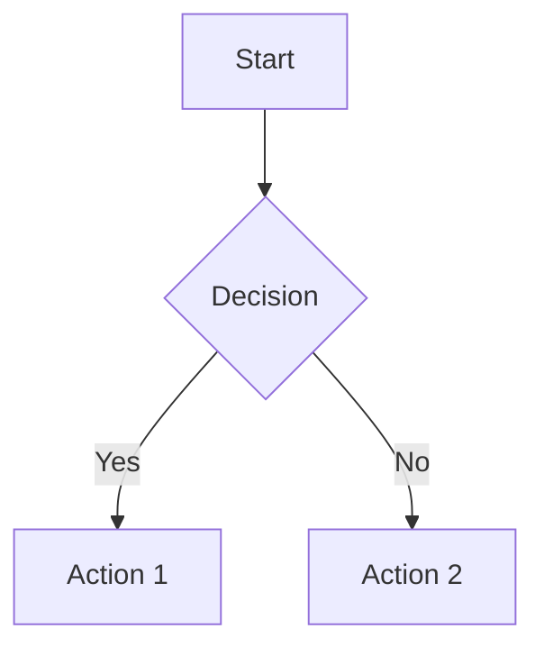
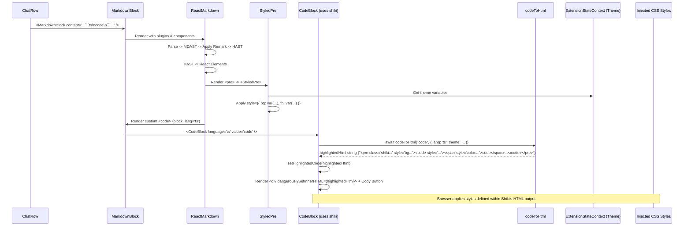
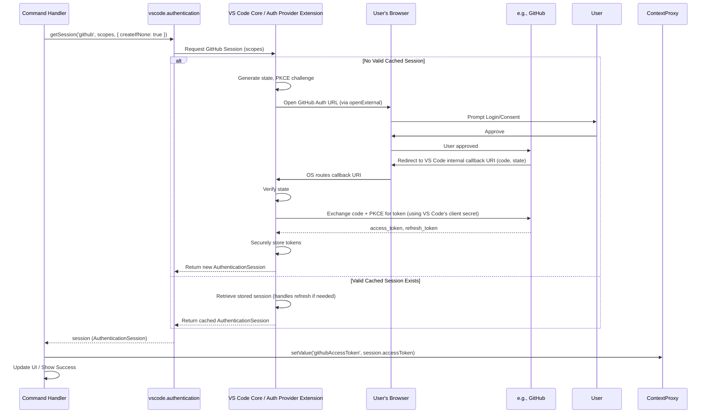
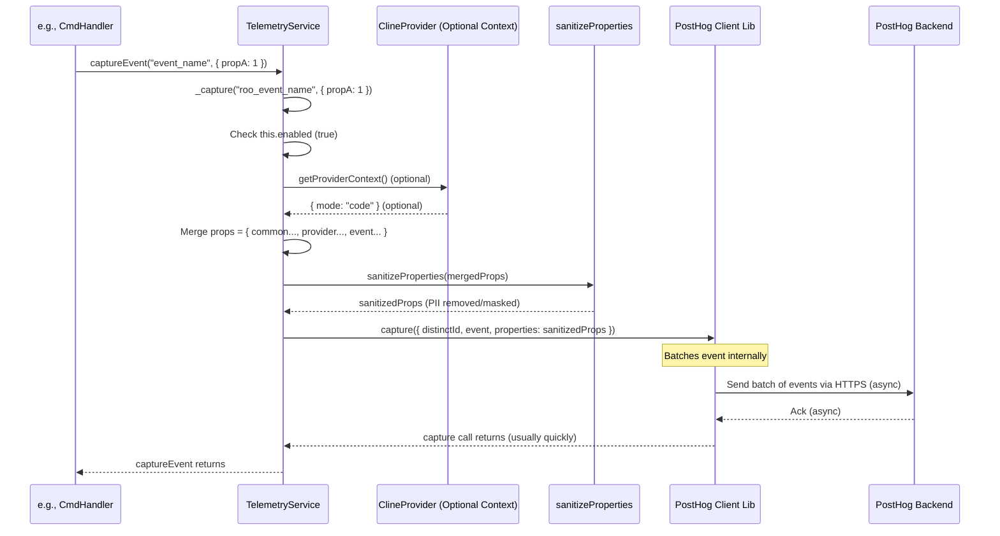
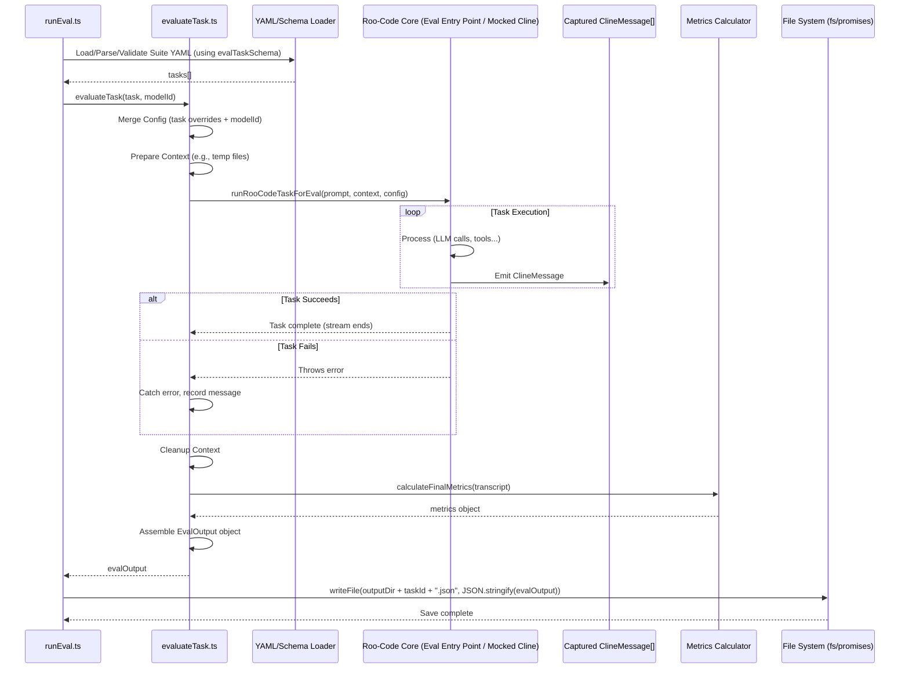

# Chapter 46: Markdown Rendering

Continuing from [Chapter 45: Text Normalization Utilities](45_text_normalization_utilities.md), where we explored cleaning and standardizing text, this chapter focuses on how Roo-Code takes structured text, specifically Markdown, and renders it as visually rich content within the WebView UI: **Markdown Rendering**.

## Motivation: Displaying Rich AI Responses

Large Language Models (LLMs) frequently generate responses using Markdown syntax to structure text, emphasize points, create lists, display code blocks, include links, and sometimes even embed diagrams (like Mermaid). Simply displaying the raw Markdown text (`# Heading\n* List item\n\`code\``) in the chat UI ([Chapter 34: Chat UI Components (WebView)](34_chat_ui_components__webview_.md)) would be difficult to read and lose the intended formatting.

Roo-Code needs a robust mechanism within its [Chapter 1: WebView UI](01_webview_ui.md) to parse Markdown strings and render them as corresponding HTML elements, applying appropriate styling consistent with the VS Code theme. This includes handling:

*   Standard Markdown elements (headings, lists, bold, italics, links, blockquotes).
*   Syntax highlighting for code blocks within the Markdown.
*   Rendering specialized diagrams defined using Mermaid syntax within code blocks.

**Central Use Case:** The AI assistant responds with a message containing Markdown:

```markdown
Here's a summary:

*   **Point 1:** Explanation...
*   **Point 2:** Check the `config.js` file.

```typescript
function setup() {
  console.log("Setup complete!");
}
```

And here's a diagram:

```

The Chat UI components need to display this not as raw text, but as properly rendered HTML, with the TypeScript code block syntax-highlighted according to the current VS Code theme, and the Mermaid diagram rendered as an SVG image, also respecting the theme.

## Key Concepts

1.  **Markdown Parsing (`react-markdown`/`remark`):** Roo-Code utilizes the `react-markdown` library. This library leverages the `remark` ecosystem (including `unified`, `remark-parse`, `remark-rehype`, `rehype-react`) to parse Markdown strings into a Markdown Abstract Syntax Tree (MDAST), transform it into an HTML Abstract Syntax Tree (HAST), and finally render it as React elements. This provides a flexible and extensible pipeline for processing Markdown.

2.  **Syntax Highlighting (`rehype-highlight`):** To apply syntax highlighting to code blocks (e.g., ` ```typescript ... ``` `), the `rehype-highlight` plugin is integrated into the `react-markdown` processing pipeline. It utilizes the popular `highlight.js` library under the hood to parse code and add CSS classes to tokens.

3.  **Theme Integration (Highlighting):** Achieving syntax highlighting that precisely matches the user's current VS Code theme is crucial for visual consistency. This involves several parts:
    *   **Theme Data:** The extension host obtains detailed theme information (token colors based on TextMate scopes) using VS Code APIs.
    *   **Theme Message:** This theme data is sent to the WebView via the `theme` message ([Chapter 3: Webview/Extension Message Protocol](03_webview_extension_message_protocol.md)).
    *   **State Storage:** The received theme data is stored in the `ExtensionStateContext` ([Chapter 12: ExtensionStateContext](12_extensionstatecontext.md)).
    *   **CSS Generation (`textMateToHljs.ts`):** The `convertTextMateToHljs` utility (`webview-ui/src/utils/textMateToHljs.ts`) takes the theme data (specifically the token color rules). It maps TextMate scopes (e.g., `keyword.control`, `string.quoted`) to the CSS classes that `highlight.js` generates (e.g., `.hljs-keyword`, `.hljs-string`). It generates CSS rules where the `color` property uses the corresponding **VS Code CSS variable** (e.g., `var(--vscode-symbolIcon-keywordForeground, #fallback)`) provided in the theme data.
    *   **CSS Injection:** The generated CSS string is dynamically injected into a `<style>` tag within the WebView's `<head>`, likely managed by a top-level component like `App.tsx` that listens for theme changes in the context.
    *   **`StyledPre` Component:** A custom React component (`webview-ui/src/components/common/StyledPre.tsx`) is used via `react-markdown`'s `components` prop to render the outer `<pre>` tag of code blocks. It applies the necessary base class (`hljs`) for the injected CSS rules to take effect and sets the background/foreground color using editor theme variables (`--vscode-editor-background`, `--vscode-editor-foreground`) obtained from the context.

4.  **Mermaid Diagram Rendering (`MermaidBlock.tsx`):**
    *   **Detection:** The custom `code` renderer provided to `react-markdown` checks the language class name. If it finds `language-mermaid`, it intercepts rendering.
    *   **Rendering Component:** It renders the dedicated `MermaidBlock` component (`webview-ui/src/components/common/MermaidBlock.tsx`), passing the raw Mermaid code string.
    *   **`mermaid` Library:** `MermaidBlock` uses the `mermaid` JavaScript library for parsing and rendering.
    *   **Initialization & Rendering:** It calls `mermaid.initialize` on mount, configuring theme settings (`theme`, `themeVariables`) based on the current VS Code theme (light/dark) obtained from context, mapping Mermaid theme properties to VS Code CSS variables (e.g., `lineColor: 'var(--vscode-editor-foreground)'`). It uses `useDebounceEffect` to asynchronously call `mermaid.parse` and `mermaid.render` when the diagram code changes, updating state with the generated SVG string.
    *   **Display:** The SVG is rendered using `dangerouslySetInnerHTML`. Error states are handled.
    *   **Interaction:** An `onClick` handler uses canvas APIs to convert the rendered SVG to a PNG data URL and sends an `openImage` message to the host, allowing the user to view/save a larger version of the diagram.

5.  **Custom Plugins (`remarkUrlToLink`):** The `react-markdown` pipeline is extended with custom Remark plugins. `remarkUrlToLink` (`webview-ui/src/utils/remark-url-to-link.ts`) automatically detects plain URLs within text nodes and transforms them into clickable Markdown link nodes (`<a>` tags).

6.  **`MarkdownBlock.tsx` Component:** The primary component (`webview-ui/src/components/common/MarkdownBlock.tsx`) orchestrating this process.
    *   **Props:** Takes the raw Markdown `content` string.
    *   **`ReactMarkdown` Setup:** Configures the `ReactMarkdown` component with necessary plugins and custom renderers.
    *   **Plugins:** Includes `remarkGfm` (for tables, strikethrough, etc.), `remarkUrlToLink`, and `rehypeHighlight` (configured with a subset of common languages for optimization).
    *   **Custom Renderers (`components` prop):** Crucially overrides the default rendering for specific HTML tags:
        *   `pre`: Uses `StyledPre` for themed container styling and the `hljs` base class.
        *   `code`: Implements the logic to detect `language-mermaid` (rendering `MermaidBlock`), style inline code (` `` `) using themed Tailwind classes, or pass block code through (letting `rehypeHighlight` handle inner spans and `StyledPre` handle the container).
        *   `a`: Overrides link rendering to ensure `target="_blank"` and potentially add styling or icons.
        *   Also includes custom rendering for `p`, `hr`, `ol`, `ul`, `blockquote` using appropriate structural components or adding specific styling classes.

## Using Markdown Rendering

The primary consumer is the `ChatRow` component ([Chapter 34: Chat UI Components (WebView)](34_chat_ui_components__webview_.md)), which displays messages containing Markdown text.

**Example within `ChatRow.tsx`:**

```typescript
// --- File: webview-ui/src/components/chat/ChatRow.tsx ---
// ... other imports ...
import MarkdownBlock from "../common/MarkdownBlock"; // Import the main rendering component

// ... inside the component's render logic ...

// Simplified example for text messages
function renderMessageContent(message: ClineMessage) {
    if (message.type === 'say' && message.say === 'text' && message.text) {
        return <MarkdownBlock content={message.text} />;
    }
    if (message.type === 'ask' && message.ask === 'followup' && message.text) {
         return (
             <>
                 <MarkdownBlock content={message.text} />
                 {/* <FollowUpSuggest suggestions={...} /> */}
             </>
         );
    }
    // ... other message types ...
    return null; // Or some default rendering
}

// ... later in ChatRow render ...
<div className="message-content">
    {renderMessageContent(message)}
</div>
```

**Explanation:**

*   `ChatRow` identifies messages that contain Markdown (`say: "text"`, `ask: "followup"`).
*   It passes the raw `message.text` string to the `content` prop of the `MarkdownBlock` component.
*   `MarkdownBlock` handles the entire rendering pipeline: parsing, plugin application, custom component rendering (including `StyledPre`, `MermaidBlock`, inline code styling), producing the final themed HTML output.

## Code Walkthrough

*(Referencing code snippets provided in previous chapters and chapter context)*

### `MarkdownBlock.tsx` (`webview-ui/src/components/common/MarkdownBlock.tsx` or `webview-ui/src/components/ui/markdown/Markdown.tsx`)

*Note: Two different potential paths/implementations were seen in previous context. We'll assume the one using `ReactMarkdown` and custom components.*

```typescript
// --- File: webview-ui/src/components/common/MarkdownBlock.tsx (Conceptual Combination) ---
import React from "react"
// Use react-markdown
import ReactMarkdown, { Options } from "react-markdown"
import remarkGfm from "remark-gfm"
// Import plugins and custom components
import rehypeHighlight from "rehype-highlight"
import remarkUrlToLink from "@src/utils/remark-url-to-link"
import { StyledPre } from "./StyledPre"
import MermaidBlock from "./MermaidBlock"
import { CodeBlock } from "./CodeBlock" // Assuming CodeBlock handles just the code part with copy button
import { Blockquote } from "./Blockquote" // Assuming custom blockquote style component
import { Separator } from "../ui/separator" // Assuming shadcn separator

// ... HIGHLIGHT_LANGUAGES definition ...

interface MarkdownBlockProps {
	content: string
}

const MemoizedReactMarkdown = React.memo(ReactMarkdown, /* custom comparison if needed */);

const MarkdownBlock = ({ content }: MarkdownBlockProps) => {
	return (
		<MemoizedReactMarkdown
			className="custom-markdown break-words" // Base class for general styling
			remarkPlugins={[remarkGfm, remarkUrlToLink]}
			rehypePlugins={[[rehypeHighlight, { detect: true, languages: HIGHLIGHT_LANGUAGES, ignoreMissing: true }]]}
			components={{
                // Structure Elements
				p: ({ children }) => <div className="mb-2 last:mb-0">{children}</div>,
                hr: () => <Separator className="my-4" />, // Use shadcn separator
                ol: ({ children }) => <ol className="list-decimal pl-4 ...">{children}</ol>,
                ul: ({ children }) => <ul className="list-disc pl-4 ...">{children}</ul>,
                blockquote: ({ children }) => <Blockquote>{children}</Blockquote>, // Custom styled blockquote
                // Code Elements
				pre: StyledPre, // Use themed container for code blocks
				code({ node, inline, className, children, ...props }) {
					const match = /language-(\w+)/.exec(className || "");
					const language = match?.[1];
					const codeContent = String(children).replace(/\n$/, ""); // Clean code content

					// Mermaid detection
					if (language === "mermaid") {
						return <MermaidBlock code={codeContent} />;
					}

					// Inline code styling
					if (inline) {
						return (
							<code className="bg-vscode-textBlockQuote-background border ... font-mono" {...props}>
								{children}
							</code>
						);
					}

					// Block code rendering (use CodeBlock component for highlighting + copy button)
					// Pass language even if detection failed (might default in CodeBlock)
					return match ? (
                        <CodeBlock
                            language={language || ""}
                            value={codeContent}
                            className="rounded-xs p-3 mb-2" // Styling for CodeBlock container
                         />
                    ) : (
                        // Render as plain code within StyledPre if no language detected
                        <code className={className} {...props}>{children}</code>
                    );
				},
                // Links
				a: ({ href, children }) => (
                    <a href={href} target="_blank" rel="noopener noreferrer" title={href}>
                        {children}
                    </a>
                ),
			}}
		>
			{content}
		</MemoizedReactMarkdown>
	)
}

export default MarkdownBlock;
```

**Explanation:**

*   **Uses `ReactMarkdown`:** The core component for parsing and rendering.
*   **Plugins:** Enables GFM, custom URL linking, and `highlight.js` syntax highlighting.
*   **Components Override:** Provides custom renderers:
    *   `p`, `hr`, `ol`, `ul`, `blockquote`: Apply basic structure and spacing using `div` or list elements with Tailwind classes, or use custom styled components like `Blockquote` and `Separator`.
    *   `pre`: Delegates to `StyledPre` for themed container.
    *   `code`: Contains the core logic:
        *   Detects `language-mermaid` and renders `MermaidBlock`.
        *   Applies specific inline styles for inline code (` `` `).
        *   For block code, it now renders the dedicated `CodeBlock` component (which likely uses `shiki` or `rehype-highlight` internally *again* but adds features like a copy button). If no language match, renders plain code.
    *   `a`: Renders standard links, ensuring they open in a new tab.
*   **Memoization:** Wraps with `React.memo` for performance.

### `StyledPre.tsx` (`webview-ui/src/components/common/StyledPre.tsx`)

*(See Code Walkthrough in Chapter 46 - Key Concepts)*
*   **Purpose:** Renders the `<pre>` tag.
*   **Styling:** Applies `hljs` class. Sets `backgroundColor` and `color` using inline styles derived from VS Code theme variables (`--vscode-editor-background`, `--vscode-editor-foreground`) obtained via `useExtensionState`. Includes padding, overflow, etc.

### `CodeBlock.tsx` (`webview-ui/src/components/ui/markdown/CodeBlock.tsx`)

*(Code provided in Chapter 33 context - uses `shiki`)*

*   **Purpose:** Renders a single code block, specifically handling syntax highlighting (using `shiki`) and adding a Copy button. Used by `MarkdownBlock`'s custom `code` renderer.
*   **Imports:** `shiki` for highlighting, `useClipboard` hook, `Button`, icons.
*   **State:** `highlightedCode` (stores HTML string from `shiki`).
*   **Highlighting (`useEffect`):** Calls `shiki.codeToHtml` asynchronously when `value` or `language` changes. Specifies theme (hardcoded `github-dark` in snippet, but **should ideally use VS Code theme** dynamically) and transformers (to add classes, remove default background). Sets `highlightedCode` state.
*   **Rendering:** Uses `dangerouslySetInnerHTML` to render the HTML from `shiki`. Includes an absolutely positioned `Button` using the `useClipboard` hook for copying the raw `value`.

*Self-Correction:* The provided `CodeBlock` uses `shiki`, while `MarkdownBlock` uses `rehype-highlight`. This indicates a potential inconsistency or duplication in highlighting logic. Ideally, one consistent method should be used. If `CodeBlock` is the preferred component (due to the copy button), `MarkdownBlock`'s `code` renderer should *always* render `CodeBlock` for non-inline, non-mermaid code, passing the language and content. `rehype-highlight` might still be useful within `ReactMarkdown` for *inline* code if needed, or removed entirely if `CodeBlock` handles all block highlighting. Assuming `CodeBlock` (using `shiki`) is preferred for blocks:

**Revised `MarkdownBlock.tsx` `code` renderer:**

```typescript
                // ... inside components prop ...
				code({ node, inline, className, children, ...props }) {
					const match = /language-(\w+)/.exec(className || "");
					const language = match?.[1];
					const codeContent = String(children).replace(/\n$/, "");

					if (language === "mermaid") {
						return <MermaidBlock code={codeContent} />;
					}

					if (inline) {
                        // Keep styling for inline code
						return ( <code className="bg-vscode-textBlockQuote-background ..." {...props}>{children}</code> );
					}

                    // Use CodeBlock component for ALL block code
					return match ? (
                        <CodeBlock
                            language={language || ""} // Pass detected language
                            value={codeContent}
                            className="rounded-xs mb-2" // Styling for container div
                         />
                    ) : (
                         // Fallback for code blocks without language? Render plain or default lang?
                         <CodeBlock
                            language="" // Or a default like 'plaintext'
                            value={codeContent}
                            className="rounded-xs mb-2"
                         />
                    );
				},
                // ... rest of components ...
```
This revised logic uses `CodeBlock` for all block-level code, ensuring consistent highlighting (via `shiki`) and the copy button. `rehype-highlight` could potentially be removed from `MarkdownBlock`'s plugins if only used for block code.

### `MermaidBlock.tsx` (`webview-ui/src/components/common/MermaidBlock.tsx`)

*(See Code Walkthrough in Chapter 46 - Key Concepts)*
*   Handles `language-mermaid` blocks specifically.
*   Uses `mermaid` library, initializes with theme variables based on VS Code theme.
*   Renders SVG asynchronously using `mermaid.parse` and `mermaid.render`.
*   Provides click-to-copy-as-PNG functionality.

### Theme CSS Generation (`webview-ui/src/utils/textMateToHljs.ts`)

*(See Code Walkthrough in Chapter 46 - Key Concepts)*
*   Generates CSS rules targeting `.hljs-*` classes.
*   **Must use `var(--vscode-...)` variables** in the generated CSS `color` properties to ensure dynamic theme adaptation. Fallback hex codes are used if variable mapping fails.
*   Injects styles into the WebView head.

## Internal Implementation

1.  **Component Call:** `ChatRow` -> `<MarkdownBlock content="..." />`.
2.  **Parsing & AST:** `ReactMarkdown` parses content -> MDAST.
3.  **Remark Plugins:** `remarkGfm`, `remarkUrlToLink` transform MDAST.
4.  **HAST Conversion:** MDAST -> HAST.
5.  **Rehype Plugins:** (If `rehypeHighlight` is still used for *inline* code or as fallback) Processes HAST, adding classes to inline code spans if needed.
6.  **React Element Creation:** HAST -> React Elements.
7.  **Custom Renderers:**
    *   `<pre>` -> `StyledPre` renders `<pre class="hljs" style={{ bg/fg from theme }}>`.
    *   `<code>` -> Logic runs:
        *   Mermaid? -> `MermaidBlock` renders (initializes mermaid, async SVG render).
        *   Inline? -> Renders `<code class="themed-inline-styles">`.
        *   Block? -> `CodeBlock` renders (uses `shiki` async to get HTML with `.shiki` spans, adds Copy button).
8.  **Styling Application:**
    *   Browser applies themed styles from injected CSS to `.hljs-*` or `.shiki` spans within code blocks.
    *   Browser applies inline styles from `StyledPre` (background/foreground).
    *   Browser applies themed Tailwind classes to inline code, blockquotes, etc.
    *   Mermaid SVG uses colors derived from VS Code variables set during `mermaid.initialize`.

**Sequence Diagram (Rendering Markdown with Shiki Code Block):**



## Modification Guidance

Modifications typically involve changing highlighting libraries/themes, adding Markdown features, or customizing rendering.

1.  **Switching Highlighting Library (e.g., from `rehype-highlight` to only `shiki` via `CodeBlock`):**
    *   **`MarkdownBlock.tsx`:** Remove `rehypeHighlight` from `rehypePlugins`. Ensure the custom `code` renderer *always* uses `CodeBlock` for block-level code (as shown in the revised example above).
    *   **`StyledPre.tsx`:** Might no longer be strictly necessary if `CodeBlock`'s output includes the `<pre>` tag with its own background styling (Shiki often does this). You could potentially remove the `pre: StyledPre` override in `MarkdownBlock`. Verify styling consistency.
    *   **Theme CSS (`textMateToHljs.ts`):** This becomes irrelevant if `shiki` is used, as `shiki` handles theme mapping internally based on the theme name passed to `codeToHtml`. Ensure the theme name passed to `shiki` correctly corresponds to the VS Code theme.

2.  **Adding KaTeX Support for Math Equations:**
    *   **Install Plugins:** `npm install remark-math rehype-katex`
    *   **Install CSS:** Include KaTeX CSS in the WebView (`index.html` or import).
    *   **`MarkdownBlock.tsx`:**
        *   Import `remarkMath` and `rehypeKatex`.
        *   Add `remarkMath` to `remarkPlugins`.
        *   Add `rehypeKatex` to `rehypePlugins`.
    *   **Usage:** AI can now generate math like `$E=mc^2$` or `$$...$$`.

3.  **Customizing Inline Code Style:**
    *   **`MarkdownBlock.tsx`:** Modify the Tailwind classes applied to the `<code>` element within the `if (inline)` block of the custom `code` renderer. Use different background/border/text color classes mapped to VS Code variables.

4.  **Changing Mermaid Theme:**
    *   **`MermaidBlock.tsx`:** Modify the `mermaid.initialize` call. Change the base `theme` ('dark'/'light') or update the `themeVariables` mapping to use different VS Code CSS variables.

**Best Practices:**

*   **Use Plugins:** Leverage Remark/Rehype for syntax extensions (GFM, Math, Auto-linking).
*   **Consistent Highlighting:** Choose one primary highlighting library (`highlight.js` via `rehype-highlight` OR `shiki` via `CodeBlock`) and use it consistently for blocks to avoid conflicts or duplicated effort. `shiki` generally provides more accurate highlighting matching VS Code's TextMate engine.
*   **Theme Variables:** Maximize use of VS Code CSS variables for theming (`StyledPre`, Mermaid config, generated CSS for `highlight.js`). If using `shiki`, pass the appropriate theme name corresponding to the VS Code theme.
*   **Performance:** Use `React.memo`. Be mindful of plugin overhead. Use language subsets for `rehype-highlight` if used. Debounce expensive operations like Mermaid rendering.
*   **Security:** Sanitize Markdown content if it could originate from untrusted sources, especially if enabling raw HTML (`rehype-raw` - **generally avoid**). Be cautious with `dangerouslySetInnerHTML`.

**Potential Pitfalls:**

*   **Highlighting Inconsistency:** Using multiple highlighters (`rehype-highlight` and `shiki`) can lead to slightly different results or performance overhead. Standardizing is better.
*   **Theme Mismatches:** Failure to correctly map TextMate scopes to CSS variables (for `highlight.js`) or pass the right theme name (for `shiki`) will result in inaccurate highlighting colors. Failure to inject the CSS will break `highlight.js` styling.
*   **Mermaid Errors:** Invalid syntax or initialization failures.
*   **Plugin Conflicts:** Order matters; plugins can interfere.
*   **Large Content:** Rendering extremely large Markdown documents might impact UI performance.

## Conclusion

Markdown Rendering is essential for presenting AI responses clearly and effectively in the Roo-Code WebView UI. By utilizing the `react-markdown` ecosystem, integrating syntax highlighting (preferentially with `shiki` via `CodeBlock` for accuracy and features like copy buttons), dynamically applying theme-based styles using VS Code CSS variables (`StyledPre`, Mermaid config), and handling special cases like Mermaid diagrams (`MermaidBlock`), Roo-Code achieves rich Markdown display. Custom plugins enhance functionality like auto-linking URLs. Careful integration ensures visual consistency, providing a seamless experience for viewing complex formatted text, code, and diagrams within chat messages.

Having covered the core components and utilities for both the extension host and the WebView UI, the next chapter looks at the system for managing configuration import and export: [Chapter 47: Configuration Import/Export](47_configuration_import_export.md).
---
# Chapter 47: Configuration Import/Export

Continuing from [Chapter 46: Markdown Rendering](46_markdown_rendering.md), where we explored how Roo-Code displays formatted Markdown, we now shift to a higher-level feature related to managing the user's overall setup: **Configuration Import/Export**.

## Motivation: Sharing, Backing Up, and Migrating Settings

As users customize Roo-Code, they configure various settings: API keys and profiles ([Chapter 9: ProviderSettingsManager](09_providersettingsmanager.md)), custom modes ([Chapter 10: CustomModesManager](10_custommodesmanager.md)), UI preferences, tool behavior defaults ([Chapter 35: Settings UI Components (WebView)](35_settings_ui_components__webview_.md)), experimental flags, etc. Users may want to:

1.  **Backup:** Create a backup of their entire configuration for safekeeping.
2.  **Migrate:** Transfer their settings easily to a different machine or VS Code installation (e.g., using Settings Sync or manually).
3.  **Share:** Share specific parts of their configuration (like custom modes or non-sensitive API profile settings) with colleagues or the community.
4.  **Troubleshooting:** Export their settings (potentially excluding sensitive keys) to help diagnose issues.

Implementing individual export/import mechanisms for each type of setting would be cumbersome. A unified import/export system provides a convenient way to manage the application's configuration state as a whole or in logical parts.

Roo-Code provides commands and underlying logic to export the current configuration (excluding sensitive secrets like API keys) to a JSON file and import settings from such a file, overwriting existing configurations.

**Central Use Case:** A user has spent time creating several custom modes and configuring specific API profiles (without keys). They want to use the same setup on their laptop.

1.  **Export:** On their primary machine, the user opens the VS Code Command Palette (`Ctrl+Shift+P`) and runs the command "Roo Code: Export Settings".
2.  The command handler triggers the export logic (`exportRooSettings`).
3.  This logic gathers all relevant non-sensitive settings:
    *   Calls `ContextProxy.export()` ([Chapter 11: ContextProxy](11_contextproxy.md)) to get settings from `globalState` (using `globalSettingsExportSchema` which omits sensitive/dynamic fields).
    *   Calls `ProviderSettingsManager.export()` ([Chapter 9: ProviderSettingsManager](09_providersettingsmanager.md)) to get the structure of API profiles *excluding* the actual API keys.
    *   Calls `CustomModesManager.getGlobalCustomModes()` ([Chapter 10: CustomModesManager](10_custommodesmanager.md)) to get global custom modes.
4.  It combines this data into a single JSON object (e.g., `{ version: "...", globalSettings: {...}, apiProfiles: {...}, globalCustomModes: [...] }`).
5.  It prompts the user for a location to save the file using `vscode.window.showSaveDialog`.
6.  It writes the JSON object to the selected file (e.g., `roo-code-settings.json`) using file system utilities ([Chapter 42: File System Utilities](42_file_system_utilities.md)).
7.  **Import:** On their laptop, the user runs the "Roo Code: Import Settings" command.
8.  The command handler triggers the import logic (`importRooSettings`). It prompts the user to select the previously exported `roo-code-settings.json` file using `vscode.window.showOpenDialog`.
9.  It reads the JSON file content.
10. It validates the structure of the imported JSON using a Zod schema ([Chapter 40: Schemas (Zod)](40_schemas__zod_.md)) (`importedConfigSchema`).
11. It shows a confirmation dialog warning the user about overwriting settings (`vscode.window.showWarningMessage`).
12. If confirmed, it calls functions to apply the imported settings:
    *   `ContextProxy.setValues(imported.globalSettings)`.
    *   `ProviderSettingsManager.import(imported.apiProfiles)` (replaces existing profiles, attempts to preserve secrets for matching profiles).
    *   `CustomModesManager.import(imported.globalCustomModes)` (overwrites `settings/custom_modes.json`).
13. It triggers a state refresh ([Chapter 2: ClineProvider](02_clineprovider.md)'s `postStateToWebview`) so the UI reflects the imported settings. The user now has their custom modes and API profile structures on the laptop (they still need to enter the API keys manually via the Settings UI).

## Key Concepts

1.  **Scope:** The primary focus is on importing/exporting **non-sensitive** configuration that defines user customization (modes, profile structures, UI preferences). **API keys and other secrets are explicitly excluded** from the export for security. Project-specific configurations (`.roomodes`, `.roo/mcp.json`) are typically excluded from the *global* export/import.
2.  **JSON Format:** Configuration is exported/imported as a single JSON file containing sections for global settings, API profiles (structure only, no keys), and global custom modes. A version number is included for potential compatibility checks.
3.  **Export Logic (`exportRooSettings`):**
    *   Triggered by a VS Code command (`roo-code.exportSettings`).
    *   Aggregates data by calling specific `export()` or getter methods on `ContextProxy` (using an export-specific schema), `ProviderSettingsManager` (omitting secrets), and `CustomModesManager` (getting global modes).
    *   Combines data into a root JSON object with a version field.
    *   Uses `vscode.window.showSaveDialog` to get the destination file path.
    *   Writes the JSON data using `fs.writeFile` ([Chapter 42: File System Utilities](42_file_system_utilities.md)).
4.  **Import Logic (`importRooSettings`):**
    *   Triggered by a VS Code command (`roo-code.importSettings`).
    *   Uses `vscode.window.showOpenDialog` to select the JSON file.
    *   Reads and parses the JSON file.
    *   **Validation:** Uses a dedicated Zod schema (`importedConfigSchema`) to validate the structure and types of the imported data. Aborts if validation fails.
    *   **Confirmation:** Shows a modal warning dialog (`vscode.window.showWarningMessage`) before proceeding.
    *   **Application:** If confirmed, calls specific `.setValues()` or `.import()` methods on `ContextProxy`, `ProviderSettingsManager`, and `CustomModesManager` to apply the validated data sections, overwriting existing configurations. The `ProviderSettingsManager.import` logic attempts to preserve existing secrets for profiles matching by name or ID.
    *   **State Refresh:** Triggers a UI state refresh via the provider's `postStateUpdate` callback.
5.  **VS Code Commands:** `"roo-code.exportSettings"`, `"roo-code.importSettings"` registered via `registerConfigActions` (`src/activate/registerConfigActions.ts`).
6.  **Schema Definitions (`exportImport.ts`, `schemas/`):** Zod schemas define the exported structure (`importedConfigSchema`) and validate imported files. Export-specific schemas (like `globalSettingsExportSchema` within `ContextProxy`) are used to `.omit()` sensitive or transient fields during export. The import schema needs to handle potentially missing secret keys during validation.
7.  **Manager Methods (`export`, `import`):** `ContextProxy`, `ProviderSettingsManager`, and `CustomModesManager` require specific methods to handle the export (filtering sensitive data) and import (applying validated data, merging secrets, overwriting files) logic for their respective domains.

## Using Import/Export

The feature is accessed via VS Code commands from the Command Palette.

**Export Process:**

1.  Run "Roo Code: Export Settings".
2.  Choose save location and filename (e.g., `roo-settings-backup.json`). Click Save.
3.  Confirmation message appears. JSON file created without API keys.

**Import Process:**

1.  Run "Roo Code: Import Settings".
2.  Select the exported JSON file. Click Open.
3.  Confirmation dialog appears (warning about overwrite). Click "Import".
4.  Settings are loaded, validated, and applied.
5.  UI refreshes. API keys will likely need manual re-entry. Confirmation message appears.

## Code Walkthrough

*(Using conceptual implementations based on previous chapters)*

### Export/Import Logic (`src/core/config/exportImport.ts` - Conceptual)

```typescript
// --- File: src/core/config/exportImport.ts ---
import * as vscode from "vscode";
import * as fs from "fs/promises";
import { z, ZodError } from "zod";
import { ContextProxy, globalSettingsExportSchema } from "./ContextProxy"; // Use export schema
import { ProviderSettingsManager, ProviderProfiles, providerProfilesSchema } from "./ProviderSettingsManager";
import { CustomModesManager, ModeConfig, modeConfigSchema, customModesSettingsSchema } from "./CustomModesManager";
import { logger } from "../../utils/logging";
import { VERSION } from "../../version";
import { ProviderSettings, SECRET_STATE_KEYS } from "../../schemas"; // Need secret keys list

// --- Structure for Exported/Imported File ---
interface ExportedConfig {
	version: string;
	globalSettings?: Partial<import("../../schemas").GlobalSettings>;
	apiProfiles?: ProviderProfiles; // Secrets are omitted by manager.export()
	globalCustomModes?: ModeConfig[];
}

// --- Zod Schema for Import Validation ---
// Define schema for ProviderSettings *within the import context* where secrets are optional/nullable
const importedProviderSettingsSchema = providerSettingsSchema.extend({
	// Explicitly mark all secret keys as optional/nullable for import validation
	apiKey: z.string().optional().nullable(),
	openAiApiKey: z.string().optional().nullable(),
	azureApiKey: z.string().optional().nullable(),
	anthropicApiKey: z.string().optional().nullable(),
	deepSeekApiKey: z.string().optional().nullable(),
	mistralApiKey: z.string().optional().nullable(),
	awsAccessKey: z.string().optional().nullable(),
	awsSecretKey: z.string().optional().nullable(),
	awsSessionToken: z.string().optional().nullable(),
	geminiApiKey: z.string().optional().nullable(),
});

// Use the base providerProfilesSchema but ensure apiConfigs uses the modified settings schema
const importedApiProfilesSchema = providerProfilesSchema.extend({
	apiConfigs: z.record(z.string(), importedProviderSettingsSchema), // Validate against schema allowing missing secrets
});

const importedConfigSchema = z.object({
	version: z.string(),
	globalSettings: globalSettingsExportSchema.optional(), // Validate global settings against the export schema
	apiProfiles: importedApiProfilesSchema.optional(), // Validate profiles structure allowing missing secrets
	globalCustomModes: z.array(modeConfigSchema).optional(), // Validate custom modes structure
}).passthrough(); // Allow extra fields for forward compatibility

// --- Export Function ---
export async function exportRooSettings(
	contextProxy: ContextProxy,
	providerSettingsManager: ProviderSettingsManager,
	customModesManager: CustomModesManager,
): Promise<void> {
	logger.info("Starting settings export...", { ctx: "ExportImport" });
	try {
		// 1. Aggregate non-sensitive settings
		const settingsToExport: ExportedConfig = {
			version: VERSION,
			globalSettings: await contextProxy.export(), // Uses globalSettingsExportSchema
			apiProfiles: await providerSettingsManager.export(), // Omits secrets
			globalCustomModes: await customModesManager.getGlobalCustomModes(),
		};

		// 2. Prompt user for save location
		const saveUri = await vscode.window.showSaveDialog({ /* ... options ... */ });
		if (!saveUri) { /* ... handle cancel ... */ return; }

		// 3. Write data to file
		const jsonData = JSON.stringify(settingsToExport, null, 2);
		await fs.writeFile(saveUri.fsPath, jsonData); // Use native fs/promises

		logger.info(`Settings exported to ${saveUri.fsPath}`, { ctx: "ExportImport" });
		vscode.window.showInformationMessage("Roo Code settings exported successfully.");

	} catch (error: any) {
		logger.error("Failed to export settings", { error: error.message, ctx: "ExportImport" });
		vscode.window.showErrorMessage(`Failed to export settings: ${error.message}`);
	}
}

// --- Import Function ---
export async function importRooSettings(
	contextProxy: ContextProxy,
	providerSettingsManager: ProviderSettingsManager,
	customModesManager: CustomModesManager,
	postStateUpdate: () => Promise<void>, // Callback to refresh UI
): Promise<void> {
	logger.info("Starting settings import...", { ctx: "ExportImport" });
	try {
		// 1. Prompt user to select file
		const openUris = await vscode.window.showOpenDialog({ /* ... options ... */ });
		if (!openUris || openUris.length === 0) { /* ... handle cancel ... */ return; }
		const importUri = openUris[0];

		// 2. Read and parse file
		const fileContent = await fs.readFile(importUri.fsPath, "utf-8");
		const rawImportedData = JSON.parse(fileContent);

		// 3. Validate imported data using Zod schema
		const validationResult = importedConfigSchema.safeParse(rawImportedData);
		if (!validationResult.success) {
			logger.error("Imported settings file has invalid format.", { error: validationResult.error.format(), ctx: "ExportImport" });
			vscode.window.showErrorMessage(`Import failed: Invalid settings file format. Check logs for details.`);
			return;
		}
		const importedData = validationResult.data;
        logger.info(`Importing settings from version ${importedData.version}...`, { ctx: "ExportImport" });
        // TODO: Add version checks if VERSION doesn't match importedData.version

		// 4. Confirmation Dialog
		const confirmation = await vscode.window.showWarningMessage(/* ... warning message ... */);
		if (confirmation !== "Import") { /* ... handle cancel ... */ return; }

		// 5. Apply Imported Settings
		try {
            logger.info("Applying imported settings...", { ctx: "ExportImport" });
			if (importedData.globalSettings) {
				// ContextProxy.setValues applies non-secret global settings
				await contextProxy.setValues(importedData.globalSettings);
			}
			if (importedData.apiProfiles) {
				// ProviderSettingsManager.import handles profile overwrite & secret merge
				await providerSettingsManager.import(importedData.apiProfiles);
			}
			if (importedData.globalCustomModes) {
				// CustomModesManager.import overwrites global modes file
				await customModesManager.import(importedData.globalCustomModes);
			}
            logger.info("Settings successfully imported.", { ctx: "ExportImport" });
            vscode.window.showInformationMessage("Roo Code settings imported successfully. Please verify/re-enter API keys if needed.");
		} catch (applyError: any) {
            logger.error("Error applying imported settings", { error: applyError.message, ctx: "ExportImport" });
            vscode.window.showErrorMessage(`Error applying imported settings: ${applyError.message}`);
            return; // Don't refresh state on partial failure
        }

		// 6. Trigger State Refresh
		await postStateUpdate();

	} catch (error: any) {
		// Catch errors during file selection/read/parse
		logger.error("Failed to import settings", { error: error.message, ctx: "ExportImport" });
		vscode.window.showErrorMessage(`Failed to import settings: ${error.message}`);
	}
}


// --- Conceptual Manager Methods (Needs implementation in respective manager classes) ---

// In ContextProxy.ts
// async export(): Promise<Partial<GlobalSettings> | undefined> {
//     const values = this.getValues(); // Get cached non-secret + pass-through values
//     try {
//         const exportable = globalSettingsExportSchema.parse(values); // Validate against export schema
//         // Filter out any resulting undefined values (optional keys not present)
//         return Object.fromEntries(Object.entries(exportable).filter(([_, v]) => v !== undefined));
//     } catch(e) { /* log error */ return undefined; }
// }
// async setValues(values: Partial<RooCodeSettings>): Promise<void>; // Assumed to exist

// In ProviderSettingsManager.ts
// async export(): Promise<ProviderProfiles> { /* ... deep copy profiles, delete secret keys ... */ }
// async import(importedProfiles: ProviderProfiles): Promise<void> { /* ... lock, load current, merge secrets, store ... */ }

// In CustomModesManager.ts
// async getGlobalCustomModes(): Promise<ModeConfig[]> { /* ... load only from global file ... */ }
// async import(globalCustomModes: ModeConfig[]): Promise<void> { /* ... queue write, overwrite global file, refresh state ... */ }

```

**Explanation:**

*   **`ExportedConfig` Interface:** Defines the expected top-level structure of the exported JSON.
*   **Import Schemas:**
    *   `importedProviderSettingsSchema`: Extends the base `providerSettingsSchema` but explicitly marks all `SECRET_STATE_KEYS` as `.optional().nullable()` to allow validation of imported data where secrets were correctly omitted.
    *   `importedApiProfilesSchema`: Extends the base `providerProfilesSchema` but ensures its `apiConfigs` record uses the `importedProviderSettingsSchema`.
    *   `importedConfigSchema`: Defines the root import structure, using the export schema for `globalSettings` and the modified profile/mode schemas. Uses `.passthrough()` for forward compatibility.
*   **`exportRooSettings`:** Orchestrates gathering data from manager `.export()` methods, prompting for save location, and writing the JSON file.
*   **`importRooSettings`:** Orchestrates prompting for file selection, reading, parsing, validating with `importedConfigSchema.safeParse`, confirming with the user, calling manager `.import()`/`.setValues()` methods, and triggering a UI refresh. Includes error handling at various stages.
*   **Manager Method Concepts:** Provides detailed conceptual implementations for the necessary `export` and `import` methods within `ContextProxy`, `ProviderSettingsManager`, and `CustomModesManager`, highlighting secret filtering/merging and file overwriting logic.

### Command Registration (`src/activate/registerConfigActions.ts` - Conceptual)

*(See code in Chapter 47 - Conceptual Implementation section)*

*   Registers `"roo-code.exportSettings"` and `"roo-code.importSettings"` commands.
*   Handlers get manager instances from the active `ClineProvider` (requires a way to access the active instance, e.g., `ClineProvider.getLastActiveInstance()`).
*   Handlers call the respective `exportRooSettings` or `importRooSettings` functions, passing manager instances and the `postStateUpdate` callback for import.

## Internal Implementation

1.  **Export:** Command triggers `exportRooSettings` -> Managers provide sanitized data (filtering secrets, omitting dynamic state) -> `showSaveDialog` -> `fs.writeFile`.
2.  **Import:** Command triggers `importRooSettings` -> `showOpenDialog` -> `fs.readFile` -> `JSON.parse` -> `importedConfigSchema.safeParse` (validates structure, allows missing secrets) -> `showWarningMessage` -> Managers' `.import`/`.setValues` methods apply changes (overwriting non-secrets, attempting to merge secrets, overwriting config files) -> `postStateUpdate` callback triggers UI refresh.

**Secret Merging in `ProviderSettingsManager.import` (Crucial Detail):**

*   Load current profiles (including secrets) from storage.
*   Load and validate imported profiles (secrets will be missing/null).
*   Iterate through *imported* profiles.
*   For each imported profile, try to find a corresponding *current* profile (match by `name` or potentially `id` if present and reliable).
*   If a match is found, iterate through `SECRET_STATE_KEYS`. If the imported profile is missing a secret (`!importedConfig[key]`) but the current profile has it (`currentConfig[key]`), copy the secret from the current profile to the imported profile object (`importedConfig[key] = currentConfig[key]`).
*   Ensure the profile object being kept has a valid `id`.
*   After iterating through all imported profiles and merging secrets where possible, save the entire processed `importedProfiles` structure back to storage using `store()`. This overwrites the previous configuration entirely but preserves secrets for overlapping profiles.

## Modification Guidance

Modifications usually involve changing the scope of exported/imported data or adjusting the import merge strategy.

1.  **Including/Excluding Specific Settings:**
    *   **Export:** Modify the relevant export schema (e.g., `globalSettingsExportSchema`) using Zod's `.omit()` or `.pick()` to include/exclude fields. **Re-verify that sensitive data remains excluded.** If exporting custom modes, modify `CustomModesManager` if you need to include project modes (though generally discouraged for global export/import).
    *   **Import Schema:** Update `importedConfigSchema` in `exportImport.ts` to match the fields included in the export.
    *   **Import Logic:** Update the manager `.import()` methods or `ContextProxy.setValues` if the newly included/excluded fields require special handling during application (e.g., a new setting might require triggering a specific refresh action).

2.  **Changing API Profile Import Strategy (Secret Handling):**
    *   **Locate:** Modify the conceptual `ProviderSettingsManager.import` method.
    *   **Modify:** Change how existing secrets are merged or handled.
        *   **Current:** Preserves secrets based on name/ID match.
        *   **Alternative 1 (Clear All):** Modify the logic to *not* copy secrets from `currentConfig` to `importedConfig`. Always save `importedProfiles` as received (after ID assignment). This forces re-entry of all secrets.
        *   **Alternative 2 (User Choice):** Add another confirmation step asking the user if they want to attempt to preserve existing API keys for matching profiles. Pass this choice to `ProviderSettingsManager.import` and conditionally execute the secret-copying logic.
    *   **Considerations:** Clearing all secrets is simplest and arguably safest but least convenient. Merging (current approach) balances convenience and safety. User choice adds UI complexity.

3.  **Adding Version Compatibility / Migrations:**
    *   **Export:** Ensure `version: VERSION` is included.
    *   **Import:** In `importRooSettings`, after `safeParse`, compare `importedData.version` with the current `VERSION` from `src/version.ts`.
    *   **Migration Functions:** If major versions differ, implement specific functions (e.g., `migrateV1SettingsToV2(importedDataV1): ExportedConfigV2`) that take the old data structure and transform it into the current `ExportedConfig` structure *before* passing it to the manager `.import()` methods. These functions might need to handle renamed fields, changed data types, or provide defaults for new required fields.
    *   **Conditional Logic:** Call the appropriate migration function based on the detected `importedData.version`. Abort the import if the version is too old or migration isn't possible.

**Best Practices:**

*   **NEVER Export Secrets:** Paramount for security. Rigorously filter during export.
*   **Validate on Import:** Use Zod schemas for robust validation against structure, types, and constraints.
*   **Confirm Overwrite:** Always warn the user before applying imported settings.
*   **Clear Feedback:** Provide success/error messages via `vscode.window.show...Message`.
*   **Manager Responsibility:** Delegate the *application* of settings to the relevant managers.
*   **Secret Preservation Strategy:** Clearly define and implement how secrets are handled during import (preserve matching, clear all, user choice).
*   **Versioning:** Include version numbers for future compatibility.

**Potential Pitfalls:**

*   **Accidental Secret Export:** Security risk if filtering fails.
*   **Invalid Import File:** Validation failure if file is corrupt, hand-edited incorrectly, or from an incompatible version without migration logic.
*   **Import Overwrite:** User data loss if confirmation is ignored/misunderstood.
*   **Secret Merge Complexity/Errors:** Logic errors in matching profiles or copying secrets could lead to incorrect keys being associated or keys being lost.
*   **Partial Import Failures:** Errors during the application phase can leave configuration inconsistent.
*   **Forgetting State Refresh:** Failing to call `postStateUpdate` after a successful import means the UI won't reflect the changes until the next manual refresh or restart.

## Conclusion

Configuration Import/Export provides essential usability features for Roo-Code, allowing users to back up, migrate, and share their non-sensitive settings like global preferences, API profile structures (without keys), and global custom modes. By implementing dedicated commands that aggregate data from core managers (`ContextProxy`, `ProviderSettingsManager`, `CustomModesManager`), validate imported data using Zod schemas, and carefully handle the application process (including secret preservation logic) with user confirmation, Roo-Code offers a convenient and relatively safe way to manage configuration state across different environments. The strict exclusion of secrets during export is paramount for security.

Next, we explore specific rules that can be defined within configuration, potentially influencing how settings are applied or validated: [Chapter 48: Configuration Rules](48_configuration_rules.md).
---
# Chapter 48: Configuration Rules

Continuing from [Chapter 47: Configuration Import/Export](47_configuration_import_export.md), which covered managing the entire Roo-Code configuration, this chapter delves into a more specific aspect: defining and applying **Configuration Rules**.

## Motivation: Enforcing Constraints and Dynamic Behavior

While basic settings allow users to configure values, sometimes more complex logic or constraints are needed:

1.  **Conditional Settings:** A setting might only be relevant or applicable if another setting has a specific value (e.g., "AWS Secret Key" is only needed if "AWS Authentication Method" is set to "Credentials", not "Profile"). The UI should adapt to hide irrelevant options.
2.  **Inter-Setting Validation:** The validity of one setting might depend on the value of another (e.g., "Max Output Tokens" should not exceed the selected model's known context window size minus a safety buffer). The UI should provide feedback or prevent saving invalid combinations.
3.  **Dynamic Defaults:** While less common for user-facing settings, internal defaults might sometimes depend on other configuration values.
4.  **Enforcing Best Practices:** Discouraging or warning against specific combinations of settings that are known to perform poorly or cause issues (e.g., using a very high temperature with a model not suited for it).

Implementing this logic directly within UI components ([Chapter 35: Settings UI Components (WebView)](35_settings_ui_components__webview_.md)) or scattered throughout the codebase can lead to duplication and make the rules hard to manage or understand. **Configuration Rules** provide a conceptual framework for defining and applying these dependencies and constraints consistently.

*Note: While Roo-Code might not have a single, dedicated "Configuration Rule Engine" module, these rules are implemented implicitly through:*
    *   ***Validation logic within Zod schemas*** ([Chapter 40: Schemas (Zod)](40_schemas__zod_.md)), especially using `.refine()` and `.superRefine()`.
    *   ***Conditional rendering and logic*** within settings UI components ([Chapter 35: Settings UI Components (WebView)](35_settings_ui_components__webview_.md)).
    *   ***Dedicated validation functions*** called by the UI or before saving configurations.

**Central Use Case:** A user selects AWS Bedrock as the provider and chooses the "Credentials" authentication method in the Settings UI ([Chapter 35: Settings UI Components (WebView)](35_settings_ui_components__webview_.md)).

1.  **UI Logic Rule (`ApiOptions.tsx`):** The component conditionally renders the input fields for "AWS Access Key ID", "AWS Secret Access Key", and optionally "AWS Session Token" *only* when `apiConfiguration.awsAuthMode === 'credentials'`. It hides fields related to AWS profiles. This rule enhances usability by only showing relevant fields.
2.  **Validation Rule (`validateApiConfiguration` / Schema Refinement):** When the user tries to save, validation logic enforces that if `awsAuthMode === 'credentials'`, then `awsAccessKey` and `awsSecretKey` must not be empty. This rule ensures data integrity. It can be implemented both in a UI validation function (for immediate feedback) and within the Zod schema (`providerSettingsSchema.superRefine`) for a guarantee during persistence.
    ```typescript
    // Conceptual Zod refinement in src/schemas/settings.ts
    providerSettingsSchema.superRefine((data, ctx) => {
        if (data.apiProvider === 'bedrock') {
            if (data.awsAuthMode === 'credentials' && (!data.awsAccessKey || !data.awsSecretKey)) {
                // Add an issue if credentials mode but keys are missing
                ctx.addIssue({
                    code: z.ZodIssueCode.custom,
                    path: ["awsAccessKey"], // Associate error with a field for UI feedback
                    message: "Access Key and Secret Key are required for Credentials auth mode.",
                });
            }
            // ... other related checks ...
        }
    });
    ```

## Key Concepts

1.  **Implicit vs. Explicit Rules:**
    *   **Implicit:** Rules naturally enforced by the application structure. Examples: basic Zod type checks (`z.number().min(0)`), UI conditional rendering hiding fields, functions ignoring optional settings if `undefined`.
    *   **Explicit:** Rules actively defined to enforce dependencies or complex conditions. Implemented via:
        *   **Zod Refinements:** `.refine()` (single field) or `.superRefine()` (multiple fields) within schema definitions ([Chapter 40: Schemas (Zod)](40_schemas__zod_.md)). **Primary mechanism for ensuring data validity on save/load.**
        *   **Conditional UI Logic:** `if`/`switch` or JSX logic (`{condition && ...}`) in UI components ([Chapter 35: Settings UI Components (WebView)](35_settings_ui_components__webview_.md)). **Primary mechanism for dynamic UI adaptation.**
        *   **Validation Functions:** Separate utility functions (e.g., `validateApiConfiguration`) called by the UI for immediate feedback or complex checks involving external data (like model capabilities).

2.  **Zod Refinements (`.refine`, `.superRefine`):** Embed complex validation logic directly into schemas. `.superRefine` is particularly useful for rules involving multiple fields, allowing custom error messages to be attached to specific input paths (`ctx.addIssue({ path: [...] })`).

3.  **Conditional UI Logic:** Settings UI components read the current configuration state (`cachedState`) and dynamically adjust the rendered output – showing/hiding fields, enabling/disabling controls – based on rule conditions.

4.  **External Validation Functions:** Encapsulate validation logic that might be too complex for Zod refinements or require external data unavailable at schema definition time (e.g., comparing `modelMaxTokens` against the `contextWindow` fetched for the selected `apiModelId`). Often used for real-time feedback in the UI.

5.  **Rule Application Points:** Rules are enforced at various stages:
    *   **UI Rendering:** Conditional display/enablement.
    *   **UI Interaction:** Real-time validation feedback, disabling Save button.
    *   **Data Persistence (Save/Load/Import):** Zod schema validation (`parse`/`safeParse`) including refinements.
    *   **Data Usage:** Less common, but checks might occur before using settings.

## Applying Configuration Rules (Examples)

**Use Case 1: Conditional AWS Auth Fields (UI Logic + Zod Refinement)**

*   **Rule:** Show/Require AWS Key/Secret fields only if `apiProvider` is `bedrock` and `awsAuthMode` is `credentials`.
*   **UI (`ApiOptions.tsx`):** Uses JSX conditional rendering based on `selectedProvider` and `awsAuthMode`.
*   **Schema (`providerSettingsSchema`):** Uses `.superRefine` to add validation issues if keys are missing when mode is 'credentials'.
*   **Effect:** UI adapts dynamically; saving invalid combinations is prevented by schema validation during persistence.

**Use Case 2: Max Tokens vs. Context Window (Validation Function + Zod Constraint)**

*   **Rule:** User-defined `modelMaxTokens` should not exceed the selected model's known limits (`contextWindow`, `maxTokens`).
*   **Schema (`providerSettingsSchema`):** `modelMaxTokens: z.number().int().positive().optional()`.
*   **Validation Function (`validateApiConfiguration` in `webview-ui/src/utils/validation.ts`):** Compares `config.modelMaxTokens` against `modelInfo?.contextWindow` and `modelInfo?.maxTokens` (retrieved from fetched model data). Returns error string if invalid.
*   **UI (`ApiOptions.tsx`):** Calls `validateApiConfiguration` in `useEffect` when relevant values change. Displays error using `ApiErrorMessage`, potentially disabling Save in `SettingsView`.
*   **Effect:** User gets immediate feedback. While the schema only enforces positive integer, the function provides the relational check.

**Use Case 3: Ensure Unique Custom Mode Slugs (Zod Refinement)**

*   **Rule:** All modes within the `customModes` array must have unique `slug` values (case-insensitive).
*   **Schema (`customModesSettingsSchema` in `src/schemas/modes.ts`):** Uses `.refine` on the `z.array(modeConfigSchema)` to iterate and check for duplicate slugs using a `Set`, returning `false` (which triggers the refinement error) if a duplicate is found.
*   **Application Point:** `CustomModesManager.loadModesFromFile` uses `customModesSettingsSchema.safeParse`. Validation failure prevents loading the configuration file.
*   **Effect:** Prevents corrupted state caused by duplicate mode identifiers during load. The "Create Mode" dialog in the UI (`PromptsView`) likely performs a similar check before sending the save message.

## Code Walkthrough

Implementation is distributed across schemas, UI components, and validation utilities.

### Zod Schema Refinements (`src/schemas/*.ts`)

*(See examples in Key Concepts and Use Cases above)*

*   `.refine` and `.superRefine` are attached to Zod object or array schemas.
*   The provided function receives the parsed data (and `ctx` for `superRefine`).
*   It returns `true` or `void` if valid, `false` or calls `ctx.addIssue` if invalid.
*   Error messages and paths (`ctx.addIssue({ path: [...] })`) help pinpoint validation failures.

### Conditional UI Logic (`webview-ui/src/components/settings/ApiOptions.tsx`)

*(See example in Use Cases above)*

*   Uses standard React conditional rendering (`{condition && <JSX />}`) based on state variables (e.g., `selectedProvider`, `awsAuthMode`) derived from `apiConfiguration`.
*   This dynamically shows/hides sections or specific input fields, guiding the user and preventing configuration of irrelevant options.

### Validation Functions (`webview-ui/src/utils/validation.ts` - Conceptual)

*(See example in Use Cases above)*

*   Functions like `validateApiConfiguration` take configuration objects and potentially external data (like `ModelInfo`) as input.
*   They contain `if`/`switch` statements to check dependencies and constraints.
*   They return `null` on success or a user-friendly error message string on failure.
*   Called from UI component effects or event handlers to provide feedback.

## Internal Implementation

Rules are checked at different times by different mechanisms:

1.  **UI Rendering:** React evaluates conditional rendering expressions based on current state during the render cycle.
2.  **UI Validation:** `useEffect` hooks in settings components trigger validation functions when relevant state (`cachedState`) changes. The result updates an error state variable, causing UI feedback (e.g., error message display, Save button disabled).
3.  **Save/Load Validation:** When `ContextProxy`, `ProviderSettingsManager`, or `CustomModesManager` load data, they call `schema.safeParse(parsedJson)`. Zod's runtime executes all type, constraint, and refinement checks defined in the schema. If `success: false`, the calling code handles the error (logs, returns default).

## Modification Guidance

Modifications usually involve adding new rules, changing existing rule logic, or adjusting where rules are enforced.

1.  **Adding a New Rule (e.g., Specific Tool Requires Browser Enabled):**
    *   **Identify Scope:** Is this a hard requirement for saving, or a usability hint?
    *   **Option A (Hard Requirement - Zod):** Add a `.superRefine` to the schema governing tool enablement (e.g., `modeConfigSchema` or global settings schema). The refinement would check: if `specificTool` is enabled in `groups` or `allowedCommands`, then `browserToolEnabled` must be `true`. Use `ctx.addIssue` if the rule is violated. This enforces the rule during save/load.
    *   **Option B (UI Hint):** In the UI component where `specificTool` is enabled (e.g., `PromptsView`'s tool checkboxes, or `AutoApproveSettings`), add logic to check the value of `browserToolEnabled` (from `useExtensionState`). If the tool is enabled but the browser isn't, display a warning message next to the control.

2.  **Changing Existing Rule Logic:**
    *   **Zod Refinement:** Modify the validation function inside the `.refine` or `.superRefine` call in the relevant schema file (`src/schemas/*.ts`).
    *   **UI Conditional Logic:** Modify the `if` condition or JSX structure in the relevant settings UI component (`webview-ui/src/components/settings/*.tsx`).
    *   **Validation Function:** Modify the logic within the external validation function (`webview-ui/src/utils/validation.ts`).
    *   **Consistency:** If a rule exists in multiple places (e.g., UI check and Zod refinement), ensure the logic is updated consistently in all locations.

3.  **Moving a Rule (e.g., from UI Validation to Zod):**
    *   **Remove UI Check:** Remove the logic from the UI component's `useEffect` or validation function call. The UI might still use conditional rendering, but the *blocking* validation moves.
    *   **Add Zod Refinement:** Implement the rule using `.refine` or `.superRefine` in the corresponding Zod schema in `src/schemas/`. Ensure appropriate error messages and paths are set using `ctx.addIssue`.
    *   **Effect:** Validation now occurs during save/load, providing a stronger guarantee but potentially delaying feedback to the user until they attempt to save.

**Best Practices:**

*   **Choose Appropriate Mechanism:** Use Zod for essential data integrity and structural rules. Use UI logic for usability and immediate feedback based on simple conditions. Use validation functions for complex UI feedback or checks needing external data.
*   **Zod for Persistence:** Rely primarily on Zod schema validation (including refinements) before saving data to persistent storage (`secrets`, `globalState`, config files) to guarantee integrity.
*   **Clear Error Messages:** Provide user-friendly messages for validation failures, whether from Zod (`ctx.addIssue({ message: ... })`) or UI validation functions. Associate errors with specific fields where possible (`path` in `addIssue`).
*   **Co-location:** Define Zod refinements within the schema files (`src/schemas/`) to keep validation close to the data definition. Keep UI validation functions close to the UI code (`webview-ui/src/utils/`).
*   **Performance:** Be mindful of complex Zod refinements or validation functions running very frequently, although this is less critical for settings UIs compared to real-time validation.

**Potential Pitfalls:**

*   **Conflicting/Duplicated Rules:** Implementing the same rule differently in UI logic vs. Zod schema. Zod should be the ultimate source of truth for save/load.
*   **Circumvented UI Rules:** Rules enforced only in the UI can be bypassed by importing settings or manual file edits. Zod validation guards against this.
*   **Complex Refinements:** Difficult-to-debug logic in Zod refinements.
*   **Poor Error Reporting:** Zod errors not being caught or translated into meaningful UI feedback.
*   **Migration Necessity:** Adding *required* fields or stricter constraints via Zod refinements often necessitates data migrations for existing users ([Chapter 9: ProviderSettingsManager](09_providersettingsmanager.md), [Chapter 11: ContextProxy](11_contextproxy.md)).

## Conclusion

Configuration Rules are essential for managing the complexity and ensuring the integrity of Roo-Code's settings. While not implemented as a single dedicated engine, these rules are enforced through a combination of Zod schema validations (especially `.refine` and `.superRefine` for cross-field checks), conditional logic within UI components for usability, and dedicated validation functions for immediate feedback. This layered approach allows Roo-Code to guide users through configuration, prevent invalid states, enforce dependencies between settings, and ensure that data persisted or imported meets the required structural and logical constraints, contributing significantly to the application's overall robustness and user experience.

Next, we examine helpers specifically designed to facilitate OAuth authentication flows, connecting Roo-Code securely to external services: [Chapter 49: OAuth Helpers](49_oauth_helpers.md).
---
# Chapter 49: OAuth Helpers

Continuing from [Chapter 48: Configuration Rules](48_configuration_rules.md), which discussed enforcing constraints within settings, this chapter focuses on a specific mechanism used for integrating with external services that require user authentication: **OAuth Helpers**.

## Motivation: Securely Connecting to External Services

Roo-Code might need to integrate with external services that require user authentication via OAuth 2.0. Examples could include:

*   Connecting to a code hosting platform (like GitHub, GitLab) for specific features (e.g., creating issues, fetching private repository information).
*   Integrating with project management tools (e.g., Jira, Asana).
*   Authenticating with certain cloud providers or APIs that use OAuth for user-delegated permissions.

The OAuth 2.0 Authorization Code flow (often enhanced with PKCE) is the standard for third-party applications like VS Code extensions. This flow typically involves:
1.  Redirecting the user to the service's authorization page in their browser.
2.  User logs in and grants permission.
3.  The service redirects the user back to a specific `redirect_uri` registered by the application, providing an authorization `code`.
4.  The application needs to capture this `code` and securely exchange it (along with a client secret or PKCE verifier) for an access token and potentially a refresh token by making a backend request to the service's token endpoint.
5.  The received tokens need to be stored securely (e.g., using `vscode.ExtensionContext.secrets`) for future API calls.

Handling this flow within a VS Code extension presents challenges:
*   **Redirect URI:** Extensions don't typically run a web server to receive redirects. VS Code provides mechanisms like the `vscode.authentication` API or custom URI handlers (`vscode.window.registerUriHandler`).
*   **State Management:** A `state` parameter is needed to prevent Cross-Site Request Forgery (CSRF) attacks and correlate the callback with the initial request.
*   **Token Exchange:** The exchange for tokens usually requires a client secret (which **cannot** be safely stored in the extension) or PKCE. This step often needs to be proxied through a secure backend server controlled by the extension publisher, especially if a client secret is involved.
*   **Secure Token Storage:** Access and refresh tokens are highly sensitive and must be stored using VS Code's secure `secrets` API.
*   **Token Refresh:** Access tokens expire. Logic is needed to automatically use the refresh token to obtain a new access token without requiring the user to re-authenticate constantly.

The **OAuth Helpers** (conceptually located in `src/services/oauth/` or `src/utils/oauth/`) provide utilities and potentially manage the state needed to facilitate these OAuth flows within the VS Code extension environment, **strongly preferring the built-in `vscode.authentication` API** whenever possible and providing guidance or minimal structure for custom flows otherwise.

*Note: Based on the provided project structure and common VS Code extension practices, Roo-Code likely prioritizes using `vscode.authentication` for providers like GitHub. Explicit custom OAuth helper functions might be minimal, focusing instead on integrating with the VS Code API or potentially an external backend service for token exchange if necessary.*

**Central Use Case (Hypothetical - Using `vscode.authentication` for GitHub):** Roo-Code needs to authenticate with GitHub to access private repository data.

1.  User clicks "Connect GitHub Account" in Roo-Code Settings.
2.  The UI triggers a command (e.g., `roo-code.connectGitHub`).
3.  The command handler executes:
    ```typescript
    try {
        const scopes = ['repo', 'read:user']; // Define required scopes
        // Use VS Code's built-in authentication provider
        const session = await vscode.authentication.getSession('github', scopes, { createIfNone: true });

        if (session) {
            const token = session.accessToken;
            // Store the token securely using ContextProxy/secrets
            await contextProxy.setValue('githubAccessToken', token); // Key needs to be in SecretState
            vscode.window.showInformationMessage('Successfully connected to GitHub!');
            // Update UI state via postStateToWebview
        } else {
             vscode.window.showWarningMessage('GitHub authentication cancelled.');
        }
    } catch (error) {
        vscode.window.showErrorMessage(`GitHub authentication failed: ${error.message}`);
    }
    ```
4.  **VS Code Magic:** `vscode.authentication.getSession` handles the entire flow:
    *   Constructs the GitHub authorization URL with appropriate parameters (client ID managed by VS Code, scopes, state, PKCE).
    *   Opens the URL in the browser (`vscode.env.openExternal`).
    *   Listens on an internal callback URI (e.g., localhost port or custom scheme).
    *   User logs in/authorizes on GitHub.
    *   GitHub redirects back; VS Code intercepts the callback.
    *   VS Code verifies state, performs the token exchange with GitHub (using its registered client secret, kept securely *outside* the extension).
    *   VS Code securely stores the access and refresh tokens internally.
    *   VS Code automatically handles refreshing the token in the background when needed.
    *   The `getSession` promise resolves with the `AuthenticationSession` object containing the valid `accessToken`.
5.  **Token Storage:** The command handler receives the `accessToken` and stores it using `ContextProxy` (which uses `vscode.ExtensionContext.secrets`).
6.  **Completion:** The UI is updated to reflect the connected state. Subsequent calls to GitHub APIs can retrieve the token using `contextProxy.getValue('githubAccessToken')` or by calling `getSession` again (which will return the cached session).

## Key Concepts

1.  **OAuth 2.0 Flows:** Primarily Authorization Code Grant with PKCE. Avoid Implicit Grant and flows requiring client secrets directly within the extension.
2.  **`vscode.authentication` API (Preferred):**
    *   **`vscode.authentication.getSession(providerId, scopes, options)`:** The primary function.
        *   `providerId`: Identifier for the auth provider (e.g., `'github'`, `'microsoft'`). Requires the provider to be built-in or registered by another extension.
        *   `scopes`: Array of permission scopes requested from the provider.
        *   `options.createIfNone: boolean`: If `true`, initiates the login flow if no session exists. If `false`, returns `undefined` if not logged in.
        *   `options.forceNewSession: boolean`: Forces the user to re-authenticate even if a session exists.
        *   **Returns:** `Promise<AuthenticationSession | undefined>`. The `AuthenticationSession` contains `id`, `accessToken`, `account`, and `scopes`.
    *   **Benefits:** Handles redirects, callbacks, state/PKCE, secure token exchange (using VS Code's backend or the provider extension's secrets), secure token storage, and automatic token refresh. **Significantly simplifies OAuth for supported providers.**
3.  **Custom Flow (using `registerUriHandler` - Use with Caution):** Necessary only for providers *not* supported by `vscode.authentication`.
    *   **`vscode.window.registerUriHandler`:** Registers a handler for a custom URI scheme (e.g., `vscode://YourPublisher.YourExtension/authCallback`).
    *   **`vscode.env.openExternal`:** Used to open the provider's authorization URL in the user's browser. The `redirect_uri` in the URL must match the custom scheme registered above.
    *   **PKCE Implementation:** Requires manual generation of `code_verifier` and `code_challenge` using Node.js `crypto`.
    *   **State Management:** Requires manual generation and verification of the `state` parameter. Temporary storage (e.g., a `Map`) is needed to correlate callbacks with initial requests.
    *   **Token Exchange:** Requires making an HTTP POST request from the extension (e.g., using `axios`) to the provider's token endpoint. **Must only use PKCE**, never include a client secret. If a secret is required, this step MUST be proxied through a secure external backend service.
    *   **Secure Token Storage:** Requires explicitly using `vscode.ExtensionContext.secrets.store`.
    *   **Token Refresh:** Requires manually implementing the logic to use the refresh token when the access token expires.

4.  **PKCE (Proof Key for Code Exchange):** Essential for custom flows. Generate a random `code_verifier`, hash it (SHA256) and base64url-encode it to create the `code_challenge`. Send `code_challenge` and `code_challenge_method=S256` in the auth request. Send the original `code_verifier` in the token exchange request.

5.  **Secure Token Storage:** Always use `vscode.ExtensionContext.secrets` via `ContextProxy` ([Chapter 11: ContextProxy](11_contextproxy.md)) for storing obtained access and refresh tokens.

6.  **Backend Proxy for Secrets:** If a provider *requires* a client secret for the token exchange, **do not** embed the secret in the extension. Instead, set up a simple backend service (e.g., a cloud function) that the extension can send the authorization `code` to. The backend service holds the client secret, performs the token exchange with the provider, and returns the tokens to the extension.

## Using OAuth Helpers

The primary interaction pattern involves triggering an authentication flow via a command and then storing the resulting token securely.

**Example 1: Using `vscode.authentication` (GitHub)**

*(See Central Use Case for code example)*
This is the preferred method. The command handler directly calls `vscode.authentication.getSession`, handles the resulting session (storing the token via `ContextProxy`), and updates the UI. Most complexity is handled by VS Code itself.

**Example 2: Initiating a Custom Flow (GitLab - Conceptual)**

*(See Conceptual Code Walkthrough in Chapter 49)*
This involves more manual steps:
1.  **Command Handler:** Calls a helper like `startGitLabAuthFlow`.
2.  **`startGitLabAuthFlow`:** Generates state/PKCE, stores pending data, opens external URL. Returns a promise.
3.  **`UriHandler.handleUri`:** Is invoked on redirect. Validates state, extracts code, calls `exchangeGitLabCodeForToken`.
4.  **`exchangeGitLabCodeForToken`:** Makes POST request with code/verifier.
5.  **`UriHandler.handleUri`:** Receives tokens, stores them via `context.secrets` (using `ContextProxy`), resolves the original promise from `startGitLabAuthFlow`.
6.  **Command Handler:** Promise resolves, confirms success to user/UI.

## Code Walkthrough

Since Roo-Code likely prioritizes `vscode.authentication`, we focus on that conceptual integration and the structure for a custom flow helper.

### Using `vscode.authentication`

```typescript
// --- File: src/activate/registerAuthCommands.ts --- (Conceptual)
import * as vscode from "vscode";
import { ContextProxy } from "../core/config/ContextProxy"; // Assuming ContextProxy instance is available
import { logger } from "../utils/logging";

// Assume 'contextProxy' is obtained from provider or passed in
async function connectGitHub(contextProxy: ContextProxy) {
    logger.info("Attempting GitHub authentication...", { ctx: "Auth" });
    try {
        const scopes = ['repo', 'read:user', 'gist']; // Define necessary scopes
        // Request session, trigger login flow if needed
        const session = await vscode.authentication.getSession('github', scopes, { createIfNone: true });

        if (session) {
            logger.info(`GitHub authentication successful for user: ${session.account.label}`, { ctx: "Auth" });
            // Store token securely using ContextProxy
            // Ensure 'githubAccessToken' is defined in SecretState / SECRET_STATE_KEYS
            await contextProxy.setValue('githubAccessToken' as any, session.accessToken);
            vscode.window.showInformationMessage(`Successfully connected to GitHub as ${session.account.label}!`);
            // TODO: Trigger UI state update via ClineProvider.postStateToWebview()
        } else {
            // User likely cancelled the flow
            logger.warn('GitHub authentication cancelled by user.', { ctx: "Auth" });
            vscode.window.showWarningMessage('GitHub authentication cancelled.');
        }
    } catch (error: any) {
        logger.error('GitHub authentication failed', { error: error.message, ctx: "Auth" });
        vscode.window.showErrorMessage(`GitHub authentication failed: ${error.message}`);
    }
}

export function registerAuthCommands(context: vscode.ExtensionContext, contextProxy: ContextProxy) {
    context.subscriptions.push(
        vscode.commands.registerCommand("roo-code.connectGitHub", () => connectGitHub(contextProxy))
        // Register other auth commands...
    );
}

// --- File: src/schemas/index.ts ---
// Ensure the key is defined:
// export const SECRET_STATE_KEYS = [ /* ..., */ "githubAccessToken" ] as const;
```

**Explanation:**

*   The `connectGitHub` function encapsulates the logic.
*   It defines the required `scopes`.
*   It calls `vscode.authentication.getSession('github', scopes, { createIfNone: true })`.
*   If `session` is returned, it extracts `session.accessToken` and stores it securely using `contextProxy.setValue()`. (The key `githubAccessToken` must be added to `SECRET_STATE_KEYS` in `src/schemas/index.ts`).
*   It provides user feedback via `showInformationMessage` or `showErrorMessage`.
*   The command is registered in the `registerAuthCommands` function.

### Custom Flow Structure (Conceptual Helpers)

*(See detailed conceptual code in Chapter 49)*

*   **`startAuthFlow()` function:**
    *   Generates `state`, PKCE `verifier`/`challenge`.
    *   Stores `verifier` and `resolve`/`reject` functions (from a `new Promise`) in a temporary map keyed by `state`.
    *   Constructs the provider's authorization URL.
    *   Opens URL with `vscode.env.openExternal`.
    *   Returns the promise.
*   **`UriHandler` class implementing `vscode.UriHandler`:**
    *   `handleUri(uri)` method is called by VS Code.
    *   Parses `code` and `state` from `uri.query`.
    *   Validates `state` against the temporary map.
    *   Calls `exchangeCodeForToken(code, verifier)`.
    *   On success: Stores tokens using `contextProxy.setValue`, calls `resolve(accessToken)`.
    *   On failure: Calls `reject(error)`.
    *   Cleans up entry from the temporary map.
*   **`exchangeCodeForToken()` function:**
    *   Uses `axios` or similar to POST to the provider's token endpoint.
    *   Sends `client_id`, `code`, `redirect_uri`, `grant_type`, `code_verifier`. **NO CLIENT SECRET.**
    *   Parses response, returns tokens or throws error.
*   **Registration (in `extension.ts` or `activate/`):**
    *   Register the command that calls `startAuthFlow`.
    *   Register the `UriHandler` using `vscode.window.registerUriHandler`.

## Internal Implementation

*   **`vscode.authentication`:** Relies on VS Code's core implementation and potentially contributions from other extensions (like the built-in GitHub Authentication extension). It manages secure storage, refresh tokens, and the low-level communication flow. Extensions interact via the simple `getSession` API.
*   **Custom Flow:** A manual orchestration involving:
    *   Generating crypto values (`crypto` module).
    *   Managing temporary state (`Map`).
    *   Opening browser (`vscode.env.openExternal`).
    *   Receiving callbacks (`vscode.window.registerUriHandler`).
    *   Making HTTP requests (`axios`).
    *   Storing secrets (`context.secrets` via `ContextProxy`).

**Sequence Diagram (`vscode.authentication.getSession`):**



## Modification Guidance

Modifications typically involve integrating a new service.

1.  **Integrating a New Service using `vscode.authentication`:**
    *   **Check Provider ID:** Determine if VS Code has a built-in provider ID (like `'github'`, `'microsoft'`) or if another trusted extension provides one for the service you need. Check VS Code documentation or the Marketplace.
    *   **Identify Scopes:** Consult the service's API documentation for the required OAuth scopes.
    *   **Implement Command:** Create a command handler similar to the `connectGitHub` example. Call `vscode.authentication.getSession` with the correct `providerId` and `scopes`.
    *   **Store Token:** Define a new key in `SECRET_STATE_KEYS` (`src/schemas/index.ts`) and use `contextProxy.setValue` to store the `session.accessToken`.
    *   **Use Token:** When making API calls to the service, retrieve the token using `contextProxy.getValue`. Implement refresh logic *only if absolutely necessary* (usually `getSession` handles it if called again when needed).

2.  **Integrating a New Service using Custom Flow (Use `vscode.authentication` if possible!):**
    *   **Follow Steps:** Carefully implement the steps outlined in the "Custom Flow Structure" section above (constants, state map, PKCE, initiation function, URI handler, token exchange function, registration).
    *   **Security:** **Crucially, verify the provider supports PKCE and does not require a client secret for the token exchange from a public client like a VS Code extension.** If a secret is required, set up a backend proxy service to handle the token exchange.
    *   **Error Handling:** Implement robust error handling for state mismatches, network errors, API errors from the provider, and timeouts.
    *   **Token Refresh:** Manually implement the refresh token flow if needed (store refresh token in `secrets`, detect expired access tokens, call token endpoint with `grant_type=refresh_token`, store new tokens).

**Best Practices:**

*   **Prioritize `vscode.authentication`:** Always use the built-in API if the provider is supported. It's more secure, handles refresh tokens, and provides a consistent UX.
*   **Use PKCE for Custom Flows:** Never embed client secrets.
*   **Proxy Secret-Based Exchanges:** If a secret is mandatory, use a backend proxy.
*   **Secure Token Storage:** Always use `vscode.ExtensionContext.secrets` (via `ContextProxy`).
*   **Minimal Scopes:** Request only the permissions absolutely necessary.
*   **State Parameter:** Use and validate `state` thoroughly.
*   **Clear User Feedback:** Inform the user about redirects, success, failure, and cancellations.

**Potential Pitfalls:**

*   **Security Risks:** Handling secrets or tokens insecurely (embedding secrets, using `globalState` for tokens).
*   **Custom Flow Complexity:** Manually implementing state, PKCE, callbacks, token exchange, and refresh logic is complex and error-prone compared to `vscode.authentication`.
*   **Redirect URI Issues:** Incorrectly configured redirect URIs.
*   **State Mismatches:** Errors in managing the temporary `state` map.
*   **Token Refresh Failures:** Bugs in manual refresh logic can lead to users being logged out unexpectedly.
*   **Provider API Changes:** OAuth endpoints or required parameters might change.

## Conclusion

OAuth Helpers are essential for securely connecting Roo-Code to external services requiring user authentication. While Roo-Code should strongly prefer leveraging the built-in `vscode.authentication` API for supported providers (like GitHub) due to its inherent security and simplicity, understanding the concepts of custom OAuth flows using `registerUriHandler` and PKCE is necessary for integrating with other services. The key principles are avoiding client secrets within the extension, using PKCE, validating the `state` parameter, securely storing tokens using `context.secrets`, and providing clear user feedback throughout the authorization process.

Next, we examine the system Roo-Code uses for internationalization (i18n), allowing the UI to be presented in different languages: [Chapter 50: Localization System (i18n)](50_localization_system__i18n_.md).
---
# Chapter 50: Localization System (i18n)

Continuing from [Chapter 49: OAuth Helpers](49_oauth_helpers.md), which discussed authentication flows, this chapter focuses on making Roo-Code accessible to a global audience by implementing internationalization (i18n) and localization (l10n): the **Localization System (i18n)**.

## Motivation: Supporting Multiple Languages

To reach a wider user base and provide a more inclusive experience, it's essential for applications like Roo-Code to display text in the user's preferred language. Hardcoding strings (button labels, descriptions, menu items, error messages, tooltips) directly into the codebase makes translation difficult, error-prone, and hard to maintain.

A dedicated Localization System allows developers to:

1.  **Externalize Strings:** Separate user-visible text from the source code into resource files (e.g., JSON files).
2.  **Translate Resources:** Create language-specific versions of these resource files (e.g., `en.json`, `fr.json`, `ja.json`).
3.  **Load Dynamically:** Detect the user's preferred language (based on VS Code's locale settings) and load the appropriate translations at runtime.
4.  **Provide Fallbacks:** Define a default language (usually English) to use if a translation is missing for the user's locale.
5.  **Format Translations:** Handle plurals, interpolation (inserting dynamic values into strings), and potentially date/number formatting according to locale conventions.

Roo-Code implements such a system using the popular `i18next` library and its companion `react-i18next` for integration with the React-based WebView UI, along with leveraging VS Code's built-in localization mechanisms for extension-level strings (like command titles).

**Central Use Case:** Displaying the "Save" button in the Settings UI ([Chapter 35: Settings UI Components (WebView)](35_settings_ui_components__webview_.md)).

Without i18n:
```jsx
// Hardcoded string
<Button>Save</Button>
```

With i18n (WebView):
```typescript
// --- File: webview-ui/src/components/settings/SettingsView.tsx ---
import { useAppTranslation } from "@src/i18n/TranslationContext";
// ...
const { t } = useAppTranslation(); // Get translation function
// ...
<Button onClick={handleSubmit}>{t("settings:saveButton")}</Button> // Use key
```

1.  **Initialization:** The `i18next` instance is initialized (`i18n/config.ts`) and provided via `TranslationProvider`. The user's VS Code language (e.g., "fr") is detected and passed from the extension host. `i18next` loads the French translation files (`public/locales/fr/*.json`).
2.  **Component Render:** The `SettingsView` component renders.
3.  **Hook Usage:** It calls `useAppTranslation()` to get the `t` function.
4.  **Translation Lookup:** It calls `t("settings:saveButton")`. `i18next` looks up the key `"saveButton"` within the `"settings"` namespace in the currently loaded language (`fr`).
5.  **Resource File (`public/locales/fr/settings.json`):**
    ```json
    {
      "saveButton": "Enregistrer"
    }
    ```
6.  **Result:** The `t` function returns `"Enregistrer"`.
7.  **Render:** The button renders with the French text "Enregistrer".
8.  **Fallback:** If the user's language was, say, Spanish (`es`), and `es/settings.json` was missing or didn't contain `saveButton`, `i18next` would fall back to the English resource file (`public/locales/en/settings.json`) and render "Save".

## Key Concepts

1.  **`i18next`:** A powerful and popular internationalization framework for JavaScript. Provides core functionality for loading translations, namespaces, language detection, formatting, and fallbacks. Used primarily for the WebView UI.
2.  **`react-i18next`:** Official React integration for `i18next`. Provides hooks (`useTranslation`) and components (`Trans`) for easy use within React components.
3.  **Translation Files (`public/locales/<lang>/<namespace>.json`):** JSON files containing key-value pairs for translations. Organized by language code (e.g., `en`, `ja`) and namespace (e.g., `common.json`, `settings.json`). Namespaces group related strings.
    *   Located in `public/locales/` so they are treated as static assets accessible by the WebView via HTTP requests made by `i18next-http-backend`.
4.  **WebView i18n Initialization (`webview-ui/src/i18n/config.ts`):** Configures `i18next` for the WebView.
    *   **Backend (`i18next-http-backend`):** Loads translation files from `/locales/{{lng}}/{{ns}}.json` via HTTP.
    *   **Language Detection:** Primarily relies on the `language` setting passed from the extension host (via initial state or update messages), which reflects `vscode.env.language`. Can use `i18next-browser-languagedetector` as a fallback (checking `localStorage`, `navigator.language`).
    *   **Fallback Language (`fallbackLng: 'en'`):** English is the default.
    *   **Namespaces (`ns`, `defaultNS`):** Defines namespaces (`common`, `settings`, etc.) to load.
    *   **Debugging:** Enabled in development builds.
5.  **React Context Provider (`TranslationProvider` in `webview-ui/src/i18n/TranslationContext.tsx`):**
    *   Wraps the `App` component.
    *   Uses `I18nextProvider` to make the `i18next` instance available.
    *   Includes a `useEffect` hook that listens for changes to the `language` setting in the global `ExtensionStateContext` (set by the host based on `vscode.env.language`) and calls `i18nInstance.changeLanguage()` to dynamically switch the UI language.
6.  **`useAppTranslation` Hook (`webview-ui/src/i18n/TranslationContext.tsx`):** Custom hook wrapping `react-i18next`'s `useTranslation`. Provides the `t` function and `i18n` instance.
7.  **`t` Function:** Used to retrieve translations by key: `t('namespace:key')` or `t('key')` (uses default namespace). Supports interpolation `t('key', { var: value })` and pluralization `t('key', { count: num })`.
8.  **`Trans` Component:** Used for translating JSX containing interactive elements or complex formatting, ensuring structure is preserved while text is translated.
9.  **Extension Host Localization (`src/i18n.ts`, `package.nls.<lang>.json`):** Uses VS Code's native localization support.
    *   **`package.json`:** User-visible strings like command titles, configuration descriptions use `%key%` syntax (e.g., `"title": "%roo-code.command.exportSettings.title%"`).
    *   **`package.nls.json`:** Contains the default (English) strings for the `%key%` placeholders.
    *   **`package.nls.<lang>.json`:** Contains translations for specific languages (e.g., `package.nls.ja.json`). VS Code automatically loads the correct `.nls.<lang>.json` file based on the editor's display language.
    *   **`vscode.l10n.t()` (Potential):** For dynamic strings generated within the extension host code (e.g., status messages, notifications), VS Code provides the `vscode.l10n` API (requires configuration during bundling) as the preferred method. Roo-Code might also use a separate host-side `i18next` instance if `vscode.l10n` isn't used. The conceptual `tHost` function represents this.

## Using the Localization System

### WebView UI

1.  **Wrap App:** Ensure `<TranslationProvider>` wraps the root component.
2.  **Use Hook:** In functional components, import `useAppTranslation` and get the `t` function: `const { t } = useAppTranslation();`.
3.  **Translate Simple Text:** Replace hardcoded strings with `t('namespace:key')`.
4.  **Translate Complex JSX:** Wrap JSX with the `<Trans i18nKey="namespace:key">...</Trans>` component, ensuring placeholders in the JSON match the JSX structure.
5.  **Add Strings:** Add new keys to `public/locales/en/<namespace>.json` first, then translate them in other language files.

### Extension Host

1.  **`package.json`:** Use `%key%` syntax for static contributions (commands, settings). Define the keys and default English strings in `package.nls.json`. Provide `package.nls.<lang>.json` files for translations. VS Code handles loading these automatically.
2.  **Dynamic Strings:** Use `vscode.l10n.t()` (if configured) or a host-side `i18next` instance (`tHost`) to translate strings generated dynamically in TypeScript code (e.g., `vscode.window.showInformationMessage(tHost("info:exportComplete"))`).

## Code Walkthrough

### WebView: `i18n/config.ts`

*(See full code in Key Concepts section)*
*   Configures `i18next` using `HttpBackend` to load JSON files from `/locales/` via HTTP.
*   Sets up language detection (preferring host setting, falling back to browser/local storage).
*   Defines namespaces and fallback language.

### WebView: `i18n/TranslationContext.tsx`

*(See full code in Key Concepts section)*
*   `TranslationProvider`: Gets `language` from global state. Uses `useEffect` to call `i18nInstance.changeLanguage(language)` when the global language setting changes. Provides `i18nInstance` using `I18nextProvider`.
*   `useAppTranslation`: Custom hook wrapping `react-i18next`'s `useTranslation` to provide the `t` function.

### WebView: Example Component Usage

```typescript
// --- File: webview-ui/src/components/settings/ApiConfigManager.tsx ---
import { useAppTranslation } from "@src/i18n/TranslationContext";
import { Button } from "@/components/ui/button";
import { Dialog, DialogHeader, DialogTitle, /*...*/ } from "@/components/ui/dialog";
import { VSCodeTextField } from "@vscode/webview-ui-toolkit/react";
// ...

const ApiConfigManager = ({ /* ... props ... */ }) => {
    const { t } = useAppTranslation(); // Get translation function
    // ... state ...

    return (
        <>
            {/* ... Popover with CommandList ... */}
            {/* Add Button */}
            <Button variant="ghost" size="sm" onClick={handleAdd} title={t('settings:apiConfig.addTitle')}>
                <PlusIcon className="h-4 w-4" />
            </Button>

            {/* Create Dialog */}
            <Dialog open={isCreating} onOpenChange={handleCancelCreate}>
                <DialogContent>
                    <DialogHeader>
                        <DialogTitle>{t('settings:apiConfig.createTitle')}</DialogTitle>
                    </DialogHeader>
                    <VSCodeTextField
                        placeholder={t('settings:apiConfig.namePlaceholder')}
                        value={newProfileName}
                        onInput={handleNameChange}
                    >
                        {t('settings:apiConfig.nameLabel')}
                    </VSCodeTextField>
                    {/* ... Slug, Source ... */}
                    <DialogFooter>
                        <Button variant="secondary" onClick={handleCancelCreate}>{t('common:cancel')}</Button>
                        <Button onClick={handleNewProfileSave} disabled={nameError || slugError}>{t('common:create')}</Button>
                    </DialogFooter>
                </DialogContent>
            </Dialog>
        </>
    );
}
```
*Explanation:* Uses `t('namespace:key')` for button titles, dialog titles, labels, and placeholders. Uses the `common` namespace for shared terms like "Cancel" and "Create".

### Extension Host: `package.json` and `package.nls.json`

```json
// --- File: package.json (Excerpt) ---
{
  "contributes": {
    "commands": [
      {
        "command": "roo-code.exportSettings",
        "title": "%roo-code.command.exportSettings.title%", // Use %key%
        "category": "Roo Code"
      },
      {
        "command": "roo-code.importSettings",
        "title": "%roo-code.command.importSettings.title%", // Use %key%
        "category": "Roo Code"
      }
    ],
    "configuration": {
        "title": "Roo Code",
        "properties": {
            "roo-code.terminal.commandValidationEnabled": {
                "type": "boolean",
                "default": true,
                "description": "%roo-code.config.validationEnabled.description%" // Use %key%
            }
        }
    }
  }
}

// --- File: package.nls.json (English Defaults) ---
{
    "roo-code.command.exportSettings.title": "Export Settings",
    "roo-code.command.importSettings.title": "Import Settings",
    "roo-code.config.validationEnabled.description": "Enable validation for commands executed via AI."
}

// --- File: package.nls.ja.json (Japanese Translations) ---
{
    "roo-code.command.exportSettings.title": "設定のエクスポート",
    "roo-code.command.importSettings.title": "設定のインポート",
    "roo-code.config.validationEnabled.description": "AI経由で実行されるコマンドの検証を有効にします。"
}
```
*Explanation:* `package.json` uses `%key%` placeholders. `package.nls.json` provides English defaults. `package.nls.ja.json` provides Japanese translations. VS Code automatically selects the appropriate file based on the display language.

## Internal Implementation

*   **WebView (`i18next`):**
    1.  `TranslationProvider` initializes `i18next` (via `config.ts`).
    2.  Language detection (based on host setting) triggers `i18next-http-backend` to fetch `/locales/<lang>/<ns>.json` files.
    3.  Fetched JSON data is stored in `i18next`'s internal resource store.
    4.  `useAppTranslation` hook gets the `t` function from `react-i18next`.
    5.  `t('ns:key')` call triggers lookup in `i18next` resource store for the current language, falling back to `fallbackLng` ('en') if needed.
    6.  If the language setting changes (via host message -> `ExtensionStateContext` -> `TranslationProvider` `useEffect`), `i18next.changeLanguage` is called, triggering new resource file fetching and subsequent UI re-renders.
*   **Extension Host (`vscode.l10n` / NLS):**
    1.  VS Code detects its display language on startup.
    2.  When loading the extension's `package.json`, it looks for a corresponding `package.nls.<lang>.json` file.
    3.  If found, it substitutes `%key%` placeholders in `package.json` with strings from the NLS file. If not found, it uses `package.nls.json` (English).
    4.  Calls to `vscode.l10n.t()` (if used and configured during build) would perform dynamic lookups against bundled localization data.

## Modification Guidance

Modifications primarily involve adding strings, namespaces, or languages.

1.  **Adding a New String:**
    *   **Identify Namespace:** Choose the relevant `.json` file (e.g., `settings.json`).
    *   **Add English Key:** Add the key-value pair to `public/locales/en/<namespace>.json`.
    *   **Translate:** Add the key and translation to `public/locales/<lang>/<namespace>.json` for all other supported languages.
    *   **Use:** Call `t('namespace:key')` in the WebView component.

2.  **Adding a New Language:**
    *   **`config.ts`:** Add language code to `supportedLanguages`.
    *   **Create Folder:** Create `public/locales/<langCode>/`.
    *   **Translate Files:** Copy all `.json` files from `en` to the new folder and translate their contents.
    *   **Host (Optional):** If host-side strings exist beyond `package.json`, add corresponding `package.nls.<langCode>.json` or ensure the host-side i18n library supports the new language.
    *   **Test:** Set VS Code display language and test.

3.  **Adding a New Namespace:**
    *   **`config.ts`:** Add namespace name to the `ns` array.
    *   **Create Files:** Create `<namespace>.json` files in *all* language folders (`public/locales/<lang>/`).
    *   **Usage:** Use `t('newNamespace:key')`.

**Best Practices:**

*   **Keys, Not Values:** Use semantic keys in `t()` calls (e.g., `t('common:save')`) rather than default English text (`t('Save')`), although `i18next` can support the latter. Keys are easier to manage.
*   **Namespacing:** Use namespaces effectively to organize strings.
*   **Fallback Language:** Always provide complete translations for the `fallbackLng` (English).
*   **Keep Files Synchronized:** Ensure all language files contain the same set of keys. Tools like `i18next-parser` can help extract keys from code, and linters can check for missing keys.
*   **Context:** Provide context to translators if needed (e.g., comments in JSON or a separate context file) to ensure accurate translations.
*   **`Trans` Component:** Use for JSX embedding.
*   **Plurals/Formatting:** Use `i18next`'s built-in features for handling plurals and date/number formatting according to locale.

**Potential Pitfalls:**

*   **Missing Keys/Translations:** Leads to fallback language or keys being displayed.
*   **JSON Errors:** Malformed JSON in translation files will cause loading failures.
*   **Incorrect Paths:** `i18next-http-backend` failing to load files due to incorrect `loadPath`.
*   **Language Sync:** Discrepancies between the language set in VS Code (`vscode.env.language`), the language passed to the WebView, and the language actually loaded by `i18next`. The `useEffect` in `TranslationProvider` aims to keep them in sync.
*   **Namespace Issues:** Forgetting to specify the namespace (`ns:key`) or using the wrong one.
*   **Host vs. WebView:** Remembering that the extension host and WebView UI have separate localization mechanisms (`package.nls` vs. `i18next`).

## Conclusion

The Localization System enables Roo-Code to provide a user interface understandable to a global audience. By leveraging `i18next` and `react-i18next` in the WebView, strings are externalized into namespaced JSON files, loaded dynamically based on the VS Code locale, and integrated into React components using the `t` function and `Trans` component. The extension host utilizes VS Code's built-in NLS mechanism for static contributions in `package.json`. This comprehensive approach ensures that user-facing text throughout the extension can be effectively translated and maintained, offering a more inclusive user experience.

Next, we revisit communication mechanisms, specifically focusing on the low-level Inter-Process Communication used for features like local MCP servers: [Chapter 51: IPC (Inter-Process Communication)](51_ipc__inter_process_communication_.md).
---
# Chapter 51: IPC (Inter-Process Communication)

Continuing from [Chapter 50: Localization System (i18n)](50_localization_system__i18n_.md), which covered adapting the UI for different languages, this chapter explores how different *processes* within or related to the Roo-Code ecosystem communicate with each other: **Inter-Process Communication (IPC)**.

## Motivation: Connecting Disparate Processes

While much of Roo-Code runs within the single VS Code extension host process and communicates with the WebView UI via a specific message protocol ([Chapter 3: Webview/Extension Message Protocol](03_webview_extension_message_protocol.md)), certain features involve or could involve separate, independent processes:

1.  **MCP Servers (Stdio):** Local MCP servers ([Chapter 19: McpHub / McpServerManager](19_mcphub___mcpservermanager.md)) are often started as child processes (e.g., Node.js scripts, Python scripts, compiled binaries). The main extension needs to send requests (like `tools/call`) to these processes and receive responses reliably over their standard input/output streams.
2.  **Background Services:** Potentially long-running analysis, indexing, or model management tasks might be offloaded to separate background processes (e.g., using Node.js `worker_threads` or `child_process.fork`) to avoid blocking the main extension host thread. Communication is needed to send tasks and receive results.
3.  **External Helper Tools:** Specific functionalities might be implemented as small, standalone command-line tools invoked by the extension (like `ripgrep` in [Chapter 16: Ripgrep Integration](16_ripgrep_integration.md)). Communication involves passing arguments and capturing `stdout`/`stderr`.

These separate processes cannot directly call functions or access memory in the main extension host (or vice-versa). They require a defined mechanism to exchange data and commands – this is Inter-Process Communication. Different scenarios call for different IPC mechanisms.

**Central Use Case:** Roo-Code (via `McpHub`) needs to call the `analyze_complexity` tool provided by a local MCP server (`project-analyzer`) running as a Node.js child process, communicating over standard streams.

1.  **Process Spawn:** When `McpHub` first connects ([Chapter 19: McpHub / McpServerManager](19_mcphub___mcpservermanager.md)), the `StdioClientTransport` (from `@modelcontextprotocol/sdk`) uses Node.js's `child_process.spawn` to start the server (e.g., `node /path/to/analyzer_server.js`). It keeps references to the child process's `stdin` and `stdout` streams.
2.  **Request:** `McpHub.callTool(...)` is called. The MCP `Client` formats the `tools/call` request as a JSON-RPC message string (e.g., `{"jsonrpc":"2.0","method":"tools/call","params":{...},"id":123}`).
3.  **Serialization & Framing:** The JSON-RPC message is serialized into a UTF-8 string. A newline character (`\n`) is appended as a message delimiter.
4.  **Send (Write to Stdin):** The `StdioClientTransport` writes the framed message (`json_string\n`) to the child process's `stdin` stream.
5.  **Server Receives & Processes:** The `project-analyzer` process has logic (likely using `readline` on `process.stdin`) to read data line by line. It receives the line, parses the JSON-RPC message, identifies the `tools/call` method, executes the `analyze_complexity` logic, and prepares a JSON-RPC response string (e.g., `{"jsonrpc":"2.0","result":{...},"id":123}`).
6.  **Server Sends (Write to Stdout):** The server serializes its response, appends `\n`, and writes it to its `stdout` stream.
7.  **Receive (Read from Stdout):** The `StdioClientTransport` listens to the child process's `stdout`. It buffers data and uses `readline` (or similar) to split it by newlines. When it receives the complete response line, it parses the JSON-RPC message.
8.  **Response Handling:** The transport matches the `id` (123) to the pending request and resolves the promise associated with the `client.request` call, providing the `result` payload back to `McpHub`.

This structured, message-based exchange over standard streams allows the two separate Node.js processes to communicate effectively.

## Key Concepts

1.  **Process Isolation:** Operating systems isolate processes, giving each its own memory space. IPC mechanisms bridge this isolation.
2.  **Communication Channels:** Methods for processes to exchange data. Roo-Code primarily uses:
    *   **Standard Streams (Stdio):** `stdin`, `stdout`, `stderr`. Text-based (often JSON) or binary data piped between parent and child. Requires message framing. Used for local MCP servers, potentially other helpers.
    *   **Network Protocols (HTTP, SSE, WebSockets):** Used for communicating with processes that expose network interfaces (even on `localhost`). SSE is used for remote MCP servers. Not OS-level IPC, but achieves inter-process communication.
    *   **Node.js `child_process`:** Spawns child processes (`spawn`, `exec`, `fork`). `spawn` provides direct stream access (used for Stdio IPC and tools like Ripgrep). `fork` is specific to Node.js child processes and establishes a dedicated IPC channel automatically (suitable for Node.js background workers).
    *   **VS Code Specific:**
        *   **WebView <-> Host:** Uses `postMessage` API brokered by VS Code ([Chapter 3: Webview/Extension Message Protocol](03_webview_extension_message_protocol.md)).
        *   **`vscode.authentication`:** Handles communication for auth flows internally.
3.  **Serialization:** Converting in-memory data (objects, etc.) into a transmissible format (e.g., JSON strings, Buffers). `JSON.stringify()` and `JSON.parse()` are standard for text-based IPC.
4.  **Message Framing/Delimiting:** Defining message boundaries in stream-based communication.
    *   **Newline Delimiter (`\n`):** Simple method where each complete message ends with a newline. Used by MCP SDK's stdio transport. Requires messages not to contain literal newlines internally (or requires escaping).
    *   **Length Prefixing:** Prepending the byte length of the message before the message itself. More robust for binary data or messages with internal newlines. (Not the primary method shown in Roo-Code's MCP usage).
5.  **Protocols (e.g., JSON-RPC):** Defines the structure of messages (request vs. response), method names, parameters, request IDs, and error formats. JSON-RPC is commonly used over stdio or sockets for RPC-style communication. MCP uses a JSON-RPC-like structure.
6.  **Request/Response Matching:** Using unique IDs (like JSON-RPC `id`) to correlate asynchronous responses with their original requests. The client stores pending requests (e.g., in a `Map`) keyed by ID and uses the ID in the response to find and resolve the correct promise.

## IPC Mechanisms Used in Roo-Code

1.  **Extension Host <-> WebView UI:** VS Code `postMessage` API (JSON serializable data). (See [Chapter 3: Webview/Extension Message Protocol](03_webview_extension_message_protocol.md)).
2.  **Extension Host <-> Local MCP Server (Stdio):** `child_process.spawn` + `stdin`/`stdout` streams + Newline-delimited JSON-RPC messages. Handled largely by `@modelcontextprotocol/sdk`'s `StdioClientTransport`. (See [Chapter 19: McpHub / McpServerManager](19_mcphub___mcpservermanager.md)).
3.  **Extension Host <-> Remote MCP Server (SSE):** HTTP + Server-Sent Events + JSON-RPC messages. Handled largely by `@modelcontextprotocol/sdk`'s `SSEClientTransport`. (See [Chapter 19: McpHub / McpServerManager](19_mcphub___mcpservermanager.md)).
4.  **Extension Host -> Ripgrep Process:** `child_process.spawn` + Command-line arguments (input) + `stdout` capture (output). (See [Chapter 16: Ripgrep Integration](16_ripgrep_integration.md)).
5.  **Extension Host <-> Other Child Processes (Potential):** Could use `child_process.fork` (for Node.js children, provides built-in IPC channel via `process.send`/`child.on('message')`) or `child_process.spawn` with stdio (for any executable, requiring manual message framing and parsing).

## Code Walkthrough

We focus on the mechanisms explicitly visible or inferred.

### Stdio for Local MCP Servers (`StdioClientTransport` usage in `McpHub`)

*(See full code walkthrough in Chapter 19)*

*   **Spawning:** `new StdioClientTransport({ command, args, options })` configures the child process details.
*   **Starting:** `transport.start()` calls `child_process.spawn`.
*   **Sending:** `client.request(...)` -> `transport.send(jsonRpcString)` -> writes `jsonRpcString + '\n'` to child's `stdin`.
*   **Receiving:** Transport listens to child's `stdout`, uses `readline` (or similar) to buffer and split lines by `\n`, parses JSON-RPC, finds pending request by `id`, resolves promise.
*   **Error/Exit:** Transport listens to `stderr` and process `close`/`error` events to manage connection state.

### Child Process for Ripgrep (`execRipgrep` in `src/services/ripgrep/index.ts`)

*(See full code walkthrough in Chapter 16)*

*   **Spawning:** `childProcess.spawn(rgPath, args, { stdio: ['ignore', 'pipe', 'pipe'] })`. Input is via `args`.
*   **Output Capture:** Reads `stdout` line by line using `readline`. Captures `stderr` directly.
*   **Framing:** Output framing relies on `rg --json` producing one JSON object per line (newline delimited), or simply capturing raw lines if not using `--json`.
*   **Completion:** Promise resolves with captured `stdout` or rejects based on `stderr` content or exit code.

### WebView <-> Host Messaging

*(See full code walkthrough in Chapter 3 and examples in UI chapters)*

*   **WebView -> Host:** `vscode.postMessage(jsonSerializableObject)` (using `acquireVsCodeApi` wrapper).
*   **Host -> WebView:** `panel.webview.postMessage(jsonSerializableObject)`.
*   **Receiving (WebView):** `window.addEventListener('message', (event) => { const data = event.data; ... })`.
*   **Receiving (Host):** `panel.webview.onDidReceiveMessage((message) => { ... })`.
*   **Framing/Serialization:** Handled internally by VS Code. Assumes JSON-serializable data.

## Internal Implementation

The underlying mechanisms involve OS-level features managed by Node.js APIs or the VS Code runtime.

*   **Stdio:** Node.js `child_process.spawn` creates pipes between the parent and child process's standard streams. Writing to `child.stdin.write()` sends data through the pipe. Reading from `child.stdout.on('data', ...)` receives data. Buffering and framing (`readline`) are crucial.
*   **HTTP/SSE:** Standard network protocols. `SSEClientTransport` uses `ReconnectingEventSource` which manages the HTTP connection and parses the SSE stream format. Requests might use `axios` or `fetch`.
*   **`child_process.spawn`:** Creates a new process, sets up pipes or other stdio connections, and allows the parent to control/monitor the child.
*   **VS Code `postMessage`:** Uses an internal mechanism (likely based on browser `postMessage` or a custom protocol over a dedicated channel like a WebSocket or pipe) to serialize messages, transfer them between the extension host process and the separate WebView renderer process, and deserialize them, dispatching events on the receiving end.

## Modification Guidance

Modifications might involve adding communication with new types of processes or changing the protocol/framing.

1.  **Adding Communication with a Node.js Background Worker (`child_process.fork`):**
    *   **Worker Script (`myWorker.js`):** Implement the worker logic. Use `process.on('message', (msg) => ...)` to receive tasks and `process.send({ result: ... })` to send results back.
    *   **Spawning (Host):** Use `child_process.fork('./path/to/myWorker.js')`.
    *   **Communication (Host):** Send tasks using `worker.send({ task: ... })`. Listen for results using `worker.on('message', (response) => ...)` . Listen for `error` and `exit` events.
    *   **Framing/Serialization:** Handled automatically by `fork`/`send`. Supports JSON-serializable data and some built-in types.
    *   **Use Case:** Offloading CPU-intensive tasks without complex stdio management.

2.  **Changing Stdio Framing to Length Prefixing:**
    *   **Transport Logic:** Modify both client and server transports (e.g., custom transport or patching MCP SDK).
        *   **Sending:** Calculate message byte length. Write length (e.g., 4-byte integer). Write message buffer.
        *   **Receiving:** Read fixed number of bytes for length. Parse length. Read exactly that many bytes for the message. Parse message (e.g., JSON). Handle partial reads carefully.
    *   **Impact:** Requires changes on both client and server. More complex but robust for non-JSON or messages containing newlines.

3.  **Using Unix Domain Sockets for Local IPC:**
    *   **Server:** Create a server using `net.createServer()`, listen on a socket path (`server.listen('/tmp/myApp.sock')`). Implement message handling (framing, parsing).
    *   **Client:** Connect using `net.connect('/tmp/myApp.sock')`. Implement message handling (framing, parsing).
    *   **Use Case:** Communication between two independent local processes started by the extension, or between the extension and another local application, without using TCP ports. Requires managing socket file lifecycle/permissions.

**Best Practices:**

*   **Choose Appropriate Mechanism:** Use the simplest mechanism that meets the requirements (e.g., `fork` for Node.js workers, `spawn`+stdio for CLI tools/servers, `postMessage` for WebView, HTTP/SSE/WebSockets for network services).
*   **Use Standard Protocols:** Leverage JSON-RPC where possible for request/response patterns.
*   **Robust Framing:** Use clear delimiters (newline) or length prefixing for stream-based communication.
*   **Serialization:** Use standard formats like JSON unless binary performance is critical.
*   **Error Handling:** Handle connection errors, process exit errors, `stderr` output, message parsing errors, and timeouts.
*   **Resource Management:** Ensure child processes are terminated, streams/sockets are closed, and listeners are removed when communication ends or the extension deactivates. Use `AbortSignal` with `spawn` if cancellation is needed.
*   **Security:** Be cautious about the commands or data sent via IPC, especially when interacting with external processes. Validate inputs.

**Potential Pitfalls:**

*   **Framing/Parsing Errors:** Most common source of bugs in stream-based IPC. Incomplete reads, incorrect delimiters, or malformed JSON.
*   **Process Management:** Zombie processes, spawn failures (`ENOENT`), permission errors (`EACCES`).
*   **Deadlocks:** Waiting indefinitely for a response that never comes (need timeouts).
*   **Buffering Issues:** Data accumulating in OS or Node.js buffers; ensure protocols handle potential delays or fragmented delivery. `stdout`/`stderr` can have buffer limits.
*   **Cross-Platform Compatibility:** Stdio and `child_process` generally work well, but paths, environment variables, and shell behavior might differ. Sockets/pipes have OS-specific nuances.
*   **Security:** Unvalidated input passed between processes could lead to vulnerabilities.

## Conclusion

Inter-Process Communication is a fundamental concept enabling different parts of the Roo-Code ecosystem, particularly the extension host and external processes like local MCP servers or CLI tools, to collaborate. Roo-Code leverages various mechanisms, including the structured newline-delimited JSON-RPC over stdio provided by the MCP SDK, direct `child_process.spawn` with stdout/stderr capture for tools like Ripgrep, and the specialized `postMessage` API for WebView interaction. Understanding the chosen mechanism (stdio, SSE, `postMessage`), the importance of serialization and message framing, and the need for robust error handling is key to debugging and extending Roo-Code's interactions with separate processes.

Next, we examine how Roo-Code collects and reports usage data and errors for monitoring and improvement: [Chapter 52: TelemetryService](52_telemetryservice.md).
---
# Chapter 52: TelemetryService

Continuing from [Chapter 51: IPC (Inter-Process Communication)](51_ipc__inter_process_communication_.md), which discussed how different processes communicate, this chapter focuses on how the Roo-Code extension gathers anonymous usage data and error information to help improve the product: the **TelemetryService**.

## Motivation: Understanding Usage and Improving Roo-Code

To make Roo-Code better, the development team needs insights into how it's being used and where problems occur. Gathering anonymous telemetry data helps answer questions like:

*   Which features, commands, or tools ([Chapter 8: Tools](08_tools.md)) are most popular?
*   Which LLM providers ([Chapter 5: ApiHandler](05_apihandler.md)) and models are commonly used?
*   How often do specific errors (API errors, validation failures ([Chapter 40: Schemas (Zod)](40_schemas__zod_.md)), tool errors) occur?
*   What is the typical duration or token usage ([Chapter 29: Cost Calculation Utilities](29_cost_calculation_utilities.md)) of tasks?
*   Are users encountering issues with specific configurations (e.g., shell integration issues detected via `no_shell_integration` event)?
*   Are custom modes ([Chapter 10: CustomModesManager](10_custommodesmanager.md)) being utilized?

Collecting this data, while **strictly respecting user privacy and anonymity**, allows the team to prioritize development efforts, identify bugs, improve performance, and make data-driven decisions about the product's future direction. Developing without this feedback makes it hard to address real user needs and pain points effectively.

The `TelemetryService` provides a centralized mechanism for:
1.  **User Consent:** Explicitly requiring user opt-in for telemetry collection. No data is sent unless the user enables the setting.
2.  **Centralized Reporting API:** Offering simple methods (`captureEvent`, `captureError`, `captureException`, `captureSchemaValidationError`) for different parts of the codebase to easily record significant events or errors.
3.  **Anonymization:** Ensuring that collected data **never** includes personally identifiable information (PII) like file contents, specific user prompts/responses, API keys, full file paths, commit messages, etc. Focuses on aggregated counts, feature usage patterns, anonymized configuration types, and sanitized error information.
4.  **Context Enrichment:** Automatically adding relevant, non-sensitive context to events, such as the Roo-Code version, VS Code version, platform (OS), session ID, and potentially anonymized/generalized configuration details (e.g., provider *name* but not keys, mode *type* but not custom instructions).
5.  **Backend Integration:** Sending the collected, anonymized data to a secure backend service (like PostHog) for aggregation and analysis. Handles initialization and shutdown of the backend client.

**Central Use Case:** A user runs a "Fix Code" action ([Chapter 30: CodeActionProvider](30_codeactionprovider.md)), and the underlying API call to the LLM results in a rate limit error. The user has opted **in** to telemetry.

1.  **User Opt-in:** During initial setup or via settings, the user enables the telemetry setting ([Chapter 35: Settings UI Components (WebView)](35_settings_ui_components__webview_.md)). The `TelemetryService` reads this setting (`telemetrySetting`) via `ContextProxy` and sets its internal `enabled` flag.
2.  **Action Invoked:** The command handler for `roo-cline.fixCode` calls `telemetryService.captureEvent("codeaction.invoked", { command: "roo-cline.fixCode", mode: currentModeSlug })`.
3.  **API Error:** The `ApiHandler` ([Chapter 5: ApiHandler](05_apihandler.md)) catches the rate limit error.
4.  **Error Reporting:** Error handling logic calls `telemetryService.captureError("api_error", { provider: "openai", modelId: "gpt-4", errorType: "rate_limit" })`.
5.  **`TelemetryService` Logic (`captureEvent`, `captureError`):**
    *   Checks `this.enabled` (true).
    *   Retrieves common properties (version, platform, session ID, potentially anonymous user ID managed by PostHog).
    *   Sanitizes properties to ensure no PII (e.g., double-checks `modelId` doesn't contain user info, removes file paths).
    *   Calls the backend client's method (e.g., `this.posthogClient?.capture({ distinctId, event: eventName, properties: combinedProperties })`).
6.  **Backend:** The PostHog service receives and aggregates these anonymized events, allowing developers to see code action usage frequency and API error rates per provider/model type.

If the user had opted **out**, step 5 would check `this.enabled` (false) and immediately return without sending any data.

## Key Concepts

1.  **User Consent (`telemetrySetting`):** A dedicated setting (e.g., stored via `ContextProxy` ([Chapter 11: ContextProxy](11_contextproxy.md))) controls whether telemetry is enabled (`"enabled"`) or disabled (`"disabled"`). Defaults to `"unset"` initially, prompting the user on first use or showing a notification. The service checks this setting before sending any data.
2.  **Anonymization & PII Avoidance:** The absolute highest priority. **No sensitive or user-identifiable data should ever be sent.** This includes:
    *   **Code/Text Content:** User prompts, AI responses, file contents, selected text, terminal output, commit messages.
    *   **Secrets:** API Keys, tokens.
    *   **Specific Identifiers:** Full file paths, specific URLs (unless from a known public list), potentially unique error messages containing user data.
    *   **Instead, focus on:** Event names, feature flags used, command IDs, provider *names*, generic model *types* (or anonymized IDs), error *types* or codes, duration/counts, boolean flags, sanitized/generalized configuration values.
3.  **`TelemetryService` Class (`src/services/telemetry/TelemetryService.ts`):**
    *   **Singleton:** Instantiated once during extension activation.
    *   **Initialization (`init`):** Takes `ExtensionContext`, reads the `telemetrySetting`, initializes the backend client (PostHog) if enabled, generates a session ID, gathers static context (versions, platform).
    *   **Enable/Disable (`updateConsent`):** Method to update the `enabled` flag based on changes to the user's `telemetrySetting`. Shuts down/initializes the backend client accordingly.
    *   **Core Methods:**
        *   `captureEvent(eventName, properties)`: Records a general usage event.
        *   `captureError(eventName, properties)`: Records a non-fatal error event.
        *   `captureException(error, properties)`: Records an uncaught exception (extracts sanitized stack trace/message).
        *   `captureSchemaValidationError(details)`: Specifically records Zod validation failures ([Chapter 40: Schemas (Zod)](40_schemas__zod_.md)), logging the schema name and error paths (but not the invalid data itself).
    *   **Context Enrichment:** Internal `_capture` method merges event-specific `properties` with common context (`commonProperties`) before sending.
    *   **Sanitization:** Includes checks or transformations within `_capture` or before calling it to ensure properties don't contain PII.
    *   **Backend Client (`posthog-node`):** Uses the `PostHog` client library configured with the project API key and host. Handles batching and sending events asynchronously.
    *   **Shutdown (`shutdown`):** Called during extension deactivation (`deactivate`) to ensure any buffered events are flushed by the backend client using `posthogClient?.shutdown()`.
    *   **Provider Context (`setProvider`):** Allows associating the service with the active `ClineProvider` ([Chapter 2: ClineProvider](02_clineprovider.md)) to potentially enrich events with non-sensitive context from the provider (e.g., current `mode`).

4.  **Session/User IDs:**
    *   **Session ID:** Generated randomly on initialization (`crypto.randomUUID`) to group events within a single VS Code session.
    *   **Distinct ID (User):** Typically managed by the backend client library (PostHog). It often uses `vscode.env.machineId` (a unique, anonymous ID for the VS Code installation) as the `distinctId` to correlate events from the same installation over time without identifying the actual user.

5.  **Event Structure:** Events typically consist of:
    *   `event`: The event name (e.g., `"codeaction.invoked"`, `"api_error"`, `"validation_error"`).
    *   `properties`: A key-value object containing event-specific data (e.g., `{ "command": "roo-cline.fixCode" }`) merged with common context (e.g., `{ "$os": "win32", "app_version": "1.2.3", ... }`). PostHog uses `$` prefixes for some standard properties.

## Using the TelemetryService

The service is typically obtained as a singleton instance and its methods are called from various points in the codebase where significant events or errors occur.

**1. Initialization (Extension Activation):**

```typescript
// --- File: src/extension.ts ---
import { TelemetryService } from "./services/telemetry/TelemetryService";
import { ContextProxy } from "./core/config/ContextProxy";
// ...

// Create singleton instance
export const telemetryService = new TelemetryService();

export async function activate(context: vscode.ExtensionContext) {
    // ... create ContextProxy ...
    const contextProxy = new ContextProxy(context);
    await contextProxy.initialize();

    // Initialize TelemetryService AFTER ContextProxy is ready to read settings
    await telemetryService.init(context, contextProxy);

    // ... Register commands, providers etc. ...
    // Pass telemetryService instance where needed, or components can import the exported singleton

    // Example: Update consent if setting changes via VS Code settings UI
    context.subscriptions.push(vscode.workspace.onDidChangeConfiguration(e => {
        if (e.affectsConfiguration('roo-code.telemetrySetting')) { // Check if relevant setting changed
            telemetryService.updateConsent(contextProxy); // Re-read setting and update service
        }
    }));
    // ...
}

export async function deactivate(): Promise<void> {
    // Ensure buffered events are sent before VS Code closes
    await telemetryService.shutdown();
}
```
*Explanation:* The singleton `telemetryService` is created. `telemetryService.init()` is called during activation, passing the context and `ContextProxy` (needed to read the consent setting). A configuration change listener calls `updateConsent`. `deactivate` calls `shutdown`.

**2. Capturing Events:**

```typescript
// --- File: src/activate/registerCodeActions.ts ---
import { telemetryService } from "../services/telemetry/TelemetryService";
// ... inside command handler ...
    vscode.commands.registerCommand(command, async (...args: any[]) => {
        // *** Capture Event ***
        telemetryService.captureEvent("codeaction.invoked", { command });
        // ... rest of handler ...
    });

// --- File: src/core/tools/executeCommandTool.ts ---
import { telemetryService } from "../../services/telemetry/TelemetryService";
// ... inside executeCommandTool, after validation/approval ...
    try {
        const startTime = Date.now();
        const [userRejected, result] = await executeCommand(cline, command, customCwd);
        const duration = Date.now() - startTime;
        // *** Capture Event with duration ***
        telemetryService.captureEvent("tool.executed", {
            tool_name: "execute_command",
            duration_ms: duration,
            success: !userRejected && (result.exitCode === 0), // Example property
        });
        // ... format result ...
    } // ...
```
*Explanation:* Call `telemetryService.captureEvent` with a descriptive event name and a properties object containing relevant, non-sensitive context.

**3. Capturing Errors:**

```typescript
// --- File: src/api/providers/base-provider.ts --- (Conceptual Error Handling)
import { telemetryService } from "../../services/telemetry/TelemetryService";
// ... inside a method making an API call ...
    try {
        const response = await this.sdkClient.someCall(...);
    } catch (error: any) {
        const errorType = classifyApiError(error); // Function to get generic type (e.g., 'rate_limit', 'auth', 'network')
        // *** Capture Error ***
        telemetryService.captureError("api_error", {
            provider: this.getProviderName(), // e.g., "openai"
            modelId: this.getModel().id, // Sanitized model ID
            errorType: errorType,
            statusCode: error?.response?.status, // Example property
        });
        throw error; // Re-throw original error
    }

// --- File: src/core/config/ProviderSettingsManager.ts ---
import { telemetryService } from "../../services/telemetry/TelemetryService";
// ... inside load() method ...
    // ... after safeParse ...
    if (!validationResult.success) {
        // *** Capture Schema Validation Error ***
        telemetryService.captureSchemaValidationError({
            schemaName: "ProviderProfiles", // Name of the schema that failed
            error: validationResult.error // Pass the ZodError object
        });
        return this.defaultProviderProfiles;
    }
```
*Explanation:* Use `captureError` for handled errors, providing context like provider, model, error type, status code. Use `captureSchemaValidationError` specifically for Zod errors, passing the schema name and error object (the service extracts relevant info like paths, not the data itself). For uncaught exceptions, a global error handler could call `captureException`.

## Code Walkthrough

### TelemetryService Class (`src/services/telemetry/TelemetryService.ts`)

```typescript
// --- File: src/services/telemetry/TelemetryService.ts ---
import * as vscode from "vscode";
import { PostHog } from "posthog-node"; // Import PostHog client
import { ZodError } from "zod";
import crypto from "crypto"; // For session ID

import { ContextProxy } from "../../core/config/ContextProxy";
import { TelemetrySetting } from "../../shared/TelemetrySetting";
import { VERSION } from "../../version"; // Import extension version
import { logger } from "../../utils/logging";
import { sanitizeProperties } from "./sanitize"; // Import sanitization function
import { ClineProvider } from "../../core/webview/ClineProvider"; // For context

// Interface for schema validation details
interface SchemaValidationFailureDetails {
	schemaName: string;
	error: ZodError;
}

export class TelemetryService {
	private enabled: boolean = false; // Is telemetry enabled by user?
	private posthogClient: PostHog | undefined; // PostHog client instance
	private sessionId: string = crypto.randomUUID(); // Unique ID for this VS Code session
	private commonProperties: Record<string, any> = {}; // Properties sent with every event
	private distinctId: string = vscode.env.machineId; // Use anonymous machine ID as user identifier
	private providerRef?: WeakRef<ClineProvider>; // Reference to active provider for context

	constructor(
        private readonly posthogProjectApiKey: string | undefined = process.env.POSTHOG_PROJECT_API_KEY, // Get from env vars
        private readonly posthogHost: string = process.env.POSTHOG_HOST || "https://app.posthog.com",
    ) {
        // Ensure distinctId is not the default 'someValue.machineId' used in dev/testing
        if (this.distinctId === "someValue.machineId") {
            this.distinctId = "vscode-dev-machine-" + this.sessionId.slice(0, 8);
        }
    }

	/** Initialize the service, read consent, setup client if enabled */
	async init(context: vscode.ExtensionContext, contextProxy: ContextProxy) {
		try {
            // Gather common static properties
            this.commonProperties = {
                "$os": process.platform,
                "vscode_version": vscode.version,
                "extension_version": VERSION,
                "session_id": this.sessionId,
            };

            // Check initial consent
            await this.updateConsent(contextProxy);

            logger.info(`TelemetryService initialized. Status: ${this.enabled ? 'Enabled' : 'Disabled'}`, { ctx: "Telemetry" });

		} catch (error: any) {
            logger.error("Failed to initialize TelemetryService", { error: error.message, ctx: "Telemetry" });
			this.enabled = false; // Ensure disabled on error
            if (this.posthogClient) await this.posthogClient.shutdown();
            this.posthogClient = undefined;
		}
	}

    /** Set the active provider to potentially get context from */
    setProvider(provider: ClineProvider) {
        this.providerRef = new WeakRef(provider);
    }

    /** Get non-sensitive context from the active provider */
    private getProviderContext(): Record<string, any> {
        const provider = this.providerRef?.deref();
        if (!provider) return {};
        try {
            // Only include safe, relevant properties
            return {
                // Example: Get current mode slug (non-sensitive)
                current_mode: provider.contextProxy?.getValue("mode"),
                // Example: Active API Provider Name (non-sensitive)
                // Note: Retrieving this might require providerSettingsManager access
                // api_provider: provider.providerSettingsManager?.getCurrentConfig()?.apiProvider,
            };
        } catch (error) {
            logger.warn("Failed to get telemetry context from provider", { error, ctx: "Telemetry" });
            return {};
        }
    }

	/** Update enabled status based on user setting and init/shutdown client */
	async updateConsent(contextProxy: ContextProxy) {
		const setting = contextProxy.getValue("telemetrySetting" as any) as TelemetrySetting | undefined;
		const newEnabledState = setting === "enabled";

        if (newEnabledState !== this.enabled) {
            logger.info(`Telemetry consent changed to: ${newEnabledState ? 'Enabled' : 'Disabled'}`, { ctx: "Telemetry" });
            this.enabled = newEnabledState;

            // Shutdown existing client if disabling or re-initializing
            if (this.posthogClient) {
                await this.posthogClient.shutdown();
                this.posthogClient = undefined;
                logger.debug("PostHog client shut down.", { ctx: "Telemetry" });
            }

            // Initialize new client if enabled and key exists
            if (this.enabled && this.posthogProjectApiKey) {
                try {
                    this.posthogClient = new PostHog(this.posthogProjectApiKey, {
                        host: this.posthogHost,
                        // Disable sending geoIP info for privacy
                        enableGeoip: false,
                    });
                    logger.debug("PostHog client initialized.", { ctx: "Telemetry" });
                } catch (error: any) {
                    logger.error("Failed to initialize PostHog client", { error: error.message, ctx: "Telemetry" });
                    this.enabled = false; // Disable telemetry if client fails to init
                    this.posthogClient = undefined;
                }
            }
        }
	}

	/** Internal method to capture and send event if enabled */
	private _capture(eventName: string, properties?: Record<string, any>) {
		if (!this.enabled || !this.posthogClient) {
			return; // Do nothing if disabled or client not ready
		}

        try {
            // Merge common properties, provider context, and event properties
            const combinedProperties = {
                ...this.commonProperties,
                ...this.getProviderContext(),
                ...(properties || {}),
            };

            // Sanitize properties to remove potential PII
            const sanitizedProps = sanitizeProperties(combinedProperties);

            logger.debug(`Capturing telemetry event: ${eventName}`, { properties: sanitizedProps, ctx: "Telemetry" });

            // Send to PostHog
            this.posthogClient.capture({
                distinctId: this.distinctId, // Anonymous machine ID
                event: eventName,
                properties: sanitizedProps,
            });
        } catch (error: any) {
             logger.warn(`Failed to capture telemetry event "${eventName}"`, { error: error.message, ctx: "Telemetry" });
        }
	}

	// --- Public Capture Methods ---

	/** Capture a general usage event */
	captureEvent(eventName: string, properties?: Record<string, any>) {
		this._capture(`roo_${eventName}`, properties); // Add prefix
	}

	/** Capture a non-fatal error event */
	captureError(eventName: string, properties?: Record<string, any>) {
		this._capture(`roo_error_${eventName}`, properties); // Add prefix
	}

	/** Capture an uncaught exception */
	captureException(error: Error, properties?: Record<string, any>) {
        // Extract limited, sanitized stack trace info if needed
        const stack = error.stack?.split('\n').slice(0, 5).join('\n'); // Limit stack trace
		this._capture("roo_exception", {
            ...properties,
            error_message: error.message, // Standard error message
            error_name: error.name,
            error_stack_preview: stack, // Limited stack trace
        });
	}

	/** Capture a Zod schema validation failure */
	captureSchemaValidationError({ schemaName, error }: SchemaValidationFailureDetails) {
        try {
            // Extract just the paths and messages, not the received data
            const formattedErrors = error.format();
            // Collect paths of failing fields
            const errorPaths = Object.keys(formattedErrors).filter(k => k !== '_errors');

            this._capture("roo_validation_error", {
                schema_name: schemaName,
                error_count: error.errors.length,
                error_paths: errorPaths, // List of field paths that failed
                // DO NOT include error.errors directly as it might contain sensitive input data
            });
        } catch (e) {
             logger.warn(`Failed to format schema validation error for telemetry`, { error: e, ctx: "Telemetry" });
             // Capture generic validation error if formatting fails
             this._capture("roo_validation_error", { schema_name: schemaName });
        }
	}

	/** Flush buffered events and shut down client */
	async shutdown() {
		if (this.posthogClient) {
            logger.info("Shutting down TelemetryService...", { ctx: "Telemetry" });
			await this.posthogClient.shutdown();
            this.posthogClient = undefined;
            this.enabled = false; // Mark as disabled after shutdown
            logger.info("TelemetryService shut down.", { ctx: "Telemetry" });
		}
	}
}

// --- File: src/services/telemetry/sanitize.ts --- (Conceptual)
export function sanitizeProperties(properties: Record<string, any>): Record<string, any> {
    const sanitized: Record<string, any> = {};
    for (const key in properties) {
        if (Object.prototype.hasOwnProperty.call(properties, key)) {
            const value = properties[key];
            // Rule 1: Exclude keys known to be sensitive
            if (key.toLowerCase().includes('key') || key.toLowerCase().includes('secret') || key.toLowerCase().includes('token')) {
                continue; // Skip sensitive keys
            }
            // Rule 2: Check for file paths (simple check, might need refinement)
            if (typeof value === 'string' && (value.includes('/') || value.includes('\\')) && value.length > 10) {
                 // Heuristic: If it looks like a path, maybe replace with placeholder or hash?
                 // For now, let's just skip potentially identifying paths
                 // sanitized[key] = '<path_omitted>';
                 continue; // Skip potential paths
            }
            // Rule 3: Check for long strings (might be prompts/code/output)
            if (typeof value === 'string' && value.length > 200) {
                sanitized[key] = '<long_text_omitted>'; // Replace long text
                continue;
            }
            // Rule 4: Recursively sanitize nested objects? (Adds complexity)

            // If passes checks, include it
            sanitized[key] = value;
        }
    }
    return sanitized;
}
```

**Explanation:**

*   **Singleton & Config:** Created once, reads PostHog API key/host from environment variables (set during build or development).
*   **`init`:** Sets up `commonProperties` (OS, versions), reads initial consent via `updateConsent`, logs status.
*   **`updateConsent`:** Reads `telemetrySetting` from `ContextProxy`. If the state changes, it shuts down or initializes the `PostHog` client accordingly. Ensures client is only active when `enabled` is true.
*   **`_capture`:** The core sending logic. Returns early if disabled. Merges common, provider, and event properties. **Crucially, calls `sanitizeProperties`**. Sends the event to PostHog using the `distinctId` (machine ID). Includes error handling for the capture process itself.
*   **`captureEvent`/`captureError`/`captureException`/`captureSchemaValidationError`:** Public methods that format the event name (adding prefixes like `roo_`, `roo_error_`) and prepare specific properties before calling `_capture`. `captureException` extracts limited stack info. `captureSchemaValidationError` extracts *only* error paths and counts from the Zod error, avoiding sensitive data.
*   **`setProvider`/`getProviderContext`:** Allows fetching non-sensitive context (like current mode) from the active `ClineProvider` to enrich events.
*   **`shutdown`:** Calls `posthogClient.shutdown()` to ensure buffered events are sent before the extension host exits.
*   **`sanitizeProperties` (Conceptual):** A critical function responsible for filtering properties before sending. It should remove known sensitive keys (API keys, secrets), potentially filter or anonymize file paths, and truncate or omit excessively long strings that might contain user code or prompts. **This needs careful implementation and ongoing review.**

## Internal Implementation

1.  **Event Trigger:** Code elsewhere calls `telemetryService.captureEvent("some_event", { ... })`.
2.  **Consent Check:** `_capture` checks `this.enabled`. If false, it returns.
3.  **Context Merge:** `_capture` gathers `commonProperties`, calls `getProviderContext`, merges with event `properties`.
4.  **Sanitization:** `_capture` calls `sanitizeProperties` on the merged properties. `sanitizeProperties` removes/replaces sensitive data based on key names, length checks, or path heuristics.
5.  **Data Send:** `_capture` calls `this.posthogClient.capture({ distinctId, event: "roo_some_event", properties: sanitizedProps })`.
6.  **PostHog Client:** The `posthog-node` library batches events locally and sends them asynchronously over HTTPS to the configured PostHog host. It handles retries internally.
7.  **Shutdown:** `telemetryService.shutdown()` calls `posthogClient.shutdown()`, which attempts to send any remaining buffered events before resolving.

**Sequence Diagram (Capture Event):**



## Modification Guidance

Modifications typically involve adding new events, changing tracked properties, or adjusting sanitization rules.

1.  **Adding a New Event:**
    *   **Identify Trigger:** Find the place in the code where the event occurs (e.g., a specific tool is used successfully, a user selects a specific option).
    *   **Call `captureEvent`:** Add a call `telemetryService.captureEvent("my_new_feature_used", { optionSelected: "valueA", duration: 123 });`.
    *   **Choose Name/Props:** Use a clear, descriptive `eventName`. Include relevant, **non-sensitive** properties that provide context about the event.
    *   **Sanitization:** Ensure any new properties added are correctly handled or inherently safe according to the `sanitizeProperties` logic.

2.  **Adding/Removing Common Properties:**
    *   **Locate:** Modify the `this.commonProperties` assignment within `TelemetryService.init`.
    *   **Add/Remove:** Add or remove key-value pairs. Ensure any added properties are static and non-sensitive (e.g., `vscode.env.appName`). Avoid adding dynamic state here; use event properties instead.

3.  **Refining Sanitization (`sanitizeProperties`):**
    *   **Locate:** Edit `src/services/telemetry/sanitize.ts`.
    *   **Add/Modify Rules:**
        *   Add more keywords to the sensitive key check (e.g., `password`, `credential`).
        *   Improve file path detection (e.g., use stricter regex, check against workspace path). Implement anonymization (e.g., hashing, replacing with `<path>`) instead of just skipping, if path structure is useful but content isn't.
        *   Adjust the length threshold for omitting long strings.
        *   Implement recursive sanitization for nested objects if needed.
    *   **CRITICAL:** Test sanitization thoroughly to ensure no PII leaks through. Prioritize privacy over capturing slightly more data.

4.  **Changing Telemetry Backend:**
    *   **Replace Client:** Remove `posthog-node`. Add the client library for the new backend (e.g., Application Insights, custom endpoint).
    *   **Modify `init`:** Update client initialization logic.
    *   **Modify `_capture`:** Change the `this.posthogClient.capture(...)` call to use the new client library's equivalent method for sending events. Ensure `distinctId`, event name, and properties are mapped correctly.
    *   **Modify `shutdown`:** Call the new client's shutdown/flush method.

**Best Practices:**

*   **Privacy First:** **ABSOLUTELY NO PII.** Design telemetry from the ground up with anonymity in mind. When in doubt, don't collect it. Be transparent with users about what is collected (privacy policy).
*   **Opt-In:** Telemetry must be strictly opt-in. Default to disabled (`"unset"` or `"disabled"`). Provide clear UI controls for consent.
*   **Centralized Service:** Use the singleton `TelemetryService` for all event/error capturing. Avoid scattering backend client calls throughout the codebase.
*   **Sanitize Rigorously:** Implement and regularly review the `sanitizeProperties` function to catch potential PII in event properties. Err on the side of removing too much rather than too little.
*   **Meaningful Events:** Capture events that provide actionable insights into feature usage, performance bottlenecks, or common errors. Avoid excessive or trivial events.
*   **Context is Key:** Include relevant (but safe) context properties (version, OS, configuration types) to allow segmentation and analysis.
*   **Graceful Failure:** The telemetry service itself should not crash the extension if the backend client fails to initialize or send data. Include error handling within the service.
*   **Shutdown:** Implement `shutdown` correctly to avoid data loss when the extension deactivates.

**Potential Pitfalls:**

*   **PII Leakage:** The biggest risk. Insufficient sanitization could accidentally send user code, prompts, file paths, or other sensitive data. Requires constant vigilance.
*   **Consent Bypass:** Bugs causing data to be sent even when telemetry is disabled. `this.enabled` check must be reliable.
*   **Performance Impact:** While the PostHog client batches asynchronously, excessive event capturing in tight loops *could* potentially add overhead. Use telemetry calls judiciously.
*   **Network Issues:** Failure to send data to the backend due to network problems (less critical, as data is anonymous usage stats).
*   **Backend Costs:** High event volume could lead to costs associated with the telemetry backend service itself.
*   **Sanitization Complexity:** Creating perfect sanitization rules that catch all PII without removing too much useful (anonymous) context can be challenging.

## Conclusion

The `TelemetryService` provides a crucial, privacy-conscious mechanism for collecting anonymous usage data and error information from Roo-Code installations where users have explicitly opted in. By centralizing event capture, rigorously sanitizing data to remove PII, enriching events with safe context, and integrating with a backend like PostHog, the service provides valuable insights for the development team to improve the extension based on real-world usage patterns and identify recurring problems. Respecting user consent and prioritizing privacy are paramount throughout its implementation and usage.

Next, we explore the system designed for evaluating Roo-Code's performance on predefined tasks: [Chapter 53: Evals System](53_evals_system.md).
---
# Chapter 53: Evals System

Continuing from [Chapter 52: TelemetryService](52_telemetryservice.md), which focused on collecting anonymous usage data for product improvement, this chapter introduces a system designed for more structured and objective assessment of Roo-Code's capabilities: the **Evals System**.

## Motivation: Measuring and Improving AI Performance

While user feedback and telemetry provide valuable insights, objectively measuring the quality and performance of an AI assistant like Roo-Code requires a more systematic approach. We need a way to:

1.  **Define Test Cases:** Create a standardized set of realistic tasks (prompts, context, expected outcomes) that represent common user scenarios (e.g., "refactor this function", "explain this error", "write a unit test").
2.  **Run Automatically:** Execute Roo-Code against these test cases using different models, configurations, or code versions in a repeatable manner.
3.  **Capture Outputs:** Record the AI's full response, including generated text, code modifications, tool usage, token counts, and costs for each test case.
4.  **Evaluate Results:** Compare the captured outputs against predefined criteria or human judgment to assess performance metrics like correctness, helpfulness, efficiency, safety, and cost.
5.  **Track Progress:** Monitor how changes to prompts, models, context strategies, or tool implementations affect performance over time, preventing regressions and guiding improvements.

The **Evals System** provides the framework and tooling to define, run, and potentially analyze these evaluation tasks, enabling data-driven development and quality assurance for Roo-Code's core AI functionality. It often involves defining test suites (YAML or JSON), a runner script to execute them, and potentially a web interface for reviewing results.

**Central Use Case:** A developer modifies the main system prompt ([Chapter 7: SystemPrompt](07_systemprompt.md)) and wants to ensure it doesn't negatively impact code generation quality for Python.

1.  **Define Eval Suite:** An `evals/suites/python_codegen.yaml` file defines several test cases, each with:
    *   `id`: Unique identifier.
    *   `prompt`: The user-like instruction (e.g., "Write a Python function to calculate Fibonacci numbers recursively").
    *   `context`: (Optional) Relevant code snippets or file paths to include.
    *   `criteria`: (Optional) Description of what constitutes a successful response.
    *   `config_overrides`: (Optional) Specific settings (model, mode) to use for this test.
2.  **Run Evals:** The developer executes a script (e.g., `pnpm run evals --suite python_codegen --model gpt-4`).
3.  **Eval Runner (`runEval.ts` / `evaluateTask.ts`):**
    *   The script reads `python_codegen.yaml`.
    *   For each test case:
        *   It simulates setting up the specified context (if any).
        *   It programmatically invokes Roo-Code's task execution logic (similar to how a command handler calls `ClineProvider.initClineWithTask`), passing the prompt and config overrides. This likely involves directly instantiating `Cline` ([Chapter 4: Cline](04_cline.md)) or using a dedicated evaluation entry point.
        *   It captures the *entire* sequence of `ClineMessage`s ([Chapter 14: Task Persistence](14_task_persistence.md) uses `ui_messages.json`) generated during the task execution, including AI text, tool calls/results, errors, and final metrics (`api_req_started`).
        *   It saves the results (input prompt, context, config used, full output transcript, metrics) to a structured output file (e.g., `evals/output/<timestamp>/python_codegen/gpt-4/<test_case_id>.json`).
4.  **Review Results:** The developer examines the output JSON files or uses a dedicated web UI (`evals-web/`) that loads and displays the results side-by-side, potentially comparing outputs from different models or code versions. They assess if the generated Python code is correct, efficient, and meets the criteria defined in the suite.
5.  **Analysis:** Based on the review, the developer decides if the system prompt change was beneficial or introduced regressions for Python code generation.

## Key Concepts

1.  **Evaluation Suites (`evals/suites/*.yaml`):** Files defining sets of test cases. Written in YAML (or potentially JSON) for readability. Each file represents a suite focused on a specific capability (e.g., code generation, bug fixing, specific language). Each test case includes at least a prompt and potentially context, criteria, and configuration overrides.
2.  **Test Case Structure:** Defined by a Zod schema (`evalTaskSchema` in `evals/schemas/evalTask.ts`). Includes fields like `id`, `prompt`, `context` (files, URLs, etc.), `criteria`, `config_overrides`.
3.  **Eval Runner (`evals/src/runEval.ts`, `evaluateTask.ts`):** The core script(s) responsible for executing the evaluation suites.
    *   **Parsing Arguments:** Takes command-line arguments specifying which suite(s) to run, which model(s) to test against, output directory, etc. Uses libraries like `yargs`.
    *   **Suite Loading:** Reads and parses the specified YAML suite files using `js-yaml` and validates them against `evalTaskSchema`.
    *   **Task Execution (`evaluateTask`):** For each test case, it orchestrates the execution:
        *   Sets up the specified context (e.g., creating temporary files if needed).
        *   Applies configuration overrides (model, mode, specific settings).
        *   **Invokes Roo-Code Core:** Programmatically calls the core task execution logic (likely a modified entry point or direct `Cline` instantiation) with the prompt and context.
        *   **Captures Transcript:** Listens for all `ClineMessage` events emitted during the task and records them in order.
        *   **Captures Metrics:** Extracts final token usage and cost from the transcript.
    *   **Output Saving:** Writes the input configuration and the full captured transcript/metrics to a structured JSON output file, organized by suite, model, and test case ID. Handles potential errors during execution and records them.
4.  **Programmatic Invocation:** The eval runner needs a way to trigger Roo-Code's task execution logic outside the normal VS Code UI flow. This might involve:
    *   A dedicated function exported by the extension's core that takes prompt, context, and config, and returns the message transcript or an event emitter.
    *   Directly instantiating `Cline` with appropriate mock objects for dependencies that normally come from `ClineProvider` or VS Code APIs (like `postMessageToWebview`).
5.  **Output Format:** Results are saved in a structured format (JSON) containing all inputs (prompt, context, config) and all outputs (full message transcript, metrics) for detailed analysis and reproducibility. A schema (`evalOutputSchema` in `evals/schemas/`) likely defines this structure.
6.  **Evaluation/Analysis (Manual or Automated):**
    *   **Manual Review:** Developers examine the output JSON files or use a dedicated UI to compare the AI's response against the `criteria`.
    *   **Web UI (`evals-web/`):** A separate web application (likely Next.js or similar) designed to load, display, compare, and potentially annotate evaluation results stored in the output directory. Uses its own set of UI components ([Chapter 54: Shadcn/UI Primitives (Evals Web)](54_shadcn_ui_primitives__evals_web_.md)).
    *   **Automated Metrics:** Simple metrics like success rate (did it produce code that runs?), token count, cost, and latency can be extracted programmatically from the output files. More advanced automated evaluation (e.g., using another LLM to grade the output) is also possible but complex.

## Using the Evals System

The system is primarily used by developers working on Roo-Code.

**Workflow:**

1.  **Define Suites:** Create or modify YAML files in `evals/suites/` defining test cases relevant to the feature or model being tested. Include clear prompts, necessary context, expected success criteria, and any specific configurations needed.
2.  **Run Runner Script:** Execute the runner script from the command line, specifying the target suite(s), model(s), and potentially other options.
    ```bash
    # Example command
    cd evals
    pnpm start --suite my_feature_suite --model claude-3-opus --model gpt-4-turbo
    # Or using node directly
    # node dist/runEval.js --suite my_feature_suite --model claude-3-opus
    ```
3.  **Monitor Execution:** The runner script logs progress as it executes each test case against each specified model. Errors during execution are logged.
4.  **Locate Outputs:** Find the generated JSON output files in the `evals/output/` directory, organized by timestamp, suite, and model.
5.  **Review Results:**
    *   Manually inspect the JSON files, focusing on the `transcript` (sequence of `ClineMessage`s) and `metrics`.
    *   (If implemented) Start the `evals-web` application (`pnpm dev` within `evals-web/`) and use its interface to browse, compare, and analyze the results more easily.
6.  **Iterate:** Based on the evaluation results, refine prompts, models, configurations, or code, then re-run the evals to measure the impact of the changes.

## Code Walkthrough

*(Conceptual based on file names and typical eval system structure)*

### Eval Suite Example (`evals/suites/example.yaml`)

```yaml
# evals/suites/example.yaml
tasks:
  - id: explain_simple_func
    prompt: Explain this Python function.
    context:
      files:
        - path: src/example.py # Path relative to some root or defined base
          content: |
            def add(a, b):
              """Returns the sum of two numbers."""
              return a + b
    criteria: Response should clearly explain the function's purpose, parameters, and return value.
    config_overrides:
      mode: "ask" # Use the 'ask' mode for explanation

  - id: fix_syntax_error
    prompt: Fix the syntax error in this code.
    context:
      files:
        - path: src/error.py
          content: |
            def my_func(x)
              print(x + 1)
    criteria: Response should identify the missing colon and provide the corrected code using apply_diff or write_to_file.
    config_overrides:
      modelId: "anthropic.claude-3-sonnet-..." # Test specifically with Sonnet
```

**Explanation:**

*   Defines a list of `tasks`.
*   Each task has an `id`, `prompt`, optional `context` (specifying files with content), `criteria` for success, and `config_overrides` (like `mode` or `modelId`).

### Eval Runner (`evals/src/runEval.ts` - Conceptual)

```typescript
// --- File: evals/src/runEval.ts --- (Conceptual)
import yargs from "yargs";
import { hideBin } from "yargs/helpers";
import * as fs from "fs/promises";
import * as path from "path";
import yaml from "js-yaml";
import { evaluateTask } from "./evaluateTask"; // Core task execution logic
import { evalTaskSchema, EvalTask } from "../schemas/evalTask"; // Zod schema for validation
import { EvalOutput } from "../schemas/evalOutput"; // Zod schema for output

// --- Argument Parsing ---
const argv = yargs(hideBin(process.argv))
	.option("suite", { type: "string", demandOption: true, describe: "Path to eval suite YAML file(s) or directory" })
	.option("model", { type: "array", string: true, default: [], describe: "Model ID(s) to evaluate against" })
	.option("outputDir", { type: "string", default: "output", describe: "Directory to save results" })
	.parseSync(); // Use async if needed

// --- Main Execution Logic ---
async function runEvals() {
	const timestamp = new Date().toISOString().replace(/[:.]/g, '-');
	const baseOutputDir = path.resolve(argv.outputDir, timestamp);

	// 1. Find and load suite files
	const suitePaths = await findSuiteFiles(argv.suite);
	if (suitePaths.length === 0) {
		console.error(`No suite files found matching: ${argv.suite}`);
		return;
	}

	// Determine models to run
    const modelsToRun = argv.model.length > 0 ? argv.model : ["default"]; // Default if none specified

	// 2. Iterate through suites, models, and tasks
	for (const suitePath of suitePaths) {
		const suiteName = path.basename(suitePath, ".yaml");
		console.log(`\n=== Running Suite: ${suiteName} ===`);
		try {
			const suiteContent = await fs.readFile(suitePath, "utf8");
			const rawSuite = yaml.load(suiteContent) as any;
			// Validate suite structure
			if (!rawSuite || !Array.isArray(rawSuite.tasks)) { throw new Error("Invalid suite format"); }

			for (const modelId of modelsToRun) {
				console.log(`\n--- Model: ${modelId} ---`);
				const modelOutputDir = path.join(baseOutputDir, suiteName, modelId);
				await fs.mkdir(modelOutputDir, { recursive: true });

				for (const rawTask of rawSuite.tasks) {
                    // Validate individual task against schema
                    const taskResult = evalTaskSchema.safeParse(rawTask);
                    if (!taskResult.success) {
                        console.error(`Skipping invalid task in ${suiteName}: ${taskResult.error.message}`);
                        continue;
                    }
                    const task: EvalTask = taskResult.data;

					console.log(`  Running Task: ${task.id}...`);
					try {
						// 3. Execute the task
						const output: EvalOutput = await evaluateTask(task, modelId); // Pass task and model

						// 4. Save the output
						const outputFilePath = path.join(modelOutputDir, `${task.id}.json`);
						await fs.writeFile(outputFilePath, JSON.stringify(output, null, 2));
						console.log(`    -> Saved results to ${path.relative(process.cwd(), outputFilePath)}`);

					} catch (error: any) {
						console.error(`    -> ERROR running task ${task.id}: ${error.message}`);
						// Save error information if possible
						const errorOutput: Partial<EvalOutput> = {
                            taskId: task.id, prompt: task.prompt, config: { modelId },
                            error: error.message, metrics: { executionTimeMs: 0, totalCost: 0 }
                        };
						const outputFilePath = path.join(modelOutputDir, `${task.id}.error.json`);
						await fs.writeFile(outputFilePath, JSON.stringify(errorOutput, null, 2));
					}
                    // Optional delay between tasks
                    // await new Promise(res => setTimeout(res, 500));
				}
			}
		} catch (error: any) {
			console.error(`ERROR processing suite ${suiteName}: ${error.message}`);
		}
	}
	console.log("\n=== Eval Run Complete ===");
}

// Helper to find YAML files
async function findSuiteFiles(suitePathOrDir: string): Promise<string[]> { /* ... fs.stat, fs.readdir ... */ return []; }

runEvals().catch(console.error);

```

**Explanation:**

*   Uses `yargs` for command-line argument parsing (`--suite`, `--model`, `--outputDir`).
*   Loads suite YAML file(s) using `fs/promises` and `js-yaml`.
*   Validates loaded suite tasks against `evalTaskSchema`.
*   Iterates through each suite, each specified model, and each task within the suite.
*   For each task/model combination, it calls `evaluateTask`.
*   Saves the `EvalOutput` result (or error details) to a structured JSON file in the output directory. Includes comprehensive error handling.

### Task Evaluation (`evals/src/evaluateTask.ts` - Conceptual)

```typescript
// --- File: evals/src/evaluateTask.ts --- (Conceptual)
import { EvalTask } from "../schemas/evalTask";
import { EvalOutput, EvalConfig } from "../schemas/evalOutput";
import { ClineMessage } from "../../src/shared/ExtensionMessage"; // Assuming access to shared types
// Import necessary core components or the dedicated entry point
// Option 1: Direct Cline import (requires mocking dependencies)
// import { Cline, ClineOptions } from "../../src/core/Cline";
// import { MockProvider, MockContextProxy, ... } from "./mocks";
// Option 2: Dedicated Eval Entry Point
// import { runRooCodeTaskForEval } from "../../src/core/evalEntryPoint";

/**
 * Executes a single eval task against Roo-Code's core logic.
 */
export async function evaluateTask(task: EvalTask, modelIdToUse: string): Promise<EvalOutput> {
	const startTime = Date.now();
	const transcript: ClineMessage[] = []; // Array to store all messages

	// 1. Prepare Configuration
	// Base config + task-specific overrides + model override
	const baseConfig = { /* ... load default settings ... */ };
	const config: EvalConfig = {
		...baseConfig,
		...(task.config_overrides || {}),
		modelId: modelIdToUse, // Force the model being tested
        apiProvider: /* Determine provider based on modelIdToUse */ "provider_name",
        // Ensure necessary API keys are available (e.g., via env vars)
        // apiKey: process.env.ROO_API_KEY_FOR_EVAL,
	};

	// 2. Prepare Context
	// This might involve creating temporary files specified in task.context.files
	const setupContext = await prepareEvalContext(task.context); // Conceptual

	// 3. Execute Task and Capture Transcript
	let executionError: string | undefined;
	try {
        // --- Option A: Using dedicated entry point ---
		// const resultStream = runRooCodeTaskForEval({
		// 	prompt: task.prompt,
		// 	contextFiles: setupContext.files, // Pass prepared context
		// 	config: config,
		// });
        // for await (const message of resultStream) {
        //     transcript.push(message);
        // }

        // --- Option B: Direct Cline Instantiation (Simplified) ---
        // Requires mocking many dependencies (Provider, ContextProxy, Trackers, Services)
        // const mockProvider = new MockProvider(config);
        // const clineOptions: ClineOptions = {
        //      provider: mockProvider,
        //      apiConfiguration: config, // Needs ProviderSettings format
        //      task: task.prompt,
        //      // ... map contextFiles to Cline input format (e.g., mentions or initial content) ...
        //      // ... disable/mock features like checkpoints, persistence saving ...
        //      startTask: false, // Start manually maybe
        // };
        // const cline = new Cline(clineOptions);
        // // Attach listener to capture messages
        // cline.on("message", ({ message }) => transcript.push(message));
        // // Start the task and wait for completion/error
        // await cline.startTask(task.prompt); // Or trigger initiateTaskLoop
        // await cline.waitForCompletion(); // Conceptual wait method


        // --- Placeholder for actual execution ---
        console.warn("Actual task execution logic needs implementation!");
        transcript.push({ ts: Date.now(), type: "say", say: "text", text: task.prompt });
        transcript.push({ ts: Date.now(), type: "say", say: "text", text: `(Simulated response for ${task.id} using ${modelIdToUse})` });
        // --- End Placeholder ---

	} catch (error: any) {
		executionError = error.message;
		transcript.push({ ts: Date.now(), type: "say", say: "error", text: `Execution Error: ${error.message}` });
	} finally {
		// Clean up context (delete temp files)
		await cleanupEvalContext(setupContext); // Conceptual
	}

	// 4. Calculate Metrics
	const endTime = Date.now();
	// Use getApiMetrics on the captured transcript
	const metrics = calculateFinalMetrics(transcript); // Conceptual wrapper around getApiMetrics
    metrics.executionTimeMs = endTime - startTime;

	// 5. Assemble Output
	const output: EvalOutput = {
		taskId: task.id,
		prompt: task.prompt,
		context: task.context,
		criteria: task.criteria,
		config: config,
		transcript: transcript,
		metrics: metrics,
		error: executionError,
	};

    // Validate output against schema before returning (optional but good)
    // evalOutputSchema.parse(output);

	return output;
}

// Conceptual helper functions
async function prepareEvalContext(context?: EvalTask['context']) { /* ... create temp files ... */ return { files: [] }; }
async function cleanupEvalContext(setupContext: any) { /* ... delete temp files ... */ }
function calculateFinalMetrics(transcript: ClineMessage[]) { /* ... call getApiMetrics, add executionTimeMs ... */ return { executionTimeMs: 0, totalCost: 0, totalTokensIn: 0, totalTokensOut: 0 }; }
```

**Explanation:**

*   Receives the `EvalTask` definition and the `modelIdToUse`.
*   Prepares the final configuration by merging base settings, task overrides, and the specified model ID. **Requires access to API keys for the target model, typically via environment variables.**
*   Conceptually prepares context (e.g., creates temporary files defined in `task.context`).
*   Executes the Roo-Code task logic programmatically (using a dedicated entry point or mocked `Cline`). **This is the most complex part**, requiring careful setup to run the core logic outside the normal VS Code environment. All generated `ClineMessage`s are collected in the `transcript` array.
*   Handles errors during execution.
*   Cleans up any temporary context.
*   Calculates final metrics (time, cost, tokens) from the `transcript` using helpers like `getApiMetrics` ([Chapter 29: Cost Calculation Utilities](29_cost_calculation_utilities.md)).
*   Assembles the final `EvalOutput` object containing all inputs and outputs.

### Schemas (`evals/schemas/`)

*   **`evalTaskSchema`:** Zod schema defining the structure of a single task within a YAML suite file (`id`, `prompt`, `context`, `criteria`, `config_overrides`).
*   **`evalOutputSchema`:** Zod schema defining the structure of the output JSON file saved for each result (`taskId`, `prompt`, `context`, `criteria`, `config`, `transcript`, `metrics`, `error`).

### Web UI (`evals-web/`)

*(Conceptual - No code provided)*

*   A separate web application (e.g., Next.js, located in `evals-web/`).
*   Reads the JSON output files generated by the eval runner.
*   Provides an interface to:
    *   Browse suites, models, and individual task results.
    *   Display the prompt, context, criteria, config, full transcript (using Markdown rendering, code highlighting), and metrics for each result.
    *   Compare results side-by-side (e.g., same task run with different models or different code versions).
    *   Potentially allow users to add ratings, comments, or annotations to results.
*   Uses its own UI components, potentially based on shadcn/ui ([Chapter 54: Shadcn/UI Primitives (Evals Web)](54_shadcn_ui_primitives__evals_web_.md)).

## Internal Implementation

1.  **Runner Starts:** `runEval.ts` parses args, finds suite files.
2.  **Looping:** Iterates through suites, models, tasks.
3.  **Task Validation:** Parses and validates task definition using `evalTaskSchema`.
4.  **`evaluateTask` Call:** Calls `evaluateTask(task, modelId)`.
5.  **Config/Context Setup:** `evaluateTask` merges config, prepares context (e.g., temp files).
6.  **Core Logic Invocation:** `evaluateTask` calls the entry point (e.g., `runRooCodeTaskForEval` or mocked `Cline`).
7.  **Execution & Capture:** The core logic runs the prompt->LLM->tool loop. An event listener captures every `ClineMessage` into the `transcript` array.
8.  **Completion/Error:** Core logic finishes or throws an error.
9.  **Cleanup:** `evaluateTask` cleans up context.
10. **Metrics:** `evaluateTask` calculates metrics from the `transcript`.
11. **Output Assembly:** `evaluateTask` creates the `EvalOutput` object.
12. **Save Output:** `runEval.ts` receives the `EvalOutput` and saves it as a JSON file.
13. **Repeat:** Loops continue for next task/model/suite.

**Sequence Diagram (Single Task Evaluation):**



## Modification Guidance

Modifications typically involve adding new suite features, changing the runner logic, or enhancing the analysis UI.

1.  **Adding New Fields to Test Cases (e.g., `expected_output`):**
    *   **Schema (`evalTaskSchema`):** Add `expected_output: z.string().optional()` to the schema.
    *   **YAML:** Authors can now add `expected_output: "..."` to their test cases.
    *   **Runner (`evaluateTask`):** The field is automatically included in the saved `EvalOutput` JSON because `task` (which includes `expected_output`) is part of the output.
    *   **Analysis:** Modify the review process (manual or automated) or the `evals-web` UI to compare the actual `transcript` against the `expected_output`.

2.  **Adding an Automated Evaluation Metric (e.g., Code Execution Check):**
    *   **`evaluateTask.ts`:** After capturing the `transcript`:
        *   Extract the final generated code snippet(s) from the transcript.
        *   Write the code to a temporary file.
        *   Use `child_process.exec` or similar to attempt to run the code (e.g., `python temp_file.py`).
        *   Record whether the execution succeeded (exit code 0) and potentially capture its output.
        *   Add `execution_check: { passed: boolean, output?: string }` to the `metrics` object in the `EvalOutput`.
    *   **Analysis:** Use this new metric during review.
    *   **Considerations:** Requires careful setup (correct interpreter path, dependencies), security (don't run arbitrary untrusted code), and error handling.

3.  **Supporting Parallel Execution:**
    *   **`runEval.ts`:** Modify the main loop. Instead of `await evaluateTask(...)` sequentially, collect all `evaluateTask` promises using `Promise.all` or a concurrency-limiting library (like `p-limit`) to run multiple tasks or models in parallel.
    *   **`evaluateTask.ts`:** Ensure `evaluateTask` and the core logic it calls are safe for concurrent execution (e.g., avoid modifying shared global state, use unique temp file names).
    *   **Considerations:** Can significantly speed up large eval runs but increases resource usage and requires careful dependency management (e.g., API rate limits).

**Best Practices:**

*   **Clear Criteria:** Define measurable or clearly verifiable `criteria` in eval suites.
*   **Realistic Prompts/Context:** Use prompts and context that reflect real user scenarios.
*   **Isolate Tests:** Ensure tests don't interfere with each other (e.g., use separate temp files, clean up context).
*   **Version Control Suites:** Store eval suite YAML files in version control alongside the code.
*   **Reproducibility:** Ensure eval runs are reproducible by fixing model versions (where possible) and recording all configuration used. Save complete outputs.
*   **Structured Output:** Use JSON with a defined schema (`evalOutputSchema`) for easy programmatic analysis and UI rendering.
*   **Balance:** Mix simple checks with complex scenarios. Cover different features, tools, and modes.
*   **Security (Automated Checks):** Be extremely cautious if implementing automated checks that execute code generated by the AI during evals. Use sandboxing or restricted environments.

**Potential Pitfalls:**

*   **Flaky Evals:** Tests that sometimes pass and sometimes fail due to LLM non-determinism, network issues, or fragile test setups. Requires careful criteria design and potentially multiple runs.
*   **Poor Criteria:** Vague or subjective criteria make evaluation difficult and inconsistent.
*   **Context Setup/Cleanup Errors:** Bugs in `prepareEvalContext` or `cleanupEvalContext` can cause tests to fail incorrectly or leave temporary files behind.
*   **Outdated Suites:** Eval suites might not be updated as the application evolves, leading to tests that no longer reflect current functionality. Regular review is needed.
*   **Measuring the Wrong Thing:** Focusing only on simple metrics (e.g., exact string match) might miss nuances in the quality or helpfulness of the AI's response. Manual review or more sophisticated metrics are often necessary.
*   **Cost:** Running large eval suites frequently against expensive models can incur significant API costs.

## Conclusion

The Evals System provides a crucial framework for systematically measuring and improving the performance of Roo-Code's AI capabilities. By defining standardized test suites (YAML), using a runner script (`runEval.ts`, `evaluateTask.ts`) to execute tasks programmatically and capture detailed outputs (transcripts, metrics), and potentially leveraging a web UI (`evals-web/`) for analysis, developers can objectively assess the impact of changes and track quality over time. While requiring careful setup, particularly for invoking the core logic outside VS Code, a robust evals system is indispensable for ensuring the reliability, correctness, and efficiency of the AI agent.

Next, we look at the UI primitives specifically used within the Evals web interface: [Chapter 54: Shadcn/UI Primitives (Evals Web)](54_shadcn_ui_primitives__evals_web_.md).
---
# Chapter 54: Shadcn/UI Primitives (Evals Web)

Continuing from [Chapter 53: Evals System](53_evals_system.md), which detailed the framework for running automated evaluations of Roo-Code's AI, this chapter focuses on the user interface components used within the **Evals Web** application – the separate web interface designed for reviewing and analyzing evaluation results. Specifically, we look at the **Shadcn/UI Primitives** used in this context.

## Motivation: Building a Dedicated Web UI for Eval Analysis

While the main Roo-Code extension UI ([Chapter 1: WebView UI](01_webview_ui.md)) runs within VS Code and needs to match its theme precisely, the Evals Web UI is a standalone web application (likely built with Next.js or a similar framework) running in a standard browser. Its purpose is different: presenting potentially large amounts of structured evaluation data, enabling comparisons, filtering, and potentially annotation.

This separate context allows for different UI choices. While consistency with VS Code is less critical, building a clean, modern, and functional web interface still requires a good set of UI components. `shadcn/ui` is again chosen for this purpose, but used in a more standard web configuration.

The reasons for using `shadcn/ui` here are similar to its use in the WebView, but with slightly different emphasis:

1.  **Rich Component Set:** Provides essential components for building data-rich web applications: `Table`, `Dialog`, `Select`, `Tabs`, `Card`, `Button`, `Badge`, `Tooltip`, etc.
2.  **Composability & Customization:** Components are easily composed and fully customizable by having the source code directly in the `evals-web` project.
3.  **Modern Styling (Tailwind CSS):** Uses Tailwind CSS for styling, allowing for rapid development of a clean, modern aesthetic suitable for a web application. Theming is still possible but uses standard Tailwind theme configuration rather than being tied to VS Code variables.
4.  **Accessibility:** Built on Radix UI primitives, ensuring good accessibility out of the box.

**Central Use Case:** Displaying a table comparing the results of the same evaluation task run against different LLM models.

1.  The Evals Web app fetches the JSON output files generated by the eval runner ([Chapter 53: Evals System](53_evals_system.md)) for a specific task across different models (e.g., `gpt-4-result.json`, `claude-3-opus-result.json`).
2.  A React component within `evals-web` needs to render this comparison.
3.  It uses the `Table` components (`Table`, `TableHeader`, `TableRow`, `TableHead`, `TableBody`, `TableCell`) from `evals-web/components/ui/` (the shadcn/ui primitives adapted for this project).
4.  The table has columns for "Model", "Status", "Cost", "Tokens", and potentially a snippet of the response or a link to view the full transcript.
5.  Data for each model is mapped to a `TableRow`. `TableCell` renders individual data points.
6.  Components like `Badge` might be used to display the status ("Success", "Error"). `Tooltip` might show full cost details on hover. `Button` might link to the full result view.
7.  The table renders with clean styling defined by Tailwind CSS utility classes applied within the shadcn/ui component implementations.

## Key Concepts

1.  **Standalone Web Application (`evals-web/`):** Unlike the main extension UI, this runs independently in a standard browser environment, likely using Next.js or Vite.
2.  **Shadcn/UI Primitives (`evals-web/components/ui/`):** Contains the source code for components like `Button`, `Table`, `Dialog`, `Tabs`, `Select`, `Badge`, etc., copied and adapted from the main shadcn/ui library.
3.  **Standard Web Styling:** Components are styled using Tailwind CSS with a standard web theme configuration (`evals-web/tailwind.config.js`). It does **not** use the VS Code CSS variable mapping used by the WebView UI components ([Chapter 33: Shadcn/UI Primitives (WebView)](33_shadcn_ui_primitives__webview_.md)). This results in a standard, modern web look and feel, distinct from the VS Code editor theme.
4.  **Radix UI & Tailwind CSS:** As with the WebView versions, these components leverage Radix UI for behavior/accessibility and Tailwind CSS for styling.
5.  **Component Set:** Includes primitives suitable for data display and interaction in a web app:
    *   Layout: `Card`
    *   Data Display: `Table`, `Badge`
    *   Interaction: `Button`, `Select`, `Tabs`, `Dialog`, `Popover`, `Tooltip`, `Checkbox`, `Input`, `Textarea`
    *   Navigation/Menus: `DropdownMenu`, `Command`
6.  **`cn` Utility:** Uses the same `cn` utility (likely from `evals-web/lib/utils`) for merging Tailwind classes.

## Using the Primitives in Evals Web

Usage follows standard React patterns within the `evals-web` Next.js/React application.

**Example: Rendering a Comparison Table (Conceptual)**

```typescript
// --- File: evals-web/components/results/ComparisonTable.tsx ---
import React from 'react';
// Import primitives from the Evals Web UI directory
import {
  Table, TableBody, TableCell, TableHead, TableHeader, TableRow,
} from '@/components/ui/table'; // Adjust import path as needed
import { Badge } from '@/components/ui/badge';
import { Button } from '@/components/ui/button';
import Link from 'next/link'; // Assuming Next.js for links

// Assume EvalResult type includes modelId, metrics, status, resultId, etc.
interface ComparisonTableProps {
  results: EvalResult[];
  taskId: string;
}

const ComparisonTable: React.FC<ComparisonTableProps> = ({ results, taskId }) => {
  return (
    <Table>
      <TableHeader>
        <TableRow>
          <TableHead>Model</TableHead>
          <TableHead>Status</TableHead>
          <TableHead className="text-right">Cost ($)</TableHead>
          <TableHead className="text-right">Output Tokens</TableHead>
          <TableHead>Actions</TableHead>
        </TableRow>
      </TableHeader>
      <TableBody>
        {results.map((result) => (
          <TableRow key={result.resultId || result.modelId}>
            <TableCell className="font-medium">{result.modelId}</TableCell>
            <TableCell>
              {/* Use Badge for status */}
              <Badge variant={result.error ? 'destructive' : 'default'}>
                {result.error ? 'Error' : 'Success'}
              </Badge>
            </TableCell>
            <TableCell className="text-right">
              {/* Format cost */}
              {result.metrics?.totalCost?.toFixed(6) ?? 'N/A'}
            </TableCell>
            <TableCell className="text-right">
              {result.metrics?.totalTokensOut?.toLocaleString() ?? 'N/A'}
            </TableCell>
            <TableCell>
              {/* Link to detailed view */}
              <Link href={`/results/${taskId}/${result.modelId}`} passHref>
                 <Button variant="outline" size="sm" asChild>
                   <a>View Details</a>
                 </Button>
              </Link>
            </TableCell>
          </TableRow>
        ))}
      </TableBody>
    </Table>
  );
};

export default ComparisonTable;
```

**Explanation:**

1.  **Imports:** Components are imported from the local `components/ui/` directory within the `evals-web` project.
2.  **Composition:** Standard `Table` components are used to structure the data.
3.  **Styling:** Tailwind utility classes (`text-right`, `font-medium`) are used alongside the component's built-in styles. `Badge` uses its `variant` prop for conditional styling (e.g., red for errors).
4.  **Data Mapping:** The `results` array is mapped to `TableRow` elements. Data points are rendered within `TableCell` components, with formatting applied as needed (e.g., `toFixed`, `toLocaleString`).
5.  **Interaction:** A `Button` (styled as `outline`) wrapped in a Next.js `Link` provides navigation to a more detailed result view.

## Code Walkthrough

The implementation of these primitives in `evals-web/components/ui/` closely mirrors the standard shadcn/ui library versions, using Radix and Tailwind. The key difference from the WebView versions ([Chapter 33: Shadcn/UI Primitives (WebView)](33_shadcn_ui_primitives__webview_.md)) lies in the **Tailwind configuration**.

### Example Primitive (`evals-web/components/ui/button.tsx`)

*(Likely identical or very similar to standard shadcn/ui button)*

```typescript
// --- File: evals-web/components/ui/button.tsx ---
import * as React from "react"
import { Slot } from "@radix-ui/react-slot"
import { cva, type VariantProps } from "class-variance-authority"
import { cn } from "@/lib/utils" // Assumes utils setup within evals-web

// Standard shadcn/ui button variants using Tailwind
const buttonVariants = cva(
  "inline-flex items-center justify-center whitespace-nowrap rounded-md text-sm font-medium ring-offset-background transition-colors focus-visible:outline-none focus-visible:ring-2 focus-visible:ring-ring focus-visible:ring-offset-2 disabled:pointer-events-none disabled:opacity-50",
  {
    variants: {
      variant: {
        default: "bg-primary text-primary-foreground hover:bg-primary/90", // Uses primary defined in Tailwind config
        destructive: "bg-destructive text-destructive-foreground hover:bg-destructive/90",
        outline: "border border-input bg-background hover:bg-accent hover:text-accent-foreground",
        secondary: "bg-secondary text-secondary-foreground hover:bg-secondary/80",
        ghost: "hover:bg-accent hover:text-accent-foreground",
        link: "text-primary underline-offset-4 hover:underline",
      },
      size: {
        default: "h-10 px-4 py-2",
        sm: "h-9 rounded-md px-3",
        lg: "h-11 rounded-md px-8",
        icon: "h-10 w-10",
      },
    },
    defaultVariants: { variant: "default", size: "default" },
  }
)

export interface ButtonProps extends React.ButtonHTMLAttributes<HTMLButtonElement>, VariantProps<typeof buttonVariants> {
  asChild?: boolean
}

const Button = React.forwardRef<HTMLButtonElement, ButtonProps>(
  ({ className, variant, size, asChild = false, ...props }, ref) => {
    const Comp = asChild ? Slot : "button"
    return (
      <Comp
        className={cn(buttonVariants({ variant, size, className }))}
        ref={ref}
        {...props}
      />
    )
  }
)
Button.displayName = "Button"

export { Button, buttonVariants }

```

**Explanation:**

*   **Structure:** Identical structure to the base shadcn/ui button, using CVA, Radix Slot, `cn`, and `forwardRef`.
*   **Styling:** Uses semantic Tailwind classes (`bg-primary`, `text-primary-foreground`, `border-input`, `bg-background`, `bg-accent`, etc.).

### Tailwind Configuration (`evals-web/tailwind.config.js` - Conceptual)

```javascript
// --- File: evals-web/tailwind.config.js --- (Conceptual)
/** @type {import('tailwindcss').Config} */
module.exports = {
  darkMode: ["class"], // Or 'media'
  content: [ // Ensure it scans all component/page files
    './pages/**/*.{ts,tsx}',
    './components/**/*.{ts,tsx}',
    './app/**/*.{ts,tsx}',
    './src/**/*.{ts,tsx}', // If src directory is used
	],
  theme: {
    container: { center: true, padding: "2rem", screens: { "2xl": "1400px" } },
    extend: {
      colors: {
        // Define standard web color palette - NOT VS Code variables
        border: "hsl(var(--border))", // Defined via CSS vars set globally
        input: "hsl(var(--input))",
        ring: "hsl(var(--ring))",
        background: "hsl(var(--background))", // Main page background
        foreground: "hsl(var(--foreground))", // Main text color
        primary: {
          DEFAULT: "hsl(var(--primary))", // Primary button/accent color
          foreground: "hsl(var(--primary-foreground))", // Text on primary background
        },
        secondary: { /* ... */ },
        destructive: { /* ... */ },
        muted: { /* ... */ },
        accent: { /* ... */ },
        popover: { // Background for popovers/dropdowns
          DEFAULT: "hsl(var(--popover))",
          foreground: "hsl(var(--popover-foreground))",
        },
        card: { // Background for cards
          DEFAULT: "hsl(var(--card))",
          foreground: "hsl(var(--card-foreground))",
        },
        // ... other semantic colors
      },
      borderRadius: { /* ... */ },
      keyframes: { /* ... for animations */ },
      animation: { /* ... */ },
    },
  },
  plugins: [require("tailwindcss-animate")], // Standard shadcn/ui plugin
}

// --- Corresponding CSS (e.g., globals.css) ---
// :root { /* Define light mode variables */
//   --background: 0 0% 100%;
//   --foreground: 222.2 84% 4.9%;
//   --primary: 222.2 47.4% 11.2%;
//   --primary-foreground: 210 40% 98%;
//   --border: 214.3 31.8% 91.4%;
//   /* ... other variables ... */
// }
// .dark { /* Define dark mode variables */
//   --background: 222.2 84% 4.9%;
//   --foreground: 210 40% 98%;
//   --primary: 210 40% 98%;
//   --primary-foreground: 222.2 47.4% 11.2%;
//   --border: 217.2 32.6% 17.5%;
//   /* ... other variables ... */
// }
```

**Explanation:**

*   **Standard Web Config:** This configuration defines a typical light/dark mode theme using HSL color variables defined in global CSS (`:root`, `.dark`).
*   **No VS Code Variables:** It does **not** map utility classes directly to `--vscode-*` variables. The color definitions (`background`, `primary`, `border`, etc.) use standard web color values (defined via CSS HSL variables).
*   **Result:** Components styled with classes like `bg-primary` will use the standard web theme's primary color, not the VS Code button background.

## Internal Implementation

1.  **Component Usage:** A page/component in `evals-web` uses `<Button variant="destructive">`.
2.  **CVA & `cn`:** The `Button` component uses `buttonVariants` to get classes like `bg-destructive text-destructive-foreground ...`. `cn` merges them.
3.  **Rendering:** React renders `<button class="... bg-destructive text-destructive-foreground ...">`.
4.  **Tailwind CSS:** The Tailwind build process generates CSS rules based on `tailwind.config.js`:
    ```css
    .bg-destructive { background-color: hsl(var(--destructive)); }
    .text-destructive-foreground { color: hsl(var(--destructive-foreground)); }
    ```
5.  **CSS Variables:** The global CSS file defines the actual HSL values for `--destructive` and `--destructive-foreground` (potentially different for light/dark themes).
6.  **Browser Rendering:** The browser applies the generated CSS, using the HSL variables defined in the global CSS, resulting in a button styled according to the standard web theme.

## Modification Guidance

Modifications involve customizing the theme or adapting/adding primitives, following standard web development practices with shadcn/ui and Tailwind.

1.  **Changing the Evals Web Theme:**
    *   **Modify CSS Variables:** Edit the HSL values defined for `--background`, `--primary`, `--border`, etc., in the global CSS file (`globals.css` or similar) for both light (`:root`) and dark (`.dark`) modes. This changes the base colors used by the primitives.
    *   **Modify Tailwind Config:** Adjust `tailwind.config.js` if you need to change semantic mappings (e.g., make `secondary` use the `primary` color variable) or add new custom color names. Rebuild the CSS.

2.  **Adapting/Adding a New Primitive:**
    *   Follow the standard shadcn/ui procedure:
        *   Use the shadcn/ui CLI (`npx shadcn-ui@latest add ...`) or manually copy the component source code (`*.tsx`) into `evals-web/components/ui/`.
        *   The copied component will already use Tailwind classes based on the semantic names (`bg-primary`, `border-input`, etc.).
        *   If the component relies on configuration not present in `evals-web/tailwind.config.js` (unlikely for standard components), update the config and rebuild CSS.
    *   **No VS Code Variable Mapping Needed:** Unlike the WebView UI adaptation, you do *not* need to manually replace Tailwind classes with `bg-vscode-*` classes. The standard shadcn/ui components work directly with the web-oriented Tailwind theme.

**Best Practices:**

*   **Standard Shadcn/UI:** Leverage the standard components and structure provided by shadcn/ui for consistency within the Evals Web app.
*   **Theme via CSS Variables:** Define the core color palette using CSS variables in global CSS for easy theme switching (light/dark) and customization.
*   **Tailwind Configuration:** Ensure `tailwind.config.js` correctly defines semantic color names mapped to the CSS variables and scans all necessary source files for class usage.
*   **Keep Separate from WebView UI:** Do not mix the Evals Web UI primitives (using standard web themes) with the WebView UI primitives (using VS Code theme variables). They have different styling contexts and dependencies.

**Potential Pitfalls:**

*   **Incorrect Tailwind Setup:** Errors in `tailwind.config.js` (content paths, theme definitions) or missing global CSS variable definitions can lead to broken styles.
*   **CSS Conflicts:** If other global CSS rules conflict with Tailwind utilities or component styles.
*   **Radix Issues:** Underlying behavioral issues might stem from the Radix UI primitives themselves.
*   **Build Process:** Ensure the Tailwind build process is correctly integrated into the `evals-web` application's build pipeline (e.g., Next.js).

## Conclusion

The shadcn/ui primitives provide a powerful and flexible foundation for building the Evals Web UI (`evals-web/`). By adopting the standard shadcn/ui components and styling them with a typical web-oriented Tailwind CSS theme (using CSS variables for light/dark modes), Roo-Code creates a dedicated, modern web interface for analyzing evaluation results. This UI layer is distinct from the main WebView UI, using standard web styling conventions rather than directly mirroring the VS Code editor theme, appropriate for its standalone browser context. It offers essential components like tables, dialogs, and badges needed for effectively presenting and interacting with evaluation data.

Next, we look at utilities specifically created for scripting tasks within the Roo-Code project, often used during development, building, or evaluation processes: [Chapter 55: Script Utilities](55_script_utilities.md).
---
# Chapter 55: Script Utilities

Continuing from [Chapter 54: Shadcn/UI Primitives (Evals Web)](54_shadcn_ui_primitives__evals_web_.md), which focused on UI components for the evaluation web interface, this chapter shifts focus to backend utilities used across various development and operational scripts within the Roo-Code project: the **Script Utilities**.

## Motivation: Common Helpers for Development and Build Scripts

Beyond the core extension runtime and UI code, a software project like Roo-Code involves numerous supporting scripts for tasks such as:

*   Building the extension ([Chapter 56: Build System](56_build_system.md)).
*   Running linters, formatters, or tests ([Chapter 57: Testing Framework](57_testing_framework.md)).
*   Generating documentation or schemas.
*   Running evaluation suites ([Chapter 53: Evals System](53_evals_system.md)).
*   Performing release tasks.

These scripts, often written in TypeScript or JavaScript and executed using Node.js (e.g., via `pnpm run script-name`), frequently require common helper functionalities:

*   Parsing command-line arguments.
*   Interacting with the file system (reading directories, checking paths).
*   Executing shell commands or other scripts.
*   Handling logging consistently across scripts.
*   Managing asynchronous operations.

Implementing these helpers repeatedly in each script is inefficient and leads to inconsistency. The **Script Utilities** (conceptually located in directories like `scripts/lib/`, `evals/src/lib/`, or shared `src/utils/`) provide a collection of reusable functions tailored for these scripting contexts.

**Central Use Case:** The Evals runner script (`evals/src/runEval.ts`, [Chapter 53: Evals System](53_evals_system.md)) needs to find all `.yaml` suite files within a specified directory provided via a command-line argument.

Without Utilities:
```typescript
// Conceptual script code without specific utils
import * as fs from "fs/promises";
import * as path from "path";
import yargs from "yargs";

async function run() {
    const argv = yargs(process.argv.slice(2)).option("suiteDir", { type: "string" }).parseSync();
    const suiteDir = path.resolve(argv.suiteDir || "evals/suites");
    let suiteFiles: string[] = [];

    try {
        const entries = await fs.readdir(suiteDir, { withFileTypes: true });
        for (const entry of entries) {
            const fullPath = path.join(suiteDir, entry.name);
            if (entry.isFile() && entry.name.endsWith(".yaml")) {
                suiteFiles.push(fullPath);
            } else if (entry.isDirectory()) {
                // Need recursive logic here... complex
            }
        }
        if (suiteFiles.length === 0) { /* check if input was a single file */ }
    } catch (error) { /* handle errors */ }
    // ... use suiteFiles ...
}
```

With Utilities:
```typescript
// Conceptual script code using utils
import yargs from "yargs";
import { findYamlFiles } from "../lib/fileUtils"; // Assuming utility exists

async function run() {
    const argv = yargs(process.argv.slice(2)).option("suitePath", { type: "string" }).parseSync();
    const suitePath = argv.suitePath || "evals/suites";

    try {
        // Single call handles directory traversal and filtering
        const suiteFiles = await findYamlFiles(suitePath);
        if (suiteFiles.length === 0) {
             console.error(`No .yaml files found at path: ${suitePath}`); return;
        }
        // ... use suiteFiles ...
    } catch (error) { /* handle errors */ }
}
```
The `findYamlFiles` utility encapsulates the logic for checking if the input path is a file or directory, recursively searching directories, filtering for `.yaml` extensions, and handling errors, making the main script cleaner.

## Key Concepts

1.  **Target Environment:** These utilities are designed to run in a Node.js environment, typically executed via `node` or package manager scripts (`pnpm`, `npm`, `yarn`). They can leverage the full Node.js API (e.g., `fs`, `path`, `child_process`, `process`).
2.  **Common Functionality:** Focus on recurring tasks needed in development/build/eval scripts:
    *   **Argument Parsing:** Wrappers or helpers for libraries like `yargs` or `commander` to define and parse command-line options.
    *   **File System Operations:** Robust wrappers around `fs/promises` for reading/writing files (`safeReadFile`, `safeWriteFile`), checking existence (`fileExistsAtPath`), finding files matching patterns (e.g., `findYamlFiles` using `glob` or recursive `readdir`), creating directories. (Similar to [Chapter 42: File System Utilities](42_file_system_utilities.md) but potentially with script-specific variations or logging).
    *   **Shell Command Execution:** Helpers to execute external commands (`child_process.exec` or `execa`) and capture their output or check exit codes.
    *   **Logging:** A simple, console-based logger suitable for script output (might be separate from the extension's main logger).
    *   **Path Manipulation:** Consistent path resolution and normalization (similar to [Chapter 43: Path Utilities](43_path_utilities.md), potentially shared).
    *   **Concurrency Control:** Utilities like `p-limit` might be used to limit parallelism when processing many files or running multiple external processes.
3.  **Location:** Utilities might be shared (`src/utils/`) if applicable to both extension runtime and scripts, or specific to script types (`scripts/lib/`, `evals/src/lib/`).
4.  **Reusability:** Designed to be imported and used across different scripts within the project.

## Using Script Utilities

These are typically imported as standard functions or modules within script files.

**Example 1: Parsing Arguments (`evals/src/runEval.ts`)**

```typescript
// --- File: evals/src/runEval.ts ---
import yargs from "yargs"; // Direct use of yargs library
import { hideBin } from "yargs/helpers";

const argv = yargs(hideBin(process.argv))
	.option("suite", { /* ... */ }) // Define 'suite' option
	.option("model", { /* ... */ }) // Define 'model' option
    // ... other options ...
    .demandOption("suite") // Make 'suite' required
	.parseSync(); // Parse arguments synchronously

console.log(`Running suite(s): ${argv.suite}`);
console.log(`Using models: ${argv.model.join(', ')}`);
// Use argv.suite, argv.model etc.
```
*Explanation:* This script directly uses the `yargs` library for argument parsing. A utility *could* wrap this to provide a standard set of options or parsing logic if many scripts need similar arguments.

**Example 2: Finding Files (`evals/src/lib/findSuites.ts` - Conceptual)**

```typescript
// --- File: evals/src/lib/findSuites.ts --- (Conceptual Utility)
import * as fs from "fs/promises";
import * as path from "path";
import { glob } from "glob"; // Use glob library for pattern matching

/**
 * Finds YAML files based on a path (file or directory).
 * @param suitePathOrDir Path to a specific .yaml file or a directory containing .yaml files.
 * @returns Array of absolute paths to found .yaml files.
 */
export async function findYamlFiles(suitePathOrDir: string): Promise<string[]> {
    const absolutePath = path.resolve(suitePathOrDir);
    try {
        const stats = await fs.stat(absolutePath);
        if (stats.isFile()) {
            // If it's a file, check if it's YAML and return it
            return absolutePath.endsWith(".yaml") || absolutePath.endsWith(".yml")
                ? [absolutePath]
                : [];
        } else if (stats.isDirectory()) {
            // If it's a directory, use glob to find YAML files recursively
            const pattern = "**/*.@(yaml|yml)"; // Glob pattern for .yaml or .yml
            const files = await glob(pattern, { cwd: absolutePath, absolute: true, nodir: true });
            return files;
        }
    } catch (error: any) {
        // Handle errors like path not found
        if (error.code === 'ENOENT') {
            console.error(`Error: Path not found - ${absolutePath}`);
        } else {
            console.error(`Error accessing path ${absolutePath}:`, error);
        }
        return []; // Return empty on error
    }
    return []; // Should not be reached
}

// --- Usage in evals/src/runEval.ts ---
// import { findYamlFiles } from "./lib/findSuites";
// const suitePaths = await findYamlFiles(argv.suite);
```
*Explanation:* A utility function `findYamlFiles` uses `fs.stat` to check if the input is a file or directory. If it's a directory, it uses the `glob` library to find all `.yaml` or `.yml` files recursively. It includes error handling and returns an array of absolute paths.

**Example 3: Executing a Shell Command (`scripts/build.ts` - Conceptual)**

```typescript
// --- File: scripts/lib/exec.ts --- (Conceptual Utility)
import { exec } from "child_process";
import { promisify } from "util";

const execAsync = promisify(exec);

/** Executes a shell command and returns stdout/stderr */
export async function runCommand(command: string, cwd?: string): Promise<{ stdout: string; stderr: string }> {
    console.log(`Executing: ${command} ${cwd ? `(in ${cwd})`: ''}`);
    try {
        const { stdout, stderr } = await execAsync(command, { cwd });
        if (stderr) {
            console.warn(`Command stderr:\n${stderr}`);
        }
        return { stdout, stderr };
    } catch (error: any) {
        console.error(`Command failed: ${command}\nError: ${error.message}`);
        // Include stdout/stderr from error object if available
        error.stdout = error.stdout?.toString();
        error.stderr = error.stderr?.toString();
        throw error; // Re-throw for caller to handle
    }
}

// --- Usage in scripts/build.ts ---
// import { runCommand } from "./lib/exec";
// await runCommand("pnpm install --frozen-lockfile", "../"); // Run install in parent dir
// await runCommand("tsc -p tsconfig.build.json"); // Compile TS
// await runCommand("node ./esbuild.js"); // Run esbuild script
```
*Explanation:* A utility `runCommand` wraps `child_process.exec` (promisified). It logs the command, executes it, logs any `stderr`, handles execution errors, and returns the output. The build script uses this utility to run sequential build steps.

## Code Walkthrough

The provided code focuses heavily on the Evals system, so we'll examine relevant parts there.

### `evals/src/runEval.ts` (Argument Parsing, File Handling)

*(See code in Use Cases section)*
*   Uses `yargs` directly for argument parsing.
*   Calls a conceptual `findSuiteFiles` (likely implemented using `glob` or recursive `fs.readdir` similar to the example above) to get the list of test suites to run.
*   Uses standard Node.js `path` and `fs/promises` for creating output directories and writing JSON results.

### `evals/src/lib/openai.ts` (Interacting with External Process/API)

*(Code provided in chapter context)*
*   While named `openai.ts`, this file contains a more generic `getCompletions` function designed to interact with *any* local server exposing an OpenAI-compatible API endpoint (like Ollama or LM Studio).
*   It takes the `modelId`, `prompt`, `temperature`, `baseUrl`, and `apiKey` (optional).
*   It uses `axios.post` to send a request to the `/v1/chat/completions` endpoint on the specified `baseUrl`.
*   It formats the request body according to the OpenAI Chat Completions API structure (`{ model, messages: [{ role: 'user', content: prompt }], temperature, stream: false }`).
*   It handles the response, extracting the generated text from `response.data.choices[0].message.content`.
*   Includes basic error handling for the `axios` request.
*   **IPC Mechanism:** Uses HTTP POST requests over the network (likely `localhost`) to communicate with the separate LLM server process.

### Shared Utilities (`src/utils/`)

*   **`fs.ts` ([Chapter 42: File System Utilities](42_file_system_utilities.md)):** Provides `fileExistsAtPath`, `safeWriteFile`, etc., which are likely used by scripts needing robust file operations.
*   **`path.ts` ([Chapter 43: Path Utilities](43_path_utilities.md)):** Provides `getWorkspacePath`, `normalizePath`, `toPosix()`, etc., essential for handling paths correctly in scripts operating within or relative to the project structure.
*   **`logging.ts`:** Provides the `logger` instance (`debug`, `info`, `warn`, `error`) used for consistent logging output across both runtime and scripts. Scripts might configure the logger differently (e.g., log to console only).

## Internal Implementation

Script utilities are typically standard Node.js functions leveraging built-in modules (`fs`, `path`, `child_process`, `process`, `os`) and potentially external npm packages (`yargs`, `glob`, `execa`, `js-yaml`).

*   **Argument Parsing:** Libraries like `yargs` parse `process.argv` based on defined options and provide a structured object (`argv`).
*   **File Finding:** Libraries like `glob` or recursive `fs.readdir` traverse directory structures, applying pattern matching or extension filters.
*   **Command Execution:**
    *   `child_process.exec`: Spawns a shell, executes the *entire* command string within it, buffers output, and calls back with `(error, stdout, stderr)`. Simpler for one-off commands but less flexible and potentially less secure than `spawn`.
    *   `child_process.spawn`: Creates a child process directly, taking command and arguments separately. Provides streams (`stdin`, `stdout`, `stderr`) for interaction. More control, better for streaming output or interactive processes. Used by `execRipgrep` and MCP's `StdioClientTransport`.
    *   `execa`: A popular third-party library wrapping `child_process`, providing a more user-friendly promise-based interface, better error handling, and cross-platform improvements. Might be used internally or directly.
*   **Logging:** Writes formatted messages to `process.stdout` or `process.stderr` using `console.log`, `console.error`, etc.

## Modification Guidance

Modifications usually involve adding new helper functions for common script tasks or improving existing ones.

1.  **Adding a JSON Reading Utility:**
    *   **Define:** Add `async function readJsonFile<T>(filePath: string, schema?: z.ZodSchema<T>): Promise<T | undefined>` to `scripts/lib/fsUtils.ts` (or similar).
    *   **Implement:** Use `safeReadFile` from `src/utils/fs.ts`. If content is read, wrap `JSON.parse` in `try...catch`. If a Zod `schema` is provided, use `schema.safeParse` to validate the parsed object, logging errors and returning `undefined` on failure.
    *   **Usage:** Scripts can now use `await readJsonFile("path/to/file.json", mySchema)` to safely read and validate JSON files.

2.  **Improving `runCommand` with `execa`:**
    *   **Dependency:** Add `execa` (`pnpm add -D execa`).
    *   **Modify:** Rewrite `runCommand` in `scripts/lib/exec.ts` to use `execa`.
        ```typescript
        import { execa } from 'execa';

        export async function runCommand(command: string, args: string[] = [], options: execa.Options = {}): Promise<execa.ExecaReturnValue> {
            console.log(`Executing: ${command} ${args.join(" ")} ${options.cwd ? `(in ${options.cwd})`: ''}`);
            try {
                // execa handles splitting command/args better if needed, or pass separately
                const result = await execa(command, args, { stdio: 'pipe', ...options });
                if (result.stderr) { console.warn(`Stderr:\n${result.stderr}`); }
                // stdout is in result.stdout
                return result;
            } catch (error: any) {
                console.error(`Command failed: ${command} ${args.join(" ")}\nExit Code: ${error.exitCode}\nStderr: ${error.stderr}\nStdout: ${error.stdout}`);
                throw error; // Re-throw execa error object
            }
        }
        // Usage: await runCommand("tsc", ["-p", "tsconfig.build.json"]);
        ```
    *   **Benefits:** `execa` provides better error objects (including stdout/stderr), cross-platform handling (e.g., finding executables), and promise interface.

3.  **Adding a Progress Indicator Utility:**
    *   **Dependency:** Add a library like `ora` (`pnpm add -D ora`).
    *   **Define:** Create `scripts/lib/spinner.ts`. Wrap `ora` to provide simple `startSpinner(text)` and `stopSpinner()` functions that handle logger integration (e.g., pausing logs while spinner is active).
    *   **Usage:** Scripts performing long operations can `startSpinner("Doing task...")`, perform the work, then `stopSpinner()`.

**Best Practices:**

*   **Reusability:** Identify common patterns in scripts and extract them into reusable utility functions.
*   **Error Handling:** Scripts should generally fail fast and loud. Utilities should handle expected errors (e.g., file not found) gracefully but throw or reject on unexpected/critical failures, allowing the calling script to terminate. Log errors clearly.
*   **Cross-Platform:** Use Node.js `path` module for path manipulation. Be mindful of shell differences if using `child_process.exec` or complex shell syntax (prefer `spawn` or `execa` with argument arrays).
*   **Dependencies:** Be mindful of adding external dependencies to scripts. Use `devDependencies` in `package.json`.
*   **Logging:** Use a consistent logging approach (e.g., the shared `logger` or a simple console wrapper) to provide visibility into script execution.

**Potential Pitfalls:**

*   **Hidden Dependencies:** Utilities might implicitly rely on the script being run from a specific directory or certain environment variables being set. Make dependencies explicit where possible.
*   **Error Swallowing:** Utility functions that catch errors but don't report them adequately (e.g., just return `undefined`) can hide problems in scripts.
*   **Inconsistent Behavior:** If utilities used by different scripts have slightly different implementations or error handling, it can lead to confusion. Centralize common logic.
*   **Shell Injection:** Using `child_process.exec` or `execa` with untrusted input interpolated directly into the command string is dangerous. Always pass arguments separately in an array if using `spawn` or `execa` if input comes from external sources.

## Conclusion

Script Utilities provide essential helper functions that streamline the development, build, testing, and evaluation processes for the Roo-Code project. By encapsulating common tasks like argument parsing, file system interaction, command execution, and logging into reusable modules, they reduce code duplication, improve consistency, and make individual scripts cleaner and easier to maintain. While potentially sharing some logic with runtime utilities (`src/utils/`), script utilities are tailored for the Node.js execution environment and the specific needs of development-time tasks.

Next, we examine the specific system used to build the Roo-Code extension and potentially other related packages: [Chapter 56: Build System](56_build_system.md).
---
# Chapter 56: Build System

Continuing from [Chapter 55: Script Utilities](55_script_utilities.md), which covered helpers used in various project scripts, this chapter focuses on the specific processes and tools used to compile, bundle, and package the Roo-Code extension for distribution and development: the **Build System**.

## Motivation: Transforming Source Code into a Deployable Extension

The Roo-Code source code, written primarily in TypeScript with React for the WebView UI and potentially including assets like images, locale files, and WASM modules, needs to be transformed into a format that VS Code can load and execute. This involves several steps:

1.  **TypeScript Compilation:** Converting TypeScript code (both extension host and WebView UI) into JavaScript.
2.  **Bundling:** Combining multiple JavaScript/TypeScript files into fewer, optimized bundles to improve loading performance and simplify distribution. This includes handling dependencies from `node_modules`.
3.  **Asset Handling:** Copying necessary assets (locales, images, WASM files, web UI build output) to the correct locations within the final distribution directory (`dist/`).
4.  **Environment Configuration:** Setting appropriate environment variables (e.g., `NODE_ENV=production` or `development`, API keys for telemetry backends).
5.  **Development vs. Production Builds:** Providing different build outputs for development (with source maps, faster builds, potentially HMR for the WebView) and production (optimized, minified code).
6.  **Packaging:** Creating the final `.vsix` file suitable for installation in VS Code or publishing to the Marketplace (often handled by `vsce` tool, but the build system prepares the necessary files).

Manually performing these steps is tedious, error-prone, and slow. A dedicated **Build System** automates this process, ensuring consistency, efficiency, and correctness. Roo-Code utilizes `esbuild`, a fast JavaScript/TypeScript bundler and minifier written in Go, orchestrated via custom Node.js scripts.

**Central Use Case:** A developer wants to create a production-ready build of the Roo-Code extension.

1.  The developer runs a command like `pnpm run build` from the project root.
2.  This command executes the main build script (e.g., `node ./scripts/build.js` or simply `node ./esbuild.js`).
3.  **Build Script (`esbuild.js`):**
    *   Sets `NODE_ENV` to `production`.
    *   Defines `esbuild` configurations for different entry points:
        *   Extension Host (`src/extension.ts`): Configured to bundle dependencies, target Node.js environment (`platform: 'node'`), specify required Node modules as external (`external: ['vscode']`), enable minification, and output to `dist/extension.js`.
        *   WebView UI (`webview-ui/src/index.tsx`): Configured to bundle dependencies, handle React JSX, process CSS (potentially via plugins or separate steps), target browser environments (`platform: 'browser'`), enable minification, define environment variables, and output bundled JS/CSS to `dist/webview-ui/assets/`.
    *   Uses `esbuild.build()` API calls to execute these build configurations.
    *   Includes custom `esbuild` plugins or separate script steps (like the `copyWasmFiles` plugin discussed in [Chapter 17: Tree-sitter Integration](17_tree_sitter_integration.md)) to handle asset copying (WASM files, locales, images) into the `dist` directory.
    *   Might include steps to generate `package.nls.*.json` files if using `vscode.l10n` ([Chapter 50: Localization System (i18n)](50_localization_system__i18n_.md)).
4.  **Output:** The `dist/` directory is populated with the compiled and bundled JavaScript files for the extension host and WebView, along with all necessary assets, ready to be packaged into a `.vsix` file by the `vsce` tool (`vsce package`).

## Key Concepts

1.  **`esbuild`:** A very fast JavaScript/TypeScript bundler and minifier written in Go. It's used as the core tool for compiling and bundling Roo-Code's source code. ([https://esbuild.github.io/](https://esbuild.github.io/))
2.  **Build Script (`esbuild.js` or `scripts/build.js`):** A Node.js script that orchestrates the build process using `esbuild`'s JavaScript API (`require('esbuild').build(...)`). It defines the configurations for different parts of the extension.
3.  **Entry Points:** Specifies the main source files where `esbuild` starts bundling:
    *   `src/extension.ts`: For the extension host code.
    *   `webview-ui/src/index.tsx`: For the WebView UI React application.
4.  **Build Targets & Platforms:**
    *   **Extension Host:** `platform: 'node'`, `format: 'cjs'`, `target: 'node16'` (or similar Node version supported by VS Code). `external: ['vscode']` is crucial to tell `esbuild` not to bundle the `vscode` module, as it's provided by the VS Code runtime environment.
    *   **WebView UI:** `platform: 'browser'`, `format: 'esm'` (or `iife`), browser targets defined if needed.
5.  **Bundling:** `esbuild` resolves imports and combines multiple source files and dependencies into fewer output files (`bundle: true`).
6.  **TypeScript/JSX Compilation:** `esbuild` handles TypeScript (`.ts`, `.tsx`) and JSX compilation natively and very quickly.
7.  **Minification:** For production builds, `minify: true` is set to reduce bundle size.
8.  **Source Maps:** For development builds (`NODE_ENV !== 'production'`), `sourcemap: true` (or `'inline'`) is enabled to aid debugging. Disabled for production to reduce size.
9.  **Environment Variables (`define`):** The `define` option in `esbuild` configuration allows replacing global identifiers with specific values at build time. Used to inject `process.env.NODE_ENV` and potentially other build-time constants (like telemetry keys if not loaded dynamically).
    ```javascript
    define: {
        "process.env.NODE_ENV": JSON.stringify(isProduction ? "production" : "development"),
        "process.env.POSTHOG_PROJECT_API_KEY": JSON.stringify(process.env.POSTHOG_PROJECT_API_KEY || ""),
        // ...
    },
    ```
10. **Asset Handling (Plugins/Scripts):** `esbuild` primarily focuses on JS/TS/CSS. Copying other assets (images, locales JSON, WASM files) often requires:
    *   **Custom `esbuild` Plugins:** As seen with `copyWasmFiles` ([Chapter 17: Tree-sitter Integration](17_tree_sitter_integration.md)), plugins can hook into the build process (`onEnd`) to perform additional tasks like file copying using Node.js `fs`.
    *   **Separate Script Steps:** The main build script might run `esbuild` first and then execute separate Node.js functions or shell commands to copy necessary assets into the `dist` directory.
11. **CSS Handling:** `esbuild` has some built-in CSS bundling capabilities. For complex CSS like Tailwind CSS used in the WebView UI, plugins like `esbuild-postcss` might be used, or Tailwind might be run as a separate step (`tailwindcss -i ... -o ...`) before or after the main `esbuild` process. The setup needs to ensure the generated CSS (including classes mapped to VS Code variables) is correctly placed in the `dist/webview-ui/assets` directory.
12. **Development Build (`pnpm dev`, `watch` mode):** The build script typically checks `process.env.NODE_ENV`. If not production, it enables source maps, disables minification, and might run `esbuild` in `watch` mode. Watch mode keeps `esbuild` running, automatically rebuilding bundles when source files change, providing a faster development feedback loop. For the WebView UI, this is often combined with Vite's HMR server ([Chapter 1: WebView UI](01_webview_ui.md)).
13. **Output Directory (`dist/`):** The standard output directory where all compiled code and copied assets are placed, structured correctly for VS Code to load the extension.

## Executing the Build

Builds are typically triggered via scripts defined in `package.json`.

```json
// --- File: package.json (Excerpt) ---
{
  "scripts": {
    "vscode:prepublish": "pnpm run build:prod", // Runs before publishing
    "build": "node ./esbuild.js", // General build (might check NODE_ENV)
    "build:prod": "cross-env NODE_ENV=production node ./esbuild.js", // Explicit production build
    "watch": "cross-env NODE_ENV=development node ./esbuild.js --watch", // Dev watch mode
    "compile": "tsc -p ./ --noEmit", // Type checking without emitting JS
    "lint": "eslint . --ext .ts,.tsx",
    // ... other scripts (test, package, etc.)
  }
}
```

*   `pnpm run build:prod` or `npm run build:prod`: Executes the build script with `NODE_ENV=production`, creating optimized bundles in `dist/`.
*   `pnpm run watch` or `npm run watch`: Executes the build script with `NODE_ENV=development` and the `--watch` flag (parsed by the script), enabling source maps, disabling minification, and triggering rebuilds on file changes.
*   `pnpm run compile`: Runs the TypeScript compiler (`tsc`) purely for type checking, without generating JavaScript files (as `esbuild` handles the compilation/bundling).
*   `pnpm run vscode:prepublish`: A standard script run by `vsce package` or `vsce publish`, ensuring a production build is created before packaging.

## Code Walkthrough

### Build Script (`esbuild.js` - Based on Provided Snippet)

*(See full code in chapter context)*

```javascript
// --- File: esbuild.js ---
const esbuild = require("esbuild");
const fs = require("fs");
const path = require("path");
// Import custom plugins or helpers
const { copyWasmFilesPlugin } = require("./scripts/lib/copyWasm"); // Conceptual import
const inlineCssPlugin = require("./scripts/lib/inlineCssPlugin"); // Conceptual import for CSS

// Determine if running in watch mode (via --watch flag) or production
const isWatch = process.argv.includes("--watch");
const isProduction = process.env.NODE_ENV === "production";

// --- Common esbuild options ---
const commonOptions = {
	bundle: true, // Combine files
	sourcemap: !isProduction, // Enable source maps in dev
	minify: isProduction, // Minify in production
	platform: "node", // Default platform
	target: "node16", // Target Node.js version for VS Code
	external: ["vscode"], // Exclude 'vscode' module from bundle
	define: { // Inject environment variables
		"process.env.NODE_ENV": JSON.stringify(isProduction ? "production" : "development"),
        // Inject telemetry keys from build environment
        "process.env.POSTHOG_PROJECT_API_KEY": JSON.stringify(process.env.POSTHOG_PROJECT_API_KEY || ""),
        "process.env.POSTHOG_HOST": JSON.stringify(process.env.POSTHOG_HOST || "https://app.posthog.com"),
		// Allow checking if running inside test environment
        "process.env.IS_TEST_ENVIRONMENT": JSON.stringify(process.env.IS_TEST_ENVIRONMENT === 'true'),
	},
	logLevel: "info", // Show build logs
};

// --- Extension Host Build ---
const extensionConfig = {
	...commonOptions,
	entryPoints: ["src/extension.ts"], // Main entry point
	outfile: "dist/extension.js",
	format: "cjs", // CommonJS format required by VS Code extensions
	platform: "node",
    plugins: [
        copyWasmFilesPlugin // Plugin to copy tree-sitter WASM files
    ],
};

// --- WebView UI Build ---
// Note: The provided snippet doesn't explicitly show a separate esbuild config for WebView UI.
// It likely relies on Vite's build process (vite build within webview-ui dir)
// which is then potentially copied or referenced by the extension host.
// If esbuild *were* used directly for WebView:
const webviewConfig_Conceptual = {
	...commonOptions,
	entryPoints: ["webview-ui/src/index.tsx"],
	outfile: "dist/webview-ui/assets/index.js", // Example output
	platform: "browser", // Target browser environment
	format: "esm", // Use ES Modules
    external: [], // Don't exclude vscode here
    target: ["chrome91", "firefox88"], // Example browser targets
    jsx: 'automatic', // Configure JSX transform
    loader: { '.css': 'css' }, // Basic CSS loader (might need PostCSS plugin for Tailwind)
    plugins: [ inlineCssPlugin ], // Example: Plugin to inline CSS or handle assets
    define: { // Define specific for webview
        "process.env.NODE_ENV": JSON.stringify(isProduction ? "production" : "development"),
        "process.platform": JSON.stringify(process.platform), // Make platform available if needed
    }
};

// --- Build Execution Function ---
async function build() {
	try {
		console.log(`Starting ${isProduction ? 'production' : 'development'} build...`);

		// Build Extension Host
		const extensionResult = await esbuild.build({
			...extensionConfig,
			watch: isWatch // Enable watch mode if --watch flag is present
                ? { onRebuild(error, result) { /* Log rebuild status */ } }
                : undefined,
		});
        console.log("Extension host build complete.");
        if (isWatch) console.log("Watching for extension host changes...");

        // Build WebView UI (Assuming Vite handles this separately)
        // If using esbuild:
        // const webviewResult = await esbuild.build({
        //     ...webviewConfig_Conceptual,
        //     watch: isWatch ? { /* onRebuild... */ } : undefined,
        // });
        // console.log("Webview UI build complete.");
        // if (isWatch) console.log("Watching for webview UI changes...");

		// --- Additional Steps ---
        // Copy other assets (e.g., locales, images) if not handled by plugins
        // await copyStaticAssets(); // Conceptual function

        console.log("Build finished successfully!");

	} catch (error) {
		console.error("Build failed:", error);
		process.exit(1); // Exit with error code
	}
}

// --- Asset Copying Plugin Example ---
// (Simplified - see previous chapters for copyWasmFilesPlugin example)
// const copyStaticAssetsPlugin = {
//     name: 'copy-static',
//     setup(build) {
//         build.onEnd(result => {
//             if (result.errors.length > 0) return;
//             fs.cpSync('public/locales', 'dist/locales', { recursive: true });
//             fs.cpSync('images', 'dist/images', { recursive: true });
//             console.log("Copied static assets.");
//         })
//     }
// }
// // Add this plugin to extensionConfig or webviewConfig as needed

// --- Run the build ---
build();
```

**Explanation:**

*   **Mode Detection:** Checks `process.argv` for `--watch` and `process.env.NODE_ENV` for `production`.
*   **`commonOptions`:** Defines shared settings like `bundle`, `sourcemap`, `minify`, `target`, `external`, `define`. `define` is used to inject `NODE_ENV` and potentially backend API keys (like for PostHog) from the build environment into the bundled code.
*   **`extensionConfig`:** Specific configuration for the extension host bundle (`src/extension.ts`). Sets `platform: 'node'`, `format: 'cjs'`, correct `outfile`, and includes the `copyWasmFilesPlugin`.
*   **`webviewConfig_Conceptual`:** Shows how `esbuild` *could* be configured for the WebView UI if Vite wasn't used. Sets `platform: 'browser'`, `format: 'esm'`, handles JSX, and potentially CSS/asset plugins. **Note:** Roo-Code actually uses Vite for the WebView build, which has its own config (`webview-ui/vite.config.ts`) and produces output in `webview-ui/build`. The main build script might need to copy files *from* `webview-ui/build` *to* `dist/webview-ui` instead of running a separate esbuild process.
*   **`build()` Function:**
    *   Calls `esbuild.build()` for the extension host config, enabling `watch` mode if `isWatch` is true.
    *   (Conceptually) Calls `esbuild.build()` or triggers the Vite build for the WebView UI.
    *   Calls additional asset copying functions/plugins if necessary.
*   **Watch Mode:** The `watch` configuration object tells `esbuild` to stay running and automatically rebuild when input files change, logging the results via the `onRebuild` callback.

### Asset Copying Plugin (`scripts/lib/copyWasm.js` - Conceptual)

*(See full code example in Chapter 17)*

*   Defines an `esbuild` plugin structure (`{ name: '...', setup(build) { ... } }`).
*   Uses the `build.onEnd` hook to execute logic *after* `esbuild` finishes bundling.
*   Uses Node.js `fs` methods (`fs.copyFileSync`, `fs.existsSync`, potentially `fs.cpSync`) to copy required WASM files from `node_modules` (e.g., `web-tree-sitter`, `tree-sitter-wasms`) to the `dist` directory.

## Internal Implementation

1.  **Script Execution:** `node ./esbuild.js` starts the Node.js script.
2.  **Config Parsing:** The script determines mode (dev/prod, watch), defines `esbuild` configuration objects.
3.  **`esbuild.build()` Call:** The script calls `await esbuild.build(config)`.
4.  **Esbuild Core (Go):** The Node.js API communicates with the fast, native `esbuild` binary.
    *   **Parsing:** `esbuild` rapidly parses entry points and imported files (TS, TSX, JS, CSS).
    *   **Compilation:** Transpiles TS/JSX to JS.
    *   **Dependency Resolution:** Traverses the import graph, resolving modules from `node_modules` (unless marked `external`).
    *   **Bundling:** Combines the code into a single file (or few chunks if configured).
    *   **Tree Shaking:** Removes unused code (`minify` implicitly enables this).
    *   **Minification:** Compresses code (renames variables, removes whitespace) if `minify: true`.
    *   **Source Map Generation:** Generates source maps if `sourcemap: true`.
    *   **Output:** Writes the final JS bundle(s) and source maps to the specified `outfile` or `outdir`.
5.  **Plugin Execution:** `esbuild` triggers plugin hooks at defined points (e.g., `onEnd`).
6.  **`onEnd` Hooks Run:** The `copyWasmFilesPlugin`'s `onEnd` callback executes, using Node.js `fs` to copy WASM files to `dist`. Other asset copying steps run.
7.  **Completion/Watch:** If not in watch mode, the script finishes. If in watch mode, `esbuild` continues monitoring files and triggers rebuilds + `onEnd` hooks on changes.

**Simplified Flow Diagram:**

```mermaid
graph TD
    A[Start: `pnpm run build:prod`] --> B{`node ./esbuild.js`};
    B --> C{Set NODE_ENV=production};
    C --> D{Define esbuild configs (ExtHost, WebView?)};
    D --> E[Call `esbuild.build(extHostConfig)`];
    E --> F{esbuild Core (Go)};
    F --> G[Parse, Compile, Bundle ExtHost JS];
    G --> H[Write `dist/extension.js`];
    H --> I{Trigger esbuild Plugins (onEnd)};
    I --> J[Run `copyWasmFilesPlugin`];
    J --> K[Copy WASM to `dist/`];
    D --> L[Trigger Vite build for WebView?];
    L --> M[Vite builds `webview-ui/build/`];
    C --> N[Copy other assets? (locales, images)];
    N --> O[Copy assets to `dist/`];
    K & O & H --> P[Build Complete];
```
*(Note: Assumes Vite handles WebView build separately, which seems likely based on project structure)*

## Modification Guidance

Modifications typically involve changing build targets, adding new entry points, configuring plugins, or managing assets.

1.  **Changing Target Environment:**
    *   **`esbuild.js`:** Modify the `target` property in `commonOptions` or specific configs (e.g., change `node16` to `node18`, update browser targets).
    *   **Considerations:** Ensure the target is compatible with the VS Code version's runtime environment.

2.  **Adding a New Entry Point (e.g., a Separate Language Server Process):**
    *   **`esbuild.js`:** Define a new configuration object (e.g., `languageServerConfig`) similar to `extensionConfig`, specifying its `entryPoints` (e.g., `src/languageServer.ts`) and `outfile` (e.g., `dist/server.js`).
    *   Add another `await esbuild.build(languageServerConfig)` call within the main `build()` function.

3.  **Adding a New Asset Type to Copy:**
    *   **Plugin:** Modify an existing asset-copying plugin (like `copyWasmFilesPlugin`) or create a new one. Add logic in the `onEnd` hook to find the source files (e.g., using `glob`) and copy them to the appropriate location within `dist/` using `fs.cpSync` or similar.
    *   **Script Step:** Add a separate async function (e.g., `copyMyAssets()`) in `esbuild.js` that uses `fs/promises` to copy files. Call this function within the main `build()` function after the `esbuild.build` calls complete.

4.  **Configuring Tailwind CSS Processing:**
    *   **Vite Config (`webview-ui/vite.config.ts`):** Ensure the Tailwind CSS plugin (`@tailwindcss/vite` or similar) is correctly configured within the Vite setup used for the WebView UI build. This handles CSS processing for the WebView bundle.
    *   **Separate Step:** Alternatively, add a script command in `package.json` to run the Tailwind CLI (`tailwindcss -i ... -o ...`) before or after the main build script, targeting the WebView CSS entry point and outputting to the correct `dist/webview-ui/assets` location.

**Best Practices:**

*   **Speed:** Leverage `esbuild`'s speed for core bundling/minification.
*   **Correct Platforms/Formats:** Ensure `platform` (`node`/`browser`) and `format` (`cjs`/`esm`) are set correctly for extension host vs. WebView bundles.
*   **`external: ['vscode']`:** Crucial for the extension host build.
*   **Environment Variables (`define`):** Use `define` to inject build-time variables like `NODE_ENV`. Avoid embedding secrets directly; load them at runtime if possible.
*   **Plugins for Integration:** Use `esbuild` plugins for tasks tightly coupled with the bundling process (like asset copying triggered by `onEnd`).
*   **Separate Scripts for Orthogonal Tasks:** Use separate npm scripts or functions for distinct tasks like linting, testing, type checking (`tsc --noEmit`), and packaging (`vsce package`). Keep the main build script focused on compilation and asset preparation.
*   **Source Maps:** Enable source maps for development builds (`!isProduction`) to facilitate debugging.

**Potential Pitfalls:**

*   **Incorrect `external`:** Forgetting `external: ['vscode']` for the extension host build will cause errors as `esbuild` tries (and fails) to bundle the `vscode` module. Bundling other Node built-ins unnecessarily can increase size.
*   **Platform Mismatch:** Using `platform: 'browser'` for Node.js code or vice-versa will lead to runtime errors.
*   **Asset Copying Failures:** Plugins or scripts might fail to copy assets if paths are incorrect, source files are missing, or permissions are insufficient. Ensure plugins run *after* `esbuild` creates the `dist` directory.
*   **CSS/Tailwind Misconfiguration:** Incorrect Tailwind setup (config paths, content scanning, plugin integration with `esbuild` or Vite) can lead to missing styles in the WebView UI.
*   **Environment Variable Handling:** Ensure `define` correctly stringifies values (`JSON.stringify`). Secrets embedded at build time via `define` become part of the bundle and are less secure than runtime loading.
*   **Slow Watch Mode:** While `esbuild` is fast, complex plugins or very large projects might still have noticeable rebuild times in watch mode.

## Conclusion

The Build System, orchestrated by custom Node.js scripts leveraging the speed of `esbuild`, is essential for transforming Roo-Code's source code into a functional and distributable VS Code extension. It handles TypeScript/JSX compilation, dependency bundling, minification, environment variable injection, and asset management for both the extension host and WebView UI components. By automating these steps and providing distinct development (watch mode, source maps) and production (optimized) builds, the system ensures consistency, improves developer productivity, and prepares the extension for packaging and distribution.

Next, we will look at how the project ensures code quality and functionality through automated tests: [Chapter 57: Testing Framework](57_testing_framework.md).
---
# Chapter 57: Testing Framework

Continuing from [Chapter 56: Build System](56_build_system.md), which focused on compiling and packaging Roo-Code, this chapter delves into the strategies and tools used to ensure the quality, correctness, and stability of the codebase: the **Testing Framework**.

## Motivation: Ensuring Quality and Preventing Regressions

As Roo-Code grows in complexity, with interactions between the extension host, WebView UI, LLM APIs, file system, terminal, and various utilities, the risk of introducing bugs or regressions increases significantly. Manually testing every feature and edge case after each change is impractical and unreliable.

A robust testing framework provides an automated way to:

1.  **Verify Correctness:** Ensure individual functions, components, and modules behave as expected according to their specifications.
2.  **Prevent Regressions:** Automatically detect when changes inadvertently break existing functionality.
3.  **Improve Design:** Writing testable code often encourages better design practices (modularity, dependency injection).
4.  **Facilitate Refactoring:** Provide confidence that code can be refactored or updated without breaking core functionality.
5.  **Document Behavior:** Tests serve as executable documentation, illustrating how components are intended to be used and what their expected outputs are.

Roo-Code employs a combination of testing strategies, primarily using **Jest** as the test runner and framework, along with **React Testing Library** for testing WebView UI components.

**Central Use Case:** A developer refactors the `normalizeLineEndings` utility ([Chapter 45: Text Normalization Utilities](45_text_normalization_utilities.md)). They need to ensure the refactoring didn't break its functionality.

1.  **Write Test:** The developer creates/updates a test file (e.g., `src/utils/text-normalization.test.ts`).
    ```typescript
    import { normalizeLineEndings } from './text-normalization';

    describe('normalizeLineEndings', () => {
      it('should replace CRLF with LF', () => {
        expect(normalizeLineEndings("Hello\r\nWorld")).toBe("Hello\nWorld");
      });
      it('should replace CR with LF', () => {
        expect(normalizeLineEndings("Hello\rWorld")).toBe("Hello\nWorld");
      });
      // ... other test cases for mixed endings, empty strings, no endings ...
    });
    ```
2.  **Run Tests:** The developer runs `pnpm run test` (or a more specific command like `pnpm test src/utils/text-normalization.test.ts`).
3.  **Jest Execution:** Jest discovers the test file, executes the code within the `describe` and `it` blocks, runs the `expect` assertions, and compares the actual output of `normalizeLineEndings` with the expected output.
4.  **Results:** Jest reports whether all tests passed or failed. If the refactoring introduced a bug, the corresponding test case(s) will fail, immediately alerting the developer to the regression *before* the code is merged or deployed.

## Key Concepts

1.  **Jest:** A popular JavaScript/TypeScript testing framework developed by Facebook. It provides:
    *   **Test Runner:** Discovers and executes test files (typically `*.test.ts` or `*.spec.ts`).
    *   **Assertion Library:** Provides functions like `expect(value).toBe(expected)`, `.toEqual(object)`, `.toHaveBeenCalled()`, etc., for verifying outcomes.
    *   **Mocking/Spies:** Built-in capabilities (`jest.fn()`, `jest.mock()`, `jest.spyOn()`) for creating mock functions, modules, or spying on existing ones. This is crucial for isolating units under test and controlling dependencies (like API calls or VS Code APIs).
    *   **Snapshot Testing:** Allows capturing a snapshot of a component's rendered output or a data structure and automatically comparing against it on subsequent runs to detect unexpected changes.
    *   **Configuration (`jest.config.js`):** A configuration file specifying test environments (`node` or `jsdom`), module resolution, code coverage settings, setup files, etc. Roo-Code likely has separate configs or projects within a config for extension host tests (Node environment) and WebView UI tests (JSDOM environment).

2.  **React Testing Library (`@testing-library/react`):** A library specifically designed for testing React components in a way that resembles how users interact with them. Used for testing WebView UI components.
    *   **User-Centric Queries:** Provides queries (`getByRole`, `getByLabelText`, `getByText`, `findByTestId`) to find elements based on accessibility attributes or visible text, rather than implementation details (like CSS classes or component names).
    *   **`render` Function:** Renders React components into a simulated DOM environment (provided by JSDOM via Jest configuration).
    *   **`fireEvent` / `user-event`:** Utilities for simulating user interactions like clicks, typing, form submissions. `@testing-library/user-event` provides more realistic event simulation.
    *   **Philosophy:** Encourages writing tests that verify component behavior from the user's perspective, leading to more maintainable and resilient tests.

3.  **Testing Environments:**
    *   **Extension Host Tests (`testEnvironment: 'node'`):** Tests for utilities (`src/utils/`), core logic (`src/core/`), services (`src/services/`) run in a Node.js environment provided by Jest. VS Code APIs are typically mocked using `jest.mock('vscode', ..., { virtual: true })`.
    *   **WebView UI Tests (`testEnvironment: 'jsdom'`):** Tests for React components (`webview-ui/src/components/`) run in a simulated browser environment (JSDOM) provided by Jest. Dependencies on VS Code APIs (`acquireVsCodeApi`) or the VS Code UI Toolkit need to be mocked (using `src/__mocks__/` as described in [Chapter 32: VSCode Webview UI Toolkit Wrappers](32_vscode_webview_ui_toolkit_wrappers.md)).

4.  **Mocking Dependencies:**
    *   **`vscode` API:** A mock implementation (`src/__mocks__/vscode.ts`) provides fake implementations for commonly used VS Code APIs (`window.showInformationMessage`, `workspace.getConfiguration`, `commands.executeCommand`, `Uri.file`, etc.) allowing host-side tests to run without the actual VS Code runtime. Tests can use `jest.requireMock('vscode')` to access and manipulate the mock (e.g., assert that `showMessage` was called).
    *   **WebView UI Toolkit:** Mocked via `src/__mocks__/@vscode/webview-ui-toolkit/react.ts` (See [Chapter 32: VSCode Webview UI Toolkit Wrappers](32_vscode_webview_ui_toolkit_wrappers.md)).
    *   **API Handlers/External Services:** Tests for components that trigger API calls (`ApiHandler`, MCP requests) typically mock these modules to return predefined responses or check that they were called with the correct parameters, avoiding actual network requests during tests. `jest.mock('../api/ApiHandler')`.
    *   **`postMessage`:** The `webview-ui/src/utils/vscode.ts` wrapper is often mocked in UI tests to allow assertions on messages sent to the host (`expect(vscode.postMessage).toHaveBeenCalledWith(...)`).

5.  **Test Organization:** Tests are usually placed in files named `*.test.ts` or `*.spec.ts` located either alongside the code they test or in a separate `__tests__` directory.

6.  **Code Coverage:** Jest can generate code coverage reports (using `--coverage` flag, configured in `jest.config.js`) showing which lines/branches/functions of the source code were executed by the tests. This helps identify untested areas but doesn't guarantee correctness.

## Executing Tests

Tests are run via scripts defined in `package.json`.

```json
// --- File: package.json (Excerpt) ---
{
  "scripts": {
    "test": "jest", // Run all tests found by Jest config
    "test:watch": "jest --watch", // Run tests in watch mode (reruns on file changes)
    "test:coverage": "jest --coverage", // Run tests and generate coverage report
    "test:ui": "jest --config jest.config.webview.js", // Run only WebView UI tests (conceptual)
    "test:host": "jest --config jest.config.host.js" // Run only Extension Host tests (conceptual)
    // ... other scripts ...
  }
}
```

*   `pnpm test` or `npm test`: Runs all tests defined in the Jest configuration(s).
*   `pnpm test:watch`: Runs tests and watches for file changes to re-run affected tests automatically. Useful during development.
*   `pnpm test:coverage`: Runs tests and outputs a coverage summary and potentially detailed HTML reports.
*   Specific configurations (`test:ui`, `test:host`) might be set up to run subsets of tests using different Jest config files.

## Code Walkthrough

### Jest Configuration (`jest.config.js` - Conceptual Combined)

```javascript
// --- File: jest.config.js --- (Conceptual combined config)
module.exports = {
    // Default project (could be host-side)
	clearMocks: true, // Automatically clear mock calls between tests
	preset: "ts-jest", // Use ts-jest preset for TypeScript support
	testEnvironment: "node", // Default environment for host code
	moduleNameMapper: { // Handle path aliases like @/components
		"^@/(.*)$": "<rootDir>/webview-ui/src/$1",
        "^@roo/(.*)$": "<rootDir>/src/$1",
		"^@src/(.*)$": "<rootDir>/webview-ui/src/$1",
        // Mock CSS/asset imports in JS/TS files if needed
        "\\.(css|less|scss|sass)$": "identity-obj-proxy",
	},
    // Specify setup files to run before tests (e.g., global mocks)
	// setupFilesAfterEnv: ['<rootDir>/jest.setup.js'],
    // Specify root directory for resolving paths
    rootDir: ".",
    // Specify directories to ignore
    modulePathIgnorePatterns: ["<rootDir>/dist/", "<rootDir>/webview-ui/build/"],
    // Specify test file match patterns
    testMatch: ["<rootDir>/src/**/*.test.ts"], // Only host tests by default

    // --- Separate Project for WebView UI Tests ---
    projects: [
        // Host project config (inherits from top level)
        {
            displayName: "Host",
            testMatch: ["<rootDir>/src/**/*.test.ts"], // Match tests in src/
        },
        // WebView UI project config
        {
            displayName: "WebView",
            preset: "ts-jest",
            testEnvironment: "jsdom", // Use JSDOM for simulating browser
            rootDir: "webview-ui", // Set root for this project
            moduleNameMapper: { // Specific aliases for webview
                "^@/(.*)$": "<rootDir>/src/$1", // Relative to webview-ui/rootDir
                "^@roo/(.*)$": "<rootDir>/../src/$1", // Access shared code in parent src/
				"^@src/(.*)$": "<rootDir>/src/$1",
                "\\.(css|less|scss|sass)$": "identity-obj-proxy",
            },
            // Setup file specific to JSDOM environment if needed
            // setupFilesAfterEnv: ['<rootDir>/jest.setup.js'],
            // Override test match pattern for webview tests
            testMatch: ["<rootDir>/src/**/*.test.{ts,tsx}"],
             // Point Jest to the mocks directory for automatic mocking
            roots: ["<rootDir>/.."], // Make src/__mocks__ discoverable relative to project rootDir
            modulePaths: ["<rootDir>/src"], // Help resolve modules within webview-ui/src
        }
    ],

    // --- Coverage Configuration ---
    collectCoverage: false, // Enabled via --coverage flag
    coverageDirectory: "coverage",
    collectCoverageFrom: [ // Specify files to include in coverage report
        "src/**/*.{ts,tsx}",
        "webview-ui/src/**/*.{ts,tsx}",
        "!src/**/*.test.{ts,tsx}", // Exclude test files
        "!webview-ui/src/**/*.test.{ts,tsx}",
        "!src/schemas/**", // Exclude auto-generated or simple schema files?
        "!src/types/**",
        "!src/**/types.ts",
        "!src/__mocks__/**", // Exclude mocks
        "!webview-ui/src/__mocks__/**",
        "!**/node_modules/**",
        "!**/dist/**",
        "!**/build/**",
    ],
};

```

**Explanation:**

*   **`preset: 'ts-jest'`:** Configures Jest to use `ts-jest` for handling TypeScript files.
*   **`testEnvironment`:** Sets the default environment ('node').
*   **`moduleNameMapper`:** Maps path aliases (like `@/`, `@roo/`, `@src/`) used in imports to their actual file system locations relative to the config's `rootDir`. Also mocks CSS imports using `identity-obj-proxy`.
*   **`clearMocks: true`:** Ensures mocks are reset between tests.
*   **`projects`:** Defines separate configurations for "Host" and "WebView" tests.
    *   **Host:** Inherits defaults, specifies `testMatch` for files within `src/`.
    *   **WebView:** Sets `displayName`, `preset`, `testEnvironment: 'jsdom'`, specifies `rootDir` as `webview-ui/`, defines appropriate `moduleNameMapper` relative to its `rootDir`, specifies `testMatch` for files within `webview-ui/src/`, and crucially sets `roots: ["<rootDir>/.."]` to allow Jest to find the `src/__mocks__` directory relative to the WebView project's root.
*   **Coverage:** Configures coverage collection (`collectCoverageFrom` specifies which files to include/exclude).

### Mocking `vscode` (`src/__mocks__/vscode.ts`)

```typescript
// --- File: src/__mocks__/vscode.ts --- (Simplified Example)

// Mock core functionalities needed by tests
export const window = {
	activeTextEditor: undefined, // Can be set by tests
    showInformationMessage: jest.fn(), // Mock function
    showErrorMessage: jest.fn(),
    showWarningMessage: jest.fn(async (message, ...items) => items[0]), // Mock to return first button choice
	createOutputChannel: jest.fn(() => ({ // Mock OutputChannel
        appendLine: jest.fn(),
        show: jest.fn(),
        dispose: jest.fn(),
    })),
    createStatusBarItem: jest.fn(() => ({ // Mock StatusBarItem
        show: jest.fn(),
        hide: jest.fn(),
        dispose: jest.fn(),
        text: '',
        tooltip: '',
        command: '',
    })),
    createWebviewPanel: jest.fn(),
    registerWebviewViewProvider: jest.fn(),
    onDidChangeActiveTextEditor: jest.fn(() => ({ dispose: jest.fn() })), // Mock event listener registration
    // ... mock other window properties/methods as needed ...
};

export const workspace = {
	workspaceFolders: undefined, // Can be set by tests
	getConfiguration: jest.fn((section) => { // Mock getConfiguration
        // Return a mock config object with a get method
        return {
            get: jest.fn((key, defaultValue) => {
                // Return default or mock value based on key/section
                // e.g., if (key === 'someSetting') return mockValue;
                return defaultValue;
            }),
            // Mock other Configuration methods if needed (has, inspect, update)
        };
    }),
    onDidSaveTextDocument: jest.fn(() => ({ dispose: jest.fn() })),
    registerTextDocumentContentProvider: jest.fn(() => ({ dispose: jest.fn() })),
    createFileSystemWatcher: jest.fn(() => ({ // Mock FileSystemWatcher
        onDidChange: jest.fn(() => ({ dispose: jest.fn() })),
        onDidCreate: jest.fn(() => ({ dispose: jest.fn() })),
        onDidDelete: jest.fn(() => ({ dispose: jest.fn() })),
        dispose: jest.fn(),
    })),
    // ... mock other workspace properties/methods ...
    fs: { // Mock filesystem operations if needed (often better to mock specific utils)
        readFile: jest.fn(),
        writeFile: jest.fn(),
        stat: jest.fn(),
        // ...
    }
};

export const commands = {
	executeCommand: jest.fn(), // Mock command execution
	registerCommand: jest.fn(), // Mock command registration
};

export const env = {
	machineId: 'test-machine-id', // Provide a stable test ID
    appName: 'VSCode Test',
    language: 'en', // Default language for tests
    clipboard: { // Mock clipboard
        writeText: jest.fn(),
        readText: jest.fn(),
    },
    openExternal: jest.fn(), // Mock opening URLs
    // ... other env properties ...
};

export const Uri = { // Mock Uri class
	parse: jest.fn((uriString) => ({ fsPath: uriString, toString: () => uriString, scheme: uriString.split(':')[0], query: uriString.split('?')[1] || '' })),
	file: jest.fn((filePath) => ({ fsPath: filePath, toString: () => `file://${filePath}`, scheme: 'file', query: '' })),
};

export const Range = jest.fn((startLine, startChar, endLine, endChar) => ({ start: { line: startLine, character: startChar }, end: { line: endLine, character: endChar } }));
export const Position = jest.fn((line, character) => ({ line, character }));
export const Selection = jest.fn((anchorLine, anchorChar, activeLine, activeChar) => ({ anchor: { line: anchorLine, character: anchorChar }, active: { line: activeLine, character: activeChar }, isEmpty: anchorLine === activeLine && anchorChar === activeChar }));

// Mock Enums (use simple objects or const enums if possible)
export const DiagnosticSeverity = { Error: 0, Warning: 1, Information: 2, Hint: 3 };
export const CodeActionKind = { QuickFix: 'quickfix', RefactorRewrite: 'refactor.rewrite' };
export const ViewColumn = { One: 1, Two: 2, Active: -1 };

// Mock other necessary types/classes/enums...
export const EventEmitter = jest.requireActual('events'); // Use actual EventEmitter

// Default export or specific named exports needed by the codebase
export default {
    window, workspace, commands, env, Uri, Range, Position, Selection,
    DiagnosticSeverity, CodeActionKind, ViewColumn, EventEmitter
};
```

**Explanation:**

*   **Location:** `src/__mocks__/vscode.ts`. Jest automatically uses this when code imports `vscode`.
*   **`jest.fn()`:** Replaces VS Code API functions (`showInformationMessage`, `getConfiguration`, `executeCommand`, etc.) with Jest mock functions. Tests can then assert if these functions were called and with what arguments (`expect(vscode.window.showInformationMessage).toHaveBeenCalledWith(...)`).
*   **Mock Objects:** Creates mock objects for complex return types like `OutputChannel`, `StatusBarItem`, `FileSystemWatcher`, providing mock methods (`appendLine`, `show`, `dispose`, etc.) as `jest.fn()`.
*   **State/Properties:** Mocks properties like `activeTextEditor`, `workspaceFolders`, `machineId`. Tests can potentially modify `activeTextEditor` or `workspaceFolders` before running assertions to simulate different VS Code states.
*   **Classes:** Mocks classes like `Uri`, `Range`, `Position`, `Selection` with simple factory functions or objects that mimic the essential properties (`fsPath`, `start`, `end`, `line`, `character`, `isEmpty`) needed by the code under test.
*   **Enums:** Mocks enums like `DiagnosticSeverity` with plain objects mapping names to expected values (often numbers or strings used by the API).
*   **`EventEmitter`:** Uses `jest.requireActual('events')` to provide the real `EventEmitter` class, as mocking it can be complex and often unnecessary.

### React Component Test (`MyComponent.test.tsx`)

*(See code in Using the Wrappers and Mocks section)*
*   Uses `@testing-library/react` (`render`, `fireEvent`, `screen`).
*   Imports the component under test (`MyComponent`).
*   Relies on automatic mocking of `@vscode/webview-ui-toolkit/react` (and potentially `vscode` utils if needed).
*   Uses `screen.getByRole` to find elements (button, textbox). **Avoid querying by internal class names.**
*   Uses `fireEvent` (`click`, `change`) to simulate user interaction.
*   Uses `expect` from Jest with matchers from `@testing-library/jest-dom` (`.toHaveBeenCalledTimes`, `.toHaveValue`) to assert the component's behavior and state changes.

## Internal Implementation

1.  **Test Execution:** `pnpm test` invokes `jest`.
2.  **Configuration:** Jest reads `jest.config.js`. It identifies the "Host" and "WebView" projects.
3.  **Environment Setup:** For each project, Jest sets up the specified `testEnvironment` (`node` or `jsdom`). JSDOM creates a virtual DOM and browser-like global objects (`window`, `document`, `navigator`).
4.  **Mock Resolution:** When resolving `import` statements:
    *   If Jest finds a corresponding path in `__mocks__` (relative to the project's `roots`), it uses the mock file. This applies to `vscode` and `@vscode/webview-ui-toolkit/react`.
    *   `moduleNameMapper` is used to resolve path aliases (`@/`, `@roo/`).
5.  **Test File Execution:** Jest executes the code within `*.test.ts(x)` files.
6.  **Component Rendering (UI):** `@testing-library/react`'s `render` function renders the React component into the JSDOM environment, using the mocked toolkit components.
7.  **Interaction/Assertion:** Test code uses `screen` queries, `fireEvent`/`user-event`, and `expect` assertions to verify component behavior against the simulated DOM and mock functions.
8.  **Code Coverage:** If `--coverage` is used, Jest instruments the source code (via `ts-jest` or Babel) and tracks which lines are executed during the tests, generating a report.

## Modification Guidance

Modifications typically involve adding tests for new code, updating tests for changed code, or improving the mocking infrastructure.

1.  **Adding Tests for a New Utility Function:**
    *   Create `<filename>.test.ts` next to the utility file (e.g., `src/utils/newUtil.test.ts`).
    *   Import the function.
    *   Use `describe` and `it` blocks to structure tests for different scenarios (valid inputs, edge cases, error conditions).
    *   Use `expect` assertions to verify the function's return value or side effects.
    *   Mock any dependencies the utility has using `jest.mock`.

2.  **Adding Tests for a New React Component:**
    *   Create `<ComponentName>.test.tsx` next to the component file (e.g., `webview-ui/src/components/settings/NewSetting.test.tsx`).
    *   Import React, testing library (`render`, `screen`, `fireEvent`), and the component.
    *   Use `describe`/`it` blocks.
    *   Use `render` to render the component, passing necessary props (use mock data).
    *   Use `screen.getByRole`, `getByText`, etc. to find elements.
    *   Use `fireEvent` or `userEvent` to simulate interactions.
    *   Use `expect` to assert changes in the DOM or calls to mock functions (e.g., `props.onChange`, `vscode.postMessage`).
    *   Ensure necessary mocks (`vscode` toolkit, `postMessage` utility) are active.

3.  **Updating the `vscode` Mock:**
    *   If new code starts

