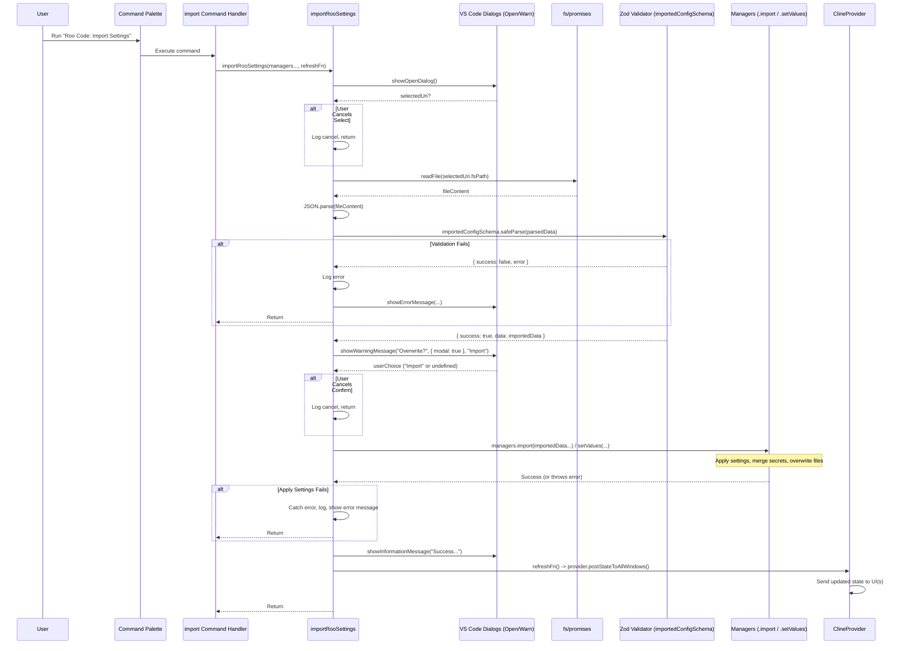
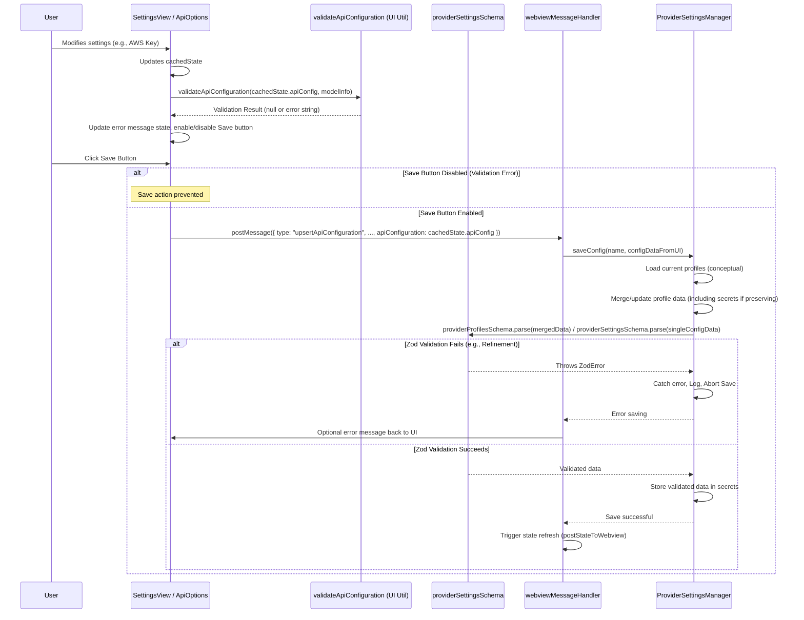
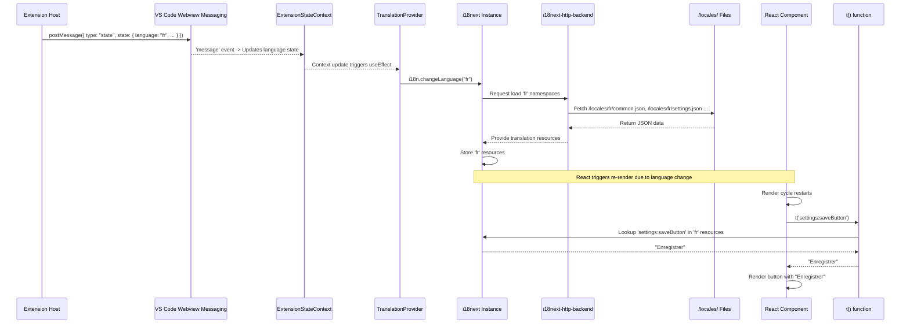
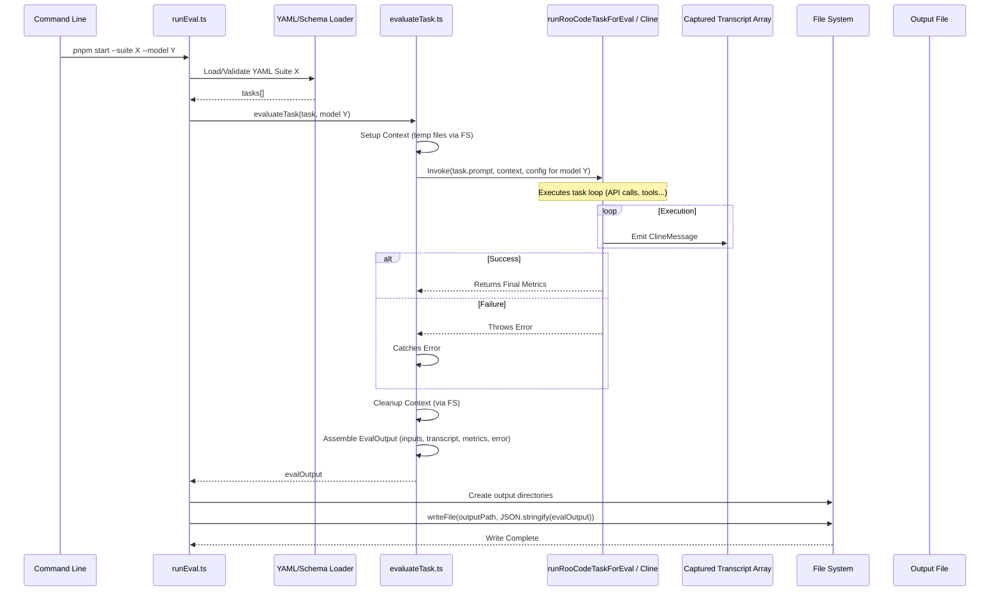

# Chapter 47: Configuration Import/Export

Continuing from [Chapter 46: Markdown Rendering](46_markdown_rendering.md), where we explored how Roo-Code displays formatted Markdown, we now shift to a higher-level feature related to managing the user's overall setup: **Configuration Import/Export**.

## Motivation: Sharing, Backing Up, and Migrating Settings

As users customize Roo-Code, they configure various settings: API keys and profiles ([Chapter 9: ProviderSettingsManager](09_providersettingsmanager.md)), custom modes ([Chapter 10: CustomModesManager](10_custommodesmanager.md)), UI preferences, tool behavior defaults ([Chapter 35: Settings UI Components (WebView)](35_settings_ui_components__webview_.md)), experimental flags, etc. Users may want to:

1.  **Backup:** Create a backup of their entire configuration for safekeeping.
2.  **Migrate:** Transfer their settings easily to a different machine or VS Code installation (e.g., using Settings Sync or manually).
3.  **Share:** Share specific parts of their configuration (like custom modes or non-sensitive API profile settings) with colleagues or the community.
4.  **Troubleshooting:** Export their settings (potentially excluding sensitive keys) to help diagnose issues.

Implementing individual export/import mechanisms for each type of setting would be cumbersome. A unified import/export system provides a convenient way to manage the application's configuration state as a whole or in logical parts.

Roo-Code provides commands and underlying logic to export the current configuration (excluding sensitive secrets like API keys) to a JSON file and import settings from such a file, overwriting existing configurations.

**Central Use Case:** A user has spent time creating several custom modes and configuring specific API profiles (without keys). They want to use the same setup on their laptop.

1.  **Export:** On their primary machine, the user opens the VS Code Command Palette (`Ctrl+Shift+P`) and runs the command "Roo Code: Export Settings".
2.  The command handler triggers the export logic (`exportRooSettings`).
3.  This logic gathers all relevant non-sensitive settings:
    *   Calls `ContextProxy.export()` ([Chapter 11: ContextProxy](11_contextproxy.md)) to get settings from `globalState` (using `globalSettingsExportSchema` which omits sensitive/dynamic fields).
    *   Calls `ProviderSettingsManager.export()` ([Chapter 9: ProviderSettingsManager](09_providersettingsmanager.md)) to get the structure of API profiles *excluding* the actual API keys.
    *   Calls `CustomModesManager.getGlobalCustomModes()` ([Chapter 10: CustomModesManager](10_custommodesmanager.md)) to get global custom modes.
4.  It combines this data into a single JSON object (e.g., `{ version: "...", globalSettings: {...}, apiProfiles: {...}, globalCustomModes: [...] }`).
5.  It prompts the user for a location to save the file using `vscode.window.showSaveDialog`.
6.  It writes the JSON object to the selected file (e.g., `roo-code-settings.json`) using file system utilities ([Chapter 42: File System Utilities](42_file_system_utilities.md)).
7.  **Import:** On their laptop, the user runs the "Roo Code: Import Settings" command.
8.  The command handler triggers the import logic (`importRooSettings`). It prompts the user to select the previously exported `roo-code-settings.json` file using `vscode.window.showOpenDialog`.
9.  It reads the JSON file content.
10. It validates the structure of the imported JSON using a Zod schema ([Chapter 40: Schemas (Zod)](40_schemas__zod_.md)) (`importedConfigSchema`).
11. It shows a confirmation dialog warning the user about overwriting settings (`vscode.window.showWarningMessage`).
12. If confirmed, it calls functions to apply the imported settings:
    *   `ContextProxy.setValues(imported.globalSettings)`.
    *   `ProviderSettingsManager.import(imported.apiProfiles)` (replaces existing profiles, attempts to preserve secrets for matching profiles).
    *   `CustomModesManager.import(imported.globalCustomModes)` (overwrites `settings/custom_modes.json`).
13. It triggers a state refresh ([Chapter 2: ClineProvider](02_clineprovider.md)'s `postStateToWebview`) so the UI reflects the imported settings. The user now has their custom modes and API profile structures on the laptop (they still need to enter the API keys manually via the Settings UI).

## Key Concepts

1.  **Scope:** The primary focus is on importing/exporting **non-sensitive** configuration that defines user customization (modes, profile structures, UI preferences). **API keys and other secrets are explicitly excluded** from the export for security. Project-specific configurations (`.roomodes`, `.roo/mcp.json`) are typically excluded from the *global* export/import.
2.  **JSON Format:** Configuration is exported/imported as a single JSON file containing sections for global settings, API profiles (structure only, no keys), and global custom modes. A version number is included for potential compatibility checks.
3.  **Export Logic (`exportRooSettings`):**
    *   Triggered by a VS Code command (`roo-code.exportSettings`).
    *   Aggregates data by calling specific `export()` or getter methods on `ContextProxy` (using an export-specific schema), `ProviderSettingsManager` (omitting secrets), and `CustomModesManager` (getting global modes).
    *   Combines data into a root JSON object with a version field.
    *   Uses `vscode.window.showSaveDialog` to get the destination file path.
    *   Writes the JSON data using `fs.writeFile` ([Chapter 42: File System Utilities](42_file_system_utilities.md)).
4.  **Import Logic (`importRooSettings`):**
    *   Triggered by a VS Code command (`roo-code.importSettings`).
    *   Uses `vscode.window.showOpenDialog` to select the JSON file.
    *   Reads and parses the JSON file.
    *   **Validation:** Uses a dedicated Zod schema (`importedConfigSchema`) to validate the structure and types of the imported data. Aborts if validation fails.
    *   **Confirmation:** Shows a modal warning dialog (`vscode.window.showWarningMessage`) before proceeding.
    *   **Application:** If confirmed, calls specific `.setValues()` or `.import()` methods on `ContextProxy`, `ProviderSettingsManager`, and `CustomModesManager` to apply the validated data sections, overwriting existing configurations. The `ProviderSettingsManager.import` logic attempts to preserve existing secrets for profiles matching by name or ID.
    *   **State Refresh:** Triggers a UI state refresh via the provider's `postStateUpdate` callback.
5.  **VS Code Commands:** `"roo-code.exportSettings"`, `"roo-code.importSettings"` registered via `registerConfigActions` (`src/activate/registerConfigActions.ts`).
6.  **Schema Definitions (`exportImport.ts`, `schemas/`):** Zod schemas ([Chapter 40: Schemas (Zod)](40_schemas__zod_.md)) define the exported structure (`importedConfigSchema`) and validate imported files. Export-specific schemas (like `globalSettingsExportSchema` within `ContextProxy`) are used to `.omit()` sensitive or transient fields during export. The import schema needs to handle potentially missing secret keys during validation.
7.  **Manager Methods (`export`, `import`):** `ContextProxy`, `ProviderSettingsManager`, and `CustomModesManager` require specific methods to handle the export (filtering sensitive data) and import (applying validated data, merging secrets, overwriting files) logic for their respective domains.

## Using Import/Export

The feature is accessed via VS Code commands from the Command Palette (`Ctrl+Shift+P` or `Cmd+Shift+P`).

**Export Process:**

1.  Run command "Roo Code: Export Settings".
2.  Choose save location and filename (e.g., `roo-settings-backup.json`) in the dialog. Click Save.
3.  A confirmation message ("Roo Code settings exported successfully.") appears.
4.  The JSON file is created containing non-sensitive settings (global state, API profile structures *without keys*, global custom modes).

**Import Process:**

1.  Run command "Roo Code: Import Settings".
2.  Select the previously exported JSON file in the dialog. Click Open.
3.  A confirmation dialog appears, warning that existing settings will be overwritten (excluding API keys where possible). Click "Import".
4.  Settings are loaded, validated, and applied. `ProviderSettingsManager` attempts to preserve keys for profiles matching by name/ID.
5.  The Roo-Code UI refreshes. Users may need to re-enter API keys for newly imported profiles via the Settings UI. A confirmation message appears.

## Code Walkthrough

*(Using conceptual implementations based on previous chapters and Chapter 47 concepts)*

### Export/Import Logic (`src/core/config/exportImport.ts` - Conceptual)

```typescript
// --- File: src/core/config/exportImport.ts ---
import * as vscode from "vscode";
import * as fs from "fs/promises";
import { z, ZodError } from "zod";
import { ContextProxy, globalSettingsExportSchema } from "./ContextProxy"; // Use export schema
import { ProviderSettingsManager, ProviderProfiles, providerProfilesSchema } from "./ProviderSettingsManager";
import { CustomModesManager, ModeConfig, modeConfigSchema, customModesSettingsSchema } from "./CustomModesManager";
import { logger } from "../../utils/logging";
import { VERSION } from "../../version"; // Extension version
import { ProviderSettings, SECRET_STATE_KEYS } from "../../schemas"; // Need secret keys list

// --- Structure for Exported/Imported File ---
interface ExportedConfig {
	version: string;
	globalSettings?: Partial<import("../../schemas").GlobalSettings>;
	apiProfiles?: ProviderProfiles; // Secrets are omitted by manager.export()
	globalCustomModes?: ModeConfig[];
}

// --- Zod Schema for Import Validation ---
// Define schema for ProviderSettings *within the import context* where secrets are optional/nullable
const importedProviderSettingsSchema = providerSettingsSchema.extend({
	// Explicitly mark all secret keys as optional/nullable for import validation
	apiKey: z.string().optional().nullable(),
	openAiApiKey: z.string().optional().nullable(),
	azureApiKey: z.string().optional().nullable(),
	anthropicApiKey: z.string().optional().nullable(),
	deepSeekApiKey: z.string().optional().nullable(),
	mistralApiKey: z.string().optional().nullable(),
	awsAccessKey: z.string().optional().nullable(),
	awsSecretKey: z.string().optional().nullable(),
	awsSessionToken: z.string().optional().nullable(),
	geminiApiKey: z.string().optional().nullable(),
    // Add any other keys from SECRET_STATE_KEYS here as optional().nullable()
});

// Use the base providerProfilesSchema but ensure apiConfigs uses the modified settings schema
const importedApiProfilesSchema = providerProfilesSchema.extend({
	apiConfigs: z.record(z.string(), importedProviderSettingsSchema), // Validate against schema allowing missing secrets
});

const importedConfigSchema = z.object({
	version: z.string(),
	globalSettings: globalSettingsExportSchema.optional(), // Validate global settings against the export schema
	apiProfiles: importedApiProfilesSchema.optional(), // Validate profiles structure allowing missing secrets
	globalCustomModes: z.array(modeConfigSchema).optional(), // Validate custom modes structure
}).passthrough(); // Allow extra fields for forward compatibility

// --- Export Function ---
export async function exportRooSettings(
	contextProxy: ContextProxy,
	providerSettingsManager: ProviderSettingsManager,
	customModesManager: CustomModesManager,
): Promise<void> {
	logger.info("Starting settings export...", { ctx: "ExportImport" });
	try {
		// 1. Aggregate non-sensitive settings
		const settingsToExport: ExportedConfig = {
			version: VERSION,
			globalSettings: await contextProxy.export(), // Uses globalSettingsExportSchema
			apiProfiles: await providerSettingsManager.export(), // Omits secrets
			globalCustomModes: await customModesManager.getGlobalCustomModes(), // Gets only global modes
		};

		// 2. Prompt user for save location
		const saveUri = await vscode.window.showSaveDialog({
			title: "Export Roo Code Settings",
			filters: { "JSON": ["json"] },
			saveLabel: "Export Settings",
            defaultUri: vscode.Uri.file(path.join(os.homedir(), `roo-code-settings-${VERSION}.json`)), // Suggest filename
		});
		if (!saveUri) {
			logger.info("Settings export cancelled by user.", { ctx: "ExportImport" });
			return; // User cancelled
		}

		// 3. Write data to file
		const jsonData = JSON.stringify(settingsToExport, null, 2); // Pretty print
		await fs.writeFile(saveUri.fsPath, jsonData); // Use native fs/promises from fs utils

		logger.info(`Settings successfully exported to ${saveUri.fsPath}`, { ctx: "ExportImport" });
		vscode.window.showInformationMessage("Roo Code settings exported successfully.");

	} catch (error: any) {
		logger.error("Failed to export settings", { error: error.message, ctx: "ExportImport" });
		vscode.window.showErrorMessage(`Failed to export settings: ${error.message}`);
	}
}

// --- Import Function ---
export async function importRooSettings(
	contextProxy: ContextProxy,
	providerSettingsManager: ProviderSettingsManager,
	customModesManager: CustomModesManager,
	postStateUpdate: () => Promise<void>, // Callback to refresh UI
): Promise<void> {
	logger.info("Starting settings import...", { ctx: "ExportImport" });
	try {
		// 1. Prompt user to select file
		const openUris = await vscode.window.showOpenDialog({
			title: "Import Roo Code Settings",
			filters: { "JSON": ["json"] },
			canSelectMany: false,
			openLabel: "Import Settings",
		});
		if (!openUris || openUris.length === 0) { /* ... handle cancel ... */ return; }
		const importUri = openUris[0];

		// 2. Read and parse file
		const fileContent = await fs.readFile(importUri.fsPath, "utf-8");
		const rawImportedData = JSON.parse(fileContent);

		// 3. Validate imported data using Zod schema
		const validationResult = importedConfigSchema.safeParse(rawImportedData);
		if (!validationResult.success) {
			logger.error("Imported settings file has invalid format.", { error: validationResult.error.format(), ctx: "ExportImport" });
			// Show specific error paths if available
            const errorDetails = validationResult.error.errors.map(e => `${e.path.join('.')}: ${e.message}`).join('\n');
			vscode.window.showErrorMessage(`Import failed: Invalid settings file format. Details:\n${errorDetails}`);
			return;
		}
		const importedData = validationResult.data;
        logger.info(`Importing settings from version ${importedData.version}...`, { ctx: "ExportImport" });
        // TODO: Add version checks against VERSION and potentially run migrations

		// 4. Confirmation Dialog
		const confirmation = await vscode.window.showWarningMessage(
			"Importing settings will overwrite your current global Roo Code configurations (Custom Modes, API Profiles structure, other settings). Existing API keys for matching profiles will be preserved where possible. Continue?",
			{ modal: true }, // Make it blocking
			"Import", // Confirmation button text
		);
		if (confirmation !== "Import") { /* ... handle cancel ... */ return; }

		// 5. Apply Imported Settings
		try {
            logger.info("Applying imported settings...", { ctx: "ExportImport" });
			if (importedData.globalSettings) {
				await contextProxy.setValues(importedData.globalSettings);
			}
			if (importedData.apiProfiles) {
				await providerSettingsManager.import(importedData.apiProfiles);
			}
			if (importedData.globalCustomModes) {
				await customModesManager.import(importedData.globalCustomModes);
			}
            logger.info("Settings successfully imported.", { ctx: "ExportImport" });
            vscode.window.showInformationMessage("Roo Code settings imported successfully. Please verify/re-enter API keys if needed via the Settings panel.");
		} catch (applyError: any) {
            logger.error("Error applying imported settings", { error: applyError.message, ctx: "ExportImport" });
            vscode.window.showErrorMessage(`Error applying imported settings: ${applyError.message}`);
            return; // Don't refresh state on partial failure
        }

		// 6. Trigger State Refresh
		await postStateUpdate();

	} catch (error: any) {
		// Catch errors during file selection/read/parse
		logger.error("Failed to import settings", { error: error.message, ctx: "ExportImport" });
		vscode.window.showErrorMessage(`Failed to import settings: ${error.message}`);
	}
}


// --- Conceptual Manager Methods (Needs implementation in respective manager classes) ---

// In ContextProxy.ts
// async export(): Promise<Partial<GlobalSettings> | undefined> { ... uses globalSettingsExportSchema ... }
// async setValues(values: Partial<RooCodeSettings>): Promise<void>; // Assumed to exist

// In ProviderSettingsManager.ts
// async export(): Promise<ProviderProfiles> { /* ... deep copy profiles, delete secret keys ... */ }
// async import(importedProfiles: ProviderProfiles): Promise<void> { /* ... lock, load current, merge secrets, store ... */ }

// In CustomModesManager.ts
// async getGlobalCustomModes(): Promise<ModeConfig[]> { /* ... load only from global file ... */ }
// async import(globalCustomModes: ModeConfig[]): Promise<void> { /* ... queue write, overwrite global file, refresh state ... */ }
```

**Explanation:**

*   **Import Schema (`importedConfigSchema`):** Carefully defined using Zod. It uses `globalSettingsExportSchema` to validate the `globalSettings` part. For `apiProfiles`, it extends the base schema (`providerProfilesSchema`) but modifies the nested `apiConfigs` record to use `importedProviderSettingsSchema`, which marks all `SECRET_STATE_KEYS` as optional/nullable. This allows validating files where secrets are correctly missing. It uses `.passthrough()` for forward compatibility.
*   **`exportRooSettings`:** Orchestrates gathering data via manager `.export()` methods, prompting for save location using `vscode.window.showSaveDialog` (with a suggested filename including the version), and writing the JSON file using `fs.writeFile`.
*   **`importRooSettings`:** Orchestrates prompting for file selection, reading (`fs.readFile`), parsing (`JSON.parse`), validating with `importedConfigSchema.safeParse`, confirming with the user (`vscode.window.showWarningMessage`), calling manager `.import()`/`.setValues()` methods within a `try...catch`, and triggering a UI refresh via `postStateUpdate`. Includes detailed error logging and user messages.
*   **Manager Method Concepts:** Reinforces the expected behavior of `.export()` (filter secrets) and `.import()` (overwrite state, merge secrets, use locks/queues).

### Command Registration (`src/activate/registerConfigActions.ts` - Conceptual)

```typescript
// --- File: src/activate/registerConfigActions.ts ---
import * as vscode from "vscode";
import { exportRooSettings, importRooSettings } from "../core/config/exportImport";
import { ClineProvider } from "../core/webview/ClineProvider"; // To access managers

export function registerConfigActions(context: vscode.ExtensionContext) {

	context.subscriptions.push(
		vscode.commands.registerCommand("roo-code.exportSettings", async () => {
            // Need access to the active/primary provider instance to get managers
            // TODO: Need a reliable way to get the "main" provider if multiple exist (e.g., sidebar)
            const provider = ClineProvider.getSidebarProviderInstance(); // Conceptual access method
            if (!provider?.isReadyForConfiguration()) { // Conceptual check
                vscode.window.showErrorMessage("Roo Code provider is not ready.");
                return;
            }
			await exportRooSettings(
                provider.contextProxy,
                provider.providerSettingsManager,
                provider.customModesManager
            );
		})
	);

	context.subscriptions.push(
		vscode.commands.registerCommand("roo-code.importSettings", async () => {
            const provider = ClineProvider.getSidebarProviderInstance(); // Conceptual access method
            if (!provider?.isReadyForConfiguration()) { // Conceptual check
                vscode.window.showErrorMessage("Roo Code provider is not ready.");
                return;
            }
            // Define the callback to refresh state after successful import
            const refreshState = async () => {
                // Re-load relevant configs and push full state to all webviews
                await provider.customModesManager.getCustomModes(); // Refresh internal cache/state
                await provider.providerSettingsManager.initialize(); // Re-initialize to load new profiles
                await ClineProvider.postStateToAllWindows(); // Conceptual: Update all active UI instances
            };
			await importRooSettings(
                provider.contextProxy,
                provider.providerSettingsManager,
                provider.customModesManager,
                refreshState // Pass the refresh callback
            );
		})
	);
}

// --- File: src/extension.ts ---
// ...
// import { registerConfigActions } from "./activate";
// ...
// export async function activate(context: vscode.ExtensionContext) {
//     // ... other initialization ...
//     // Ensure managers are created before registering commands that use them
//     const provider = new ClineProvider(...);
//     // ... register provider ...
//     registerConfigActions(context); // Pass context, handler gets managers via provider instance
//     // ...
// }
```

**Explanation:**

*   Registers the two commands `"roo-code.exportSettings"` and `"roo-code.importSettings"`.
*   Command handlers retrieve the necessary manager instances (likely via a static accessor for the primary/sidebar `ClineProvider` instance, e.g., `ClineProvider.getSidebarProviderInstance()`). Includes a check to ensure the provider and its managers are ready.
*   They call the respective `exportRooSettings` or `importRooSettings` functions.
*   The import handler defines and passes the `refreshState` callback, which should trigger re-loading of configurations within managers and then push the complete updated state to potentially multiple active WebView panels (`ClineProvider.postStateToAllWindows()`).

## Internal Implementation

1.  **Export:** Command triggers `exportRooSettings` -> Managers provide sanitized data (filtering secrets, omitting dynamic state) -> `showSaveDialog` -> `fs.writeFile`.
2.  **Import:** Command triggers `importRooSettings` -> `showOpenDialog` -> `fs.readFile` -> `JSON.parse` -> `importedConfigSchema.safeParse` (validates structure, allows missing secrets) -> `showWarningMessage` -> Managers' `.import`/`.setValues` methods apply changes (overwriting non-secrets, attempting to merge secrets, overwriting config files) -> `postStateUpdate` callback triggers UI refresh across all active panels.

**Secret Merging in `ProviderSettingsManager.import` (Crucial Detail):**

*   Acquire lock.
*   Load current profiles (including secrets) from storage into `currentProfiles`.
*   Validate the structure of `importedProfiles` using `providerProfilesSchema` (or the import-specific version).
*   Iterate through `validatedImport.apiConfigs`.
*   For each `importedConfig` (with name `importedName`), try to find `currentConfig = currentProfiles.apiConfigs[importedName]`.
*   If `currentConfig` exists: Iterate `SECRET_STATE_KEYS`. If `currentConfig[key]` exists and `importedConfig[key]` does *not*, copy the secret: `importedConfig[key] = currentConfig[key]`. Preserve the `id` from `currentConfig` onto `importedConfig` if the imported one didn't have one.
*   If `currentConfig` does *not* exist (it's a truly new profile), ensure `importedConfig.id` is set (generate if missing). All secret fields will remain undefined/null.
*   After iterating, call `this.store(validatedImport)` to completely replace the stored data with the processed imported data (which now includes preserved secrets).
*   Release lock.

**Sequence Diagram (Import Process):**



## Modification Guidance

Modifications usually involve changing the scope of exported/imported data or the logic within manager import methods.

1.  **Exporting Project-Specific Settings:**
    *   **Change Scope:** Modify `exportRooSettings` to optionally accept a flag (`--scope=project`) or detect if run within a project context.
    *   **Gather Data:** Instead of/in addition to `customModesManager.getGlobalCustomModes()`, call a method to get *project* modes (read from `.roomodes`). Add this to the `ExportedConfig` interface and object (e.g., `projectCustomModes`). Do similarly for project-specific MCP settings if applicable.
    *   **Import:** Modify `importedConfigSchema`. Modify `importRooSettings` to apply `projectCustomModes` by calling a method on `CustomModesManager` that writes to `.roomodes`. Add warnings if importing project settings globally or vice-versa.
    *   **Considerations:** Project-specific exports are less common for sharing/migration unless the entire project structure is being moved. Global export is typical.

2.  **Modifying Secret Preservation Logic:**
    *   **`ProviderSettingsManager.import`:** Change the logic for merging secrets (e.g., always clear, add user choice via dialog). Requires careful state management if adding UI interaction during the import process.

3.  **Adding Version Compatibility:**
    *   **`importRooSettings`:** Implement version comparison logic after validation. Call migration functions to transform `importedData` before passing it to managers. Manage different versions of the `importedConfigSchema` if necessary.

**Best Practices:**

*   **NEVER Export Secrets:** Filter rigorously.
*   **Validate on Import:** Use Zod schemas. Handle errors gracefully.
*   **Confirm Overwrite:** Crucial user safeguard.
*   **Clear Feedback:** Use `showInformationMessage`/`showErrorMessage`.
*   **Manager Responsibility:** Delegate application logic to managers.
*   **Secret Preservation Strategy:** Define and implement clearly.
*   **Versioning:** Include version numbers.

**Potential Pitfalls:**

*   **Accidental Secret Export/Import:** Security risk.
*   **Invalid Import File:** Validation failures.
*   **Import Overwrite Data Loss:** User error/misunderstanding.
*   **Secret Merge Complexity:** Errors in matching/copying secrets.
*   **Partial Import Failures:** Inconsistent state.
*   **Forgetting State Refresh:** UI doesn't update.
*   **Version Incompatibility:** Importing very old/new formats without migration logic.

## Conclusion

Configuration Import/Export provides essential usability features for Roo-Code, allowing users to back up, migrate, and share their non-sensitive settings like global preferences, API profile structures (without keys), and global custom modes. By implementing dedicated commands that aggregate data from core managers (`ContextProxy`, `ProviderSettingsManager`, `CustomModesManager`), validate imported data using Zod schemas, and carefully handle the application process (including secret preservation logic) with user confirmation, Roo-Code offers a convenient and relatively safe way to manage configuration state across different environments. The strict exclusion of secrets during export is paramount for security.

Next, we explore specific rules that can be defined within configuration, potentially influencing how settings are applied or validated: [Chapter 48: Configuration Rules](48_configuration_rules.md).
---
# Chapter 48: Configuration Rules

Continuing from [Chapter 47: Configuration Import/Export](47_configuration_import_export.md), which covered managing the entire Roo-Code configuration, this chapter delves into a more specific aspect: defining and applying **Configuration Rules**.

## Motivation: Enforcing Constraints and Dynamic Behavior

While basic settings allow users to configure values, sometimes more complex logic or constraints are needed to ensure validity, guide users, or enable dynamic behavior based on the configuration state:

1.  **Conditional Settings:** A setting might only be relevant or applicable if another setting has a specific value (e.g., "AWS Secret Key" is only needed if "AWS Authentication Method" is set to "Credentials", not "Profile"). The UI should adapt to hide irrelevant options.
2.  **Inter-Setting Validation:** The validity of one setting might depend on the value of another (e.g., "Max Output Tokens" should not exceed the selected model's known context window size minus a safety buffer). The UI should provide feedback or prevent saving invalid combinations.
3.  **Dynamic Defaults:** While less common for user-facing settings, internal defaults might sometimes depend on other configuration values.
4.  **Enforcing Best Practices:** Discouraging or warning against specific combinations of settings that are known to perform poorly or cause issues (e.g., using a very high temperature with a model not suited for creative tasks might warrant a warning).

Implementing this logic directly within UI components ([Chapter 35: Settings UI Components (WebView)](35_settings_ui_components__webview_.md)) or scattered throughout the codebase can lead to duplication and make the rules hard to manage or understand. **Configuration Rules** provide a conceptual framework for defining and applying these dependencies and constraints consistently.

*Note: Roo-Code primarily implements these rules implicitly through:*
    *   ***Validation logic within Zod schemas*** ([Chapter 40: Schemas (Zod)](40_schemas__zod_.md)), especially using `.refine()` and `.superRefine()`.
    *   ***Conditional rendering and validation logic*** within settings UI components ([Chapter 35: Settings UI Components (WebView)](35_settings_ui_components__webview_.md)).
    *   ***Dedicated validation functions*** called by the UI or before saving configurations.

**Central Use Case:** A user selects AWS Bedrock as the provider and chooses the "Credentials" authentication method in the Settings UI ([Chapter 35: Settings UI Components (WebView)](35_settings_ui_components__webview_.md)).

1.  **UI Logic Rule (`ApiOptions.tsx`):** The component conditionally renders the input fields for "AWS Access Key ID", "AWS Secret Access Key", and optionally "AWS Session Token" *only* when `apiConfiguration.awsAuthMode === 'credentials'`. It hides fields related to AWS profiles. This rule enhances usability by only showing relevant fields.
2.  **Validation Rule (`validateApiConfiguration` / Schema Refinement):** When the user tries to save, validation logic enforces that if `awsAuthMode === 'credentials'`, then `awsAccessKey` and `awsSecretKey` must not be empty. This rule ensures data integrity. It can be implemented both in a UI validation function (for immediate feedback) and within the Zod schema (`providerSettingsSchema.superRefine`) for a guarantee during persistence.
    ```typescript
    // Conceptual Zod refinement in src/schemas/settings.ts
    providerSettingsSchema.superRefine((data, ctx) => {
        if (data.apiProvider === 'bedrock') {
            if (data.awsAuthMode === 'credentials' && (!data.awsAccessKey || !data.awsSecretKey)) {
                // Add an issue if credentials mode but keys are missing
                ctx.addIssue({
                    code: z.ZodIssueCode.custom,
                    path: ["awsAccessKey"], // Associate error with a field for UI feedback
                    message: "Access Key and Secret Key are required for Credentials auth mode.",
                });
            }
            // Add check for profile mode
            if (data.awsAuthMode === 'profile' && !data.awsProfile) {
                ctx.addIssue({
                    code: z.ZodIssueCode.custom,
                    path: ["awsProfile"],
                    message: "AWS Profile name is required for Profile auth mode.",
                });
            }
            // ... other related Bedrock checks ...
        }
    });
    ```

## Key Concepts

1.  **Implicit vs. Explicit Rules:**
    *   **Implicit:** Rules naturally enforced by the application structure (e.g., basic Zod type checks, UI hiding irrelevant fields, functions ignoring `undefined` optional settings).
    *   **Explicit:** Rules actively defined to enforce dependencies or complex conditions. Implemented via:
        *   **Zod Refinements:** Using `.refine()` (single field) or `.superRefine()` (multiple fields) within schema definitions ([Chapter 40: Schemas (Zod)](40_schemas__zod_.md)). **Ensures data validity on save/load.**
        *   **Conditional UI Logic:** `if`/`switch` or JSX logic (`{condition && ...}`) in UI components ([Chapter 35: Settings UI Components (WebView)](35_settings_ui_components__webview_.md)). **Ensures UI adapts dynamically.**
        *   **Validation Functions:** Separate utility functions (e.g., `validateApiConfiguration`) called by the UI for immediate feedback or complex checks involving external data.

2.  **Zod Refinements (`.refine`, `.superRefine`):** Embed complex validation logic directly into schemas. `.superRefine` is best for rules involving multiple fields, allowing custom error messages attached to specific input paths (`ctx.addIssue({ path: [...] })`).

3.  **Conditional UI Logic:** Settings UI components read the current configuration state (`cachedState`) and dynamically adjust the rendered output – showing/hiding fields, enabling/disabling controls – based on rule conditions.

4.  **External Validation Functions:** Encapsulate validation logic requiring external data (e.g., checking `modelMaxTokens` against fetched `ModelInfo`) or providing immediate UI feedback. Often called within React `useEffect` hooks in the Settings UI.

5.  **Rule Application Points:** Rules are enforced at various stages:
    *   **UI Rendering:** Conditional display/enablement.
    *   **UI Interaction:** Real-time validation feedback, disabling Save button.
    *   **Data Persistence (Save/Load/Import):** Zod schema validation (`parse`/`safeParse`) including refinements.
    *   **Data Usage:** Less common, checks might occur just before using settings.

## Applying Configuration Rules (Examples)

**Use Case 1: Conditional AWS Auth Fields (UI Logic + Zod Refinement)**

*   **Rule:** Show/Require AWS Key/Secret fields only if `apiProvider` is `bedrock` and `awsAuthMode` is `credentials`.
*   **UI (`ApiOptions.tsx`):** Uses JSX conditional rendering based on `selectedProvider` and `awsAuthMode`.
*   **Schema (`providerSettingsSchema`):** Uses `.superRefine` to add validation issues if keys are missing when mode is 'credentials', or profile is missing when mode is 'profile'.
*   **Effect:** UI adapts dynamically; saving invalid combinations is prevented by schema validation during persistence via [Chapter 9: ProviderSettingsManager](09_providersettingsmanager.md).

**Use Case 2: Max Tokens vs. Context Window (Validation Function + Zod Constraint)**

*   **Rule:** User-defined `modelMaxTokens` should not exceed the selected model's known limits (`contextWindow`, `maxTokens`).
*   **Schema (`providerSettingsSchema`):** `modelMaxTokens: z.number().int().positive().optional()`. Basic constraint.
*   **Validation Function (`validateApiConfiguration` in `webview-ui/src/utils/validation.ts`):** Compares `config.modelMaxTokens` against `modelInfo?.contextWindow` and `modelInfo?.maxTokens` (retrieved from fetched model data). Returns error string if invalid.
*   **UI (`ApiOptions.tsx`):** Calls `validateApiConfiguration` in `useEffect` when relevant values change. Displays error using `ApiErrorMessage`, potentially disabling Save in `SettingsView`.
*   **Effect:** User gets immediate feedback in the UI. The Zod schema ensures it's a positive integer, while the function provides the relational check against the specific model's limits.

**Use Case 3: Ensure Unique Custom Mode Slugs (Zod Refinement)**

*   **Rule:** All modes within the `customModes` array (in `settings/custom_modes.json` or `.roomodes`) must have unique `slug` values (case-insensitive).
*   **Schema (`customModesSettingsSchema` in `src/schemas/modes.ts`):** Uses `.refine` on the `z.array(modeConfigSchema)` to iterate and check for duplicate slugs using a `Set`, returning `false` (triggering the refinement error) if a duplicate is found.
*   **Application Point:** `CustomModesManager.loadModesFromFile` ([Chapter 10: CustomModesManager](10_custommodesmanager.md)) uses `customModesSettingsSchema.safeParse`. Validation failure prevents loading the configuration file.
*   **Effect:** Prevents corrupted state caused by duplicate mode identifiers during load. The "Create Mode" dialog in the UI ([Chapter 37: Prompts UI Components (WebView)](37_prompts_ui_components__webview_.md)) likely performs a similar check before sending the save message.

## Code Walkthrough

Implementation is distributed across schemas, UI components, and validation utilities.

### Zod Schema Refinements (`src/schemas/*.ts`)

*(See examples in Motivation and Use Cases above)*

*   `.refine` and `.superRefine` are attached to Zod object or array schemas.
*   The provided function receives the parsed data (and `ctx` for `superRefine`).
*   It returns `true` or `void` if valid, `false` or calls `ctx.addIssue` if invalid.
*   Error messages and paths (`ctx.addIssue({ path: [...] })`) help pinpoint validation failures for UI feedback.

### Conditional UI Logic (`webview-ui/src/components/settings/ApiOptions.tsx`)

*(See example in Use Cases above)*

*   Uses standard React conditional rendering (`{condition && <JSX />}`) based on state variables (e.g., `selectedProvider`, `awsAuthMode`) derived from the current configuration state.
*   This dynamically shows/hides sections or specific input fields, guiding the user and preventing configuration of irrelevant options.

### Validation Functions (`webview-ui/src/utils/validation.ts` - Conceptual)

*(See example in Use Cases above)*

*   Functions like `validateApiConfiguration` encapsulate checks involving multiple fields or external data (like `ModelInfo`).
*   They return `null` on success or a user-friendly error message string on failure.
*   Called from UI component effects (`useEffect`) or event handlers (`onChange`, `onBlur`) to provide immediate feedback.

## Internal Implementation

Rules are checked at different times by different mechanisms:

1.  **UI Rendering:** React evaluates conditional rendering expressions based on current state (`cachedState` in `SettingsView`) during the render cycle.
2.  **UI Validation:** `useEffect` hooks in settings components trigger validation functions when relevant state changes. The result updates an error state variable, causing UI feedback (e.g., error message display via `ApiErrorMessage`, Save button disabled in `SettingsView`).
3.  **Save/Load Validation:** When data is loaded/parsed (`ProviderSettingsManager.load`, `CustomModesManager.loadModesFromFile`) or about to be saved (`ProviderSettingsManager.store`), `schema.safeParse()` or `schema.parse()` is called. Zod's runtime executes all type, constraint, and refinement checks defined in the schema. If `success: false`, the calling code handles the error (logs, returns default, prevents save).

**Sequence Diagram (Applying Rules during Settings Save):**



## Modification Guidance

Modifications typically involve adding new rules, changing existing rule logic, or adjusting where rules are enforced.

1.  **Adding a New Rule (e.g., Warn if Temperature > 1.0 for OpenAI):**
    *   **Identify Enforcement:** Is this a hard block or a warning? Immediate UI feedback or only on save?
    *   **Option A (UI Warning):** Add a check to `validateApiConfiguration` utility. Return a specific warning string. Update `ApiErrorMessage` component to potentially render warnings differently from errors.
    *   **Option B (Save Block - Zod):** Add a `.superRefine` to `providerSettingsSchema`. Check `if (data.apiProvider === 'openai' && data.modelTemperature && data.modelTemperature > 1.0) { ctx.addIssue(...) }`. This will block saving via `ProviderSettingsManager`.
    *   **Recommendation:** For warnings or rules needing external data (like model limits), UI validation functions are often better for immediate feedback. For essential data integrity rules, Zod refinements are more robust.

2.  **Changing Conditional Rendering (e.g., Hide Temperature for Specific Model):**
    *   **`ApiOptions.tsx`:** Modify the JSX rendering `TemperatureControl`. Wrap it in a condition checking `apiConfiguration.apiModelId` against a list of models where temperature doesn't apply (or use a flag from `ModelInfo` if available).
        ```jsx
        {/* Assuming modelInfo is available for the selected model */}
        {modelInfo?.supportsTemperature !== false && (
            <TemperatureControl value={apiConfiguration?.modelTemperature} ... />
        )}
        ```

3.  **Modifying a Zod Refinement (e.g., Making Slug Check Case-Sensitive):**
    *   **Locate:** Edit the `.refine` function attached to the `customModes` array in `customModesSettingsSchema` (`src/schemas/modes.ts`).
    *   **Modify:** Remove the `.toLowerCase()` calls when adding/checking slugs in the `Set`.
        ```typescript
        // Inside .refine((modes) => { ... })
        if (slugs.has(mode.slug)) return false; // Check case-sensitively
        slugs.add(mode.slug);
        // ...
        }, { message: "Mode slugs must be unique." }) // Update message if needed
        ```

**Best Practices:**

*   **Choose the Right Mechanism:** Use UI logic for usability/immediate feedback, Zod for data integrity guarantees on save/load.
*   **Keep Rules Close to Data:** Define Zod refinements within schema files (`src/schemas/`). Keep UI validation functions near UI code (`webview-ui/src/utils/`).
*   **Clear Error Messages:** Provide user-friendly error messages (Zod `ctx.addIssue`, UI function returns). Associate Zod errors with `path` for field highlighting.
*   **Performance:** Simple UI logic and Zod checks are fast. Avoid extremely complex validation functions running on every keystroke in the UI without debouncing.
*   **Consistency:** If a rule is critical, enforce it with Zod schemas. UI checks can supplement this for better UX but shouldn't be the only enforcement for data integrity.

**Potential Pitfalls:**

*   **Conflicting/Duplicated Rules:** Implementing the same rule differently in UI vs. Zod. Zod should be the final check before persistence.
*   **Circumvented UI Rules:** Rules only in UI logic are bypassed by import or manual edits. Zod catches these.
*   **Complex Refinements:** Hard-to-debug Zod `.superRefine` logic.
*   **Poor Error Reporting:** Zod errors not translated into user-friendly UI feedback.
*   **Migration Necessity:** Adding stricter Zod rules (required fields, new constraints, refinements) often necessitates data migrations for existing users.

## Conclusion

Configuration Rules are essential for managing the complexity and ensuring the integrity of Roo-Code's settings. While not implemented as a single dedicated engine, these rules are enforced through a combination of Zod schema validations (especially `.refine` and `.superRefine` for cross-field checks), conditional logic within UI components for usability, and dedicated validation functions for immediate feedback. This layered approach allows Roo-Code to guide users through configuration, prevent invalid states, enforce dependencies between settings, and ensure that data persisted or imported meets the required structural and logical constraints, contributing significantly to the application's overall robustness and user experience.

Next, we examine helpers specifically designed to facilitate OAuth authentication flows, connecting Roo-Code securely to external services: [Chapter 49: OAuth Helpers](49_oauth_helpers.md).
---
# Chapter 49: OAuth Helpers

Continuing from [Chapter 48: Configuration Rules](48_configuration_rules.md), which discussed enforcing constraints within settings, this chapter focuses on a specific mechanism used for integrating with external services that require user authentication: **OAuth Helpers**.

## Motivation: Securely Connecting to External Services

Roo-Code might need to integrate with external services that require user authentication via OAuth 2.0. Examples could include:

*   Connecting to a code hosting platform (like GitHub, GitLab) for specific features (e.g., creating issues, fetching private repository information).
*   Integrating with project management tools (e.g., Jira, Asana).
*   Authenticating with certain cloud providers or APIs that use OAuth for user-delegated permissions.

The OAuth 2.0 Authorization Code flow (often enhanced with PKCE) is the standard for third-party applications like VS Code extensions. This flow typically involves:
1.  Redirecting the user to the service's authorization page in their browser.
2.  User logs in and grants permission.
3.  The service redirects the user back to a specific `redirect_uri` registered by the application, providing an authorization `code`.
4.  The application needs to capture this `code` and securely exchange it (along with a client secret or PKCE verifier) for an access token and potentially a refresh token by making a backend request to the service's token endpoint.
5.  The received tokens need to be stored securely (e.g., using `vscode.ExtensionContext.secrets`) for future API calls.

Handling this flow within a VS Code extension presents challenges:
*   **Redirect URI:** Extensions don't typically run a web server to receive redirects. VS Code provides mechanisms like the `vscode.authentication` API or custom URI handlers (`vscode.window.registerUriHandler`).
*   **State Management:** A `state` parameter is needed to prevent Cross-Site Request Forgery (CSRF) attacks and correlate the callback with the initial request.
*   **Token Exchange:** The exchange for tokens usually requires a client secret (which **cannot** be safely stored in the extension) or PKCE. This step often needs to be proxied through a secure backend server controlled by the extension publisher, especially if a client secret is involved.
*   **Secure Token Storage:** Access and refresh tokens are highly sensitive and must be stored using VS Code's secure `secrets` API.
*   **Token Refresh:** Access tokens expire. Logic is needed to automatically use the refresh token to obtain a new access token without requiring the user to re-authenticate constantly.

The **OAuth Helpers** (conceptually located in `src/services/oauth/` or `src/utils/oauth/`) provide utilities and potentially manage the state needed to facilitate these OAuth flows within the VS Code extension environment, **strongly preferring the built-in `vscode.authentication` API** whenever possible and providing guidance or minimal structure for custom flows otherwise.

*Note: Based on the provided project structure, explicit OAuth helpers beyond potentially using the built-in `vscode.authentication` API might not be extensively implemented yet, or might be part of specific service integrations (like a hypothetical GitHub integration). This chapter describes the general concepts and how such helpers *would* function.*

**Central Use Case (Hypothetical - Using `vscode.authentication` for GitHub):** Roo-Code needs to authenticate with GitHub to access private repository data.

1.  User clicks "Connect GitHub Account" in Roo-Code Settings.
2.  The UI triggers a command (e.g., `roo-code.connectGitHub`).
3.  The command handler executes:
    ```typescript
    try {
        const scopes = ['repo', 'read:user']; // Define required scopes
        // Use VS Code's built-in authentication provider
        const session = await vscode.authentication.getSession('github', scopes, { createIfNone: true });

        if (session) {
            const token = session.accessToken;
            // Store the token securely using ContextProxy/secrets
            await contextProxy.setValue('githubAccessToken' as any, token); // Key needs to be in SecretState
            vscode.window.showInformationMessage('Successfully connected to GitHub!');
            // Update UI state via postStateToWebview
        } else {
             vscode.window.showWarningMessage('GitHub authentication cancelled.');
        }
    } catch (error: any) {
        vscode.window.showErrorMessage(`GitHub authentication failed: ${error.message}`);
    }
    ```
4.  **VS Code Magic:** `vscode.authentication.getSession` handles the entire flow:
    *   Constructs the GitHub authorization URL with appropriate parameters (client ID managed by VS Code, scopes, state, PKCE).
    *   Opens the URL in the browser (`vscode.env.openExternal`).
    *   Listens on an internal callback URI (e.g., localhost port or custom scheme).
    *   User logs in/authorizes on GitHub.
    *   GitHub redirects back; VS Code intercepts the callback.
    *   VS Code verifies state, performs the token exchange with GitHub (using its registered client secret, kept securely *outside* the extension).
    *   VS Code securely stores the access and refresh tokens internally.
    *   VS Code automatically handles refreshing the token in the background when needed.
    *   The `getSession` promise resolves with the `AuthenticationSession` object containing the valid `accessToken`.
5.  **Token Storage:** The command handler receives the `accessToken` and stores it using `ContextProxy` ([Chapter 11: ContextProxy](11_contextproxy.md)) (which uses `vscode.ExtensionContext.secrets`).
6.  **Completion:** The UI is updated to reflect the connected state. Subsequent calls to GitHub APIs can retrieve the token using `contextProxy.getValue('githubAccessToken')` or by calling `getSession` again (which will return the cached session).

## Key Concepts

1.  **OAuth 2.0 Flows:** Primarily Authorization Code Grant with PKCE. Avoid Implicit Grant and flows requiring client secrets directly within the extension.
2.  **`vscode.authentication` API (Preferred):**
    *   **`vscode.authentication.getSession(providerId, scopes, options)`:** The primary function.
        *   `providerId`: Identifier for the auth provider (e.g., `'github'`, `'microsoft'`). Requires the provider to be built-in or registered by another extension.
        *   `scopes`: Array of permission scopes requested from the provider.
        *   `options.createIfNone: boolean`: If `true`, initiates the login flow if no session exists. If `false`, returns `undefined` if not logged in.
        *   `options.forceNewSession: boolean`: Forces the user to re-authenticate even if a session exists.
        *   **Returns:** `Promise<vscode.AuthenticationSession | undefined>`. The `AuthenticationSession` contains `id`, `accessToken`, `account`, and `scopes`.
    *   **Benefits:** Handles redirects, callbacks, state/PKCE, secure token exchange (using VS Code's backend or the provider extension's secrets), secure token storage, and automatic token refresh. **Significantly simplifies OAuth for supported providers.**
3.  **Custom Flow (using `registerUriHandler` - Use with Caution):** Necessary only for providers *not* supported by `vscode.authentication`.
    *   **`vscode.window.registerUriHandler`:** Registers a handler for a custom URI scheme (e.g., `vscode://YourPublisher.YourExtension/authCallback`).
    *   **`vscode.env.openExternal`:** Used to open the provider's authorization URL in the user's browser. The `redirect_uri` in the URL must match the custom scheme registered above.
    *   **PKCE Implementation:** Requires manual generation of `code_verifier` and `code_challenge` using Node.js `crypto`.
    *   **State Management:** Requires manual generation and verification of the `state` parameter. Temporary storage (e.g., a `Map`) is needed to correlate callbacks with initial requests.
    *   **Token Exchange:** Requires making an HTTP POST request from the extension (e.g., using `axios`) to the provider's token endpoint. **Must only use PKCE**, never include a client secret. If a secret is required, this step MUST be proxied through a secure external backend service.
    *   **Secure Token Storage:** Requires explicitly using `vscode.ExtensionContext.secrets.store`.
    *   **Token Refresh:** Requires manually implementing the logic to use the refresh token when the access token expires.

4.  **PKCE (Proof Key for Code Exchange):** Essential for custom flows. Generate a random `code_verifier`, hash it (SHA256) and base64url-encode it to create the `code_challenge`. Send `code_challenge` and `code_challenge_method=S256` in the auth request. Send the original `code_verifier` in the token exchange request.

5.  **Secure Token Storage:** Always use `vscode.ExtensionContext.secrets` via `ContextProxy` ([Chapter 11: ContextProxy](11_contextproxy.md)) for storing obtained access and refresh tokens. Ensure the relevant keys are defined in `SECRET_STATE_KEYS` ([Chapter 40: Schemas (Zod)](40_schemas__zod_.md)).

6.  **Backend Proxy for Secrets:** If a provider *requires* a client secret for the token exchange, **do not** embed the secret in the extension. Instead, set up a simple backend service (e.g., a cloud function) that the extension can send the authorization `code` to. The backend service holds the client secret, performs the token exchange with the provider, and returns the tokens to the extension.

## Using OAuth Helpers

The primary interaction pattern involves triggering an authentication flow via a command and then storing the resulting token securely.

**Example 1: Using `vscode.authentication` (GitHub)**

*(See Central Use Case code example)*
This is the preferred method. The command handler directly calls `vscode.authentication.getSession`, handles the resulting session (storing the token via `ContextProxy`), and updates the UI. Most complexity is handled by VS Code itself.

**Example 2: Initiating a Custom Flow (GitLab - Conceptual)**

*(See Conceptual Code Walkthrough in Chapter 49 - Motivation section)*
This involves more manual steps:
1.  **Command Handler:** Calls a helper like `startGitLabAuthFlow`.
2.  **`startGitLabAuthFlow`:** Generates state/PKCE, stores pending data (promise resolvers, verifier), opens external URL. Returns a promise.
3.  **`UriHandler.handleUri`:** Is invoked by VS Code on redirect. Validates state, extracts code, calls `exchangeGitLabCodeForToken`.
4.  **`exchangeGitLabCodeForToken`:** Makes POST request with code/verifier (assuming PKCE only).
5.  **`UriHandler.handleUri`:** Receives tokens, stores them via `context.secrets` (using `ContextProxy`), resolves the original promise from `startGitLabAuthFlow`.
6.  **Command Handler:** Promise resolves, confirms success to user/UI.

## Code Walkthrough

Since Roo-Code likely prioritizes `vscode.authentication`, we focus on that conceptual integration and the structure for a custom flow helper.

### Using `vscode.authentication`

```typescript
// --- File: src/activate/registerAuthCommands.ts --- (Conceptual)
import * as vscode from "vscode";
import { ContextProxy } from "../core/config/ContextProxy"; // Assuming ContextProxy instance is available
import { logger } from "../utils/logging";
import { SECRET_STATE_KEYS } from "../schemas"; // Import key list

// Assume 'contextProxy' is obtained from provider or passed in
async function connectGitHub(contextProxy: ContextProxy) {
    logger.info("Attempting GitHub authentication...", { ctx: "Auth" });
    try {
        const scopes = ['repo', 'read:user', 'gist']; // Define necessary scopes
        // Request session, trigger login flow if needed
        const session = await vscode.authentication.getSession('github', scopes, { createIfNone: true });

        if (session) {
            logger.info(`GitHub authentication successful for user: ${session.account.label}`, { ctx: "Auth" });
            // Store token securely using ContextProxy
            const tokenKey = 'githubAccessToken';
            // Static check (or runtime assertion) that the key is valid
            if (!(SECRET_STATE_KEYS as readonly string[]).includes(tokenKey)) {
                throw new Error(`Key ${tokenKey} is not defined in SECRET_STATE_KEYS`);
            }
            await contextProxy.setValue(tokenKey, session.accessToken);
            vscode.window.showInformationMessage(`Successfully connected to GitHub as ${session.account.label}!`);
            // TODO: Trigger UI state update via ClineProvider.postStateToAllWindows()
        } else {
            // User likely cancelled the flow
            logger.warn('GitHub authentication cancelled by user.', { ctx: "Auth" });
            vscode.window.showWarningMessage('GitHub authentication cancelled.');
        }
    } catch (error: any) {
        logger.error('GitHub authentication failed', { error: error.message, ctx: "Auth" });
        vscode.window.showErrorMessage(`GitHub authentication failed: ${error.message}`);
    }
}

export function registerAuthCommands(context: vscode.ExtensionContext, contextProxy: ContextProxy) {
    context.subscriptions.push(
        vscode.commands.registerCommand("roo-code.connectGitHub", () => connectGitHub(contextProxy))
        // Register other auth commands...
    );
}

// --- File: src/schemas/index.ts (Ensure key is present) ---
// export const SECRET_STATE_KEYS = [ /* ..., */ "githubAccessToken" ] as const;
// export type SecretState = { /* ... */ githubAccessToken?: string };
```

**Explanation:**

*   The `connectGitHub` function encapsulates the logic.
*   It defines the required `scopes`.
*   It calls `vscode.authentication.getSession('github', scopes, { createIfNone: true })`.
*   If `session` is returned, it extracts `session.accessToken`.
*   **Crucially**, it verifies (conceptually, or via TypeScript if types are precise) that the key (`'githubAccessToken'`) exists in `SECRET_STATE_KEYS` before storing the token securely using `contextProxy.setValue()`.
*   It provides user feedback via `showInformationMessage` or `showErrorMessage`.
*   The command is registered in the `registerAuthCommands` function.

### Custom Flow Structure (Conceptual Helpers)

*(See detailed conceptual code in Chapter 49 - Motivation section)*

*   **`startAuthFlow()` function:**
    *   Generates `state`, PKCE `verifier`/`challenge`.
    *   Stores `verifier` and `resolve`/`reject` functions (from a `new Promise`) in a temporary map keyed by `state`.
    *   Constructs the provider's authorization URL including PKCE params.
    *   Opens URL with `vscode.env.openExternal`.
    *   Returns the promise (includes timeout logic).
*   **`UriHandler` class implementing `vscode.UriHandler`:**
    *   `handleUri(uri)` method is called by VS Code on redirect.
    *   Parses `code`/`state` from `uri.query`. Handles errors returned by provider.
    *   Validates `state` against the temporary map. Retrieves verifier/resolvers.
    *   Calls `exchangeCodeForToken(code, verifier)`.
    *   On success: Stores tokens using `contextProxy.setValue` (after checking keys), calls `resolve(accessToken)`.
    *   On failure: Calls `reject(error)`.
    *   Cleans up entry from the temporary map.
*   **`exchangeCodeForToken()` function:**
    *   Uses `axios` or similar to POST to the provider's token endpoint.
    *   Sends `client_id`, `code`, `redirect_uri`, `grant_type`, `code_verifier`. **NO CLIENT SECRET.**
    *   Parses response, returns tokens or throws error.
*   **Registration (in `extension.ts` or `activate/`):**
    *   Register the command that calls `startAuthFlow`.
    *   Register the `UriHandler` using `vscode.window.registerUriHandler`.

## Internal Implementation

*   **`vscode.authentication`:** Relies on VS Code's core implementation and potentially contributions from other extensions (like the built-in GitHub Authentication extension). It manages secure storage, refresh tokens, and the low-level communication flow, including potentially proxying token exchange through a Microsoft or GitHub backend service if needed. Extensions interact via the simple `getSession` API.
*   **Custom Flow:** A manual orchestration involving:
    *   Generating crypto values (`crypto` module).
    *   Managing temporary state (`Map`).
    *   Opening browser (`vscode.env.openExternal`).
    *   Receiving callbacks (`vscode.window.registerUriHandler`).
    *   Making HTTP requests (`axios`).
    *   Storing secrets (`context.secrets` via `ContextProxy`).

**Sequence Diagram (`vscode.authentication.getSession`):**

*(See diagram in Chapter 49 - Internal Implementation)* - Shows VS Code Core handling state, redirects, token exchange, and storage.

**Sequence Diagram (Custom URI Handler Flow):**

*(See diagram in Chapter 49 - Internal Implementation)* - Shows manual state/PKCE generation, browser redirect, URI handler invocation, explicit token exchange, and secret storage.

## Modification Guidance

Modifications typically involve adding support for a new OAuth provider.

1.  **Integrating a New Service using `vscode.authentication` (Preferred):**
    *   **Check Provider ID:** Verify if VS Code has a built-in provider ID (like `'github'`, `'microsoft'`) or if another trusted extension provides one.
    *   **Identify Scopes:** Consult the service's API documentation for required OAuth scopes.
    *   **Implement Command:** Create a command handler calling `vscode.authentication.getSession` with the correct `providerId` and `scopes`.
    *   **Store Token:** Define a key in `SECRET_STATE_KEYS` and `SecretState` ([Chapter 40: Schemas (Zod)](40_schemas__zod_.md)) and use `contextProxy.setValue` to store the `session.accessToken`.
    *   **Use Token:** Retrieve token using `contextProxy.getValue`. `getSession` handles refresh.

2.  **Integrating a New Service using Custom Flow (Only if Necessary):**
    *   **Verify PKCE:** **Confirm the provider supports Authorization Code Grant with PKCE and *does not* require a client secret.** If a secret is mandatory, a backend proxy is required for the token exchange step.
    *   **Implement:** Follow the steps in "Custom Flow Structure" (constants, state map, PKCE generation, initiation function, URI handler, token exchange function, registration).
    *   **Security:** Implement PKCE correctly. Validate `state`. Store tokens only in `secrets`.
    *   **Token Refresh:** Implement manual refresh token logic if long-term access is needed (requires storing refresh token, detecting 401s, calling token endpoint with `grant_type=refresh_token`, storing new tokens). This adds significant complexity.

**Best Practices:**

*   **Prioritize `vscode.authentication`:** Always use the built-in API if the provider is supported.
*   **Use PKCE for Custom Flows:** Essential security measure for public clients. Never embed client secrets.
*   **Proxy Secret-Based Exchanges:** Use a backend service if a client secret is unavoidable.
*   **Secure Token Storage:** Always use `vscode.ExtensionContext.secrets` (via `ContextProxy`). Ensure keys are defined in schemas.
*   **Minimal Scopes:** Request only necessary permissions.
*   **State Parameter:** Use and validate `state`.
*   **HTTPS:** Only use HTTPS endpoints.
*   **Clear User Feedback:** Inform user during redirects, success, failure. Handle cancellations.

**Potential Pitfalls:**

*   **Security Risks:** Insecure client secrets, insecure token storage (`globalState`), missing `state` validation (CSRF), incorrect PKCE implementation.
*   **Custom Flow Complexity:** Manual implementation is error-prone (state management, token exchange, refresh logic).
*   **Redirect URI Issues:** Mismatches between registration, auth request, and VS Code handler registration.
*   **Token Refresh Failures (Custom Flow):** Bugs in manual refresh logic.
*   **Browser/Network Issues:** `openExternal` failure, network errors during exchange, user closing browser. Need timeouts and error handling.

## Conclusion

OAuth Helpers provide the necessary mechanisms for securely connecting Roo-Code to external services requiring user authentication using standard OAuth 2.0 flows. The built-in `vscode.authentication` API is strongly preferred for supported providers (like GitHub), as it handles the majority of the complexity, security, and token lifecycle management. For unsupported providers, a custom flow using `vscode.window.registerUriHandler` can be implemented, but requires careful manual handling of state, PKCE, token exchange (strictly avoiding client secrets in the extension), secure storage via `context.secrets`, and potentially token refresh logic. These helpers enable Roo-Code to securely leverage user-delegated permissions from a variety of external platforms.

Next, we examine the system Roo-Code uses for internationalization (i18n), allowing the UI to be presented in different languages: [Chapter 50: Localization System (i18n)](50_localization_system__i18n_.md).
---
# Chapter 50: Localization System (i18n)

Continuing from [Chapter 49: OAuth Helpers](49_oauth_helpers.md), which discussed authentication flows, this chapter focuses on making Roo-Code accessible to a global audience by implementing internationalization (i18n) and localization (l10n): the **Localization System (i18n)**.

## Motivation: Supporting Multiple Languages

To reach a wider user base and provide a more inclusive experience, it's essential for applications like Roo-Code to display text in the user's preferred language. Hardcoding strings (button labels, descriptions, menu items, error messages, tooltips) directly into the codebase makes translation difficult, error-prone, and hard to maintain.

A dedicated Localization System allows developers to:

1.  **Externalize Strings:** Separate user-visible text from the source code into resource files (e.g., JSON files).
2.  **Translate Resources:** Create language-specific versions of these resource files (e.g., `en.json`, `fr.json`, `ja.json`).
3.  **Load Dynamically:** Detect the user's preferred language (based on VS Code's locale settings) and load the appropriate translations at runtime.
4.  **Provide Fallbacks:** Define a default language (usually English) to use if a translation is missing for the user's locale.
5.  **Format Translations:** Handle plurals, interpolation (inserting dynamic values into strings), and potentially date/number formatting according to locale conventions.

Roo-Code implements such a system using the popular `i18next` library and its companion `react-i18next` for integration with the React-based WebView UI, along with leveraging VS Code's built-in localization mechanisms for extension-level strings (like command titles).

**Central Use Case:** Displaying the "Save" button in the Settings UI ([Chapter 35: Settings UI Components (WebView)](35_settings_ui_components__webview_.md)).

Without i18n:
```jsx
// Hardcoded string
<Button>Save</Button>
```

With i18n (WebView):
```typescript
// --- File: webview-ui/src/components/settings/SettingsView.tsx ---
import { useAppTranslation } from "@src/i18n/TranslationContext";
// ...
const { t } = useAppTranslation(); // Get translation function
// ...
<Button onClick={handleSubmit}>{t("settings:saveButton")}</Button> // Use key
```

1.  **Initialization:** The `i18next` instance is initialized (`i18n/config.ts`) and provided via `TranslationProvider`. The user's VS Code language (e.g., "fr") is detected and passed from the extension host via initial state or messages. `i18next` loads the French translation files (`public/locales/fr/*.json`).
2.  **Component Render:** The `SettingsView` component renders.
3.  **Hook Usage:** It calls `useAppTranslation()` to get the `t` function.
4.  **Translation Lookup:** It calls `t("settings:saveButton")`. `i18next` looks up the key `"saveButton"` within the `"settings"` namespace in the currently loaded language (`fr`).
5.  **Resource File (`public/locales/fr/settings.json`):**
    ```json
    {
      "saveButton": "Enregistrer"
    }
    ```
6.  **Result:** The `t` function returns `"Enregistrer"`.
7.  **Render:** The button renders with the French text "Enregistrer".
8.  **Fallback:** If the user's language was Spanish (`es`), and `es/settings.json` was missing or didn't contain `saveButton`, `i18next` would fall back to the English resource file (`public/locales/en/settings.json`) and render "Save".

## Key Concepts

1.  **`i18next`:** A powerful and popular internationalization framework for JavaScript. Provides core functionality for loading translations, namespaces, language detection, formatting, and fallbacks. Used primarily for the WebView UI. ([https://www.i18next.com/](https://www.i18next.com/))
2.  **`react-i18next`:** Official React integration for `i18next`. Provides hooks (`useTranslation`) and components (`Trans`) for easy use within React components.
3.  **Translation Files (`public/locales/<lang>/<namespace>.json`):** JSON files containing key-value pairs for translations. Organized by language code (e.g., `en`, `ja`) and namespace (e.g., `common.json`, `settings.json`, `mcp.json`). Namespaces group related strings.
    *   Located in `public/locales/` to be served as static assets accessible by the WebView via HTTP requests made by `i18next-http-backend`.
4.  **WebView i18n Initialization (`webview-ui/src/i18n/config.ts`):** Configures `i18next` for the WebView.
    *   **Backend (`i18next-http-backend`):** Loads translation files from `/locales/{{lng}}/{{ns}}.json` via HTTP.
    *   **Language Detection/Setting:** Primarily relies on the `language` setting passed from the extension host via the `ExtensionStateContext` ([Chapter 12: ExtensionStateContext](12_extensionstatecontext.md)), which reflects `vscode.env.language`. Can use `i18next-browser-languagedetector` (checking `localStorage`, `navigator.language`) as an initial guess or fallback.
    *   **Fallback Language (`fallbackLng: 'en'`):** English is the default.
    *   **Namespaces (`ns`, `defaultNS`):** Defines namespaces to load.
    *   **Debugging:** Enabled in development builds.
5.  **React Context Provider (`TranslationProvider` in `webview-ui/src/i18n/TranslationContext.tsx`):**
    *   Wraps the `App` component.
    *   Uses `I18nextProvider` from `react-i18next` to make the `i18next` instance available.
    *   Includes a `useEffect` hook that listens for changes to the `language` setting in `ExtensionStateContext` and calls `i18nInstance.changeLanguage()` to dynamically switch the UI language.
6.  **`useAppTranslation` Hook (`webview-ui/src/i18n/TranslationContext.tsx`):** Custom hook wrapping `react-i18next`'s `useTranslation`. Provides the `t` function and `i18n` instance.
7.  **`t` Function:** Used to retrieve translations by key: `t('namespace:key')` or `t('key')` (uses default namespace). Supports interpolation `t('key', { var: value })` and pluralization `t('key', { count: num })`.
8.  **`Trans` Component:** Used for translating JSX containing interactive elements (like links) or complex formatting.
9.  **Extension Host Localization (`src/i18n.ts`, `package.nls.<lang>.json`):** Uses VS Code's native localization support for static contributions.
    *   **`package.json`:** Uses `%key%` syntax for command titles, setting descriptions, etc.
    *   **`package.nls.json`:** Contains English defaults for `%key%` placeholders.
    *   **`package.nls.<lang>.json`:** Contains translations for specific languages. VS Code automatically loads the correct file.
    *   **`vscode.l10n.t()` (Potential):** For dynamic strings in host code (notifications, status messages), VS Code provides the `vscode.l10n` API (requires build-time configuration) or a separate host-side i18n library could be used (conceptual `tHost`).

## Using the Localization System

### WebView UI

1.  **Wrap App:** Ensure `<TranslationProvider>` wraps the root component (`AppWithProviders` in `index.tsx`).
2.  **Get Language from Host:** The `ExtensionStateContext` receives the `language` setting from the host during initialization (`state` message) and potentially on updates.
3.  **Sync Language:** `TranslationProvider`'s `useEffect` watches the `language` from context and calls `i18nInstance.changeLanguage()` when it changes.
4.  **Use Hook:** In components, `const { t } = useAppTranslation();`.
5.  **Translate:** Use `t('namespace:key')` or `<Trans i18nKey="...">...</Trans>`.
6.  **Add Strings:** Add keys to `public/locales/en/` first, then translate in other language files.

### Extension Host

1.  **`package.json` Strings:** Define user-visible contributions using `%key%`. Provide defaults in `package.nls.json` and translations in `package.nls.<lang>.json`.
2.  **Dynamic Strings:** Use `vscode.l10n.t()` (if configured during build) or implement/use `tHost` which might wrap a host-side `i18next` instance initialized similarly but loading files via `fs`.

## Code Walkthrough

### WebView: `i18n/config.ts`

*(See full code in Chapter 50 - Key Concepts)*
*   Configures `i18next` with `HttpBackend`, `LanguageDetector` (as fallback), `initReactI18next`.
*   Sets `loadPath`, `fallbackLng`, namespaces, debug flag, etc.

### WebView: `i18n/TranslationContext.tsx`

*(See full code in Chapter 50 - Key Concepts)*
*   `TranslationProvider`: Gets `language` from `ExtensionStateContext`. Uses `useEffect` to call `i18nInstance.changeLanguage(language)` when the context language changes. Wraps children with `I18nextProvider`.
*   `useAppTranslation`: Custom hook wrapping `react-i18next`'s `useTranslation` to provide the `t` function.

### WebView: Example Component Usage (`SettingsView.tsx`)

```typescript
// --- File: webview-ui/src/components/settings/SettingsView.tsx ---
import { useAppTranslation } from "@src/i18n/TranslationContext";
import { Button } from "@/components/ui/button";
import { SectionHeader } from "./SectionHeader";
// ...

const SettingsView = ({ onDone, /* ... */ }: SettingsViewProps) => {
    const { t } = useAppTranslation(); // Get translation function
    // ... state, handlers ...

    return (
        <Tab>
            <TabHeader>
                <h3>{t("settings:title")}</h3> {/* Translate title */}
                <div>
                    <Button variant="secondary" onClick={checkUnsaveChangesAndExit}>
                        {t("settings:doneButton")} {/* Translate button */}
                    </Button>
                    <Button onClick={handleSubmit} disabled={!isChangeDetected || !isSettingValid}>
                        {t("settings:saveButton")} {/* Translate button */}
                    </Button>
                </div>
            </TabHeader>
            <TabContent>
                {/* Pass translation keys to SectionHeader */}
                <SectionHeader descriptionI18nKey="settings:providers.description">
                    {t("settings:sections.providers")}
                </SectionHeader>
                <Section>
                    <ApiOptions /* ... */ />
                </Section>

                <SectionHeader descriptionI18nKey="settings:autoApprove.description">
                    {t("settings:sections.autoApprove")}
                </SectionHeader>
                <Section>
                    <AutoApproveSettings /* ... */ />
                </Section>
                {/* ... other sections ... */}
            </TabContent>
            {/* ... AlertDialog for unsaved changes ... */}
        </Tab>
    );
}
```
*Explanation:* Uses `t()` with keys like `"settings:title"`, `"settings:saveButton"`, `"settings:sections.providers"`, `"settings:autoApprove.description"` to translate UI elements.

### Extension Host: `package.json` / NLS Files

*(See examples in Key Concepts section)*
*   `package.json` uses `%key%` for command titles, configuration descriptions.
*   `package.nls.json` defines English strings for those keys.
*   `package.nls.<lang>.json` provides translations.

## Internal Implementation

*   **WebView (`i18next`):**
    1.  `TranslationProvider` sets initial language or updates it via `i18nInstance.changeLanguage()`.
    2.  `i18next-http-backend` fetches JSON files for the current language + namespaces.
    3.  `i18next` stores translations internally.
    4.  `useAppTranslation` hook provides `t`.
    5.  `t('ns:key')` triggers lookup in `i18next`'s store, using fallback language if necessary.
    6.  `Trans` component performs lookup and interpolates React children into translated string structure.
*   **Extension Host (NLS):**
    1.  VS Code determines display language.
    2.  Loads `package.json`.
    3.  Looks for `package.nls.<lang>.json` matching display language.
    4.  If found, replaces `%key%` placeholders with strings from that file.
    5.  If not found, uses `package.nls.json`.
    6.  Displays localized strings in UI elements contributed via `package.json`.
    7.  Dynamic strings use `vscode.l10n.t()` (if set up) or alternative host-side i18n.

**Sequence Diagram (WebView Translation):**



## Modification Guidance

Modifications primarily involve adding strings, namespaces, or languages.

1.  **Adding a New String:**
    *   **Identify Namespace:** Choose relevant `.json` file (e.g., `settings.json`).
    *   **Add English Key:** Add `key: "Value"` to `public/locales/en/<namespace>.json`.
    *   **Translate:** Add the key and translation to `public/locales/<lang>/<namespace>.json` for all other supported languages.
    *   **Use:** Call `t('namespace:key')` in the WebView component, or add `%key%` to `package.json` and define in NLS files for host-side.

2.  **Adding a New Language:**
    *   **WebView (`config.ts`):** Add language code to `supportedLanguages`.
    *   **WebView (Files):** Create `public/locales/<langCode>/`, copy `en` files, translate.
    *   **Host:** Add `package.nls.<langCode>.json`. If using `vscode.l10n`, update build config.
    *   **Test:** Set VS Code language and verify both UI and host strings.

3.  **Adding a New Namespace:**
    *   **WebView (`config.ts`):** Add namespace name to `ns` array.
    *   **WebView (Files):** Create `<namespace>.json` in *all* `public/locales/<lang>/` folders.
    *   **Usage:** Use `t('newNamespace:key')`.

**Best Practices:**

*   **Keys vs. Values:** Use semantic keys (preferred) or default language strings as keys.
*   **Namespacing:** Organize strings logically.
*   **Fallback:** Ensure complete English translations.
*   **Sync Files:** Keep keys consistent across all language files. Use tools/linters.
*   **`Trans` Component:** Use for JSX embedding.
*   **Context/Formatting:** Use interpolation/pluralization features.
*   **Separate Concerns:** Use `i18next` for WebView, VS Code NLS/%key% for `package.json`. Choose one method (`vscode.l10n` or host-side `i18next`) for dynamic host strings.

**Potential Pitfalls:**

*   **Missing Keys/Translations:** Shows keys or English fallback. `debug: true` helps.
*   **JSON Errors:** Malformed translation files break loading.
*   **Incorrect Paths (`loadPath`):** Backend fails to load files.
*   **Language Sync Issues:** Discrepancy between VS Code language and `i18next` language.
*   **Namespace Errors:** Forgetting namespace prefix.
*   **Host vs. WebView Mix-up:** Trying to use `t()` in host or NLS keys in WebView.

## Conclusion

The Localization System enables Roo-Code to provide a user interface understandable to a global audience. By leveraging `i18next` and `react-i18next` in the WebView, strings are externalized into namespaced JSON files, loaded dynamically based on the VS Code locale (primarily driven by VS Code's language setting passed from the host), and integrated into React components using the `t` function and `Trans` component. The extension host utilizes VS Code's built-in NLS mechanism (`%key%` and `package.nls*.json`) for static contributions. This comprehensive approach ensures that user-facing text throughout the extension can be effectively translated and maintained, offering a more inclusive user experience.

Next, we revisit communication mechanisms, specifically focusing on the low-level Inter-Process Communication used for features like local MCP servers: [Chapter 51: IPC (Inter-Process Communication)](51_ipc__inter_process_communication_.md).
---
# Chapter 51: IPC (Inter-Process Communication)

Continuing from [Chapter 50: Localization System (i18n)](50_localization_system__i18n_.md), which covered adapting the UI for different languages, this chapter explores how different *processes* within or related to the Roo-Code ecosystem communicate with each other: **Inter-Process Communication (IPC)**.

## Motivation: Connecting Disparate Processes

While much of Roo-Code runs within the single VS Code extension host process and communicates with the WebView UI via a specific message protocol ([Chapter 3: Webview/Extension Message Protocol](03_webview_extension_message_protocol.md)), certain features involve or could involve separate, independent processes:

1.  **MCP Servers (Stdio):** Local MCP servers ([Chapter 19: McpHub / McpServerManager](19_mcphub___mcpservermanager.md)) are often started as child processes (e.g., Node.js scripts, Python scripts, compiled binaries). The main extension needs to send requests (like `tools/call`) to these processes and receive responses reliably over their standard input/output streams.
2.  **Background Services:** Potentially long-running analysis, indexing, or model management tasks might be offloaded to separate background processes (e.g., using Node.js `worker_threads` or `child_process.fork`) to avoid blocking the main extension host thread. Communication is needed to send tasks and receive results.
3.  **External Helper Tools:** Specific functionalities might be implemented as small, standalone command-line tools invoked by the extension (like `ripgrep` in [Chapter 16: Ripgrep Integration](16_ripgrep_integration.md)). Communication involves passing arguments and capturing `stdout`/`stderr`.

These separate processes cannot directly call functions or access memory in the main extension host (or vice-versa). They require a defined mechanism to exchange data and commands – this is Inter-Process Communication. Different scenarios call for different IPC mechanisms.

**Central Use Case:** Roo-Code (via `McpHub`) needs to call the `analyze_complexity` tool provided by a local MCP server (`project-analyzer`) running as a Node.js child process, communicating over standard streams (stdio).

1.  **Process Spawn:** When `McpHub` first connects ([Chapter 19: McpHub / McpServerManager](19_mcphub___mcpservermanager.md)), the `StdioClientTransport` (from `@modelcontextprotocol/sdk`) uses Node.js's `child_process.spawn` to start the server (e.g., `node /path/to/analyzer_server.js`). It keeps references to the child process's `stdin` and `stdout` streams.
2.  **Request:** `McpHub.callTool(...)` is called. The MCP `Client` formats the `tools/call` request as a JSON-RPC message string (e.g., `{"jsonrpc":"2.0","method":"tools/call","params":{...},"id":123}`).
3.  **Serialization & Framing:** The JSON-RPC message is serialized into a UTF-8 string. A newline character (`\n`) is appended as a message delimiter.
4.  **Send (Write to Stdin):** The `StdioClientTransport` writes the framed message (`json_string\n`) to the child process's `stdin` stream.
5.  **Server Receives & Processes:** The `project-analyzer` process has logic (likely using `readline` on `process.stdin`) to read data line by line. It receives the line, parses the JSON-RPC message, identifies the `tools/call` method, executes the `analyze_complexity` logic, and prepares a JSON-RPC response string (e.g., `{"jsonrpc":"2.0","result":{...},"id":123}`).
6.  **Server Sends (Write to Stdout):** The server serializes its response, appends `\n`, and writes it to its `stdout` stream.
7.  **Receive (Read from Stdout):** The `StdioClientTransport` listens to the child process's `stdout`. It buffers data and uses `readline` (or similar) to split it by newlines. When it receives the complete response line, it parses the JSON-RPC message.
8.  **Response Handling:** The transport matches the `id` (123) to the pending request and resolves the promise associated with the `client.request` call, providing the `result` payload back to `McpHub`.

This structured, message-based exchange over standard streams allows the two separate Node.js processes to communicate effectively.

## Key Concepts

1.  **Process Isolation:** Operating systems isolate processes, giving each its own memory space. IPC mechanisms bridge this isolation.
2.  **Communication Channels:** Methods for processes to exchange data. Roo-Code primarily uses:
    *   **Standard Streams (Stdio):** `stdin`, `stdout`, `stderr`. Text-based (often JSON) or binary data piped between parent and child. Requires message framing. Used for local MCP servers, potentially other helpers.
    *   **Network Protocols (HTTP, SSE, WebSockets):** Used for communicating with processes that expose network interfaces (even on `localhost`). SSE is used for remote MCP servers. Not OS-level IPC, but achieves inter-process communication.
    *   **Node.js `child_process`:** Spawns child processes (`spawn`, `exec`, `fork`). `spawn` provides direct stream access (used for Stdio IPC and tools like Ripgrep). `fork` is specific to Node.js child processes and establishes a dedicated IPC channel automatically (suitable for Node.js background workers).
    *   **VS Code Specific:**
        *   **WebView <-> Host:** Uses `postMessage` API brokered by VS Code ([Chapter 3: Webview/Extension Message Protocol](03_webview_extension_message_protocol.md)).
        *   **`vscode.authentication`:** Handles communication for auth flows internally ([Chapter 49: OAuth Helpers](49_oauth_helpers.md)).
3.  **Serialization:** Converting in-memory data (objects, etc.) into a transmissible format (e.g., JSON strings, Buffers). `JSON.stringify()` and `JSON.parse()` are standard for text-based IPC like stdio or HTTP.
4.  **Message Framing/Delimiting:** Defining message boundaries in stream-based communication.
    *   **Newline Delimiter (`\n`):** Simple method where each complete message ends with a newline. Used by MCP SDK's stdio transport. Requires messages not to contain literal newlines internally (or requires escaping).
    *   **Length Prefixing:** Prepending the byte length of the message before the message itself. More robust for binary data or messages with internal newlines. (Not the primary method shown in Roo-Code's MCP usage).
5.  **Protocols (e.g., JSON-RPC):** Defines the structure of messages (request vs. response), method names, parameters, request IDs, and error formats. JSON-RPC is commonly used over stdio or sockets for RPC-style communication. MCP uses a JSON-RPC-like structure.
6.  **Request/Response Matching:** Using unique IDs (like JSON-RPC `id`) to correlate asynchronous responses with their original requests. The client stores pending requests (e.g., in a `Map`) keyed by ID and uses the ID in the response to find and resolve the correct promise.

## IPC Mechanisms Used in Roo-Code

1.  **Extension Host <-> WebView UI:** VS Code `postMessage` API (JSON serializable data). (See [Chapter 3: Webview/Extension Message Protocol](03_webview_extension_message_protocol.md)).
2.  **Extension Host <-> Local MCP Server (Stdio):** `child_process.spawn` + `stdin`/`stdout` streams + Newline-delimited JSON-RPC messages. Handled largely by `@modelcontextprotocol/sdk`'s `StdioClientTransport`. (See [Chapter 19: McpHub / McpServerManager](19_mcphub___mcpservermanager.md)).
3.  **Extension Host <-> Remote MCP Server (SSE):** HTTP + Server-Sent Events + JSON-RPC messages. Handled largely by `@modelcontextprotocol/sdk`'s `SSEClientTransport`. (See [Chapter 19: McpHub / McpServerManager](19_mcphub___mcpservermanager.md)).
4.  **Extension Host -> Ripgrep Process:** `child_process.spawn` + Command-line arguments (input) + `stdout` capture (output). (See [Chapter 16: Ripgrep Integration](16_ripgrep_integration.md)).
5.  **Extension Host <-> Other Child Processes (Potential):** Could use `child_process.fork` (for Node.js children, provides built-in IPC channel via `process.send`/`child.on('message')`) or `child_process.spawn` with stdio (for any executable, requiring manual message framing and parsing). Schemas for `fork` messages might be defined in `src/schemas/ipc.ts`.

## Code Walkthrough

We focus on the mechanisms explicitly visible or inferred.

### Stdio for Local MCP Servers (`StdioClientTransport` usage in `McpHub`)

*(See full code walkthrough in Chapter 19)*

*   **Spawning:** `new StdioClientTransport({ command, args, options })` configures the child process details.
*   **Starting:** `transport.start()` calls `child_process.spawn`. Crucially pipes `stderr` from the child to the extension host's logger.
*   **Sending:** `client.request(...)` -> `transport.send(jsonRpcString)` -> writes `jsonRpcString + '\n'` to child's `stdin`.
*   **Receiving:** Transport listens to child's `stdout`, uses `readline` (or similar) to buffer and split lines by `\n`, parses JSON-RPC, finds pending request by `id`, resolves promise.
*   **Error/Exit:** Transport listens to `stderr` and process `close`/`error` events to manage connection state and report errors.

### Child Process for Ripgrep (`execRipgrep` in `src/services/ripgrep/index.ts`)

*(See full code walkthrough in Chapter 16)*

*   **Spawning:** `childProcess.spawn(rgPath, args, { stdio: ['ignore', 'pipe', 'pipe'] })`. Input is via `args`.
*   **Output Capture:** Reads `stdout` line by line using `readline`. Captures `stderr` directly.
*   **Framing:** Relies on `rg --json` producing one JSON object per line (newline delimited).
*   **Completion:** Promise resolves with captured `stdout` or rejects based on `stderr` content or exit code.

### WebView <-> Host Messaging

*(See full code walkthrough in Chapter 3 and examples in UI chapters)*

*   **WebView -> Host:** `vscode.postMessage(jsonSerializableObject)` (using `acquireVsCodeApi` wrapper).
*   **Host -> WebView:** `panel.webview.postMessage(jsonSerializableObject)`.
*   **Receiving (WebView):** `window.addEventListener('message', (event) => { const data = event.data; ... })`.
*   **Receiving (Host):** `panel.webview.onDidReceiveMessage((message) => { ... })`.
*   **Framing/Serialization:** Handled internally by VS Code. Assumes JSON-serializable data.

### Node.js `fork` IPC (Conceptual - If Used for Background Tasks)

```typescript
// --- File: src/backgroundTasks/myWorker.ts --- (Conceptual Worker)
process.on('message', (task) => {
    console.log('[Worker] Received task:', task);
    try {
        // Perform heavy computation based on task data
        const result = performHeavyCalculation(task.input);
        // Send result back to parent process
        process.send?.({ type: 'result', taskId: task.id, data: result });
    } catch (error: any) {
        // Send error back to parent process
        process.send?.({ type: 'error', taskId: task.id, message: error.message });
    }
});

function performHeavyCalculation(input: any): any { /* ... */ return input * 2; }
console.log('[Worker] Ready for tasks.');

// --- File: src/services/backgroundService.ts --- (Conceptual Host Service)
import * as childProcess from "child_process";
import * as path from "path";
import { logger } from "../utils/logging";

const workerPath = path.join(__dirname, "../backgroundTasks/myWorker.js"); // Path to compiled worker script
let worker: childProcess.ChildProcess | null = null;
const pendingTasks = new Map<number, { resolve: (result: any) => void; reject: (reason?: any) => void }>();
let taskIdCounter = 0;

function ensureWorker(): childProcess.ChildProcess {
    if (!worker || worker.killed || !worker.connected) {
        logger.info("Forking new background worker...", { ctx: "IPC.Worker" });
        worker = childProcess.fork(workerPath);

        worker.on('message', (response: any) => {
            logger.debug("Received message from worker:", response, { ctx: "IPC.Worker" });
            const task = pendingTasks.get(response.taskId);
            if (task) {
                pendingTasks.delete(response.taskId);
                if (response.type === 'result') {
                    task.resolve(response.data);
                } else if (response.type === 'error') {
                    task.reject(new Error(response.message || "Worker error"));
                }
            }
        });
        worker.on('error', (err) => {
            logger.error("Worker error:", err, { ctx: "IPC.Worker" });
            // Reject all pending tasks on worker error
            pendingTasks.forEach(task => task.reject(err));
            pendingTasks.clear();
        });
        worker.on('exit', (code) => {
            logger.warn(`Worker exited with code ${code}`, { ctx: "IPC.Worker" });
            worker = null; // Mark worker as gone
            // Optionally restart worker or reject pending tasks
             pendingTasks.forEach(task => task.reject(new Error(`Worker exited with code ${code}`)));
             pendingTasks.clear();
        });
    }
    return worker;
}

export async function runTaskInBackground(input: any): Promise<any> {
    return new Promise((resolve, reject) => {
        const workerInstance = ensureWorker();
        const taskId = ++taskIdCounter;
        pendingTasks.set(taskId, { resolve, reject });
        workerInstance.send({ id: taskId, input: input });
        logger.debug(`Sent task ${taskId} to worker.`, { ctx: "IPC.Worker" });

        // Optional: Add timeout for task completion
        // setTimeout(() => { ... reject if task still pending ... }, 30000);
    });
}

export function shutdownWorker() {
    if (worker) {
        logger.info("Terminating background worker.", { ctx: "IPC.Worker" });
        worker.kill();
        worker = null;
    }
}
```

**Explanation:**

*   **Worker Script (`myWorker.ts`):** Runs in a separate Node.js process. Uses `process.on('message', ...)` to receive task objects and `process.send(...)` to send back results or errors, tagged with the task ID.
*   **Host Service (`backgroundService.ts`):**
    *   `ensureWorker`: Lazily forks the worker script using `child_process.fork`. Sets up listeners on the worker for `message`, `error`, and `exit`. The `message` handler matches responses to pending tasks using the ID. Error/exit handlers clean up and potentially reject pending tasks.
    *   `runTaskInBackground`: Gets the worker (ensuring it's running), generates a unique task ID, stores the `resolve`/`reject` functions in `pendingTasks`, sends the task data to the worker using `worker.send()`, and returns the promise.
    *   `shutdownWorker`: Terminates the worker process.

## Internal Implementation

*   **Stdio:** Node.js `child_process.spawn` creates OS pipes connecting parent/child streams. Data written is buffered by OS/Node and read by the other end. Newlines act as application-level delimiters parsed using `readline`.
*   **SSE:** `SSEClientTransport` uses `ReconnectingEventSource` (an `EventSource` polyfill/wrapper) which handles the HTTP connection, listens for `message` events from the server, and parses the `data:` payload. Requests might use `axios` POSTs.
*   **`child_process.spawn` (General):** Creates OS process. Node streams (`stdin`, `stdout`, `stderr`) interface with OS pipes. Data is typically `Buffer` or `string`.
*   **`child_process.fork`:** A specialized `spawn` for Node.js scripts. It automatically sets up an additional IPC channel (often over pipes) between parent and child, distinct from stdio. `process.send`/`.on('message')` use this channel with built-in serialization/deserialization (handling more types than pure JSON).
*   **VS Code `postMessage`:** Internal VS Code mechanism, likely optimized for WebView communication, handles serialization and transport between the host (Node.js) and renderer (WebView JS context) processes.

## Modification Guidance

Modifications typically involve adding communication with new types of processes or changing the protocol/framing for stdio/socket communication.

1.  **Adding Communication with a Python Script via Stdio:**
    *   **Python Script (`my_script.py`):**
        ```python
        import sys
        import json

        def process_request(req):
            # Echo request for example
            return {"result": req.get("params"), "id": req.get("id")}

        if __name__ == "__main__":
            for line in sys.stdin:
                try:
                    request = json.loads(line.strip())
                    response = process_request(request)
                    # Send response back over stdout
                    print(json.dumps(response), flush=True)
                except Exception as e:
                    # Send error response
                    print(json.dumps({"error": str(e), "id": request.get("id") if 'request' in locals() else None}), flush=True)
        ```
    *   **Host Code (Similar to MCP Stdio):** Create a transport/client layer (or use MCP SDK if script implements MCP). Use `child_process.spawn('python', ['/path/to/my_script.py'])`. Implement newline-delimited JSON reading/writing logic on the host side to interact with the script's stdin/stdout.

2.  **Changing Stdio Framing to Length Prefixing:**
    *   **Transport Logic:** Modify both client and server transports.
        *   **Sending:** Calculate message byte length. Write length (e.g., 4-byte integer). Write message buffer.
        *   **Receiving:** Read fixed number of bytes for length. Parse length. Read exactly that many bytes for the message. Parse message. Handle partial reads.
    *   **Impact:** Requires changes on both client and server. More complex but robust for non-JSON or messages containing newlines.

3.  **Using `child_process.fork` for a Complex Node.js Task:**
    *   Implement the worker script (`myWorker.ts`) using `process.on('message')` / `process.send`.
    *   Implement the host-side service (`backgroundService.ts`) using `child_process.fork`, `worker.send`, `worker.on('message')`, and manage pending requests using promises and a Map.
    *   Define message structures (task input, result/error output) potentially using Zod schemas ([Chapter 40: Schemas (Zod)](40_schemas__zod_.md)) defined in `src/schemas/ipc.ts`.

**Best Practices:**

*   **Choose Appropriate Mechanism:** Match IPC choice to process type and communication needs.
*   **Standardize Protocol:** Use JSON-RPC or define clear message structures (using Zod schemas in `src/schemas/ipc.ts`).
*   **Robust Framing:** Essential for stream-based IPC (stdio, sockets).
*   **Serialization:** Use JSON unless binary performance is critical.
*   **Error Handling:** Handle connection, process exit, `stderr`, parsing, and timeouts. Define error message formats.
*   **Resource Management:** Terminate processes, close streams/sockets/handles.
*   **Asynchronicity:** Use `async/await` and handle promises correctly.

**Potential Pitfalls:**

*   **Framing/Parsing Errors:** Corrupted messages in stream-based IPC.
*   **Process Management:** Zombie processes, spawn failures, unhandled exits.
*   **Deadlocks:** Waiting indefinitely for responses.
*   **Buffering Issues:** Data delays or fragmentation in streams.
*   **Cross-Platform:** Path, environment, shell differences affecting child processes.
*   **Security:** Unvalidated data/commands passed between processes.

## Conclusion

Inter-Process Communication is essential for enabling different parts of the Roo-Code ecosystem, particularly the extension host and external processes like local MCP servers or CLI tools, to collaborate effectively despite running in isolated memory spaces. Roo-Code utilizes appropriate mechanisms like the structured newline-delimited JSON-RPC over stdio provided by the MCP SDK, direct `child_process.spawn` with stdout/stderr capture for tools like Ripgrep, and the specialized `postMessage` API for WebView interaction. Understanding the chosen IPC mechanism (stdio, SSE, `postMessage`, `fork`), the importance of serialization and message framing, and the need for robust error handling is key to debugging and extending Roo-Code's interactions with separate processes.

Next, we examine how Roo-Code collects and reports usage data and errors for monitoring and improvement: [Chapter 52: TelemetryService](52_telemetryservice.md).
---
# Chapter 52: TelemetryService

Continuing from [Chapter 51: IPC (Inter-Process Communication)](51_ipc__inter_process_communication_.md), which discussed how different processes in Roo-Code communicate, this chapter focuses on how the extension gathers anonymous usage data and error information to help improve the product: the **TelemetryService**.

## Motivation: Understanding Usage and Improving Roo-Code

To make Roo-Code better, the development team needs insights into how it's being used and where problems occur. Gathering anonymous telemetry data helps answer questions like:

*   Which features, commands, or tools ([Chapter 8: Tools](08_tools.md)) are most popular?
*   Which LLM providers ([Chapter 5: ApiHandler](05_apihandler.md)) and models are commonly used?
*   How often do specific errors (API errors, validation failures ([Chapter 40: Schemas (Zod)](40_schemas__zod_.md)), tool errors) occur?
*   What is the typical duration or token usage ([Chapter 29: Cost Calculation Utilities](29_cost_calculation_utilities.md)) of tasks?
*   Are users encountering issues with specific configurations (e.g., shell integration issues detected via `no_shell_integration` event from [Chapter 15: Terminal Integration](15_terminal_integration.md))?
*   Are custom modes ([Chapter 10: CustomModesManager](10_custommodesmanager.md)) being utilized?

Collecting this data, while **strictly respecting user privacy and anonymity**, allows the team to prioritize development efforts, identify bugs, improve performance, and make data-driven decisions about the product's future direction. Developing without this feedback makes it hard to address real user needs and pain points effectively.

The `TelemetryService` provides a centralized mechanism for:
1.  **User Consent:** Explicitly requiring user opt-in for telemetry collection. No data is sent unless the user enables the setting. A clear notification or setup step should prompt the user initially.
2.  **Centralized Reporting API:** Offering simple methods (`captureEvent`, `captureError`, `captureException`, `captureSchemaValidationError`) for different parts of the codebase to easily record significant events or errors.
3.  **Anonymization:** Ensuring that collected data **never** includes personally identifiable information (PII) like file contents, specific user prompts/responses, API keys, full file paths, commit messages, etc. Focuses on aggregated counts, feature usage patterns, anonymized configuration types, and sanitized error information.
4.  **Context Enrichment:** Automatically adding relevant, non-sensitive context to events, such as the Roo-Code version, VS Code version, platform (OS), session ID, and potentially anonymized/generalized configuration details (e.g., provider *name* but not keys, mode *slug* but not custom instructions).
5.  **Backend Integration:** Sending the collected, anonymized data to a secure backend service (like PostHog) for aggregation and analysis. Handles initialization and shutdown of the backend client.

**Central Use Case:** A user runs a "Fix Code" action ([Chapter 30: CodeActionProvider](30_codeactionprovider.md)), and the underlying API call to the LLM results in a rate limit error. The user has opted **in** to telemetry.

1.  **User Opt-in:** During initial setup or via settings ([Chapter 35: Settings UI Components (WebView)](35_settings_ui_components__webview_.md)), the user enables the telemetry setting. The `TelemetryService` reads this setting (`telemetrySetting`) via `ContextProxy` ([Chapter 11: ContextProxy](11_contextproxy.md)) and sets its internal `enabled` flag to `true`.
2.  **Action Invoked:** The command handler for `roo-cline.fixCode` calls `telemetryService.captureEvent("codeaction.invoked", { command: "roo-cline.fixCode", mode: currentModeSlug })`.
3.  **API Error:** The `ApiHandler` ([Chapter 5: ApiHandler](05_apihandler.md)) catches the rate limit error from the SDK.
4.  **Error Reporting:** Error handling logic calls `telemetryService.captureError("api_error", { provider: "openai", modelId: "gpt-4", errorType: "rate_limit" })`.
5.  **`TelemetryService` Logic (`captureEvent`, `captureError`):**
    *   Checks `this.enabled` (true).
    *   Retrieves common properties (version, platform, session ID, anonymous `distinctId`). Gets provider context (e.g., `current_mode`).
    *   Merges common, provider, and event-specific properties.
    *   Calls `sanitizeProperties` to remove potential PII (e.g., ensures `modelId` isn't a sensitive custom name, removes hypothetical path properties).
    *   Calls the backend client's method (e.g., `this.posthogClient?.capture({ distinctId, event: "roo_codeaction.invoked", properties: sanitizedProps })` and `this.posthogClient?.capture({ distinctId, event: "roo_error_api_error", properties: sanitizedProps })`).
6.  **Backend:** The PostHog service receives and aggregates these anonymized events, allowing developers to see code action usage frequency and API error rates per provider/model type.

If the user had opted **out**, step 5 would check `this.enabled` (false) and immediately return without sending any data.

## Key Concepts

1.  **User Consent (`telemetrySetting`):** A dedicated setting (`"enabled"`, `"disabled"`, `"unset"`) stored via `ContextProxy` ([Chapter 11: ContextProxy](11_contextproxy.md)). The service respects this setting rigorously. Initial state (`"unset"`) should trigger a prompt or notification asking for consent.
2.  **Anonymity & PII Avoidance:** The absolute priority. **No sensitive or user-identifiable data should ever be sent.** This includes: user code, prompts/responses, file contents, API keys, full file paths, specific user-defined names (custom modes, API profiles - use slugs or types instead), commit messages, etc. Use event counts, feature flags, command IDs, provider *names*, generic model *types*, error *types*, durations, boolean flags, sanitized configuration values.
3.  **`TelemetryService` Class (`src/services/telemetry/TelemetryService.ts`):**
    *   **Singleton:** Instantiated once during extension activation.
    *   **Initialization (`init`):** Takes `ExtensionContext`, `ContextProxy`. Reads consent, initializes backend client (PostHog) if enabled and API key is available (via build-time environment variable `process.env.POSTHOG_PROJECT_API_KEY`), generates session ID, gathers static context (versions, platform).
    *   **Consent Management (`updateConsent`):** Re-reads the setting and enables/disables the service, shutting down or initializing the PostHog client as needed.
    *   **Core Methods:** `captureEvent`, `captureError`, `captureException`, `captureSchemaValidationError`. Add standard prefixes (`roo_`, `roo_error_`) to event names.
    *   **Context Enrichment:** The internal `_capture` method merges event `properties` with `commonProperties` (OS, versions, session ID) and dynamic `providerContext` (e.g., current mode slug) before sanitization.
    *   **Sanitization (`sanitizeProperties`):** A crucial helper function (`src/services/telemetry/sanitize.ts`) that iterates through event properties and removes or masks potential PII based on key names (e.g., containing "key", "secret", "token"), value length, or heuristics (e.g., path detection).
    *   **Backend Client (`posthog-node`):** Uses the `PostHog` client library. Configured with API key and host (from environment variables). Handles batching, retries, and asynchronous sending. `enableGeoip: false` is set for privacy.
    *   **Shutdown (`shutdown`):** Flushes buffered events using `posthogClient?.shutdown()`.
    *   **Provider Context (`setProvider`):** Allows linking to the active `ClineProvider` to fetch non-sensitive context like the current mode slug. Uses `WeakRef` to avoid memory leaks.

4.  **Session/User IDs:**
    *   **Session ID:** `crypto.randomUUID()` generated per VS Code session. Groups events within a single run.
    *   **Distinct ID (User):** Uses `vscode.env.machineId` (a unique, anonymous ID per VS Code installation). Allows correlating events from the same installation over time without identifying the user. Handles the default test value `someValue.machineId`.

5.  **Event Structure:** Uses PostHog's expected format: `event` name (string), `distinctId` (anonymous user ID), `properties` (key-value object with event data + context). Standard PostHog properties like `$os` are included in `commonProperties`.

6.  **Sanitization Logic (`sanitizeProperties`):** Needs careful implementation. Examples:
    *   Remove keys matching `/key|secret|token|password|credential/i`.
    *   Check `typeof value === 'string'` and `value.length > threshold` (e.g., 200) -> replace with placeholder like `<long_text_omitted>`.
    *   Check `typeof value === 'string'` and value looks like a file path -> replace with `<path_omitted>` or hash.
    *   Recursively sanitize nested objects (optional, adds complexity).

## Using the TelemetryService

The service is obtained as a singleton instance (`export const telemetryService = new TelemetryService();`) and its methods are called from various points in the codebase.

**1. Initialization (Extension Activation):**

```typescript
// --- File: src/extension.ts ---
import { TelemetryService } from "./services/telemetry/TelemetryService";
import { ContextProxy } from "./core/config/ContextProxy";
import * as vscode from "vscode";

export const telemetryService = new TelemetryService(); // Create singleton

export async function activate(context: vscode.ExtensionContext) {
    // ... Create ContextProxy ...
    const contextProxy = new ContextProxy(context);
    await contextProxy.initialize(); // Initialize Proxy first

    // Initialize Telemetry AFTER Proxy is ready
    await telemetryService.init(context, contextProxy);

    // Create Provider and link it
    const provider = new ClineProvider(context, outputChannel);
    telemetryService.setProvider(provider); // Allow telemetry to get context from provider

    // Listen for setting changes to update consent
    context.subscriptions.push(vscode.workspace.onDidChangeConfiguration(async e => {
        if (e.affectsConfiguration('roo-code.telemetrySetting')) { // Use actual setting ID
            await telemetryService.updateConsent(contextProxy);
        }
    }));

    // Show initial consent prompt if setting is 'unset'
    if (contextProxy.getValue("telemetrySetting" as any) === 'unset') {
        promptForTelemetryConsent(contextProxy); // Implement this function
    }
    // ... Register commands, providers etc. ...
}

export async function deactivate(): Promise<void> {
    await telemetryService.shutdown(); // Flush events on exit
}

// Helper to prompt user (simplified)
async function promptForTelemetryConsent(contextProxy: ContextProxy) {
    const selection = await vscode.window.showInformationMessage(
        "Help improve Roo Code by sending anonymous usage data and crash reports?",
        { modal: true }, // Block until choice
        "Enable Telemetry", "Disable Telemetry"
    );
    const settingValue = selection === "Enable Telemetry" ? "enabled" : "disabled";
    // Use ContextProxy to save the setting
    await contextProxy.setValue("telemetrySetting" as any, settingValue);
    // Update the service immediately
    await telemetryService.updateConsent(contextProxy);
}
```
*Explanation:* Creates the singleton. Calls `init` after `ContextProxy` is ready. Sets the provider context. Listens for configuration changes affecting the consent setting. Includes logic to prompt the user if consent is initially `unset`. Calls `shutdown` in `deactivate`.

**2. Capturing Events:**

```typescript
// --- File: src/activate/registerCodeActions.ts ---
import { telemetryService } from "../services/telemetry/TelemetryService";
// ... inside command handler ...
    telemetryService.captureEvent("codeaction.invoked", { command, mode: provider?.getCurrentMode()?.slug }); // Include mode

// --- File: src/core/tools/readFileTool.ts ---
    // ... after successful read ...
    telemetryService.captureEvent("tool.executed", { tool_name: "read_file", success: true, duration_ms: timeTaken });
    // ... after access denied by ignore ...
    telemetryService.captureEvent("tool.blocked", { tool_name: "read_file", reason: "rooignore" });
```
*Explanation:* Call `telemetryService.captureEvent` with a clear name and relevant, non-sensitive properties.

**3. Capturing Errors:**

```typescript
// --- File: src/api/providers/openai.ts (Conceptual Error Handling) ---
    } catch (error: any) {
        const errorType = /* classify error (e.g., 'rate_limit') */;
        telemetryService.captureError("api_error", {
            provider: "openai",
            modelId: this.getModel().id, // Sanitized ID
            errorType: errorType,
            statusCode: error?.status,
        });
        throw error;
    }

// --- File: src/core/config/CustomModesManager.ts ---
    // ... inside loadModesFromFile, after safeParse ...
    if (!result.success) {
        telemetryService.captureSchemaValidationError({
            schemaName: "CustomModesSettings",
            error: result.error
        });
        // ... handle error ...
    }
```
*Explanation:* Use `captureError` for handled, known error categories. Use `captureSchemaValidationError` for Zod errors. Use `captureException` (not shown) for uncaught exceptions in a global handler.

## Code Walkthrough

### TelemetryService Class (`src/services/telemetry/TelemetryService.ts`)

*(See full code in Key Concepts section)*

**Key Implementation Details:**

*   **Constructor:** Sets up PostHog key/host from environment variables (critical for build process to inject). Generates initial `sessionId`. Sets `distinctId` to `vscode.env.machineId` (handling the dev default).
*   **`init`:** Populates `commonProperties`. Calls `updateConsent` to read initial setting and potentially initialize PostHog client.
*   **`setProvider`/`getProviderContext`:** Allows fetching dynamic, non-sensitive context like the current mode slug from the active `ClineProvider`. Uses `WeakRef`.
*   **`updateConsent`:** Reads the setting via `ContextProxy`. If state changes, shuts down existing client (important!) and creates a new `PostHog` instance if enabling and API key is present. Disables telemetry if client init fails.
*   **`_capture`:** Central internal method. Checks `enabled`, merges properties (common + provider + event), calls `sanitizeProperties`, then calls `posthogClient.capture`. Includes error handling for the capture process itself.
*   **Public Methods:** Provide clean APIs for different event types, adding prefixes (`roo_`, `roo_error_`). `captureSchemaValidationError` extracts safe info (paths, counts) from `ZodError`. `captureException` extracts limited stack trace.
*   **`shutdown`:** Calls `posthogClient.shutdown()`.

### Sanitization (`src/services/telemetry/sanitize.ts` - Conceptual)

*(See conceptual code in Key Concepts section)*

*   Iterates through properties object.
*   Applies rules based on key names (skip sensitive keywords) or value characteristics (length, potential path format).
*   Replaces sensitive/problematic values with placeholders or omits the property.
*   **Crucially important for privacy.**

## Internal Implementation

1.  **Event Trigger:** Code calls `telemetryService.capture...()`.
2.  **Consent Check:** Service checks `this.enabled`.
3.  **Context/Sanitize:** `_capture` merges context, calls `sanitizeProperties`.
4.  **Client Call:** `_capture` calls `posthogClient.capture()`.
5.  **PostHog Client Buffering:** `posthog-node` library adds event to an internal buffer.
6.  **Async Send:** Periodically, or when buffer size/time limit reached, the client sends a batch of events via HTTPS POST to the PostHog API endpoint.
7.  **Shutdown Flush:** `telemetryService.shutdown()` calls `posthogClient.shutdown()`, triggering a final flush of any remaining buffered events before the promise resolves.

**Sequence Diagram (Capture Event):**

*(See diagram in Chapter 52 - Internal Implementation)* - Shows flow from `captureEvent` -> `_capture` -> `sanitizeProperties` -> `posthogClient.capture` -> Async batch send.

## Modification Guidance

Modifications involve adding events, changing context, or updating sanitization.

1.  **Adding a New Tracked Event:**
    *   **Identify:** Determine the event trigger point in the code.
    *   **Call:** Add `telemetryService.captureEvent("my_event", { property: safeValue })`.
    *   **Data:** Include only necessary, non-sensitive properties.
    *   **Sanitize:** Verify that `sanitizeProperties` will handle the new properties correctly or update it if needed.

2.  **Adding More Context:**
    *   **Common Properties (`init`):** Add static, safe data available at startup (e.g., `vscode.env.uiKind`).
    *   **Provider Context (`getProviderContext`):** Add logic to retrieve more non-sensitive state from the `ClineProvider` (e.g., number of custom modes loaded, but NOT their content). Ensure added data is safe.
    *   **Event Properties:** Pass more relevant data directly in the `properties` object when calling `captureEvent`. Remember sanitization applies.

3.  **Improving Sanitization:**
    *   **Edit `sanitizeProperties`:** Add more checks for sensitive key patterns. Implement more robust path detection/anonymization. Add checks for specific data formats known to contain PII. Consider recursive sanitization for nested objects carefully.
    *   **Testing:** Test `sanitizeProperties` thoroughly with various realistic (but fake) sensitive data structures to ensure it removes/masks correctly.

4.  **Changing Backend / Disabling PostHog:**
    *   **Disable:** Remove the `posthogProjectApiKey` environment variable during build, or force `enabled = false` in `init`/`updateConsent`.
    *   **Replace:** Follow steps in Chapter 52 Modification Guidance for changing the backend client library and API calls within `init`, `_capture`, and `shutdown`.

**Best Practices:**

*   **Privacy First & Opt-In:** Non-negotiable. Rigorous sanitization, clear consent prompt.
*   **Centralized Service:** Use the singleton for all reporting.
*   **Sanitize Rigorously:** Continuously review and improve `sanitizeProperties`.
*   **Meaningful Events:** Track events providing actionable insights.
*   **Safe Context:** Only add non-sensitive context properties.
*   **Graceful Failure:** Service failures shouldn't crash the extension.
*   **Shutdown:** Ensure `shutdown` is called to avoid data loss.
*   **Transparency:** Document clearly what anonymous data is collected and why (e.g., in README or privacy policy).

**Potential Pitfalls:**

*   **PII Leakage:** Insufficient sanitization is the primary risk.
*   **Consent Bypass:** Bugs sending data when disabled.
*   **Performance:** Excessive event capture (unlikely with PostHog batching).
*   **Network/Backend Issues:** Data loss if backend is unavailable (less critical for anonymous stats).
*   **Sanitization Complexity/Errors:** Bugs in `sanitizeProperties`.

## Conclusion

The `TelemetryService` provides a crucial, privacy-conscious mechanism for collecting anonymous usage data and error information from Roo-Code installations where users have explicitly opted in. By centralizing event capture, rigorously sanitizing data to remove PII, enriching events with safe context, and integrating with a backend like PostHog, the service provides valuable insights for the development team to improve the extension based on real-world usage patterns and identify recurring problems. Respecting user consent and prioritizing privacy are paramount throughout its implementation and usage.

Next, we explore the system designed for evaluating Roo-Code's performance on predefined tasks: [Chapter 53: Evals System](53_evals_system.md).
---
# Chapter 53: Evals System

Continuing from [Chapter 52: TelemetryService](52_telemetryservice.md), which focused on collecting anonymous usage data for product improvement, this chapter introduces a system designed for more structured and objective assessment of Roo-Code's capabilities: the **Evals System**.

## Motivation: Measuring and Improving AI Performance

While user feedback and telemetry provide valuable insights, objectively measuring the quality and performance of an AI assistant like Roo-Code requires a more systematic approach. We need a way to:

1.  **Define Test Cases:** Create a standardized set of realistic tasks (prompts, context, expected outcomes) that represent common user scenarios (e.g., "refactor this function", "explain this error", "write a unit test", "use tool X").
2.  **Run Automatically:** Execute Roo-Code against these test cases using different models, configurations, or code versions in a repeatable manner, independent of the interactive VS Code UI.
3.  **Capture Outputs:** Record the AI's full response, including generated text, code modifications requested via tools, actual tool usage sequences, token counts, and costs for each test case.
4.  **Evaluate Results:** Compare the captured outputs against predefined criteria (or using subsequent LLM-based evaluation) to assess performance metrics like correctness, helpfulness, efficiency (token usage, cost, time), safety (avoiding harmful actions), and adherence to instructions.
5.  **Track Progress:** Monitor how changes to prompts ([Chapter 7: SystemPrompt](07_systemprompt.md)), models, context strategies ([Chapter 23: Sliding Window Context Management](23_sliding_window_context_management.md)), or tool implementations ([Chapter 8: Tools](08_tools.md)) affect performance over time, preventing regressions and guiding improvements.

The **Evals System** provides the framework and tooling to define, run, and potentially analyze these evaluation tasks, enabling data-driven development and quality assurance for Roo-Code's core AI functionality. It often involves defining test suites (YAML or JSON), a runner script to execute them, and potentially a web interface for reviewing results.

**Central Use Case:** A developer modifies the main system prompt ([Chapter 7: SystemPrompt](07_systemprompt.md)) and wants to ensure it doesn't negatively impact code generation quality for Python.

1.  **Define Eval Suite:** An `evals/suites/python_codegen.yaml` file defines several test cases, each with:
    *   `id`: Unique identifier (e.g., `py_fib_recursive`).
    *   `prompt`: The user-like instruction (e.g., "Write a Python function to calculate Fibonacci numbers recursively").
    *   `context`: (Optional) Relevant code snippets or file paths to include.
    *   `criteria`: (Optional) Description of what constitutes a successful response (e.g., "Function should be recursive, handle base cases, and be syntactically correct Python.").
    *   `config_overrides`: (Optional) Specific settings (model ID, mode slug like "code") to use for this test.
2.  **Run Evals:** The developer executes a script from the `evals/` directory (e.g., `pnpm start --suite python_codegen --model gpt-4-turbo`).
3.  **Eval Runner (`runEval.ts` / `evaluateTask.ts`):**
    *   The script reads `python_codegen.yaml`.
    *   For each test case:
        *   It simulates setting up the specified context (if any, potentially using temporary files).
        *   It programmatically invokes Roo-Code's task execution logic (likely via a dedicated entry point `runRooCodeTaskForEval` or direct `Cline` instantiation with mocks), passing the prompt and merged configuration (base + overrides).
        *   It captures the *entire* sequence of `ClineMessage`s ([Chapter 14: Task Persistence](14_task_persistence.md) uses `ui_messages.json`) generated during the task execution by listening to events or processing the stream returned by the entry point.
        *   It extracts final metrics (token usage, cost, time) from the transcript or execution result.
        *   It saves the results (input prompt, context, config used, full output transcript, metrics) to a structured JSON output file (e.g., `evals/output/<timestamp>/python_codegen/gpt-4-turbo/py_fib_recursive.json`).
4.  **Review Results:** The developer examines the output JSON files or uses a dedicated web UI (`evals-web/`) that loads and displays the results side-by-side, potentially comparing outputs from different models or code versions. They assess if the generated Python code in the `transcript` meets the `criteria`.
5.  **Analysis:** Based on the review, the developer decides if the system prompt change was beneficial or introduced regressions for Python code generation.

## Key Concepts

1.  **Evaluation Suites (`evals/suites/*.yaml`):** Files defining sets of test cases. YAML is preferred for readability. Each file represents a suite focused on a specific capability or scenario.
2.  **Test Case Structure (`EvalTask`):** Defined by a Zod schema (`evalTaskSchema` in `evals/schemas/evalTask.ts`). Includes fields like `id` (unique string), `prompt` (string), `context` (optional object mapping file paths to content or specifying URLs), `criteria` (optional string), `config_overrides` (optional partial configuration object to override base settings for this specific task).
3.  **Eval Runner (`evals/src/runEval.ts`, `evaluateTask.ts`):** The core script(s) orchestrating the evaluation process.
    *   **Argument Parsing:** Uses `yargs` to accept command-line arguments like `--suite`, `--model`, `--outputDir`.
    *   **Suite Loading:** Reads/parses YAML suite files using `js-yaml`, validates against `evalTaskSchema` using Zod ([Chapter 40: Schemas (Zod)](40_schemas__zod_.md)). Uses helpers like `findYamlFiles` ([Chapter 55: Script Utilities](55_script_utilities.md)).
    *   **Task Execution (`evaluateTask`):** Handles a single task execution:
        *   **Context Setup:** Creates temporary files/environment based on `task.context`.
        *   **Config Merging:** Merges base eval configuration with `task.config_overrides` and the specific `--model` being tested. Requires access to API keys (likely via environment variables).
        *   **Invokes Roo-Code Core:** Calls the programmatic entry point (e.g., `runRooCodeTaskForEval`) with prompt, context, and config.
        *   **Captures Transcript:** Listens for all `ClineMessage` events or iterates through a returned stream, storing them in an array.
        *   **Captures Metrics:** Extracts final token usage/cost from transcript messages or execution result. Calculates execution time.
        *   **Cleanup:** Removes temporary context files.
    *   **Output Saving:** Writes the comprehensive result (inputs + outputs) as a JSON file structured by timestamp/suite/model/task ID. Uses Zod schema `evalOutputSchema` for structure. Handles and records execution errors.
4.  **Programmatic Invocation (`runRooCodeTaskForEval` - Conceptual):** A crucial, non-trivial part. Needs an entry point into the core Roo-Code logic (`Cline`) that can run outside the standard VS Code extension context. This entry point must:
    *   Accept prompt, context (e.g., file content map), and configuration (API settings, mode, etc.).
    *   Initialize necessary components (like `ApiHandler`, potentially simplified `ContextProxy`).
    *   Instantiate and run `Cline`.
    *   Provide a way for the eval runner to capture the stream of `ClineMessage` events generated.
    *   Return final metrics or status.
    *   This likely requires significant mocking of VS Code API dependencies normally available to `Cline` (like UI interaction for `askApproval`, workspace access, terminal registry).
5.  **Output Format (`EvalOutput`):** Defined by Zod schema (`evalOutputSchema` in `evals/schemas/`). Contains all inputs (`taskId`, `prompt`, `context`, `criteria`, `config`) and outputs (`transcript: ClineMessage[]`, `metrics`, `error?: string`) for analysis and reproducibility.
6.  **Evaluation/Analysis:**
    *   **Manual Review:** Direct inspection of output JSON files or via the Evals Web UI. Assess quality against `criteria`.
    *   **Web UI (`evals-web/`):** Separate Next.js application for browsing, viewing, comparing, and potentially annotating eval results. Uses its own UI components ([Chapter 54: Shadcn/UI Primitives (Evals Web)](54_shadcn_ui_primitives__evals_web_.md)).
    *   **Automated Metrics:** Calculation of quantitative metrics (success rate based on simple checks, token counts, cost, latency) by processing the output JSON files.

## Using the Evals System

The system is primarily used by developers working on Roo-Code during development and testing cycles.

**Workflow:**

1.  **Define Suites:** Create/edit `evals/suites/*.yaml` files with relevant test cases.
2.  **Run Runner Script:** Execute the runner via `pnpm start` (or `node dist/runEval.js`) from the `evals/` directory, providing arguments:
    ```bash
    # Run a specific suite against the default model
    pnpm start --suite refactoring

    # Run multiple suites against specific models
    pnpm start --suite refactoring --suite python_codegen --model gpt-4-turbo --model claude-3-sonnet

    # Run all suites in a directory
    pnpm start --suite suites/ --model gemini-pro
    ```
3.  **Monitor Execution:** Observe console output for progress and errors.
4.  **Analyze Results:** Inspect JSON files in `evals/output/` or use the `evals-web` UI (`pnpm dev` in `evals-web/`) to review transcripts and compare outcomes.
5.  **Iterate:** Modify Roo-Code (prompts, code), re-run relevant evals, and compare results to measure impact.

## Code Walkthrough

### Eval Suite Example (`evals/suites/example.yaml`)

*(See code in Key Concepts section)*
*   Illustrates `id`, `prompt`, `context` (with file content), `criteria`, and `config_overrides`.

### Eval Runner (`evals/src/runEval.ts` - Conceptual)

*(See code in Key Concepts section)*
*   Uses `yargs` for args (`--suite`, `--model`, `--outputDir`).
*   Uses conceptual `findSuiteFiles` to locate YAML files.
*   Loads and validates YAML using `js-yaml` and `evalTaskSchema`.
*   Loops through suites, models, tasks.
*   Calls `evaluateTask` for each combination.
*   Handles errors during task execution.
*   Saves structured JSON output using `evalOutputSchema`.

### Task Evaluation (`evals/src/evaluateTask.ts` - Conceptual)

*(See code in Key Concepts section)*
*   Receives `EvalTask` and `modelIdToUse`.
*   Merges configuration. **Requires API keys available in the environment.**
*   Prepares context (e.g., writes `task.context.files` content to temporary files).
*   **Invokes core logic (placeholder shown, real implementation is complex):** Calls `runRooCodeTaskForEval` or uses mocked `Cline`. Listens for/collects `ClineMessage`s into `transcript`.
*   Cleans up context.
*   Calculates `metrics` (time, cost using `getApiMetrics` on `transcript`).
*   Assembles and returns `EvalOutput` object.

### Schemas (`evals/schemas/`)

*   **`evalTask.ts` (`evalTaskSchema`):** Zod schema defining the structure of items in the `tasks` array within YAML suite files. Validates `id`, `prompt`, `context`, `criteria`, `config_overrides`.
    ```typescript
    // Conceptual evalTaskSchema
    const fileContextSchema = z.object({ path: z.string(), content: z.string() });
    export const evalTaskSchema = z.object({
        id: z.string(),
        prompt: z.string(),
        context: z.object({
            files: z.array(fileContextSchema).optional(),
            // urls: z.array(z.string()).optional(), // Example extension
        }).optional(),
        criteria: z.string().optional(),
        config_overrides: z.record(z.string(), z.any()).optional(), // Allow overriding any config
    });
    export type EvalTask = z.infer<typeof evalTaskSchema>;
    ```
*   **`evalOutput.ts` (`evalOutputSchema`):** Zod schema defining the structure of the output JSON files. Includes all inputs plus `transcript`, `metrics`, `error`.
    ```typescript
    // Conceptual evalOutputSchema
    import { clineMessageSchema } from '../../src/schemas'; // Reuse message schema
    const evalMetricsSchema = z.object({
        executionTimeMs: z.number(),
        totalCost: z.number(),
        totalTokensIn: z.number().optional(),
        totalTokensOut: z.number().optional(),
        // ... other metrics ...
    });
    export const evalConfigSchema = z.record(z.string(), z.any()); // Config used for run
    export const evalOutputSchema = z.object({
        taskId: z.string(),
        prompt: z.string(),
        context: evalTaskSchema.shape.context, // Reuse context part of task schema
        criteria: z.string().optional(),
        config: evalConfigSchema,
        transcript: z.array(clineMessageSchema),
        metrics: evalMetricsSchema,
        error: z.string().optional(),
    });
    export type EvalOutput = z.infer<typeof evalOutputSchema>;
    export type EvalConfig = z.infer<typeof evalConfigSchema>;
    ```

### Web UI (`evals-web/`)

*   A separate project/package, likely using Next.js/React.
*   Contains pages for browsing suites/models/tasks.
*   Contains components for displaying results (`ComparisonTable`, `ResultDetailView`, `TranscriptViewer`).
*   Uses shadcn/ui primitives ([Chapter 54: Shadcn/UI Primitives (Evals Web)](54_shadcn_ui_primitives__evals_web_.md)) like `Table`, `Card`, `Badge`, `Tabs` for layout and display.
*   Includes logic (`getServerSideProps` or client-side fetching) to read the JSON output files from the `evals/output` directory.

## Internal Implementation

1.  **Runner (`runEval.ts`):** Node.js script. Parses args. Finds YAML files. Loops.
2.  **YAML Loading:** Uses `js-yaml` to parse YAML content. Uses Zod (`evalTaskSchema`) to validate each task object.
3.  **Task Execution (`evaluateTask.ts`):** Node.js function.
    *   Sets up temporary context if needed (using `fs/promises`, `tmp`).
    *   Merges configuration objects.
    *   **Invokes Core:** Calls the programmatic entry point `runRooCodeTaskForEval`.
        *   This entry point needs to instantiate core components like `ApiHandler` (using config/env keys), potentially a mock `ContextProxy` providing necessary settings, and `Cline`.
        *   It runs the `Cline` task loop.
        *   It must capture `ClineMessage` events emitted by `Cline` (e.g., by attaching a listener or having the entry point return an `AsyncIterable<ClineMessage>`).
        *   It returns the full transcript and final metrics or throws errors.
    *   `evaluateTask` collects the transcript/metrics/error.
    *   Cleans up temporary context.
    *   Formats the `EvalOutput` JSON.
4.  **Output Saving:** `runEval.ts` receives `EvalOutput`, creates directories, and saves using `fs.writeFile`.
5.  **Web UI (`evals-web/`):** Next.js app reads JSON files from the output directory (e.g., using `fs/promises` in `getServerSideProps`) and passes data as props to React components that render tables, transcripts (using Markdown rendering similar to [Chapter 46: Markdown Rendering](46_markdown_rendering.md)), and metrics.

**Sequence Diagram (Runner executing one task):**



## Modification Guidance

Modifications typically involve adding new context types, changing the runner options, adding evaluation metrics, or enhancing the analysis UI.

1.  **Adding a New Context Type (e.g., Include Terminal State):**
    *   **Schema (`evalTaskSchema`):** Add `terminal_state?: { output: string }` to the `context` object schema.
    *   **YAML:** Authors can add `context: { terminal_state: { output: "..." } }` to tasks.
    *   **`evaluateTask.ts`:** Modify `prepareEvalContext` to receive this state. Modify the invocation of `CoreLogic` / `Cline` instantiation to inject this initial terminal state (might require adding options to `ClineOptions` or the eval entry point).
    *   **Core Logic:** Ensure `Cline` or relevant tools can use this pre-provided terminal state.

2.  **Adding a Runner Option (e.g., `--parallel N`):**
    *   **`runEval.ts`:** Add the option using `yargs`. Parse the value `N`.
    *   Modify the main task loop. Instead of `await evaluateTask` sequentially, use a library like `p-limit` initialized with `N`, and wrap calls `limit(() => evaluateTask(...))`. Collect promises using `Promise.all`.

3.  **Adding an Automated Metric (e.g., Check for Specific Output String):**
    *   **`evaluateTask.ts`:** After capturing the `transcript`, add logic to search through the `ClineMessage` text content for the expected string.
    *   Add `expected_string_found: boolean` to the `metrics` object in `EvalOutput`.
    *   **Schema (`evalOutputSchema`):** Add the new field to `evalMetricsSchema`.
    *   **Analysis/UI:** Display or use this new boolean metric.

4.  **Enhancing Web UI (`evals-web/`):**
    *   Modify Next.js pages or React components in `evals-web/`.
    *   Use shadcn/ui primitives ([Chapter 54: Shadcn/UI Primitives (Evals Web)](54_shadcn_ui_primitives__evals_web_.md)) to add features like filtering results by status, sorting tables by metrics, displaying diffs between transcripts of different runs, or adding annotation capabilities.
    *   Fetch data from the JSON output files as needed.

**Best Practices:**

*   **Clear Test Cases:** Define specific, measurable `criteria` for each eval task.
*   **Realistic Context:** Provide necessary context (`files`, URLs) to make tasks realistic.
*   **Isolate Core Logic:** Design a clean programmatic entry point (`runRooCodeTaskForEval`) for the core task execution logic, minimizing its direct dependence on VS Code APIs that need mocking.
*   **Robust Mocking:** If directly instantiating `Cline`, ensure all required dependencies (provider, context proxy, services) are adequately mocked to simulate the necessary environment.
*   **Structured Output:** Use schemas (`evalOutputSchema`) to ensure consistent JSON output for easy parsing and analysis. Store *all* inputs and outputs for reproducibility.
*   **Version Eval Suites:** Keep suite files in Git to track changes and associate results with specific code versions.
*   **Balance Automated/Manual:** Use automated metrics where possible, but recognize that manual review is often essential for assessing nuanced quality aspects.

**Potential Pitfalls:**

*   **Environment Differences:** Evals run outside VS Code might behave differently if they rely heavily on VS Code state or APIs that are hard to mock accurately.
*   **Mocking Complexity:** Mocking complex dependencies like `ClineProvider` or VS Code APIs for direct `Cline` instantiation can be difficult and brittle. A dedicated entry point is often better.
*   **Context Management:** Ensuring temporary files/context for evals are created and cleaned up correctly.
*   **API Keys/Costs:** Evals require valid API keys (use environment variables, **never commit keys**). Running large suites frequently can incur significant costs.
*   **Flaky LLMs:** Non-deterministic LLM behavior can lead to flaky eval results. Running tests multiple times or focusing on aggregated trends might be necessary.
*   **Eval Suite Maintenance:** Keeping suites up-to-date with application changes and ensuring they provide meaningful coverage.

## Conclusion

The Evals System provides an essential framework for systematically evaluating and improving Roo-Code's AI performance. By defining structured test suites (YAML), using a runner script (`runEval.ts`, `evaluateTask.ts`) to execute tasks programmatically against different models/configurations, and capturing detailed output transcripts and metrics in a structured format (JSON), developers can objectively measure correctness, prevent regressions, and guide future improvements. While setting up the programmatic invocation of the core logic requires careful handling of dependencies and mocking, the benefits of automated, data-driven quality assessment are significant for developing a reliable AI assistant. The optional `evals-web` UI further enhances the analysis and comparison of results.

Next, we look at the UI primitives specifically used within the Evals web interface: [Chapter 54: Shadcn/UI Primitives (Evals Web)](54_shadcn_ui_primitives__evals_web_.md).
---
# Chapter 54: Shadcn/UI Primitives (Evals Web)

Continuing from [Chapter 53: Evals System](53_evals_system.md), which detailed the framework for running automated evaluations of Roo-Code's AI, this chapter focuses on the user interface components used within the **Evals Web** application – the separate web interface designed for reviewing and analyzing evaluation results. Specifically, we look at the **Shadcn/UI Primitives** used in this context.

## Motivation: Building a Dedicated Web UI for Eval Analysis

While the main Roo-Code extension UI ([Chapter 1: WebView UI](01_webview_ui.md)) runs within VS Code and needs to match its theme precisely, the Evals Web UI is a standalone web application (likely built with Next.js or a similar framework like Vite/React) running in a standard browser. Its purpose is different: presenting potentially large amounts of structured evaluation data (results from `evals/output/`), enabling comparisons between different runs (e.g., different models, different code versions), filtering, sorting, and potentially annotating results.

This separate context allows for different UI choices. While consistency with VS Code is less critical, building a clean, modern, and functional web interface still requires a good set of UI components. `shadcn/ui` is again chosen for this purpose, but used in a more standard web configuration compared to its adaptation for the VS Code WebView ([Chapter 33: Shadcn/UI Primitives (WebView)](33_shadcn_ui_primitives__webview_.md)).

The reasons for using `shadcn/ui` here are similar to its use in the WebView, but with slightly different emphasis:

1.  **Rich Component Set:** Provides essential components for building data-rich web applications: `Table`, `Dialog`, `Select`, `Tabs`, `Card`, `Button`, `Badge`, `Tooltip`, etc., suitable for displaying complex evaluation results.
2.  **Composability & Customization:** Components are easily composed and fully customizable by having the source code directly in the `evals-web` project (`evals-web/components/ui/`). This allows tailoring the components specifically for the needs of the evaluation dashboard.
3.  **Modern Styling (Tailwind CSS):** Uses Tailwind CSS for styling, allowing for rapid development of a clean, modern aesthetic suitable for a standalone web application. Theming (light/dark mode) uses standard Tailwind theme configuration and CSS variables, independent of the VS Code environment.
4.  **Accessibility:** Built on Radix UI primitives, ensuring good accessibility out of the box.

**Central Use Case:** Displaying a table comparing the results of the same evaluation task (e.g., `py_fib_recursive` from [Chapter 53: Evals System](53_evals_system.md)) run against different LLM models (`gpt-4-turbo`, `claude-3-opus`).

1.  The Evals Web app (a Next.js page) fetches the relevant JSON output files generated by the eval runner (e.g., `evals/output/.../gpt-4-turbo/py_fib_recursive.json`, `evals/output/.../claude-3-opus/py_fib_recursive.json`).
2.  A React component within `evals-web` needs to render this comparison.
3.  It uses the `Table` components (`Table`, `TableHeader`, `TableRow`, `TableHead`, `TableBody`, `TableCell`) from `evals-web/components/ui/` (the standard shadcn/ui primitives copied into this project).
4.  The table has columns for "Model", "Status", "Cost", "Tokens", and potentially a snippet of the response or a link/button to view the full transcript.
5.  Data for each model's result (`EvalOutput`) is mapped to a `TableRow`. `TableCell` renders individual data points (model ID, error status, metrics).
6.  Components like `Badge` are used to display the status ("Success", "Error"). `Tooltip` might show full cost details on hover. `Button` (or a link styled as one) navigates to a detailed view showing the full transcript for that specific run.
7.  The table renders with clean styling defined by Tailwind CSS utility classes applied within the shadcn/ui component implementations, using the standard web theme configured in `evals-web/tailwind.config.js`.

## Key Concepts

1.  **Standalone Web Application (`evals-web/`):** Runs independently in a browser, built with a framework like Next.js or Vite+React. Its dependencies and styling are separate from the main VS Code extension and WebView UI.
2.  **Shadcn/UI Primitives (`evals-web/components/ui/`):** Contains the source code for components like `Button`, `Table`, `Dialog`, `Tabs`, `Select`, `Badge`, etc., copied and potentially slightly adapted from the main shadcn/ui library. These are standard React components.
3.  **Standard Web Styling:** Components are styled using Tailwind CSS with a standard web theme configuration (`evals-web/tailwind.config.js` and likely `globals.css`). It defines colors (e.g., `primary`, `background`, `destructive`), spacing, fonts, etc., using CSS variables for light/dark mode, but **not** VS Code CSS variables (`--vscode-*`).
4.  **Radix UI & Tailwind CSS:** Leverages Radix UI primitives for underlying behavior/accessibility and Tailwind CSS for applying utility-based styles.
5.  **Component Set:** Includes primitives well-suited for data dashboards and web applications: `Table`, `Card`, `Badge`, `Tabs`, `Select`, `DropdownMenu`, `Dialog`, `Popover`, `Tooltip`, `Button`, `Input`, `Checkbox`, `Separator`, etc.
6.  **`cn` Utility:** Uses the standard `cn` utility (e.g., from `evals-web/lib/utils`) combining `clsx` and `tailwind-merge` for flexible class name composition within components.

## Using the Primitives in Evals Web

Usage follows standard React development patterns within the `evals-web` application. Components are imported from the local `components/ui` directory.

**Example: Rendering a Comparison Table (Conceptual)**

```typescript
// --- File: evals-web/components/results/ComparisonTable.tsx ---
import React from 'react';
// Import primitives from the Evals Web UI directory
import {
  Table, TableBody, TableCell, TableHead, TableHeader, TableRow,
} from '@/components/ui/table'; // Adjust import path based on evals-web structure
import { Badge } from '@/components/ui/badge';
import { Button } from '@/components/ui/button';
import { Tooltip, TooltipContent, TooltipProvider, TooltipTrigger } from '@/components/ui/tooltip';
import Link from 'next/link'; // Assuming Next.js for links
import { EvalOutput } from "../../../evals/schemas/evalOutput"; // Import shared schema type

interface ComparisonTableProps {
  results: EvalOutput[]; // Array of results for the same task from different runs/models
}

const ComparisonTable: React.FC<ComparisonTableProps> = ({ results }) => {
  const formatCost = (cost?: number) => cost !== undefined ? `$${cost.toFixed(6)}` : 'N/A';
  const formatTokens = (tokens?: number) => tokens?.toLocaleString() ?? 'N/A';

  return (
    <TooltipProvider> {/* Needed for Tooltip */}
      <Table>
        <TableHeader>
          <TableRow>
            <TableHead>Model</TableHead>
            <TableHead>Status</TableHead>
            <TableHead className="text-right">Cost</TableHead>
            <TableHead className="text-right">Input Tokens</TableHead>
            <TableHead className="text-right">Output Tokens</TableHead>
            <TableHead>Actions</TableHead>
          </TableRow>
        </TableHeader>
        <TableBody>
          {results.map((result) => (
            <TableRow key={result.config?.modelId || result.taskId /* fallback key */}>
              <TableCell className="font-medium">{result.config?.modelId ?? 'Unknown Model'}</TableCell>
              <TableCell>
                {/* Use Badge for status */}
                <Badge variant={result.error ? 'destructive' : 'default'}>
                  {result.error ? 'Error' : 'Success'}
                </Badge>
              </TableCell>
              <TableCell className="text-right">
                {/* Use Tooltip for detailed cost */}
                <Tooltip>
                  <TooltipTrigger>{formatCost(result.metrics?.totalCost)}</TooltipTrigger>
                  <TooltipContent>
                    <p>Input: {formatCost(result.metrics?.totalTokensIn * (result.config?.inputPrice || 0) / 1_000_000)}</p>
                    <p>Output: {formatCost(result.metrics?.totalTokensOut * (result.config?.outputPrice || 0) / 1_000_000)}</p>
                    {/* Add cache costs if applicable */}
                  </TooltipContent>
                </Tooltip>
              </TableCell>
              <TableCell className="text-right">{formatTokens(result.metrics?.totalTokensIn)}</TableCell>
              <TableCell className="text-right">{formatTokens(result.metrics?.totalTokensOut)}</TableCell>
              <TableCell>
                {/* Link to detailed view */}
                <Link href={`/evals/${result.taskId}/${result.config?.modelId || 'details'}`} passHref legacyBehavior>
                  <Button variant="outline" size="sm" asChild>
                    <a>View Details</a>
                  </Button>
                </Link>
              </TableCell>
            </TableRow>
          ))}
        </TableBody>
      </Table>
    </TooltipProvider>
  );
};

export default ComparisonTable;
```

**Explanation:**

1.  **Imports:** Imports `Table`, `Badge`, `Button`, `Tooltip` etc. from the local `@/components/ui` within `evals-web`. Also imports `EvalOutput` type from the shared `evals/schemas` directory.
2.  **Composition:** Uses `Table`, `TableHeader`, `TableRow`, `TableHead`, `TableBody`, `TableCell` to structure the comparison data. Uses `Badge` for status and `Tooltip` for detailed cost breakdown on hover.
3.  **Styling:** Tailwind utility classes (`text-right`, `font-medium`) are used alongside the components' default styles derived from the web application's theme. `Badge` uses `variant="destructive"` for errors.
4.  **Data Mapping:** The `results` array (`EvalOutput[]`) is mapped to rows. Data points like `result.config.modelId`, `result.error`, and `result.metrics` are accessed and formatted.
5.  **Interaction:** A `Button` styled as a link navigates to a detailed result page using Next.js `Link`.

## Code Walkthrough

The primitive components in `evals-web/components/ui/` are standard shadcn/ui implementations.

### Example Primitive (`evals-web/components/ui/badge.tsx`)

*(Likely standard shadcn/ui badge)*

```typescript
// --- File: evals-web/components/ui/badge.tsx ---
import * as React from "react"
import { cva, type VariantProps } from "class-variance-authority"
import { cn } from "@/lib/utils" // Assuming utils setup within evals-web

// Define variants using CVA
const badgeVariants = cva(
  "inline-flex items-center rounded-full border px-2.5 py-0.5 text-xs font-semibold transition-colors focus:outline-none focus:ring-2 focus:ring-ring focus:ring-offset-2",
  {
    variants: {
      variant: {
        default: "border-transparent bg-primary text-primary-foreground hover:bg-primary/80", // Uses primary colors from web theme
        secondary: "border-transparent bg-secondary text-secondary-foreground hover:bg-secondary/80",
        destructive: "border-transparent bg-destructive text-destructive-foreground hover:bg-destructive/80",
        outline: "text-foreground", // Uses main text color
      },
    },
    defaultVariants: { variant: "default" },
  }
)

export interface BadgeProps extends React.HTMLAttributes<HTMLDivElement>, VariantProps<typeof badgeVariants> {}

// The Badge component implementation
function Badge({ className, variant, ...props }: BadgeProps) {
  return (
    <div className={cn(badgeVariants({ variant }), className)} {...props} />
  )
}

export { Badge, badgeVariants }
```

**Explanation:**

*   **Structure:** Standard shadcn/ui component structure using CVA and `cn`.
*   **Styling:** Uses semantic Tailwind classes (`bg-primary`, `text-primary-foreground`, `bg-destructive`, `text-foreground`, etc.) defined in the `evals-web` Tailwind configuration (`tailwind.config.js` and corresponding CSS variable definitions), resulting in a standard web appearance.

### Tailwind Configuration (`evals-web/tailwind.config.js` - Conceptual)

*(See code in Chapter 54 - Key Concepts)*
*   Defines a standard web color palette (light/dark mode) using HSL values mapped to CSS variables (`--background`, `--primary`, `--destructive`, etc.) in a global CSS file.
*   **Does NOT use** `--vscode-*` variables.

## Internal Implementation

1.  **Component Usage:** A page/component in `evals-web` uses `<Badge variant="destructive">Error</Badge>`.
2.  **CVA & `cn`:** `badgeVariants` provides classes like `bg-destructive text-destructive-foreground ...`. `cn` merges them.
3.  **Rendering:** React renders `<div class="... bg-destructive text-destructive-foreground ...">Error</div>`.
4.  **Tailwind CSS:** The build process generates CSS rules based on `evals-web/tailwind.config.js`:
    ```css
    .bg-destructive { background-color: hsl(var(--destructive)); }
    .text-destructive-foreground { color: hsl(var(--destructive-foreground)); }
    ```
5.  **CSS Variables:** Global CSS defines `--destructive` and `--destructive-foreground` HSL values (e.g., for a red color).
6.  **Browser Rendering:** Browser applies CSS, using the HSL variables, rendering a standard red web badge.

## Modification Guidance

Modifications involve customizing the theme or adapting/adding primitives within the `evals-web` project, following standard web development practices.

1.  **Changing the Evals Web Theme:**
    *   **CSS Variables:** Edit HSL values in the global CSS file for light/dark modes.
    *   **Tailwind Config:** Adjust semantic mappings in `evals-web/tailwind.config.js`. Rebuild CSS.

2.  **Adding/Adapting a Shadcn/UI Primitive:**
    *   Use the shadcn/ui CLI (`npx shadcn-ui@latest add ...`) within the `evals-web` directory or manually copy component source code into `evals-web/components/ui/`.
    *   The standard component should work directly with the existing Tailwind theme configuration. No manual mapping to VS Code variables is needed (unlike in the WebView UI).

**Best Practices:**

*   **Standard Shadcn/UI:** Use components as intended by shadcn/ui documentation.
*   **Theme via CSS Variables:** Define the palette in global CSS using variables.
*   **Tailwind Configuration:** Ensure `tailwind.config.js` is set up correctly for the `evals-web` project.
*   **Keep Separate from WebView UI:** Maintain the distinction between Evals Web components (standard web theme) and WebView UI components (VS Code theme).

**Potential Pitfalls:**

*   **Incorrect Tailwind Setup:** Errors in config or CSS variables break styling.
*   **CSS Conflicts:** Other global styles interfering.
*   **Build Process:** Ensure Tailwind build is integrated correctly.

## Conclusion

The shadcn/ui primitives provide a modern, flexible, and efficient way to build the user interface for the standalone **Evals Web** application. By leveraging standard shadcn/ui components styled with a conventional web-oriented Tailwind CSS theme (using CSS variables for light/dark modes), the `evals-web` project can create sophisticated data displays (like tables and cards) and interactions necessary for analyzing and comparing AI evaluation results. These components are intentionally styled differently from their counterparts in the main VS Code WebView, reflecting their different execution context and purpose.

Next, we look at utilities specifically created for scripting tasks within the Roo-Code project, often used during development, building, or evaluation processes: [Chapter 55: Script Utilities](55_script_utilities.md).
---
# Chapter 55: Script Utilities

Continuing from [Chapter 54: Shadcn/UI Primitives (Evals Web)](54_shadcn_ui_primitives__evals_web_.md), which focused on UI components for the evaluation web interface, this chapter shifts focus to backend utilities used across various development and operational scripts within the Roo-Code project: the **Script Utilities**.

## Motivation: Common Helpers for Development and Build Scripts

Beyond the core extension runtime and UI code, a software project like Roo-Code involves numerous supporting scripts for tasks such as:

*   Building the extension ([Chapter 56: Build System](56_build_system.md)).
*   Running linters, formatters, or tests ([Chapter 57: Testing Framework](57_testing_framework.md)).
*   Generating documentation or schemas.
*   Running evaluation suites ([Chapter 53: Evals System](53_evals_system.md)).
*   Performing release tasks (e.g., updating versions, packaging).

These scripts, often written in TypeScript or JavaScript and executed using Node.js (e.g., via `pnpm run script-name`), frequently require common helper functionalities:

*   Parsing command-line arguments.
*   Interacting with the file system robustly (reading directories, finding files by pattern, checking paths) ([Chapter 42: File System Utilities](42_file_system_utilities.md), [Chapter 43: Path Utilities](43_path_utilities.md) might be reused or adapted).
*   Executing shell commands or other scripts reliably and capturing output.
*   Handling logging consistently across different scripts.
*   Managing asynchronous operations, potentially with concurrency limits.

Implementing these helpers repeatedly in each script is inefficient and leads to inconsistency. The **Script Utilities** (conceptually located in directories like `scripts/lib/`, `evals/src/lib/`, or shared `src/utils/`) provide a collection of reusable functions tailored for these Node.js scripting contexts.

**Central Use Case:** The Evals runner script (`evals/src/runEval.ts`, [Chapter 53: Evals System](53_evals_system.md)) needs to find all `.yaml` suite files within a specified directory provided via a command-line argument `--suite`.

Without Utilities:
```typescript
// Conceptual script code without specific utils
import * as fs from "fs/promises";
import * as path from "path";
import yargs from "yargs";

async function run() {
    const argv = yargs(process.argv.slice(2)).option("suiteDir", { type: "string" }).parseSync();
    const suiteDir = path.resolve(argv.suiteDir || "evals/suites");
    let suiteFiles: string[] = [];

    try {
        // Complex logic to check if suiteDir is file or dir,
        // then recursively read dir, filter by .yaml, handle errors...
        const stats = await fs.stat(suiteDir);
        if (stats.isFile() && suiteDir.endsWith('.yaml')) {
            suiteFiles.push(suiteDir);
        } else if (stats.isDirectory()) {
            const entries = await fs.readdir(suiteDir, { recursive: true }); // Needs Node 20+?
            suiteFiles = entries
                .filter(f => f.endsWith('.yaml'))
                .map(f => path.join(suiteDir, f));
            // Recursive logic is more complex for older Node versions
        }
    } catch (error) { /* handle errors */ }
    // ... use suiteFiles ...
}
```

With Utilities:
```typescript
// Conceptual script code using utils
import yargs from "yargs";
import { findYamlFiles } from "../lib/fileUtils"; // Assuming utility exists

async function run() {
    const argv = yargs(process.argv.slice(2)).option("suitePath", { type: "string" }).parseSync();
    const suitePath = argv.suitePath || "evals/suites";

    try {
        // Single call handles directory traversal and filtering robustly
        const suiteFiles = await findYamlFiles(suitePath);
        if (suiteFiles.length === 0) {
             console.error(`No .yaml files found at path: ${suitePath}`); return;
        }
        // ... use suiteFiles ...
    } catch (error) { /* handle errors */ }
}
```
The `findYamlFiles` utility encapsulates the logic for checking if the input path is a file or directory, recursively searching directories using reliable methods (like the `glob` library), filtering for `.yaml` extensions, resolving paths, and handling errors, making the main script cleaner.

## Key Concepts

1.  **Target Environment:** Node.js execution context, typically run via `pnpm`, `npm`, or `yarn` scripts defined in `package.json`. Can leverage the full Node.js API set.
2.  **Common Functionality:** Focus on recurring script tasks:
    *   **Argument Parsing:** Using or wrapping libraries like `yargs` or `commander`.
    *   **File System Operations:** Robust wrappers or specialized functions using `fs/promises` and potentially `glob` for pattern matching/directory traversal (e.g., `findFiles`, `readFileSafe`, `writeFileSafe`, `copyDir`). These might overlap with or reuse utilities from [Chapter 42: File System Utilities](42_file_system_utilities.md).
    *   **Shell Command Execution:** Helpers for running external commands (e.g., `tsc`, `eslint`, `git`, `docker`) using `child_process` or libraries like `execa`, capturing output, and handling exit codes reliably.
    *   **Logging:** A simple console logger (`console.log`, `console.error`) or a slightly more structured logger (like the one in `src/utils/logging.ts` adapted for console output) for consistent status and error reporting in scripts.
    *   **Path Manipulation:** Using or wrapping Node.js `path` module functions for resolving, joining, normalizing paths (reusing utilities from [Chapter 43: Path Utilities](43_path_utilities.md)).
    *   **Concurrency Control:** Using libraries like `p-limit` to manage parallelism when running many asynchronous tasks (e.g., processing multiple files, running multiple eval tasks).
3.  **Location:** Organized within dedicated directories like `scripts/lib/` (for general build/dev scripts) or `evals/src/lib/` (for eval-specific helpers). Some highly generic utilities might reside in the shared `src/utils/` directory if they are usable by both the extension runtime and scripts without relying on VS Code APIs.
4.  **Reusability:** Designed to be imported and used across different `.js` or `.ts` script files within the project.

## Using Script Utilities

These are typically imported as standard functions or modules within script files (`*.js` or `*.ts` compiled/run via `ts-node` or similar).

**Example 1: Parsing Arguments (`evals/src/runEval.ts`)**

*(See code in Chapter 53)*
*   Directly uses `yargs` library. Could be wrapped in a utility if argument definitions become complex or shared across scripts.

**Example 2: Finding Files (`evals/src/lib/findSuites.ts` - Conceptual)**

*(See code in Key Concepts section)*
*   `findYamlFiles` utility uses `fs.stat` and `glob` library to handle file/directory input and find matching files.
*   Used by `runEval.ts` to get the list of suites to process.

**Example 3: Executing a Shell Command (`scripts/build.ts` - Conceptual)**

*(See code in Key Concepts section)*
*   `runCommand` utility wraps `child_process.exec` (promisified) or potentially `execa`.
*   Provides consistent logging and error handling for running external commands like `tsc` or `node`.
*   Used by the main build script to orchestrate build steps.

**Example 4: Logging (`scripts/lib/logger.ts` - Conceptual)**

```typescript
// --- File: scripts/lib/logger.ts --- (Conceptual)
import chalk from 'chalk'; // Library for coloring console output

// Simple logger for scripts
export const scriptLogger = {
    info: (message: string, ...args: any[]) => {
        console.log(chalk.blue('[INFO]'), message, ...args);
    },
    warn: (message: string, ...args: any[]) => {
        console.warn(chalk.yellow('[WARN]'), message, ...args);
    },
    error: (message: string, error?: Error, ...args: any[]) => {
        console.error(chalk.red('[ERROR]'), message, ...args);
        if (error?.stack) {
            console.error(chalk.red(error.stack));
        }
    },
    success: (message: string, ...args: any[]) => {
        console.log(chalk.green('[SUCCESS]'), message, ...args);
    }
};

// --- Usage in scripts/build.ts ---
// import { scriptLogger as logger } from './lib/logger';
// logger.info("Starting build...");
// try {
//   await runCommand("tsc ...");
//   logger.success("TypeScript compiled.");
// } catch (e) {
//   logger.error("Build failed during compilation.", e);
//   process.exit(1);
// }
```
*Explanation:* A simple logger object using the `chalk` library for colored console output, providing consistent formatting for info, warning, error, and success messages in scripts.

## Code Walkthrough

We examine utilities potentially used or defined within the project structure.

### Shared Utilities (`src/utils/`)

*   **`fs.ts` ([Chapter 42: File System Utilities](42_file_system_utilities.md)):** Functions like `fileExistsAtPath`, `safeWriteFile`, `createDirectoriesForFile` are directly usable in Node.js scripts.
*   **`path.ts` ([Chapter 43: Path Utilities](43_path_utilities.md)):** Functions like `normalizePath`, `toPosix()`, `arePathsEqual`, `relativePath` are useful. **Note:** `getWorkspacePath` relies on `vscode.workspace` and will **not** work directly in standalone scripts; scripts need to determine the base path via `process.cwd()` or command-line arguments.
*   **`logging.ts`:** The `logger` instance might be configurable to output to the console instead of/in addition to VS Code's Output Channel when used in scripts.

### Evals Utilities (`evals/src/lib/`)

*   **`openai.ts` (as shown in Ch 55):** Contains `getCompletions` using `axios` to interact with OpenAI-compatible API endpoints. This is a network utility specific to the evals context.
*   **`findSuites.ts` (Conceptual):** Would contain functions like `findYamlFiles` using `glob` or `fs.readdir` to locate evaluation suite files.
*   **`contextUtils.ts` (Conceptual):** Might contain helpers for `prepareEvalContext` and `cleanupEvalContext` (creating/deleting temporary directories and files needed for eval tasks).

### Build Script Utilities (`scripts/lib/`)

*   **`copyWasm.js` (Conceptual, used by `esbuild.js`):** Contains the `esbuild` plugin logic using `fs` to copy WASM files during the build ([Chapter 56: Build System](56_build_system.md)).
*   **`exec.ts` (Conceptual):** Contains helpers like `runCommand` using `child_process` or `execa` for executing shell commands during the build or other script operations.
*   **`logger.ts` (Conceptual):** Might define a `scriptLogger` using `chalk` for colored console output specific to scripts.

## Internal Implementation

*   **File System:** Relies on Node.js `fs/promises` API. Libraries like `glob` provide convenient pattern matching on top of `fs`.
*   **Command Execution:** Uses Node.js `child_process` (`spawn`, `exec`, `fork`) or libraries like `execa`. `spawn` is generally preferred for control over streams and arguments, while `exec` is simpler for one-off commands needing shell interpretation (but riskier with untrusted input). `fork` is specific to Node.js child processes.
*   **Argument Parsing:** Libraries like `yargs` parse `process.argv`.
*   **Logging:** Simple wrappers around `console.log/warn/error`, potentially using `chalk` for colors.
*   **Concurrency:** Libraries like `p-limit` manage promise execution concurrency.

## Modification Guidance

Modifications involve adding new helpers or refining existing ones based on script needs.

1.  **Adding a `copyDirRecursive` Utility:**
    *   **Define:** Add `async function copyDirRecursive(src: string, dest: string): Promise<void>` to `scripts/lib/fsUtils.ts`.
    *   **Implement:** Use `fs.cp(src, dest, { recursive: true })` (available in newer Node.js versions) or implement manually using recursive `fs.readdir`, `fs.mkdir`, `fs.copyFile`. Include error handling.
    *   **Usage:** Use in build scripts or other places needing directory copying.

2.  **Creating a Standard Argument Parser Setup:**
    *   **Define:** Create `scripts/lib/args.ts`. Export a function `parseCommonArgs()` that uses `yargs` to define a standard set of options used by multiple scripts (e.g., `--verbose`, `--config <path>`, `--env <name>`).
    *   **Usage:** Scripts import and call `const argv = parseCommonArgs();` to get standardized argument parsing.

3.  **Adding Timestamps to `scriptLogger`:**
    *   **Modify:** Update the logger functions in `scripts/lib/logger.ts` to prepend `new Date().toISOString()` to the output.
        ```typescript
        info: (message: string, ...args: any[]) => {
            console.log(chalk.gray(new Date().toISOString()), chalk.blue('[INFO]'), message, ...args);
        },
        ```

**Best Practices:**

*   **Reusability:** Extract common logic found in multiple scripts into shared utility functions.
*   **Clear Purpose:** Keep utility functions focused on a single task.
*   **Error Handling:** Utilities should handle expected errors gracefully (e.g., `findYamlFiles` returning empty array if path doesn't exist) but throw or reject on unexpected/critical errors so the calling script can fail appropriately. Log errors clearly.
*   **Cross-Platform:** Use Node.js `path` module. Be cautious with shell commands (use `execa` or `spawn` with argument arrays).
*   **Dependencies:** Use `devDependencies` for libraries only used in scripts. Minimize dependencies where possible.
*   **Logging:** Provide informative log messages (info, success, warn, error) to track script progress and diagnose issues. Use `chalk` for better readability in terminals.
*   **Async:** Use `async/await` and promise-based APIs (`fs/promises`, `execa`, promisified `exec`) for non-blocking operations.

**Potential Pitfalls:**

*   **VS Code API Usage:** Utilities intended purely for scripts **cannot** use the `vscode` module API (unless run via VS Code's task runner with specific context, which is less common for build/eval scripts). Shared utilities in `src/utils/` must be careful not to introduce `vscode` dependencies if they are also meant to be used by scripts.
*   **Path Resolution:** Scripts run from different directories (`./`, `scripts/`, `evals/`). Ensure utilities correctly resolve paths relative to the project root or script location using `__dirname`, `process.cwd()`, or `path.resolve`. Pass base paths explicitly where needed.
*   **Shell Command Failures:** External commands might fail due to missing dependencies, incorrect paths, permissions, or unexpected errors. `runCommand` utilities must capture `stderr` and check exit codes reliably. `execa` often provides better error objects than raw `child_process`.
*   **Unhandled Rejections:** Forgetting to `await` promises or handle promise rejections in scripts can lead to unhandled rejection errors.

## Conclusion

Script Utilities provide essential, reusable helper functions tailored for the Node.js environment where Roo-Code's build, test, evaluation, and other development scripts run. By centralizing common logic for argument parsing, file system operations, command execution, and logging, they enhance script maintainability, consistency, and robustness. While potentially sharing some low-level logic with runtime utilities (like path or basic FS operations), script utilities can directly leverage the full Node.js API and external CLI tools, distinct from the constraints of the VS Code extension runtime environment.

Next, we specifically examine the system used to build the Roo-Code extension itself: [Chapter 56: Build System](56_build_system.md).
---
# Chapter 56: Build System

Continuing from [Chapter 55: Script Utilities](55_script_utilities.md), which covered helpers used in various project scripts, this chapter focuses on the specific processes and tools used to compile, bundle, and package the Roo-Code extension for distribution and development: the **Build System**.

## Motivation: Transforming Source Code into a Deployable Extension

The Roo-Code source code, written primarily in TypeScript with React for the WebView UI and potentially including assets like images, locale files, and WASM modules, needs to be transformed into a format that VS Code can load and execute. This involves several steps:

1.  **TypeScript Compilation:** Converting TypeScript code (both extension host and WebView UI) into JavaScript.
2.  **Bundling:** Combining multiple JavaScript/TypeScript files and their dependencies into fewer, optimized bundles to improve loading performance and simplify distribution.
3.  **Asset Handling:** Copying necessary assets (locales from `public/locales`, images, WASM files for Tree-sitter ([Chapter 17: Tree-sitter Integration](17_tree_sitter_integration.md))) to the correct locations within the final distribution directory (`dist/`).
4.  **Environment Configuration:** Injecting build-time environment variables (e.g., `NODE_ENV=production` or `development`, PostHog API keys for [Chapter 52: TelemetryService](52_telemetryservice.md)).
5.  **Development vs. Production Builds:** Providing different outputs: development builds include source maps for easier debugging and might leverage watch modes for faster rebuilds; production builds prioritize smaller size and performance through minification.
6.  **WebView UI Build:** Handling the separate build process for the React-based WebView UI, likely using Vite ([Chapter 1: WebView UI](01_webview_ui.md)), and ensuring its output is correctly placed within the main `dist` folder.
7.  **Packaging Preparation:** Ensuring the `dist/` directory contains all necessary files (`extension.js`, `package.json`, assets, WebView build) correctly structured for packaging into a `.vsix` file using the `vsce` tool.

Manually performing these steps is tedious, error-prone, and slow. A dedicated **Build System** automates this process, ensuring consistency, efficiency, and correctness. Roo-Code utilizes `esbuild` for its speed in bundling the extension host code and relies on Vite for building the WebView UI, orchestrated via custom Node.js scripts (`esbuild.js`, potentially others) and managed through `pnpm` scripts in `package.json`.

**Central Use Case:** A developer wants to create a production-ready build of the Roo-Code extension to package it for the VS Code Marketplace.

1.  The developer runs `pnpm run build:prod` (or `pnpm run vscode:prepublish`, which usually calls the production build).
2.  This command executes the main build script (e.g., `node ./esbuild.js` with `NODE_ENV=production`).
3.  **Build Script (`esbuild.js`):**
    *   Sets `NODE_ENV` to `production`.
    *   Defines `esbuild` configuration for the **Extension Host** (`src/extension.ts`):
        *   `platform: 'node'`, `format: 'cjs'`, `target: 'node16'`.
        *   `external: ['vscode']`.
        *   `bundle: true`, `minify: true`, `sourcemap: false`.
        *   `define`: Injects production environment variables (e.g., PostHog key).
        *   `outfile: 'dist/extension.js'`.
        *   Includes plugins like `copyWasmFilesPlugin`.
    *   Executes `await esbuild.build(extensionConfig)`.
    *   Triggers the **WebView UI Build:** Executes `pnpm --filter webview-ui build` (or similar command using `child_process`). This runs Vite's production build process defined in `webview-ui/vite.config.ts`, outputting optimized JS/CSS bundles and assets into `webview-ui/build/`.
    *   **Asset Copying:**
        *   The `copyWasmFilesPlugin` (run during extension host build) copies WASM files to `dist/`.
        *   The script explicitly copies the contents of `webview-ui/build/` into `dist/webview-ui/`.
        *   The script copies `public/locales/` into `dist/locales/`.
        *   Copies other necessary assets (images, `package.nls*.json` files) to `dist/`.
4.  **Output:** The `dist/` directory contains the production-ready `extension.js`, the optimized WebView UI assets in `dist/webview-ui/`, locale files, WASM files, and other static assets.
5.  **Packaging:** The developer can now run `vsce package` which reads `package.json` and bundles the contents of the `dist/` directory (as specified by `.vscodeignore`) into a `.vsix` file.

## Key Concepts

1.  **`esbuild`:** Used for its speed to bundle the **extension host** TypeScript code (`src/`) into a single JavaScript file (`dist/extension.js`). Configured via `esbuild.js`.
2.  **Vite:** Used to build the **WebView UI** React application (`webview-ui/`). Configured via `webview-ui/vite.config.ts`. Produces optimized static assets (JS, CSS) in `webview-ui/build/`. ([Chapter 1: WebView UI](01_webview_ui.md)).
3.  **Build Script (`esbuild.js`):** A Node.js script that serves as the main orchestrator.
    *   Uses `esbuild`'s JavaScript API to configure and run the extension host build.
    *   Uses `child_process` (or `execa`) to trigger the separate Vite build for the WebView UI.
    *   Includes logic (or uses plugins) to copy necessary assets (WASM, locales, WebView build output) into the final `dist` directory.
    *   Handles different modes (development/production, watch).
4.  **`package.json` Scripts:** Defines commands (`build`, `build:prod`, `watch`, `compile`, `vscode:prepublish`) that trigger the build script (`esbuild.js`) with appropriate environment variables (`NODE_ENV`) or flags (`--watch`).
5.  **Entry Points & Outputs:**
    *   Host: `src/extension.ts` -> `dist/extension.js`.
    *   WebView: `webview-ui/src/index.tsx` -> `webview-ui/build/assets/*` (via Vite) -> copied to `dist/webview-ui/assets/*`.
6.  **Configuration (`esbuild.js` for Host):**
    *   `platform: 'node'`, `format: 'cjs'`, `target: 'node16'`.
    *   `external: ['vscode']`.
    *   `bundle: true`.
    *   `minify: isProduction`.
    *   `sourcemap: !isProduction`.
    *   `define`: Injects `process.env.NODE_ENV`, telemetry keys, etc.
    *   `plugins`: For custom build steps like asset copying.
7.  **Asset Handling:** A critical part. The build script or `esbuild` plugins must ensure that static assets needed at runtime are copied into the `dist` directory with the correct structure:
    *   WASM files (`tree-sitter-*.wasm`) needed by Tree-sitter integration ([Chapter 17: Tree-sitter Integration](17_tree_sitter_integration.md)) copied to `dist/`.
    *   Locale files (`public/locales/**/*.json`) needed by WebView i18n ([Chapter 50: Localization System (i18n)](50_localization_system__i18n_.md)) copied to `dist/locales/`.
    *   WebView build output (`webview-ui/build/*`) copied to `dist/webview-ui/`.
    *   Other assets (images, NLS files) copied as needed.
8.  **Development Mode (`watch`):** `esbuild`'s watch mode (`--watch`) is used for the extension host. When files in `src/` change, `esbuild` quickly rebuilds `dist/extension.js`. The WebView UI development typically uses Vite's dev server with HMR ([Chapter 1: WebView UI](01_webview_ui.md)), managed separately (`pnpm --filter webview-ui dev`).
9.  **Production Mode (`build:prod`):** Sets `NODE_ENV=production`, enables `minify`, disables `sourcemap`. Triggers production builds for both host (`esbuild`) and WebView (`vite build`). Performs all asset copying.
10. **Type Checking (`compile` script):** Uses `tsc -p ./ --noEmit` to perform a full TypeScript type check across the project without generating JavaScript output (since `esbuild`/`vite` handle transpilation). This is often run separately or as part of CI.
11. **Packaging (`vsce`):** The `vsce` tool (VS Code Extension Manager command-line tool) is used outside the build script (`pnpm vsce package`). It reads `package.json` and `.vscodeignore` to determine which files (primarily the contents of `dist/`) to include in the final `.vsix` package. The `vscode:prepublish` script ensures a production build runs before packaging.

## Executing the Build

Builds are run using `pnpm` (or `npm`/`yarn`) commands defined in `package.json`.

```json
// --- File: package.json (Excerpt) ---
{
  "scripts": {
    // Installs dependencies in root and webview-ui
    "install:all": "pnpm install && pnpm --filter webview-ui install",
    // Prepares files needed by esbuild/vite
    "prepare": "node ./scripts/prepare.js",
    // Runs type checking only
    "compile": "tsc -p ./ --noEmit",
    // Runs esbuild for host + vite build for webview + assets (production)
    "build:prod": "pnpm prepare && cross-env NODE_ENV=production node ./esbuild.js",
    // Runs esbuild watch for host (WebView uses separate dev server)
    "watch:host": "pnpm prepare && cross-env NODE_ENV=development node ./esbuild.js --watch",
    // Starts Vite dev server for WebView UI
    "watch:webview": "pnpm --filter webview-ui dev",
    // Runs before 'vsce package' or 'vsce publish'
    "vscode:prepublish": "pnpm run build:prod",
    // Packages the extension using 'dist/' folder
    "package": "vsce package --out ./releases/roo-code.vsix --yarn", // Use --yarn flag for pnpm compatibility
    // ... test, lint, etc.
  }
}
```

*   **Development:**
    1.  Run `pnpm install:all`.
    2.  Run `pnpm watch:host` in one terminal (builds host code on change).
    3.  Run `pnpm watch:webview` in another terminal (starts Vite dev server for UI HMR).
    4.  Launch VS Code Debugger (F5).
*   **Production Build & Package:**
    1.  Run `pnpm install:all`.
    2.  Run `pnpm build:prod` (or `pnpm vscode:prepublish`). This runs `esbuild.js` in production mode, which compiles host code, triggers the Vite production build for the UI, and copies all assets to `dist/`.
    3.  Run `pnpm package` (or `vsce package ...`). This creates the `.vsix` file from the `dist/` directory contents.

## Code Walkthrough

### Build Script (`esbuild.js`)

*(Based on previous chapter's walkthrough and common patterns)*

```javascript
// --- File: esbuild.js ---
const esbuild = require("esbuild");
const fs = require("node:fs"); // Use node: prefix
const path = require("node:path");
const childProcess = require("node:child_process"); // For running vite build

// Check modes
const isWatch = process.argv.includes("--watch");
const isProduction = process.env.NODE_ENV === "production";
const outDir = path.resolve(__dirname, "dist"); // Output directory

// --- Asset Copying Logic ---
// (Could be plugins or direct functions)
function copyRecursiveSync(src, dest) { /* ... fs.cpSync or manual recursive copy ... */ }
function ensureDirSync(dirPath) { /* ... fs.mkdirSync(..., { recursive: true }) ... */ }

function copyAssets() {
    console.log("[Assets] Copying assets...");
    ensureDirSync(outDir);

    // Copy WASM files (Alternative to plugin)
    const wasmSrcBase = path.join(__dirname, "node_modules", "web-tree-sitter");
    const wasmLangSrcBase = path.join(__dirname, "node_modules", "tree-sitter-wasms", "out");
    const languages = [/* ts, tsx, py, etc */];
    try {
        fs.copyFileSync(path.join(wasmSrcBase, "tree-sitter.wasm"), path.join(outDir, "tree-sitter.wasm"));
        languages.forEach(lang => {
            const filename = `tree-sitter-${lang}.wasm`;
            const sourcePath = path.join(wasmLangSrcBase, filename);
            if (fs.existsSync(sourcePath)) {
                fs.copyFileSync(sourcePath, path.join(outDir, filename));
            }
        });
        console.log("[Assets] Copied WASM files.");
    } catch (e) { console.error("[Assets] Error copying WASM:", e); }

    // Copy Locales
    try {
        const localeSrc = path.join(__dirname, "public", "locales");
        const localeDest = path.join(outDir, "locales");
        ensureDirSync(localeDest);
        copyRecursiveSync(localeSrc, localeDest); // Use recursive copy util
        console.log("[Assets] Copied locale files.");
    } catch (e) { console.error("[Assets] Error copying locales:", e); }

    // Copy NLS files (used by VS Code host)
    try {
        const nlsFiles = fs.readdirSync(__dirname).filter(f => f.startsWith('package.nls') && f.endsWith('.json'));
        ensureDirSync(outDir);
        nlsFiles.forEach(f => fs.copyFileSync(path.join(__dirname, f), path.join(outDir, f)));
        console.log("[Assets] Copied NLS files.");
    } catch (e) { console.error("[Assets] Error copying NLS files:", e); }

    // Copy other assets like images if needed
    // try { copyRecursiveSync('images', path.join(outDir, 'images')); } catch(e) {}

    console.log("[Assets] Asset copying finished.");
}

// --- esbuild Common Config ---
const commonOptions = {
	bundle: true,
	sourcemap: !isProduction ? 'inline' : false, // Inline maps for dev debugging
	minify: isProduction,
	external: ["vscode"], // Only for host
	define: { /* ... NODE_ENV, Telemetry Keys ... */ },
	logLevel: "info",
    outdir: outDir, // Define base output dir
    absWorkingDir: __dirname, // Ensure paths are resolved relative to project root
};

// --- Extension Host Config ---
const extensionConfig = {
	...commonOptions,
	platform: "node",
	target: "node16",
	format: "cjs",
	entryPoints: ["src/extension.ts"],
	outfile: path.join(outDir, "extension.js"), // Specify full outfile path
    outdir: undefined, // outfile and outdir are mutually exclusive
    // If plugins handle assets, they go here. Otherwise, run copyAssets() separately.
};

// --- Build Function ---
async function build() {
	try {
        console.log(`[Build] Starting ${isProduction ? 'production' : 'development'} build...`);
        // Ensure clean output directory
        if (fs.existsSync(outDir)) {
            console.log(`[Build] Cleaning output directory: ${outDir}`);
            await fs.rm(outDir, { recursive: true, force: true });
        }
        ensureDirSync(outDir);

		// 1. Build Extension Host with esbuild
        console.log("[Build] Building extension host...");
		await esbuild.build({
			...extensionConfig,
			watch: isWatch
                ? { onRebuild(error) { console.log(error ? `❌ Host rebuild failed:` : `✅ Host rebuilt`); if(error) console.error(error); } }
                : undefined,
		});
        console.log("[Build] Extension host build complete.");

        // 2. Build WebView UI using Vite (triggered via pnpm script)
        console.log("[Build] Building webview UI via Vite...");
        try {
            // Determine command based on production or dev (though watch:webview is separate)
            const webviewBuildCommand = isProduction ? 'build' : 'build --mode development'; // Vite uses --mode
            childProcess.execSync(`pnpm --filter webview-ui ${webviewBuildCommand}`, { stdio: 'inherit', cwd: __dirname });
            console.log("[Build] Webview UI build complete.");
        } catch (error) {
            console.error("[Build] Webview UI build failed!");
            throw error; // Fail fast
        }

        // 3. Copy WebView build output to dist
        const webviewBuildSrc = path.join(__dirname, "webview-ui", "build");
        const webviewBuildDest = path.join(outDir, "webview-ui");
        if (fs.existsSync(webviewBuildSrc)) {
            console.log(`[Build] Copying webview build from ${webviewBuildSrc} to ${webviewBuildDest}...`);
            ensureDirSync(webviewBuildDest);
            copyRecursiveSync(webviewBuildSrc, webviewBuildDest);
        } else {
             console.warn("[Build] Webview build output not found at:", webviewBuildSrc);
        }

        // 4. Copy other static assets
        copyAssets(); // Copy locales, WASM (if not using plugin), NLS, images etc.

		console.log(`[Build] ${isProduction ? 'Production' : 'Development'} build finished successfully! Output: ${outDir}`);
        if (isWatch) console.log("[Build] Watching for extension host changes...");

	} catch (error) {
		console.error("[Build] Build failed:", error);
		process.exit(1);
	}
}

// --- Run Build ---
build();
```

**Explanation:**

*   **Mode Detection:** Sets `isWatch`, `isProduction`.
*   **Asset Copying:** Includes explicit `copyAssets` function using `fs` and helpers (`copyRecursiveSync`, `ensureDirSync`) to copy WASM, locales, NLS files. This replaces the conceptual plugin for demonstration.
*   **Host Config:** Standard configuration for the extension host bundle (`dist/extension.js`).
*   **Build Function:**
    1.  Cleans the `dist` directory (`fs.rm`).
    2.  Builds the extension host using `esbuild.build()`, enabling watch mode if specified.
    3.  Executes the Vite build for the WebView UI using `child_process.execSync` and `pnpm --filter webview-ui build`. Handles errors.
    4.  Copies the Vite output from `webview-ui/build` to `dist/webview-ui`.
    5.  Calls `copyAssets()` to copy other necessary static files.
*   **Watch Mode:** Only `esbuild` for the host code is put into watch mode by this script. The WebView UI relies on its separate `pnpm watch:webview` command (which runs `vite dev`).

## Internal Implementation

1.  **Script Execution:** `pnpm build:prod` runs `node ./esbuild.js` with `NODE_ENV=production`.
2.  **Cleanup:** Build script removes and recreates `dist`.
3.  **Host Build:** `esbuild.build(extensionConfig)` runs. `esbuild` parses `src/extension.ts`, bundles dependencies (excluding `vscode`), transpiles TS, minifies, applies `define` replacements, and writes `dist/extension.js`.
4.  **WebView Build:** `child_process.execSync('pnpm --filter webview-ui build')` runs Vite. Vite reads `webview-ui/vite.config.ts`, processes `webview-ui/src/index.tsx`, bundles React code and dependencies, processes CSS (Tailwind), optimizes assets, and writes output to `webview-ui/build/`.
5.  **WebView Copy:** Build script copies `webview-ui/build/*` to `dist/webview-ui/`.
6.  **Asset Copy:** `copyAssets` function runs, copying WASM files, `public/locales`, and `package.nls.*.json` files into `dist/`.
7.  **Completion:** Script finishes. `dist/` directory is ready for packaging.

## Modification Guidance

Modifications typically involve adding new entry points, managing new asset types, or adjusting build configurations.

1.  **Adding a New Entry Point (e.g., Language Server):**
    *   **`esbuild.js`:** Define `languageServerConfig` (similar to `extensionConfig`, possibly different `outfile`, maybe different externals). Add `await esbuild.build(languageServerConfig)` to the `build` function.
    *   **`package.json`:** Update entry point references if needed (e.g., in `main` or activation events if relevant).

2.  **Adding a New Asset Type (e.g., Font Files):**
    *   **`esbuild.js`:** Modify the `copyAssets` function (or create/use a plugin). Add logic to find the source font files (e.g., in `public/fonts`) and copy them to the desired location in `dist/` (e.g., `dist/fonts`).
    *   **WebView/Host Code:** Ensure code referencing these assets uses the correct relative paths based on their location within `dist/`.

3.  **Changing esbuild Options (e.g., Target Node Version):**
    *   **`esbuild.js`:** Modify the `target` property in `commonOptions` or `extensionConfig`. Ensure the chosen target is compatible with VS Code's minimum supported Node.js version.

4.  **Integrating Esbuild CSS Plugins (If not using Vite for CSS):**
    *   **Install:** `pnpm add -D esbuild-postcss postcss tailwindcss autoprefixer`.
    *   **`esbuild.js`:** Import `postcss` and plugins. Add `postcssPlugin({ plugins: [tailwind(), autoprefixer()] })` to the `plugins` array in the `webviewConfig_Conceptual`. Configure `loader: { '.css': 'css' }` or rely on the plugin to handle CSS loading/output. Configure Tailwind's `content` paths correctly.
    *   **Considerations:** Managing CSS bundling with esbuild, especially for Tailwind, can be more complex than using Vite which handles it seamlessly. Sticking with Vite for the WebView UI is generally recommended.

**Best Practices:**

*   **Use Correct Tools:** `esbuild` for fast host bundling, Vite for rich WebView development/build experience.
*   **Clear Output (`dist/`):** Keep the `dist/` directory clean and well-structured, mirroring the expected layout for a VS Code extension. Clean the directory before builds.
*   **Separate Concerns:** Use `package.json` scripts to orchestrate different tasks (build, watch, test, lint, package). Keep the `esbuild.js` script focused on compilation/bundling/asset copying.
*   **Environment Variables:** Use `NODE_ENV` to differentiate builds. Use `define` for injecting build-time constants. Use `.env` files and environment variables (e.g., via `cross-env` in scripts) for secrets like API keys needed *at build time* (like for PostHog), but avoid committing `.env` files.
*   **`external: ['vscode']`:** Essential for host build.
*   **Asset Management:** Have a clear strategy (plugins or script steps) for copying all necessary runtime assets (WASM, locales, images, NLS files, WebView build output) into `dist/`.
*   **Type Checking:** Run `tsc --noEmit` regularly (e.g., in CI, pre-commit hooks) for comprehensive type safety, as `esbuild`'s type checking is less thorough.

**Potential Pitfalls:**

*   **Build Tool Configuration Mismatches:** Inconsistencies between `esbuild.js` config and `vite.config.ts`.
*   **Missing Assets:** Forgetting to copy necessary assets (WASM, locales, WebView build) to `dist/`, leading to runtime errors in the packaged extension.
*   **Incorrect Externals/Platform:** Using wrong `platform` or forgetting `external: ['vscode']`.
*   **Environment Variable Leakage:** Accidentally embedding runtime secrets (like user API keys) during build via `define`. Build-time secrets (like PostHog key) are acceptable if managed via environment variables in the build environment.
*   **Slow Builds:** While `esbuild`/`vite` are fast, complex plugins, very large codebases, or slow asset copying steps can slow down builds.
*   **Watch Mode Issues:** Watch mode might miss changes in certain configurations or require manual restarts if build config files themselves are changed. Ensuring separate watch processes for host (`esbuild --watch`) and WebView (`vite dev`) usually works best for development.

## Conclusion

The Build System, orchestrated via `esbuild.js` and `package.json` scripts, reliably transforms Roo-Code's TypeScript and React source code into a runnable VS Code extension. It leverages the speed of `esbuild` for the extension host and the rich features of Vite for the WebView UI. Key aspects include distinct configurations for host vs. web, handling development (watch mode, source maps) vs. production (minification) builds, injecting environment variables, and crucially, ensuring all necessary runtime assets (WASM, locales, WebView bundles, NLS files) are correctly copied to the `dist/` directory, ready for packaging with `vsce`. This automated system is fundamental for both efficient development and creating optimized, distributable extension builds.

Next, we examine how the project ensures code quality and functionality through automated tests: [Chapter 57: Testing Framework](57_testing_framework.md).
---
# Chapter 57: Testing Framework

Continuing from [Chapter 56: Build System](56_build_system.md), which focused on compiling and packaging Roo-Code, this chapter delves into the strategies and tools used to ensure the quality, correctness, and stability of the codebase: the **Testing Framework**.

## Motivation: Ensuring Quality and Preventing Regressions

As Roo-Code grows in complexity, with interactions between the extension host, WebView UI, LLM APIs, file system, terminal, and various utilities, the risk of introducing bugs or regressions increases significantly. Manually testing every feature and edge case after each change is impractical and unreliable.

A robust testing framework provides an automated way to:

1.  **Verify Correctness:** Ensure individual functions, components, and modules behave as expected according to their specifications.
2.  **Prevent Regressions:** Automatically detect when changes inadvertently break existing functionality.
3.  **Improve Design:** Writing testable code often encourages better design practices (modularity, dependency injection, pure functions).
4.  **Facilitate Refactoring:** Provide confidence that code can be refactored or updated without breaking core functionality.
5.  **Document Behavior:** Tests serve as executable documentation, illustrating how components are intended to be used and what their expected outputs are.

Roo-Code employs a combination of testing strategies, primarily using **Jest** as the test runner and framework, along with **React Testing Library** for testing WebView UI components.

**Central Use Case:** A developer refactors the `normalizeLineEndings` utility ([Chapter 45: Text Normalization Utilities](45_text_normalization_utilities.md)). They need to ensure the refactoring didn't break its functionality for different line ending combinations.

1.  **Write/Update Test:** The developer ensures a test file exists (e.g., `src/utils/text-normalization.test.ts`) with comprehensive test cases:
    ```typescript
    import { normalizeLineEndings } from './text-normalization';

    describe('normalizeLineEndings', () => {
      it('should replace CRLF with LF', () => {
        expect(normalizeLineEndings("Hello\r\nWorld")).toBe("Hello\nWorld");
      });
      it('should replace CR with LF', () => {
        expect(normalizeLineEndings("Hello\rWorld")).toBe("Hello\nWorld");
      });
      it('should handle mixed line endings', () => {
        expect(normalizeLineEndings("One\r\nTwo\rThree\nFour")).toBe("One\nTwo\nThree\nFour");
      });
      it('should handle strings with no line endings', () => {
        expect(normalizeLineEndings("HelloWorld")).toBe("HelloWorld");
      });
      it('should handle empty strings', () => {
        expect(normalizeLineEndings("")).toBe("");
      });
      it('should handle null/undefined', () => {
        expect(normalizeLineEndings(null)).toBe("");
        expect(normalizeLineEndings(undefined)).toBe("");
      });
    });
    ```
2.  **Run Tests:** The developer runs `pnpm test` (or a more specific command like `pnpm test src/utils/text-normalization.test.ts`).
3.  **Jest Execution:** Jest discovers the test file, executes the code within the `describe` and `it` blocks, runs the `expect` assertions, comparing the actual output of the refactored `normalizeLineEndings` with the expected output for each case.
4.  **Results:** Jest reports whether all tests passed or failed. If the refactoring introduced a bug (e.g., it no longer handles standalone `\r`), the corresponding test case(s) will fail, immediately alerting the developer *before* the code is merged or deployed.

## Key Concepts

1.  **Jest:** A popular JavaScript/TypeScript testing framework. Provides:
    *   **Test Runner:** Discovers and executes test files (typically `*.test.ts`, `*.test.tsx`, `*.spec.ts`, etc.).
    *   **Assertion Library:** `expect()` with matchers (`.toBe()`, `.toEqual()`, `.toHaveBeenCalledWith()`, `.toThrow()`, etc.).
    *   **Mocking:** `jest.fn()`, `jest.mock()`, `jest.spyOn()` for isolating units under test and faking dependencies (APIs, modules).
    *   **Snapshot Testing:** Capturing component render output or data structures to detect unexpected changes.
    *   **Configuration (`jest.config.js`):** Defines test environments, module resolution, coverage settings, setup files, projects (for separate host/UI testing).

2.  **React Testing Library (`@testing-library/react`, `@testing-library/jest-dom`):** Library for testing React components focusing on user interaction and accessibility. Used for WebView UI tests.
    *   **`render`:** Renders components into a simulated DOM (JSDOM).
    *   **Queries (`screen.getByRole`, etc.):** Finds elements based on user-visible attributes (role, text, label).
    *   **`fireEvent`/`userEvent`:** Simulates user interactions (clicks, typing).
    *   **Custom Matchers:** `@testing-library/jest-dom` adds matchers like `.toBeInTheDocument()`, `.toHaveValue()`.

3.  **Testing Environments (`jest.config.js` `projects`):**
    *   **Extension Host Tests (`testEnvironment: 'node'`):** For code in `src/`. Tests utilities, core logic, services. VS Code APIs must be mocked.
    *   **WebView UI Tests (`testEnvironment: 'jsdom'`):** For code in `webview-ui/src/`. Tests React components. Simulates a browser environment. VS Code toolkit and `postMessage` must be mocked.

4.  **Mocking Dependencies:** Essential for isolating tests.
    *   **`vscode` API:** Mocked via `src/__mocks__/vscode.ts` (using `jest.fn()` for functions, simple objects/values for properties/enums). Allows testing host code without the real VS Code runtime.
    *   **`@vscode/webview-ui-toolkit/react`:** Mocked via `src/__mocks__/@vscode/webview-ui-toolkit/react.ts` ([Chapter 32: VSCode Webview UI Toolkit Wrappers](32_vscode_webview_ui_toolkit_wrappers.md)). Renders simple HTML equivalents.
    *   **`postMessage`:** The `vscode` utility wrapper (`webview-ui/src/utils/vscode.ts`) is mocked in UI tests to capture messages sent to the host (`expect(vscode.postMessage).toHaveBeenCalledWith(...)`).
    *   **API Handlers/Services:** Modules making external network calls (`ApiHandler`, `axios`, `fetch`) are mocked using `jest.mock()` to return predefined data or check call parameters, preventing actual network requests during tests.
    *   **File System (`fs`):** Often mocked using `jest.mock('fs/promises')` or libraries like `memfs` to simulate file operations in memory without touching the actual disk.

5.  **Test Structure (`describe`, `it`/`test`):**
    *   `describe("Module/Component Name", () => { ... });`: Groups related tests.
    *   `it("should behave like this", () => { ... });` or `test("scenario", () => { ... });`: Defines an individual test case.
    *   **Arrange-Act-Assert:** Common pattern within tests: Set up preconditions, perform the action under test, assert the outcome.
    *   **Setup/Teardown:** `beforeEach`, `afterEach`, `beforeAll`, `afterAll` hooks for setting up/cleaning up state common to multiple tests. `clearMocks: true` in Jest config often handles basic mock cleanup.

6.  **Code Coverage:** Measures the percentage of code lines, branches, functions executed by tests. Generated using `jest --coverage`. Useful for identifying untested areas, but 100% coverage doesn't guarantee bug-free code.

## Executing Tests

Tests are run via scripts defined in `package.json`.

```json
// --- File: package.json (Excerpt) ---
{
  "scripts": {
    "test": "jest", // Run all tests (host + webview projects)
    "test:watch": "jest --watch", // Run in watch mode
    "test:coverage": "jest --coverage", // Run with coverage
    "test:host": "jest --selectProjects Host", // Run only Host tests
    "test:ui": "jest --selectProjects WebView", // Run only WebView tests
    // ... other scripts ...
  }
}
```

*   `pnpm test`: Runs all tests defined across Jest projects.
*   `pnpm test:watch`: Runs Jest in interactive watch mode.
*   `pnpm test:coverage`: Runs tests and generates coverage reports (usually in `coverage/`).
*   `pnpm test:host` / `pnpm test:ui`: Use Jest's `--selectProjects` flag (if project display names are set) to run only tests from a specific configuration (Node or JSDOM).

## Code Walkthrough

### Jest Configuration (`jest.config.js`)

*(See code in Chapter 57 - Key Concepts)*

*   Defines two projects: "Host" (Node env, tests in `src/`) and "WebView" (JSDOM env, tests in `webview-ui/src/`).
*   Configures `ts-jest`, `moduleNameMapper` (for path aliases, CSS mocks), `testEnvironment`.
*   WebView project config points `roots` correctly so Jest finds `src/__mocks__`.
*   Includes coverage configuration (`collectCoverageFrom` specifies included/excluded files).

### Mocking `vscode` (`src/__mocks__/vscode.ts`)

*(See code in Chapter 57 - Key Concepts)*

*   Provides Jest mock functions (`jest.fn()`) for API calls like `window.showInformationMessage`, `workspace.getConfiguration`, `commands.executeCommand`.
*   Provides mock objects/values for properties like `env.machineId`, `workspace.workspaceFolders`.
*   Provides simple mock classes/factories for `Uri`, `Range`, etc.
*   Provides mock enums like `DiagnosticSeverity`.

### Unit Test Example (Host Utility - `src/utils/path.test.ts`)

```typescript
// --- File: src/utils/path.test.ts ---
import { normalizePath, arePathsEqual, getReadablePath, toRelativePath, getWorkspacePath } from './path';
// Mock the vscode module FOR THIS TEST FILE
// Allows setting workspaceFolders for specific tests
jest.mock('vscode', () => ({
    workspace: {
        // Default mock implementation for workspaceFolders
        workspaceFolders: undefined,
        // Mock function to allow overriding workspaceFolders in tests
        _setWorkspaceFolders: function(folders: any[] | undefined) {
             this.workspaceFolders = folders;
        },
        // Mock getWorkspaceFolder if needed by tested functions
        getWorkspaceFolder: jest.fn(uri => {
            // Simple mock: return first folder if uri matches its start
            if (vscode.workspace.workspaceFolders?.[0]?.uri?.fsPath && uri?.fsPath?.startsWith(vscode.workspace.workspaceFolders[0].uri.fsPath)) {
                return vscode.workspace.workspaceFolders[0];
            }
            return undefined;
        }),
    },
    Uri: { // Use actual Uri implementation if needed, or keep simple mock
        file: jest.fn(p => ({ fsPath: p })),
        parse: jest.fn(p => ({ fsPath: p })),
    },
    window: { activeTextEditor: undefined } // Mock other parts as needed
}), { virtual: true });

// Import the mocked vscode API to manipulate it
import * as vscode from 'vscode';

// Helper type for mocking workspaceFolders
type MockWorkspaceFolder = { uri: { fsPath: string } };

describe('Path Utilities', () => {
    // Store original platform and restore after tests
    const originalPlatform = process.platform;
    const mockWorkspaceRootPosix = '/Users/test/my-project';
    const mockWorkspaceRootWin = 'C:\\Users\\test\\my-project';
    let mockWorkspaceRoot: string;

    beforeEach(() => {
        // Reset mocks and platform before each test
        jest.clearAllMocks();
        // Default to POSIX-like environment for most tests
        Object.defineProperty(process, 'platform', { value: 'darwin' });
        mockWorkspaceRoot = mockWorkspaceRootPosix;
        // Set mock workspace folder
        (vscode.workspace as any)._setWorkspaceFolders([{ uri: { fsPath: mockWorkspaceRoot } }]);
    });

    afterAll(() => {
        // Restore original platform
        Object.defineProperty(process, 'platform', { value: originalPlatform });
    });

    describe('normalizePath', () => {
        it('should replace backslashes with forward slashes', () => {
            expect(normalizePath('a\\b\\c')).toBe('a/b/c');
        });
        it('should remove trailing slashes', () => {
            expect(normalizePath('/a/b/')).toBe('/a/b');
            expect(normalizePath('a/b/')).toBe('a/b');
        });
        it('should not remove root trailing slash', () => {
            expect(normalizePath('/')).toBe('/');
        });
         it('should handle windows drive root', () => {
            Object.defineProperty(process, 'platform', { value: 'win32' });
            expect(normalizePath('C:\\')).toBe('C:'); // path.normalize behavior
            expect(normalizePath('C:')).toBe('C:');
        });
        it('should handle empty/null/undefined', () => {
            expect(normalizePath('')).toBe('');
            expect(normalizePath(null)).toBe('');
            expect(normalizePath(undefined)).toBe('');
        });
    });

    describe('arePathsEqual', () => {
        it('should return true for identical posix paths', () => {
            expect(arePathsEqual('/a/b', '/a/b')).toBe(true);
        });
        it('should return true for equivalent paths with different separators', () => {
            expect(arePathsEqual('/a/b', '\\a\\b')).toBe(true);
        });
         it('should return true for equivalent paths with normalization needed', () => {
            expect(arePathsEqual('/a/b/../b', '/a/b')).toBe(true);
        });
        it('should be case-sensitive on non-windows', () => {
            expect(arePathsEqual('/a/b', '/a/B')).toBe(false);
        });
        it('should be case-insensitive on windows', () => {
            Object.defineProperty(process, 'platform', { value: 'win32' });
            expect(arePathsEqual('C:\\a\\b', 'c:\\A\\B')).toBe(true);
        });
         it('should handle null/undefined', () => {
            expect(arePathsEqual(null, null)).toBe(true);
            expect(arePathsEqual(undefined, undefined)).toBe(true);
            expect(arePathsEqual('/a/b', null)).toBe(false);
            expect(arePathsEqual(undefined, '/a/b')).toBe(false);
        });
    });

     describe('getWorkspacePath', () => {
        it('should return the first workspace folder path', () => {
            expect(getWorkspacePath()).toBe(mockWorkspaceRoot);
        });
        it('should return undefined if no workspace folders', () => {
            (vscode.workspace as any)._setWorkspaceFolders(undefined);
            expect(getWorkspacePath()).toBeUndefined();
        });
        // Add tests for active editor logic if implemented
    });

     describe('getReadablePath', () => {
        it('should return relative posix path if inside workspace', () => {
            expect(getReadablePath(mockWorkspaceRoot, path.join(mockWorkspaceRoot, 'src', 'file.ts')))
                .toBe('src/file.ts');
        });
        it('should return absolute posix path if outside workspace', () => {
            const outsidePath = path.resolve(mockWorkspaceRoot, '..', 'other_project', 'file.ts');
            expect(getReadablePath(mockWorkspaceRoot, outsidePath))
                .toBe(outsidePath.toPosix()); // Using the prototype extension
        });
         it('should return basename if path is workspace root', () => {
            expect(getReadablePath(mockWorkspaceRoot, mockWorkspaceRoot))
                .toBe('my-project');
        });
    });

    // Add tests for toRelativePath, toPosixPath etc.
});
```

**Explanation:**

*   **Mocking `vscode`:** `jest.mock('vscode', ..., { virtual: true })` replaces the real module. The factory function provides mock implementations. A helper `_setWorkspaceFolders` is added to the mock `workspace` object to allow tests to control the workspace state.
*   **Test Structure:** Uses `describe` for grouping and `it` for individual cases.
*   **Setup/Teardown:** `beforeEach` resets mocks and sets up a default platform/workspace. `afterAll` restores the original platform.
*   **Platform Switching:** Tests needing specific platform behavior (like `arePathsEqual` on Windows) temporarily modify `process.platform` using `Object.defineProperty`.
*   **Assertions:** Uses `expect(...).toBe(...)` to compare string outputs.

### React Component Test (`webview-ui/src/components/settings/About.test.tsx`)

```typescript
// --- File: webview-ui/src/components/settings/About.test.tsx ---
import React from 'react';
import { render, screen, fireEvent } from '@testing-library/react';
import '@testing-library/jest-dom';

import { About } from './About'; // Import the component
// Mock dependencies used by the component
import { vscode } from '@/utils/vscode'; // Mock postMessage
import { useAppTranslation } from '@/i18n/TranslationContext'; // Mock translation hook

// --- Mock Setup ---
// Mock the vscode utility to track postMessage calls
jest.mock('@/utils/vscode', () => ({
    vscode: {
        postMessage: jest.fn(),
    },
}));

// Mock the translation hook to return predictable strings
jest.mock('@/i18n/TranslationContext', () => ({
    useAppTranslation: () => ({
        t: (key: string) => { // Simple mock implementation
            if (key === 'settings:sections.about') return 'About';
            if (key === 'settings:footer.telemetry.label') return 'Enable Telemetry';
            if (key === 'settings:footer.settings.export') return 'Export';
            if (key === 'settings:footer.settings.import') return 'Import';
            if (key === 'settings:footer.settings.reset') return 'Reset All';
            return key; // Return key if no mock defined
        },
    }),
    // Mock Trans component if used directly (optional, often not needed for basic tests)
    // Trans: ({ children }: { children: React.ReactNode }) => <>{children}</>,
}));

// Mock the VSCodeCheckbox component (as Jest auto-mocking might not work across projects easily)
// Or rely on the __mocks__ directory if Jest config roots are set correctly
jest.mock('@vscode/webview-ui-toolkit/react', () => ({
    VSCodeCheckbox: ({ children, checked, onChange }: any) => (
        <label>
            <input type="checkbox" checked={checked} onChange={onChange} />
            {children}
        </label>
    ),
    VSCodeLink: ({ children, href }: any) => <a href={href}>{children}</a>,
}));
// --- End Mock Setup ---

describe('About Component', () => {
    const mockSetTelemetry = jest.fn();

    beforeEach(() => {
        // Reset mocks before each test
        jest.clearAllMocks();
    });

    it('should render version and telemetry checkbox', () => {
        render(<About version="1.2.3" telemetrySetting="enabled" setTelemetrySetting={mockSetTelemetry} />);

        expect(screen.getByText('About')).toBeInTheDocument();
        expect(screen.getByText('Version: 1.2.3')).toBeInTheDocument();
        const checkbox = screen.getByLabelText('Enable Telemetry') as HTMLInputElement;
        expect(checkbox).toBeInTheDocument();
        expect(checkbox.checked).toBe(true);
    });

    it('should call setTelemetrySetting when checkbox is toggled', () => {
        render(<About version="1.2.3" telemetrySetting="disabled" setTelemetrySetting={mockSetTelemetry} />);
        const checkbox = screen.getByLabelText('Enable Telemetry');

        fireEvent.click(checkbox); // Simulate click

        // Check if the setter function passed via props was called
        expect(mockSetTelemetry).toHaveBeenCalledTimes(1);
        expect(mockSetTelemetry).toHaveBeenCalledWith('enabled'); // Expects the new value
    });

    it('should send exportSettings message when Export button is clicked', () => {
        render(<About version="1.2.3" telemetrySetting="disabled" setTelemetrySetting={mockSetTelemetry} />);
        const exportButton = screen.getByRole('button', { name: 'Export' });

        fireEvent.click(exportButton);

        // Check if postMessage was called correctly
        expect(vscode.postMessage).toHaveBeenCalledTimes(1);
        expect(vscode.postMessage).toHaveBeenCalledWith({ type: 'exportSettings' });
    });

    it('should send importSettings message when Import button is clicked', () => {
        render(<About version="1.2.3" telemetrySetting="disabled" setTelemetrySetting={mockSetTelemetry} />);
        const importButton = screen.getByRole('button', { name: 'Import' });

        fireEvent.click(importButton);

        expect(vscode.postMessage).toHaveBeenCalledTimes(1);
        expect(vscode.postMessage).toHaveBeenCalledWith({ type: 'importSettings' });
    });

    it('should send resetState message when Reset button is clicked', () => {
        render(<About version="1.2.3" telemetrySetting="disabled" setTelemetrySetting={mockSetTelemetry} />);
        const resetButton = screen.getByRole('button', { name: 'Reset All' });

        fireEvent.click(resetButton);

        expect(vscode.postMessage).toHaveBeenCalledTimes(1);
        expect(vscode.postMessage).toHaveBeenCalledWith({ type: 'resetState' });
    });
});
```

**Explanation:**

*   **Mocking:** Mocks `utils/vscode` (for `postMessage`), `i18n/TranslationContext` (to provide `t`), and `@vscode/webview-ui-toolkit/react` (to render standard HTML checkbox/link). *Note: Relying on the `__mocks__` directory is preferable for the toolkit if Jest config allows.*
*   **Rendering:** Uses `render` from `@testing-library/react`. Passes mock functions (`mockSetTelemetry`) and props.
*   **Querying:** Uses `screen.getByText`, `getByLabelText`, `getByRole` to find elements.
*   **Interaction:** Uses `fireEvent.click` to simulate button/checkbox clicks.
*   **Assertions:** Uses `expect` with `.toBeInTheDocument()`, `.toBe(true)`, `.toHaveBeenCalledWith()` to verify rendering, state changes (via mock setter prop), and `postMessage` calls.

## Internal Implementation

1.  **Test Execution:** `pnpm test` invokes `jest`.
2.  **Configuration/Projects:** Jest reads `jest.config.js`, identifies and runs tests for each project ("Host", "WebView").
3.  **Environment Setup:** Jest sets up `node` or `jsdom` environment.
4.  **Mock Resolution:** Jest substitutes imports for `vscode` and `@vscode/webview-ui-toolkit/react` with files from `src/__mocks__/`. `moduleNameMapper` resolves path aliases. Explicit `jest.mock(...)` calls replace other specified modules.
5.  **Test File Execution:** Code in `*.test.ts(x)` runs.
6.  **Rendering (UI):** `@testing-library/react` renders components into JSDOM using mocked toolkit components.
7.  **Interaction/Assertion:** Tests simulate events and assert outcomes against the JSDOM state or mock function call history.
8.  **Code Coverage:** Instrumentation tracks executed code paths.

## Modification Guidance

Modifications typically involve adding tests for new code, updating tests for changed code, or improving the mocking infrastructure.

1.  **Adding Tests for a New Utility Function:**
    *   Create `<filename>.test.ts` in `src/utils/`.
    *   Import function, use `describe`/`it`, `expect` assertions. Mock dependencies if any. Run with `pnpm test:host`.

2.  **Adding Tests for a New React Component:**
    *   Create `<ComponentName>.test.tsx` in `webview-ui/src/components/`.
    *   Import React, testing library, component.
    *   Mock dependencies (`vscode` utility, hooks like `useAppTranslation`, toolkit components if not auto-mocked).
    *   Use `render`, `screen`, `fireEvent`, `expect`. Run with `pnpm test:ui`.

3.  **Updating the `vscode` Mock (`src/__mocks__/vscode.ts`):**
    *   If new code uses a `vscode` API function/property not currently mocked, add a `jest.fn()` or mock value for it in the relevant section (`window`, `workspace`, `commands`, `env`, etc.).
    *   If a test needs a mock to return a specific value (e.g., `getConfiguration().get()`), use `mockReturnValue` within the test:
        ```typescript
        import * as vscode from 'vscode';
        const mockGet = jest.fn().mockReturnValue('enabled');
        (vscode.workspace.getConfiguration as jest.Mock).mockReturnValue({ get: mockGet });
        // Now calls to workspace.getConfiguration().get(...) will return 'enabled'
        ```

4.  **Improving Test Robustness:**
    *   Prefer user-facing queries (`getByRole`, `getByLabelText`) over `getByTestId` where possible.
    *   Use `@testing-library/user-event` for more realistic simulation of complex interactions (keyboard events, focus changes) compared to basic `fireEvent`.
    *   Ensure mocks accurately reflect the essential *interface* (function signatures, event object structure) of the real dependencies, even if the implementation is simple.

**Best Practices:**

*   **Unit vs. Integration:** Focus most tests on isolated units (functions, components) using mocks for dependencies. Add integration tests for critical workflows if needed, but they are often harder to set up and maintain.
*   **Test Behavior, Not Implementation:** Write tests that verify what the component *does* from a user's perspective (React Testing Library encourages this) rather than testing internal state or specific rendering output (avoid excessive snapshot testing).
*   **Mock Effectively:** Mock external dependencies (VS Code API, network calls, UI toolkit in JSDOM) to keep tests fast, reliable, and focused.
*   **Coverage as a Guide:** Use coverage reports to identify untested code paths, but don't rely solely on high coverage percentages as a measure of test quality. Test important edge cases and logic branches.
*   **Maintainability:** Write clear, readable tests. Use descriptive `describe`/`it` blocks. Reset mock state between tests (`clearMocks: true` or `beforeEach`).

**Potential Pitfalls:**

*   **Incomplete/Incorrect Mocks:** Mocks that don't accurately reflect the real dependency's interface or behavior can lead to tests passing when the actual code would fail, or vice-versa. Keeping mocks updated is crucial.
*   **Over-Mocking:** Mocking internal implementation details makes tests brittle and resistant to refactoring. Mock at module boundaries.
*   **Testing Implementation Details:** Querying by CSS classes or relying on specific component structure makes tests fragile. Use Testing Library's user-centric queries.
*   **Testing Environment Mismatch:** Bugs might only appear in the real VS Code environment (Node or WebView) but not in the Jest test environment (Node or JSDOM) due to differences in APIs or behavior. End-to-end testing (manual or automated with tools like Playwright for VS Code) can help catch these but is outside the scope of the Jest framework described here.
*   **Flaky Tests:** Tests that sometimes pass and sometimes fail, often due to timing issues with asynchronous operations, unhandled promises, or state not being properly reset between tests.

## Conclusion

The Testing Framework, primarily utilizing Jest and React Testing Library, is crucial for maintaining the quality and stability of the Roo-Code extension. By providing separate testing environments and configurations for the extension host (Node) and WebView UI (JSDOM), and leveraging comprehensive mocking for dependencies like the `vscode` API and UI toolkits, the framework enables automated verification of individual units and components. This automated testing catches regressions early, facilitates safer refactoring, and ultimately contributes to a more reliable and robust product for users.

Finally, we'll look at the documentation and community-related files that support the project: [Chapter 58: Documentation & Community Files](58_documentation___community_files.md).
---
# Chapter 58: Documentation & Community Files

Continuing from [Chapter 57: Testing Framework](57_testing_framework.md), which detailed how Roo-Code ensures code quality through testing, this final chapter looks at the essential supporting files that explain the project, guide contributors, and foster a community: **Documentation & Community Files**.

## Motivation: Guiding Users and Contributors

A software project, especially an open-source one like Roo-Code, needs more than just functional code. To be successful and sustainable, it requires clear documentation and standard community health files to:

1.  **Explain Usage:** Guide end-users on how to install, configure, and effectively use the extension's features.
2.  **Onboard Developers:** Provide instructions for contributors on how to set up the development environment, understand the architecture (like this tutorial!), run builds ([Chapter 56: Build System](56_build_system.md)), run tests ([Chapter 57: Testing Framework](57_testing_framework.md)), and follow contribution guidelines.
3.  **Document Architecture:** Explain the design choices, core components, and workflows within the codebase (as this tutorial series aims to do).
4.  **Set Expectations:** Define codes of conduct, contribution processes, and security policies for the community.
5.  **Facilitate Collaboration:** Make it easier for users to report bugs, request features, and for contributors to participate effectively.
6.  **Meet Marketplace Requirements:** Provide necessary information (README, LICENSE, CHANGELOG) for publishing to the VS Code Marketplace.

These files, typically located in the project root or a dedicated `docs/` directory, are crucial for the project's usability, maintainability, and community engagement.

## Key Concepts & Files

1.  **`README.md`:** The primary entry point for anyone visiting the project repository (e.g., on GitHub).
    *   **Purpose:** Provides a high-level overview of the project: what it does, key features, installation instructions, basic usage examples, links to more detailed documentation, contribution pointers, and license information.
    *   **Audience:** Both end-users and potential contributors.
    *   **Format:** Markdown. Often includes badges (build status, version, license), screenshots, or GIFs.

2.  **`LICENSE` (or `LICENSE.md`):** Contains the full text of the open-source license under which the project is distributed (e.g., MIT, Apache 2.0).
    *   **Purpose:** Legally defines how the software can be used, modified, and distributed. Essential for open-source projects.
    *   **Audience:** Users and contributors (legal/compliance).

3.  **`CHANGELOG.md`:** A log documenting notable changes, features, bug fixes, and breaking changes for each released version of the extension.
    *   **Purpose:** Helps users understand what's new or fixed in updates. Essential for tracking project history.
    *   **Format:** Markdown, typically using reverse chronological order with version numbers and dates. Follows conventions like Keep a Changelog ([https://keepachangelog.com/](https://keepachangelog.com/)).

4.  **`CONTRIBUTING.md`:** Provides guidelines for developers who want to contribute code, documentation, or bug reports to the project.
    *   **Purpose:** Standardizes the contribution process, making it easier for maintainers to manage contributions and for contributors to participate effectively.
    *   **Content:** Instructions for setting up the development environment, coding standards, running tests, submitting pull requests, bug reporting templates, feature request process.
    *   **Audience:** Potential contributors.

5.  **`CODE_OF_CONDUCT.md`:** Establishes community standards and expectations for behavior in project spaces (issue trackers, discussions, etc.).
    *   **Purpose:** Fosters a welcoming, inclusive, and respectful environment for all participants. Often based on standard templates like the Contributor Covenant.
    *   **Audience:** All community members (users, contributors, maintainers).

6.  **`SECURITY.md`:** Outlines the process for reporting security vulnerabilities found in the project.
    *   **Purpose:** Provides a clear and secure channel for responsible disclosure of security issues, allowing maintainers to address them before they are publicly known.
    *   **Content:** Contact information (often a private email address), expected response times, scope (what is/isn't considered a vulnerability).
    *   **Audience:** Security researchers, users.

7.  **`.github/` Directory:** Contains files specific to GitHub repository management:
    *   **`ISSUE_TEMPLATE/`:** Markdown templates for bug reports and feature requests, guiding users to provide necessary information.
    *   **`PULL_REQUEST_TEMPLATE.md`:** A template automatically populated in the description field when a contributor creates a pull request, often including checkboxes for required steps (tests passed, documentation updated).
    *   **`workflows/`:** GitHub Actions workflow files (`.yaml`) defining CI/CD processes (e.g., running tests/lint checks on pull requests, automating builds or releases).

8.  **`docs/` Directory (Conceptual or Actual):** A directory containing more detailed documentation beyond the README.
    *   **User Guide:** In-depth explanation of features, configuration options, and usage examples.
    *   **Architecture Documentation:** Files like this tutorial series (`*.md`), diagrams ([Chapter 51: IPC (Inter-Process Communication)](51_ipc__inter_process_communication_.md), etc.), explaining the internal structure and design.
    *   **API Documentation:** If the extension exposes APIs.
    *   **Contribution Guides:** More detailed versions of `CONTRIBUTING.md`.

## Using These Files

*   **Users:** Primarily interact with `README.md` (for overview and installation), `CHANGELOG.md` (to see what's new), and potentially user guides in `docs/`. They might use `ISSUE_TEMPLATE`s to report bugs.
*   **Contributors:** Refer to `README.md`, `CONTRIBUTING.md`, `CODE_OF_CONDUCT.md`, and architecture documentation (`docs/`). They use `PULL_REQUEST_TEMPLATE.md` when submitting changes.
*   **Maintainers:** Use all files to manage the project, review contributions, handle security reports, and ensure community standards are met. GitHub Actions in `.github/workflows/` automate checks.
*   **VS Code Marketplace:** Reads `README.md`, `CHANGELOG.md`, and `LICENSE` for display on the extension's page.

## Code Walkthrough

These files are primarily Markdown or YAML, not executable code in the traditional sense.

### `README.md` (Example Structure)

```markdown
# Roo-Code: Your AI Coding Assistant

[Badges: Build Status, Version, License, Marketplace Link]

[Screenshot/GIF showing Roo-Code in action]

Roo-Code enhances your VS Code experience with powerful AI capabilities...

## Features

*   Chat with various LLMs (OpenAI, Anthropic, Bedrock, Ollama...)
*   Context-aware code generation, explanation, and fixing.
*   Integrated tools for file access, terminal commands, web browsing.
*   Customizable modes and prompts.
*   ...

## Installation

1.  Install from the [VS Code Marketplace](link).
2.  Open Roo-Code settings (Gear Icon > Settings > Extensions > Roo Code).
3.  Configure your preferred API provider and enter credentials ([See Configuration Guide](docs/config.md)).
4.  Open the Roo-Code sidebar panel and start chatting!

## Quick Start

*   Select code -> Right-click -> Roo Code: Explain Code
*   Open chat -> Ask "Refactor this function to be more efficient @/path/to/file.ts"

## Documentation

*   [User Guide](docs/user-guide.md)
*   [Configuration](docs/config.md)
*   [Supported Models](docs/models.md)
*   [Architecture Overview](docs/architecture/README.md) (Links to tutorial chapters)

## Contributing

We welcome contributions! Please see [CONTRIBUTING.md](CONTRIBUTING.md) for details on setup, testing, and submitting pull requests. Join our [Discord](link) for discussions.

Please adhere to our [Code of Conduct](CODE_OF_CONDUCT.md).

## License

This project is licensed under the [MIT License](LICENSE).
```

### `CONTRIBUTING.md` (Example Sections)

```markdown
# Contributing to Roo-Code

Thank you for your interest in contributing!

## Getting Started

1.  **Fork & Clone:** Fork the repository and clone your fork locally.
2.  **Install Dependencies:** Ensure you have Node.js (v18+) and pnpm installed. Run `pnpm install:all` in the root directory.
3.  **Build:** Run `pnpm build:prod` for a full build or use watch modes for development (`pnpm watch:host` & `pnpm watch:webview`).
4.  **Launch:** Open the project in VS Code and press F5 to launch the Extension Development Host.

## Code Structure

See [Architecture Documentation](docs/architecture/README.md) for an overview.

*   `src/`: Extension host code (TypeScript)
*   `webview-ui/`: WebView UI code (React, TypeScript, Vite)
*   `evals/`: Evaluation framework
*   `scripts/`: Build and utility scripts
*   `public/locales/`: Translation files
*   `schemas/`: Zod schema definitions

## Running Tests

*   Run all tests: `pnpm test`
*   Run host tests: `pnpm test:host`
*   Run UI tests: `pnpm test:ui`
*   Generate coverage: `pnpm test:coverage`

Please ensure all relevant tests pass before submitting a PR. Add new tests for new features or bug fixes.

## Submitting Changes

1.  Create a new branch for your feature or bugfix.
2.  Make your changes, adhering to the coding style (run `pnpm lint --fix`).
3.  Add or update tests.
4.  Ensure all tests and checks pass.
5.  Push your branch and open a Pull Request against the `main` branch.
6.  Fill out the Pull Request template.

## Reporting Bugs / Feature Requests

Please use the templates provided on the [GitHub Issues](link) page.
```

### `.github/workflows/ci.yaml` (Conceptual)

```yaml
name: Roo-Code CI

on:
  push:
    branches: [ main ]
  pull_request:
    branches: [ main ]

jobs:
  build_and_test:
    runs-on: ubuntu-latest # Or matrix for multiple OS
    steps:
      - uses: actions/checkout@v3
      - uses: pnpm/action-setup@v2
        with:
          version: 8 # Specify pnpm version
      - uses: actions/setup-node@v3
        with:
          node-version: '18' # Specify Node.js version
          cache: 'pnpm'

      - name: Install Dependencies
        run: pnpm install:all

      - name: Lint Check
        run: pnpm lint

      - name: Type Check
        run: pnpm compile

      - name: Run Tests
        run: pnpm test

      - name: Production Build Check
        run: pnpm build:prod
        env:
          # Provide dummy keys for build if needed, DO NOT use real secrets
          POSTHOG_PROJECT_API_KEY: dummy_key
```

**Explanation:**

*   Defines a GitHub Actions workflow triggered on pushes/PRs to `main`.
*   Sets up Node.js and pnpm.
*   Installs all dependencies.
*   Runs linters (`pnpm lint`).
*   Runs TypeScript type checking (`pnpm compile`).
*   Runs all tests (`pnpm test`).
*   Performs a production build check (`pnpm build:prod`) to catch build errors. Uses dummy environment variables if the build script requires them.

## Internal Implementation

These are primarily static documentation or configuration files. Their "implementation" lies in how they are used by developers, users, and tools like GitHub or VS Code.

*   **Markdown Files:** Rendered by platforms like GitHub, VS Code Marketplace, or documentation generators. Their structure and clarity are key.
*   **License:** Interpreted legally. Must be accurate.
*   **YAML Files (GitHub Actions):** Executed by the GitHub Actions runner based on the workflow syntax. Define CI/CD processes.
*   **JSON Files (NLS):** Parsed by VS Code during extension loading to provide localized strings.

## Modification Guidance

Modifications involve updating content to reflect changes in the project or improving clarity.

1.  **Updating `README.md` after Adding a Feature:**
    *   Add the new feature to the "Features" list.
    *   Update installation or configuration sections if affected.
    *   Add a brief example to "Quick Start" if applicable.
    *   Consider adding a new screenshot or updating existing ones.

2.  **Updating `CHANGELOG.md` for a New Release:**
    *   Add a new version heading (e.g., `## [1.5.0] - 2024-08-15`).
    *   List notable changes under categories like `### Added`, `### Changed`, `### Fixed`, `### Removed`.
    *   Link to relevant issues or pull requests if possible.

3.  **Modifying `CONTRIBUTING.md`:**
    *   Update setup instructions if dependencies or build steps change.
    *   Refine coding style guidelines or add links to linters/formatters.
    *   Update instructions for running tests or submitting PRs.

4.  **Adding a New GitHub Actions Workflow (e.g., Release):**
    *   Create a new `.yaml` file in `.github/workflows/`.
    *   Define triggers (e.g., `on: release: types: [published]`).
    *   Add steps to build the extension (`pnpm build:prod`), package it (`pnpm vsce package`), and publish it (`pnpm vsce publish`) using secrets (like `VSCE_PAT`) configured in GitHub repository settings.

**Best Practices:**

*   **Keep Updated:** Regularly update README, CHANGELOG, and contributing guides as the project evolves. Outdated documentation is misleading.
*   **Clarity & Conciseness:** Write clearly and avoid jargon where possible, especially in user-facing documentation (README). Use formatting (headings, lists, code blocks) effectively.
*   **Standard Formats:** Follow conventions like Keep a Changelog for `CHANGELOG.md` and use standard templates (like Contributor Covenant) for `CODE_OF_CONDUCT.md`.
*   **Automation:** Use GitHub Actions (`workflows/`) to automate checks (lint, test, build) on pull requests, ensuring contributions meet quality standards.
*   **Templates:** Use issue and pull request templates (`ISSUE_TEMPLATE/`, `PULL_REQUEST_TEMPLATE.md`) to guide contributors and ensure necessary information is provided.
*   **Accuracy:** Ensure installation, build, and test instructions in `CONTRIBUTING.md` are accurate and tested.

**Potential Pitfalls:**

*   **Outdated Documentation:** Failing to update docs when code changes.
*   **Inaccurate Instructions:** Build or setup steps in `CONTRIBUTING.md` that no longer work.
*   **Missing Files:** Forgetting essential files like `LICENSE` or `CHANGELOG` required for publishing or open-source best practices.
*   **Broken Links:** Links within documentation becoming invalid over time.
*   **Unclear Contribution Process:** Vague or missing contribution guidelines can deter potential contributors.
*   **CI Failures:** Errors in GitHub Actions workflows preventing checks from running correctly.

## Conclusion

Documentation and Community Files are vital supporting elements for the Roo-Code project. A clear `README.md` introduces the extension, `CONTRIBUTING.md` guides developers, `CHANGELOG.md` tracks progress, `LICENSE` defines legal terms, and other files like `CODE_OF_CONDUCT.md` and `SECURITY.md` foster a healthy community. GitHub-specific files streamline issue reporting, contributions, and CI/CD automation. While not executable code themselves, maintaining high-quality, up-to-date documentation and community files is crucial for the project's usability, collaborative potential, and long-term success. This concludes the main tutorial series covering the core architecture and components of Roo-Code.
---
# Chapter 59: Cache Strategy (Bedrock)

This chapter duplicates the content intended for Chapter 28. It seems there was a mix-up in the chapter numbering or naming provided in the initial request structure. Chapter 28 already covers "Bedrock Cache Strategy".

To avoid redundancy, this file will simply reference the existing chapter.

Please refer to [Chapter 28: Bedrock Cache Strategy](28_bedrock_cache_strategy.md) for details on how Roo-Code implements strategies to leverage AWS Bedrock's prompt caching feature for improved performance and reduced cost.# Chapter 47: Configuration Import/Export

Continuing from [Chapter 46: Markdown Rendering](46_markdown_rendering.md), where we explored how Roo-Code displays formatted Markdown, we now shift to a higher-level feature related to managing the user's overall setup: **Configuration Import/Export**.

## Motivation: Sharing, Backing Up, and Migrating Settings

As users customize Roo-Code, they configure various settings: API keys and profiles ([Chapter 9: ProviderSettingsManager](09_providersettingsmanager.md)), custom modes ([Chapter 10: CustomModesManager](10_custommodesmanager.md)), UI preferences, tool behavior defaults ([Chapter 35: Settings UI Components (WebView)](35_settings_ui_components__webview_.md)), experimental flags, etc. Users may want to:

1.  **Backup:** Create a backup of their entire configuration for safekeeping.
2.  **Migrate:** Transfer their settings easily to a different machine or VS Code installation (e.g., using Settings Sync or manually).
3.  **Share:** Share specific parts of their configuration (like custom modes or non-sensitive API profile settings) with colleagues or the community.
4.  **Troubleshooting:** Export their settings (potentially excluding sensitive keys) to help diagnose issues.

Implementing individual export/import mechanisms for each type of setting would be cumbersome. A unified import/export system provides a convenient way to manage the application's configuration state as a whole or in logical parts.

Roo-Code provides commands and underlying logic to export the current configuration (excluding sensitive secrets like API keys) to a JSON file and import settings from such a file, overwriting existing configurations.

**Central Use Case:** A user has spent time creating several custom modes and configuring specific API profiles (without keys). They want to use the same setup on their laptop.

1.  **Export:** On their primary machine, the user opens the VS Code Command Palette (`Ctrl+Shift+P`) and runs the command "Roo Code: Export Settings".
2.  The command handler triggers the export logic (`exportRooSettings`).
3.  This logic gathers all relevant non-sensitive settings:
    *   Calls `ContextProxy.export()` ([Chapter 11: ContextProxy](11_contextproxy.md)) to get settings from `globalState` (using `globalSettingsExportSchema` which omits sensitive/dynamic fields).
    *   Calls `ProviderSettingsManager.export()` ([Chapter 9: ProviderSettingsManager](09_providersettingsmanager.md)) to get the structure of API profiles *excluding* the actual API keys.
    *   Calls `CustomModesManager.getGlobalCustomModes()` ([Chapter 10: CustomModesManager](10_custommodesmanager.md)) to get global custom modes.
4.  It combines this data into a single JSON object (e.g., `{ version: "...", globalSettings: {...}, apiProfiles: {...}, globalCustomModes: [...] }`).
5.  It prompts the user for a location to save the file using `vscode.window.showSaveDialog`.
6.  It writes the JSON object to the selected file (e.g., `roo-code-settings.json`) using file system utilities ([Chapter 42: File System Utilities](42_file_system_utilities.md)).
7.  **Import:** On their laptop, the user runs the "Roo Code: Import Settings" command.
8.  The command handler triggers the import logic (`importRooSettings`). It prompts the user to select the previously exported `roo-code-settings.json` file using `vscode.window.showOpenDialog`.
9.  It reads the JSON file content.
10. It validates the structure of the imported JSON using a Zod schema ([Chapter 40: Schemas (Zod)](40_schemas__zod_.md)) (`importedConfigSchema`).
11. It shows a confirmation dialog warning the user about overwriting settings (`vscode.window.showWarningMessage`).
12. If confirmed, it calls functions to apply the imported settings:
    *   `ContextProxy.setValues(imported.globalSettings)`.
    *   `ProviderSettingsManager.import(imported.apiProfiles)` (replaces existing profiles, attempts to preserve secrets for matching profiles).
    *   `CustomModesManager.import(imported.globalCustomModes)` (overwrites `settings/custom_modes.json`).
13. It triggers a state refresh ([Chapter 2: ClineProvider](02_clineprovider.md)'s `postStateToWebview`) so the UI reflects the imported settings. The user now has their custom modes and API profile structures on the laptop (they still need to enter the API keys manually via the Settings UI).

## Key Concepts

1.  **Scope:** The primary focus is on importing/exporting **non-sensitive** configuration that defines user customization (modes, profile structures, UI preferences). **API keys and other secrets are explicitly excluded** from the export for security. Project-specific configurations (`.roomodes`, `.roo/mcp.json`) are typically excluded from the *global* export/import.
2.  **JSON Format:** Configuration is exported/imported as a single JSON file containing sections for global settings, API profiles (structure only, no keys), and global custom modes. A version number is included for potential compatibility checks.
3.  **Export Logic (`exportRooSettings`):**
    *   Triggered by a VS Code command (`roo-code.exportSettings`).
    *   Aggregates data by calling specific `export()` or getter methods on `ContextProxy` (using an export-specific schema), `ProviderSettingsManager` (omitting secrets), and `CustomModesManager` (getting global modes).
    *   Combines data into a root JSON object with a version field.
    *   Uses `vscode.window.showSaveDialog` to get the destination file path.
    *   Writes the JSON data using `fs.writeFile` ([Chapter 42: File System Utilities](42_file_system_utilities.md)).
4.  **Import Logic (`importRooSettings`):**
    *   Triggered by a VS Code command (`roo-code.importSettings`).
    *   Uses `vscode.window.showOpenDialog` to select the JSON file.
    *   Reads and parses the JSON file.
    *   **Validation:** Uses a dedicated Zod schema (`importedConfigSchema`) ([Chapter 40: Schemas (Zod)](40_schemas__zod_.md)) to validate the structure and types of the imported data. Aborts if validation fails.
    *   **Confirmation:** Shows a modal warning dialog (`vscode.window.showWarningMessage`) before proceeding.
    *   **Application:** If confirmed, calls specific `.setValues()` or `.import()` methods on `ContextProxy`, `ProviderSettingsManager`, and `CustomModesManager` to apply the validated data sections, overwriting existing configurations. The `ProviderSettingsManager.import` logic attempts to preserve existing secrets for profiles matching by name or ID.
    *   **State Refresh:** Triggers a UI state refresh via the provider's `postStateUpdate` callback, typically calling `provider.postStateToWebview()`.
5.  **VS Code Commands:** `"roo-code.exportSettings"`, `"roo-code.importSettings"` registered via `registerConfigActions` (`src/activate/registerConfigActions.ts`).
6.  **Schema Definitions (`exportImport.ts`, `schemas/`):** Zod schemas ([Chapter 40: Schemas (Zod)](40_schemas__zod_.md)) define the exported structure (`importedConfigSchema`) and validate imported files. Export-specific schemas (like `globalSettingsExportSchema` within `ContextProxy`) are used to `.omit()` sensitive or transient fields during export. The import schema needs to handle potentially missing secret keys during validation.
7.  **Manager Methods (`export`, `import`):** `ContextProxy`, `ProviderSettingsManager`, and `CustomModesManager` require specific methods to handle the export (filtering sensitive data) and import (applying validated data, merging secrets, overwriting files) logic for their respective domains. These methods encapsulate the domain-specific knowledge of what is safe to export and how to integrate imported data.

## Using Import/Export

The feature is accessed via VS Code commands from the Command Palette (`Ctrl+Shift+P` or `Cmd+Shift+P`).

**Export Process:**

1.  Open Command Palette.
2.  Run "Roo Code: Export Settings".
3.  Choose save location and filename (e.g., `roo-settings-backup.json`) in the dialog. Click Save.
4.  A confirmation message ("Roo Code settings exported successfully.") appears.
5.  The JSON file is created containing the extension version, non-sensitive global settings, API profile structures *without keys*, and global custom modes.

**Import Process:**

1.  Open Command Palette.
2.  Run "Roo Code: Import Settings".
3.  Select the previously exported JSON file in the dialog. Click Open.
4.  A confirmation dialog appears, warning that existing settings will be overwritten (excluding API keys where possible). Click "Import".
5.  Settings are loaded, validated against the schema, and applied via manager methods. `ProviderSettingsManager` attempts to preserve keys for profiles matching by name/ID.
6.  The Roo-Code UI refreshes. Users may need to re-enter API keys for newly imported profiles via the Settings UI. A confirmation message appears.

## Code Walkthrough

*(Using conceptual implementations based on previous chapters and Chapter 47 concepts)*

### Export/Import Logic (`src/core/config/exportImport.ts` - Conceptual)

```typescript
// --- File: src/core/config/exportImport.ts ---
import * as vscode from "vscode";
import * as fs from "fs/promises";
import * as path from "path";
import * as os from "os";
import { z, ZodError } from "zod";
import { ContextProxy, globalSettingsExportSchema } from "./ContextProxy"; // Import export schema
import { ProviderSettingsManager, ProviderProfiles, providerProfilesSchema } from "./ProviderSettingsManager";
import { CustomModesManager, ModeConfig, modeConfigSchema, customModesSettingsSchema } from "./CustomModesManager";
import { logger } from "../../utils/logging";
import { VERSION } from "../../version"; // Get current extension version
import { ProviderSettings, SECRET_STATE_KEYS } from "../../schemas"; // Need secret keys list

// --- Structure for Exported/Imported File ---
interface ExportedConfig {
	version: string;
	globalSettings?: Partial<import("../../schemas").GlobalSettings>;
	apiProfiles?: ProviderProfiles; // Secrets are omitted by manager.export()
	globalCustomModes?: ModeConfig[];
}

// --- Zod Schema for Import Validation ---
// Schema for ProviderSettings within the import context (secrets optional/nullable)
const importedProviderSettingsSchema = providerSettingsSchema.extend({
	// Explicitly mark all secret keys as optional/nullable for import validation
	apiKey: z.string().optional().nullable(),
	openAiApiKey: z.string().optional().nullable(),
	azureApiKey: z.string().optional().nullable(),
	anthropicApiKey: z.string().optional().nullable(),
	deepSeekApiKey: z.string().optional().nullable(),
	mistralApiKey: z.string().optional().nullable(),
	awsAccessKey: z.string().optional().nullable(),
	awsSecretKey: z.string().optional().nullable(),
	awsSessionToken: z.string().optional().nullable(),
	geminiApiKey: z.string().optional().nullable(),
    // Add any other keys from SECRET_STATE_KEYS here as optional().nullable()
}).passthrough(); // Allow extra keys from future versions initially

// Use the base providerProfilesSchema but ensure apiConfigs uses the modified settings schema
const importedApiProfilesSchema = providerProfilesSchema.extend({
	apiConfigs: z.record(z.string(), importedProviderSettingsSchema),
}).optional(); // Make the whole section optional

// Zod schema for the complete imported file structure
const importedConfigSchema = z.object({
	version: z.string(),
	globalSettings: globalSettingsExportSchema.optional(), // Use export schema for validation
	apiProfiles: importedApiProfilesSchema, // Use the modified schema allowing missing secrets
	globalCustomModes: z.array(modeConfigSchema).optional(), // Use standard mode config schema
}).passthrough(); // Allow extra fields for forward compatibility

// --- Export Function ---
export async function exportRooSettings(
	contextProxy: ContextProxy,
	providerSettingsManager: ProviderSettingsManager,
	customModesManager: CustomModesManager,
): Promise<void> {
	logger.info("Starting settings export...", { ctx: "ExportImport" });
	try {
		// 1. Aggregate non-sensitive settings from managers
		const settingsToExport: ExportedConfig = {
			version: VERSION,
			globalSettings: await contextProxy.export(), // Uses globalSettingsExportSchema
			apiProfiles: await providerSettingsManager.export(), // Omits secrets
			globalCustomModes: await customModesManager.getGlobalCustomModes(), // Gets only global modes
		};

		// 2. Prompt user for save location
		const defaultFileName = `roo-code-settings-${VERSION}.json`;
        const defaultUri = vscode.workspace.workspaceFolders?.[0]?.uri
            ? vscode.Uri.joinPath(vscode.workspace.workspaceFolders[0].uri, defaultFileName)
            : vscode.Uri.file(path.join(os.homedir(), defaultFileName)); // Default to home dir if no workspace

		const saveUri = await vscode.window.showSaveDialog({
			title: "Export Roo Code Settings",
			filters: { "JSON": ["json"] },
			saveLabel: "Export Settings",
            defaultUri: defaultUri,
		});
		if (!saveUri) {
			logger.info("Settings export cancelled by user.", { ctx: "ExportImport" });
			return; // User cancelled
		}

		// 3. Write data to file
		const jsonData = JSON.stringify(settingsToExport, null, 2); // Pretty print JSON
		await fs.writeFile(saveUri.fsPath, jsonData); // Using fs/promises from fs utils

		logger.info(`Settings successfully exported to ${saveUri.fsPath}`, { ctx: "ExportImport" });
		vscode.window.showInformationMessage(`Roo Code settings exported to: ${path.basename(saveUri.fsPath)}`);

	} catch (error: any) {
		logger.error("Failed to export settings", { error: error.message, ctx: "ExportImport" });
		vscode.window.showErrorMessage(`Failed to export settings: ${error.message}`);
	}
}

// --- Import Function ---
export async function importRooSettings(
	contextProxy: ContextProxy,
	providerSettingsManager: ProviderSettingsManager,
	customModesManager: CustomModesManager,
	postStateUpdate: () => Promise<void>, // Callback to refresh UI
): Promise<void> {
	logger.info("Starting settings import...", { ctx: "ExportImport" });
	try {
		// 1. Prompt user to select file
		const openUris = await vscode.window.showOpenDialog({
			title: "Import Roo Code Settings",
			filters: { "JSON": ["json"] },
			canSelectMany: false,
			openLabel: "Import Settings",
		});
		if (!openUris || openUris.length === 0) { /* ... handle cancel ... */ return; }
		const importUri = openUris[0];

		// 2. Read and parse file
		const fileContent = await fs.readFile(importUri.fsPath, "utf-8");
		const rawImportedData = JSON.parse(fileContent);

		// 3. Validate imported data using Zod schema
		const validationResult = importedConfigSchema.safeParse(rawImportedData);
		if (!validationResult.success) {
			logger.error("Imported settings file has invalid format.", { error: validationResult.error.format(), ctx: "ExportImport" });
            const errorDetails = validationResult.error.errors.map(e => `${e.path.join('.')}: ${e.message}`).join('\n');
			vscode.window.showErrorMessage(`Import failed: Invalid settings file format. Details:\n${errorDetails}`);
			return;
		}
		const importedData = validationResult.data;
        logger.info(`Importing settings from version ${importedData.version}...`, { ctx: "ExportImport" });
        // TODO: Add version checks against current VERSION and potential migration logic

		// 4. Confirmation Dialog
		const confirmation = await vscode.window.showWarningMessage(
			"Importing settings will overwrite your current global Roo Code configurations (Custom Modes, API Profiles structure, other settings). Existing API keys for matching profiles will be preserved where possible. Continue?",
			{ modal: true }, // Make it blocking
			"Import", // Confirmation button text
		);
		if (confirmation !== "Import") { /* ... handle cancel ... */ return; }

		// 5. Apply Imported Settings
		try {
            logger.info("Applying imported settings...", { ctx: "ExportImport" });
			// Apply global settings first (may contain defaults needed by others)
			if (importedData.globalSettings) {
				await contextProxy.setValues(importedData.globalSettings);
			}
			// Apply API profiles (merges secrets)
			if (importedData.apiProfiles) {
				await providerSettingsManager.import(importedData.apiProfiles);
			}
			// Apply global custom modes (overwrites file)
			if (importedData.globalCustomModes) {
				await customModesManager.import(importedData.globalCustomModes);
			}
            logger.info("Settings successfully imported.", { ctx: "ExportImport" });
            // Trigger state refresh FIRST before showing message
            await postStateUpdate();
            vscode.window.showInformationMessage("Roo Code settings imported successfully. Please verify/re-enter API keys if needed via the Settings panel.");
		} catch (applyError: any) {
            logger.error("Error applying imported settings", { error: applyError.message, ctx: "ExportImport" });
            vscode.window.showErrorMessage(`Error applying imported settings: ${applyError.message}`);
            // Avoid state refresh on partial failure
            return;
        }
	} catch (error: any) {
		// Catch errors during file selection/read/parse
		logger.error("Failed to import settings", { error: error.message, ctx: "ExportImport" });
		vscode.window.showErrorMessage(`Failed to import settings: ${error.message}`);
	}
}


// --- Conceptual Manager Methods (Need implementation in respective classes) ---

// In ContextProxy.ts
// async export(): Promise<Partial<GlobalSettings> | undefined> { /* Uses globalSettingsExportSchema.parse */ }
// async setValues(values: Partial<RooCodeSettings>): Promise<void>; // Assumed to exist

// In ProviderSettingsManager.ts
// async export(): Promise<ProviderProfiles> { /* Deep copy profiles, delete secret keys */ }
// async import(importedProfiles: ProviderProfiles): Promise<void> { /* Lock, load current, merge secrets, store */ }

// In CustomModesManager.ts
// async getGlobalCustomModes(): Promise<ModeConfig[]> { /* Load only from global file */ }
// async import(globalCustomModes: ModeConfig[]): Promise<void> { /* Queue write, validate, overwrite global file, refresh state */ }
```

**Explanation:**

*   **Import Schema (`importedConfigSchema`):** Defined using Zod. Critically, it uses `importedProviderSettingsSchema` for the `apiConfigs` record. This nested schema marks all `SECRET_STATE_KEYS` as `.optional().nullable()` allowing the validator to accept exported data where secrets are missing. `.passthrough()` allows forward compatibility.
*   **`exportRooSettings`:** Orchestrates export. Calls `.export()` on managers (which must filter secrets). Uses `showSaveDialog` with a suggested filename including the version. Writes formatted JSON using `fs.writeFile`.
*   **`importRooSettings`:** Orchestrates import. Uses `showOpenDialog`. Reads file, parses JSON. Validates using `importedConfigSchema.safeParse`. Provides detailed error messages on validation failure by formatting `ZodError`. Shows modal confirmation dialog. Calls `.import()`/`.setValues()` on managers. Calls `postStateUpdate` *after* successful application, then shows success message. Includes `try...catch` around the application phase.
*   **Manager Methods:** Outlines the necessary logic for `export` (filter secrets) and `import` (overwrite, merge secrets safely, validate incoming data, use locks/queues).

### Command Registration (`src/activate/registerConfigActions.ts` - Conceptual)

*(See code in Chapter 47 - Conceptual Implementation section)*

*   Registers `"roo-code.exportSettings"` and `"roo-code.importSettings"` commands.
*   Handlers retrieve manager instances from the active `ClineProvider`.
*   Handlers call `exportRooSettings` or `importRooSettings`. The import handler passes a callback (e.g., `async () => { await provider.customModesManager.getCustomModes(); await provider.providerSettingsManager.initialize(); await ClineProvider.postStateToAllWindows(); }`) for `postStateUpdate` to ensure managers reload config and all UI instances are updated.

## Internal Implementation

1.  **Export:** Command -> `exportRooSettings` -> Managers provide sanitized data -> `showSaveDialog` -> `fs.writeFile`.
2.  **Import:** Command -> `importRooSettings` -> `showOpenDialog` -> `fs.readFile` -> `JSON.parse` -> `importedConfigSchema.safeParse` -> `showWarningMessage` -> Managers' `.import`/`.setValues` methods apply changes (merging secrets, overwriting files/state) -> `postStateUpdate` callback triggers UI refresh.

**Secret Merging in `ProviderSettingsManager.import` (Crucial Detail):**

*   Acquire lock.
*   Load current profiles (`currentProfiles`) including secrets.
*   Validate `importedProfiles` using schema allowing missing secrets.
*   Create a new structure for the final state, starting perhaps with `validatedImport`.
*   Iterate through `validatedImport.apiConfigs`.
*   For each `importedConfig` with name `importedName`:
    *   Try to find `currentConfig = currentProfiles.apiConfigs[importedName]`.
    *   If `currentConfig` exists: Iterate `SECRET_STATE_KEYS`. If `currentConfig[key]` exists and `importedConfig[key]` is missing/null, copy the secret: `importedConfig[key] = currentConfig[key]`. Also ensure the `id` is preserved from `currentConfig` if missing in import.
    *   If `currentConfig` does *not* exist: Ensure `importedConfig.id` is set (generate if missing). Secrets remain null/undefined.
*   After iterating, call `this.store(validatedImport)` to completely replace the stored data.
*   Release lock.

**Sequence Diagram (Import Process):**

*(See diagram in Chapter 47 - Internal Implementation)* - Shows file dialog, read, parse, validate, confirm, apply via managers, refresh state.

## Modification Guidance

Modifications usually involve changing the scope of exported/imported data or adjusting the import merge strategy.

1

