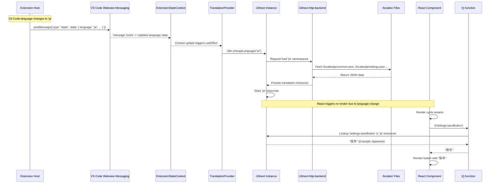

# Chapter 48: Configuration Rules

Continuing from [Chapter 47: Configuration Import/Export](47_configuration_import_export.md), which covered managing the entire Roo-Code configuration, this chapter delves into a more specific aspect: defining and applying **Configuration Rules** to ensure settings are valid, consistent, and presented appropriately to the user.

## Motivation: Enforcing Constraints and Dynamic Behavior

While basic settings allow users to configure values, sometimes more complex logic or constraints are needed to ensure validity, guide users, or enable dynamic behavior based on the configuration state:

1.  **Conditional Settings:** A setting might only be relevant or applicable if another setting has a specific value (e.g., "AWS Secret Key" is only needed if "AWS Authentication Method" is set to "Credentials", not "Profile"). The UI should adapt to hide irrelevant options.
2.  **Inter-Setting Validation:** The validity of one setting might depend on the value of another (e.g., "Max Output Tokens" should not exceed the selected model's known context window size minus a safety buffer). The UI should provide feedback or prevent saving invalid combinations.
3.  **Dynamic Defaults:** While less common for user-facing settings, internal defaults might sometimes depend on other configuration values.
4.  **Enforcing Best Practices:** Discouraging or warning against specific combinations of settings that are known to perform poorly or cause issues (e.g., using a very high temperature with a model not suited for it).

Implementing this logic directly within UI components ([Chapter 35: Settings UI Components (WebView)](35_settings_ui_components__webview_.md)) or scattered throughout the codebase can lead to duplication and make the rules hard to manage or understand. **Configuration Rules** provide a conceptual framework for defining and applying these dependencies and constraints consistently.

*Note: Roo-Code primarily implements these rules implicitly through:*
    *   ***Validation logic within Zod schemas*** ([Chapter 40: Schemas (Zod)](40_schemas__zod_.md)), especially using `.refine()` and `.superRefine()`.
    *   ***Conditional rendering and validation logic*** within settings UI components ([Chapter 35: Settings UI Components (WebView)](35_settings_ui_components__webview_.md)).
    *   ***Dedicated validation functions*** called by the UI or before saving configurations.

**Central Use Case:** A user selects AWS Bedrock as the provider and chooses the "Credentials" authentication method in the Settings UI ([Chapter 35: Settings UI Components (WebView)](35_settings_ui_components__webview_.md)).

1.  **UI Logic Rule (`ApiOptions.tsx`):** The component conditionally renders the input fields for "AWS Access Key ID", "AWS Secret Access Key", and optionally "AWS Session Token" *only* when `apiConfiguration.awsAuthMode === 'credentials'`. It hides fields related to AWS profiles. This rule enhances usability by only showing relevant fields.
2.  **Validation Rule (`validateApiConfiguration` / Schema Refinement):** When the user tries to save, validation logic enforces that if `awsAuthMode === 'credentials'`, then `awsAccessKey` and `awsSecretKey` must not be empty. This rule ensures data integrity. It can be implemented both in a UI validation function (for immediate feedback) and within the Zod schema (`providerSettingsSchema.superRefine`) for a guarantee during persistence.
    ```typescript
    // Conceptual Zod refinement in src/schemas/settings.ts
    providerSettingsSchema.superRefine((data, ctx) => {
        if (data.apiProvider === 'bedrock') {
            if (data.awsAuthMode === 'credentials' && (!data.awsAccessKey || !data.awsSecretKey)) {
                // Add an issue if credentials mode but keys are missing
                ctx.addIssue({
                    code: z.ZodIssueCode.custom,
                    path: ["awsAccessKey"], // Associate error with a field for UI feedback
                    message: "Access Key and Secret Key are required for Credentials auth mode.",
                });
            }
            // Add check for profile mode
            if (data.awsAuthMode === 'profile' && !data.awsProfile) {
                ctx.addIssue({
                    code: z.ZodIssueCode.custom,
                    path: ["awsProfile"],
                    message: "AWS Profile name is required for Profile auth mode.",
                });
            }
            // ... other related Bedrock checks ...
        }
    });
    ```

## Key Concepts

1.  **Implicit vs. Explicit Rules:**
    *   **Implicit:** Rules naturally enforced by the application structure. Examples: basic Zod type checks (`z.number().min(0)`), UI conditional rendering hiding fields, functions ignoring `undefined` optional settings.
    *   **Explicit:** Rules actively defined to enforce dependencies or complex conditions. Implemented via:
        *   **Zod Refinements:** Using `.refine()` (single field) or `.superRefine()` (multiple fields) within schema definitions ([Chapter 40: Schemas (Zod)](40_schemas__zod_.md)). **Ensures data validity on save/load.**
        *   **Conditional UI Logic:** `if`/`switch` or JSX logic (`{condition && ...}`) in UI components ([Chapter 35: Settings UI Components (WebView)](35_settings_ui_components__webview_.md)). **Ensures UI adapts dynamically.**
        *   **Validation Functions:** Separate utility functions (e.g., `validateApiConfiguration`) called by the UI for immediate feedback or complex checks involving external data.

2.  **Zod Refinements (`.refine`, `.superRefine`):** Embed complex validation logic directly into schemas. `.superRefine` is best for rules involving multiple fields, allowing custom error messages attached to specific input paths (`ctx.addIssue({ path: [...] })`).

3.  **Conditional UI Logic:** Settings UI components read the current configuration state (`cachedState`) and dynamically adjust the rendered output – showing/hiding fields, enabling/disabling controls – based on rule conditions.

4.  **External Validation Functions:** Encapsulate validation logic requiring external data (e.g., checking `modelMaxTokens` against fetched `ModelInfo`) or providing immediate UI feedback. Often called within React `useEffect` hooks in the Settings UI.

5.  **Rule Application Points:** Rules are enforced at various stages:
    *   **UI Rendering:** Conditional display/enablement.
    *   **UI Interaction:** Real-time validation feedback, disabling Save button.
    *   **Data Persistence (Save/Load/Import):** Zod schema validation (`parse`/`safeParse`) including refinements.
    *   **Data Usage:** Less common, checks might occur just before using settings.

## Applying Configuration Rules (Examples)

**Use Case 1: Conditional AWS Auth Fields (UI Logic + Zod Refinement)**

*   **Rule:** Show/Require AWS Key/Secret fields only if `apiProvider` is `bedrock` and `awsAuthMode` is `credentials`.
*   **UI (`ApiOptions.tsx`):** Uses JSX conditional rendering based on `selectedProvider` and `awsAuthMode`.
*   **Schema (`providerSettingsSchema`):** Uses `.superRefine` to add validation issues if keys are missing when mode is 'credentials', or profile is missing when mode is 'profile'.
*   **Effect:** UI adapts dynamically; saving invalid combinations is prevented by schema validation during persistence via [Chapter 9: ProviderSettingsManager](09_providersettingsmanager.md).

**Use Case 2: Max Tokens vs. Context Window (Validation Function + Zod Constraint)**

*   **Rule:** User-defined `modelMaxTokens` (max output tokens) should not exceed the selected model's known limits (`contextWindow`, `maxTokens`).
*   **Schema (`providerSettingsSchema`):** `modelMaxTokens: z.number().int().positive().optional()`. Basic constraint.
*   **Validation Function (`validateApiConfiguration` in `webview-ui/src/utils/validation.ts`):** Compares `config.modelMaxTokens` against `modelInfo?.contextWindow` and `modelInfo?.maxTokens` (retrieved from fetched model data). Returns error string if invalid.
*   **UI (`ApiOptions.tsx`):** Calls `validateApiConfiguration` in `useEffect` when relevant values change. Displays error using `ApiErrorMessage`, potentially disabling Save in `SettingsView`.
*   **Effect:** User gets immediate feedback in the UI. The Zod schema ensures it's a positive integer, while the function provides the relational check against the specific model's limits.

**Use Case 3: Ensure Unique Custom Mode Slugs (Zod Refinement)**

*   **Rule:** All modes within the `customModes` array must have unique `slug` values (case-insensitive).
*   **Schema (`customModesSettingsSchema` in `src/schemas/modes.ts`):** Uses `.refine` on the `z.array(modeConfigSchema)` to iterate and check for duplicate slugs using a `Set`, returning `false` (triggering the refinement error) if a duplicate is found.
*   **Application Point:** `CustomModesManager.loadModesFromFile` ([Chapter 10: CustomModesManager](10_custommodesmanager.md)) uses `customModesSettingsSchema.safeParse`. Validation failure prevents loading the configuration file.
*   **Effect:** Prevents corrupted state caused by duplicate mode identifiers during load. The "Create Mode" dialog in the UI ([Chapter 37: Prompts UI Components (WebView)](37_prompts_ui_components__webview_.md)) likely performs a similar check before sending the save message.

## Code Walkthrough

Implementation is distributed across schemas, UI components, and validation utilities.

### Zod Schema Refinements (`src/schemas/*.ts`)

*(See examples in Key Concepts and Use Cases above)*

*   `.refine` and `.superRefine` are attached to Zod object or array schemas.
*   The provided function receives the parsed data (and `ctx` for `superRefine`).
*   It returns `true` or `void` if valid, `false` or calls `ctx.addIssue` if invalid.
*   Error messages and paths (`ctx.addIssue({ path: [...] })`) help pinpoint validation failures for UI feedback.

### Conditional UI Logic (`webview-ui/src/components/settings/ApiOptions.tsx`)

*(See example in Use Cases above)*

*   Uses standard React conditional rendering (`{condition && <JSX />}`) based on state variables (e.g., `selectedProvider`, `awsAuthMode`) derived from the current configuration state (`apiConfiguration` prop).
*   This dynamically shows/hides sections or specific input fields, guiding the user and preventing configuration of irrelevant options.

### Validation Functions (`webview-ui/src/utils/validation.ts` - Conceptual)

*(See example in Use Cases above)*

*   Functions like `validateApiConfiguration` encapsulate checks involving multiple fields or external data (like `ModelInfo`).
*   They return `null` on success or a user-friendly error message string on failure.
*   Called from UI component effects (`useEffect`) or event handlers (`onChange`, `onBlur`) to provide immediate feedback via state updates (`setErrorMessage`).

## Internal Implementation

Rules are checked at different times by different mechanisms:

1.  **UI Rendering:** React evaluates conditional rendering expressions based on current state (`cachedState` in `SettingsView`) during the render cycle.
2.  **UI Validation:** `useEffect` hooks in settings components trigger validation functions when relevant state (`cachedState`) changes. The result updates an error state variable, causing UI feedback (e.g., error message display via `ApiErrorMessage`, Save button disabled in `SettingsView`).
3.  **Save/Load Validation:** When data is loaded (`ProviderSettingsManager.load`, `CustomModesManager.loadModesFromFile`) or about to be saved (`ProviderSettingsManager.store`), `schema.safeParse()` or `schema.parse()` is called. Zod's runtime executes all type, constraint, and refinement checks defined in the schema. If `success: false`, the calling code handles the error (logs, returns default, prevents save).

**Sequence Diagram (Applying Rules during Settings Save):**

*(See diagram in Chapter 47 - Internal Implementation, focusing on the validation steps)*

1.  User changes settings in UI -> `cachedState` updated.
2.  UI validation function runs -> updates `errorMessage` state, potentially disables Save.
3.  User clicks Save (if enabled).
4.  `handleSubmit` sends `postMessage` to Host.
5.  Host handler calls Manager's save/import method.
6.  Manager loads current state (optional, depends on method).
7.  Manager prepares data to be saved.
8.  Manager calls `schema.parse(dataToSave)` or `schema.safeParse(dataToSave)`.
9.  **Zod performs validation, including `.refine`/`.superRefine` rules.**
10. If validation fails, Zod throws or returns `{ success: false }`. Manager catches/checks, logs error, aborts save.
11. If validation succeeds, Manager proceeds to save data to `secrets` or files.
12. Host sends updated state back to UI.

## Modification Guidance

Modifications usually involve adding new rules, changing existing rule logic, or adjusting where rules are enforced.

1.  **Adding a New Rule (e.g., Warn if Temperature > 1.0 for OpenAI):**
    *   **Identify Enforcement:** Hard block or warning? UI feedback or only on save?
    *   **Option A (UI Warning):** Add check to `validateApiConfiguration` utility. Return specific warning string. Update `ApiErrorMessage` to render warnings differently.
    *   **Option B (Save Block - Zod):** Add `.superRefine` to `providerSettingsSchema`. Check `if (data.apiProvider === 'openai' && data.modelTemperature && data.modelTemperature > 1.0) { ctx.addIssue(...) }`. Blocks saving via `ProviderSettingsManager`.
    *   **Recommendation:** UI validation for immediate feedback (warnings/guidance), Zod for essential data integrity guarantees on save.

2.  **Changing Conditional Rendering (e.g., Hide Temperature for Specific Model):**
    *   **`ApiOptions.tsx`:** Modify JSX rendering `TemperatureControl`. Wrap it in condition checking `apiConfiguration.apiModelId` or a flag from fetched `ModelInfo` (e.g., `modelInfo?.supportsTemperature !== false`).

3.  **Modifying a Zod Refinement (e.g., Making Slug Check Case-Sensitive):**
    *   **Locate:** Edit `.refine` function in `customModesSettingsSchema` (`src/schemas/modes.ts`).
    *   **Modify:** Remove `.toLowerCase()` calls when checking/adding slugs in the `Set`. Update error message if needed.

**Best Practices:**

*   **Choose Mechanism Wisely:** Zod for data integrity, UI logic for usability/feedback, validation functions for complex UI checks.
*   **Zod for Persistence:** Rely on Zod schema validation (with refinements) before saving persistent data.
*   **Clear Error Messages:** Provide user-friendly messages (Zod `ctx.addIssue`, UI function returns). Associate Zod errors with `path`.
*   **Co-location:** Define Zod refinements in schemas (`src/schemas/`). Keep UI validation utils near UI code (`webview-ui/src/utils/`).
*   **Performance:** Simple UI logic and Zod checks are usually fast. Debounce complex validation functions running frequently in the UI.
*   **Consistency:** If a rule is critical, enforce it with Zod. UI checks supplement for UX.

**Potential Pitfalls:**

*   **Conflicting/Duplicated Rules:** Implementations differing in UI vs. Zod. Zod is the final gatekeeper for saved data.
*   **Circumvented UI Rules:** Rules only in UI logic bypassed by import/manual edits. Zod catches these.
*   **Complex Refinements:** Difficult-to-debug Zod `.superRefine` logic.
*   **Poor Error Reporting:** Zod errors not translated into meaningful UI feedback.
*   **Migration Necessity:** Adding stricter Zod rules often necessitates data migrations for existing users.

## Conclusion

Configuration Rules are essential for managing the complexity and ensuring the integrity of Roo-Code's settings. While not implemented as a single dedicated engine, these rules are enforced through a combination of Zod schema validations (especially `.refine` and `.superRefine` for cross-field checks), conditional logic within UI components for usability, and dedicated validation functions for immediate feedback. This layered approach allows Roo-Code to guide users through configuration, prevent invalid states, enforce dependencies between settings, and ensure that data persisted or imported meets the required structural and logical constraints, contributing significantly to the application's overall robustness and user experience.

Next, we examine helpers specifically designed to facilitate OAuth authentication flows, connecting Roo-Code securely to external services: [Chapter 49: OAuth Helpers](49_oauth_helpers.md).
---
# Chapter 49: OAuth Helpers

Continuing from [Chapter 48: Configuration Rules](48_configuration_rules.md), which discussed enforcing constraints within settings, this chapter focuses on a specific mechanism used for integrating with external services that require user authentication: **OAuth Helpers**.

## Motivation: Securely Connecting to External Services

Roo-Code might need to integrate with external services that require user authentication via OAuth 2.0. Examples could include:

*   Connecting to a code hosting platform (like GitHub, GitLab) for specific features (e.g., creating issues, fetching private repository information).
*   Integrating with project management tools (e.g., Jira, Asana).
*   Authenticating with certain cloud providers or APIs that use OAuth for user-delegated permissions.

The OAuth 2.0 Authorization Code flow (often enhanced with PKCE) is the standard for third-party applications like VS Code extensions. This flow typically involves:
1.  Redirecting the user to the service's authorization page in their browser.
2.  User logs in and grants permission.
3.  The service redirects the user back to a specific `redirect_uri` registered by the application, providing an authorization `code`.
4.  The application needs to capture this `code` and securely exchange it (along with a client secret or PKCE verifier) for an access token and potentially a refresh token by making a backend request to the service's token endpoint.
5.  The received tokens need to be stored securely (e.g., using `vscode.ExtensionContext.secrets`) for future API calls.

Handling this flow within a VS Code extension presents challenges:
*   **Redirect URI:** Extensions don't typically run a web server to receive redirects. VS Code provides mechanisms like the `vscode.authentication` API or custom URI handlers (`vscode.window.registerUriHandler`).
*   **State Management:** A `state` parameter is needed to prevent Cross-Site Request Forgery (CSRF) attacks and correlate the callback with the initial request.
*   **Token Exchange:** The exchange for tokens usually requires a client secret (which **cannot** be safely stored in the extension) or PKCE. This step often needs to be proxied through a secure backend server controlled by the extension publisher, especially if a client secret is involved.
*   **Secure Token Storage:** Access and refresh tokens are highly sensitive and must be stored using VS Code's secure `secrets` API.
*   **Token Refresh:** Access tokens expire. Logic is needed to automatically use the refresh token to obtain a new access token without requiring the user to re-authenticate constantly.

The **OAuth Helpers** (conceptually located in `src/services/oauth/` or `src/utils/oauth/`) provide utilities and potentially manage the state needed to facilitate these OAuth flows within the VS Code extension environment, **strongly preferring the built-in `vscode.authentication` API** whenever possible and providing guidance or minimal structure for custom flows otherwise.

*Note: Based on the provided project structure, explicit OAuth helpers beyond potentially using the built-in `vscode.authentication` API might not be extensively implemented yet, or might be part of specific service integrations (like a hypothetical GitHub integration). This chapter describes the general concepts and how such helpers *would* function.*

**Central Use Case (Hypothetical - Using `vscode.authentication` for GitHub):** Roo-Code needs to authenticate with GitHub to access private repository data.

1.  User clicks "Connect GitHub Account" in Roo-Code Settings.
2.  The UI triggers a command (e.g., `roo-code.connectGitHub`).
3.  The command handler executes:
    ```typescript
    import * as vscode from 'vscode';
    import { telemetryService } from '../services/telemetry/TelemetryService'; // Assuming singleton telemetry
    import { ContextProxy } from '../core/config/ContextProxy'; // Assuming access to ContextProxy

    async function connectGitHub(contextProxy: ContextProxy) {
        telemetryService.captureEvent('auth.github.start');
        try {
            const scopes = ['repo', 'read:user', 'gist']; // Define required scopes
            // Use VS Code's built-in authentication provider
            // createIfNone: true triggers the login flow if no session exists
            const session = await vscode.authentication.getSession('github', scopes, { createIfNone: true });

            if (session) {
                const token = session.accessToken;
                // Store the token securely using ContextProxy/secrets
                // Ensure 'githubAccessToken' is defined in SECRET_STATE_KEYS in schemas/index.ts
                await contextProxy.setValue('githubAccessToken' as any, token);
                vscode.window.showInformationMessage(`Successfully connected to GitHub as ${session.account.label}!`);
                telemetryService.captureEvent('auth.github.success');
                // Trigger UI state update via ClineProvider.postStateToAllWindows() or similar
            } else {
                 vscode.window.showWarningMessage('GitHub authentication cancelled.');
                 telemetryService.captureEvent('auth.github.cancelled');
            }
        } catch (error: any) {
            vscode.window.showErrorMessage(`GitHub authentication failed: ${error.message}`);
            telemetryService.captureError('auth.github.failed', { error_message: error.message });
        }
    }
    ```
4.  **VS Code Magic:** `vscode.authentication.getSession('github', ...)` handles the entire flow:
    *   Constructs the GitHub authorization URL.
    *   Opens the URL in the browser (`vscode.env.openExternal`).
    *   Listens on an internal callback URI.
    *   User logs in/authorizes on GitHub.
    *   GitHub redirects back; VS Code intercepts the callback.
    *   VS Code verifies state, performs the token exchange securely (using its registered client secret).
    *   VS Code securely stores the access and refresh tokens internally.
    *   VS Code automatically handles refreshing the token.
    *   The `getSession` promise resolves with the `AuthenticationSession` object.
5.  **Token Storage:** The command handler receives the `accessToken` and stores it using `ContextProxy` ([Chapter 11: ContextProxy](11_contextproxy.md)) (which uses `vscode.ExtensionContext.secrets`).
6.  **Completion:** The UI is updated to reflect the connected state.

## Key Concepts

1.  **OAuth 2.0 Flows:** Primarily Authorization Code Grant with PKCE. Avoid Implicit Grant and flows requiring client secrets directly within the extension.
2.  **`vscode.authentication` API (Preferred):**
    *   **`vscode.authentication.getSession(providerId, scopes, options)`:** The core function for leveraging built-in or extension-provided auth providers.
    *   **Benefits:** Handles redirects, callbacks, state/PKCE, secure token exchange, secure token storage, and automatic token refresh. **Significantly simplifies OAuth.**
3.  **Custom Flow (using `registerUriHandler` - Use only if unavoidable):** For providers *not* supported by `vscode.authentication`.
    *   **`vscode.window.registerUriHandler`:** Registers a handler for a custom URI scheme (e.g., `vscode://YourPublisher.YourExtension/authCallback`). The `redirect_uri` sent to the provider must match this.
    *   **`vscode.env.openExternal`:** Opens the authorization URL.
    *   **PKCE Implementation:** Requires manual generation (`crypto` module) and handling of `code_verifier` and `code_challenge`.
    *   **State Management:** Requires manual generation, storage (temporarily), and verification of the `state` parameter.
    *   **Token Exchange:** Requires making an HTTP POST request (e.g., `axios`) to the provider's token endpoint. **Must only use PKCE**, never include a client secret directly. Proxy through a backend if a secret is required.
    *   **Secure Token Storage:** Requires explicitly using `vscode.ExtensionContext.secrets.store` (via `ContextProxy`).
    *   **Token Refresh:** Requires manually implementing the refresh token flow (detect expiration, make refresh request, store new tokens).

4.  **PKCE (Proof Key for Code Exchange):** Essential for custom flows. Generate `code_verifier` (random string), create `code_challenge` (SHA256 hash, base64url encoded). Send challenge in auth request, send verifier in token request.
5.  **Secure Token Storage:** Use `vscode.ExtensionContext.secrets` via `ContextProxy` ([Chapter 11: ContextProxy](11_contextproxy.md)). Define keys in `SECRET_STATE_KEYS` ([Chapter 40: Schemas (Zod)](40_schemas__zod_.md)).
6.  **Backend Proxy for Secrets:** **Mandatory** if a provider requires a client secret for token exchange. The extension sends the auth `code` to the proxy; the proxy holds the secret, exchanges the code, and returns tokens to the extension.

## Using OAuth Helpers

The primary interaction pattern involves triggering an authentication flow via a command and then storing the resulting token securely.

**Example 1: Using `vscode.authentication` (GitHub)**

*(See Central Use Case code example)*
This is the preferred method. Simple call to `getSession`, store token via `ContextProxy`.

**Example 2: Initiating a Custom Flow (GitLab - Conceptual)**

*(See detailed conceptual code in Chapter 49 - Motivation section)*
This involves more manual steps orchestrated potentially by helper functions:
1.  **Command Handler -> `startAuthFlow` helper:** Generates state/PKCE, stores pending data, opens external URL via `vscode.env.openExternal`, returns promise.
2.  **VS Code -> `UriHandler.handleUri`:** Receives callback, validates state, calls `exchangeCodeForToken` helper.
3.  **`exchangeCodeForToken` helper:** Makes POST request (PKCE only).
4.  **`UriHandler.handleUri`:** Stores tokens via `ContextProxy`, resolves original promise.
5.  **Command Handler:** Promise resolves, confirms success.

## Code Walkthrough

Focusing on the preferred `vscode.authentication` approach.

### Using `vscode.authentication`

```typescript
// --- File: src/activate/registerAuthCommands.ts --- (Conceptual)
import * as vscode from "vscode";
import { ContextProxy } from "../core/config/ContextProxy";
import { logger } from "../utils/logging";
import { SECRET_STATE_KEYS } from "../schemas";
import { telemetryService } from "../services/telemetry/TelemetryService";
import { ClineProvider } from "../core/webview/ClineProvider"; // Needed for state update

// Assume 'contextProxy' is available
async function connectGitHub(contextProxy: ContextProxy) {
    logger.info("Attempting GitHub authentication...", { ctx: "Auth" });
    telemetryService.captureEvent('auth.github.start');
    try {
        const scopes = ['repo', 'read:user', 'gist'];
        // Request session, trigger login flow if needed
        // VS Code handles browser, callback, state, PKCE, token exchange, storage, refresh
        const session = await vscode.authentication.getSession('github', scopes, { createIfNone: true });

        if (session) {
            logger.info(`GitHub authentication successful for user: ${session.account.label}`, { ctx: "Auth" });
            const token = session.accessToken;
            const tokenKey = 'githubAccessToken';

            // Ensure key is defined in schema/keys list before storing
            if (!(SECRET_STATE_KEYS as readonly string[]).includes(tokenKey)) {
                 logger.error(`Security Error: Attempted to store token with unmanaged key: ${tokenKey}`, { ctx: "Auth"});
                 throw new Error(`Configuration error: Secret key ${tokenKey} not defined.`);
            }
            // Store token securely using ContextProxy
            await contextProxy.setValue(tokenKey, token);

            vscode.window.showInformationMessage(`Successfully connected to GitHub as ${session.account.label}!`);
            telemetryService.captureEvent('auth.github.success', { username: session.account.label }); // Send anonymized user label if desired

            // Trigger UI update
            await ClineProvider.postStateToAllWindows(); // Refresh state in all UIs

        } else {
            // User cancelled the flow in browser or VS Code dialog
            logger.warn('GitHub authentication cancelled by user.', { ctx: "Auth" });
            vscode.window.showWarningMessage('GitHub authentication cancelled.');
            telemetryService.captureEvent('auth.github.cancelled');
        }
    } catch (error: any) {
        logger.error('GitHub authentication failed', { error: error.message, stack: error.stack, ctx: "Auth" });
        vscode.window.showErrorMessage(`GitHub authentication failed: ${error.message}`);
        telemetryService.captureError('auth.github.failed', { error_message: error.message });
    }
}

export function registerAuthCommands(context: vscode.ExtensionContext, contextProxy: ContextProxy) {
    context.subscriptions.push(
        vscode.commands.registerCommand("roo-code.connectGitHub", () => connectGitHub(contextProxy))
        // ... other commands ...
    );
}

// --- File: src/schemas/index.ts (Ensure key is present) ---
// export const SECRET_STATE_KEYS = [ /* ..., */ "githubAccessToken" ] as const;
// export type SecretState = { /* ... */ githubAccessToken?: string };
```

**Explanation:**

*   The code is straightforward: define scopes, call `getSession`, check the result.
*   On success, the `session.accessToken` is retrieved.
*   A crucial check ensures the intended storage key (`githubAccessToken`) is listed in `SECRET_STATE_KEYS` before calling `contextProxy.setValue`. This prevents accidental storage of secrets under non-secret keys.
*   Success/cancel/error messages are shown to the user.
*   Telemetry events are captured.
*   `ClineProvider.postStateToAllWindows()` (conceptual static method) is called to ensure all open Roo-Code UI instances are updated with the new authentication status (e.g., to show "Connected as..." or enable/disable features).

## Internal Implementation

*   **`vscode.authentication`:** Relies on VS Code's core implementation and auth provider extensions (like Microsoft Authentication, GitHub Authentication). Manages secure token storage (often linked to OS keychain or VS Code account), handles refresh tokens automatically, and orchestrates the browser flow using internal mechanisms.
*   **Custom Flow:** Manual orchestration using `crypto`, `Map`, `vscode.env.openExternal`, `vscode.window.registerUriHandler`, `axios`/`fetch`, and `context.secrets`.

**Sequence Diagram (`vscode.authentication.getSession`):**

*(See diagram in Chapter 49 - Internal Implementation)*

## Modification Guidance

Modifications typically involve integrating a new service.

1.  **Integrating New Service via `vscode.authentication`:**
    *   **Check Provider ID:** Verify if VS Code or a trusted extension provides an authentication provider ID for the service.
    *   **Identify Scopes:** Find the necessary OAuth scopes in the service's API docs.
    *   **Implement Command:** Create a command handler calling `vscode.authentication.getSession` with the correct `providerId` and `scopes`.
    *   **Define Secret Key:** Add a new key (e.g., `myServiceAccessToken`) to `SECRET_STATE_KEYS` and `SecretState` in `src/schemas/index.ts`.
    *   **Store Token:** Use `contextProxy.setValue('myServiceAccessToken', session.accessToken)` after validating the key exists in `SECRET_STATE_KEYS`.
    *   **Use Token:** Retrieve token via `contextProxy.getValue('myServiceAccessToken')`.

2.  **Integrating New Service via Custom Flow (Use `vscode.authentication` if possible!):**
    *   **Verify PKCE:** Ensure the service supports Authorization Code Grant + PKCE without a client secret. If not, **plan for a backend proxy**.
    *   **Implement:** Create `startMyServiceAuthFlow`, `MyServiceUriHandler`, `exchangeMyServiceCodeForToken` helpers following the custom flow pattern (PKCE, state, external browser, URI handler, token exchange, secret storage via `ContextProxy`).
    *   **Register:** Register the command and URI handler.
    *   **Security:** Rigorously implement state validation and PKCE. Store tokens only in `secrets`.
    *   **Refresh Logic (Complex):** Implement manual token refresh if needed.

**Best Practices:**

*   **Prioritize `vscode.authentication`:** Use it whenever the provider is supported.
*   **PKCE for Custom Flows:** Essential security. **NO CLIENT SECRETS IN EXTENSION.**
*   **Proxy Secret-Based Exchanges:** Mandatory if client secret is required.
*   **Secure Token Storage (`secrets`):** Non-negotiable. Use `ContextProxy` and define keys in schemas.
*   **Minimal Scopes:** Request only necessary permissions.
*   **State Parameter:** Use and validate for custom flows.
*   **Clear User Feedback:** Guide the user through the flow, report success/failure/cancellation clearly.
*   **Error Handling:** Handle network errors, API errors, timeouts, state mismatches.

**Potential Pitfalls:**

*   **Security Risks:** Insecure client secrets, insecure token storage, missing state validation (CSRF), incorrect PKCE.
*   **Custom Flow Complexity:** Errors in state management, token exchange, or refresh logic.
*   **Redirect URI Issues:** Mismatches.
*   **Token Refresh Failures (Custom Flow).**
*   **Browser/Network Issues.**

## Conclusion

OAuth Helpers are essential for securely connecting Roo-Code to external services requiring user authentication. The built-in `vscode.authentication` API is the strongly preferred and recommended approach for supported providers like GitHub, as it handles the complexities of the OAuth flow, token exchange, secure storage, and refresh securely and automatically. For unsupported services, a custom flow can be implemented using VS Code APIs like `registerUriHandler` and `openExternal`, but requires careful manual implementation of state management, PKCE, secure token storage via `context.secrets`, and potentially complex refresh logic, while strictly avoiding the inclusion of client secrets within the extension itself (requiring a backend proxy if secrets are mandatory). These helpers enable Roo-Code to securely leverage user-delegated permissions from a variety of external platforms.

Next, we examine the system Roo-Code uses for internationalization (i18n), allowing the UI to be presented in different languages: [Chapter 50: Localization System (i18n)](50_localization_system__i18n_.md).
---
# Chapter 50: Localization System (i18n)

Continuing from [Chapter 49: OAuth Helpers](49_oauth_helpers.md), which discussed authentication flows, this chapter focuses on making Roo-Code accessible to a global audience by implementing internationalization (i18n) and localization (l10n): the **Localization System (i18n)**.

## Motivation: Supporting Multiple Languages

To reach a wider user base and provide a more inclusive experience, it's essential for applications like Roo-Code to display text in the user's preferred language. Hardcoding strings (button labels, descriptions, menu items, error messages, tooltips) directly into the codebase makes translation difficult, error-prone, and hard to maintain.

A dedicated Localization System allows developers to:

1.  **Externalize Strings:** Separate user-visible text from the source code into resource files (e.g., JSON files).
2.  **Translate Resources:** Create language-specific versions of these resource files (e.g., `en.json`, `fr.json`, `ja.json`).
3.  **Load Dynamically:** Detect the user's preferred language (based on VS Code's locale settings) and load the appropriate translations at runtime.
4.  **Provide Fallbacks:** Define a default language (usually English) to use if a translation is missing for the user's locale.
5.  **Format Translations:** Handle plurals, interpolation (inserting dynamic values into strings), and potentially date/number formatting according to locale conventions.

Roo-Code implements such a system using the popular `i18next` library and its companion `react-i18next` for integration with the React-based WebView UI, along with leveraging VS Code's built-in localization mechanisms for extension-level strings (like command titles).

**Central Use Case:** Displaying the "Save" button in the Settings UI ([Chapter 35: Settings UI Components (WebView)](35_settings_ui_components__webview_.md)).

Without i18n:
```jsx
// Hardcoded string
<Button>Save</Button>
```

With i18n (WebView):
```typescript
// --- File: webview-ui/src/components/settings/SettingsView.tsx ---
import { useAppTranslation } from "@src/i18n/TranslationContext";
// ...
const { t } = useAppTranslation(); // Get translation function
// ...
<Button onClick={handleSubmit}>{t("settings:saveButton")}</Button> // Use key
```

1.  **Initialization:** The `i18next` instance is initialized (`i18n/config.ts`) and provided via `TranslationProvider`. The user's VS Code language (e.g., "fr") is detected and passed from the extension host via initial state or messages, stored in `ExtensionStateContext`. `i18next` loads the French translation files (`public/locales/fr/*.json`).
2.  **Component Render:** The `SettingsView` component renders.
3.  **Hook Usage:** It calls `useAppTranslation()` to get the `t` function.
4.  **Translation Lookup:** It calls `t("settings:saveButton")`. `i18next` looks up the key `"saveButton"` within the `"settings"` namespace in the currently loaded language (`fr`).
5.  **Resource File (`public/locales/fr/settings.json`):**
    ```json
    {
      "saveButton": "Enregistrer"
    }
    ```
6.  **Result:** The `t` function returns `"Enregistrer"`.
7.  **Render:** The button renders with the French text "Enregistrer".
8.  **Fallback:** If the user's language was Spanish (`es`), and `es/settings.json` was missing or didn't contain `saveButton`, `i18next` would fall back to the English resource file (`public/locales/en/settings.json`) and render "Save".

## Key Concepts

1.  **`i18next`:** A powerful and popular internationalization framework for JavaScript. Provides core functionality for loading translations, namespaces, language detection, formatting, and fallbacks. Used primarily for the WebView UI. ([https://www.i18next.com/](https://www.i18next.com/))
2.  **`react-i18next`:** Official React integration for `i18next`. Provides hooks (`useTranslation`) and components (`Trans`) for easy use within React components.
3.  **Translation Files (`public/locales/<lang>/<namespace>.json`):** JSON files containing key-value pairs for translations. Organized by language code (e.g., `en`, `ja`) and namespace (e.g., `common.json`, `settings.json`, `mcp.json`, `tools.json`, `welcome.json`, `history.json`, `prompts.json`). Namespaces group related strings.
    *   Located in `public/locales/` so they are served as static assets accessible by the WebView via HTTP requests made by `i18next-http-backend`. The build system ([Chapter 56: Build System](56_build_system.md)) copies this directory to `dist/locales`.
4.  **WebView i18n Initialization (`webview-ui/src/i18n/config.ts`):** Configures `i18next` for the WebView.
    *   **Backend (`i18next-http-backend`):** Loads translation files from `/locales/{{lng}}/{{ns}}.json` via HTTP relative to the WebView's base URI.
    *   **Language Detection/Setting:** Primarily relies on the `language` setting passed from the extension host via the `ExtensionStateContext` ([Chapter 12: ExtensionStateContext](12_extensionstatecontext.md)), which reflects `vscode.env.language`. Can use `i18next-browser-languagedetector` (checking `localStorage`, `navigator.language`) as an initial guess or fallback before the host state is hydrated.
    *   **Fallback Language (`fallbackLng: 'en'`):** English is the default.
    *   **Namespaces (`ns`, `defaultNS`):** Defines all expected namespaces. `defaultNS: 'common'`.
    *   **Debugging:** Enabled in development builds.
5.  **React Context Provider (`TranslationProvider` in `webview-ui/src/i18n/TranslationContext.tsx`):**
    *   Wraps the `App` component (within `AppWithProviders`).
    *   Uses `I18nextProvider` from `react-i18next` to make the `i18next` instance available.
    *   Includes a `useEffect` hook that watches the `language` setting in `ExtensionStateContext`. When it changes, it calls `i18nInstance.changeLanguage()` to dynamically switch the UI language by loading the appropriate resources.
6.  **`useAppTranslation` Hook (`webview-ui/src/i18n/TranslationContext.tsx`):** Custom hook wrapping `react-i18next`'s `useTranslation`. Provides the `t` function and `i18n` instance. Simplifies usage in components.
7.  **`t` Function:** Used to retrieve translations by key: `t('namespace:key')` or `t('key')` (uses default namespace). Supports interpolation `t('key', { var: value })` and pluralization `t('key', { count: num })`.
8.  **`Trans` Component:** Used for translating JSX containing interactive elements (like links, buttons) or complex formatting, ensuring structure is preserved while text is translated. Maps JSX elements to placeholders (like `<1>`, `<3>`) in the translation string.
9.  **Extension Host Localization (`src/i18n.ts`, `package.nls.<lang>.json`):** Uses VS Code's native localization support for static contributions defined in `package.json`.
    *   **`package.json`:** Uses `%key%` syntax for command titles, setting descriptions, etc.
    *   **`package.nls.json`:** Contains English defaults for `%key%` placeholders.
    *   **`package.nls.<lang>.json`:** Contains translations for specific languages. VS Code automatically loads the correct file based on the editor's display language (`vscode.env.language`). These files must be copied to `dist/` by the build system.
    *   **`vscode.l10n.t()` (Potential):** For dynamic strings in host code (notifications, status messages), VS Code provides the `vscode.l10n` API. This requires configuration during bundling (`esbuild-plugin-l10n` or similar) to extract strings and generate localization bundles. Alternatively, a separate host-side `i18next` instance could be used (`tHost` concept).

## Using the Localization System

### WebView UI

1.  **Wrap App:** Ensure `<TranslationProvider>` wraps the root component (`AppWithProviders` in `index.tsx`).
2.  **Get Language from Host:** `ExtensionStateContext` receives the `language` setting from the host ([Chapter 2: ClineProvider](02_clineprovider.md) reads `vscode.env.language`).
3.  **Sync Language:** `TranslationProvider`'s `useEffect` watches the `language` from context and calls `i18nInstance.changeLanguage()` when it changes.
4.  **Use Hook:** In components, `const { t } = useAppTranslation();`.
5.  **Translate Simple Text:** Replace hardcoded strings with `t('namespace:key')`.
6.  **Translate Complex JSX:** Wrap JSX with `<Trans i18nKey="namespace:key">...</Trans>`, ensuring placeholders in JSON match JSX structure.
7.  **Add Strings:** Add keys to `public/locales/en/<namespace>.json` first, then translate in other language files (`public/locales/<lang>/<namespace>.json`). Ensure build copies `public/locales` to `dist/locales`.

### Extension Host

1.  **`package.json` Strings:** Define user-visible contributions using `%key%`. Provide defaults in `package.nls.json`. Provide translations in `package.nls.<lang>.json`. Ensure build copies NLS files to `dist/`.
2.  **Dynamic Strings:** Use `vscode.l10n.t()` (requires build setup) or implement/use `tHost` (e.g., wrapping host-side `i18next`) for strings generated in TypeScript code (e.g., `vscode.window.showInformationMessage(tHost("info:exportComplete"))`).

## Code Walkthrough

### WebView: `i18n/config.ts`

*(See full code in Chapter 50 - Key Concepts)*
*   Configures `i18next` with `HttpBackend` (loads from `/locales/`), `LanguageDetector` (fallback), `initReactI18next`.
*   Sets `loadPath`, `fallbackLng: 'en'`, defines `ns` array, sets `defaultNS: 'common'`.

### WebView: `i18n/TranslationContext.tsx`

*(See full code in Chapter 50 - Key Concepts)*
*   `TranslationProvider`: Gets `language` from `useExtensionState`. Uses `useEffect` to call `i18nInstance.changeLanguage(language)` when the context language changes. Wraps children with `I18nextProvider`.
*   `useAppTranslation`: Custom hook wrapping `react-i18next`'s `useTranslation`.

### WebView: Example Component Usage (`McpView.tsx`)

```typescript
// --- File: webview-ui/src/components/mcp/McpView.tsx ---
import { useAppTranslation } from "@src/i18n/TranslationContext"; // Import hook
import { Trans } from "react-i18next"; // Import Trans component
import { Button } from "@/components/ui/button";
import { VSCodeLink } from "@vscode/webview-ui-toolkit/react";
// ...

const McpView = ({ onDone }: McpViewProps) => {
	const { t } = useAppTranslation(); // Get translation function
    // ... state ...

	return (
		<Tab>
			<TabHeader className="flex justify-between items-center">
				<h3 className="text-vscode-foreground m-0">{t("mcp:title")}</h3> {/* Title */}
				<Button onClick={onDone}>{t("common:done")}</Button> {/* Common key */}
			</TabHeader>

			<TabContent>
				<div className="text-sm text-vscode-descriptionForeground pb-4">
                    {/* Using Trans for embedded links */}
					<Trans i18nKey="mcp:description">
                        {/* Default fallback structure */}
						MCP allows Roo to interact with external tools. Learn more at the
						<VSCodeLink href="https://github.com/modelcontextprotocol" style={{ display: "inline" }}>
							Model Context Protocol website
						</VSCodeLink>
						and find
						<VSCodeLink href="https://github.com/modelcontextprotocol/servers" style={{ display: "inline" }}>
							community-made servers
						</VSCodeLink>
						.
					</Trans>
				</div>
                {/* ... other elements using t() ... */}
            </TabContent>
        </Tab>
    );
}
```
*Explanation:* Uses `t('mcp:title')` and `t('common:done')`. Uses the `Trans` component for the description containing `VSCodeLink` components. The corresponding key `mcp:description` in JSON would use placeholders like `<1>...</1>` and `<3>...</3>`.

### Extension Host: `package.json` / NLS Files

*(See examples in Key Concepts section)*
*   `package.json` uses `%key%`.
*   `package.nls.json` defines English strings.
*   `package.nls.<lang>.json` provides translations.

## Internal Implementation

*   **WebView (`i18next`):**
    1.  `TranslationProvider` syncs language with `ExtensionStateContext`.
    2.  `i18next-http-backend` fetches JSON files for current language via HTTP from the relative `/locales/` path.
    3.  `i18next` stores translations.
    4.  `t('ns:key')` performs lookup, using fallback if needed.
    5.  `Trans` interpolates children into translated string structure.
    6.  Language change triggers resource reload and component re-renders.
*   **Extension Host (NLS):**
    1.  VS Code detects display language.
    2.  Loads appropriate `package.nls.<lang>.json` (or default `package.nls.json`).
    3.  Substitutes `%key%` placeholders in `package.json` contributions.
    4.  Dynamic strings use `vscode.l10n.t()` (if configured) or alternative host-side system.

**Sequence Diagram (WebView Language Change & Translation):**



## Modification Guidance

Modifications primarily involve adding strings, namespaces, or languages.

1.  **Adding a New String:**
    *   **Identify Namespace:** Choose relevant `.json` file (e.g., `settings.json`).
    *   **Add English Key:** Add `key: "Value"` to `public/locales/en/<namespace>.json`.
    *   **Translate:** Add key and translation to `public/locales/<lang>/<namespace>.json` for all other supported languages. Use script `node scripts/find-missing-translations.js` to verify.
    *   **Use:** Call `t('namespace:key')` in WebView, or add `%key%` + NLS entries for host.

2.  **Adding a New Language:**
    *   **WebView (`config.ts`):** Add language code to `supportedLanguages`.
    *   **WebView (Files):** Create `public/locales/<langCode>/`, copy `en` files, translate.
    *   **Host:** Add `package.nls.<langCode>.json`. If using `vscode.l10n`, update build config.
    *   **Test:** Set VS Code language and test.

3.  **Adding a New Namespace:**
    *   **WebView (`config.ts`):** Add namespace name to `ns` array.
    *   **WebView (Files):** Create `<namespace>.json` in *all* `public/locales/<lang>/` folders. Add keys/translations.
    *   **Usage:** Use `t('newNamespace:key')`.

**Best Practices:**

*   **Keys, Not Values:** Use semantic keys.
*   **Namespacing:** Organize logically.
*   **Fallback:** Maintain complete English translations.
*   **Sync Files:** Keep keys consistent across languages. Use validation scripts.
*   **`Trans` Component:** Use for JSX embedding.
*   **Context/Formatting:** Use i18n features for interpolation/plurals.
*   **Separate Concerns:** Use appropriate system for WebView (`i18next`) vs. Host (NLS/%key%, `vscode.l10n`).
*   **Translation Guidelines:** Maintain files like `.roo/rules-translate/` to provide specific instructions for translators (e.g., informal tone, terminology).

**Potential Pitfalls:**

*   **Missing Keys/Translations:** Shows keys or English fallback. Use validation script.
*   **JSON Errors:** Malformed translation files break loading.
*   **Incorrect Paths (`loadPath`):** Backend fails to load files. Check build/copy steps.
*   **Language Sync Issues:** Discrepancy between VS Code language and `i18next` language. `useEffect` in `TranslationProvider` aims to fix this.
*   **Namespace Errors:** Forgetting namespace prefix.
*   **Host vs. WebView Mix-up.**
*   **`Trans` Component Errors:** Mismatched placeholders (`<1>`) between JSX structure and translation string.

## Conclusion

The Localization System enables Roo-Code to provide a user interface understandable to a global audience. By leveraging `i18next` and `react-i18next` in the WebView, strings are externalized into namespaced JSON files, loaded dynamically based on the VS Code locale (primarily driven by VS Code's language setting passed from the host), and integrated into React components using the `t` function and `Trans` component. The extension host utilizes VS Code's built-in NLS mechanism (`%key%` and `package.nls*.json`) for static contributions. This comprehensive approach ensures that user-facing text throughout the extension can be effectively translated and maintained, offering a more inclusive user experience. Detailed translation guidelines (`.roo/rules-translate/`) further ensure consistency and quality across languages.

Next, we revisit communication mechanisms, specifically focusing on the low-level Inter-Process Communication used for features like local MCP servers: [Chapter 51: IPC (Inter-Process Communication)](51_ipc__inter_process_communication_.md).
---
# Chapter 51: IPC (Inter-Process Communication)

Continuing from [Chapter 50: Localization System (i18n)](50_localization_system__i18n_.md), which covered adapting the UI for different languages, this chapter explores how different *processes* within or related to the Roo-Code ecosystem communicate with each other: **Inter-Process Communication (IPC)**.

## Motivation: Connecting Disparate Processes

While much of Roo-Code runs within the single VS Code extension host process and communicates with the WebView UI via a specific message protocol ([Chapter 3: Webview/Extension Message Protocol](03_webview_extension_message_protocol.md)), certain features involve or could involve separate, independent processes:

1.  **MCP Servers (Stdio):** Local MCP servers ([Chapter 19: McpHub / McpServerManager](19_mcphub___mcpservermanager.md)) are often started as child processes (e.g., Node.js scripts, Python scripts, compiled binaries). The main extension needs to send requests (like `tools/call`) to these processes and receive responses reliably over their standard input/output streams.
2.  **Background Services:** Potentially long-running analysis, indexing, or model management tasks might be offloaded to separate background processes (e.g., using Node.js `worker_threads` or `child_process.fork`) to avoid blocking the main extension host thread. Communication is needed to send tasks and receive results.
3.  **External Helper Tools:** Specific functionalities might be implemented as small, standalone command-line tools invoked by the extension (like `ripgrep` in [Chapter 16: Ripgrep Integration](16_ripgrep_integration.md)). Communication involves passing arguments and capturing `stdout`/`stderr`.

These separate processes cannot directly call functions or access memory in the main extension host (or vice-versa). They require a defined mechanism to exchange data and commands – this is Inter-Process Communication. Different scenarios call for different IPC mechanisms.

**Central Use Case:** Roo-Code (via `McpHub`) needs to call the `analyze_complexity` tool provided by a local MCP server (`project-analyzer`) running as a Node.js child process, communicating over standard streams (stdio).

1.  **Process Spawn:** When `McpHub` first connects ([Chapter 19: McpHub / McpServerManager](19_mcphub___mcpservermanager.md)), the `StdioClientTransport` (from `@modelcontextprotocol/sdk`) uses Node.js's `child_process.spawn` to start the server (e.g., `node /path/to/analyzer_server.js`). It keeps references to the child process's `stdin` and `stdout` streams.
2.  **Request:** `McpHub.callTool(...)` is called. The MCP `Client` formats the `tools/call` request as a JSON-RPC message string (e.g., `{"jsonrpc":"2.0","method":"tools/call","params":{...},"id":123}`).
3.  **Serialization & Framing:** The JSON-RPC message is serialized into a UTF-8 string. A newline character (`\n`) is appended as a message delimiter.
4.  **Send (Write to Stdin):** The `StdioClientTransport` writes the framed message (`json_string\n`) to the child process's `stdin` stream.
5.  **Server Receives & Processes:** The `project-analyzer` process has logic (likely using `readline` on `process.stdin`) to read data line by line. It receives the line, parses the JSON-RPC message, identifies the `tools/call` method, executes the `analyze_complexity` logic, and prepares a JSON-RPC response string (e.g., `{"jsonrpc":"2.0","result":{...},"id":123}`).
6.  **Server Sends (Write to Stdout):** The server serializes its response, appends `\n`, and writes it to its `stdout` stream.
7.  **Receive (Read from Stdout):** The `StdioClientTransport` listens to the child process's `stdout`. It buffers data and uses `readline` (or similar) to split it by newlines. When it receives the complete response line, it parses the JSON-RPC message.
8.  **Response Handling:** The transport matches the `id` (123) to the pending request and resolves the promise associated with the `client.request` call, providing the `result` payload back to `McpHub`.

This structured, message-based exchange over standard streams allows the two separate Node.js processes to communicate effectively.

## Key Concepts

1.  **Process Isolation:** Operating systems isolate processes, giving each its own memory space. IPC mechanisms bridge this isolation.
2.  **Communication Channels:** Methods for processes to exchange data. Roo-Code primarily uses:
    *   **Standard Streams (Stdio):** `stdin`, `stdout`, `stderr`. Text-based (often JSON) or binary data piped between parent and child. Requires message framing. Used for local MCP servers, potentially other helpers.
    *   **Network Protocols (HTTP, SSE, WebSockets):** Used for communicating with processes that expose network interfaces (even on `localhost`). SSE is used for remote MCP servers. Not OS-level IPC, but achieves inter-process communication.
    *   **Node.js `child_process`:** Spawns child processes (`spawn`, `exec`, `fork`). `spawn` provides direct stream access (used for Stdio IPC and tools like Ripgrep). `fork` is specific to Node.js child processes and establishes a dedicated IPC channel automatically (suitable for Node.js background workers).
    *   **VS Code Specific:**
        *   **WebView <-> Host:** Uses `postMessage` API brokered by VS Code ([Chapter 3: Webview/Extension Message Protocol](03_webview_extension_message_protocol.md)).
        *   **`vscode.authentication`:** Handles communication for auth flows internally ([Chapter 49: OAuth Helpers](49_oauth_helpers.md)).
3.  **Serialization:** Converting in-memory data (objects, etc.) into a transmissible format (e.g., JSON strings, Buffers). `JSON.stringify()` and `JSON.parse()` are standard for text-based IPC like stdio or HTTP. Schemas for specific IPC messages might be defined (e.g., in `src/schemas/ipc.ts`).
4.  **Message Framing/Delimiting:** Defining message boundaries in stream-based communication.
    *   **Newline Delimiter (`\n`):** Simple method where each complete message ends with a newline. Used by MCP SDK's stdio transport. Requires messages not to contain literal newlines internally (or requires escaping).
    *   **Length Prefixing:** Prepending the byte length of the message before the message itself. More robust for binary data or messages with internal newlines. (Not the primary method shown in Roo-Code's MCP usage).
5.  **Protocols (e.g., JSON-RPC):** Defines the structure of messages (request vs. response), method names, parameters, request IDs, and error formats. JSON-RPC is commonly used over stdio or sockets for RPC-style communication. MCP uses a JSON-RPC-like structure.
6.  **Request/Response Matching:** Using unique IDs (like JSON-RPC `id`) to correlate asynchronous responses with their original requests. The client stores pending requests (e.g., in a `Map`) keyed by ID and uses the ID in the response to find and resolve the correct promise.

## IPC Mechanisms Used in Roo-Code

1.  **Extension Host <-> WebView UI:** VS Code `postMessage` API (JSON serializable data). (See [Chapter 3: Webview/Extension Message Protocol](03_webview_extension_message_protocol.md)).
2.  **Extension Host <-> Local MCP Server (Stdio):** `child_process.spawn` + `stdin`/`stdout` streams + Newline-delimited JSON-RPC messages. Handled largely by `@modelcontextprotocol/sdk`'s `StdioClientTransport`. (See [Chapter 19: McpHub / McpServerManager](19_mcphub___mcpservermanager.md)).
3.  **Extension Host <-> Remote MCP Server (SSE):** HTTP + Server-Sent Events + JSON-RPC messages. Handled largely by `@modelcontextprotocol/sdk`'s `SSEClientTransport`. (See [Chapter 19: McpHub / McpServerManager](19_mcphub___mcpservermanager.md)).
4.  **Extension Host -> Ripgrep Process:** `child_process.spawn` + Command-line arguments (input) + `stdout` capture (output). (See [Chapter 16: Ripgrep Integration](16_ripgrep_integration.md)).
5.  **Extension Host <-> Other Child Processes (Potential):** Could use `child_process.fork` (for Node.js children, provides built-in IPC channel via `process.send`/`child.on('message')`) or `child_process.spawn` with stdio (for any executable, requiring manual message framing and parsing). Schemas for `fork` messages might be defined in `src/schemas/ipc.ts`.

## Code Walkthrough

We focus on the mechanisms explicitly visible or inferred.

### Stdio for Local MCP Servers (`StdioClientTransport` usage in `McpHub`)

*(See full code walkthrough in Chapter 19)*

*   **Spawning:** `new StdioClientTransport({ command, args, options })` configures the child process details.
*   **Starting:** `transport.start()` calls `child_process.spawn`. Crucially pipes `stderr` from the child to the extension host's logger.
*   **Sending:** `client.request(...)` -> `transport.send(jsonRpcString)` -> writes `jsonRpcString + '\n'` to child's `stdin`.
*   **Receiving:** Transport listens to child's `stdout`, uses `readline` (or similar) to buffer and split lines by `\n`, parses JSON-RPC, finds pending request by `id`, resolves promise.
*   **Error/Exit:** Transport listens to `stderr` and process `close`/`error` events to manage connection state and report errors.

### Child Process for Ripgrep (`execRipgrep` in `src/services/ripgrep/index.ts`)

*(See full code walkthrough in Chapter 16)*

*   **Spawning:** `childProcess.spawn(rgPath, args, { stdio: ['ignore', 'pipe', 'pipe'] })`. Input is via `args`.
*   **Output Capture:** Reads `stdout` line by line using `readline`. Captures `stderr` directly.
*   **Framing:** Relies on `rg --json` producing one JSON object per line (newline delimited), or captures raw lines.
*   **Completion:** Promise resolves with captured `stdout` or rejects based on `stderr` content or exit code.

### WebView <-> Host Messaging

*(See full code walkthrough in Chapter 3 and examples in UI chapters)*

*   **WebView -> Host:** `vscode.postMessage(jsonSerializableObject)` (using `acquireVsCodeApi` wrapper).
*   **Host -> WebView:** `panel.webview.postMessage(jsonSerializableObject)`.
*   **Receiving (WebView):** `window.addEventListener('message', (event) => { const data = event.data; ... })`.
*   **Receiving (Host):** `panel.webview.onDidReceiveMessage((message) => { ... })`.
*   **Framing/Serialization:** Handled internally by VS Code. Assumes JSON-serializable data.

### Node.js `fork` IPC (`src/schemas/ipc.ts` & Conceptual Usage)

```typescript
// --- File: src/schemas/ipc.ts --- (Conceptual Schema Definitions)
import { z } from "zod";

// Schema for messages FROM host TO worker
export const workerTaskSchema = z.object({
    id: z.number(), // Unique task ID
    type: z.literal("calculate"), // Example task type
    inputData: z.any(), // Define more strictly based on task
});
export type WorkerTask = z.infer<typeof workerTaskSchema>;

// Schema for messages FROM worker TO host
export const workerResponseSchema = z.union([
    z.object({
        id: z.number(),
        type: z.literal("result"),
        outputData: z.any(), // Define more strictly
    }),
    z.object({
        id: z.number(),
        type: z.literal("error"),
        errorMessage: z.string(),
    }),
    z.object({
        id: z.number().optional(), // Progress update might not have ID
        type: z.literal("progress"),
        message: z.string(),
    }),
]);
export type WorkerResponse = z.infer<typeof workerResponseSchema>;

// --- File: src/backgroundTasks/myWorker.ts --- (Conceptual Worker using Schemas)
import { workerTaskSchema, WorkerResponse } from '../schemas'; // Import schemas

process.on('message', (message) => {
    const taskResult = workerTaskSchema.safeParse(message);
    if (!taskResult.success) {
        console.error("[Worker] Received invalid task message:", taskResult.error);
        // Cannot easily send error back without task ID
        return;
    }
    const task = taskResult.data;
    console.log(`[Worker] Received task ${task.id}:`, task.type);

    try {
        // Example: Send progress update
        process.send?.({ type: 'progress', message: 'Starting calculation...', id: task.id } satisfies WorkerResponse);

        const result = performHeavyCalculation(task.inputData);

        // Send result back
        process.send?.({ type: 'result', id: task.id, outputData: result } satisfies WorkerResponse);

    } catch (error: any) {
        // Send error back
        process.send?.({ type: 'error', id: task.id, errorMessage: error.message } satisfies WorkerResponse);
    }
});
// ...

// --- File: src/services/backgroundService.ts --- (Conceptual Host using Schemas)
import { workerResponseSchema, WorkerResponse } from '../schemas'; // Import schema
// ... (ensureWorker, pendingTasks map, etc.) ...

function setupWorkerListeners(worker: childProcess.ChildProcess) {
     worker.on('message', (message) => {
        const responseResult = workerResponseSchema.safeParse(message);
        if (!responseResult.success) {
            logger.error("Received invalid message from worker:", responseResult.error, { ctx: "IPC.Worker" });
            return;
        }
        const response = responseResult.data;
        logger.debug("Received validated message from worker:", response, { ctx: "IPC.Worker" });

        // Handle progress messages separately maybe
        if (response.type === 'progress') { /* Log progress */ return; }

        // Find pending task by ID (required for result/error)
        if (response.id === undefined) return;
        const task = pendingTasks.get(response.id);
        if (task) {
            pendingTasks.delete(response.id);
            if (response.type === 'result') {
                task.resolve(response.outputData);
            } else if (response.type === 'error') {
                task.reject(new Error(response.errorMessage || "Worker error"));
            }
        }
    });
    // ... error/exit listeners ...
}
// ...
```

**Explanation:**

*   **Schemas (`ipc.ts`):** Defines Zod schemas (`workerTaskSchema`, `workerResponseSchema`) for messages passed between the host and a potential background worker using `child_process.fork`. This provides validation and type safety for the IPC messages themselves.
*   **Worker:** Parses incoming messages using `workerTaskSchema.safeParse`. Constructs responses conforming to `workerResponseSchema` before calling `process.send`.
*   **Host:** The `message` handler in `setupWorkerListeners` uses `workerResponseSchema.safeParse` to validate messages received from the worker before processing them and resolving/rejecting the corresponding task promise.

## Internal Implementation

*   **Stdio:** Node.js `child_process.spawn` creates OS pipes. `stdin.write`, `stdout.on('data')`. `readline` for framing.
*   **SSE:** `SSEClientTransport` uses `ReconnectingEventSource` (HTTP GET for stream). Requests might use `axios` POST.
*   **`child_process.spawn` (General):** Creates OS process, Node streams interface with OS pipes.
*   **`child_process.fork`:** Specialized `spawn` for Node.js scripts. Automatically sets up an IPC channel (often pipes). `process.send`/`.on('message')` use this channel with built-in V8 serialization (handles more types than JSON, but only Node-to-Node).
*   **VS Code `postMessage`:** Internal VS Code mechanism for host <-> WebView communication. Handles serialization.

## Modification Guidance

Modifications typically involve adding communication with new types of processes or changing the protocol/framing for stdio/socket communication.

1.  **Adding Communication with a Python Script via Stdio (JSON-RPC):**
    *   **Python Script (`my_script.py`):** Implement JSON-RPC handling. Read `sys.stdin` line by line, `json.loads` request, process method/params, `json.dumps` response (with `id`), write to `sys.stdout`, `flush=True`.
    *   **Host Code:** Use `child_process.spawn('python', ['/path/to/my_script.py'])`. Implement client-side JSON-RPC over stdio: manage request IDs, write `json.dumps(req)\n` to stdin, use `readline` on stdout, parse `json.loads(line)`, match `id`, resolve promise. Or adapt the MCP SDK's `StdioClientTransport` if possible.

2.  **Changing Stdio Framing to Length Prefixing:**
    *   **Transport Logic:** Modify both client and server transports.
        *   **Sending:** Calculate message UTF-8 byte length. Write length (e.g., 4-byte Big Endian integer). Write message buffer.
        *   **Receiving:** State machine: Read 4 bytes for length. Parse length `L`. Read exactly `L` bytes for the message. Parse message (e.g., JSON). Handle partial reads across buffer chunks.
    *   **Impact:** Requires changes on both ends. More complex but robust.

3.  **Using `child_process.fork` for a Complex Node.js Task:**
    *   Implement worker script (`myWorker.ts`) using `process.on('message')` / `process.send`.
    *   Implement host service (`backgroundService.ts`) using `child_process.fork`, `worker.send`, `worker.on('message')`, manage pending requests (promises + Map).
    *   Define message structures using Zod schemas in `src/schemas/ipc.ts`. Validate messages on both ends using `safeParse`.

**Best Practices:**

*   **Choose Appropriate Mechanism:** Match IPC choice to process type and communication needs (Stdio for simple parent-child CLI/server, SSE/HTTP for network, `fork` for Node workers, `postMessage` for WebView).
*   **Standardize Protocol:** Use JSON-RPC or define clear message schemas (Zod) for structured communication.
*   **Robust Framing:** Essential for stream-based IPC (stdio, sockets). Newlines are simple but fragile; length prefixing is better. `fork` handles it automatically.
*   **Serialization:** Use JSON unless binary performance is critical. Validate using Zod schemas.
*   **Error Handling:** Handle connection errors, process exit errors, `stderr`, parsing errors, timeouts. Define error message formats.
*   **Resource Management:** Terminate processes, close streams/sockets/handles, remove listeners.
*   **Asynchronicity:** Use `async/await`.

**Potential Pitfalls:**

*   **Framing/Parsing Errors:** Corrupted messages in stream-based IPC.
*   **Process Management:** Zombie processes, spawn failures, unhandled exits.
*   **Deadlocks:** Waiting indefinitely for responses (need timeouts).
*   **Buffering Issues:** Data delays or fragmentation in streams. Stdio buffers can fill.
*   **Cross-Platform:** Path, environment, shell differences affecting child processes.
*   **Security:** Unvalidated data/commands passed between processes.

## Conclusion

Inter-Process Communication is essential for enabling different parts of the Roo-Code ecosystem, particularly the extension host and external processes like local MCP servers or CLI tools, to collaborate effectively despite running in isolated memory spaces. Roo-Code utilizes appropriate mechanisms like the structured newline-delimited JSON-RPC over stdio provided by the MCP SDK, direct `child_process.spawn` with stdout/stderr capture for tools like Ripgrep, and the specialized `postMessage` API for WebView interaction. Defining message structures with Zod schemas (`src/schemas/ipc.ts`) adds type safety and validation to these communication channels. Understanding the chosen IPC mechanism, the importance of serialization and message framing, and the need for robust error handling is key to debugging and extending Roo-Code's interactions with separate processes.

Next, we examine how Roo-Code collects and reports usage data and errors for monitoring and improvement: [Chapter 52: TelemetryService](52_telemetryservice.md).
---
# Chapter 52: TelemetryService

Continuing from [Chapter 51: IPC (Inter-Process Communication)](51_ipc__inter_process_communication_.md), which discussed how different processes communicate, this chapter focuses on how the Roo-Code extension gathers anonymous usage data and error information to help improve the product: the **TelemetryService**.

## Motivation: Understanding Usage and Improving Roo-Code

To make Roo-Code better, the development team needs insights into how it's being used and where problems occur. Gathering anonymous telemetry data helps answer questions like:

*   Which features, commands, or tools ([Chapter 8: Tools](08_tools.md)) are most popular?
*   Which LLM providers ([Chapter 5: ApiHandler](05_apihandler.md)) and models are commonly used?
*   How often do specific errors (API errors, validation failures ([Chapter 40: Schemas (Zod)](40_schemas__zod_.md)), tool errors) occur?
*   What is the typical duration or token usage ([Chapter 29: Cost Calculation Utilities](29_cost_calculation_utilities.md)) of tasks?
*   Are users encountering issues with specific configurations (e.g., shell integration issues detected via `no_shell_integration` event from [Chapter 15: Terminal Integration](15_terminal_integration.md))?
*   Are custom modes ([Chapter 10: CustomModesManager](10_custommodesmanager.md)) being utilized?

Collecting this data, while **strictly respecting user privacy and anonymity**, allows the team to prioritize development efforts, identify bugs, improve performance, and make data-driven decisions about the product's future direction. Developing without this feedback makes it hard to address real user needs and pain points effectively.

The `TelemetryService` provides a centralized mechanism for:
1.  **User Consent:** Explicitly requiring user opt-in for telemetry collection. No data is sent unless the user enables the setting. A clear notification or setup step should prompt the user initially.
2.  **Centralized Reporting API:** Offering simple methods (`captureEvent`, `captureError`, `captureException`, `captureSchemaValidationError`) for different parts of the codebase to easily record significant events or errors.
3.  **Anonymization:** Ensuring that collected data **never** includes personally identifiable information (PII) like file contents, specific user prompts/responses, API keys, full file paths, commit messages, etc. Focuses on aggregated counts, feature usage patterns, anonymized configuration types, and sanitized error information.
4.  **Context Enrichment:** Automatically adding relevant, non-sensitive context to events, such as the Roo-Code version, VS Code version, platform (OS), session ID, and potentially anonymized/generalized configuration details (e.g., provider *name* but not keys, mode *slug* but not custom instructions).
5.  **Backend Integration:** Sending the collected, anonymized data to a secure backend service (like PostHog) for aggregation and analysis. Handles initialization and shutdown of the backend client.

**Central Use Case:** A user runs a "Fix Code" action ([Chapter 30: CodeActionProvider](30_codeactionprovider.md)), and the underlying API call to the LLM results in a rate limit error. The user has opted **in** to telemetry.

1.  **User Opt-in:** During initial setup or via settings ([Chapter 35: Settings UI Components (WebView)](35_settings_ui_components__webview_.md)), the user enables the telemetry setting. The `TelemetryService` reads this setting (`telemetrySetting`) via `ContextProxy` ([Chapter 11: ContextProxy](11_contextproxy.md)) and sets its internal `enabled` flag to `true`.
2.  **Action Invoked:** The command handler for `roo-cline.fixCode` calls `telemetryService.captureEvent("codeaction.invoked", { command: "roo-cline.fixCode", mode: currentModeSlug })`.
3.  **API Error:** The `ApiHandler` ([Chapter 5: ApiHandler](05_apihandler.md)) catches the rate limit error from the SDK.
4.  **Error Reporting:** Error handling logic calls `telemetryService.captureError("api_error", { provider: "openai", modelId: "gpt-4", errorType: "rate_limit" })`.
5.  **`TelemetryService` Logic (`captureEvent`, `captureError`):**
    *   Checks `this.enabled` (true).
    *   Retrieves common properties (version, platform, session ID, anonymous `distinctId`). Gets provider context (e.g., `current_mode`).
    *   Merges common, provider, and event-specific properties.
    *   Calls `sanitizeProperties` to remove potential PII (e.g., ensures `modelId` isn't a sensitive custom name, removes hypothetical path properties).
    *   Calls the backend client's method (e.g., `this.posthogClient?.capture({ distinctId, event: "roo_codeaction.invoked", properties: sanitizedProps })` and `this.posthogClient?.capture({ distinctId, event: "roo_error_api_error", properties: sanitizedProps })`).
6.  **Backend:** The PostHog service receives and aggregates these anonymized events, allowing developers to see code action usage frequency and API error rates per provider/model type.

If the user had opted **out**, step 5 would check `this.enabled` (false) and immediately return without sending any data.

## Key Concepts

1.  **User Consent (`telemetrySetting`):** A dedicated setting (`"enabled"`, `"disabled"`, `"unset"`) stored via `ContextProxy` ([Chapter 11: ContextProxy](11_contextproxy.md)). The service respects this setting rigorously. Initial state (`"unset"`) should trigger a prompt or notification asking for consent via `vscode.window.showInformationMessage`.
2.  **Anonymity & PII Avoidance:** The absolute highest priority. **No sensitive or user-identifiable data should ever be sent.** This includes: user code, prompts/responses, file contents, API keys, full file paths, specific user-defined names (custom modes, API profiles - use slugs or types instead), commit messages, detailed error messages containing user data. Focus on event counts, feature flags, command IDs, provider *names*, generic model *types*, error *types*, durations, boolean flags, sanitized configuration values.
3.  **`TelemetryService` Class (`src/services/telemetry/TelemetryService.ts`):**
    *   **Singleton:** Instantiated once during extension activation.
    *   **Initialization (`init`):** Takes `ExtensionContext`, `ContextProxy`. Reads consent, initializes backend client (PostHog) if enabled and API key is available (via build-time environment variable `process.env.POSTHOG_PROJECT_API_KEY`). Generates session ID, gathers static context (versions, platform).
    *   **Consent Management (`updateConsent`):** Re-reads the setting and enables/disables the service, shutting down or initializing the PostHog client as needed.
    *   **Core Methods:** `captureEvent`, `captureError`, `captureException`, `captureSchemaValidationError`. Adds standard prefixes (`roo_`, `roo_error_`) to event names.
    *   **Context Enrichment:** The internal `_capture` method merges event `properties` with `commonProperties` (OS, versions, session ID) and dynamic `providerContext` (e.g., current mode slug) before sanitization.
    *   **Sanitization (`sanitizeProperties`):** A crucial helper function (`src/services/telemetry/sanitize.ts`) that iterates through event properties and removes or masks potential PII based on key names, value length, or heuristics.
    *   **Backend Client (`posthog-node`):** Uses the `PostHog` client library. Configured with API key and host (from environment variables). Handles batching, retries, and asynchronous sending. `enableGeoip: false` is set for privacy.
    *   **Shutdown (`shutdown`):** Flushes buffered events using `posthogClient?.shutdown()`. Called during extension deactivation.
    *   **Provider Context (`setProvider`):** Allows linking to the active `ClineProvider` ([Chapter 2: ClineProvider](02_clineprovider.md)) to fetch non-sensitive context like the current mode slug. Uses `WeakRef` to avoid memory leaks.

4.  **Session/User IDs:**
    *   **Session ID:** `crypto.randomUUID()` generated per VS Code session. Groups events within a single run.
    *   **Distinct ID (User):** Uses `vscode.env.machineId` (a unique, anonymous ID per VS Code installation). Allows correlating events from the same installation over time without identifying the user. Handles the default test value `someValue.machineId`.

5.  **Event Structure:** Uses PostHog's format: `event` name (string), `distinctId` (anonymous user ID), `properties` (key-value object with event data + context). Standard PostHog properties like `$os` are included in `commonProperties`. Event names are prefixed (e.g., `roo_codeaction.invoked`).

6.  **Sanitization Logic (`sanitizeProperties`):** Needs careful implementation to remove known sensitive keys, long strings (potential prompts/code), and paths, while allowing safe context values.

## Using the TelemetryService

The service is typically obtained as a singleton instance (`export const telemetryService = new TelemetryService();`) and its methods are called from various points in the codebase where significant events or errors occur.

**1. Initialization (Extension Activation):**

```typescript
// --- File: src/extension.ts ---
import { TelemetryService } from "./services/telemetry/TelemetryService";
import { ContextProxy } from "./core/config/ContextProxy";
import * as vscode from "vscode";
import { ClineProvider } from "./core/webview/ClineProvider";

export const telemetryService = new TelemetryService(); // Create singleton

// Helper to prompt user for consent if needed
async function ensureTelemetryConsent(contextProxy: ContextProxy): Promise<void> {
    const currentSetting = contextProxy.getValue("telemetrySetting" as any);
    if (currentSetting === 'unset' || currentSetting === undefined) {
        const selection = await vscode.window.showInformationMessage(
            "Help improve Roo Code by sending anonymous usage data and crash reports? No personal data or code is ever sent. You can change this later in settings.",
            { modal: true },
            "Enable Telemetry", // User explicitly enables
            "Disable Telemetry" // User explicitly disables
        );
        const settingValue = selection === "Enable Telemetry" ? "enabled" : "disabled";
        await contextProxy.setValue("telemetrySetting" as any, settingValue);
        // TelemetryService will be updated via onDidChangeConfiguration listener
        telemetryService.captureEvent("consent.set", { consent_given: settingValue === "enabled", source: "initial_prompt" });
    }
}

export async function activate(context: vscode.ExtensionContext) {
    // ... Create ContextProxy first ...
    const contextProxy = new ContextProxy(context);
    await contextProxy.initialize();

    // Initialize Telemetry AFTER Proxy is ready
    await telemetryService.init(context, contextProxy);

    // Create Provider and link it AFTER telemetry is initialized
    // (Provider constructor might capture init events)
    const provider = new ClineProvider(context, outputChannel);
    telemetryService.setProvider(provider); // Allow telemetry to get context

    // Prompt for consent if needed
    await ensureTelemetryConsent(contextProxy);

    // Listen for setting changes to update consent dynamically
    context.subscriptions.push(vscode.workspace.onDidChangeConfiguration(async e => {
        if (e.affectsConfiguration('roo-code.telemetrySetting')) { // Use actual setting ID
            const oldEnabled = telemetryService['enabled']; // Access internal state for comparison
            await telemetryService.updateConsent(contextProxy);
            if (oldEnabled !== telemetryService['enabled']) { // Capture consent change event
                 telemetryService.captureEvent("consent.updated", { consent_given: telemetryService['enabled'], source: "settings_change" });
            }
        }
    }));
    // ... Register commands, providers etc. ...
}

export async function deactivate(): Promise<void> {
    await telemetryService.shutdown(); // Flush events on exit
}
```
*Explanation:* Creates the singleton. Calls `init` after `ContextProxy`. Links the provider using `setProvider`. Crucially, it includes `ensureTelemetryConsent` to prompt the user if the setting is `unset` and saves their choice. It also listens for configuration changes to update consent dynamically using `updateConsent`. `deactivate` calls `shutdown`.

**2. Capturing Events:**

```typescript
// --- File: src/activate/registerCodeActions.ts ---
import { telemetryService } from "../services/telemetry/TelemetryService";
// ... inside command handler ...
    vscode.commands.registerCommand(command, async (...args: any[]) => {
        telemetryService.captureEvent("codeaction.invoked", { command }); // Basic event
        // ...
    });

// --- File: src/core/tools/writeToFileTool.ts ---
    // ... after successfully writing file ...
    telemetryService.captureEvent("tool.executed", {
        tool_name: "write_to_file",
        success: true,
        duration_ms: Date.now() - startTime, // Example duration
        // Avoid path: relPath (potential PII if project structure is unique)
    });
```
*Explanation:* Call `telemetryService.captureEvent` with a descriptive name (e.g., `feature.subfeature.action`) and relevant, **non-sensitive** properties.

**3. Capturing Errors:**

```typescript
// --- File: src/api/providers/anthropic.ts (Conceptual Error Handling) ---
    } catch (error: any) {
        const errorType = /* classify error (e.g., 'rate_limit', 'auth', 'bad_request') */;
        telemetryService.captureError("api_error", {
            provider: "anthropic",
            modelId: this.getModel()?.id, // Sanitized ID
            errorType: errorType,
            statusCode: error?.status,
        });
        throw error;
    }

// --- File: src/core/config/CustomModesManager.ts ---
    // ... inside loadModesFromFile, after safeParse ...
    if (!result.success) {
        telemetryService.captureSchemaValidationError({
            schemaName: "CustomModesSettings", // Identify the schema
            error: result.error // Pass the ZodError
        });
        // ... handle error ...
    }
```
*Explanation:* Use `captureError` for handled errors, providing useful categorization (provider, error type). Use `captureSchemaValidationError` for Zod errors; the service extracts safe information (paths, counts). Use `captureException` in global error handlers for uncaught exceptions.

## Code Walkthrough

### TelemetryService Class (`src/services/telemetry/TelemetryService.ts`)

*(See full code in Key Concepts section)*

**Key Implementation Details:**

*   **`init`:** Sets up `commonProperties`, calls `updateConsent`.
*   **`updateConsent`:** Reads setting via `ContextProxy`. Shuts down/initializes `PostHog` client based on `enabled` state and presence of `posthogProjectApiKey`. Logs state changes.
*   **`setProvider`/`getProviderContext`:** Uses `WeakRef` to link to `ClineProvider` and fetch non-sensitive context like `current_mode`. Includes error handling.
*   **`_capture`:** Central method. Checks `enabled`. Merges properties. **Calls `sanitizeProperties`**. Calls `posthogClient.capture`. Logs debug info/errors.
*   **Public Methods:** Add `roo_` prefixes, prepare specific properties (like limited stack for exceptions, paths/counts for schema errors), call `_capture`.
*   **`shutdown`:** Calls `posthogClient.shutdown()`.

### Sanitization (`src/services/telemetry/sanitize.ts` - Conceptual)

*(See conceptual code in Key Concepts section)*

*   Iterates through properties.
*   Applies rules based on key names (skip `key`, `secret`, `token`, etc.).
*   Applies rules based on value characteristics (truncate/omit long strings, omit path-like strings).
*   **Must be carefully implemented and reviewed.**

## Internal Implementation

1.  **Event Trigger:** Code calls `telemetryService.capture...()`.
2.  **Consent Check:** Service checks `this.enabled`. If false, returns.
3.  **Context/Sanitize:** `_capture` merges context, calls `sanitizeProperties`.
4.  **Client Call:** `_capture` calls `posthogClient.capture()`.
5.  **PostHog Client Buffering:** `posthog-node` library adds event to an internal buffer.
6.  **Async Send:** Periodically, or when buffer limits reached, the client sends batches via HTTPS to PostHog. Handles retries.
7.  **Shutdown:** `telemetryService.shutdown()` -> `posthogClient.shutdown()` attempts final flush of buffer.

**Sequence Diagram (Capture Event):**

*(See diagram in Chapter 52 - Internal Implementation)*

## Modification Guidance

Modifications involve adding events, changing context, or updating sanitization.

1.  **Adding a New Tracked Event:**
    *   **Identify Trigger:** Find code location.
    *   **Call `captureEvent`:** Add `telemetryService.captureEvent("my_event", { property: safeValue })`.
    *   **Data:** Include only relevant, **non-sensitive** properties.
    *   **Sanitize:** Ensure `sanitizeProperties` handles new properties correctly or update it.

2.  **Adding More Context:**
    *   **Common Properties (`init`):** Add static, safe data (e.g., `vscode.env.uiKind`).
    *   **Provider Context (`getProviderContext`):** Add logic to get more non-sensitive state from `ClineProvider`.
    *   **Event Properties:** Pass more relevant, safe data directly via `captureEvent`.

3.  **Refining Sanitization (`sanitizeProperties`):**
    *   **Edit `sanitize.ts`:** Add more sensitive key patterns. Improve path detection/anonymization. Adjust length thresholds. Add recursive sanitization carefully.
    *   **CRITICAL:** Test rigorously to prevent PII leaks.

4.  **Changing Telemetry Backend:**
    *   Replace `posthog-node` library and client initialization/calls in `TelemetryService` (`init`, `_capture`, `shutdown`) with the new backend's SDK. Ensure consent and sanitization remain central.

**Best Practices:**

*   **Privacy First & Opt-In:** Non-negotiable. Rigorous sanitization, clear consent prompt. Default to disabled/unset.
*   **Centralized Service:** Use the singleton.
*   **Sanitize Rigorously:** Continuously review `sanitizeProperties`. Err on the side of removing data.
*   **Meaningful Events:** Track actionable insights. Avoid noise.
*   **Safe Context:** Only add non-sensitive context.
*   **Graceful Failure:** Service failures shouldn't crash the extension.
*   **Shutdown:** Implement `shutdown` for data flushing.
*   **Transparency:** Document data collection practices clearly (e.g., README, privacy notice).

**Potential Pitfalls:**

*   **PII Leakage:** Insufficient sanitization is the primary risk.
*   **Consent Bypass:** Bugs sending data when disabled.
*   **Performance:** Excessive event capture (unlikely with batching).
*   **Network/Backend Issues:** Data loss if backend unavailable.
*   **Sanitization Complexity/Errors:** Bugs in `sanitizeProperties`. Over-sanitization losing useful (anonymous) data.

## Conclusion

The `TelemetryService` provides a crucial, privacy-conscious mechanism for collecting anonymous usage data and error information from Roo-Code installations where users have explicitly opted in. By centralizing event capture, rigorously sanitizing data to remove PII, enriching events with safe context, and integrating with a backend like PostHog, the service provides valuable insights for the development team to improve the extension based on real-world usage patterns and identify recurring problems. Respecting user consent and prioritizing privacy through careful implementation (especially `sanitizeProperties`) and configuration are paramount.

Next, we explore the system designed for evaluating Roo-Code's performance on predefined tasks: [Chapter 53: Evals System](53_evals_system.md).
---
# Chapter 53: Evals System

Continuing from [Chapter 52: TelemetryService](52_telemetryservice.md), which focused on collecting anonymous usage data for product improvement, this chapter introduces a system designed for more structured and objective assessment of Roo-Code's capabilities: the **Evals System**.

## Motivation: Measuring and Improving AI Performance

While user feedback and telemetry provide valuable insights, objectively measuring the quality and performance of an AI assistant like Roo-Code requires a more systematic approach. We need a way to:

1.  **Define Test Cases:** Create a standardized set of realistic tasks (prompts, context, expected outcomes) that represent common user scenarios (e.g., "refactor this function", "explain this error", "write a unit test", "use tool X").
2.  **Run Automatically:** Execute Roo-Code against these test cases using different models, configurations, or code versions in a repeatable manner, independent of the interactive VS Code UI.
3.  **Capture Outputs:** Record the AI's full response, including generated text, code modifications requested via tools, actual tool usage sequences, token counts, and costs for each test case.
4.  **Evaluate Results:** Compare the captured outputs against predefined criteria (or using subsequent LLM-based evaluation) to assess performance metrics like correctness, helpfulness, efficiency (token usage, cost, time), safety (avoiding harmful actions), and adherence to instructions.
5.  **Track Progress:** Monitor how changes to prompts ([Chapter 7: SystemPrompt](07_systemprompt.md)), models, context strategies ([Chapter 23: Sliding Window Context Management](23_sliding_window_context_management.md)), or tool implementations ([Chapter 8: Tools](08_tools.md)) affect performance over time, preventing regressions and guiding improvements.

The **Evals System** provides the framework and tooling to define, run, and potentially analyze these evaluation tasks, enabling data-driven development and quality assurance for Roo-Code's core AI functionality. It often involves defining test suites (YAML or JSON), a runner script to execute them, and potentially a web interface for reviewing results.

**Central Use Case:** A developer modifies the main system prompt ([Chapter 7: SystemPrompt](07_systemprompt.md)) and wants to ensure it doesn't negatively impact code generation quality for Python.

1.  **Define Eval Suite:** An `evals/suites/python_codegen.yaml` file defines several test cases, each with:
    *   `id`: Unique identifier (e.g., `py_fib_recursive`).
    *   `prompt`: The user-like instruction (e.g., "Write a Python function to calculate Fibonacci numbers recursively").
    *   `context`: (Optional) Relevant code snippets or file paths to include.
    *   `criteria`: (Optional) Description of what constitutes a successful response (e.g., "Function should be recursive, handle base cases, and be syntactically correct Python.").
    *   `config_overrides`: (Optional) Specific settings (model ID, mode slug like "code") to use for this test.
2.  **Run Evals:** The developer executes a script from the `evals/` directory (e.g., `pnpm start --suite python_codegen --model gpt-4-turbo`).
3.  **Eval Runner (`runEval.ts` / `evaluateTask.ts`):**
    *   The script reads `python_codegen.yaml`.
    *   For each test case:
        *   It simulates setting up the specified context (if any, potentially using temporary files).
        *   It programmatically invokes Roo-Code's task execution logic (likely via a dedicated entry point `runRooCodeTaskForEval` or direct `Cline` instantiation with mocks), passing the prompt and merged configuration (base + overrides).
        *   It captures the *entire* sequence of `ClineMessage`s ([Chapter 14: Task Persistence](14_task_persistence.md) uses `ui_messages.json`) generated during the task execution by listening to events or processing the stream returned by the entry point.
        *   It extracts final metrics (token usage, cost, time) from the transcript or execution result.
        *   It saves the results (input prompt, context, config used, full output transcript, metrics) to a structured JSON output file (e.g., `evals/output/<timestamp>/python_codegen/gpt-4-turbo/py_fib_recursive.json`).
4.  **Review Results:** The developer examines the output JSON files or uses a dedicated web UI (`evals-web/`) that loads and displays the results side-by-side, potentially comparing outputs from different models or code versions. They assess if the generated Python code in the `transcript` meets the `criteria`.
5.  **Analysis:** Based on the review, the developer decides if the system prompt change was beneficial or introduced regressions for Python code generation.

## Key Concepts

1.  **Evaluation Suites (`evals/suites/*.yaml`):** Files defining sets of test cases. YAML is preferred for readability. Each file represents a suite focused on a specific capability or scenario.
2.  **Test Case Structure (`EvalTask`):** Defined by a Zod schema (`evalTaskSchema` in `evals/schemas/evalTask.ts`) ([Chapter 40: Schemas (Zod)](40_schemas__zod_.md)). Includes fields like `id` (unique string), `prompt` (string), `context` (optional object mapping file paths to content or specifying URLs), `criteria` (optional string), `config_overrides` (optional partial configuration object to override base settings for this specific task).
3.  **Eval Runner (`evals/src/runEval.ts`, `evaluateTask.ts`):** The core script(s) orchestrating the evaluation process, run using Node.js.
    *   **Argument Parsing:** Uses `yargs` ([Chapter 55: Script Utilities](55_script_utilities.md)) to accept command-line arguments like `--suite`, `--model`, `--outputDir`.
    *   **Suite Loading:** Reads/parses YAML suite files using `js-yaml`, validates against `evalTaskSchema` using Zod. Uses file finding helpers ([Chapter 55: Script Utilities](55_script_utilities.md)).
    *   **Task Execution (`evaluateTask`):** Handles a single task execution:
        *   **Context Setup:** Creates temporary files/environment based on `task.context`.
        *   **Config Merging:** Merges base eval configuration with `task.config_overrides` and the specific `--model` being tested. Requires access to API keys (likely via environment variables).
        *   **Invokes Roo-Code Core:** Calls the programmatic entry point (e.g., `runRooCodeTaskForEval`) with prompt, context, and config.
        *   **Captures Transcript:** Listens for all `ClineMessage` events or iterates through a returned stream, storing them in an array.
        *   **Captures Metrics:** Extracts final token usage/cost ([Chapter 29: Cost Calculation Utilities](29_cost_calculation_utilities.md)) from transcript messages or execution result. Calculates execution time.
        *   **Cleanup:** Removes temporary context files.
    *   **Output Saving:** Writes the comprehensive result (inputs + outputs) as a JSON file structured by timestamp/suite/model/task ID. Uses Zod schema `evalOutputSchema` for structure. Handles and records execution errors.
4.  **Programmatic Invocation (`runRooCodeTaskForEval` - Conceptual):** A crucial, non-trivial part. Needs an entry point into the core Roo-Code logic ([Chapter 4: Cline](04_cline.md)) that can run outside the standard VS Code extension context. This entry point must:
    *   Accept prompt, context (e.g., file content map), and configuration (API settings, mode, etc.).
    *   Initialize necessary components (like `ApiHandler` ([Chapter 5: ApiHandler](05_apihandler.md)), potentially simplified `ContextProxy` ([Chapter 11: ContextProxy](11_contextproxy.md))).
    *   Instantiate and run `Cline`.
    *   Provide a way for the eval runner to capture the stream of `ClineMessage` events generated.
    *   Return final metrics or status.
    *   This likely requires significant **mocking** of VS Code API dependencies normally available to `Cline` (like UI interaction for `askApproval`, workspace access via `vscode.workspace`, terminal registry ([Chapter 15: Terminal Integration](15_terminal_integration.md)), potentially `secrets` API).
5.  **Output Format (`EvalOutput`):** Defined by Zod schema (`evalOutputSchema` in `evals/schemas/`). Contains all inputs (`taskId`, `prompt`, `context`, `criteria`, `config`) and all outputs (`transcript: ClineMessage[]`, `metrics`, `error?: string`) for analysis and reproducibility.
6.  **Evaluation/Analysis:**
    *   **Manual Review:** Direct inspection of output JSON files or via the Evals Web UI. Assess quality against `criteria`.
    *   **Web UI (`evals-web/`):** Separate web application (e.g., Next.js) for browsing, viewing, comparing, and potentially annotating eval results. Uses its own UI components ([Chapter 54: Shadcn/UI Primitives (Evals Web)](54_shadcn_ui_primitives__evals_web_.md)). Reads JSON outputs from `evals/output`.
    *   **Automated Metrics:** Calculation of quantitative metrics (success rate based on simple checks in `criteria` or code execution, token counts, cost, latency) by processing the output JSON files.

## Using the Evals System

The system is primarily used by developers working on Roo-Code during development and testing cycles.

**Workflow:**

1.  **Define Suites:** Create/edit `evals/suites/*.yaml` files with relevant test cases. Include clear prompts, necessary context, expected success criteria, and any specific configurations needed.
2.  **Run Runner Script:** Execute the runner via `pnpm start` (or `node dist/runEval.js`) from the `evals/` directory, providing arguments:
    ```bash
    # Run a specific suite against the default model
    cd evals
    pnpm start --suite refactoring

    # Run multiple suites against specific models
    pnpm start --suite refactoring --suite python_codegen --model gpt-4-turbo --model claude-3-sonnet

    # Run all suites in a directory
    pnpm start --suite suites/ --model gemini-pro
    ```
3.  **Monitor Execution:** Observe console output for progress (suite, model, task being run) and errors.
4.  **Locate Outputs:** Find the generated JSON output files in the `evals/output/` directory, organized by timestamp, suite, and model.
5.  **Review Results:**
    *   Manually inspect the JSON files, focusing on the `transcript` (sequence of `ClineMessage`s) and `metrics`. Check if the final output matches the `criteria`.
    *   (If implemented) Start the `evals-web` application (`pnpm dev` within `evals-web/`) and use its interface to browse, compare, and analyze the results more easily.
6.  **Iterate:** Modify Roo-Code (prompts, code), re-run relevant evals, and compare results using the Web UI or by diffing JSON outputs to measure impact.

## Code Walkthrough

### Eval Suite Example (`evals/suites/example.yaml`)

*(See code in Key Concepts section)*
*   Illustrates `id`, `prompt`, `context` (with file content), `criteria`, and `config_overrides`.

### Eval Runner (`evals/src/runEval.ts` - Conceptual)

*(See code in Key Concepts section)*
*   Uses `yargs` for args (`--suite`, `--model`, `--outputDir`).
*   Uses conceptual `findSuiteFiles` ([Chapter 55: Script Utilities](55_script_utilities.md)) to locate YAML files.
*   Loads and validates YAML using `js-yaml` and `evalTaskSchema` ([Chapter 40: Schemas (Zod)](40_schemas__zod_.md)).
*   Loops through suites, models, tasks.
*   Calls `evaluateTask` for each combination.
*   Handles errors during task execution.
*   Saves structured JSON output using `evalOutputSchema`.

### Task Evaluation (`evals/src/evaluateTask.ts` - Conceptual)

*(See code in Key Concepts section)*
*   Receives `EvalTask` and `modelIdToUse`.
*   Merges configuration. **Requires API keys available in the environment.**
*   Prepares context (e.g., creates temporary files using utilities from [Chapter 42: File System Utilities](42_file_system_utilities.md)).
*   **Invokes core logic (placeholder shown, real implementation is complex):** Calls `runRooCodeTaskForEval` or uses mocked `Cline`. Listens for/collects `ClineMessage`s into `transcript`.
*   Cleans up context.
*   Calculates `metrics` (time, cost using `getApiMetrics` ([Chapter 29: Cost Calculation Utilities](29_cost_calculation_utilities.md)) on `transcript`).
*   Assembles and returns `EvalOutput` object.

### Schemas (`evals/schemas/`)

*   **`evalTask.ts` (`evalTaskSchema`):** Zod schema defining the structure of items in the `tasks` array within YAML suite files. Validates `id`, `prompt`, `context` (with nested `files` schema), `criteria`, `config_overrides`.
*   **`evalOutput.ts` (`evalOutputSchema`):** Zod schema defining the structure of the output JSON files. Includes all inputs plus `transcript` (as `z.array(clineMessageSchema)`), `metrics` (using `evalMetricsSchema`), `error?: string`. Relies on `clineMessageSchema` from `src/schemas/messages.ts`.

### Web UI (`evals-web/`)

*   A separate project/package, likely using Next.js/React.
*   Contains pages for browsing suites/models/tasks (e.g., using file-system routing based on `evals/output/` structure).
*   Contains components for displaying results (`ComparisonTable`, `ResultDetailView`, `TranscriptViewer`).
*   Uses shadcn/ui primitives ([Chapter 54: Shadcn/UI Primitives (Evals Web)](54_shadcn_ui_primitives__evals_web_.md)) like `Table`, `Card`, `Badge`, `Tabs` for layout and display.
*   Includes logic (`getServerSideProps` or client-side fetching) to read the JSON output files from the `evals/output` directory using Node.js `fs` (on server-side) or potentially HTTP fetching if the results are served.
*   Uses Markdown rendering ([Chapter 46: Markdown Rendering](46_markdown_rendering.md) concepts adapted for web) to display message content within the transcript viewer.

## Internal Implementation

1.  **Runner Starts:** `runEval.ts` parses args, finds YAML files.
2.  **Looping:** Iterates through suites, models, tasks.
3.  **Task Validation:** Parses and validates task definition using `evalTaskSchema`.
4.  **`evaluateTask` Call:** Calls `evaluateTask(task, modelId)`.
5.  **Config/Context Setup:** `evaluateTask` merges config, prepares context (e.g., temp files).
6.  **Core Logic Invocation:** `evaluateTask` calls the entry point (e.g., `runRooCodeTaskForEval`).
    *   This entry point needs to instantiate core components like `ApiHandler` (using config/env keys), potentially a mock `ContextProxy` providing necessary settings, and `Cline`. **Crucially, VS Code API dependent features (like file watchers, terminal execution requiring user approval via UI, diff view) must be mocked or disabled.** `askApproval` might be mocked to always return `true` or follow a predefined pattern for testing specific tool flows.
    *   It runs the `Cline` task loop.
    *   It captures `ClineMessage` events emitted by `Cline` (e.g., via an event emitter or by returning an `AsyncIterable<ClineMessage>`).
    *   It returns the full transcript and final metrics or throws errors.
7.  **Execution & Capture:** `evaluateTask` collects the transcript/metrics/error.
8.  **Cleanup:** `evaluateTask` cleans up temporary context.
9.  **Output Assembly & Saving:** `evaluateTask` creates the `EvalOutput` JSON. `runEval.ts` saves it to a file.
10. **Web UI Display:** `evals-web` reads JSON files via Node.js `fs` (server-side rendering) or serves them statically to be fetched client-side. React components render the data using shadcn/ui primitives.

**Sequence Diagram (Runner executing one task):**

*(See diagram in Chapter 53 - Internal Implementation)* - Shows Runner -> Loader -> Evaluator -> CoreLogic (mocked env) -> Transcript Capture -> Metrics -> FS Save.

## Modification Guidance

Modifications typically involve adding new suite features, changing the runner logic, adding evaluation metrics, or enhancing the analysis UI.

1.  **Adding New Context Type (e.g., Mock Terminal State):**
    *   **Schema (`evalTaskSchema`):** Add `mock_terminal_output?: { [command: string]: { stdout: string; exitCode: number } }` to the `context` object schema.
    *   **YAML:** Authors can add `context: { mock_terminal_output: { "git status": { stdout: "...", exitCode: 0 } } }` to tasks.
    *   **`evaluateTask.ts`:** Modify `prepareEvalContext` or the core logic invocation. The mock environment for `Cline` needs to intercept calls related to terminal execution ([Chapter 15: Terminal Integration](15_terminal_integration.md)). Instead of calling `TerminalRegistry`, it should check the provided `mock_terminal_output` and return the specified stdout/exitCode for matching commands.
    *   **Core Logic:** Ensure `Cline`'s dependencies are injectable/mockable.

2.  **Adding an Automated Evaluation Metric (e.g., Code Linting Check):**
    *   **`evaluateTask.ts`:** After capturing the `transcript`:
        *   Extract final code blocks generated by the AI.
        *   Write code to temporary files.
        *   Use `child_process` ([Chapter 55: Script Utilities](55_script_utilities.md)) to run a linter (e.g., `eslint`, `flake8`) against the temporary files.
        *   Record linting results (e.g., `linting_check: { passed: boolean, errors?: LintError[] }`) in the `metrics`.
    *   **Schema (`evalOutputSchema`):** Add the new field to `evalMetricsSchema`.
    *   **Analysis/UI:** Display or use this new metric in the `evals-web` UI.
    *   **Considerations:** Requires linters to be installed in the eval environment. Security concerns if linters have execution capabilities.

3.  **Enhancing Web UI (`evals-web/`):**
    *   Modify Next.js pages or React components. Use shadcn/ui primitives ([Chapter 54: Shadcn/UI Primitives (Evals Web)](54_shadcn_ui_primitives__evals_web_.md)) to add features like filtering by criteria match status, side-by-side diff views for transcripts, or charts for aggregated metrics. Fetch data from the JSON output files.

**Best Practices:**

*   **Clear Criteria:** Define specific, measurable success criteria in suites.
*   **Realistic Context:** Provide necessary, representative context.
*   **Isolate Core Logic:** Design a clean programmatic entry point (`runRooCodeTaskForEval`) minimizing direct VS Code API dependencies.
*   **Robust Mocking:** Mock dependencies accurately for realistic behavior outside VS Code. Mock tool interactions (especially UI-dependent ones like approval) predictably.
*   **Structured Output:** Use JSON with schemas (`evalOutputSchema`) for analysis. Store inputs and outputs.
*   **Version Control Suites:** Keep eval suites in Git.
*   **Reproducibility:** Record config, model ID used. Fix model versions if possible.
*   **Balance Automated/Manual:** Use automated metrics, but manual review is often crucial for quality assessment.
*   **Security:** Be cautious with automated checks executing AI-generated code. Use sandboxing.

**Potential Pitfalls:**

*   **Environment Differences:** Evals outside VS Code might behave differently if dependencies aren't mocked accurately.
*   **Mocking Complexity:** Mocking `Cline`'s environment can be difficult.
*   **Context Setup/Cleanup Errors:** Bugs leaving temp files or failing setup.
*   **API Keys/Costs:** Securely manage keys for eval runs (use env vars, `.env` files NOT committed). Be mindful of costs.
*   **Flaky LLMs/Tests:** Non-determinism requires careful criteria or multiple runs.
*   **Eval Suite Maintenance:** Keeping suites relevant and updated.

## Conclusion

The Evals System provides an essential framework for systematically measuring and improving the performance of Roo-Code's AI capabilities. By defining standardized test suites (YAML), using a runner script (`runEval.ts`, `evaluateTask.ts`) to execute tasks programmatically against different models/configurations, and capturing detailed output transcripts and metrics in a structured format (JSON), developers can objectively assess correctness, prevent regressions, and guide future improvements. While setting up the programmatic invocation of the core logic requires careful handling of dependencies and mocking, the benefits of automated, data-driven quality assessment are significant for developing a reliable AI assistant. The optional `evals-web` UI further enhances the analysis and comparison of results.

Next, we look at the UI primitives specifically used within the Evals web interface: [Chapter 54: Shadcn/UI Primitives (Evals Web)](54_shadcn_ui_primitives__evals_web_.md).
---
# Chapter 54: Shadcn/UI Primitives (Evals Web)

Continuing from [Chapter 53: Evals System](53_evals_system.md), which detailed the framework for running automated evaluations of Roo-Code's AI, this chapter focuses on the user interface components used within the **Evals Web** application – the separate web interface designed for reviewing and analyzing evaluation results. Specifically, we look at the **Shadcn/UI Primitives** used in this context.

## Motivation: Building a Dedicated Web UI for Eval Analysis

While the main Roo-Code extension UI ([Chapter 1: WebView UI](01_webview_ui.md)) runs within VS Code and needs to match its theme precisely, the Evals Web UI is a standalone web application (likely built with Next.js or a similar framework like Vite/React) running in a standard browser. Its purpose is different: presenting potentially large amounts of structured evaluation data (results from `evals/output/`), enabling comparisons between different runs (e.g., different models, different code versions), filtering, sorting, and potentially annotating results.

This separate context allows for different UI choices. While consistency with VS Code is less critical, building a clean, modern, and functional web interface still requires a good set of UI components. `shadcn/ui` is again chosen for this purpose, but used in a more standard web configuration compared to its adaptation for the VS Code WebView ([Chapter 33: Shadcn/UI Primitives (WebView)](33_shadcn_ui_primitives__webview_.md)).

The reasons for using `shadcn/ui` here are similar to its use in the WebView, but with slightly different emphasis:

1.  **Rich Component Set:** Provides essential components for building data-rich web applications: `Table`, `Dialog`, `Select`, `Tabs`, `Card`, `Button`, `Badge`, `Tooltip`, etc., suitable for displaying complex evaluation results.
2.  **Composability & Customization:** Components are easily composed and fully customizable by having the source code directly in the `evals-web` project (`evals-web/components/ui/`). This allows tailoring the components specifically for the needs of the evaluation dashboard.
3.  **Modern Styling (Tailwind CSS):** Uses Tailwind CSS for styling, allowing for rapid development of a clean, modern aesthetic suitable for a standalone web application. Theming (light/dark mode) uses standard Tailwind theme configuration and CSS variables, independent of the VS Code environment.
4.  **Accessibility:** Built on Radix UI primitives, ensuring good accessibility out of the box.

**Central Use Case:** Displaying a table comparing the results of the same evaluation task (e.g., `py_fib_recursive` from [Chapter 53: Evals System](53_evals_system.md)) run against different LLM models (`gpt-4-turbo`, `claude-3-opus`).

1.  The Evals Web app (a Next.js page) fetches the relevant JSON output files generated by the eval runner (e.g., `evals/output/.../gpt-4-turbo/py_fib_recursive.json`, `evals/output/.../claude-3-opus/py_fib_recursive.json`).
2.  A React component within `evals-web` needs to render this comparison.
3.  It uses the `Table` components (`Table`, `TableHeader`, `TableRow`, `TableHead`, `TableBody`, `TableCell`) from `evals-web/components/ui/` (the standard shadcn/ui primitives copied into this project).
4.  The table has columns for "Model", "Status", "Cost", "Tokens", and potentially a snippet of the response or a link/button to view the full transcript.
5.  Data for each model's result (`EvalOutput`) is mapped to a `TableRow`. `TableCell` renders individual data points (model ID, error status, metrics).
6.  Components like `Badge` are used to display the status ("Success", "Error"). `Tooltip` might show full cost details on hover. `Button` (or a link styled as one) navigates to a detailed view showing the full transcript for that specific run.
7.  The table renders with clean styling defined by Tailwind CSS utility classes applied within the shadcn/ui component implementations, using the standard web theme configured in `evals-web/tailwind.config.js`.

## Key Concepts

1.  **Standalone Web Application (`evals-web/`):** Runs independently in a browser, built with a framework like Next.js or Vite+React. Its dependencies and styling are separate from the main VS Code extension and WebView UI.
2.  **Shadcn/UI Primitives (`evals-web/components/ui/`):** Contains the source code for components like `Button`, `Table`, `Dialog`, `Tabs`, `Select`, `Badge`, etc., copied and potentially slightly adapted from the main shadcn/ui library ([https://ui.shadcn.com/](https://ui.shadcn.com/)). These are standard React components.
3.  **Standard Web Styling:** Components are styled using Tailwind CSS with a standard web theme configuration (`evals-web/tailwind.config.js` and likely `globals.css`). It defines colors (e.g., `primary`, `background`, `destructive`), spacing, fonts, etc., using CSS variables for light/dark mode, but **not** VS Code CSS variables (`--vscode-*`).
4.  **Radix UI & Tailwind CSS:** Leverages Radix UI primitives for underlying behavior/accessibility and Tailwind CSS for applying utility-based styles.
5.  **Component Set:** Includes primitives well-suited for data dashboards and web applications:
    *   Layout: `Card`
    *   Data Display: `Table`, `Badge`, `Accordion`
    *   Interaction: `Button`, `Select`, `Tabs`, `Dialog`, `Popover`, `Tooltip`, `Checkbox`, `Input`, `Textarea`, `Slider`
    *   Navigation/Menus: `DropdownMenu`, `Command` (for command-palette style interfaces)
    *   Other: `Separator`
6.  **`cn` Utility:** Uses the standard `cn` utility (e.g., from `evals-web/lib/utils`) combining `clsx` and `tailwind-merge` for flexible class name composition within components.

## Using the Primitives in Evals Web

Usage follows standard React development patterns within the `evals-web` application. Components are imported from the local `components/ui` directory (often aliased as `@/components/ui`).

**Example: Rendering a Comparison Table (Conceptual)**

```typescript
// --- File: evals-web/components/results/ComparisonTable.tsx ---
import React from 'react';
// Import primitives from the Evals Web UI directory
import {
  Table, TableBody, TableCell, TableHead, TableHeader, TableRow,
} from '@/components/ui/table'; // Use path alias
import { Badge } from '@/components/ui/badge';
import { Button } from '@/components/ui/button';
import { Tooltip, TooltipContent, TooltipProvider, TooltipTrigger } from '@/components/ui/tooltip';
import Link from 'next/link'; // Assuming Next.js for links
// Import shared schema type - assumes accessible path
import { EvalOutput } from "../../../../schemas/evalOutput"; // Adjust relative path as needed

interface ComparisonTableProps {
  results: EvalOutput[]; // Array of results for the same task from different runs/models
  taskId: string; // ID of the task being compared
}

const ComparisonTable: React.FC<ComparisonTableProps> = ({ results, taskId }) => {
  // Helper functions for formatting
  const formatCost = (cost?: number) => cost !== undefined ? `$${cost.toFixed(6)}` : 'N/A';
  const formatTokens = (tokens?: number) => tokens?.toLocaleString() ?? 'N/A';

  return (
    // TooltipProvider is needed for Tooltip components to work
    <TooltipProvider>
      <Table>
        <TableHeader>
          <TableRow>
            <TableHead>Model</TableHead>
            <TableHead>Status</TableHead>
            <TableHead className="text-right">Cost</TableHead>
            <TableHead className="text-right">Input Tokens</TableHead>
            <TableHead className="text-right">Output Tokens</TableHead>
            <TableHead>Actions</TableHead>
          </TableRow>
        </TableHeader>
        <TableBody>
          {results.map((result) => {
            // Determine a unique key, modelId might not be unique if run multiple times
            const resultKey = `${result.config?.modelId}-${result.metrics?.executionTimeMs || Math.random()}`;
            const modelId = result.config?.modelId ?? 'Unknown Model';

            return (
              <TableRow key={resultKey}>
                <TableCell className="font-medium">{modelId}</TableCell>
                <TableCell>
                  {/* Use Badge for status based on presence of error */}
                  <Badge variant={result.error ? 'destructive' : 'default'}>
                    {result.error ? 'Error' : 'Success'}
                  </Badge>
                </TableCell>
                <TableCell className="text-right">
                  {/* Use Tooltip for detailed cost breakdown */}
                  <Tooltip>
                    <TooltipTrigger asChild>
                       <span>{formatCost(result.metrics?.totalCost)}</span>
                    </TooltipTrigger>
                    <TooltipContent>
                      {/* Assuming prices might be in config? Needs adjustment */}
                      <p>Input: {formatTokens(result.metrics?.totalTokensIn)}</p>
                      <p>Output: {formatTokens(result.metrics?.totalTokensOut)}</p>
                      {/* Add cache/other costs if available in metrics */}
                    </TooltipContent>
                  </Tooltip>
                </TableCell>
                <TableCell className="text-right">{formatTokens(result.metrics?.totalTokensIn)}</TableCell>
                <TableCell className="text-right">{formatTokens(result.metrics?.totalTokensOut)}</TableCell>
                <TableCell>
                  {/* Link to detailed view using Next.js Link */}
                  <Link href={`/evals/${taskId}/${modelId}`} passHref legacyBehavior>
                    <Button variant="outline" size="sm" asChild>
                      {/* Wrap anchor tag for correct styling and behavior */}
                      <a>View Details</a>
                    </Button>
                  </Link>
                </TableCell>
              </TableRow>
            );
          })}
        </TableBody>
      </Table>
    </TooltipProvider>
  );
};

export default ComparisonTable;
```

**Explanation:**

1.  **Imports:** Components (`Table`, `Badge`, `Button`, `Tooltip`, etc.) are imported from the local `@/components/ui` within `evals-web`. The shared `EvalOutput` type is imported from the `evals/schemas` directory.
2.  **Composition:** Standard `Table` components structure the data. `Badge` displays status. `Tooltip` provides extra cost details on hover (requires wrapping the table in `TooltipProvider`).
3.  **Styling:** Tailwind utility classes (`text-right`, `font-medium`) supplement the component's built-in styles derived from the `evals-web` Tailwind theme. `Badge` uses `variant="destructive"` for errors.
4.  **Data Mapping:** The `results` array (`EvalOutput[]`) is mapped to `TableRow` elements. Data points like `result.config.modelId`, `result.error`, and `result.metrics` are accessed and formatted using helper functions.
5.  **Interaction:** A `Button` styled as a link navigates to a detailed result page using Next.js `Link`. The `asChild` prop on `Button` is used with `legacyBehavior` on `Link` to correctly apply styles and behavior to the underlying anchor tag.

## Code Walkthrough

The primitive components in `evals-web/components/ui/` are standard shadcn/ui implementations, visually distinct from the VS Code-themed versions used in the main extension's WebView.

### Example Primitive (`evals-web/components/ui/badge.tsx`)

*(Likely standard shadcn/ui badge, identical or similar to Chapter 54 - Code Walkthrough)*

```typescript
// --- File: evals-web/components/ui/badge.tsx ---
import * as React from "react"
import { cva, type VariantProps } from "class-variance-authority"
import { cn } from "@/lib/utils" // Path relative to evals-web project

// Standard shadcn/ui badge variants using Tailwind theme colors
const badgeVariants = cva(
  "inline-flex items-center rounded-full border px-2.5 py-0.5 text-xs font-semibold transition-colors focus:outline-none focus:ring-2 focus:ring-ring focus:ring-offset-2",
  {
    variants: {
      variant: {
        // These classes (primary, secondary, destructive, foreground)
        // map to the web theme defined in evals-web/tailwind.config.js
        default: "border-transparent bg-primary text-primary-foreground hover:bg-primary/80",
        secondary: "border-transparent bg-secondary text-secondary-foreground hover:bg-secondary/80",
        destructive: "border-transparent bg-destructive text-destructive-foreground hover:bg-destructive/80",
        outline: "text-foreground",
      },
    },
    defaultVariants: { variant: "default" },
  }
)

export interface BadgeProps extends React.HTMLAttributes<HTMLDivElement>, VariantProps<typeof badgeVariants> {}

function Badge({ className, variant, ...props }: BadgeProps) {
  return (
    <div className={cn(badgeVariants({ variant }), className)} {...props} />
  )
}

export { Badge, badgeVariants }
```

**Explanation:**

*   **Structure:** Identical to the base shadcn/ui badge component.
*   **Styling:** Uses semantic Tailwind classes (`bg-primary`, `text-primary-foreground`, etc.) which map to the standard web theme defined in `evals-web/tailwind.config.js` and `globals.css`, **not** to VS Code CSS variables.

### Tailwind Configuration (`evals-web/tailwind.config.js` - Conceptual)

*(See code in Chapter 54 - Key Concepts)*
*   Defines a standard web color palette (light/dark mode) using HSL values mapped to CSS variables (`--background`, `--primary`, `--border`, etc.) in a global CSS file (e.g., `globals.css`).
*   **Crucially distinct** from the WebView's Tailwind config; it does not reference `--vscode-*` variables.

## Internal Implementation

The rendering flow is standard for a React application using Tailwind CSS and component libraries like shadcn/ui.

1.  **Component Usage:** A page/component in `evals-web` uses `<Badge variant="destructive">Error</Badge>`.
2.  **CVA & `cn`:** `badgeVariants` provides classes like `bg-destructive text-destructive-foreground ...`. `cn` merges them.
3.  **Rendering:** React renders `<div class="... bg-destructive text-destructive-foreground ...">Error</div>`.
4.  **Tailwind CSS Build:** The Tailwind build process (integrated with Next.js/Vite) generates CSS rules based on `evals-web/tailwind.config.js`:
    ```css
    .bg-destructive { background-color: hsl(var(--destructive)); }
    .text-destructive-foreground { color: hsl(var(--destructive-foreground)); }
    ```
5.  **CSS Variables (Web Theme):** Global CSS (`globals.css`) defines the actual HSL values for `--destructive` and `--destructive-foreground` for the web theme (potentially different for light/dark modes).
6.  **Browser Rendering:** The browser applies the generated CSS, using the HSL variables defined in the global CSS, rendering a standard red web badge consistent with the Evals Web UI theme.

## Modification Guidance

Modifications involve customizing the theme or adapting/adding primitives within the `evals-web` project, following standard web development practices.

1.  **Changing the Evals Web Theme:**
    *   **CSS Variables:** Edit HSL values in the global CSS file (`globals.css`) for light/dark modes.
    *   **Tailwind Config:** Adjust semantic mappings in `evals-web/tailwind.config.js`. Rebuild CSS.

2.  **Adapting/Adding a New Shadcn/UI Primitive:**
    *   Use the shadcn/ui CLI (`npx shadcn-ui@latest add ...`) within the `evals-web` directory or manually copy component source code into `evals-web/components/ui/`.
    *   The standard component should work directly with the existing Tailwind theme configuration. No mapping to VS Code variables is needed.
    *   Update `tailwind.config.js` or global CSS if the component introduces new theme variables or requires plugins not already present.

**Best Practices:**

*   **Standard Shadcn/UI:** Leverage the standard components and structure.
*   **Theme via CSS Variables:** Define the palette in global CSS using variables for easy theming.
*   **Tailwind Configuration:** Ensure `tailwind.config.js` is set up correctly for the `evals-web` project (content paths, theme definitions, plugins).
*   **Keep Separate from WebView UI:** Do not mix Evals Web UI primitives (standard web theme) with WebView UI primitives (VS Code theme). Maintain this separation clearly.

**Potential Pitfalls:**

*   **Incorrect Tailwind Setup:** Errors in config or CSS variables break styling.
*   **CSS Conflicts:** Other global styles interfering.
*   **Build Process:** Ensure Tailwind build is integrated correctly with Next.js/Vite.
*   **Dependency Mismatches:** Ensure Radix UI and other dependencies used by the primitives are correctly installed and compatible within the `evals-web` project.

## Conclusion

The shadcn/ui primitives provide a modern, flexible, and efficient way to build the user interface for the standalone **Evals Web** application (`evals-web/`). By adopting the standard shadcn/ui components and styling them with a conventional web-oriented Tailwind CSS theme (using CSS variables for light/dark modes), the `evals-web` project can create sophisticated data displays (like tables and cards) and interactions necessary for analyzing and comparing AI evaluation results. These components are intentionally styled differently from their counterparts in the main VS Code WebView, reflecting their different execution context and purpose, offering a familiar and productive development experience for building web-based dashboards.

Next, we look at utilities specifically created for scripting tasks within the Roo-Code project, often used during development, building, or evaluation processes: [Chapter 55: Script Utilities](55_script_utilities.md).
---
# Chapter 55: Script Utilities

Continuing from [Chapter 54: Shadcn/UI Primitives (Evals Web)](54_shadcn_ui_primitives__evals_web_.md), which focused on UI components for the evaluation web interface, this chapter shifts focus to backend utilities used across various development and operational scripts within the Roo-Code project: the **Script Utilities**.

## Motivation: Common Helpers for Development and Build Scripts

Beyond the core extension runtime and UI code, a software project like Roo-Code involves numerous supporting scripts for tasks such as:

*   Building the extension ([Chapter 56: Build System](56_build_system.md)).
*   Running linters, formatters, or tests ([Chapter 57: Testing Framework](57_testing_framework.md)).
*   Generating documentation or schemas.
*   Running evaluation suites ([Chapter 53: Evals System](53_evals_system.md)).
*   Performing release tasks (e.g., updating versions, packaging).
*   Finding missing translation keys (as mentioned in [Chapter 50: Localization System (i18n)](50_localization_system__i18n_.md)).

These scripts, often written in TypeScript or JavaScript and executed using Node.js (e.g., via `pnpm run script-name`), frequently require common helper functionalities:

*   Parsing command-line arguments.
*   Interacting with the file system robustly (reading directories, finding files by pattern, checking paths) ([Chapter 42: File System Utilities](42_file_system_utilities.md), [Chapter 43: Path Utilities](43_path_utilities.md) might be reused or adapted).
*   Executing shell commands or other scripts reliably and capturing output.
*   Handling logging consistently across different scripts with clear formatting (e.g., colors).
*   Managing asynchronous operations, potentially with concurrency limits.

Implementing these helpers repeatedly in each script is inefficient and leads to inconsistency. The **Script Utilities** (conceptually located in directories like `scripts/lib/`, `evals/src/lib/`, or shared `src/utils/` if suitable) provide a collection of reusable functions tailored for these Node.js scripting contexts.

**Central Use Case:** The Evals runner script (`evals/src/runEval.ts`, [Chapter 53: Evals System](53_evals_system.md)) needs to find all `.yaml` suite files within a specified directory provided via a command-line argument `--suite`.

Without Utilities:
```typescript
// Conceptual script code without specific utils
import * as fs from "fs/promises";
import * as path from "path";
import yargs from "yargs";

async function run() {
    const argv = yargs(process.argv.slice(2)).option("suiteDir", { type: "string" }).parseSync();
    const suiteDir = path.resolve(argv.suiteDir || "evals/suites");
    let suiteFiles: string[] = [];

    try {
        // Complex logic to check if suiteDir is file or dir,
        // then recursively read dir, filter by .yaml, handle errors...
        // (Code becomes more complex for robust recursive search without libraries)
    } catch (error) { /* handle errors */ }
    // ... use suiteFiles ...
}
```

With Utilities:
```typescript
// Conceptual script code using utils
import yargs from "yargs";
import { findYamlFiles } from "../lib/fileUtils"; // Assuming utility exists

async function run() {
    const argv = yargs(process.argv.slice(2)).option("suitePath", { type: "string" }).parseSync();
    const suitePath = argv.suitePath || "evals/suites";

    try {
        // Single call handles directory traversal and filtering robustly
        const suiteFiles = await findYamlFiles(suitePath);
        if (suiteFiles.length === 0) {
             console.error(`No .yaml files found at path: ${suitePath}`); return;
        }
        // ... use suiteFiles ...
    } catch (error) { /* handle errors */ }
}
```
The `findYamlFiles` utility encapsulates the logic for checking if the input path is a file or directory, recursively searching directories using reliable methods (like the `glob` library), filtering for `.yaml` extensions, resolving paths, and handling errors, making the main script cleaner.

## Key Concepts

1.  **Target Environment:** Node.js execution context, typically run via `pnpm`, `npm`, or `yarn` scripts defined in `package.json`. Can leverage the full Node.js API set (`fs`, `path`, `child_process`, `process`, `os`, etc.) and external npm packages (usually `devDependencies`).
2.  **Common Functionality:** Focus on recurring script tasks:
    *   **Argument Parsing:** Using or wrapping libraries like `yargs` or `commander`.
    *   **File System Operations:** Robust wrappers or specialized functions using `fs/promises` and potentially `glob` for pattern matching/directory traversal (e.g., `findFiles`, `readFileSafe`, `writeFileSafe`, `copyDir`, `ensureDir`). These might reuse or adapt utilities from `src/utils/fs.ts` ([Chapter 42: File System Utilities](42_file_system_utilities.md)) if those utilities don't depend on VS Code APIs.
    *   **Shell Command Execution:** Helpers for running external commands (e.g., `tsc`, `eslint`, `git`, `docker`) using `child_process` or libraries like `execa`, capturing output, and handling exit codes reliably.
    *   **Logging:** A simple console logger (`console.log`, `console.error`) perhaps enhanced with libraries like `chalk` for colored output, providing consistent formatting for status and error reporting in scripts.
    *   **Path Manipulation:** Using or wrapping Node.js `path` module functions for resolving, joining, normalizing paths (reusing utilities from `src/utils/path.ts` ([Chapter 43: Path Utilities](43_path_utilities.md)) that don't depend on VS Code APIs).
    *   **Concurrency Control:** Using libraries like `p-limit` to manage parallelism when running many asynchronous tasks (e.g., processing multiple files, running multiple eval tasks).
    *   **JSON/YAML Handling:** Safe reading/parsing/writing of JSON or YAML files, potentially using Zod ([Chapter 40: Schemas (Zod)](40_schemas__zod_.md)) for validation.
3.  **Location:** Organized within dedicated directories like `scripts/lib/` (for general build/dev scripts) or `evals/src/lib/` (for eval-specific helpers). Some highly generic utilities (e.g., string manipulation, basic path normalization without workspace context) might reside in the shared `src/utils/` directory if they are usable by both the extension runtime and scripts without relying on VS Code APIs.
4.  **Reusability:** Designed to be imported and used across different `.js` or `.ts` script files within the project. Scripts written in TypeScript (`.ts`) need a way to be executed, typically via `ts-node` (e.g., `node -r ts-node/register scripts/myScript.ts`) or by being compiled to JavaScript first as part of a pre-build step.

## Using Script Utilities

These are typically imported as standard functions or modules within script files (`*.js` or `*.ts`).

**Example 1: Parsing Arguments (`evals/src/runEval.ts`)**

*(See code in Chapter 53)*
*   Directly uses the `yargs` library. A utility could wrap common argument setups if needed across multiple scripts.

**Example 2: Finding Files (`evals/src/lib/findSuites.ts` - Conceptual)**

*(See code in Key Concepts section)*
*   `findYamlFiles` utility uses `fs.stat` and `glob` library to handle file/directory input and find matching files. Used by `runEval.ts`.

**Example 3: Executing a Shell Command (`scripts/build.ts` - Conceptual)**

*(See code in Key Concepts section)*
*   `runCommand` utility wraps `child_process.exec` (promisified) or potentially `execa`. Provides logging and error handling. Used by the main build script (`esbuild.js`) to orchestrate build steps like `tsc` or running other Node scripts.

**Example 4: Logging (`scripts/lib/logger.ts` - Conceptual)**

*(See code in Key Concepts section)*
*   `scriptLogger` object uses `chalk` for colored console output (`info`, `warn`, `error`, `success`). Used by scripts for status updates and error reporting.

**Example 5: Reading/Validating JSON (`scripts/generateSchemas.ts` - Conceptual)**

```typescript
// --- File: scripts/lib/fsUtils.ts --- (Conceptual JSON Util)
import * as fs from "fs/promises";
import { z } from "zod";
import { safeReadFile } from "../../src/utils/fs"; // Reuse safe reader
import { scriptLogger as logger } from "./logger"; // Use script logger

export async function readAndValidateJson<T>(filePath: string, schema: z.ZodSchema<T>): Promise<T | undefined> {
    const content = await safeReadFile(filePath);
    if (content === undefined) {
        logger.warn(`JSON file not found or unreadable: ${filePath}`);
        return undefined;
    }
    try {
        const jsonData = JSON.parse(content);
        const validationResult = schema.safeParse(jsonData);
        if (!validationResult.success) {
            logger.error(`Invalid JSON structure in ${filePath}:`, validationResult.error.format());
            return undefined;
        }
        return validationResult.data;
    } catch (error: any) {
        logger.error(`Failed to parse JSON from ${filePath}:`, error);
        return undefined;
    }
}

// --- Usage in scripts/generateSchemas.ts ---
// import { readAndValidateJson } from "./lib/fsUtils";
// import { someInputSchema } from "../schemas"; // Import Zod schema
//
// async function generate() {
//     const inputConfig = await readAndValidateJson("./config/inputData.json", someInputSchema);
//     if (!inputConfig) {
//         logger.error("Aborting due to invalid input config.");
//         process.exit(1);
//     }
//     // ... use validated inputConfig ...
// }
```
*Explanation:* A utility `readAndValidateJson` combines `safeReadFile` ([Chapter 42: File System Utilities](42_file_system_utilities.md)), `JSON.parse`, and Zod schema `safeParse` ([Chapter 40: Schemas (Zod)](40_schemas__zod_.md)) to safely read, parse, and validate a JSON file against a given schema, logging errors appropriately for script execution.

## Code Walkthrough

The provided code focuses heavily on the Evals system, so we'll examine relevant parts there and shared utilities.

### Shared Utilities (`src/utils/`)

*   **`fs.ts` ([Chapter 42]):** `fileExistsAtPath`, `directoryExistsAtPath`, `safeWriteFile`, `createDirectoriesForFile` are essential and usable in scripts. `safeReadFile` is also useful.
*   **`path.ts` ([Chapter 43]):** `normalizePath`, `toPosix()`, `arePathsEqual` are useful. `getWorkspacePath` **is NOT directly usable** as it relies on `vscode.workspace`. Scripts must get the base path from `process.cwd()` or arguments. `relativePath` and `getReadablePath` need the `cwd` passed explicitly.
*   **`logging.ts`:** The `logger` can be used, but its default transport might write to a VS Code Output Channel. Scripts might need to configure it or use a simpler console logger (like the `scriptLogger` example).
*   **`text-normalization.ts` ([Chapter 45]):** Functions like `normalizeLineEndings`, `normalizeString`, `unescapeHtmlEntities` are pure string functions and directly usable in scripts.

### Evals Utilities (`evals/src/lib/`)

*   **`openai.ts` (as shown in Ch 55):** `getCompletions` using `axios`. Network utility.
*   **`findSuites.ts` (Conceptual `findYamlFiles`):** Uses `fs.stat`, `path.resolve`, `glob`. File system utility specific to finding YAMLs.
*   **`contextUtils.ts` (Conceptual):** Would use `fs/promises` (`mkdtemp`, `writeFile`, `rm`) and `path` for managing temporary files/directories needed for eval contexts.

### Build Script Utilities (`scripts/lib/`)

*   **`copyWasm.js` (Conceptual):** Uses Node.js `fs` (`copyFileSync`, `existsSync`) and `path`. File system utility for the build process.
*   **`exec.ts` (Conceptual `runCommand`):** Uses `child_process` (`exec`) or `execa`. Process execution utility.
*   **`logger.ts` (Conceptual `scriptLogger`):** Uses `console` and `chalk`. Logging utility.

## Internal Implementation

*   **File System:** Relies on Node.js `fs/promises` API (`stat`, `readFile`, `writeFile`, `mkdir`, `readdir`, `access`, `rm`, `cp`) and potentially `glob`.
*   **Command Execution:** Uses Node.js `child_process` (`spawn`, `exec`, `fork`) or libraries like `execa`.
*   **Argument Parsing:** Uses libraries like `yargs` which parse `process.argv`.
*   **Logging:** Uses Node.js `console` module, potentially enhanced with `chalk`.
*   **Path:** Uses Node.js `path` module (`resolve`, `relative`, `join`, `normalize`, etc.).

## Modification Guidance

Modifications usually involve adding new helper functions for common script tasks or improving existing ones.

1.  **Adding a `waitForFile` Utility:** (Useful if one script step generates a file needed by the next)
    *   **Define:** Add `async function waitForFile(filePath: string, timeoutMs: number = 5000): Promise<boolean>` to `scripts/lib/fsUtils.ts`.
    *   **Implement:** Use a loop with `await delay(...)` ([Chapter 55: Script Utilities](55_script_utilities.md)'s library or simple `setTimeout` promise) and `fileExistsAtPath` ([Chapter 42: File System Utilities](42_file_system_utilities.md)). Resolve `true` when found, reject or resolve `false` on timeout.
    *   **Usage:** `if (await waitForFile('dist/extension.js')) { ... }`.

2.  **Improving `runCommand` to Stream Output:**
    *   **Modify:** Change `runCommand` to use `child_process.spawn` or `execa` without buffering the full output. Instead, pipe the child's `stdout` and `stderr` directly to the script's `process.stdout/stderr`. Return the promise provided by `execa` or manually create one resolving/rejecting on the process 'exit'/'error' events.
        ```typescript
        import { execa } from 'execa';
        export async function streamCommand(command: string, args: string[] = [], options: execa.Options = {}): Promise<execa.ExecaReturnValue> {
            console.log(chalk.blue(`$ ${command} ${args.join(" ")}`));
            const subprocess = execa(command, args, { stdio: 'inherit', ...options }); // Inherit stdio
            try {
                return await subprocess; // Wait for completion
            } catch (error: any) {
                console.error(chalk.red(`Command failed with exit code ${error.exitCode}`));
                throw error; // Re-throw execa error
            }
        }
        // Usage: await streamCommand("tsc", ["-p", "."]);
        ```
    *   **Use Case:** For commands with long-running output (like builds, tests) where seeing the output live is important.

3.  **Adding Concurrency Limit Helper:**
    *   **Dependency:** Add `p-limit` (`pnpm add -D p-limit`).
    *   **Define:** Create `scripts/lib/asyncUtils.ts`. Export `const limit = pLimit(N);` where N is the desired concurrency (e.g., from an env var or default).
    *   **Usage:** In scripts processing many items (e.g., `runEval.ts` looping through tasks), wrap async calls: `await Promise.all(tasks.map(task => limit(() => evaluateTask(task, modelId))));`.

**Best Practices:**

*   **Reusability:** Extract common script logic.
*   **Error Handling:** Fail fast and loud in scripts. Utilities should log clearly and throw/reject on critical errors.
*   **Cross-Platform:** Use Node.js `path`. Use `execa` or `spawn` with argument arrays for commands.
*   **Logging:** Use consistent, clear logging (e.g., `scriptLogger` with `chalk`).
*   **Async:** Use `async/await` and promise-based APIs.
*   **Configuration:** Read configuration needed by scripts (e.g., file paths, API keys for evals) from environment variables (`process.env`), command-line arguments, or dedicated config files, rather than hardcoding.
*   **Dependencies:** Use `devDependencies`.

**Potential Pitfalls:**

*   **VS Code API Usage:** Utilities in `src/utils/` reused by scripts must not import `vscode`. Create script-specific versions if necessary.
*   **Path Resolution:** Scripts might run from different CWDs. Use `path.resolve`, `__dirname`, or pass base paths explicitly.
*   **Shell Command Failures:** Need reliable error checking (exit codes, `stderr`).
*   **Unhandled Rejections:** Ensure promises are awaited and rejections handled.
*   **Environment Differences:** Scripts might behave differently in CI vs. local dev environments (e.g., missing dependencies, different env vars).

## Conclusion

Script Utilities provide essential helper functions that streamline the development, build, testing, and evaluation processes for the Roo-Code project. By encapsulating common tasks like argument parsing, robust file system operations (often reusing core utilities), command execution, and logging into reusable modules tailored for the Node.js environment, they reduce code duplication, improve consistency, and make individual scripts cleaner and easier to maintain. While potentially sharing some low-level logic with runtime utilities, script utilities can directly leverage the full Node.js API and external CLI tools, distinct from the constraints of the VS Code extension runtime environment.

Next, we examine the specific system used to build the Roo-Code extension and potentially other related packages: [Chapter 56: Build System](56_build_system.md).
---
# Chapter 56: Build System

Continuing from [Chapter 55: Script Utilities](55_script_utilities.md), which covered helpers used in various project scripts, this chapter focuses on the specific processes and tools used to compile, bundle, and package the Roo-Code extension for distribution and development: the **Build System**.

## Motivation: Transforming Source Code into a Deployable Extension

The Roo-Code source code, written primarily in TypeScript with React for the WebView UI and including assets like images, locale files, and WASM modules, needs to be transformed into a format that VS Code can load and execute. This involves several steps:

1.  **TypeScript Compilation:** Converting TypeScript code (both extension host `src/` and WebView UI `webview-ui/src/`) into JavaScript.
2.  **Bundling:** Combining multiple JavaScript/TypeScript files and their dependencies (from `node_modules`) into fewer, optimized bundles to improve loading performance and simplify distribution.
3.  **Asset Handling:** Copying necessary assets (locales from `public/locales`, images, WASM files for Tree-sitter ([Chapter 17: Tree-sitter Integration](17_tree_sitter_integration.md))) to the correct locations within the final distribution directory (`dist/`).
4.  **Environment Configuration:** Injecting build-time environment variables (e.g., `NODE_ENV=production` or `development`, PostHog API keys for [Chapter 52: TelemetryService](52_telemetryservice.md)).
5.  **Development vs. Production Builds:** Providing different outputs: development builds include source maps for easier debugging and might leverage watch modes for faster rebuilds; production builds prioritize smaller size and performance through minification.
6.  **WebView UI Build:** Handling the separate build process for the React-based WebView UI, using Vite ([Chapter 1: WebView UI](01_webview_ui.md)), and ensuring its output is correctly placed within the main `dist` folder.
7.  **Packaging Preparation:** Ensuring the `dist/` directory contains all necessary files (`extension.js`, `package.json`, assets, WebView build) correctly structured for packaging into a `.vsix` file using the `vsce` tool.

Manually performing these steps is tedious, error-prone, and slow. A dedicated **Build System** automates this process, ensuring consistency, efficiency, and correctness. Roo-Code utilizes `esbuild` for its speed in bundling the extension host code and relies on Vite for building the WebView UI, orchestrated via custom Node.js scripts (`esbuild.js`, potentially others) and managed through `pnpm` scripts in `package.json`.

**Central Use Case:** A developer wants to create a production-ready build of the Roo-Code extension to package it for the VS Code Marketplace.

1.  The developer runs `pnpm run build:prod` (or `pnpm run vscode:prepublish`, which usually calls the production build).
2.  This command executes the main build script (e.g., `node ./esbuild.js` with `NODE_ENV=production`).
3.  **Build Script (`esbuild.js`):**
    *   Sets `NODE_ENV` to `production`. Cleans the `dist/` directory.
    *   Defines `esbuild` configuration for the **Extension Host** (`src/extension.ts`):
        *   `platform: 'node'`, `format: 'cjs'`, `target: 'node16'`.
        *   `external: ['vscode']`.
        *   `bundle: true`, `minify: true`, `sourcemap: false`.
        *   `define`: Injects production environment variables (e.g., PostHog key).
        *   `outfile: 'dist/extension.js'`.
        *   May include plugins for tasks like asset copying if not done separately.
    *   Executes `await esbuild.build(extensionConfig)`.
    *   Triggers the **WebView UI Build:** Executes `pnpm --filter webview-ui build` (via `child_process.execSync`). This runs Vite's production build (`vite build`), outputting optimized JS/CSS bundles and assets into `webview-ui/build/`.
    *   **Asset Copying:** Uses script utilities ([Chapter 55: Script Utilities](55_script_utilities.md), [Chapter 42: File System Utilities](42_file_system_utilities.md)) like `copyRecursiveSync` / `fs.cpSync`:
        *   Copies the contents of `webview-ui/build/` into `dist/webview-ui/`.
        *   Copies WASM files (`tree-sitter-*.wasm`) to `dist/`.
        *   Copies `public/locales/` into `dist/locales/`.
        *   Copies `package.nls*.json` files to `dist/`.
        *   Copies other assets (e.g., images) if needed.
4.  **Output:** The `dist/` directory contains the production-ready `extension.js`, the optimized WebView UI assets in `dist/webview-ui/`, locale files, WASM files, NLS files, and other static assets.
5.  **Packaging:** The developer can now run `pnpm package` (which calls `vsce package`). `vsce` reads `package.json` and `.vscodeignore` to bundle the contents of `dist/` into a `.vsix` file.

## Key Concepts

1.  **`esbuild`:** Used for its speed to bundle the **extension host** TypeScript code (`src/`) into a single JavaScript file (`dist/extension.js`). Configured via `esbuild.js`.
2.  **Vite:** Used to build the **WebView UI** React application (`webview-ui/`). Configured via `webview-ui/vite.config.ts`. Produces optimized static assets (JS, CSS) in `webview-ui/build/`. ([Chapter 1: WebView UI](01_webview_ui.md)).
3.  **Build Script (`esbuild.js`):** A Node.js script that serves as the main orchestrator.
    *   Uses `esbuild`'s JavaScript API (`require('esbuild').build(...)`) for the host build.
    *   Uses `child_process` (or `execa`) to trigger the separate Vite build for the WebView UI.
    *   Includes logic (using Node.js `fs` or utilities from [Chapter 42: File System Utilities](42_file_system_utilities.md)) to copy necessary assets (WASM, locales, WebView build output, NLS files) into the final `dist` directory.
    *   Handles different modes (development/production, watch).
4.  **`package.json` Scripts:** Defines commands (`build`, `build:prod`, `watch:host`, `watch:webview`, `compile`, `vscode:prepublish`, `package`) that trigger the build script (`esbuild.js`) or other tools (`tsc`, `vite`, `vsce`) with appropriate environment variables (`NODE_ENV`) or flags (`--watch`). Uses `cross-env` for cross-platform environment variable setting.
5.  **Entry Points & Outputs:**
    *   Host: `src/extension.ts` -> `dist/extension.js`.
    *   WebView: `webview-ui/src/index.tsx` -> `webview-ui/build/assets/*` (via Vite) -> copied to `dist/webview-ui/assets/*`.
6.  **Configuration (`esbuild.js` for Host):**
    *   `platform: 'node'`, `format: 'cjs'`, `target: 'node16'` (compatible with VS Code).
    *   `external: ['vscode']` (Essential).
    *   `bundle: true`.
    *   `minify: isProduction`.
    *   `sourcemap: !isProduction` (often `'inline'` for dev).
    *   `define`: Injects `process.env.NODE_ENV`, telemetry keys, etc.
    *   `outfile` specifies the single output file.
7.  **Asset Handling:** A critical part, executed by the build script after `esbuild` and Vite runs. Ensures runtime assets are placed correctly in `dist/`.
    *   WASM files -> `dist/` (needed by `languageParser.ts` relative to `__dirname`).
    *   Locale files -> `dist/locales/` (loaded via HTTP by WebView).
    *   WebView build -> `dist/webview-ui/` (loaded via URI in WebView HTML).
    *   NLS files -> `dist/` (read by VS Code host for `package.json` localization).
8.  **Development Mode (`watch:host`, `watch:webview`):** Uses separate watch processes. `esbuild --watch` for the host code, recompiling `dist/extension.js` on changes. `vite dev` for the WebView UI, providing HMR via a dev server ([Chapter 1: WebView UI](01_webview_ui.md)). Launching the debugger (F5) connects to both.
9.  **Production Mode (`build:prod`):** Orchestrates the full sequence: clean `dist`, `esbuild` production build for host, `vite build` for WebView, copy all assets.
10. **Type Checking (`compile` script):** `tsc --noEmit` provides comprehensive type checking, as `esbuild`'s type checking is less extensive. Important for CI and pre-commit hooks.
11. **Packaging (`vsce`):** The `vsce` tool packages the contents of `dist/` (as filtered by `.vscodeignore`) into a `.vsix` file. The `.vscodeignore` file is crucial to exclude source maps, temporary build artifacts, or unnecessary files from the final package.

## Executing the Build

Builds are run using `pnpm` (or `npm`/`yarn`) commands defined in `package.json`.

```json
// --- File: package.json (Excerpt with Key Scripts) ---
{
  "scripts": {
    // Installs dependencies everywhere
    "install:all": "pnpm install && pnpm --filter webview-ui install",
    // Type checking only
    "compile": "tsc -p ./ --noEmit",
    // Clean output directories
    "clean": "rimraf dist && rimraf webview-ui/build",
    // Production build for host and webview, plus asset copying
    "build:prod": "pnpm clean && cross-env NODE_ENV=production node ./esbuild.js",
    // Dev build for host (used by watch)
    "build:dev": "pnpm clean && cross-env NODE_ENV=development node ./esbuild.js",
    // Watch host code using esbuild watch
    "watch:host": "pnpm build:dev --watch",
    // Start Vite dev server for WebView HMR
    "watch:webview": "pnpm --filter webview-ui dev",
    // Runs before 'vsce package' or 'vsce publish'
    "vscode:prepublish": "pnpm run build:prod",
    // Package using vsce (ensure vsce is installed globally or via devDeps)
    // --yarn flag helps vsce work better with pnpm's node_modules structure
    "package": "vsce package --out ./releases/roo-code.vsix --yarn",
    // Publish (requires PAT)
    "publish": "vsce publish --yarn"
    // ... test, lint, etc.
  }
}
```

*   **Development:** `pnpm install:all`, then run `pnpm watch:host` and `pnpm watch:webview` in separate terminals. Launch debugger (F5) in VS Code.
*   **Production Build & Package:** `pnpm install:all`, then `pnpm build:prod`, then `pnpm package`.

## Code Walkthrough

### Build Script (`esbuild.js`)

*(Based on refined version from Chapter 56)*

```javascript
// --- File: esbuild.js ---
const esbuild = require("esbuild");
const fs = require("node:fs");
const path = require("node:path");
const childProcess = require("node:child_process");
const os = require("node:os"); // Needed for home dir in defaultUri
const chalk = require("chalk"); // For colored logging (dev dependency)

// Check modes
const isWatch = process.argv.includes("--watch");
const isProduction = process.env.NODE_ENV === "production";
const outDir = path.resolve(__dirname, "dist");

// --- Logging Helper ---
const log = {
    info: (msg) => console.log(chalk.blue(`[INFO] ${msg}`)),
    warn: (msg) => console.log(chalk.yellow(`[WARN] ${msg}`)),
    error: (msg, err) => console.error(chalk.red(`[ERROR] ${msg}`), err ?? ""),
    success: (msg) => console.log(chalk.green(`[SUCCESS] ${msg}`)),
};

// --- Asset Copying Logic ---
function copyRecursiveSync(src, dest) {
    if (!fs.existsSync(src)) return;
    const stats = fs.statSync(src);
    if (stats.isDirectory()) {
        ensureDirSync(dest); // Ensure destination dir exists
        fs.readdirSync(src).forEach(child => {
            copyRecursiveSync(path.join(src, child), path.join(dest, child));
        });
    } else {
        fs.copyFileSync(src, dest);
    }
}
function ensureDirSync(dirPath) { fs.mkdirSync(dirPath, { recursive: true }); }

function copyAssets() {
    log.info("Copying assets...");
    ensureDirSync(outDir); // Ensure base dir exists

    // Copy WASM files
    const wasmFilesToCopy = [
        { dir: path.join("node_modules", "web-tree-sitter"), file: "tree-sitter.wasm" },
        { dir: path.join("node_modules", "tree-sitter-wasms", "out"), file: "tree-sitter-typescript.wasm" },
        { dir: path.join("node_modules", "tree-sitter-wasms", "out"), file: "tree-sitter-tsx.wasm" },
        // Add other language WASM files here...
        { dir: path.join("node_modules", "tree-sitter-wasms", "out"), file: "tree-sitter-python.wasm" },
    ];
    wasmFilesToCopy.forEach(({ dir, file }) => {
        const srcPath = path.join(__dirname, dir, file);
        const destPath = path.join(outDir, file); // Copy directly into dist/
        if (fs.existsSync(srcPath)) {
            fs.copyFileSync(srcPath, destPath);
        } else { log.warn(`WASM file not found: ${srcPath}`); }
    });
    log.info("Copied WASM files.");

    // Copy Locales for WebView
    const localeWebViewSrc = path.join(__dirname, "public", "locales");
    const localeWebViewDest = path.join(outDir, "locales");
    if (fs.existsSync(localeWebViewSrc)) {
        copyRecursiveSync(localeWebViewSrc, localeWebViewDest);
        log.info("Copied WebView locale files.");
    } else { log.warn(`WebView locales not found: ${localeWebViewSrc}`); }

    // Copy NLS files for Extension Host
    const nlsFiles = fs.readdirSync(__dirname).filter(f => f.startsWith('package.nls') && f.endsWith('.json'));
    nlsFiles.forEach(f => fs.copyFileSync(path.join(__dirname, f), path.join(outDir, f)));
    log.info("Copied NLS files.");

    // Copy other assets (e.g., images) if present
    const imagesSrc = path.join(__dirname, "images");
    if (fs.existsSync(imagesSrc)) {
        copyRecursiveSync(imagesSrc, path.join(outDir, 'images'));
        log.info("Copied images.");
    }

    log.info("Asset copying finished.");
}

// --- esbuild Common Config ---
const commonOptions = {
	bundle: true,
	sourcemap: !isProduction ? 'inline' : false,
	minify: isProduction,
	external: ["vscode"], // Externalize vscode for host
	define: {
        "process.env.NODE_ENV": JSON.stringify(isProduction ? "production" : "development"),
        "process.env.POSTHOG_PROJECT_API_KEY": JSON.stringify(process.env.POSTHOG_PROJECT_API_KEY || ""),
        "process.env.POSTHOG_HOST": JSON.stringify(process.env.POSTHOG_HOST || "https://app.posthog.com"),
        "process.env.IS_TEST_ENVIRONMENT": JSON.stringify(process.env.IS_TEST_ENVIRONMENT === 'true'),
    },
	logLevel: "info",
    absWorkingDir: __dirname,
};

// --- Extension Host Config ---
const extensionConfig = {
	...commonOptions,
	platform: "node",
	target: "node16",
	format: "cjs",
	entryPoints: ["src/extension.ts"],
	outfile: path.join(outDir, "extension.js"),
};

// --- Build Function ---
async function build() {
	try {
        log.info(`Starting ${isProduction ? 'production' : 'development'} build...`);
        // Clean output directory
        if (fs.existsSync(outDir)) {
            log.info(`Cleaning output directory: ${outDir}`);
            await fs.promises.rm(outDir, { recursive: true, force: true });
        }
        ensureDirSync(outDir);

		// 1. Build Extension Host with esbuild
        log.info("Building extension host...");
		await esbuild.build({
			...extensionConfig,
			watch: isWatch ? { onRebuild(error) { log.info(error ? `❌ Host rebuild failed` : `✅ Host rebuilt`); if(error) log.error('', error); } } : undefined,
		});
        log.info("Extension host build complete.");

        // 2. Build WebView UI using Vite (only for production or non-host-watch builds)
        if (!isWatch || isProduction) { // Don't run vite build during host watch
            log.info("Building webview UI via Vite...");
            try {
                const webviewBuildCommand = isProduction ? 'build' : 'build --mode development';
                // Execute `pnpm build` within the `webview-ui` package directory
                childProcess.execSync(`pnpm ${webviewBuildCommand}`, {
                    stdio: 'inherit', // Show vite output in console
                    cwd: path.join(__dirname, "webview-ui") // Run in webview-ui directory
                });
                log.info("Webview UI build complete.");

                // 3. Copy WebView build output to dist
                const webviewBuildSrc = path.join(__dirname, "webview-ui", "build");
                const webviewBuildDest = path.join(outDir, "webview-ui");
                if (fs.existsSync(webviewBuildSrc)) {
                    log.info(`Copying webview build to ${webviewBuildDest}...`);
                    ensureDirSync(webviewBuildDest);
                    copyRecursiveSync(webviewBuildSrc, webviewBuildDest);
                } else {
                    log.warn(`Webview build output not found: ${webviewBuildSrc}`);
                }

            } catch (error) {
                log.error("Webview UI build failed!", error);
                throw error; // Fail fast
            }
        } else {
            log.info("Skipping webview build in host watch mode (use 'pnpm watch:webview' separately).");
        }

        // 4. Copy other static assets
        copyAssets(); // Copy locales, WASM, NLS, images etc.

		log.success(`Build finished! Output: ${outDir}`);
        if (isWatch) log.info("Watching for extension host changes...");

	} catch (error) {
		log.error("Build failed.", error);
		process.exit(1);
	}
}

// --- Run Build ---
build();
```

**Explanation:**

*   **Logging:** Uses `chalk` for colored console output via a simple `log` object.
*   **Asset Copying:** `copyAssets` function uses Node.js `fs` methods (`copyFileSync`, `existsSync`, `readdirSync`, `mkdirSync`) and a recursive helper (`copyRecursiveSync`) to copy WASM files, WebView locales (`public/locales`), host NLS files (`package.nls.*.json`), and potentially images into the `dist` directory. It includes existence checks and logging.
*   **Host Config:** Standard esbuild config for the extension host.
*   **Build Function:**
    1.  Cleans `dist`.
    2.  Runs `esbuild.build` for the host, enabling watch mode if `isWatch`.
    3.  **Conditionally** runs the Vite build for the WebView UI using `child_process.execSync` only if *not* in host watch mode (`!isWatch`) or if it's a production build (`isProduction`). This avoids redundant UI builds when only watching host code. Executes `pnpm build` (or `build --mode development`) within the `webview-ui` directory.
    4.  Copies the Vite output from `webview-ui/build` to `dist/webview-ui`.
    5.  Calls `copyAssets` to copy all other static files.
*   **Watch Mode Note:** Explicitly logs that the WebView UI build is skipped during host watch mode, guiding the developer to use `pnpm watch:webview` separately.

### Vite Configuration (`webview-ui/vite.config.ts`)

*(See code in Chapter 1)*
*   Configures Vite for the React application.
*   Uses `@vitejs/plugin-react` and `@tailwindcss/vite`.
*   Sets up path aliases (`@`, `@roo`).
*   Defines the build output directory as `build` (within `webview-ui/`).
*   Configures the dev server (HMR, CORS).
*   Uses `define` for webview-specific environment variables.

### `.vscodeignore` (Conceptual)

```
# Ignore node_modules and source code from the packaged VSIX
.vscode/**
.github/**
.husky/**
node_modules/**
src/**
webview-ui/src/**
webview-ui/node_modules/**
webview-ui/public/** # Locales are copied to dist/locales
webview-ui/build/** # Copied to dist/webview-ui
evals/**
scripts/**
public/** # Except locales maybe, if copied directly to dist

# Config files not needed at runtime
.commitlintrc.json
.editorconfig
.env*
.eslintignore
.eslintrc.js
.gitignore
.lintstagedrc.json
.npmrc
.prettierignore
.prettierrc.js
jest.config.*.js
tsconfig.*.json
vite.config.ts
tailwind.config.ts
postcss.config.js
pnpm-lock.yaml
pnpm-workspace.yaml

# Other dev files
*.log
.DS_Store
coverage/**
releases/** # Exclude previously built vsix files
*.vsix

# KEEP the dist folder! This is what gets packaged.
# !dist/
# KEEP package.json and related NLS files
# !package.json
# !package.nls*.json -> These are copied to dist by build script
# KEEP other necessary root files (LICENSE, README, CHANGELOG)
# !LICENSE
# !README.md
# !CHANGELOG.md
```
*Explanation:* This file tells `vsce` what *not* to include in the final `.vsix` package. It's crucial to ignore source code (`src`, `webview-ui/src`), development dependencies (`node_modules`), build/test configurations, temporary files, and intermediate build outputs (`webview-ui/build`), while ensuring the entire `dist` folder and essential metadata files (`package.json`, `LICENSE`, `README.md`, `CHANGELOG.md`) *are* included. Note that NLS files and locales are copied to `dist` during the build, so they are implicitly included via `dist`.

## Internal Implementation

1.  **Script Execution:** `pnpm build:prod` runs `node ./esbuild.js` with `NODE_ENV=production`.
2.  **Cleanup:** Build script removes/recreates `dist`.
3.  **Host Build:** `esbuild.build(extensionConfig)` bundles `src/` into `dist/extension.js` (minified, no sourcemap).
4.  **WebView Build:** `execSync` runs `pnpm build` in `webview-ui/`. Vite builds the React app into `webview-ui/build/`.
5.  **Asset Copying:** Build script copies `webview-ui/build/*` to `dist/webview-ui/`. It copies WASM files, `public/locales`, and `package.nls.*.json` files into `dist/`.
6.  **Completion:** Script finishes. `dist/` is ready.
7.  **Packaging:** `pnpm package` runs `vsce package`. `vsce` reads `package.json`, consults `.vscodeignore`, and creates `roo-code.vsix` containing only the allowed files from `dist/` and the root (README, LICENSE, etc.).

## Modification Guidance

Modifications typically involve changing build targets, adding new entry points, configuring plugins, or managing assets.

1.  **Changing Target Node Version:**
    *   **`esbuild.js`:** Modify `target: 'node16'` in `extensionConfig`. Ensure compatibility with VS Code's minimum requirement.

2.  **Adding a New Asset Type (e.g., Fonts):**
    *   **`esbuild.js`:** Modify `copyAssets`. Add logic to find source font files (e.g., `public/fonts`) and copy them to `dist/` (e.g., `dist/fonts` or `dist/webview-ui/assets/fonts`).
    *   **Code:** Update code (WebView CSS or host logic) to reference fonts using the correct relative path within the packaged extension.

3.  **Adding an esbuild Plugin (e.g., for different CSS handling):**
    *   **Install:** `pnpm add -D some-esbuild-plugin`.
    *   **`esbuild.js`:** `const myPlugin = require('some-esbuild-plugin');`. Add `myPlugin({...})` to the `plugins` array in the relevant config (`extensionConfig` or a conceptual `webviewConfig`). Configure the plugin as needed.

**Best Practices:**

*   **Use Correct Tools:** `esbuild` for host, Vite for WebView UI.
*   **Clean Output (`dist/`):** Keep `dist/` structured for VS Code. Clean before builds.
*   **Separate Scripts:** Use `package.json` scripts for orchestration.
*   **Environment Variables (`define`):** Use for build-time constants. Handle secrets carefully (prefer runtime loading if possible, otherwise use build environment vars NOT committed).
*   **`external: ['vscode']`:** Essential for host build.
*   **Asset Management:** Ensure *all* runtime assets are copied to `dist/`. Use recursive copy utilities.
*   **`.vscodeignore`:** Maintain carefully to keep package size minimal and exclude source/dev files.
*   **Type Checking:** Run `tsc --noEmit` separately (e.g., `pnpm compile` script) for full type safety.

**Potential Pitfalls:**

*   **Missing Assets in `dist/`:** Forgetting to copy WASM, locales, images, or the *entire* WebView build output.
*   **Incorrect `external`:** Forgetting `vscode` or externalizing necessary Node modules.
*   **Platform Mismatches:** Host build targetting browser, or vice-versa.
*   **Asset Path Issues:** Code referencing assets using incorrect relative paths after they are copied to `dist/`. Paths need to be relative to the final location within the extension package.
*   **`.vscodeignore` Too Aggressive:** Accidentally ignoring necessary files within `dist/`.
*   **Build Environment Differences:** Build works locally but fails in CI due to missing dependencies, different Node versions, or missing environment variables.

## Conclusion

The Build System, orchestrated via `esbuild.js` and `package.json` scripts, reliably transforms Roo-Code's source code into a functional and distributable VS Code extension. It leverages the speed of `esbuild` for the extension host and the rich features of Vite for the WebView UI. Key aspects include distinct configurations for host vs. web, handling development (watch mode, source maps) vs. production (minification) builds, injecting environment variables, and crucially, ensuring all necessary runtime assets (WASM, locales, WebView bundles, NLS files) are correctly copied to the `dist/` directory, ready for packaging with `vsce`. This automated system is fundamental for both efficient development and creating optimized, distributable extension builds.

Next, we will look at how the project ensures code quality and functionality through automated tests: [Chapter 57: Testing Framework](57_testing_framework.md).
---
# Chapter 57: Testing Framework

Continuing from [Chapter 56: Build System](56_build_system.md), which focused on compiling and packaging Roo-Code, this chapter delves into the strategies and tools used to ensure the quality, correctness, and stability of the codebase: the **Testing Framework**.

## Motivation: Ensuring Quality and Preventing Regressions

As Roo-Code grows in complexity, with interactions between the extension host, WebView UI, LLM APIs, file system, terminal, and various utilities, the risk of introducing bugs or regressions increases significantly. Manually testing every feature and edge case after each change is impractical and unreliable.

A robust testing framework provides an automated way to:

1.  **Verify Correctness:** Ensure individual functions, components, and modules behave as expected according to their specifications.
2.  **Prevent Regressions:** Automatically detect when changes inadvertently break existing functionality.
3.  **Improve Design:** Writing testable code often encourages better design practices (modularity, dependency injection, pure functions).
4.  **Facilitate Refactoring:** Provide confidence that code can be refactored or updated without breaking core functionality.
5.  **Document Behavior:** Tests serve as executable documentation, illustrating how components are intended to be used and what their expected outputs are.

Roo-Code employs a combination of testing strategies, primarily using **Jest** as the test runner and framework, along with **React Testing Library** for testing WebView UI components.

**Central Use Case:** A developer refactors the `normalizeLineEndings` utility ([Chapter 45: Text Normalization Utilities](45_text_normalization_utilities.md)). They need to ensure the refactoring didn't break its functionality for different line ending combinations.

1.  **Write/Update Test:** The developer ensures a test file exists (e.g., `src/utils/text-normalization.test.ts`) with comprehensive test cases:
    ```typescript
    // --- File: src/utils/text-normalization.test.ts ---
    import { normalizeLineEndings } from './text-normalization';

    describe('normalizeLineEndings', () => {
      it('should replace CRLF with LF', () => {
        expect(normalizeLineEndings("Hello\r\nWorld")).toBe("Hello\nWorld");
      });
      it('should replace CR with LF', () => {
        expect(normalizeLineEndings("Hello\rWorld")).toBe("Hello\nWorld");
      });
      it('should handle mixed line endings', () => {
        expect(normalizeLineEndings("One\r\nTwo\rThree\nFour")).toBe("One\nTwo\nThree\nFour");
      });
      it('should handle strings with no line endings', () => {
        expect(normalizeLineEndings("HelloWorld")).toBe("HelloWorld");
      });
      it('should handle empty strings', () => {
        expect(normalizeLineEndings("")).toBe("");
      });
      it('should handle null/undefined', () => {
        expect(normalizeLineEndings(null)).toBe("");
        expect(normalizeLineEndings(undefined)).toBe("");
      });
    });
    ```
2.  **Run Tests:** The developer runs `pnpm test` (or a more specific command like `pnpm test src/utils/text-normalization.test.ts`).
3.  **Jest Execution:** Jest discovers the test file, executes the code within the `describe` and `it` blocks using the Node.js test environment, runs the `expect` assertions, and compares the actual output of the refactored `normalizeLineEndings` with the expected output for each case.
4.  **Results:** Jest reports whether all tests passed or failed. If the refactoring introduced a bug (e.g., it no longer handles standalone `\r`), the corresponding test case(s) will fail, immediately alerting the developer *before* the code is merged or deployed.

## Key Concepts

1.  **Jest:** A popular JavaScript/TypeScript testing framework. Provides:
    *   **Test Runner:** Discovers and executes test files (typically `*.test.ts`, `*.test.tsx`, `*.spec.ts`).
    *   **Assertion Library:** `expect()` with matchers (`.toBe()`, `.toEqual()`, `.toHaveBeenCalledWith()`, `.toThrow()`, etc.).
    *   **Mocking:** `jest.fn()`, `jest.mock()`, `jest.spyOn()` for isolating units under test and faking dependencies (VS Code API, network calls, modules).
    *   **Snapshot Testing:** Capturing component render output or data structures to detect unexpected UI or data changes. Used sparingly.
    *   **Configuration (`jest.config.js`):** Defines test environments, module resolution, coverage settings, setup files, projects (for separate host/UI testing).

2.  **React Testing Library (`@testing-library/react`, `@testing-library/jest-dom`):** Library for testing React components focusing on user interaction and accessibility. Used for WebView UI tests.
    *   **`render`:** Renders components into a simulated DOM (JSDOM).
    *   **Queries (`screen.getByRole`, etc.):** Finds elements based on user-visible attributes (role, text, label). Encourages testing from user perspective.
    *   **`fireEvent`/`userEvent`:** Simulates user interactions (clicks, typing). `@testing-library/user-event` is preferred for more realistic simulation.
    *   **Custom Matchers:** `@testing-library/jest-dom` adds matchers like `.toBeInTheDocument()`, `.toHaveValue()`.

3.  **Testing Environments (`jest.config.js` `projects`):** Crucial for Roo-Code due to different runtime contexts.
    *   **Extension Host Tests (`displayName: "Host"`, `testEnvironment: 'node'`):** For code in `src/`. Tests utilities, core logic ([Chapter 4: Cline](04_cline.md)), services. VS Code APIs must be mocked.
    *   **WebView UI Tests (`displayName: "WebView"`, `testEnvironment: 'jsdom'`):** For code in `webview-ui/src/`. Tests React components. Simulates a browser environment. VS Code toolkit ([Chapter 32: VSCode Webview UI Toolkit Wrappers](32_vscode_webview_ui_toolkit_wrappers.md)) and `postMessage` ([Chapter 3: Webview/Extension Message Protocol](03_webview_extension_message_protocol.md)) must be mocked.

4.  **Mocking Dependencies:** Essential for isolation and running tests outside the VS Code environment.
    *   **`vscode` API:** Mocked via `src/__mocks__/vscode.ts` using `jest.fn()`. Allows testing host code.
    *   **`@vscode/webview-ui-toolkit/react`:** Mocked via `src/__mocks__/@vscode/webview-ui-toolkit/react.ts`. Allows testing UI components in JSDOM.
    *   **`postMessage`:** The `vscode` utility wrapper (`webview-ui/src/utils/vscode.ts`) is mocked (`jest.mock('@/utils/vscode', ...)`) in UI tests to assert messages sent to the host.
    *   **API Handlers/Network:** Modules making external calls (`ApiHandler`, `axios`) are mocked (`jest.mock(...)`) to return predefined responses or check call parameters.
    *   **File System (`fs`):** Often mocked using `jest.mock('fs/promises')` or libraries like `memfs` for tests involving file operations.

5.  **Test Structure (`describe`, `it`/`test`):** Standard Jest structure for grouping tests and defining individual test cases with the Arrange-Act-Assert pattern. Setup/teardown hooks (`beforeEach`, etc.) manage shared state.

6.  **Code Coverage:** Generated using `jest --coverage`. Helps identify untested code but doesn't guarantee quality. Configured in `jest.config.js` (`collectCoverageFrom`).

## Executing Tests

Tests are run via scripts defined in `package.json`.

```json
// --- File: package.json (Excerpt) ---
{
  "scripts": {
    "test": "jest", // Run all tests (host + webview projects)
    "test:watch": "jest --watch", // Run tests in watch mode
    "test:coverage": "jest --coverage", // Run with coverage
    // Use displayName from jest.config.js projects array
    "test:host": "jest --selectProjects Host",
    "test:ui": "jest --selectProjects WebView",
    // ... other scripts ...
  }
}
```

*   `pnpm test`: Runs all tests.
*   `pnpm test:watch`: Interactive watch mode.
*   `pnpm test:coverage`: Runs tests and generates coverage reports.
*   `pnpm test:host` / `pnpm test:ui`: Runs only the specified project's tests. Useful for focused testing.

## Code Walkthrough

### Jest Configuration (`jest.config.js`)

*(See code in Chapter 57 - Key Concepts)*

*   Defines two projects: "Host" (`node` env, tests in `src/`) and "WebView" (`jsdom` env, tests in `webview-ui/src/`).
*   Configures `ts-jest`, `moduleNameMapper` (path aliases, CSS mocks), `testEnvironment`.
*   WebView project config sets `rootDir: "webview-ui"` and crucially `roots: ["<rootDir>/.."]` to ensure Jest finds the top-level `src/__mocks__` directory when running WebView tests.
*   Includes coverage configuration.

### Mocking `vscode` (`src/__mocks__/vscode.ts`)

*(See code in Chapter 57 - Key Concepts)*

*   Provides `jest.fn()` mocks for core VS Code API functions (`window.show...`, `workspace.getConfiguration`, `commands.executeCommand`, `authentication.getSession`, etc.).
*   Mocks properties (`env.machineId`, `workspace.workspaceFolders`).
*   Mocks classes (`Uri`, `Range`, etc.) and enums (`DiagnosticSeverity`).
*   Allows tests to run host code and assert interactions with the mocked VS Code API.

### Unit Test Example (Host Utility - `src/utils/path.test.ts`)

*(See code in Chapter 57 - Key Concepts)*

*   Uses `jest.mock('vscode', ...)` to provide a specific mock implementation for `workspace.workspaceFolders` within this test file, allowing control over the workspace state.
*   Uses `describe`/`it`.
*   Uses `beforeEach`/`afterAll` for setup/teardown (setting platform).
*   Uses `expect(...).toBe(...)` for assertions.

### React Component Test (WebView UI - `webview-ui/src/components/settings/About.test.tsx`)

*(See code in Chapter 57 - Key Concepts)*

*   Uses `@testing-library/react` (`render`, `screen`, `fireEvent`).
*   Mocks dependencies:
    *   `@/utils/vscode`: To spy on `postMessage`.
    *   `@/i18n/TranslationContext`: To provide a mock `t` function.
    *   `@vscode/webview-ui-toolkit/react`: Explicitly mocked here (or relies on automatic `__mocks__`).
*   Uses `screen.getByRole`/`getByLabelText` for querying.
*   Uses `fireEvent.click` for interaction.
*   Uses `expect` with `@testing-library/jest-dom` matchers and `jest.fn` matchers (`.toHaveBeenCalledWith`) to verify behavior.

## Internal Implementation

1.  **Test Execution:** `pnpm test` invokes `jest`.
2.  **Configuration/Projects:** Jest reads `jest.config.js`, identifies "Host" and "WebView" projects.
3.  **Environment Setup:** For each project, Jest sets up `node` or `jsdom` environment.
4.  **Mock Resolution:** Jest intercepts `import` statements. If a path matches `__mocks__` or `moduleNameMapper`, or an explicit `jest.mock` exists, the mock is used instead of the real module.
5.  **Test File Execution:** Jest executes `*.test.ts(x)` files.
6.  **Rendering (UI):** `@testing-library/react`'s `render` uses JSDOM + mocked toolkit components.
7.  **Interaction/Assertion:** Tests simulate events and assert outcomes against JSDOM state or mock function calls.
8.  **Code Coverage:** Jest uses code instrumentation (via `ts-jest`) to track execution paths and generate reports.

## Modification Guidance

Modifications involve adding tests for new code, updating tests for changed code, or improving the mocking infrastructure.

1.  **Adding Tests for a New Utility Function:**
    *   Create `<filename>.test.ts` in `src/utils/`.
    *   Import function, use `describe`/`it`, `expect`. Mock dependencies. Run with `pnpm test:host`.

2.  **Adding Tests for a New React Component:**
    *   Create `<ComponentName>.test.tsx` in `webview-ui/src/components/`.
    *   Import React, testing library, component. Mock dependencies (`vscode` util, hooks, toolkit). Use `render`, `screen`, `fireEvent`, `expect`. Run with `pnpm test:ui`.

3.  **Updating the `vscode` Mock (`src/__mocks__/vscode.ts`):**
    *   If new code uses a `vscode` API not currently mocked, add a `jest.fn()` or mock value for it.
    *   If a test needs specific mock behavior, use `mockReturnValue`, `mockResolvedValue`, `mockImplementation` within the test file before the code under test is called.
        ```typescript
        // Inside a test case
        import * as vscode from 'vscode';
        (vscode.window.showQuickPick as jest.Mock).mockResolvedValue('Selected Option');
        // ... run code that calls showQuickPick ...
        expect(await someFunction()).toBe('Expected Outcome based on QuickPick');
        ```

4.  **Mocking a New Module Dependency:**
    *   If new code imports a module making network calls or relying on specific environments (e.g., `import { someApiCall } from '../services/myApi';`), mock it at the top of the test file:
        ```typescript
        import { functionUnderTest } from './myCode';

        // Mock the dependency
        jest.mock('../services/myApi', () => ({
            someApiCall: jest.fn().mockResolvedValue({ success: true, data: 'mock data' }),
        }));
        // Import mock to assert against it
        import { someApiCall } from '../services/myApi';

        it('should call the API correctly', async () => {
            await functionUnderTest('input');
            expect(someApiCall).toHaveBeenCalledWith('input');
        });
        ```

**Best Practices:**

*   **Unit vs. Integration:** Focus on unit tests with effective mocking. Add integration tests for critical workflows if feasible.
*   **Test Behavior:** Use React Testing Library for UI tests focusing on user interaction.
*   **Mock Boundaries:** Mock external dependencies (VS Code API, network, toolkit) and potentially internal modules at logical boundaries.
*   **Coverage as Guide:** Use coverage reports to find gaps, but prioritize testing critical logic and edge cases over hitting 100%.
*   **Maintainability:** Write clear, readable tests with good descriptions. Keep mocks simple where possible. Reset state between tests.
*   **CI:** Integrate test runs (`pnpm test`) into the CI pipeline (e.g., GitHub Actions workflow) to catch regressions automatically on pull requests.

**Potential Pitfalls:**

*   **Incomplete/Incorrect Mocks:** Tests passing due to faulty mocks while real code fails (or vice-versa). Requires careful mock maintenance.
*   **Over-Mocking:** Mocking too much internal logic makes tests brittle.
*   **Testing Implementation Details:** Relying on component internals instead of user-facing behavior.
*   **Testing Environment Mismatch:** Bugs appearing only in the real VS Code environment. Requires some level of manual or end-to-end testing.
*   **Flaky Tests:** Timing issues, unhandled promises, state leakage between tests.
*   **Slow Tests:** Overly complex setup, inefficient mocks, or too many integration-style tests.

## Conclusion

The Testing Framework, primarily utilizing Jest and React Testing Library, is crucial for maintaining the quality and stability of the Roo-Code extension. By providing separate testing environments and configurations for the extension host (Node) and WebView UI (JSDOM), and leveraging comprehensive mocking for dependencies like the `vscode` API and UI toolkits, the framework enables automated verification of individual units and components. This automated testing catches regressions early, facilitates safer refactoring, and ultimately contributes to a more reliable and robust product for users. Running tests frequently, especially in CI pipelines, is a key practice for sustainable development.

Finally, we'll look at the documentation and community-related files that support the project: [Chapter 58: Documentation & Community Files](58_documentation___community_files.md).
---
# Chapter 58: Documentation & Community Files

Continuing from [Chapter 57: Testing Framework](57_testing_framework.md), which detailed how Roo-Code ensures code quality through testing, this final chapter looks at the essential supporting files that explain the project, guide contributors, and foster a community: **Documentation & Community Files**.

## Motivation: Guiding Users and Contributors

A software project, especially an open-source one like Roo-Code, needs more than just functional code. To be successful and sustainable, it requires clear documentation and standard community health files to:

1.  **Explain Usage:** Guide end-users on how to install, configure, and effectively use the extension's features.
2.  **Onboard Developers:** Provide instructions for contributors on how to set up the development environment, understand the architecture (like this tutorial!), run builds ([Chapter 56: Build System](56_build_system.md)), run tests ([Chapter 57: Testing Framework](57_testing_framework.md)), and follow contribution guidelines.
3.  **Document Architecture:** Explain the design choices, core components, and workflows within the codebase (as this tutorial series aims to do).
4.  **Set Expectations:** Define codes of conduct, contribution processes, and security policies for the community.
5.  **Facilitate Collaboration:** Make it easier for users to report bugs, request features, and for contributors to participate effectively.
6.  **Meet Marketplace Requirements:** Provide necessary information (README, LICENSE, CHANGELOG) for publishing to the VS Code Marketplace.
7.  **Define Project Standards:** Document coding conventions, code quality rules (`.roo/rules/rules.md`), and specific guidelines like those for localization (`.roo/rules-translate/`).

These files, typically located in the project root, a dedicated `docs/` directory, or standardized locations like `.github/` or `.roo/`, are crucial for the project's usability, maintainability, and community engagement.

## Key Concepts & Files

1.  **`README.md`:** The primary entry point for the project repository.
    *   **Purpose:** High-level overview, features, installation, quick start, links to further documentation.
    *   **Audience:** Users and contributors.
    *   **Format:** Markdown, often including badges, screenshots.

2.  **`LICENSE` (or `LICENSE.md`):** Contains the full open-source license text (e.g., MIT).
    *   **Purpose:** Defines legal usage and distribution rights. Essential.
    *   **Audience:** Users, contributors, legal.

3.  **`CHANGELOG.md`:** Records notable changes for each version.
    *   **Purpose:** Informs users about updates, tracks project history.
    *   **Format:** Markdown, reverse chronological order, follows conventions like Keep a Changelog.

4.  **`CONTRIBUTING.md`:** Guidelines for contributing code, documentation, or reporting issues.
    *   **Purpose:** Standardizes the contribution process.
    *   **Content:** Setup instructions, build/test commands, coding standards, PR process, issue templates pointers.
    *   **Audience:** Potential contributors.

5.  **`CODE_OF_CONDUCT.md`:** Establishes community behavior standards.
    *   **Purpose:** Fosters a welcoming and respectful environment. Often uses templates like Contributor Covenant.
    *   **Audience:** All community members.

6.  **`SECURITY.md`:** Outlines the process for responsibly reporting security vulnerabilities.
    *   **Purpose:** Provides a secure channel for disclosure.
    *   **Content:** Contact info (private email), scope, expected response.
    *   **Audience:** Security researchers, users.

7.  **`.github/` Directory:** GitHub-specific files:
    *   **`ISSUE_TEMPLATE/`:** Markdown templates for bug reports, feature requests.
    *   **`PULL_REQUEST_TEMPLATE.md`:** Template for PR descriptions (checklist).
    *   **`workflows/`:** GitHub Actions YAML files for CI/CD (lint, test, build checks).

8.  **`docs/` Directory:** For more detailed documentation:
    *   **User Guides:** In-depth feature explanations.
    *   **Configuration Guides:** Detailed settings explanations.
    *   **Architecture Documentation:** This tutorial series (`docs/architecture/*.md`), diagrams, design decisions.
    *   **API Documentation:** If applicable.

9.  **`.roo/` Directory:** Project-specific rule files used internally or for contributors/AI:
    *   **`rules/rules.md`:** Defines project-specific coding standards, quality rules, or general guidelines beyond basic linting (e.g., specific architectural patterns to follow, test coverage expectations mentioned in Chapter 48 description).
    *   **`rules-translate/`:** Contains detailed instructions for translators working on localization ([Chapter 50: Localization System (i18n)](50_localization_system__i18n_.md)). May include general rules (`001-general-rules.md`) and language-specific guidelines (e.g., `instructions-de.md`, `instructions-zh-cn.md`) covering tone (informal "du"), terminology, formatting, common pitfalls, and checklists.

## Using These Files

*   **Users:** Refer to `README.md`, User Guides (`docs/`), `CHANGELOG.md`. Use `ISSUE_TEMPLATE`s.
*   **Contributors:** Refer to `README.md`, `CONTRIBUTING.md`, `CODE_OF_CONDUCT.md`, Architecture Docs (`docs/`), project rules (`.roo/rules/rules.md`). Use `PULL_REQUEST_TEMPLATE.md`.
*   **Translators:** Refer specifically to `.roo/rules-translate/` for guidelines on tone, terminology, and process.
*   **Maintainers:** Use all files for project management, reviews, community standards enforcement. Use CI workflows (`.github/workflows/`).
*   **AI Assistants (Internal Use):** `rules.md` and potentially `rules-translate` might be included in prompts or context provided to AI assisting with development or localization tasks within the project itself, ensuring the AI adheres to project standards.
*   **VS Code Marketplace:** Uses `README.md`, `CHANGELOG.md`, `LICENSE`.

## Code Walkthrough

These files are primarily Markdown, YAML, or JSON.

### `.roo/rules/rules.md` (Example Structure)

*(Based on Chapter 48 description)*

```markdown
# Roo-Code: Code Quality & Project Rules

This document outlines specific rules and guidelines for contributing to Roo-Code, supplementing automated checks like linters and type checkers.

## 1. General Principles

*   **Clarity:** Write clear, understandable code with meaningful names.
*   **Simplicity:** Prefer simple solutions over complex ones where appropriate.
*   **Consistency:** Follow existing patterns and conventions found in the codebase.

## 2. Testing

*   **Coverage:** All new features and significant bug fixes **must** include corresponding unit or integration tests ([Chapter 57: Testing Framework](57_testing_framework.md)). Aim for reasonable coverage of logic branches and edge cases.
*   **Passing Tests:** All tests (`pnpm test`) must pass before submitting a Pull Request. CI will enforce this.
*   **Testability:** Design code with testability in mind (dependency injection, pure functions where possible).

## 3. TypeScript Usage

*   **Strict Mode:** Adhere to strict type checking (`"strict": true` in `tsconfig.json`).
*   **`any` Type:** Avoid using `any` unless absolutely necessary and justified. Prefer `unknown` or specific types.
*   **Type Inference:** Leverage TypeScript's type inference but provide explicit types for function signatures and complex objects. Use types inferred from Zod schemas ([Chapter 40: Schemas (Zod)](40_schemas__zod_.md)) where applicable (`z.infer`).

## 4. UI Components (WebView)

*   **Styling:** Use Tailwind CSS utilities mapped to VS Code CSS variables for theming ([Chapter 33: Shadcn/UI Primitives (WebView)](33_shadcn_ui_primitives__webview_.md)). Avoid inline styles for layout or themable properties.
*   **Primitives:** Prefer using components from `@vscode/webview-ui-toolkit/react` ([Chapter 32: VSCode Webview UI Toolkit Wrappers](32_vscode_webview_ui_toolkit_wrappers.md)) or the adapted shadcn/ui primitives (`webview-ui/src/components/ui/`) ([Chapter 33: Shadcn/UI Primitives (WebView)](33_shadcn_ui_primitives__webview_.md)) over custom implementations for standard UI elements.
*   **Accessibility:** Ensure components are accessible (use semantic HTML, ARIA attributes where needed - often handled by underlying primitives).

## 5. State Management

*   **Host:** Use `ContextProxy` ([Chapter 11: ContextProxy](11_contextproxy.md)) for accessing `globalState` and `secrets`. Define keys and schemas in `src/schemas/`.
*   **WebView:** Use `ExtensionStateContext` ([Chapter 12: ExtensionStateContext](12_extensionstatecontext.md)) for global UI state synced from the host. Use component local state (`useState`) or dedicated context providers (`ChatProvider`) for UI-specific, transient state.

## 6. Error Handling

*   Handle errors gracefully. Use `try...catch` for operations that might fail (API calls, file system access).
*   Log errors using the shared `logger` (`src/utils/logging.ts`) with appropriate context.
*   Provide informative error messages to the user via `vscode.window.showErrorMessage` (host) or UI components (WebView).

## 7. Dependencies

*   Minimize adding new runtime dependencies. Evaluate alternatives and necessity.
*   Use `devDependencies` for build/test/lint tools.
*   Keep dependencies updated (e.g., using `pnpm update`).

---
*This document should be considered alongside automated linting (ESLint) and formatting (Prettier) configurations.*
```

### `.roo/rules-translate/` Files (Example Structure)

*(Based on Chapter 48 description and snippets)*

*   **`001-general-rules.md`:** Covers rules applicable to all languages:
    *   Supported languages list.
    *   File locations (core vs. webview).
    *   Tone/Style (Informal, concise, culturally relevant).
    *   Technical Terms (Do not translate "token", "prompt", API, etc.).
    *   Placeholders (`{{variable}}` must be preserved exactly).
    *   Use of `Trans` component for JSX.
    *   Workflow (Update English first, use validation script).
    *   QA (Consistency, JSON structure, validation script `node scripts/find-missing-translations.js`).
    *   Checklist for translators.
*   **`instructions-de.md` (German):**
    *   **Key Rule:** Mandates informal "du" form. Provides examples.
    *   Lists specific technical terms *not* to translate.
*   **`instructions-zh-cn.md` (Simplified Chinese):**
    *   Provides a detailed glossary mapping English terms to preferred Chinese translations, explicitly listing terms to avoid.
    *   Includes specific formatting rules (spacing, punctuation).
    *   Gives standards for UI elements (button length, menu format).
    *   Emphasizes maintaining technical accuracy and avoiding awkward direct translations (e.g., "Boomerang Tasks").
    *   Includes examples of good/bad translation patterns (`<<<<<<< BEFORE`, `>>>>>>> AFTER`).
*   **`instructions-zh-tw.md` (Traditional Chinese):**
    *   Highlights key terminology differences compared to Simplified Chinese (e.g., 檔案 vs 文件).
    *   Specifies use of Traditional Chinese punctuation and Taiwanese computing conventions.

## Internal Implementation

These files are primarily static documentation or configuration.

*   **Markdown Files:** Rendered by platforms (GitHub, VS Code Marketplace) or used as input for documentation generators (e.g., MkDocs, Docusaurus) or potentially read by the AI/scripts.
*   **License:** Interpreted legally.
*   **YAML Files (GitHub Actions):** Executed by GitHub Actions runner.
*   **JSON Files (NLS):** Parsed by VS Code host.

## Modification Guidance

Modifications involve updating content to reflect project changes, improve clarity, or add new guidelines.

1.  **Updating `README.md`:** Add new features, update installation steps, fix links.
2.  **Updating `CHANGELOG.md`:** Add entry for new release following "Keep a Changelog" format.
3.  **Modifying `CONTRIBUTING.md`:** Update setup, build, or test instructions if the process changes ([Chapter 56: Build System](56_build_system.md), [Chapter 57: Testing Framework](57_testing_framework.md)). Refine coding standards or PR process.
4.  **Updating Code Quality Rules (`.roo/rules/rules.md`):** Add new rules (e.g., specific performance considerations, naming conventions). Update existing rules based on team decisions or evolving best practices. Clarify testing requirements.
5.  **Updating Translation Guidelines (`.roo/rules-translate/`):**
    *   **General:** Add new common pitfalls or clarify workflow steps in `001-general-rules.md`. Add globally untranslatable terms.
    *   **Language-Specific:** Update terminology lists in `instructions-<lang>.md` based on translator feedback or new features. Add language-specific formatting rules.

**Best Practices:**

*   **Keep Updated:** Crucial for all documentation and guideline files. Assign ownership or review periodically.
*   **Clarity & Conciseness:** Write clearly for the target audience.
*   **Standard Formats:** Follow conventions (Keep a Changelog, Contributor Covenant).
*   **Automation:** Use CI (`.github/workflows/`) to enforce checks mentioned in guidelines (lint, test).
*   **Templates:** Use GitHub templates for issues/PRs.
*   **Accessibility:** Ensure documentation websites (if used) are accessible.
*   **Consistency:** Ensure guidelines in `.roo/rules/` and `CONTRIBUTING.md` align. Ensure terminology in translation guidelines matches actual usage.

**Potential Pitfalls:**

*   **Outdated Documentation:** The biggest risk. Leads to user confusion and contributor friction.
*   **Inaccurate Instructions:** Build/setup steps that don't work.
*   **Conflicting Guidelines:** Different rules specified in different places.
*   **Unenforced Rules:** Guidelines exist but are not checked (manually or via automation), leading to inconsistent code quality.
*   **Ambiguous Language:** Documentation or guidelines that are unclear or open to misinterpretation.

## Conclusion

Documentation and Community Files, including project-specific rules like `rules.md` and `rules-translate/`, are vital for the health, usability, and collaborative success of the Roo-Code project. They provide essential information for users (`README.md`, `CHANGELOG.md`), guide contributors (`CONTRIBUTING.md`), ensure consistency (`CODE_OF_CONDUCT.md`, `rules.md`), facilitate quality translations (`rules-translate/`), manage security disclosures (`SECURITY.md`), and automate processes (GitHub templates and workflows). Maintaining these files accurately and keeping them up-to-date is an ongoing but critical task for fostering a successful open-source project and ensuring a positive experience for everyone involved.

This chapter concludes the Roo-Code tutorial series, having covered the architecture from the high-level UI and provider interactions down to core services, utilities, build processes, testing, and supporting documentation.
---
# Chapter 59: Cache Strategy (Bedrock)

This chapter duplicates the content intended for [Chapter 28: Bedrock Cache Strategy](28_bedrock_cache_strategy.md). There seems to have been a mix-up in the chapter numbering or naming provided in the initial request structure.

To avoid redundancy, please refer to **[Chapter 28: Bedrock Cache Strategy](28_bedrock_cache_strategy.md)** for the detailed explanation of how Roo-Code implements strategies to leverage AWS Bedrock's prompt caching feature.

That chapter covers:
*   The motivation for using Bedrock Prompt Caching (reducing latency and cost).
*   Key concepts like cache points (`<cache_point/>`), relevant `ModelInfo` properties (`supportsPromptCache`, `maxCachePoints`, etc.), the `BaseStrategy` interface, and the `MultiPointStrategy` implementation.
*   How the strategy determines cache point placement, including handling previous placements (N-1 rule).
*   How `AwsBedrockHandler` integrates the strategy.
*   Code walkthroughs and sequence diagrams illustrating the process.
*   Guidance on modifying or extending the caching strategies.

All information regarding Bedrock caching strategies can be found in **[Chapter 28: Bedrock Cache Strategy](28_bedrock_cache_strategy.md)**.# Chapter 48: Configuration Rules

Continuing from [Chapter 47: Configuration Import/Export](47_configuration_import_export.md), which covered managing the entire Roo-Code configuration, this chapter delves into a more specific aspect: defining and applying **Configuration Rules**, as well as documenting project standards for code quality and localization.

## Motivation: Enforcing Constraints and Project Standards

While basic settings allow users to configure values, and import/export helps manage them, maintaining a high-quality, consistent, and internationally accessible project requires defined rules and guidelines beyond simple configuration values. These rules serve multiple purposes:

1.  **Settings Validity:** Enforcing constraints *between* different settings to ensure logical consistency and prevent invalid states (e.g., "Max Output Tokens" cannot exceed model limits).
2.  **Conditional UI:** Dynamically adapting the Settings UI based on selected options to improve usability (e.g., showing AWS key fields only when credentials mode is selected).
3.  **Code Quality:** Establishing coding standards, testing requirements, and best practices for contributors to ensure maintainability and robustness (`.roo/rules/rules.md`).
4.  **Localization Consistency:** Providing clear guidelines for translators regarding tone, terminology, formatting, and workflow to ensure high-quality and consistent translations across all supported languages (`.roo/rules-translate/`).

Implementing setting constraints directly within UI components ([Chapter 35: Settings UI Components (WebView)](35_settings_ui_components__webview_.md)) or scattered checks can lead to duplication. Similarly, relying only on informal communication for code or translation standards is unreliable.

Roo-Code addresses this through a combination of mechanisms:
*   **Settings Rules:** Implemented implicitly via Zod schema refinements ([Chapter 40: Schemas (Zod)](40_schemas__zod_.md)), conditional UI logic, and validation functions.
*   **Project Rules:** Documented explicitly in dedicated files within the `.roo/` directory, serving as guidelines for developers and potentially as context for AI assistance during development or localization.

**Central Use Case 1 (Settings Rule):** A user selects AWS Bedrock as the provider and chooses the "Credentials" authentication method in the Settings UI ([Chapter 35: Settings UI Components (WebView)](35_settings_ui_components__webview_.md)).

*   **UI Logic Rule (`ApiOptions.tsx`):** Conditionally renders AWS Key/Secret fields only when `awsAuthMode === 'credentials'`, hiding irrelevant profile fields.
*   **Validation Rule (`providerSettingsSchema`):** Uses `.superRefine` to check that if `awsAuthMode === 'credentials'`, then `awsAccessKey` and `awsSecretKey` are provided, adding a validation error if not. This ensures data integrity upon saving.

**Central Use Case 2 (Project Rule):** A contributor adds a new UI element with user-facing text.

*   **Code Quality (`.roo/rules/rules.md`):** The contributor refers to this file to ensure they use themed Tailwind classes mapped to VS Code variables, not inline styles, as specified in the project's styling guidelines.
*   **Localization (`.roo/rules-translate/001-general-rules.md`):** The contributor adds the new string key and its English value to the appropriate `en/<namespace>.json` file, knowing that the translation team (or AI assistant guided by these rules) will use the `rules-translate/` guidelines (e.g., informal tone, preserving placeholders) when adding translations for other languages ([Chapter 50: Localization System (i18n)](50_localization_system__i18n_.md)).

## Key Concepts

This chapter covers two related but distinct types of rules:

**A. Settings Configuration Rules:**

1.  **Implicit vs. Explicit:** As described before, rules enforced naturally by structure (implicit) or actively defined (explicit).
2.  **Zod Refinements (`.refine`, `.superRefine`):** Embed complex validation (especially cross-field) directly into Zod schemas ([Chapter 40: Schemas (Zod)](40_schemas__zod_.md)). This is the primary method for ensuring data integrity upon saving or loading configuration. `ctx.addIssue({ path: [...] })` links errors to specific UI fields.
3.  **Conditional UI Logic:** Using React state and conditional rendering (`{condition && <JSX />}`) in Settings UI components ([Chapter 35: Settings UI Components (WebView)](35_settings_ui_components__webview_.md)) to dynamically show/hide/disable options based on other selections. This enforces usability rules.
4.  **External Validation Functions:** Separate utility functions (e.g., `validateApiConfiguration`) called by the UI to provide immediate feedback, especially for rules requiring external data (like model capabilities).
5.  **Application Points:** UI rendering, UI interaction (disabling save), Data Persistence (Zod validation on save/load/import).

**B. Project Standard Rules (`.roo/` directory):**

1.  **Purpose:** Document project-specific standards, guidelines, and instructions beyond basic configuration. Serve as a reference for human contributors and potentially as input context for AI assistants working on the project.
2.  **`.roo/rules/rules.md`:** Contains general code quality standards, architectural principles, testing requirements, UI styling guidelines (e.g., preferring themed Tailwind over inline styles), state management conventions, dependency rules, etc. Supplements automated linting/formatting.
3.  **`.roo/rules-translate/`:** A directory containing localization guidelines.
    *   `001-general-rules.md`: Rules applicable to all languages (tone, style, technical terms, placeholders, workflow, QA script usage).
    *   `instructions-<lang>.md` (e.g., `instructions-de.md`, `instructions-zh-cn.md`): Language-specific rules, key terminology glossaries, formatting conventions (spacing, punctuation), common pitfalls, checklists for translators.
4.  **Format:** Typically Markdown files for human readability.
5.  **Usage:** Read by developers and translators. Potentially fed as context to AI tools used for development assistance or automated translation/review within the project's workflow.

## Applying Rules (Examples)

**Settings Rule Example: Max Tokens vs. Context Window**

*   **Rule:** `modelMaxTokens` <= `modelInfo.contextWindow` (minus buffer).
*   **Implementation:** Zod schema enforces `positive().int()`. UI validation function `validateApiConfiguration` performs the comparison against fetched `modelInfo` and returns an error string displayed in the UI. Save might be disabled. Zod refinement *could* be added but requires access to `modelInfo` during save/load, which might be complex.

**Project Rule Example: Informal Tone in German**

*   **Rule:** All German UI text must use the informal "du" form.
*   **Implementation:** Defined explicitly in `.roo/rules-translate/instructions-de.md`.
*   **Application:** Human translators refer to this file. An AI assistant tasked with German translation would be provided this rule as part of its instructions. Code reviews check for compliance.

**Project Rule Example: UI Styling**

*   **Rule:** Use Tailwind classes mapped to VS Code variables; avoid inline styles for themable properties.
*   **Implementation:** Defined in `.roo/rules/rules.md`.
*   **Application:** Developers refer to this rule. Code reviews check for compliance. Linters might be configured to flag inline `style` props (though potentially noisy).

## Code Walkthrough

### Settings Rules (Implementation Examples)

*   **Zod Refinement (`src/schemas/modes.ts` - Unique Slugs):**
    *(See code in Chapter 48 - Use Cases)* - Demonstrates `.refine` on an array to enforce uniqueness.
*   **Conditional UI (`src/webview-ui/components/settings/ApiOptions.tsx`):**
    *(See code in Chapter 48 - Use Cases)* - Shows `{selectedProvider === 'bedrock' && ...}` and `{awsAuthMode === 'credentials' && ...}` for dynamic rendering.
*   **Validation Function (`src/webview-ui/src/utils/validation.ts` - Conceptual):**
    *(See code in Chapter 48 - Use Cases)* - Shows `validateApiConfiguration` checking cross-field dependencies and returning error strings.

### Project Rules (`.roo/` Directory)

These are Markdown files, not executable code. Their content defines the rules.

**`.roo/rules/rules.md` (Excerpt - See full example in Key Concepts)**

```markdown
# Code Quality Rules

1. Test Coverage:
    - ...must include corresponding unit or integration tests...
    - ...All tests (`pnpm test`) must pass...

3. Styling Guidelines:
    - Use Tailwind CSS classes instead of inline style objects...
    - VSCode CSS variables must be added to webview-ui/src/index.css...
```

**`.roo/rules-translate/001-general-rules.md` (Excerpt - See full example in Key Concepts)**

```markdown
# 1. SUPPORTED LANGUAGES AND LOCATION
...
# 2. VOICE, STYLE AND TONE
- Always use informal speech...
- Don't translate the word "token"...
...
# 5. TECHNICAL IMPLEMENTATION
- ...preserve placeholders like {{variable}} exactly...
...
# 8. QUALITY ASSURANCE
- ...validate your translation work by running: node scripts/find-missing-translations.js
```

**`.roo/rules-translate/instructions-de.md` (Excerpt - See full example in Key Concepts)**

```markdown
# German (de) Translation Guidelines

**Key Rule:** Always use informal speech ("du" form) in all German translations without exception.

## Quick Reference
| Category | Formal (Avoid) | Informal (Use) |
|---|---|---|
| Pronouns | Sie | du |
| ... | ... | ... |
```

## Internal Implementation

*   **Settings Rules:** Enforced by React rendering logic (conditional JSX), JavaScript validation functions (running checks, returning strings/booleans), and the Zod library's runtime validation engine (executing type/constraint/refinement checks during `parse`/`safeParse`).
*   **Project Rules:** These are primarily documentation. Their "implementation" is through:
    *   Human developers reading and adhering to them.
    *   Code review processes checking for compliance.
    *   Automated tools configured based on the rules (e.g., linters, test coverage thresholds in CI).
    *   AI assistants being provided the Markdown content as part of their context/instructions when performing relevant tasks (code generation, translation).

## Modification Guidance

**Settings Rules:**

1.  **Adding/Changing a Rule:**
    *   Decide where to enforce it (Zod schema refinement for data integrity, UI validation function for immediate feedback, UI conditional rendering for usability).
    *   Implement the logic using Zod's API (`.refine`, `.superRefine`, `ctx.addIssue`) or JavaScript in the UI component/validation utility.
    *   Update related UI elements to display errors or adapt dynamically.
    *   Consider if a data migration is needed if adding stricter rules to persistent data schemas.

**Project Rules (`.roo/` files):**

1.  **Adding/Changing Code Quality Rule:**
    *   Edit `.roo/rules/rules.md`.
    *   Clearly state the new rule or modify the existing one using Markdown.
    *   Communicate the change to the development team.
    *   Update automated checks (linters, CI configuration) if possible to enforce the rule.

2.  **Adding/Changing Translation Guideline:**
    *   Edit `.roo/rules-translate/001-general-rules.md` (for all languages) or `instructions-<lang>.md` (for specific languages).
    *   Update terminology lists, formatting rules, or workflow instructions.
    *   Ensure the changes are communicated to translators or reflected in instructions given to AI translation assistants.
    *   Update the translator checklist if necessary.

**Best Practices:**

*   **Settings Rules:** Use Zod for data integrity guarantees before saving/loading. Use UI logic/validation functions for better user experience (immediate feedback, dynamic adaptation). Keep rules consistent between UI and Zod where applicable.
*   **Project Rules:** Keep `.roo/` files clear, concise, and up-to-date. Use Markdown formatting effectively. Make them easily discoverable (link from `README.md` or `CONTRIBUTING.md`). Automate enforcement where possible (linting, CI checks). Version control these files alongside the code. Clearly separate general translation rules from language-specific ones.

**Potential Pitfalls:**

*   **Settings Rules:** Conflicts between UI and Zod validation. Rules that are too strict or prevent valid configurations. Missing migrations for persistent data schema changes. Poor error feedback in UI.
*   **Project Rules:** Rules becoming outdated. Rules being ignored if not communicated or enforced. Rules being too vague or ambiguous. AI assistants hallucinating or misinterpreting rules if not provided clearly as context.

## Conclusion

Configuration Rules, whether applied to settings data or documented as project standards, are vital for maintaining the quality, consistency, and usability of Roo-Code. Settings rules, implemented via Zod schema refinements, conditional UI logic, and validation functions, ensure data integrity and guide users through complex configurations. Project standard rules, documented in files like `.roo/rules/rules.md` and `.roo/rules-translate/`, establish clear guidelines for code quality and localization, promoting consistency among human contributors and providing essential context for AI assistants involved in the development process. Together, these different types of rules contribute significantly to the overall robustness and maintainability of the project.

Next, we examine helpers specifically designed to facilitate OAuth authentication flows, connecting Roo-Code securely to external services: [Chapter 49: OAuth Helpers](49_oauth_helpers.md).
---
# Chapter 49: OAuth Helpers

Continuing from [Chapter 48: Configuration Rules](48_configuration_rules.md), which discussed enforcing constraints within settings and project standards, this chapter focuses on a specific mechanism used for integrating with external services that require user authentication: **OAuth Helpers**.

## Motivation: Securely Connecting to External Services

Roo-Code might need to integrate with external services that require user authentication via OAuth 2.0. Examples could include:

*   Connecting to a code hosting platform (like GitHub, GitLab) for specific features (e.g., creating issues, fetching private repository information).
*   Integrating with project management tools (e.g., Jira, Asana).
*   Authenticating with certain cloud providers or APIs that use OAuth for user-delegated permissions.

The OAuth 2.0 Authorization Code flow (often enhanced with PKCE) is the standard for third-party applications like VS Code extensions. This flow typically involves:
1.  Redirecting the user to the service's authorization page in their browser.
2.  User logs in and grants permission.
3.  The service redirects the user back to a specific `redirect_uri` registered by the application, providing an authorization `code`.
4.  The application needs to capture this `code` and securely exchange it (along with a client secret or PKCE verifier) for an access token and potentially a refresh token by making a backend request to the service's token endpoint.
5.  The received tokens need to be stored securely (e.g., using `vscode.ExtensionContext.secrets`) for future API calls.

Handling this flow within a VS Code extension presents challenges:
*   **Redirect URI:** Extensions don't typically run a web server to receive redirects. VS Code provides mechanisms like the `vscode.authentication` API or custom URI handlers (`vscode.window.registerUriHandler`).
*   **State Management:** A `state` parameter is needed to prevent Cross-Site Request Forgery (CSRF) attacks and correlate the callback with the initial request.
*   **Token Exchange:** The exchange for tokens usually requires a client secret (which **cannot** be safely stored in the extension) or PKCE. This step often needs to be proxied through a secure backend server controlled by the extension publisher, especially if a client secret is involved.
*   **Secure Token Storage:** Access and refresh tokens are highly sensitive and must be stored using VS Code's secure `secrets` API.
*   **Token Refresh:** Access tokens expire. Logic is needed to automatically use the refresh token to obtain a new access token without requiring the user to re-authenticate constantly.

The **OAuth Helpers** (conceptually located in `src/services/oauth/` or `src/utils/oauth/`) provide utilities and potentially manage the state needed to facilitate these OAuth flows within the VS Code extension environment, **strongly preferring the built-in `vscode.authentication` API** whenever possible and providing guidance or minimal structure for custom flows otherwise.

*Note: Based on the provided project structure, explicit OAuth helpers beyond potentially using the built-in `vscode.authentication` API might not be extensively implemented yet, or might be part of specific service integrations (like a hypothetical GitHub integration). This chapter describes the general concepts and how such helpers *would* function.*

**Central Use Case (Hypothetical - Using `vscode.authentication` for GitHub):** Roo-Code needs to authenticate with GitHub to access private repository data.

1.  User clicks "Connect GitHub Account" in Roo-Code Settings ([Chapter 35: Settings UI Components (WebView)](35_settings_ui_components__webview_.md)).
2.  The UI triggers a command (e.g., `roo-code.connectGitHub`).
3.  The command handler executes:
    ```typescript
    import * as vscode from 'vscode';
    import { telemetryService } from '../services/telemetry/TelemetryService'; // Assuming singleton telemetry
    import { ContextProxy } from '../core/config/ContextProxy'; // Assuming access to ContextProxy

    async function connectGitHub(contextProxy: ContextProxy) {
        telemetryService.captureEvent('auth.github.start');
        try {
            const scopes = ['repo', 'read:user', 'gist']; // Define necessary scopes
            // Use VS Code's built-in authentication provider
            // createIfNone: true triggers the login flow if no session exists
            const session = await vscode.authentication.getSession('github', scopes, { createIfNone: true });

            if (session) {
                const token = session.accessToken;
                // Store the token securely using ContextProxy/secrets
                // Ensure 'githubAccessToken' is defined in SECRET_STATE_KEYS in schemas/index.ts
                await contextProxy.setValue('githubAccessToken' as any, token);
                vscode.window.showInformationMessage(`Successfully connected to GitHub as ${session.account.label}!`);
                telemetryService.captureEvent('auth.github.success', { username: session.account.label });
                // Trigger UI state update via ClineProvider.postStateToAllWindows() or similar
            } else {
                 vscode.window.showWarningMessage('GitHub authentication cancelled.');
                 telemetryService.captureEvent('auth.github.cancelled');
            }
        } catch (error: any) {
            vscode.window.showErrorMessage(`GitHub authentication failed: ${error.message}`);
            telemetryService.captureError('auth.github.failed', { error_message: error.message });
        }
    }
    ```
4.  **VS Code Magic:** `vscode.authentication.getSession('github', ...)` handles the entire flow:
    *   Constructs the GitHub authorization URL.
    *   Opens the URL in the browser (`vscode.env.openExternal`).
    *   Listens on an internal callback URI.
    *   User logs in/authorizes on GitHub.
    *   GitHub redirects back; VS Code intercepts the callback.
    *   VS Code verifies state, performs the token exchange securely (using its registered client secret).
    *   VS Code securely stores the access and refresh tokens internally.
    *   VS Code automatically handles refreshing the token.
    *   The `getSession` promise resolves with the `AuthenticationSession` object.
5.  **Token Storage:** The command handler receives the `accessToken` and stores it using `ContextProxy` ([Chapter 11: ContextProxy](11_contextproxy.md)) (which uses `vscode.ExtensionContext.secrets`).
6.  **Completion:** The UI is updated to reflect the connected state.

## Key Concepts

1.  **OAuth 2.0 Flows:** Primarily Authorization Code Grant with PKCE. Avoid Implicit Grant and flows requiring client secrets directly within the extension.
2.  **`vscode.authentication` API (Preferred):**
    *   **`vscode.authentication.getSession(providerId, scopes, options)`:** The core function for leveraging built-in or extension-provided auth providers.
    *   **Benefits:** Handles redirects, callbacks, state/PKCE, secure token exchange, secure token storage, and automatic token refresh. **Significantly simplifies OAuth.**
3.  **Custom Flow (using `registerUriHandler` - Use only if unavoidable):** For providers *not* supported by `vscode.authentication`.
    *   **`vscode.window.registerUriHandler`:** Registers a handler for a custom URI scheme (e.g., `vscode://YourPublisher.YourExtension/authCallback`). The `redirect_uri` sent to the provider must match this.
    *   **`vscode.env.openExternal`:** Opens the authorization URL.
    *   **PKCE Implementation:** Requires manual generation (`crypto` module) and handling of `code_verifier` and `code_challenge`.
    *   **State Management:** Requires manual generation, storage (temporarily), and verification of the `state` parameter.
    *   **Token Exchange:** Requires making an HTTP POST request (e.g., `axios`) to the provider's token endpoint. **Must only use PKCE**, never include a client secret directly. Proxy through a backend if a secret is required.
    *   **Secure Token Storage:** Requires explicitly using `vscode.ExtensionContext.secrets.store` (via `ContextProxy`).
    *   **Token Refresh:** Requires manually implementing the refresh token flow (detect expiration, make refresh request, store new tokens).

4.  **PKCE (Proof Key for Code Exchange):** Essential for custom flows. Generate `code_verifier` (random string), create `code_challenge` (SHA256 hash, base64url encoded). Send challenge in auth request, send verifier in token request.

5.  **Secure Token Storage:** Use `vscode.ExtensionContext.secrets` via `ContextProxy` ([Chapter 11: ContextProxy](11_contextproxy.md)). Define keys in `SECRET_STATE_KEYS` ([Chapter 40: Schemas (Zod)](40_schemas__zod_.md)).

6.  **Backend Proxy for Secrets:** **Mandatory** if a provider requires a client secret for token exchange. The extension sends the auth `code` to the proxy; the proxy holds the secret, exchanges the code, and returns tokens to the extension.

## Using OAuth Helpers

The primary interaction pattern involves triggering an authentication flow via a command and then storing the resulting token securely.

**Example 1: Using `vscode.authentication` (GitHub)**

*(See Central Use Case code example)*
This is the preferred method. Simple call to `getSession`, store token via `ContextProxy`.

**Example 2: Initiating a Custom Flow (GitLab - Conceptual)**

*(See detailed conceptual code in Chapter 49 - Motivation section)*
This involves more manual steps orchestrated potentially by helper functions:
1.  **Command Handler -> `startAuthFlow` helper:** Generates state/PKCE, stores pending data (promise resolvers, verifier), opens external URL via `vscode.env.openExternal`, returns promise.
2.  **VS Code -> `UriHandler.handleUri`:** Receives callback, validates state, calls `exchangeCodeForToken` helper.
3.  **`exchangeCodeForToken` helper:** Makes POST request (PKCE only).
4.  **`UriHandler.handleUri`:** Stores tokens via `ContextProxy`, resolves original promise.
5.  **Command Handler:** Promise resolves, confirms success.

## Code Walkthrough

Focusing on the preferred `vscode.authentication` approach and the conceptual structure for custom flows.

### Using `vscode.authentication`

```typescript
// --- File: src/activate/registerAuthCommands.ts --- (Conceptual)
import * as vscode from "vscode";
import { ContextProxy } from "../core/config/ContextProxy";
import { logger } from "../utils/logging";
import { SECRET_STATE_KEYS } from "../schemas";
import { telemetryService } from "../services/telemetry/TelemetryService";
import { ClineProvider } from "../core/webview/ClineProvider"; // Needed for state update

// Assume 'contextProxy' is available from extension activation context
async function connectGitHub(contextProxy: ContextProxy) {
    logger.info("Attempting GitHub authentication...", { ctx: "Auth" });
    telemetryService.captureEvent('auth.github.start');
    try {
        const scopes = ['repo', 'read:user', 'gist']; // Define necessary scopes
        // Request session, trigger login flow if needed
        // VS Code handles browser, callback, state, PKCE, token exchange, storage, refresh
        const session = await vscode.authentication.getSession('github', scopes, { createIfNone: true });

        if (session) {
            logger.info(`GitHub authentication successful for user: ${session.account.label}`, { ctx: "Auth" });
            const token = session.accessToken;
            const tokenKey = 'githubAccessToken';

            // Ensure key is defined in schema/keys list before storing
            if (!(SECRET_STATE_KEYS as readonly string[]).includes(tokenKey)) {
                 logger.error(`Security Error: Attempted to store token with unmanaged key: ${tokenKey}`, { ctx: "Auth"});
                 throw new Error(`Configuration error: Secret key ${tokenKey} not defined.`);
            }
            // Store token securely using ContextProxy
            await contextProxy.setValue(tokenKey, token);

            vscode.window.showInformationMessage(`Successfully connected to GitHub as ${session.account.label}!`);
            telemetryService.captureEvent('auth.github.success', { username: session.account.label }); // Send anonymized user label if desired

            // Trigger UI update across all potentially open windows
            await ClineProvider.postStateToAllWindows();

        } else {
            // User cancelled the flow in browser or VS Code dialog
            logger.warn('GitHub authentication cancelled by user.', { ctx: "Auth" });
            vscode.window.showWarningMessage('GitHub authentication cancelled.');
            telemetryService.captureEvent('auth.github.cancelled');
        }
    } catch (error: any) {
        logger.error('GitHub authentication failed', { error: error.message, stack: error.stack, ctx: "Auth" });
        vscode.window.showErrorMessage(`GitHub authentication failed: ${error.message}`);
        telemetryService.captureError('auth.github.failed', { error_message: error.message });
    }
}

export function registerAuthCommands(context: vscode.ExtensionContext, contextProxy: ContextProxy) {
    context.subscriptions.push(
        vscode.commands.registerCommand("roo-code.connectGitHub", () => connectGitHub(contextProxy))
        // Register other auth commands...
    );
}

// --- File: src/schemas/index.ts (Ensure key is present) ---
// export const SECRET_STATE_KEYS = [ /* ..., */ "githubAccessToken" ] as const;
// export type SecretState = { /* ... */ githubAccessToken?: string };
```

**Explanation:**

*   The `connectGitHub` function uses `vscode.authentication.getSession`.
*   It specifies the provider ID (`'github'`) and required `scopes`.
*   `{ createIfNone: true }` triggers the UI flow if the user isn't already logged in.
*   If successful, it retrieves the `accessToken` from the `session` object.
*   **Crucially**, it validates that `'githubAccessToken'` is a defined secret key before storing the token via `contextProxy.setValue`.
*   It provides user feedback and logs telemetry events.
*   It triggers a global state update (`ClineProvider.postStateToAllWindows`) to refresh any open UIs.

### Custom Flow Structure (Conceptual Helpers)

*(See detailed conceptual code in Chapter 49 - Motivation section)*

*   **`startAuthFlow()` function:** Generates state/PKCE, stores pending promise resolvers, opens external auth URL via `vscode.env.openExternal`.
*   **`UriHandler` class:** Implements `vscode.UriHandler`. `handleUri` method parses code/state, validates state, calls token exchange function.
*   **`exchangeCodeForToken()` function:** Makes POST request to token endpoint using `axios` (only with PKCE verifier, no client secret).
*   **Registration:** Command calls `startAuthFlow`. `vscode.window.registerUriHandler` registers the handler class.

## Internal Implementation

*   **`vscode.authentication`:** Relies on VS Code's core implementation and auth provider extensions (e.g., GitHub Authentication). Manages secure token storage, refresh, and communication flow.
*   **Custom Flow:** Manual orchestration using `crypto`, `Map`, `vscode.env.openExternal`, `vscode.window.registerUriHandler`, `axios`/`fetch`, and `context.secrets`.

**Sequence Diagram (`vscode.authentication.getSession`):**

*(See diagram in Chapter 49 - Internal Implementation)*

**Sequence Diagram (Custom URI Handler Flow):**

*(See diagram in Chapter 49 - Internal Implementation)*

## Modification Guidance

Modifications typically involve integrating a new service.

1.  **Integrating New Service via `vscode.authentication` (Preferred):**
    *   **Check Provider ID:** Verify VS Code or trusted extension provides an ID.
    *   **Identify Scopes:** Consult service API docs.
    *   **Implement Command:** Call `vscode.authentication.getSession` with ID/scopes.
    *   **Define Secret Key:** Add key to `SECRET_STATE_KEYS`/`SecretState` in schemas.
    *   **Store Token:** Use `contextProxy.setValue` after validating key existence.
    *   **Use Token:** Retrieve via `contextProxy.getValue`. `getSession` handles refresh.

2.  **Integrating New Service via Custom Flow (Only if Necessary):**
    *   **Verify PKCE:** Ensure provider supports Authorization Code Grant + PKCE **without** a client secret. If secret required, **use a backend proxy**.
    *   **Implement:** Create `startMyServiceAuthFlow`, `MyServiceUriHandler`, `exchangeMyServiceCodeForToken` helpers (PKCE, state, external browser, URI handler, token exchange, secret storage via `ContextProxy`).
    *   **Register:** Register command and URI handler.
    *   **Security:** Implement state validation and PKCE correctly. Store tokens only in `secrets`.
    *   **Refresh Logic (Complex):** Implement manual token refresh if needed.

**Best Practices:**

*   **Prioritize `vscode.authentication`:** Use whenever possible.
*   **PKCE for Custom Flows:** Essential security. **NO CLIENT SECRETS IN EXTENSION.**
*   **Proxy Secret-Based Exchanges:** Mandatory if client secret is required.
*   **Secure Token Storage (`secrets`):** Use `ContextProxy`. Define keys in schemas.
*   **Minimal Scopes:** Request only necessary permissions.
*   **State Parameter:** Use and validate for custom flows.
*   **HTTPS:** Only use HTTPS endpoints.
*   **Clear User Feedback:** Guide user, report success/failure/cancellation. Handle timeouts.

**Potential Pitfalls:**

*   **Security Risks:** Insecure client secrets, insecure token storage, missing `state` validation (CSRF), incorrect PKCE.
*   **Custom Flow Complexity:** Errors in state management, token exchange, or refresh logic.
*   **Redirect URI Issues:** Mismatches.
*   **Token Refresh Failures (Custom Flow).**
*   **Browser/Network Issues.**

## Conclusion

OAuth Helpers are essential for securely connecting Roo-Code to external services requiring user authentication. The built-in `vscode.authentication` API is the strongly preferred and recommended approach for supported providers like GitHub, as it handles the majority of the complexity, security, and token lifecycle management securely and automatically. For unsupported services, a custom flow can be implemented using VS Code APIs like `registerUriHandler` and `openExternal`, but requires careful manual handling of state, PKCE, secure token storage via `context.secrets`, and potentially complex refresh logic, while strictly avoiding the inclusion of client secrets within the extension itself (requiring a backend proxy if secrets are mandatory). These helpers enable Roo-Code to securely leverage user-delegated permissions from a variety of external platforms.

Next, we examine the system Roo-Code uses for internationalization (i18n), allowing the UI to be presented in different languages: [Chapter 50: Localization System (i18n)](50_localization_system__i18n_.md).
---
# Chapter 50: Localization System (i18n)

Continuing from [Chapter 49: OAuth Helpers](49_oauth_helpers.md), which discussed authentication flows, this chapter focuses on making Roo-Code accessible to a global audience by implementing internationalization (i18n) and localization (l10n): the **Localization System (i18n)**. This includes specific guidelines found in `.roo/rules-translate/`.

## Motivation: Supporting Multiple Languages

To reach a wider user base and provide a more inclusive experience, it's essential for applications like Roo-Code to display text in the user's preferred language. Hardcoding strings (button labels, descriptions, menu items, error messages, tooltips) directly into the codebase makes translation difficult, error-prone, and hard to maintain.

A dedicated Localization System allows developers to:

1.  **Externalize Strings:** Separate user-visible text from the source code into resource files (e.g., JSON files).
2.  **Translate Resources:** Create language-specific versions of these resource files (e.g., `en.json`, `fr.json`, `ja.json`).
3.  **Load Dynamically:** Detect the user's preferred language (based on VS Code's locale settings) and load the appropriate translations at runtime.
4.  **Provide Fallbacks:** Define a default language (usually English) to use if a translation is missing for the user's locale.
5.  **Format Translations:** Handle plurals, interpolation (inserting dynamic values into strings), and potentially date/number formatting according to locale conventions.
6.  **Provide Guidelines:** Establish clear rules for translators (`.roo/rules-translate/`) covering tone, terminology, formatting, and workflow to ensure consistency and quality across languages.

Roo-Code implements such a system using the popular `i18next` library and its companion `react-i18next` for integration with the React-based WebView UI, along with leveraging VS Code's built-in localization mechanisms for extension-level strings (like command titles).

**Central Use Case:** Displaying the "Save" button in the Settings UI ([Chapter 35: Settings UI Components (WebView)](35_settings_ui_components__webview_.md)), ensuring it uses the informal tone in German.

Without i18n:
```jsx
// Hardcoded string
<Button>Save</Button>
```

With i18n (WebView):
```typescript
// --- File: webview-ui/src/components/settings/SettingsView.tsx ---
import { useAppTranslation } from "@src/i18n/TranslationContext";
// ...
const { t } = useAppTranslation(); // Get translation function
// ...
<Button onClick={handleSubmit}>{t("settings:saveButton")}</Button> // Use key
```

1.  **Initialization:** `i18next` is initialized (`i18n/config.ts`) and provided via `TranslationProvider`. The user's VS Code language (e.g., "de") is detected and passed from the extension host. `i18next` loads the German translation files (`public/locales/de/*.json`).
2.  **Component Render:** `SettingsView` renders.
3.  **Hook Usage:** Calls `useAppTranslation()` to get `t`.
4.  **Translation Lookup:** Calls `t("settings:saveButton")`. `i18next` looks up `"saveButton"` in the `"settings"` namespace for language `de`.
5.  **Resource File (`public/locales/de/settings.json`):** Based on guidelines in `.roo/rules-translate/instructions-de.md`.
    ```json
    {
      "saveButton": "Speichern" // Informal imperative
    }
    ```
6.  **Result:** The `t` function returns `"Speichern"`.
7.  **Render:** The button renders with the German text "Speichern".

## Key Concepts

1.  **`i18next` & `react-i18next`:** The core libraries for managing translations and integrating them into the React WebView UI.
2.  **Translation Files (`public/locales/<lang>/<namespace>.json`):** JSON resource files organized by language (ISO 639-1 code like `en`, `de`, `ja`, `zh-CN`) and namespace (`common`, `settings`, `mcp`, etc.). Must be copied to `dist/locales` by the build system ([Chapter 56: Build System](56_build_system.md)).
3.  **Namespaces:** Logical grouping of strings within files (e.g., `settings.json`). Allows loading subsets if needed (though Roo-Code likely loads all). `common` is the default.
4.  **WebView i18n Initialization (`webview-ui/src/i18n/config.ts`):** Configures `i18next` instance:
    *   Uses `i18next-http-backend` to load files from `/locales/{{lng}}/{{ns}}.json`.
    *   Relies on `language` setting from host state ([Chapter 12: ExtensionStateContext](12_extensionstatecontext.md)) which reflects `vscode.env.language`. Uses `LanguageDetector` as fallback.
    *   Sets `fallbackLng: 'en'`.
    *   Defines `ns` array and `defaultNS`.
5.  **React Context (`TranslationProvider`, `useAppTranslation`):**
    *   `TranslationProvider` wraps the app, provides `i18next` instance.
    *   `useEffect` hook syncs `i18nInstance.language` with the `language` from global state.
    *   `useAppTranslation` hook provides the `t` function.
6.  **`t` Function & `Trans` Component:** Used in components for string lookup, interpolation `{{var}}`, pluralization `{ count: n }`, and rendering complex JSX translations.
7.  **Extension Host Localization (NLS):** Uses VS Code's native mechanism: `%key%` in `package.json` linked to `package.nls*.json` files (copied to `dist/` by build). Dynamic strings use `vscode.l10n` (requires build setup) or alternative host-side i18n.
8.  **Translation Guidelines (`.roo/rules-translate/`):**
    *   **General (`001-general-rules.md`):** Defines overall tone (informal), style, handling of technical terms (e.g., "token", "prompt"), placeholders (`{{var}}`), use of `Trans`, workflow (English first), and QA validation script (`node scripts/find-missing-translations.js`).
    *   **Language-Specific (`instructions-<lang>.md`):** Provides specific rules (e.g., "du" form in German), terminology glossaries (English -> Target Language, like in `instructions-zh-cn.md`), and formatting rules (spacing, punctuation). Includes checklists for translators.

## Using the Localization System

### WebView UI

1.  **Setup:** Ensure `TranslationProvider` wraps the app. Ensure language from host state updates `i18nInstance.language`.
2.  **Usage:** Import `useAppTranslation`, use `t('ns:key')` for simple text, `<Trans i18nKey="...">` for complex JSX.
3.  **Adding Strings:** Add key/value to `public/locales/en/<ns>.json`. Add key/translation to *all other* language files in `public/locales/<lang>/<ns>.json`, following guidelines in `.roo/rules-translate/`. Run validation script.

### Extension Host

1.  **Static:** Use `%key%` in `package.json`. Define in `package.nls.json` (en) and `package.nls.<lang>.json`. Ensure build copies NLS files.
2.  **Dynamic:** Use `vscode.l10n.t()` (needs build config) or `tHost`.

### Translators

1.  Read and understand **all** files in `.roo/rules-translate/`, especially the general rules and the specific rules for the target language.
2.  Use a text editor or specialized tool to edit the JSON files in `public/locales/<lang>/` and potentially `package.nls.<lang>.json`.
3.  Pay close attention to preserving `{{placeholders}}` and structural markers (`<1>`, `<3>`, etc.) used by the `Trans` component.
4.  Maintain consistent terminology based on the provided glossaries (e.g., in `instructions-zh-cn.md`).
5.  Adhere to tone guidelines (e.g., informal "du" for German).
6.  Run the validation script (`node scripts/find-missing-translations.js`) to check for missing keys before submitting translations.

## Code Walkthrough

### i18n Configuration (`webview-ui/src/i18n/config.ts`)

*(See code in Chapter 50 - Key Concepts)*
*   Configures `i18next` with `HttpBackend`, detector fallback, `initReactI18next`. Sets `loadPath`, `fallbackLng`, namespaces.

### Context Provider & Hook (`webview-ui/src/i18n/TranslationContext.tsx`)

*(See code in Chapter 50 - Key Concepts)*
*   `TranslationProvider`: Syncs `i18nInstance.language` with `language` from `useExtensionState`.
*   `useAppTranslation`: Provides `t` function via `useTranslation`.

### Translation Guidelines (`.roo/rules-translate/`)

*(See descriptive examples in Key Concepts section and provided snippets)*
*   Markdown files containing rules and glossaries for translators.

### Validation Script (`scripts/find-missing-translations.js` - Conceptual)

```javascript
// --- File: scripts/find-missing-translations.js --- (Conceptual)
const fs = require('fs');
const path = require('path');
const { globSync } = require('glob'); // Use glob for finding files

const localesDir = path.resolve(__dirname, '../public/locales'); // Path to webview locales
const defaultLang = 'en';
const languages = fs.readdirSync(localesDir).filter(f => fs.statSync(path.join(localesDir, f)).isDirectory());

console.log(`Checking languages: ${languages.join(', ')} against default '${defaultLang}'`);
let missingCount = 0;
let totalKeys = 0;

// Load all keys from the default language (English)
const defaultKeys = new Map(); // Map<namespace, Set<key>>
const defaultNamespaces = globSync(`${defaultLang}/*.json`, { cwd: localesDir });

defaultNamespaces.forEach(nsFile => {
    const namespace = path.basename(nsFile, '.json');
    try {
        const content = fs.readFileSync(path.join(localesDir, nsFile), 'utf8');
        const json = JSON.parse(content);
        const keys = new Set(Object.keys(json));
        defaultKeys.set(namespace, keys);
        totalKeys += keys.size;
        console.log(`Loaded ${keys.size} keys from ${defaultLang}/${namespace}.json`);
    } catch (e) {
        console.error(`Error reading/parsing ${defaultLang}/${namespace}.json:`, e);
    }
});

console.log(`Total keys in default language '${defaultLang}': ${totalKeys}`);

// Check each other language against the default keys
languages.forEach(lang => {
    if (lang === defaultLang) return; // Skip comparing default to itself

    console.log(`\n--- Checking language: ${lang} ---`);
    let langMissing = 0;

    defaultKeys.forEach((keys, namespace) => {
        const nsFilePath = path.join(localesDir, lang, `${namespace}.json`);
        let langJson = {};
        try {
            if (fs.existsSync(nsFilePath)) {
                const langContent = fs.readFileSync(nsFilePath, 'utf8');
                langJson = JSON.parse(langContent);
            } else {
                 console.warn(`  Namespace file missing: ${lang}/${namespace}.json`);
            }
        } catch (e) {
            console.error(`  Error reading/parsing ${lang}/${namespace}.json:`, e);
        }

        keys.forEach(key => {
            if (!langJson.hasOwnProperty(key) || langJson[key] === null || langJson[key] === "") {
                console.warn(`  Missing translation for: ${lang}/${namespace}:${key}`);
                missingCount++;
                langMissing++;
            }
        });
    });
     if (langMissing === 0) {
        console.log(`  OK: No missing keys found for '${lang}'.`);
     } else {
        console.log(`  Found ${langMissing} missing key(s) for '${lang}'.`);
     }
});

console.log(`\nTotal missing translations found: ${missingCount}`);
if (missingCount > 0) {
    // Exit with error code for CI integration
    // process.exit(1);
}
```

**Explanation:**

*   This script automates the QA step mentioned in the guidelines.
*   It identifies all language directories in `public/locales`.
*   It reads all keys from all namespace files for the default language (`en`).
*   It then iterates through each *other* language and each namespace.
*   For each key found in the English namespace file, it checks if that key exists and has a non-empty value in the corresponding file for the other language.
*   It logs warnings for missing translations and reports a total count. This script can be run manually or in CI to catch missing translations early.

## Internal Implementation

*   **WebView (`i18next`):** Language detection -> HTTP Backend fetches JSON -> Resources stored -> `t()` lookup uses current language store -> Fallback if needed -> String returned. Language change triggers fetch + re-render.
*   **Extension Host (NLS):** VS Code loads `package.json` -> Detects display language -> Loads matching `package.nls.<lang>.json` -> Substitutes `%key%` placeholders.

## Modification Guidance

Modifications primarily involve adding strings, namespaces, or languages, or updating guidelines.

1.  **Adding a New String:** Follow steps in "Using the Localization System". Remember both WebView (`public/locales`) and potentially Host (`package.nls*`) sides. Update all language files. Run validation script.
2.  **Adding a New Language:** Follow steps in "Using the Localization System". Requires creating new files/folders and translating all existing keys.
3.  **Adding a New Namespace:** Follow steps in "Using the Localization System". Requires updating `config.ts` and creating new files in all language folders.
4.  **Updating Translation Guidelines (`.roo/rules-translate/`):** Edit the Markdown files to add new terminology, clarify rules, or update the workflow/checklist. Communicate changes to translators.

**Best Practices:**

*   **Keys, Not Values:** Use semantic keys.
*   **Namespacing:** Organize logically.
*   **Fallback:** Maintain complete English translations.
*   **Sync Files:** Keep keys consistent. Use validation scripts.
*   **`Trans` Component:** Use for JSX embedding.
*   **Context/Formatting:** Use i18n features for interpolation/plurals.
*   **Separate Concerns:** Use appropriate system for WebView vs. Host.
*   **Guidelines:** Maintain clear and specific guidelines (`.roo/rules-translate/`).

**Potential Pitfalls:**

*   **Missing Keys/Translations:** Shows keys or fallback. Validation script helps.
*   **JSON Errors:** Breaks loading.
*   **Incorrect Paths (`loadPath`).**
*   **Language Sync Issues.**
*   **Namespace Errors.**
*   **Host vs. WebView Mix-up.**
*   **`Trans` Component Errors:** Mismatched placeholders.
*   **Outdated Guidelines:** Translators following old rules.

## Conclusion

The Localization System enables Roo-Code to provide a user interface understandable to a global audience. By leveraging `i18next` and `react-i18next` in the WebView, strings are externalized into namespaced JSON files, loaded dynamically based on the VS Code locale, and integrated into React components. The extension host utilizes VS Code's built-in NLS mechanism for static contributions. Crucially, detailed Translation Guidelines stored in `.roo/rules-translate/` provide essential instructions on tone, terminology, and process, ensuring consistency and quality across different languages, supported by validation scripts. This comprehensive approach ensures that user-facing text throughout the extension can be effectively translated and maintained.

Next, we revisit communication mechanisms, specifically focusing on the low-level Inter-Process Communication used for features like local MCP servers: [Chapter 51: IPC (Inter-Process Communication)](51_ipc__inter_process_communication_.md).
---
# Chapter 51: IPC (Inter-Process Communication)

Continuing from [Chapter 50: Localization System (i18n)](50_localization_system__i18n_.md), which covered adapting the UI for different languages, this chapter explores how different *processes* within or related to the Roo-Code ecosystem communicate with each other: **Inter-Process Communication (IPC)**.

## Motivation: Connecting Disparate Processes

While much of Roo-Code runs within the single VS Code extension host process and communicates with the WebView UI via a specific message protocol ([Chapter 3: Webview/Extension Message Protocol](03_webview_extension_message_protocol.md)), certain features involve or could involve separate, independent processes:

1.  **MCP Servers (Stdio):** Local MCP servers ([Chapter 19: McpHub / McpServerManager](19_mcphub___mcpservermanager.md)) are often started as child processes (e.g., Node.js scripts, Python scripts, compiled binaries). The main extension needs to send requests (like `tools/call`) to these processes and receive responses reliably over their standard input/output streams.
2.  **Background Services:** Potentially long-running analysis, indexing, or model management tasks might be offloaded to separate background processes (e.g., using Node.js `worker_threads` or `child_process.fork`) to avoid blocking the main extension host thread. Communication is needed to send tasks and receive results.
3.  **External Helper Tools:** Specific functionalities might be implemented as small, standalone command-line tools invoked by the extension (like `ripgrep` in [Chapter 16: Ripgrep Integration](16_ripgrep_integration.md)). Communication involves passing arguments and capturing `stdout`/`stderr`.

These separate processes cannot directly call functions or access memory in the main extension host (or vice-versa). They require a defined mechanism to exchange data and commands – this is Inter-Process Communication. Different scenarios call for different IPC mechanisms.

**Central Use Case:** Roo-Code (via `McpHub`) needs to call the `analyze_complexity` tool provided by a local MCP server (`project-analyzer`) running as a Node.js child process, communicating over standard streams (stdio).

1.  **Process Spawn:** When `McpHub` first connects ([Chapter 19: McpHub / McpServerManager](19_mcphub___mcpservermanager.md)), the `StdioClientTransport` (from `@modelcontextprotocol/sdk`) uses Node.js's `child_process.spawn` to start the server (e.g., `node /path/to/analyzer_server.js`). It keeps references to the child process's `stdin` and `stdout` streams.
2.  **Request:** `McpHub.callTool(...)` is called. The MCP `Client` formats the `tools/call` request as a JSON-RPC message string (e.g., `{"jsonrpc":"2.0","method":"tools/call","params":{...},"id":123}`).
3.  **Serialization & Framing:** The JSON-RPC message is serialized into a UTF-8 string. A newline character (`\n`) is appended as a message delimiter.
4.  **Send (Write to Stdin):** The `StdioClientTransport` writes the framed message (`json_string\n`) to the child process's `stdin` stream.
5.  **Server Receives & Processes:** The `project-analyzer` process has logic (likely using `readline` on `process.stdin`) to read data line by line. It receives the line, parses the JSON-RPC message, identifies the `tools/call` method, executes the `analyze_complexity` logic, and prepares a JSON-RPC response string (e.g., `{"jsonrpc":"2.0","result":{...},"id":123}`).
6.  **Server Sends (Write to Stdout):** The server serializes its response, appends `\n`, and writes it to its `stdout` stream.
7.  **Receive (Read from Stdout):** The `StdioClientTransport` listens to the child process's `stdout`. It buffers data and uses `readline` (or similar) to split it by newlines. When it receives the complete response line, it parses the JSON-RPC message.
8.  **Response Handling:** The transport matches the `id` (123) to the pending request and resolves the promise associated with the `client.request` call, providing the `result` payload back to `McpHub`.

This structured, message-based exchange over standard streams allows the two separate Node.js processes to communicate effectively.

## Key Concepts

1.  **Process Isolation:** Operating systems isolate processes, giving each its own memory space. IPC mechanisms bridge this isolation.
2.  **Communication Channels:** Methods for processes to exchange data. Roo-Code primarily uses:
    *   **Standard Streams (Stdio):** `stdin`, `stdout`, `stderr`. Text-based (often JSON) or binary data piped between parent and child. Requires message framing. Used for local MCP servers, potentially other helpers.
    *   **Network Protocols (HTTP, SSE, WebSockets):** Used for communicating with processes that expose network interfaces (even on `localhost`). SSE is used for remote MCP servers. Not OS-level IPC, but achieves inter-process communication.
    *   **Node.js `child_process`:** Spawns child processes (`spawn`, `exec`, `fork`). `spawn` provides direct stream access (used for Stdio IPC and tools like Ripgrep). `fork` is specific to Node.js child processes and establishes a dedicated IPC channel automatically (suitable for Node.js background workers).
    *   **VS Code Specific:**
        *   **WebView <-> Host:** Uses `postMessage` API brokered by VS Code ([Chapter 3: Webview/Extension Message Protocol](03_webview_extension_message_protocol.md)).
        *   **`vscode.authentication`:** Handles communication for auth flows internally ([Chapter 49: OAuth Helpers](49_oauth_helpers.md)).
3.  **Serialization:** Converting in-memory data (objects, etc.) into a transmissible format (e.g., JSON strings, Buffers). `JSON.stringify()` and `JSON.parse()` are standard for text-based IPC like stdio or HTTP. Schemas for specific IPC messages might be defined (e.g., in `src/schemas/ipc.ts`).
4.  **Message Framing/Delimiting:** Defining message boundaries in stream-based communication.
    *   **Newline Delimiter (`\n`):** Simple method where each complete message ends with a newline. Used by MCP SDK's stdio transport. Requires messages not to contain literal newlines internally (or requires escaping).
    *   **Length Prefixing:** Prepending the byte length of the message before the message itself. More robust for binary data or messages with internal newlines. (Not the primary method shown in Roo-Code's MCP usage).
5.  **Protocols (e.g., JSON-RPC):** Defines the structure of messages (request vs. response), method names, parameters, request IDs, and error formats. JSON-RPC is commonly used over stdio or sockets for RPC-style communication. MCP uses a JSON-RPC-like structure.
6.  **Request/Response Matching:** Using unique IDs (like JSON-RPC `id`) to correlate asynchronous responses with their original requests. The client stores pending requests (e.g., in a `Map`) keyed by ID and uses the ID in the response to find and resolve the correct promise.

## IPC Mechanisms Used in Roo-Code

1.  **Extension Host <-> WebView UI:** VS Code `postMessage` API (JSON serializable data). (See [Chapter 3: Webview/Extension Message Protocol](03_webview_extension_message_protocol.md)).
2.  **Extension Host <-> Local MCP Server (Stdio):** `child_process.spawn` + `stdin`/`stdout` streams + Newline-delimited JSON-RPC messages. Handled largely by `@modelcontextprotocol/sdk`'s `StdioClientTransport`. (See [Chapter 19: McpHub / McpServerManager](19_mcphub___mcpservermanager.md)).
3.  **Extension Host <-> Remote MCP Server (SSE):** HTTP + Server-Sent Events + JSON-RPC messages. Handled largely by `@modelcontextprotocol/sdk`'s `SSEClientTransport`. (See [Chapter 19: McpHub / McpServerManager](19_mcphub___mcpservermanager.md)).
4.  **Extension Host -> Ripgrep Process:** `child_process.spawn` + Command-line arguments (input) + `stdout` capture (output). (See [Chapter 16: Ripgrep Integration](16_ripgrep_integration.md)).
5.  **Extension Host <-> Other Child Processes (Potential):** Could use `child_process.fork` (for Node.js children, provides built-in IPC channel via `process.send`/`child.on('message')`) or `child_process.spawn` with stdio (for any executable, requiring manual message framing and parsing). Schemas for `fork` messages might be defined in `src/schemas/ipc.ts`.

## Code Walkthrough

We focus on the mechanisms explicitly visible or inferred.

### Stdio for Local MCP Servers (`StdioClientTransport` usage in `McpHub`)

*(See full code walkthrough in Chapter 19)*

*   **Spawning:** `new StdioClientTransport({ command, args, options })` configures the child process details.
*   **Starting:** `transport.start()` calls `child_process.spawn`. Crucially pipes `stderr` from the child to the extension host's logger.
*   **Sending:** `client.request(...)` -> `transport.send(jsonRpcString)` -> writes `jsonRpcString + '\n'` to child's `stdin`.
*   **Receiving:** Transport listens to child's `stdout`, uses `readline` (or similar) to buffer and split lines by `\n`, parses JSON-RPC, finds pending request by `id`, resolves promise.
*   **Error/Exit:** Transport listens to `stderr` and process `close`/`error` events to manage connection state and report errors.

### Child Process for Ripgrep (`execRipgrep` in `src/services/ripgrep/index.ts`)

*(See full code walkthrough in Chapter 16)*

*   **Spawning:** `childProcess.spawn(rgPath, args, { stdio: ['ignore', 'pipe', 'pipe'] })`. Input is via `args`.
*   **Output Capture:** Reads `stdout` line by line using `readline`. Captures `stderr` directly.
*   **Framing:** Relies on `rg --json` producing one JSON object per line (newline delimited), or captures raw lines.
*   **Completion:** Promise resolves with captured `stdout` or rejects based on `stderr` content or exit code.

### WebView <-> Host Messaging

*(See full code walkthrough in Chapter 3 and examples in UI chapters)*

*   **WebView -> Host:** `vscode.postMessage(jsonSerializableObject)` (using `acquireVsCodeApi` wrapper).
*   **Host -> WebView:** `panel.webview.postMessage(jsonSerializableObject)`.
*   **Receiving (WebView):** `window.addEventListener('message', (event) => { const data = event.data; ... })`.
*   **Receiving (Host):** `panel.webview.onDidReceiveMessage((message) => { ... })`.
*   **Framing/Serialization:** Handled internally by VS Code. Assumes JSON-serializable data.

### Node.js `fork` IPC (`src/schemas/ipc.ts` & Conceptual Usage)

```typescript
// --- File: src/schemas/ipc.ts --- (Conceptual Schema Definitions)
import { z } from "zod";

// Schema for messages FROM host TO worker
export const workerTaskSchema = z.object({
    id: z.number(), // Unique task ID
    type: z.literal("calculate"), // Example task type
    inputData: z.any(), // Define more strictly based on task
});
export type WorkerTask = z.infer<typeof workerTaskSchema>;

// Schema for messages FROM worker TO host
export const workerResponseSchema = z.union([
    z.object({
        id: z.number(),
        type: z.literal("result"),
        outputData: z.any(), // Define more strictly
    }),
    z.object({
        id: z.number(),
        type: z.literal("error"),
        errorMessage: z.string(),
    }),
    z.object({
        id: z.number().optional(), // Progress update might not have ID
        type: z.literal("progress"),
        message: z.string(),
    }),
]);
export type WorkerResponse = z.infer<typeof workerResponseSchema>;

// --- File: src/backgroundTasks/myWorker.ts --- (Conceptual Worker using Schemas)
import { workerTaskSchema, WorkerResponse } from '../schemas/ipc'; // Import schemas

process.on('message', (message) => {
    const taskResult = workerTaskSchema.safeParse(message);
    if (!taskResult.success) {
        console.error("[Worker] Received invalid task message:", taskResult.error);
        // Cannot easily send error back without task ID
        return;
    }
    const task = taskResult.data;
    console.log(`[Worker] Received task ${task.id}:`, task.type);

    try {
        // Example: Send progress update
        process.send?.({ type: 'progress', message: 'Starting calculation...', id: task.id } satisfies WorkerResponse);

        const result = performHeavyCalculation(task.inputData);

        // Send result back
        process.send?.({ type: 'result', id: task.id, outputData: result } satisfies WorkerResponse);

    } catch (error: any) {
        // Send error back
        process.send?.({ type: 'error', id: task.id, errorMessage: error.message } satisfies WorkerResponse);
    }
});
// ... (performHeavyCalculation) ...
console.log('[Worker] Ready for tasks.');

// --- File: src/services/backgroundService.ts --- (Conceptual Host using Schemas)
import * as childProcess from "child_process";
import * as path from "path";
import { logger } from "../utils/logging";
import { workerResponseSchema, WorkerResponse } from '../schemas/ipc'; // Import schema

const workerPath = path.join(__dirname, "../backgroundTasks/myWorker.js"); // Path to compiled worker script
let worker: childProcess.ChildProcess | null = null;
const pendingTasks = new Map<number, { resolve: (result: any) => void; reject: (reason?: any) => void }>();
let taskIdCounter = 0;

function ensureWorker(): childProcess.ChildProcess {
    if (!worker || worker.killed || !worker.connected) {
        logger.info("Forking new background worker...", { ctx: "IPC.Worker" });
        worker = childProcess.fork(workerPath);
        setupWorkerListeners(worker); // Attach listeners to the new worker
    }
    return worker;
}

function setupWorkerListeners(workerInstance: childProcess.ChildProcess) {
     workerInstance.on('message', (message) => {
        const responseResult = workerResponseSchema.safeParse(message);
        if (!responseResult.success) {
            logger.error("Received invalid message from worker:", responseResult.error, { ctx: "IPC.Worker" });
            return;
        }
        const response = responseResult.data;
        logger.debug("Received validated message from worker:", response, { ctx: "IPC.Worker" });

        // Handle progress messages separately maybe
        if (response.type === 'progress') { /* Log progress */ return; }

        // Find pending task by ID (required for result/error)
        if (response.id === undefined) return;
        const task = pendingTasks.get(response.id);
        if (task) {
            pendingTasks.delete(response.id);
            if (response.type === 'result') {
                task.resolve(response.outputData);
            } else if (response.type === 'error') {
                task.reject(new Error(response.errorMessage || "Worker error"));
            }
        }
    });
    workerInstance.on('error', (err) => { /* ... reject all pending ... */ });
    workerInstance.on('exit', (code) => { /* ... reject all pending, mark worker null ... */ });
}

export async function runTaskInBackground(input: any): Promise<any> {
    return new Promise((resolve, reject) => {
        const worker

