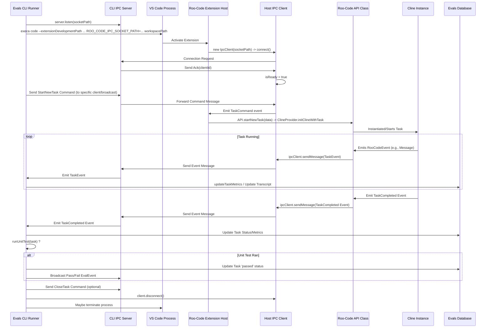

# Chapter 51: IPC (Inter-Process Communication)

Continuing from [Chapter 50: Localization System (i18n)](50_localization_system__i18n_.md), which covered adapting the UI for different languages, this chapter explores how different *processes* within or related to the Roo-Code ecosystem communicate with each other: **Inter-Process Communication (IPC)**. This is particularly relevant for interactions between the main extension and external tools, local servers, background workers, and the evaluation (`evals`) system.

## Motivation: Connecting Disparate Processes

While much of Roo-Code runs within the single VS Code extension host process and communicates with the WebView UI via a specific message protocol ([Chapter 3: Webview/Extension Message Protocol](03_webview_extension_message_protocol.md)), certain features involve or require separate, independent processes:

1.  **MCP Servers (Stdio):** Local MCP servers ([Chapter 19: McpHub / McpServerManager](19_mcphub___mcpservermanager.md)) run as child processes. The extension needs to send requests and receive responses via their standard input/output streams.
2.  **Evals System Orchestration:** The evaluation framework ([Chapter 53: Evals System](53_evals_system.md)) might involve a central CLI or server process that needs to command and receive events from VS Code instances running Roo-Code tasks programmatically. This requires a robust IPC channel distinct from user interaction.
3.  **Background Services:** Long-running tasks could be offloaded to background Node.js workers (`child_process.fork`) to prevent blocking the main extension host.
4.  **External Helper Tools:** Tools like `ripgrep` ([Chapter 16: Ripgrep Integration](16_ripgrep_integration.md)) are invoked as separate processes.

These processes operate in isolated memory spaces and cannot directly call functions or access data in the main extension host (or vice-versa). IPC mechanisms provide the necessary bridges for them to exchange data and commands. Roo-Code uses different IPC strategies depending on the context, defining message structures using Zod schemas ([Chapter 40: Schemas (Zod)](40_schemas__zod_.md)) in `src/schemas/ipc.ts` or `evals/packages/types/src/ipc.ts`.

**Central Use Case (Evals System):** The `evals` CLI needs to instruct a running VS Code instance (with Roo-Code loaded via `--extensionDevelopmentPath`) to start a specific evaluation task and then needs to receive real-time events (like message generation, tool usage, completion status) back from that Roo-Code instance.

1.  **Server Setup (Evals CLI):** The `evals` CLI (`evals/apps/cli/src/index.ts`) starts an IPC server using the `node-ipc` library, listening on a predetermined Unix socket path (or Windows named pipe). It uses the `IpcServer` class from `@evals/ipc`.
2.  **Client Setup (Roo-Code Extension):** When Roo-Code activates within VS Code launched for evaluation (detected via an environment variable like `ROO_CODE_IPC_SOCKET_PATH`), it initializes an `IpcClient` (from `@evals/ipc` or `src/exports/ipc.ts` which wraps `node-ipc`) to connect to the CLI's IPC server using the specified socket path.
3.  **Connection & Ack:** The `IpcClient` connects to the `IpcServer`. The server assigns a unique `clientId` and sends an `Ack` message back to the client containing this ID and server process info. This confirms the connection.
4.  **Command (Client -> Server - Less Common Here):** In *other* scenarios, the client might send commands *to* the server.
5.  **Command (Server -> Client - Evals):** The `evals` CLI (acting as the IPC *server* but the logical *client* for the task) wants to start a task. It uses `server.send(targetClientSocket, message)` or `server.broadcast(message)` to send a `TaskCommand` message (type `StartNewTask`, defined by `taskCommandSchema`) to the connected Roo-Code instance (the IPC *client*).
6.  **Command Handling (Roo-Code):** The `IpcClient` in Roo-Code receives the message. Its `onMessage` handler parses and validates it using `ipcMessageSchema`. It identifies the `StartNewTask` command and triggers the corresponding action, likely by calling `API.startNewTask(...)` ([`src/exports/api.ts`](TODO: Add Link)), passing the configuration and prompt from the message data.
7.  **Event Emission (Roo-Code):** As the task runs within Roo-Code's `Cline` instance, it emits various events (`message`, `taskStarted`, `taskCompleted`, etc.). The `API` class intercepts these events.
8.  **Event Forwarding (Roo-Code -> Evals CLI):** The `API.emit` override formats the event data according to `taskEventSchema` and uses `ipc?.broadcast(...)` (sending via its *client* connection) to transmit a `TaskEvent` message back to the `evals` CLI (the IPC *server*).
9.  **Event Handling (Evals CLI):** The `IpcServer`'s `onMessage` handler receives the `TaskEvent`, validates it, and the eval runner logic (`runExercise`) uses these events to build the transcript and determine task completion/status.

This client-server model using `node-ipc` over sockets/pipes allows the external `evals` process to reliably control and monitor Roo-Code instances running within VS Code.

## Key Concepts

1.  **Process Isolation:** The fundamental reason for IPC.
2.  **Communication Channels:**
    *   **Unix Domain Sockets / Windows Named Pipes:** Used by `node-ipc` for fast, reliable local IPC between unrelated processes (like the `evals` CLI server and the VS Code extension client). Abstracted by `node-ipc`.
    *   **Standard Streams (Stdio):** Used for local MCP servers via `@modelcontextprotocol/sdk`.
    *   **Network Protocols (HTTP, SSE):** Used for remote MCP servers.
    *   **Node.js `child_process` (`spawn`, `fork`):** Used for starting/managing local MCP servers, Ripgrep, and potentially background workers. `fork` provides a built-in channel.
    *   **VS Code `postMessage`:** Specific channel for Host <-> WebView communication.
3.  **`node-ipc` Library:** Used specifically by the `evals` system (`@evals/ipc`) to facilitate communication between the CLI runner (server) and the VS Code extension instance (client) via Unix sockets or Windows named pipes. Provides connection management, message emission, and event handling (`connectTo`, `serve`, `.on('message')`, `.emit('message')`).
4.  **Serialization & Validation (Zod):** Data sent via IPC must be serializable (typically to JSON). Zod schemas ([Chapter 40: Schemas (Zod)](40_schemas__zod_.md)) defined in `src/schemas/ipc.ts` (for host/worker) and `evals/packages/types/src/ipc.ts` (for evals system) are used to **validate** the structure and types of messages *after* receiving and parsing them (`ipcMessageSchema.safeParse`), preventing errors from malformed messages. Schemas define `Ack`, `TaskCommand` (e.g., `StartNewTask`), `TaskEvent` (wrapping core `RooCodeEventName` payloads), and the top-level `IpcMessage`.
5.  **Message Framing/Delimiting:** Handled internally by the chosen mechanism:
    *   `node-ipc`: Manages message boundaries over sockets/pipes.
    *   MCP Stdio Transport: Uses newline (`\n`) delimiters, parsed via `readline`.
    *   `child_process.fork`: Uses built-in V8 serialization over its channel.
    *   VS Code `postMessage`: Handled by VS Code.
6.  **Protocols:**
    *   **Evals IPC:** Custom message types (`Connect`, `Disconnect`, `Ack`, `TaskCommand`, `TaskEvent`) defined by `IpcMessageType` enum and validated by `ipcMessageSchema`. Specifies `origin` (`Client` or `Server`).
    *   **MCP:** JSON-RPC like protocol handled by the MCP SDK.
    *   **WebView<->Host:** Custom message types defined in `ExtensionMessage`/`WebviewMessage` ([Chapter 3](03_webview_extension_message_protocol.md)).
7.  **Client/Server Roles:** The role depends on the context. For `evals` IPC using `node-ipc`, the CLI runner acts as the `IpcServer`, while the VS Code extension instance acts as the `IpcClient`. For MCP, the extension host acts as the `Client` connecting to the MCP server process/endpoint.

## IPC Mechanisms Used in Roo-Code

1.  **Extension Host <-> WebView UI:** VS Code `postMessage` API. (Ch 3)
2.  **Extension Host <-> Local MCP Server:** `spawn` + Stdio + Newline JSON-RPC (via MCP SDK). (Ch 19)
3.  **Extension Host <-> Remote MCP Server:** HTTP/SSE + JSON-RPC (via MCP SDK). (Ch 19)
4.  **Extension Host -> Ripgrep Process:** `spawn` + Args + Stdout capture. (Ch 16)
5.  **Evals CLI (Server) <-> Extension Host (Client):** `node-ipc` over Unix Socket/Named Pipe + Custom JSON messages validated by Zod schemas (`ipcMessageSchema`). (Used for Evals System, Ch 53).
6.  **Extension Host <-> Background Worker (Potential):** `child_process.fork` + built-in channel + custom JSON messages validated by Zod schemas (`src/schemas/ipc.ts`).

## Code Walkthrough

### Evals IPC Schemas (`evals/packages/types/src/ipc.ts`)

*(See code provided in chapter context)*
*   Defines Zod schemas:
    *   `ackSchema`: For server acknowledging client connection (`clientId`, process IDs).
    *   `taskCommandSchema`: Discriminated union for commands sent *to* Roo-Code (e.g., `StartNewTask` with config/prompt, `CancelTask`, `CloseTask`). Uses `TaskCommandName` enum. Includes `rooCodeSettingsSchema`.
    *   `taskEventSchema`: Discriminated union for events sent *from* Roo-Code (e.g., `Message`, `TaskStarted`, `TaskCompleted`, `EvalEventName.Pass`/`Fail`). Wraps payload schemas from core `rooCodeEventsSchema`.
    *   `ipcMessageSchema`: Top-level discriminated union for all messages, including `type` (`IpcMessageType` enum), `origin` (`IpcOrigin` enum), `clientId` (for client->server), `relayClientId` (for server->client events), and nested `data` validated by other schemas.

### Evals IPC Client (`evals/packages/ipc/src/client.ts`)

*(See code provided in chapter context)*
*   **`IpcClient` Class:** Extends `EventEmitter`.
*   **Constructor:** Takes socket path. Generates unique client ID prefix. Uses `ipc.connectTo` to establish connection. Sets up `node-ipc` event listeners (`connect`, `disconnect`, `message`).
*   **`onConnect`:** Sets `_isConnected`, emits `Connect` event.
*   **`onDisconnect`:** Sets `_isConnected`, emits `Disconnect` event.
*   **`onMessage`:** Receives raw data. Uses `ipcMessageSchema.safeParse` to validate. If valid and `origin` is `Server`:
    *   Handles `Ack`: Stores `_clientId`, emits `Ack` event with data.
    *   Handles `TaskEvent`: Emits `TaskEvent` event with data.
*   **`sendMessage`:** Uses `ipc.of[this._id].emit("message", message)` to send a validated `IpcMessage` to the server.
*   **`disconnect`:** Calls `ipc.disconnect`.
*   **Properties:** Exposes `socketPath`, `clientId`, `isConnected`, `isReady`.

### Evals IPC Server (`evals/packages/ipc/src/server.ts`)

*(See code provided in chapter context)*
*   **`IpcServer` Class:** Extends `EventEmitter`.
*   **Constructor:** Takes socket path. Initializes `_clients` map.
*   **`listen`:** Sets up `node-ipc` server using `ipc.serve`. Attaches listeners (`connect`, `socket.disconnected`, `message`). Starts server.
*   **`onConnect`:** Generates `clientId`, stores client `socket` in `_clients` map. Sends `Ack` message back to the connecting client using `ipc.server.emit(socket, ...)`. Emits `Connect` event locally.
*   **`onDisconnect`:** Finds and removes client from `_clients` map. Emits `Disconnect` event locally.
*   **`onMessage`:** Receives raw data. Uses `ipcMessageSchema.safeParse` to validate. If valid and `origin` is `Client`:
    *   Handles `TaskCommand`: Emits `TaskCommand` event locally with `clientId` and command data.
*   **`broadcast`:** Sends message to all connected clients using `ipc.server.broadcast`.
*   **`send`:** Sends message to a specific client (by `clientId` lookup or direct `socket`) using `ipc.server.emit`.
*   **Properties:** Exposes `socketPath`, `isListening`.

### Evals CLI Integration (`evals/apps/cli/src/index.ts`)

*(See code provided in chapter context)*
*   **`run` function:**
    *   Creates `IpcServer` instance using socket path from `run` config. Calls `server.listen()`.
*   **`runExercise` function:**
    *   Determines task-specific socket path (`taskSocketPath`).
    *   Launches VS Code using `execa` with the `ROO_CODE_IPC_SOCKET_PATH` environment variable set to `taskSocketPath`.
    *   Creates an `IpcClient` instance connected to `taskSocketPath`.
    *   Waits for connection using `pWaitFor(() => client.isReady)`.
    *   Listens for `TaskEvent` messages from the client (`client.on(IpcMessageType.TaskEvent, ...)`). Handlers update database records (`createTaskMetrics`, `updateTask`, etc.) and broadcast relevant events back to any *other* clients connected to the main server socket (e.g., a UI watching the eval run).
    *   Sends `StartNewTask` command to the client using `client.sendMessage(...)`.
    *   Waits for task completion (`TaskCompleted` or `TaskAborted` event) or timeout using `pWaitFor`.
    *   Sends `CancelTask`/`CloseTask` commands if needed. Disconnects client.

### Roo-Code Host Integration (`src/exports/api.ts`)

*(See code provided in chapter context)*
*   **`API` Class Constructor:** Checks for `socketPath` argument. If present, creates `IpcServer` instance (`this.ipc`). **Wait - this seems wrong based on the CLI logic.** The Extension should be the *client*, connecting to the server run by the CLI. The provided `API` code has server logic.
*   **Correction:** Assuming the `API` class or similar logic in `extension.ts` *conditionally* creates an `IpcClient` if `process.env.ROO_CODE_IPC_SOCKET_PATH` is set:
    ```typescript
    // Conceptual code in extension.ts or similar
    let ipcClient: IpcClient | undefined;
    const evalSocketPath = process.env.ROO_CODE_IPC_SOCKET_PATH;

    if (evalSocketPath) {
        logger.info(`Detected eval mode, connecting IPC client to: ${evalSocketPath}`);
        ipcClient = new IpcClient(evalSocketPath); // Uses the client from src/exports/ipc.ts

        ipcClient.on(IpcMessageType.Connect, () => { /* ... */ });
        ipcClient.on(IpcMessageType.Ack, (ackData) => { /* Store clientId? */ });
        ipcClient.on(IpcMessageType.TaskCommand, async (commandData) => {
            logger.info(`Received IPC TaskCommand: ${commandData.commandName}`);
            const provider = ClineProvider.getSidebarProviderInstance(); // Get active provider
            if (!provider) return;

            switch (commandData.commandName) {
                case TaskCommandName.StartNewTask:
                    // TODO: Need a way to apply configuration from commandData.data.configuration
                    // Maybe await provider.setValues(commandData.data.configuration);
                    await provider.initClineWithTask(commandData.data.text, commandData.data.images);
                    break;
                case TaskCommandName.CancelTask:
                    // commandData.data is taskId string
                    // Need lookup mechanism if provider doesn't match task ID
                    await provider.cancelTask(); // Or find task by ID and cancel
                    break;
                // ... handle CloseTask ...
            }
        });
         ipcClient.on(IpcMessageType.Disconnect, () => { /* ... */ });
    }

    // Modify API class or event emitters to send TaskEvents via ipcClient
    // e.g., in API constructor or event listeners setup in registerListeners
    // emitter.on('someRooEvent', (payload) => {
    //    if (ipcClient?.isReady) {
    //        const taskEvent: TaskEvent = { eventName: ..., payload: ... };
    //        // Validate taskEvent against schema?
    //        ipcClient.sendMessage({ type: IpcMessageType.TaskEvent, origin: IpcOrigin.Server, data: taskEvent });
    //    }
    // });
    ```
*   **`API.emit` Override:** The provided code *does* show an override for `emit`. It formats the event data according to `TaskEvent` schema and calls `this.ipc?.broadcast(...)`. This correctly sends events *from* the extension *to* the CLI/Server, assuming `this.ipc` is actually the `IpcClient` instance in the eval scenario. **There's a potential confusion in the provided code between client/server roles in the `API` class.** Assuming `this.ipc` refers to the `IpcClient` connection when running in eval mode.

## Internal Implementation

*   **`node-ipc`:** Uses platform-specific mechanisms (Unix Domain Sockets on Linux/macOS, Named Pipes on Windows) for local IPC. Handles connection setup, message sending/receiving over these channels, and event emission (`connect`, `disconnect`, `message`). Manages message boundaries.
*   **Stdio:** Node.js `child_process.spawn` + OS pipes + `readline` for framing.
*   **SSE:** `ReconnectingEventSource` + HTTP + JSON parsing.
*   **`fork`:** `child_process.fork` + V8 serialization over dedicated channel.
*   **VS Code `postMessage`:** Internal VS Code mechanism.

## Modification Guidance

Modifications might involve adding new IPC message types, changing the transport for a specific communication, or adding background workers.

1.  **Adding a New Eval `TaskCommand` (e.g., `SetEvalSetting`):**
    *   **Schema (`evals/.../ipc.ts`):** Add a new literal to `TaskCommandName`. Add a new object structure to the `taskCommandSchema` discriminated union for the `SetEvalSetting` command and its `data` payload (validated by Zod).
    *   **Server (CLI):** Modify the CLI logic to construct and send the new `SetEvalSetting` command message via `ipcServer.send`/`broadcast`.
    *   **Client (Host):** Modify the `message` handler for `ipcClient` in the extension host (`extension.ts` or `src/exports/ipc.ts`). Add a `case TaskCommandName.SetEvalSetting:` to parse the payload and apply the setting (e.g., via `ContextProxy`).

2.  **Changing Evals IPC from Sockets to HTTP (Less Likely):**
    *   Replace `node-ipc` (`IpcClient`, `IpcServer`) with HTTP client/server logic.
    *   **Server (CLI):** Use `http.createServer` (Node.js) or Express. Define endpoints for receiving commands (POST) and potentially use WebSockets or SSE for sending events back to clients.
    *   **Client (Host):** Use `axios` or `fetch` to send commands to the server endpoint. Use `EventSource` or `WebSocket` client to receive events.
    *   **Considerations:** Adds network overhead, requires port management, potentially more complex setup than local sockets/pipes.

3.  **Adding a Background Worker using `fork`:**
    *   **Schema (`src/schemas/ipc.ts`):** Define Zod schemas for task messages and response messages.
    *   **Worker (`src/backgroundTasks/worker.ts`):** Implement logic using `process.on('message')`/`process.send`. Validate messages using schemas.
    *   **Host Service (`src/services/workerService.ts`):** Implement logic using `child_process.fork`, message handlers with schema validation, promise map for tracking requests.
    *   **Build:** Ensure the worker script is compiled by `esbuild.js` to the `dist` directory.

**Best Practices:**

*   **Choose Appropriate Mechanism:** Match IPC choice to process type/location. Use VS Code APIs (`postMessage`, `authentication`) where suitable. Use `fork` for Node workers. Use Stdio/Sockets/Pipes (`node-ipc` or custom) for local inter-process RPC. Use Network protocols for remote.
*   **Standardize Protocol:** Use JSON-RPC or define clear message schemas (Zod). Validate messages on receipt (`safeParse`).
*   **Robust Framing:** Essential for stream-based IPC. Newlines are simple; length prefixing is better. `fork` and `node-ipc` handle framing.
*   **Serialization:** Use JSON. Validate with Zod.
*   **Error Handling:** Handle connection, process exit, `stderr`, parsing, timeouts. Define error message formats.
*   **Resource Management:** Terminate processes, close channels, remove listeners.
*   **Asynchronicity:** Use `async/await`.

**Potential Pitfalls:**

*   **Framing/Parsing Errors.**
*   **Process Management:** Zombies, spawn failures, unhandled exits.
*   **Deadlocks:** Waiting indefinitely for responses (need timeouts).
*   **Buffering Issues.**
*   **Cross-Platform:** Socket paths vs. named pipes. Shell differences.
*   **Security:** Unvalidated data/commands. Ensure socket/pipe permissions are appropriate.
*   **Missing IPC Validation:** Not using Zod schemas leads to runtime errors.

## Conclusion

Inter-Process Communication is essential for enabling different parts of the Roo-Code ecosystem, particularly the extension host and external processes like local MCP servers, CLI tools (Ripgrep), or the Evals system orchestrator, to collaborate effectively despite running in isolated memory spaces. Roo-Code utilizes appropriate mechanisms like the structured newline-delimited JSON-RPC over stdio (for MCP), direct `child_process.spawn` (for CLI tools), the specialized `postMessage` API (for WebView), and `node-ipc` over sockets/pipes (for the Evals system). Defining message structures with Zod schemas (e.g., in `src/schemas/ipc.ts`, `evals/packages/types/src/ipc.ts`) and validating messages at process boundaries adds crucial type safety and robustness to these communication channels. Understanding the chosen IPC mechanism, protocol, serialization, and framing is key to debugging and extending Roo-Code's interactions with separate processes.

Next, we examine how Roo-Code collects and reports usage data and errors for monitoring and improvement: [Chapter 52: TelemetryService](52_telemetryservice.md).
---
# Chapter 52: TelemetryService

Continuing from [Chapter 51: IPC (Inter-Process Communication)](51_ipc__inter_process_communication_.md), which discussed how different processes communicate, this chapter focuses on how the Roo-Code extension gathers anonymous usage data and error information to help improve the product: the **TelemetryService**.

## Motivation: Understanding Usage and Improving Roo-Code

To make Roo-Code better, the development team needs insights into how it's being used and where problems occur. Gathering anonymous telemetry data helps answer questions like:

*   Which features, commands, or tools ([Chapter 8: Tools](08_tools.md)) are most popular?
*   Which LLM providers ([Chapter 5: ApiHandler](05_apihandler.md)) and models are commonly used?
*   How often do specific errors (API errors, validation failures ([Chapter 40: Schemas (Zod)](40_schemas__zod_.md)), tool errors) occur?
*   What is the typical duration or token usage ([Chapter 29: Cost Calculation Utilities](29_cost_calculation_utilities.md)) of tasks?
*   Are users encountering issues with specific configurations (e.g., shell integration issues detected via `no_shell_integration` event from [Chapter 15: Terminal Integration](15_terminal_integration.md))?
*   Are custom modes ([Chapter 10: CustomModesManager](10_custommodesmanager.md)) being utilized?

Collecting this data, while **strictly respecting user privacy and anonymity**, allows the team to prioritize development efforts, identify bugs, improve performance, and make data-driven decisions about the product's future direction. Developing without this feedback makes it hard to address real user needs and pain points effectively.

The `TelemetryService` provides a centralized mechanism for:
1.  **User Consent:** Explicitly requiring user opt-in for telemetry collection. No data is sent unless the user enables the setting. A clear notification or setup step prompts the user initially.
2.  **Centralized Reporting API:** Offering simple methods (`captureEvent`, `captureError`, `captureException`, `captureSchemaValidationError`) for different parts of the codebase to easily record significant events or errors.
3.  **Anonymization:** Ensuring that collected data **never** includes personally identifiable information (PII) like file contents, specific user prompts/responses, API keys, full file paths, commit messages, etc. Focuses on aggregated counts, feature usage patterns, anonymized configuration types, and sanitized error information.
4.  **Context Enrichment:** Automatically adding relevant, non-sensitive context to events, such as the Roo-Code version, VS Code version, platform (OS), session ID, and potentially anonymized/generalized configuration details (e.g., provider *name* but not keys, mode *slug* but not custom instructions).
5.  **Backend Integration:** Sending the collected, anonymized data to a secure backend service (like PostHog) for aggregation and analysis. Handles initialization and shutdown of the backend client.

**Central Use Case:** A user runs a "Fix Code" action ([Chapter 30: CodeActionProvider](30_codeactionprovider.md)), and the underlying API call to the LLM results in a rate limit error. The user has opted **in** to telemetry.

1.  **User Opt-in:** During initial setup or via settings ([Chapter 35: Settings UI Components (WebView)](35_settings_ui_components__webview_.md)), the user enables the telemetry setting. The `TelemetryService` reads this setting (`telemetrySetting`) via `ContextProxy` ([Chapter 11: ContextProxy](11_contextproxy.md)) and sets its internal `enabled` flag to `true`.
2.  **Action Invoked:** The command handler for `roo-cline.fixCode` calls `telemetryService.captureEvent("codeaction.invoked", { command: "roo-cline.fixCode", mode: currentModeSlug })`.
3.  **API Error:** The `ApiHandler` ([Chapter 5: ApiHandler](05_apihandler.md)) catches the rate limit error from the SDK.
4.  **Error Reporting:** Error handling logic calls `telemetryService.captureError("api_error", { provider: "openai", modelId: "gpt-4", errorType: "rate_limit" })`.
5.  **`TelemetryService` Logic (`captureEvent`, `captureError`):**
    *   Checks `this.enabled` (true).
    *   Retrieves common properties (version, platform, session ID, anonymous `distinctId`). Gets provider context (e.g., `current_mode`).
    *   Merges common, provider, and event-specific properties.
    *   Calls `sanitizeProperties` to remove potential PII (e.g., ensures `modelId` isn't a sensitive custom name, removes hypothetical path properties).
    *   Calls the backend client's method (e.g., `this.posthogClient?.capture({ distinctId, event: "roo_codeaction.invoked", properties: sanitizedProps })` and `this.posthogClient?.capture({ distinctId, event: "roo_error_api_error", properties: sanitizedProps })`).
6.  **Backend:** The PostHog service receives and aggregates these anonymized events, allowing developers to see code action usage frequency and API error rates per provider/model type.

If the user had opted **out**, step 5 would check `this.enabled` (false) and immediately return without sending any data.

## Key Concepts

1.  **User Consent (`telemetrySetting`):** A dedicated setting (`"enabled"`, `"disabled"`, `"unset"`) stored via `ContextProxy` ([Chapter 11: ContextProxy](11_contextproxy.md)). The service respects this setting rigorously. Initial state (`"unset"`) triggers a prompt asking for consent via `vscode.window.showInformationMessage`. ([Chapter 35: Settings UI Components (WebView)](35_settings_ui_components__webview_.md) provides the persistent setting toggle).
2.  **Anonymity & PII Avoidance:** The absolute highest priority. **No sensitive or user-identifiable data should ever be sent.** This includes: user code, prompts/responses, file contents, API keys, full file paths, specific user-defined names (custom modes, API profiles - use slugs or types instead), commit messages, detailed error messages containing user data. Focus on event counts, feature flags, command IDs, provider *names*, generic model *types*, error *types*, durations, boolean flags, sanitized configuration values.
3.  **`TelemetryService` Class (`src/services/telemetry/TelemetryService.ts`):**
    *   **Singleton:** Instantiated once during extension activation.
    *   **Initialization (`init`):** Takes `ExtensionContext`, `ContextProxy`. Reads consent, initializes backend client (PostHog) if enabled and API key is available (via build-time environment variable `process.env.POSTHOG_PROJECT_API_KEY` set by [Chapter 56: Build System](56_build_system.md)). Generates session ID, gathers static context (versions, platform).
    *   **Consent Management (`updateConsent`):** Re-reads the setting and enables/disables the service, shutting down or initializing the PostHog client as needed. Triggered on init and by `onDidChangeConfiguration`.
    *   **Core Methods:** `captureEvent`, `captureError`, `captureException`, `captureSchemaValidationError`. Adds standard prefixes (`roo_`, `roo_error_`) to event names.
    *   **Context Enrichment:** The internal `_capture` method merges event `properties` with `commonProperties` (OS, versions, session ID) and dynamic `providerContext` (e.g., current mode slug from `ClineProvider`) before sanitization.
    *   **Sanitization (`sanitizeProperties`):** A crucial helper function (`src/services/telemetry/sanitize.ts`) that iterates through event properties and removes or masks potential PII based on key names, value length, or heuristics.
    *   **Backend Client (`posthog-node`):** Uses the `PostHog` client library. Configured with API key and host (from environment variables). Handles batching, retries, and asynchronous sending. `enableGeoip: false` is set for privacy.
    *   **Shutdown (`shutdown`):** Flushes buffered events using `posthogClient?.shutdown()`. Called during extension deactivation.
    *   **Provider Context (`setProvider`):** Allows linking to the active `ClineProvider` ([Chapter 2: ClineProvider](02_clineprovider.md)) to fetch non-sensitive context like the current mode slug. Uses `WeakRef` to avoid memory leaks.

4.  **Session/User IDs:**
    *   **Session ID:** `crypto.randomUUID()` generated per VS Code session. Groups events within a single run.
    *   **Distinct ID (User):** Uses `vscode.env.machineId` (a unique, anonymous ID per VS Code installation). Allows correlating events from the same installation over time without identifying the user. Handles the default test value `someValue.machineId`.

5.  **Event Structure:** Uses PostHog's format: `event` name (string, prefixed e.g., `roo_eventname`), `distinctId` (anonymous user ID), `properties` (key-value object with event data + context). Standard PostHog properties like `$os` are included in `commonProperties`.

6.  **Sanitization Logic (`sanitizeProperties`):** Needs careful implementation to remove known sensitive keys (`/key|secret|token|password|credential/i`), long strings (potential prompts/code/paths), and path-like strings, while allowing safe context values.

## Using the TelemetryService

The service is obtained as a singleton instance (`export const telemetryService = new TelemetryService();`) and its methods are called from various points in the codebase.

**1. Initialization & Consent (Extension Activation):**

```typescript
// --- File: src/extension.ts ---
import { TelemetryService } from "./services/telemetry/TelemetryService";
import { ContextProxy } from "./core/config/ContextProxy";
import * as vscode from "vscode";
import { ClineProvider } from "./core/webview/ClineProvider";

export const telemetryService = new TelemetryService(); // Create singleton

// Helper to prompt user for consent if needed
async function ensureTelemetryConsent(contextProxy: ContextProxy): Promise<void> {
    const telemetrySettingKey = "telemetrySetting"; // Use constant if available
    const currentSetting = contextProxy.getValue(telemetrySettingKey as any) ?? 'unset'; // Default to 'unset'
    if (currentSetting === 'unset') {
        const selection = await vscode.window.showInformationMessage(
            "Help improve Roo Code by sending anonymous usage data and error reports? No source code or personal data is ever sent. You can change this in Settings.",
            { modal: true }, // Block until choice
            "Enable Telemetry", // User explicitly enables
            "Disable Telemetry" // User explicitly disables
        );
        // If user closed dialog without selecting, treat as disabled for now, prompt again next time?
        // Or default to disabled. Let's default to disabled.
        const settingValue = selection === "Enable Telemetry" ? "enabled" : "disabled";
        await contextProxy.setValue(telemetrySettingKey as any, settingValue);
        // Capture the consent action itself
        telemetryService.captureEvent("consent.set", { consent_given: settingValue === "enabled", source: "initial_prompt" });
        // Update the service immediately after setting is saved
        await telemetryService.updateConsent(contextProxy);
    }
}

export async function activate(context: vscode.ExtensionContext) {
    // ... Create ContextProxy and initialize it ...
    const contextProxy = new ContextProxy(context);
    await contextProxy.initialize();

    // Initialize Telemetry AFTER Proxy is ready
    await telemetryService.init(context, contextProxy);

    // Create Provider and link it AFTER telemetry is initialized
    // (Provider constructor might capture init events)
    const provider = new ClineProvider(context, outputChannel);
    // Allow telemetry to get context like current mode from provider
    telemetryService.setProvider(provider);

    // Prompt for consent if needed (after telemetry service is initialized)
    // Run non-blockingly after activation completes
    ensureTelemetryConsent(contextProxy).catch(e => console.error("Consent prompt failed:", e));

    // Listen for setting changes to update consent dynamically
    context.subscriptions.push(vscode.workspace.onDidChangeConfiguration(async e => {
        // Use the actual setting key from package.json contribution
        const fullSettingKey = 'roo-code.telemetrySetting'; // Assuming this is the ID in package.json
        if (e.affectsConfiguration(fullSettingKey)) {
            const oldEnabled = telemetryService['enabled']; // Access internal state for comparison
            await telemetryService.updateConsent(contextProxy);
            // Capture event only if state actually changed
            if (oldEnabled !== telemetryService['enabled']) {
                 telemetryService.captureEvent("consent.updated", { consent_given: telemetryService['enabled'], source: "settings_change" });
            }
        }
    }));
    // ... Register commands, providers etc. ...
}

export async function deactivate(): Promise<void> {
    await telemetryService.shutdown(); // Flush events on exit
}
```
*Explanation:* Creates the singleton. Calls `init` after `ContextProxy`. Links the provider using `setProvider`. Calls `ensureTelemetryConsent` asynchronously to prompt the user if the setting is `unset` and saves their choice. Listens for configuration changes to update consent dynamically via `updateConsent` and captures the consent change event. Calls `shutdown` in `deactivate`.

**2. Capturing Events:**

```typescript
// --- File: src/activate/registerCodeActions.ts ---
import { telemetryService } from "../services/telemetry/TelemetryService";
// ... inside command handler ...
    vscode.commands.registerCommand(command, async (...args: any[]) => {
        // Get current mode if possible (needs access to provider instance)
        const currentMode = ClineProvider.getSidebarProviderInstance()?.contextProxy?.getValue('mode');
        telemetryService.captureEvent("codeaction.invoked", { command, mode: currentMode }); // Include mode
        // ...
    });

// --- File: src/core/tools/readFileTool.ts ---
import { telemetryService } from "../../services/telemetry/TelemetryService";
// ... after successful read ...
    telemetryService.captureEvent("tool.executed", {
        tool_name: "read_file",
        success: true,
        duration_ms: Date.now() - startTime, // Example duration
        // Avoid path: relPath (potential PII)
    });
// ... after access denied by ignore ...
    telemetryService.captureEvent("tool.blocked", { tool_name: "read_file", reason: "rooignore" });
```
*Explanation:* Call `telemetryService.captureEvent` with a clear name (e.g., `feature.subfeature.action`) and relevant, non-sensitive properties (like `command` ID, `mode` slug, `tool_name`, `success` flag, `duration`). Avoid including potentially sensitive data like file paths.

**3. Capturing Errors:**

```typescript
// --- File: src/api/providers/anthropic.ts (Conceptual Error Handling) ---
import { telemetryService } from "../../services/telemetry/TelemetryService";
// ... inside API call logic ...
    } catch (error: any) {
        const errorType = classifyApiError(error); // Function to get generic type
        const statusCode = error?.status;
        telemetryService.captureError("api_error", {
            provider: "anthropic", // Provider name is safe
            modelId: this.getModel()?.id, // This might need sanitization if it contains custom names
            errorType: errorType,
            statusCode: statusCode,
        });
        throw error;
    }

// --- File: src/core/config/ProviderSettingsManager.ts ---
import { telemetryService } from "../../services/telemetry/TelemetryService";
// ... inside load(), after safeParse ...
    if (!validationResult.success) {
        telemetryService.captureSchemaValidationError({
            schemaName: "ProviderProfiles", // Identify the schema
            error: validationResult.error // Pass the ZodError
        });
        // ... handle error ...
    }
```
*Explanation:* Use `captureError` for handled errors, providing useful categorization (provider, error type, status code). Ensure `modelId` passed is sanitized by the service if it could be user-defined. Use `captureSchemaValidationError` for Zod errors; the service extracts safe information (paths, counts) automatically. Use `captureException` in global error handlers for uncaught exceptions.

## Code Walkthrough

### TelemetryService Class (`src/services/telemetry/TelemetryService.ts`)

*(See full code in Key Concepts section)*

**Key Implementation Details:**

*   **Constructor:** Sets up PostHog key/host from `process.env`. Generates `sessionId`. Sets `distinctId` to `vscode.env.machineId` (handling dev default).
*   **`init`:** Populates `commonProperties` (OS, versions). Calls `updateConsent`. Logs status.
*   **`updateConsent`:** Reads setting via `ContextProxy`. Shuts down/initializes `PostHog` client based on `enabled` state and key presence. Handles client init errors.
*   **`setProvider`/`getProviderContext`:** Uses `WeakRef` to link to `ClineProvider` and fetch non-sensitive context like `current_mode`.
*   **`_capture`:** Central internal method. Checks `enabled`. Merges common, provider, event properties. **Calls `sanitizeProperties`**. Calls `posthogClient.capture`. Includes error handling for capture process.
*   **Public Methods:** Add `roo_` prefixes. Prepare specific properties (limited stack for exceptions, paths/counts for schema errors). Call `_capture`.
*   **`shutdown`:** Calls `posthogClient.shutdown()`.

### Sanitization (`src/services/telemetry/sanitize.ts` - Conceptual)

```typescript
// --- File: src/services/telemetry/sanitize.ts --- (Conceptual)
import { logger } from "../../utils/logging";

const MAX_STRING_LENGTH = 250; // Max length for property values to avoid PII
const SENSITIVE_KEY_PATTERNS = [/key/i, /secret/i, /token/i, /password/i, /credential/i, /prompt/i, /content/i]; // Add prompt/content
const PATH_LIKE_REGEX = /(\/|\\)/; // Simple check for path separators

/**
 * Sanitizes properties object to remove or mask potential PII.
 * - Removes keys matching sensitive patterns.
 * - Truncates long strings.
 * - Removes strings that look like file paths.
 * - TODO: Add more robust checks (e.g., email, specific formats) if needed.
 * - TODO: Consider recursive sanitization for nested objects.
 */
export function sanitizeProperties(properties: Record<string, any>): Record<string, any> {
    if (!properties) return {};

    const sanitized: Record<string, any> = {};
    for (const key in properties) {
        if (!Object.prototype.hasOwnProperty.call(properties, key)) continue;

        const value = properties[key];

        // 1. Check key name for sensitive patterns
        if (SENSITIVE_KEY_PATTERNS.some(pattern => pattern.test(key))) {
            logger.debug(`Sanitizing sensitive key: ${key}`, { ctx: "Telemetry.Sanitize" });
            // Instead of skipping, maybe include the key with a placeholder value
            sanitized[key] = `<${key}_omitted>`;
            continue;
        }

        // 2. Handle different value types
        if (typeof value === 'string') {
            // 2a. Check for path-like strings (simple heuristic)
            if (value.length > 5 && PATH_LIKE_REGEX.test(value) && value.includes('.')) { // Basic path heuristic
                 logger.debug(`Sanitizing path-like value for key: ${key}`, { ctx: "Telemetry.Sanitize" });
                 sanitized[key] = '<path_omitted>';
                 continue;
            }
            // 2b. Check for excessive length (potential code/prompt/PII)
            if (value.length > MAX_STRING_LENGTH) {
                 logger.debug(`Sanitizing long string value for key: ${key}`, { ctx: "Telemetry.Sanitize" });
                 sanitized[key] = `${value.substring(0, MAX_STRING_LENGTH)}...<truncated>`;
                 continue;
            }
            // If string is okay, include it
            sanitized[key] = value;

        } else if (typeof value === 'number' || typeof value === 'boolean' || value === null) {
            // Allow numbers, booleans, null
            sanitized[key] = value;
        } else if (typeof value === 'object' && value !== null) {
            // Handle objects - currently skips complex objects/arrays by stringifying and checking length
            // TODO: Implement recursive sanitization if needed.
            try {
                const jsonString = JSON.stringify(value); // Stringify to check length
                if (jsonString.length <= MAX_STRING_LENGTH * 2) { // Allow slightly larger JSON strings
                    // Potentially sanitize the object recursively before including?
                    // For now, include small objects/arrays as is - assumes they don't contain deep PII
                    sanitized[key] = value;
                } else {
                    logger.debug(`Sanitizing large object/array value for key: ${key}`, { ctx: "Telemetry.Sanitize" });
                    sanitized[key] = '<complex_object_omitted>';
                }
            } catch {
                 logger.debug(`Sanitizing unserializable object value for key: ${key}`, { ctx: "Telemetry.Sanitize" });
                 sanitized[key] = '<unserializable_object_omitted>';
            }
        } else {
            // Skip other types (undefined, function, symbol)
             logger.debug(`Skipping unsupported type value for key: ${key} (${typeof value})`, { ctx: "Telemetry.Sanitize" });
        }
    }
    return sanitized;
}
```
*Explanation:* Provides a more concrete sanitization strategy. It checks key names against `SENSITIVE_KEY_PATTERNS` (adding `prompt`, `content`). String values are checked for path-like characters and length. Simple/small objects might be included (after potential recursion - marked TODO), large/complex ones are omitted. **This requires careful, ongoing refinement.**

## Internal Implementation

1.  **Event Trigger:** Code calls `telemetryService.capture...()`.
2.  **Consent Check:** Service checks `this.enabled`. If false, returns.
3.  **Context/Sanitize:** `_capture` merges context, calls `sanitizeProperties` which filters/masks data.
4.  **Client Call:** `_capture` calls `posthogClient.capture()`.
5.  **PostHog Client Buffering & Async Send:** `posthog-node` library adds event to an internal buffer and sends batches asynchronously via HTTPS.
6.  **Shutdown:** `telemetryService.shutdown()` calls `posthogClient.shutdown()` to trigger a final buffer flush.

**Sequence Diagram (Capture Event):**

*(See diagram in Chapter 52 - Internal Implementation)*

## Modification Guidance

Modifications involve adding events, changing context, or updating sanitization.

1.  **Adding a New Tracked Event:**
    *   **Identify:** Find code location.
    *   **Call:** Add `telemetryService.captureEvent("my_event", { property: safeValue })`.
    *   **Data:** Include only relevant, **non-sensitive** properties. Check against `sanitizeProperties`.
    *   **Sanitize:** Update `sanitizeProperties` if new property types need specific handling.

2.  **Adding More Context:**
    *   **Common Properties (`init`):** Add static, safe data (e.g., `vscode.env.appHost`).
    *   **Provider Context (`getProviderContext`):** Add logic to get more non-sensitive state from `ClineProvider` (e.g., `isEnabled = provider.mcpHub?.isEnabled()`). Ensure safety.
    *   **Event Properties:** Pass more relevant, safe data directly via `captureEvent`.

3.  **Refining Sanitization (`sanitizeProperties`):**
    *   **Edit `sanitize.ts`:** Add more sensitive key patterns. Improve path/URL detection and anonymization (hashing?). Adjust length thresholds. Implement recursive sanitization carefully. **This is critical for privacy.**
    *   **Testing:** Test `sanitizeProperties` thoroughly with various realistic (but fake) sensitive data structures to ensure it removes/masks correctly.

4.  **Changing Telemetry Backend:**
    *   Replace `posthog-node` library and client calls in `TelemetryService` (`init`, `_capture`, `shutdown`) with the new backend's SDK. Ensure consent and sanitization remain central.

**Best Practices:**

*   **Privacy First & Opt-In:** Non-negotiable. Rigorous sanitization, clear consent prompt (`ensureTelemetryConsent`). Default to disabled/unset.
*   **Centralized Service:** Use the singleton.
*   **Sanitize Rigorously:** Continuously review `sanitizeProperties`. Err on removing data.
*   **Meaningful Events:** Track actionable insights. Avoid noise.
*   **Safe Context:** Only add non-sensitive context.
*   **Graceful Failure:** Service failures shouldn't crash the extension. Log errors internally.
*   **Shutdown:** Implement `shutdown` for data flushing.
*   **Transparency:** Document data collection practices clearly (README/Privacy Policy). Detail what *is* and *is not* collected.

**Potential Pitfalls:**

*   **PII Leakage:** Insufficient sanitization is the primary risk. Needs constant vigilance and review, especially when adding new properties or event types.
*   **Consent Bypass:** Bugs sending data when disabled.
*   **Performance:** Excessive event capture (unlikely with batching).
*   **Network/Backend Issues:** Data loss if backend unavailable (less critical for anonymous stats).
*   **Sanitization Complexity/Errors:** Bugs in `sanitizeProperties`. Over-sanitization losing useful anonymous data. Under-sanitization risking privacy.
*   **Missing API Key:** Build process ([Chapter 56: Build System](56_build_system.md)) must correctly inject `POSTHOG_PROJECT_API_KEY` via `define` for telemetry to initialize.

## Conclusion

The `TelemetryService` provides a crucial, privacy-conscious mechanism for collecting anonymous usage data and error information from Roo-Code installations where users have explicitly opted in. By centralizing event capture, rigorously sanitizing data to remove PII via `sanitizeProperties`, enriching events with safe context, and integrating with a backend like PostHog, the service provides valuable insights for the development team to improve the extension based on real-world usage patterns and identify recurring problems. Respecting user consent (via the `telemetrySetting` and initial prompt) and prioritizing privacy through careful implementation (especially `sanitizeProperties`) and configuration are paramount.

Next, we explore the system designed for evaluating Roo-Code's performance on predefined tasks: [Chapter 53: Evals System](53_evals_system.md).
---
# Chapter 53: Evals System

Continuing from [Chapter 52: TelemetryService](52_telemetryservice.md), which focused on collecting anonymous usage data for product improvement, this chapter introduces a system designed for more structured and objective assessment of Roo-Code's capabilities: the **Evals System**. This system allows developers to define benchmark tasks and automatically run Roo-Code against them to measure performance, prevent regressions, and compare different models or configurations.

## Motivation: Measuring and Improving AI Performance

While user feedback and telemetry provide valuable insights, objectively measuring the quality and performance of an AI assistant like Roo-Code requires a more systematic approach. We need a way to:

1.  **Define Test Cases:** Create a standardized set of realistic tasks (prompts, context, expected outcomes) that represent common user scenarios (e.g., "refactor this function", "explain this error", "write a unit test", "use tool X"). Roo-Code uses YAML files in `evals/suites/` for this.
2.  **Run Automatically:** Execute Roo-Code against these test cases using different models, configurations, or code versions in a repeatable manner, independent of the interactive VS Code UI. This is handled by the runner script in `evals/apps/cli/src/index.ts`.
3.  **Capture Outputs:** Record the AI's full interaction transcript, including generated text, code modifications requested via tools, actual tool usage sequences, token counts, and costs for each test case. Results are saved as JSON files in `evals/output/`.
4.  **Evaluate Results:** Compare the captured outputs against predefined criteria (defined in the YAML suite) or use subsequent LLM-based evaluation or manual review to assess performance metrics like correctness, helpfulness, efficiency, safety, and adherence to instructions. This is often facilitated by the `evals-web/` UI.
5.  **Track Progress:** Monitor how changes to prompts ([Chapter 7: SystemPrompt](07_systemprompt.md)), models, context strategies ([Chapter 23: Sliding Window Context Management](23_sliding_window_context_management.md)), or tool implementations ([Chapter 8: Tools](08_tools.md)) affect performance over time, preventing regressions and guiding improvements.

The **Evals System** provides the framework and tooling (`evals/` directory including CLI, IPC, types, schemas, and the `evals-web/` UI) to define, run, and analyze these evaluation tasks, enabling data-driven development and quality assurance for Roo-Code's core AI functionality.

**Central Use Case:** A developer modifies the main system prompt ([Chapter 7: SystemPrompt](07_systemprompt.md)) and wants to ensure it doesn't negatively impact code generation quality for Python.

1.  **Define Eval Suite:** An `evals/suites/python_codegen.yaml` file defines test cases (validated by `evalTaskSchema` from `@evals/types`). Each task includes `id`, `prompt`, optional `context`, `criteria`, `config_overrides`.
2.  **Run Evals:** Developer runs `pnpm start --suite python_codegen --model gpt-4-turbo` from `evals/apps/cli/`.
3.  **Eval CLI Runner (`cli/src/index.ts` / `runExercise`):**
    *   Parses args (`gluegun`/`yargs`). Finds `python_codegen.yaml` (`getExercises`). Creates run/task records in a database (`@evals/db`).
    *   Starts an IPC server (`IpcServer` from `@evals/ipc`) listening on a temporary socket path.
    *   Launches a new VS Code instance using `execa` with `--extensionDevelopmentPath` pointing to the Roo-Code build and the `ROO_CODE_IPC_SOCKET_PATH` environment variable set to the server's socket path. The VS Code instance opens the workspace specified by the exercise (`exercisesPath`).
    *   Waits for the Roo-Code instance in VS Code to connect back to the IPC server (`pWaitFor(() => client.isReady)`).
    *   Sends a `StartNewTask` command (`TaskCommandName.StartNewTask`, validated by `taskCommandSchema`) via IPC to the connected Roo-Code instance, including the prompt and configuration overrides.
    *   Listens for `TaskEvent` messages (validated by `taskEventSchema`) coming back from the Roo-Code instance via IPC (`client.on(IpcMessageType.TaskEvent, ...)`). These events correspond to `ClineMessage`s and other task lifecycle events (`TaskStarted`, `TaskCompleted`, etc.).
    *   Records the sequence of `TaskEvent` payloads (effectively the transcript) and extracts final metrics (token usage, cost, time) from `TaskCompleted` or `TaskTokenUsageUpdated` events. Updates the task record in the database.
    *   Optionally runs unit tests (`runUnitTest`) against the generated code using `execa`. Updates `task.passed` status. Sends `EvalEventName.Pass`/`Fail` back via IPC.
    *   Saves results (potentially by updating the database record).
4.  **Review Results:** Developer uses the `evals-web` UI ([Chapter 54: Shadcn/UI Primitives (Evals Web)](54_shadcn_ui_primitives__evals_web_.md)) which reads data from the `@evals/db` (or potentially JSON files if DB is not primary store) to view the task details, transcript, metrics, and pass/fail status. They compare the generated code against the `criteria`.
5.  **Analysis:** Assess if the prompt change improved, degraded, or didn't affect performance for this suite.

## Key Concepts

1.  **Evaluation Suites (`evals/suites/*.yaml`):** YAML files defining test cases (`EvalTask` structure). `id`, `prompt`, `context` (files), `criteria`, `config_overrides`. Loaded by `evals/apps/cli/src/exercises.ts`.
2.  **Schemas (`@evals/types`, `evals/schemas/`):** Zod schemas ([Chapter 40: Schemas (Zod)](40_schemas__zod_.md)) define structures:
    *   `evalTaskSchema`: Validates tasks in YAML suites.
    *   `ipcMessageSchema`, `taskCommandSchema`, `taskEventSchema` (`@evals/types/src/ipc.ts`): Defines messages for IPC between CLI runner and extension host. Includes core `RooCodeEventName` and `EvalEventName`.
    *   `evalOutputSchema` (Conceptual, if saving JSON): Defines structure of output files.
3.  **Eval CLI Runner (`evals/apps/cli/src/index.ts`):** Node.js application using `gluegun` (a CLI framework, alternative to `yargs`).
    *   **Command Parsing:** Defines `run` command, parses language/exercise arguments.
    *   **Database (`@evals/db`):** Interacts with a database (likely SQLite via Prisma or similar) to create/manage `Run` and `Task` records, storing status, config, metrics, and potentially transcripts. `findRun`, `createRun`, `finishRun`, `createTask`, `getTasks`, `updateTask`, `createTaskMetrics`, etc.
    *   **IPC Server (`IpcServer` from `@evals/ipc`):** Creates `node-ipc` server listening on a unique socket path for each run.
    *   **VS Code Launch:** Uses `execa` to launch VS Code with specific extension path, workspace, and the IPC socket path environment variable (`ROO_CODE_IPC_SOCKET_PATH`).
    *   **Task Orchestration (`runExercise`):** Connects `IpcClient` to VS Code, sends `StartNewTask` command, receives `TaskEvent` stream, updates DB, runs optional unit tests (`runUnitTest`), manages timeouts (`pWaitFor`). Uses `pMap` for concurrency.
    *   **Unit Testing (`runUnitTest`):** Executes language-specific test commands (`testCommands` map) within the exercise directory using `execa`. Includes timeout logic and process tree killing (`ps-tree`, `kill -9`) for robustness.
4.  **IPC Library (`@evals/ipc`):** Contains `IpcClient` and `IpcServer` classes wrapping `node-ipc` for socket/pipe communication. Uses Zod schemas (`ipcMessageSchema`) for message validation. (See [Chapter 51: IPC (Inter-Process Communication)](51_ipc__inter_process_communication_.md)).
5.  **Roo-Code Host IPC Client (`src/exports/ipc.ts` or similar):**
    *   Checks for `process.env.ROO_CODE_IPC_SOCKET_PATH` on activation.
    *   If present, creates an `IpcClient` connecting to the CLI's server.
    *   Listens for `TaskCommand` messages (e.g., `StartNewTask`). Executes corresponding actions via the `API` class or `ClineProvider`.
    *   The `API.emit` override intercepts core Roo-Code events, formats them as `TaskEvent`s, and sends them back to the CLI server via the `IpcClient`.
6.  **Evaluation Database (`@evals/db`):** Stores metadata about runs, tasks, metrics, status, potentially linking to output files or storing transcripts directly. Allows querying and comparison across runs.
7.  **Web UI (`evals-web/`):** Separate Next.js application for visualizing results stored in the database or JSON files. Uses shadcn/ui primitives ([Chapter 54: Shadcn/UI Primitives (Evals Web)](54_shadcn_ui_primitives__evals_web_.md)).

## Using the Evals System

Primarily a developer tool for automated regression testing and performance measurement.

**Workflow:**

1.  **Define Suites:** Create/edit `evals/suites/*.yaml`.
2.  **Setup Exercises:** Ensure the target code/projects exist in the `evals/exercises/` directory (or configure paths). The `Roo-Code-Benchmark` repo is likely cloned here.
3.  **Configure Runner:** Ensure API keys needed for models under test are available as environment variables when running the CLI.
4.  **Run Runner:** Execute `pnpm start --language <lang> --exercise <name_or_all> [--runId <id>] [--model <id>]` from `evals/apps/cli/`.
5.  **Monitor:** Observe CLI output for task progress, pass/fail status, errors.
6.  **Analyze:** Use the `evals-web` UI (`pnpm dev` in `evals-web/`) which connects to the database (or reads output files) to browse results, compare runs, view transcripts, and check against criteria.
7.  **Iterate:** Modify Roo-Code, re-run evals, compare.

## Code Walkthrough

### Eval CLI (`evals/apps/cli/src/index.ts`)

*(See code provided in Chapter 51)*
*   **Setup:** Uses `gluegun` for CLI structure. Defines `run` command. Parses language/exercise/runId options.
*   **Database Interaction:** Uses `@evals/db` functions (`findRun`, `createRun`, `createTask`, `getTasks`, `updateTask`, `finishRun`) to manage evaluation state.
*   **IPC Server:** Creates `IpcServer`.
*   **Task Loop (`run` / `processTask`):** Iterates through tasks from DB. Uses `pMap` or sequential execution with delays. Calls `runExercise` for pending tasks. Calls `runUnitTest` for completed tasks.
*   **`runExercise`:**
    *   Sets up exercise repo (`git checkout`, `git clean`). Writes settings.
    *   Launches VS Code (`execa code ...`) with `ROO_CODE_IPC_SOCKET_PATH` env var.
    *   Creates `IpcClient` to connect to the VS Code instance.
    *   Waits for connection (`pWaitFor client.isReady`).
    *   Listens for `TaskEvent`s, logs them, updates metrics/status in DB (`updateTaskMetrics`, `updateTask`), broadcasts events via main `server`.
    *   Sends `StartNewTask` command to client.
    *   Waits for task completion event or timeout (`pWaitFor`).
    *   Handles timeouts by sending `CancelTask`. Sends `CloseTask`. Disconnects client.
*   **`runUnitTest`:** Runs language-specific test commands using `execa`. Implements robust timeout handling using `ps-tree` and `kill -9`. Returns pass/fail.

### IPC Library (`@evals/ipc`, `@evals/types`)

*(See code provided in Chapter 51)*
*   **Types (`ipc.ts`):** Defines Zod schemas (`ackSchema`, `taskCommandSchema`, `taskEventSchema`, `ipcMessageSchema`) and TS types. Defines enums (`TaskCommandName`, `EvalEventName`, `IpcMessageType`, `IpcOrigin`).
*   **Client (`client.ts`):** `IpcClient` class wraps `node-ipc`. Connects, validates incoming messages (`ipcMessageSchema.safeParse`), emits typed events (`Ack`, `TaskEvent`). Provides `sendMessage`.
*   **Server (`server.ts`):** `IpcServer` class wraps `node-ipc`. Listens, manages client connections (`_clients` map), validates incoming messages, emits typed events (`Connect`, `Disconnect`, `TaskCommand`). Provides `send` and `broadcast`.

### Roo-Code Host IPC Client (`src/exports/api.ts` or `src/exports/ipc.ts`)

*(See code provided in Chapter 51 - with correction)*
*   **Initialization:** Checks for `process.env.ROO_CODE_IPC_SOCKET_PATH`. If set, creates `IpcClient` connecting to the CLI server's socket path.
*   **Command Handling:** Listens for `TaskCommand` messages (e.g., `StartNewTask`) from the server. Triggers corresponding actions via `ClineProvider` or `API` methods. **Requires logic to apply config overrides received in the command.**
*   **Event Forwarding:** The `API.emit` override intercepts internal `RooCodeEventName` events, formats them as `TaskEvent` objects (validated by `taskEventSchema`), and sends them back to the CLI server using `ipcClient.sendMessage`.

### Schemas (`evals/schemas/`)

*   **`evalTask.ts` (`evalTaskSchema`):** Zod schema for YAML task definition.
*   **`evalOutput.ts` (`evalOutputSchema`):** Zod schema for JSON output (if used instead of DB). Includes `transcript: z.array(clineMessageSchema)`.

### Web UI (`evals-web/`)

*   Separate Next.js/React project.
*   Fetches data from database (`@evals/db`) or JSON files (`evals/output/`).
*   Uses standard web shadcn/ui primitives ([Chapter 54](54_shadcn_ui_primitives__evals_web_.md)) for display (`Table`, `Card`, `Badge`, etc.).
*   Includes components for rendering transcripts (using `MarkdownBlock` concepts).

## Internal Implementation

1.  **CLI Runner (`runEval.ts`):** Starts IPC server, launches VS Code with IPC path env var.
2.  **VS Code Host (`extension.ts`/`ipc.ts`):** Detects env var, starts IPC client, connects to CLI server.
3.  **CLI Runner:** Waits for Ack, sends `StartNewTask` command via IPC.
4.  **VS Code Host:** Receives command, validates, calls `ClineProvider.initClineWithTask` (applying overrides).
5.  **`Cline` Execution:** Runs task loop. Emits events (`message`, `tool`, `completed`, etc.).
6.  **VS Code Host (`API.emit`):** Intercepts events, formats as `TaskEvent`, sends via IPC client to CLI server.
7.  **CLI Runner:** Receives `TaskEvent`s, logs, updates DB (metrics, status, transcript).
8.  **Completion:** `TaskCompleted` event received. Runner updates final status in DB. Runner might call `runUnitTest`.
9.  **Unit Test:** Runner executes test command via `execa`, updates `passed` status in DB, sends `Pass`/`Fail` event via IPC.
10. **Cleanup:** Runner sends `CloseTask`, disconnects client, potentially closes VS Code window.
11. **Web UI:** Reads DB, displays results.

**Sequence Diagram (Eval Task Execution):**



## Modification Guidance

Modifications typically involve adding new suite features, runner options, evaluation metrics, or enhancing the analysis UI.

1.  **Adding `temperature` Override to Tasks:**
    *   **Schema (`evalTaskSchema`):** Add `temperature: z.number().optional()` to `config_overrides`.
    *   **YAML:** Add `config_overrides: { temperature: 0.5 }` to tasks.
    *   **`evaluateTask.ts`:** Ensure the config merging logic includes `temperature` when creating the final config object passed to the core logic.
    *   **Core Logic Invocation:** Ensure the entry point (`runRooCodeTaskForEval` or `Cline` instantiation) accepts and uses the overridden `temperature`.

2.  **Adding an Automated Metric (e.g., Check JSON Output Validity):**
    *   **`evaluateTask.ts`:** After capturing the `transcript`:
        *   Extract the relevant JSON output string from the transcript.
        *   Use `JSON.parse` in a `try...catch` or a Zod schema (`someExpectedJsonSchema.safeParse`) to validate.
        *   Record `json_validation: { passed: boolean, error?: string }` in the `metrics`.
    *   **Schema (`evalOutputSchema`):** Add field to `evalMetricsSchema`.
    *   **Analysis/UI:** Display/use the new metric.

3.  **Supporting Multiple Runs per Task (for Non-Determinism):**
    *   **`runEval.ts`:** Add `--runs N` argument. Modify the task loop to call `evaluateTask` `N` times for each task/model combination.
    *   **Output Saving:** Save results with an index or aggregate metrics (e.g., average cost, success rate over N runs). JSON output structure needs adjustment. Database schema needs adjustment (`Task` might have multiple `Result` entries).
    *   **Web UI:** Update UI to display aggregated results or allow viewing individual runs.

**Best Practices:**

*   **Clear Criteria:** Define specific, verifiable `criteria`.
*   **Realistic Context:** Use representative prompts/context. Manage via temp files.
*   **Isolate Core Logic:** Clean programmatic entry point (`runRooCodeTaskForEval`) minimizing VS Code dependencies.
*   **Robust Mocking:** Accurately mock VS Code APIs or disable features gracefully during evals.
*   **Structured Output:** Use schemas (`evalOutputSchema`, DB schema) for JSON/DB outputs. Store inputs+outputs.
*   **Version Control Suites:** Store YAMLs in Git.
*   **Reproducibility:** Record config, model ID. Fix model versions if possible.
*   **Balance Automated/Manual:** Use automated metrics + manual review via Web UI.
*   **Secure API Keys:** Use environment variables (`process.env`) for API keys needed by `evaluateTask`, **never commit keys**.

**Potential Pitfalls:**

*   **Environment Differences:** Evals outside VS Code behaving differently. Mocking accuracy is key.
*   **Mocking Complexity:** Mocking `Cline`'s environment is hard.
*   **Context Setup/Cleanup Errors.**
*   **API Keys/Costs:** Securely manage keys for eval runs. Be mindful of costs.
*   **Flaky LLMs/Tests:** Non-determinism needs careful criteria or multiple runs.
*   **IPC Failures:** Connection issues between CLI and VS Code instance, message validation errors. Robust error handling in IPC layer.
*   **Eval Suite Maintenance:** Keeping suites relevant and updated.

## Conclusion

The Evals System provides an essential framework for systematically evaluating and improving the performance of Roo-Code's AI capabilities. By defining structured test suites (YAML), using a CLI runner script (`runEval.ts`, `evaluateTask.ts`) to execute tasks programmatically (launching VS Code and communicating via IPC with `node-ipc`), storing detailed results in a database (`@evals/db`), and providing a web UI (`evals-web/`) for analysis, developers can objectively measure correctness, prevent regressions, and guide future improvements. While setting up the programmatic invocation and IPC requires careful handling of dependencies, mocking, and error states, the benefits of automated, data-driven quality assessment are significant for developing a reliable AI assistant.

Next, we look at the UI primitives specifically used within the Evals web interface: [Chapter 54: Shadcn/UI Primitives (Evals Web)](54_shadcn_ui_primitives__evals_web_.md).
---
# Chapter 54: Shadcn/UI Primitives (Evals Web)

Continuing from [Chapter 53: Evals System](53_evals_system.md), which detailed the framework for running automated evaluations of Roo-Code's AI, this chapter focuses on the user interface components used within the **Evals Web** application – the separate web interface designed for reviewing and analyzing evaluation results. Specifically, we look at the **Shadcn/UI Primitives** used in this context.

## Motivation: Building a Dedicated Web UI for Eval Analysis

While the main Roo-Code extension UI ([Chapter 1: WebView UI](01_webview_ui.md)) runs within VS Code and needs to match its theme precisely, the Evals Web UI is a standalone web application (likely built with Next.js or a similar framework like Vite/React) running in a standard browser. Its purpose is different: presenting potentially large amounts of structured evaluation data (results from the `evals` database or `evals/output/` JSON files), enabling comparisons between different runs (e.g., different models, different code versions), filtering, sorting, and potentially annotating results.

This separate context allows for different UI choices. While consistency with VS Code is less critical, building a clean, modern, and functional web interface still requires a good set of UI components. `shadcn/ui` is again chosen for this purpose, but used in a more standard web configuration compared to its adaptation for the VS Code WebView ([Chapter 33: Shadcn/UI Primitives (WebView)](33_shadcn_ui_primitives__webview_.md)).

The reasons for using `shadcn/ui` here are similar to its use in the WebView, but with slightly different emphasis:

1.  **Rich Component Set:** Provides essential components for building data-rich web applications: `Table`, `Dialog`, `Select`, `Tabs`, `Card`, `Button`, `Badge`, `Tooltip`, `Accordion`, `Input`, `Checkbox`, `Separator`, `DropdownMenu`, `Popover`, etc., suitable for displaying complex evaluation results.
2.  **Composability & Customization:** Components are easily composed and fully customizable by having the source code directly in the `evals-web` project (`evals-web/components/ui/`). This allows tailoring the components specifically for the needs of the evaluation dashboard.
3.  **Modern Styling (Tailwind CSS):** Uses Tailwind CSS for styling, allowing for rapid development of a clean, modern aesthetic suitable for a standalone web application. Theming (light/dark mode) uses standard Tailwind theme configuration and CSS variables, independent of the VS Code environment.
4.  **Accessibility:** Built on Radix UI primitives, ensuring good accessibility out of the box.

**Central Use Case:** Displaying a table comparing the results of the same evaluation task (e.g., `py_fib_recursive` from [Chapter 53: Evals System](53_evals_system.md)) run against different LLM models (`gpt-4-turbo`, `claude-3-opus`).

1.  The Evals Web app (a Next.js page) fetches the relevant evaluation results (`EvalOutput` or database records) for the task across different models.
2.  A React component within `evals-web` needs to render this comparison.
3.  It uses the `Table` components (`Table`, `TableHeader`, `TableRow`, `TableHead`, `TableBody`, `TableCell`) from `evals-web/components/ui/` (the standard shadcn/ui primitives copied into this project).
4.  The table has columns for "Model", "Status", "Cost", "Tokens", and potentially a link/button to view the full transcript.
5.  Data for each model's result is mapped to a `TableRow`. `TableCell` renders individual data points.
6.  Components like `Badge` are used to display the status ("Success", "Error"). `Tooltip` might show cost details. `Button` (or a link) navigates to a detailed view.
7.  The table renders with clean styling defined by Tailwind CSS utility classes, using the standard web theme configured in `evals-web/tailwind.config.js`.

## Key Concepts

1.  **Standalone Web Application (`evals-web/`):** Runs independently in a browser, built with Next.js/React. Separate dependencies and styling from the VS Code extension.
2.  **Shadcn/UI Primitives (`evals-web/components/ui/`):** Source code for standard shadcn/ui components (e.g., `Button`, `Table`, `Dialog`, `Badge`) copied into the project for customization.
3.  **Standard Web Styling:** Uses Tailwind CSS with a standard web theme (`evals-web/tailwind.config.js` + `globals.css`). Defines colors (`primary`, `background`) using CSS variables for light/dark mode, **not** VS Code variables (`--vscode-*`).
4.  **Radix UI & Tailwind CSS:** Leverages Radix UI for behavior/accessibility and Tailwind for styling.
5.  **Component Set:** Includes `Table`, `Card`, `Badge`, `Tabs`, `Select`, `DropdownMenu`, `Dialog`, `Popover`, `Tooltip`, `Button`, `Input`, `Checkbox`, `Separator`, `Accordion`, etc.
6.  **`cn` Utility:** Standard utility (`clsx` + `tailwind-merge`) for class name composition.

## Using the Primitives in Evals Web

Usage follows standard React development patterns within the `evals-web` application. Components are imported from the local `components/ui` directory (aliased as `@/components/ui`).

**Example: Rendering a Comparison Table (Conceptual)**

```typescript
// --- File: evals-web/components/results/ComparisonTable.tsx ---
import React from 'react';
import {
  Table, TableBody, TableCell, TableHead, TableHeader, TableRow,
} from '@/components/ui/table'; // Import Table components
import { Badge } from '@/components/ui/badge'; // Import Badge
import { Button } from '@/components/ui/button'; // Import Button
import { Tooltip, TooltipContent, TooltipProvider, TooltipTrigger } from '@/components/ui/tooltip'; // Import Tooltip
import Link from 'next/link'; // Import Next.js Link
// Import shared schema type - adjust path as necessary
import { EvalOutput } from '../../../../evals/schemas/evalOutput'; // Example relative path

interface ComparisonTableProps {
  results: EvalOutput[];
  taskId: string;
  suiteName?: string; // Added suiteName for linking
}

const ComparisonTable: React.FC<ComparisonTableProps> = ({ results, taskId, suiteName = 'unknown_suite' }) => {
  // Formatters
  const formatCost = (cost?: number) => /* ... */;
  const formatTokens = (tokens?: number) => /* ... */;

  return (
    <TooltipProvider> {/* Required for Tooltips */}
      <Table>
        <TableHeader>
          <TableRow>
            <TableHead>Model</TableHead>
            <TableHead>Status</TableHead>
            {/* ... other headers ... */}
            <TableHead>Actions</TableHead>
          </TableRow>
        </TableHeader>
        <TableBody>
          {results.map((result) => {
            const modelId = result.config?.modelId ?? 'Unknown';
            const resultKey = `${modelId}-${result.metrics?.executionTimeMs || Math.random()}`;
            const resultDetailPath = `/evals/${suiteName}/${taskId}/${modelId}`; // Construct detail link path

            return (
              <TableRow key={resultKey}>
                <TableCell className="font-medium">{modelId}</TableCell>
                <TableCell>
                  <Badge variant={result.error ? 'destructive' : 'default'}>
                    {result.error ? 'Error' : 'Success'}
                  </Badge>
                </TableCell>
                {/* ... other cells for Cost, Tokens using Tooltip ... */}
                <TableCell>
                  {/* Use Next.js Link wrapping Button with asChild */}
                  <Link href={resultDetailPath} passHref legacyBehavior>
                    <Button variant="outline" size="sm" asChild>
                      <a>View Details</a>
                    </Button>
                  </Link>
                </TableCell>
              </TableRow>
            );
          })}
        </TableBody>
      </Table>
    </TooltipProvider>
  );
};

export default ComparisonTable;
```

**Explanation:**

1.  **Imports:** Imports primitives (`Table`, `Badge`, `Button`, `Tooltip`) from `@/components/ui` within `evals-web`. Imports `EvalOutput` type.
2.  **Composition:** Uses `Table` components for structure, `Badge` for status, `Tooltip` for details, `Button` + `Link` for navigation.
3.  **Styling:** Uses Tailwind utilities (`text-right`) alongside component styles from the web theme. `Badge` uses `variant`.
4.  **Data Mapping:** Maps `results` array (`EvalOutput[]`). Accesses `result.config.modelId`, `result.error`, `result.metrics`. Formats values.
5.  **Interaction:** Uses Next.js `Link` + `Button` with `asChild` for navigation.

## Code Walkthrough

The components in `evals-web/components/ui/` are standard shadcn/ui implementations, styled via Tailwind and CSS variables defined in `globals.css` for the web theme.

### Example Primitive (`evals-web/components/ui/table.tsx`)

*(See code in Chapter 54 - Code Walkthrough)*
*   Wraps standard HTML table elements (`<table>`, `<thead>`, etc.).
*   Applies base Tailwind classes for layout, borders, hover effects, text styles using semantic theme colors (`muted`, `muted-foreground`) defined in the web theme.

### Tailwind Configuration (`evals-web/tailwind.config.js` - Conceptual)

*(See code in Chapter 54 - Key Concepts)*
*   Defines standard web color palette (light/dark) using CSS variables (`--background`, `--primary`, etc.) defined in `globals.css`.
*   **Does NOT** use `--vscode-*` variables.

## Internal Implementation

Standard React rendering flow with Tailwind CSS:
1.  React component uses `<Badge variant="destructive">`.
2.  CVA/`cn` generate classes: `... bg-destructive text-destructive-foreground ...`.
3.  React renders `<div class="...">`.
4.  Tailwind build generates CSS based on `evals-web/tailwind.config.js`: `.bg-destructive { background-color: hsl(var(--destructive)); } ...`.
5.  Global CSS defines `--destructive` HSL value for web theme.
6.  Browser applies styles, rendering a standard red web badge.

## Modification Guidance

Follow standard web development practices for shadcn/ui and Tailwind within the `evals-web` project.

1.  **Changing Evals Web Theme:** Edit HSL values in `globals.css` and/or semantic mappings in `evals-web/tailwind.config.js`. Rebuild CSS.
2.  **Adding/Adapting Primitives:** Use `npx shadcn-ui@latest add ...` or copy source into `evals-web/components/ui/`. The standard components should work directly with the web theme. Update Tailwind config if needed.

**Best Practices:**

*   **Standard Shadcn/UI:** Use components as documented.
*   **Theme via CSS Variables:** Define palette in global CSS.
*   **Tailwind Configuration:** Ensure config is correct for `evals-web`.
*   **Keep Separate:** Maintain distinction from WebView UI components/theme.

**Potential Pitfalls:**

*   **Incorrect Tailwind Setup:** Broken styles.
*   **CSS Conflicts:** Other global styles interfering.
*   **Build Process Integration:** Ensure Tailwind build works with Next.js/Vite.

## Conclusion

The shadcn/ui primitives provide a modern, flexible, and efficient way to build the user interface for the standalone **Evals Web** application (`evals-web/`). By adopting the standard shadcn/ui components and styling them with a conventional web-oriented Tailwind CSS theme, the `evals-web` project creates sophisticated data displays (like tables and cards) and interactions necessary for analyzing and comparing AI evaluation results. These components are intentionally styled differently from their counterparts in the main VS Code WebView, reflecting their different execution context and purpose.

Next, we look at utilities specifically created for scripting tasks within the Roo-Code project: [Chapter 55: Script Utilities](55_script_utilities.md).
---
# Chapter 55: Script Utilities

Continuing from [Chapter 54: Shadcn/UI Primitives (Evals Web)](54_shadcn_ui_primitives__evals_web_.md), which focused on UI components for the evaluation web interface, this chapter shifts focus to backend utilities used across various development and operational scripts within the Roo-Code project: the **Script Utilities**.

## Motivation: Common Helpers for Development and Build Scripts

Beyond the core extension runtime and UI code, a software project like Roo-Code involves numerous supporting scripts for tasks such as:

*   Building the extension ([Chapter 56: Build System](56_build_system.md)).
*   Running linters, formatters, or tests ([Chapter 57: Testing Framework](57_testing_framework.md)).
*   Generating documentation or schemas.
*   Running evaluation suites ([Chapter 53: Evals System](53_evals_system.md)).
*   Performing release tasks (e.g., updating versions, packaging).
*   Finding missing translation keys (e.g., `scripts/find-missing-translations.js` from [Chapter 50: Localization System (i18n)](50_localization_system__i18n_.md)).

These scripts, often written in TypeScript or JavaScript and executed using Node.js (e.g., via `pnpm run script-name`), frequently require common helper functionalities:

*   Parsing command-line arguments.
*   Interacting with the file system robustly (reading directories, finding files by pattern, checking paths) ([Chapter 42: File System Utilities](42_file_system_utilities.md), [Chapter 43: Path Utilities](43_path_utilities.md) might be reused or adapted).
*   Executing shell commands or other scripts reliably and capturing output.
*   Handling logging consistently across different scripts with clear formatting (e.g., colors).
*   Managing asynchronous operations, potentially with concurrency limits.

Implementing these helpers repeatedly in each script is inefficient and leads to inconsistency. The **Script Utilities** (conceptually located in directories like `scripts/lib/`, `evals/src/lib/`, or shared `src/utils/` if suitable and VS Code API independent) provide a collection of reusable functions tailored for these Node.js scripting contexts.

**Central Use Case:** The Evals runner script (`evals/src/runEval.ts`, [Chapter 53: Evals System](53_evals_system.md)) needs to find all `.yaml` suite files within a specified directory provided via a command-line argument `--suite`.

Without Utilities:
```typescript
// Conceptual script code without specific utils
import * as fs from "fs/promises";
import * as path from "path";
import yargs from "yargs";

async function run() {
    const argv = yargs(process.argv.slice(2)).option("suiteDir", { type: "string" }).parseSync();
    const suiteDir = path.resolve(argv.suiteDir || "evals/suites");
    let suiteFiles: string[] = [];

    try {
        // Complex logic to check if suiteDir is file or dir,
        // then recursively read dir, filter by .yaml, handle errors...
        // (Requires recursive readdir or external library like glob)
    } catch (error: any) { console.error(error.message); process.exit(1); }
    // ... use suiteFiles ...
}
```

With Utilities:
```typescript
// Conceptual script code using utils
import yargs from "yargs";
// Assuming utility exists in evals/src/lib for this specific need
import { findYamlFiles } from "../lib/fileUtils";
import { scriptLogger as logger } from "../lib/logger"; // Assuming logger utility

async function run() {
    const argv = yargs(process.argv.slice(2)).option("suitePath", { type: "string" }).parseSync();
    const suitePath = argv.suitePath || "evals/suites";

    try {
        // Single call handles file/dir check, recursion, filtering, errors
        const suiteFiles = await findYamlFiles(suitePath);
        if (suiteFiles.length === 0) {
             logger.error(`No .yaml files found at path: ${suitePath}`);
             process.exit(1);
        }
        logger.info(`Found ${suiteFiles.length} suite files.`);
        // ... use suiteFiles ...
    } catch (error: any) {
        logger.error(`Failed to find suite files: ${error.message}`, error);
        process.exit(1);
     }
}
```
The `findYamlFiles` utility encapsulates the file system interaction and error handling, making the main script cleaner and more focused on its primary task.

## Key Concepts

1.  **Target Environment:** Node.js execution context, typically run via `pnpm`, `npm`, or `yarn` scripts. Can leverage full Node.js API set (`fs`, `path`, `child_process`, `process`, `os`, etc.) and external npm packages (usually `devDependencies`). **Cannot** use `vscode` module APIs.
2.  **Common Functionality:**
    *   **Argument Parsing:** Using/wrapping libraries like `yargs` or `commander`.
    *   **File System Operations:** Robust wrappers/specialized functions using `fs/promises`, `glob` (e.g., `findFiles`, `readFileSafe`, `writeFileSafe`, `copyDirRecursive`, `ensureDir`). May reuse `src/utils/fs.ts` helpers ([Chapter 42: File System Utilities](42_file_system_utilities.md)) if VS Code API independent.
    *   **Shell Command Execution:** Helpers using `child_process` or `execa` for running commands, capturing output, checking exit codes.
    *   **Logging:** Console logger (`console`) enhanced with `chalk` for colors (`info`, `warn`, `error`, `success`).
    *   **Path Manipulation:** Using/wrapping Node.js `path`. Reusing `src/utils/path.ts` helpers ([Chapter 43: Path Utilities](43_path_utilities.md)) like `normalizePath`, `toPosix()`, `arePathsEqual` that are OS/Node based. **Cannot** use helpers relying on `vscode.workspace`. Base paths from `process.cwd()` or args.
    *   **Concurrency Control:** Using `p-limit` to manage parallel async tasks.
    *   **JSON/YAML Handling:** Safe reading/parsing/writing, potentially with Zod validation ([Chapter 40: Schemas (Zod)](40_schemas__zod_.md)).
3.  **Location:** Organized within `scripts/lib/` (general build/dev scripts) or `evals/src/lib/` (eval-specific). Shared, Node-compatible utilities might be in `src/utils/`.
4.  **Reusability:** Imported across different script files (`*.js`, `*.ts`). TypeScript scripts require execution via `ts-node` or prior compilation (Roo-Code compiles via `esbuild`).

## Using Script Utilities

Imported as standard functions/modules within script files.

**Example 1: Finding Files (`evals/src/lib/findSuites.ts` - Conceptual)**

*(See code in Key Concepts section)*
*   `findYamlFiles` utility uses `fs.stat` and `glob`. Used by `runEval.ts`.

**Example 2: Executing a Shell Command (`scripts/lib/exec.ts` - Conceptual)**

*(See code in Key Concepts section)*
*   `runCommand` utility wraps `execa`. Provides logging and error handling. Used by build scripts.

**Example 3: Logging (`scripts/lib/logger.ts` - Conceptual)**

*(See code in Key Concepts section)*
*   `scriptLogger` object uses `chalk` for colored console output. Used by scripts for consistent status updates.

**Example 4: Reading/Validating JSON (`scripts/lib/fsUtils.ts` - Conceptual)**

*(See code in Key Concepts section)*
*   `readAndValidateJson` utility combines `safeReadFile`, `JSON.parse`, Zod `safeParse`, and `scriptLogger`. Used by scripts needing to load validated config files.

## Code Walkthrough

Examining utilities potentially used or defined within the project structure.

### Shared Utilities (`src/utils/`)

*   **`fs.ts` ([Chapter 42]):** `fileExistsAtPath`, `directoryExistsAtPath`, `safeWriteFile`, `createDirectoriesForFile`, `safeReadFile` are usable if absolute paths are provided.
*   **`path.ts` ([Chapter 43]):** `normalizePath`, `toPosix()`, `arePathsEqual`, `relativePath`/`toRelativePath` (require `cwd` argument), `getReadablePath` (requires `cwd` argument) are usable. `getWorkspacePath` **is NOT usable**.
*   **`logging.ts`:** The `logger` might need configuration for console output in scripts, or use a dedicated `scriptLogger`.
*   **`text-normalization.ts` ([Chapter 45]):** Pure string functions (`normalizeLineEndings`, etc.) are directly usable.

### Evals Utilities (`evals/src/lib/`)

*   **`openai.ts`:** `getCompletions` using `axios` for OpenAI-compatible APIs. Network utility.
*   **`findSuites.ts` (Conceptual `findYamlFiles`):** Uses `fs.stat`, `path.resolve`, `glob`. File system utility.
*   **`contextUtils.ts` (Conceptual):** Uses `fs/promises`, `path` for managing temporary eval context files.

### Build Script Utilities (`scripts/lib/`)

*   **`copyWasm.js` (Conceptual):** `esbuild` plugin logic using Node.js `fs` ([Chapter 56]). File system utility.
*   **`exec.ts` (Conceptual `runCommand`):** Uses `execa`. Process execution utility.
*   **`logger.ts` (Conceptual `scriptLogger`):** Uses `console` and `chalk`. Logging utility.
*   **(Other potential utils):** Reading/writing JSON, Git interactions, path finding.

## Internal Implementation

*   **File System:** Node.js `fs/promises` API, `glob`.
*   **Command Execution:** Node.js `child_process`, `execa`.
*   **Argument Parsing:** `yargs`.
*   **Logging:** Node.js `console`, `chalk`.
*   **Path:** Node.js `path`.
*   **Concurrency:** `p-limit`.

## Modification Guidance

Involves adding new helpers or refining existing ones for script tasks.

1.  **Adding a `waitForFile` Utility:** (As shown in Ch 55) Implement using `fileExistsAtPath` and `setTimeout` promise.
2.  **Improving `runCommand` to Return Output:** (As shown in Ch 55) Modify to use `execa` without `stdio: 'inherit'`, return `result` object containing `stdout`/`stderr`.
3.  **Adding a Git Helper (`scripts/lib/gitUtils.ts`):** (As shown in Ch 55) Implement `checkGitDirty` using `runCommandGetOutput("git", ["status", "--porcelain"])`.

**Best Practices:**

*   **Reusability:** Extract common script logic into libs (`scripts/lib`, `evals/src/lib`). Share with `src/utils` only if VS Code API independent.
*   **Error Handling:** Fail fast in scripts. Utilities throw/reject critical errors. Log clearly.
*   **Cross-Platform:** Use Node.js `path`. Use `execa` or `spawn` with arg arrays. Use `cross-env`.
*   **Logging:** Use consistent, colored logging (`scriptLogger`).
*   **Async:** Use `async/await`. Use concurrency limiters (`p-limit`).
*   **Configuration:** Read config via env vars, args, or files. Avoid hardcoding.
*   **Dependencies:** Use `devDependencies`.

**Potential Pitfalls:**

*   **VS Code API Usage:** Cannot use `vscode` in standalone scripts.
*   **Path Resolution:** Scripts run from different CWDs. Use `path.resolve`, `__dirname`.
*   **Shell Command Failures:** Need reliable error checking (exit codes, `stderr`). `execa` helps.
*   **Unhandled Rejections.**
*   **Environment Differences (CI vs. Local).**

## Conclusion

Script Utilities provide essential helper functions that streamline the development, build, testing, and evaluation processes for the Roo-Code project. By encapsulating common tasks like argument parsing, robust file system operations (often reusing core utilities), reliable command execution (using `execa`), and consistent logging (`scriptLogger` with `chalk`) into reusable modules tailored for the Node.js environment, they reduce code duplication, improve consistency, and make individual scripts cleaner and easier to maintain. While potentially sharing some low-level logic with runtime utilities, script utilities can directly leverage the full Node.js API and external CLI tools, distinct from the constraints of the VS Code extension runtime environment.

Next, we examine the specific system used to build the Roo-Code extension itself: [Chapter 56: Build System](56_build_system.md).
---
# Chapter 56: Build System

Continuing from [Chapter 55: Script Utilities](55_script_utilities.md), which covered helpers used in various project scripts, this chapter focuses on the specific processes and tools used to compile, bundle, and package the Roo-Code extension for distribution and development: the **Build System**.

## Motivation: Transforming Source Code into a Deployable Extension

The Roo-Code source code, written primarily in TypeScript (`src/`) with React for the WebView UI (`webview-ui/`) and including assets like images (`images/`), locale files (`public/locales`), NLS files (`package.nls.*.json`), and WASM modules (`node_modules/`), needs to be transformed into a format that VS Code can load and execute. This involves several steps:

1.  **TypeScript Compilation:** Converting TypeScript code (host `src/` and WebView `webview-ui/src/`) into JavaScript.
2.  **Bundling:** Combining multiple JavaScript/TypeScript files and their dependencies into fewer, optimized bundles.
3.  **Asset Handling:** Copying necessary assets (locales, images, WASM, NLS, WebView build output) to the final distribution directory (`dist/`).
4.  **Environment Configuration:** Injecting build-time environment variables (e.g., `NODE_ENV`, telemetry keys).
5.  **Development vs. Production Builds:** Creating different outputs (source maps vs. minification).
6.  **WebView UI Build:** Handling the separate Vite build process for the React UI and integrating its output.
7.  **Packaging Preparation:** Ensuring `dist/` has the correct structure for `vsce`.

Manually performing these steps is tedious and error-prone. A dedicated **Build System** automates this. Roo-Code utilizes `esbuild` for the extension host bundling and Vite for the WebView UI build, orchestrated via Node.js scripts (`esbuild.js`, `scripts/prepare.js`) and managed through `pnpm` scripts in `package.json`.

**Central Use Case:** Creating a production build for the VS Code Marketplace.

1.  Run `pnpm run build:prod`.
2.  Executes `pnpm clean`, `pnpm prepare`, then `cross-env NODE_ENV=production node ./esbuild.js`.
3.  **`scripts/prepare.js`:** Performs pre-build tasks.
4.  **`esbuild.js`:**
    *   Sets `NODE_ENV=production`. Cleans `dist/` (`rimraf`).
    *   **Host Build:** Calls `esbuild.build()` for `src/extension.ts` with production settings (minify, no sourcemap, `platform: 'node'`, `format: 'cjs'`, `external: ['vscode']`, `define`) outputting `dist/extension.js`.
    *   **WebView Build:** Executes `pnpm --filter webview-ui build` via `child_process.execSync`. Vite creates optimized assets in `webview-ui/build/`.
    *   **Asset Copying:** Uses script utilities ([Chapter 55](55_script_utilities.md), [Chapter 42](42_file_system_utilities.md)) to copy `webview-ui/build/*` -> `dist/webview-ui/`, WASM files -> `dist/`, `public/locales/*` -> `dist/locales/`, `package.nls*.json` -> `dist/`.
5.  **Output:** `dist/` contains `extension.js`, `webview-ui/`, `locales/`, WASM files, NLS files.
6.  **Packaging:** Run `pnpm package`. `vsce` bundles `dist/` (respecting `.vscodeignore`) into `.vsix`.

## Key Concepts

1.  **`esbuild`:** Fast bundler for the **extension host** (`src/` -> `dist/extension.js`). Configured in `esbuild.js`.
2.  **Vite:** Build tool for the **WebView UI** (`webview-ui/` -> `webview-ui/build/`). Configured in `webview-ui/vite.config.ts`. ([Chapter 1](01_webview_ui.md)).
3.  **Build Script (`esbuild.js`):** Node.js orchestrator using `esbuild` API, `child_process`, and `fs` utilities ([Chapter 55](55_script_utilities.md), [Chapter 42](42_file_system_utilities.md)). Handles modes, asset copying.
4.  **`package.json` Scripts:** Defines commands (`build:prod`, `watch:host`, `compile`, `vscode:prepublish`, `package`) using `pnpm`, `cross-env`, `node`, `tsc`, `rimraf`, `vsce`.
5.  **Entry Points & Outputs:** Host (`src/extension.ts` -> `dist/extension.js`), WebView (`webview-ui/src/index.tsx` -> `dist/webview-ui/assets/*`).
6.  **Host Configuration (`esbuild.js`):** `platform: 'node'`, `format: 'cjs'`, `target: 'node16'`, `external: ['vscode']`, `bundle: true`, `minify`, `sourcemap`, `define`.
7.  **Asset Handling:** Critical step performed by `esbuild.js` or plugins. Copies WASM, locales, WebView build output, NLS files to `dist/`.
8.  **Development Mode (`watch:*`):** Separate watch processes: `esbuild --watch` for host, `vite dev` for WebView HMR.
9.  **Production Mode (`build:prod`):** Full sequence: clean, prepare, esbuild host, vite build webview, copy assets.
10. **Type Checking (`compile` script):** `tsc --noEmit` provides full TS check. Crucial for CI.
11. **Packaging (`vsce`, `package` script):** `vsce package` bundles `dist/` based on `.vscodeignore`. `.vscodeignore` excludes source, dev deps, build artifacts.
12. **Preparation Script (`scripts/prepare.js`):** Optional pre-build steps (e.g., code generation).

## Executing the Build

Via `pnpm` scripts defined in `package.json`.

```json
// --- File: package.json (Excerpt with Key Scripts) ---
{
  "scripts": {
    "install:all": "pnpm install && pnpm --filter webview-ui install",
    "prepare": "node ./scripts/prepare.js", // Pre-build steps
    "compile": "tsc -p ./ --noEmit", // Type checking
    "clean": "rimraf dist webview-ui/build", // Clean outputs
    "build:prod": "pnpm clean && pnpm prepare && cross-env NODE_ENV=production node ./esbuild.js", // Full production build
    "build:dev": "pnpm clean && pnpm prepare && cross-env NODE_ENV=development node ./esbuild.js", // Dev build
    "watch:host": "pnpm build:dev --watch", // Watch host code only
    "watch:webview": "pnpm --filter webview-ui dev", // Start Vite dev server
    "vscode:prepublish": "pnpm run compile && pnpm run build:prod", // Ensure compile + prod build before packaging
    "package": "vsce package --out ./releases/roo-code.vsix --yarn", // Create VSIX
    "publish": "vsce publish --yarn" // Publish
    // ... test, lint, etc.
  }
}
```

*   **Dev:** `pnpm install:all`, run `watch:host` & `watch:webview` concurrently, Debug (F5).
*   **Package:** `pnpm install:all`, `pnpm compile`, `pnpm build:prod`, `pnpm package`.

## Code Walkthrough

### Build Script (`esbuild.js`)

*(Based on refined version from Chapter 56)*

```javascript
// --- File: esbuild.js ---
const esbuild = require("esbuild");
const fs = require("node:fs");
const path = require("node:path");
const childProcess = require("node:child_process");
const os = require("node:os");
const chalk = require("chalk"); // Dev dependency
const rimraf = require("rimraf"); // Dev dependency

// Check modes
const isWatch = process.argv.includes("--watch");
const isProduction = process.env.NODE_ENV === "production";
const outDir = path.resolve(__dirname, "dist");

// --- Logging Helper ---
const log = { /* ... info, warn, error, success using chalk ... */ };

// --- Asset Copying Logic ---
function copyRecursiveSync(src, dest) { /* ... fs.cpSync or manual ... */ }
function ensureDirSync(dirPath) { fs.mkdirSync(dirPath, { recursive: true }); }

function copyAssets() {
    log.info("Copying assets...");
    ensureDirSync(outDir); // Ensure base dir exists

    // Copy WASM files -> dist/
    // ... (Logic as in Chapter 56) ...
    log.info("Copied WASM files.");

    // Copy Locales for WebView -> dist/locales
    const localeWebViewSrc = path.join(__dirname, "public", "locales"); // Source in root/public
    const localeWebViewDest = path.join(outDir, "locales");
    if (fs.existsSync(localeWebViewSrc)) { copyRecursiveSync(localeWebViewSrc, localeWebViewDest); log.info("Copied WebView locale files."); }

    // Copy NLS files for Host -> dist/
    const nlsFiles = fs.readdirSync(__dirname).filter(f => f.startsWith('package.nls') && f.endsWith('.json'));
    nlsFiles.forEach(f => fs.copyFileSync(path.join(__dirname, f), path.join(outDir, f)));
    log.info("Copied NLS files.");

    // Copy other assets (e.g., images -> dist/images)
    const imagesSrc = path.join(__dirname, "images");
    if (fs.existsSync(imagesSrc)) { /* ... copy ... */ log.info("Copied images."); }

    log.info("Asset copying finished.");
}

// --- esbuild Common Config ---
const commonOptions = {
	bundle: true,
	sourcemap: !isProduction ? 'inline' : false,
	minify: isProduction,
	external: ["vscode"], // Externalize vscode for host
	define: { /* ... NODE_ENV, POSTHOG_*, IS_TEST_ENVIRONMENT ... */ },
	logLevel: "info",
    absWorkingDir: __dirname,
};

// --- Extension Host Config ---
const extensionConfig = {
	...commonOptions,
	platform: "node",
	target: "node16",
	format: "cjs",
	entryPoints: ["src/extension.ts"],
	outfile: path.join(outDir, "extension.js"),
};

// --- Build Function ---
async function build() {
	try {
        log.info(`[Build] Starting ${isProduction ? 'production' : 'development'} build...`);
        // Clean output directory using rimraf
        log.info(`Cleaning output directory: ${outDir}`);
        await rimraf(outDir);
        ensureDirSync(outDir);

		// 1. Build Extension Host with esbuild
        log.info("Building extension host...");
		await esbuild.build({
			...extensionConfig,
			watch: isWatch ? { onRebuild(error) { /* log rebuild status */ } } : undefined,
		});
        log.info("Extension host build complete.");

        // 2. Build WebView UI using Vite (only for production or non-host-watch builds)
        if (!isWatch || isProduction) {
            log.info("Building webview UI via Vite...");
            try {
                const webviewBuildCommand = isProduction ? 'build' : 'build --mode development';
                // Execute `pnpm build` within the `webview-ui` package
                childProcess.execSync(`pnpm ${webviewBuildCommand}`, {
                    stdio: 'inherit', cwd: path.join(__dirname, "webview-ui")
                });
                log.info("Webview UI build complete.");

                // 3. Copy WebView build output to dist
                const webviewBuildSrc = path.join(__dirname, "webview-ui", "build");
                const webviewBuildDest = path.join(outDir, "webview-ui");
                if (fs.existsSync(webviewBuildSrc)) { /* ... copy ... */ }
                else { log.warn(`Webview build output not found: ${webviewBuildSrc}`); }

            } catch (error) { /* ... handle error ... */ throw error; }
        } else { log.info("Skipping webview build in host watch mode."); }

        // 4. Copy other static assets
        copyAssets(); // Copy locales, WASM, NLS, images etc.

		log.success(`Build finished! Output: ${outDir}`);
        if (isWatch) log.info("Watching for extension host changes...");

	} catch (error) { /* ... handle error, process.exit(1) ... */ }
}

// --- Run Build ---
build();
```

**Explanation:**

*   **Dependencies:** Uses `chalk`, `rimraf`, Node `fs`, `path`, `child_process`, `os`.
*   **`copyAssets`:** Explicitly copies WASM, WebView locales (`public/locales`), Host NLS files (`package.nls.*.json`), and images into `dist/` with correct subdirectories.
*   **Build Function:**
    1.  Cleans `dist` (`rimraf`).
    2.  Builds host (`esbuild.build`).
    3.  Conditionally builds WebView UI (`vite build` via `execSync`) if not host watch mode.
    4.  Conditionally copies Vite output (`webview-ui/build/`) to `dist/webview-ui/`.
    5.  Calls `copyAssets`.
*   **Watch Mode:** Host watch (`esbuild --watch`) rebuilds `dist/extension.js`. WebView watch (`vite dev`) uses its own HMR server.

### Vite Configuration (`webview-ui/vite.config.ts`)

*(See code in Chapter 1)*
*   Configures Vite for React, Tailwind. Sets `build.outDir: "build"`.

### `.vscodeignore` (Conceptual)

*(See code in Chapter 56 - Key Concepts)*
*   Ignores source, `node_modules`, config, tests, scripts, `webview-ui/build`.
*   **Includes `dist/`** and root metadata files (README, LICENSE, CHANGELOG).

## Internal Implementation

1.  **Trigger:** `pnpm build:prod` runs `esbuild.js` (`NODE_ENV=production`).
2.  **Cleanup:** Script deletes `dist/`.
3.  **Host Build:** `esbuild.build()` bundles `src/` -> `dist/extension.js` (minified).
4.  **WebView Build:** `execSync` runs `vite build`. Vite bundles `webview-ui/` -> `webview-ui/build/`.
5.  **Asset Copying:** Script copies `webview-ui/build/*` -> `dist/webview-ui/`, WASM -> `dist/`, locales -> `dist/locales/`, NLS -> `dist/`.
6.  **Packaging:** `vsce package` zips required files from `dist/` and root based on `.vscodeignore`.

## Modification Guidance

Involves changing targets, entry points, plugins, or asset handling.

1.  **Changing Target Node Version:** Modify `target` in `esbuild.js`. Check VS Code compatibility.
2.  **Adding New Asset Type (e.g., Fonts):** Modify `copyAssets` in `esbuild.js` to copy fonts to `dist/`. Update code references. Ensure `.vscodeignore` doesn't exclude them from `dist/`.
3.  **Adding esbuild Plugin:** Install, import, add to `plugins` array in `esbuild.js` config.
4.  **Configuring Vite Build:** Modify `webview-ui/vite.config.ts` (e.g., `build` options).
5.  **Adding Pre-build Step:** Add command to `prepare` script in `package.json` (e.g., `node scripts/generateTypes.js`).

**Best Practices:**

*   **Correct Tools:** `esbuild` (host), Vite (WebView).
*   **Clean Output (`dist/`):** Keep structured. Clean before builds.
*   **Separate Scripts:** Use `package.json` for orchestration.
*   **Environment Variables:** Use `NODE_ENV`. Use `define` for build-time constants. Handle build secrets via CI/build env vars.
*   **`external: ['vscode']`:** Essential for host.
*   **Asset Management:** Explicitly copy *all* runtime assets to `dist/`. Verify paths.
*   **`.vscodeignore`:** Maintain carefully.
*   **Type Checking (`tsc --noEmit`):** Run separately (`compile` script).

**Potential Pitfalls:**

*   **Missing Assets in `dist/`:** Runtime errors. Check `copyAssets`.
*   **Incorrect `external`/`platform`.**
*   **Asset Path Issues:** Incorrect relative paths in code referencing assets in `dist/`.
*   **`.vscodeignore` Errors:** Ignoring needed files in `dist/` or including source.
*   **Build Environment Differences.**
*   **Vite/Esbuild Conflicts/Orchestration.**

## Conclusion

The Build System, orchestrated via `esbuild.js` and `package.json` scripts, reliably transforms Roo-Code's source code into a functional and distributable VS Code extension. It leverages the speed of `esbuild` for the extension host and the rich features of Vite for the WebView UI. Key aspects include distinct configurations, handling development vs. production builds, injecting environment variables, and crucially, ensuring all necessary runtime assets (WASM, locales, WebView bundles, NLS files) are correctly copied to the `dist/` directory, ready for packaging with `vsce`. This automated system is fundamental for both efficient development and creating optimized, distributable extension builds.

Next, we will look at how the project ensures code quality and functionality through automated tests: [Chapter 57: Testing Framework](57_testing_framework.md).
---
# Chapter 57: Testing Framework

Continuing from [Chapter 56: Build System](56_build_system.md), which focused on compiling and packaging Roo-Code, this chapter delves into the strategies and tools used to ensure the quality, correctness, and stability of the codebase: the **Testing Framework**.

## Motivation: Ensuring Quality and Preventing Regressions

As Roo-Code grows in complexity, with interactions between the extension host, WebView UI, LLM APIs, file system, terminal, and various utilities, the risk of introducing bugs or regressions increases significantly. Manually testing every feature and edge case after each change is impractical and unreliable.

A robust testing framework provides an automated way to:

1.  **Verify Correctness:** Ensure individual functions, components, and modules behave as expected.
2.  **Prevent Regressions:** Automatically detect when changes inadvertently break existing functionality.
3.  **Improve Design:** Writing testable code often encourages better design (modularity, pure functions, dependency injection).
4.  **Facilitate Refactoring:** Provide confidence that code can be refactored safely.
5.  **Document Behavior:** Tests act as executable documentation.

Roo-Code employs a combination of testing strategies, primarily using **Jest** as the test runner and framework, along with **React Testing Library** for testing WebView UI components, running in appropriate environments (Node.js for host, JSDOM for UI) with extensive mocking.

**Central Use Case:** A developer refactors the `normalizeLineEndings` utility ([Chapter 45: Text Normalization Utilities](45_text_normalization_utilities.md)) and needs to ensure it still works correctly.

1.  **Write/Update Test:** Ensures `src/utils/text-normalization.test.ts` has comprehensive cases covering CRLF, CR, LF, mixed, empty, null inputs.
    ```typescript
    // Example test case
    it('should replace CRLF with LF', () => {
      expect(normalizeLineEndings("Hello\r\nWorld")).toBe("Hello\nWorld");
    });
    ```
2.  **Run Tests:** Runs `pnpm test` or `pnpm test:host`.
3.  **Jest Execution:** Jest finds and runs the test file in the 'Host' project's Node.js environment. It executes the assertions.
4.  **Results:** Jest reports pass/fail status. Any regressions introduced by the refactoring cause test failures, alerting the developer immediately.

## Key Concepts

1.  **Jest:** The core testing framework. Provides test runner, assertions (`expect`), mocking (`jest.fn`, `jest.mock`), snapshot testing, and configuration (`jest.config.js`).
2.  **React Testing Library (`@testing-library/react`, `@testing-library/jest-dom`):** For testing WebView UI components (`webview-ui/`) focusing on user interaction and accessibility (`render`, `screen.getByRole`, `fireEvent`/`userEvent`).
3.  **Testing Environments (`jest.config.js` `projects`):** Crucial for Roo-Code.
    *   **Extension Host (`displayName: "Host"`, `testEnvironment: 'node'`):** For `src/` code. Mocks `vscode` API.
    *   **WebView UI (`displayName: "WebView"`, `testEnvironment: 'jsdom'`):** For `webview-ui/src/` code. Mocks `vscode` toolkit, `postMessage`.
4.  **Mocking Dependencies:** Essential for isolation.
    *   **`vscode` API:** Mocked via `src/__mocks__/vscode.ts`.
    *   **`@vscode/webview-ui-toolkit/react`:** Mocked via `src/__mocks__/@vscode/webview-ui-toolkit/react.ts` ([Chapter 32](32_vscode_webview_ui_toolkit_wrappers.md)).
    *   **`postMessage`:** `webview-ui/src/utils/vscode.ts` wrapper is mocked in UI tests.
    *   **Network Calls (`ApiHandler`, `axios`):** Mocked using `jest.mock()`.
    *   **File System (`fs`):** Mocked using `jest.mock('fs/promises')` or `memfs`.
5.  **Test Structure (`describe`, `it`/`test`, Arrange-Act-Assert):** Standard Jest structure. Setup/teardown hooks (`beforeEach`, etc.).
6.  **Code Coverage:** Generated using `jest --coverage`. Identifies untested code. Configured in `jest.config.js`.

## Executing Tests

Via `package.json` scripts:

```json
// --- File: package.json (Excerpt) ---
{
  "scripts": {
    "test": "jest", // All tests
    "test:watch": "jest --watch", // Watch mode
    "test:coverage": "jest --coverage", // With coverage
    "test:host": "jest --selectProjects Host", // Host only
    "test:ui": "jest --selectProjects WebView", // WebView only
    // ... other scripts ...
  }
}
```

## Code Walkthrough

### Jest Configuration (`jest.config.js`)

*(See code in Chapter 57 - Key Concepts)*
*   Defines "Host" (Node) and "WebView" (JSDOM) **projects**.
*   Configures `ts-jest`, `moduleNameMapper` (aliases, CSS mocks), `testEnvironment`.
*   WebView project sets `rootDir`, `roots` (to find top-level `__mocks__`), `testMatch`.
*   Includes coverage config (`collectCoverageFrom`).

### Mocking `vscode` (`src/__mocks__/vscode.ts`)

*(See code in Chapter 57 - Key Concepts)*
*   Provides `jest.fn()` mocks for APIs (`window.*`, `workspace.*`, `commands.*`, `env.*`, `authentication.*`).
*   Mocks properties, classes (`Uri`), enums. Allows testing host code and asserting API interactions.

### Unit Test Example (Host Utility - `src/utils/path.test.ts`)

*(See code in Chapter 57 - Key Concepts)*
*   Uses `jest.mock('vscode', ...)` to control `workspace.workspaceFolders`. Uses `describe`/`it`, `beforeEach`, `expect`. Switches `process.platform`.

### React Component Test (WebView UI - `webview-ui/src/components/settings/About.test.tsx`)

*(See code in Chapter 57 - Key Concepts)*
*   Uses `@testing-library/react`. Mocks dependencies (`vscode` util, i18n hook, toolkit components via `__mocks__` or explicit `jest.mock`). Uses `screen`, `fireEvent`, `expect` with `jest-dom` matchers. Asserts on DOM and mock calls.

## Internal Implementation

1.  **Execution:** `pnpm test` runs `jest`.
2.  **Config/Projects:** Jest reads config, runs tests per project.
3.  **Environment:** Sets up `node` or `jsdom`.
4.  **Mocking:** Intercepts `import`, uses mocks (`__mocks__`, `jest.mock`). Maps aliases.
5.  **Test Run:** Executes `*.test.ts(x)`.
6.  **Rendering (UI):** RTL renders into JSDOM using mocks.
7.  **Interaction/Assertion:** Tests simulate events, assert against JSDOM/mocks.
8.  **Coverage:** Instrumentation tracks execution.

## Modification Guidance

Involves adding/updating tests or mocks.

1.  **Adding Tests:** Create `*.test.ts(x)`. Import, `describe`/`it`, mock deps, `expect`. Choose correct project (`test:host` or `test:ui`).
2.  **Updating `vscode` Mock:** Add `jest.fn()` or values to `src/__mocks__/vscode.ts` for newly used APIs. Use `mockReturnValue` etc. within tests for specific behavior.
3.  **Mocking New Modules:** Use `jest.mock('../path/to/module', factory)` at top of test file. Import mock for assertions.

**Best Practices:**

*   **Unit Focus:** Prioritize unit tests with effective mocking.
*   **Test Behavior:** Use RTL for UI tests (user perspective).
*   **Mock Boundaries:** Mock external dependencies and logical internal boundaries.
*   **Coverage as Guide:** Find gaps, but prioritize testing critical logic/edges.
*   **Maintainability:** Write clear tests. Reset state (`clearMocks: true`). Keep mocks simple.
*   **CI Integration:** Run `pnpm test` in CI pipeline ([Chapter 58](58_documentation___community_files.md)).

**Potential Pitfalls:**

*   **Incomplete/Incorrect Mocks:** False positives/negatives. Requires maintenance.
*   **Over-Mocking:** Brittle tests.
*   **Testing Implementation:** Querying by CSS class, testing internal state.
*   **Testing Environment Mismatch:** Bugs only in real VS Code. Requires some manual/E2E testing.
*   **Flaky Tests:** Async/timing issues, state leakage. Use `waitFor`, reset state.
*   **Slow Tests:** Complex setup, inefficient mocks.

## Conclusion

The Testing Framework, primarily utilizing Jest and React Testing Library, is crucial for maintaining the quality and stability of the Roo-Code extension. By providing separate testing environments and configurations for the extension host (Node) and WebView UI (JSDOM), and leveraging comprehensive mocking for dependencies like the `vscode` API and UI toolkits, the framework enables automated verification of individual units and components. This automated testing catches regressions early, facilitates safer refactoring, and ultimately contributes to a more reliable and robust product for users. Running tests frequently, especially in CI pipelines, is a key practice for sustainable development.

Finally, we'll look at the documentation and community-related files that support the project: [Chapter 58: Documentation & Community Files](58_documentation___community_files.md).
---
# Chapter 58: Documentation & Community Files

Continuing from [Chapter 57: Testing Framework](57_testing_framework.md), which detailed how Roo-Code ensures code quality through testing, this final chapter looks at the essential supporting files that explain the project, guide contributors, and foster a healthy community: **Documentation & Community Files**.

## Motivation: Guiding Users and Contributors

A software project, especially an open-source one like Roo-Code, needs more than just functional code. To be successful, usable, and sustainable, it requires clear documentation and standard community health files to:

1.  **Explain Usage:** Guide end-users on installation, configuration, and features.
2.  **Onboard Developers:** Provide instructions for contributors on setup, architecture (this tutorial!), build ([Chapter 56](56_build_system.md)), test ([Chapter 57](57_testing_framework.md)), and contribution guidelines.
3.  **Document Architecture:** Explain design choices, components, and workflows.
4.  **Set Expectations:** Define codes of conduct, contribution processes, security policies.
5.  **Facilitate Collaboration:** Standardize bug reports, feature requests, PRs.
6.  **Meet Marketplace Requirements:** Provide `README`, `LICENSE`, `CHANGELOG`.
7.  **Define Project Standards:** Document coding rules (`.roo/rules/rules.md`) and localization guidelines (`.roo/rules-translate/`).

These files, typically in the project root, `docs/`, `.github/`, or `.roo/`, are crucial for usability, maintainability, and community engagement.

## Key Concepts & Files

1.  **`README.md`:** Primary repository entry point. Overview, features, install, quick start, links. Audience: Users & Contributors.
2.  **`LICENSE`:** Full open-source license text (e.g., MIT). Defines legal rights. Audience: Users, Contributors, Legal.
3.  **`CHANGELOG.md`:** Records notable changes per version (following Keep a Changelog). Audience: Users.
4.  **`CONTRIBUTING.md`:** Guidelines for contributors (setup, build, test, code style, PR process). Audience: Contributors.
5.  **`CODE_OF_CONDUCT.md`:** Community behavior standards (often Contributor Covenant). Audience: All Members.
6.  **`SECURITY.md`:** Process for responsibly reporting security vulnerabilities. Audience: Security Researchers, Users.
7.  **`.github/` Directory:** GitHub-specific files:
    *   **`ISSUE_TEMPLATE/`:** Markdown templates for bug reports, feature requests.
    *   **`PULL_REQUEST_TEMPLATE.md`:** Template for PR descriptions (checklist).
    *   **`workflows/`:** GitHub Actions YAML files for CI/CD (lint, test, build checks).
8.  **`docs/` Directory:** Detailed documentation: User Guides, Config Guides, **Architecture Docs (This Tutorial Series: `docs/architecture/*.md`)**.
9.  **`.roo/` Directory:** Project-specific rules:
    *   **`rules/rules.md`:** Code quality, architecture, testing standards ([Chapter 48](48_configuration_rules.md)). For Devs & AI Assistants.
    *   **`rules-translate/`:** Localization guidelines ([Chapter 50](50_localization_system__i18n_.md)). General (`001-general...`) and language-specific (`instructions-<lang>.md`) rules, glossaries. For Translators & AI Assistants.

## Using These Files

*   **Users:** Start with `README.md`. Refer to `docs/` for details. Check `CHANGELOG.md`. Use `ISSUE_TEMPLATE`s.
*   **Contributors:** Start with `README.md`, then `CONTRIBUTING.md`. Refer to `docs/architecture/`, `CODE_OF_CONDUCT.md`, `.roo/rules/rules.md`. Use GitHub Templates, check CI results.
*   **Translators:** Focus on `.roo/rules-translate/`. Refer to `CONTRIBUTING.md` for workflow.
*   **Maintainers:** Use all files for management, reviews, community standards. Use CI workflows.
*   **AI Assistants:** `.roo/rules/` files as context for development/translation tasks.
*   **VS Code Marketplace:** Uses `README.md`, `CHANGELOG.md`, `LICENSE`.

## Code Walkthrough

These files are primarily Markdown, YAML, or JSON.

### `.roo/rules/rules.md` (Example Structure)

*(See code in Chapter 48)*
*   Defines standards for testing, TypeScript, UI styling, state management, error handling, dependencies. References tutorial chapters.

### `.roo/rules-translate/` Files (Example Structure)

*(See code in Chapter 50)*
*   **`001-general-rules.md`:** General tone, non-translatable terms, placeholder syntax, `Trans` usage, QA script (`find-missing-translations.js`).
*   **`instructions-de.md`:** Mandates "du" form.
*   **`instructions-zh-cn.md`:** Glossary, formatting rules.
*   **`instructions-zh-tw.md`:** Terminology differences, punctuation.

### GitHub Workflow Example (`.github/workflows/ci.yaml`)

*(See code in Chapter 57)*
*   Runs on push/PR to `main`. Sets up Node/pnpm. Installs deps. Runs `lint`, `compile` (type check), `test`, `build:prod`.

## Internal Implementation

Static documentation (Markdown) or configuration files (YAML, JSON) used by humans or external tools (GitHub, VS Code, Build/Test runners).

## Modification Guidance

Involves updating content for accuracy and clarity.

1.  **Updating `README.md` / `docs/`:** Add features, update instructions, fix links.
2.  **Updating `CHANGELOG.md`:** Add entries for new releases.
3.  **Modifying `CONTRIBUTING.md`:** Update setup/build/test instructions ([Chapter 56](56_build_system.md), [Chapter 57](57_testing_framework.md)). Refine workflow.
4.  **Updating Code Quality Rules (`.roo/rules/rules.md`):** Add/modify rules. Align with linters/CI.
5.  **Updating Translation Guidelines (`.roo/rules-translate/`):** Add terms, clarify rules, update workflow/checklist.

**Best Practices:**

*   **Keep Updated:** Essential. Assign ownership or periodic review.
*   **Clarity & Conciseness:** Write for the target audience. Use formatting.
*   **Standard Formats:** Follow conventions (Keep a Changelog, Contributor Covenant). Use standard GitHub locations.
*   **Automation:** Use CI (`workflows/`) to enforce checks. Use GitHub templates.
*   **Discoverability:** Link related documents.
*   **Accuracy:** Ensure technical instructions are correct.

**Potential Pitfalls:**

*   **Outdated Documentation.**
*   **Inaccurate Instructions.**
*   **Missing Files** (LICENSE, CHANGELOG).
*   **Broken Links.**
*   **Unclear Contribution Process.**
*   **Inconsistent Rules.**
*   **Guidelines Ignored/Unenforced.**

## Conclusion

Documentation and Community Files, including project-specific rules like `rules.md` and `rules-translate/`, are vital supporting elements for the Roo-Code project. A clear `README.md` introduces the extension, `CONTRIBUTING.md` guides developers, `CHANGELOG.md` tracks progress, `LICENSE` defines legal terms, and other files like `CODE_OF_CONDUCT.md` and `SECURITY.md` foster a healthy community. GitHub-specific files streamline issue reporting, contributions, and CI/CD automation. Detailed architecture docs (like this tutorial series) and specific rule files (`.roo/`) ensure consistency and quality. Maintaining these resources accurately is crucial for the project's success, usability, and collaborative potential.

This chapter concludes the Roo-Code tutorial series, having covered the architecture from the high-level UI and provider interactions down to core services, utilities, build processes, testing, and supporting documentation.
---
# Chapter 59: Cache Strategy (Bedrock)

This chapter number duplicates the content intended for [Chapter 28: Bedrock Cache Strategy](28_bedrock_cache_strategy.md). There appears to be a mix-up in the chapter list provided.

To avoid redundancy, please refer to **[Chapter 28: Bedrock Cache Strategy](28_bedrock_cache_strategy.md)** for the detailed explanation of how Roo-Code implements strategies to leverage AWS Bedrock's prompt caching feature.

**Chapter 28 covers:**
*   The motivation for using Bedrock Prompt Caching (reducing latency and cost).
*   Key concepts like cache points (`<cache_point/>`), relevant `ModelInfo` properties (`supportsPromptCache`, `maxCachePoints`, etc.), the `BaseStrategy` interface, and the `MultiPointStrategy` implementation.
*   How the strategy determines cache point placement, including handling previous placements (N-1 rule).
*   How `AwsBedrockHandler` integrates the strategy.
*   Code walkthroughs and sequence diagrams illustrating the process.
*   Guidance on modifying or extending the caching strategies.

All information regarding Bedrock caching strategies can be found in **[Chapter 28: Bedrock Cache Strategy](28_bedrock_cache_strategy.md)**.# Chapter 51: IPC (Inter-Process Communication)

Continuing from [Chapter 50: Localization System (i18n)](50_localization_system__i18n_.md), which covered adapting the UI for different languages, this chapter explores how different *processes* within or related to the Roo-Code ecosystem communicate with each other: **Inter-Process Communication (IPC)**. This is particularly relevant for interactions between the main extension and external tools, local servers, background workers, and the evaluation (`evals`) system.

## Motivation: Connecting Disparate Processes

While much of Roo-Code runs within the single VS Code extension host process and communicates with the WebView UI via a specific message protocol ([Chapter 3: Webview/Extension Message Protocol](03_webview_extension_message_protocol.md)), certain features involve or could involve separate, independent processes:

1.  **MCP Servers (Stdio):** Local MCP servers ([Chapter 19: McpHub / McpServerManager](19_mcphub___mcpservermanager.md)) are often started as child processes (e.g., Node.js scripts, Python scripts, compiled binaries). The main extension needs to send requests (like `tools/call`) to these processes and receive responses reliably over their standard input/output streams.
2.  **Evals System Orchestration:** The evaluation framework ([Chapter 53: Evals System](53_evals_system.md)) involves a central CLI runner process (`evals/apps/cli`) that needs to command and receive events from VS Code instances running Roo-Code tasks programmatically. This requires a robust IPC channel distinct from user interaction, often implemented using Unix domain sockets or Windows named pipes via libraries like `node-ipc`.
3.  **Background Services:** Potentially long-running analysis, indexing, or model management tasks might be offloaded to separate background processes (e.g., using Node.js `worker_threads` or `child_process.fork`) to avoid blocking the main extension host thread. Communication is needed to send tasks and receive results.
4.  **External Helper Tools:** Specific functionalities might be implemented as small, standalone command-line tools invoked by the extension (like `ripgrep` in [Chapter 16: Ripgrep Integration](16_ripgrep_integration.md)). Communication involves passing arguments and capturing `stdout`/`stderr`.

These separate processes cannot directly call functions or access memory in the main extension host (or vice-versa). They require a defined mechanism to exchange data and commands – this is Inter-Process Communication. Different scenarios call for different IPC mechanisms. Roo-Code defines specific message structures for its IPC needs (e.g., in `src/schemas/ipc.ts` or `evals/packages/types/src/ipc.ts`) using Zod ([Chapter 40: Schemas (Zod)](40_schemas__zod_.md)) for validation.

**Central Use Case (Evals System):** The `evals` CLI needs to instruct a running VS Code instance (with Roo-Code loaded via `--extensionDevelopmentPath`) to start a specific evaluation task and then needs to receive real-time events (like message generation, tool usage, completion status) back from that Roo-Code instance.

1.  **Server Setup (Evals CLI):** The `evals` CLI (`evals/apps/cli/src/index.ts`) starts an IPC server using the `node-ipc` library, listening on a predetermined Unix socket path (or Windows named pipe). It uses the `IpcServer` class from `@evals/ipc`.
2.  **Client Setup (Roo-Code Extension):** When Roo-Code activates within VS Code launched for evaluation (detected via an environment variable like `ROO_CODE_IPC_SOCKET_PATH`), it initializes an `IpcClient` (from `@evals/ipc` or `src/exports/ipc.ts` which wraps `node-ipc`) to connect to the CLI's IPC server using the specified socket path.
3.  **Connection & Ack:** The `IpcClient` connects to the `IpcServer`. The server assigns a unique `clientId` and sends an `Ack` message (validated against `ackSchema`) back to the client containing this ID and server process info. This confirms the connection.
4.  **Command (Server -> Client - Evals):** The `evals` CLI (IPC server) wants to start a task. It uses `server.send(targetClientSocket, message)` to send a `TaskCommand` message (type `StartNewTask`, validated against `taskCommandSchema`) to the connected Roo-Code instance (IPC client).
5.  **Command Handling (Roo-Code):** The `IpcClient` in Roo-Code receives the message. Its `onMessage` handler parses and validates it using `ipcMessageSchema`. It identifies the `StartNewTask` command and triggers the corresponding action, likely by calling `API.startNewTask(...)` ([`src/exports/api.ts`](TODO: Add Link)), passing the configuration and prompt from the message data.
6.  **Event Emission (Roo-Code):** As the task runs within Roo-Code's `Cline` instance, it emits various events (`message`, `taskStarted`, `taskCompleted`, etc.). The `API` class intercepts these events.
7.  **Event Forwarding (Roo-Code -> Evals CLI):** The `API.emit` override formats the event data according to `taskEventSchema`, validates it, and uses `ipcClient.sendMessage(...)` to transmit a `TaskEvent` message back to the `evals` CLI (the IPC server).
8.  **Event Handling (Evals CLI):** The `IpcServer`'s `onMessage` handler receives the `TaskEvent`, validates it, and the eval runner logic (`runExercise`) uses these events to build the transcript and determine task completion/status, updating the database ([Chapter 53: Evals System](53_evals_system.md)).

This client-server model using `node-ipc` over sockets/pipes allows the external `evals` process to reliably control and monitor Roo-Code instances running within VS Code.

## Key Concepts

1.  **Process Isolation:** The fundamental reason for IPC.
2.  **Communication Channels:** Methods for processes to exchange data. Roo-Code primarily uses:
    *   **Unix Domain Sockets / Windows Named Pipes:** Used by `node-ipc` for fast, reliable local IPC between unrelated processes (like the `evals` CLI server and the VS Code extension client). Abstracted by `node-ipc`.
    *   **Standard Streams (Stdio):** Used for local MCP servers via `@modelcontextprotocol/sdk`. Requires message framing.
    *   **Network Protocols (HTTP, SSE):** Used for remote MCP servers.
    *   **Node.js `child_process` (`spawn`, `fork`):** Used for starting/managing local MCP servers, Ripgrep, and potentially background workers. `fork` provides a built-in channel for Node-to-Node communication.
    *   **VS Code `postMessage`:** Specific channel for Host <-> WebView communication.
3.  **`node-ipc` Library:** Used specifically by the `evals` system (`@evals/ipc`) to facilitate communication between the CLI runner (server) and the VS Code extension instance (client) via platform-specific sockets/pipes. Provides connection management and message passing (`connectTo`, `serve`, `.on('message')`, `.emit('message')`).
4.  **Serialization & Validation (Zod):** Data sent via IPC must be serializable (typically to JSON). Zod schemas ([Chapter 40: Schemas (Zod)](40_schemas__zod_.md)) defined in `src/schemas/ipc.ts` (for host/worker) and `evals/packages/types/src/ipc.ts` (for evals system) are used to **validate** the structure and types of messages *after* receiving and parsing them (`ipcMessageSchema.safeParse`), preventing errors from malformed messages. Schemas define `Ack`, `TaskCommand` (e.g., `StartNewTask`), `TaskEvent` (wrapping core `RooCodeEventName` payloads), and the top-level `IpcMessage`.
5.  **Message Framing/Delimiting:** Handled internally by the chosen mechanism (`node-ipc`, MCP SDK Stdio Transport, `fork`, VS Code `postMessage`). For raw stdio, explicit framing (like newlines) is needed.
6.  **Protocols:** Defines message structure and interaction patterns.
    *   **Evals IPC:** Custom message types (`IpcMessageType` enum: `Ack`, `TaskCommand`, `TaskEvent`) with `origin` field, validated by `ipcMessageSchema`.
    *   **MCP:** JSON-RPC like protocol handled by the MCP SDK.
    *   **WebView<->Host:** Custom types defined in `ExtensionMessage`/`WebviewMessage`.
7.  **Client/Server Roles (`node-ipc` for Evals):** The `evals` CLI runner acts as the `IpcServer`, listening on a socket/pipe. The Roo-Code extension instance, when launched for evals, acts as the `IpcClient`, connecting to that socket/pipe.

## IPC Mechanisms Used in Roo-Code

1.  **Extension Host <-> WebView UI:** VS Code `postMessage` API (JSON serializable). (Ch 3)
2.  **Extension Host <-> Local MCP Server (Stdio):** `spawn` + Stdio + Newline JSON-RPC (via MCP SDK). (Ch 19)
3.  **Extension Host <-> Remote MCP Server (SSE):** HTTP/SSE + JSON-RPC (via MCP SDK). (Ch 19)
4.  **Extension Host -> Ripgrep Process:** `spawn` + Args + Stdout capture. (Ch 16)
5.  **Evals CLI (Server) <-> Extension Host (Client):** `node-ipc` over Unix Socket/Named Pipe + Custom JSON messages validated by Zod schemas (`ipcMessageSchema`). (Used for Evals System, Ch 53).
6.  **Extension Host <-> Background Worker (Potential):** `child_process.fork` + built-in channel + custom JSON messages validated by Zod schemas (`src/schemas/ipc.ts`).

## Code Walkthrough

### Evals IPC Schemas (`evals/packages/types/src/ipc.ts`)

*(See code provided in chapter context)*
*   Defines Zod schemas: `ackSchema`, `taskCommandSchema` (discriminated union using `TaskCommandName`), `taskEventSchema` (discriminated union using `RooCodeEventName` and `EvalEventName`), `ipcMessageSchema` (top-level discriminated union using `IpcMessageType`). Defines related TS types using `z.infer`.

### Evals IPC Client (`evals/packages/ipc/src/client.ts`)

*(See code provided in chapter context)*
*   **`IpcClient` Class:** Wraps `node-ipc`.
*   **Constructor:** Calls `ipc.connectTo` to connect to the server socket/pipe. Sets up `node-ipc` event listeners (`connect`, `disconnect`, `message`).
*   **`onMessage`:** Receives data, uses `ipcMessageSchema.safeParse` to validate. Emits typed events (`Ack`, `TaskEvent`) based on message `type` and `origin`. Stores `clientId` received in `Ack`.
*   **`sendMessage`:** Uses `ipc.of[id].emit("message", message)` to send a validated `IpcMessage` to the server.

### Evals IPC Server (`evals/packages/ipc/src/server.ts`)

*(See code provided in chapter context)*
*   **`IpcServer` Class:** Wraps `node-ipc`.
*   **`listen`:** Calls `ipc.serve` to start listening on the socket/pipe. Attaches listeners (`connect`, `socket.disconnected`, `message`).
*   **`onConnect`:** Generates `clientId`, stores client `socket`. Sends `Ack` message back to the specific client. Emits `Connect` event locally.
*   **`onDisconnect`:** Removes client from map. Emits `Disconnect` event locally.
*   **`onMessage`:** Receives data, uses `ipcMessageSchema.safeParse` to validate. Emits typed `TaskCommand` event locally if received from a client.
*   **`broadcast` / `send`:** Uses `ipc.server.broadcast` or `ipc.server.emit` to send validated `IpcMessage`s to clients.

### Evals CLI Integration (`evals/apps/cli/src/index.ts`)

*(See code provided in chapter context)*
*   **`run` function:** Creates `IpcServer`, calls `server.listen()`.
*   **`runExercise` function:**
    *   Launches VS Code (`execa code ...`) passing a unique `taskSocketPath` via `ROO_CODE_IPC_SOCKET_PATH` env var.
    *   Creates `IpcClient` connecting to `taskSocketPath`.
    *   Waits for client readiness (`client.isReady`).
    *   Listens for `TaskEvent`s from the client, uses data to update DB.
    *   Sends `StartNewTask` command to the client via `client.sendMessage`.
    *   Waits for completion/timeout.

### Roo-Code Host Integration (`src/exports/api.ts` or `src/exports/ipc.ts`)

*(See corrected conceptual code in Chapter 51)*
*   **Initialization:** Checks `process.env.ROO_CODE_IPC_SOCKET_PATH`. If set, creates `IpcClient`.
*   **Command Handling:** Listens for `TaskCommand` messages from the CLI server. Triggers corresponding `API` or `ClineProvider` methods (e.g., `startNewTask`). **Needs logic to apply config overrides from the command.**
*   **Event Forwarding:** The `API.emit` override (or similar mechanism) intercepts internal Roo-Code events, formats them as `TaskEvent`s (validating with `taskEventSchema`), and sends them back to the CLI server using `ipcClient.sendMessage`.

## Internal Implementation

*   **`node-ipc`:** Uses platform-specific OS mechanisms (Unix Domain Sockets or Named Pipes) for fast local IPC. Manages connection lifecycle and message framing/delivery.
*   **Stdio:** Node.js `child_process.spawn` + OS pipes + `readline` for framing.
*   **SSE:** `SSEClientTransport` uses `ReconnectingEventSource` + HTTP.
*   **`fork`:** `child_process.fork` + V8 serialization over dedicated channel.
*   **VS Code `postMessage`:** Internal VS Code mechanism.

## Modification Guidance

Involves adding message types, changing transports, or adding new IPC integrations.

1.  **Adding a New Evals `TaskCommand` (e.g., `GetSettings`):**
    *   **Schema (`@evals/types/src/ipc.ts`):** Add `GetSettings` literal to `TaskCommandName`. Add object to `taskCommandSchema` union (maybe no data needed). Update `IpcMessage` types.
    *   **Server (CLI):** Add logic to construct and send `{ commandName: TaskCommandName.GetSettings, data: {} }` message.
    *   **Client (Host):** Add `case TaskCommandName.GetSettings:` to IPC client's `message` handler. Call logic to retrieve current settings (e.g., `contextProxy.getValues()`) and potentially send them back as a `TaskEvent` (define a new `SettingsResult` event type in `taskEventSchema`).

2.  **Adding a Background Worker using `fork`:**
    *   **Schema (`src/schemas/ipc.ts`):** Define Zod schemas for task/response messages.
    *   **Worker (`src/backgroundTasks/worker.ts`):** Implement logic using `process.on('message')`/`process.send`. Validate messages using schemas.
    *   **Host Service (`src/services/workerService.ts`):** Implement logic using `child_process.fork`, message handlers with schema validation, promise map for tracking requests.
    *   **Build:** Ensure worker script is compiled to `dist`.

**Best Practices:**

*   **Choose Appropriate Mechanism:** Match IPC choice to needs.
*   **Standardize Protocol:** Use JSON-RPC or define clear Zod schemas (`src/schemas/ipc.ts`, `@evals/types/src/ipc.ts`).
*   **Validate IPC Messages:** Use Zod `safeParse` on receipt.
*   **Robust Framing:** Handled by `node-ipc`, `fork`, VS Code. Essential for raw stdio.
*   **Serialization:** Use JSON. Validate with Zod.
*   **Error Handling:** Handle connection, process exit, `stderr`, parsing, timeouts.
*   **Resource Management:** Terminate processes, close channels, remove listeners.
*   **Asynchronicity:** Use `async/await`.

**Potential Pitfalls:**

*   **Framing/Parsing Errors (raw stdio).**
*   **Process Management:** Zombies, spawn failures.
*   **Deadlocks:** Waiting indefinitely (need timeouts).
*   **Buffering Issues.**
*   **Cross-Platform:** Socket paths vs. named pipes.
*   **Security:** Unvalidated data/commands. Socket/pipe permissions.
*   **Missing IPC Validation:** Forgetting Zod validation leads to runtime errors.
*   **Client/Server Role Confusion:** Ensuring correct message flow and listener setup (e.g., the correction needed for `src/exports/api.ts`'s IPC role in the eval context).

## Conclusion

Inter-Process Communication is essential for enabling different parts of the Roo-Code ecosystem, particularly the extension host and external processes like local MCP servers, CLI tools (Ripgrep), or the Evals system orchestrator, to collaborate effectively despite running in isolated memory spaces. Roo-Code utilizes appropriate mechanisms like the structured newline-delimited JSON-RPC over stdio (for MCP), direct `child_process.spawn` (for CLI tools), the specialized `postMessage` API (for WebView), and `node-ipc` over sockets/pipes (for the Evals system). Defining message structures with Zod schemas (e.g., in `src/schemas/ipc.ts`, `@evals/types/src/ipc.ts`) and validating messages at process boundaries adds crucial type safety and robustness to these communication channels. Understanding the chosen IPC mechanism, protocol, serialization, and framing/validation is key to debugging and extending Roo-Code's interactions with separate processes.

Next, we examine how Roo-Code collects and reports usage data and errors for monitoring and improvement: [Chapter 52: TelemetryService](52_telemetryservice.md).
---
# Chapter 52: TelemetryService

Continuing from [Chapter 51: IPC (Inter-Process Communication)](51_ipc__inter_process_communication_.md), which discussed how different processes communicate, this chapter focuses on how the Roo-Code extension gathers anonymous usage data and error information to help improve the product: the **TelemetryService**.

## Motivation: Understanding Usage and Improving Roo-Code

To make Roo-Code better, the development team needs insights into how it's being used and where problems occur. Gathering anonymous telemetry data helps answer questions like:

*   Which features, commands, or tools ([Chapter 8: Tools](08_tools.md)) are most popular?
*   Which LLM providers ([Chapter 5: ApiHandler](05_apihandler.md)) and models are commonly used (by type/name, not specific user keys)?
*   How often do specific errors (API errors, validation failures ([Chapter 40: Schemas (Zod)](40_schemas__zod_.md)), tool errors) occur?
*   What is the typical duration or token usage ([Chapter 29: Cost Calculation Utilities](29_cost_calculation_utilities.md)) of tasks?
*   Are users encountering issues with specific configurations (e.g., shell integration issues, [Chapter 15: Terminal Integration](15_terminal_integration.md))?
*   Are custom modes ([Chapter 10: CustomModesManager](10_custommodesmanager.md)) being utilized (by count, not content)?

Collecting this data, while **strictly respecting user privacy and anonymity**, allows the team to prioritize development efforts, identify bugs, improve performance, and make data-driven decisions about the product's future direction.

The `TelemetryService` provides a centralized mechanism for:
1.  **User Consent:** Explicitly requiring user opt-in via the `telemetrySetting`. No data is sent unless enabled. An initial prompt (`ensureTelemetryConsent`) ensures users make an active choice.
2.  **Centralized Reporting API:** Offering simple methods (`captureEvent`, `captureError`, `captureException`, `captureSchemaValidationError`) for easy recording of events or errors from anywhere in the host code.
3.  **Anonymization:** Rigorously ensuring **no personally identifiable information (PII)** is collected. This includes filtering keys, truncating long strings, and omitting potentially sensitive data like file paths or user-generated content. Managed by `sanitizeProperties`.
4.  **Context Enrichment:** Automatically adding relevant, non-sensitive context (Roo-Code version, VS Code version, OS, session ID, anonymous machine ID, current mode slug).
5.  **Backend Integration (PostHog):** Sending collected, anonymized data to PostHog using the `posthog-node` client. Handles initialization (using build-time env vars for API key), batching, and shutdown.

**Central Use Case:** User opts-in. A "Fix Code" action ([Chapter 30: CodeActionProvider](30_codeactionprovider.md)) results in an API rate limit error.

1.  **Consent:** `telemetrySetting` is "enabled". `TelemetryService.init` initializes PostHog client.
2.  **Action:** `captureEvent("codeaction.invoked", { command: "roo-cline.fixCode", mode: "code" })`.
3.  **Error:** `ApiHandler` catches error. Calls `captureError("api_error", { provider: "openai", modelId: "gpt-4", errorType: "rate_limit" })`.
4.  **`_capture` (Internal):**
    *   Checks `enabled` (true).
    *   Merges event props with common props (version, OS, sessionID, etc.) and provider context (`current_mode: "code"`).
    *   Calls `sanitizeProperties`. Removes `modelId` if it looks custom/sensitive (or replaces with generic type). Keeps `provider`, `errorType`.
    *   Calls `posthogClient.capture({ distinctId: machineId, event: "roo_codeaction.invoked", properties: ... })`.
    *   Calls `posthogClient.capture({ distinctId: machineId, event: "roo_error_api_error", properties: ... })`.
5.  **Backend:** PostHog receives anonymized events for analysis.

## Key Concepts

1.  **User Consent (`telemetrySetting`):** Setting (`"enabled" | "disabled" | "unset"`) stored via `ContextProxy` ([Chapter 11](11_contextproxy.md)). Checked by `TelemetryService.enabled`. Initial prompt via `ensureTelemetryConsent`.
2.  **Anonymity & PII Avoidance:** **Critical.** No user code, prompts, responses, keys, full paths, specific names. Focus on counts, types, flags, durations, sanitized errors.
3.  **`TelemetryService` Class (`src/services/telemetry/TelemetryService.ts`):** Singleton.
    *   **`init`:** Reads consent, inits PostHog client (if enabled + key available via `process.env.POSTHOG_PROJECT_API_KEY`), sets common properties.
    *   **`updateConsent`:** Updates `enabled` status based on setting, restarts PostHog client if needed.
    *   **Core Methods:** `captureEvent`, `captureError`, `captureException`, `captureSchemaValidationError` (add `roo_`/`roo_error_` prefix).
    *   **Context Enrichment (`getProviderContext`):** Gets safe context (e.g., `current_mode`) from linked `ClineProvider` ([Chapter 2](02_clineprovider.md)) via `WeakRef`.
    *   **Sanitization (`sanitizeProperties`):** Filters/masks properties before sending ([`src/services/telemetry/sanitize.ts`](src/services/telemetry/sanitize.ts)).
    *   **Backend Client (`posthog-node`):** Handles batching/sending. Configured via env vars.
    *   **Shutdown (`shutdown`):** Flushes buffer via `posthogClient?.shutdown()`.

4.  **Session/User IDs:**
    *   **Session ID (`sessionId`):** `crypto.randomUUID()` per VS Code session.
    *   **Distinct ID (`distinctId`):** `vscode.env.machineId` (anonymous installation ID).

5.  **Event Structure:** PostHog format (`event`, `distinctId`, `properties`). `properties` include common (`$os`, `app_version`), provider (`current_mode`), and event-specific (sanitized) data.

6.  **Sanitization Logic (`sanitizeProperties`):** Removes keys matching `/key|secret|token|password|credential|prompt|content/i`. Truncates long strings (`MAX_STRING_LENGTH`). Replaces path-like strings. Skips/masks complex objects. Needs ongoing review.

## Using the TelemetryService

Singleton instance imported and used throughout the host codebase.

**1. Initialization & Consent (Extension Activation):**

*(See detailed code in Chapter 52 - Using)*
*   Create singleton `telemetryService`.
*   Initialize `ContextProxy` first.
*   Call `telemetryService.init(context, contextProxy)`.
*   Link provider `telemetryService.setProvider(provider)`.
*   Call `ensureTelemetryConsent(contextProxy)` to handle initial prompt if `telemetrySetting` is `unset`.
*   Listen for config changes (`onDidChangeConfiguration`) to call `telemetryService.updateConsent(contextProxy)`.
*   Call `telemetryService.shutdown()` in `deactivate`.

**2. Capturing Events:**

```typescript
// Record feature usage
telemetryService.captureEvent("feature.used", { feature_name: "explain_code" });

// Record tool execution details
telemetryService.captureEvent("tool.executed", {
    tool_name: "read_file",
    success: true,
    duration_ms: 150
});
```
*Explanation:* Use `captureEvent` with clear names and safe properties.

**3. Capturing Errors:**

```typescript
// Record handled API error
telemetryService.captureError("api_error", {
    provider: "bedrock",
    errorType: "throttling",
    statusCode: 429
});

// Record Zod validation error
if (!validationResult.success) {
    telemetryService.captureSchemaValidationError({
        schemaName: "MyConfigSchema",
        error: validationResult.error
    });
}

// Record uncaught exception (in global handler)
process.on('uncaughtException', (error) => {
    telemetryService.captureException(error, { context: "global_uncaught" });
    // Ensure shutdown happens if crashing
    telemetryService.shutdown().finally(() => process.exit(1));
});
```
*Explanation:* Use specific capture methods. `captureSchemaValidationError` handles Zod errors safely. `captureException` takes an `Error` object.

## Code Walkthrough

### TelemetryService Class (`src/services/telemetry/TelemetryService.ts`)

*(See full code in Key Concepts section)*

### Sanitization (`src/services/telemetry/sanitize.ts` - Conceptual)

*(See refined conceptual code in Key Concepts section)*

## Internal Implementation

1.  **Event Trigger:** Code calls `telemetryService.capture...()`.
2.  **Consent Check:** Service checks `this.enabled`.
3.  **Context/Sanitize:** `_capture` merges context, calls `sanitizeProperties`.
4.  **Client Call:** `_capture` calls `posthogClient.capture()`.
5.  **PostHog Client:** Buffers event, sends batches asynchronously via HTTPS.
6.  **Shutdown:** `telemetryService.shutdown()` -> `posthogClient.shutdown()` flushes buffer.

**Sequence Diagram (Capture Event):**

*(See diagram in Chapter 52 - Internal Implementation)*

## Modification Guidance

Involves adding events, context, or refining sanitization.

1.  **Adding a New Tracked Event:** Identify trigger, call `captureEvent("new_event", { safeProp: value })`, verify sanitization handles `safeProp`.
2.  **Adding More Context:** Add static data to `commonProperties` in `init`. Add safe dynamic data retrieval from `ClineProvider` in `getProviderContext`. Pass more safe data directly via `captureEvent` properties.
3.  **Refining Sanitization (`sanitizeProperties`):** **Critically important.** Add sensitive key patterns. Improve path/URL/long string handling/anonymization. Test rigorously.
4.  **Changing Telemetry Backend:** Replace `posthog-node` integration in `TelemetryService` (`init`, `_capture`, `shutdown`) with new SDK. Maintain consent/sanitization.

**Best Practices:**

*   **Privacy First & Opt-In:** Non-negotiable. Rigorous sanitization, clear consent prompt. Default to disabled/unset.
*   **Centralized Service:** Use singleton.
*   **Sanitize Rigorously:** Continuously review `sanitizeProperties`. Err on removing data.
*   **Meaningful Events:** Track actionable insights.
*   **Safe Context:** Only add non-sensitive context.
*   **Graceful Failure:** Service failures shouldn't crash extension.
*   **Shutdown:** Implement `shutdown` for data flushing.
*   **Transparency:** Document data collection (README/Privacy Policy).

**Potential Pitfalls:**

*   **PII Leakage:** Insufficient sanitization. **Highest risk.**
*   **Consent Bypass:** Bugs sending data when disabled.
*   **Performance:** Excessive event capture.
*   **Network/Backend Issues:** Data loss (less critical for anonymous stats).
*   **Sanitization Complexity/Errors:** Bugs in `sanitizeProperties`.

## Conclusion

The `TelemetryService` provides a crucial, privacy-conscious mechanism for collecting anonymous usage data and error information from Roo-Code installations where users have explicitly opted in. By centralizing event capture, rigorously sanitizing data to remove PII via `sanitizeProperties`, enriching events with safe context, and integrating with a backend like PostHog, the service provides valuable insights for the development team to improve the extension based on real-world usage patterns and identify recurring problems. Respecting user consent (via the `telemetrySetting` and initial prompt) and prioritizing privacy through careful implementation and configuration are paramount.

Next, we explore the system designed for evaluating Roo-Code's performance on predefined tasks: [Chapter 53: Evals System](53_evals_system.md).
---
# Chapter 53: Evals System

Continuing from [Chapter 52: TelemetryService](52_telemetryservice.md), which focused on collecting anonymous usage data for product improvement, this chapter introduces a system designed for more structured and objective assessment of Roo-Code's capabilities: the **Evals System**. This system allows developers to define benchmark tasks and automatically run Roo-Code against them to measure performance, prevent regressions, and compare different models or configurations.

## Motivation: Measuring and Improving AI Performance

While user feedback and telemetry provide valuable insights, objectively measuring the quality and performance of an AI assistant like Roo-Code requires a more systematic approach. We need a way to:

1.  **Define Test Cases:** Create a standardized set of realistic tasks (prompts, context, expected outcomes) that represent common user scenarios (e.g., "refactor this function", "explain this error", "write a unit test", "use tool X"). Roo-Code uses YAML files in `evals/suites/` for this.
2.  **Run Automatically:** Execute Roo-Code against these test cases using different models, configurations, or code versions in a repeatable manner, independent of the interactive VS Code UI. This is handled by the runner script in `evals/apps/cli/src/index.ts`.
3.  **Capture Outputs:** Record the AI's full interaction transcript, including generated text, code modifications requested via tools, actual tool usage sequences, token counts, and costs for each test case. Results are saved, likely managed via the `@evals/db` package.
4.  **Evaluate Results:** Compare the captured outputs against predefined criteria (defined in the YAML suite) or use subsequent LLM-based evaluation or manual review to assess performance metrics like correctness, helpfulness, efficiency, safety, and adherence to instructions. This review is often facilitated by the `evals-web/` UI.
5.  **Track Progress:** Monitor how changes to prompts ([Chapter 7: SystemPrompt](07_systemprompt.md)), models, context strategies ([Chapter 23: Sliding Window Context Management](23_sliding_window_context_management.md)), or tool implementations ([Chapter 8: Tools](08_tools.md)) affect performance over time, preventing regressions and guiding improvements.

The **Evals System** provides the framework and tooling (`evals/` directory including CLI, IPC, types, schemas, DB, and the `evals-web/` UI) to define, run, and analyze these evaluation tasks, enabling data-driven development and quality assurance for Roo-Code's core AI functionality.

**Central Use Case:** A developer modifies the system prompt ([Chapter 7: SystemPrompt](07_systemprompt.md)) and wants to ensure it doesn't break Python code generation.

1.  **Define Suite:** `evals/suites/python_codegen.yaml` contains tasks like `py_fib_recursive` with prompt, criteria, and `config_overrides: { mode: "code" }`. Validated by `evalTaskSchema`.
2.  **Run Evals:** Developer runs `pnpm start --suite python_codegen --model gpt-4-turbo` from `evals/apps/cli/`.
3.  **Eval CLI Runner (`cli/src/index.ts` / `runExercise`):**
    *   Parses args (`gluegun`). Finds YAML (`getExercises`). Creates run/task records in DB (`@evals/db`).
    *   Starts IPC server (`IpcServer` from `@evals/ipc`) on a socket path.
    *   Launches VS Code (`execa code ...`) with extension path, exercise workspace, and `ROO_CODE_IPC_SOCKET_PATH` env var.
    *   Waits for Roo-Code (IPC client) to connect.
    *   Sends `StartNewTask` command (via IPC) with prompt and config overrides.
    *   Receives `TaskEvent` stream (IPC) from Roo-Code (transcript, metrics). Updates DB record for the task.
    *   Optionally runs unit tests (`runUnitTest`) against generated code. Updates `passed` status in DB. Sends `Pass`/`Fail` event via IPC.
4.  **Review Results:** Developer uses `evals-web` UI ([Chapter 54](54_shadcn_ui_primitives__evals_web_.md)), which reads from the DB, to compare the transcript for `py_fib_recursive` against the `criteria` and previous runs.
5.  **Analysis:** Assess impact of the system prompt change.

## Key Concepts

1.  **Evaluation Suites (`evals/suites/*.yaml`):** Define tasks (`EvalTask` structure: `id`, `prompt`, `context`, `criteria`, `config_overrides`). Validated by `evalTaskSchema` ([Chapter 40](40_schemas__zod_.md)).
2.  **Eval CLI Runner (`evals/apps/cli/src/index.ts`):** Node.js app using `gluegun`. Parses args, loads/validates suites, manages DB records, orchestrates VS Code launch and task execution via IPC. Uses script utilities ([Chapter 55](55_script_utilities.md)).
3.  **Database (`@evals/db`):** Stores run/task metadata, status, metrics, possibly transcripts. Allows querying results across runs. Uses functions like `createRun`, `createTask`, `updateTask`, `createTaskMetrics`.
4.  **IPC (`@evals/ipc`, `src/exports/ipc.ts`):** Uses `node-ipc` over Unix sockets/Windows named pipes for communication between CLI runner (server) and VS Code extension instance (client). Defines message schemas (`ipcMessageSchema`, `taskCommandSchema`, `taskEventSchema`). See [Chapter 51: IPC (Inter-Process Communication)](51_ipc__inter_process_communication_.md).
5.  **Programmatic Invocation:** Roo-Code host listens for IPC `StartNewTask` command. Triggers core logic (`ClineProvider`/`API.startNewTask`). Requires API keys via env vars. VS Code dependencies mocked/disabled. `API.emit` override sends `TaskEvent`s back via IPC.
6.  **Output/Transcript:** The sequence of `TaskEvent` payloads (representing `ClineMessage`s and lifecycle events) received by the CLI runner via IPC, stored in the database record for the task.
7.  **Evaluation/Analysis:** Manual review against `criteria` using the `evals-web` UI, or automated metrics (e.g., `runUnitTest` results, token/cost comparison).
8.  **Web UI (`evals-web/`):** Separate Next.js app reading from `@evals/db`. Displays results, comparisons. Uses standard web shadcn/ui primitives ([Chapter 54](54_shadcn_ui_primitives__evals_web_.md)).

## Using the Evals System

Primarily a developer tool for testing and regression analysis.

**Workflow:**

1.  **Define Suites:** Create/edit `evals/suites/*.yaml`.
2.  **Setup Exercises:** Ensure code exists in `evals/exercises/`.
3.  **Configure Runner:** Set API keys as environment variables.
4.  **Run Runner:** Execute `pnpm start --language <lang> --exercise <name_or_all> [--runId <id>] [--model <id>]` from `evals/apps/cli/`.
5.  **Monitor:** Check console output.
6.  **Analyze:** Use the `evals-web` UI (`pnpm dev` in `evals-web/`) to review DB results.
7.  **Iterate:** Modify code/prompts, re-run evals, compare.

## Code Walkthrough

### Eval CLI (`evals/apps/cli/src/index.ts`)

*(See code provided in Chapter 51)*
*   Uses `gluegun` CLI framework.
*   Interacts with `@evals/db` to manage runs and tasks.
*   Creates `IpcServer` instance.
*   `runExercise` function:
    *   Launches VS Code via `execa` with `ROO_CODE_IPC_SOCKET_PATH`.
    *   Creates `IpcClient` to connect to VS Code.
    *   Waits for connection (`pWaitFor client.isReady`).
    *   Listens for `TaskEvent`s, updates DB.
    *   Sends `StartNewTask` command.
    *   Waits for completion/timeout.
    *   Runs `runUnitTest` (using `execa`, `ps-tree`, `kill`). Updates DB `passed` status. Sends `Pass`/`Fail` IPC event.
    *   Cleans up (sends `CloseTask`, disconnects client).

### IPC Library (`@evals/ipc`, `@evals/types`)

*(See code provided in Chapter 51)*
*   **Types (`ipc.ts`):** Zod schemas (`ackSchema`, `taskCommandSchema`, `taskEventSchema`, `ipcMessageSchema`) and TS types.
*   **Client (`client.ts`):** `IpcClient` wraps `node-ipc`. Connects, validates incoming messages, emits typed events (`Ack`, `TaskEvent`). Sends validated `IpcMessage`s.
*   **Server (`server.ts`):** `IpcServer` wraps `node-ipc`. Listens, manages clients, validates incoming messages, emits typed events (`Connect`, `Disconnect`, `TaskCommand`). Sends/broadcasts validated `IpcMessage`s.

### Roo-Code Host IPC Client (`src/exports/api.ts` or `src/exports/ipc.ts`)

*(See corrected conceptual code in Chapter 51)*
*   **Initialization:** Checks `process.env.ROO_CODE_IPC_SOCKET_PATH`. If set, creates `IpcClient`.
*   **Command Handling:** Listens for `TaskCommand` (`StartNewTask`). Triggers `API.startNewTask` (applying config overrides).
*   **Event Forwarding:** `API.emit` override intercepts core events, formats as `TaskEvent`s (validating with schema), sends back to CLI server via `ipcClient.sendMessage`.

### Schemas (`evals/schemas/` or `@evals/types`)

*   **`evalTaskSchema`:** Zod schema for YAML task definition.
*   **`ipcMessageSchema`, etc.:** Zod schemas for IPC messages.
*   **`evalOutputSchema` (Conceptual, if using files):** Zod schema for JSON output files.

### Web UI (`evals-web/`)

*   Separate Next.js/React project. Reads from `@evals/db`. Uses standard web shadcn/ui primitives ([Chapter 54](54_shadcn_ui_primitives__evals_web_.md)).

## Internal Implementation

1.  **CLI Runner:** Starts IPC server, launches VS Code (with IPC path).
2.  **VS Code Host:** Starts IPC client, connects to CLI server.
3.  **CLI Runner:** Sends `StartNewTask` command (IPC).
4.  **VS Code Host:** Receives command, calls `API.startNewTask` -> `ClineProvider.initClineWithTask` (with overrides, mocked dependencies).
5.  **`Cline` Execution:** Runs task loop. Emits events.
6.  **VS Code Host (`API.emit`):** Intercepts events, formats as `TaskEvent`, sends back (IPC) to CLI server.
7.  **CLI Runner:** Receives `TaskEvent`s, logs, updates DB.
8.  **Completion:** `TaskCompleted` event received. CLI updates DB. Runs `runUnitTest`. Updates DB `passed` status. Sends `Pass`/`Fail` event (IPC).
9.  **Cleanup:** CLI sends `CloseTask`, disconnects client.
10. **Web UI:** Reads DB, displays results.

**Sequence Diagram (Eval Task Execution):**

*(See diagram in Chapter 53 - Internal Implementation)*

## Modification Guidance

Involves adding suite features, runner options, metrics, or enhancing analysis UI.

1.  **Adding New Context Type (e.g., Mock Terminal State):**
    *   **Schema (`evalTaskSchema`):** Add field to `context`.
    *   **YAML:** Add context to tasks.
    *   **`evaluateTask.ts`/Core Logic Invocation:** Pass mock state to mocked `TerminalRegistry`.
    *   **Core Logic:** Ensure mocked terminal uses state.

2.  **Adding Automated Metric (e.g., Code Linting):**
    *   **`evaluateTask.ts`:** After transcript capture, extract code, run linter via `execa`, record results in DB metrics.
    *   **Schema/DB:** Add metric field.
    *   **Analysis/UI:** Display/use metric.

3.  **Supporting Parallel Execution:**
    *   **`runEval.ts`:** Use `p-limit` around `runExercise` calls. Generate unique socket paths per concurrent run. Manage multiple VS Code instances/IPC connections.
    *   **Considerations:** Resource usage, API rate limits.

4.  **Enhancing Web UI (`evals-web/`):**
    *   Modify Next.js pages/components. Use shadcn/ui primitives ([Chapter 54](54_shadcn_ui_primitives__evals_web_.md)) for filtering, sorting, diff views, charts. Read data from `@evals/db`.

**Best Practices:**

*   **Clear Criteria:** Define specific, verifiable success criteria.
*   **Realistic Context:** Use representative prompts/context.
*   **Isolate Core Logic:** Clean programmatic entry point (`runRooCodeTaskForEval`) minimizing VS Code dependencies.
*   **Robust Mocking:** Mock VS Code dependencies accurately or disable features gracefully.
*   **Structured Output:** Use database (`@evals/db`) or schemas (`evalOutputSchema`) for JSON outputs. Store inputs+outputs.
*   **Version Control Suites:** Keep YAMLs in Git.
*   **Reproducibility:** Record config. Fix model versions.
*   **Balance Automated/Manual:** Use automated metrics + manual review via Web UI.
*   **Secure API Keys:** Use environment variables (`process.env`).

**Potential Pitfalls:**

*   **Environment Differences:** Evals outside VS Code behaving differently. Mocking accuracy is key.
*   **Mocking Complexity:** Mocking `Cline`'s environment is hard.
*   **Context Setup/Cleanup Errors.**
*   **API Keys/Costs:** Securely manage keys. Be mindful of costs.
*   **Flaky LLMs/Tests:** Non-determinism requires careful criteria or multiple runs.
*   **IPC Failures:** Connection issues, message validation errors.
*   **Eval Suite Maintenance.**

## Conclusion

The Evals System provides an essential framework for systematically evaluating and improving the performance of Roo-Code's AI capabilities. By defining structured test suites (YAML), using a CLI runner script (`runEval.ts`, `evaluateTask.ts`) to execute tasks programmatically (launching VS Code and communicating via IPC with `node-ipc`), storing detailed results in a database (`@evals/db`), and providing a web UI (`evals-web/`) for analysis, developers can objectively measure correctness, prevent regressions, and guide future improvements. While setting up the programmatic invocation and IPC requires careful handling of dependencies, mocking, and error states, the benefits of automated, data-driven quality assessment are significant for developing a reliable AI assistant.

Next, we look at the UI primitives specifically used within the Evals web interface: [Chapter 54: Shadcn/UI Primitives (Evals Web)](54_shadcn_ui_primitives__evals_web_.md).
---
# Chapter 54: Shadcn/UI Primitives (Evals Web)

Continuing from [Chapter 53: Evals System](53_evals_system.md), which detailed the framework for running automated evaluations of Roo-Code's AI, this chapter focuses on the user interface components used within the **Evals Web** application – the separate web interface designed for reviewing and analyzing evaluation results. Specifically, we look at the **Shadcn/UI Primitives** used in this context.

## Motivation: Building a Dedicated Web UI for Eval Analysis

While the main Roo-Code extension UI ([Chapter 1: WebView UI](01_webview_ui.md)) runs within VS Code and needs to match its theme precisely, the Evals Web UI is a standalone web application (likely built with Next.js or a similar framework like Vite/React) running in a standard browser. Its purpose is different: presenting potentially large amounts of structured evaluation data (results from the `evals` database (`@evals/db`) or `evals/output/` JSON files), enabling comparisons between different runs (e.g., different models, different code versions), filtering, sorting, and potentially annotating results.

This separate context allows for different UI choices. While consistency with VS Code is less critical, building a clean, modern, and functional web interface still requires a good set of UI components. `shadcn/ui` is again chosen for this purpose, but used in a more standard web configuration compared to its adaptation for the VS Code WebView ([Chapter 33: Shadcn/UI Primitives (WebView)](33_shadcn_ui_primitives__webview_.md)).

The reasons for using `shadcn/ui` here are similar to its use in the WebView, but with slightly different emphasis:

1.  **Rich Component Set:** Provides essential components for building data-rich web applications: `Table`, `Dialog`, `Select`, `Tabs`, `Card`, `Button`, `Badge`, `Tooltip`, `Accordion`, `Input`, `Checkbox`, `Separator`, `DropdownMenu`, `Popover`, etc., suitable for displaying complex evaluation results.
2.  **Composability & Customization:** Components are easily composed and fully customizable by having the source code directly in the `evals-web` project (`evals-web/components/ui/`). This allows tailoring the components specifically for the needs of the evaluation dashboard.
3.  **Modern Styling (Tailwind CSS):** Uses Tailwind CSS for styling, allowing for rapid development of a clean, modern aesthetic suitable for a standalone web application. Theming (light/dark mode) uses standard Tailwind theme configuration and CSS variables, independent of the VS Code environment.
4.  **Accessibility:** Built on Radix UI primitives, ensuring good accessibility out of the box.

**Central Use Case:** Displaying a table comparing the results of the same evaluation task (e.g., `py_fib_recursive` from [Chapter 53: Evals System](53_evals_system.md)) run against different LLM models (`gpt-4-turbo`, `claude-3-opus`).

1.  The Evals Web app (a Next.js page) fetches the relevant evaluation results (`EvalOutput` or database records) for the task across different models from the `@evals/db` package.
2.  A React component within `evals-web` needs to render this comparison.
3.  It uses the `Table` components (`Table`, `TableHeader`, `TableRow`, `TableHead`, `TableBody`, `TableCell`) from `evals-web/components/ui/` (the standard shadcn/ui primitives copied into this project).
4.  The table has columns for "Model", "Status", "Cost", "Tokens", and potentially a link/button to view the full transcript.
5.  Data for each model's result is mapped to a `TableRow`. `TableCell` renders individual data points.
6.  Components like `Badge` display the status ("Success", "Error", "Passed"/"Failed" based on unit tests). `Tooltip` might show cost details. `Button` (or a link) navigates to a detailed view.
7.  The table renders with clean styling defined by Tailwind CSS utility classes, using the standard web theme configured in `evals-web/tailwind.config.js`.

## Key Concepts

1.  **Standalone Web Application (`evals-web/`):** Runs independently in a browser, built with Next.js/React. Separate dependencies and styling from the VS Code extension. Reads data primarily from the `@evals/db` package.
2.  **Shadcn/UI Primitives (`evals-web/components/ui/`):** Source code for standard shadcn/ui components (e.g., `Button`, `Table`, `Dialog`, `Badge`) copied into the project for customization.
3.  **Standard Web Styling:** Uses Tailwind CSS with a standard web theme (`evals-web/tailwind.config.js` + `globals.css`). Defines colors (`primary`, `background`) using CSS variables for light/dark mode, **not** VS Code variables (`--vscode-*`).
4.  **Radix UI & Tailwind CSS:** Leverages Radix UI for behavior/accessibility and Tailwind for styling.
5.  **Component Set:** Includes `Table`, `Card`, `Badge`, `Tabs`, `Select`, `DropdownMenu`, `Dialog`, `Popover`, `Tooltip`, `Button`, `Input`, `Checkbox`, `Separator`, `Accordion`, etc.
6.  **`cn` Utility:** Standard utility (`clsx` + `tailwind-merge`) for class name composition.

## Using the Primitives in Evals Web

Usage follows standard React development patterns within the `evals-web` application. Components are imported from the local `components/ui` directory (aliased as `@/components/ui`).

**Example: Rendering a Comparison Table (Conceptual)**

```typescript
// --- File: evals-web/components/results/ComparisonTable.tsx ---
import React from 'react';
import {
  Table, TableBody, TableCell, TableHead, TableHeader, TableRow,
} from '@/components/ui/table'; // Import Table components
import { Badge } from '@/components/ui/badge'; // Import Badge
import { Button } from '@/components/ui/button'; // Import Button
import { Tooltip, TooltipContent, TooltipProvider, TooltipTrigger } from '@/components/ui/tooltip'; // Import Tooltip
import Link from 'next/link'; // Import Next.js Link
// Import type from the database package
import type { TaskWithRun } from '@evals/db'; // Assuming a type combining Task and Run info

interface ComparisonTableProps {
  tasks: TaskWithRun[]; // Array of task results for the same exercise from different runs/models
}

const ComparisonTable: React.FC<ComparisonTableProps> = ({ tasks }) => {
  // Formatters
  const formatCost = (cost?: number | null) => cost !== undefined && cost !== null ? `$${cost.toFixed(6)}` : 'N/A';
  const formatTokens = (tokens?: number | null) => tokens?.toLocaleString() ?? 'N/A';
  const getStatusVariant = (task: TaskWithRun): "default" | "destructive" | "secondary" => {
    if (task.error) return "destructive";
    if (task.passed === true) return "default"; // Success/Passed
    if (task.passed === false) return "secondary"; // Failed unit test
    return "outline"; // In progress or unknown
  };
   const getStatusText = (task: TaskWithRun): string => {
    if (task.error) return "Error";
    if (task.passed === true) return "Passed";
    if (task.passed === false) return "Failed";
    if (!task.finishedAt) return "Running";
    return "Completed"; // Completed but no test result
  };

  return (
    <TooltipProvider> {/* Required for Tooltips */}
      <Table>
        <TableHeader>
          <TableRow>
            <TableHead>Run/Model</TableHead>
            <TableHead>Status</TableHead>
            <TableHead className="text-right">Cost</TableHead>
            <TableHead className="text-right">Tokens In</TableHead>
            <TableHead className="text-right">Tokens Out</TableHead>
            <TableHead className="text-right">Duration</TableHead>
            <TableHead>Actions</TableHead>
          </TableRow>
        </TableHeader>
        <TableBody>
          {tasks.map((task) => {
            // Get metrics from the related TaskMetrics object
            const metrics = task.metrics?.[0]; // Assuming one metrics entry per task
            const modelId = task.run?.model ?? 'Unknown Model';
            const resultKey = task.id; // Use task ID as key
            // Construct detail link path based on DB structure/routing
            const resultDetailPath = `/runs/${task.runId}/tasks/${task.id}`;

            return (
              <TableRow key={resultKey}>
                <TableCell className="font-medium">{modelId}</TableCell>
                <TableCell>
                  <Badge variant={getStatusVariant(task)}>
                    {getStatusText(task)}
                  </Badge>
                </TableCell>
                <TableCell className="text-right">
                  <Tooltip>
                    <TooltipTrigger asChild>
                       <button type="button" className="cursor-default">{formatCost(metrics?.cost)}</button>
                    </TooltipTrigger>
                    <TooltipContent>
                      <p>Input: {formatTokens(metrics?.tokensIn)}</p>
                      <p>Output: {formatTokens(metrics?.tokensOut)}</p>
                      <p>Cache Reads: {formatTokens(metrics?.cacheReads)}</p>
                      <p>Cache Writes: {formatTokens(metrics?.cacheWrites)}</p>
                    </TooltipContent>
                  </Tooltip>
                </TableCell>
                <TableCell className="text-right">{formatTokens(metrics?.tokensIn)}</TableCell>
                <TableCell className="text-right">{formatTokens(metrics?.tokensOut)}</TableCell>
                <TableCell className="text-right">
                    {metrics?.duration ? `${(metrics.duration / 1000).toFixed(1)}s` : 'N/A'}
                </TableCell>
                <TableCell>
                  <Link href={resultDetailPath} passHref legacyBehavior>
                    <Button variant="outline" size="sm" asChild>
                      <a>View Details</a>
                    </Button>
                  </Link>
                </TableCell>
              </TableRow>
            );
          })}
        </TableBody>
      </Table>
    </TooltipProvider>
  );
};

export default ComparisonTable;
```

**Explanation:**

1.  **Imports:** Imports primitives from `@/components/ui` within `evals-web`. Imports DB type `TaskWithRun` from `@evals/db`.
2.  **Composition:** Uses `Table`, `Badge`, `Tooltip` (with `TooltipProvider`), `Button`.
3.  **Styling:** Uses Tailwind utilities and `Badge` variants.
4.  **Data Mapping:** Maps `tasks` array (`TaskWithRun[]`). Accesses data from `task` and nested `task.run` / `task.metrics`. Includes helper functions (`getStatusVariant`, `getStatusText`) for display logic. Formats cost/tokens/duration.
5.  **Interaction:** Uses Next.js `Link` + `Button` to navigate to a detail page based on run/task IDs.

## Code Walkthrough

Components in `evals-web/components/ui/` are standard shadcn/ui implementations, styled via Tailwind and web theme CSS variables.

### Example Primitive (`evals-web/components/ui/table.tsx`)

*(See code in Chapter 54 - Code Walkthrough)*
*   Wraps standard HTML table elements.
*   Applies base Tailwind classes using semantic web theme colors (`muted`, `muted-foreground`).

### Tailwind Configuration (`evals-web/tailwind.config.js` - Conceptual)

*(See code in Chapter 54 - Key Concepts)*
*   Defines standard web color palette using CSS variables (`--background`, `--primary`) defined in `globals.css`. **Not** VS Code variables.

## Internal Implementation

Standard React rendering flow with Tailwind CSS:
1.  Component uses `<Badge variant="destructive">`.
2.  CVA/`cn` generate classes: `... bg-destructive ...`.
3.  React renders `<div class="...">`.
4.  Tailwind build generates CSS: `.bg-destructive { background-color: hsl(var(--destructive)); } ...`.
5.  Global CSS defines `--destructive` HSL value for web theme.
6.  Browser applies styles, rendering standard red web badge.

## Modification Guidance

Follow standard web development practices for shadcn/ui and Tailwind within the `evals-web` project.

1.  **Changing Evals Web Theme:** Edit HSL values in `globals.css` and/or semantic mappings in `evals-web/tailwind.config.js`. Rebuild CSS.
2.  **Adding/Adapting Primitives:** Use `npx shadcn-ui@latest add ...` or copy source into `evals-web/components/ui/`. Standard components work directly with the web theme. No VS Code variable mapping needed. Update Tailwind config if necessary.

**Best Practices:**

*   **Standard Shadcn/UI:** Use components as documented.
*   **Theme via CSS Variables:** Define palette in global CSS.
*   **Tailwind Configuration:** Ensure config is correct for `evals-web`.
*   **Keep Separate:** Maintain distinction from WebView UI components/theme.

**Potential Pitfalls:**

*   **Incorrect Tailwind Setup:** Broken styles.
*   **CSS Conflicts:** Other global styles interfering.
*   **Build Process Integration:** Ensure Tailwind build works with Next.js/Vite.
*   **Dependency Mismatches:** Radix UI, etc. compatibility within `evals-web`.

## Conclusion

The shadcn/ui primitives provide a modern, flexible, and efficient way to build the user interface for the standalone **Evals Web** application (`evals-web/`). By adopting the standard shadcn/ui components and styling them with a conventional web-oriented Tailwind CSS theme, the `evals-web` project creates sophisticated data displays (like tables and cards) and interactions necessary for analyzing and comparing AI evaluation results retrieved from the `@evals/db`. These components are intentionally styled differently from their counterparts in the main VS Code WebView, reflecting their different execution context and purpose.

Next, we look at utilities specifically created for scripting tasks within the Roo-Code project: [Chapter 55: Script Utilities](55_script_utilities.md).
---
# Chapter 55: Script Utilities

Continuing from [Chapter 54: Shadcn/UI Primitives (Evals Web)](54_shadcn_ui_primitives__evals_web_.md), which focused on UI components for the evaluation web interface, this chapter shifts focus to backend utilities used across various development and operational scripts within the Roo-Code project: the **Script Utilities**.

## Motivation: Common Helpers for Development and Build Scripts

Beyond the core extension runtime and UI code, a software project like Roo-Code involves numerous supporting scripts for tasks such as:

*   Building the extension ([Chapter 56: Build System](56_build_system.md)).
*   Running linters, formatters, or tests ([Chapter 57: Testing Framework](57_testing_framework.md)).
*   Generating documentation or schemas.
*   Running evaluation suites ([Chapter 53: Evals System](53_evals_system.md)).
*   Performing release tasks (e.g., updating versions, packaging).
*   Finding missing translation keys (e.g., `scripts/find-missing-translations.js` from [Chapter 50: Localization System (i18n)](50_localization_system__i18n_.md)).

These scripts, often written in TypeScript or JavaScript and executed using Node.js (e.g., via `pnpm run script-name`), frequently require common helper functionalities:

*   Parsing command-line arguments.
*   Interacting with the file system robustly (reading directories, finding files by pattern, checking paths) ([Chapter 42: File System Utilities](42_file_system_utilities.md), [Chapter 43: Path Utilities](43_path_utilities.md) might be reused or adapted).
*   Executing shell commands or other scripts reliably and capturing output.
*   Handling logging consistently across different scripts with clear formatting (e.g., colors).
*   Managing asynchronous operations, potentially with concurrency limits.

Implementing these helpers repeatedly in each script is inefficient and leads to inconsistency. The **Script Utilities** (conceptually located in directories like `scripts/lib/`, `evals/src/lib/`, or shared `src/utils/` if suitable and VS Code API independent) provide a collection of reusable functions tailored for these Node.js scripting contexts.

**Central Use Case:** The Evals runner script (`evals/apps/cli/src/index.ts`, [Chapter 53: Evals System](53_evals_system.md)) needs to find all `.yaml` suite files within a specified directory provided via a command-line argument `--suite`.

Without Utilities:
```typescript
// Conceptual script code without specific utils
import * as fs from "fs/promises";
import * as path from "path";
import yargs from "yargs";

async function run() {
    const argv = yargs(process.argv.slice(2)).option("suiteDir", { type: "string" }).parseSync();
    const suiteDir = path.resolve(argv.suiteDir || "evals/suites");
    let suiteFiles: string[] = [];

    try {
        // Complex logic to check if suiteDir is file or dir,
        // then recursively read dir, filter by .yaml, handle errors...
        // (Requires recursive readdir or external library like glob)
    } catch (error: any) { console.error(error.message); process.exit(1); }
    // ... use suiteFiles ...
}
```

With Utilities:
```typescript
// Conceptual script code using utils
import yargs from "yargs";
// Assuming utility exists in evals/src/lib for this specific need
import { findYamlFiles } from "../lib/fileUtils";
import { scriptLogger as logger } from "../lib/logger"; // Assuming logger utility

async function run() {
    const argv = yargs(process.argv.slice(2)).option("suitePath", { type: "string" }).parseSync();
    const suitePath = argv.suitePath || "evals/suites";

    try {
        // Single call handles file/dir check, recursion, filtering, errors
        const suiteFiles = await findYamlFiles(suitePath);
        if (suiteFiles.length === 0) {
             logger.error(`No .yaml files found at path: ${suitePath}`);
             process.exit(1);
        }
        logger.info(`Found ${suiteFiles.length} suite files.`);
        // ... use suiteFiles ...
    } catch (error: any) {
        logger.error(`Failed to find suite files: ${error.message}`, error);
        process.exit(1);
     }
}
```
The `findYamlFiles` utility encapsulates the file system interaction and error handling, making the main script cleaner and more focused on its primary task.

## Key Concepts

1.  **Target Environment:** Node.js execution context, typically run via `pnpm`, `npm`, or `yarn` scripts. Can leverage full Node.js API set (`fs`, `path`, `child_process`, `process`, `os`, etc.) and external npm packages (usually `devDependencies`). **Cannot** use `vscode` module APIs.
2.  **Common Functionality:**
    *   **Argument Parsing:** Using/wrapping libraries like `yargs` or `commander`.
    *   **File System Operations:** Robust wrappers/specialized functions using `fs/promises`, `glob` (e.g., `findFiles`, `readFileSafe`, `writeFileSafe`, `copyDirRecursive`, `ensureDir`). May reuse `src/utils/fs.ts` helpers ([Chapter 42](42_file_system_utilities.md)) if VS Code API independent.
    *   **Shell Command Execution:** Helpers using `child_process` or `execa` for running commands, capturing output, checking exit codes.
    *   **Logging:** Console logger (`console`) enhanced with `chalk` for colors (`info`, `warn`, `error`, `success`).
    *   **Path Manipulation:** Using/wrapping Node.js `path`. Reusing `src/utils/path.ts` helpers ([Chapter 43](43_path_utilities.md)) like `normalizePath`, `toPosix()`, `arePathsEqual` that are OS/Node based. **Cannot** use helpers relying on `vscode.workspace`. Base paths from `process.cwd()` or args.
    *   **Concurrency Control:** Using `p-limit` to manage parallel async tasks.
    *   **JSON/YAML Handling:** Safe reading/parsing/writing, potentially with Zod validation ([Chapter 40](40_schemas__zod_.md)).
3.  **Location:** Organized within `scripts/lib/` (general build/dev scripts) or `evals/src/lib/` (eval-specific). Shared, Node-compatible utilities might be in `src/utils/`.
4.  **Reusability:** Imported across different script files (`*.js`, `*.ts`). TypeScript scripts require execution via `ts-node` or prior compilation (Roo-Code compiles via `esbuild`).

## Using Script Utilities

Imported as standard functions/modules within script files.

**Example 1: Finding Files (`evals/src/lib/findSuites.ts` - Conceptual)**

*(See code in Key Concepts section)*
*   `findYamlFiles` utility uses `fs.stat` and `glob` library. Used by `runEval.ts`.

**Example 2: Executing a Shell Command (`scripts/lib/exec.ts` - Conceptual)**

*(See code in Key Concepts section)*
*   `runCommand` utility wraps `execa` (preferred) or `child_process.exec`. Provides logging, streaming (`stdio: 'inherit'`), and robust error handling. Used by build scripts.

**Example 3: Logging (`scripts/lib/logger.ts` - Conceptual)**

*(See code in Key Concepts section)*
*   `scriptLogger` object uses `chalk` for colored console output. Used by scripts for consistent status updates.

**Example 4: Reading/Validating JSON (`scripts/lib/fsUtils.ts` - Conceptual)**

*(See code in Key Concepts section)*
*   `readAndValidateJson` utility combines `safeReadFile` ([Chapter 42]), `JSON.parse`, Zod `safeParse` ([Chapter 40]), and `scriptLogger`. Used by scripts needing to load validated config files.

## Code Walkthrough

Examining utilities potentially used or defined within the project structure.

### Shared Utilities (`src/utils/`)

*   **`fs.ts` ([Chapter 42]):** `fileExistsAtPath`, `directoryExistsAtPath`, `safeWriteFile`, `createDirectoriesForFile`, `safeReadFile` are directly usable if absolute paths are provided.
*   **`path.ts` ([Chapter 43]):** `normalizePath`, `toPosix()`, `arePathsEqual`, `relativePath`/`toRelativePath` (require `cwd` argument), `getReadablePath` (requires `cwd` argument) are usable. `getWorkspacePath` **is NOT usable**.
*   **`logging.ts`:** The `logger` might need configuration for console output in scripts, or use a dedicated `scriptLogger`.
*   **`text-normalization.ts` ([Chapter 45]):** Pure string functions (`normalizeLineEndings`, etc.) are directly usable.

### Evals Utilities (`evals/src/lib/`)

*   **`openai.ts`:** Contains `getCompletions` using `axios`. Network utility for OpenAI-compatible APIs used during evals.
*   **`findSuites.ts` (Conceptual `findYamlFiles`):** Uses `fs.stat`, `path.resolve`, `glob`. File system utility.
*   **`contextUtils.ts` (Conceptual):** Uses `fs/promises`, `path` for managing temporary eval context files.

### Build Script Utilities (`scripts/lib/`)

*   **`copyWasm.js` (Conceptual):** `esbuild` plugin logic using Node.js `fs` ([Chapter 56]). File system utility.
*   **`exec.ts` (Conceptual `runCommand`):** Uses `execa`. Process execution utility.
*   **`logger.ts` (Conceptual `scriptLogger`):** Uses `console` and `chalk`. Logging utility.
*   **(Other potential utils):** Reading/writing JSON (`fsUtils.ts`), Git interactions (`gitUtils.ts`), path finding, translation validation scripts (`find-missing-translations.js`, `find-missing-i18n-key.js`).

## Internal Implementation

*   **File System:** Node.js `fs/promises` API, `glob`.
*   **Command Execution:** Node.js `child_process` (`spawn`, `exec`, `fork`), `execa`.
*   **Argument Parsing:** `yargs`.
*   **Logging:** Node.js `console`, `chalk`.
*   **Path:** Node.js `path`.
*   **Concurrency:** `p-limit`.

## Modification Guidance

Involves adding new helpers or refining existing ones for script tasks.

1.  **Adding a `copyDirRecursive` Utility:**
    *   **Define:** Add `async function copyDirRecursive(src: string, dest: string): Promise<void>` to `scripts/lib/fsUtils.ts`.
    *   **Implement:** Use `fs.cp(src, dest, { recursive: true })` (Node 16.7+) or implement manually using recursive `fs.readdir`, `fs.mkdir`, `fs.copyFile`. Include error handling using `scriptLogger`.
    *   **Usage:** Use in build scripts needing directory copying (e.g., copying `webview-ui/build` to `dist/webview-ui`).

2.  **Improving `runCommand` to Return Output:**
    *   **Modify:** Change `runCommand` in `scripts/lib/exec.ts` to use `execa` *without* `stdio: 'inherit'`. Access `result.stdout` and `result.stderr` after the promise resolves. Return the `result` object or just `{ stdout, stderr }`.
    *   **Use Case:** For commands where captured output needs processing (e.g., checking Git status).

3.  **Adding a Git Helper (`scripts/lib/gitUtils.ts`):**
    *   **Define:** Create file. Import `runCommandGetOutput` (the modified version from step 2).
    *   **Implement:** `checkGitDirty` calls `runCommandGetOutput("git", ["status", "--porcelain"])` and checks if `stdout` is empty. `getCurrentBranch` calls `runCommandGetOutput("git", ["rev-parse", "--abbrev-ref", "HEAD"])` and returns trimmed `stdout`. Include error handling.
    *   **Usage:** Build/release scripts call these to enforce conditions or get info.

**Best Practices:**

*   **Reusability:** Extract common script logic into libs. Share with `src/utils` only if VS Code API independent.
*   **Error Handling:** Fail fast in scripts. Utilities throw/reject critical errors. Log clearly using `scriptLogger`.
*   **Cross-Platform:** Use Node.js `path`. Use `execa` or `spawn` with arg arrays. Use `cross-env`.
*   **Logging:** Use consistent, colored logging.
*   **Async:** Use `async/await`. Use concurrency limiters (`p-limit`).
*   **Configuration:** Read config via env vars, args, or files. Avoid hardcoding.
*   **Dependencies:** Use `devDependencies`.

**Potential Pitfalls:**

*   **VS Code API Usage:** Cannot use `vscode` in standalone scripts. Requires careful separation.
*   **Path Resolution:** Scripts run from different CWDs. Use `path.resolve`, `__dirname`.
*   **Shell Command Failures:** Need reliable error checking (exit codes, `stderr`). `execa` helps.
*   **Unhandled Rejections.**
*   **Environment Differences (CI vs. Local).**

## Conclusion

Script Utilities provide essential helper functions that streamline the development, build, testing, and evaluation processes for the Roo-Code project. By encapsulating common tasks like argument parsing, robust file system operations (often reusing core utilities), reliable command execution (using `execa`), and consistent logging (`scriptLogger` with `chalk`) into reusable modules tailored for the Node.js environment, they reduce code duplication, improve consistency, and make individual scripts cleaner and easier to maintain. While potentially sharing some low-level logic with runtime utilities, script utilities can directly leverage the full Node.js API and external CLI tools, distinct from the constraints of the VS Code extension runtime environment.

Next, we examine the specific system used to build the Roo-Code extension itself: [Chapter 56: Build System](56_build_system.md).
---
# Chapter 56: Build System

Continuing from [Chapter 55: Script Utilities](55_script_utilities.md), which covered helpers used in various project scripts, this chapter focuses on the specific processes and tools used to compile, bundle, and package the Roo-Code extension for distribution and development: the **Build System**.

## Motivation: Transforming Source Code into a Deployable Extension

The Roo-Code source code, written primarily in TypeScript (`src/`) with React for the WebView UI (`webview-ui/`) and including assets like images (`images/`), locale files (`public/locales`), NLS files (`package.nls.*.json`), and WASM modules (`node_modules/`), needs to be transformed into a format that VS Code can load and execute. This involves several steps:

1.  **TypeScript Compilation:** Converting TypeScript code (host `src/` and WebView `webview-ui/src/`) into JavaScript.
2.  **Bundling:** Combining multiple JavaScript/TypeScript files and their dependencies into fewer, optimized bundles.
3.  **Asset Handling:** Copying necessary assets (locales, images, WASM, NLS, WebView build output) to the final distribution directory (`dist/`).
4.  **Environment Configuration:** Injecting build-time environment variables (e.g., `NODE_ENV`, telemetry keys).
5.  **Development vs. Production Builds:** Creating different outputs (source maps vs. minification).
6.  **WebView UI Build:** Handling the separate Vite build process for the React UI and integrating its output.
7.  **Packaging Preparation:** Ensuring `dist/` has the correct structure for `vsce`.

Manually performing these steps is tedious and error-prone. A dedicated **Build System** automates this. Roo-Code utilizes `esbuild` for the extension host bundling and Vite for the WebView UI build, orchestrated via Node.js scripts (`esbuild.js`, `scripts/prepare.js`) and managed through `pnpm` scripts in `package.json`.

**Central Use Case:** Creating a production build for the VS Code Marketplace.

1.  Run `pnpm run build:prod`.
2.  Executes `pnpm clean`, `pnpm prepare`, then `cross-env NODE_ENV=production node ./esbuild.js`.
3.  **`scripts/prepare.js`:** Performs pre-build tasks (e.g., schema type generation).
4.  **`esbuild.js`:**
    *   Sets `NODE_ENV=production`. Cleans `dist/` (`rimraf`).
    *   **Host Build:** Calls `esbuild.build()` for `src/extension.ts` with production settings (minify, no sourcemap, `platform: 'node'`, `format: 'cjs'`, `external: ['vscode']`, `define`) outputting `dist/extension.js`.
    *   **WebView Build:** Executes `pnpm --filter webview-ui build` via `child_process.execSync`. Vite creates optimized assets in `webview-ui/build/`.
    *   **Asset Copying:** Uses script utilities ([Chapter 55](55_script_utilities.md), [Chapter 42](42_file_system_utilities.md)) to copy `webview-ui/build/*` -> `dist/webview-ui/`, WASM files -> `dist/`, `public/locales/*` -> `dist/locales/`, `package.nls*.json` -> `dist/`.
5.  **Output:** `dist/` contains `extension.js`, `webview-ui/`, `locales/`, WASM files, NLS files.
6.  **Packaging:** Run `pnpm package`. `vsce` bundles `dist/` (respecting `.vscodeignore`) into `.vsix`.

## Key Concepts

1.  **`esbuild`:** Fast bundler for the **extension host** (`src/` -> `dist/extension.js`). Configured in `esbuild.js`.
2.  **Vite:** Build tool for the **WebView UI** (`webview-ui/` -> `webview-ui/build/`). Configured in `webview-ui/vite.config.ts`. ([Chapter 1](01_webview_ui.md)).
3.  **Build Script (`esbuild.js`):** Node.js orchestrator using `esbuild` API, `child_process`, and `fs` utilities ([Chapter 55](55_script_utilities.md), [Chapter 42](42_file_system_utilities.md)). Handles modes, asset copying.
4.  **`package.json` Scripts:** Defines commands (`build:prod`, `watch:host`, `compile`, `vscode:prepublish`, `package`) using `pnpm`, `cross-env`, `node`, `tsc`, `rimraf`, `vsce`.
5.  **Entry Points & Outputs:** Host (`src/extension.ts` -> `dist/extension.js`), WebView (`webview-ui/src/index.tsx` -> `dist/webview-ui/assets/*`).
6.  **Host Configuration (`esbuild.js`):** `platform: 'node'`, `format: 'cjs'`, `target: 'node16'`, `external: ['vscode']`, `bundle: true`, `minify`, `sourcemap`, `define`.
7.  **Asset Handling:** Critical build step performed by `esbuild.js` or plugins. Copies WASM, locales, WebView build output, NLS files to `dist/`.
8.  **Development Mode (`watch:*`):** Separate watch processes: `esbuild --watch` for host, `vite dev` for WebView HMR.
9.  **Production Mode (`build:prod`):** Full sequence: clean, prepare, esbuild host, vite build webview, copy assets.
10. **Type Checking (`compile` script):** `tsc --noEmit` provides full TS check. Crucial for CI.
11. **Packaging (`vsce`, `package` script):** `vsce package` bundles `dist/` based on `.vscodeignore`. `.vscodeignore` excludes source, dev deps, build artifacts.
12. **Preparation Script (`scripts/prepare.js`):** Optional pre-build steps (e.g., code generation).

## Executing the Build

Via `pnpm` scripts defined in `package.json`.

```json
// --- File: package.json (Excerpt with Key Scripts) ---
{
  "scripts": {
    "install:all": "pnpm install && pnpm --filter webview-ui install",
    "prepare": "node ./scripts/prepare.js", // Pre-build steps
    "compile": "tsc -p ./ --noEmit", // Type checking
    "clean": "rimraf dist webview-ui/build", // Clean outputs
    "build:prod": "pnpm clean && pnpm prepare && cross-env NODE_ENV=production node ./esbuild.js", // Full production build
    "build:dev": "pnpm clean && pnpm prepare && cross-env NODE_ENV=development node ./esbuild.js", // Dev build
    "watch:host": "pnpm build:dev --watch", // Watch host code only
    "watch:webview": "pnpm --filter webview-ui dev", // Start Vite dev server
    "vscode:prepublish": "pnpm run compile && pnpm run build:prod", // Ensure compile + prod build before packaging
    "package": "vsce package --out ./releases/roo-code.vsix --yarn", // Create VSIX
    "publish": "vsce publish --yarn" // Publish
    // ... test, lint, etc.
  }
}
```

*   **Dev:** `pnpm install:all`, run `watch:host` & `watch:webview` concurrently, Debug (F5).
*   **Package:** `pnpm install:all`, `pnpm compile`, `pnpm build:prod`, `pnpm package`.

## Code Walkthrough

### Build Script (`esbuild.js`)

*(Based on refined version from Chapter 56)*

```javascript
// --- File: esbuild.js ---
const esbuild = require("esbuild");
const fs = require("node:fs");
const path = require("node:path");
const childProcess = require("node:child_process");
const os = require("node:os");
const chalk = require("chalk"); // Dev dependency
const rimraf = require("rimraf"); // Dev dependency

// Check modes
const isWatch = process.argv.includes("--watch");
const isProduction = process.env.NODE_ENV === "production";
const outDir = path.resolve(__dirname, "dist");

// --- Logging Helper ---
const log = { /* ... info, warn, error, success using chalk ... */ };

// --- Asset Copying Logic ---
function copyRecursiveSync(src, dest) { /* ... fs.cpSync or manual ... */ }
function ensureDirSync(dirPath) { fs.mkdirSync(dirPath, { recursive: true }); }

function copyAssets() {
    log.info("Copying assets...");
    ensureDirSync(outDir);

    // Copy WASM files -> dist/
    // ... (Logic as in Chapter 56) ...
    log.info("Copied WASM files.");

    // Copy Locales for WebView -> dist/locales
    const localeWebViewSrc = path.join(__dirname, "public", "locales");
    const localeWebViewDest = path.join(outDir, "locales");
    if (fs.existsSync(localeWebViewSrc)) { copyRecursiveSync(localeWebViewSrc, localeWebViewDest); log.info("Copied WebView locale files."); }

    // Copy NLS files for Host -> dist/
    const nlsFiles = fs.readdirSync(__dirname).filter(f => f.startsWith('package.nls') && f.endsWith('.json'));
    nlsFiles.forEach(f => fs.copyFileSync(path.join(__dirname, f), path.join(outDir, f)));
    log.info("Copied NLS files.");

    // Copy other assets (e.g., images -> dist/images)
    const imagesSrc = path.join(__dirname, "images");
    if (fs.existsSync(imagesSrc)) { /* ... copy ... */ log.info("Copied images."); }

    log.info("Asset copying finished.");
}

// --- esbuild Common Config ---
const commonOptions = {
	bundle: true,
	sourcemap: !isProduction ? 'inline' : false,
	minify: isProduction,
	external: ["vscode"], // Externalize vscode for host
	define: { /* ... NODE_ENV, POSTHOG_*, IS_TEST_ENVIRONMENT ... */ },
	logLevel: "info",
    absWorkingDir: __dirname,
};

// --- Extension Host Config ---
const extensionConfig = {
	...commonOptions,
	platform: "node",
	target: "node16",
	format: "cjs",
	entryPoints: ["src/extension.ts"],
	outfile: path.join(outDir, "extension.js"),
};

// --- Build Function ---
async function build() {
	try {
        log.info(`[Build] Starting ${isProduction ? 'production' : 'development'} build...`);
        // Clean output directory using rimraf
        log.info(`Cleaning output directory: ${outDir}`);
        await rimraf(outDir); // Asynchronous rimraf
        ensureDirSync(outDir);

		// 1. Build Extension Host with esbuild
        log.info("Building extension host...");
		await esbuild.build({
			...extensionConfig,
			watch: isWatch ? { onRebuild(error) { /* log rebuild status */ } } : undefined,
		});
        log.info("Extension host build complete.");

        // 2. Build WebView UI using Vite (only for production or non-host-watch builds)
        if (!isWatch || isProduction) {
            log.info("Building webview UI via Vite...");
            try {
                const webviewBuildCommand = isProduction ? 'build' : 'build --mode development';
                // Execute `pnpm build` within the `webview-ui` package
                childProcess.execSync(`pnpm ${webviewBuildCommand}`, {
                    stdio: 'inherit', cwd: path.join(__dirname, "webview-ui")
                });
                log.info("Webview UI build complete.");

                // 3. Copy WebView build output to dist
                const webviewBuildSrc = path.join(__dirname, "webview-ui", "build");
                const webviewBuildDest = path.join(outDir, "webview-ui");
                if (fs.existsSync(webviewBuildSrc)) { /* ... copy ... */ }
                else { log.warn(`Webview build output not found: ${webviewBuildSrc}`); }

            } catch (error) { /* ... handle error ... */ throw error; }
        } else { log.info("Skipping webview build in host watch mode."); }

        // 4. Copy other static assets
        copyAssets(); // Copy locales, WASM, NLS, images etc.

		log.success(`Build finished! Output: ${outDir}`);
        if (isWatch) log.info("Watching for extension host changes...");

	} catch (error) { /* ... handle error, process.exit(1) ... */ }
}

// --- Run Build ---
build();
```

**Explanation:**

*   **Dependencies:** Uses `chalk`, `rimraf`, Node `fs`, `path`, `child_process`, `os`.
*   **`copyAssets`:** Explicitly copies required assets (WASM, WebView locales, Host NLS files, images) to the correct subdirectories within `dist/`.
*   **Build Function:**
    1.  Cleans `dist` (`rimraf`).
    2.  Builds host (`esbuild.build`, with watch option).
    3.  Conditionally builds WebView UI (`vite build` via `execSync`) if not host watch mode or production.
    4.  Conditionally copies Vite output (`webview-ui/build/`) to `dist/webview-ui/`.
    5.  Calls `copyAssets`.
*   **Watch Mode:** Host watch rebuilds `dist/extension.js`. WebView watch (`vite dev`) uses its own HMR server.

### Vite Configuration (`webview-ui/vite.config.ts`)

*(See code in Chapter 1)*
*   Configures Vite for React, Tailwind. Sets `build.outDir: "build"`.

### `.vscodeignore` (Conceptual)

*(See code in Chapter 56 - Key Concepts)*
*   Excludes source, `node_modules`, config files, tests, scripts, `webview-ui/build`.
*   **Includes `dist/`** and root metadata files (README, LICENSE, CHANGELOG).

## Internal Implementation

1.  **Trigger:** `pnpm build:prod` runs `esbuild.js` (`NODE_ENV=production`).
2.  **Cleanup:** Script deletes `dist/`.
3.  **Host Build:** `esbuild.build()` bundles `src/` -> `dist/extension.js` (minified).
4.  **WebView Build:** `execSync` runs `vite build`. Vite bundles `webview-ui/` -> `webview-ui/build/`.
5.  **Asset Copying:** Script copies `webview-ui/build/*` -> `dist/webview-ui/`, WASM -> `dist/`, locales -> `dist/locales/`, NLS -> `dist/`.
6.  **Packaging:** `vsce package` zips required files from `dist/` and root based on `.vscodeignore`.

## Modification Guidance

Involves changing targets, entry points, plugins, or asset handling.

1.  **Changing Target Node Version:** Modify `target` in `esbuild.js`. Check VS Code compatibility.
2.  **Adding New Asset Type (e.g., Fonts):** Modify `copyAssets` in `esbuild.js` to copy source fonts to `dist/`. Update code references. Ensure `.vscodeignore` doesn't exclude them from `dist/`.
3.  **Adding esbuild Plugin:** Install, import, add to `plugins` array in `esbuild.js`.
4.  **Configuring Vite Build:** Modify `webview-ui/vite.config.ts` (`build` options).
5.  **Adding Pre-build Step:** Add command to `prepare` script in `package.json`.

**Best Practices:**

*   **Use Correct Tools:** `esbuild` (host), Vite (WebView).
*   **Clean Output (`dist/`):** Keep structured. Clean before builds (`rimraf`).
*   **Separate Scripts:** Use `package.json` for orchestration.
*   **Environment Variables:** Use `NODE_ENV`. Use `define` for build constants. Handle build secrets via CI/build env vars.
*   **`external: ['vscode']`:** Essential for host.
*   **Asset Management:** Explicitly copy *all* runtime assets to `dist/`. Verify paths.
*   **`.vscodeignore`:** Maintain carefully.
*   **Type Checking (`tsc --noEmit`):** Run separately (`compile` script).

**Potential Pitfalls:**

*   **Missing Assets in `dist/`:** Runtime errors. Check `copyAssets`.
*   **Incorrect `external`/`platform`.**
*   **Asset Path Issues:** Incorrect relative paths in code referencing assets in `dist/`.
*   **`.vscodeignore` Errors:** Ignoring needed files in `dist/` or including source.
*   **Build Environment Differences.**
*   **Vite/Esbuild Conflicts/Orchestration.**

## Conclusion

The Build System, orchestrated via `esbuild.js` and `package.json` scripts, reliably transforms Roo-Code's source code into a functional and distributable VS Code extension. It leverages the speed of `esbuild` for the extension host and the rich features of Vite for the WebView UI. Key aspects include distinct configurations, handling development vs. production builds, injecting environment variables, and crucially, ensuring all necessary runtime assets (WASM, locales, WebView bundles, NLS files) are correctly copied to the `dist/` directory, ready for packaging with `vsce`. This automated system is fundamental for both efficient development and creating optimized, distributable extension builds.

Next, we will look at how the project ensures code quality and functionality through automated tests: [Chapter 57: Testing Framework](57_testing_framework.md).
---
# Chapter 57: Testing Framework

Continuing from [Chapter 56: Build System](56_build_system.md), which focused on compiling and packaging Roo-Code, this chapter delves into the strategies and tools used to ensure the quality, correctness, and stability of the codebase: the **Testing Framework**.

## Motivation: Ensuring Quality and Preventing Regressions

As Roo-Code grows in complexity, with interactions between the extension host, WebView UI, LLM APIs, file system, terminal, and various utilities, the risk of introducing bugs or regressions increases significantly. Manually testing every feature and edge case after each change is impractical and unreliable.

A robust testing framework provides an automated way to:

1.  **Verify Correctness:** Ensure individual functions, components, and modules behave as expected.
2.  **Prevent Regressions:** Automatically detect when changes inadvertently break existing functionality.
3.  **Improve Design:** Writing testable code often encourages better design (modularity, pure functions, dependency injection).
4.  **Facilitate Refactoring:** Provide confidence that code can be refactored safely.
5.  **Document Behavior:** Tests act as executable documentation.

Roo-Code employs a combination of testing strategies, primarily using **Jest** as the test runner and framework, along with **React Testing Library** for testing WebView UI components, running in appropriate environments (Node.js for host, JSDOM for UI) with extensive mocking.

**Central Use Case:** A developer refactors the `normalizeLineEndings` utility ([Chapter 45: Text Normalization Utilities](45_text_normalization_utilities.md)) and needs to ensure it still works correctly.

1.  **Write/Update Test:** Ensures `src/utils/text-normalization.test.ts` has comprehensive cases covering CRLF, CR, LF, mixed, empty, null inputs.
    ```typescript
    // Example test case
    it('should replace CRLF with LF', () => {
      expect(normalizeLineEndings("Hello\r\nWorld")).toBe("Hello\nWorld");
    });
    ```
2.  **Run Tests:** Runs `pnpm test` or `pnpm test:host`.
3.  **Jest Execution:** Jest finds and runs the test file in the 'Host' project's Node.js environment. It executes the assertions.
4.  **Results:** Jest reports pass/fail status. Any regressions introduced by the refactoring cause test failures, alerting the developer immediately.

## Key Concepts

1.  **Jest:** The core testing framework. Provides test runner, assertions (`expect`), mocking (`jest.fn`, `jest.mock`), snapshot testing, and configuration (`jest.config.js`).
2.  **React Testing Library (`@testing-library/react`, `@testing-library/jest-dom`):** For testing WebView UI components (`webview-ui/`) focusing on user interaction and accessibility (`render`, `screen.getByRole`, `fireEvent`/`userEvent`).
3.  **Testing Environments (`jest.config.js` `projects`):** Crucial for Roo-Code.
    *   **Extension Host (`displayName: "Host"`, `testEnvironment: 'node'`):** For `src/` code. Mocks `vscode` API.
    *   **WebView UI (`displayName: "WebView"`, `testEnvironment: 'jsdom'`):** For `webview-ui/src/` code. Mocks `vscode` toolkit, `postMessage`.
4.  **Mocking Dependencies:** Essential for isolation.
    *   **`vscode` API:** Mocked via `src/__mocks__/vscode.ts`.
    *   **`@vscode/webview-ui-toolkit/react`:** Mocked via `src/__mocks__/@vscode/webview-ui-toolkit/react.ts` ([Chapter 32](32_vscode_webview_ui_toolkit_wrappers.md)).
    *   **`postMessage`:** `webview-ui/src/utils/vscode.ts` wrapper is mocked in UI tests.
    *   **Network Calls (`ApiHandler`, `axios`):** Mocked using `jest.mock()`.
    *   **File System (`fs`):** Mocked using `jest.mock('fs/promises')` or `memfs`.
5.  **Test Structure (`describe`, `it`/`test`, Arrange-Act-Assert):** Standard Jest structure. Setup/teardown hooks (`beforeEach`, etc.).
6.  **Code Coverage:** Generated using `jest --coverage`. Identifies untested code. Configured in `jest.config.js`.

## Executing Tests

Via `package.json` scripts:

```json
// --- File: package.json (Excerpt) ---
{
  "scripts": {
    "test": "jest", // All tests
    "test:watch": "jest --watch", // Watch mode
    "test:coverage": "jest --coverage", // With coverage
    "test:host": "jest --selectProjects Host", // Host only
    "test:ui": "jest --selectProjects WebView", // WebView only
    // ... other scripts ...
  }
}
```

## Code Walkthrough

### Jest Configuration (`jest.config.js`)

*(See code in Chapter 57 - Key Concepts)*
*   Defines "Host" (Node) and "WebView" (JSDOM) **projects**.
*   Configures `ts-jest`, `moduleNameMapper` (aliases, CSS mocks), `testEnvironment`.
*   WebView project sets `rootDir`, `roots` (to find top-level `__mocks__`), `testMatch`.
*   Includes coverage config (`collectCoverageFrom`).

### Mocking `vscode` (`src/__mocks__/vscode.ts`)

*(See code in Chapter 57 - Key Concepts)*
*   Provides `jest.fn()` mocks for APIs (`window.*`, `workspace.*`, `commands.*`, `env.*`, `authentication.*`).
*   Mocks properties, classes (`Uri`), enums. Allows testing host code and asserting API interactions.

### Unit Test Example (Host Utility - `src/utils/path.test.ts`)

*(See code in Chapter 57 - Key Concepts)*
*   Uses `jest.mock('vscode', ...)` to control `workspace.workspaceFolders`. Uses `describe`/`it`, `beforeEach`, `expect`. Switches `process.platform`.

### React Component Test (WebView UI - `webview-ui/src/components/settings/About.test.tsx`)

*(See code in Chapter 57 - Key Concepts)*
*   Uses `@testing-library/react`. Mocks dependencies (`@/utils/vscode`, `@/i18n/TranslationContext`, toolkit components via `__mocks__` or explicit `jest.mock`). Uses `screen`, `fireEvent`, `expect` with `jest-dom` matchers. Asserts on DOM and mock calls.

## Internal Implementation

1.  **Execution:** `pnpm test` runs `jest`.
2.  **Config/Projects:** Jest reads config, runs tests per project.
3.  **Environment:** Sets up `node` or `jsdom`.
4.  **Mocking:** Intercepts `import`, uses mocks (`__mocks__`, `jest.mock`). Maps aliases.
5.  **Test Run:** Executes `*.test.ts(x)`.
6.  **Rendering (UI):** RTL renders components into JSDOM using mocks.
7.  **Interaction/Assertion:** Tests simulate events, assert against JSDOM/mocks.
8.  **Coverage:** Instrumentation tracks execution.

## Modification Guidance

Involves adding/updating tests or mocks.

1.  **Adding Tests:** Create `*.test.ts(x)`. Import, `describe`/`it`, mock deps, `expect`. Choose correct project (`test:host` or `test:ui`).
2.  **Updating `vscode` Mock:** Add `jest.fn()` or values to `src/__mocks__/vscode.ts` for newly used APIs. Use `mockReturnValue` etc. within tests for specific behavior.
3.  **Mocking New Modules:** Use `jest.mock('../path/to/module', factory)` at top of test file. Import mock for assertions.

**Best Practices:**

*   **Unit Focus:** Prioritize unit tests with effective mocking.
*   **Test Behavior:** Use RTL for UI tests (user perspective).
*   **Mock Boundaries:** Mock external dependencies and logical internal boundaries.
*   **Coverage as Guide:** Find gaps, but prioritize testing critical logic/edges.
*   **Maintainability:** Write clear tests. Reset state (`clearMocks: true`). Keep mocks simple.
*   **CI Integration:** Run `pnpm test` in CI pipeline ([Chapter 58](58_documentation___community_files.md)).

**Potential Pitfalls:**

*   **Incomplete/Incorrect Mocks:** False positives/negatives. Requires maintenance.
*   **Over-Mocking:** Brittle tests.
*   **Testing Implementation:** Querying by CSS class, testing internal state.
*   **Testing Environment Mismatch:** Bugs only in real VS Code. Requires some manual/E2E testing.
*   **Flaky Tests:** Async/timing issues, state leakage. Use `waitFor`, reset state.
*   **Slow Tests:** Complex setup, inefficient mocks.

## Conclusion

The Testing Framework, primarily utilizing Jest and React Testing Library, is crucial for maintaining the quality and stability of the Roo-Code extension. By providing separate testing environments and configurations for the extension host (Node) and WebView UI (JSDOM), and leveraging comprehensive mocking for dependencies like the `vscode` API and UI toolkits, the framework enables automated verification of individual units and components. This automated testing catches regressions early, facilitates safer refactoring, and ultimately contributes to a more reliable and robust product for users. Running tests frequently, especially in CI pipelines, is a key practice for sustainable development.

Finally, we'll look at the documentation and community-related files that support the project: [Chapter 58: Documentation & Community Files](58_documentation___community_files.md).
---
# Chapter 58: Documentation & Community Files

Continuing from [Chapter 57: Testing Framework](57_testing_framework.md), which detailed how Roo-Code ensures code quality through testing, this final chapter looks at the essential supporting files that explain the project, guide contributors, and foster a healthy community: **Documentation & Community Files**.

## Motivation: Guiding Users and Contributors

A software project, especially an open-source one like Roo-Code, needs more than just functional code. To be successful, usable, and sustainable, it requires clear documentation and standard community health files to:

1.  **Explain Usage:** Guide end-users on installation, configuration, and features.
2.  **Onboard Developers:** Provide instructions for contributors on setup, architecture (this tutorial!), build ([Chapter 56](56_build_system.md)), test ([Chapter 57](57_testing_framework.md)), and contribution guidelines.
3.  **Document Architecture:** Explain design choices, components, and workflows.
4.  **Set Expectations:** Define codes of conduct, contribution processes, security policies.
5.  **Facilitate Collaboration:** Standardize bug reports, feature requests, PRs.
6.  **Meet Marketplace Requirements:** Provide `README`, `LICENSE`, `CHANGELOG`.
7.  **Define Project Standards:** Document coding rules (`.roo/rules/rules.md`) and localization guidelines (`.roo/rules-translate/`).

These files, typically in the project root, `docs/`, `.github/`, or `.roo/`, are crucial for usability, maintainability, and community engagement.

## Key Concepts & Files

1.  **`README.md`:** Primary repository entry point. Overview, features, install, quick start, links. Audience: Users & Contributors.
2.  **`LICENSE`:** Full open-source license text (e.g., MIT). Defines legal rights. Audience: Users, Contributors, Legal.
3.  **`CHANGELOG.md`:** Records notable changes per version (following Keep a Changelog). Audience: Users.
4.  **`CONTRIBUTING.md`:** Guidelines for contributors (setup, build, test, code style, PR process). Audience: Contributors.
5.  **`CODE_OF_CONDUCT.md`:** Community behavior standards (often Contributor Covenant). Audience: All Members.
6.  **`SECURITY.md`:** Process for responsibly reporting security vulnerabilities. Audience: Security Researchers, Users.
7.  **`.github/` Directory:** GitHub-specific files:
    *   **`ISSUE_TEMPLATE/`:** Markdown templates for bug reports, feature requests.
    *   **`PULL_REQUEST_TEMPLATE.md`:** Template for PR descriptions (checklist).
    *   **`workflows/`:** GitHub Actions YAML files for CI/CD (lint, test, build checks).
8.  **`docs/` Directory:** Detailed documentation: User Guides, Config Guides, **Architecture Docs (This Tutorial Series: `docs/architecture/*.md`)**.
9.  **`.roo/` Directory:** Project-specific rules:
    *   **`rules/rules.md`:** Code quality, architecture, testing standards ([Chapter 48](48_configuration_rules.md)). For Devs & AI Assistants.
    *   **`rules-translate/`:** Localization guidelines ([Chapter 50](50_localization_system__i18n_.md)). General (`001-general...`) and language-specific (`instructions-<lang>.md`) rules, glossaries. For Translators & AI Assistants.

## Using These Files

*   **Users:** Start with `README.md`. Refer to `docs/` for details. Check `CHANGELOG.md`. Use `ISSUE_TEMPLATE`s.
*   **Contributors:** Start with `README.md`, then `CONTRIBUTING.md`. Refer to `docs/architecture/`, `CODE_OF_CONDUCT.md`, `.roo/rules/rules.md`. Use GitHub Templates, check CI results.
*   **Translators:** Focus on `.roo/rules-translate/`. Refer to `CONTRIBUTING.md` for workflow.
*   **Maintainers:** Use all files for management, reviews, community standards. Use CI workflows.
*   **AI Assistants:** `.roo/rules/` files as context for development/translation tasks.
*   **VS Code Marketplace:** Uses `README.md`, `CHANGELOG.md`, `LICENSE`.

## Code Walkthrough

These files are primarily Markdown, YAML, or JSON.

### `.roo/rules/rules.md` (Example Structure)

*(See code in Chapter 48)*
*   Defines standards for testing (coverage goals), TypeScript usage (strict, avoid `any`), UI styling (themed Tailwind), state management conventions, error handling, dependencies. References relevant tutorial chapters.

### `.roo/rules-translate/` Files (Example Structure)

*(See code in Chapter 50)*
*   **`001-general-rules.md`:** General tone (informal), non-translatable terms, placeholder syntax, `Trans` component usage, QA script (`find-missing-translations.js`).
*   **`instructions-de.md`:** Mandates "du" form.
*   **`instructions-zh-cn.md`:** Detailed glossary, formatting rules.
*   **`instructions-zh-tw.md`:** Terminology differences, punctuation.

### GitHub Workflow Example (`.github/workflows/ci.yaml`)

*(See code in Chapter 57)*
*   Runs on push/PR to `main`. Sets up Node/pnpm. Installs deps. Runs `lint`, `compile` (type check), `test`, `build:prod`. Uses dummy env vars for build secrets if needed.

## Internal Implementation

Static documentation (Markdown) or configuration files (YAML, JSON) used by humans or external tools (GitHub, VS Code, Build/Test runners).

## Modification Guidance

Involves updating content for accuracy and clarity.

1.  **Updating `README.md` / `docs/`:** Add features, update instructions, fix links.
2.  **Updating `CHANGELOG.md`:** Add entries for new releases.
3.  **Modifying `CONTRIBUTING.md`:** Update setup/build/test instructions ([Chapter 56](56_build_system.md), [Chapter 57](57_testing_framework.md)). Refine workflow.
4.  **Updating Code Quality Rules (`.roo/rules/rules.md`):** Add/modify rules. Align with linters/CI.
5.  **Updating Translation Guidelines (`.roo/rules-translate/`):** Add terms, clarify rules, update workflow/checklist.

**Best Practices:**

*   **Keep Updated:** Essential. Assign ownership or periodic review.
*   **Clarity & Conciseness:** Write for the target audience. Use formatting.
*   **Standard Formats:** Follow conventions (Keep a Changelog, Contributor Covenant). Use standard GitHub locations.
*   **Automation:** Use CI (`workflows/`) to enforce checks. Use GitHub templates.
*   **Discoverability:** Link related documents.
*   **Accuracy:** Ensure technical instructions are correct.

**Potential Pitfalls:**

*   **Outdated Documentation.**
*   **Inaccurate Instructions.**
*   **Missing Files** (LICENSE, CHANGELOG).
*   **Broken Links.**
*   **Unclear Contribution Process.**
*   **Inconsistent Rules.**
*   **Guidelines Ignored/Unenforced.**

## Conclusion

Documentation and Community Files, including project-specific rules like `rules.md` and `rules-translate/`, are vital supporting elements for the Roo-Code project. A clear `README.md` introduces the extension, `CONTRIBUTING.md` guides developers, `CHANGELOG.md` tracks progress, `LICENSE` defines legal terms, and other files like `CODE_OF_CONDUCT.md` and `SECURITY.md` foster a healthy community. GitHub-specific files streamline issue reporting, contributions, and CI/CD automation. Detailed architecture docs (like this tutorial series) and specific rule files (`.roo/`) ensure consistency and quality. Maintaining these resources accurately is crucial for the project's success, usability, and collaborative potential.

This chapter concludes the Roo-Code tutorial series, having covered the architecture from the high-level UI and provider interactions down to core services, utilities, build processes, testing, and supporting documentation.
---
# Chapter 59: Cache Strategy (Bedrock)

This chapter number duplicates the content intended for [Chapter 28: Bedrock Cache Strategy](28_bedrock_cache_strategy.md). There appears to be a mix-up in the chapter list provided.

To avoid redundancy, please refer to **[Chapter 28: Bedrock Cache Strategy](28_bedrock_cache_strategy.md)** for the detailed explanation of how Roo-Code implements strategies to leverage AWS Bedrock's prompt caching feature.

**Chapter 28 covers:**
*   The motivation for using Bedrock Prompt Caching (reducing latency and cost).
*   Key concepts like cache points (`<cache_point/>`), relevant `ModelInfo` properties (`supportsPromptCache`, `maxCachePoints`, etc.), the `BaseStrategy` interface, and the `MultiPointStrategy` implementation.
*   How the strategy determines cache point placement, including handling previous placements (N-1 rule).
*   How `AwsBedrockHandler` integrates the strategy.
*   Code walkthroughs and sequence diagrams illustrating the process.
*   Guidance on modifying or extending the caching strategies.

All information regarding Bedrock caching strategies can be found in **[Chapter 28: Bedrock Cache Strategy](28_bedrock_cache_strategy.md)**.```markdown
# Chapter 51: IPC (Inter-Process Communication)

Continuing from [Chapter 50: Localization System (i18n)](50_localization_system__i18n_.md), which covered adapting the UI for different languages, this chapter explores how different *processes* within or related to the Roo-Code ecosystem communicate with each other: **Inter-Process Communication (IPC)**. This is particularly relevant for interactions between the main extension and external tools, local servers (like MCP Servers), background workers, and specifically, the evaluation (`evals`) system.

## Motivation: Connecting Disparate Processes

While much of Roo-Code runs within the single VS Code extension host process and communicates with the WebView UI via a specific message protocol ([Chapter 3: Webview/Extension Message Protocol](03_webview_extension_message_protocol.md)), certain features involve or require separate, independent processes:

1.  **MCP Servers (Stdio):** Local MCP servers ([Chapter 19: McpHub / McpServerManager](19_mcphub___mcpservermanager.md)) run as child processes. The extension needs to send requests and receive responses via their standard input/output streams.
2.  **Evals System Orchestration:** The evaluation framework ([Chapter 53: Evals System](53_evals_system.md)) involves a central CLI runner process (`evals/apps/cli`) that needs to command and receive events from VS Code instances running Roo-Code tasks programmatically. This requires a robust IPC channel, implemented in Roo-Code using the `node-ipc` library over Unix domain sockets or Windows named pipes.
3.  **Background Services:** Long-running tasks could be offloaded to background Node.js workers (`child_process.fork`) to prevent blocking the main extension host.
4.  **External Helper Tools:** Tools like `ripgrep` ([Chapter 16: Ripgrep Integration](16_ripgrep_integration.md)) are invoked as separate processes, communicating via arguments and stdio.

These separate processes operate in isolated memory spaces and cannot directly call functions or access data in the main extension host (or vice-versa). IPC mechanisms provide the necessary bridges for them to exchange data and commands. Roo-Code defines specific message structures for its IPC needs using Zod ([Chapter 40: Schemas (Zod)](40_schemas__zod_.md)) for validation (e.g., in `src/schemas/ipc.ts` or `evals/packages/types/src/ipc.ts`).

**Central Use Case (Evals System):** The `evals` CLI needs to instruct a running VS Code instance (with Roo-Code loaded via `--extensionDevelopmentPath`) to start a specific evaluation task and then needs to receive real-time events back from that Roo-Code instance.

1.  **Server Setup (Evals CLI):** The `evals` CLI (`evals/apps/cli/src/index.ts`) starts an IPC server using `node-ipc`, listening on a Unix socket/Windows named pipe path specified for the evaluation run. It uses the `IpcServer` class from `@evals/ipc`.
2.  **Client Setup (Roo-Code Extension):** When Roo-Code activates within the evaluation VS Code instance, it detects the `ROO_CODE_IPC_SOCKET_PATH` environment variable. It initializes an `IpcClient` (from `src/exports/ipc.ts`, wrapping `node-ipc`) to connect to the CLI's IPC server using that socket path.
3.  **Connection & Ack:** The `IpcClient` connects. The `IpcServer` receives the connection, generates a `clientId`, and sends an `Ack` message (validated against `ackSchema`) back to the client.
4.  **Command (Server -> Client):** The `evals` CLI (IPC server) sends a `TaskCommand` message (type `StartNewTask`, validated against `taskCommandSchema`) to the connected Roo-Code instance (IPC client) using `server.send()`. This message includes the prompt and configuration for the evaluation task.
5.  **Command Handling (Roo-Code):** The `IpcClient` in Roo-Code receives the message, validates it (`ipcMessageSchema.safeParse`), identifies `StartNewTask`, and triggers `API.startNewTask(...)` ([`src/exports/api.ts`](TODO: Add Link)).
6.  **Event Emission (Roo-Code):** As the `Cline` instance runs the task, the `API` class intercepts events (`message`, `taskCompleted`, etc.).
7.  **Event Forwarding (Roo-Code -> Evals CLI):** The `API.emit` override formats event data according to `taskEventSchema`, validates it, and sends a `TaskEvent` message back to the CLI server using `ipcClient.sendMessage()`.
8.  **Event Handling (Evals CLI):** The `IpcServer` receives the `TaskEvent`, validates it, and the `runExercise` logic uses these events to build the transcript, update the database ([Chapter 53: Evals System](53_evals_system.md)), and determine task completion.

This client-server model using `node-ipc` over sockets/pipes allows the external `evals` process to reliably control and monitor Roo-Code instances.

## Key Concepts

1.  **Process Isolation:** OS prevents direct memory access between processes. IPC bridges this.
2.  **Communication Channels:** Methods used in Roo-Code:
    *   **Unix Domain Sockets / Windows Named Pipes:** Used by `node-ipc` for fast, reliable local IPC between unrelated processes (e.g., `evals` CLI <-> Extension Host). Abstracted by `node-ipc`.
    *   **Standard Streams (Stdio):** Used for local MCP servers via `@modelcontextprotocol/sdk`. Requires message framing (newline delimiter).
    *   **Network Protocols (HTTP, SSE):** Used for remote MCP servers.
    *   **Node.js `child_process` (`spawn`, `fork`):** Used for starting/managing local processes (MCP, Ripgrep, potential workers). `fork` provides a built-in channel for Node-to-Node IPC.
    *   **VS Code `postMessage`:** Specific channel for Host <-> WebView communication.
3.  **`node-ipc` Library:** Used specifically by the `evals` system (`@evals/ipc` wraps it) for communication between the CLI runner (server) and the VS Code extension instance (client) via platform-specific sockets/pipes. Manages connections and message passing (`connectTo`, `serve`, `.on('message')`, `.emit('message')`).
4.  **Serialization & Validation (Zod):** Data sent via IPC is typically JSON. Zod schemas ([Chapter 40: Schemas (Zod)](40_schemas__zod_.md)) defined in `src/schemas/ipc.ts` (host/worker) and especially `@evals/types/src/ipc.ts` (for evals system: `ipcMessageSchema`, `taskCommandSchema`, `taskEventSchema`, `ackSchema`) are used to **validate** messages upon receipt (`safeParse`), ensuring structural and type integrity.
5.  **Message Framing/Delimiting:** Handled internally by the chosen mechanism (`node-ipc`, MCP SDK Stdio Transport, `fork`, VS Code `postMessage`). Explicit framing (like newlines) needed only for raw stdio implementations.
6.  **Protocols:** Define message structure and interaction patterns.
    *   **Evals IPC:** Custom message types (`IpcMessageType` enum: `Ack`, `TaskCommand`, `TaskEvent`) with `origin` field, validated by `ipcMessageSchema`.
    *   **MCP:** JSON-RPC like protocol handled by the MCP SDK.
    *   **WebView<->Host:** Custom types defined in `ExtensionMessage`/`WebviewMessage`.
7.  **Client/Server Roles (`node-ipc` for Evals):** The `evals` CLI runner acts as the `IpcServer`. The Roo-Code extension instance acts as the `IpcClient` when launched in eval mode.

## IPC Mechanisms Used in Roo-Code Summary

1.  **Host <-> WebView:** VS Code `postMessage` API. (Ch 3)
2.  **Host <-> Local MCP Server:** `spawn` + Stdio + Newline JSON-RPC (via MCP SDK). (Ch 19)
3.  **Host <-> Remote MCP Server:** HTTP/SSE + JSON-RPC (via MCP SDK). (Ch 19)
4.  **Host -> Ripgrep:** `spawn` + Args + Stdout capture. (Ch 16)
5.  **Evals CLI (Server) <-> Host (Client):** `node-ipc` over Socket/Pipe + Custom JSON messages validated by Zod (`ipcMessageSchema`). (Ch 53).
6.  **Host <-> Background Worker (Potential):** `child_process.fork` + built-in channel + custom JSON messages validated by Zod (`src/schemas/ipc.ts`).

## Code Walkthrough

We examine the specific IPC implementation for the Evals system using `node-ipc` and Zod schemas.

### Evals IPC Schemas (`evals/packages/types/src/ipc.ts`)

*(See code provided in chapter context)*
*   **`ackSchema`:** Defines the acknowledgment message from server to client (`clientId`, `pid`, `ppid`).
*   **`TaskCommandName` Enum:** `StartNewTask`, `CancelTask`, `CloseTask`.
*   **`taskCommandSchema`:** Zod discriminated union for commands sent *to* the Roo-Code extension (client). `StartNewTask` includes nested `configuration` (using `rooCodeSettingsSchema`), `text`, and `images`. `CancelTask` and `CloseTask` take a `taskId` string.
*   **`taskEventSchema`:** Zod discriminated union for events sent *from* the Roo-Code extension (client) back to the CLI (server). It wraps payloads based on `RooCodeEventName` (from core schemas) and adds `EvalEventName` (`Pass`, `Fail`).
*   **`IpcMessageType` Enum:** Defines message types (`Ack`, `TaskCommand`, `TaskEvent`, etc.).
*   **`IpcOrigin` Enum:** `Client` or `Server`.
*   **`ipcMessageSchema`:** The top-level Zod schema used to validate *all* messages on the wire. It's a discriminated union based on `type` and validates the nested `data` against the corresponding schema (`ackSchema`, `taskCommandSchema`, `taskEventSchema`). Includes `origin` and client/relay IDs.

### Evals IPC Client (`evals/packages/ipc/src/client.ts`)

*(See code provided in chapter context)*
*   **`IpcClient` Class:** Wraps `node-ipc` client logic.
*   **Constructor:** Calls `ipc.connectTo` with the socket path derived from environment variables or config. Sets up `node-ipc` event listeners.
*   **`onMessage`:** Receives data, validates using `ipcMessageSchema.safeParse`. If valid and from `Server`, it handles `Ack` (stores `clientId`) or `TaskEvent` by emitting corresponding typed events locally using Node.js `EventEmitter`.
*   **`sendMessage`:** Takes a structured `IpcMessage` object (which should conform to the schema), and uses `ipc.of[id].emit("message", message)` to send it. *Implicitly relies on the caller to construct valid messages.*

### Evals IPC Server (`evals/packages/ipc/src/server.ts`)

*(See code provided in chapter context)*
*   **`IpcServer` Class:** Wraps `node-ipc` server logic.
*   **`listen`:** Calls `ipc.serve` to start listening on the socket path. Sets up listeners.
*   **`onConnect`:** Generates `clientId`, stores client `socket`, sends `Ack` back to the specific client. Emits `Connect` locally.
*   **`onMessage`:** Receives data, validates using `ipcMessageSchema.safeParse`. If valid and from `Client`, handles `TaskCommand` by emitting it locally for the CLI runner to process.
*   **`broadcast` / `send`:** Uses `ipc.server` methods to send messages to all or specific clients.

### Evals CLI Integration (`evals/apps/cli/src/index.ts`)

*(See code provided in chapter context)*
*   **`run`:** Creates `IpcServer`, calls `listen()`.
*   **`runExercise`:** Launches VS Code with `ROO_CODE_IPC_SOCKET_PATH`. Creates `IpcClient`. Waits for `client.isReady` (which means `Ack` was received). Listens for `TaskEvent`s from client. Sends `StartNewTask` command to client.

### Roo-Code Host Integration (`src/exports/api.ts` / `src/exports/ipc.ts`)

*(See code provided in chapter context and correction in Ch 51)*
*   **Initialization (`extension.ts`):** Checks `process.env.ROO_CODE_IPC_SOCKET_PATH`. If set, creates `IpcClient` from `src/exports/ipc.ts`.
*   **Command Handling (in Client listener):** Listens for `TaskCommand` messages. Validates using `ipcMessageSchema`. Executes actions (`API.startNewTask`, `API.cancelTask`) based on `commandName`. **Needs to properly apply configuration overrides.**
*   **Event Forwarding (`API.emit` override):** Intercepts internal events. Formats data into `TaskEvent` structure. **Should validate against `taskEventSchema` before sending.** Sends message via `ipcClient.sendMessage`.

## Internal Implementation

*   **`node-ipc`:** Uses platform-specific OS mechanisms (Unix Domain Sockets / Named Pipes) for local IPC. Handles connection, framing, delivery.
*   **Stdio:** Node.js `child_process.spawn` + OS pipes + `readline`.
*   **SSE:** `ReconnectingEventSource` + HTTP.
*   **`fork`:** `child_process.fork` + V8 serialization.
*   **VS Code `postMessage`:** Internal VS Code mechanism.

## Modification Guidance

Involves adding message types, changing transports, or adding new IPC integrations.

1.  **Adding a New Evals `TaskCommand` (e.g., `SetEvalSetting`):**
    *   **Schema (`@evals/types/src/ipc.ts`):** Add literal to `TaskCommandName`. Add object structure to `taskCommandSchema` union with payload schema. Update `IpcMessage` types.
    *   **Server (CLI):** Construct and send the new command message via `ipcServer.send`.
    *   **Client (Host):** Add `case TaskCommandName.SetEvalSetting:` to IPC client's `message` handler. Validate payload using schema. Apply setting (e.g., via `ContextProxy`).

2.  **Adding a New `TaskEvent` (e.g., `ToolCallStarted`):**
    *   **Schema (`@evals/types/src/ipc.ts`):** Add literal to `RooCodeEventName` (if a core event) or `EvalEventName`. Define payload schema. Add object structure to `taskEventSchema` union. Update `IpcMessage` types.
    *   **Client (Host):** Modify `API.emit` override (or wherever events originate). When the relevant action occurs, construct the new `TaskEvent` object, validate it against `taskEventSchema`, and send via `ipcClient.sendMessage`.
    *   **Server (CLI):** Add `case EventName.ToolCallStarted:` to the `TaskEvent` listener in `runExercise` to handle/log the new event.

3.  **Using `child_process.fork` with Schema Validation:**
    *   **Schema (`src/schemas/ipc.ts`):** Define Zod schemas (`workerTaskSchema`, `workerResponseSchema`).
    *   **Worker (`src/backgroundTasks/worker.ts`):** Use `process.on('message')`. Call `workerTaskSchema.safeParse` on received message. Call `workerResponseSchema.parse` before `process.send`.
    *   **Host Service (`src/services/workerService.ts`):** Use `child_process.fork`. In `worker.on('message')`, call `workerResponseSchema.safeParse` on received message. Before `worker.send`, call `workerTaskSchema.parse`.

**Best Practices:**

*   **Choose Appropriate Mechanism:** Match IPC choice to needs.
*   **Standardize Protocol:** Use JSON-RPC or define clear Zod schemas (`src/schemas/ipc.ts`, `@evals/types/src/ipc.ts`).
*   **Validate IPC Messages:** Use Zod `safeParse` on receipt at *both* ends of the communication channel. Use `parse` or `satisfies` before sending.
*   **Robust Framing:** Handled by `node-ipc`, `fork`, VS Code. Essential for raw stdio.
*   **Error Handling:** Handle connection, process exit, `stderr`, parsing, timeouts. Define error message formats.
*   **Resource Management:** Terminate processes, close channels, remove listeners.

**Potential Pitfalls:**

*   **Framing/Parsing Errors (raw stdio).**
*   **Process Management:** Zombies, spawn failures.
*   **Deadlocks:** Waiting indefinitely (need timeouts).
*   **Buffering Issues.**
*   **Cross-Platform:** Socket paths vs. named pipes.
*   **Security:** Unvalidated data/commands. Socket/pipe permissions.
*   **Missing IPC Validation:** Forgetting Zod validation leads to runtime errors from malformed messages.

## Conclusion

Inter-Process Communication is essential for enabling different parts of the Roo-Code ecosystem, particularly the extension host and external processes like local MCP servers, CLI tools, or the Evals system orchestrator, to collaborate effectively despite running in isolated memory spaces. Roo-Code utilizes appropriate mechanisms like newline-delimited JSON-RPC over stdio (MCP), direct `child_process.spawn` (CLI tools), `postMessage` (WebView), and `node-ipc` over sockets/pipes (Evals system). Defining message structures with Zod schemas (e.g., in `src/schemas/ipc.ts`, `@evals/types/src/ipc.ts`) and validating messages at process boundaries adds crucial type safety and robustness to these communication channels. Understanding the chosen IPC mechanism, protocol, serialization, and framing/validation is key to debugging and extending Roo-Code's interactions with separate processes.

Next, we examine how Roo-Code collects and reports usage data and errors for monitoring and improvement: [Chapter 52: TelemetryService](52_telemetryservice.md).
---
# Chapter 52: TelemetryService

Continuing from [Chapter 51: IPC (Inter-Process Communication)](51_ipc__inter_process_communication_.md), which discussed how different processes communicate, this chapter focuses on how the Roo-Code extension gathers anonymous usage data and error information to help improve the product: the **TelemetryService**.

## Motivation: Understanding Usage and Improving Roo-Code

To make Roo-Code better, the development team needs insights into how it's being used and where problems occur. Gathering anonymous telemetry data helps answer questions like:

*   Which features, commands, or tools ([Chapter 8: Tools](08_tools.md)) are most popular?
*   Which LLM providers ([Chapter 5: ApiHandler](05_apihandler.md)) and models are commonly used (by type/name, not specific user keys)?
*   How often do specific errors (API errors, validation failures ([Chapter 40: Schemas (Zod)](40_schemas__zod_.md)), tool errors) occur?
*   What is the typical duration or token usage ([Chapter 29: Cost Calculation Utilities](29_cost_calculation_utilities.md)) of tasks?
*   Are users encountering issues with specific configurations (e.g., shell integration issues, [Chapter 15: Terminal Integration](15_terminal_integration.md))?
*   Are custom modes ([Chapter 10: CustomModesManager](10_custommodesmanager.md)) being utilized (by count, not content)?

Collecting this data, while **strictly respecting user privacy and anonymity**, allows the team to prioritize development efforts, identify bugs, improve performance, and make data-driven decisions about the product's future direction.

The `TelemetryService` provides a centralized mechanism for:
1.  **User Consent:** Explicitly requiring user opt-in via the `telemetrySetting`. No data is sent unless enabled. An initial prompt (`ensureTelemetryConsent`) ensures users make an active choice.
2.  **Centralized Reporting API:** Offering simple methods (`captureEvent`, `captureError`, `captureException`, `captureSchemaValidationError`) for easy recording of events or errors from anywhere in the host code.
3.  **Anonymization:** Rigorously ensuring **no personally identifiable information (PII)** is collected. This includes filtering keys, truncating long strings, and omitting potentially sensitive data like file paths or user-generated content. Managed by `sanitizeProperties`.
4.  **Context Enrichment:** Automatically adding relevant, non-sensitive context (Roo-Code version, VS Code version, OS, session ID, anonymous machine ID, current mode slug).
5.  **Backend Integration (PostHog):** Sending collected, anonymized data to PostHog using the `posthog-node` client. Handles initialization (using build-time env vars for API key), batching, and shutdown.

**Central Use Case:** User opts-in. A "Fix Code" action ([Chapter 30: CodeActionProvider](30_codeactionprovider.md)) results in an API rate limit error.

1.  **Consent:** `telemetrySetting` is "enabled". `TelemetryService.init` initializes PostHog client.
2.  **Action:** `captureEvent("codeaction.invoked", { command: "roo-cline.fixCode", mode: "code" })`.
3.  **Error:** `ApiHandler` catches error. Calls `captureError("api_error", { provider: "openai", modelId: "gpt-4", errorType: "rate_limit" })`.
4.  **`_capture` (Internal):**
    *   Checks `enabled` (true).
    *   Merges event props with common props (version, OS, sessionID, etc.) and provider context (`current_mode: "code"`).
    *   Calls `sanitizeProperties`. Removes `modelId` if it looks custom/sensitive (or replaces with generic type). Keeps `provider`, `errorType`.
    *   Calls `posthogClient.capture({ distinctId: machineId, event: "roo_codeaction.invoked", properties: ... })`.
    *   Calls `posthogClient.capture({ distinctId: machineId, event: "roo_error_api_error", properties: ... })`.
5.  **Backend:** PostHog receives anonymized events for analysis.

## Key Concepts

1.  **User Consent (`telemetrySetting`):** Setting (`"enabled" | "disabled" | "unset"`) stored via `ContextProxy` ([Chapter 11](11_contextproxy.md)). Checked by `TelemetryService.enabled`. Initial prompt via `ensureTelemetryConsent`. ([Chapter 35](35_settings_ui_components__webview_.md) provides the toggle).
2.  **Anonymity & PII Avoidance:** **Critical.** No user code, prompts, responses, keys, full paths, specific names. Focus on counts, types, flags, durations, sanitized errors.
3.  **`TelemetryService` Class (`src/services/telemetry/TelemetryService.ts`):** Singleton.
    *   **`init`:** Reads consent, inits PostHog client (if enabled + key via `process.env.POSTHOG_PROJECT_API_KEY` set by [Chapter 56](56_build_system.md)), sets common properties.
    *   **`updateConsent`:** Updates `enabled` status based on setting, restarts PostHog client.
    *   **Core Methods:** `captureEvent`, `captureError`, `captureException`, `captureSchemaValidationError` (add `roo_`/`roo_error_` prefix).
    *   **Context Enrichment (`getProviderContext`):** Gets safe context (e.g., `current_mode`) from linked `ClineProvider` ([Chapter 2](02_clineprovider.md)) via `WeakRef`.
    *   **Sanitization (`sanitizeProperties`):** Filters/masks properties ([`src/services/telemetry/sanitize.ts`](src/services/telemetry/sanitize.ts)).
    *   **Backend Client (`posthog-node`):** Handles batching/sending. Configured via env vars. `enableGeoip: false`.
    *   **Shutdown (`shutdown`):** Flushes buffer via `posthogClient?.shutdown()`.

4.  **Session/User IDs:**
    *   **Session ID (`sessionId`):** `crypto.randomUUID()` per VS Code session.
    *   **Distinct ID (`distinctId`):** `vscode.env.machineId` (anonymous installation ID). Handles dev default value.

5.  **Event Structure:** PostHog format (`event`, `distinctId`, `properties`). `properties` include common (`$os`, `app_version`), provider (`current_mode`), and event-specific (sanitized) data. Event names prefixed (`roo_...`).

6.  **Sanitization Logic (`sanitizeProperties`):** Removes keys matching sensitive patterns, truncates long strings, replaces path-like strings, masks complex objects. Needs ongoing review.

## Using the TelemetryService

Singleton instance imported and used throughout the host codebase.

**1. Initialization & Consent (Extension Activation):**

*(See detailed code in Chapter 52 - Using)*
*   Create singleton `telemetryService`.
*   Initialize `ContextProxy` first.
*   Call `telemetryService.init(context, contextProxy)`.
*   Link provider `telemetryService.setProvider(provider)`.
*   Call `ensureTelemetryConsent(contextProxy)` (prompts if `unset`).
*   Listen for config changes (`onDidChangeConfiguration`) to call `updateConsent`.
*   Call `telemetryService.shutdown()` in `deactivate`.

**2. Capturing Events:**

```typescript
// Record feature usage with context
telemetryService.captureEvent("feature.used", { feature_name: "custom_mode_created", source: "settings_ui" });

// Record tool execution details
telemetryService.captureEvent("tool.executed", {
    tool_name: "read_file", success: true, duration_ms: 150
});
```
*Explanation:* Use `captureEvent` with clear names and safe properties.

**3. Capturing Errors:**

```typescript
// Record handled API error
telemetryService.captureError("api_error", {
    provider: "bedrock", errorType: "throttling", statusCode: 429
});

// Record Zod validation error
if (!validationResult.success) {
    telemetryService.captureSchemaValidationError({ schemaName: "MyConfigSchema", error: validationResult.error });
}

// Record uncaught exception (in global handler)
process.on('uncaughtException', (error) => {
    telemetryService.captureException(error, { context: "global_uncaught" });
    telemetryService.shutdown().finally(() => process.exit(1));
});
```
*Explanation:* Use specific capture methods. `captureSchemaValidationError` handles Zod errors safely. `captureException` takes an `Error` object.

## Code Walkthrough

### TelemetryService Class (`src/services/telemetry/TelemetryService.ts`)

*(See full code in Key Concepts section)*

### Sanitization (`src/services/telemetry/sanitize.ts` - Conceptual)

*(See refined conceptual code in Key Concepts section)*

## Internal Implementation

1.  **Trigger:** Code calls `telemetryService.capture...()`.
2.  **Consent Check:** Service checks `this.enabled`.
3.  **Context/Sanitize:** `_capture` merges context, calls `sanitizeProperties`.
4.  **Client Call:** `_capture` calls `posthogClient.capture()`.
5.  **PostHog Client:** Buffers event, sends batches asynchronously via HTTPS.
6.  **Shutdown:** `telemetryService.shutdown()` -> `posthogClient.shutdown()` flushes buffer.

**Sequence Diagram (Capture Event):**

*(See diagram in Chapter 52 - Internal Implementation)*

## Modification Guidance

Involves adding events, context, or refining sanitization.

1.  **Adding New Event:** Identify trigger, call `captureEvent("new_event", { safeProp: value })`, verify sanitization.
2.  **Adding Context:** Add static data to `commonProperties` (`init`). Add safe dynamic data retrieval to `getProviderContext`. Pass more safe data via event properties.
3.  **Refining Sanitization (`sanitizeProperties`):** **Critical.** Add sensitive key patterns. Improve path/URL/long string handling/anonymization. Test rigorously.
4.  **Changing Backend:** Replace `posthog-node` integration in `TelemetryService` with new SDK. Maintain consent/sanitization.

**Best Practices:**

*   **Privacy First & Opt-In:** Non-negotiable. Rigorous sanitization, clear consent prompt. Default disabled/unset.
*   **Centralized Service:** Use singleton.
*   **Sanitize Rigorously:** Continuously review `sanitizeProperties`.
*   **Meaningful Events:** Track actionable insights.
*   **Safe Context:** Only add non-sensitive context.
*   **Graceful Failure:** Service failures shouldn't crash extension.
*   **Shutdown:** Implement `shutdown` for data flushing.
*   **Transparency:** Document data collection (README/Privacy Policy).

**Potential Pitfalls:**

*   **PII Leakage:** Insufficient sanitization. **Highest risk.**
*   **Consent Bypass:** Bugs sending data when disabled.
*   **Performance:** Excessive event capture.
*   **Network/Backend Issues:** Data loss.
*   **Sanitization Complexity/Errors:** Bugs in `sanitizeProperties`.

## Conclusion

The `TelemetryService` provides a crucial, privacy-conscious mechanism for collecting anonymous usage data and error information from Roo-Code installations where users have explicitly opted in. By centralizing event capture, rigorously sanitizing data to remove PII via `sanitizeProperties`, enriching events with safe context, and integrating with a backend like PostHog, the service provides valuable insights for the development team to improve the extension. Respecting user consent and prioritizing privacy through careful implementation and configuration are paramount.

Next, we explore the system designed for evaluating Roo-Code's performance on predefined tasks: [Chapter 53: Evals System](53_evals_system.md).
---
# Chapter 53: Evals System

Continuing from [Chapter 52: TelemetryService](52_telemetryservice.md), which focused on collecting anonymous usage data for product improvement, this chapter introduces a system designed for more structured and objective assessment of Roo-Code's capabilities: the **Evals System**. This system allows developers to define benchmark tasks and automatically run Roo-Code against them to measure performance, prevent regressions, and compare different models or configurations.

## Motivation: Measuring and Improving AI Performance

While user feedback and telemetry provide valuable insights, objectively measuring the quality and performance of an AI assistant like Roo-Code requires a more systematic approach. We need a way to:

1.  **Define Test Cases:** Create standardized tasks (prompts, context, expected outcomes) representing common scenarios. Roo-Code uses YAML files in `evals/suites/`.
2.  **Run Automatically:** Execute Roo-Code against these cases using different models/configs repeatably, outside the interactive UI. Handled by the runner script in `evals/apps/cli/src/index.ts`.
3.  **Capture Outputs:** Record the full interaction transcript (AI text, tool usage), token counts, and costs. Results stored via `@evals/db`.
4.  **Evaluate Results:** Compare outputs against criteria (defined in YAML or via subsequent LLM/manual review). Facilitated by the `evals-web/` UI.
5.  **Track Progress:** Monitor how changes (prompts [Ch 7], models, context [Ch 23], tools [Ch 8]) affect performance over time.

The **Evals System** (`evals/` directory including CLI, IPC, types, schemas, DB, and `evals-web/` UI) provides this framework for data-driven development and quality assurance.

**Central Use Case:** Developer modifies system prompt ([Chapter 7](07_systemprompt.md)), tests impact on Python code generation.

1.  **Define Suite:** `evals/suites/python_codegen.yaml` defines task `py_fib_recursive` (prompt, criteria, config overrides). Validated by `evalTaskSchema` ([Chapter 40](40_

