# Tutorial: Roo-Code

**Roo Code** is an *AI-powered autonomous coding agent* integrated into VS Code. It interacts with users via a chat interface (**WebView UI**) within the editor. The core logic resides in the **ClineProvider**, which manages the overall extension state and individual conversational tasks represented by **Cline** instances. Each `Cline` instance handles the back-and-forth with a selected Large Language Model (**ApiHandler**) using a standardized streaming format (**ApiStream**). `Cline` uses various **Tools** (filesystem, terminal, browser, MCP) to interact with the user's environment based on the LLM's instructions, guided by a dynamically generated **SystemPrompt**. Configuration, including API keys (**ProviderSettingsManager**) and custom behaviours (**CustomModesManager**), is managed securely. The UI (**WebView UI**) communicates with the extension backend (**ClineProvider**) through a defined **Message Protocol**.

**Source Repository:** [https://github.com/RooVetGit/Roo-Code](https://github.com/RooVetGit/Roo-Code)

```mermaid
flowchart TD
    A0["ClineProvider"]
    A1["Cline"]
    A2["ApiHandler"]
    A3["ApiStream"]
    A4["ContextProxy"]
    A5["ProviderSettingsManager"]
    A6["CustomModesManager"]
    A7["Webview/Extension Message Protocol"]
    A8["Tools"]
    A9["SystemPrompt"]
    A10["WebView UI"]
    A11["ExtensionStateContext"]
    A12["McpHub / McpServerManager"]
    A13["Terminal Integration"]
    A14["DiffViewProvider"]
    A15["CodeActionProvider"]
    A16["EditorUtils"]
    A17["CheckpointService"]
    A18["RooIgnoreController"]
    A19["Localization System (i18n)"]
    A20["Schemas (Zod)"]
    A21["Tree-sitter Integration"]
    A22["Ripgrep Integration"]
    A23["Browser Interaction"]
    A24["TelemetryService"]
    A25["Cache Strategy (Bedrock)"]
    A26["Evals System"]
    A27["Build System"]
    A28["Testing Framework"]
    A29["Documentation & Community Files"]
    A30["Configuration Rules"]
    A31["Task Persistence"]
    A32["File Context Tracker"]
    A33["Assistant Message Parsing"]
    A34["IPC (Inter-Process Communication)"]
    A35["Sliding Window Context Management"]
    A36["Text Normalization Utilities"]
    A37["Mention Handling"]
    A38["Bedrock Cache Strategy"]
    A39["Bedrock Model Identification"]
    A40["Message Transformation"]
    A41["Command Validation"]
    A42["Path Utilities"]
    A43["OAuth Helpers"]
    A44["File System Utilities"]
    A45["Text Extraction Utilities"]
    A46["Cost Calculation Utilities"]
    A47["Markdown Rendering"]
    A48["Configuration Import/Export"]
    A49["Script Utilities"]
    A50["VSCode Webview UI Toolkit Wrappers"]
    A51["Shadcn/UI Primitives (WebView)"]
    A52["Shadcn/UI Primitives (Evals Web)"]
    A53["Chat UI Components (WebView)"]
    A54["Settings UI Components (WebView)"]
    A55["History UI Components (WebView)"]
    A56["Prompts UI Components (WebView)"]
    A57["MCP UI Components (WebView)"]
    A58["Human Relay UI"]
    A0 -- "Manages instances of" --> A1
    A1 -- "Uses for LLM interaction" --> A2
    A2 -- "Creates stream" --> A3
    A0 -- "Uses for state/secrets" --> A4
    A5 -- "Uses for storage" --> A4
    A0 -- "Uses for API profiles" --> A5
    A0 -- "Uses for modes" --> A6
    A0 -- "Uses for UI communication" --> A7
    A10 -- "Uses for extension communic..." --> A7
    A1 -- "Orchestrates execution of" --> A8
    A1 -- "Uses as main instruction" --> A9
    A9 -- "Generated using" --> A6
    A10 -- "Uses for state access" --> A11
    A11 -- "Receives state from" --> A0
    A0 -- "Manages" --> A12
    A8 -- "Calls MCP tools via" --> A12
    A8 -- "Executes commands via" --> A13
    A1 -- "Uses" --> A13
    A0 -- "Manages diff views via" --> A14
    A8 -- "Applies changes via" --> A14
    A0 -- "Integrates with" --> A15
    A15 -- "Uses" --> A16
    A1 -- "Uses for task state" --> A17
    A54 -- "Configures" --> A17
    A1 -- "Uses for file restrictions" --> A18
    A8 -- "Checks permissions with" --> A18
    A0 -- "Uses for backend text" --> A19
    A10 -- "Uses for UI text" --> A19
    A4 -- "Uses for validation" --> A20
    A34 -- "Uses for message schemas" --> A20
    A8 -- "Uses for code parsing" --> A21
    A8 -- "Uses for file search" --> A22
    A8 -- "Uses for browser automation" --> A23
    A0 -- "Uses for event reporting" --> A24
    A38 -- "Implements" --> A25
    A26 -- "Uses for task control" --> A34
    A27 -- "Builds backend code for" --> A0
    A27 -- "Builds frontend code for" --> A10
    A27 -- "Configures and runs" --> A28
    A29 -- "Contains" --> A30
    A1 -- "Uses for saving/loading" --> A31
    A31 -- "Uses" --> A44
    A1 -- "Uses to track file state" --> A32
    A8 -- "Updates" --> A32
    A1 -- "Uses to parse LLM response" --> A33
    A3 -- "Provides data to" --> A33
    A1 -- "Uses to manage history size" --> A35
    A14 -- "Uses for diffing" --> A36
    A8 -- "Uses for diffing" --> A36
    A1 -- "Parses mentions using" --> A37
    A53 -- "Gets suggestions from" --> A37
    A2 -- "Uses (for Bedrock)" --> A38
    A2 -- "Uses (for Bedrock)" --> A39
    A2 -- "Uses to format API requests" --> A40
    A8 -- "Uses to validate commands" --> A41
    A54 -- "Configures allowed commands..." --> A41
    A16 -- "Uses" --> A42
    A44 -- "Uses" --> A42
    A54 -- "Uses to generate auth URLs" --> A43
    A17 -- "Uses" --> A44
    A8 -- "Uses to read files" --> A45
    A2 -- "Uses" --> A46
    A53 -- "Uses" --> A47
    A5 -- "Provides data for" --> A48
    A54 -- "Triggers" --> A48
    A19 -- "Uses for maintenance" --> A49
    A10 -- "Uses" --> A50
    A53 -- "Uses" --> A51
    A54 -- "Uses" --> A51
    A55 -- "Uses" --> A51
    A56 -- "Uses" --> A51
    A57 -- "Uses" --> A51
    A58 -- "Uses" --> A51
    A26 -- "Uses" --> A52
    A10 -- "Contains" --> A53
    A10 -- "Contains" --> A54
    A10 -- "Contains" --> A55
    A10 -- "Contains" --> A56
    A56 -- "Manages modes via" --> A6
    A10 -- "Contains" --> A57
    A57 -- "Displays info from" --> A12
    A2 -- "Triggers (Human Relay Provi..." --> A58
```

## Chapters

1. [WebView UI](01_webview_ui.md)
2. [ClineProvider](02_clineprovider.md)
3. [Webview/Extension Message Protocol](03_webview_extension_message_protocol.md)
4. [Cline](04_cline.md)
5. [ApiHandler](05_apihandler.md)
6. [ApiStream](06_apistream.md)
7. [SystemPrompt](07_systemprompt.md)
8. [Tools](08_tools.md)
9. [ProviderSettingsManager](09_providersettingsmanager.md)
10. [CustomModesManager](10_custommodesmanager.md)
11. [ContextProxy](11_contextproxy.md)
12. [ExtensionStateContext](12_extensionstatecontext.md)
13. [CheckpointService](13_checkpointservice.md)
14. [Task Persistence](14_task_persistence.md)
15. [Terminal Integration](15_terminal_integration.md)
16. [Ripgrep Integration](16_ripgrep_integration.md)
17. [Tree-sitter Integration](17_tree_sitter_integration.md)
18. [Browser Interaction](18_browser_interaction.md)
19. [McpHub / McpServerManager](19_mcphub___mcpservermanager.md)
20. [DiffViewProvider](20_diffviewprovider.md)
21. [RooIgnoreController](21_rooignorecontroller.md)
22. [File Context Tracker](22_file_context_tracker.md)
23. [Sliding Window Context Management](23_sliding_window_context_management.md)
24. [Mention Handling](24_mention_handling.md)
25. [Assistant Message Parsing](25_assistant_message_parsing.md)
26. [Message Transformation](26_message_transformation.md)
27. [Bedrock Model Identification](27_bedrock_model_identification.md)
28. [Bedrock Cache Strategy](28_bedrock_cache_strategy.md)
29. [Cost Calculation Utilities](29_cost_calculation_utilities.md)
30. [CodeActionProvider](30_codeactionprovider.md)
31. [EditorUtils](31_editorutils.md)
32. [VSCode Webview UI Toolkit Wrappers](32_vscode_webview_ui_toolkit_wrappers.md)
33. [Shadcn/UI Primitives (WebView)](33_shadcn_ui_primitives__webview_.md)
34. [Chat UI Components (WebView)](34_chat_ui_components__webview_.md)
35. [Settings UI Components (WebView)](35_settings_ui_components__webview_.md)
36. [History UI Components (WebView)](36_history_ui_components__webview_.md)
37. [Prompts UI Components (WebView)](37_prompts_ui_components__webview_.md)
38. [MCP UI Components (WebView)](38_mcp_ui_components__webview_.md)
39. [Human Relay UI](39_human_relay_ui.md)
40. [Schemas (Zod)](40_schemas__zod_.md)
41. [Command Validation](41_command_validation.md)
42. [File System Utilities](42_file_system_utilities.md)
43. [Path Utilities](43_path_utilities.md)
44. [Text Extraction Utilities](44_text_extraction_utilities.md)
45. [Text Normalization Utilities](45_text_normalization_utilities.md)
46. [Markdown Rendering](46_markdown_rendering.md)
47. [Configuration Import/Export](47_configuration_import_export.md)
48. [Configuration Rules](48_configuration_rules.md)
49. [OAuth Helpers](49_oauth_helpers.md)
50. [Localization System (i18n)](50_localization_system__i18n_.md)
51. [IPC (Inter-Process Communication)](51_ipc__inter_process_communication_.md)
52. [TelemetryService](52_telemetryservice.md)
53. [Evals System](53_evals_system.md)
54. [Shadcn/UI Primitives (Evals Web)](54_shadcn_ui_primitives__evals_web_.md)
55. [Script Utilities](55_script_utilities.md)
56. [Build System](56_build_system.md)
57. [Testing Framework](57_testing_framework.md)
58. [Documentation & Community Files](58_documentation___community_files.md)
59. [Cache Strategy (Bedrock)](59_cache_strategy__bedrock_.md)